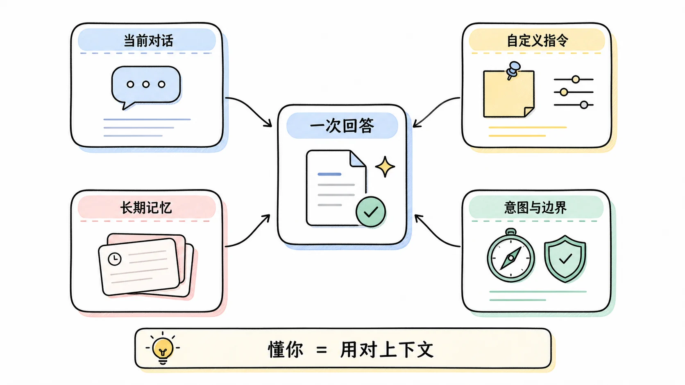
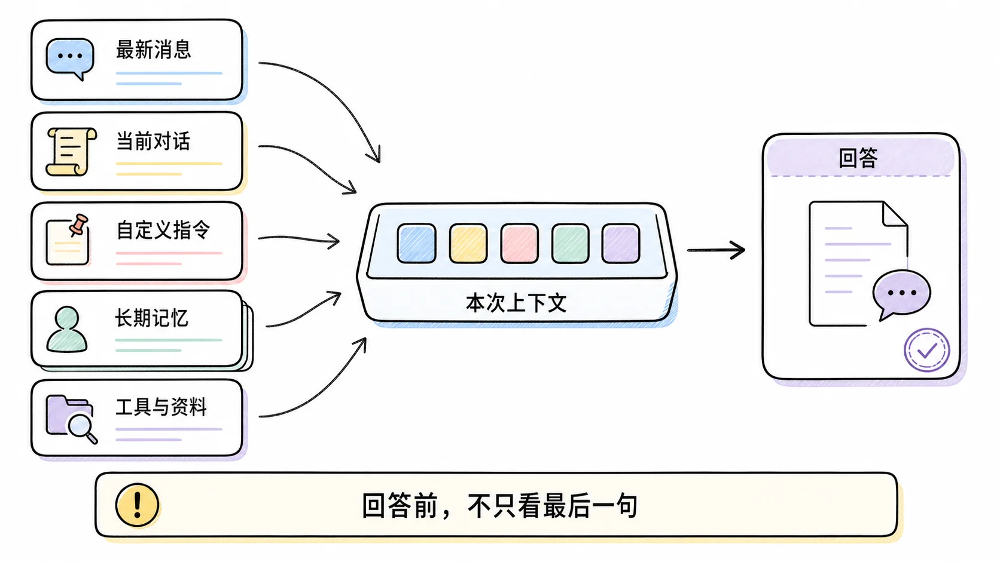
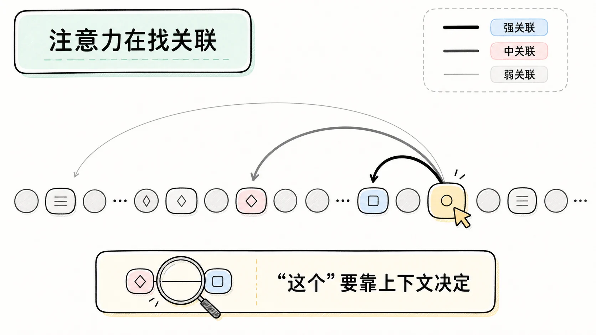
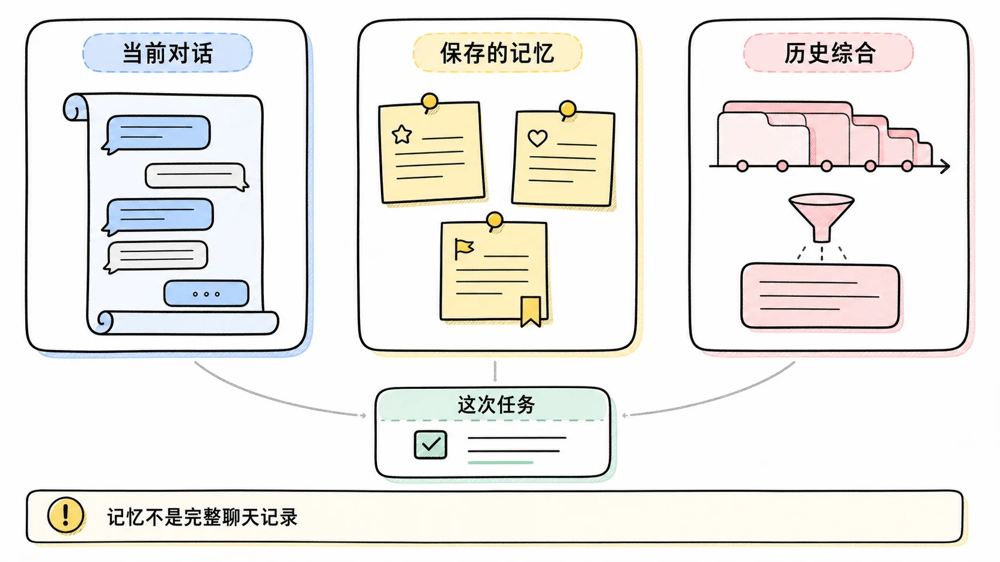
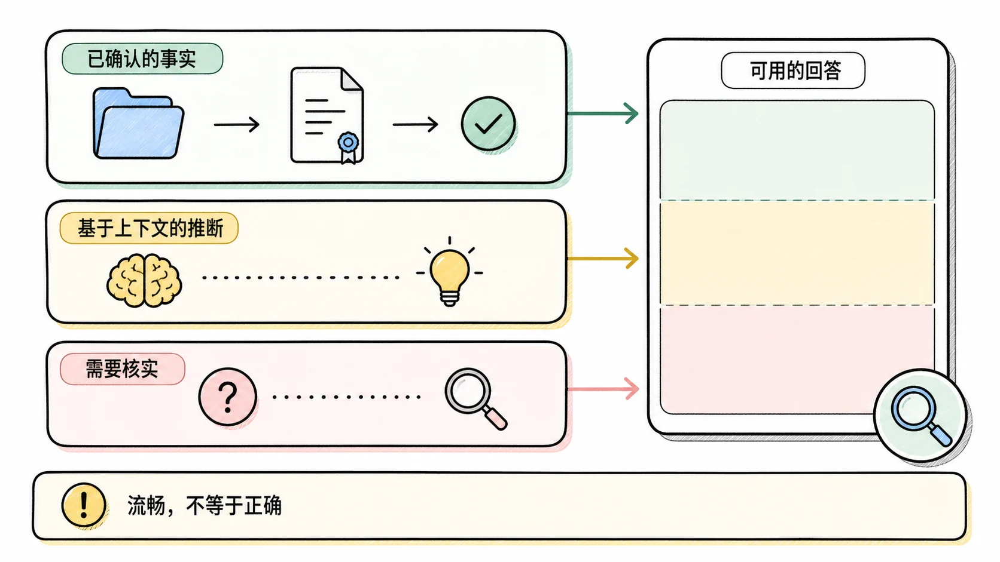
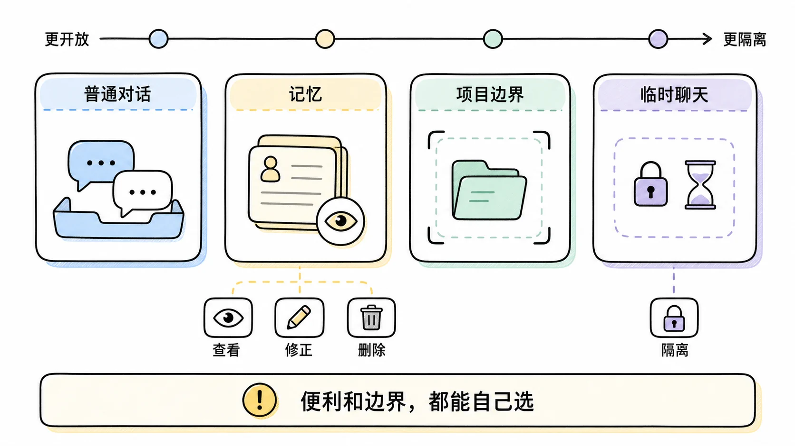
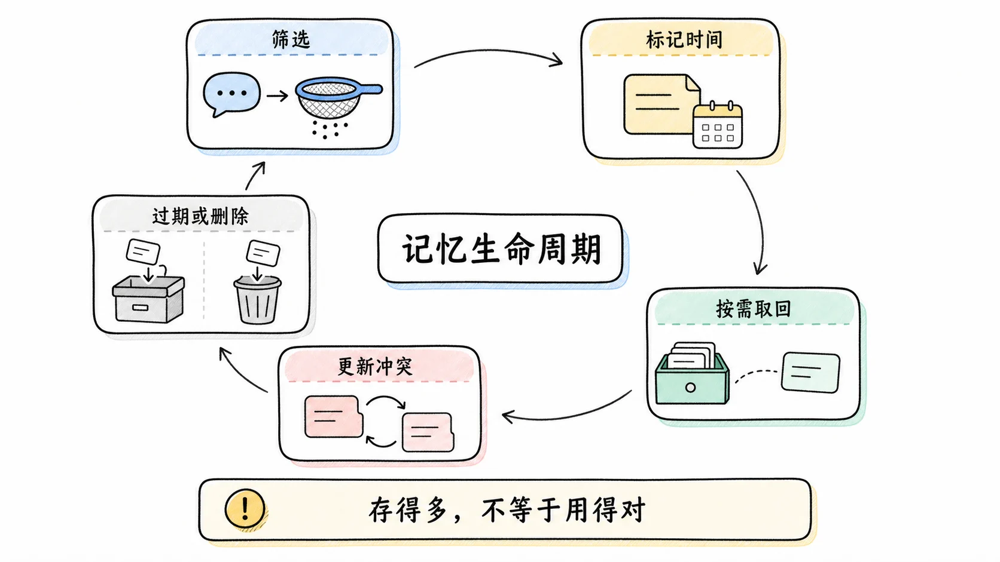
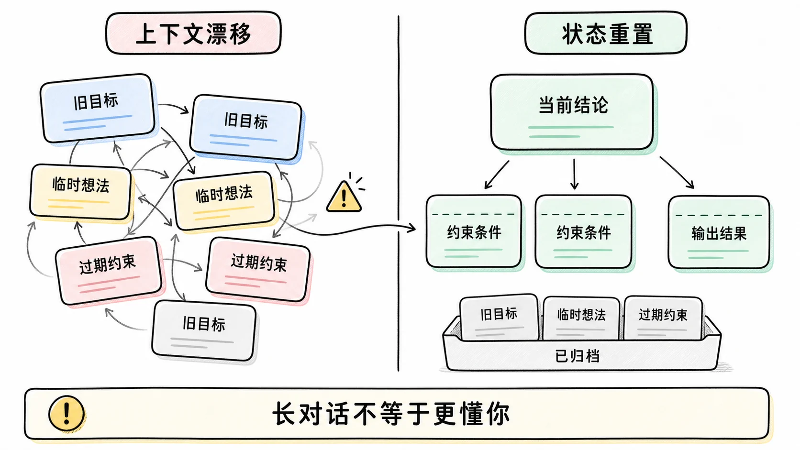
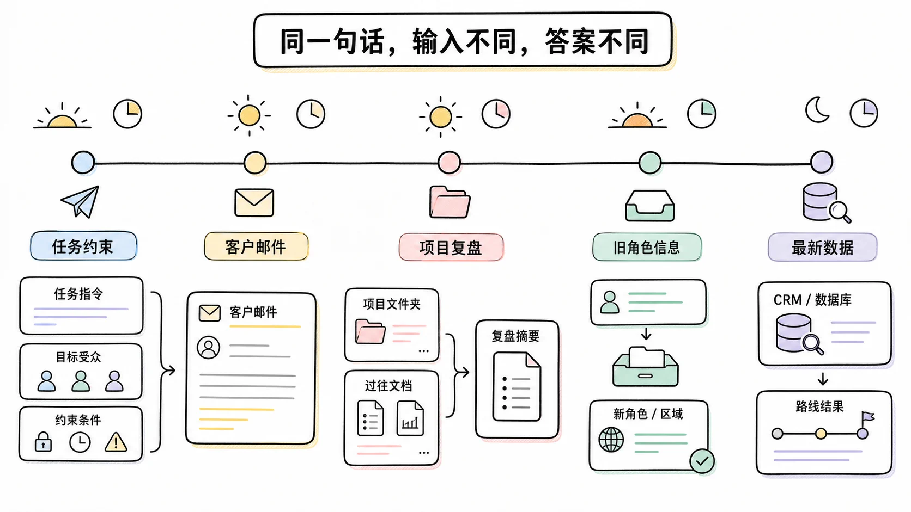
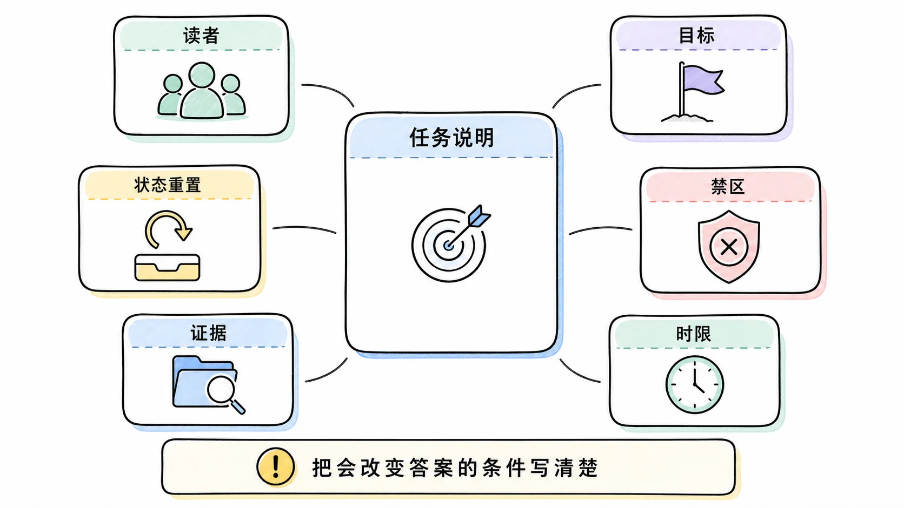

# 万字长文：ChatGPT 为什么像是懂你，它没有读心，却在持续拼一张可用的你

**TL;DR：** ChatGPT 的「懂你」不是一个神秘能力，而是一套产品系统产生的体验：它在当前对话里读取上下文，按记忆和自定义指令补充长期信息，用训练得到的语言模式猜测你的意图，并在系统规则允许的范围内组织回答。它并不读取你的内心，也不等于保存了完整的人生档案。它拿到的是一份会遗漏、会过时、还能被你关闭或修改的上下文。

很多人都有过一个很具体的瞬间。

你在一个新对话框里说：「帮我把这个方案改得短一点。」它没有追问方案是什么，直接把一份偏技术的文字压成了你平时喜欢的结构。你上个月提过不想看空泛的口号，它这次没有再写「赋能」「闭环」。你让它推荐旅行路线，它绕开了你讨厌的红眼航班和人挤人的景点。于是你会冒出一个很自然的念头：它怎么这么懂我？

这个感受是真的，机制却比「它记住了我」复杂得多。

如果把 ChatGPT 想成一个坐在你对面的朋友，很容易误解两件事。第一，它并没有像人一样在脑中保存关于你的连续生活。第二，它也不是一张空白的纸，只把你刚刚输入的字做机械检索。你看到的回答，是模型、对话上下文、记忆系统、自定义指令、工具、产品策略和安全规则一起算出来的结果。不同账户、不同地区、不同套餐、不同设置，拿到的能力和控制项都可能不同。

我想把这个问题讲得尽量朴素一点。先给一个不那么浪漫但更准确的说法：ChatGPT 不是「懂你这个人」，它是在每次回答前，努力拿到一份足够回答当前问题的「关于你和这件事的工作说明」。这份说明有时很准，所以像老熟人。有时混入了过期信息，所以会让人觉得它怎么还活在两个月前。

截至 2026 年 7 月，OpenAI 公开说明的 ChatGPT 记忆已经不只是一张由用户手工维护的便签。新系统会从过去聊天中持续综合上下文，用来保持偏好、项目和约束的连续性；但官方也明确说，记忆摘要不一定覆盖影响回答的全部信息。[OpenAI 的记忆 FAQ](https://help.openai.com/en/articles/8590148-memory-faq) 和 [关于记忆综合机制的说明](https://openai.com/index/chatgpt-memory-dreaming/) 都值得读一遍。下面的分析只依据这些公开资料和可解释的大语言模型机制，不把未公开的产品内部实现当作事实。

## 先把「懂」拆开，不然讨论会一直跑偏



日常语言里的「懂」，至少混了四种不同能力。

第一种是听懂眼前这句话。你说「这个再短一点」，ChatGPT 知道「这个」通常指上一条产物，「短一点」不是删掉所有细节，而是保留意思、收紧篇幅。这主要来自当前聊天里的文字。

第二种是知道你的稳定偏好。你经常要求中文、讨厌浮夸表达、写代码时希望先给结论、对餐厅有饮食限制。这些信息如果被记忆或自定义指令带入新对话，回答就会显得有延续性。

第三种是猜对这次任务真正要什么。你说「帮我看看」，可能不是想要逐句语法检查，而是想找逻辑漏洞、给出修改建议，或者判断能不能发。这一层不只靠字面，还靠模型从大量人类对话中学到的语境模式。

第四种是知道什么不能顺着你说。你让它写一个方案，它会受更高层的产品规则、安全边界和系统指令约束。它偶尔提醒风险、拒绝某类请求、保持某种格式，并不说明它「突然不懂你」，而是你的请求不是唯一输入。

把这四件事混成一个词，才会出现两个极端判断。一个极端是「它什么都知道」。另一个极端是「它不过是下一个词预测器，怎么可能理解」。前者把体验神化了，后者又忽略了现代语言模型和产品系统的实际能力。

更有用的问题是：在你按下发送键以后，系统到底给模型准备了哪些材料？

## 一次回答前，模型收到的并不只有你最后那句话



先看一个简化后的画面。它不是 OpenAI 的内部架构图，而是理解回答来源的工作模型：

```text
你的最新消息
        │
        ├── 当前对话中的相关内容
        ├── 自定义指令与账户设置
        ├── 已启用的记忆或历史摘要
        ├── 项目范围内的资料与规则（如果你在项目中工作）
        ├── 工具返回的资料（搜索、文件、连接器等，视功能而定）
        └── 系统级行为与安全规则
                    │
                    ▼
             语言模型生成回答
```

这张图最重要的地方不是每一条有没有出现在所有产品形态中，而是它把一个误会打散了：模型不会只盯着你最后输入的二十个字。它在一个上下文里工作。所谓上下文，可以粗略理解为「这次轮到模型说话前，系统放到它桌面上的材料」。

假设你前面说过：

> 我在给公司内部做 AI 培训，受众不是算法工程师。别写大而全的趋势判断，给我能直接讲给业务同事听的解释。

十轮以后你问：

> 解释一下 RAG。

如果那段话还在当前对话的有效上下文里，回答大概率不会从向量相似度和 ANN 索引开始。它可能先说：「把 RAG 当成考试开卷。模型先去找资料，再带着资料回答。」这不是它突然看见了你的职业履历，而是它用前面已经出现的约束改了答案的目标函数。

人类也会这样。你跟同事讨论方案时，前五分钟已经确认对方只关心成本，后面他说「这个行不行」，你不会把安全、性能、团队气氛各讲一遍。你会先回答成本。你并没有读心，只是在利用共同上下文。

ChatGPT 的「像懂你」首先就是这种共同上下文带来的省略能力。它知道哪些事不用重讲，哪些词在这个会话里已经有专门含义，哪些答案会浪费你的时间。

## 它怎么在一长串文字里抓住「这个」到底指什么



这里要碰到一个技术词：Transformer 的注意力机制。不要急着把它想成机器人在「注意」某件事。它更像一种计算方法，让模型在生成下一个词时，根据当前任务给前面不同位置的文字分配不同权重。

你问：「把第二版里那段关于合规的内容删掉，保留例子。」模型在生成回答时，需要同时照顾几个信息：有「第二版」这件事，第二版里有合规段落，有例子必须留，动作是删而不是重写。注意力机制让它能把眼前生成的每个位置，与前面序列里的许多位置建立关联。这个关联不是关键词搜索那样的单一匹配，而是经过多层计算后形成的表示。

用一个不严谨但顺手的比喻：桌上摊着十页会议记录，你现在要写「删除哪一段」。人类会先扫一遍，找到「第二版」「合规」「例子」这些线索，再把它们拼成一个操作。Transformer 做的不是用眼睛扫，而是把每个词变成很多维的数字表示，再计算哪些表示在这一步最相关。

这也解释了为什么它能处理「同一个词在不同语境里意思不同」。你说「苹果的发布会」，和说「苹果放冰箱」，字面上都有「苹果」，但周围词构成的关系完全不同。模型不是在词典里替「苹果」选一个固定释义，而是在整个句子、段落和对话中计算它这次更像什么。

不过，别把这个机制想成无限容量的记忆。上下文窗口再大，也仍然有限；更重要的是，「被放进去」不等于「每一段都被稳定使用」。对话越长，早期约束越可能被新信息盖住，多个相似任务会互相干扰，模糊指代会放大错误。你写了几十屏要求，最后说「按上面第三个来」，人都会找错，模型更可能找错。

所以长对话里那种「它刚刚还懂，怎么忽然变笨」并不神秘。可能是早期信息没有进入当前有效上下文，可能是它在多个候选指代中选错了，也可能是你自己在对话中改变了目标却没有明确说。产品是否会自动总结、怎样检索过去内容、哪些内容进入上下文，这些都影响最终体感。

## 语言模型会猜意图，这件事既方便，也埋着坑

模型会依据训练中学到的对话模式补全意图。你说「给客户回一下，别太硬」，它会推断出缓和但专业的语气；如果真正需要留证据，就必须明说。贴合来自合理补全，错误也常来自合理补全，所以受众、禁区、时间和用途等会改变答案的条件要写进请求。

## 为什么它会接住你的语气，甚至像是在安慰你

人对「被理解」的判断，很多时候不是来自事实本身，而是来自回应方式。

同样是「我搞砸了」，你可以回「错误已记录」，也可以回「听起来你现在很懊恼。先把发生的事分开看，哪一步已经无法挽回，哪一步还能补救」。后一种话没有读到对方的内心，却给了一个符合人类对话惯例的回应：先承接感受，再进入行动。

语言模型在训练文本和后训练反馈中学到大量这种对话模板。它能识别犹豫、沮丧、求证、炫耀、急迫、寻求许可这些语言信号，并选择看起来合适的表达。OpenAI 的公开 Model Spec 把「平易近人」列为默认行为目标之一，同时要求模型在帮助、用户控制和避免现实伤害之间做权衡。[公开说明](https://openai.com/index/sharing-the-latest-model-spec/) 也明确说，系统会用指令层级处理平台、开发者和用户之间的优先级。

这不意味着它「感受到了你的感受」。更准确的说法是，它能从你的表述中推断情绪和目标，并生成在人类交流习惯里常被视为恰当的回应。这个区别听起来有点冷，但很重要。

如果把它当成真的理解者，你可能会把它的肯定误读成独立判断，把它的共情误读成关系承诺。它可以帮助你梳理情绪、模拟不同视角、把难开口的话写出来。它不能代替一个知道你真实处境、会承担责任的人。尤其在医疗、法律、财务、危机支持和重大关系决定上，语言上的被理解感不等于结论可靠。

还有一个反面例子。模型如果过度顺着用户，什么都说「你说得对」，同样会让人觉得被理解。那其实是有害的。OpenAI 在 2025 年一次 GPT-4o 更新后撤回了出现过度迎合问题的版本，发布记录中直接把问题称为 sycophancy，也就是谄媚式迎合。[ChatGPT Release Notes](https://help.openai.com/en/articles/6825453-chatgpt-release-notes.html) 留有这个记录。一个真正有用的助手，有时应该说「这个前提不成立」或「这件事我无法确认」。

## 长期记忆不是聊天记录，也不是一个永远正确的档案库



跨聊天还「认识你」，是最容易让人把 ChatGPT 人格化的部分。先把三个东西分开：当前对话、保存的记忆、引用聊天历史。

当前对话最直观。你在同一个聊天窗口里刚刚说过什么，系统可以把相关内容带给模型。这种连续性不必依赖长期记忆。

保存的记忆更像少量可持续使用的事项。比如「我吃素」「我更喜欢简洁的回答」「我用 macOS」「我正在筹备十月的活动」。官方 FAQ 说明，这类保存的记忆与聊天记录分开存放；删掉某条聊天，不一定会自动删掉从中形成的保存记忆。你可以删除单条、清空、关闭记忆，或使用 Temporary Chat 来避免使用既有记忆并创建新记忆。[FAQ 的相应说明](https://help.openai.com/en/articles/8590148-memory-faq) 写得很直接。

引用聊天历史则不是一条条便签式记忆。官方在 2026 年的文章中把它描述为后台从许多对话里综合信息的过程，目标是让上下文更新、连续且相关。它解决的正是旧式记忆的两个问题：你不可能事事手工说「请记住」，而且单独保存的事实会老化、会互相矛盾。你去年说「我在准备马拉松」，后来又说「脚踝扭伤了」，系统若只把两条并列保存，给你的训练建议就可能出事。

这听起来很强，但应该先把期待降到正确位置。官方说的是「综合」和「相关」，不是「逐字重放全部历史」。记忆摘要只是你能查看和管理的高层视图，也不保证列出所有影响某次回答的因素。它更像一名助理在读过许多会议纪要后写的背景卡片，不是把每段录音一字不漏塞进桌面。

这个比喻也能解释几种常见故障。

你以前说过自己不喝咖啡，它今天又推荐咖啡馆。可能原因有很多：该偏好没有被保存，保存了但这次没被判定为相关，当前对话的新信息压过了它，或者记忆系统本身出错。不能从一次推荐推出「它根本没有记忆」，也不能从一次准确提及推出「它保存了我所有隐私」。

你搬家后，它还在给旧城市的建议。这里的问题不是模型有恶意，而是时间性。记忆一旦脱离时间线，事实很快变成旧事实。OpenAI 对新记忆架构强调「随时间更新」，举的例子正是把「七月要去新加坡」修正为「已经在 2026 年七月去过新加坡」。这说明产品团队也把陈旧记忆视为需要持续解决的问题，不是已经消失的问题。

你让它「忘掉那件事」，它回答「我会忘记」，但你仍然担心。正确做法不是只看对话中的一句承诺，而是检查设置里的 Memory Summary 或 Saved Memories，必要时删除相应记忆，并理解聊天记录和记忆是两套对象。临时聊天适合不希望被长期个性化的信息。涉及敏感内容时，默认少给，而不是先假定系统必然不会留下任何关联信息。

## 自定义指令和记忆，解决的是两类问题

很多人把「记忆」当作一切个性化的总称，结果设置越用越乱。自定义指令和记忆的职责其实不同。

自定义指令适合你明确、稳定、希望每次都生效的规则。比如：「默认用中文回答」「技术文章不要写营销腔」「给代码时说明运行环境」「我更在意风险而不是乐观预测」。这类信息是你主动写下的行为要求。官方 FAQ 的表述也很清楚：对于明确的信息或指令，可以放在 Custom Instructions；对话中自然出现、未来可能相关的细节，则可能由记忆处理。

记忆适合会随着生活和项目变化、又不值得每次重复的背景。比如你在做一个什么项目、你的饮食限制、常用的设备、正在准备的一场考试。它有价值，但也会过期。

当前对话适合本次任务的局部约束。你今天要给 CEO 写一页纸，明天要给工程师写设计说明。不要指望长期记忆自动替你区分这两种场景。你应该在当前请求里说清楚：「这次的读者是 CEO，少用术语，控制在 500 字。」

项目级上下文又是另一层。如果产品提供项目和项目内记忆，它更适合把一组相关聊天、文件和规则关在同一个边界里。OpenAI 的发布说明提到 project-only memory 可以引用同一项目的其他对话，同时不使用项目外的保存记忆塑造回答。这个设计很像给不同客户、不同代码库、不同课程准备不同工作空间。你不会希望给 A 客户写的报价习惯突然带到 B 客户的项目里。

把这几层配好，效果通常比不停追问「你记得我吗」好得多。稳定规则放自定义指令，长期但会变的背景交给记忆，任务细节写进当次消息，敏感或隔离任务用临时聊天或项目边界。这里没有神奇开关，只有把信息放在适合它生命周期的地方。

同一句话在不同账户里会得到不同回答，通常不必诉诸「人格」解释。聊天历史、记忆、自定义指令、项目资料、可用工具和系统规则不同，模型就会看到不同的上下文。涉及今天的日历、最新文件或价格时，贴合往往来自工具查到了一手资料，不是记忆。工具也扩大了权限和提示注入风险，因此时效性信息应查证，外部文本不能自动获得改变任务目标的资格。

## 它为什么有时会说得很像，结果却完全不对



这是理解 ChatGPT 的分水岭。它的语言能力很强，会让错误答案也具有很高的可读性。

模型生成回答时，目标不是在内部数据库里找到唯一真相再复制出来，而是根据上下文和训练出的概率结构生成一个看起来最合适的序列。它能把语言组织得连贯，能引用像真的术语，能补出一个完整解释。可「完整」和「正确」是两件事。

当事实缺失、上下文含糊、问题要求精确但没有工具核验，模型可能会用听起来合理的内容填补空位。这就是人们常说的幻觉。它并不一定是在有意识地撒谎。很多时候是系统没有足够证据，却仍然被要求给出一个流畅回答。

「懂你」还会放大这个风险。因为它知道你偏好简洁，它可能给出一个简短但遗漏限定条件的结论。因为它知道你在赶时间，它可能少问一个本该问的澄清问题。因为它学会了安慰，它可能先认可你的判断，再去补论证。你感到顺滑，未必意味着过程足够严谨。

对高风险任务，最好的交互方式是明确要求证据和不确定性。例如：

> 请把事实、推断和待核实事项分开写。没有来源就标明无法确认。不要用常识补全缺失的日期和数字。

或者：

> 先列出你做这个判断依赖的三条前提。只要有一条不成立，就给出替代结论。

这样的提示不是降低模型的自由度，而是把「像人一样顺着说」改成「像审阅者一样暴露依据」。对于合同、药物、投资、政策、生产变更、权限配置，这种改法通常比让它「更贴心」重要。

## 它会不会把我的每句话都记住



不能这样假定。

从产品角度，当前对话、聊天历史、保存记忆和临时聊天有不同的处理方式。官方 FAQ 明确提醒：敏感信息可能会出现在记忆中，如果不希望某个聊天的信息用于个性化，应关闭记忆或使用 Temporary Chat。FAQ 同时说明，保存记忆与聊天记录相互独立，删掉聊天不必然删除由它产生的保存记忆，删除的保存记忆日志可能为安全和调试保留最长 30 天。

这些说明给出的不是一句「绝对安全」或「绝对危险」，而是一套需要你主动配置的边界。你应该把它当成一个会处理你输入的信息系统，而不是私下聊天的朋友。

有几条实操建议值得坚持。

不要把密码、私钥、完整身份证号、未脱敏客户数据、生产环境密钥贴进普通对话。即使你只是想让它帮你排查配置，也应先替换敏感值。

处理个人健康、家庭关系、职场冲突时，先判断你要的是哪种帮助。如果你只需要整理想法，尽量给抽象后的情境，不要上传整段包含第三方隐私的聊天记录。如果你确实需要细节，检查记忆、聊天和数据控制设置，并清楚你所在的是个人账户、团队账户还是组织管理环境。

定期查看记忆摘要或保存记忆。不是为了恐慌，而是为了发现过期或不希望存在的背景。你改了城市、换了岗位、结束了项目，旧信息不该继续主导新回答。

不要把「它提到了一个我没说过的细节」立刻解释为监控。先检查当前对话、以前聊天、记忆、自定义指令、项目资料和连接器授权。很多「它怎么知道」都能在这些输入来源里找到解释。反过来，如果无法解释，也不要凭感觉猜系统机制，应该查看产品的可用控制项和官方说明。

把 ChatGPT 当成维护任务状态的会话式程序，比当成一个拥有完整人格的对象更准确。它处理的是当前任务、已有事实、偏好、限制、工具结果和上层规则。它忘了文件结论，先检查附件和当前对话；跨聊天总用错语言，检查自定义指令和记忆；把旧项目带进来，就更新或删除旧背景。

文本进入模型后会被切成 token，并在上下文中形成会变化的数值表示。它能从「周会又把我的方案砍了」推断出受挫语境，却没有真实经历会议或组织关系。它擅长处理写进材料里的结构和表达，无法看见你没有说明的制度、关系和后果。会改变结论的条件必须写出来，例如「法务还没审，邮件不能写成已批准」。

## 为什么记忆不是多存一点就更好：取回什么，比存下什么更难



很多人第一次设计长期记忆，都会做一个朴素方案：把用户每句话都存库里，下一次按相似度检索几条，再塞回提示词。它能跑，也能做出一些令人惊喜的演示，但很快会遇到真正麻烦的部分。

第一个麻烦是相关性。你以前说过喜欢安静的餐厅，也说过不喝咖啡，还说过在学 Rust。现在你问「帮我审一段数据库迁移脚本」。哪条记忆该出现？如果系统把「喜欢安静餐厅」也带进来，模型可能不受影响，也可能被无关信息拖慢，甚至开始写很奇怪的比喻。长期记忆不是越多越好，而是要在当前任务里挑出真正影响决策的那几条。

第二个麻烦是冲突。用户不是静态配置文件。你去年偏爱短回答，最近开始准备一门课程，需要逐步解释。你以前在北京，现在在杭州。你此前说过不吃辣，后来又说最近可以吃微辣。把每一条都当成永恒事实，系统一定会自相矛盾。

第三个麻烦是粒度。记住「用户喜欢技术内容直接切入问题」可能很有用。把一次临时抱怨「今天别写太长」固化为长期风格，下一周它就可能持续过度简略。记忆项过粗，容易误伤许多场景。记忆项过细，数量会膨胀，检索和更新都变难。

第四个麻烦是来源。某条信息是用户明确告诉系统的，还是模型从一段闲聊里推测的？是你自己的事实，还是你转述的朋友经历？是聊天里随口举的例子，还是当前政策？来源不同，可信度和使用范围都不同。把「我朋友在深圳」存成「用户住在深圳」，就是典型的上下文归因错误。

第五个麻烦是时间。很多信息天生带有效期。你说「下周去广州」，下周过去后应当自动失效。你说「公司今年预算冻结」，到明年可能完全不成立。记忆若没有时间戳、更新机制和过期策略，会变成旧信息制造器。

因此，任何成熟的记忆系统都不是单纯的数据库问题，而是一个选择问题。系统至少要判断：这条信息值不值得留？它是谁的？何时成立？什么场景能用？与新信息冲突时怎么办？用户如何查看、纠正和删除？OpenAI 对记忆的公开叙述里反复出现 freshness、continuity、relevance，也就是新鲜度、连续性和相关性。它们不是宣传词，而是长期个性化必须面对的三种工程约束。

对于外部读者，我们不能根据公开文章推断 ChatGPT 内部每一个检索器、排序器或数据表的细节。不过可以用一个通用的工程流程理解它的难题：

```text
用户说了一句话
        │
        ├── 判断里面是否有值得长期保留的稳定信息
        ├── 给信息标记来源、时间、范围和可能的置信度
        ├── 与已有信息合并、更新、降权或保留冲突
        └── 下次任务开始时，只取回会改变当前答案的部分
```

这个流程看似简单，真正难处都在判断上。比如「我下个月去东京」到底是要记到下个月，还是要一直记？「我讨厌表格」是长期写作偏好，还是他今天赶时间？「把这段话改得像张总会接受的语气」中的张总是一个人名、一个角色，还是一个内部代号？这些问题不可能只用关键词解决。

现实中，相关性判断也会造成一种有趣的体验差异。系统拿对了记忆，你觉得它很懂。系统为了保护上下文，不拿一条可能相关的记忆，你觉得它忘了你。系统拿错了记忆，你会觉得它过界。个性化产品不是把记忆准确率做到一个百分比就结束，而是要让用户能看见、能纠正、能决定何时不要个性化。

## 一个长对话是怎样慢慢失控的



假设你用同一个窗口连续两周做内容策划。第一天，你让 ChatGPT 帮你分析一个面向开发者的产品。第三天，你让它写一篇面向老板的预算说明。第五天，你贴进一份客户反馈。第八天，你让它帮忙想一个公众号标题。第十二天，你问：「按之前的风格重写这一段。」

「之前的风格」在这段对话里至少有四个候选：开发者文章的直接、预算说明的克制、客户回复的缓和、公众号标题的口语。人类如果全程参与，也会问一句「你指哪一篇」。模型若选对，显得聪明；若直接沿用最近一次风格，可能很合理；若把客户回复的缓和带到预算说明里，又会让你觉得它没抓住重点。

长对话还有一个问题：任务状态不断漂移。你最初要的是「帮我想方向」，后来变成「给我一个目录」，再后来变成「根据数据改第一节」。如果每一步没有收束成明确产物，模型只能从散乱文本推断现在在哪个阶段。它会把已经废弃的方向当成仍有效的约束，也可能把你随口讨论的备选方案误认成最终决定。

这不是要求所有人都写项目管理文档。一个很小的状态重置就够了。每到关键节点，发一条像这样的消息：

> 当前结论：我们选 B 方向，目标读者改为新客户。A 方向和上周的数据不再使用。接下来只写开头 800 字，不要生成目录。

这相当于帮系统压缩会话状态。你把不再需要的信息明确作废，把现在生效的约束排到前面。对人类同事也一样有效。

如果任务真的很长，最好按工作流拆开，而不是把所有材料永久堆在一个聊天窗口里。一个窗口专门做资料判断，一个窗口写初稿，一个窗口审事实和链接。每个窗口开头带一段必要背景，成本看似高一点，返工通常少很多。项目功能、文件和可控记忆可以降低重复成本，但它们不替代清晰的任务边界。

开发者可以把这个现象叫作上下文管理。普通用户不必记住这个术语，只要记住一件事：聊天越长，不代表系统越了解你。长对话同时也装进了更多过期目标、试探性想法和不再适用的口头约定。

个性化不能变成迎合。你喜欢短回答，不代表它该省掉价格、政策或风险的来源；你希望被支持，也不代表它该顺着错误前提说。遇到重要判断，可以要求它同时写出反例、前提和待核实项。做助手的人则应把记忆设计成带来源、时间、权限和删除入口的状态，而不是一份越积越长的用户档案。

## 看一个完整场景：同一句「帮我写一下」，为什么会得到完全不同的结果



把前面的概念放进一个普通工作日，比较容易看出「懂你」到底在哪儿发生。

假设小周在一家软件公司做产品运营。上午九点，他打开一个长期使用的 ChatGPT 账户，输入：「帮我写一下新功能通知。」如果系统只拿到这一句话，最合理的回答只能是一份通用模板：有标题、有功能简介、有生效时间、有反馈入口。它不知道通知发给谁，不知道功能是否已经正式上线，也不知道小周公司内部习惯用什么语气。

小周补了一句：「发给全体销售。功能还在灰度，不能写成全量发布。重点是减少重复录入，别讲模型原理。」现在模型有了当前任务的关键状态。它会把「灰度」转成措辞限制，把「全体销售」转成非技术受众，把「减少重复录入」放进价值描述，把「别讲模型原理」作为删除条件。这个回答显得懂小周，其实主要是小周给的信息足够完整。

如果小周的自定义指令里还写着「默认中文，内部通知少用感叹号，避免‘赋能’‘重磅’‘颠覆’」，风格会进一步稳定。这不是模型从过去聊天里猜出来的，是显式规则在起作用。它应该比一条偶然形成的长期记忆更可靠。

下午，小周在另一个聊天里问：「帮我把这封客户邮件压到 150 字。」这时系统即使知道他上午在写销售通知，也不该把「灰度」和「重复录入」自动带过来。两件事不一定有关。真正好的个性化不是见到用户就把所有背景倾倒出来，而是知道哪些背景应该保持沉默。

晚上，小周问：「上次那个活动复盘，给我换一个更适合老板看的开头。」这里如果是同一个项目，项目里的资料和聊天历史能帮上忙。系统可以知道「上次那个」指哪份复盘，知道老板更关心预算、转化和风险，不关心执行细节。它可能先给出一句围绕结果的开头，而不是重新解释活动流程。这里的贴合来自历史和项目边界。

第二天，小周突然调岗，开始负责华东区域。他问：「给我推荐下周拜访客户的城市顺序。」如果记忆还把他当成原来的全国角色，答案可能把不相关城市也排进去。此时历史记忆反而成了干扰。小周最好直接写：「我现在只负责华东，原来的全国职责已经结束。」然后去更新或删除过期的长期信息。系统若能依据新消息修正未来回答，个性化才是有用的。

再加一个工具条件。小周说：「根据最新 CRM 里的客户阶段，给我排拜访顺序。」没有 CRM 连接器时，ChatGPT 只能要求他粘贴数据，或者给一个排序框架。它不应该凭记忆编出客户状态。有了经过授权的 CRM 查询工具，它才可能读取当前数据，按阶段、金额、续约日期和地理位置排出路线。这里看上去像「它很懂我的业务」，其实很大一部分来自拿到了最新事实。

同一个人、同一句「帮我写一下」，在不同输入条件下能得到五种完全不同的行为：

- 只有一句请求时，它只能给通用模板。
- 有明确任务约束时，它能针对当前目标写。
- 有自定义指令时，语气和格式更稳定。
- 有相关历史或项目资料时，它能少问重复问题。
- 有授权工具和最新数据时，它能把建议落到现实材料上。

反过来，这五层也对应五种故障。通用模板太空，通常是当前任务信息不够。语气总不对，先查自定义指令。总把旧事带进来，查记忆和项目隔离。业务数据过期，不能靠记忆补，要查工具和来源。即使所有上下文都对，事实仍可能出错，那就回到证据和人工复核。

这个例子里没有任何一步需要把模型当成会读心的同事。小周做的是把正确的信息放进正确层，把不该延续的信息清出去。模型做的是根据这些输入生成最符合当前目标的文字或建议。体验好时，两边配合得像默契。体验差时，通常也能在这条链路上找到具体断点。

## 想让它更懂你，可以这样写上下文



很多提示词技巧把重点放在神秘模板上。更有效的做法其实很朴素：把会改变答案的事实放到模型能可靠看到的位置。

一个短任务可以这样写：

> 我需要把下面这段产品更新改成发给客户的邮件。客户是采购负责人，不懂技术。不要承诺上线日期，不要出现「AI 驱动」这类词。控制在 250 字以内，结尾保留一个明确的下一步。

它之所以容易得到好结果，不是因为这段话用了什么咒语，而是因为目标、读者、禁区、长度和交付格式都明确了。模型不用猜「客户是谁」「短是多少」「什么语气算好」。

一个长期协作任务，可以先给一张小型背景卡：

> 项目背景：我们在改一个面向内部员工的知识库。主要读者是运营同学。当前优先级是减少误答，不追求回答最长。输出中把「已确认」「需要补资料」「不建议自动化」分开。除非我明确要求，不要改变数据权限设计。

这段背景适合放在项目规则、自定义指令，或者每次重要任务开头。它比「记住我喜欢专业一点」更可执行，因为它告诉模型何时该如何取舍。

遇到你不希望它猜的地方，直接规定追问条件：

> 缺少日期、预算、受众或法律辖区时，先问我，不要自行假设。

遇到需要核验的地方，规定证据标准：

> 涉及价格、政策、生效时间和产品功能时，只引用可访问的官方来源，并附链接。查不到就写查不到。

遇到你担心旧背景干扰的地方，主动重置：

> 这次不使用我过去的项目背景。把它当成一个新的独立任务处理。

最后，给它纠错时不要只说「不对」。说清是事实错、方向错、语气错，还是上下文用错。比如：「你还在用我去年在上海的记忆，但我已经搬到杭州。先把地点更新为杭州，再推荐。」这种反馈能让当前任务立即回正，也帮助你定位该去改哪一层设置。

## 别把记忆开关当作人格开关

有人关闭记忆后觉得 ChatGPT「变陌生了」，有人打开记忆后觉得它「太像在盯着我」。这两个感受都合理，因为个性化的本质就是在便利与边界之间取舍。

记忆打开时，你少重复介绍自己，长期任务更连贯，推荐会更贴合约束。代价是系统可能携带你不想在此刻被带入的背景，也需要处理陈旧和错误信息。

记忆关闭或使用临时聊天时，你获得更强的任务隔离感。代价是每个重要任务都要重新提供背景，模型也更容易给出通用答案。

没有哪个设置适合所有人。更合理的用法是按任务分类。日常学习、长期写作、个人效率工具，记忆能省很多重复。涉及敏感咨询、一次性工作、不同客户之间需要隔离的材料，临时聊天或项目边界更合适。企业场景还要把组织的数据政策放在个人便利之前。

这也是为什么产品设计里「让用户查看、修正、关闭、删除」比「让系统记得更多」更重要。一个会出错的个性化系统，如果没有纠错入口，只会积累困扰。OpenAI 新的记忆说明强调可查看的记忆摘要和可更新、可忽略的信息，这至少说明可控性被当成产品的一部分，而不是记忆功能旁边可有可无的设置。

## 那它到底懂不懂你

如果你问的是「它是否拥有和人一样、带经历和责任的理解」，答案是否定的。它没有你的生活经验，也不能验证自己从你话里猜出的那些隐含前提。它的共情是语言上的适配，不是主观感受。

如果你问的是「它能否在合适的上下文、记忆、指令和工具支持下，持续做出贴合我偏好与任务约束的回答」，答案是肯定的，而且这种能力已经足以改变很多日常工作。你不必每次从头解释身份、口味和项目背景。它能把一段散乱的需求接成一个能执行的任务，也能在你明确要求时把风险和前提摆出来。

两种说法之间并不矛盾。前者提醒我们别把语言流畅当成心智证据，后者提醒我们别因为它不是人就忽略它在实际协作里的价值。

我更愿意把它看成一面不断更新的工作白板。你写进去的目标、限制和偏好越清楚，白板越干净，系统就越容易给出贴合的答案。白板上的旧字不擦，它也会照着旧字做事。你让它把猜测当事实写下，它会把错误写得很像事实。你要求它给出依据、标记不确定、在关键处查证，它也能成为一个更可靠的协作对象。

下一次当它给出一句特别贴心的话，不妨停半秒，问两个问题：它这次到底看到了哪些关于我的材料？它给出的贴合，是来自事实、记忆，还是一次听起来很顺的猜测？能分清这两件事，你就既能享受它的便利，也不会把判断权悄悄交出去。

## 延伸阅读

- [OpenAI：Dreaming，ChatGPT 如何综合记忆](https://openai.com/index/chatgpt-memory-dreaming/)
- [OpenAI Help Center：Memory FAQ](https://help.openai.com/en/articles/8590148-memory-faq)
- [OpenAI：GPT-5 System Card](https://openai.com/index/gpt-5-system-card/)
- [OpenAI：Sharing the latest Model Spec](https://openai.com/index/sharing-the-latest-model-spec/)
- [OpenAI Help Center：ChatGPT Release Notes](https://help.openai.com/en/articles/6825453-chatgpt-release-notes.html)
