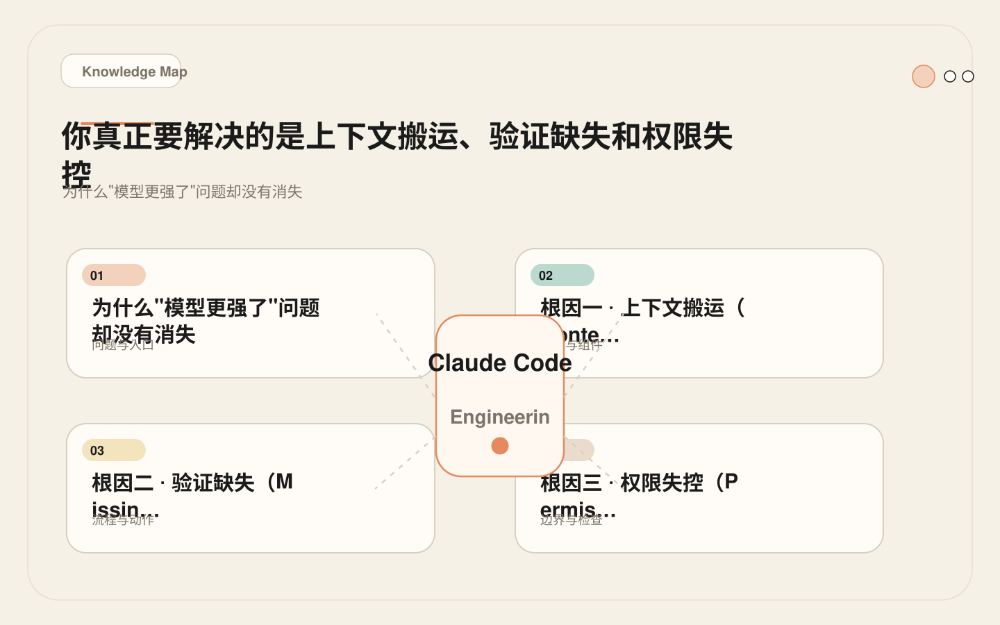
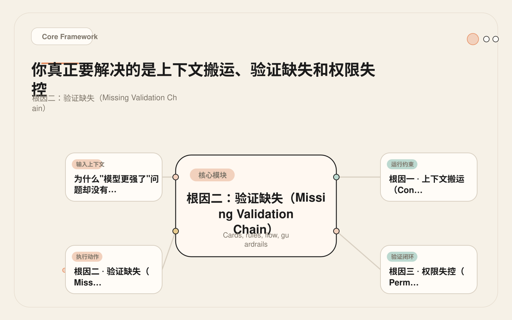
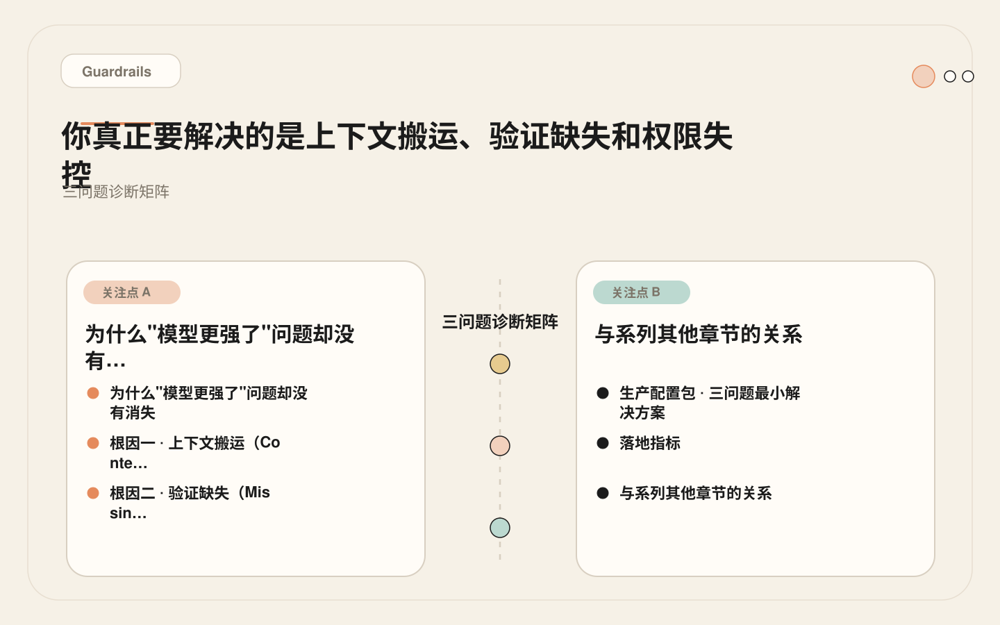
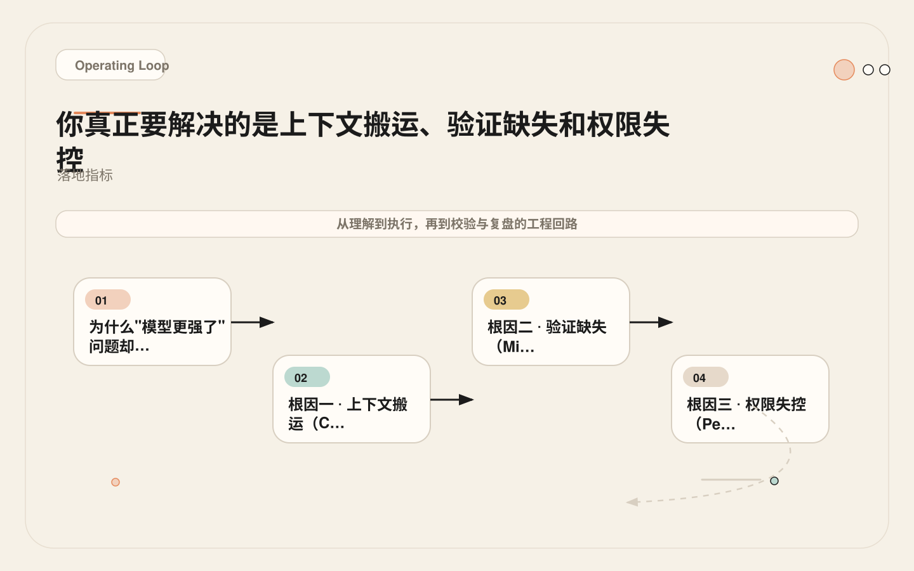

# 上下文、验证、权限：Claude Code 工程化绕不开的三道坎

<!-- codex:cover ../../../assets/claude-code-engineering/01-context-validation-permission-cover.webp -->

<!-- /codex:cover -->

**TL;DR：** AI Coding 在真实项目中的失败，几乎不是模型能力不足，而是三个工程问题的叠加：上下文不完整导致误判、生成结果缺乏验证链路、权限边界过宽导致事故半径扩大。Claude Code 工程化的起点，是把这三个问题显式化并配好对应机制。

## 为什么"模型更强了"问题却没有消失

Claude Sonnet 4 的代码生成能力已经足够处理大多数业务场景——给定清晰需求，生成单文件函数、组件、接口实现的正确率已经很高。但团队把 AI 接入真实工程流程后，遇到的问题几乎不在生成环节，而在工程适配环节：

<!-- codex:illustration 01-context-validation-permission/01-overview-knowledge-map.svg -->

<!-- /codex:illustration -->

- AI 改了不该改的文件，且自己认为这是合理的。
- AI 提交的代码在 CI 里挂了，而本地明明可以跑——因为它压根没在本地跑。
- AI 每次会话都要重新问项目结构、测试命令、分支策略，仿佛上一轮对话从未发生。
- AI 一次"修复"引入了两个回归，而这两个回归本应被测试拦截。

这些问题指向三个根因：上下文搬运、验证缺失、权限失控。它们不是独立的 bug，而是相互放大的系统性风险。上下文不完整导致 AI 改错文件，改错文件又因为缺乏验证而流入 CI，权限失控则让这个链条无法被提前阻断。三者构成一条因果链：信息缺失引发误操作，误操作逃过验证，逃过验证的误操作因权限过宽而直达生产。

这三个根因在个人项目中表现为"不太方便"，在团队工程中则表现为质量事故。下面的诊断框架用于判断你的团队在哪个环节有债务，以及债务有多重。每个根因都附带了诊断方法、量化阈值和对应的修复机制。

## 根因一：上下文搬运（Context Shuttling）

### 诊断框架

上下文搬运问题在以下信号出现时可以确认：

| 信号 | 诊断方法 | 严重度阈值 |
|------|---------|-----------|
| Claude Code 反复询问项目结构 | 统计每会话重复提问次数 | > 2 次/会话 |
| Claude Code 找不到测试或构建命令 | 记录"unknown command"响应 | > 1 次/会话 |
| Claude Code 编辑了预期范围外的文件 | 审查 diff 中的非预期文件比例 | > 10% 的编辑 |
| Claude Code 误解模块边界（改了 B 包却以为是 A 包） | 代码审查中的边界误判次数 | > 1 次/周 |

这四个信号的共同特征是：Claude Code 拥有文件系统访问权，但没有关于"这个项目怎么组织"的持久知识。它在每次会话中重新构建对项目的理解，而这个重建过程既不可靠也不一致。一个资深工程师会凭经验知道"这个项目的 API 层不直接访问数据库"，但 Claude Code 没有这个经验——除非你显式写给它。

上下文搬运这个说法来自早期的 AI 编程模式：开发者把代码片段从编辑器复制到聊天窗口，再把生成结果复制回来。Claude Code 虽然能直接读写文件系统，但如果它缺乏项目级的结构知识，本质上仍然在做搬运——只不过搬运的媒介从剪贴板变成了工具调用。它读到什么就用什么，读不到的就猜。

### 机制映射

Claude Code 提供三个层级的上下文注入机制，分别解决不同粒度的知识缺失：

| 机制 | 作用 | 加载时机 | 适合承载的内容 |
|------|------|---------|--------------|
| `CLAUDE.md` | 项目级常驻事实 | 每次会话自动加载 | 技术栈、命令、架构边界、安全限制 |
| `.claude/rules/*.md` | 路径级上下文 | 编辑匹配路径的文件时加载 | 包级测试命令、目录级风格规则、模块级边界 |
| Auto memory | 累积偏好和纠偏 | 自动 | 用户习惯、修正记录、历史决策 |

很多团队只用 CLAUDE.md，甚至 CLAUDE.md 也是空的。这等价于让一个新员工每次打开项目都从零理解仓库——而且这个"新员工"不会主动翻文档、不会问同事、不会从历史提交中学习。更准确地说，CLAUDE.md 的作用不是"教会 AI 理解项目"，而是"把 AI 必须知道的信息预先放到它能读到的位置"。

三个机制各有适用场景，也有各自的局限。CLAUDE.md 的局限是信息量和注意力竞争：写得太长会被稀释，写得太短又覆盖不了边界情况。Rules 的局限是只能按路径匹配，对跨模块的规则无能为力。Auto memory 的局限是不透明：你知道它存了东西，但不确定存了什么、是否过期。实际使用中三者互补——CLAUDE.md 覆盖全局规则，Rules 覆盖路径级特例，Auto memory 处理偏好类信息。

### 真实配置：Next.js + Prisma Monorepo

以下是一份解决上下文搬运的 CLAUDE.md，来自一个 `apps/web` + `apps/api` + `packages/db` 的 monorepo：

```markdown
# CLAUDE.md

## Project
Monorepo: apps/web (Next.js 14 App Router), apps/api (Hono), packages/db (Prisma).
Package manager: pnpm. Node >= 20.

## Commands
- Install: pnpm install
- Build all: pnpm -r build
- Test all: pnpm -r test
- Test single package: pnpm --filter @acme/web test
- Typecheck all: pnpm -r typecheck
- DB migrate: pnpm --filter @acme/db prisma migrate dev
- DB generate: pnpm --filter @acme/db prisma generate
- Lint: pnpm -r lint

## Architecture
- apps/web → UI only. No direct DB access. All data through apps/api.
- apps/api → REST endpoints. Uses @acme/db for data. Validates with Zod schemas.
- packages/db → Prisma schema, client, migrations. Single source of truth for data model.
- packages/shared → Shared types and Zod schemas between web and api.

## Module Boundaries
- Do NOT import from apps/api in apps/web directly. Use fetch/http calls.
- Do NOT edit packages/db/prisma/schema.prisma without explicit instruction.
- UI components go in apps/web/src/components/. Shared components go in packages/ui.
- API route handlers are in apps/api/src/routes/. Each file = one resource.

## Safety
- Do not edit .env* files.
- Do not run prisma migrate push or prisma db push.
- Do not modify lockfile manually.
- Ask before changing any file in packages/db/prisma/migrations/.

## Verification
- After editing apps/web: run pnpm --filter @acme/web typecheck && pnpm --filter @acme/web test
- After editing apps/api: run pnpm --filter @acme/api typecheck && pnpm --filter @acme/api test
- After editing packages/db: run pnpm --filter @acme/db test
- If you change a Zod schema in packages/shared, run typecheck on both apps/web and apps/api.
```

同时，为 `packages/db` 添加路径级规则文件 `.claude/rules/db-package.md`：

```markdown
---
paths:
  - "packages/db/**"
---

# DB Package Rules

- This package owns the Prisma schema. Schema changes require a migration.
- After editing schema.prisma, run: pnpm --filter @acme/db prisma generate
- Never use prisma db push in this project. Always use prisma migrate dev.
- The generated client in node_modules/.prisma is auto-generated. Do not edit.
```

这份配置的信息密度是经过取舍的：不写 README 里已有的背景介绍，只写会影响 AI 行为的操作规则。

### 失败案例：一次 3 文件编辑本应是 1 文件

**场景**：团队让 Claude Code 在 `apps/api` 中新增一个 `/users/:id/preferences` 端点。

**实际发生**：
1. Claude Code 在 `apps/api/src/routes/users.ts` 添加了路由处理——正确。
2. Claude Code 在 `apps/web/src/lib/api.ts` 添加了对应的客户端调用——多余，这次任务只要求后端。
3. Claude Code 在 `packages/shared/src/schemas.ts` 添加了一个新的 Zod schema——合理但未被告知，且 schema 命名与既有约定不一致。

**根因分析**：仓库没有 CLAUDE.md，没有 rules。Claude Code 不知道 `apps/api` 的任务不应该动 `apps/web`，也不知道 `packages/shared` 的 schema 有命名约定（PascalCase + 后缀 Schema）。它按照"完成任务"的最短路径行动，而"最短路径"在缺乏边界信息时等于"能改的都改"。

**修复**：添加上述 CLAUDE.md，其中 `Module Boundaries` 部分明确写了"本次任务只涉及 apps/api 时不要修改 apps/web"。添加 `.claude/rules/api-package.md` 说明 API 路由的改动边界。修复后复测同类任务，Claude Code 只修改了 `apps/api` 下的文件。

## 根因二：验证缺失（Missing Validation Chain）

### 诊断框架

<!-- codex:illustration 01-context-validation-permission/02-framework-core-structure.svg -->

<!-- /codex:illustration -->

| 信号 | 诊断方法 | 严重度阈值 |
|------|---------|-----------|
| Claude Code 提交的代码在 CI 失败 | 统计 Claude Code 提交的 CI 失败率 | > 15% |
| Claude Code 完成修改后没有运行测试 | 统计"Did you run tests?"人工提醒频率 | > 2 次/会话 |
| 类型错误在 CI 才被发现 | 记录 CI 类型错误中本地可复现的比例 | > 30% |
| Bug 修复没有验证是否真的修复 | 审查"fix"提交中无测试变更的比例 | > 50% |
| API 契约变更没有更新消费方 | 记录因未更新消费方导致的集成失败 | > 1 次/月 |

验证缺失的本质是：AI 的"完成"定义和工程的"完成"定义之间存在鸿沟。AI 认为代码写完了就完成了——文件已保存，语法正确，逻辑通顺。但工程要求代码通过了测试、类型检查、格式化、契约验证才算完成。这个定义差异不是提示词能弥合的，因为你不可能在每次对话中都精确地提醒 AI "跑哪些测试、按什么顺序、期望什么输出"。

更深一层看，验证缺失不只是"AI 忘了跑测试"。它是一个链路问题：修改发生后的每一个验证步骤都应该自动串联，而不是依赖人类或 AI 的自觉。这个链路包括格式化、类型检查、单元测试、集成测试、契约验证、diff 审查。缺少任何一环都可能导致错误逃逸。在人类开发流程中，这些步骤由 IDE 插件、pre-commit hook、CI 流水线共同保障。AI 编程需要同等甚至更严格的自动化保障，因为 AI 的输出频率更高、审查间隔更长。

### 机制映射

| 机制 | 验证时机 | 适合承载的验证 |
|------|---------|--------------|
| CLAUDE.md `Verification` 段 | AI 自主执行（非强制） | 提醒应该跑什么命令 |
| `PostToolUse` Hook | 每次文件编辑后自动触发 | 注入验证提醒、触发格式化 |
| `Stop` Hook | 会话结束时 | 输出验证报告、标记未验证项 |
| CI | 提交后 | 最终兜底 |

依赖 AI 自觉运行测试是不可靠的。CLAUDE.md 里的 Verification 段是"建议"，Hook 才是"机制"。两者应该配合使用：CLAUDE.md 告诉 AI 应该做什么，Hook 确保它不会忘记。

### 真实 Hook 配置：PostToolUse 验证提醒

```json
{
  "hooks": {
    "PostToolUse": [
      {
        "matcher": "Edit|Write",
        "hooks": [
          {
            "type": "command",
            "command": "bash .claude/hooks/post-edit-verify.sh"
          }
        ]
      }
    ]
  }
}
```

对应脚本 `.claude/hooks/post-edit-verify.sh`：

```bash
#!/usr/bin/env bash
# PostToolUse: 每次文件编辑后注入验证提醒

EDITED_FILE="$TOOL_INPUT_file_path"

if [ -z "$EDITED_FILE" ]; then
  exit 0
fi

# 根据编辑文件类型，输出对应验证提醒
case "$EDITED_FILE" in
  *.ts|*.tsx)
    echo "REMINDER: After editing TypeScript files, run typecheck before marking complete."
    echo "Command: pnpm typecheck"
    ;;
  *.prisma)
    echo "REMINDER: Schema changed. Run: pnpm --filter @acme/db prisma generate"
    ;;
  *.test.*|*.spec.*)
    echo "REMINDER: Test file edited. Run relevant tests to verify."
    ;;
  *)
    echo "REMINDER: File edited. Consider running relevant tests before marking complete."
    ;;
esac

exit 0
```

Stop Hook 确保会话结束时输出验证报告：

```json
{
  "hooks": {
    "Stop": [
      {
        "matcher": "",
        "hooks": [
          {
            "type": "command",
            "command": "echo 'VERIFICATION REPORT REQUIRED: List all files changed, commands run, tests passed/failed, and residual risks before ending session.'"
          }
        ]
      }
    ]
  }
}
```

### 失败案例：Bug 修复引入回归

**场景**：Claude Code 修复了一个用户登录时的空指针异常。修改了 `apps/api/src/routes/auth.ts` 中的 `login` 函数，添加了空值检查。

**实际发生**：修复本身是正确的，但 Claude Code 没有运行测试。两天后团队发现，同一个函数里的另一个分支被修改间接影响——原本的 `session.expiresAt` 赋值被意外删除。CI 跑的是全量测试，但这个回归只在一个边缘场景的集成测试中才会触发，而该测试当时标记为 `skip`。

**根因分析**：
1. 没有 PostToolUse Hook，验证完全依赖 AI 自觉。
2. CLAUDE.md 里没有写 auth 相关的验证命令（只写了通用的 `pnpm --filter @acme/api test`）。
3. 会话结束时没有验证报告，团队不知道 AI 到底跑没跑测试。
4. CI 中存在 `skip` 标记的测试，验证链路本身有缺口。

**修复**：
1. 添加 PostToolUse Hook，在编辑 `.ts` 文件后自动提醒运行 typecheck。
2. 在 CLAUDE.md 的 Verification 段补充：编辑 auth 相关文件后，必须运行 `pnpm --filter @acme/api test -- --grep auth`。
3. 添加 Stop Hook 输出验证报告。
4. 清理 CI 中被 skip 的测试（这是项目本身的债务）。

## 根因三：权限失控（Permission Runaway）

### 诊断框架

| 信号 | 诊断方法 | 严重度阈值 |
|------|---------|-----------|
| Claude Code 编辑了配置文件、secrets 或 migration | 审查 diff 中的敏感文件比例 | > 0 次/周即需修复 |
| Claude Code 执行了破坏性命令（rm -rf、force push、DROP） | 审查 shell 命令日志 | > 0 次即需修复 |
| Claude Code 写入了生产或预发环境的资源 | MCP 审计日志 | > 0 次即需修复 |
| MCP 工具的 token 权限大于实际需要 | 权限审计 | 发现即修复 |
| 使用 `bypassPermissions` 模式 | 检查 `.claude/settings.json` | 不应在生产仓库中出现 |

权限失控是三个根因中后果最严重的。上下文缺失导致改错文件，验证缺失导致错误流入 CI，权限失控则可能让错误直接影响生产环境。而且权限失控会放大前两个问题的事故半径：如果 AI 不能编辑敏感文件，那即使它判断错了也不会造成生产事故；如果 AI 不能执行破坏性命令，那即使验证缺失也不会导致数据丢失。

权限失控通常不是设计选择，而是"方便"的累积后果。团队一开始为了减少弹窗确认，把权限开得很宽；等到出事了才发现 AI 的操作范围远超预期。更隐蔽的问题是 MCP 工具的权限：一个 GitHub MCP token 如果拥有 repo 级别的写权限，AI 就可以不经确认地推送代码、合并分支、修改设置。权限审计不是一次性的工作，而是需要持续维护的工程实践。

### 机制映射

| 机制 | 控制层级 | 适合承载的约束 |
|------|---------|--------------|
| Permission mode（default / plan / bypass） | 全局 | 决定哪些操作需要人工确认 |
| `.claude/settings.json` allowlist | 工具级 | 预批准安全的命令模式 |
| `PreToolUse` Hook | 操作级 | 拦截特定文件路径或命令模式 |
| MCP token scoping | 外部工具级 | 限制 MCP server 的访问范围 |
| CI 权限边界 | 仓库级 | 限制自动化流程的操作范围 |

权限控制的核心原则：最小权限 + 纵深防御。不依赖任何单一机制，而是多层配合。

### 真实配置：PreToolUse 文件保护

```json
{
  "hooks": {
    "PreToolUse": [
      {
        "matcher": "Edit|Write",
        "hooks": [
          {
            "type": "command",
            "command": "bash .claude/hooks/block-sensitive-files.sh"
          }
        ]
      },
      {
        "matcher": "Bash",
        "hooks": [
          {
            "type": "command",
            "command": "bash .claude/hooks/block-dangerous-commands.sh"
          }
        ]
      }
    ]
  }
}
```

文件保护脚本 `.claude/hooks/block-sensitive-files.sh`：

```bash
#!/usr/bin/env bash
# PreToolUse: 阻断对敏感文件的非预期写入

TARGET_FILE="$TOOL_INPUT_file_path"

if [ -z "$TARGET_FILE" ]; then
  exit 0
fi

# 敏感文件清单
BLOCKED_PATTERNS=(
  ".env"
  ".env.production"
  ".env.staging"
  "*.pem"
  "*.key"
  "*.cert"
  "infra/prod/"
  "infra/staging/"
  "terraform/"
  "secrets/"
)

for pattern in "${BLOCKED_PATTERNS[@]}"; do
  if [[ "$TARGET_FILE" == *"$pattern"* ]]; then
    echo "BLOCKED: Attempt to edit sensitive file: $TARGET_FILE"
    echo "Reason: This file matches blocked pattern '$pattern'."
    echo "If this is intentional, ask the developer to confirm."
    exit 2  # exit code 2 = block the tool call
  fi
done

# Migration 文件：警告但不阻断
if [[ "$TARGET_FILE" == *"migrations/"* ]]; then
  echo "WARNING: Editing a database migration file."
  echo "These files are usually append-only. Verify this change is intentional."
  # exit 0 = allow with warning
fi

exit 0
```

命令保护脚本 `.claude/hooks/block-dangerous-commands.sh`：

```bash
#!/usr/bin/env bash
# PreToolUse: 阻断危险的 shell 命令

COMMAND="$TOOL_INPUT_command"

if [ -z "$COMMAND" ]; then
  exit 0
fi

# 危险命令模式
DANGEROUS_PATTERNS=(
  "rm -rf"
  "rm -r /"
  "git push --force"
  "git push -f"
  "git reset --hard"
  "DROP TABLE"
  "DROP DATABASE"
  "TRUNCATE"
  "prisma migrate reset"
  "prisma db push --force"
  "docker system prune"
  "kubectl delete"
)

for pattern in "${DANGEROUS_PATTERNS[@]}"; do
  if [[ "$COMMAND" == *"$pattern"* ]]; then
    echo "BLOCKED: Dangerous command detected: $pattern"
    echo "Full command: $COMMAND"
    echo "This operation requires explicit human approval."
    exit 2
  fi
done

exit 0
```

### 失败案例：.env.production 被修改并推送

**场景**：团队成员让 Claude Code 修改 API 端口配置。AI 判断端口配置在 `.env.production` 中，直接编辑了该文件。文件包含生产数据库连接字符串和第三方服务密钥。修改后 Claude Code 执行了 `git add -A && git commit`，将 `.env.production` 的变更连同其他代码一起提交。

**实际后果**：
1. `.env.production` 的端口被修改，但团队使用环境变量注入而非文件，修改无效。
2. 包含明文密钥的 `.env.production` 进入 git 历史（虽然该仓库不在 GitHub 公开，但违反了公司的 secrets 管理策略）。
3. 触发了一次安全审计。

**根因分析**：
1. `.claude/settings.json` 中配置了 `"bypassPermissions": true`——为了"方便"，团队绕过了所有权限确认。
2. 没有 PreToolUse Hook 拦截敏感文件写入。
3. CLAUDE.md 中的 `Safety` 段只写了 "Do not edit .env*"，但这是提示词级别的约束，不具备强制力。
4. `.gitignore` 只忽略了 `.env.local`，没有忽略 `.env.production`（这是另一个工程债务）。

**修复**：
1. 移除 `bypassPermissions` 配置。改用 allowlist 模式，只预批准确定安全的命令。
2. 添加上述 PreToolUse Hook，阻断所有对 `.env*` 的写入。
3. 将 `.env*` 加入 `.gitignore`。
4. 使用 secret manager 替代文件存储密钥。

## 三问题诊断矩阵

当团队遇到 AI Coding 质量问题时，用以下矩阵定位根因：

<!-- codex:illustration 01-context-validation-permission/04-compare-guardrails.svg -->

<!-- /codex:illustration -->

| 症状 | 可能的根因 | 诊断方法 | 修复机制 | 对应章节 |
|------|-----------|---------|---------|---------|
| 重复问同一问题 | 上下文缺失 | 统计每会话重复提问数，>2 次为异常 | 补充 CLAUDE.md + rules | [04](./04-claude-md-project-memory.md)、[05](./05-rules-path-scoped-context.md) |
| 改错文件或改多余文件 | 模块边界不清 | diff 审查中非预期文件比例，>10% 为异常 | CLAUDE.md 模块说明 + 路径级 rules | [04](./04-claude-md-project-memory.md)、[05](./05-rules-path-scoped-context.md) |
| 提交后 CI 频繁失败 | 验证缺失 | CI 失败率统计，>15% 为异常 | PostToolUse hooks + Stop hooks | [24](./24-posttooluse-stop-verification.md) |
| 改了不该改的文件 | 权限失控 | hook 拦截日志 | PreToolUse hooks + permission mode | [23](./23-pretooluse-guardrails.md) |
| MCP 调用越权 | 工具权限过大 | MCP 审计日志 | Token scoping + permission allowlist | [21](./21-mcp-risks.md) |
| "修复"引入回归 | 验证缺失 + 上下文缺失 | 回归率统计 | PostToolUse hooks + CLAUDE.md 验证段 | [24](./24-posttooluse-stop-verification.md)、[04](./04-claude-md-project-memory.md) |
| AI 跑了危险命令 | 权限失控 | shell 命令审计 | PreToolUse hooks + 移除 bypassPermissions | [23](./23-pretooluse-guardrails.md) |

诊断的关键是先量化：没有数据就不知道问题出在哪。建议团队在开始治理前先跑一周的基线数据，收集上述矩阵中每个维度的原始数据，再决定先修复哪个根因。大多数团队会发现三个根因同时存在，但严重程度不同。优先修复最严重的那个，而不是试图一次解决所有问题。

## 生产配置包：三问题最小解决方案

以下是一份同时解决三个根因的最小配置。新项目可以直接使用，已有项目可以增量引入。

### CLAUDE.md（上下文）

```markdown
# CLAUDE.md

## Project
[在此填写项目用途和技术栈]

## Commands
- Install: [包管理器] install
- Test: [包管理器] test
- Typecheck: [包管理器] typecheck
- Build: [包管理器] build

## Architecture
[在此填写模块边界和数据流向]

## Safety
- Do not edit .env* files.
- Ask before changing database migrations.
- Do not run deployment commands without explicit request.

## Verification
- After behavior changes, run the smallest relevant test suite.
- Before marking complete, run typecheck.
- Report: files changed, tests run, tests passed, residual risks.
```

### .claude/settings.json（权限 + hooks）

```json
{
  "permissions": {
    "allow": [
      "Bash(git status*)",
      "Bash(git diff*)",
      "Bash(git log*)",
      "Bash(npm test*)",
      "Bash(pnpm test*)",
      "Bash(npm run typecheck*)",
      "Bash(pnpm typecheck*)",
      "Bash(npm run lint*)",
      "Bash(pnpm lint*)",
      "Read"
    ]
  },
  "hooks": {
    "PreToolUse": [
      {
        "matcher": "Edit|Write",
        "hooks": [
          {
            "type": "command",
            "command": "bash .claude/hooks/block-sensitive-files.sh"
          }
        ]
      },
      {
        "matcher": "Bash",
        "hooks": [
          {
            "type": "command",
            "command": "bash .claude/hooks/block-dangerous-commands.sh"
          }
        ]
      }
    ],
    "PostToolUse": [
      {
        "matcher": "Edit|Write",
        "hooks": [
          {
            "type": "command",
            "command": "bash .claude/hooks/post-edit-verify.sh"
          }
        ]
      }
    ],
    "Stop": [
      {
        "matcher": "",
        "hooks": [
          {
            "type": "command",
            "command": "echo 'VERIFICATION: Before ending, confirm: all tests run, typecheck passed, no unintended file changes.'"
          }
        ]
      }
    ]
  }
}
```

### 三个 Hook 脚本

`.claude/hooks/block-sensitive-files.sh`：见上文权限失控章节。

`.claude/hooks/block-dangerous-commands.sh`：见上文权限失控章节。

`.claude/hooks/post-edit-verify.sh`：见上文验证缺失章节。

### 协作方式

这套配置不是三个独立模块，而是一个协作系统：

1. **CLAUDE.md** 提供项目知识（上下文），减少 AI 的误判概率。
2. **PreToolUse Hook** 在写入前检查目标文件（权限），阻断敏感操作。
3. **PostToolUse Hook** 在写入后提醒验证（验证），确保修改被检查。
4. **Stop Hook** 在会话结束时强制输出验证报告（验证），防止"完成"的定义不一致。

三者的关系：上下文解决"AI 不知道"，验证解决"AI 不知道自己错了"，权限解决"AI 错了但无法阻止"。单独解决任何一个都不能消除问题，三者配合才能形成闭环。具体而言，CLAUDE.md 减少了误判的发生概率，PostToolUse Hook 在误判发生后立即提醒验证，PreToolUse Hook 在误判可能造成严重后果时直接阻断。这是一个典型的纵深防御架构：预防（上下文） → 检测（验证） → 拦截（权限），任何一层被突破时，下一层仍然能提供保护。

引入顺序建议：先补 CLAUDE.md（最低成本、最高收益），再加 PostToolUse Hook（验证闭环），最后配 PreToolUse Hook（权限防护）。不要反过来——在没有上下文的情况下加权限拦截，AI 会频繁触发拦截，开发体验极差。

## 落地指标

每个问题域需要可量化的指标来追踪改善效果。以下是推荐的度量起点：

<!-- codex:illustration 01-context-validation-permission/03-flow-operating-loop.svg -->

<!-- /codex:illustration -->

### 上下文域

| 指标 | 采集方式 | 基线 | 目标 |
|------|---------|------|------|
| 每会话重复提问次数 | 人工记录或会话日志 | 3-5 次 | < 1 次 |
| 非预期文件编辑率 | diff 审查 | 15-20% | < 5% |
| "我不知道这个项目"响应数 | 会话日志 | 频繁 | 接近零 |

### 验证域

| 指标 | 采集方式 | 基线 | 目标 |
|------|---------|------|------|
| Claude Code 提交的 CI 失败率 | CI 统计 | 20-30% | < 5% |
| 代码变更后测试运行率 | Hook 日志 + 会话日志 | 30-40% | > 90% |
| 回归引入率（AI 修复引入新 bug） | 代码审查记录 | 10-15% | < 3% |

### 权限域

| 指标 | 采集方式 | 基线 | 目标 |
|------|---------|------|------|
| Hook 拦截次数 | Hook 日志 | 取决于成熟度 | 趋近于零（说明 AI 已学会边界） |
| 敏感文件非预期修改次数 | Hook 日志 + git 日志 | 1-2 次/月 | 零 |
| bypassPermissions 使用率 | settings.json 审计 | 常见 | 零 |

指标的意义不在于考核，而在于验证治理措施是否生效。如果补了 CLAUDE.md 但重复提问数没有下降，说明 CLAUDE.md 的内容没有覆盖 AI 实际需要的知识，需要迭代。如果加了 PostToolUse Hook 但 CI 失败率没有改善，说明 Hook 的提醒没有转化为实际的测试执行，需要升级为更强制的策略。

度量周期建议：初期每周采集一次数据，稳定后改为每月。三个域的指标应该放在一起看——上下文域的改善会降低验证域和权限域的压力，因为 AI 犯错的频率本身在下降。如果只看单个域的指标，可能误判改善的来源。

## 与系列其他章节的关系

本文建立了三个根因的分析框架。每个根因的深入解决方案分布在后续章节：

- **上下文搬运**的系统性解决方案：[04 CLAUDE.md 深度指南](./04-claude-md-project-memory.md)、[05 路径级 Rules](./05-rules-path-scoped-context.md)、[03 项目地图](./03-project-map.md)。
- **验证缺失**的 Hook 实战：[22 Hooks 入门](./22-hooks-introduction.md)、[24 PostToolUse 与 Stop](./24-posttooluse-stop-verification.md)、[26 Hook 设计原则](./26-hook-design-principles.md)。
- **权限失控**的纵深防御：[23 PreToolUse 阻断](./23-pretooluse-guardrails.md)、[21 MCP 风险](./21-mcp-risks.md)、[29 CI 安全边界](./29-ci-security-boundaries.md)。
- **三个根因的系统模型**：[00 运行时心智模型](./00-claude-code-as-agent-runtime.md) 解释了 Claude Code 为什么需要这些机制而非仅靠模型推理。


