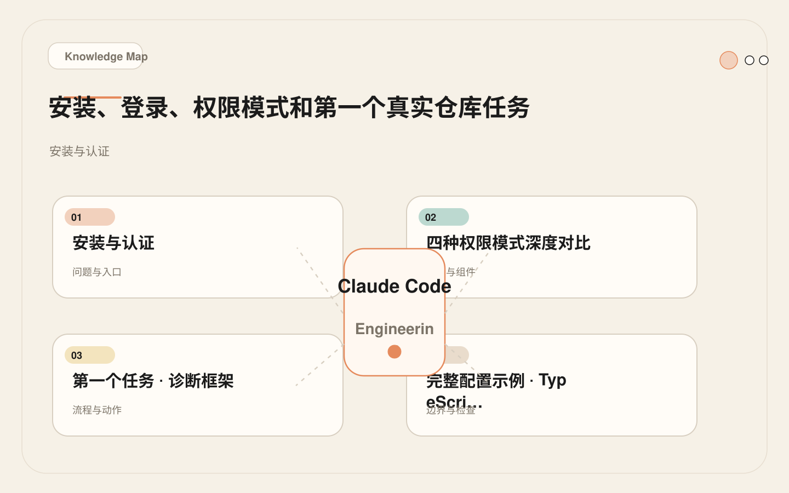
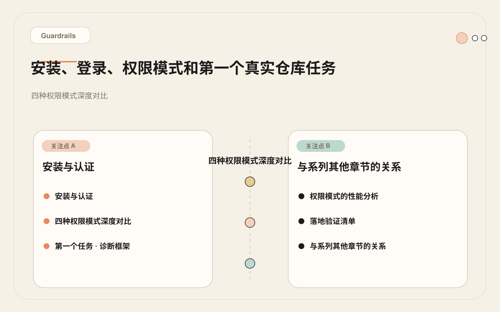
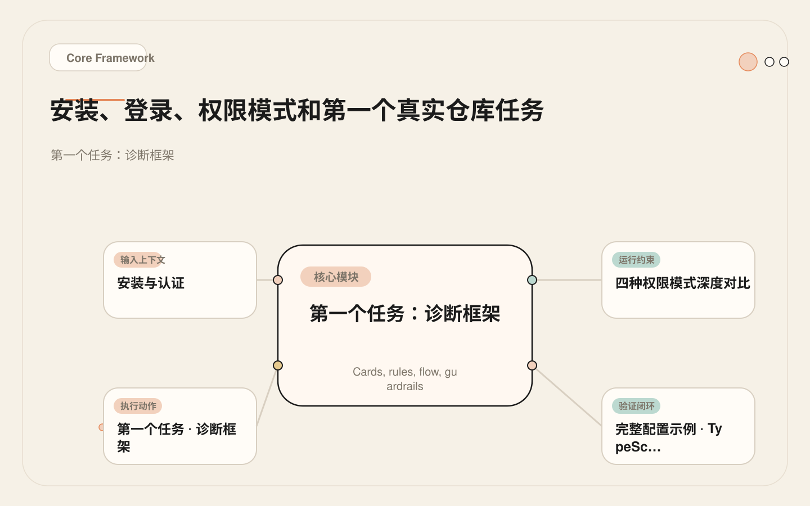
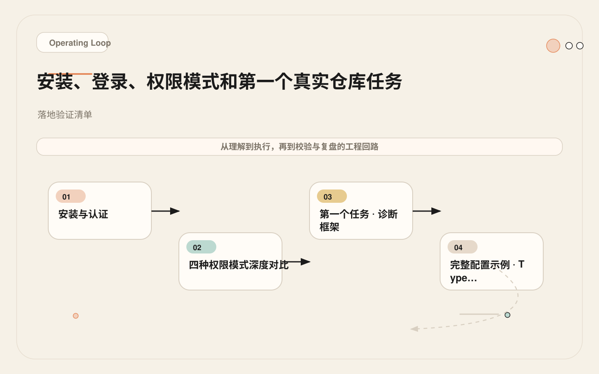

# 从安装到第一个真实任务：Claude Code 的权限模式怎么选

<!-- codex:cover ../../../assets/claude-code-engineering/02-setup-permission-first-repo-task-cover.webp -->

<!-- /codex:cover -->

**TL;DR：** 安装 Claude Code 后的第一次操作不应该是让它写代码。正确的顺序是：安装认证 → 配置权限 → 验证项目上下文是否充分 → 做一个低风险的诊断任务。跳过前两步直接上功能的团队，后面花在修复 AI 误操作上的时间是前期配置的 8-10 倍。

## 安装与认证

### 安装

<!-- codex:illustration 02-setup-permission-first-repo-task/01-overview-knowledge-map.svg -->

<!-- /codex:illustration -->

Claude Code 是一个 npm 全局包，需要 Node.js 18+ 环境。

```bash
# 安装
npm install -g @anthropic-ai/claude-code

# 验证
claude --version
```

安装完成后，`claude` 命令可用。首次运行会进入认证流程。

### 认证方式

Claude Code 支持两种认证路径，适用场景完全不同：

| 认证方式 | 适用场景 | 配置方式 |
|---------|---------|---------|
| Anthropic API Key | 个人开发者、Max 订阅用户 | `export ANTHROPIC_API_KEY=sk-ant-...` |
| OAuth (Claude Pro/Team/Enterprise) | 企业团队、组织账号 | `claude` 启动时自动引导浏览器 OAuth |

**API Key 方式**：

```bash
# 写入 shell 配置（zsh 用户）
echo 'export ANTHROPIC_API_KEY=sk-ant-your-key-here' >> ~/.zshrc
source ~/.zshrc

# 验证认证
claude "hello, verify auth"
```

**OAuth 方式**：

直接运行 `claude`，终端会输出一个 URL，在浏览器中打开并授权后自动完成认证。OAuth 方式不需要在本地存储 API Key，更适合共享机器和企业环境。企业团队应优先选择 OAuth 方式，避免成员在个人 shell 配置文件中明文存储密钥。如果公司使用 SSO，OAuth 流程会自动对接企业的身份提供商，无需额外配置。

### 认证失败的常见原因

| 错误信息 | 原因 | 修复 |
|---------|------|------|
| `Invalid API key` | Key 复制不完整或过期 | 重新从 console.anthropic.com 复制 |
| `Billing hard limit reached` | API 账户额度用尽 | 充值或提高限额 |
| `OAuth flow timeout` | 浏览器未在窗口期内完成 | 重新运行 `claude`，确保网络通畅 |
| `ECONNREFUSED` | 公司代理拦截 HTTPS 请求 | 配置 `HTTPS_PROXY` 环境变量 |

### 目录结构

认证成功后，Claude Code 在用户主目录创建配置结构：

```text
~/.claude/
├── CLAUDE.md              # 用户级全局指令（所有项目生效）
├── settings.json          # 用户级全局设置（权限、环境变量）
├── credentials           # 认证信息（自动管理，不要手动编辑）
└── memory/               # 跨项目自动记忆
```

项目级配置则在仓库内：

```text
<repo>/
├── CLAUDE.md              # 项目级指令（推荐放在根目录）
├── .claude/
│   ├── CLAUDE.md          # 项目级指令（备选位置，等同根目录版本）
│   ├── settings.json      # 项目级设置（提交到 git，团队共享）
│   ├── settings.local.json # 项目级本地设置（不提交，个人偏好）
│   ├── rules/             # 路径作用域规则
│   │   ├── frontend.md
│   │   └── backend.md
│   ├── hooks/             # Hook 脚本
│   └── memory/            # 项目级自动记忆
```

**settings.json 加载优先级**（后加载的覆盖先加载的）：

```
~/.claude/settings.json           → 全局基线
<repo>/.claude/settings.json      → 项目级覆盖（git 追踪，团队共享）
<repo>/.claude/settings.local.json → 本地覆盖（.gitignore 排除）
```

这个三级优先级意味着：团队可以在 `settings.json` 中定义共享的安全策略，个人在 `settings.local.json` 中添加自己偏好的命令，两者不冲突。比如团队在 `settings.json` 中统一 deny 了 `git push*`，个人在 `settings.local.json` 中添加了 `Bash(docker*)` 用于本地容器调试，这两条规则会合并生效。`settings.local.json` 应该在 `.gitignore` 中排除，避免个人偏好污染团队配置。

## 四种权限模式深度对比

权限模式决定了 Claude Code 执行工具调用时是否需要人工确认。选错模式的代价不是"麻烦"或"方便"的问题，而是直接影响任务完成效率和事故半径。

<!-- codex:illustration 02-setup-permission-first-repo-task/04-compare-guardrails.svg -->

<!-- /codex:illustration -->

### 模式对比矩阵

| 模式 | 行为 | 适用场景 | 风险 | 确认提示 Token 成本 |
|------|------|---------|------|---------------------|
| `default` | 每个工具调用需确认（Read 除外） | 学习阶段、敏感仓库、生产代码 | 低效但安全 | 高 |
| `plan` | 先展示完整计划，确认后逐步执行 | 复杂任务、架构变更、跨模块修改 | 计划可能不准，但执行可控 | 中 |
| `auto` | 自动执行已允许的操作，仅未批准的操作需确认 | 成熟项目、测试覆盖好、非生产环境 | 可能越界修改 | 低 |
| `bypassPermissions` | 跳过所有确认，全自动执行 | CI/CD、Headless、隔离沙箱环境 | 生产事故风险极高，禁止在日常使用 | 零 |

### 各模式的真实配置

**default 模式**（无需额外配置，这是内置默认值）：

```json
// .claude/settings.json — default 模式即无额外配置
{
  "permissions": {
    "allow": [],
    "deny": []
  }
}
```

每次 Claude Code 调用 `Edit`、`Write`、`Bash` 时，终端会暂停并等待用户输入 `y` 确认。一个典型的 bug 修复任务（读 3 个文件、改 1 个文件、跑 1 次测试）会产生约 5-8 次确认提示。

**plan 模式**：

```json
// .claude/settings.json — plan 模式
{
  "permissions": {
    "allow": [],
    "deny": []
  }
}
```

启动方式：`claude --plan` 或会话中使用 `/plan` 命令。Claude Code 会先输出完整的执行计划，列出所有将要做的事情，等用户确认后再开始执行。适合你不确定 AI 会怎么改、需要先审查意图的场景。

**auto 模式**（推荐用于日常开发）：

```json
// .claude/settings.json — auto 模式 + allowlist
{
  "permissions": {
    "allow": [
      "Read",
      "Grep",
      "Glob",
      "LS",
      "Bash(npm test*)",
      "Bash(npm run lint*)",
      "Bash(npm run typecheck*)",
      "Bash(git status*)",
      "Bash(git diff*)",
      "Bash(git log*)",
      "Bash(git add*)",
      "Bash(node*)"
    ],
    "deny": [
      "Bash(rm -rf *)",
      "Bash(git push*)",
      "Bash(git reset --hard*)",
      "Bash(curl*|*)",
      "Bash(wget*)",
      "Write(.env*)",
      "Edit(.env*)"
    ]
  }
}
```

allowlist 中的操作自动执行，denylist 中的操作直接拒绝，不在两个列表中的操作仍需确认。这是日常开发中效率和安全性的最佳平衡点。

**bypassPermissions 模式**：

```json
// .claude/settings.json — 仅限 CI/沙箱环境
{
  "permissions": {
    "allow": [],
    "deny": []
  }
}
```

启动方式：`claude --dangerously-skip-permissions`。这个模式不在 `settings.json` 中配置，而是通过命令行参数启用。**永远不要在日常开发中使用这个模式**。它存在的唯一理由是 CI/CD 管道和完全隔离的沙箱环境，详见 [27 — Headless 模式](./27-headless-mode.md) 和 [28 — GitHub Actions](./28-github-actions.md)。

### 确认提示的 Token 成本分析

每次确认提示不是"按一下 y 那么简单"。确认提示的完整流程是：

```
Claude Code 暂停 → 输出确认消息（~50-100 tokens）
→ 用户输入 y → 系统回传确认（~20 tokens）
→ 模型重新加载上下文继续推理（~200-500 tokens）
```

单次确认的 Token 成本约 270-620 tokens。一个中等复杂度的 bug 修复任务在 default 模式下可能产生 10-15 次确认，总成本约 2700-9300 tokens 的纯开销——这些 tokens 没有产出任何有用信息，全部花在"等待确认"这个流程上。

以 Claude Sonnet 的定价计算，9300 tokens 约 $0.014。金额不大，但这些 tokens 占用的是上下文窗口空间。在 200K 的窗口里，9000 tokens 意味着约 4.5% 的有效空间被确认流程消耗。对于长会话，这个成本会显著挤压模型可用的推理空间，加速触发压缩。

**auto 模式 + 精确 allowlist 的实际收益**：

同样的 bug 修复任务，配置好 allowlist 后：
- Read、Grep、Glob 自动放行（3-5 次调用免确认）
- `npm test` 自动放行（1-2 次调用免确认）
- 仅 Edit/Write 需确认（1-2 次）
- 总确认次数从 10-15 降到 1-2
- 节省 Token 开销约 5000-8000 tokens

确认提示减少还意味着上下文中断更少。模型在连续执行中能维持更完整的推理链路，每次被打断确认都会造成微小的注意力偏移。对于需要连贯推理的复杂任务，这种偏移的累积效果不可忽视。

## 第一个任务：诊断框架

团队第一次在真实仓库中使用 Claude Code，任务不应该是"实现一个功能"，而应该是"诊断 Claude Code 是否具备足够的上下文来正确操作这个项目"。

<!-- codex:illustration 02-setup-permission-first-repo-task/02-framework-core-structure.svg -->

<!-- /codex:illustration -->

这个诊断分四步，每一步都有明确的验证标准。

### 第一步：让 Claude Code 解释项目结构

在项目根目录启动 `claude`，输入：

```text
阅读 README、package.json 和项目根目录结构。
用你自己的话告诉我：
1. 这个项目是做什么的
2. 如何安装依赖
3. 如何运行测试
4. 如何构建
5. 主要目录各自的作用
```

**验证标准**：逐条检查 Claude Code 的回答是否与实际一致。

常见错误信号：
- 把 pnpm 项目说成 npm 项目 → `CLAUDE.md` 缺失命令配置
- 不知道测试框架 → 没有读取测试配置文件
- 目录作用描述模糊 → 项目结构不在记忆中
- 把 monorepo 当成单体项目 → 缺少架构边界说明

### 第二步：验证构建和测试命令

```text
运行安装、类型检查和测试命令，报告每个命令的结果。
如果有命令失败，说明失败原因和你建议的修复方式。
```

**验证标准**：
- 安装命令执行成功
- 类型检查通过（或有明确错误）
- 测试全部通过（或有明确失败用例）
- Claude Code 正确识别了包管理器（pnpm/npm/yarn/bun）

如果这步失败，说明环境本身有问题，任何代码修改任务都不会有好结果。先修复环境。

### 第三步：评估上下文充分性

根据前两步的结果，判断是否需要补充 `CLAUDE.md`：

```text
基于你对这个项目的理解，列出：
1. 你目前不确定的项目约定
2. 你可能会误判的模块边界
3. 你不知道但做任务时可能需要知道的规则
```

**验证标准**：如果 Claude Code 列出的"不确定"超过 3 条，说明 `CLAUDE.md` 需要补充。

至少应该创建一个最小 `CLAUDE.md`：

```markdown
# CLAUDE.md

## Commands
- Install: pnpm install
- Test: pnpm test
- Typecheck: pnpm typecheck
- Build: pnpm build

## Architecture
- src/modules/ 下按业务域分模块
- 共享逻辑放 src/shared/

## Rules
- 用 pnpm，不要用 npm 或 yarn
- 改 API 要更新对应的测试

## Safety
- 不要编辑 .env* 文件
- 不要运行部署命令
```

关于 `CLAUDE.md` 的完整配置方法，见 [04 — CLAUDE.md 项目记忆](./04-claude-md-project-memory.md)。

### 第四步：执行一个低风险修改

只有前三步都通过后，才做第一个真正的代码修改。选择一个已知的小 bug 或文档过期问题：

```text
修复 docs/ 中一个明显过期的命令引用。
修改后运行最小相关的检查命令。
最后报告：修改了哪些文件、diff 内容、验证结果、剩余风险。
```

**验证标准**：
- 修改文件数 <= 2（超过说明改多了）
- 测试通过（改了代码但测试挂了说明改法有问题）
- Claude Code 报告了剩余风险（说明它知道自己的修改边界）

## 完整配置示例：TypeScript 服务项目

以下是一个典型的 TypeScript 服务项目在首次使用 Claude Code 时的完整配置。

### 项目假设

一个 Express + TypeScript + Vitest 的后端服务，使用 pnpm 管理：

```text
my-service/
├── CLAUDE.md
├── .claude/
│   ├── settings.json
│   ├── settings.local.json
│   └── rules/
│       └── api-routes.md
├── src/
│   ├── routes/
│   ├── services/
│   ├── middleware/
│   └── utils/
├── tests/
├── tsconfig.json
├── vitest.config.ts
└── package.json
```

### CLAUDE.md

```markdown
# CLAUDE.md

## Project
Express.js 后端 API 服务。TypeScript + Vitest + Prisma + PostgreSQL。
包管理器：pnpm。Node >= 20。

## Commands
- Install: pnpm install
- Dev: pnpm dev
- Build: pnpm build
- Test: pnpm test
- Test (single): pnpm test -- src/routes/users.test.ts
- Test (watch): pnpm test -- --watch
- Typecheck: pnpm typecheck
- Lint: pnpm lint
- DB migrate: pnpm prisma migrate dev
- DB generate: pnpm prisma generate

## Architecture
- src/routes/ — API 路由处理，每个资源一个文件
- src/services/ — 业务逻辑，routes 调用 services
- src/middleware/ — 中间件（认证、日志、错误处理）
- src/utils/ — 工具函数，无状态
- tests/ — 测试文件，结构与 src/ 对应

## Rules
- 测试框架是 Vitest，不是 Jest。用 vi.fn() 不是 jest.fn()
- 导入路径用 TypeScript path alias：@/routes/users
- 错误处理使用 src/utils/errors.ts 中的标准错误类
- API 响应统一使用 { success: boolean, data?: T, error?: string } 格式
- 不要引入新的依赖，除非明确要求

## Safety
- 不要编辑 .env* 文件
- 不要运行 prisma migrate reset
- 不要执行 pnpm publish
- 数据库迁移需要逐个确认

## Verification
- 修改 src/routes/ 后：pnpm test -- src/routes/
- 修改 src/services/ 后：pnpm test -- src/services/
- 任何修改后：pnpm typecheck
```

### .claude/settings.json（团队共享）

```json
{
  "permissions": {
    "allow": [
      "Read",
      "Grep",
      "Glob",
      "LS",
      "Bash(pnpm test*)",
      "Bash(pnpm lint*)",
      "Bash(pnpm typecheck*)",
      "Bash(pnpm build*)",
      "Bash(pnpm dev*)",
      "Bash(git status*)",
      "Bash(git diff*)",
      "Bash(git log*)",
      "Bash(git add*)",
      "Bash(git branch*)",
      "Bash(node*)"
    ],
    "deny": [
      "Bash(rm -rf *)",
      "Bash(git push*)",
      "Bash(git reset --hard*)",
      "Bash(git clean*)",
      "Bash(curl *)",
      "Bash(wget*)",
      "Bash(pnpm publish*)",
      "Bash(sudo*)",
      "Write(.env*)",
      "Edit(.env*)"
    ]
  },
  "env": {
    "CLAUDE_CODE_MAX_TURNS": "50"
  }
}
```

### .claude/settings.local.json（个人偏好，不提交）

```json
{
  "permissions": {
    "allow": [
      "Bash(docker*)",
      "Bash(pnpm prisma studio*)"
    ]
  }
}
```

`settings.local.json` 加在 `.gitignore` 中：

```text
# .gitignore 追加
.claude/settings.local.json
.claude/memory/
```

### .claude/rules/api-routes.md

```markdown
---
paths:
  - "src/routes/**"
  - "tests/routes/**"
---

# API Routes Rules

- 每个路由文件导出一个 Router 实例
- 路由参数用 Zod schema 校验
- 错误统一抛出，由 src/middleware/error-handler.ts 捕获
- 新增路由必须补对应的测试文件
```

## 失败案例：跳过上下文配置的代价

这是真实发生在一个 6 人团队的案例。

### 背景

团队决定试用 Claude Code 加速开发。周一早上，技术负责人在群里发了安装命令和 API Key，让大家直接用。没有写 `CLAUDE.md`，没有配 `settings.json`，没有做诊断任务。

### 事件

周三下午，一个开发者让 Claude Code 实现"用户可以上传头像"的功能。任务本身涉及 2 个文件：新增一个 API 端点（`src/routes/users.ts` 加一个 POST handler）和对应的 service 方法（`src/services/users.ts` 加一个 `uploadAvatar` 函数）。

Claude Code 实际做了什么：

1. 在 `src/routes/users.ts` 添加了 POST `/users/:id/avatar` 路由 -- 正确
2. 在 `src/services/users.ts` 添加了 `uploadAvatar` 方法 -- 正确
3. 新建了 `src/services/image-resize.ts` -- 未要求，但合理
4. 修改了 `src/middleware/upload.ts` -- 认为需要调整文件上传中间件的配置
5. 修改了 `src/utils/s3-client.ts` -- 修改了 S3 上传的超时配置
6. 新建了 `tests/routes/users-avatar.test.ts` -- 使用 `describe/it/expect` 的 Jest 风格
7. 修改了 `package.json` -- 添加了 `sharp` 依赖用于图片压缩

**问题清单**：

| # | 问题 | 根因 |
|---|------|------|
| 1 | 修改了上传中间件的配置，但项目中已有适合的配置 | 不知道模块边界，"顺手优化" |
| 2 | 修改了 S3 客户端超时，影响了其他使用 S3 的功能 | 不知道 `s3-client.ts` 是共享模块 |
| 3 | 测试文件用了 Jest API（`jest.fn()`），项目用的是 Vitest | 不知道测试框架 |
| 4 | 添加了 `sharp` 依赖，但项目已有 `sharp`（在 devDependencies 里） | 没有仔细读 package.json |
| 5 | 导入路径用了相对路径 `../../services/users`，项目用 path alias `@/` | 不知道项目的导入约定 |

### 后果

- 功能分支的 CI 构建失败：Vitest 不认识 `jest.fn()`，类型检查报错。
- 原有的文件上传功能（PDF 导出）被中间件修改影响，集成测试挂了 2 个。
- 代码审查花了 40 分钟，发现上述所有问题。
- 开发者花了 2 小时回滚不必要的修改，只保留路由和 service 的变更。
- 修复后的版本只改了 2 个文件，测试通过。

### 根因分析

所有问题追溯到同一个根因：**没有 `CLAUDE.md`**。

Claude Code 不知道：
- 项目用 Vitest 而非 Jest（测试框架错误）
- 导入用 path alias（导入风格错误）
- `src/middleware/upload.ts` 和 `src/utils/s3-client.ts` 不需要改（模块边界不清）
- 项目已有 `sharp`（重复依赖）

一个 15 分钟就能写好的 `CLAUDE.md`，可以避免这 2 小时的修复工作。按投入产出比算，写 `CLAUDE.md` 的 15 分钟在这一个任务上就收回了 8 倍的时间投资。后续每个任务都持续享受这个回报。

### 修复措施

团队事后添加了上面"完整配置示例"章节中的 `CLAUDE.md`、`settings.json` 和 rules。同时按本文"落地验证清单"做了完整的初始诊断。此后同类任务的结果：

- 修改文件数从 7 降到 2
- 测试一次通过（使用正确的 Vitest API）
- 不再修改无关模块
- 代码审查时间从 40 分钟降到 10 分钟

## 权限模式的性能分析

用数据量化不同权限模式在同一个任务上的效率差异。

### 测试任务

修复一个 TypeScript 服务中的输入校验 bug：添加缺少的空值检查，确保测试通过。

### 任务分解和工具调用

| 步骤 | 工具调用 | 次数 |
|------|---------|------|
| 读取目标文件 | Read("src/routes/users.ts") | 1 |
| 搜索相关代码 | Grep("validateInput") | 1 |
| 读取依赖模块 | Read("src/utils/validation.ts") | 1 |
| 找到测试文件 | Grep("users.test") | 1 |
| 修改代码 | Edit("src/routes/users.ts", ...) | 1 |
| 运行测试 | Bash("pnpm test -- src/routes/") | 1 |
| 查看变更 | Bash("git diff") | 1 |
| **总计** | | **8 次工具调用** |

### 各模式确认次数和 Token 开销

| 模式 | 需确认的调用 | 免确认的调用 | 确认次数 | Token 开销 | 等待时间 |
|------|------------|------------|---------|-----------|---------|
| default | 全部 8 次 | 0 | 8 | ~4800 tokens | ~2 分钟 |
| plan | 计划确认 1 次 + 执行确认 8 次 | 0 | 9 | ~5400 tokens | ~2.5 分钟 |
| auto + allowlist | Edit(1) + Bash·test(1) | Read(1) + Grep(2) + Bash·git(1) | 2 | ~1200 tokens | ~30 秒 |
| bypass | 0 | 全部 8 次 | 0 | 0 | 0 |

**计算方式**：

- 单次确认 Token 开销：~600 tokens（提示消息 + 用户输入 + 上下文重载）
- default 模式：8 x 600 = 4800 tokens
- plan 模式：额外的计划展示和确认约增加 600 tokens
- auto + allowlist 模式：Read/Grep/Glob 在 allowlist 中自动放行，仅 Edit 和首次 Bash 需确认

### 效率决策矩阵

| 项目特征 | 推荐模式 | 理由 |
|---------|---------|------|
| 第一次使用 Claude Code | default | 先观察行为，建立信任 |
| 测试覆盖率 < 50% | default 或 plan | 修改风险高，需要逐条确认 |
| 测试覆盖率 50-80% | auto + allowlist | 测试兜底，allowlist 防越界 |
| 测试覆盖率 > 80%，CI 完备 | auto + allowlist | 自动化防线充分 |
| CI/CD 管道 | bypassPermissions | 无人工交互，但必须在隔离环境 |
| 生产代码库 | auto + denylist | 必须有危险操作黑名单 |
| 个人实验项目 | auto | 低风险，效率优先 |

### 环境变量调优

`settings.json` 的 `env` 字段可以设置影响 Claude Code 行为的环境变量：

```json
{
  "env": {
    "CLAUDE_CODE_MAX_TURNS": "50",
    "CLAUDE_CODE_USE_BEDROCK": "0"
  }
}
```

`CLAUDE_CODE_MAX_TURNS` 限制单次会话的最大工具调用轮次。默认值较高（200），对于日常 bug 修复任务，设为 50 足够，同时防止失控循环消耗大量 Token。如果任务经常在 50 轮内完不成，说明任务粒度太粗，应该拆分。这个参数不是优化项，而是成本控制手段——一个没有边界限制的会话可能因为模型陷入循环而消耗大量 Token。建议团队为不同类型的任务设定不同的轮次上限：bug 修复 30-50 轮，功能开发 50-100 轮，重构任务 100-150 轮。超出上限说明任务需要拆解或者项目上下文配置不够充分，模型在反复探索中浪费了轮次。

## 落地验证清单

以下清单用于验证 Claude Code 在项目中的初始配置是否到位。每个条目都有明确的验证方式。

<!-- codex:illustration 02-setup-permission-first-repo-task/03-flow-operating-loop.svg -->

<!-- /codex:illustration -->

### 环境与认证

- [ ] `claude --version` 输出正确版本号
- [ ] `claude "hello"` 正常响应，无认证错误
- [ ] API Key 或 OAuth 认证成功
- [ ] 公司代理环境下 `HTTPS_PROXY` 已配置（如需要）

### 项目上下文

- [ ] Claude Code 能正确列出项目目录结构（第一步验证）
- [ ] Claude Code 知道测试命令和包管理器（第二步验证）
- [ ] Claude Code 能正确运行 install/test/typecheck（第二步验证）
- [ ] CLAUDE.md 已创建，包含 Commands、Architecture、Rules、Safety 四段
- [ ] Claude Code 的"不确定"条目 <= 3 条（第三步验证）

### 权限配置

- [ ] .claude/settings.json 已创建，包含 allowlist 和 denylist
- [ ] allowlist 覆盖 Read/Grep/Glob + 测试/lint/typecheck 命令
- [ ] denylist 覆盖 rm -rf / git push --force / .env 写入 / 部署命令
- [ ] 权限模式与项目风险等级匹配（参见效率决策矩阵）
- [ ] .claude/settings.local.json 在 .gitignore 中排除

### 首次任务验证

- [ ] 第一个任务修改文件数 <= 2
- [ ] 修改后测试全部通过
- [ ] Claude Code 报告了 diff 内容和验证结果
- [ ] Claude Code 列出了剩余风险
- [ ] 无非预期文件被修改（git diff 中无意外文件）

### 团队共享

- [ ] CLAUDE.md 已提交到 git
- [ ] .claude/settings.json 已提交到 git
- [ ] .claude/rules/ 按路径域拆分（如需要）
- [ ] 团队成员拉取代码后无需额外配置即可使用

## 与系列其他章节的关系

本文覆盖了 Claude Code 从安装到首次任务的完整流程。每个配置点的深入内容在后续章节展开：

- **运行时心智模型**：[00 — Claude Code 作为工程代理运行时](./00-claude-code-as-agent-runtime.md) 解释了四层架构，权限模式是治理层的一部分。
- **上下文配置**：[04 — CLAUDE.md 项目记忆](./04-claude-md-project-memory.md) 详细说明如何编写有效的项目记忆，[05 — rules 路径作用域](./05-rules-path-scoped-context.md) 说明按路径拆分规则的方法。
- **安全与治理**：[22 — Hooks 入门](./22-hooks-introduction.md) 介绍确定性控制机制，[23 — PreToolUse 阻断](./23-pretooluse-guardrails.md) 说明如何在工具执行前拦截危险操作。
- **三个根因**：[01 — 上下文搬运、验证缺失和权限失控](./01-context-validation-permission.md) 建立了本文所依赖的诊断框架。
- **CI/CD 集成**：[27 — Headless 模式](./27-headless-mode.md) 和 [28 — GitHub Actions](./28-github-actions.md) 说明 bypassPermissions 模式的正确使用场景。


