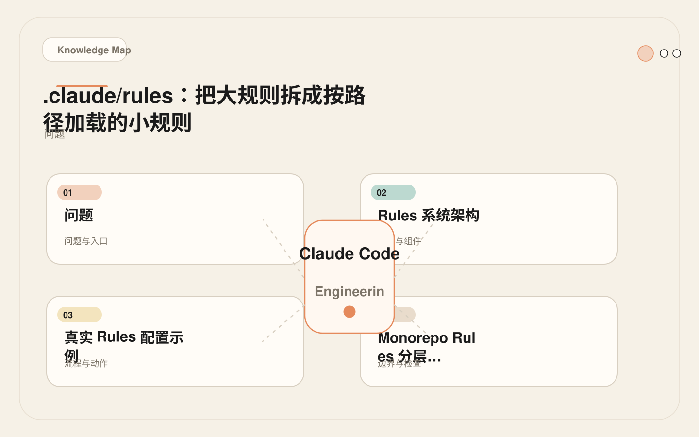
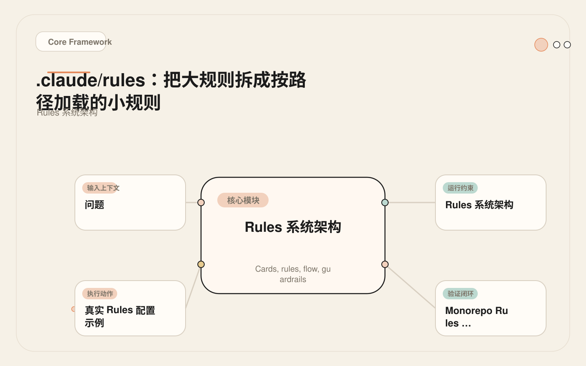
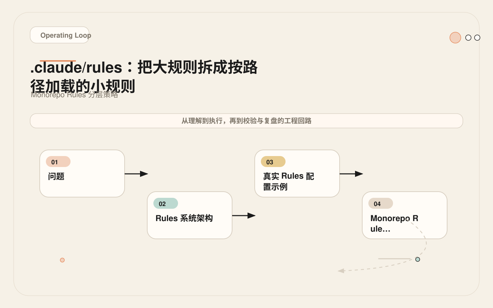
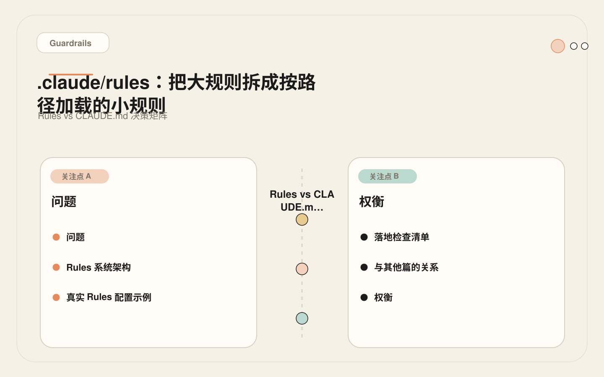

# .claude/rules：CLAUDE.md 臃肿了，就把规则拆成按路径加载的小块

<!-- codex:cover ../../../assets/claude-code-engineering/05-rules-path-scoped-context-cover.webp -->

<!-- /codex:cover -->

**TL;DR：** `CLAUDE.md` 每次会话全量加载，规则多了就变成噪声。`.claude/rules/` 目录里的 Markdown 文件可以按路径匹配按需加载——编辑前端时只加载前端规则，改数据库时只加载数据库规则。

## 问题

一个 monorepo 里同时存在 React 组件、API 路由、Prisma schema、Terraform 配置、集成测试。把所有规则塞进根目录 `CLAUDE.md`，两个问题必然出现：

<!-- codex:illustration 05-rules-path-scoped-context/01-overview-knowledge-map.svg -->

<!-- /codex:illustration -->

1. **上下文浪费。** Claude Code 改一个前端按钮，却要读数据库迁移规范、Terraform 命名规则、CI 配置约束。每条无关规则都在消耗 token 预算。这些噪声不只是浪费 token——它还会干扰模型的判断。当上下文里充斥着与当前任务无关的规则，Claude Code 在生成代码时会偶尔"误触发"那些不相关的约束，比如在前端组件里加了一个只对 API 路由有意义的错误处理模式。
2. **规则冲突。** 前端要求"用 functional component"，某个 legacy 包还要求"class component"；API 要求"zod 校验"，内部工具脚本不需要。挤在一个文件里，Claude Code 要么随机选一个，要么两个都遵循导致代码奇怪。这种冲突在代码审查时很难发现根因——代码看起来是"按某条规则写的"，但那条规则本来不适用于这个文件。

`.claude/rules/` 解决这两个问题：**只有路径匹配的规则才进入上下文。** 这不是简单的性能优化，而是一种架构决策——把全量广播的规则系统变成按需订阅的规则系统。

## Rules 系统架构

### 加载优先级

<!-- codex:illustration 05-rules-path-scoped-context/02-framework-core-structure.svg -->

<!-- /codex:illustration -->

Claude Code 的上下文来源有三层，按优先级排列：

```
CLAUDE.md（项目根目录）
  ↓ 每次会话始终加载
.claude/rules/*.md（路径匹配）
  ↓ 仅匹配当前编辑路径的文件才加载
auto memory（会话记忆）
  ↓ 跨会话累积，由 Claude Code 自己管理
```

关键区别：`CLAUDE.md` 是无条件加载的全局上下文；`.claude/rules/` 是条件加载的局部上下文。理解这个区别很重要——如果你把一条规则放进了 CLAUDE.md，等于告诉 Claude Code "这条规则对仓库里的每一个文件都适用"。如果它实际上只对某些目录有意义，就应该放进 rules。

### 文件格式

每个 rule 文件是标准 Markdown，顶部用 YAML frontmatter 声明匹配规则：

```yaml
---
name: rule-name          # 可选，用于调试识别
description: 一句话描述    # 可选，帮助维护者理解用途
paths:                    # 必填，glob 模式列表
  - "匹配路径1/**"
  - "匹配路径2/**"
---

## Markdown 正文
具体规则内容...
```

`paths` 字段支持标准 glob 模式。当 Claude Code 编辑的文件路径匹配任一 glob 时，该规则文件的完整内容进入上下文。不匹配则完全不可见。这意味着一条规则如果 paths 写得不够精确，可能会匹配到不该匹配的文件；反过来，如果写得太窄，该加载的规则又会被遗漏。glob 模式的设计是整个 rules 系统最需要仔细对待的部分。

一个常见的错误是在 paths 里写 `**` 匹配所有文件——这等于把 rules 文件变成了第二个 CLAUDE.md，完全失去了按需加载的意义。paths 应该尽可能具体，只覆盖规则真正适用的范围。

### Token 成本模型

假设 `CLAUDE.md` 占 1500 token，每个 rule 文件平均 200-400 token。在一次典型的编辑任务中：

```
始终加载：CLAUDE.md            ≈ 1500 token
按需加载：rules（匹配 2-3 个）  ≈ 600 token
-----------------------------------------------
总上下文成本                   ≈ 2100 token
```

如果全部规则都放进 `CLAUDE.md`，可能是 4000+ token。规则越多，拆分的收益越大。

这个成本计算在实践中很关键。一个 10 人团队的 monorepo，如果每个子系统（前端、后端、移动端、基础设施、数据管道）各贡献 5-8 条规则，全局 CLAUDE.md 很容易膨胀到 3000-5000 token。而如果拆成 rules，一次前端编辑任务的规则上下文可能只有 600 token。差别是数量级的。

## 真实 Rules 配置示例

### 示例 A：React 组件规则

```markdown
---
name: react-component-rules
description: React 组件开发规范
paths:
  - "packages/ui/src/components/**"
  - "apps/web/src/components/**"
---

## 组件规则

- 只用 function component，禁止 class component
- Props 用 TypeScript interface 定义，单独文件导出，不内联 type
- 测试文件与组件同目录：ComponentName.test.tsx
- className 合并用 cn()（from @/lib/utils），不用模板字符串拼接
- 图标统一从 lucide-react 导入，不引入自定义 SVG
- 颜色使用 tailwind.config.ts 的 theme token，禁止硬编码 hex 值
- 组件文件内导出只保留默认导出和一个命名导出（如有）
```

这个规则只在编辑 `packages/ui/src/components/` 或 `apps/web/src/components/` 下的文件时加载。编辑 API 路由或数据库 schema 时，这些规则完全不存在于上下文中。注意这个例子的 paths 写法——它同时匹配两个不同应用下的组件目录，这在 monorepo 中很常见：多个应用共享同一套组件规范，但各自的组件目录可能不在同一个 packages 下。

另一个值得注意的细节是规则的措辞方式。每条规则都是**明确的、可验证的指令**："禁止 class component"而不是"尽量用 function component"；"从 lucide-react 导入"而不是"推荐使用图标库"。模糊的规则对 Claude Code 来说等于没有规则——它会按自己的理解来执行，结果往往不是你期望的。

### 示例 B：API 路由规则

```markdown
---
name: api-route-rules
description: API 路由处理器开发规范
paths:
  - "src/routes/**"
  - "apps/api/src/routes/**"
---

## API 路由规则

- 所有输入用 zod schema 校验，不信任任何 request body
- 返回值统一用 ApiResponse<T> 类型包装
- 禁止在路由处理器中直接调用 prisma client，必须走 repository 层
- 错误处理统一通过 errorHandler middleware，不单独 try-catch
- 新增路由必须同时添加集成测试（test/integration/）
- HTTP 方法语义：GET 不修改状态，POST 创建资源，PATCH 部分更新
- 路由文件按资源分组，单文件不超过 150 行
```

### 示例 C：数据库迁移规则

```markdown
---
name: prisma-migration-rules
description: Prisma schema 和数据库迁移规范
paths:
  - "packages/db/prisma/**"
  - "packages/db/migrations/**"
---

## 数据库规则

- schema 变更必须生成迁移文件，禁止手动编辑 SQL
- 新增 model 必须 @map 到 snake_case 表名
- 所有 DateTime 字段默认 now()，不依赖应用层
- 枚举类型用 Prisma enum，不用字符串字段模拟
- 删除字段必须分两步：先标记 @deprecated，下个版本再移除
- 迁移文件一旦合并到 main，禁止修改，只能追加新迁移
- 涉及数据迁移时，必须写 reversible 迁移
```

### 示例 D：测试文件规则

```markdown
---
name: test-rules
description: 测试文件编写规范
paths:
  - "**/*.test.ts"
  - "**/*.test.tsx"
  - "**/*.spec.ts"
  - "**/*.spec.tsx"
  - "tests/**"
---

## 测试规则

- describe 块用中文描述场景，it 块用英文描述行为
- 每个 test 文件顶部注释说明测试覆盖的核心场景
- mock 放在 describe 块外部，beforeEach 内设置具体返回值
- 不 mock 被测模块本身的函数，只 mock 外部依赖
- 异步测试统一用 async/await，不用 done() 回调
- 测试数据用 factory 函数生成，不硬编码 fixture
- 集成测试需要真实数据库连接，不用内存 SQLite 替代
```

## Monorepo Rules 分层策略

一个典型的 monorepo，按职责拆分 rules：

<!-- codex:illustration 05-rules-path-scoped-context/03-flow-operating-loop.svg -->

<!-- /codex:illustration -->

```
.claude/rules/
├── typescript-general.md       # 所有 .ts/.tsx 文件
├── react-component.md          # React 组件目录
├── api-route.md                # API 路由目录
├── prisma-model.md             # Prisma schema 和迁移
├── test-rules.md               # 测试文件
├── infra-prod.md               # 生产环境基础设施
└── docs.md                     # 文档文件
```

每个文件的 frontmatter 和核心内容：

```markdown
<!-- typescript-general.md -->
---
name: typescript-general
description: TypeScript 通用规范
paths:
  - "**/*.ts"
  - "**/*.tsx"
---

## TypeScript 规范
- strict 模式，禁止 any（显式 any 必须加 @ts-expect-error 注释说明原因）
- import 排序：react → 第三方库 → @/ 别名 → 相对路径
- 导出用命名导出，默认导出只用于页面组件
- 工具函数纯函数优先，副作用函数必须声明返回类型
```

```markdown
<!-- infra-prod.md -->
---
name: infra-production-rules
description: 生产环境基础设施变更规范
paths:
  - "infra/production/**"
  - "terraform/prod/**"
  - "k8s/prod/**"
---

## 生产环境规则
- 所有变更必须经过 plan 审查，禁止直接 apply
- 安全组变更必须明确标注端口、协议、来源 CIDR
- 资源命名遵循 {project}-{env}-{service}-{resource-type} 格式
- 环境变量引用 vault 路径，不硬编码任何值
- 变更后必须验证健康检查端点返回 200
```

```markdown
<!-- docs.md -->
---
name: documentation-rules
description: 文档编写规范
paths:
  - "docs/**"
  - "**/*.md"
---

## 文档规则
- 中文为主，技术术语保留英文
- 代码块标注语言类型
- 文件顶部有标题和一句话摘要
- 链接使用相对路径，不硬编码域名
```

### 分层原则

拆分的依据是**编辑场景的独立性**。当你编辑一个 React 组件时，不需要知道数据库迁移规范；当你改 Terraform 配置时，不需要看测试策略。每个编辑场景只激活 2-3 个规则文件，这是健康的粒度。

具体操作时，先问自己一个问题：**团队里负责前端的人和负责基础设施的人，是不是同一批人？** 如果不是，他们需要的规则几乎完全不重叠，这正是拆分的最强信号。如果团队很小、所有人都做所有事情，规则拆分的紧迫性就低一些——但仍然值得做，因为上下文噪声对 Claude Code 的影响是客观存在的，跟团队规模无关。

另一个实用的判断方法是看规则的"失效条件"。一条规则如果在前端目录里不适用（比如"所有 DateTime 字段默认 now()"），这就说明它不该出现在全局上下文里，而应该用 rules 限制在特定路径。

## Rules vs CLAUDE.md 决策矩阵

| 规则类型 | 放 CLAUDE.md | 放 .claude/rules/ | 原因 |
|---------|:-----------:|:-----------------:|------|
| 项目构建和测试命令 | ✓ | | 每次会话都需要知道 |
| 全局架构说明 | ✓ | | 影响所有编辑决策 |
| 代码风格通用要求 | ✓ | | 简短且全局适用 |
| 按目录的编码风格 | | ✓ | 只在编辑该目录时才有意义 |
| 按文件类型的规则 | | ✓ | 只在编辑该类型时才加载 |
| 安全边界概述 | ✓ | | 团队所有人必须知道 |
| 安全边界具体限制 | | ✓ | 具体到目录的防护规则 |
| 测试策略 | ✓ | | 影响所有功能开发 |
| 测试具体要求 | | ✓ | 按文件类型（单测/集成/e2e）不同 |
| 团队工作流约定 | ✓ | | 跨目录的全局流程 |
| 第三方库使用偏好 | | ✓ | 只在使用该库的文件中加载 |
| CI/CD 配置规范 | | ✓ | 只在编辑 CI 配置时加载 |

<!-- codex:illustration 05-rules-path-scoped-context/04-compare-guardrails.svg -->

<!-- /codex:illustration -->

核心判断标准：**这条规则是否在 80% 以上的编辑任务中都需要？** 是 → CLAUDE.md。否 → rules。

## 规则冲突诊断

### 场景一：两个 rules 文件匹配同一路径且指令矛盾

假设 `typescript-general.md` 和 `react-component.md` 都匹配 `apps/web/src/components/Button.tsx`：

```
typescript-general.md → "导出用命名导出，避免默认导出"
react-component.md    → "页面组件用默认导出"
```

Claude Code 会同时加载两条规则，看到矛盾指令。它的行为不可预测——可能选第一条，可能选第二条，可能在同一个文件里两种都用。

**诊断方法：** 手动检查规则的路径覆盖是否有交集。在终端执行：

```bash
# 列出所有 rule 文件的 paths 字段
for f in .claude/rules/*.md; do
  echo "=== $(basename $f) ==="
  sed -n '/^---$/,/^---$/p' "$f" | grep -A 10 'paths:'
  echo
done
```

**修复方法：** 调整 glob 使交集为空，或者在交集区域统一措辞。比如上面两条可以改为：

```
typescript-general.md → "工具函数用命名导出"
react-component.md    → "React 组件用默认导出"
```

### 场景二：CLAUDE.md 和 rule 文件矛盾

```
CLAUDE.md  → "所有新代码都用 TypeScript"
legacy-rules.md（paths: "scripts/legacy/**"）→ "用 JavaScript，不引入类型"
```

这种情况下 CLAUDE.md 作为全局规则优先级更高，但 rule 文件的局部规则是**故意例外**。Claude Code 面对这种矛盾时，通常局部规则会覆盖全局——这正是 rules 存在的意义。

**最佳实践：** 在 CLAUDE.md 中主动声明例外，消除歧义：

```markdown
## Working Rules
- 所有新代码用 TypeScript（scripts/legacy/ 除外，见规则文件）
```

### 场景三：匹配规则过多

编辑一个文件时加载了 5 个以上规则文件，说明粒度太细或路径划分有问题。用下面的命令模拟某个路径会加载哪些规则：

```bash
# 检查编辑 src/routes/users.ts 会加载哪些规则
TARGET="src/routes/users.ts"
for f in .claude/rules/*.md; do
  PATHS=$(sed -n '/^---$/,/^---$/p' "$f" | sed -n '/^paths:/,/^[^ ]/p' | grep '  - "' | sed 's/.*"\(.*\)".*/\1/')
  for p in $PATHS; do
    # 简单 glob 匹配检查
    if ls $p 2>/dev/null | grep -q "$(basename $TARGET)"; then
      echo "MATCH: $(basename $f) → $p"
    fi
  done
done
```

## 粒度决策矩阵

| 粒度 | 适用场景 | Token 成本 | 维护成本 | 典型规则数 |
|------|---------|-----------|---------|-----------|
| 按目录 | monorepo 不同包，各包技术栈独立 | 低：每次 1-2 个 | 低：按目录自然划分 | 4-8 个 |
| 按文件类型 | 同一目录下多种文件类型共存 | 中：每次 2-3 个 | 中：glob 需要仔细设计 | 5-10 个 |
| 按功能模块 | 大型服务按业务领域拆分 | 中：每次 2-4 个 | 中：模块边界需要定期审查 | 6-12 个 |
| 按文件名 | 特殊文件需要特殊处理（如 docker-compose.yml） | 高：可能匹配过多 | 高：文件名模式难维护 | 按需 1-3 个 |

推荐起点：**按目录划分**。这是最自然的边界，也最容易验证路径不重叠。随着项目复杂度增长，再在目录基础上叠加文件类型规则。

实际操作中，最常见的组合策略是"目录 + 文件类型"双层叠加。比如一个按目录划分的 `react-component.md` 负责 `components/**` 下的所有规则，再叠加一个按文件类型划分的 `typescript-general.md` 负责 `**/*.tsx` 的通用 TypeScript 规则。两层规则的内容要刻意避免重叠——文件类型规则只管语法和类型层面的事情（import 排序、禁止 any、导出风格），目录规则管架构和业务层面的事情（用什么组件模式、怎么处理样式、测试放哪里）。这种分层方式让规则各管各的，不容易冲突。

## 失败案例：规则膨胀导致上下文溢出

### 场景

一个 8 人团队在 monorepo 中创建了 20 个 rules 文件。拆分依据很"合理"：React 规则、TypeScript 规则、测试规则、UI 包规则、组件规则、样式规则、API 规则、数据库规则、迁移规则、基础设施规则、CI 规则、文档规则、legacy 代码规则、性能规则、安全规则……

当开发者编辑 `packages/ui/src/components/Button.tsx` 时，同时加载了 5 个规则文件：

```
react-component.md      ≈ 350 token   （匹配 components/**）
typescript-general.md    ≈ 280 token   （匹配 **/*.tsx）
test-rules.md            ≈ 300 token   （匹配 **/*.test.tsx ← Button.test.tsx 在同目录）
ui-package-rules.md      ≈ 250 token   （匹配 packages/ui/**）
style-rules.md           ≈ 200 token   （匹配 **/*.css + components/**）
```

总计 1380 token 的规则上下文，加上 `CLAUDE.md` 的 1800 token，光规则就消耗了 3180 token。一次编辑任务的总上下文预算大约 8000-12000 token，规则占了 25-40%。

更严重的是 `react-component.md` 和 `ui-package-rules.md` 有重叠内容（都提到了组件导出风格），`typescript-general.md` 和 `react-component.md` 对默认导出的态度不完全一致。Claude Code 在生成代码时出现了不一致的行为：有时用命名导出，有时用默认导出。

### 根因

1. **粒度过细。** 20 个文件覆盖一个仓库，很多路径自然重叠。React 规则和组件规则本质上是同一件事，却被不同的人在不同时间分别创建。
2. **没有去重策略。** 不同人对同一类文件的规则各自为政。有人觉得样式规则应该独立成文件，有人觉得它属于组件规则的一部分，没有统一标准。
3. **没有上限意识。** 没有衡量过"一次编辑加载多少规则才算健康"。团队创建规则时只考虑了"这条规则放在哪个文件里合适"，没有考虑"编辑某个文件时会同时加载多少规则"。

这个案例的教训是：rules 系统的价值不在于拆得有多细，而在于**每次编辑时加载的规则恰好够用且不冲突**。拆分是手段，不是目的。

### 修复

合并为 6 个边界清晰的规则文件：

```
.claude/rules/
├── typescript-general.md     # 所有 .ts/.tsx，纯语法和类型规则
├── react-component.md        # components/**，组件特定规则（含样式）
├── api-route.md              # routes/**，API 规则
├── database.md               # prisma/** + migrations/**，数据库规则
├── test-rules.md             # **/*.test.* + tests/**，测试规则
└── infra.md                  # infra/** + terraform/** + k8s/**，基础设施规则
```

每个文件的 paths 互不交叉，编辑一个文件最多加载 2-3 个规则（文件类型 + 目录职责），总规则 token 控制在 600-900 以内。

### 验证方法

合并后，在编辑几个典型文件时用 `/context` 命令查看实际加载了哪些规则，确认：

```
编辑 packages/ui/src/components/Button.tsx
  → 加载：typescript-general.md + react-component.md
  → 规则 token：≈ 630
  → ✅

编辑 src/routes/users.ts
  → 加载：typescript-general.md + api-route.md
  → 规则 token：≈ 580
  → ✅

编辑 packages/db/prisma/schema.prisma
  → 加载：database.md
  → 规则 token：≈ 300
  → ✅
```

## 落地检查清单

从 CLAUDE.md 拆出第一批 rules 时，逐项确认：

- [ ] 每个 rule 文件的 paths 覆盖范围与其他文件无交叉
- [ ] 一次典型编辑任务加载的规则文件不超过 3 个
- [ ] 没有跨文件的矛盾指令（用诊断脚本或手动检查）
- [ ] 每次任务的规则 token 总成本 < 1000（总上下文 < 2000 含 CLAUDE.md）
- [ ] CLAUDE.md 中主动声明了 exceptions（"某些目录另有规则"）
- [ ] 团队成员知道去哪里改规则——不会有人绕过 rules 直接在 CLAUDE.md 里加新条目
- [ ] 规则文件有 name 和 description，方便 `ls .claude/rules/` 时快速理解
- [ ] 新人加入团队时，能通过读 rules 文件名和 description 快速了解各目录的编码规范

最后一条经常被忽略但很重要：rules 文件不只是给 Claude Code 读的，它也是团队知识的载体。文件名和 description 写得清楚，新人在浏览 `.claude/rules/` 目录时就能理解"这个仓库的不同区域有哪些不同的规矩"。这是一种低成本的知识传递方式。

## 与其他篇的关系

- **04-CLAUDE.md**：rules 是从 CLAUDE.md 中拆出来的。先写好 CLAUDE.md（全局规则），再按冲突或膨胀信号拆出 rules。
- **03-项目地图**：项目地图定义了目录职责，rules 的 paths 划分应该与目录职责对齐。
- **10-渐进式披露**：rules 本身就是一种渐进式披露——只在需要时加载需要的上下文。如果单个 rule 文件超过 60 行，考虑它是否应该拆分或使用渐进式披露策略（引用外部模板）。

## 权衡

路径规则的核心权衡是**维护点增加**。每多一个 rule 文件，就多一个需要同步更新的地方。拆分之前先确认信号：

- CLAUDE.md 超过 120 行
- 不同技术栈的规则开始互相矛盾
- Claude Code 在某个目录下反复犯另一个目录才会犯的错误
- 团队有人开始抱怨"Claude Code 总是不按我们这个包的规矩来"

以上信号出现两个以上，就值得拆。否则保持单个 CLAUDE.md 更简单。


