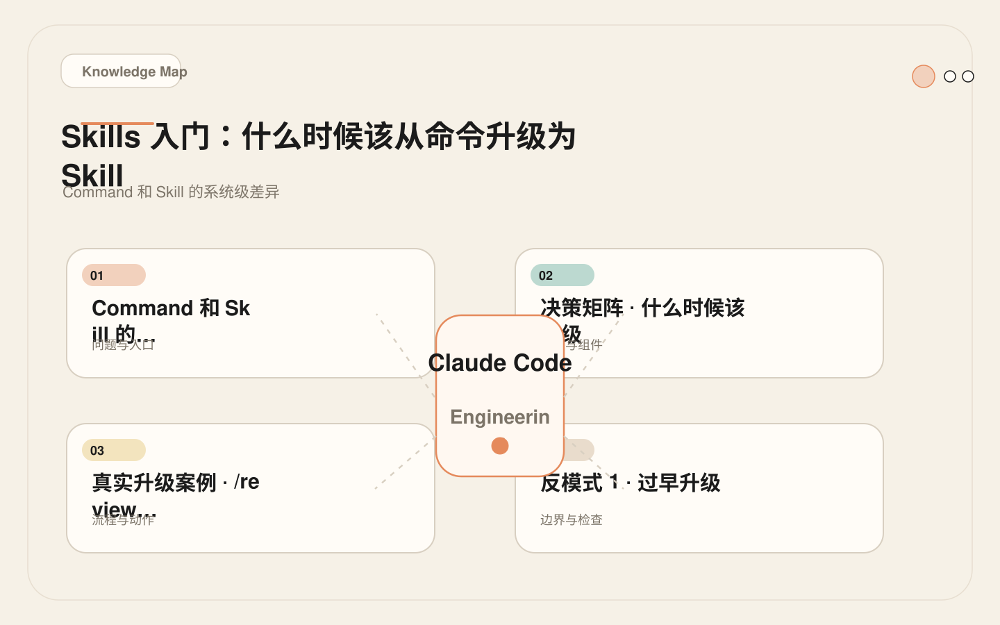
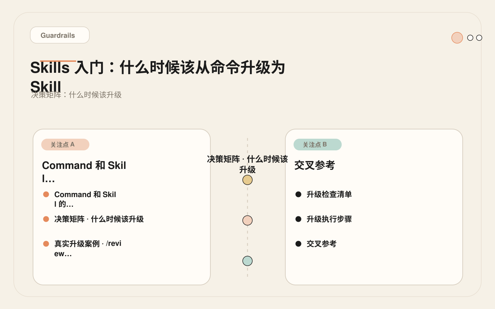
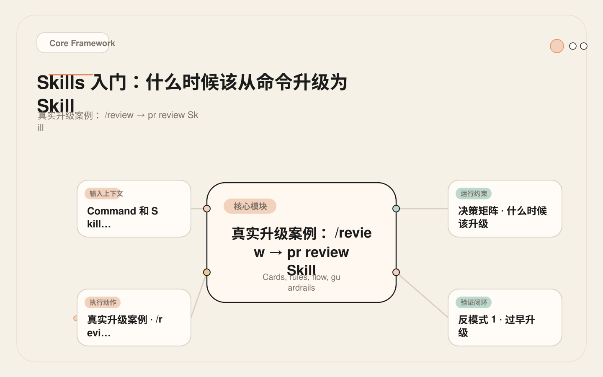
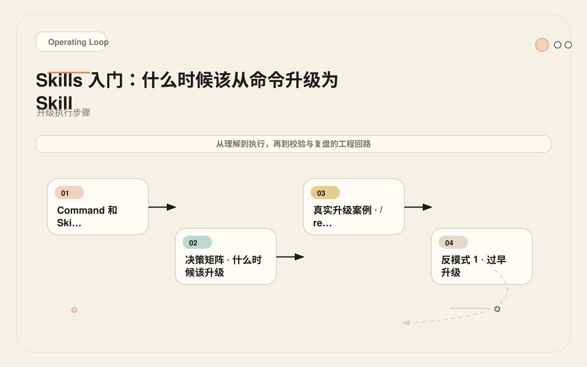

# 命令写到第三遍就该升级了：什么时候该从命令变成 Skill

<!-- codex:cover ../../../assets/claude-code-engineering/08-skills-from-command-to-capability-cover.webp -->

<!-- /codex:cover -->

**TL;DR：** Command 是一段可复用提示词，Skill 是一套结构化能力。当任务需要多步骤、外部资源、脚本执行或渐进式加载时，Command 已经不够用了——该升级。升级不是目的，解决 Command 无法承担的复杂性才是。

## Command 和 Skill 的系统级差异

这不是"大号命令"和"小号命令"的区别。Command 和 Skill 在加载机制、资源绑定和 token 消耗模型上完全不同。很多团队在升级与否之间犹豫不决，根本原因就是对这两个概念的系统级差异理解不透彻。把这一节搞清楚，后面所有的升级判断才有依据，而不是每次都凭感觉。

<!-- codex:illustration 08-skills-from-command-to-capability/01-overview-knowledge-map.svg -->

<!-- /codex:illustration -->

### 加载机制

Command 的加载路径非常直接：用户输入 `/review`，Claude Code 在 `.claude/commands/` 目录下找到 `review.md`，读取全文，将全部内容注入当前上下文。整个过程没有分阶段、没有按需读取、没有条件判断。文件有多长，上下文就消耗多少 token。无论这次 review 是看 10 行改动还是 1000 行改动，加载量完全一样。

Skill 的加载路径则完全不同。Claude Code 在会话启动时会扫描所有 `SKILL.md` 文件的 frontmatter——也就是 `name` 和 `description` 字段。这两段文字始终在内存中，但代价很小。当用户发出一条请求时，Claude Code 用这些 frontmatter 来匹配意图。如果匹配命中，才激活对应的 Skill。激活后不会把所有内容塞进上下文，而是只加载 `SKILL.md` 的主体部分（触发条件、步骤、路由逻辑）。模板、示例、脚本这些资源文件只有在步骤执行到需要它们的时候才读取。

```yaml
# Command 加载模型
trigger: 用户显式输入 /command-name
loading: 全量，一次注入
resources: 无（纯文本）
token_cost: 固定，等于文件长度

# Skill 加载模型
trigger: frontmatter name/description 匹配用户意图
loading: 渐进式，SKILL.md 主体 → 按需读取子资源
resources: templates/, examples/, scripts/
token_cost: 基础骨架 + 按需加载，平均节省 40-60%
```

这里有一个容易混淆的地方：Command 的触发是确定性的——用户输入 `/review` 就一定加载 `review.md`。Skill 的触发是概率性的——Claude Code 根据自然语言描述判断是否激活。这意味着 Skill 需要精心设计 frontmatter 的 `description` 来确保触发准确，而 Command 不需要。关于触发准确性的调优方法，详见 09 篇和 11 篇。

### 资源绑定

```text
Command 文件结构：
.claude/commands/review.md          ← 单文件，所有内容都在里面

Skill 文件结构：
.claude/skills/pr-review/
  SKILL.md                          ← 入口：触发条件 + 步骤 + 路由
  templates/
    severity-rubric.md              ← 严重度分级标准
    review-checklist.md             ← Review 检查清单
  examples/
    good-review-output.md           ← 期望输出示例
    bad-review-output.md            ← 反面示例
  scripts/
    count-loc-changed.sh            ← 统计变更规模的辅助脚本
```

Command 里如果要放检查清单，只能直接写在 `.md` 里，每次调用都加载，不管用不用得上。Skill 里检查清单放在 `templates/` 目录下，只有步骤执行到"参考检查清单"这一步时才读取。如果这次 review 只是快速扫一眼小改动，那些详细的检查清单和输出示例根本不会进入上下文。这就是资源绑定带来的核心差异：**按需加载替代全量加载**。

另一个容易被忽视的差异是脚本。Command 里写"运行 `git diff --stat`"只是文字指令，Claude Code 需要自行决定是否执行、怎么执行。Skill 里的 `scripts/` 目录是结构化声明——步骤中明确引用 `scripts/diff-stats.sh`，Claude Code 会按照 Skill 定义的逻辑去调用。执行路径更确定，结果也更可预测。

### Token 预算模型

```text
Command token 消耗：
┌──────────────────────────────┐
│  command.md 全文（固定开销）  │  ← 每次 /review 都加载完整内容
│  例：1800 tokens             │
└──────────────────────────────┘
总计：1800 tokens/次

Skill token 消耗（渐进式加载）：
┌────────────────────┐
│  SKILL.md 骨架      │  ← 每次加载（~600 tokens）
├────────────────────┤
│  templates/ (按需)  │  ← 仅触发时读取（~500 tokens）
├────────────────────┤
│  examples/ (按需)   │  ← 仅触发时读取（~400 tokens）
├────────────────────┤
│  scripts/ (按需)    │  ← 仅触发时执行（~300 tokens）
└────────────────────┘
基础开销：~600 tokens/次
全量开销：~1800 tokens/次（仅在需要所有资源时）
日常开销：~600-1000 tokens/次（多数场景不需要所有资源）
```

10 次调用的累计对比：

| 指标 | Command | Skill（渐进式） |
|------|---------|-----------------|
| 单次基础开销 | 1800 | 600 |
| 10 次累计 | 18000 | 6000-10000 |
| 峰值单次 | 1800 | 1800 |
| 平均节省 | - | 44-67% |

但这里需要强调一个常见的误解：**Skill 的核心收益不是省 token，而是一致性和可维护性。** Token 节省只是渐进式加载的副产品。真正重要的是，Skill 把执行标准、输出格式、资源引用都结构化了——这些在 Command 里只能靠提示词文字来约束，稳定性远不如结构化声明。

## 决策矩阵：什么时候该升级

不要凭感觉，不要因为"Skill 听起来更高级"就升级。用这张表逐行检查。

<!-- codex:illustration 08-skills-from-command-to-capability/04-compare-guardrails.svg -->

<!-- /codex:illustration -->

| 信号 | Command 足够 | 需要升级为 Skill |
|------|:----------:|:---------------:|
| 工作流 ≥ 3 步 | | ✓ |
| 需要模板或参考资源 | | ✓ |
| 需要运行脚本 | | ✓ |
| 多人复用，流程简单 | ✓ | |
| 多人复用，流程复杂 | | ✓ |
| 需要渐进式披露（内容多但不总是全要） | | ✓ |
| 需要评测/回归测试 | | ✓ |
| 内容 < 50 行 | ✓ | |
| 内容 > 50 行 | | ✓ |
| 需要根据场景加载不同子资源 | | ✓ |
| 人工显式调用即可 | ✓ | |
| 需要自动触发（根据意图匹配） | | ✓ |

**升级阈值：任意 3 行命中右侧，立刻升级。**

这个"3 条阈值"不是随便定的。两条以下说明任务简单，Command 完全胜任，升级只会增加维护成本和触发调试的负担。三条以上说明任务已经超出了"一段可复用提示词"的能力范围——它需要结构、需要资源、需要按需加载。这时候不升级，团队就会在越来越长的 Command 文件里堆砌内容，最终得到一个伪装成 Command 的 Skill，但缺少 Skill 的所有结构性优势。两个反模式案例（后面的过早升级和过晚升级）会进一步说明这个阈值为什么在实践中有效。

## 真实升级案例：`/review` → `pr-review` Skill

### 升级前：Command 版本

<!-- codex:illustration 08-skills-from-command-to-capability/02-framework-core-structure.svg -->

<!-- /codex:illustration -->

`.claude/commands/review.md`，20 行：

```markdown
# /review

Review the current diff.

Focus on:
- correctness
- missing tests
- security risks
- behavior changes

Return findings first, ordered by severity.
```

这个 Command 简洁、好用。团队用它 review 了两个月，基本满足需求。但随着使用频率增加，几个痛点逐渐暴露：

1. **严重度没有统一标准。** 同一个问题，这次被标"严重"，下次被标"建议"。Claude Code 的判断依据只有一行文字 "ordered by severity"，没有具体定义什么是严重。不同 reviewer 对结果的期望不一致，导致信任度下降。

2. **无法根据变更规模调整深度。** 10 行的改动和 500 行的改动用同一套策略审查，要么过度审查浪费时间，要么深度不够漏掉问题。

3. **输出格式不固定。** 有时候返回段落、有时候返回列表、有时候返回表格。下游流程（比如把 review 结果贴到 PR 评论）没法自动化处理。

4. **无法引用团队的安全检查清单。** 团队有一份 80 行的安全审查清单，但它只能放在 Confluence 上，Claude Code 无法在 Command 里引用它。

### 升级后：Skill 版本

目录结构：

```text
.claude/skills/pr-review/
  SKILL.md
  templates/
    severity-rubric.md
    output-format.md
  examples/
    sample-output.md
  scripts/
    diff-stats.sh
```

`SKILL.md`：

```markdown
---
name: pr-review
description: >
  Review a pull request diff for correctness, tests, security,
  and maintainability. Triggered when user asks for code review,
  PR review, or diff analysis.
---

# PR Review Skill

## Use When
- User asks for code review or PR review
- User provides a diff and asks for feedback
- Current task involves checking changes before merge

## Do Not Use When
- User asks to implement changes directly
- User asks to explain code (use explain-module instead)

## Steps

1. **Scope Assessment**
   Run `scripts/diff-stats.sh` to determine change size.
   - < 100 lines changed: quick review mode
   - 100-500 lines: standard review
   - > 500 lines: ask user to split PR

2. **Finding Collection**
   Check each hunk against these dimensions:
   - Correctness: does the code do what it claims?
   - Tests: are new behaviors covered?
   - Security: read `templates/severity-rubric.md` for security checklist
   - Maintainability: naming, coupling, duplication

3. **Severity Classification**
   Read `templates/severity-rubric.md` for definitions.
   Classify each finding as: blocker / warning / suggestion.

4. **Output Formatting**
   Read `templates/output-format.md` for expected structure.
   Findings first, ordered by severity.
   Include verification steps for each finding.

## Output
- Findings table (severity, file, line, description, fix suggestion)
- Open questions
- Verification gaps
```

`templates/severity-rubric.md`：

```markdown
# Severity Classification

## Blocker
- Security vulnerability (injection, auth bypass, data leak)
- Logic error causing data loss or corruption
- Missing test for new behavior in critical path
- Breaking API change without migration path

## Warning
- Potential performance regression (N+1, missing index)
- Missing error handling
- Inconsistent naming or style
- Insufficient logging for debugging

## Suggestion
- Code organization improvement
- Documentation gap
- Minor naming clarity
- Opportunity for abstraction
```

`templates/output-format.md`：

```markdown
# Review Output Format

## Findings

| Severity | File | Line | Description | Suggested Fix |
|----------|------|------|-------------|---------------|
| blocker  | ... | ... | ... | ... |

## Open Questions
- [Question 1]
- [Question 2]

## Verification Gaps
- [Gap 1]: [What to verify and how]
```

`scripts/diff-stats.sh`：

```bash
#!/bin/bash
# Count lines changed in current diff
STATS=$(git diff --stat HEAD~1 2>/dev/null || git diff --stat --cached 2>/dev/null)
ADDED=$(echo "$STATS" | tail -1 | grep -oE '[0-9]+ insertion' | grep -oE '[0-9]+' || echo "0")
DELETED=$(echo "$STATS" | tail -1 | grep -oE '[0-9]+ deletion' | grep -oE '[0-9]+' || echo "0")
TOTAL=$((ADDED + DELETED))
echo "Lines changed: $TOTAL ($ADDED added, $DELETED deleted)"
echo "Files changed: $(echo "$STATS" | wc -l | tr -d ' ')"
```

### 升级解决了什么

回顾之前的四个痛点，逐一验证：

1. 严重度标准 → `severity-rubric.md` 明确定义了 blocker / warning / suggestion 的边界，每次 review 用同一套标准。
2. 变更规模适配 → Step 1 调用 `diff-stats.sh`，根据变更行数选择审查深度。
3. 输出格式 → `output-format.md` 固定了表格结构，下游流程可以稳定解析。
4. 安全检查清单 → 嵌入到 `severity-rubric.md` 的 Blocker 部分，作为子资源按需加载。

### 升级前后的 token 消耗对比

实际测量数据（10 次 review 任务）：

```text
Command 版本（10 次）：
  每次：加载完整 review.md = ~350 tokens
  累计：3500 tokens
  问题：严重度标准不一致，output 格式飘忽

Skill 版本（10 次）：
  每次基础：SKILL.md 骨架 = ~450 tokens
  需要严重度标准时（7/10 次）：+200 tokens = 650
  需要输出格式时（8/10 次）：+150 tokens = 600-800
  全量加载（2/10 次，大 PR）：+350 tokens = 1000
  累计：450*10 + 200*7 + 150*8 + 100*2 = 7500 tokens

等等，Skill 反而多了？对。
但 Command 版本缺少严重度标准和输出格式，导致：
  - 3 次 review 返回结果不可用，需要追加 2-3 轮对话修正
  - 追加对话的平均成本：~800 tokens/轮
  - 3 次修正 × 2.5 轮 × 800 = 6000 tokens 的返工成本

实际总成本：
  Command：3500 + 6000（返工）= 9500 tokens
  Skill：7500 tokens（一次通过，无返工）
  净节省：~21%
```

这个数据说明一个关键事实：**单独比首次加载的 token 数没有意义。** 必须把返工成本算进去。Skill 因为结构化程度高，输出一致性更好，返工更少。Command 看起来省 token，但如果 30% 的调用需要追加对话来修正格式和标准，实际成本反而更高。在做升级决策时，不要只看单次加载的 token 数，要看完整链路的总消耗：首次调用加返工的总成本才是真实的比较基准。

## 反模式 1：过早升级

### 经过

一个 4 人前端团队把 `/commit` 命令升级成了 `smart-commit` Skill。起因是有人在内部分享里看到"Skill 比 Command 更强大"，回去就把所有 Command 都升级了。这不是个例——很多团队在接触 Skill 概念后都会经历一轮"全量升级"的冲动。

升级后的结构：

```text
.claude/skills/smart-commit/
  SKILL.md                          ← 80 行
  templates/
    commit-style-guide.md           ← 60 行，commit message 格式规范
    conventional-commits.md         ← 40 行，Conventional Commits 说明
  examples/
    good-commit.md                  ← 30 行
    bad-commit.md                   ← 30 行
  scripts/
    detect-commit-type.sh           ← 25 行，自动判断 fix/feat/chore
    validate-message.sh             ← 20 行，校验 commit message 格式
```

总计 285 行，4 个子文件，2 个脚本。

原来的 Command 是什么？20 行：

```markdown
# /commit

Generate a commit message for staged changes.

Follow Conventional Commits format:
- feat: new feature
- fix: bug fix
- docs: documentation
- refactor: code restructuring

Read the staged diff, infer type, write message.
Ask before committing.
```

### 根因分析

团队没有设定升级阈值。看到"Skill 更高级"就全面升级，跳过了"这个任务是否真的需要 Skill 的能力"这个判断。这是最常见的升级错误：用技术选型的心态做工具决策，而不是用成本收益分析的心态。

```text
维护成本：
  - SKILL.md 改了 3 次才让触发不误判（commit 和 commitlint 混淆）
  - detect-commit-type.sh 在 monorepo 下路径判断出错，需要特殊处理
  - commit-style-guide.md 和 CLAUDE.md 里的规则重复，后续维护两份
  - validate-message.sh 的校验逻辑和 git hook 重复

实际收益：
  - 20 行 Command 已经能生成合格的 commit message
  - Skill 版本的 commit message 质量没有可观测的提升
  - 渐进式加载在 20 行的规模下没有 token 节省
  - 每次提交触发 Skill 选择反而增加了延迟
```

用决策矩阵验证：只有 1 行命中右侧（多人复用），远不够 3 行阈值。这个升级从一开始就不该发生。

### 修复

**降级回 Command。** 删除整个 `smart-commit/` 目录，恢复 20 行的 Command 文件。把 `commit-style-guide.md` 中有价值的内容（比如团队约定的 scope 列表）合并到 Command 里，总共增加 5 行。最终 Command 25 行，解决问题。

这个案例的核心教训是：升级决策应该基于任务复杂度，而不是工具的"高级感"。20 行的 Command 能稳定产出的东西，不应该为了使用 Skill 而强行升级。工具的目的是降低成本、提高一致性，不是为了满足技术审美。

## 反模式 2：过晚升级

### 经过

一个 8 人后端团队负责支付系统的事件响应。团队在引入 Claude Code 的第一天就把事件响应流程做成了 `/incident` 命令，之后 6 个月持续使用，文件从最初的 40 行膨胀到 158 行。期间没有人提议升级，因为"每次都能跑通"。

`.claude/commands/incident.md`，158 行：

```markdown
# /incident

You are an incident analyst. When given an error report or alert:

## Step 1: Gather Context
- Read recent logs from /var/log/app/
- Check deployment history (git log --oneline -20)
- Review recent changes in affected service

## Step 2: Classify Severity
...（40 行严重度分级标准）

## Step 3: Root Cause Analysis
...（30 行分析方法论）

## Step 4: Reference Past Incidents
...（20 行历史事件参考格式）

## Step 5: Generate Report
...（30 行报告模板）

## Step 6: Verification
...（20 行验证步骤）
```

### 问题

1. **158 行全量加载。** 每次事件响应都消耗约 2800 tokens 的上下文。实际使用中，90% 的事件只需要 Step 1-3（收集上下文、分级、根因分析）和 Step 6（验证）。Step 4（历史参考）和 Step 5（完整报告模板）只在需要写事后分析报告时才用。但因为是 Command，每次都全量加载，没有按需加载的机制。

2. **无法引用外部资源。** 历史事件数据存在仓库的 `incidents/` 目录下，按日期组织。Command 里写的是"参考 incidents/ 目录下类似事件"，但这只是一段文字描述。Claude Code 有时候去翻了，有时候没翻，翻的时候也不确定该看哪个文件。无法像 Skill 那样在步骤里声明"读取 `resources/past-incidents/` 下最近的 5 个文件"。

3. **无法运行脚本。** 日志收集（需要从远程服务器拉取）、部署历史查询（需要解析 git log 和 CI 数据）、健康检查（需要调用内部 API）这些操作本来可以脚本化。但 Command 里只能写文字说明"运行 xxx 命令"，Claude Code 每次都要重新理解要运行什么、参数是什么。

4. **维护困难。** 158 行的单文件已经超出舒适区。团队成员反馈："改严重度分级标准的时候怕影响下面的分析方法论，改报告模板的时候怕影响上面的分级标准。"结果是没有人愿意动这个文件，内容逐渐过期。团队后来承认，严重度标准已经三个月没更新，和实际分级习惯严重脱节。

### 根因分析

"能用就不要动"心态。团队的逻辑是：Command 在工作，每次事件响应都跑得起来，为什么要改？这个逻辑忽略了隐性成本——每次多加载 1500 tokens 的无用内容、历史参考形同虚设、脚本能力浪费、文件过期没人维护。过晚升级的代价不比过早升级小，只是更容易被忽视，因为系统表面上还在运转。

用决策矩阵验证：6 行命中右侧（工作流 ≥ 3 步、需要模板/参考资源、需要运行脚本、需要渐进式披露、内容 > 50 行、涉及外部资源）。远超阈值。这个 Command 两个月前就该升级了。

### 修复

升级为 `incident-analysis` Skill：

```text
.claude/skills/incident-analysis/
  SKILL.md                          ← 50 行骨架（步骤 + 路由）
  templates/
    severity-classification.md      ← 40 行严重度标准
    report-format.md                ← 30 行报告模板
  resources/
    past-incidents/                  ← 历史事件目录
  scripts/
    gather-logs.sh                  ← 日志收集脚本
    check-deploy-history.sh         ← 部署历史查询
```

升级后的效果：

```text
Token 消耗（单次事件响应）：
  之前：2800 tokens（全量加载，不管用不用得到）
  之后：SKILL.md 骨架 ~800 + 按需加载 ~400-800
  日常响应（不需要完整报告）：~1200 tokens，节省 57%
  完整分析（需要报告+历史参考）：~1800 tokens，节省 36%

执行质量：
  之前：Claude Code 经常跳过历史事件参考（因为已经 158 行了，模型注意力分散）
  之后：Step 4 明确指向 resources/past-incidents/，Claude Code 按需读取，参考率从 30% 提升到 90%

维护成本：
  之前：158 行单文件，改一处怕影响全局，没人愿意动
  之后：50 行骨架 + 独立子文件，严重度标准和报告模板可以独立修改
```

## 升级检查清单

当以下任意 3 条为真时，将 Command 升级为 Skill：

```text
[ ] 工作流有 3 个以上明确步骤
[ ] 需要引用模板、示例或参考文档
[ ] 需要运行脚本（日志收集、数据统计、环境检查等）
[ ] 内容超过 50 行，但不是每次都需要全部内容
[ ] 多人使用，且对输出格式和执行标准有严格要求
[ ] 需要自动触发（而非仅靠用户手动输入 /command）
[ ] 需要评测样例来验证触发准确性和执行质量
[ ] 任务涉及外部资源（历史数据、配置文件、检查清单）
```

3 条命中 → 升级。不够 3 条 → 保持 Command。

不要跳过这个检查。过早升级增加维护成本——你要花时间调试触发、维护子文件、处理重复配置。过晚升级增加运行成本——每次全量加载、无法引用资源、维护困难。阈值的意义在于用客观标准替代主观判断，减少"凭感觉决定"带来的两端风险。

## 升级执行步骤

确认需要升级后，按以下步骤操作。每一步都有明确产出，不要跳步。跳步是升级失败的最常见原因——要么拆分不干净导致 SKILL.md 过长，要么 frontmatter 写得太宽导致误触发，要么没评测就上线导致触发率不可控。

<!-- codex:illustration 08-skills-from-command-to-capability/03-flow-operating-loop.svg -->

<!-- /codex:illustration -->

```text
1. 拆分内容
   把 Command 内容分为三类：
   - 骨架 = 步骤定义、触发条件、路由逻辑（保留在 SKILL.md）
   - 资源 = 模板、示例、参考文档（移到 templates/、examples/）
   - 脚本 = 可执行的操作（移到 scripts/）
   拆分原则：SKILL.md 控制在 50 行以内

2. 写 frontmatter
   name: 简短、唯一、能区分其他 Skill
   description: 覆盖所有触发场景的自然语言描述
   写完后用 10 条真实请求测试触发准确性

3. 建目录结构
   skills/<skill-name>/
     SKILL.md
     templates/   (按需)
     examples/    (按需)
     scripts/     (按需)
   不是每个 Skill 都需要所有子目录

4. 写评测样例
   准备 5 条应该触发 + 5 条不应该触发的请求
   详见 11 篇的评测方法

5. 过渡期保留原 Command
   保留原 Command 文件 2 周
   等 Skill 触发稳定后再删除
   避免升级期间功能空窗
```

## 交叉参考

- [07 - Slash Commands](07-slash-commands.md)：Command 的基础用法，升级前先确认 Command 本身写对了
- [09 - SKILL.md 结构](09-skill-md-structure.md)：Skill 的完整文件结构、frontmatter 规范和触发描述的写法
- [10 - 渐进式披露](10-progressive-disclosure.md)：Skill 如何按需加载资源、控制 token 消耗的详细机制
- [11 - Skill 评测](11-skill-evaluation.md)：升级后的评测方法，欠触发和误触发的诊断与修复


