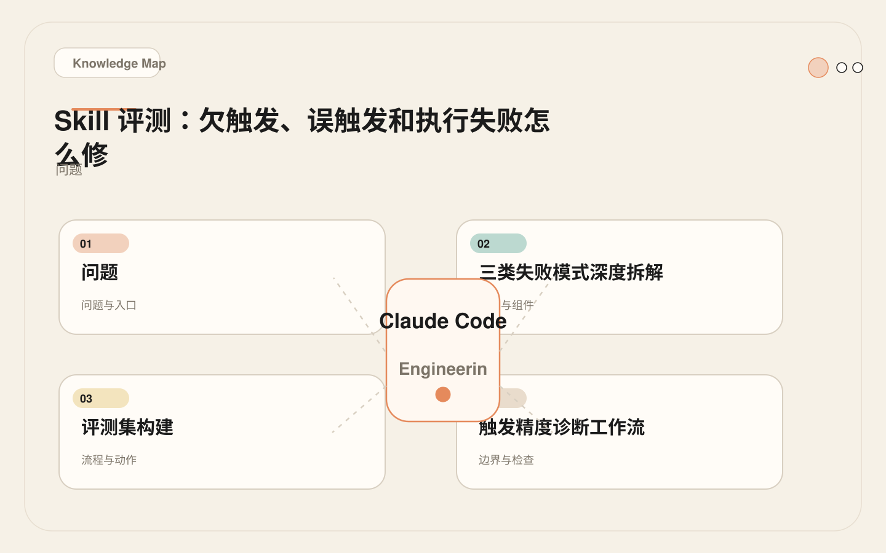
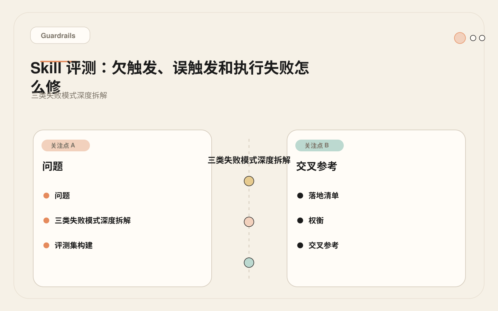
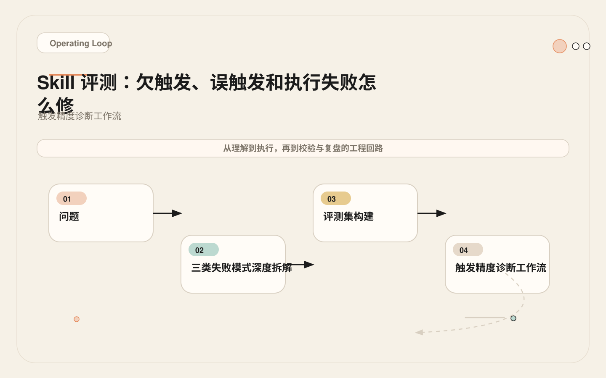
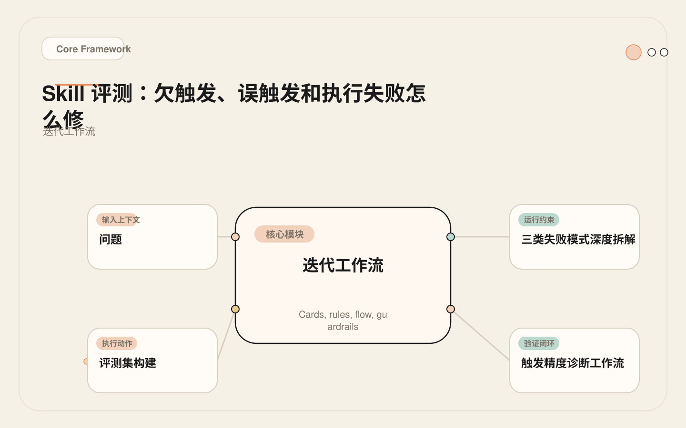

# Skill 不触发、乱触发、跑挂了：一份评测与调优指南

<!-- codex:cover ../../../assets/claude-code-engineering/11-skill-evaluation-cover.webp -->

<!-- /codex:cover -->

**TL;DR：** Skill 写完不等于能用。三类核心故障——欠触发、误触发、执行失败——各有根因和修复路径。用 15 条评测集量化触发精度，用评分表量化输出质量，迭代三轮再上线。

## 问题

团队写完 SKILL.md 直接进生产。现象：有时 Claude 不加载 Skill，有时无关任务也触发，有时触发后输出仍然不稳定。没有评测就没有基线，没有基线就无法迭代。

<!-- codex:illustration 11-skill-evaluation/01-overview-knowledge-map.svg -->

<!-- /codex:illustration -->

根本原因在于：Skill 的触发依赖 Claude 对 description 的语义匹配，而语义匹配是概率行为，不是精确匹配。description 的措辞、范围、排除条件，直接决定触发行为。但这些参数的调整，不靠直觉，靠数据。

## 三类失败模式深度拆解

### 欠触发（Under-trigger）

<!-- codex:illustration 11-skill-evaluation/04-compare-guardrails.svg -->

<!-- /codex:illustration -->

**表现**：用户意图明确匹配 Skill 能力范围，但 Claude 没有激活该 Skill。用户反复用自然语言请求，但 Skill 就是不出现。

**根因链路**：

```
用户输入 → Claude 匹配 Skill description → 无匹配 → Skill 未加载
                ↑
         根因在此处
```

1. **description 写得太窄**。只写了技术术语，没有覆盖用户的自然语言表述。这是最常见的欠触发原因。开发者写 description 时会下意识用精确的技术语言描述功能，但用户在实际使用时的措辞往往更随意、更多样。

```yaml
# 欠触发的 description —— 只覆盖了一种说法
description: "Review a pull request diff for correctness and security."

# 用户可能的说法：
# "帮我看看这个改动有没有问题"
# "这段代码安不安全"
# "review 一下"
# "check my changes"
# 以上四条全部无法匹配
```

2. **用户措辞与触发文本语义距离过大**。中文团队用英文写 description，中文请求触发不了。这不是翻译问题，而是语义空间中的距离问题。"帮我看看"和"Review a pull request diff"在模型内部表示的距离可能远大于预期。特别是当团队成员技术水平参差不齐时，对同一功能的描述差异会非常大。

3. **竞争 Skill 的 description 更宽泛**。两个 Skill 描述有重叠时，Claude 倾向选择描述更宽的那个。比如你有一个 `pr-review` Skill 和一个 `code-quality` Skill，如果后者的 description 更宽泛，前者的请求可能被错误路由。

### 误触发（False Trigger）

**表现**：用户意图与 Skill 无关，但 Skill 仍然被激活，占用上下文并可能产生干扰输出。误触发的危害比欠触发更大——欠触发只是功能缺失，误触发是主动干扰。

**根因链路**：

```
用户输入 → Claude 匹配 Skill description → 错误匹配 → Skill 加载
                ↑
         description 太宽 或 缺少排除条件
```

1. **description 太宽**。用了通用动词，覆盖了不相关的任务。这类动词包括 review、analyze、check、validate、improve、optimize 等。它们在日常开发语境中的语义范围远比 Skill 的实际能力范围要大。

```yaml
# 误触发的 description —— "Review and analyze" 覆盖面太广
description: "Review and analyze code for quality issues."

# 会错误触发的请求：
# "帮我分析一下这个 bug 的原因"       → 触发（实际是 debug，不是 review）
# "看看这个函数的时间复杂度"          → 触发（实际是性能分析）
# "这段代码能跑吗"                    → 触发（实际是运行验证）
# "review 一下这个设计文档"           → 触发（实际是文档，不是代码）
```

2. **关键词与不相关任务重叠**。`review`、`analyze`、`check` 这类高频动词出现在大量任务中。一个 Skill 的 description 里出现这类词，意味着它在与所有包含这些动词的请求竞争。

3. **缺少 `Do Not Use When` 段**。没有告诉 Claude 哪些场景应该排除。Do Not Use When 不是可选项——它是控制误触发的主要手段。没有这段的 Skill，误触发率通常会高出 2-3 倍。

### 执行失败（Execution Failure）

**表现**：Skill 正确触发，但输出质量不达标——遗漏步骤、格式错误、幻觉内容、范围失控。这类问题最隐蔽，因为触发本身成功了，给人一种"Skill 在工作"的错觉。

**根因链路**：

```
Skill 加载 → Claude 读取 Steps/Resources → 执行 → 输出质量差
                    ↑
             步骤模糊 / 资源缺失 / 格式未定义
```

1. **步骤太模糊**。`"Review the code"` 不是可执行步骤，它是一个意图描述。Claude 需要知道具体动作：读什么文件、用什么命令、检查什么维度、输出什么格式。步骤越模糊，执行结果的方差越大。

```yaml
# 模糊步骤 —— 无法可靠执行
steps:
  - "Review the code for issues"
  - "Check if there are tests"
  - "Provide feedback"

# 可执行步骤 —— 明确动作和产物
steps:
  - "Read the current diff using git diff HEAD~1"
  - "For each changed file, classify: behavior change | refactor | test | config"
  - "For behavior changes, identify: side effects, error handling, edge cases"
  - "Check if changed code has corresponding test coverage"
  - "Output findings as: [CRITICAL|WARN|INFO] file:line — description"
```

2. **资源路径错误或缺失**。Skill 引用了不存在的模板文件。Claude 读取失败后可能跳过该步骤，或者用自己生成的内容替代——这就是幻觉的来源之一。

3. **输出格式未定义**。Claude 不知道应该输出 list、table 还是 structured report。没有格式约束，每次执行的输出结构都可能不同。

4. **隐式上下文依赖**。Skill 假设当前工作目录、分支状态或文件结构，但没有显式说明。比如步骤中写了 `git diff HEAD~1`，但没有考虑 detached HEAD 状态或刚初始化的仓库。这类假设在开发者的本地环境往往成立，但在其他成员的环境或 CI 中可能不成立。

## 评测集构建

### 15 条评测 Prompt

对每个 Skill，构建如下测试集。正例验证召回率，反例验证精确率，边界例用于标定灰色地带的决策边界。

评测集的构建原则是：用团队真实会使用的措辞，而不是测试者自己造的措辞。最好的来源是 Claude Code 的会话历史——把过去一周的真实请求拿过来，分类标注。

```markdown
# pr-review Skill 评测集

## 正例（应该触发）—— 5 条

| # | Prompt | 触发原因 |
|---|--------|----------|
| P1 | "Review this diff before I merge" | 明确请求代码审查 |
| P2 | "看看这个 PR 有没有安全问题" | 安全维度审查请求 |
| P3 | "Check if my changes break anything" | 变更影响评估 |
| P4 | "这个改动需要 review，帮我看看" | 中文直接请求 review |
| P5 | "我刚改了 auth 模块，帮我检查一下边界条件" | 特定模块审查 |

## 反例（不应触发）—— 5 条

| # | Prompt | 不触发原因 |
|---|--------|-----------|
| N1 | "帮我实现这个 feature" | 是实现，不是审查 |
| N2 | "这个 bug 怎么修" | 是调试，不是审查 |
| N3 | "跑一下测试看看有没有问题" | 是执行，不是审查 |
| N4 | "帮我重构这个函数" | 是重构，不是审查 |
| N5 | "写个设计文档" | 是文档，不是审查 |

## 边界例（可能触发也可能不触发）—— 5 条

| # | Prompt | 边界说明 |
|---|--------|---------|
| B1 | "这段代码能优化吗" | 偏性能分析，但可能含 review 意图 |
| B2 | "看看这个依赖升级安不安全" | 是安全审查，但范围是依赖 |
| B3 | "我改了配置文件，帮我确认没问题" | 配置审查，但非代码审查 |
| B4 | "解释一下这段代码做了什么" | 是理解，不是审查，但用户可能隐含审查意图 |
| B5 | "这个 PR description 写得对不对" | 是文档审查，不是代码审查 |
```

### 评测记分卡

评测的核心是四个指标。Recall 衡量欠触发程度，Precision 衡量误触发程度，F1 综合两者，Execution Quality 衡量触发后的输出是否可用。

```markdown
## Trigger Accuracy Scorecard

| 指标 | 公式 | 目标 | 本轮结果 |
|------|------|------|----------|
| Recall（召回率） | correct_triggers / should_trigger_total | ≥ 80% | _待填_ |
| Precision（精确率） | correct_triggers / total_triggered | ≥ 80% | _待填_ |
| F1 | 2 × P × R / (P + R) | ≥ 80% | _待填_ |
| Execution Quality | correct_outputs / total_triggered | ≥ 70% | _待填_ |

计算示例：
- P1-P5 中触发 4 条（P5 未触发）→ Recall = 4/5 = 80%
- N1-N5 中触发 2 条（N2, N3）→ False triggers = 2
- B1-B5 中触发 3 条（B1, B2, B3）→ Borderline triggers = 3
- Total triggered = 4 + 2 + 3 = 9
- Precision = 4 / 9 = 44.4%  ← 严重误触发
- F1 = 2 × 0.444 × 0.8 / (0.444 + 0.8) = 0.571 ← 不达标
```

注意边界例的处理方式：边界例触发与否不算错误，但需要记录决策。如果 B2 触发了且输出质量合格，那就可以把依赖升级安全审查纳入 Skill 的能力范围。关键不是边界例必须触发或不触发，而是每次迭代的决策要一致。

## 触发精度诊断工作流

### 欠触发诊断

<!-- codex:illustration 11-skill-evaluation/03-flow-operating-loop.svg -->

<!-- /codex:illustration -->

诊断欠触发的核心思路是：找到用户 prompt 与 Skill description 之间的语义断裂点。

```bash
# Step 1: 确认用户 prompt 与 Skill description 的语义距离
# 对比未触发的 prompt 和 description 的关键词重叠

# P5 未触发: "我刚改了 auth 模块，帮我检查一下边界条件"
# description: "Review a pull request diff for correctness and security."
# 关键词重叠: 无。"检查边界条件" ≈ "correctness"，但语义距离大

# Step 2: 检查竞争 Skill
# 是否有其他 Skill 的 description 覆盖了这个请求？
grep -r "description:" skills/ | grep -i "check\|inspect\|边界"

# Step 3: 修复 —— 在 description 中加入覆盖性表述
```

修复前后的 description 对比：

```yaml
# Before —— 触发范围太窄
description: "Review a pull request diff for correctness and security."

# After —— 覆盖中文表述和更多审查维度
description: >
  Review code changes for correctness, security, edge cases, and test coverage.
  Triggers on: code review, PR review, diff check, change review,
  检查改动, review 一下, 帮我看看, 边界条件, 安全检查.
```

修复策略有三个层面。第一，在 description 中直接加入团队常用的触发表述，包括中英文。第二，在 Use When 段列出具体的触发场景，给 Claude 更多匹配锚点。第三，如果竞争 Skill 是根因，需要重新划分两个 Skill 的 description 边界，消除重叠。

### 误触发诊断

诊断误触发的核心思路是：找到 Skill description 中过度宽泛的部分，并用 Do Not Use When 精确排除。

```bash
# Step 1: 确认误触发的 prompt 为什么匹配了 description
# N2 误触发: "这个 bug 怎么修"
# description 含 "analyze code" → "怎么修" 被理解为 analyze

# Step 2: 检查 Do Not Use When 是否覆盖
# 当前 Do Not Use When:
#   - User asks to implement changes directly.
# 是否覆盖了 debug? 没有。

# Step 3: 修复 —— 扩展排除条件
```

修复前后的 Do Not Use When 对比：

```yaml
# Before —— 排除不够
do_not_use_when:
  - "User asks to implement changes directly."

# After —— 明确排除不相关场景
do_not_use_when:
  - "User asks to implement changes directly."
  - "User asks to debug or fix a bug."
  - "User asks to run tests or execute commands."
  - "User asks to write or refactor code."
  - "User asks about documentation, not code."
```

Do Not Use When 的粒度要足够具体。`"User asks about something else"` 这种泛泛的排除没有用——Claude 不会理解"something else"指什么。每一条排除条件都应该对应一类真实的误触发 case。

### 执行质量评分表

每次触发后，对输出逐项打分。这个评分不是主观印象，而是针对 Skill 定义的步骤、格式和资源逐条校验。

```markdown
## Execution Quality Rubric

| 维度 | 合格标准 | 判定 |
|------|---------|------|
| 步骤完整性 | Follow 所有 Steps，无遗漏 | yes / no |
| 格式正确性 | 输出匹配 Output 段定义的格式 | yes / no |
| 资源使用 | 正确引用模板/脚本/示例，无虚构路径 | yes / no |
| 无幻觉 | 不编造不存在的文件、函数或配置 | yes / no |
| 范围适当 | 不发散到无关话题，不遗漏关键项 | yes / no |

评分规则：
- 5/5 = 完全合格
- 4/5 = 可接受，有小问题
- ≤3/5 = 需要修复 Skill 内容
- 执行质量 = 合格输出数 / 总触发数

示例：
| Prompt | 步骤 | 格式 | 资源 | 幻觉 | 范围 | 合计 |
|--------|------|------|------|------|------|------|
| P1 | yes | yes | yes | yes | yes | 5/5 |
| P2 | yes | no | yes | yes | no | 3/5 |
| P3 | yes | yes | yes | no | yes | 4/5 |
| P4 | no | no | yes | yes | yes | 3/5 |
| P5 | — | — | — | — | — | 未触发 |

合格数（≥4/5）= 2, 触发数 = 4
执行质量 = 2/4 = 50% ← 不达标（目标 ≥ 70%）
```

执行质量低通常指向 Steps 段的问题。P4 得分 3/5，因为步骤遗漏和格式错误——这说明步骤的措辞还是不够具体，Claude 理解出了偏差。修复方向是把抽象步骤替换为包含具体命令和输出的可执行步骤。

## 迭代工作流

### 评测驱动的迭代循环

<!-- codex:illustration 11-skill-evaluation/02-framework-core-structure.svg -->

<!-- /codex:illustration -->

迭代不是盲改，而是每次修改都对应一个具体的失败 case，修改后用同一个评测集验证改善效果。

```
Evaluate → Identify Failure Mode → Fix → Re-evaluate → Ship
    ↑                                              |
    └──────────────────────────────────────────────┘
                     直到指标达标
```

每一轮迭代的操作规范：

1. **只改一个变量**。如果同时改 description 和 steps，无法判断哪个改动导致了指标变化。
2. **记录改动原因**。每次修改都要对应一个具体的失败 case 或一个评测集里的低分项。
3. **全量重跑**。不能只验证上一轮失败的 case，要跑完 15 条，确认没有引入回归。

### 真实迭代案例：pr-review Skill 三轮改进

**Iteration 0 — 初始版本**

这是开发者第一次写的版本。description 极其简短，steps 几乎没有信息量。没有 Use When，没有 Do Not Use When。

```yaml
# skills/pr-review/SKILL.md (v0)
---
name: pr-review
description: Review and analyze code.
---
# PR Review

## Steps
1. Look at the code.
2. Find issues.
3. Report them.
```

评测结果：

```
Recall: 2/5 = 40%    ← 欠触发严重
Precision: 2/8 = 25%  ← 误触发极严重
F1: 0.31
Execution Quality: 1/2 = 50% ← 执行也不稳定
```

问题分析：description 里的"Review and analyze code"既窄又宽。窄在它只说了"code"，没有覆盖 diff、PR、changes 等触发表述。宽在"analyze"匹配了太多不相关任务。steps 完全没有指导意义，导致执行质量只有 50%。

**Iteration 1 — 修复 description 和 Do Not Use When**

这一轮只改 description 和新增 Do Not Use When，steps 也做了具体化。不改输出格式。

```yaml
# skills/pr-review/SKILL.md (v1)
---
name: pr-review
description: >
  Review code changes for correctness, security, edge cases, and test coverage.
  Use when user asks to review a diff, check a PR, or audit code changes.
---
# PR Review Skill

## Use When
- User asks for code review or PR review.
- User wants to check code changes before merging.
- User asks about correctness or security of changes.

## Do Not Use When
- User asks to implement changes.
- User asks to debug or fix a bug.
- User asks to run tests or execute code.
- User asks to write documentation.

## Steps
1. Read the current diff using `git diff HEAD~1` or the diff provided by user.
2. For each changed file, classify: behavior change, refactor, test, or config.
3. For behavior changes, identify side effects, error handling, and edge cases.
4. Check if changed code has corresponding test coverage.
5. Output findings ordered by severity: CRITICAL > WARN > INFO.

## Output
- Findings list: [SEVERITY] file:line — description
- Open questions
- Verification gaps
```

评测结果：

```
Recall: 4/5 = 80%    ← 改善
Precision: 4/6 = 67%  ← 仍有些误触发（N3 和 B1）
F1: 0.73             ← 接近但不达标
Execution Quality: 3/4 = 75% ← 达标
```

问题分析：P5 仍然没触发——中文表述"检查一下边界条件"没有在 description 中覆盖。N3 "跑一下测试看看有没有问题"误触发，因为"看看有没有问题"与 review 语义重叠。B1 "这段代码能优化吗"误触发，因为 description 中的"correctness"被模型理解为包含性能。

**Iteration 2 — 收紧 description 和细化排除**

这一轮聚焦两个问题：加入中文触发表述，明确排除性能分析场景。同时在 Use When 中加入具体的中英文触发短语。

````yaml
# skills/pr-review/SKILL.md (v2)
---
name: pr-review
description: >
  Review a code diff or pull request for correctness bugs, missing tests,
  security risks, and maintainability issues. Only for reviewing existing
  code changes — not for implementing, debugging, or running code.
---
# PR Review Skill

## Use When
- User asks to review a diff, PR, or code changes.
- User wants a second pair of eyes on code before merging.
- User asks "帮我看看" or "review 一下" in context of code changes.

## Do Not Use When
- User asks to implement, write, or refactor code.
- User asks to debug, fix, or diagnose a bug.
- User asks to run tests, execute commands, or verify by running.
- User asks about documentation, design docs, or config files alone.
- User asks to optimize performance (use performance skill instead).

## Steps
1. Run `git diff HEAD~1 --stat` to see changed files summary.
2. Run `git diff HEAD~1` to read full diff.
3. For each file with behavior changes:
   a. Identify the purpose of the change.
   b. List potential side effects.
   c. Check error handling for new code paths.
   d. Verify edge cases are handled.
4. Run `find . -path "*/test*/*" -name "*$(basename <changed_file>)*"` to check test coverage.
5. Synthesize findings into structured output.

## Output
```
## Findings
- [CRITICAL] file:line — description
- [WARN] file:line — description
- [INFO] file:line — description

## Open Questions
- question 1
- question 2

## Verification Gaps
- gap 1
```
````

评测结果：

```
Recall: 5/5 = 100%   ← 全部触发
Precision: 5/6 = 83%  ← 只剩 B1 一个边界误触发
F1: 0.91             ← 达标
Execution Quality: 4/5 = 80% ← 达标
```

三轮迭代的指标变化：

```
| 指标       | v0  | v1  | v2  | 目标  |
|-----------|-----|-----|-----|-------|
| Recall    | 40% | 80% | 100%| ≥ 80% |
| Precision | 25% | 67% | 83% | ≥ 80% |
| F1        | 0.31| 0.73| 0.91| ≥ 0.80|
| Exec Qual | 50% | 75% | 80% | ≥ 70% |
```

从 v0 到 v2，核心改动是三件事：第一，description 从泛泛的"Review and analyze code"变成了精确的"Review a code diff or pull request for correctness bugs, missing tests, security risks, and maintainability issues"，明确了输入（diff/PR）和输出维度（bug/test/security/maintainability）。第二，新增了 Do Not Use When，排除了五个主要的误触发方向。第三，steps 从抽象指令变成了包含具体 git 命令的可执行步骤。

## 评测记录模板

每个 Skill 维护一个 `eval.md`，记录每轮评测结果。这个文件有三个用途：第一，新成员加入时能快速理解 Skill 的能力边界。第二，修改 Skill 时能回溯历史决策。第三，当 Skill 行为异常时能快速定位是哪个改动引入的回归。

```markdown
# pr-review Skill Evaluation Log

## Skill Info
- Path: `skills/pr-review/SKILL.md`
- Last modified: 2026-05-20
- Current version: v2

## Evaluation History

### Round 3 — 2026-05-26

**Changes**: Tightened description, added explicit exclusion for performance tasks, refined steps.

| Prompt | Expected | Actual | Trigger | Quality | Notes |
|--------|----------|--------|---------|---------|-------|
| P1 | trigger | trigger | ✅ | 5/5 | — |
| P2 | trigger | trigger | ✅ | 4/5 | missed one edge case |
| P3 | trigger | trigger | ✅ | 4/5 | — |
| P4 | trigger | trigger | ✅ | 5/5 | — |
| P5 | trigger | trigger | ✅ | 4/5 | — |
| N1 | no | no | ✅ | — | — |
| N2 | no | no | ✅ | — | — |
| N3 | no | no | ✅ | — | — |
| N4 | no | no | ✅ | — | — |
| N5 | no | no | ✅ | — | — |
| B1 | no | trigger | ❌ | 3/5 | performance review ≠ code review |
| B2 | borderline | trigger | ⚠️ | 4/5 | acceptable dependency review |
| B3 | borderline | no | ⚠️ | — | config-only changes excluded |
| B4 | no | no | ✅ | — | — |
| B5 | no | no | ✅ | — | — |

**Metrics**: Recall 100%, Precision 83%, F1 0.91, ExecQual 80%

### Round 2 — 2026-05-22

**Changes**: Added Do Not Use When, improved steps with git commands.

| Prompt | Expected | Actual | Trigger | Quality | Notes |
|--------|----------|--------|---------|---------|-------|
| P1 | trigger | trigger | ✅ | 5/5 | — |
| P2 | trigger | trigger | ✅ | 4/5 | — |
| P3 | trigger | trigger | ✅ | 3/5 | output format inconsistent |
| P4 | trigger | trigger | ✅ | 4/5 | — |
| P5 | trigger | no | ❌ | — | Chinese phrase not matched |
| N1 | no | no | ✅ | — | — |
| N2 | no | no | ✅ | — | — |
| N3 | no | trigger | ❌ | 2/5 | "看看有没有问题" matched |
| N4 | no | no | ✅ | — | — |
| N5 | no | no | ✅ | — | — |
| B1 | no | trigger | ❌ | 3/5 | optimization ≠ review |
| B2 | borderline | trigger | ⚠️ | 4/5 | — |
| B3 | borderline | no | ⚠️ | — | — |
| B4 | no | no | ✅ | — | — |
| B5 | no | no | ✅ | — | — |

**Metrics**: Recall 80%, Precision 67%, F1 0.73, ExecQual 75%

## Action Items
- [x] B1 误触发：在 description 中明确排除 performance analysis
- [x] P5 欠触发：在 Use When 中加入中文触发表述
- [ ] B2 边界触发：考虑是否应该包含 dependency review

## Next Evaluation
- Date: TBD
- Focus: B2 边界 case 决策后验证
```

## 失败案例：未评测直接上线

### 背景

某团队开发了一个 code-review Skill，描述为 `"Review and analyze code"`。没有运行评测集，直接部署到 12 人团队。开发者的判断是：description 写得挺清楚，能覆盖大部分 review 场景。

### 问题

运行两周后统计结果令人意外：Skill 在 60% 的任务中触发，但团队估算只有 10% 的任务真正需要代码审查。触发后的输出有用的比例只有 30%。其余 70% 要么是无关干扰，要么是格式混乱的低质量审查报告。

```
| 维度 | 数据 |
|------|------|
| 总任务数 | 340 |
| Skill 触发次数 | 204 (60%) |
| 应触发任务（人工标注）| ~34 (10%) |
| 误触发率 | ~170/204 = 83% |
| 触发后输出有用率 | ~61/204 = 30% |

核心指标：
- Precision ≈ 34/204 = 17%    （目标 ≥ 80%）
- Recall ≈ 34/34 = 100%        （倒是都触发了）
- Execution Quality ≈ 30%
```

### 根因

问题出在 description 的两个通用动词上。"Review"和"analyze"在开发语境中的语义范围极其宽泛，几乎覆盖了所有与代码相关的认知任务。

```yaml
# 问题 Skill 的 description
description: "Review and analyze code."

# 这个描述匹配了几乎所有与代码相关的请求：
# "Review this code" → 触发 ✅ 正确
# "Analyze why this is slow" → 触发 ❌ 是性能分析
# "帮我分析一下架构" → 触发 ❌ 是架构分析
# "Review the test results" → 触发 ❌ 是测试报告
# "看看这段代码能不能复用" → 触发 ❌ 是设计决策
```

同时，steps 也极其模糊——只有"Look at the code"、"Find issues"、"Report them"三行。这导致即使正确触发，输出质量也很低。

### 修复

```yaml
# 修复后的 description
description: >
  Review a code diff or pull request for correctness bugs, missing tests,
  security risks, and maintainability issues. Only for reviewing existing
  code changes — not for implementing, debugging, or running code.

# 新增 Do Not Use When
do_not_use_when:
  - "User asks to implement, write, or refactor code."
  - "User asks to debug, fix, or diagnose a bug."
  - "User asks about architecture or design decisions."
  - "User asks to run tests or check test results."
  - "User asks about performance optimization."
  - "User asks to analyze code structure or patterns."
```

修复后评测：

```
| 维度 | 修复前 | 修复后 |
|------|--------|--------|
| Precision | 17% | 83% |
| Recall | 100% | 95% |
| F1 | 0.29 | 0.89 |
| Execution Quality | 30% | 78% |
```

### 教训

上线前跑 15 条评测集，30 分钟能发现 60% 误触发的问题。不评测直接上线，两周浪费 12 人的上下文窗口和等待时间。更严重的是，团队成员开始忽略 Skill 的输出——因为他们被低质量触发干扰太多次，形成了"Skill 说的都不靠谱"的认知。这种信任损耗比技术问题更难修复。

## 决策矩阵：何时评测、何时跳过

不是所有 Skill 都需要完整评测。投入要和风险匹配。

```markdown
| 条件 | 评测策略 | 理由 |
|------|---------|------|
| Skill 给 1 人用，1 周后废弃 | 不评测 | 投入不值得，快速验证想法即可 |
| Skill 给 3+ 人用 | 跑 15 条评测集 | 多人使用意味着故障放大，误触发影响面广 |
| Skill description 含通用动词（review, analyze, check） | 必须评测 | 通用动词误触发率高，不评测几乎一定会出问题 |
| Skill description 非常具体（如 "Generate CHANGELOG from conventional commits"） | 跑 5 条正例即可 | 具体描述不易误触发，重点验证欠触发和执行质量 |
| Skill 涉及安全/合规流程 | 必须评测 + 执行质量评分 | 低质量输出有业务风险，不能靠运气 |
| 修改已有 Skill 的 description | 回归评测 | description 改动直接影响触发行为，确认没有引入新问题 |
| 修改已有 Skill 的 steps | 执行质量评分 | 步骤改动不影响触发，但影响执行质量 |
```

## 落地清单

```markdown
## Skill 上线前清单

触发精度：
- [ ] 构造 15 条评测集（5 正 / 5 反 / 5 边界）
- [ ] 评测集中的措辞来自真实会话历史，不是测试者自己编的
- [ ] 跑一轮评测，记录 Recall / Precision / F1
- [ ] F1 < 0.80 → 修改 description 或 Do Not Use When → 重跑

执行质量：
- [ ] 对正例触发结果逐项评分（步骤/格式/资源/幻觉/范围）
- [ ] 执行质量 < 70% → 修改 Steps / Output → 重跑

记录：
- [ ] 创建 eval.md，记录本轮结果和待改进项
- [ ] 连续两轮指标达标后，方可上线

上线后：
- [ ] 第一周收集真实触发日志
- [ ] 将真实触发中的异常 case 补充进评测集
- [ ] 触发率偏离预期 > 20% → 回到评测循环
```

## 权衡

评测不是要追求 100% 精度。F1 到 0.80 已经够用。关键是建立基线：知道当前 Skill 的 Recall 和 Precision 各是多少，才能判断修改是改善了还是恶化了。没有基线，所有修改都是盲猜。

15 条人工评测集的构建成本约 30 分钟。自动化评测（脚本触发 + LLM 判定）目前还不够可靠——用另一个 LLM 来判断触发是否正确，本身就引入了判定误差。先用表格，等 Skill 稳定后再考虑回归自动化。

另一个常见误区是过度优化边界例。B1-B5 的触发行为很难做到完全一致，因为它们本身就处在模糊地带。正确的做法是：对边界例做明确决策（触发或不触发），然后让评测集反映这个决策。如果决策后来需要调整，改评测集的期望值即可。

## 交叉参考

- **09-SKILL.md 结构**：评测前需要理解 Skill 的 description、Use When、Do Not Use When 各段如何影响触发。这三段的修改是迭代的主要手段。
- **10-渐进式披露**：执行质量差时，检查是否因为一次性加载过多内容干扰了步骤执行。过多的上下文会稀释 steps 的权重，导致 Claude 跳过关键步骤。
- **08-从命令到能力**：评测结果可能表明 Skill 应该退化为 Command——如果触发场景只有两三个，不值得维护一个 15 条评测集，直接用 Command 人工调用更可靠。


