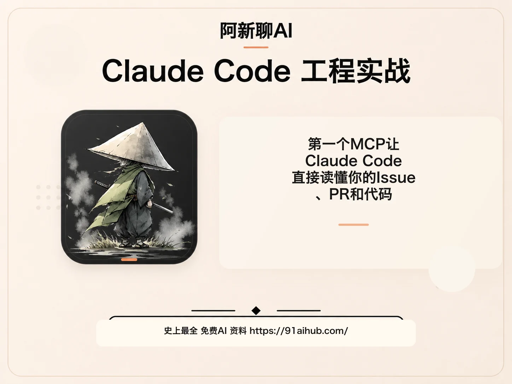
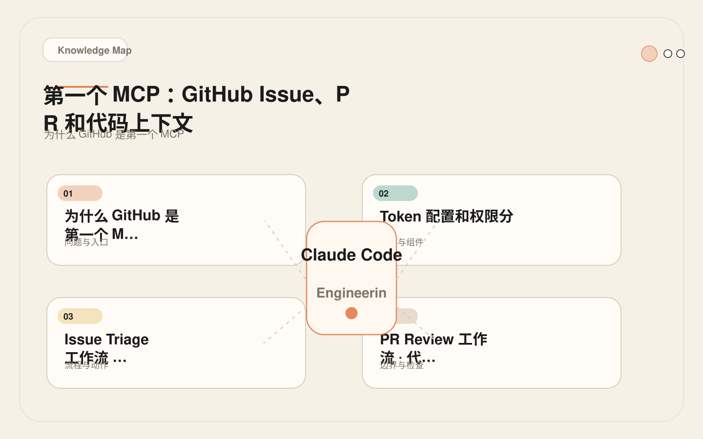
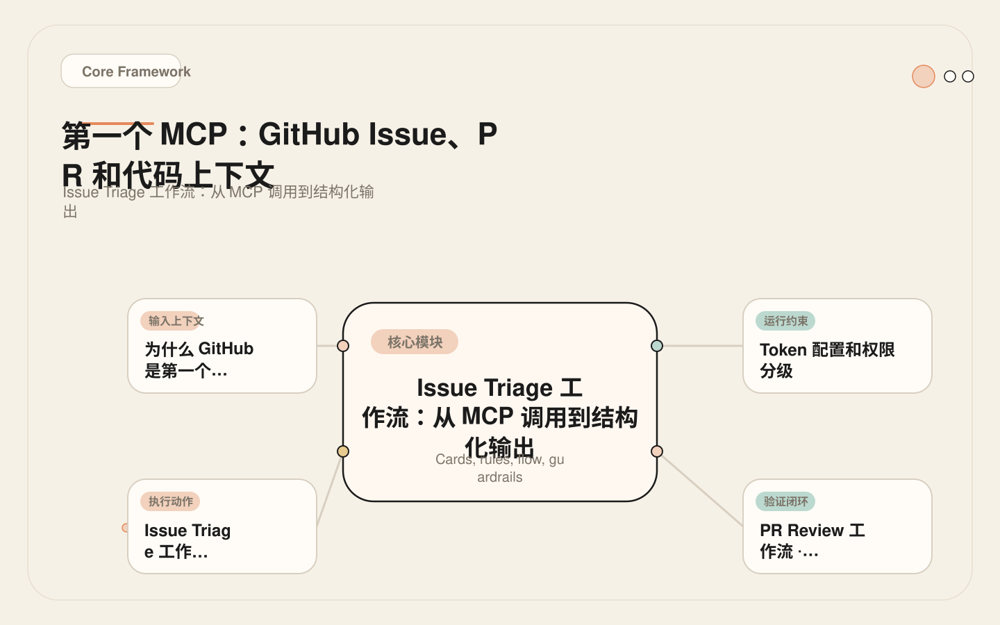
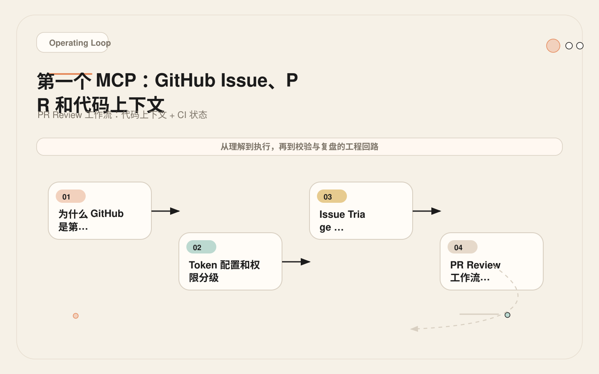
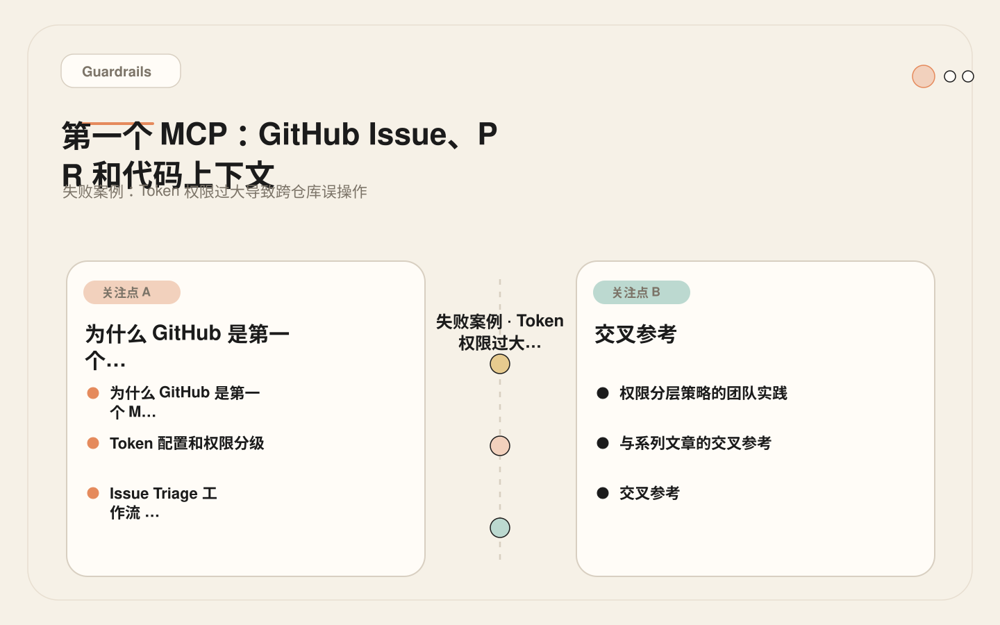

# 第一个 MCP：让 Claude Code 直接读懂你的 Issue、PR 和代码

<!-- codex:cover ../../../assets/claude-code-engineering/18-github-mcp-cover.webp -->

<!-- /codex:cover -->

**TL;DR：** GitHub MCP 是最适合作为第一个 MCP 接入的系统。它已经在开发者的日常工作流中，数据以读为主，权限可以精确分级，且 AI 辅助编码的核心上下文——issue、PR、代码、CI——都集中在这里。

## 为什么 GitHub 是第一个 MCP

团队接入 MCP 时，最容易犯的错误是从"最有技术挑战性"的系统开始，比如数据库或监控系统。这导致初期投入大、调试成本高，团队还没建立起信心就放弃了。

<!-- codex:illustration 18-github-mcp/01-overview-knowledge-map.svg -->

<!-- /codex:illustration -->

GitHub 适合作为第一个 MCP 的原因：

1. **已在工作流中。** 开发者每天都在和 issue、PR、代码交互。没有新的工作流要学习。
2. **读多写少。** 日常使用以获取信息为主：读 issue、看 PR diff、查 CI 状态。写操作（评论、创建分支）是低频动作。
3. **权限模型成熟。** GitHub Personal Access Token 支持精细的权限控制，可以精确到仓库级别和操作类型。
4. **上下文价值高。** Issue 描述了要做什么，PR 承载了怎么做的讨论，CI 给出做了之后的结果。这三个维度是 AI 辅助编码最核心的输入。
5. **错误可感知。** GitHub API 返回结构化错误，调试直观。如果 token 权限不足，API 会返回 403 和明确的权限提示。

对比其他系统的"第一个 MCP"难度：

| 系统 | 接入难度 | 调试难度 | 权限控制 | 日常使用频率 | 综合推荐度 |
|------|---------|---------|---------|------------|-----------|
| GitHub | 低 | 低 | 精确 | 高（每天多次） | 最高 |
| Linear / Jira | 低 | 低 | 中等 | 中（每天 1-2 次） | 高 |
| Sentry | 中 | 中 | 中等 | 低-中（按需） | 中 |
| 数据库 | 中-高 | 高 | 需要额外配置 | 按需 | 低 |
| Figma | 中 | 中 | 粗粒度 | 低 | 低 |

## Token 配置和权限分级

GitHub MCP 使用 Personal Access Token（PAT）进行认证。有两种 token 类型：

```text
Classic PAT：权限粒度粗，只能选择 repo/public_repo 等大类。
Fine-grained PAT：权限粒度细，可以精确到具体仓库和具体操作。

→ 必须使用 Fine-grained PAT。
```

### 创建 Fine-grained PAT

1. GitHub → Settings → Developer settings → Fine-grained tokens → Generate new token
2. Repository access：选择"Only select repositories"，只勾选需要的仓库
3. Permissions 按阶段配置（见下表）

### 权限分级策略

不要一次给全权限。按阶段递增：

| 阶段 | Token 权限 | Claude Code 能做什么 | 持续时间 |
|------|-----------|-------------------|---------|
| **Trial（试用）** | `read:issues`, `read:pull_requests`, `read:contents`, `read:metadata` | 读取 issue、PR、代码文件、仓库信息。不能写任何东西 | 2-4 周 |
| **Stable（稳定）** | Trial + `write:issues`, `write:pull_requests` | 在 issue 和 PR 上添加评论。仍然不能修改代码 | 4-8 周 |
| **High-trust（高信任）** | Stable + `write:contents` | 创建分支、推送代码、创建 PR。不能合并、不能改设置 | 按需 |
| **Caution（谨慎）** | 合并权限 | **不建议默认开启。** 只在经过完整审计流程后手动授予 | 极少使用 |

权限递增的触发条件：

```text
Trial → Stable：
  - 团队连续 2 周使用 Trial 权限，没有触发任何安全事件
  - 有明确的需求：需要让 Claude Code 在 issue 上补充分析结果

Stable → High-trust：
  - 团队连续 4 周使用 Stable 权限
  - 有明确需求：需要让 Claude Code 创建修复分支并提交 PR
  - PreToolUse Hook 已配置，能审计所有写操作

High-trust → Caution：
  - 仅在特定场景下临时授权，使用后立即回收
  - 永远不要让"自动合并"成为默认行为
```

### settings.json 配置

```json
{
  "mcpServers": {
    "github": {
      "command": "npx",
      "args": ["-y", "@modelcontextprotocol/server-github"],
      "env": {
        "GITHUB_PERSONAL_ACCESS_TOKEN": "${GITHUB_MCP_TOKEN}"
      }
    }
  }
}
```

Token 值不要写入 settings.json。将它存储在 shell 环境变量中：

```bash
# ~/.zshrc 或 ~/.bashrc
export GITHUB_MCP_TOKEN="github_pat_xxxxx"
```

如果团队使用 dotenv，也可以放在项目根目录的 `.env` 中，但要确保 `.env` 在 `.gitignore` 中。

## Issue Triage 工作流：从 MCP 调用到结构化输出

这是一个完整的 issue triage 流程，用 GitHub MCP 完成。目标不是让 AI 自动关闭 issue，而是让 AI 做初步分类和信息补充，减少人工 triage 的时间。

<!-- codex:illustration 18-github-mcp/02-framework-core-structure.svg -->

<!-- /codex:illustration -->

### 流程设计

```text
输入：GitHub issue URL 或编号
处理：
  1. 获取 issue 详情（标题、正文、标签、关联 PR）
  2. 判断类型：bug / feature / docs / question / duplicate
  3. 搜索相关代码文件
  4. 检查是否有已存在的相关 issue 或 PR
  5. 生成分类建议和后续步骤
输出：结构化的 triage 报告
```

### 真实的 Claude Code 交互

用户输入：

```text
请 triage 这个 issue：https://github.com/acme/backend/issues/234
```

Claude Code 通过 MCP 执行的操作序列：

```text
Step 1: get_issue(owner="acme", repo="backend", issue_number=234)
  → 获取 issue 标题、正文、标签、创建者

Step 2: search_code(owner="acme", repo="backend", query="用户登录空指针")
  → 在代码库中搜索相关代码位置

Step 3: list_issues(owner="acme", repo="backend", state="all", labels=["bug", "auth"])
  → 检查是否有重复的 auth 相关 issue

Step 4: list_pull_requests(owner="acme", repo="backend", state="all")
  → 检查是否已有修复 PR
```

Claude Code 的输出：

```text
## Issue Triage: #234

**类型判断**: Bug（空指针异常）
**严重度**: 高（影响登录流程）
**相关代码**:
  - apps/api/src/routes/auth.ts:47（可能出错位置）
  - apps/api/src/services/session.ts:23（关联的 session 逻辑）
**重复检查**: 无重复 issue，但 #198 有相似错误（不同端点）
**已有 PR**: 无
**建议标签**: bug, auth, priority:high
**后续步骤**:
  1. 在 auth.ts:47 附近添加空值检查
  2. 检查 session service 中所有对 user 对象的引用
  3. 添加回归测试
**需要人工确认**: 是否与 #198 合并处理
```

这个流程的关键设计决策：

- **AI 不自动打标签或修改 issue。** 它只输出建议，人类决定是否采纳。这避免了 AI 误判导致 issue 分类混乱。
- **搜索代码和检查重复是并行信息。** 它们不是 issue 正文的简单重述，而是 AI 基于 issue 内容做的主动分析。这是 MCP 相比复制粘贴的核心价值。
- **输出包含"需要人工确认"项。** 这个部分防止 AI 在不确定时做出不可逆操作。

## PR Review 工作流：代码上下文 + CI 状态

GitHub MCP 的第二个高频场景是辅助 PR review。

<!-- codex:illustration 18-github-mcp/03-flow-operating-loop.svg -->

<!-- /codex:illustration -->

### 流程设计

```text
输入：PR 编号
处理：
  1. 获取 PR 详情（标题、描述、分支、作者）
  2. 获取 PR diff
  3. 获取 CI 状态（check runs）
  4. 获取已有的 review comments
  5. 分析 diff 中的行为变更、测试覆盖、潜在风险
输出：结构化 review 意见
```

### 权限要求

这个流程在 Trial 阶段就能完成——只需要读取 PR、diff 和 CI 状态。

### 真实交互

用户输入：

```text
Review PR #56
```

Claude Code 执行序列：

```text
Step 1: get_pull_request(owner="acme", repo="backend", pull_number=56)
  → 获取 PR 元信息

Step 2: get_pull_request_diff(owner="acme", repo="backend", pull_number=56)
  → 获取完整 diff

Step 3: list_check_runs(owner="acme", repo="backend", ref="feature/new-auth")
  → 获取 CI 状态

Step 4: get_pull_request_comments(owner="acme", repo="backend", pull_number=56)
  → 获取已有的 review comments
```

如果 CI 状态显示测试失败，Claude Code 可以进一步：

```text
Step 5: get_check_run_logs(owner="acme", repo="backend", check_run_id=12345)
  → 获取失败的测试日志
```

这种"根据前一步结果决定下一步"的推理链，是 MCP 模式相比复制粘贴的核心优势。在复制粘贴模式下，你只能一次性提供所有信息；在 MCP 模式下，AI 可以动态决定需要哪些信息。

### Review 输出的边界设计

```text
Claude Code 在 PR review 中应该做的：
  ✅ 分析 diff 中的逻辑变更
  ✅ 检查测试覆盖
  ✅ 识别潜在的安全风险
  ✅ 检查 CI 失败日志并定位原因
  ✅ 给出结构化的 review 意见

Claude Code 在 PR review 中不应该做的：
  ❌ 自动提交 review（只能输出建议）
  ❌ 自动合并 PR（永远不要）
  ❌ 修改 PR 描述或标签（除非明确要求）
  ❌ 直接 push 到 PR 分支（需要 High-trust 权限 + 人工确认）
```

## 失败案例：Token 权限过大导致跨仓库误操作

### 经过

<!-- codex:illustration 18-github-mcp/04-compare-guardrails.svg -->

<!-- /codex:illustration -->

一个团队为 GitHub MCP 创建了 Fine-grained PAT，但在 Repository access 选择了"All repositories"而不是"Only select repositories"。token 同时拥有对组织内所有仓库的 `write:contents` 权限。

开发者让 Claude Code 在 `acme/backend` 仓库创建一个 hotfix 分支。Claude Code 执行了正确的操作，但由于 token 可以访问所有仓库，命令的执行范围没有被仓库边界约束。

三天后，另一个开发者在不同的会话中让 Claude Code "创建一个实验分支来测试新的认证方案"。Claude Code 搜索了组织内的相关代码，发现 `acme/auth-service` 仓库也有认证相关代码，于是在 `acme/auth-service` 中也创建了一个分支。这个仓库是组织的核心认证服务，有分支保护规则，但 token 的权限绕过了保护规则（因为 PAT 是 admin 创建的）。

更严重的是，新分支的名称触发了团队的 CI 流水线，CI 在 `acme/auth-service` 中运行了完整的测试套件，包括对 staging 环境的集成测试。这些测试需要独占 staging 环境，导致其他团队的测试被阻塞了 40 分钟。

### 根因

1. **Token 权限范围过大。** "All repositories" 意味着 token 可以操作组织内的任何仓库。
2. **没有按仓库精确授权。** 团队只需要在 `acme/backend` 和 `acme/web` 两个仓库中使用 MCP，但 token 覆盖了全部 15 个仓库。
3. **Token 权限等级过高。** `write:contents` 允许创建分支和推送代码，但团队实际只需要在特定仓库中创建分支。
4. **没有 PreToolUse Hook 做范围检查。** MCP 工具调用没有经过仓库级别的范围校验。

### 修复

```text
1. 立即：撤销原 token，创建新的 Fine-grained PAT
   - Repository access：Only select repositories → 勾选 backend, web
   - Permissions：write:contents（只在这两个仓库中生效）

2. 短期：添加 PreToolUse Hook
   - 拦截所有 GitHub MCP 写操作
   - 验证操作目标仓库是否在白名单中
   - 记录审计日志

3. 长期：为不同仓库创建不同的 token
   - 高频使用的仓库：单独 token，权限精确
   - 只读仓库：共享只读 token
   - 禁止使用"All repositories"范围的写权限 token
```

PreToolUse Hook 示例（检查 GitHub MCP 调用范围）：

```bash
#!/usr/bin/env bash
# PreToolUse: 检查 GitHub MCP 工具调用的仓库范围

TOOL_NAME="$TOOL_NAME"
TOOL_INPUT="$TOOL_INPUT"

# 只审计 GitHub MCP 工具
if [[ "$TOOL_NAME" != *"github"* ]]; then
  exit 0
fi

# 允许的仓库白名单
ALLOWED_REPOS=("acme/backend" "acme/web")

# 从工具输入中提取仓库信息
# 简化示例：实际实现需要解析 JSON 边
REPO=$(echo "$TOOL_INPUT" | grep -oE '"(owner|repo)":\s*"[^"]*"' | head -2)

# 检查是否在白名单中
REPO_MATCH=false
for allowed in "${ALLOWED_REPOS[@]}"; do
  if [[ "$TOOL_INPUT" == *"$allowed"* ]]; then
    REPO_MATCH=true
    break
  fi
done

if [[ "$REPO_MATCH" == "false" ]]; then
  echo "BLOCKED: GitHub MCP operation targets repository outside allowed scope."
  echo "Allowed repositories: ${ALLOWED_REPOS[*]}"
  echo "If this is intentional, ask the developer to confirm."
  exit 2
fi

echo "AUDIT: GitHub MCP operation on allowed repository."
exit 0
```

## 接入 GitHub MCP 的常见障碍

团队在接入 GitHub MCP 时经常遇到以下问题。这里列出典型的障碍和对应的解决方案，供参考。

### 障碍一：Token 创建流程复杂

Fine-grained PAT 的创建需要在 GitHub Settings 的多级菜单中导航，权限选项有几十个，初次配置容易遗漏或选错。团队成员可能因为"配置太麻烦"而放弃。

解决方案：由团队的技术负责人统一创建 token，权限按上述分级表配置。将 token 值存入团队的 secret manager（如 1Password、Vault），其他成员只需要在环境中引用即可。不要让每个开发者各自创建 token——权限标准不一致是安全隐患。

### 障碍二：MCP server 启动失败

`npx -y @modelcontextprotocol/server-github` 可能因为网络问题、Node 版本不兼容或 npm registry 访问受限而失败。在中国大陆环境下，npm registry 的访问问题尤其常见。

解决方案：在团队的开发环境文档中记录 MCP server 的安装前置条件（Node 版本、网络代理配置）。如果网络条件不稳定，考虑将 MCP server 包预先下载到本地或私有 registry。

### 障碍三：工具调用频率受限

GitHub API 有速率限制。Fine-grained PAT 的默认限制是每小时 5000 次请求，对于个人使用足够，但如果整个团队共享一个 token，在高峰期可能触发限制。

解决方案：每个开发者使用独立的 token。如果必须共享 token，在 MCP server 配置中添加速率限制参数，或在 PreToolUse Hook 中实现简单的调用计数。

### 障碍四：团队对 AI 操作外部系统有顾虑

部分团队成员可能不信任 AI 操作 GitHub，担心误操作影响代码仓库。这种顾虑是合理的——但解决方案不是放弃 MCP，而是通过权限分级和审计机制建立信任。

解决方案：从 Trial 权限（纯只读）开始，让团队观察两周。两周后回顾 MCP 调用日志，确认只有只读操作。这种"先观察后扩展"的方法比"一次性全开"更容易获得团队信任。

## 多场景工作流设计

GitHub MCP 的价值不仅在于单个工作流（如 issue triage 或 PR review），更在于跨工作流的信息关联。以下是需要掌握的多场景模式。

## 实战经验：从 Trial 到 Stable 的升级判断

团队在使用 Trial 权限（纯只读）运行两周后，需要判断是否应该升级到 Stable 权限（允许评论）。这个判断不应该凭感觉，而应该基于以下量化指标。

### Trial 阶段的评估维度

```text
指标一：使用频率
  统计两周内 GitHub MCP 工具的调用次数。
  如果日均调用 < 3 次：团队可能还没有把 MCP 纳入日常工作流。
  如果日均调用 > 10 次：MCP 已成为团队的标准工具。

指标二：补充需求频率
  统计"AI 读取了 issue 但还需要人工补充信息"的次数。
  如果 > 50% 的 issue 分析需要人工补充：说明只读权限不足以获取完整上下文。
  这不是升级权限的信号，而是 issue 质量需要改善。

指标三：写操作需求
  统计"开发者希望 AI 在 issue/PR 上添加评论"的次数。
  如果每周 > 3 次：可以考虑升级到 Stable。
  如果每周 < 1 次：继续使用 Trial。

指标四：安全事件
  统计两周内是否有非预期的 MCP 调用。
  如果有：必须先分析根因，再考虑升级。
  如果没有：安全基线确认，可以安全升级。
```

### Stable 阶段的典型场景

升级到 Stable 后，AI 可以在 issue 和 PR 上添加评论。这看起来是一个小权限扩展，但它开启了一个重要的工作模式：AI 的分析结果可以直接写回 GitHub，而不是只停留在 Claude Code 的聊天窗口中。

```text
场景一：Issue triage 结果回写
  AI 分析 issue 后，在 issue 上添加一条评论：
  "自动分析结果：[类型判断] [相关文件] [建议标签]"
  → 其他团队成员在 GitHub 上就能看到分析结果
  → 不需要打开 Claude Code 就能获取 AI 的初步判断

场景二：PR review 意见回写
  AI review PR 后，在 PR 上添加一条评论：
  "自动审查结果：[发现数] [严重度分布] [关键发现]"
  → Review 意见和代码变更在同一个上下文中
  → PR 作者不需要在 Claude Code 和 GitHub 之间切换

场景三：CI 失败分析回写
  AI 分析 CI 失败后，在 PR 上添加一条评论：
  "CI 失败分析：[失败原因] [相关代码行] [建议修复]"
  → CI 失败的分析结果直接附加在 PR 上
  → 开发者打开 PR 就能看到诊断结果
```

这些场景的核心价值是"信息闭环"：AI 的分析结果回到团队已经习惯的工具（GitHub）中，而不是锁在 Claude Code 的聊天窗口里。团队成员不需要改变工作流就能从 AI 的分析中受益。

### 升级前的强制检查

```text
升级前必须确认：
  [ ] Trial 阶段已运行至少 2 周
  [ ] 没有发生过安全事件（非预期的 MCP 调用）
  [ ] 团队已建立 MCP 使用习惯（日均调用 > 5 次）
  [ ] 有明确的写操作需求（评论 > 3 次/周）
  [ ] 已配置 PreToolUse Hook 审计写操作
  [ ] Token 权限只增加了 write:issues 和 write:pull_requests
  [ ] 没有增加其他写权限（如 write:contents）
```

### 代码搜索和理解

当开发者需要理解一段代码的上下文时，GitHub MCP 可以提供文件级别的搜索能力。这和内置的 Grep/Glob 工具有本质区别：Grep 搜索文件内容，GitHub search_code 搜索整个仓库的历史和分支。

```text
典型场景：
  开发者："auth 模块的历史改动，最近谁改过？"

  内置工具方案：
  → Grep 搜索 auth 相关文件
  → 只能看到当前状态，不知道谁改的、为什么改

  GitHub MCP 方案：
  → search_code 找到 auth 相关文件
  → list_commits 获取这些文件的提交历史
  → get_pull_request 获取每次改动的 PR 描述（了解改动原因）
  → 完整理解"谁在什么时候因为什么改了什么"
```

这个场景只使用只读权限，非常适合作为 GitHub MCP 的入门练习。

### CI 失败分析

CI 失败是开发者日常最高频的痛点之一。GitHub MCP 可以让 AI 直接获取 CI 状态和日志，而不需要开发者手动点进 GitHub Actions 页面。

```text
流程：
  1. list_check_runs → 获取 PR 的 CI 状态
  2. 如果有失败 → get_check_run_logs → 获取失败日志
  3. AI 分析日志 → 定位失败原因
  4. 结合 PR diff → 判断失败是否由本次改动引起

边界：
  - AI 不应该自动重新触发 CI
  - AI 不应该自动修复 CI 配置
  - AI 只输出分析结果和建议的修复方向
```

### 跨仓库关联

大型项目通常有多个仓库（前端、后端、共享库、基础设施）。GitHub MCP 的 search_code 可以跨仓库搜索，帮助 AI 理解改动的影响范围。

```text
场景：修改了共享库中的一个接口
  → search_code 在所有仓库中搜索该接口的调用方
  → 评估影响范围
  → 列出需要同步更新的仓库

权限要求：Fine-grained PAT 的 repository access 需要包含所有相关仓库。
如果 token 只能访问一个仓库，跨仓库关联就无法工作。
```

### 代码审查辅助

和 PR review 不同，代码审查辅助是更开放的场景——不限定在某个 PR 范围内，而是让 AI 分析某个模块或文件的整体质量。

```text
场景："审查 auth 模块的安全性"
  → search_code 搜索 auth 相关文件
  → get_file_contents 获取关键文件内容
  → AI 分析认证流程、密钥管理、会话处理
  → 输出安全性评估和建议

和 subagent 的配合：
  这种探索性审查适合拆分为 subagent 任务。
  主会话定义审查范围，subagent 执行只读探索，主会话整合结果。
  详见 12-subagents-mental-model.md 中的 explorer 角色。
```

## 工作流设计的通用原则

从以上场景中可以提取出 GitHub MCP 工作流的通用设计原则：

1. **先获取元信息，再获取详情。** 先调用列表类工具（list_issues、list_check_runs），确定目标后再调用详情类工具（get_issue、get_check_run_logs）。这避免了无目的的大范围数据获取，减少 token 消耗。

2. **读操作自动化，写操作需确认。** 任何读取 GitHub 数据的操作都可以自动化执行，因为读操作不改变外部状态。写操作（评论、创建分支、推送代码）必须经过人工确认，即使 token 有写权限。

3. **结果输出结构化。** 每个工作流的输出应该是结构化的——使用表格、列表和明确的分类标签，而不是大段的自由文本。结构化输出让后续处理更容易，也更容易在团队内共享。

4. **标注信息来源。** AI 在输出中应该标注每条信息的来源（如"来自 issue #234"或"来自 CI check run #5678"），方便开发者验证和追溯。AI 可能产生幻觉，标注来源是降低幻觉风险的有效手段。

## 权限审计清单

接入 GitHub MCP 后，团队需要定期审计：

```text
Token 审计（每月）：
  [ ] Token 的 repository access 范围是否仍然合理
  [ ] Token 的权限是否仍然是"最小必需"
  [ ] Token 是否有新的仓库被添加（组织新仓库是否自动纳入）
  [ ] Token 的过期时间是否合理（建议 90 天轮换）

使用审计（每周）：
  [ ] 本周 MCP 工具调用的次数和类型
  [ ] 是否有写操作（创建分支、推送、评论）
  [ ] 写操作是否都在预期范围内
  [ ] 是否有调用失败的记录（可能是权限不足或 server 异常）

安全审计（每季度）：
  [ ] Token 是否存储在安全位置（secret manager，非明文配置文件）
  [ ] 是否有 token 泄露风险（如意外提交到 git）
  [ ] MCP server 包是否需要更新
  [ ] 是否有新的 GitHub API 权限需要评估
```

## 从 GitHub MCP 到其他 MCP 的迁移路径

GitHub MCP 接入完成后，团队可以按以下路径扩展：

```text
第一步（已完成）：GitHub MCP — 只读
  → 团队习惯了 MCP 工作模式
  → 建立了权限管理和审计流程

第二步：项目管理 MCP（Linear / Jira）— 只读
  → AI 可以关联 issue 和任务管理系统
  → 两个 MCP 配合使用：GitHub issue ↔ Linear ticket

第三步：监控 MCP（Sentry / Datadog）— 只读
  → AI 可以从错误日志直接定位到代码
  → 三个 MCP 配合：Sentry error → GitHub commit → Linear ticket

第四步：根据团队需求选择
  → 后端团队：数据库 MCP（schema 理解）
  → 前端团队：Figma MCP（设计对齐）
  → 全栈团队：Notion/Confluence MCP（文档访问）
```

每一步的扩展都遵循相同原则：只读优先、最小权限、审计跟踪、按需升级。

## OAuth 认证配置与 PAT 的选择

前文使用 Personal Access Token（PAT）作为认证方式。GitHub MCP 还支持 OAuth App 认证，适用于团队场景。两种方式的选择标准如下：

```text
PAT（Personal Access Token）：
  适用：个人开发者、小团队（不足 5 人）
  优点：配置简单，一个环境变量即可
  缺点：和创建者个人账号绑定，创建者离职后 token 失效
  管理：每个开发者各自创建 token，权限标准由团队文档统一

OAuth App：
  适用：中大型团队（5 人以上）、组织级部署
  优点：和 GitHub App 身份绑定，不依赖个人账号；支持 fine-grained installation permissions
  缺点：配置复杂（需要注册 GitHub App、配置 callback URL、管理 private key）
  管理：组织管理员统一创建 App，开发者通过 OAuth 流程授权
```

### GitHub App（OAuth）配置流程

```text
Step 1: 注册 GitHub App
  GitHub → Settings → Developer settings → GitHub Apps → New GitHub App
  配置项：
  - GitHub App name: "acme-claude-code-mcp"
  - Homepage URL: 你的团队文档地址
  - Callback URL: http://localhost:3000/callback（本地开发）
  - Setup URL: 留空
  - Webhook: 取消勾选 Active
  - Repository permissions: 按 Trial 阶段配置（只读）
  - Where can this GitHub App be installed: Only on this account

Step 2: 生成 Private Key
  App 设置页 → Generate a private key → 下载 .pem 文件
  将 .pem 存储在团队的 secret manager 中

Step 3: Install App 到仓库
  App 设置页 → Install App → 选择目标仓库
  记录 installation_id（从安装后的 URL 中获取）

Step 4: 配置 MCP Server
  在 settings.json 中使用 GitHub App 认证：
  {
    "mcpServers": {
      "github": {
        "command": "npx",
        "args": ["-y", "@modelcontextprotocol/server-github"],
        "env": {
          "GITHUB_APP_ID": "123456",
          "GITHUB_APP_PRIVATE_KEY_PATH": "${GITHUB_APP_KEY_PATH}",
          "GITHUB_APP_INSTALLATION_ID": "78901234"
        }
      }
    }
  }
```

### PAT vs GitHub App 的权限粒度对比

```text
操作                     │ PAT（Fine-grained）     │ GitHub App
─────────────────────────┼────────────────────────┼─────────────────────
读取公共仓库              │ read:contents          │ Contents: Read
读取私有仓库              │ read:contents          │ Contents: Read
读取 Issue               │ read:issues            │ Issues: Read
创建 Issue 评论           │ write:issues           │ Issues: Write
读取 PR                  │ read:pull_requests     │ Pull requests: Read
创建 PR 评论              │ write:pull_requests    │ Pull requests: Write
推送代码（创建分支）       │ write:contents         │ Contents: Write
合并 PR                   │ write:contents + admin │ 不建议授予
管理 Actions              │ read/write:actions     │ Actions: Read/Write
读取 Checks               │ read:checks            │ Checks: Read
```

GitHub App 的权限模型比 PAT 更适合团队场景的一个关键原因是：它区分了"仓库级权限"和"组织级权限"。App 可以只对特定仓库有写权限，对其他仓库只有读权限，而不需要创建多个 token。这在 PAT 模式下需要创建多个 Fine-grained token 才能实现。

## Token Scope 深度分析

Fine-grained PAT 的每个权限 scope 都有特定的 API 覆盖范围。理解 scope 到 API 的映射关系，才能精确配置"最小必需权限"。

### Read Scopes（Trial 阶段）

```text
Scope                    │ 覆盖的 MCP 工具调用                    │ 不覆盖
─────────────────────────┼───────────────────────────────────────┼────────────────
read:metadata            │ 仓库信息、分支列表、tag 列表           │ 文件内容
read:contents            │ get_file_contents, search_code        │ PR diff
read:issues              │ get_issue, list_issues, search_issues │ 创建/修改 issue
read:pull_requests       │ get_pull_request, get_pr_diff,        │ 创建/修改 PR
                         │ list_pull_requests, get_pr_comments   │
read:checks              │ list_check_runs, get_check_run_logs   │ 触发/重新运行 CI
```

### Write Scopes（Stable 阶段新增）

```text
Scope                    │ 覆盖的 MCP 工具调用                    │ 风险等级
─────────────────────────┼───────────────────────────────────────┼────────────────
write:issues             │ create_issue_comment, add_labels,     │ 低（可逆操作）
                         │ update_issue                          │
write:pull_requests      │ create_pr_comment, create_review      │ 低（可逆操作）
write:contents           │ create_branch, push_files,            │ 高（修改代码）
                         │ create_pull_request                   │
```

### Scope 最小化的实践原则

```text
原则 1：宁缺毋多
  如果你只需要读取 issue，不要加上 read:pull_requests。
  多余的 scope 不消耗额外资源，但在 token 泄露时扩大了攻击面。

原则 2：读和写分开
  如果团队当前只需要读取，不要"预防性"地加上写权限。
  等真正需要写操作时再升级 token scope。

原则 3：定期清理
  每月检查：token 的 scope 是否有不再使用的。
  场景：团队在 Stable 阶段添加了 write:issues，后来发现不需要 AI 在 issue 上评论。
  操作：回退到只读 scope。
```

## Issue Triage 完整工作流示例

前文展示了 Issue Triage 的基本流程。以下是完整的、可配置为 Skill 的 Issue Triage SOP。

### 完整流程（带错误处理）

```text
Issue Triage SOP v2

输入：GitHub issue URL 或编号
前置检查：确认 MCP server 可用（调用 list_issues 做一次测试调用）

Phase 1: 信息收集
  Step 1: get_issue → 获取 issue 详情
    失败处理：如果 404 → 报告"issue 不存在"并终止
    失败处理：如果 403 → 报告"权限不足，检查 token scope"并终止

  Step 2: search_code → 搜索相关代码
    使用 issue 标题中的关键词搜索
    如果无结果 → 用 issue body 中的技术术语重新搜索
    如果仍无结果 → 标注"无法定位相关代码"

  Step 3: list_issues → 检查重复 issue
    搜索条件：state=all, 相同的 labels
    如果发现相似 issue → 列出并标注相似度

  Step 4: list_pull_requests → 检查已有修复
    搜索条件：state=all, 相关的关键词
    如果发现相关 PR → 标注 PR 状态（open/closed/merged）

Phase 2: 分类和评估
  Step 5: 基于收集的信息做分类判断
    类型：bug / feature / docs / question / duplicate / cant-reproduce
    严重度：critical / high / medium / low
    判断依据：
      - 有 stack trace 或复现步骤 → bug
      - 请求新功能或改进 → feature
      - 文档错误或不清晰 → docs
      - 使用问题或咨询 → question
      - 有已存在的相同 issue → duplicate
      - 缺少足够信息复现 → cant-reproduce

Phase 3: 输出
  Step 6: 生成结构化 triage 报告（见前文格式）
  Step 7: 如果类型判断不确定，标注"需要人工确认"
  Step 8: 不自动修改 issue（不打标签、不改状态、不分配）
```

### Triage 质量指标

```text
指标                    │ 目标           │ 测量方法
────────────────────────┼───────────────┼────────────────────────
类型分类准确率           │ 大于 85%       │ 人工复查最近 20 次 triage 结果
严重度评估准确率         │ 大于 80%       │ 和团队 lead 的评估对比
重复 issue 检出率        │ 大于 90%       │ 已知重复对的召回测试
相关代码定位准确率       │ 大于 70%       │ 人工确认搜索结果是否相关
无数据情况处理率         │ 100%           │ 检查是否所有"无结果"都有标注
```

## PR Review 完整工作流示例

### 完整流程（带边界和条件分支）

```text
PR Review SOP v2

输入：PR 编号或 URL
前置检查：确认 token 有 read:pull_requests 和 read:checks 权限

Phase 1: PR 上下文收集
  Step 1: get_pull_request → 获取 PR 元信息
    记录：标题、描述、分支名、作者、关联 issue
    如果描述为空 → 标注"PR 缺少描述，建议提醒作者"

  Step 2: get_pull_request_diff → 获取完整 diff
    如果 diff 超过 2000 行 → 标注"大型 PR，建议拆分"
    统计：修改文件数、新增行数、删除行数

  Step 3: list_check_runs → 获取 CI 状态
    如果全部通过 → 进入 Phase 2
    如果有失败 → 进入 CI 失败分析分支（Phase 1b）
    如果还在运行 → 标注"CI 仍在运行，建议等待"

  Phase 1b: CI 失败分析（条件分支）
    Step 3b-1: get_check_run_logs → 获取失败日志
    Step 3b-2: 分析失败原因
      - 测试失败 → 定位失败的测试用例和对应的代码行
      - 构建失败 → 定位编译/类型错误
      - Lint 失败 → 列出违规项
    Step 3b-3: 判断失败是否由本次 PR 引起
      → 对比失败测试和 PR diff 的交集
      → 如果交集为空 → 可能是 main 分支的已有问题，标注"非本次 PR 引起"
    Step 3b-4: 输出 CI 分析结果，进入 Phase 2

Phase 2: Diff 分析
  Step 4: 分类变更文件
    - 安全相关（auth、crypto、input validation）
    - 性能相关（循环、查询、缓存）
    - 逻辑变更（业务逻辑修改）
    - 样式/格式（无功能影响）
    - 测试变更（新增/修改测试）

  Step 5: 对安全相关文件做安全审查
    检查项：
    - SQL 拼接（SQL 注入风险）
    - 未验证的用户输入（XSS/注入风险）
    - 硬编码的凭据或密钥
    - 权限检查的遗漏
    - 敏感数据的日志输出

  Step 6: 对逻辑变更做行为分析
    - 修改前的行为是什么
    - 修改后的行为是什么
    - 是否有调用方受影响
    - 是否需要数据迁移

  Step 7: 检查测试覆盖
    - 修改的函数是否有对应测试
    - 新增的逻辑是否有新测试
    - 测试是否覆盖了主要分支

Phase 3: 输出
  Step 8: 生成结构化 review 意见
    格式：
    ```
    ## PR Review: #[编号]

    ### 概要
    - 变更类型: [类型]
    - 影响范围: [文件数/模块]
    - CI 状态: [通过/失败/运行中]

    ### 问题（按严重度排序）
    #### Critical
    - [文件:行号] 问题描述 → 建议修改方案

    #### Warning
    - [文件:行号] 问题描述 → 建议修改方案

    #### Suggestion
    - 改进建议（非必须修改）

    ### 测试覆盖评估
    - 覆盖状态: [充分/部分/缺失]
    - 建议补充的测试: [列表]

    ### 信息来源
    - PR diff: #[编号]
    - CI check run: #[ID]
    - 相关 issue: #[编号]
    ```

  Step 9: 如果发现 Critical 问题，标注"建议在修复后再合并"
  Step 10: 不自动提交 review comment，只输出到 Claude Code 会话
```

### Review 质量指标

```text
指标                    │ 目标           │ 测量方法
────────────────────────┼───────────────┼────────────────────────
Critical 问题检出率      │ 大于 80%       │ 对已知问题 PR 做回归测试
误报率                   │ 小于 20%       │ 人工标记 false positive
测试覆盖遗漏检出率       │ 大于 70%       │ 对已知测试缺失 PR 做检查
CI 失败分析准确率        │ 大于 85%       │ 和实际失败原因对比
输出信息来源标注率       │ 100%           │ 检查每条意见是否标注来源
```

## 权限分层策略的团队实践

前文描述了四阶段权限模型（Trial → Stable → High-trust → Caution）。以下是团队中落地的具体实践。

### 按角色分配权限

```text
角色              │ 推荐权限阶段   │ 理由
──────────────────┼───────────────┼──────────────────────────
新加入的实习生     │ Trial         │ 只读权限，观察学习
初级开发者        │ Trial → Stable │ 稳定使用后可评论 issue/PR
高级开发者        │ Stable        │ 需要时临时升级到 High-trust
Tech Lead        │ Stable        │ review 范围，不需要代码推送
DevOps           │ High-trust    │ 需要创建 hotfix 分支

特殊场景：
  紧急 hotfix    │ 任何人临时获得 High-trust 权限
                  │ hotfix 合并后立即回收
  代码冻结期     │ 所有人回退到 Trial（只读）
                  │ 冻结期结束后恢复原权限
```

### 权限升降的自动化检查

```bash
#!/bin/bash
# permission-audit.sh — 每周自动运行，检查权限配置

# 检查 token 的 repository access
echo "=== Repository Access Audit ==="
# 通过 GitHub API 检查 token 能访问哪些仓库
REPOS=$(gh api /installation/repositories --jq '.repositories[].full_name' 2>/dev/null)
echo "Token can access: $REPOS"

# 检查是否有不应该被访问的仓库
ALLOWED_REPOS=("acme/backend" "acme/web")
for repo in $REPOS; do
  MATCH=false
  for allowed in "${ALLOWED_REPOS[@]}"; do
    if [[ "$repo" == "$allowed" ]]; then
      MATCH=true
      break
    fi
  done
  if [[ "$MATCH" == "false" ]]; then
    echo "WARNING: Token has access to $repo which is not in allowed list"
  fi
done

# 检查 token 过期时间
echo "=== Token Expiry ==="
# Fine-grained PAT 的过期信息需要通过 GitHub Web UI 查看
echo "Reminder: Check token expiry in GitHub Settings → Developer settings → Fine-grained tokens"

echo "=== Weekly Audit Complete ==="
```

## 与系列文章的交叉参考

本文是 Claude Code 工程系列中 MCP 相关章节的入口。理解 GitHub MCP 的具体操作需要以下文章作为前置知识：

- **[17 MCP 心智模型](./17-mcp-mental-model.md)** 是本文的理论基础。17 解释了 MCP 的协议架构（Client-Transport-Server 三角色）、工具定义模型和风险分类。本文的 settings.json 配置、Token 权限分级和工作流设计都建立在 17 的概念之上。建议先读 17 再读本文。

- **[19 高价值 MCP 场景](./19-high-value-mcp-scenarios.md)** 是本文的自然延伸。GitHub MCP 建立基础后，19 介绍了数据库（schema 理解）、监控（Sentry 错误追踪）、设计系统（Figma 组件对齐）等场景。19 的每个场景都遵循本文建立的权限分级模型和工作流设计原则。

- **[20 MCP + Skill](./20-mcp-plus-skills.md)** 解决的是"工具能力和操作纪律的断层"。本文的工作流（Issue Triage、PR Review）在 20 中会被封装为 Skill，让 Claude Code 按固定 SOP 执行而不是自由发挥。如果你发现团队在使用 GitHub MCP 时输出不一致，20 是解决方案。

- **[21 MCP 风险](./21-mcp-risks.md)** 是本文安全相关内容的深化。本文的 Token 权限分级和审计清单是风险防护的第一层。21 增加了 Token 越权（跨仓库误操作）、工具描述投毒（恶意 MCP server）、提示注入（issue body 中的恶意内容）等高级威胁的分析。如果你计划开放写权限，21 是必读。

- **[23 PreToolUse 防护](./23-pretooluse-guardrails.md)** 是本文审计逻辑的工程实现。本文的仓库白名单 Hook 是 PreToolUse 的一个具体案例。23 提供了完整的 Hook 配置模式和更复杂的拦截逻辑。

- **[28 GitHub Actions](./28-github-actions.md)** 是本文的 CI/CD 延伸。本文让 Claude Code 在本地读取 CI 状态，28 让 Claude Code 直接在 CI 环境中运行。两者的安全边界设计是一致的，但执行环境不同带来了新的权限考量。

```text
阅读路径建议：

初级（刚接触 MCP）：
  17（心智模型）→ 18（GitHub MCP，本文）→ 练习 Issue Triage

中级（准备深度使用）：
  18（本文）→ 20（Skill 封装）→ 21（风险分析）→ 实际项目配置

高级（团队级部署）：
  17 → 18 → 19 → 20 → 21 → 23 → 28
  全系列阅读后做团队内部培训和权限策略文档
```

## 交叉参考

- [17 MCP 心智模型](./17-mcp-mental-model.md)：MCP 协议架构、工具定义模型和风险特征的系统性介绍
- [19 高价值 MCP 场景](./19-high-value-mcp-scenarios.md)：GitHub 之外的数据库、监控、设计系统等场景分析
- [20 MCP + Skill](./20-mcp-plus-skills.md)：如何用 Skill 让 GitHub MCP 按 Issue Triage 或 PR Review 的 SOP 被正确使用
- [21 MCP 风险](./21-mcp-risks.md)：Token 越权、工具投毒、提示注入等安全威胁的防护策略
- [23 PreToolUse 防护](./23-pretooluse-guardrails.md)：用 Hook 实现上述审计逻辑的工程实现
- [28 GitHub Actions](./28-github-actions.md)：在 CI 中使用 Claude Code 的安全边界设计


