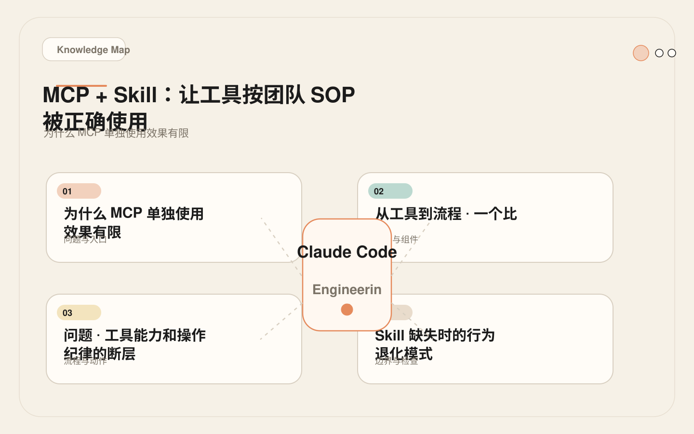
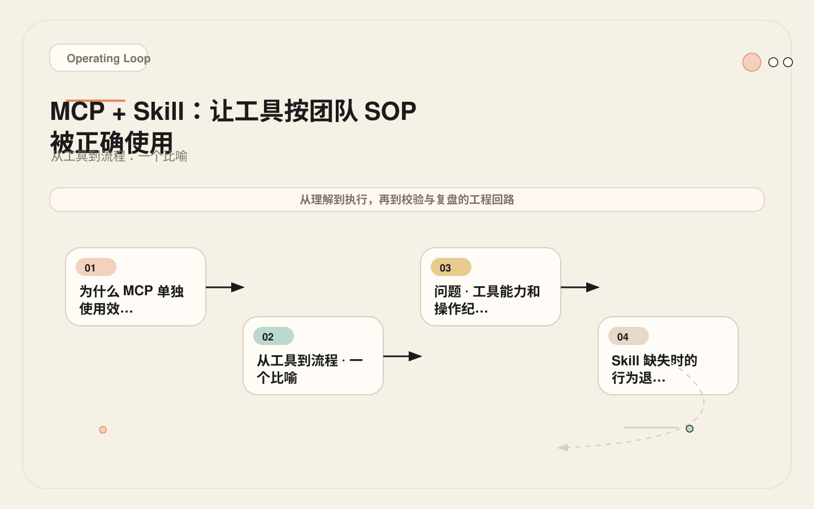
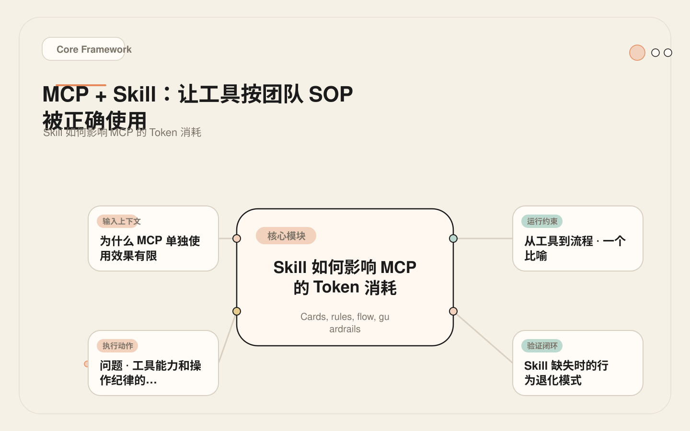
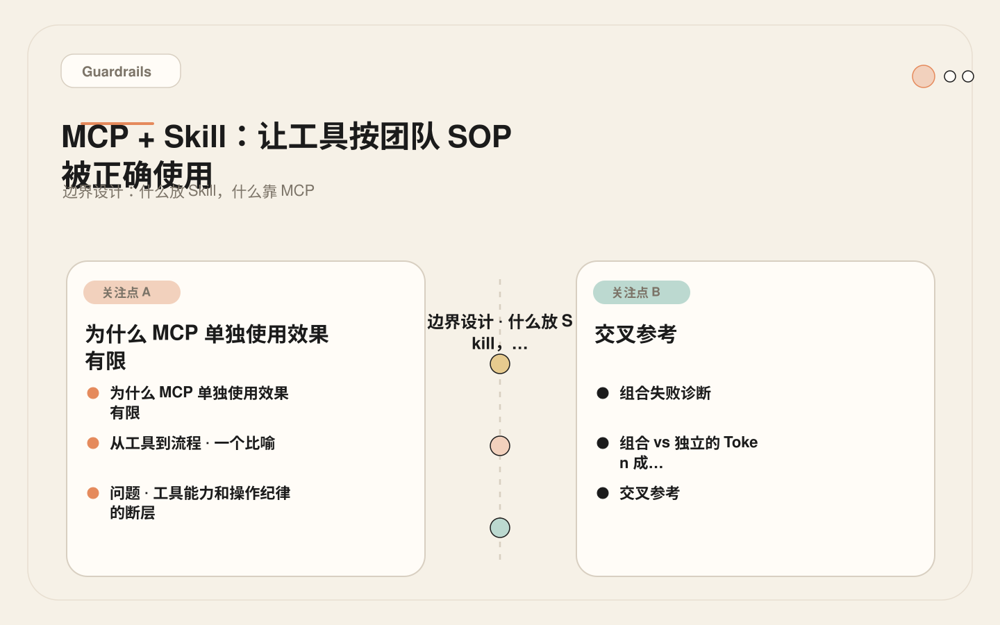

# MCP 给能力，Skill 教流程：工具才能按团队 SOP 被用对

<!-- codex:cover ../../../assets/claude-code-engineering/20-mcp-plus-skills-cover.webp -->

<!-- /codex:cover -->

**TL;DR：** MCP 提供"能做什么"，Skill 提供"应该怎么做"。只接 MCP 不写 Skill，等于给实习生一个 API key 但不给他操作手册——工具在手里，但流程在脑子里，而 AI 的脑子里没有你的团队流程。

## 为什么 MCP 单独使用效果有限

很多团队接入 MCP 后的体验是：刚开始很兴奋，觉得 AI 可以直接访问外部系统了。但用了一两周后，发现几个反复出现的问题。

<!-- codex:illustration 20-mcp-plus-skills/01-overview-knowledge-map.svg -->

<!-- /codex:illustration -->

第一个问题是操作不一致。同一个任务，不同时间让 AI 处理，结果可能完全不同。今天它可能只分析错误就停了，明天它可能自动创建分支推送代码。因为没有固定的流程定义，AI 的行为完全取决于它对当前上下文的理解。这种不一致让团队无法建立对 AI 输出的信任。

第二个问题是缺少团队知识。团队的事件响应流程有特定的步骤和检查点——比如"确认严重度后才能创建 task"，"修复部署到生产后才标记 resolved"。这些知识存储在团队的文档和习惯中，AI 不知道。结果就是 AI 做了它认为合理的操作，但不符合团队规范。

第三个问题是输出质量波动。没有输出格式约束时，AI 有时候返回结构化表格，有时候返回自由文本段落，有时候只给结论不给证据。这种波动让输出难以被后续流程消费，也难以在团队内横向比较。

Skill 的引入正是为了解决这三个问题。Skill 提供固定的步骤定义（解决不一致），嵌入团队的流程知识（解决缺知识），约束输出格式（解决质量波动）。MCP 和 Skill 的组合不是锦上添花，而是让 MCP 投资真正产生回报的必要条件。

## 从工具到流程：一个比喻

把 MCP 和 Skill 的关系想成厨师和菜谱。MCP 是厨房里的工具——刀、灶、锅、调料架。Skill 是菜谱——先切什么、后炒什么、放多少盐、什么时候出锅。

<!-- codex:illustration 20-mcp-plus-skills/03-flow-operating-loop.svg -->

<!-- /codex:illustration -->

只有工具没有菜谱：厨师可以做出菜来，但每次味道不一样，有时候盐放多了，有时候火候不对。高级厨师（强模型）可能凭经验做出不错的菜，但初级厨师（弱场景）经常翻车。

只有菜谱没有工具：知道要做什么但做不了，因为连刀和灶都没有。

工具加菜谱：每次做出的菜味道一致，新厨师也能按菜谱做出合格的菜品，老厨师可以在菜谱基础上创新。

对应到工程实践中：MCP 让 AI 能访问外部系统（有工具），Skill 让 AI 按正确的方式使用这些系统（有菜谱）。两者结合，才能让 AI 在团队工作流中发挥稳定的价值。

## 问题：工具能力和操作纪律的断层

团队接入了三个 MCP：Sentry（监控）、GitHub（代码）、Linear（任务管理）。预期效果：开发者说"处理线上报错"，AI 自动从 Sentry 获取错误、从 GitHub 定位代码、从 Linear 创建任务。

实际效果：开发者说"处理线上报错"，AI 做了以下操作：

```text
1. 调用 Sentry MCP → 获取最新错误 ✓
2. 读取 stack trace → 找到出错文件 ✓
3. 调用 GitHub MCP → 搜索相关代码 ✓
4. 在 GitHub 上创建了一个新分支 ✗（没有经过分支命名规范检查）
5. 在 Sentry 上把 issue 标记为 resolved ✗（错误还没修复，不应该标记）
6. 在 Linear 上创建了一个 task ✗（没有按团队模板填写字段）
7. 直接推送了一个"修复"到远程 ✗（没有经过测试和 review）
```

AI 做了它"能做"的所有事。但它不知道团队的事件响应 SOP 是什么。SOP 要求：

1. 确认错误严重度后才能创建 Linear task
2. Linear task 必须填写 team、priority、label 字段
3. 修复分支命名必须包含 LINEAR-xxx 编号
4. Sentry issue 在修复部署到生产后才标记 resolved
5. 修复 PR 必须经过 review 才能合并

MCP 给了 AI 工具能力，但没有给它操作纪律。Skill 补上的就是这个纪律。

## Skill 缺失时的行为退化模式

理解了 Skill 对 MCP 的约束作用后，需要进一步理解的是：当 Skill 缺失时，AI 的行为会如何退化。这不是一个理论问题，而是团队在没有 Skill 的情况下使用 MCP 时必然会遇到的实际问题。

退化模式之一是"过度操作"。AI 倾向于"把事情做完"。给它工具，它就想用。没有 Skill 告诉它"到这一步就停"，它会一直操作到没有更多工具可以调用为止。在事件分析场景中，这意味着 AI 不仅会分析错误，还会尝试修复错误、创建分支、推送代码、标记解决——所有这些都没有经过人工确认。这种行为不是因为 AI "想"这么做，而是因为它的推理目标是"尽可能完整地解决用户的问题"，而它没有被告知"完整"的边界在哪里。

退化模式之二是"参数选择不稳定"。同一天内的两次相同请求，AI 可能选择不同的查询参数。第一次它可能搜索最近 10 个错误，第二次可能搜索最近 50 个。第一次它可能只获取错误标题，第二次可能获取完整的事件数据。这种不稳定性来自 AI 的推理过程——每次调用时它对"最优策略"的判断可能不同。Skill 通过固定步骤和参数约束消除了这种不稳定性。

退化模式之三是"忽略团队特有规则"。每个团队都有自己不成文的规则——比如"数据库查询必须在只读副本上执行"、"Sentry issue 只有在修复部署后才标记 resolved"、"创建 PR 必须包含特定前缀"。这些规则不是常识，AI 不会自动知道。Skill 是把这些规则显式化并强制执行的工具。

## Skill 如何影响 MCP 的 Token 消耗

Skill 对 MCP 的 token 消耗有直接影响。没有 Skill 时，AI 可能过度调用 MCP 工具（因为不知道什么时候该停），或者调用方式低效（因为不知道最优的查询策略）。有了 Skill，调用的次数和范围都被步骤定义约束，通常能减少 30-50% 的 token 消耗。

<!-- codex:illustration 20-mcp-plus-skills/02-framework-core-structure.svg -->

<!-- /codex:illustration -->

```text
没有 Skill 时的典型 token 消耗模式（事件分析）：
  调用 1: sentry_list_issues → 获取全部未解决错误 → 3000 tokens
  调用 2: sentry_get_issue → 获取第一个错误的详情 → 2000 tokens
  调用 3: sentry_get_event → 获取完整 event 数据 → 5000 tokens
  调用 4: github_search_code → 搜索相关文件 → 1500 tokens
  调用 5: github_list_commits → 获取最近 50 个提交 → 3000 tokens
  调用 6: sentry_list_issues → 再次查询（AI 忘了之前的结果）→ 3000 tokens
  总 MCP 输入：~17500 tokens

有 Skill 时的 token 消耗模式：
  Step 1: sentry_list_issues(query="is:unresolved level:error") → 精确查询 → 1000 tokens
  Step 2: sentry_get_issue(id=xxx) → 只获取目标错误 → 2000 tokens
  Step 3: sentry_get_event(issue_id=xxx) → 获取最新 event → 3000 tokens
  Step 4: github_search_code(query="PaymentService") → 精确搜索 → 1000 tokens
  总 MCP 输入：~7000 tokens

节省：60%
原因：Skill 的步骤定义避免了重复调用和过度查询
```

这种节省不是偶然的。Skill 的步骤定义本质上是一种"查询优化"——它告诉 AI 应该用什么参数查询、获取多少数据、什么时候停止。没有 Skill 时，AI 依赖自身判断做查询决策，而这个判断往往倾向于"多获取一些以防万一"。

## 架构：MCP 是能力层，Skill 是方法层

```text
┌──────────────────────────────────────────────────────┐
│                    Skill Layer                        │
│  定义：步骤、参数、约束、失败处理、验收标准           │
│  回答：应该用哪些工具、按什么顺序、传什么参数         │
│                                                      │
│  ┌─────────────┐  ┌─────────────┐  ┌──────────────┐ │
│  │  Step 1     │→ │  Step 2     │→ │  Step 3      │ │
│  │  detect     │  │  investigate│  │  identify    │ │
│  │  (Sentry)   │  │  (GitHub)   │  │  (Linear)    │ │
│  └──────┬──────┘  └──────┬──────┘  └──────┬───────┘ │
└─────────┼────────────────┼────────────────┼─────────┘
          │                │                │
┌─────────┼────────────────┼────────────────┼─────────┐
│         ▼                ▼                ▼         │
│                  MCP Tool Layer                       │
│  Sentry MCP          GitHub MCP        Linear MCP    │
│  list_issues         search_code       create_task   │
│  get_issue           get_pr_diff       update_task   │
│  get_event           list_commits      search_tasks  │
└──────────────────────────────────────────────────────┘
```

这个分层的核心设计原则：

- **MCP 不包含流程逻辑。** MCP server 只暴露工具，不规定工具的使用顺序和约束。Sentry MCP 不知道你团队的"先确认严重度再创建 task"规则。
- **Skill 不包含工具实现。** Skill 只定义流程，不实现 API 调用。Skill 说"获取最新 P1 错误"，MCP 提供获取错误的工具。
- **边界清晰。** 换一个 MCP server（比如从 Sentry 换到 Datadog），Skill 的步骤不变，只是工具名变了。换一个 Skill（比如从事件分析换成 PR review），MCP 不变，只是步骤变了。

## 真实案例：事件分析 Skill + Sentry MCP + GitHub MCP

### Skill 定义

```text
.claude/skills/incident-analysis/
  SKILL.md                          ← 入口：触发条件 + 步骤
  templates/
    severity-rubric.md              ← 严重度分级标准
    incident-report.md              ← 事件报告模板
  scripts/
    check-recent-deploys.sh         ← 查询最近部署
```

`SKILL.md`：

```markdown
---
name: incident-analysis
description: >
  Analyze a production incident by correlating Sentry errors with
  GitHub code changes and deployment history. Triggered when user
  reports an error, asks about an alert, or mentions a production issue.
---

# Incident Analysis Skill

## Use When
- User reports a production error or alert
- User asks to analyze a Sentry issue
- User mentions an incident, P1, P2, or on-call situation

## Do Not Use When
- User asks about a local development error (no Sentry involved)
- User asks to implement a feature (use feature workflow instead)
- User explicitly says "just fix it" without analysis

## Required MCP Servers
- Sentry MCP (read access)
- GitHub MCP (read access)

## Steps

### Step 1: Detect (Sentry)
Call `sentry_list_issues` with query `is:unresolved level:error`
to get recent unresolved errors.
If user provided an issue URL or ID, call `sentry_get_issue` directly.

### Step 2: Classify Severity
Read `templates/severity-rubric.md` for classification criteria.
Classify as P1/P2/P3 based on:
- Affected user count
- Business impact area (payment, auth, data)
- Error frequency and trend

DO NOT proceed to Step 3 if severity is P3 or below.
For P3, output analysis and suggest filing a regular bug.

### Step 3: Investigate (Sentry + GitHub)
- `sentry_get_event`: Get the latest event's stack trace and context
- `github_search_code`: Find the file and function mentioned in stack trace
- Run `scripts/check-recent-deploys.sh`: Check what was deployed recently
- `github_list_commits`: Get commits since last known good deployment

### Step 4: Identify Root Cause
Correlate:
- Error timeline vs deployment timeline
- Code changes in the affected area
- Whether the error started after a specific commit

Output a hypothesis with evidence:
- "Error X started at 14:32, deployment Y went out at 14:28"
- "Commit abc123 modified the function mentioned in the stack trace"

### Step 5: Suggest Fix
- If root cause identified: describe the fix approach
- If root cause unclear: list investigation steps needed
- DO NOT auto-create branches or push code
- DO NOT resolve the Sentry issue (only resolved after fix is deployed)
- Suggest creating a Linear task IF severity is P1 or P2

## Output Format
Read `templates/incident-report.md` for the expected report structure.

## Constraints
- Never modify Sentry issue status
- Never create GitHub branches without explicit approval
- Never push code without explicit approval
- Never create Linear tasks for P3 and below
- Always include "CONFIRM: [action]" before any write operation
```

`templates/severity-rubric.md`：

```markdown
# Incident Severity Classification

## P1 - Critical
- Payment or transaction failures
- Authentication system down
- Data corruption or data loss risk
- Security breach or data leak
- Affecting > 10% of active users

## P2 - High
- Core feature degraded (not down)
- Affecting 1-10% of active users
- Performance regression > 5x baseline
- Affecting paid customers specifically

## P3 - Medium
- Non-core feature affected
- Affecting < 1% of users
- Workaround exists
- Visual/cosmetic issues with functional impact

## P4 - Low
- Minor visual issues
- Edge case errors with no user impact
- Improvement suggestions from error patterns
```

`templates/incident-report.md`：

```markdown
# Incident Report

## Summary
- **Severity**: P1/P2/P3
- **Error**: [Sentry issue title]
- **Affected area**: [module/service]
- **Started at**: [timestamp]
- **Affected users**: [count or percentage]

## Timeline
- [time]: [event]

## Root Cause Hypothesis
[Description with evidence]

## Suggested Fix
[Fix approach]

## Verification Steps
[How to verify the fix works]

## Actions Required
- [ ] [Action 1] - needs @person
- [ ] [Action 2] - needs @person
```

`scripts/check-recent-deploys.sh`：

```bash
#!/bin/bash
# Check recent deployments by looking at git tags and deployment markers
echo "=== Recent Deployments ==="
git log --oneline --decorate -20 --grep="deploy\|release\|ship"
echo ""
echo "=== Recent Tags ==="
git tag --sort=-creatordate | head -5
echo ""
echo "=== Commits in last 24 hours ==="
git log --oneline --since="24 hours ago"
```

### Skill 如何约束 MCP 工具的使用

对比"有 Skill"和"没有 Skill"的 AI 行为：

```text
没有 Skill（只有 MCP）：
  AI 获取 Sentry 错误 → 直接在 Sentry 标记 resolved ✗
  AI 找到问题代码 → 直接创建修复分支 ✗
  AI 生成修复 → 直接推送代码 ✗
  AI 认为任务完成 → 没有后续跟踪 ✗

有 Skill：
  AI 获取 Sentry 错误 → 先按 severity-rubric.md 分类严重度 ✓
  AI 找到问题代码 → 输出根因假设和证据 ✓
  AI 生成修复建议 → 明确标注"需要人工确认" ✓
  AI 输出事件报告 → 包含验证步骤和后续行动 ✓
  AI 不修改 Sentry 状态 → Skill 约束"never modify issue status" ✓
```

Skill 的约束不是"建议"，而是"步骤定义"。当 Skill 明确写了"DO NOT resolve the Sentry issue"，Claude Code 在执行时会将这个约束作为步骤的一部分遵守。这比在 CLAUDE.md 里写一句"不要修改 Sentry 状态"有效得多，因为 CLAUDE.md 的约束是全局性的、容易被稀释，而 Skill 的约束是任务特定的、在执行步骤中明确声明的。

## 边界设计：什么放 Skill，什么靠 MCP

```text
放入 Skill 的内容：
  ✓ 步骤顺序和依赖关系（先分类再调查）
  ✓ 参数约束（Sentry issue ID 必须有值才能查询）
  ✓ 决策分支（P1 走完整流程，P3 只输出分析）
  ✓ 输出格式（事件报告的结构）
  ✓ 禁止操作（不自动 resolve、不自动 push）
  ✓ 人工确认节点（"CONFIRM: 创建分支？"）
  ✓ 失败处理（Sentry 查询失败时怎么办）

依靠 MCP 的内容：
  ✓ API 调用细节（Sentry API 的分页、认证、错误处理）
  ✓ 数据获取（获取 issue 详情、stack trace）
  ✓ 数据格式化（API JSON → 结构化工具输出）
  ✓ 连接管理（token 刷新、重连、超时）

不在 Skill 也不在 MCP 的内容：
  - 团队通讯（发 Slack 通知 → 用 Hook 或 CI 处理）
  - 部署操作（回滚 → 由人工操作，不自动化）
  - 权限管理（token 轮换 → 用 secret manager 处理）
```

这个边界的关键原则：**Skill 定义"做什么决策"，MCP 定义"如何执行动作"。** 如果某个逻辑需要团队特定的判断标准（如严重度分级），它属于 Skill。如果某个逻辑是 API 层面的实现细节（如分页、认证），它属于 MCP。

<!-- codex:illustration 20-mcp-plus-skills/04-compare-guardrails.svg -->

<!-- /codex:illustration -->

## 多 MCP 协调的 Skill 模式

当 Skill 需要协调多个 MCP 时，注意以下模式：

### 模式一：串行依赖

```text
Step 1: 从 MCP-A 获取数据
Step 2: 用 Step 1 的结果作为参数调用 MCP-B
Step 3: 综合两者结果进行分析

示例：
  Step 1: Sentry → 获取错误（需要错误中的文件名）
  Step 2: GitHub → 搜索该文件（需要 Step 1 的文件名）
  Step 3: AI → 综合错误信息和代码变更分析根因
```

### 模式二：并行获取

```text
Step 1: 同时调用 MCP-A 和 MCP-B（数据不互相依赖）
Step 2: 综合两者结果进行分析

示例：
  Step 1（并行）:
    - GitHub → 获取最近 commits
    - Linear → 获取当前 sprint tasks
  Step 2: AI → 关联 commits 和 tasks，输出 sprint 进展
```

### 模式三：条件分支

```text
Step 1: 从 MCP-A 获取数据
Step 2: 根据 Step 1 的结果决定是否调用 MCP-B

示例：
  Step 1: Sentry → 获取错误严重度
  Step 2: 如果是 P1 → 调用 Linear MCP 创建紧急 task
          如果是 P3 → 只输出分析，不创建 task
```

在 Skill 中明确标注使用哪种模式，可以减少 AI 的调用次数和 token 消耗。不标注时，AI 可能串行调用所有工具，即使有些调用可以并行。

## 失败案例：有 MCP 没有 Skill，AI 不遵循团队流程

### 经过

一个后端团队接入了 Sentry MCP 和 GitHub MCP，但没有创建 incident-analysis Skill。团队成员信赖 AI 的"推理能力"，认为给出工具后 AI 能自行判断正确的操作流程。

某次 P1 事件中，值班工程师让 Claude Code 分析一个线上 500 错误。AI 执行了以下操作：

```text
1. 调用 Sentry MCP → 获取错误详情 ✓
2. 分析 stack trace → 找到出错位置 ✓
3. 调用 GitHub MCP → 找到相关代码 ✓
4. 在 Sentry 上把 issue 标记为 "Resolved" ✗
   → AI 认为已经分析清楚了，所以标记为已解决
5. 直接修复了代码并创建了一个 PR ✗
   → AI 认为这是最有效的处理方式
6. 没有通知值班负责人 ✗
   → AI 不知道团队有 on-call 通知流程
7. 没有在 Linear 上创建事件记录 ✗
   → AI 不知道事件需要被记录
```

结果：Sentry issue 被标记为 resolved，但实际修复还没有部署。其他值班工程师看到 issue 已解决，忽略了后续告警。两天后问题仍然存在，但监控系统不再对它报警（因为已被手动标记 resolved）。

### 根因

1. **没有 Skill 定义事件响应流程。** AI 只有工具，没有方法。它不知道团队的"先分析 → 再确认 → 创建任务 → 修复 → 验证 → 部署后才 resolve"的步骤。
2. **AI 的"解决问题"倾向。** 大语言模型倾向于"完成任务"。给它工具，它就会使用。没有约束时，它会尽可能多地使用工具来"解决问题"——包括不应该自动执行的操作。
3. **Sentry token 有写权限。** AI 能标记 resolved 是因为 token 有写权限。如果 token 只有只读权限，AI 就无法执行这个操作。
4. **没有 PreToolUse Hook 做审计。** MCP 的写操作没有经过确认流程。

### 修复

分三层修复：

```text
第一层：权限限制（立竿见影）
  - Sentry token 降级为只读
  - GitHub token 降级为 Trial 权限（只读）
  → AI 无法再修改 Sentry issue 或创建 PR

第二层：Skill 流程（结构性解决）
  - 创建 incident-analysis Skill（见上文）
  - 明确每一步的约束和禁止操作
  - 定义输出格式和确认节点
  → AI 按团队 SOP 执行事件分析

第三层：Hook 审计（纵深防御）
  - PreToolUse Hook 审计所有 MCP 写操作
  - 遇到写操作时要求人工确认
  → 即使 Skill 约束被绕过，Hook 仍然能拦截
```

## Skill 中的 MCP 依赖声明

好的 Skill 应该在开头声明它依赖哪些 MCP server。这不是装饰，而是实用的工程信息：

```text
声明的用途：

1. 触发前置检查：
   Claude Code 在激活 Skill 时检查依赖的 MCP server 是否可用。
   如果 Sentry MCP 没有配置，Skill 应该提示用户先接入。

2. 权限验证：
   Skill 声明需要的权限级别（只读/写入），
   帮助用户评估是否需要升级 MCP token 权限。

3. 文档化：
   新成员看到 Skill 就知道它依赖哪些外部系统，
   不需要读代码来推断依赖关系。
```

推荐的依赖声明格式：

```markdown
## Required MCP Servers
- **Sentry MCP** (read access): 获取错误详情和 stack trace
- **GitHub MCP** (read access): 搜索相关代码和查看部署历史

## Optional MCP Servers
- **Linear MCP** (write access): 创建事件 task（仅 P1/P2）

## Fallback
If Sentry MCP is unavailable:
  - Ask user to paste the error details manually
  - Continue from Step 3 with reduced context
```

Fallback 部分尤其重要。如果 Skill 完全依赖 MCP server 可用，那当 server 崩溃或未配置时，Skill 就完全不可用。Fallback 提供降级策略，让 Skill 在 MCP 不可用时仍然能部分工作。

## 常见组合模式

除了事件分析，还有几个常见的 MCP + Skill 组合模式值得了解。每个模式都有明确的适用场景、权限要求和实现要点。

### 需求实现模式

```text
目标：从需求到代码的端到端辅助
涉及 MCP：Linear/Jira + GitHub
涉及 Skill：feature-implementation

工作流：
  1. Linear MCP → 获取 task 详情（标题、描述、验收标准、优先级）
  2. GitHub MCP → search_code 搜索相关代码位置
  3. GitHub MCP → list_pull_requests 检查是否有相关的进行中 PR
  4. AI → 综合需求和代码上下文，制定实现计划
  5. AI → 实现代码（使用内置 Edit/Write 工具）
  6. AI → 运行测试验证（使用内置 Bash 工具）
  7. GitHub MCP → create_pull_request 提交修改（需要写权限，需要确认）

Skill 约束：
  - Step 4 必须输出实现计划，经人类确认后才能进入 Step 5
  - Step 7 必须标注 "CONFIRM: 创建 PR？"
  - 不要自动关联 Linear task（由人工操作）
```

### 设计对齐模式

```text
目标：确保 UI 实现和设计稿一致
涉及 MCP：Figma + GitHub
涉及 Skill：design-to-code

工作流：
  1. Figma MCP → 获取指定组件的设计属性（颜色、间距、字体、尺寸）
  2. GitHub MCP → search_code 找到对应的 UI 组件文件
  3. AI → 对比设计属性和代码实现，列出差异
  4. AI → 修改代码对齐设计（或输出差异报告）

Skill 约束：
  - Figma 调用只获取指定组件，不获取整个页面
  - 输出差异报告时包含设计值和代码值的对比表
  - 修改代码前需要人类确认
```

### 数据探索模式

```text
目标：让 AI 理解数据模型后辅助查询编写
涉及 MCP：数据库（只读）+ GitHub
涉及 Skill：data-exploration

工作流：
  1. 数据库 MCP → 获取表结构和关系
  2. 数据库 MCP → 执行 EXPLAIN 分析查询计划
  3. GitHub MCP → search_code 找到现有的数据访问层代码
  4. AI → 基于数据模型和已有模式，生成查询代码
  5. 数据库 MCP → EXPLAIN 验证查询性能

Skill 约束：
  - 所有数据库操作只允许 SELECT 和 EXPLAIN
  - 生成的查询必须在只读副本上 EXPLAIN 验证
  - 如果 EXPLAIN 显示全表扫描，必须标注警告
  - 不要生成 DDL 或 DML 语句
```

### Sprint 回顾模式

```text
目标：自动汇总 sprint 数据，辅助回顾会议
涉及 MCP：Linear/Jira + GitHub
涉及 Skill：sprint-review

工作流：
  1. Linear MCP → 获取当前 sprint 的所有 task（状态、负责人、耗时）
  2. Linear MCP → 获取未完成的 task（移入下个 sprint 的候选）
  3. GitHub MCP → 获取 sprint 周期内的 PR 统计（合并数、平均 review 时间）
  4. GitHub MCP → 获取 sprint 周期内的 CI 失败统计
  5. AI → 汇总为 sprint 回顾报告

Skill 约束：
  - 报告格式固定（完成率、 blockers、carry-over、CI 健康）
  - 不修改任何 task 状态
  - 不自动关闭 sprint
```

这些组合模式的共同特征：每个模式都有明确的输入（从 MCP 获取）、处理逻辑（在 Skill 中定义）和输出（结构化报告或代码变更）。MCP 提供数据，Skill 提供流程，两者缺一不可。

## 从单 MCP Skill 到多 MCP Skill 的演进路径

```text
阶段一：单 MCP Skill
  目标：让一个 MCP 按 SOP 使用
  示例：issue-triage Skill + GitHub MCP
  收益：固化单一工作流

阶段二：双 MCP Skill
  目标：让两个 MCP 协调使用
  示例：incident-analysis Skill + Sentry MCP + GitHub MCP
  收益：跨系统信息关联

阶段三：多 MCP Skill
  目标：全链路自动化
  示例：incident-response Skill + Sentry + GitHub + Linear + Slack（通过 Hook）
  收益：端到端事件响应
  风险：复杂度高，维护成本大

建议：
  不要跳过阶段一和二。
  每个阶段至少运行一个月，确认稳定后再扩展。
  多 MCP Skill 的复杂度是指数级增长的——3 个 MCP 的协调难度不是 3 倍，而是 6 倍。
```

## 实战：GitHub MCP + pr-review Skill 的组合

上面的事件分析案例覆盖了 Sentry + GitHub 的"读-分析"模式。现在看一个更复杂的组合：GitHub MCP 提供 PR 数据，Skill 定义 review 流程，两者协同完成结构化 code review。

### 场景描述

团队希望对指定 PR 自动执行结构化 review：检查安全漏洞、关联 Linear task、验证测试覆盖率、输出 review 报告。整个流程由 Skill 编排，GitHub MCP 提供数据。

### SKILL.md 完整定义

```text
.claude/skills/pr-review/
  SKILL.md              ← 入口：触发条件 + 步骤定义
  checklists/
    security.md         ← 安全检查清单
    test-coverage.md    ← 测试覆盖率标准
```

`SKILL.md`：

```markdown
---
name: pr-review
description: >
  Automated code review triggered by PR number or branch name.
  Uses GitHub MCP for PR data, enforces team review standards.
---

# PR Review Skill

## Use When
- User provides a PR number: "review PR #42"
- User mentions reviewing a branch: "review the auth feature branch"
- User asks for code review on current changes

## Do Not Use When
- User asks to write code (use feature-implementation skill)
- User asks about CI/CD failures (use incident-analysis skill)
- User explicitly says "just merge it"

## Required MCP Servers
- **GitHub MCP** (read access): 获取 PR diff、commits、comments、CI status

## Optional MCP Servers
- **Linear MCP** (read access): 关联 task 信息到 review 报告

## Fallback
If GitHub MCP is unavailable:
  - Ask user to paste the PR diff manually
  - Continue with reduced context (no CI status, no comments)

## Steps

### Step 1: Gather PR Context (GitHub MCP, parallel fetch)
Call the following in parallel:
- `github_get_pull_request`: PR title, description, author, branch
- `github_get_pr_diff`: Full diff of changed files
- `github_list_pr_reviews`: Existing review comments (avoid duplicating)
- `github_get_pr_status`: CI check results

If Linear MCP is available:
- `linear_search_tasks`: Find task matching PR branch naming convention
  (e.g., branch "ENG-123-feat" maps to Linear task ENG-123)

### Step 2: Classify Change Scope
Categorize the PR by scope:
- **scope:narrow** — 1-3 files changed, single concern
- **scope:medium** — 4-10 files changed, related concerns
- **scope:wide** — 11+ files changed, cross-cutting changes

For scope:wide, output a warning:
"WARN: This PR changes [N] files across [M] directories.
Consider splitting into smaller PRs for safer review."

### Step 3: Review Checks (sequential, ordered by severity)
Run these checks in order. Stop and report if a critical issue is found.

**3a. Security Check**
- Scan diff for hardcoded secrets (API keys, tokens, passwords)
- Check for SQL injection patterns in string concatenation
- Check for unsafe deserialization (eval, pickle, yaml.load without SafeLoader)
- Check for authentication bypass in middleware changes
- If found: output "CRITICAL: [description]" and stop review

**3b. Logic Check**
- Trace data flow through changed functions
- Identify edge cases: null handling, empty arrays, boundary conditions
- Check error handling: are all error paths covered?
- Check for race conditions in async code
- If issues found: output "ISSUE: [description]" with line references

**3c. Test Coverage Check**
- List all changed source files
- For each source file, check if a corresponding test file was also changed
- Calculate: changed files with test updates / total changed files
- If coverage < 50%: output "WARN: Low test coverage [X%] for this PR"

**3d. Style & Convention Check**
- Check naming conventions match project patterns
- Check for TODO/FIXME/HACK comments introduced
- Check for console.log/print debugging statements
- If found: output "MINOR: [description]"

### Step 4: Generate Review Report
Output format (use this exact structure):

## Review Summary
**PR**: #[number] — [title]
**Author**: [author]
**Scope**: narrow/medium/wide
**CI Status**: passing/failing/unknown

### Critical Issues: [count]
[List with file and line references]

### Logic Issues: [count]
[List with file and line references]

### Test Coverage: [percentage]
[List uncovered changed files]

### Minor Observations: [count]
[List style/convention items]

### Verdict
APPROVE / REQUEST_CHANGES / NEEDS_DISCUSSION

## Constraints
- NEVER approve a PR with critical security issues
- NEVER auto-merge or push changes
- ALWAYS include line references for issues
- ALWAYS check CI status before giving verdict
- If CI is failing, verdict MUST be REQUEST_CHANGES regardless of code quality
```

### 组合执行流程

```text
用户输入: "review PR #42"
         ↓
Skill 匹配: pr-review（命中 "review PR" 关键词）
         ↓
Step 1 (并行): GitHub MCP 同时获取 PR 元数据、diff、review、CI status
         ↓
Step 2: Skill 内部分类变更范围（AI 推理，无 MCP 调用）
         ↓
Step 3 (串行): 按严重度顺序执行安全检查、逻辑检查、覆盖率检查
         ↓
Step 4: Skill 输出结构化 review 报告
         ↓
Claude 呈现报告给用户，不做任何写操作

总 MCP 调用: 4-5 次（Step 1 并行）+ 0 次（Step 2-4 是 AI 推理）
总 token 消耗: ~3K input（PR diff）+ ~2K output（review report）
```

这个组合的关键设计：Step 1 利用 MCP 的并行能力一次性获取所有数据，Step 2-4 完全是 Skill 内部的纯推理，不再调用 MCP。这种"一次采集、多次推理"的模式可以最小化 MCP 调用次数和 token 消耗。

## 能力层与方法层的边界决策矩阵

MCP 提供"能做什么"，Skill 提供"应该怎么做"。但实际设计中，很多逻辑在边界上——它既可以放在 MCP 端，也可以放在 Skill 端。以下决策矩阵提供明确的判断标准。

### 决策矩阵

| 判断维度 | 放入 MCP（能力层） | 放入 Skill（方法层） |
|---------|-------------------|---------------------|
| **变化频率** | API 层面稳定，不随团队流程变化 | 团队流程调整时需要修改 |
| **复用范围** | 跨团队、跨项目通用 | 本团队/本项目特定 |
| **实现复杂度** | 需要 HTTP 客户端、认证、重试逻辑 | 只需要步骤顺序和参数约束 |
| **错误处理** | 网络超时、认证失败、速率限制 | 步骤跳过、降级策略、人工确认 |
| **数据格式** | API JSON → 结构化工具输出 | 输出模板、报告格式 |
| **权限模型** | Token scope、API rate limit | "这个操作需要人工确认" |
| **测试方式** | MCP server 自带测试套件 | Skill 通过 dry-run 验证 |

### 边界判定流程

```text
这个逻辑是否会因为换团队而改变？
├─ 是 → 放入 Skill
└─ 否 → 这个逻辑是否需要网络/API 调用？
         ├─ 是 → 放入 MCP
         └─ 否 → 这个逻辑是否需要访问外部系统状态？
                  ├─ 是 → 放入 MCP
                  └─ 否 → 放入 Skill（纯逻辑判断）
```

### 常见边界案例

| 案例 | 归属 | 原因 |
|------|------|------|
| "获取 Sentry 错误" | MCP | API 调用，跨团队通用 |
| "将错误分为 P1/P2/P3" | Skill | 严重度标准因团队而异 |
| "搜索 GitHub 代码" | MCP | API 调用，跨项目通用 |
| "决定是否创建紧急 task" | Skill | 团队流程：P1 必须创建，P3 不创建 |
| "格式化 API 响应为表格" | MCP | 数据格式化是 API 层的职责 |
| "检查修复是否需要 code review" | Skill | 团队规范：所有 PR 需要 review |
| "Token 过期时自动刷新" | MCP | 连接管理是 MCP server 的内部逻辑 |
| "查询失败时提示用户手动输入" | Skill | 降级策略是流程定义的一部分 |
| "判断 PR 是否可以 auto-merge" | Skill | 合并策略因团队而异 |
| "获取 PR 的 CI check 结果" | MCP | API 调用，跨项目通用 |

## 组合失败诊断

MCP + Skill 组合可能遇到以下失败模式。按表现分类，提供诊断步骤和修复方案。

### 模式一：Skill 被忽略

```text
表现：
  用户输入匹配 Skill 触发条件，但 Claude 直接调用 MCP 工具，
  不遵循 Skill 定义的步骤。

诊断：
  1. 检查 SKILL.md 的 frontmatter 是否正确
     name 和 description 字段是否匹配用户的输入模式
  2. 检查 Skill 文件路径是否在 Claude Code 的搜索范围内
     路径必须是 .claude/skills/<name>/SKILL.md
  3. 检查 CLAUDE.md 中是否有冲突的全局指令
     如果 CLAUDE.md 中写了 "always use MCP directly"，
     可能覆盖 Skill 的触发

修复：
  - 确认 SKILL.md 的 description 包含常见的触发短语
  - 在 CLAUDE.md 中添加 Skill 优先级声明：
    "When user mentions [trigger], use [skill-name] skill."
```

### 模式二：MCP 调用超时

```text
表现：
  Skill 正确触发，Step 1 调用 MCP 工具后长时间无响应，
  最终超时或返回空结果。

诊断：
  1. 检查 MCP server 是否正在运行
     检查 Claude Code 的 MCP 连接状态
  2. 检查网络连通性
     MCP server 是否在内网？VPN 是否连接？
  3. 检查 API rate limit
     是否短时间内发送了过多请求？

修复：
  - 在 Skill 的 Fallback 部分定义降级策略
  - 对并行获取的步骤设置独立超时
  - 缓存频繁访问的数据（如项目配置）
```

### 模式三：Skill 步骤跳过

```text
表现：
  Skill 触发后，Claude 只执行了部分步骤，
  跳过了关键步骤（如跳过安全检查直接输出结论）。

诊断：
  1. 检查跳过的步骤是否被标记为可选
     Skill 中如果有 "optional" 标记，Claude 可能跳过
  2. 检查上下文窗口是否已满
     如果 token 接近上限，Claude 可能压缩步骤
  3. 检查步骤描述是否足够明确
     模糊的步骤描述（如 "check stuff"）容易被跳过

修复：
  - 关键步骤使用 "MUST" 而非 "should"
  - 添加步骤依赖声明：Step 3 depends on Step 2
  - 在 Constraints 中明确 "DO NOT skip any step"
```

### 模式四：MCP 返回数据格式不匹配

```text
表现：
  MCP 工具返回的数据结构和 Skill 步骤中期望的格式不一致，
  导致后续步骤处理失败。

诊断：
  1. 检查 MCP server 版本是否更新
     API 返回格式可能随版本变化
  2. 在 Skill 步骤中添加字段检查
     如 "If response does not contain 'data' field, report error"

修复：
  - Skill 步骤中添加容错处理
  - 在 Fallback 中定义格式不匹配的降级策略
  - 在 MCP server 端提供稳定的输出 schema
```

## 组合 vs 独立的 Token 成本分析

MCP + Skill 组合会引入额外的 token 消耗。理解这个成本有助于判断组合是否值得。

### Token 消耗模型

```text
独立使用 MCP（无 Skill）:
  MCP 工具描述:    ~200 tokens/MCP tool（由 system prompt 加载）
  用户指令:        ~50 tokens
  AI 推理（无约束）: ~500-2000 tokens（取决于任务复杂度）
  MCP 调用:        ~300 tokens/次（请求+响应）
  ─────────────────────────────
  总计（单次任务）: ~1000-2500 tokens

MCP + Skill 组合:
  MCP 工具描述:    ~200 tokens/MCP tool
  SKILL.md 加载:   ~1000-3000 tokens（取决于 Skill 复杂度）
  模板/资源加载:    ~200-1000 tokens（渐进式披露时更少）
  AI 推理（有约束）: ~500-1500 tokens（步骤明确，推理更聚焦）
  MCP 调用:        ~300 tokens/次
  ─────────────────────────────
  总计（单次任务）: ~2000-5500 tokens
```

### 成本效益判断

```text
何时值得用 Skill（额外 token 有回报）:
  ✓ 同类任务执行频率 >= 5 次/周
  ✓ 无 Skill 时输出质量波动大（一致性差）
  ✓ 无 Skill 时有操作风险（如误修改 Sentry issue）
  ✓ 团队有新人需要标准流程指导

何时不需要 Skill（额外 token 是浪费）:
  ✗ 一次性任务，不会再执行
  ✗ 任务简单，AI 天然就能做好（如"搜索这个错误码的含义"）
  ✗ 只有一个 MCP 工具，不需要协调
  ✗ 没有团队特定的流程约束

成本优化策略:
  - 使用渐进式披露减少 SKILL.md 的加载量
  - Skill 只在匹配时加载，不占用全局上下文
  - 模板和脚本按需读取，不内联到 Skill 定义中
  - Step 1 优先并行获取数据，减少串行轮次
```

### 实际测量方法

```text
测量步骤:
  1. 同一个任务，分别用 "纯 MCP" 和 "MCP + Skill" 执行
  2. 记录每次的 token 使用量（Claude Code 的 --verbose 模式）
  3. 对比输出质量（完整性、一致性、合规性）
  4. 计算：质量提升 / 额外 token 成本

可接受的范围:
  - 额外 token <= 2x 纯 MCP 方案
  - 质量提升 >= 明显可感知（不是边际改善）
  - 高频任务的 ROI 自然更高（分摊了 Skill 加载成本）
```

## 交叉参考

- [09 SKILL.md 结构](./09-skill-md-structure.md)：Skill 的基础文件结构和 frontmatter 规范
- [10 渐进式披露](./10-progressive-disclosure.md)：Skill 如何按需加载模板和资源，控制 token 消耗
- [17 MCP 心智模型](./17-mcp-mental-model.md)：MCP 协议架构和工具定义模型
- [18 GitHub MCP](./18-github-mcp.md)：GitHub MCP 的权限分级和工作流设计
- [19 高价值 MCP 场景](./19-high-value-mcp-scenarios.md)：各场景的权限矩阵和引入顺序
- [21 MCP 风险](./21-mcp-risks.md)：MCP 工具的安全威胁和防护策略


