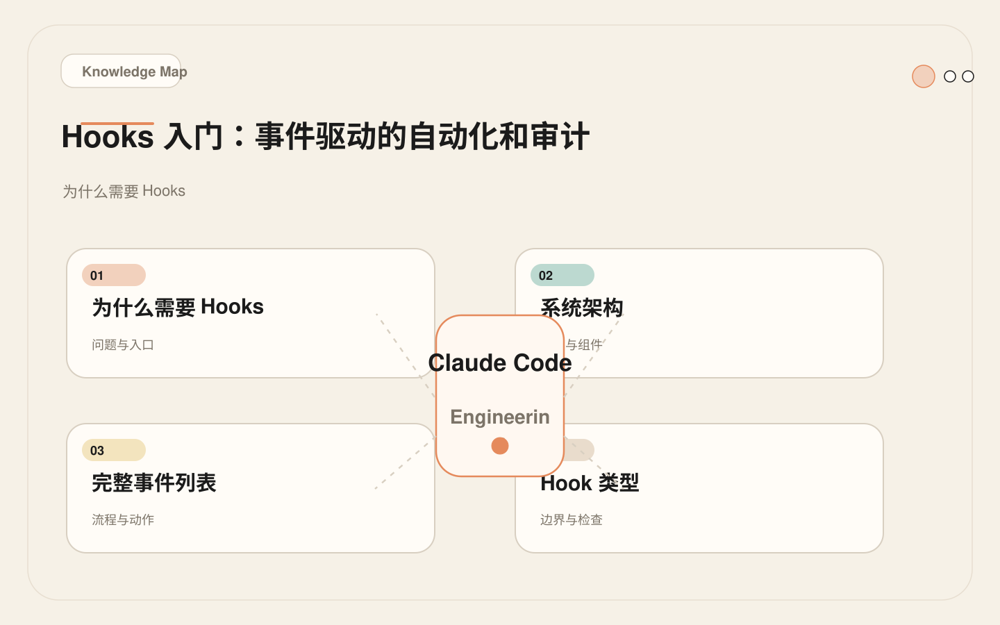
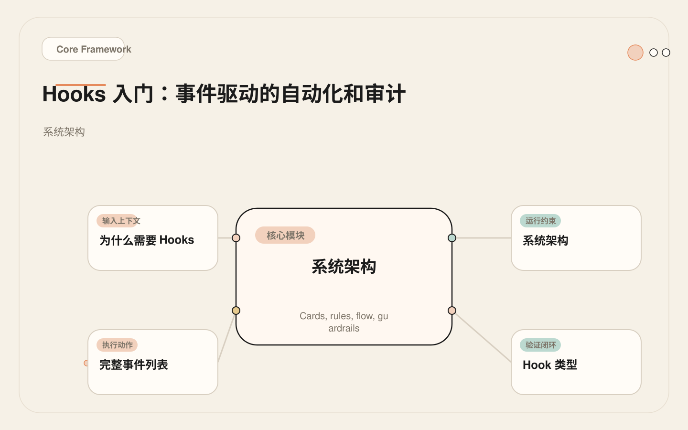
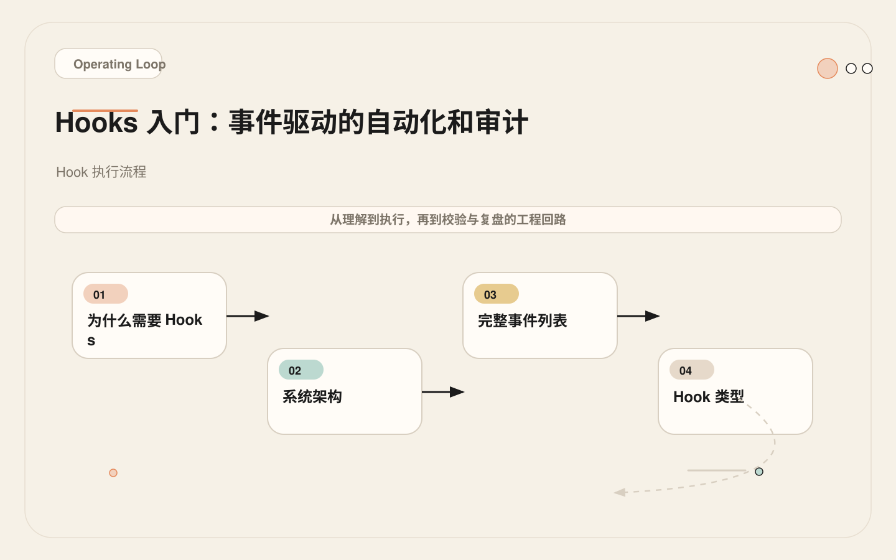
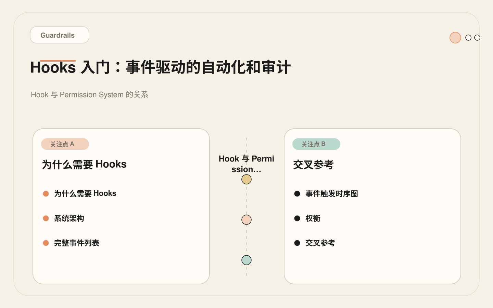

# Hooks 入门：从「相信 AI 守规矩」到「强制 AI 守规矩」

<!-- codex:cover ../../../assets/claude-code-engineering/22-hooks-introduction-cover.webp -->

<!-- /codex:cover -->

**TL;DR：** Hooks 是 Claude Code 的确定性控制层。模型负责推理，Hooks 负责在固定事件上记录、拦截、提醒和验证。它不是第二个 AI，而是纯脚本的规则引擎。

## 为什么需要 Hooks

CLAUDE.md 可以写"不要修改 .env 文件"，但提示词约束本质上是非确定性的——模型可能遵守，也可能在上下文压力下忽略。Hooks 解决的是这个问题：用确定性脚本替代非确定性指令。

<!-- codex:illustration 22-hooks-introduction/01-overview-knowledge-map.svg -->

<!-- /codex:illustration -->

三个 Hooks 的独特价值：

1. **确定性执行。** 同样的工具输入，Hook 的行为永远一样。不存在"这次遵守了，下次忘了"。
2. **零上下文消耗。** Hook 在模型推理之外运行，不占上下文窗口。
3. **可审计。** Hook 的每次执行都有退出码和输出，可以追溯。

## 系统架构

Hook 系统的核心设计是：模型做决策 → 触发生命周期事件 → 确定性脚本响应。模型不知道 Hook 的存在，也不参与 Hook 的执行。

<!-- codex:illustration 22-hooks-introduction/02-framework-core-structure.svg -->

<!-- /codex:illustration -->

```
┌──────────────────────────────────────────────────────────────┐
│                      Claude Code 运行时                       │
│                                                              │
│  ┌─────────┐    ┌──────────┐    ┌─────────┐                 │
│  │ 用户输入 │───→│ 模型推理  │───→│ 工具调用 │                 │
│  └─────────┘    └──────────┘    └────┬────┘                 │
│                                      │                       │
│                        ┌─────────────┼──────────────┐        │
│                        │             │              │        │
│                   PreToolUse    PostToolUse    PostToolUse    │
│                   检查/阻断       记录/验证      Failure      │
│                        │             │           错误处理     │
│                        │             │              │        │
│                   exit 0: 放行   ┌────┴────┐        │        │
│                   exit 2: 阻断   │  执行结果 │        │        │
│                        │         └────┬────┘        │        │
│                        ▼              ▼              ▼        │
│                   [工具实际执行]  [Hook 后处理]  [Hook 后处理]  │
│                                                              │
│  ┌──────────────────────────────────────────────────────┐    │
│  │              其他生命周期事件                           │    │
│  │  Notification · Stop · SubagentStart/Stop             │    │
│  │  InstructionsLoaded · PreCompact                      │    │
│  └──────────────────────────────────────────────────────┘    │
└──────────────────────────────────────────────────────────────┘
```

关键设计决策：Hook 的执行结果通过退出码传递给 Claude Code 运行时，而不是注入到模型推理过程中。这意味着 Hook 不会"改变 AI 的想法"，而是在物理层面控制工具调用的放行或阻断。

## 完整事件列表

每个事件对应一个触发时机和一组适用场景。理解触发时机是正确使用 Hook 的前提。

| 事件 | 触发时机 | 能否阻断 | 典型用途 |
|------|---------|---------|---------|
| `PreToolUse` | 工具执行前 | 能（exit 2） | 安全门禁、文件保护、命令过滤 |
| `PostToolUse` | 工具成功执行后 | 不能 | 自动格式化、变更记录、验证提醒 |
| `PostToolUseFailure` | 工具执行失败后 | 不能 | 错误收集、失败分析、重试建议 |
| `Notification` | 需要权限或空闲时 | 不能 | 审计日志、通知转发 |
| `SubagentStart` | 子代理启动时 | 不能 | 注入安全规则、输出格式约束 |
| `SubagentStop` | 子代理结束时 | 不能 | 收集结论、审计轨迹、结果摘要 |
| `Stop` | 主会话结束时 | 不能 | 会话总结、验证报告、审计记录 |
| `InstructionsLoaded` | CLAUDE.md 和 rules 加载后 | 不能 | 动态上下文注入、环境检测 |
| `PreCompact` | 上下文压缩前 | 不能 | 保留关键信息的提示注入 |

`PreToolUse` 是唯一能阻断工具执行的事件。其他事件都是"观察者"——它们能记录和提醒，但不能阻止工具调用。这个设计是有意的：阻断是一种高风险操作，只应该在工具执行前的安全门禁中使用。

## Hook 类型

Hook 有两种类型：`command` 和 `prompt`。

### Command 类型

Shell 脚本。从 stdin 读取工具输入（JSON 格式），通过退出码传递决策，通过 stdout 传递消息。

```text
stdin → JSON 格式的工具输入
stdout → 传递给 Claude 的消息（可选）
stderr → 日志输出（用户不可见）
exit 0 → 放行（或不阻断的通知）
exit 2 → 阻断（仅 PreToolUse 有效）
```

Command Hook 的确定性是整个系统的基础。同样的 stdin 输入，同样的退出码。没有"可能阻断"，只有"阻断或不阻断"。

### Prompt 类型

直接向 Claude 注入文本上下文。不执行脚本，不读 stdin，不做决策。纯粹的"额外提示"。

```json
{
  "type": "prompt",
  "prompt": "每次修改文件后，提醒运行相关测试。"
}
```

Prompt Hook 适合注入静态规则——那些不需要根据工具输入动态判断的指令。它的优势是零执行成本，劣势是无法做条件判断。

### 类型选择决策

| 条件 | 用 Command | 用 Prompt |
|------|-----------|----------|
| 需要读取工具输入 | 是 | -- |
| 需要条件判断 | 是 | -- |
| 需要阻断 | 是 | -- |
| 需要执行外部命令 | 是 | -- |
| 只需要注入静态文本 | -- | 是 |
| 执行成本敏感 | -- | 是（零成本） |

## 真实配置

以下是一个包含多种 Hook 的 `settings.json` 配置：

```json
{
  "hooks": {
    "PreToolUse": [
      {
        "matcher": "Edit|Write",
        "hooks": [
          {
            "type": "command",
            "command": "bash .claude/hooks/block-sensitive-files.sh"
          }
        ]
      },
      {
        "matcher": "Bash",
        "hooks": [
          {
            "type": "command",
            "command": "bash .claude/hooks/block-dangerous-commands.sh"
          }
        ]
      }
    ],
    "PostToolUse": [
      {
        "matcher": "Edit|Write",
        "hooks": [
          {
            "type": "command",
            "command": "bash .claude/hooks/log-file-changes.sh"
          }
        ]
      }
    ],
    "Stop": [
      {
        "hooks": [
          {
            "type": "command",
            "command": "bash .claude/hooks/session-summary.sh"
          }
        ]
      }
    ],
    "SubagentStart": [
      {
        "hooks": [
          {
            "type": "prompt",
            "prompt": "你是一个受限执行环境中的子代理。不要修改 .env、证书或生产配置文件。所有发现必须附带文件路径和行号。"
          }
        ]
      }
    ]
  }
}
```

配置解读：

- **matcher** 字段：正则表达式，匹配工具名称。`"Edit|Write"` 匹配 Edit 或 Write 工具。`"Bash"` 匹配 Bash 工具。省略 matcher 则匹配所有工具。
- **hooks 数组**：同一事件可以有多个 Hook，按顺序执行。PreToolUse 中任意一个 Hook 返回 exit 2 就会阻断。
- **command 路径**：建议使用 `.claude/hooks/` 目录统一管理，路径相对于项目根目录。
- **多层配置**：Hook 可以在全局 `settings.json` 和项目级 `.claude/settings.json` 中同时存在，项目级优先。

## 三类 Hook 的工程定位

### 记录型 Hook

**定位**：观察者。记录工具调用、参数和结果，不影响执行流程。

**适合场景**：

- 审计日志：记录每次文件修改和命令执行
- 变更追踪：维护会话内的修改文件列表
- 行为分析：统计 Claude Code 使用了哪些工具、频率如何

**不适合**：安全门禁（无法阻断）、上下文注入（不操作模型输入）

### 提示型 Hook

**定位**：上下文增强。在不消耗用户消息的前提下注入额外指令。

**适合场景**：

- 提醒规则："修改后端代码后运行 API 测试"
- 注入约束："只读审查，不要修改文件"
- 环境信息："当前分支是 release/v2.3，不要合并到 main"

**不适合**：条件判断（无法根据输入动态决定）、阻断操作（无法阻止工具执行）

### 阻断型 Hook

**定位**：安全门禁。在工具执行前拦截高风险操作。

**适合场景**：

- 文件保护：禁止修改 `.env`、证书、生产配置
- 命令过滤：拦截 `rm -rf`、`git push --force`、生产数据库写入
- 路径约束：限制 Claude Code 只能操作指定目录

**不适合**：业务逻辑判断（Hook 应该保持简单）、频繁触发的检查（影响开发体验）

### 类型选择矩阵

```text
我需要做什么？
│
├─ 记录发生了什么 → 记录型（PostToolUse / Stop）
│
├─ 给 Claude 额外指令 → 提示型（prompt Hook）
│
├─ 阻止危险操作 → 阻断型（PreToolUse, exit 2）
│
└─ 既要记录又要阻止 → 两个 Hook：PreToolUse 阻断 + PostToolUse 记录
```

## Hook 执行流程

以一次 Edit 工具调用为例，展示完整的 Hook 执行流程：

<!-- codex:illustration 22-hooks-introduction/03-flow-operating-loop.svg -->

<!-- /codex:illustration -->

```text
用户："修改 auth.ts 的登录逻辑"

Claude Code 推理 → 决定调用 Edit 工具修改 auth.ts
│
├─ [1] PreToolUse 触发
│   ├─ block-sensitive-files.sh 运行
│   │   ├─ stdin: {"tool_name":"Edit","tool_input":{"file_path":"/src/auth.ts",...}}
│   │   ├─ 检查文件路径是否匹配敏感模式
│   │   ├─ auth.ts 不匹配 → exit 0（放行）
│   │   └─ stdout: 空
│   │
│   └─ 所有 PreToolUse Hook 放行 → 继续执行
│
├─ [2] Edit 工具执行
│   └─ 文件修改成功
│
├─ [3] PostToolUse 触发
│   ├─ log-file-changes.sh 运行
│   │   ├─ stdin: {"tool_name":"Edit","tool_input":{"file_path":"/src/auth.ts"},"result":"success"}
│   │   ├─ 记录变更到审计日志
│   │   └─ exit 0
│   │
│   └─ 所有 PostToolUse Hook 完成
│
└─ [4] Claude Code 向用户展示修改结果

--- 如果 Edit 工具执行失败 ---

├─ [3'] PostToolUseFailure 触发
│   └─ 错误日志记录
│
--- 如果 PreToolUse 阻断 ---

├─ [1'] PreToolUse 返回 exit 2
│   ├─ 工具调用被取消
│   └─ stdout 中的消息展示给 Claude（"BLOCK: ..."）
└─ Claude 根据阻断消息调整行为
```

退出码的完整语义：

| 退出码 | 含义 | 适用事件 |
|-------|------|---------|
| 0 | 放行 / 正常完成 | 所有 |
| 2 | 阻断工具执行 | 仅 PreToolUse |
| 其他 | 异常，等同于放行 | 所有 |

**设计意图**：异常时不阻断。Hook 脚本出错（语法错误、运行时异常）不应该让 Claude Code 不可用。这和 fail-open 的安全模型一致——Hook 是附加控制层，不是核心依赖。

## Hook 与 Permission System 的关系

Claude Code 有两层控制：Permission System 和 Hooks。

<!-- codex:illustration 22-hooks-introduction/04-compare-guardrails.svg -->

<!-- /codex:illustration -->

```text
用户请求 → Claude 推理 → 工具调用决策
                             │
                      ┌──────┴──────┐
                      │ Permission  │  第一层：用户显式授权
                      │   System    │  （允许/拒绝特定工具）
                      └──────┬──────┘
                             │ 通过
                      ┌──────┴──────┐
                      │    Hooks    │  第二层：规则引擎
                      │ (PreToolUse)│  （确定性脚本检查）
                      └──────┬──────┘
                             │ 通过
                      ┌──────┴──────┐
                      │  工具执行    │  实际执行
                      └─────────────┘
```

两者的职责边界：

- **Permission System**：管理"这个工具能不能用"。粗粒度的开/关控制。用户驱动。
- **Hooks**：管理"这次调用安不安全"。细粒度的条件检查。规则驱动。

Permission System 说"Bash 可以用"，Hooks 说"Bash 可以用，但不能执行 `rm -rf`"。两者互补，不替代。

## Matcher 配置详解

Matcher 是 PreToolUse 和 PostToolUse 的路由机制。它决定一个 Hook 只对哪些工具生效。

```json
{
  "matcher": "Edit|Write",
  "hooks": [...]
}
```

Matcher 的值是正则表达式，匹配工具名称：

| Matcher | 匹配的工具 |
|---------|----------|
| `"Edit"` | Edit |
| `"Edit\|Write"` | Edit 或 Write |
| `"Bash"` | Bash |
| `".*"` | 所有工具 |
| `"mcp__.*"` | 所有 MCP 工具 |
| 省略 | 所有工具 |

**常见的 Matcher 配置策略**：

```json
// 策略 1：只监控文件写入工具
{
  "matcher": "Edit|Write",
  "hooks": [{ "type": "command", "command": "bash .claude/hooks/check-file-writes.sh" }]
}

// 策略 2：只监控命令执行工具
{
  "matcher": "Bash",
  "hooks": [{ "type": "command", "command": "bash .claude/hooks/check-commands.sh" }]
}

// 策略 3：监控所有 MCP 工具调用
{
  "matcher": "mcp__.*",
  "hooks": [{ "type": "command", "command": "bash .claude/hooks/audit-mcp-calls.sh" }]
}

// 策略 4：全局审计（所有工具）
{
  "hooks": [{ "type": "command", "command": "bash .claude/hooks/audit-all.sh" }]
}
```

## Hook 的 stdin 数据格式

Command Hook 通过 stdin 接收 JSON 格式的工具调用信息。理解这个格式是编写 Hook 脚本的基础。

```json
{
  "tool_name": "Edit",
  "tool_input": {
    "file_path": "/src/auth.ts",
    "old_string": "const token = req.headers.authorization;",
    "new_string": "const token = req.headers.authorization?.split(' ')[1];"
  }
}
```

Bash 工具的输入格式：

```json
{
  "tool_name": "Bash",
  "tool_input": {
    "command": "rm -rf node_modules && npm install",
    "description": "Clean install dependencies"
  }
}
```

Hook 脚本中读取 stdin 的标准写法：

```bash
#!/bin/bash
INPUT=$(cat)
TOOL_NAME=$(echo "$INPUT" | jq -r '.tool_name')
COMMAND=$(echo "$INPUT" | jq -r '.tool_input.command // empty')
FILE_PATH=$(echo "$INPUT" | jq -r '.tool_input.file_path // empty')
```

注意 `// empty` 的用法：当字段不存在时返回空字符串而不是 "null"。这在编写通用 Hook 时很重要——不是所有工具都有 `file_path`，也不是所有工具都有 `command`。

## Hook 配置的层级

Hook 可以在三个层级配置，优先级从高到低：

| 层级 | 文件路径 | 作用域 | 典型用途 |
|------|---------|-------|---------|
| 项目级 | `.claude/settings.json` | 当前项目 | 项目特定的文件保护和命令过滤 |
| 用户级 | `~/.claude/settings.json` | 所有项目 | 全局审计日志、个人偏好 |
| 企业级 | 管理员统一配置 | 团队所有成员 | 安全合规、强制策略 |

**配置合并规则**：

- 同一事件的所有层级 Hook 都会执行，不覆盖
- 执行顺序：企业级 → 用户级 → 项目级
- PreToolUse 阻断：任一层级的 Hook 返回 exit 2 都会阻断

这个设计允许团队设置全局安全策略（企业级），同时不阻止个人或项目添加额外的 Hook。

## 失败案例：未测试的 Hook 阻断了所有工具调用

### 经过

一个 4 人前端团队决定为项目添加 PreToolUse Hook，阻止对 `package.json` 的意外修改。开发者在周五下午写了以下 Hook：

```bash
#!/bin/bash
# .claude/hooks/block-package-json.sh
INPUT=$(cat)
FILE_PATH=$(echo "$INPUT" | jq -r '.tool_input.file_path')
if [[ "$FILE_PATH" == *"package.json"* ]]; then
  echo "BLOCK: package.json 修改需要团队 review"
  exit 2
fi
```

看起来没问题。但周一早上，团队成员开始报告 Claude Code 几乎不可用：

- 任何涉及文件的操作都被阻断
- 即使是读取 `package.json` 也被拦截
- Claude Code 无法完成任何文件编辑任务

### 根因

Hook 脚本有两个 bug：

1. **未处理 tool_name 过滤。** 没有 matcher 配置，这个 Hook 对所有工具生效，包括 Read 工具。Read 也有 `file_path` 字段，只要路径中包含 `package.json` 就会被阻断。
2. **路径匹配过于宽泛。** `"*$FILE_PATH*"` 使用了通配符匹配，任何路径中包含 `package.json` 字符串的文件都会被拦截，包括 `src/package-json-parser.ts`、`test/fixtures/package.json.bak` 等文件。

### 修复

分两步修复：

**第一步：立即恢复**。禁用 Hook（从 settings.json 中移除或注释），让团队恢复工作。

**第二步：正确实现**。

```json
{
  "hooks": {
    "PreToolUse": [
      {
        "matcher": "Edit|Write",
        "hooks": [
          {
            "type": "command",
            "command": "bash .claude/hooks/block-package-json.sh"
          }
        ]
      }
    ]
  }
}
```

```bash
#!/bin/bash
# .claude/hooks/block-package-json.sh
INPUT=$(cat)
FILE_PATH=$(echo "$INPUT" | jq -r '.tool_input.file_path // empty')

# 精确匹配根目录的 package.json
if [[ "$FILE_PATH" == "*/package.json" ]]; then
  echo "BLOCK: 根目录 package.json 修改需要团队 review。使用 npm 命令管理依赖。"
  exit 2
fi

exit 0
```

改动要点：

- 添加 `"matcher": "Edit|Write"` 确保 Hook 只对写入工具生效
- 路径匹配改为 `*/package.json`，只匹配根目录的 package.json
- 显式 `exit 0` 放行不匹配的情况
- 阻断消息包含具体的替代操作建议

### 教训

1. **先记录，后阻断。** 新 Hook 先以 exit 0 模式运行一周，记录日志但不阻断。确认无误后再升级为阻断模式。
2. **必须限定 matcher。** 不设 matcher 的 Hook 对所有工具生效，包括 Read、Grep 等只读工具。
3. **路径匹配要精确。** 通配符匹配容易误伤。用精确路径或更严格的正则。
4. **测试覆盖。** Hook 是代码，需要测试。至少验证：应该阻断的输入被阻断，不应该阻断的输入被放行。

## Hook 部署策略

推荐的渐进式部署流程：

```text
第 1 周：记录模式
├─ 所有 Hook 以 exit 0 运行
├─ 只记录日志（stderr 或文件）
├─ 观察触发频率和匹配准确性
└─ 收集误判和遗漏样本

第 2 周：提醒模式
├─ 对匹配的调用输出提示信息（stdout）
├─ 仍然 exit 0（不阻断）
├─ 用户可以看到 Hook 的判断结果
└─ 根据反馈调整匹配规则

第 3 周起：阻断模式
├─ 对确认的高风险操作返回 exit 2
├─ 保留日志和提示信息
├─ 定期审查阻断记录
└─ 持续优化匹配规则
```

这个策略的核心逻辑是：Hook 的误判成本很高。误阻断会直接破坏开发体验，误放行会留下安全漏洞。先用观察模式积累数据，再用提醒模式验证可读性，最后才用阻断模式上线。

## Hook 审计模板

每个上线的 Hook 应该有对应的文档记录。以下是一个审计模板：

```text
## Hook 审计记录

### 基本信息
- 名称: block-sensitive-files.sh
- 事件: PreToolUse
- Matcher: Edit|Write
- 类型: command（阻断）

### 输入
- 格式: JSON（stdin）
- 关键字段: tool_input.file_path

### 输出
- exit 0: 文件路径不在敏感列表中，放行
- exit 2: 文件路径匹配敏感模式，阻断
- stdout: 阻断原因说明

### 匹配规则
- .env / .env.*
- *.pem / *.key
- infra/prod/**
- migrations/**

### 禁用方法
从 .claude/settings.json 的 hooks.PreToolUse 数组中移除此条目

### 上线日期
2025-03-15

### 上次审查
2025-04-01 - 确认无误判
```

这个模板确保每个 Hook 的行为、触发条件、输出和禁用方法都有据可查。当 Hook 出现问题时，任何人都能快速理解和处理。

## 交叉参考

- [23 PreToolUse 防护](./23-pretooluse-guardrails.md)：PreToolUse Hook 的完整实现指南，包含文件保护和命令过滤的真实脚本
- [24 PostToolUse / Stop 验证](./24-posttooluse-stop-verification.md)：工具执行后的自动验证和会话结束时的结果记录
- [25 Subagent Hooks](./25-subagent-hooks.md)：给子代理注入上下文和收集结果的 Hook 配置
- [26 Hook 设计原则](./26-hook-design-principles.md)：小、确定、可解释、可回滚的四条原则和工程实践

## Hook 与 Rules 和 CLAUDE.md 的决策矩阵

三种机制都能约束 Claude Code 的行为，但工程定位完全不同。选错机制会导致约束无效或维护困难。

```text
决策维度              Hook              Rules (.md)        CLAUDE.md
──────────────────────────────────────────────────────────────────────
执行确定性             100% 确定         非确定（提示词）    非确定（提示词）
上下文消耗             零                低                 高
可阻断工具调用         是（PreToolUse）  否                 否
可审计                 是（退出码+日志）  否                 否
条件判断能力           是（脚本逻辑）     否                 否
运行时成本             有（进程开销）     无                 无
适合约束类型           硬性规则           软性指导           项目上下文
修改后生效             立即               下次对话加载        下次对话加载
```

**选择流程**：

```text
要约束的行为是什么？
│
├─ 绝对不能违反的规则（禁止修改 .env、禁止 rm -rf）
│   → Hook（PreToolUse，exit 2 阻断）
│   理由：提示词约束不可靠，必须用确定性脚本
│
├─ 建议性指导（修改后端代码要运行测试、PR review 关注安全）
│   → Rules（.claude/rules/ 目录下的 .md 文件）
│   理由：不是硬性约束，作为提示词注入更合适
│
├─ 项目级上下文（项目架构说明、技术栈、代码约定）
│   → CLAUDE.md
│   理由：这是上下文信息，不是约束。模型需要这些信息做出正确决策
│
└─ 多层叠加（重要约束需要多层防护）
    例如：禁止修改 workflow 文件
    Layer 1：CLAUDE.md 中声明"Don't modify .github/workflows/"
    Layer 2：Rules 中强调"Workflow files are protected"
    Layer 3：Hook 阻断（PreToolUse，匹配 .github/workflows/ 路径）
    只有 Layer 3 是可靠的，Layer 1-2 是提示词级的软约束
```

**常见错误**：把所有约束都写在 CLAUDE.md 里。一个 2000 行的 CLAUDE.md 里有 100 行是"不要做 X"、"不要做 Y"。这些应该分流——硬性约束用 Hook，软性指导用 Rules，CLAUDE.md 只保留上下文信息。

## Hook 脚本系统设计分析

理解 Hook 脚本的输入、输出和环境变量设计，是编写可靠 Hook 的基础。

### 输入系统

```text
stdin（标准输入）：
  格式：JSON
  内容：工具调用的完整信息

  PreToolUse 输入示例：
  {
    "tool_name": "Edit",
    "tool_input": {
      "file_path": "/src/auth.ts",
      "old_string": "...",
      "new_string": "..."
    }
  }

  PostToolUse 输入示例（额外包含执行结果）：
  {
    "tool_name": "Edit",
    "tool_input": { ... },
    "tool_result": {
      "status": "success",
      "output": "File edited successfully"
    }
  }

  Bash 工具的特殊字段：
  {
    "tool_name": "Bash",
    "tool_input": {
      "command": "npm test",
      "description": "Run tests",
      "timeout": 120000
    }
  }
```

### 输出系统

```text
stdout（标准输出）：
  - 内容会被传递给 Claude 作为上下文消息
  - PreToolUse 的 stdout 在 exit 2 时作为阻断原因展示
  - PostToolUse 的 stdout 作为补充信息注入对话
  - 保持简短：建议 ≤ 200 字符
  - 不要输出 JSON 到 stdout——那是给模型看的信息，不是日志

stderr（标准错误）：
  - 内容写入 Hook 日志，用户不可见
  - 适合记录调试信息、审计日志
  - 不会影响 Claude 的推理过程

退出码：
  0 → 正常完成/放行
  2 → 阻断（仅 PreToolUse 有效）
  其他 → 异常，等同于放行（fail-open）
```

### 环境变量

```text
Hook 脚本可用的关键环境变量：

CLAUDE_PROJECT_DIR    项目根目录的绝对路径
  用途：构建相对于项目的文件路径

CLAUDE_SESSION_ID     当前会话的唯一标识
  用途：关联同一会话的多次 Hook 调用

HOME                  用户主目录
  用途：访问全局配置或日志目录

PATH                  系统 PATH
  用途：确保脚本能找到需要的命令

注意：环境变量中不包含 API key 或 secrets。
Hook 脚本不应该尝试读取 Claude Code 的内部状态。
```

## 完整的每种事件类型配置示例

### Notification Hook

Notification 事件在 Claude Code 需要用户权限确认或会话空闲时触发。

```json
{
  "hooks": {
    "Notification": [
      {
        "hooks": [
          {
            "type": "command",
            "command": "bash .claude/hooks/forward-notification.sh"
          }
        ]
      }
    ]
  }
}
```

```bash
#!/bin/bash
# .claude/hooks/forward-notification.sh
# 将通知转发到团队的 Slack 频道（用于监控 AI 行为）

INPUT=$(cat)
MESSAGE=$(echo "$INPUT" | jq -r '.message // "Claude Code notification"')

# 发送到 Slack webhook（URL 存储在环境变量中）
if [ -n "$SLACK_WEBHOOK_URL" ]; then
  curl -s -X POST "$SLACK_WEBHOOK_URL" \
    -H 'Content-Type: application/json' \
    -d "{\"text\": \"[Claude Code] $MESSAGE\"}" > /dev/null 2>&1
fi

exit 0  # Notification 永远不阻断
```

### InstructionsLoaded Hook

InstructionsLoaded 在 CLAUDE.md 和 rules 加载完成后触发。适合注入动态上下文。

```json
{
  "hooks": {
    "InstructionsLoaded": [
      {
        "hooks": [
          {
            "type": "command",
            "command": "bash .claude/hooks/inject-runtime-context.sh"
          }
        ]
      }
    ]
  }
}
```

```bash
#!/bin/bash
# .claude/hooks/inject-runtime-context.sh
# 注入运行时环境信息，让 Claude 了解当前状态

BRANCH=$(git branch --show-current 2>/dev/null || echo "unknown")
HAS_STASH=$(git stash list 2>/dev/null | head -1 | wc -l)
UNCOMMITTED=$(git status --porcelain 2>/dev/null | wc -l)

echo "运行时上下文："
echo "- 当前分支: $BRANCH"
echo "- 未提交的变更: $UNCOMMITTED 个文件"
if [ "$HAS_STASH" -gt 0 ]; then
  echo "- 注意：有 git stash 存在"
fi

if [[ "$BRANCH" == "main" || "$BRANCH" == "master" ]]; then
  echo "⚠️ 警告：当前在主分支上操作。建议创建 feature 分支。"
fi

exit 0
```

### PreCompact Hook

PreCompact 在上下文压缩前触发。适合注入"必须保留"的关键信息提示。

```json
{
  "hooks": {
    "PreCompact": [
      {
        "hooks": [
          {
            "type": "prompt",
            "prompt": "压缩上下文时，请保留以下关键信息：(1) 当前任务的最终目标 (2) 已经完成的步骤和结果 (3) 还需要完成的具体步骤 (4) 任何已经发现但未解决的错误。不要保留中间探索过程的细节。"
          }
        ]
      }
    ]
  }
}
```

### SubagentStart / SubagentStop Hook

```json
{
  "hooks": {
    "SubagentStart": [
      {
        "hooks": [
          {
            "type": "prompt",
            "prompt": "你是受限执行环境中的子代理。不要修改 .env、证书或生产配置文件。所有发现必须附带文件路径和行号。如果发现安全问题，立即停止并报告。"
          }
        ]
      }
    ],
    "SubagentStop": [
      {
        "hooks": [
          {
            "type": "command",
            "command": "bash .claude/hooks/collect-subagent-result.sh"
          }
        ]
      }
    ]
  }
}
```

```bash
#!/bin/bash
# .claude/hooks/collect-subagent-result.sh
# 收集子代理执行结果，写入审计日志

INPUT=$(cat)
AGENT_NAME=$(echo "$INPUT" | jq -r '.agent_name // "unknown"')
RESULT=$(echo "$INPUT" | jq -r '.result // "no result"')
TIMESTAMP=$(date -u +"%Y-%m-%dT%H:%M:%SZ")

LOG_ENTRY="[$TIMESTAMP] Agent: $AGENT_NAME | Result: $(echo "$RESULT" | head -c 500)"

# 写入审计日志
echo "$LOG_ENTRY" >> "${CLAUDE_PROJECT_DIR}/.claude/agent-audit.log"

exit 0
```

## Hook 执行生命周期

完整的 Hook 执行生命周期，从注册到触发到结果处理：

```text
注册阶段：
  settings.json 加载 → 解析 hooks 配置
  → 验证 command 路径是否存在（不存在则跳过并警告）
  → 验证 prompt 是否非空
  → 注册到对应事件的监听列表

触发阶段：
  Claude Code 运行时事件发生
  → 按事件类型查找匹配的 Hook 组
  → 如果有 matcher，用正则匹配工具名称
  → 按注册顺序执行匹配的 Hook

执行阶段（Command 类型）：
  1. fork 子进程
  2. 通过 stdin 传入 JSON 数据
  3. 设置环境变量（CLAUDE_PROJECT_DIR 等）
  4. 等待执行完成（受 timeout 约束）
  5. 收集 stdout、stderr 和退出码
  6. 处理超时（超时视为异常，等同于放行）

结果处理阶段：
  PreToolUse：
    exit 0 → 放行，继续下一个 Hook 或执行工具
    exit 2 → 阻断，取消工具调用，stdout 作为阻断原因
    其他/超时 → 等同于放行（fail-open）
    stdout → 注入为 Claude 的上下文信息

  PostToolUse / PostToolUseFailure：
    退出码不影响工具执行（已经完成）
    stdout → 注入为 Claude 的上下文信息
    stderr → 写入日志

  Stop / Notification / SubagentStop：
    退出码无实际效果（观察者角色）
    stdout → 注入为上下文（如果会话还在继续）
```

## 事件触发时序图

```text
会话生命周期中的 Hook 触发时序：

InstructionsLoaded ──────────────────────────────────────────
  │ CLAUDE.md 和 rules 加载完成后触发
  │ 时机：会话开始时，只触发一次
  ▼
用户输入 ─── Claude 推理 ─── 决定调用工具
                                     │
                              PreToolUse ────────────────────
                                │ 检查/阻断
                                ├─ exit 2 → 阻断，回到 Claude 推理
                                └─ exit 0 → 放行
                                     │
                              工具执行（实际调用）
                                     │
                           ┌─────────┴─────────┐
                           │                   │
                      成功执行             执行失败
                           │                   │
                    PostToolUse      PostToolUseFailure
                      记录/验证         错误处理/日志
                           │                   │
                           └─────────┬─────────┘
                                     │
                          回到 Claude 推理（可能继续调用工具）
                                     │
                              [重复上述循环]
                                     │
  ┌──────────────────────────────────┤
  │                                  │
SubagentStart                   Notification
  │ 子代理启动时触发               │ 需要权限确认或空闲时触发
  │ 注入安全规则                   │ 审计日志、通知转发
  ▼                                ▼
  [子代理内部循环]                  [继续等待或用户响应]
  │
SubagentStop
  │ 子代理结束时触发
  │ 收集结果、审计轨迹
  ▼
                                     │
                              用户结束会话
                                     │
                              Stop ─────────────────────────
                                │ 会话结束时触发
                                │ 会话总结、验证报告、审计记录
                                ▼
                              PreCompact ────────────────────
                                │ 上下文压缩前触发
                                │ 注入"必须保留"的关键信息提示
                                ▼
                              [压缩后继续会话]
```

## 权衡

Hook 是代码，不是魔法。它会失败、阻塞、误判。越靠近阻断逻辑，越要保持小而确定。一个 200 行的 Hook 脚本比没有 Hook 更危险——因为它给了你虚假的安全感，同时引入了不确定性。

Hook 解决不了所有安全问题。它能阻止 Claude Code 执行 `rm -rf /`，但阻止不了模型生成一段看起来正确但实际有逻辑漏洞的代码。安全是一个分层系统，Hook 是其中一层，不是全部。

## 交叉参考

- [23 PreToolUse 防护](./23-pretooluse-guardrails.md)：PreToolUse Hook 的完整实现指南，包含文件保护和命令过滤的真实脚本
- [24 PostToolUse / Stop 验证](./24-posttooluse-stop-verification.md)：工具执行后的自动验证和会话结束时的结果记录
- [25 Subagent Hooks](./25-subagent-hooks.md)：给子代理注入上下文和收集结果的 Hook 配置
- [26 Hook 设计原则](./26-hook-design-principles.md)：小、确定、可解释、可回滚的四条原则和工程实践


