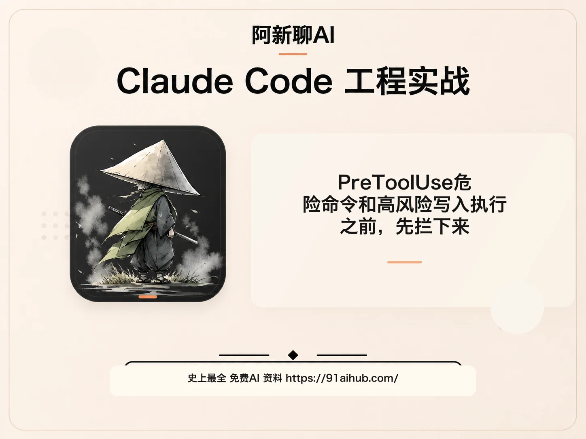
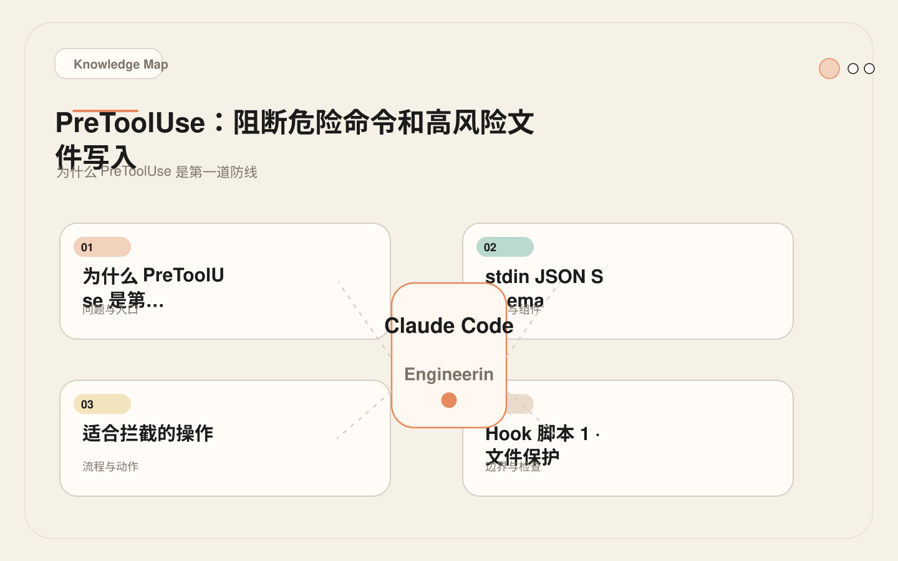
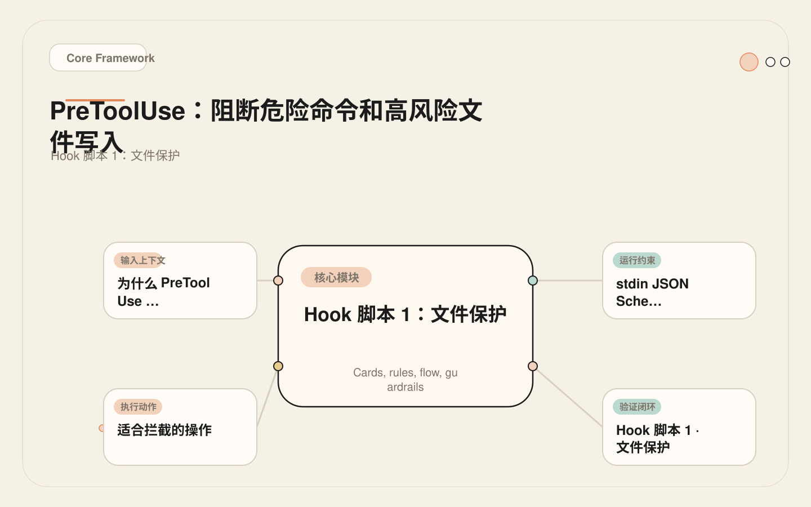
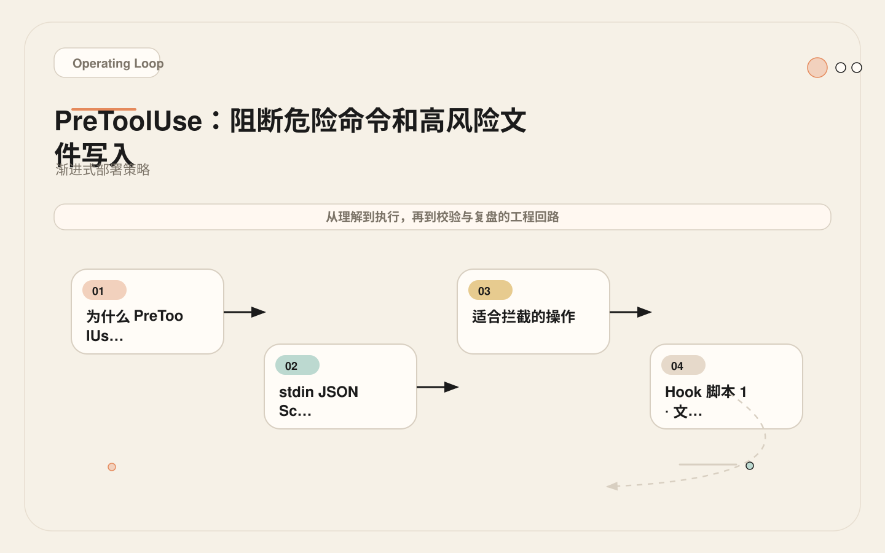
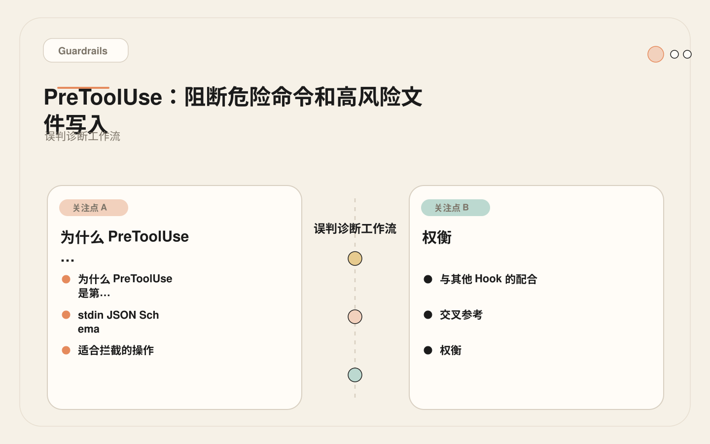

# PreToolUse：危险命令和高风险写入执行之前，先拦下来

<!-- codex:cover ../../../assets/claude-code-engineering/23-pretooluse-guardrails-cover.webp -->

<!-- /codex:cover -->

**TL;DR：** `PreToolUse` 是 Claude Code 安全控制的核心关卡。它通过退出码 2 阻断工具调用，是唯一能物理阻止 AI 行为的机制。设计原则：只拦截明确危险的操作，不做复杂业务判断。

## 为什么 PreToolUse 是第一道防线

Claude Code 的工具权限系统是粗粒度的——它控制"这个工具能不能用"，但不控制"这次调用安不安全"。Permission System 说 Bash 可以用，但不会区分 `git status` 和 `rm -rf /`。

<!-- codex:illustration 23-pretooluse-guardrails/01-overview-knowledge-map.svg -->

<!-- /codex:illustration -->

PreToolUse 填补的就是这个间隙：在工具执行前，用确定性脚本检查这次具体调用的参数，判断是否安全。

```text
Permission System:  Bash ✓  （工具级别）
PreToolUse Hook:    Bash "rm -rf /" ✗  （调用级别）
                    Bash "git status" ✓  （调用级别）
```

这种分层设计的好处：权限系统管理"能不能"，Hook 管理"该不该"。两者独立运作，互不干扰。

## stdin JSON Schema

Claude Code 运行时在每次工具调用前，将完整的调用上下文以 JSON 格式通过 stdin 传递给 Hook 脚本。理解这个 schema 是编写正确 Hook 的前提。

### 完整输入结构

```json
{
  "session_id": "abc123",
  "transcript_path": "/Users/dev/.claude/projects/my-app/00893aaf-19fa-41d2-8238-13269b9b3ca0.jsonl",
  "cwd": "/Users/dev/workspace/my-app",
  "hook_event_name": "PreToolUse",
  "tool_name": "Write",
  "tool_input": {
    "file_path": "/Users/dev/workspace/my-app/.env",
    "content": "DATABASE_URL=postgres://..."
  }
}
```

### 各工具的 tool_input 差异

不同工具的 `tool_input` 结构完全不同，Hook 脚本必须根据 `tool_name` 字段区分处理。

```json
// Edit 工具
{
  "session_id": "abc123",
  "hook_event_name": "PreToolUse",
  "tool_name": "Edit",
  "tool_input": {
    "file_path": "/Users/dev/workspace/my-app/src/auth.ts",
    "old_string": "const token = ''",
    "new_string": "const token = process.env.TOKEN"
  }
}

// Write 工具
{
  "session_id": "abc123",
  "hook_event_name": "PreToolUse",
  "tool_name": "Write",
  "tool_input": {
    "file_path": "/Users/dev/workspace/my-app/src/new-module.ts",
    "content": "export function init() { ... }"
  }
}

// Bash 工具
{
  "session_id": "abc123",
  "hook_event_name": "PreToolUse",
  "tool_name": "Bash",
  "tool_input": {
    "command": "rm -rf /tmp/build-artifacts",
    "description": "Clean build artifacts"
  }
}

// MCP 工具（如 GitHub MCP）
{
  "session_id": "abc123",
  "hook_event_name": "PreToolUse",
  "tool_name": "mcp__github__create_issue",
  "tool_input": {
    "owner": "my-org",
    "repo": "my-app",
    "title": "Fix auth bug",
    "body": "Description..."
  }
}
```

### Hook 脚本中的标准解析模式

```bash
INPUT=$(cat)

# 提取基础字段
TOOL_NAME=$(echo "$INPUT" | jq -r '.tool_name')
SESSION_ID=$(echo "$INPUT" | jq -r '.session_id // empty')
CWD=$(echo "$INPUT" | jq -r '.cwd // empty')

case "$TOOL_NAME" in
  "Edit"|"Write")
    FILE_PATH=$(echo "$INPUT" | jq -r '.tool_input.file_path // empty')
    # 处理文件路径检查
    ;;
  "Bash")
    COMMAND=$(echo "$INPUT" | jq -r '.tool_input.command // empty')
    # 处理命令检查
    ;;
  *)
    # 未知工具，放行
    ;;
esac
```

关键字段说明：

| 字段 | 类型 | 用途 |
|------|------|------|
| `session_id` | string | 当前会话标识，可用于日志关联 |
| `transcript_path` | string | 会话记录文件路径 |
| `cwd` | string | 当前工作目录 |
| `hook_event_name` | string | 事件名，固定为 `PreToolUse` |
| `tool_name` | string | 被调用的工具名称 |
| `tool_input` | object | 工具参数，结构因工具而异 |

## 适合拦截的操作

不是所有操作都值得用 PreToolUse 拦截。判断标准：**后果不可逆 + 误判概率低。**

### 高优先级（建议阻断）

| 操作 | 风险 | 误判概率 |
|------|------|---------|
| `rm -rf` 等批量删除命令 | 文件不可恢复 | 极低 |
| 修改 `.env`、`.env.*` | 密钥泄露或配置错误 | 极低 |
| 修改证书文件（`*.pem`、`*.key`） | 认证中断 | 极低 |
| `git push --force` | 提交历史不可逆丢失 | 低 |
| 修改生产基础设施配置（`infra/prod/**`） | 生产环境故障 | 极低 |
| 数据库迁移文件（`migrations/**`） | Schema 变更不可逆 | 低 |
| 对 main/master 的直接提交 | 违反分支保护 | 低 |

### 中优先级（建议提醒，不阻断）

| 操作 | 风险 | 误判概率 |
|------|------|---------|
| 修改 `package.json` | 依赖版本变更 | 中 |
| 修改 CI 配置文件 | 构建流水线受影响 | 中 |
| 运行 `npm publish`、`docker push` | 包发布不可撤回 | 低 |
| 修改测试快照文件 | 测试基线漂移 | 中 |

### 不适合拦截

| 操作 | 原因 |
|------|------|
| 任意文件编辑 | 误判概率太高，会破坏正常开发 |
| 所有 Bash 命令 | 开发体验严重退化 |
| 基于代码语义的判断 | Hook 不应承担语义分析 |

## Hook 脚本 1：文件保护

阻止对敏感配置文件和密钥文件的写入。

<!-- codex:illustration 23-pretooluse-guardrails/02-framework-core-structure.svg -->

<!-- /codex:illustration -->

```bash
#!/bin/bash
# .claude/hooks/block-sensitive-files.sh
#
# PreToolUse Hook: 阻断对敏感文件的写入
# Matcher: Edit|Write

set -euo pipefail

# 敏感文件模式列表
# 格式: 模式 = 阻断原因
BLOCKED_PATTERNS=(
  ".env:环境变量文件，密钥可能泄露"
  ".env.:.env 变体文件，密钥可能泄露"
  ".pem:SSL/TLS 证书文件"
  ".key:私钥文件"
  "infra/prod/:生产基础设施配置"
  "migrations/:数据库迁移文件，Schema 变更不可逆"
  "terraform/state:TF 状态文件"
  ".ssh/:SSH 配置目录"
  "docker-compose.prod.yml:生产 Docker 配置"
)

INPUT=$(cat)
FILE_PATH=$(echo "$INPUT" | jq -r '.tool_input.file_path // empty')

# 没有文件路径，放行
if [[ -z "$FILE_PATH" ]]; then
  exit 0
fi

for entry in "${BLOCKED_PATTERNS[@]}"; do
  PATTERN="${entry%%:*}"
  REASON="${entry##*:}"

  if [[ "$FILE_PATH" == *"$PATTERN"* ]]; then
    echo "BLOCK: 文件 $FILE_PATH 匹配受限模式 [$PATTERN]。原因: $REASON。如需修改请联系团队负责人。"
    exit 2
  fi
done

exit 0
```

脚本设计要点：

1. **`set -euo pipefail`**。脚本出错时立即退出，不静默继续。结合"异常时放行"的退出码语义，脚本出错不会阻断。
2. **模式与原因绑定**。`BLOCKED_PATTERNS` 数组中每个条目包含匹配模式和人类可读的原因。阻断消息中展示原因，让开发者知道为什么被拦截。
3. **空路径放行**。如果工具输入中没有 `file_path` 字段（如某些 Bash 调用），直接放行。
4. **匹配逻辑简单**。只有 `*pattern*` 通配符匹配，没有正则表达式。简单意味着可预测。

## Hook 脚本 2：分支保护

阻止在 main/master 分支上的直接文件修改。

```bash
#!/bin/bash
# .claude/hooks/block-main-branch.sh
#
# PreToolUse Hook: 阻止在 main/master 分支上编辑文件
# Matcher: Edit|Write
#
# 设计意图: 强制使用 feature 分支 + PR 流程，
# 防止 AI 直接在受保护分支上修改代码

set -euo pipefail

INPUT=$(cat)
FILE_PATH=$(echo "$INPUT" | jq -r '.tool_input.file_path // empty')

# 没有文件路径，放行（非文件操作工具）
if [[ -z "$FILE_PATH" ]]; then
  exit 0
fi

# 从 cwd 或 git 获取当前分支
CWD=$(echo "$INPUT" | jq -r '.cwd // empty')
if [[ -z "$CWD" ]]; then
  CWD="$(pwd)"
fi

BRANCH=""
BRANCH=$(git -C "$CWD" rev-parse --abbrev-ref HEAD 2>/dev/null || echo "")

# 无法获取分支信息，放行（宁可漏过也不要阻断）
if [[ -z "$BRANCH" ]]; then
  exit 0
fi

case "$BRANCH" in
  main|master)
    echo "BLOCK: 当前分支为 $BRANCH，禁止直接编辑文件。请切换到 feature 分支: git checkout -b feat/your-feature"
    exit 2
    ;;
  *)
    # 其他分支，放行
    ;;
esac

exit 0
```

设计要点：

1. **分支检测用 git 命令**。`git rev-parse --abbrev-ref HEAD` 是获取当前分支名的标准方法，输出稳定。
2. **检测失败时放行**。如果不在 git 仓库中（`git` 命令失败），或 `cwd` 无法获取，脚本不阻断。宁可漏判也不误判。
3. **仅保护 main/master**。release 分支、develop 分支等不在保护范围内，避免过度限制。
4. **阻断消息包含操作指引**。直接给出 `git checkout -b` 命令，Claude 可以在阻断后立即执行分支切换。

## Hook 脚本 3：命令过滤

拦截 Bash 工具中的危险命令模式。

```bash
#!/bin/bash
# .claude/hooks/block-dangerous-commands.sh
#
# PreToolUse Hook: 阻断危险的 Bash 命令
# Matcher: Bash

set -euo pipefail

INPUT=$(cat)
COMMAND=$(echo "$INPUT" | jq -r '.tool_input.command // empty')

# 没有命令，放行
if [[ -z "$COMMAND" ]]; then
  exit 0
fi

# 危险命令检查（从高到低排列，先匹配最危险的）

# 1. 批量删除
if echo "$COMMAND" | grep -qE '(rm\s+-rf\s+/|rm\s+-rf\s+~|rm\s+-rf\s+\*)'; then
  echo "BLOCK: 命令包含危险的批量删除: rm -rf /, ~, 或 *。这会删除系统或用户文件。"
  exit 2
fi

# 2. 强制推送
if echo "$COMMAND" | grep -qE 'git\s+push.*--force'; then
  echo "BLOCK: git push --force 会不可逆地覆盖远程提交历史。使用 --force-with-lease 替代。"
  exit 2
fi

# 3. 直接向 main/master 推送
if echo "$COMMAND" | grep -qE 'git\s+push\s+(origin\s+)?main\b'; then
  echo "BLOCK: 直接推送到 main 分支。请使用 feature 分支和 PR 流程。"
  exit 2
fi
if echo "$COMMAND" | grep -qE 'git\s+push\s+(origin\s+)?master\b'; then
  echo "BLOCK: 直接推送到 master 分支。请使用 feature 分支和 PR 流程。"
  exit 2
fi

# 4. 生产部署命令
if echo "$COMMAND" | grep -qE '(kubectl\s+apply.*--prod|ansible-playbook.*prod|terraform\s+apply.*prod)'; then
  echo "BLOCK: 生产部署命令。部署应通过 CI/CD 流水线执行，不应由 AI 直接运行。"
  exit 2
fi

# 5. 数据库写操作
if echo "$COMMAND" | grep -qE '(psql.*DELETE|psql.*DROP|psql.*TRUNCATE|mysql.*DELETE|mysql.*DROP)'; then
  echo "BLOCK: 数据库写操作（DELETE/DROP/TRUNCATE）。数据库变更应通过迁移脚本和 review 流程。"
  exit 2
fi

# 6. 权限变更
if echo "$COMMAND" | grep -qE '(chmod\s+777|chmod\s+-R\s+777|chown\s+.*root)'; then
  echo "BLOCK: 不安全的权限变更（chmod 777）。"
  exit 2
fi

exit 0
```

设计要点：

1. **检查顺序**。最危险的模式优先匹配。`rm -rf /` 比 `git push --force` 更严重，应该先检查。
2. **提供替代方案**。阻断消息不仅说明为什么被拦截，还告诉 Claude 正确的做法（如"使用 --force-with-lease 替代"）。这让 Claude 可以在被阻断后自我修正。
3. **正则表达式保持简单**。每个模式只匹配一类命令。不做模糊匹配，不做上下文推断。
4. **不尝试理解命令意图**。Hook 只做字符串模式匹配，不解析命令语义。语义分析是不可靠的，模式匹配是确定的。

## Matcher 配置深入

Matcher 决定 Hook 对哪些工具生效。它是 `settings.json` 中 Hook 配置的第一道过滤——只有 `tool_name` 匹配 Matcher 的工具调用才会触发 Hook 脚本。错误的 Matcher 配置是 Hook 误判的首要原因。

### Matcher 匹配规则

Matcher 的值是一个正则表达式，对 `tool_name` 字段做完整匹配（即隐含 `^` 和 `$` 锚点）。`|` 表示或，`.*` 匹配任意字符序列。

```text
"Edit|Write"       → 精确匹配 Edit 或 Write
"Bash"             → 精确匹配 Bash
"mcp__.*"          → 匹配所有 MCP 工具
"mcp__github__.*"  → 匹配 GitHub MCP server 的所有工具
".*"               → 匹配所有工具（慎用）
```

### 常见 Matcher 模式

**文件写入拦截**——只拦截 Edit 和 Write，Read 等只读工具不受影响：

```json
{
  "matcher": "Edit|Write",
  "hooks": [{ "type": "command", "command": "bash .claude/hooks/check-writes.sh" }]
}
```

**命令过滤**——只拦截 Bash 工具，检查 `tool_input.command` 字段：

```json
{
  "matcher": "Bash",
  "hooks": [{ "type": "command", "command": "bash .claude/hooks/check-bash.sh" }]
}
```

**全量 MCP 拦截**——拦截所有 MCP 工具调用。MCP 工具名格式为 `mcp__server_name__tool_name`：

```json
{
  "matcher": "mcp__.*",
  "hooks": [{ "type": "command", "command": "bash .claude/hooks/check-mcp.sh" }]
}
```

**特定 MCP server**——只拦截 database MCP server 的工具，比全量拦截更精确：

```json
{
  "matcher": "mcp__database__.*",
  "hooks": [{ "type": "command", "command": "bash .claude/hooks/check-db-mcp.sh" }]
}
```

**特定 MCP 操作**——拦截所有 MCP server 的写操作类工具：

```json
{
  "matcher": "mcp__.*__write.*",
  "hooks": [{ "type": "command", "command": "bash .claude/hooks/check-mcp-writes.sh" }]
}
```

### Matcher 与 Hook 脚本的关系

Matcher 决定了哪些工具调用会到达 Hook 脚本。如果一个 Hook 的 Matcher 是 `Edit|Write`，那么当 Bash 工具被调用时，这个 Hook 根本不会执行。这有两层含义：

1. **Matcher 是第一道过滤**，脚本逻辑是第二道。一个精确的 Matcher 可以简化脚本逻辑——脚本不需要处理不相关的工具。
2. **Matcher 太宽泛会浪费资源**。`.*` 会让每次工具调用都触发脚本，包括 Read、Grep 等无害操作。

### 完整的 settings.json 配置

将三个 Hook 组合到完整的配置中：

```json
{
  "hooks": {
    "PreToolUse": [
      {
        "matcher": "Edit|Write",
        "hooks": [
          {
            "type": "command",
            "command": "bash .claude/hooks/block-sensitive-files.sh"
          },
          {
            "type": "command",
            "command": "bash .claude/hooks/block-main-branch.sh"
          }
        ]
      },
      {
        "matcher": "Bash",
        "hooks": [
          {
            "type": "command",
            "command": "bash .claude/hooks/block-dangerous-commands.sh"
          }
        ]
      },
      {
        "matcher": "mcp__.*",
        "hooks": [
          {
            "type": "command",
            "command": "bash .claude/hooks/audit-mcp-calls.sh"
          }
        ]
      }
    ]
  }
}
```

这个配置覆盖了三个维度：

- **Edit/Write 工具**：文件路径保护 + 分支保护（两个 Hook 串行执行）
- **Bash 工具**：命令过滤
- **MCP 工具**：审计日志（记录但不阻断）

注意同一个 Matcher 下可以配置多个 Hook，它们按配置顺序串行执行。任何一个 Hook 返回 exit 2 都会阻断工具调用，后续 Hook 不再执行。

## 渐进式部署策略

PreToolUse Hook 的误判会直接阻断正常工作。渐进式部署是降低风险的关键。核心思路：先观察，再提醒，最后阻断。

<!-- codex:illustration 23-pretooluse-guardrails/03-flow-operating-loop.svg -->

<!-- /codex:illustration -->

### 阶段 1：记录模式（第 1 周）

只记录匹配数据，不阻断任何操作。目标：收集统计信息，判断误判率和遗漏率。

```bash
#!/bin/bash
# .claude/hooks/guard-files.sh — 阶段 1: 只记录，不阻断
#
# settings.json 中 Matcher 为 Edit|Write

set -euo pipefail

INPUT=$(cat)
FILE_PATH=$(echo "$INPUT" | jq -r '.tool_input.file_path // empty')

if [[ -z "$FILE_PATH" ]]; then
  exit 0
fi

PATTERNS=(".env" ".pem" ".key" "infra/prod/" "migrations/" "terraform/state")

for pattern in "${PATTERNS[@]}"; do
  if [[ "$FILE_PATH" == *"$pattern"* ]]; then
    echo "[$(date -Iseconds)] WOULD_BLOCK: $FILE_PATH matches [$pattern]" >> .claude/hooks/hook-log.txt
    # 阶段 1: 仍然放行
    exit 0
  fi
done
exit 0
```

对应的 `settings.json`：

```json
{
  "hooks": {
    "PreToolUse": [
      {
        "matcher": "Edit|Write",
        "hooks": [
          {
            "type": "command",
            "command": "bash .claude/hooks/guard-files.sh"
          }
        ]
      }
    ]
  }
}
```

一周后检查 `hook-log.txt`，统计匹配频率和误判样本。

### 阶段 2：提醒模式（第 2 周）

输出警告消息但不阻断。目标：验证提示的可读性，观察 Claude 对提醒的响应行为。

```bash
#!/bin/bash
# .claude/hooks/guard-files.sh — 阶段 2: 提醒但不阻断
#
# settings.json 不变，只改脚本逻辑

set -euo pipefail

INPUT=$(cat)
FILE_PATH=$(echo "$INPUT" | jq -r '.tool_input.file_path // empty')

if [[ -z "$FILE_PATH" ]]; then
  exit 0
fi

PATTERNS=(
  ".env:环境变量文件，密钥可能泄露"
  ".pem:SSL/TLS 证书文件"
  ".key:私钥文件"
  "infra/prod/:生产基础设施配置"
  "migrations/:数据库迁移文件"
)

for entry in "${PATTERNS[@]}"; do
  PATTERN="${entry%%:*}"
  REASON="${entry##*:}"
  if [[ "$FILE_PATH" == *"$PATTERN"* ]]; then
    echo "WARN: 文件 $FILE_PATH 匹配敏感模式 [$PATTERN]。原因: $REASON。建议确认修改必要性。"
    echo "[$(date -Iseconds)] WARN: $FILE_PATH" >> .claude/hooks/hook-log.txt
    # 阶段 2: exit 0 放行，但 Claude 会看到警告消息
    exit 0
  fi
done
exit 0
```

### 阶段 3：阻断模式（第 3 周起）

对确认的高风险模式启用阻断，中风险模式保持提醒。

```bash
#!/bin/bash
# .claude/hooks/guard-files.sh — 阶段 3: 高风险阻断，中风险提醒

set -euo pipefail

INPUT=$(cat)
FILE_PATH=$(echo "$INPUT" | jq -r '.tool_input.file_path // empty')

if [[ -z "$FILE_PATH" ]]; then
  exit 0
fi

# 高风险模式: 阻断
BLOCK_PATTERNS=(
  ".env:环境变量文件，密钥泄露风险"
  ".pem:SSL/TLS 证书文件"
  ".key:私钥文件"
  "infra/prod/:生产基础设施配置"
  "terraform/state:TF 状态文件"
)

for entry in "${BLOCK_PATTERNS[@]}"; do
  PATTERN="${entry%%:*}"
  REASON="${entry##*:}"
  if [[ "$FILE_PATH" == *"$PATTERN"* ]]; then
    echo "BLOCK: $FILE_PATH 匹配高风险模式 [$PATTERN]。原因: $REASON。如需修改请联系团队负责人。"
    echo "[$(date -Iseconds)] BLOCK: $FILE_PATH [$PATTERN]" >> .claude/hooks/hook-log.txt
    exit 2
  fi
done

# 中风险模式: 提醒
WARN_PATTERNS=(
  "migrations/:数据库迁移文件"
  "docker-compose.prod.yml:生产 Docker 配置"
)

for entry in "${WARN_PATTERNS[@]}"; do
  PATTERN="${entry%%:*}"
  REASON="${entry##*:}"
  if [[ "$FILE_PATH" == *"$PATTERN"* ]]; then
    echo "WARN: $FILE_PATH 匹配中风险模式 [$PATTERN]。原因: $REASON。请确认修改必要性。"
    echo "[$(date -Iseconds)] WARN: $FILE_PATH [$PATTERN]" >> .claude/hooks/hook-log.txt
    exit 0
  fi
done

exit 0
```

### 部署检查清单

```text
上线前检查：
├─ [ ] Matcher 是否正确限定工具范围？
├─ [ ] 是否测试了应该阻断的输入？
├─ [ ] 是否测试了不应该阻断的输入？
├─ [ ] 脚本出错时是否 exit 0（放行）？
├─ [ ] 阻断消息是否包含原因和替代方案？
├─ [ ] 是否有日志记录（即使阻断模式也保留日志）？
└─ [ ] 是否有快速禁用的方法（移除配置或注释脚本）？
```

## 误判诊断工作流

当 PreToolUse Hook 阻断了不应该阻断的操作时，按以下步骤系统化诊断。

<!-- codex:illustration 23-pretooluse-guardrails/04-compare-guardrails.svg -->

<!-- /codex:illustration -->

### 步骤 1：确认阻断来源

检查 Hook 的 stdout 输出。阻断消息中包含匹配的模式和原因。

```text
BLOCK: 文件 src/config/production.ts 匹配受限模式 [infra/prod/]。
原因: 生产基础设施配置。如需修改请联系团队。
```

如果没有看到阻断消息，检查是否有多个 Hook 配置——可能是另一个 Matcher 的 Hook 触发了阻断。

### 步骤 2：分析匹配逻辑

定位匹配命中。上面这个例子中，`src/config/production.ts` 并不在 `infra/prod/` 目录下，但仍然被拦截——说明匹配逻辑有问题。

如果 Hook 脚本中的匹配逻辑是：

```bash
if [[ "$FILE_PATH" == *"prod"* ]]; then ...
```

那么任何路径中包含 "prod" 子串的文件都会被拦截——包括 `production.ts`、`product-service.ts`、`src/reproduce-bug.ts`。这是典型的过度宽泛匹配。

### 步骤 3：复现并确认

用 `echo` 模拟 stdin 输入，直接测试 Hook 脚本：

```bash
# 构造模拟输入
echo '{"tool_name":"Edit","tool_input":{"file_path":"/src/config/production.ts"}}' \
  | bash .claude/hooks/block-sensitive-files.sh

# 检查退出码
echo "exit code: $?"
```

如果退出码是 2，确认了匹配命中。如果退出码是 0，问题可能不在脚本本身——检查 Matcher 配置是否正确。

### 步骤 4：修复匹配规则

将子串匹配改为精确路径匹配：

```bash
# 错误：匹配任何包含 "prod" 的路径
if [[ "$FILE_PATH" == *"prod"* ]]; then ...

# 正确：只匹配 infra/prod/ 目录下的文件
if [[ "$FILE_PATH" == *"infra/prod/"* ]]; then ...
```

### 步骤 5：增加白名单

如果某些路径确实包含敏感关键词但不应被拦截（如测试 fixture），添加白名单：

```bash
# 白名单：这些路径虽然包含敏感模式但允许修改
ALLOWED_PATHS=(
  "test/fixtures/"
  "src/mocks/"
  "docs/examples/"
)

is_allowed() {
  local path="$1"
  for allowed in "${ALLOWED_PATHS[@]}"; do
    if [[ "$path" == *"$allowed"* ]]; then
      return 0
    fi
  done
  return 1
}

# 在阻断逻辑前检查白名单
if is_allowed "$FILE_PATH"; then
  exit 0
fi
```

### 步骤 6：回归测试

修复后，用两组输入验证：

```bash
# 应该被阻断
echo '{"tool_name":"Write","tool_input":{"file_path":"/infra/prod/config.yml"}}' \
  | bash .claude/hooks/block-sensitive-files.sh
# 期望: exit 2

# 不应该被阻断
echo '{"tool_name":"Edit","tool_input":{"file_path":"/src/config/production.ts"}}' \
  | bash .claude/hooks/block-sensitive-files.sh
# 期望: exit 0

echo '{"tool_name":"Edit","tool_input":{"file_path":"/src/services/product-service.ts"}}' \
  | bash .claude/hooks/block-sensitive-files.sh
# 期望: exit 0
```

## 生产环境反模式

以下是从实际项目中观察到的 PreToolUse Hook 失败模式。

### 反模式 1：过度宽泛的正则阻断了测试 fixture

**经过**。团队配置了一个 Hook，阻止对任何"生产相关"文件的修改。正则表达式设计为匹配所有包含 `prod` 关键词的路径：

```bash
#!/bin/bash
# .claude/hooks/block-prod.sh (有问题的版本)
INPUT=$(cat)
FILE_PATH=$(echo "$INPUT" | jq -r '.tool_input.file_path // empty')

if [[ "$FILE_PATH" =~ prod ]]; then
  echo "BLOCK: 生产配置文件，禁止修改"
  exit 2
fi
exit 0
```

上线后，以下文件全部被拦截：

- `src/config/production.ts` — 合法的生产配置模块
- `test/fixtures/production-data.json` — 测试 fixture
- `src/services/product-service.ts` — 产品服务，和生产环境无关
- `docs/production-deployment.md` — 部署文档
- `src/reproduce-production-bug.ts` — bug 复现脚本

Claude Code 几乎无法正常编辑项目。每次涉及这些文件的修改都被拦截，Claude 不得不绕过这些文件或请求人工操作。

**根因**。正则 `=~ prod` 匹配了任何路径中包含 "prod" 子串的文件。这不是"生产配置保护"，这是"任何文件名包含 prod 四个字母的保护"。

**修复**。改为精确路径模式列表：

```bash
#!/bin/bash
# .claude/hooks/block-prod.sh (修复版本)
INPUT=$(cat)
FILE_PATH=$(echo "$INPUT" | jq -r '.tool_input.file_path // empty')

PROD_CONFIG_PATTERNS=(
  "infra/prod/"
  "config/production.yml"
  "config/production.yaml"
  ".env.production"
  "docker-compose.prod.yml"
)

for pattern in "${PROD_CONFIG_PATTERNS[@]}"; do
  if [[ "$FILE_PATH" == *"$pattern"* ]]; then
    echo "BLOCK: 文件匹配生产配置模式 [$pattern]。生产配置变更需通过 PR review。"
    exit 2
  fi
done

exit 0
```

### 反模式 2：脚本依赖外部服务导致超时

**经过**。团队写了一个 Hook，在每次文件写入前调用内部 API 检查文件是否受保护：

```bash
#!/bin/bash
# .claude/hooks/block-via-api.sh (有问题的版本)
INPUT=$(cat)
FILE_PATH=$(echo "$INPUT" | jq -r '.tool_input.file_path // empty')

# 调用内部 API 检查文件保护状态
RESPONSE=$(curl -s -m 5 "http://internal-api/protection?path=$FILE_PATH")

if [[ "$RESPONSE" == *"protected"* ]]; then
  echo "BLOCK: 此文件受保护"
  exit 2
fi
exit 0
```

上线后出现两个问题：

1. API 服务偶尔响应慢（>5 秒），导致 Claude Code 长时间无响应。用户以为卡死，强制退出。
2. VPN 断开后 API 不可达，curl 返回非零退出码，`set -e` 导致脚本直接退出，退出码非 0 也非 2。Claude Code 将其视为 Hook 执行错误，跳过 Hook 执行了操作——保护完全失效。

**根因**。Hook 引入了网络依赖，违反了"确定性"原则。Hook 应该是本地、同步、无外部依赖的脚本。

**修复**。将保护规则硬编码在脚本中，不依赖外部服务：

```bash
#!/bin/bash
# .claude/hooks/block-no-api.sh (修复版本)
set -euo pipefail

INPUT=$(cat)
FILE_PATH=$(echo "$INPUT" | jq -r '.tool_input.file_path // empty')

if [[ -z "$FILE_PATH" ]]; then
  exit 0
fi

# 保护规则硬编码，不依赖外部服务
PROTECTED=(
  "infra/prod/"
  ".env"
  "config/production.yml"
)

for pattern in "${PROTECTED[@]}"; do
  if [[ "$FILE_PATH" == *"$pattern"* ]]; then
    echo "BLOCK: 文件匹配保护模式 [$pattern]"
    exit 2
  fi
done
exit 0
```

如果确实需要动态规则，用 cron 定时同步规则文件到本地，Hook 读取本地文件而非调用 API。

### 反模式 3：exit code 处理错误导致全量阻断

**经过**。团队写了一个 Hook，但遗漏了 `set -e` 和错误处理：

```bash
#!/bin/bash
# .claude/hooks/broken-exit.sh (有问题的版本)

INPUT=$(cat)
FILE_PATH=$(echo "$INPUT" | jq -r '.tool_input.file_path // empty')

# jq 不存在或版本不兼容时，FILE_PATH 可能为空或出错
# 但脚本继续执行...

if [[ "$FILE_PATH" == *".env"* ]]; then
  echo "BLOCK: .env 文件"
  exit 2
fi

# 遗漏了显式 exit 0
# Shell 默认返回最后一条命令的退出码
```

这个脚本有两个隐患：

1. 如果 `jq` 未安装，`FILE_PATH` 变量赋值失败但没有 `set -e`，脚本继续执行。后续逻辑基于可能不正确的 `FILE_PATH` 值运行。
2. 脚本末尾遗漏了 `exit 0`。Shell 的默认退出码是最后一条命令的退出码。如果最后一条命令返回非零，Claude Code 可能将其解读为阻断或错误。

**修复**。遵循三个硬性规则：

1. 始终 `set -euo pipefail`。
2. 始终在脚本末尾显式写 `exit 0`。
3. 始终检查关键变量是否为空后再使用。

## 阻断后 Claude 的行为

当 PreToolUse 返回 exit 2 时，Claude Code 的行为是：

1. 工具调用被取消，不执行
2. Hook 的 stdout 消息作为系统消息注入到 Claude 的上下文中
3. Claude 根据阻断消息调整后续行为

这意味着阻断消息的质量直接影响 Claude 的恢复能力。一个好的阻断消息应该：

- **说明原因**："文件匹配敏感模式 .env"
- **提供替代方案**："使用环境变量管理工具修改"
- **明确操作指引**："如需修改请联系团队负责人"

坏的阻断消息："BLOCK"——没有原因，Claude 不知道该怎么调整。

### JSON 输出格式（高级控制）

除了纯文本 stdout，PreToolUse Hook 还支持 JSON 格式输出，提供更精细的控制：

```json
{
  "hookSpecificOutput": {
    "hookEventName": "PreToolUse",
    "permissionDecision": "deny",
    "permissionDecisionReason": "此文件包含生产密钥，禁止修改"
  }
}
```

三种 `permissionDecision` 值：

| 值 | 行为 | 消息可见性 |
|----|------|-----------|
| `allow` | 绕过权限系统，自动批准 | 原因对用户可见，对 Claude 不可见 |
| `deny` | 阻断工具调用 | 原因对 Claude 可见 |
| `ask` | 弹出确认对话框 | 原因对用户可见，对 Claude 不可见 |

`allow` 的典型用途是自动批准低风险操作，减少权限弹窗。`deny` 等同于 exit 2 但可以携带结构化原因。`ask` 将决策权交给用户，适用于需要人工判断的灰色地带。

## 与其他 Hook 的配合

PreToolUse 通常不是独立使用的。一个完整的防护体系包含多层 Hook：

```text
PreToolUse (阻断层)
├─ 检查工具输入是否安全
├─ 不安全 → exit 2 阻断
└─ 安全 → 放行

    ↓ 工具执行

PostToolUse (验证层)
├─ 记录这次工具调用的参数和结果
├─ 如果是文件修改 → 记录到变更日志
└─ 如果是测试运行 → 记录通过/失败

    ↓ 会话继续

Stop (总结层)
├─ 汇总本次会话的所有工具调用
├─ 生成验证报告
└─ 记录未完成的验证项
```

三层 Hook 的职责不重叠：PreToolUse 管"能不能做"，PostToolUse 管"做了什么"，Stop 管"做完了没有"。

## 交叉参考

- [22 Hooks 入门](./22-hooks-introduction.md)：Hook 系统的完整架构、事件列表和执行流程
- [24 PostToolUse / Stop 验证](./24-posttooluse-stop-verification.md)：工具执行后的自动验证和会话总结
- [26 Hook 设计原则](./26-hook-design-principles.md)：小、确定、可解释、可回滚的四条设计原则
- [17 MCP 心智模型](./17-mcp-mental-model.md)：理解 MCP 工具的风险特征和权限模型

## 权衡

PreToolUse 的阻断能力是双刃剑。正确的阻断保护了系统安全，错误的阻断了正常的开发流程。

误拦截会破坏开发体验。先记录，再提醒，最后阻断，是更稳的落地顺序。不要在第一天就把所有规则设为阻断模式——先让规则在观察模式下运行足够长的时间，确认误判率可以接受后再升级。


