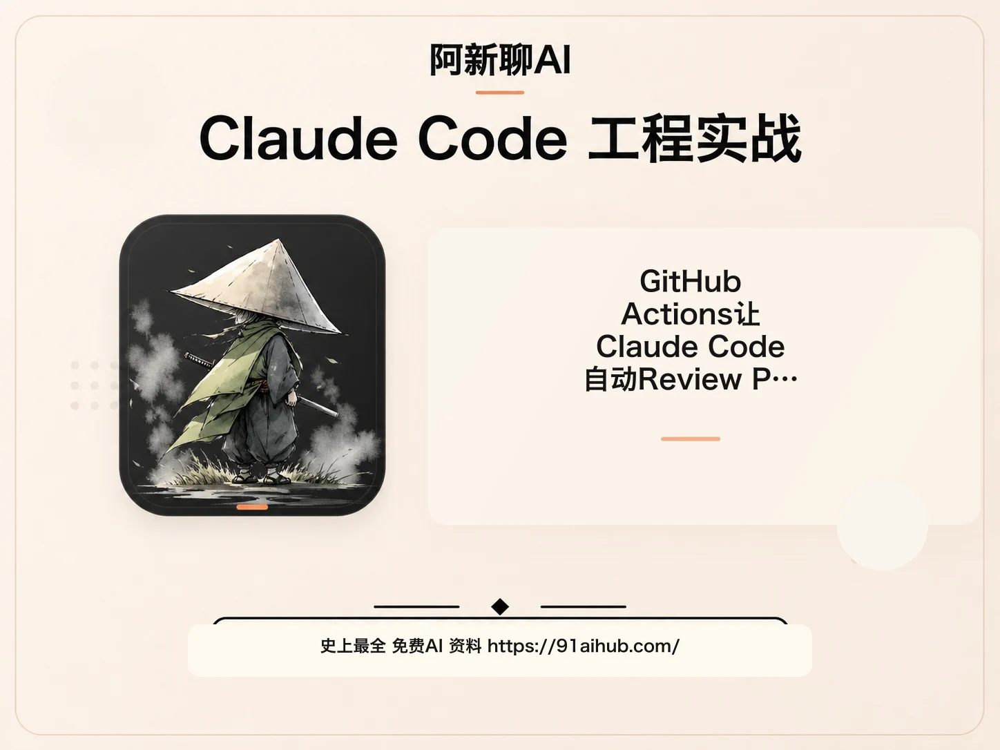
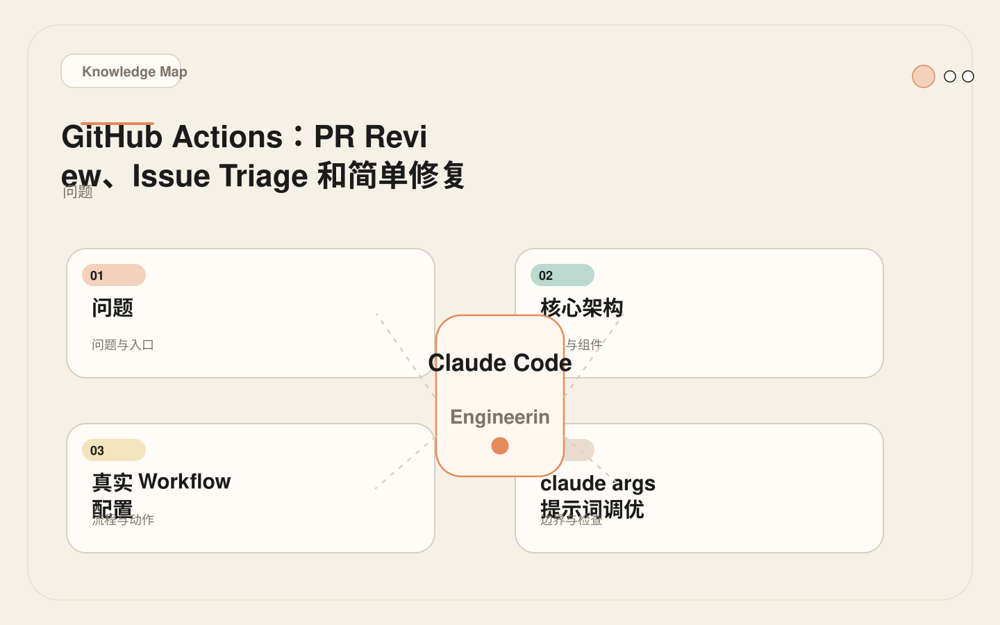
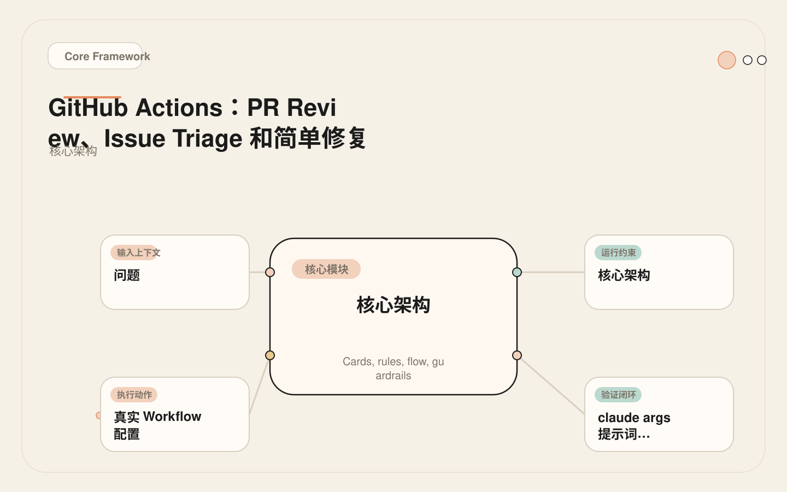
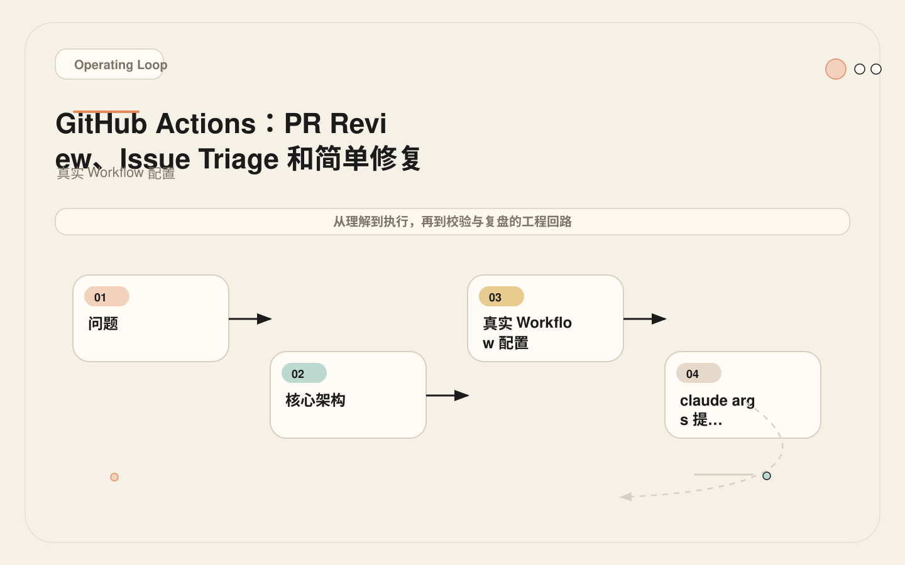
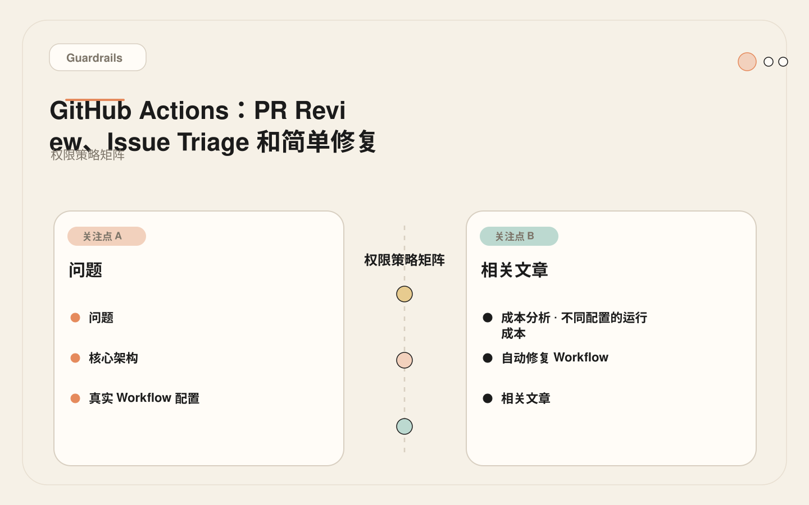

# GitHub Actions：让 Claude Code 自动 Review PR、分类 Issue、修小 Bug

<!-- codex:cover ../../../assets/claude-code-engineering/28-github-actions-cover.webp -->

<!-- /codex:cover -->

**TL;DR：** GitHub Actions 把 Claude Code 接入团队协作流程。第一批场景应该是 review、triage、摘要和低风险修复，不是自动合并。配置关键是：触发条件过滤、权限最小化、提示词精确、输出格式约束。

## 问题

团队协作的核心流程在 PR 和 issue 里。如果 Claude Code 只在本地终端使用，它的分析结果需要人工复制粘贴到 PR 评论里，这是一个断点。GitHub Actions 能把这个环节接上——当 PR 创建或 issue 提交时，自动触发 Claude Code 分析，把结果直接写回 PR/issue。

<!-- codex:illustration 28-github-actions/01-overview-knowledge-map.svg -->

<!-- /codex:illustration -->

但这不是简单加一个 Action 就完事。CI 环境有独特约束：token 权限、secrets 暴露、外部贡献者、触发频率、成本控制。每个约束都需要在设计时明确处理。

更深层的问题是定位问题。Claude Code 在 CI 里的角色应该是什么？是自动审批者？代码质量检查器？还是辅助 review 工具？这个定位决定了整个配置策略。我们的建议是：**把 CI 里的 Claude Code 定位为第一道防线**——它负责捕获明显的 bug 和安全问题，让人类 reviewer 把精力集中在架构、业务逻辑和用户体验上。它不是最终审批者，而是一个不知疲倦的初级 reviewer。

## 核心架构

Claude Code 在 GitHub Actions 中有两种使用方式：

<!-- codex:illustration 28-github-actions/02-framework-core-structure.svg -->

<!-- /codex:illustration -->

**方式一：`claude-code-action`（官方 Action）**

Anthropic 提供了官方 GitHub Action，封装了 Claude Code 调用、权限管理和结果输出。

```text
PR 事件 → GitHub Action 触发 → claude-code-action → Claude Code 分析 → PR 评论
```

**方式二：Headless 调用（自定义 Workflow）**

直接在 workflow 中用 `claude -p` 调用，灵活但需要自己处理权限和输出。

```text
PR 事件 → 自定义 Workflow → claude -p → 结果解析 → 下游动作
```

选择原则：标准 review/triage 场景用官方 Action，需要自定义输出格式或复杂逻辑时用 Headless 调用。

## 真实 Workflow 配置

### PR Review（推荐起步场景）

<!-- codex:illustration 28-github-actions/03-flow-operating-loop.svg -->

<!-- /codex:illustration -->

```yaml
name: Claude PR Review

on:
  pull_request:
    types: [opened, synchronize]

jobs:
  review:
    runs-on: ubuntu-latest
    # 关键：只处理同仓库 PR，排除外部 fork
    if: github.event.pull_request.head.repo.full_name == github.repository
    permissions:
      contents: read        # 读代码
      pull-requests: write  # 写评论
      # 注意：没有 write 到 contents，不能改代码
    steps:
      - uses: actions/checkout@v4
        with:
          fetch-depth: 0    # 需要完整历史来理解 diff

      - uses: anthropics/claude-code-action@v1
        with:
          anthropic_api_key: ${{ secrets.ANTHROPIC_API_KEY }}
          max_turns: 8
          claude_args: |
            You are reviewing a pull request.
            Focus ONLY on:
            - Correctness bugs (logic errors, off-by-one, null dereference)
            - Missing error handling
            - Security issues (injection, auth bypass, data exposure)
            - Missing or incorrect tests

            Do NOT comment on:
            - Code style preferences
            - Naming conventions (unless genuinely confusing)
            - Minor optimizations without measurable impact

            Format each finding as:
            **[SEVERITY]** file:line — description
            Severity: critical | high | medium | low | info

            If no significant issues found, say "No significant issues found" and stop.
```

关键配置决策：

1. `if: github.event.pull_request.head.repo.full_name == github.repository`：排除外部 fork 的 PR。外部 PR 不应该触发消耗 API key 的 Action（见 [29 — CI 安全边界](./29-ci-security-boundaries.md)）。
2. `permissions: contents: read` + `pull-requests: write`：最小权限。能读代码和写评论，不能推代码。
3. `max_turns: 8`：限制执行轮数，防止复杂 PR 消耗过多 tokens。
4. 提示词明确列出"做什么"和"不做什么"：减少无关评论，提高信号噪声比。

### Issue Triage

```yaml
name: Claude Issue Triage

on:
  issues:
    types: [opened, edited]

jobs:
  triage:
    runs-on: ubuntu-latest
    if: github.event.issue.author_association == 'MEMBER' || github.event.issue.author_association == 'COLLABORATOR'
    permissions:
      issues: write
    steps:
      - uses: actions/checkout@v4

      - name: Classify Issue
        env:
          ANTHROPIC_API_KEY: ${{ secrets.ANTHROPIC_API_KEY }}
        run: |
          RESULT=$(claude -p "Classify this GitHub issue.
          Title: ${{ github.event.issue.title }}
          Body: ${{ github.event.issue.body }}

          Output JSON only: {\"labels\": [\"bug\"|\"feature\"|\"docs\"|\"question\"], \"priority\": \"high\"|\"medium\"|\"low\", \"summary\": \"one line\"}" \
            --output-format json \
            --max-turns 1 \
            --disallowedTools "Edit,Write,Bash")

          LABELS=$(echo "$RESULT" | jq -r '.labels[]' | tr '\n' ',' | sed 's/,$//')
          PRIORITY=$(echo "$RESULT" | jq -r '.priority')

          # 应用标签
          gh issue edit ${{ github.event.issue.number }} \
            --add-label "$LABELS" \
            --add-label "priority:$PRIORITY"
        env:
          GH_TOKEN: ${{ secrets.GITHUB_TOKEN }}
```

关键配置决策：

1. `author_association` 过滤：只有成员和协作者的 issue 才触发分类。避免外部用户提交的 issue 触发消耗成本的 API 调用。
2. `--max-turns 1`：分类是单轮任务，不需要多轮工具调用。
3. `--disallowedTools "Edit,Write,Bash"`：issue 分类不需要读写文件或执行命令。
4. 结果用 `jq` 解析后通过 `gh` CLI 应用标签：标准 GitHub 工具链，不需要额外依赖。

### CI 失败分析

```yaml
name: Claude Failure Analysis

on:
  workflow_run:
    workflows: ["CI"]
    types: [completed]
    branches: [main]

jobs:
  analyze:
    runs-on: ubuntu-latest
    if: github.event.workflow_run.conclusion == 'failure'
    permissions:
      contents: read
      issues: write
    steps:
      - uses: actions/checkout@v4

      - name: Fetch Failure Log
        env:
          GH_TOKEN: ${{ secrets.GITHUB_TOKEN }}
        run: |
          # 获取失败 job 的日志
          RUN_ID=${{ github.event.workflow_run.id }}
          gh run view $RUN_ID --log-failed > failure-log.txt 2>/dev/null || echo "No log available" > failure-log.txt

      - name: Analyze with Claude
        env:
          ANTHROPIC_API_KEY: ${{ secrets.ANTHROPIC_API_KEY }}
        run: |
          claude -p "Analyze this CI failure and identify root cause.
          Branch: ${{ github.event.workflow_run.head_branch }}
          Commit: ${{ github.event.workflow_run.head_sha }}
          Failure log:
          $(head -200 failure-log.txt)

          Output JSON: {\"root_cause\": \"...\", \"confidence\": 0.0-1.0, \"suggested_fix\": \"...\", \"is_flaky\": bool, \"files_to_check\": [\"...\"]}" \
            --output-format json \
            --max-turns 3 \
            --allowedTools "Read,Grep,Glob" \
            > analysis.json

      - name: Post Analysis Comment
        env:
          GH_TOKEN: ${{ secrets.GITHUB_TOKEN }}
        run: |
          # 找到对应的 commit 关联的 PR（如果有）
          PR_NUMBER=$(gh pr list --state open --head ${{ github.event.workflow_run.head_branch }} --json number -q '.[0].number' 2>/dev/null || echo "")

          ROOT_CAUSE=$(jq -r '.root_cause' analysis.json)
          SUGGESTED_FIX=$(jq -r '.suggested_fix' analysis.json)
          IS_FLAKY=$(jq -r '.is_flaky' analysis.json)

          COMMENT="## CI Failure Analysis

          **Root Cause**: $ROOT_CAUSE
          **Suggested Fix**: $SUGGESTED_FIX
          **Flaky Test**: $IS_FLAKY

          _Generated by Claude Code_"

          if [ -n "$PR_NUMBER" ]; then
            gh pr comment $PR_NUMBER --body "$COMMENT"
          fi
```

## `claude_args` 提示词调优

`claude_args` 不是随便写一段描述。它是 CI 环境下的系统级提示词，需要精确控制模型的关注点和输出格式。

### 提示词设计原则

1. **明确边界**：列出"做什么"和"不做什么"。
2. **输出格式**：指定格式（severity 等级、文件路径、行号）。
3. **停止条件**：告诉模型什么时候该停下来。
4. **无歧义**：避免"尽可能全面"这类开放性描述。

### 常见反模式

```yaml
# 反模式一：提示词太开放
claude_args: "Review this PR thoroughly"  # 模型会尝试分析所有方面，消耗大量 tokens

# 反模式二：没有输出格式约束
claude_args: "Find bugs in this PR"  # 输出是自然语言段落，无法被下游解析

# 反模式三：过度期望
claude_args: "Review this PR and fix all issues"  # CI 环境不应该让模型修改代码
```

### 修正后

```yaml
# 精确、有限、可解析
claude_args: |
  Review this PR for correctness bugs only.
  Report max 5 most significant findings.
  Format: [SEVERITY] file:line — description
  If no bugs found, output "No significant bugs found" and stop.
```

## 触发条件设计

触发条件直接决定成本和安全性。过度触发会快速消耗 API 额度。

| 触发事件 | 适用场景 | 频率控制 |
|----------|----------|----------|
| `pull_request: opened` | 新 PR review | 每个 PR 一次 |
| `pull_request: synchronize` | PR 更新后重新 review | 每次 push 都触发，注意成本 |
| `issues: opened` | 新 issue 分类 | 每个 issue 一次 |
| `workflow_run: completed` | CI 失败分析 | 仅 failure 时 |
| `schedule: cron` | 定期巡检 | 控制频率，建议每日一次 |
| `issue_comment: created` | `/claude` 命令触发 | 按需，最省成本 |

**成本估算**：以一个活跃仓库为例，每天约 10 个 PR、20 个 issue。

- PR Review（每次 ~$0.05）：10 × $0.05 = $0.50/天
- Issue Triage（每次 ~$0.01）：20 × $0.01 = $0.20/天
- 失败分析（平均 2 次/天，每次 ~$0.03）：2 × $0.03 = $0.06/天
- **总计：~$0.76/天，~$23/月**

如果 PR 频率更高（比如 50 个/天），月成本会到 $100+。这时需要评估每个 PR 是否都需要自动 review，还是只在特定条件下触发。

### 按需触发模式

用 `issue_comment` 实现 `/claude` 命令触发，成本更低：

```yaml
name: Claude on Demand

on:
  issue_comment:
    types: [created]

jobs:
  on-demand:
    runs-on: ubuntu-latest
    # 只处理 PR 评论中的 /claude 命令
    if: |
      github.event.issue.pull_request &&
      startsWith(github.event.comment.body, '/claude') &&
      (github.event.comment.author_association == 'MEMBER' ||
       github.event.comment.author_association == 'COLLABORATOR')
    steps:
      - uses: actions/checkout@v4

      - name: Parse Command
        id: parse
        run: |
          COMMENT="${{ github.event.comment.body }}"
          # 提取 /claude 后面的参数
          COMMAND=$(echo "$COMMENT" | sed 's|^/claude[[:space:]]*||')
          echo "command=$COMMAND" >> $GITHUB_OUTPUT

      - uses: anthropics/claude-code-action@v1
        with:
          anthropic_api_key: ${{ secrets.ANTHROPIC_API_KEY }}
          claude_args: ${{ steps.parse.outputs.command }}
```

这种模式的好处是：只有团队成员明确请求时才触发，成本完全可控。

## 权限策略矩阵

| 场景 | 读取代码 | 写评论 | 创建分支 | 推送代码 | 部署 |
|------|----------|--------|----------|----------|------|
| PR Review | yes | yes | no | no | no |
| Issue Triage | no | yes (标签) | no | no | no |
| 简单修复 | yes | yes | yes | no | no |
| 自动合并 | yes | yes | yes | yes | no |
| 部署 | - | - | - | - | - |

<!-- codex:illustration 28-github-actions/04-compare-guardrails.svg -->

<!-- /codex:illustration -->

**关键原则**：

1. **默认不推送代码**：即使"简单修复"场景，也应该创建新分支 + 新 PR，而不是直接推到目标分支。
2. **自动合并不推荐**：自动合并跳过了人工审批环节。除非代码库有极其完善的测试覆盖和回滚机制，否则不应该启用。
3. **部署绝对禁止**：CI 里的 AI 不应该触发任何部署动作。部署必须有独立的审批流程。

## Review 质量优化

Claude Code 在 CI 里的 review 质量直接决定了团队对它的信任度。如果噪声太多，开发者会忽略所有 AI 评论；如果漏报太多，安全问题会被放行。以下是从实践中总结的质量优化策略。

### 提示词优化

review 提示词的质量是输出质量的最大变量。一个好的 review 提示词应该具备四个特征：

**聚焦**：只关注特定类型的缺陷。不要让模型同时检查 bug、性能、安全、风格、架构——每个领域都需要不同的分析框架。推荐的做法是分多个独立 job，每个 job 只关注一个维度。

```yaml
# 拆分为多个聚焦的 review job
jobs:
  bug-review:
    claude_args: "只检查逻辑错误：空指针、越界、条件判断、类型错误"

  security-review:
    claude_args: "只检查安全问题：注入、认证绕过、数据暴露"

  test-review:
    claude_args: "只检查测试覆盖：新增代码是否有对应测试、测试是否有效"
```

**有界**：设定 findings 的数量上限。不要让模型输出 30 条 findings——太多 findings 等于没有 findings。推荐上限是 5 条最重要的发现。模型被迫选择最重要的 5 条时，输出质量反而更高。

**可验证**：每条 finding 必须包含文件路径和行号。没有位置的 finding 是不可操作的——开发者不知道该看哪里。如果模型无法定位到具体行号，至少应该指向具体文件。

**有停止条件**：如果没有显著问题，明确告诉模型输出"无显著问题"并停止。这避免了模型为了"提供价值"而编造低质量 findings。

### 信号噪声比监控

部署后需要持续监控 review 的信号噪声比。定义如下：

```text
信号噪声比 = (被开发者采纳的 findings) / (总 findings)

目标：> 30%
低于 15%：团队会开始忽略 AI 评论
低于 10%：AI review 失去价值
```

监控方法：在每个 AI 评论中加一个反应按钮（emoji）。开发者如果觉得 finding 有用就点赞，没用就点踩。每周统计比例。

如果信号噪声比下降，按以下步骤排查：

1. 提示词是否过于宽泛？收窄关注点。
2. 是否有特定文件类型产生大量误报？排除这些文件或调整规则。
3. 模型是否在输出"为了输出而输出"？加强停止条件的约束。

### 与人类 Reviewer 的协作

AI review 不应该替代人类 review，而应该互补。推荐的工作流：

```text
PR 创建
  → AI review（自动触发，5 分钟内完成）
  → AI 评论标记明显的 bug 和安全问题
  → 人类 reviewer 重点看架构、业务逻辑、用户体验
  → 人类 reviewer 可以引用 AI 的 finding 来支持自己的观点
```

关键：在 AI 评论中明确标注"这是自动 review，不是最终审批"。避免开发者看到 AI 标注了 `approved` 就认为可以合并。

## 多仓库统一配置

当一个组织有多个仓库时，每个仓库单独配置 Claude Code Action 效率很低。推荐的做法是创建共享的 workflow 模板。

### 可复用 Workflow

```yaml
# .github/workflows/claude-review-template.yml（放在模板仓库中）
name: Claude Review Template

on:
  workflow_call:
    inputs:
      review_focus:
        required: false
        type: string
        default: "bugs and security issues"
      max_turns:
        required: false
        type: number
        default: 5
      allowed_paths:
        required: false
        type: string
        default: ""

jobs:
  review:
    runs-on: ubuntu-latest
    if: github.event.pull_request.head.repo.full_name == github.repository
    permissions:
      contents: read
      pull-requests: write
    steps:
      - uses: actions/checkout@v4
        with:
          fetch-depth: 0

      - uses: anthropics/claude-code-action@v1
        with:
          anthropic_api_key: ${{ secrets.ANTHROPIC_API_KEY }}
          max_turns: ${{ inputs.max_turns }}
          claude_args: |
            Review this PR for ${{ inputs.review_focus }}.
            Report max 5 most significant findings.
            Format: [SEVERITY] file:line — description
            If no significant issues, say "No significant issues found."
```

### 各仓库引用模板

```yaml
# 各仓库的 .github/workflows/claude-review.yml
name: PR Review

on:
  pull_request:
    types: [opened, synchronize]

jobs:
  review:
    uses: org/review-templates/.github/workflows/claude-review-template.yml@main
    with:
      review_focus: "correctness bugs, auth issues, missing tests"
      max_turns: 8
    secrets:
      anthropic_api_key: ${{ secrets.ANTHROPIC_API_KEY }}
```

统一模板的好处：一处修改，所有仓库同步更新。策略调整（比如收紧提示词范围、增加 findings 上限）只需要改模板仓库，不需要逐个仓库修改。

### 按仓库定制

不同仓库有不同的关注点。前端仓库关注组件逻辑和状态管理，后端仓库关注数据一致性和 API 安全。通过 `inputs` 参数让各仓库传递自定义 focus：

```yaml
# 前端仓库
with:
  review_focus: "React 状态管理错误、内存泄漏、可访问性问题、未处理的 Promise rejection"

# 后端仓库
with:
  review_focus: "SQL 注入、认证绕过、竞态条件、未处理的异常、数据泄露"
```

## 成本治理

GitHub Actions 中的 Claude Code 调用会产生两方面的成本：GitHub Actions 运行时间和 Anthropic API 调用费用。两者都需要治理。

### 运行时间控制

```yaml
jobs:
  review:
    runs-on: ubuntu-latest
    timeout-minutes: 5  # 硬性超时，防止失控
    steps:
      # ...
```

`timeout-minutes` 是安全兜底。正常 review 应该在 2 分钟内完成。超过 5 分钟说明提示词范围过大或模型在无效探索。

### API 成本控制

```yaml
# 方法一：通过路径过滤减少触发频率
paths:
  - 'src/**'           # 只在源码变更时触发
  - '!**/*.md'         # 排除文档变更
  - '!**/*.css'        # 排除样式变更

# 方法二：跳过自动生成的 PR
if: |
  github.event.pull_request.head.repo.full_name == github.repository &&
  github.event.pull_request.user.login != 'dependabot[bot]' &&
  github.event.pull_request.user.login != 'renovate[bot]'
```

### 成本报告

建议每周生成成本报告：

```bash
# 统计 Anthropic API 使用量（通过 Anthropic 控制台或 API）
# 结合 GitHub Actions 运行次数
# 计算每仓库、每任务类型的平均成本

# 示例输出：
# 仓库 A: 45 次 review × $0.05 = $2.25
# 仓库 B: 12 次 review × $0.05 = $0.60
# 仓库 C: 8 次 review × $0.05 = $0.40
# 总计: $3.25/周
```

如果某个仓库的成本异常高，检查是否有过多的 `synchronize` 触发（每次 push 都重新 review），或者提示词范围是否过大。

## 失败案例：外部 PR 泄露内部上下文

**场景**：团队配置了 Claude Code PR Review Action，对所有 PR 运行。

**原始配置**：

```yaml
on:
  pull_request:
    types: [opened, synchronize]

jobs:
  review:
    runs-on: ubuntu-latest
    # 没有 if 条件过滤
    steps:
      - uses: anthropics/claude-code-action@v1
        with:
          anthropic_api_key: ${{ secrets.ANTHROPIC_API_KEY }}
```

**发生什么**：一个外部贡献者 fork 了仓库，提交了 PR。Action 在内部仓库的上下文中运行——模型能读到内部代码结构、命名约定、甚至 CLAUDE.md 中的内部决策。Review 评论被发到公开 PR 上，内部上下文随之暴露。

更严重的情况：如果 CLAUDE.md 中包含了内部服务名称、API endpoint、团队联系人等敏感信息，这些信息会通过模型的回复间接泄露到公开 PR 的评论中。

**根因**：

1. **无触发条件过滤**：`if` 条件缺失，所有 PR 包括外部 fork 都会触发。
2. **secrets 暴露给外部上下文**：虽然 GitHub Secrets 不会直接泄露给外部 PR 的日志，但模型在内部上下文中生成的评论可能包含内部信息。
3. **权限未区分**：没有根据 PR 来源区分处理策略。

**修正后**：

```yaml
jobs:
  review:
    runs-on: ubuntu-latest
    if: github.event.pull_request.head.repo.full_name == github.repository
    steps:
      - uses: anthropics/claude-code-action@v1
        with:
          anthropic_api_key: ${{ secrets.ANTHROPIC_API_KEY }}
```

更进一步，对外部 PR 可以用不同的处理方式：

```yaml
jobs:
  # 内部 PR：完整 review
  review-internal:
    if: github.event.pull_request.head.repo.full_name == github.repository
    runs-on: ubuntu-latest
    permissions:
      contents: read
      pull-requests: write
    steps:
      - uses: anthropics/claude-code-action@v1
        with:
          anthropic_api_key: ${{ secrets.ANTHROPIC_API_KEY }}
          claude_args: "Review this PR for bugs and security issues."

  # 外部 PR：只做基本检查，不暴露内部上下文
  review-external:
    if: github.event.pull_request.head.repo.full_name != github.repository
    runs-on: ubuntu-latest
    permissions:
      contents: read
      pull-requests: write
    steps:
      - uses: actions/checkout@v4
        with:
          sparse-checkout: |
            package.json
            README.md
      - name: Basic diff check
        env:
          ANTHROPIC_API_KEY: ${{ secrets.ANTHROPIC_API_KEY }}
        run: |
          # 只看 diff，不加载完整仓库上下文
          DIFF=$(gh pr diff ${{ github.event.pull_request.number }})
          claude -p "Review this diff for obvious bugs only. Do NOT reference any internal code.
          Diff: $DIFF" --max-turns 1 --output-format text
```

## ActionResult 处理

在自定义 workflow 中解析 Claude Code 的输出，需要处理几种情况：

1. **JSON 输出有效且完整**：正常路径，执行后续动作。
2. **JSON 输出无效**：模型没有严格遵循格式要求，需要 fallback。
3. **输出为空**：任务可能超时或被 `--max-turns` 截断。
4. **输出包含非预期内容**：模型"跑偏"了，输出与任务无关的内容。

```bash
# 健壮的结果处理流程
RESULT=$(claude -p "..." --output-format json --max-turns 5) || {
  echo "::warning::Claude Code execution failed with exit code $?"
  exit 0  # 不阻塞 CI
}

# 验证 JSON
if ! echo "$RESULT" | jq empty 2>/dev/null; then
  echo "::warning::Invalid JSON output from Claude Code"
  echo "::group::Raw output"
  echo "$RESULT"
  echo "::endgroup::"
  exit 0  # 不阻塞 CI
fi

# 验证必要字段
STATUS=$(echo "$RESULT" | jq -r '.status // empty')
if [ -z "$STATUS" ]; then
  echo "::warning::Missing 'status' field in output"
  exit 0
fi

# 按状态执行不同动作
case "$STATUS" in
  approved)
    echo "Review passed"
    ;;
  changes_requested)
    echo "::error::Review requested changes"
    # 发通知但不要阻塞 CI（除非你有信心让 AI 阻塞）
    ;;
  needs_review)
    echo "::warning::AI recommends human review"
    ;;
  *)
    echo "::warning::Unknown status: $STATUS"
    ;;
esac
```

## 落地练习

第一步，部署一个最简单的 PR Review Action：

1. 只对同仓库 PR 触发。
2. 只读代码 + 写评论权限。
3. 限制 `max_turns: 5`。
4. 提示词只关注正确性和安全问题。
5. 不阻塞 CI——先观察输出质量。

第二步，运行一周后评估：

- 评论的信号噪声比如何？有效发现 vs 无关评论的比例。
- 每次执行的平均成本。
- 是否有误报导致开发者忽略 AI 评论。

第三步，根据评估调整：

- 误报多 → 收窄提示词范围。
- 成本高 → 减少 `max_turns` 或只对特定路径触发。
- 信号强 → 考虑增加 issue triage 等场景。

## 权衡

CI 里的 Agent 输出会被团队当成"半正式意见"。这意味着两个风险：

1. **过度信任**：开发者看到 AI 评论就按建议改，不自己判断。缓解方式：明确标注"这是 AI 辅助 review，不是最终审批"。
2. **过度忽视**：AI 评论太多噪声，开发者开始忽略所有 AI 评论。缓解方式：严格控制信号噪声比，宁可不评论也不要低质量评论。

正确的定位：Claude Code 的 CI review 是第一道防线，不是最后一道。它负责捕获明显的 bug 和安全问题，让人类 reviewer 把精力集中在架构和业务逻辑上。

## 分阶段部署策略

团队对 CI 里 AI 的信任是逐步建立的。不应该第一天就全面部署——这会导致两种极端反应：要么过度信任（"AI 说没问题那就没问题"），要么完全忽视（"AI 说的都是废话"）。正确的方式是分三个阶段逐步展开。

### 阶段一：观察模式（第 1-2 周）

部署 Action，但 **只输出评论，不影响 CI 状态**。设置 `continue-on-error: true`，确保即使 Action 失败也不阻塞 CI。这个阶段的目标是收集数据：观察 AI 评论的质量、频率、信号噪声比。

```yaml
jobs:
  review:
    runs-on: ubuntu-latest
    continue-on-error: true  # 关键：不阻塞 CI
    steps:
      - uses: anthropics/claude-code-action@v1
        # 即使 review 失败，CI 仍然通过
```

每周统计以下数据：

- 评论总数。
- 被开发者回复或采纳的评论数（信号）。
- 被开发者忽略的评论数（噪声）。
- 开发者的主观反馈（"AI 评论有用吗？"）。

### 阶段二：辅助模式（第 3-4 周）

如果阶段一的数据显示信号噪声比 > 30%，进入辅助模式。AI 评论开始影响 CI 的视觉状态（比如加 `ai-reviewed` 标签），但仍然不阻塞合并。这个阶段的目标是让团队习惯 AI review 的存在。

```yaml
- name: Add review label
  if: success()
  run: gh pr edit ${{ github.event.pull_request.number }} --add-label "ai-reviewed"
```

### 阶段三：门禁模式（第 5 周起）

只有当阶段二的数据持续显示高质量，且团队明确同意后，才考虑让 AI review 影响 CI 门禁。即使在这个阶段，也只阻塞 `critical` 级别的 findings，不要让所有 findings 都阻塞合并。

```yaml
- name: Check critical findings
  run: |
    CRITICAL=$(jq '[.findings[] | select(.severity == "critical")] | length' review.json)
    if [ "$CRITICAL" -gt 0 ]; then
      echo "Critical findings found — blocking merge"
      exit 1
    fi
```

### 退出条件

如果任何阶段的数据不达标，退回上一阶段。比如阶段二的信号噪声比降到 20% 以下，退回观察模式，调整提示词后重新开始。不要在没有数据支撑的情况下推进到下一阶段。

## 常见配置错误

以下是实际项目中观察到的配置错误，按严重程度排序。

### 错误一：无条件信任 AI 输出

```yaml
# 错误：直接让 AI 输出决定 CI 是否通过
- name: Check AI verdict
  run: |
    STATUS=$(jq -r '.status' review.json)
    if [ "$STATUS" != "approved" ]; then
      exit 1  # 直接阻塞 CI
    fi
```

问题：AI 可能因为误判而阻塞正常的 PR，或者因为漏判而放过有问题的 PR。在信任 AI 输出之前，至少运行两周的观察模式来评估质量。

修正：先用观察模式收集数据，确认假阳性率和假阴性率都在可接受范围内，再考虑让 AI 输出影响 CI 状态。

### 错误二：对外部 PR 暴露完整仓库上下文

```yaml
# 错误：对外部 PR 运行完整 review
if: github.event_name == 'pull_request'  # 没有过滤外部 fork
```

问题：外部 PR 的描述可能包含提示注入，完整仓库上下文可能包含内部信息。详见 [29 — CI 安全边界](./29-ci-security-boundaries.md)。

修正：添加 `if: github.event.pull_request.head.repo.full_name == github.repository`。

### 错误三：不限制执行轮数

```yaml
# 错误：无轮数限制
- uses: anthropics/claude-code-action@v1
  with:
    anthropic_api_key: ${{ secrets.ANTHROPIC_API_KEY }}
    # 没有 max_turns
```

问题：复杂 PR 可能导致模型执行几十轮工具调用，消耗大量 tokens 和时间。

修正：始终设置 `max_turns`，推荐 5-8 轮。

### 错误四：用同一个提示词处理所有类型的变更

```yaml
# 错误：通用 review 提示词
claude_args: "Review this PR"
```

问题：前端样式变更和后端 API 变更的关注点完全不同。通用提示词会产生大量无关评论。

修正：按变更路径选择不同的 review 策略，或者至少在提示词中明确当前 PR 的变更类型。

### 错误五：不处理 API 失败

```yaml
# 错误：没有错误处理
- uses: anthropics/claude-code-action@v1
  with:
    anthropic_api_key: ${{ secrets.ANTHROPIC_API_KEY }}
```

问题：Anthropic API 可能因为限流、网络问题或额度耗尽而失败。失败时 CI 的行为是什么？如果默认是失败，会阻塞所有 PR。

修正：

```yaml
- uses: anthropics/claude-code-action@v1
  continue-on-error: true  # Action 失败不阻塞 CI
  with:
    anthropic_api_key: ${{ secrets.ANTHROPIC_API_KEY }}

- name: Check review status
  if: failure()
  run: echo "::warning::AI review failed — human review required"
```

## `claude_args` 参数调优指南

`claude_args` 的质量直接决定 CI 中 Claude Code 的输出质量。以下是经过生产验证的调优框架。

### 参数矩阵

```text
参数                  推荐值        作用                     调优方向
──────────────────────────────────────────────────────────────────
max_turns            3-8          限制工具调用轮数          增大→更全面但更贵
                                   值越小，AI 探索越少       减小→更快但可能遗漏
output-format        json         结构化输出                 保持 json
                                   便于下游解析
allowedTools         按场景限定    白名单工具集              精确限定
                                   review 只需 Read/Grep
disallowedTools      按场景限定    黑名单工具集              CI 中必须禁用
                                   Edit/Write/Bash
timeout              5 分钟       硬性超时                   不建议超过 10 分钟
```

### 按 PR 大小动态调整

```yaml
jobs:
  review:
    runs-on: ubuntu-latest
    steps:
      - uses: actions/checkout@v4
        with:
          fetch-depth: 0

      - name: Determine review depth
        id: depth
        run: |
          # 统计 PR 变更行数
          LINES=$(gh pr diff ${{ github.event.pull_request.number }} | wc -l)
          if [ "$LINES" -lt 100 ]; then
            echo "max_turns=3" >> $GITHUB_OUTPUT
            echo "focus=basic" >> $GITHUB_OUTPUT
          elif [ "$LINES" -lt 500 ]; then
            echo "max_turns=6" >> $GITHUB_OUTPUT
            echo "focus=standard" >> $GITHUB_OUTPUT
          else
            echo "max_turns=10" >> $GITHUB_OUTPUT
            echo "focus=comprehensive" >> $GITHUB_OUTPUT
          fi
        env:
          GH_TOKEN: ${{ secrets.GITHUB_TOKEN }}

      - uses: anthropics/claude-code-action@v1
        with:
          anthropic_api_key: ${{ secrets.ANTHROPIC_API_KEY }}
          max_turns: ${{ steps.depth.outputs.max_turns }}
          claude_args: |
            Review this PR.
            Depth: ${{ steps.depth.outputs.focus }}
            ${{
              steps.depth.outputs.focus == 'basic' &&
              'Focus on correctness bugs only. Report max 3 findings.' ||
              steps.depth.outputs.focus == 'standard' &&
              'Focus on correctness, security, and missing tests. Report max 5 findings.' ||
              'Focus on correctness, security, tests, and architectural concerns. Report max 8 findings. Suggest splitting if PR is too large.'
            }}
```

### 提示词模板库

```text
模板一：安全审查
  只检查安全问题：注入、认证绕过、数据暴露、不安全的依赖。
  忽略：代码风格、命名约定、性能优化建议。
  格式：[SEVERITY] file:line — description
  Severity: critical | high | medium
  如果没有安全问题，输出 "No security issues found" 并停止。

模板二：测试覆盖审查
  检查 PR 中新增或修改的代码是否有对应的测试。
  忽略：纯文档变更、配置文件变更、样式变更。
  对于每个缺少测试的变更，说明应该测试什么。
  格式：[MISSING TEST] file:line — what to test

模板三：Bug 分类
  将 findings 按严重程度分类，并给出是否阻塞合并的建议。
  Format: JSON { "blockers": [...], "warnings": [...], "suggestions": [...] }
  blockers → 应该在合并前修复
  warnings → 建议修复但不阻塞
  suggestions → 改进建议

模板四：变更摘要
  用 3-5 句话总结这个 PR 做了什么。
  不要评论代码质量，只描述变更内容。
  列出受影响的主要模块和文件。
```

## 成本分析：不同配置的运行成本

```text
场景配置对比（基于 Sonnet 模型定价估算）：

配置                    max_turns  平均 tokens  单次成本    月成本(50 PR/月)
─────────────────────────────────────────────────────────────────────
基础 review              3         ~8,000      $0.03       $1.50
标准 review              6         ~15,000     $0.06       $3.00
深度 review              10        ~30,000     $0.12       $6.00
安全专项审查              5         ~12,000     $0.05       $2.50
Issue 分类               1         ~2,000      $0.008      $0.16
CI 失败分析              3         ~10,000     $0.04       $0.80
按需触发（/claude）       5         ~12,000     $0.05       $1.00*

* 按需触发假设每月 20 次手动请求

月总成本估算（标准配置）：
  PR review（标准）：50 × $0.06 = $3.00
  Issue 分类：100 × $0.008 = $0.80
  CI 失败分析：10 × $0.04 = $0.40
  按需触发：20 × $0.05 = $1.00
  ──────────────────────────────
  总计：~$5.20/月

月总成本估算（高活跃仓库）：
  PR review（深度）：200 × $0.12 = $24.00
  Issue 分类：300 × $0.008 = $2.40
  CI 失败分析：30 × $0.04 = $1.20
  ──────────────────────────────
  总计：~$27.60/月

成本优化建议：
  1. 小 PR 用基础 review（max_turns=3），大 PR 自动升级
  2. Issue 分类用 max_turns=1，不需要多轮
  3. 排除 dependabot 和 renovate PR
  4. 路径过滤：只在 src/ 变更时触发 review
  5. 考虑按需触发替代自动触发
```

## 自动修复 Workflow

在独立分支上创建自动修复 PR 的配置，需要额外的安全措施：

```yaml
name: Claude Auto-fix

on:
  issue_comment:
    types: [created]

jobs:
  autofix:
    runs-on: ubuntu-latest
    # 只有成员可以触发自动修复
    if: |
      github.event.issue.pull_request &&
      startsWith(github.event.comment.body, '/claude fix') &&
      github.event.comment.author_association == 'MEMBER'
    permissions:
      contents: write         # 需要创建分支
      pull-requests: write    # 需要创建 PR
    steps:
      - uses: actions/checkout@v4
        with:
          fetch-depth: 0

      - name: Create fix branch
        run: |
          BRANCH="claude-fix-$(date +%s)"
          git checkout -b "$BRANCH"
          echo "BRANCH=$BRANCH" >> $GITHUB_ENV

      - name: Parse fix command
        id: parse
        run: |
          # 提取 /claude fix 后面的描述
          COMMAND="${{ github.event.comment.body }}"
          FIX_DESC=$(echo "$COMMAND" | sed 's|^/claude fix[[:space:]]*||')
          echo "description=$FIX_DESC" >> $GITHUB_OUTPUT

      - name: Run Claude fix
        env:
          ANTHROPIC_API_KEY: ${{ secrets.ANTHROPIC_API_KEY }}
        run: |
          claude -p "Fix the following issue in this PR:
          ${{ steps.parse.outputs.description }}

          Rules:
          - Make minimal changes to fix the described issue
          - Do NOT modify .github/workflows/ files
          - Do NOT modify package.json or lock files
          - Run relevant tests after making changes
          - Output JSON: { \"files_modified\": [...], \"tests_passed\": bool, \"summary\": \"...\" }" \
            --output-format json \
            --max-turns 10 \
            --allowedTools "Read,Grep,Glob,Edit,Write,Bash" \
            --disallowedTools ""

      - name: Commit and create PR
        env:
          GH_TOKEN: ${{ secrets.GITHUB_TOKEN }}
        run: |
          git config user.name "Claude Code [bot]"
          git config user.email "claude-code[bot]@users.noreply.github.com"
          git add -A
          git diff --staged --quiet || git commit -m "fix: ${{ steps.parse.outputs.description }}"

          git push origin "$BRANCH"
          gh pr create \
            --title "fix: ${{ steps.parse.outputs.description }}" \
            --body "Auto-generated fix by Claude Code.
          Triggered by @${{ github.event.comment.user.login }}'s comment.
          Please review before merging." \
            --base "${{ github.base_ref }}" \
            --head "$BRANCH"
```

关键安全措施：

1. **独立分支**：修复在独立分支上完成，不直接推送到目标分支
2. **成员触发**：只有仓库成员可以触发自动修复
3. **PR 审查**：修复完成后创建新 PR，需要人工审查才能合并
4. **限制修改范围**：提示词明确禁止修改 workflow 和依赖文件

## 相关文章

- [27 — Headless 模式](./27-headless-mode.md)：GitHub Actions 内部调用的底层机制
- [29 — CI 安全边界](./29-ci-security-boundaries.md)：token 权限、secrets 和外部 PR 的安全设计
- [30 — 结构化输出](./30-structured-output.md)：CI 输出的格式化和验证方法
- [21 — MCP 风险](./21-mcp-risks.md)：工具越权和提示注入的风险分析
- [23 — PreToolUse](./23-pretooluse-guardrails.md)：工具调用前的门禁机制


