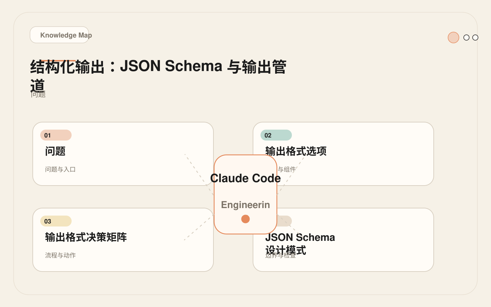
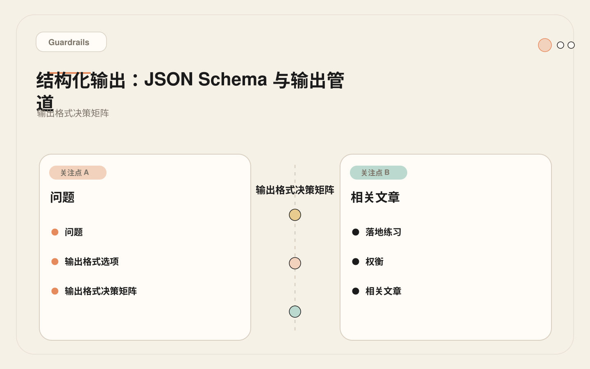
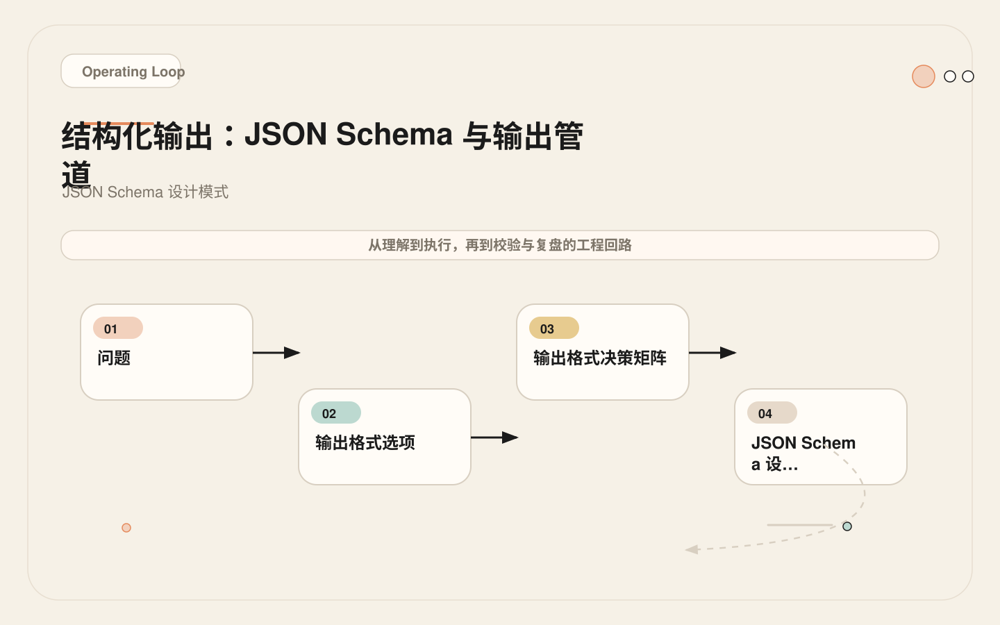
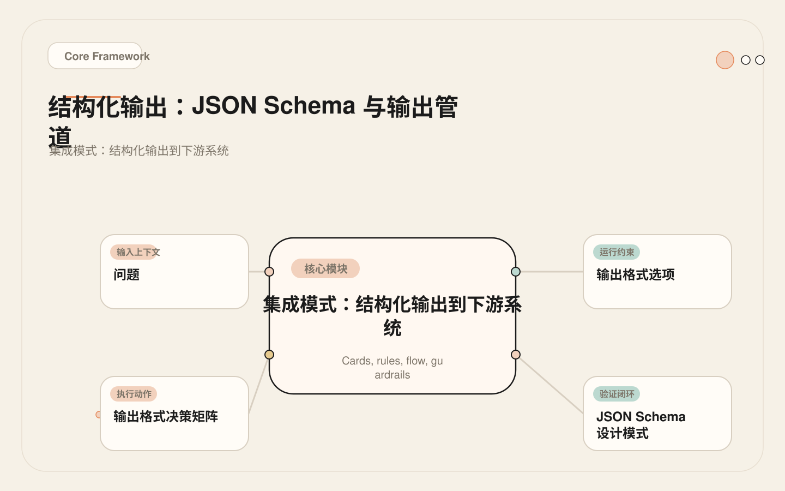

# 结构化输出：让 Agent 的产出能被下一段代码直接接住

<!-- codex:cover ../../../assets/claude-code-engineering/30-structured-output-cover.webp -->

<!-- /codex:cover -->

**TL;DR：** 自动化场景里，Claude Code 不能只输出自然语言。结构化输出通过 `--output-format json` 和 JSON Schema 约束，让后续脚本、CI 看板和审计系统能解析和动作化结果。关键不是让模型"输出 JSON"，而是设计 schema、构建验证管道、处理边界情况、对接下游系统。本文覆盖完整的输出管道：从 schema 设计到解析验证、从错误恢复到下游集成。

## 问题

"这个 PR 看起来没问题"对人类有用，但对流水线没用。CI 需要知道：

<!-- codex:illustration 30-structured-output/01-overview-knowledge-map.svg -->

<!-- /codex:illustration -->

- 是否通过？`approved` / `changes_requested` / `needs_review`。
- 有哪些 findings？每个 finding 的严重等级、文件、行号、描述。
- 建议动作是什么？
- 还有哪些不确定的风险？

自然语言输出在自动化管道中有三个致命问题：

1. **不可解析**：下游脚本无法从"我觉得这段代码有一个中等严重程度的问题"中提取结构化信息。
2. **不可比较**：无法对比两次运行的结果差异，无法追踪 finding 消失或新增。
3. **不可聚合**：无法统计跨 PR 的 finding 分布、严重等级趋势、通过率变化。

结构化输出解决的就是这三个问题——让 Agent 的输出变成数据，而不是文本。

更深层的意义是：结构化输出是 Agent 从"工具"升级为"系统组件"的关键一步。一个只输出自然语言的 Agent 只能辅助人类；一个输出结构化数据的 Agent 可以接入自动化管道、触发工作流、写入数据库、驱动看板——它变成了整个工程系统中的一等公民。

但结构化输出也有成本。设计 schema 需要你预先判断"哪些信息重要"，而这种判断可能不完全正确。维护 schema 需要持续的工程投入。验证输出需要额外的代码。这些成本只有在下游确实需要机器可解析的结果时才值得支付——如果一个场景的消费者始终是人类，自然语言输出就够了。

## 输出格式选项

Claude Code 提供三种输出格式：

| 格式 | 参数 | 适用场景 | 解析方式 |
|------|------|----------|----------|
| `text` | `--output-format text` | 人类阅读、changelog、文档 | 直接输出到文件/评论 |
| `json` | `--output-format json` | CI 判断、脚本处理、数据存储 | `jq` 或语言原生 JSON 解析 |
| `stream-json` | `--output-format stream-json` | 长时间任务的实时监控 | 逐行 JSON 解析 |

`json` 格式的输出结构：

```json
{
  "type": "result",
  "subtype": "success",
  "cost_usd": 0.0423,
  "duration_ms": 12340,
  "duration_api_ms": 8920,
  "is_error": false,
  "num_turns": 4,
  "result": "这里是模型输出的文本内容",
  "session_id": "abc123"
}
```

注意：`result` 字段里的内容仍然是自然语言。要获得真正的结构化数据，需要在提示词中要求模型输出 JSON，然后用 `--output-format json` 包装。这意味着结构化输出是**两层包装**：内层是模型按 schema 生成的 JSON，外层是 `--output-format json` 的信封。解析时必须先拆信封，再验证内容。

## 输出格式决策矩阵

不同的下游消费者需要不同的输出格式。JSON 不是唯一选择——选择取决于具体场景。

<!-- codex:illustration 30-structured-output/04-compare-guardrails.svg -->

<!-- /codex:illustration -->

| 维度 | JSON | YAML | XML | Markdown 表格 | 自定义分隔符 |
|------|------|------|-----|--------------|-------------|
| **解析可靠性** | 高 — `jq`/原生库 | 中 — 空格敏感 | 高 — 严格解析器 | 低 — 正则提取 | 低 — 边界模糊 |
| **模型遵从率** | 高 — 训练数据丰富 | 中 — 缩进易错 | 中 — 标签冗余 | 高 — 常见格式 | 低 — 无标准 |
| **可读性** | 中 — 嵌套复杂时差 | 高 — 人类友好 | 低 — 标签噪声 | 高 — 直观 | 中 |
| **Schema 验证** | 成熟 — JSON Schema | 有 — YAML Schema | 成熟 — XSD/DTD | 无标准 | 无 |
| **CI 工具链支持** | 最佳 — `jq`/原生 | 一般 | 一般 | 差 | 差 |
| **嵌套结构** | 原生支持 | 原生支持 | 原生支持 | 不支持 | 不支持 |
| **适用场景** | CI 管道、数据库、API | 配置文件、K8s | 遗留系统、SOAP | PR 评论、报告 | 简单日志 |

**选择建议**：

1. **CI 管道中的自动化处理**：JSON。`jq` 是标准工具链的一部分，`--output-format json` 直接支持，解析和验证工具最成熟。
2. **需要人类同时阅读的输出**：JSON + Markdown 双格式。机器解析 JSON，人类看 Markdown 表格。
3. **配置文件生成**：YAML。Kubernetes、Docker Compose 等配置场景下 YAML 是标准格式，但需要额外处理缩进一致性。
4. **遗留系统对接**：XML。只有在下游系统明确要求时才使用。
5. **简单日志或报告**：Markdown 表格。不需要下游机器解析，只需要人类阅读。

不推荐自定义分隔符格式（如 `key:value|key:value`）——模型对非标准格式的遵从率低，解析边界容易出错。

## JSON Schema 设计模式

结构化输出的核心不是"让模型输出 JSON"，而是设计正确的 schema。Schema 决定了输出能表达什么信息，也决定了下游能做什么动作。以下是经过验证的设计模式。

<!-- codex:illustration 30-structured-output/03-flow-operating-loop.svg -->

<!-- /codex:illustration -->

### 模式一：枚举约束 + 语义字段（PR Review）

最可靠的 schema 设计是尽量用 enum 约束可选值，用语义清晰的字段名表达含义。

```json
{
  "$schema": "http://json-schema.org/draft-07/schema#",
  "$id": "https://example.com/schemas/pr-review-v2",
  "title": "PRReviewOutput",
  "type": "object",
  "required": ["schema_version", "status", "findings", "tests_run", "residual_risks", "review_metadata"],
  "properties": {
    "schema_version": {
      "type": "string",
      "const": "2.0",
      "description": "Schema version for backward compatibility"
    },
    "status": {
      "type": "string",
      "enum": ["approved", "changes_requested", "needs_review"],
      "description": "Overall review verdict"
    },
    "findings": {
      "type": "array",
      "items": {
        "type": "object",
        "required": ["id", "severity", "file", "line", "summary", "category"],
        "properties": {
          "id": {
            "type": "string",
            "pattern": "^F-[0-9]{3}$",
            "description": "Unique finding identifier for tracking"
          },
          "severity": {
            "type": "string",
            "enum": ["critical", "high", "medium", "low", "info"]
          },
          "file": {
            "type": "string",
            "description": "Relative file path from repo root"
          },
          "line": {
            "type": "integer",
            "minimum": 0,
            "description": "Line number; 0 if not location-specific"
          },
          "summary": {
            "type": "string",
            "maxLength": 200,
            "description": "One-line description"
          },
          "recommendation": {
            "type": "string",
            "description": "Suggested fix or action"
          },
          "category": {
            "type": "string",
            "enum": ["bug", "security", "performance", "test", "style", "architecture"]
          },
          "confidence": {
            "type": "number",
            "minimum": 0,
            "maximum": 1,
            "description": "Model confidence in this finding"
          }
        }
      }
    },
    "tests_run": {
      "type": "boolean",
      "description": "Whether the test suite was executed"
    },
    "test_results": {
      "type": "object",
      "properties": {
        "passed": { "type": "integer" },
        "failed": { "type": "integer" },
        "command": { "type": "string" }
      }
    },
    "residual_risks": {
      "type": "array",
      "items": {
        "type": "string",
        "description": "Risks that couldn't be verified automatically"
      }
    },
    "summary": {
      "type": "string",
      "description": "Human-readable one-paragraph summary"
    },
    "review_metadata": {
      "type": "object",
      "properties": {
        "diff_lines": { "type": "integer" },
        "files_reviewed": { "type": "integer" },
        "review_duration_estimate_ms": { "type": "integer" }
      }
    }
  }
}
```

Schema 设计决策详解：

1. **`schema_version` 常量字段**：下游解析器首先检查版本号。当 schema 升级时，旧版本输出仍然可以被正确路由到对应的解析逻辑。没有版本号的 schema 在升级时会直接破坏下游消费者。
2. **`status` 用 enum 而非自由文本**：三种状态覆盖所有情况。`needs_review` 是关键的第三选项——当模型不确定时，不应该被迫选择 approved 或 changes_requested。
3. **`findings` 中每个 item 有唯一 `id`**：`F-001` 格式的标识符让 finding 可追踪——跨多次 review 对比时，可以判断某个 finding 是否消失或新增。
4. **`line` 用 integer 允许 0**：有些 finding 不关联到具体行号（比如"缺少文件级别的权限检查"）。0 作为"不适用"的语义约定比 null 更安全——下游不需要做空值判断。
5. **`residual_risks` 独立于 findings**：findings 是确定的问题，residual_risks 是不确定的风险。区分两者对下游决策至关重要——CI 管道可以对 residual_risks 非空的情况自动升级为人工 review。
6. **`review_metadata` 记录分析上下文**：diff 行数和审查文件数让下游可以判断这次 review 的覆盖度——如果一个 1000 行的 diff 只 review 了 3 个文件，结果的可信度应该打折扣。

### 模式二：分类 + 置信度（Issue Triage）

适合 issue triage、文档分类等场景——模型需要从有限选项中选择一个，同时表达选择的确信程度。

```json
{
  "$schema": "http://json-schema.org/draft-07/schema#",
  "$id": "https://example.com/schemas/issue-triage-v1",
  "title": "IssueTriageOutput",
  "type": "object",
  "required": ["category", "priority", "confidence", "triage_metadata"],
  "properties": {
    "category": {
      "type": "string",
      "enum": ["bug", "feature", "docs", "question", "infrastructure", "security", "duplicate", "invalid"]
    },
    "priority": {
      "type": "string",
      "enum": ["critical", "high", "medium", "low"]
    },
    "confidence": {
      "type": "number",
      "minimum": 0,
      "maximum": 1,
      "description": "Model confidence in classification"
    },
    "suggested_labels": {
      "type": "array",
      "items": { "type": "string" }
    },
    "duplicate_of": {
      "type": "integer",
      "description": "Issue number if category is 'duplicate'"
    },
    "reasoning": {
      "type": "string",
      "description": "Brief explanation of classification"
    },
    "triage_metadata": {
      "type": "object",
      "properties": {
        "title_length": { "type": "integer" },
        "body_length": { "type": "integer" },
        "has_code_snippet": { "type": "boolean" },
        "has_reproduction_steps": { "type": "boolean" }
      }
    }
  }
}
```

关键设计：`triage_metadata` 记录输入质量指标。如果 issue body 长度为 0 且没有复现步骤，下游应该对分类结果的可信度打折。这个字段在后续优化提示词时也很有用——可以分析"低置信度分类"是否与"输入质量差"相关。

### 模式三：根因分析 + 修复建议（CI 失败分析）

适合 CI 失败分析、生产事故诊断等场景——模型需要给出诊断结论和可操作的修复方向。

```json
{
  "$schema": "http://json-schema.org/draft-07/schema#",
  "$id": "https://example.com/schemas/ci-failure-v1",
  "title": "CIFailureAnalysis",
  "type": "object",
  "required": ["root_cause", "confidence", "suggested_fix", "failure_category", "is_flaky"],
  "properties": {
    "root_cause": { "type": "string" },
    "failure_category": {
      "type": "string",
      "enum": ["compilation", "test_failure", "lint", "dependency", "infrastructure", "timeout", "flaky", "configuration"]
    },
    "confidence": { "type": "number", "minimum": 0, "maximum": 1 },
    "is_flaky": { "type": "boolean" },
    "suggested_fix": { "type": "string" },
    "files_to_check": {
      "type": "array",
      "items": { "type": "string" }
    },
    "related_failures": {
      "type": "array",
      "items": {
        "type": "object",
        "properties": {
          "file": { "type": "string" },
          "test_name": { "type": "string" },
          "issue_description": { "type": "string" }
        }
      }
    },
    "log_excerpt": {
      "type": "string",
      "description": "Key log lines that support the diagnosis"
    }
  }
}
```

`failure_category` 的 enum 值是从实际 CI 失败日志中归纳出来的。每个分类对应不同的下游处理策略——`flaky` 类型只需要重试，`dependency` 类型需要更新 lockfile，`infrastructure` 类型需要联系 DevOps。

### 模式四：批量审计（依赖巡检）

适合定期巡检场景——模型扫描依赖列表，输出风险分析。

```json
{
  "$schema": "http://json-schema.org/draft-07/schema#",
  "$id": "https://example.com/schemas/dep-audit-v1",
  "title": "DependencyAuditOutput",
  "type": "object",
  "required": ["audit_date", "packages_scanned", "findings"],
  "properties": {
    "audit_date": { "type": "string", "format": "date" },
    "packages_scanned": { "type": "integer" },
    "findings": {
      "type": "array",
      "items": {
        "type": "object",
        "required": ["package", "severity", "finding_type"],
        "properties": {
          "package": { "type": "string" },
          "current_version": { "type": "string" },
          "recommended_version": { "type": "string" },
          "severity": { "type": "string", "enum": ["critical", "high", "medium", "low"] },
          "finding_type": { "type": "string", "enum": ["vulnerability", "outdated", "deprecated", "license", "abandoned"] },
          "cve": { "type": "string" },
          "description": { "type": "string" },
          "breaking_change": { "type": "boolean" }
        }
      }
    },
    "summary": {
      "type": "object",
      "properties": {
        "critical_count": { "type": "integer" },
        "high_count": { "type": "integer" },
        "total_packages": { "type": "integer" },
        "health_score": { "type": "number", "minimum": 0, "maximum": 100 }
      }
    }
  }
}
```

## 提示词与 Schema 的配合

有了 schema 还不够。模型需要知道输出必须严格符合 schema。提示词中的关键要素：

```bash
claude -p "Review this PR diff for correctness bugs, security issues, and missing tests.

CRITICAL OUTPUT REQUIREMENTS:
1. Output ONLY valid JSON matching the review-schema-v2.json exactly.
2. The 'status' field must be one of: approved, changes_requested, needs_review.
3. Each finding must have all required fields: id, severity, file, line, summary, category.
4. Finding IDs must follow the pattern F-001, F-002, etc.
5. If no significant issues found, output status 'approved' with empty findings array.
6. Do NOT include any text before or after the JSON object.
7. Set confidence for each finding based on your certainty level.

PR diff:
$(git diff main...HEAD)

JSON Schema:
$(cat review-schema-v2.json)" \
  --output-format json \
  --max-turns 5
```

关键点：

1. **"Output ONLY valid JSON"**：防止模型在 JSON 前后添加解释性文本。
2. **"matching this schema exactly"**：让模型知道有严格的格式要求。
3. **提供空 findings 的明确指令**：防止模型为了"有价值"而编造低质量 findings。
4. **嵌入 schema 到提示词**：让模型看到完整的约束定义。
5. **指定 ID 格式**：确保 finding 可追踪。

对于 CI 环境中的 `claude_args` 配置（见 [28 — GitHub Actions](./28-github-actions.md)），结构化输出的提示词需要更严格的控制——CI 环境中文件路径可能有差异，直接内联 schema 比引用外部文件更可靠：

```yaml
claude_args: |
  Review this PR. Output ONLY a JSON object matching this schema:
  {"status": "approved"|"changes_requested"|"needs_review", "findings": [{"id": "F-NNN", "severity": "critical"|"high"|"medium"|"low"|"info", "file": "path", "line": 0, "summary": "desc", "category": "bug"|"security"|"performance"|"test", "confidence": 0.0-1.0}], "summary": "text"}

  Rules:
  - Max 5 findings. If more exist, report the 5 most severe.
  - Empty findings + no residual risks = approved.
  - Any critical finding = changes_requested.
  - If unsure, set status to needs_review.
```

## 解析和验证管道

结构化输出的验证不是可选的——模型可能在任何地方偏离 schema。完整的验证管道包含五个阶段：

```text
原始输出
  │
  ▼
[1. 信封拆包]  从 --output-format json 的包装中提取 .result 字段
  │
  ▼
[2. JSON 有效性]  验证是否为合法 JSON
  │
  ▼
[3. Schema 合规]  验证字段类型、enum 值、required 字段
  │
  ▼
[4. 业务逻辑]  语义一致性检查（如 approved 但有 critical findings）
  │
  ▼
[5. 下游路由]  根据结果决定 CI 门禁/通知/写入
```

### 完整五阶段验证管道

```bash
#!/bin/bash
# validate-structured-output.sh — 五阶段输出验证管道
# 用法: ./validate-structured-output.sh <raw-output.json> [schema.json]

set -euo pipefail

RAW_FILE="${1:?Usage: $0 <raw-output.json> [schema.json]}"
SCHEMA_FILE="${2:-review-schema.json}"
WORK_DIR=$(mktemp -d)
EXTRACTED="$WORK_DIR/extracted.json"

echo "=== Stage 1: Envelope Extraction ==="

# 从 --output-format json 的信封中提取 .result
if jq -e '.type == "result"' "$RAW_FILE" &>/dev/null; then
  RESULT_TEXT=$(jq -r '.result' "$RAW_FILE")

  # 检查 is_error 标志
  if [ "$(jq -r '.is_error' "$RAW_FILE")" = "true" ]; then
    echo "FATAL: Claude Code reported error"
    echo "$RESULT_TEXT"
    exit 1
  fi

  # 从提取的文本中找到 JSON
  if echo "$RESULT_TEXT" | jq empty 2>/dev/null; then
    echo "$RESULT_TEXT" > "$EXTRACTED"
    echo "PASS: Extracted JSON from envelope"
  else
    # 尝试从混合文本中提取 JSON 块
    EXTRACTED_JSON=$(echo "$RESULT_TEXT" | python3 -c "
import json, sys
text = sys.stdin.read()
start = text.find('{')
if start == -1:
    sys.exit(1)
depth = 0
for i in range(start, len(text)):
    if text[i] == '{': depth += 1
    elif text[i] == '}':
        depth -= 1
        if depth == 0:
            candidate = text[start:i+1]
            try:
                json.loads(candidate)
                print(candidate)
                sys.exit(0)
            except json.JSONDecodeError:
                continue
sys.exit(1)
" 2>/dev/null)
    if [ -n "$EXTRACTED_JSON" ]; then
      echo "$EXTRACTED_JSON" > "$EXTRACTED"
      echo "RECOVERED: Extracted JSON from mixed text"
    else
      echo "FATAL: Cannot extract valid JSON from result"
      exit 1
    fi
  fi
else
  cp "$RAW_FILE" "$EXTRACTED"
  echo "PASS: Direct JSON (no envelope)"
fi

echo "=== Stage 2: JSON Validity ==="

if ! jq empty "$EXTRACTED" 2>/dev/null; then
  echo "FATAL: Not valid JSON"
  exit 1
fi
echo "PASS: Valid JSON"

echo "=== Stage 3: Schema Compliance ==="

if command -v python3 &>/dev/null; then
  python3 -c "
import json, sys
try:
    from jsonschema import validate, ValidationError
    with open('$EXTRACTED') as f:
        data = json.load(f)
    with open('$SCHEMA_FILE') as f:
        schema = json.load(f)
    validate(instance=data, schema=schema)
    print('PASS: Full schema validation')
except ImportError:
    data = json.load(open('$EXTRACTED'))
    required_fields = ['status', 'findings']
    for field in required_fields:
        assert field in data, f'Missing required field: {field}'
    assert data['status'] in ['approved', 'changes_requested', 'needs_review'], \
        f'Invalid status: {data[\"status\"]}'
    for f in data.get('findings', []):
        for req in ['severity', 'file', 'summary']:
            assert req in f, f'Missing {req} in finding: {f}'
    print('PASS: Basic schema validation (install jsonschema for full validation)')
except Exception as e:
    print(f'FAIL: {e}')
    sys.exit(1)
"
fi

echo "=== Stage 4: Business Logic Validation ==="

STATUS=$(jq -r '.status' "$EXTRACTED")
FINDINGS_COUNT=$(jq '.findings | length' "$EXTRACTED")

# 规则 1: changes_requested 但 findings 为空 → 矛盾
if [ "$STATUS" = "changes_requested" ] && [ "$FINDINGS_COUNT" -eq 0 ]; then
  echo "FAIL: status=changes_requested but findings is empty"
  echo "ACTION: Upgrading to needs_review"
  jq '.status = "needs_review"' "$EXTRACTED" > "$WORK_DIR/fixed.json"
  mv "$WORK_DIR/fixed.json" "$EXTRACTED"
fi

# 规则 2: approved 但有 critical/high findings → 异常
SEVERE_COUNT=$(jq '[.findings[] | select(.severity == "high" or .severity == "critical")] | length' "$EXTRACTED")
if [ "$STATUS" = "approved" ] && [ "$SEVERE_COUNT" -gt 0 ]; then
  echo "FAIL: status=approved but has $SEVERE_COUNT high/critical findings"
  jq '.status = "needs_review"' "$EXTRACTED" > "$WORK_DIR/fixed.json"
  mv "$WORK_DIR/fixed.json" "$EXTRACTED"
fi

# 规则 3: residual_risks 非空但 status 是 approved → 升级
RISKS_COUNT=$(jq '.residual_risks | length' "$EXTRACTED")
if [ "$RISKS_COUNT" -gt 0 ] && [ "$STATUS" = "approved" ]; then
  echo "WARN: residual_risks present with approved status — downgrading"
  jq '.status = "needs_review"' "$EXTRACTED" > "$WORK_DIR/fixed.json"
  mv "$WORK_DIR/fixed.json" "$EXTRACTED"
fi

# 规则 4: 低置信度 findings 统计
LOW_CONF=$(jq '[.findings[] | select(.confidence != null and .confidence < 0.5)] | length' "$EXTRACTED")
if [ "$LOW_CONF" -gt 0 ]; then
  echo "WARN: $LOW_CONF findings with confidence < 0.5"
fi

echo "PASS: Business logic validation"

echo "=== Stage 5: Output Ready ==="

FINAL_STATUS=$(jq -r '.status' "$EXTRACTED")
echo "Status: $FINAL_STATUS | Findings: $FINDINGS_COUNT | Severe: $SEVERE_COUNT | Risks: $RISKS_COUNT"
cp "$EXTRACTED" "${RAW_FILE%.json}-validated.json"
rm -rf "$WORK_DIR"

case "$FINAL_STATUS" in
  approved) exit 0 ;;
  changes_requested) exit 2 ;;
  needs_review) exit 3 ;;
  *) exit 1 ;;
esac
```

这个管道的设计原则是**每层都可以独立失败和恢复**。信封拆包失败不会阻止 JSON 有效性检查——如果输入本身就是裸 JSON，管道会跳过拆包直接验证。业务逻辑验证层不仅能发现问题，还能自动修复明显的不一致。

## 完整管道示例：从调用到下游

以下是两个端到端的真实管道示例，覆盖从 Claude Code 调用到下游系统集成的完整链路。

### 管道 A：PR Review 到 CI 门禁 + 看板同步

```bash
#!/bin/bash
# pipeline-pr-review.sh — 完整的 PR Review 输出管道

set -euo pipefail
PR_NUMBER="${PR_NUMBER:?PR_NUMBER required}"
REPO_DIR="${REPO_DIR:-.}"
SCHEMA_FILE="schemas/pr-review-v2.json"
cd "$REPO_DIR"

# ---- 阶段 1: 生成结构化输出 ----
DIFF_LINES=$(git diff origin/main...HEAD --stat | tail -1 | grep -oE '[0-9]+' | tail -1 || echo "0")

if [ "$DIFF_LINES" -gt 500 ]; then
  # 大 diff 策略：分文件组 review，合并 findings
  echo "Large diff ($DIFF_LINES lines) — split review"
  MERGED_FINDINGS="[]"
  for dir in $(git diff --name-only origin/main...HEAD | cut -d/ -f1 | sort -u); do
    GROUP_DIFF=$(git diff origin/main...HEAD -- "$dir" 2>/dev/null || echo "")
    if [ -n "$GROUP_DIFF" ]; then
      GROUP_RESULT=$(claude -p "Review changes in $dir/. Output JSON per schema.
Diff: $GROUP_DIFF
Schema: $(cat "$SCHEMA_FILE")" \
        --output-format json --max-turns 5 --allowedTools "Read,Grep,Glob" 2>/dev/null \
        || echo '{"type":"result","is_error":true}')
      GROUP_FINDINGS=$(echo "$GROUP_RESULT" | jq -r '.result' | jq '.findings // []' 2>/dev/null || echo "[]")
      MERGED_FINDINGS=$(echo "$MERGED_FINDINGS" | jq --argjson gf "$GROUP_FINDINGS" '. + $gf')
    fi
  done

  CRITICAL_COUNT=$(echo "$MERGED_FINDINGS" | jq '[.[] | select(.severity == "critical")] | length')
  if [ "$CRITICAL_COUNT" -gt 0 ]; then OVERALL_STATUS="changes_requested"
  elif [ "$(echo "$MERGED_FINDINGS" | jq 'length')" -gt 0 ]; then OVERALL_STATUS="needs_review"
  else OVERALL_STATUS="approved"; fi

  FINAL_OUTPUT=$(jq -n --arg status "$OVERALL_STATUS" --argjson findings "$MERGED_FINDINGS" \
    '{status: $status, findings: $findings, tests_run: false,
      residual_risks: ["Large diff — split review"],
      summary: "Split review due to large diff",
      review_metadata: {diff_lines: '"$DIFF_LINES"'}}')
else
  # 小 diff：一次性 review
  FULL_DIFF=$(git diff origin/main...HEAD)
  claude -p "Review this PR diff. Output ONLY JSON per schema.
Diff: $FULL_DIFF
Schema: $(cat "$SCHEMA_FILE")" \
    --output-format json --max-turns 5 --allowedTools "Read,Grep,Glob" > raw-output.json
  FINAL_OUTPUT=$(jq -r '.result' raw-output.json)
fi

# ---- 阶段 2: 验证 ----
echo "$FINAL_OUTPUT" > review-result.json
./validate-structured-output.sh review-result.json "$SCHEMA_FILE" || true

# ---- 阶段 3: 下游路由 ----
STATUS=$(jq -r '.status' review-result.json)

# 路由 A: CI 门禁
case "$STATUS" in
  approved) echo "REVIEW PASSED" ;;
  changes_requested)
    echo "REVIEW FAILED — blocking CI"
    jq -r '.findings[] | "[\(.severity)] \(.file):\(.line) — \(.summary)"' review-result.json
    exit 1 ;;
  needs_review) echo "REVIEW UNCERTAIN — flagging for human review" ;;
esac

# 路由 B: 看板同步
if [ -n "${DASHBOARD_API:-}" ]; then
  jq '{
    pr_number: '"$PR_NUMBER"' | tonumber, status: .status,
    findings_count: (.findings | length),
    critical_count: ([.findings[] | select(.severity == "critical")] | length),
    reviewed_at: now | todate
  }' review-result.json | \
    curl -sf -X POST "$DASHBOARD_API/reviews" \
      -H "Content-Type: application/json" \
      -H "Authorization: Bearer ${API_TOKEN}" -d @- || true
fi

# 路由 C: 即时通知（仅 critical/high）
if [ -n "${SLACK_WEBHOOK:-}" ]; then
  ALERT_FINDINGS=$(jq -r '[.findings[] | select(.severity == "critical" or .severity == "high")] |
    if length > 0 then .[] | "[\(.severity)] \(.file):\(.line) — \(.summary)" else empty end' review-result.json)
  if [ -n "$ALERT_FINDINGS" ]; then
    jq -n --arg text "PR #$PR_NUMBER:\n$ALERT_FINDINGS" '{text: $text}' | \
      curl -sf -X POST "$SLACK_WEBHOOK" -H "Content-Type: application/json" -d @- || true
  fi
fi

# 路由 D: PR 评论（双格式）
if [ -n "${GH_TOKEN:-}" ]; then
  FINDINGS_TABLE=$(jq -r '.findings[] | "| \(.severity) | \(.file):\(.line) | \(.summary) |"' review-result.json 2>/dev/null || echo "| (none) | | |")
  cat <<EOF | gh pr comment "$PR_NUMBER" --body-file -
## AI Code Review

**Verdict:** \`$STATUS\`

$(jq -r '.summary // ""' review-result.json)

| Severity | Location | Issue |
|----------|----------|-------|
$FINDINGS_TABLE

_Generated by Claude Code — first-pass review, not final approval._
EOF
fi

echo ">>> Pipeline complete: $STATUS"
```

### 管道 B：Issue Triage 到标签 + 路由

```bash
#!/bin/bash
# pipeline-issue-triage.sh — Issue 自动分类和路由

set -euo pipefail
ISSUE_NUMBER="${ISSUE_NUMBER:?required}"
ISSUE_TITLE="${ISSUE_TITLE:?required}"
ISSUE_BODY="${ISSUE_BODY:-}"

RESULT=$(claude -p "Classify this GitHub issue.
CRITICAL: Output ONLY JSON: {\"category\": \"bug\"|\"feature\"|\"docs\"|\"question\"|\"infrastructure\"|\"security\"|\"duplicate\"|\"invalid\", \"priority\": \"critical\"|\"high\"|\"medium\"|\"low\", \"confidence\": 0.0-1.0, \"suggested_labels\": [\"...\"], \"duplicate_of\": null-or-number, \"reasoning\": \"...\"}
Issue title: $ISSUE_TITLE
Issue body: $ISSUE_BODY
Rules: Has error/stack trace → bug. Has repro steps → bug. Requests feature → feature. Asks 'how to' → question. References issue → duplicate.
JSON only, no other text." \
  --output-format json --max-turns 1 --disallowedTools "Edit,Write,Bash" 2>/dev/null)

if ! echo "$RESULT" | jq empty 2>/dev/null; then
  echo "FAIL: Invalid JSON — skipping auto-label"; exit 0
fi

TRIAGE=$(echo "$RESULT" | jq -r '.result')
CATEGORY=$(echo "$TRIAGE" | jq -r '.category // "unknown"')
PRIORITY=$(echo "$TRIAGE" | jq -r '.priority // "medium"')
CONFIDENCE=$(echo "$TRIAGE" | jq -r '.confidence // 0')

# 低置信度不自动应用标签
if (( $(echo "$CONFIDENCE < 0.6" | bc -l) )); then
  echo "Low confidence ($CONFIDENCE) — logging only"
  echo "$TRIAGE" | jq --arg issue "$ISSUE_NUMBER" '{issue: ($issue|tonumber)} + .' >> triage-low-confidence.log
  exit 0
fi

# 应用标签和评论
LABELS=$(echo "$TRIAGE" | jq -r '[.category, .priority, (.suggested_labels // [])[]] | unique | join(",")')
if [ -n "${GH_TOKEN:-}" ]; then
  gh issue edit "$ISSUE_NUMBER" --add-label "$LABELS"
  REASONING=$(echo "$TRIAGE" | jq -r '.reasoning // "No reasoning"')
  gh issue comment "$ISSUE_NUMBER" --body "Auto-triage: **$CATEGORY** (priority: $PRIORITY, confidence: $CONFIDENCE)
Reasoning: $REASONING
_If incorrect, adjust labels manually._"

  DUPLICATE_OF=$(echo "$TRIAGE" | jq -r '.duplicate_of // empty')
  if [ -n "$DUPLICATE_OF" ]; then
    gh issue comment "$ISSUE_NUMBER" --body "Possibly a duplicate of #$DUPLICATE_OF"
  fi
fi

echo "$TRIAGE" | jq --arg issue "$ISSUE_NUMBER" --arg ts "$(date -u +%Y-%m-%dT%H:%M:%SZ)" \
  '{issue: ($issue|tonumber), triaged_at: $ts} + .' >> triage-history.ndjson
```

## 输出质量指标

结构化输出的质量不只是"是否有效 JSON"。需要建立一个指标体系来持续监控和优化。

### 核心指标

```text
Schema 合规率 = (完全符合 schema 的输出次数) / (总输出次数)
目标：> 95%。低于 90%：提示词或 schema 需要优化。

解析成功率 = (成功提取结构化数据的次数) / (总调用次数)
目标：> 98%。注意：此值 > Schema 合规率，因为解析只检查 JSON 有效性。

字段覆盖率 = (非空必要字段的填充数) / (必要字段总数 × 输出次数)
目标：> 90%。低于 80%：模型跳过字段，提示词需要加强约束。

分类准确率 = (模型分类与人工分类一致的次数) / (总次数)
目标：> 80%（4+ 分类）。只适用于有 ground truth 的场景。

假阴性率 = (findings 为空但实际有问题的次数) / (实际有问题的总次数)
最危险的指标。安全 review 中假阴性比假阳性更危险。
目标：< 10%。测量方式：定期人工抽检 "approved" 的 PR。

信号噪声比 = (被采纳的 findings) / (总 findings)
目标：> 30%。低于 15%：团队会忽略 AI 评论。
```

### 指标收集

```bash
#!/bin/bash
# collect-output-metrics.sh — 收集结构化输出的质量指标

METRICS_DIR="${METRICS_DIR:-./metrics}"
mkdir -p "$METRICS_DIR"

collect_metrics() {
  local output_file="$1"
  if jq empty "$output_file" 2>/dev/null; then
    jq -c '{
      timestamp: (now | todate),
      json_valid: true,
      schema_compliant: (.status != null and .findings != null),
      status: .status,
      findings_count: (.findings | length),
      critical_count: ([.findings[] | select(.severity == "critical")] | length),
      high_count: ([.findings[] | select(.severity == "high")] | length),
      field_coverage: (
        (if .status != null then 1 else 0 end) +
        (if .findings != null then 1 else 0 end) +
        (if .summary != null then 1 else 0 end) +
        (if .residual_risks != null then 1 else 0 end)
      ) / 4
    }' "$output_file"
  else
    jq -n '{json_valid: false, timestamp: (now | todate)}'
  fi >> "$METRICS_DIR/review-metrics.ndjson"
}

# 周报
weekly_report() {
  TOTAL=$(wc -l < "$METRICS_DIR/review-metrics.ndjson")
  VALID=$(jq 'select(.json_valid == true)' "$METRICS_DIR/review-metrics.ndjson" | wc -l)
  echo "Total: $TOTAL | Valid: $VALID ($(echo "scale=1; $VALID*100/$TOTAL" | bc)%)"
  echo "Status distribution:"
  jq -r '.status // "null"' "$METRICS_DIR/review-metrics.ndjson" | sort | uniq -c | sort -rn
}
```

## 集成模式：结构化输出到下游系统

### 模式一：CI 门禁

<!-- codex:illustration 30-structured-output/02-framework-core-structure.svg -->

<!-- /codex:illustration -->

结构化输出决定 CI 是否通过（详见 [28 — GitHub Actions](./28-github-actions.md) 和 [27 — Headless 模式](./27-headless-mode.md)）：

```bash
STATUS=$(jq -r '.status' review-output.json)
case "$STATUS" in
  approved) echo "Review passed — CI continues" ;;
  changes_requested)
    CRITICAL=$(jq '[.findings[] | select(.severity == "critical")] | length' review-output.json)
    if [ "$CRITICAL" -gt 0 ]; then echo "CRITICAL findings — blocking CI"; exit 1; fi
    echo "Non-critical findings — CI continues with warnings" ;;
  needs_review) echo "AI requests human review — blocking CI"; exit 1 ;;
esac
```

### 模式二：数据库写入和趋势分析

```bash
# 写入 PostgreSQL
jq '{
  pr_number: $PR | tonumber, status: .status,
  findings_count: (.findings | length),
  critical_count: ([.findings[] | select(.severity == "critical")] | length),
  reviewed_at: now | todate
}' --arg PR "$PR_NUMBER" review-output.json > db-payload.json

psql "$DATABASE_URL" -c "
  INSERT INTO ai_reviews (pr_number, status, findings, created_at)
  VALUES ($(jq '.pr_number' db-payload.json),
          $(jq -r '.status' db-payload.json | jq -R .),
          $(jq -c '.findings' review-output.json), NOW())"
```

看板聚合查询：

```sql
-- 过去 30 天的 review 趋势
SELECT date_trunc('week', created_at) AS week,
       COUNT(*) AS total,
       SUM(CASE WHEN status = 'approved' THEN 1 ELSE 0 END) AS approved,
       ROUND(AVG(findings_count), 1) AS avg_findings
FROM ai_reviews WHERE created_at > NOW() - INTERVAL '30 days'
GROUP BY week ORDER BY week;
```

### 模式三：多级通知路由

```bash
CRITICAL=$(jq '[.findings[] | select(.severity == "critical")] | length' review-output.json)
HIGH=$(jq '[.findings[] | select(.severity == "high")] | length' review-output.json)

if [ "$CRITICAL" -gt 0 ]; then
  # Critical → PagerDuty + Slack
  ALERT_MSG=$(jq -r '.findings[] | select(.severity == "critical") | "[CRITICAL] \(.file):\(.line) — \(.summary)"' review-output.json)
  send-pager-duty --severity critical --message "$ALERT_MSG"
elif [ "$HIGH" -gt 0 ]; then
  # High → Slack only
  ALERT_MSG=$(jq -r '.findings[] | select(.severity == "high") | "[HIGH] \(.file):\(.line) — \(.summary)"' review-output.json)
  send-slack --channel "#security-review" --message "$ALERT_MSG"
fi
```

### 模式四：双格式输出

```bash
# 机器 JSON + 人类 Markdown
jq '.' review-output.json > machine-findings.json

HUMAN_SUMMARY=$(jq -r '.summary // "No summary"' review-output.json)
FINDINGS_TABLE=$(jq -r '.findings[] | "| \(.severity) | \(.file):\(.line) | \(.summary) |"' review-output.json 2>/dev/null || echo "| (none) | | |")

cat > human-review.md <<EOF
## AI Review Summary

$HUMAN_SUMMARY

**Verdict:** $(jq -r '.status' review-output.json)

| Severity | Location | Issue |
|----------|----------|-------|
$FINDINGS_TABLE

_Consult machine-findings.json for structured output._
EOF
```

## 错误处理：畸形输出恢复

模型输出不总是完美的。以下是常见的畸形情况和恢复策略。

### 畸形一：JSON 嵌入额外文本

```text
这是我的 review 结果：
{"status": "approved", "findings": [...]}
希望对你有帮助！
```

恢复：从 `--output-format json` 的 `.result` 中提取，或用 Python 做平衡括号匹配（见验证管道的 Stage 1）。

### 畸形二：字段值不符合 schema

```json
{
  "status": "looks good",
  "findings": [{"severity": "medium-ish", "line": "around 45"}]
}
```

恢复：用映射表做自动修正：

```python
#!/usr/bin/env python3
"""fix_schema_drift.py — 自动修复常见的 schema 偏移"""
import json, sys, re

STATUS_MAP = {
    "approved": "approved", "approve": "approved", "pass": "approved",
    "lgtm": "approved", "looks good": "approved", "ok": "approved",
    "changes_requested": "changes_requested", "changes": "changes_requested",
    "reject": "changes_requested", "fail": "changes_requested",
    "needs_review": "needs_review", "unsure": "needs_review",
}

SEVERITY_MAP = {
    "critical": "critical", "crit": "critical", "p0": "critical",
    "high": "high", "major": "high", "p1": "high",
    "medium": "medium", "med": "medium", "moderate": "medium", "p2": "medium",
    "low": "low", "minor": "low", "p3": "low",
    "info": "info", "note": "info",
}

def coerce_line(value):
    if isinstance(value, int): return value
    if isinstance(value, str):
        match = re.search(r'\d+', value)
        return int(match.group()) if match else 0
    return 0

def fix_output(data):
    fixed = dict(data)
    if fixed.get("status") not in ("approved", "changes_requested", "needs_review"):
        fixed["status"] = STATUS_MAP.get(str(fixed.get("status", "")).lower().strip(), "needs_review")
    for finding in fixed.get("findings", []):
        if finding.get("severity") not in SEVERITY_MAP:
            finding["severity"] = SEVERITY_MAP.get(str(finding.get("severity", "")).lower().strip(), "medium")
        finding["line"] = coerce_line(finding.get("line", 0))
    return fixed

data = json.load(sys.stdin)
json.dump(fix_output(data), sys.stdout, indent=2)
```

### 畸形三：JSON 截断

`--max-turns` 限制可能导致中途截断。恢复策略：自动补全 + 重试。

```bash
handle_truncated_json() {
  local raw="$1"
  # 尝试自动补全闭合括号
  COMPLETED=$(python3 -c "
import json, sys
text = sys.stdin.read()
for suffix in ['\"]}', '}]', '}}', '\"}]}}']:
    try:
        json.loads(text + suffix)
        print(text + suffix); sys.exit(0)
    except json.JSONDecodeError: continue
sys.exit(1)" <<< "$raw" 2>/dev/null)

  if [ -n "$COMPLETED" ]; then
    echo "RECOVERED: Auto-completed truncated JSON"
    echo "$COMPLETED"
    return 0
  fi
  # 重试
  echo "WARN: Cannot recover — retrying with higher max-turns"
  claude -p "$2" --output-format json --max-turns 8
}
```

### 畸形四：低置信度

```bash
CONFIDENCE=$(jq -r '.confidence // 0' output.json)
if (( $(echo "$CONFIDENCE < 0.6" | bc -l) )); then
  echo "Low confidence ($CONFIDENCE) — flagging for human review"
  jq '.status = "needs_review"' output.json > updated.json && mv updated.json output.json
fi
```

### Schema 演进策略

```text
策略          示例                        兼容性
──────────────────────────────────────────────────
添加可选字段    +recommendation             完全向后兼容
扩展 enum      status + "auto_approved"    兼容（旧消费者忽略新值）
重命名字段      file → path                破坏性 — 需要版本升级
删除字段        -test_results              破坏性 — 需要版本升级
更改类型        line: string → int          破坏性 — 需要版本升级
```

推荐实践：每个 schema 包含 `schema_version` 常量字段。破坏性变更必须升级版本号，非破坏性变更在同一版本内完成。维护变更日志，记录每个版本的变更内容和迁移说明。验证管道中实现版本路由。

## 失败案例：有效 JSON 但内容空壳

**场景**：团队配置了 PR review workflow，使用结构化输出，CI 门禁基于 `status` 和 `findings` 判断是否通过。

**发生什么**：一个复杂的 PR（涉及 20+ 文件的重构），Claude Code 输出了：

```json
{
  "status": "approved",
  "findings": [],
  "tests_run": true,
  "residual_risks": ["Large refactoring — manual review recommended"],
  "summary": "This is a large refactoring. No obvious bugs found in the diff."
}
```

JSON 完全有效。Schema 完全符合。CI 通过了。但这个 PR 实际上引入了两个严重 bug：一个空指针解引用和一个认证绕过。

**根因**：

1. **模型走了偷懒路径**：面对 20+ 文件的大 diff，模型的 attention 被分散。与其逐文件分析，它选择了"没找到明显问题"这个安全出口。
2. **空 findings 不触发告警**：验证管道只检查 JSON 有效性，不检查 findings 是否合理为空。
3. **residual_risks 被 CI 忽略**：验证管道没有处理 residual_risks 字段——模型其实已经暗示了"应该人工 review"，但 CI 没读这个信号。
4. **无 diff 大小阈值**：大 diff 应该触发不同策略（分文件 review 或直接标记 needs_review）。

**修复**：

```bash
# 检查一：diff 大小阈值
DIFF_LINES=$(git diff origin/main...HEAD --stat | tail -1 | grep -oE '[0-9]+' | tail -1)
if [ "$DIFF_LINES" -gt 500 ]; then
  jq '.status = "needs_review"' findings.json > updated.json && mv updated.json findings.json
fi

# 检查二：residual_risks 非空时升级
RISKS_COUNT=$(jq '.residual_risks | length' findings.json)
if [ "$RISKS_COUNT" -gt 0 ]; then
  jq '.status = "needs_review"' findings.json > updated.json && mv updated.json findings.json
fi

# 检查三：对大 PR 做分文件 review（见管道 A 的分文件策略）
```

更根本的修复——在提示词中设定 findings 的最小质量标准：

```yaml
claude_args: |
  Review this PR.
  IMPORTANT: If the diff is large (>10 files), focus on the 5 most critical files.
  It is BETTER to report a low-severity finding than to miss a real issue.
  An empty findings array should ONLY be used for trivial changes (<50 lines).
  If you are unsure about any area, set status to "needs_review" and add residual risks.
```

**教训**：有效的 JSON 不等于有效的结果。验证管道不仅要检查格式，还要检查语义一致性——状态和 findings 之间是否有矛盾？findings 为空是否合理？residual_risks 是否被正确处理？

## 跨场景的统一输出格式

当一个团队在多个场景中使用结构化输出时（PR review、issue triage、CI 分析），每个场景有独立的 schema 是合理的。但如果这些 schema 能共享一个统一的基础结构，下游系统的集成成本会大幅降低。

```json
{
  "$schema": "http://json-schema.org/draft-07/schema#",
  "type": "object",
  "required": ["schema_version", "task_type", "timestamp", "status"],
  "properties": {
    "schema_version": { "type": "string", "pattern": "^[0-9]+\\.[0-9]+$" },
    "task_type": {
      "type": "string",
      "enum": ["pr_review", "issue_triage", "ci_analysis", "doc_check", "custom"]
    },
    "timestamp": { "type": "string", "format": "date-time" },
    "status": { "type": "string", "enum": ["success", "partial", "error"] },
    "error_message": { "type": "string" },
    "model": { "type": "string" },
    "execution_time_ms": { "type": "integer" },
    "payload": { "type": "object", "description": "Task-specific data" }
  }
}
```

所有场景共享外层结构（版本、任务类型、时间戳、状态），只有 `payload` 的内容因场景不同而异。好处：所有任务的输出可以写入同一张数据库表；统一的 `status` 字段使告警规则可以跨场景复用；一个监控面板展示所有任务的成功率、延迟和成本。

## 输出格式的边界和局限

### 模型在 JSON 字段中嵌入 Markdown

```json
{
  "summary": "This PR introduces a **new auth flow** that affects `auth.ts`."
}
```

`summary` 等人类阅读字段中的 Markdown 是合理的。但如果 `file` 或 `severity` 字段嵌入格式化标记，就会破坏下游解析。解决方案：验证管道中对非文本字段做字符白名单校验。

### Schema 设计的隐性成本

1. **信息损失**：schema 预设了"哪些信息重要"。模型发现了 schema 之外的信息无法有效表达。缓解：保留 `additionalProperties` 或 `metadata` 字段，验证管道中记录而非丢弃未知字段。
2. **设计者偏差**：过度详细的 schema 让模型花大量 token 在格式遵从上。缓解：从最小可行 schema 开始（status + findings + summary），根据使用逐步扩展。
3. **维护成本**：`schema_version` 和版本路由是必不可少的。

## 落地练习

第一步：选一个现有的自然语言输出场景，设计 JSON schema。

1. 列出下游系统需要的信息字段。
2. 为每个字段选择类型和约束。
3. 为 enum 字段列出所有合法值。
4. 标记 required vs optional。
5. 明确空值的语义。

第二步：在交互模式下测试 schema（参考 [27 — Headless 模式](./27-headless-mode.md)）。

```bash
claude -p "Review this file: src/auth.ts. Output JSON per schema." --output-format json
```

手动检查输出，调整提示词直到稳定。建议连续运行 10 次，统计合规率。低于 90% 就先优化提示词再接入自动化。

第三步：加入验证管道。对 20 次输出做批量验证，统计 schema 合规率和字段覆盖率。

第四步：接入 CI（参考 [28 — GitHub Actions](./28-github-actions.md)）。先以"只记录不阻塞"模式运行一周，确认质量稳定后再考虑影响 CI 门禁。

第五步：建立指标基线。跟踪 schema 合规率、解析成功率、字段覆盖率，作为后续优化的量化基础。

## 权衡

结构化输出降低了表达自由度。三个缓解策略：

1. **保留 summary 字段**：让模型在结构化字段之外提供自由文本摘要。
2. **双格式输出**：机器 JSON + 人类可读文本并行输出。
3. **schema 版本化**：逐步扩展，不要一开始就过度设计。

更深层的问题：结构化输出的质量上限取决于提示词质量，而不是 schema 复杂度。一个简单的 schema + 精确的提示词，比一个复杂的 schema + 模糊的提示词效果更好。投入时间优化提示词的投入产出比远高于投入时间设计更复杂的 schema。

## 相关文章

- [27 — Headless 模式](./27-headless-mode.md)：结构化输出在 headless 调用中的使用方式和成本分析
- [28 — GitHub Actions](./28-github-actions.md)：结构化输出在 CI 中的集成方法和 `claude_args` 配置
- [29 — CI 安全边界](./29-ci-security-boundaries.md)：输出中可能包含的敏感信息和过滤策略
- [31 — Agent SDK](./31-agent-sdk.md)：比 `--output-format json` 更深度的程序化输出控制和回调机制
- [00 — Agent 运行时模型](./00-claude-code-as-agent-runtime.md)：工具层输出对上下文的影响


