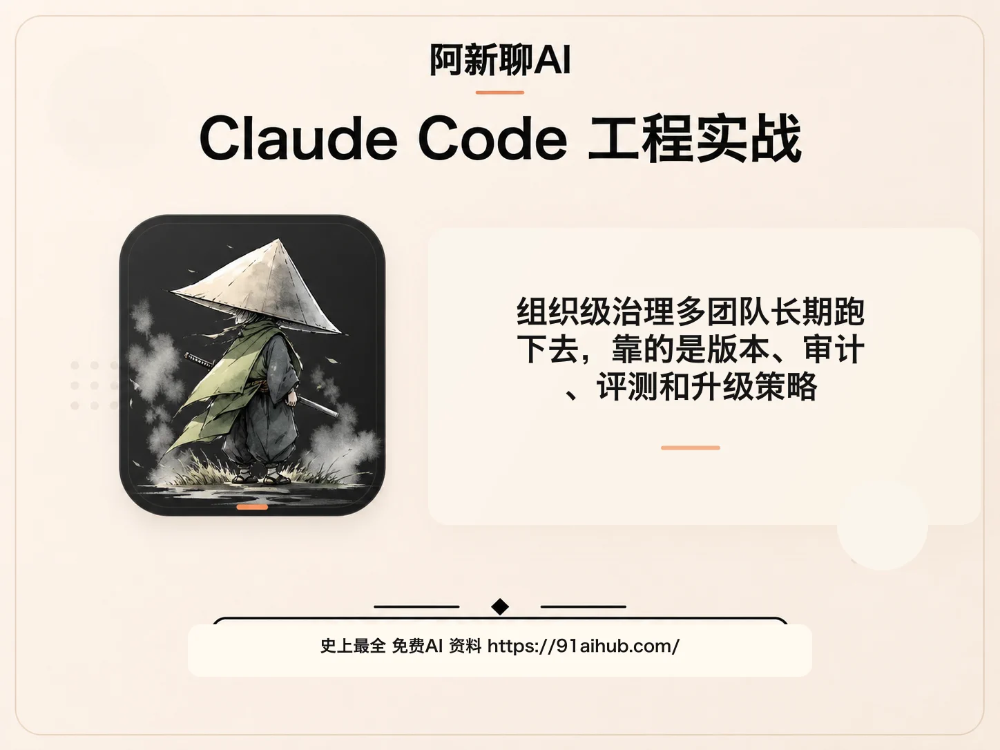
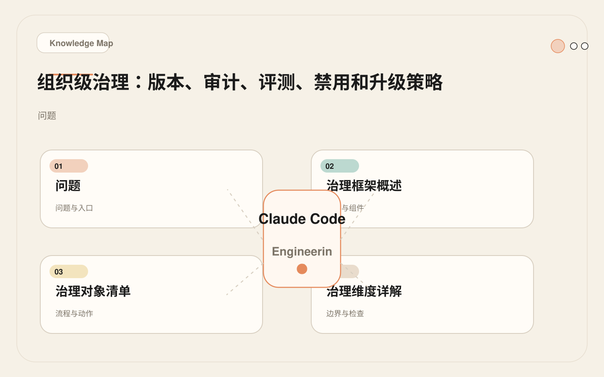
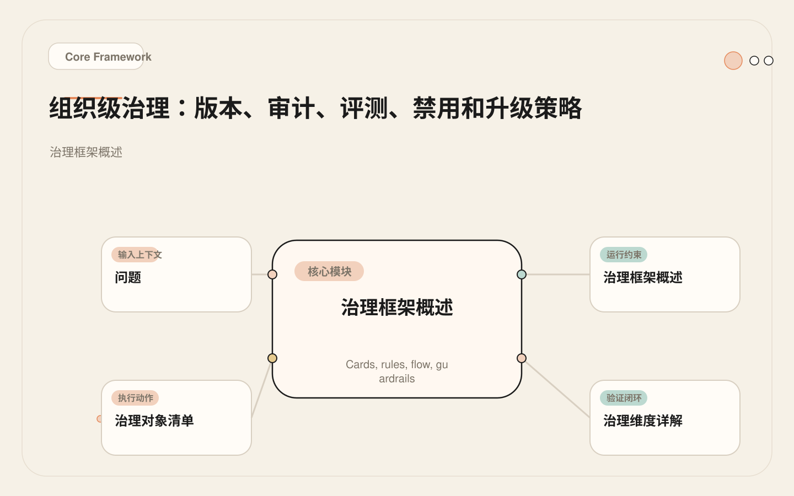
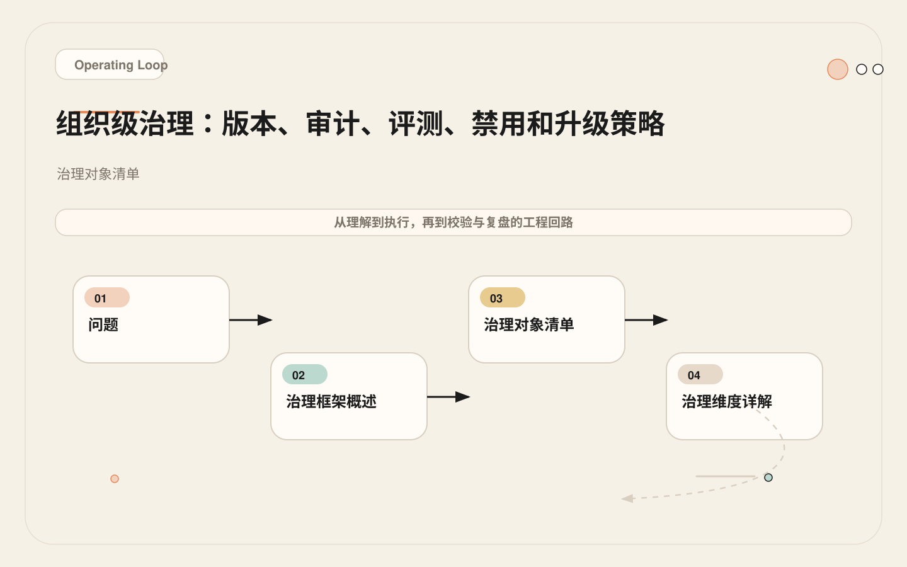
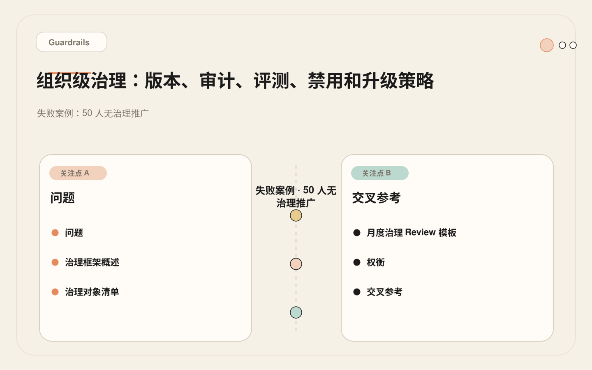

# 组织级治理：多团队长期跑下去，靠的是版本、审计、评测和升级策略

<!-- codex:cover ../../../assets/claude-code-engineering/33-organization-governance-cover.webp -->

<!-- /codex:cover -->

**TL;DR：** 组织级 Claude Code 落地不是"全员装工具"。它是管理七类治理对象的版本、权限、审计、评测、禁用和升级。没有治理框架的规模化推广，等于把生产环境的钥匙交给一个你无法审计的系统。

## 问题

个人使用 Claude Code，风险由个人承担。组织使用时，风险变成共享的：

<!-- codex:illustration 33-organization-governance/01-overview-knowledge-map.svg -->

<!-- /codex:illustration -->

- 错误代码通过 AI 辅助进入主干，3 个团队受影响。
- 开发者的 MCP token 权限过大，CI 环境泄露后影响全组织仓库。
- 一个团队写的好 CLAUDE.md，另一个团队不知道，重复踩坑。
- $10K 月度 API 账单，没人知道是哪个团队、哪个场景消耗的。
- 第三方 Plugin 引入安全漏洞，全组织安装的开发者都受影响。

这些不是假设。它们是 AI 编码工具在组织规模化推广后的典型事故模式。治理的目标不是阻止使用，而是让使用可控、可观测、可回滚。

## 治理框架概述

组织级治理管理 Claude Code 从个人工具到组织基础设施的转变过程。它覆盖七个维度：

<!-- codex:illustration 33-organization-governance/02-framework-core-structure.svg -->

<!-- /codex:illustration -->

```text
治理维度
│
├── 版本管理（Version）
│   谁能升级 Plugin、Skill、MCP server？升级前是否测试？
│
├── 审计追踪（Audit）
│   工具调用是否留痕？文件修改是否可追溯？MCP 调用是否记录？
│
├── 权限控制（Permission）
│   哪些工具可读、哪些可写？MCP token 权限范围？Hook 覆盖率？
│
├── 评测验证（Evaluation）
│   升级后是否跑回归任务？性能基准是否维护？
│
├── 禁用能力（Disable）
│   出问题时能否快速禁用任何能力？Kill switch 在哪？
│
├── 培训与技能建设（Training）
│   团队是否理解工具边界？新人 onboarding 是否覆盖 AI 工具使用？
│
└── 成本控制（Cost）
    API 预算如何分配？异常消耗如何告警？
```

## 治理对象清单

Claude Code 在组织中有七类可治理对象。每类对象有不同的作用范围、风险等级和治理要求。

<!-- codex:illustration 33-organization-governance/03-flow-operating-loop.svg -->

<!-- /codex:illustration -->

| 对象 | 作用范围 | Owner | 修改频率 | 风险等级 | 治理重点 |
|------|---------|-------|---------|---------|---------|
| CLAUDE.md 和 rules | 项目级 | 各团队 Tech Lead | 周 | 中 | 内容质量、一致性 |
| Skills | 团队/组织级 | Skill 作者 | 月 | 中 | 触发准确性、输出质量 |
| Plugins | 组织级 | 平台团队 | 季 | 高 | 安全审计、版本兼容 |
| MCP servers | 组织级 | 平台/安全团队 | 季 | 高 | Token 权限、数据安全 |
| Subagents | 团队级 | 各团队 | 月 | 中 | 工具权限、行为边界 |
| Hooks | 组织级 | 平台/安全团队 | 月 | 高 | 覆盖率、阻断准确性 |
| Agent SDK 服务 | 平台级 | 平台团队 | 季 | 最高 | 会话管理、成本控制 |
| GitHub Actions | 组织级 | DevOps 团队 | 月 | 高 | Secrets 安全、权限限制 |

### 治理注册表

每个治理对象都应该在组织级注册表中登记。这是一个真实模板：

```markdown
# Claude Code 治理注册表

## MCP Servers

| 能力 | Owner | 权限范围 | 适用仓库 | 版本 | 风险等级 | 回滚方式 | 最后审计 |
|------|-------|---------|---------|------|---------|---------|---------|
| GitHub MCP | platform-team | read:repo, read:org | all | v2.1 | low | disable in settings.json | 2026-05-01 |
| Sentry MCP | platform-team | read:project, read:issue | backend-* | v1.3 | low | disable in settings.json | 2026-04-15 |
| Database MCP | data-team | SELECT on read-replica | api-* | v1.0 | medium | disable in settings.json | 2026-03-20 |
| Jira MCP | pm-ops | read:project | all | v1.1 | low | disable in settings.json | 2026-04-01 |

## Plugins

| Plugin | Owner | 版本 | 包含组件 | 适用范围 | 风险等级 | 回滚方式 | 最后审计 |
|--------|-------|------|---------|---------|---------|---------|---------|
| org-review | platform-team | v2.1.0 | 3 skills, 2 commands, 1 hook | all repos | medium | revert npm version | 2026-04-20 |
| security-audit | security-team | v1.0.0 | 1 skill, 1 agent, 1 MCP | all repos | high | revert npm version | 2026-05-10 |

## Hooks（组织级）

| Hook | Owner | 事件 | Matcher | 行为 | 风险等级 | 回滚方式 | 最后审计 |
|------|-------|------|---------|------|---------|---------|---------|
| audit-log | platform-team | PreToolUse | Bash | 记录命令到审计日志 | low | remove from settings.json | 2026-05-01 |
| block-sensitive | security-team | PreToolUse | Write\|Edit | 阻断 .env/* 写入 | low | remove from settings.json | 2026-04-15 |
| format-check | platform-team | PostToolUse | Edit\|Write | 检查代码格式 | low | remove from settings.json | 2026-04-15 |

## Agent SDK Services

| 服务 | Owner | 模型 | 最大并发 | 日预算 | 风险等级 | 回滚方式 | 最后审计 |
|------|-------|------|---------|-------|---------|---------|---------|
| PR Analysis | platform-team | sonnet-4.6 | 5 | $15 | medium | stop container | 2026-05-01 |
| Issue Triage | platform-team | sonnet-4.6 | 3 | $8 | low | stop container | 2026-04-20 |
```

## 治理维度详解

### 维度一：版本管理

**核心问题**：谁有权升级？升级前是否测试？回滚方案是什么？

```text
版本管理决策矩阵

对象              升级发起      审批        测试要求           回滚方式
─────────────────────────────────────────────────────────────────────────
CLAUDE.md        项目内任何人   Tech Lead   PR review         git revert
rules/*.md       项目内任何人   Tech Lead   PR review         git revert
Skill            Skill 作者    团队 review  触发评测 5+5       git revert
Plugin           平台团队      安全团队    2+ 仓库实测        npm 版本回退
MCP server       平台团队      安全团队    功能验证 + 权限审计 disable in settings.json
Agent SDK 服务   平台团队      安全团队    staging 全流程      容器回退 + DB 回退
GitHub Actions   DevOps 团队   安全团队    dry-run 验证       workflow disable
```

**升级测试流程**：

```text
1. 变更发起者在测试仓库中验证
   - Skill: 跑触发评测（5 条应触发 + 5 条不应触发）
   - Plugin: 安装测试 + 功能验证
   - MCP: 功能测试 + 权限检查
   - Hook: 行为验证（阻断/记录/提示是否正确）

2. PR review
   - 至少 1 名非变更发起者 review
   - 安全相关变更需安全团队 review

3. 灰度发布
   - 先在 1-2 个低风险仓库部署
   - 观察 1 周，记录问题
   - 没有问题后全量发布

4. 通知
   - 提前通知团队升级时间和影响范围
   - 提供变更摘要和注意事项
```

### 维度二：审计追踪

**核心问题**：工具调用是否留痕？文件修改是否可追溯？MCP 调用是否记录？

审计的实现层级：

```text
层级一：Hook 级审计（最低要求）
  PreToolUse Hook 记录所有 Bash 调用
  PostToolUse Hook 记录所有 Edit/Write 操作
  Stop Hook 记录会话摘要

层级二：结构化日志（推荐）
  所有工具调用写入结构化日志文件
  格式：timestamp | session_id | tool | input_hash | result_summary
  日志存储到集中式系统（ELK、Datadog、CloudWatch）

层级三：MCP 调用审计
  记录每次 MCP 工具调用的工具名、参数摘要、返回大小
  特别关注写操作和敏感数据读取

层级四：SDK 服务级审计
  记录会话创建、执行、销毁的完整生命周期
  追踪 token 消耗、成本、执行时间
```

审计 Hook 示例：

```bash
#!/bin/bash
# audit-tool-call.sh
# PreToolUse Hook：记录所有工具调用到审计日志

SESSION_ID="${CLAUDE_SESSION_ID:-unknown}"
TOOL_NAME="$1"
TOOL_INPUT="$2"
TIMESTAMP=$(date -u +"%Y-%m-%dT%H:%M:%SZ")

# 脱敏：不记录完整的工具输入，只记录摘要
INPUT_HASH=$(echo "$TOOL_INPUT" | sha256sum | cut -d' ' -f1 | cut -c1-16)
INPUT_LENGTH=${#TOOL_INPUT}

# 写入审计日志
echo "${TIMESTAMP} | session=${SESSION_ID} | tool=${TOOL_NAME} | input_hash=${INPUT_HASH} | input_len=${INPUT_LENGTH}" \
  >> /var/log/claude-code/audit.log

# 检查是否是高风险操作
if echo "$TOOL_INPUT" | grep -qE 'rm -rf|git push|DROP TABLE|DELETE FROM'; then
  echo "ALERT: High-risk operation detected" >> /var/log/claude-code/alerts.log
  # 可选：发送告警到 Slack/邮件
fi

exit 0  # 不阻断，只记录
```

### 维度三：权限控制

**核心问题**：哪些工具可读、哪些可写？MCP token 权限范围？Hook 覆盖率？

工具权限矩阵模板：

```text
工具权限矩阵（按角色分配）

                    开发者     Tech Lead   CI Agent    SDK 服务
                    ────────  ──────────  ─────────  ──────────
Read                ✓         ✓           ✓           ✓
Grep/Glob           ✓         ✓           ✓           ✓
Edit                ✓*        ✓           ✓*          ✗
Write               ✓*        ✓           ✗           ✗
Bash(test*)         ✓         ✓           ✓           ✓
Bash(build*)        ✓         ✓           ✓           ✗
Bash(git commit*)   ✓         ✓           ✓*          ✗
Bash(git push*)     ✗         ✓           ✗           ✗
MCP(read-only)      ✓         ✓           ✓           ✓
MCP(write)          ✗         ✓*          ✗           ✗

* 需要确认或受限条件
```

MCP token 权限范围要求：

```text
最小权限原则：
  - GitHub MCP: 只读 token（read:repo, read:org），不要用写 token
  - Database MCP: 只连接 read-replica，只用 SELECT 权限的账号
  - Sentry MCP: 只读 token（read:project, read:issue）
  - Jira MCP: 只读 token（read:project），不要用管理权限

Token 管理：
  - 每个 MCP server 使用独立 token，不要复用
  - Token 通过环境变量注入，不硬编码在配置文件中
  - Token 定期轮换（建议每 90 天）
  - Token 泄露后有快速撤销流程
```

### 维度四：评测验证

**核心问题**：升级后能力是否退化？性能基准在哪里？

**Skill 回归测试**：

```text
每次 Skill 升级后，跑以下测试：

1. 触发准确性
   - 5 条应该触发的请求 → 全部触发
   - 5 条不应触发的请求 → 全部不触发
   - 通过率 < 80% → 回滚

2. 输出质量
   - 3 个标准输入 → 输出格式符合模板
   - 关键字段不缺失（severity、file、description）
   - 无幻觉（提到的文件真实存在）

3. Token 消耗
   - 与上一版本对比，消耗增长 < 20%
   - 峰值消耗不超过预算上限
```

**Plugin 回归测试**：

```text
每次 Plugin 升级后：

1. 安装测试
   - 在干净环境中安装 → 无错误
   - 升级安装（从上一版本） → 无冲突

2. 组件测试
   - 每个 Command 执行一次 → 正常响应
   - 每个 Skill 触发评测 → 通过
   - 每个 Hook 触发一次 → 行为正确
   - 每个 MCP server 连接 → 可达

3. 兼容性测试
   - 和项目本地配置无冲突
   - 和其他已安装 Plugin 无冲突
```

### 维度五：禁用能力（Kill Switch）

**核心问题**：出问题时能否快速禁用？禁用什么？影响多大？

```text
禁用层级（从快到慢）

秒级禁用：
  - 禁用单个 Plugin：从 settings.json 的 plugins 列表中移除
  - 禁用单个 MCP server：从 settings.json 的 mcpServers 中移除
  - 禁用单个 Hook：从 hooks 配置中移除

分钟级禁用：
  - 禁用所有 Plugin：清空 plugins 列表
  - 禁用所有 MCP：清空 mcpServers
  - 禁用 SDK 服务：停止容器

小时级禁用：
  - 禁用组织级 Claude Code 使用：撤销 API key
  - 禁用 GitHub Actions：关闭 workflow
```

**Kill Switch 模板**：

```markdown
# Claude Code Kill Switch 手册

## 场景一：第三方 Plugin 安全事件
1. 立即在组织 settings.json 中移除该 Plugin
2. 通知所有开发者重新加载配置
3. 安全团队评估影响范围
4. 记录事件（时间、Plugin、影响范围、处理措施）

## 场景二：MCP server 异常行为
1. 在 settings.json 中注释该 MCP server 配置
2. 检查该 server 的 token 使用日志
3. 如有必要，轮换该 server 的 token
4. 通知依赖该 server 的团队

## 场景三：SDK 服务故障
1. 停止 SDK 服务容器
2. 检查会话泄漏和成本异常
3. 修复后先在 staging 验证
4. 逐步恢复流量

## 场景四：组织级紧急禁用
1. 通过 SSO/管理面板禁用 Anthropic API key
2. 通知全员暂停使用
3. 评估影响和根因
4. 制定恢复计划
```

### 维度六：培训与技能建设

**核心问题**：团队是否理解工具边界？新人是否知道怎么正确使用？

```text
培训体系

新人 Onboarding（第一周）：
  [ ] 理解 Claude Code 是 Agent 运行时，不是代码补全（第 00 篇）
  [ ] 能解释四层架构（模型层、工具层、记忆层、治理层）
  [ ] 知道 CLAUDE.md 在哪里、怎么用（第 04 篇）
  [ ] 知道权限系统怎么工作（第 01 篇）
  [ ] 完成 1 个端到端任务（读文件 → 改文件 → 跑测试）

中级培训（第一个月）：
  [ ] 理解 Skill 和 Command 的区别（第 08 篇）
  [ ] 能写一个简单的 Command
  [ ] 理解 Hook 的作用和配置方式（第 22 篇）
  [ ] 理解 MCP 的安全边界（第 17 篇）
  [ ] 知道什么操作不应该让 AI 做

高级培训（第三个月）：
  [ ] 能设计和实现一个 Skill（第 09 篇）
  [ ] 能配置和调试 Hook（第 26 篇）
  [ ] 能评估 MCP 接入的必要性（第 17 篇决策矩阵）
  [ ] 能参与 Plugin 审计（第 32 篇审计清单）
  [ ] 理解治理框架和注册表（本篇）
```

## 组织采纳路线图

规模化推广应该分阶段，每个阶段有明确的进入条件和退出标准。

```text
Phase 1（第 1-2 周）：个人采纳
  目标：开发者能在本地有效使用 Claude Code

  行动：
    - 每个开发者安装 Claude Code
    - 每个仓库创建 CLAUDE.md（命令、架构、规则）
    - 建立基础 permissions 配置

  进入条件：无（随时开始）
  退出标准：
    - 80% 开发者安装并使用过
    - 每个活跃仓库有 CLAUDE.md
    - 单次任务的人工中转次数 < 2

Phase 2（第 3-4 周）：团队标准化
  目标：团队共享规则、Skill 和 Hook

  行动：
    - 识别高频工作流，封装为 Command 或 Skill
    - 建立团队共享的 PreToolUse Hook（审计日志）
    - 建立团队共享的 PostToolUse Hook（格式检查）
    - 统一 MCP 配置（如 GitHub MCP）

  进入条件：Phase 1 完成
  退出标准：
    - 每个团队有 2-3 个共享 Skill
    - 审计 Hook 覆盖所有 Bash 和 Edit 调用
    - 至少 1 个 MCP server 在团队内统一使用

Phase 3（第 2 个月）：平台集成
  目标：接入 CI、MCP、GitHub Actions

  行动：
    - 部署 GitHub Actions workflow（PR review、Issue triage）
    - 接入组织级 MCP server（GitHub、Sentry 等）
    - 建立组织级 settings.json 模板
    - 部署第一个 Headless 自动化任务

  进入条件：Phase 2 完成 + DevOps 支持就绪
  退出标准：
    - PR review workflow 运行稳定
    - 至少 2 个 MCP server 在组织内统一使用
    - 有至少 1 个 Headless 批处理任务在运行

Phase 4（第 3 个月+）：组织治理
  目标：Plugin 化、SDK 化、全面治理

  行动：
    - 将验证过的 Skill 打包为 Plugin
    - 部署 Agent SDK 服务（PR 分析等）
    - 建立治理注册表
    - 建立 Plugin 审计流程
    - 建立成本监控和告警

  进入条件：Phase 3 完成 + 有平台工程能力
  退出标准：
    - 治理注册表覆盖所有治理对象
    - 有正式的 Plugin 审计流程
    - SDK 服务有监控和告警
    - 月度治理 review 成为常规
```

## ROI 测量框架

### 度量维度

```text
效率指标：
  - 单任务耗时变化（引入前 vs 引入后）
  - 人工中转次数（每次任务中手动复制粘贴的次数）
  - PR review 周期（从提交到合并的平均时间）
  - Issue 处理速度（从创建到分类的平均时间）

质量指标：
  - AI 辅助代码的 bug 率（引入后新代码的缺陷密度）
  - 测试覆盖率变化
  - Code review 发现的问题数（AI 先 review → 人工 review）
  - 生产事故数（AI 参与的代码是否引入更多事故）

成本指标：
  - API credits 月度消耗（按团队、按场景分解）
  - 基础设施成本（SDK 服务、CI 运行时间）
  - 培训投入（培训时间 × 人数）
  - 总成本 = API + 基础设施 + 培训 + 维护人力

风险指标：
  - 被阻断的危险操作次数（PreToolUse Hook 拦截数）
  - 审计覆盖率（有日志的工具调用比例）
  - 治理对象覆盖率（注册表中登记的比例）
  - 安全事件数（Plugin 安全、MCP 越权等）
```

### ROI 计算模板

```text
月度 ROI 计算：

收益（节省时间 × 人力成本）：
  PR review 自动化：
    50 PR/月 × 平均节省 20 分钟 = 16.7 小时
    16.7 小时 × $50/小时 = $833

  Issue 分类自动化：
    100 Issue/月 × 平均节省 5 分钟 = 8.3 小时
    8.3 小时 × $50/小时 = $417

  代码探索加速：
    估计 30 名开发者 × 每周节省 2 小时 = 240 小时/月
    240 小时 × $50/小时 = $12,000

  总收益：$13,250/月

成本：
  API credits：$500/月
  基础设施：$150/月
  维护人力（0.1 FTE）：$800/月
  培训（均摊）：$200/月

  总成本：$1,650/月

ROI = ($13,250 - $1,650) / $1,650 = 7.0x
```

注意：这个模板的数字是示例。实际数字需要根据组织规模、使用频率和人力成本调整。关键是建立度量体系，而不是追求精确数字——方向性正确就够了。

## 失败案例：50 人无治理推广

### 经过

<!-- codex:illustration 33-organization-governance/04-compare-guardrails.svg -->

<!-- /codex:illustration -->

一个 50 人技术组织决定"全员推广 Claude Code"。第 1 周全量安装，没有治理框架，没有统一的 CLAUDE.md 模板，没有 Hook，没有 MCP 权限规范。

第一个月的后果：

```text
事故一：自动提交代码到主干（第 2 周）
  - 2 名开发者使用 bypassPermissions 模式
  - Claude Code 直接 git push 到 main 分支
  - 1 次破坏性提交导致 CI 红了 4 小时
  - 影响：3 个团队等待修复
  - 根因：没有权限配置、没有 PreToolUse Hook、没有分支保护

事故二：CLAUDE.md 质量参差（第 3 周）
  - 10 个仓库有 CLAUDE.md，质量差异极大
  - 最差的 CLAUDE.md 只有 3 行："帮我写代码"
  - 最好的 CLAUDE.md 有 150 行，包含完整的命令、架构和安全规则
  - 质量差异导致 Claude Code 在不同仓库的表现完全不同
  - 影响：开发者对工具的信任度分化
  - 根因：没有 CLAUDE.md 模板和质量标准

事故三：$10K 意外 API 成本（第 4 周）
  - 月度账单 $10K，是预期的 5 倍
  - 排查发现：
    - 1 名开发者让 Claude Code 跑了一个需要 40 轮工具调用的任务
    - 1 个团队在 CI 中配置了自动触发但没有轮次限制
    - 3 名开发者频繁开启新会话重新探索同一问题
  - 影响：管理层质疑 Claude Code 的 ROI
  - 根因：没有成本监控、没有单次任务预算限制、没有使用指导

连锁影响：
  - 管理层暂停 Claude Code 使用 2 周
  - 需要提交治理方案才能恢复
  - 开发者信心受挫，恢复使用后参与度下降 30%
  - 补治理的成本（制定规范、培训、配置）远超提前规划的成本
```

### 根因

```text
1. 跳过了 Phase 1（个人采纳）
   直接全员安装，没有给开发者时间理解工具

2. 没有基础治理配置
   没有组织级 settings.json 模板
   没有 PreToolUse Hook 拦截危险操作
   没有权限 denylist

3. 没有 CLAUDE.md 质量标准
   没有模板、没有 review 流程、没有最低要求

4. 没有成本控制
   没有预算、没有监控、没有告警

5. 没有培训
   开发者不知道 bypassPermissions 的风险
   不知道如何有效使用 CLAUDE.md
   不知道如何控制会话成本
```

### 修复

```text
第一步（紧急，1 天内）：
  1. 创建组织级 settings.json 模板，包含：
     - 基础 permissions denylist（rm -rf、git push --force、sudo）
     - PreToolUse Hook 拦截敏感操作
  2. 禁用所有仓库的 bypassPermissions 模式

第二步（1 周内）：
  1. 创建 CLAUDE.md 模板（命令、架构、规则、安全）
  2. 每个 Tech Lead 负责本仓库 CLAUDE.md 质量
  3. 建立 CLAUDE.md PR review 标准

第三步（2 周内）：
  1. 建立 API 成本监控（按团队、按天追踪）
  2. 设置日预算告警
  3. 为开发者提供使用指南（如何控制会话成本）

第四步（1 个月内）：
  1. 按照本文的采纳路线图，从 Phase 1 重新开始
  2. 建立治理注册表
  3. 指定治理负责人
  4. 建立月度治理 review 机制
```

## 月度治理 Review 模板

```markdown
# Claude Code 月度治理 Review

## 基本信息
- 日期：YYYY-MM-DD
- 参与人：[治理负责人、各团队代表、安全团队]
- 本月重点：[本月关注的治理议题]

## 使用数据
- 活跃用户数：
- 总会话数：
- API credits 消耗：
- 平均单任务成本：
- 与上月对比趋势：

## 安全和审计
- 被阻断的危险操作数：
- 审计覆盖率（有日志的工具调用比例）：
- 安全事件数（本月）：
- Plugin 审计完成数：

## 质量指标
- CLAUDE.md 覆盖率（有合格 CLAUDE.md 的仓库比例）：
- Skill 触发准确率：
- 人工中转次数变化：
- 开发者满意度（可选调查）：

## 治理对象变更
- 新增 MCP server：[列表]
- 新增 Plugin：[列表]
- Hook 变更：[列表]
- 版本升级：[列表]

## 问题追踪
- 上月遗留问题：
- 本月新增问题：
- 已解决问题：

## 下月计划
- [ ] 计划事项 1
- [ ] 计划事项 2
```

## 权衡

治理会降低短期速度。审批流程、审计 Hook、CLAUDE.md review 都需要额外时间。但治理的收益是防止系统性风险：

- **一次生产事故的成本**远超一个月的治理投入。
- **一次数据泄露的成本**远超一年的治理投入。
- **团队信任丧失后的恢复成本**远超从第一天就建立治理的成本。

治理的粒度应该和组织规模匹配：

```text
5 人以下团队：基础 permissions + CLAUDE.md
5-20 人团队：+ 共享 Skills + 审计 Hook + MCP 规范
20-50 人组织：+ Plugin 化 + 治理注册表 + 成本监控
50 人以上组织：+ SDK 服务 + 正式审计流程 + 月度 review
```

不要过度治理。5 人团队搞月度治理 review 是浪费时间。但 50 人组织没有治理注册表是在赌博。

## 交叉参考

- [00 - Agent 运行时](00-claude-code-as-agent-runtime.md)：治理层是运行时四层架构中的确定性控制层
- [01 - 上下文验证和权限](01-context-validation-permission.md)：权限是治理的基础
- [04 - CLAUDE.md 项目记忆](04-claude-md-project-memory.md)：CLAUDE.md 质量标准是治理的第一步
- [08 - Skills 入门](08-skills-from-command-to-capability.md)：Skill 升级阈值是治理的决策工具
- [17 - MCP 心智模型](17-mcp-mental-model.md)：MCP 权限管理是治理的高风险领域
- [22 - Hooks 入门](22-hooks-introduction.md)：Hook 是治理的主要实施机制
- [27 - Headless 模式](27-headless-mode.md)：自动化场景的治理要求更高
- [28 - GitHub Actions](28-github-actions.md)：CI 中的 Claude Code 需要额外的安全边界
- [29 - CI 安全边界](29-ci-security-boundaries.md)：Secrets 和权限的 CI 治理
- [31 - Agent SDK](31-agent-sdk.md)：SDK 服务的会话管理和成本控制属于平台级治理
- [32 - Plugins](32-plugins.md)：Plugin 审计是组织治理的关键环节


