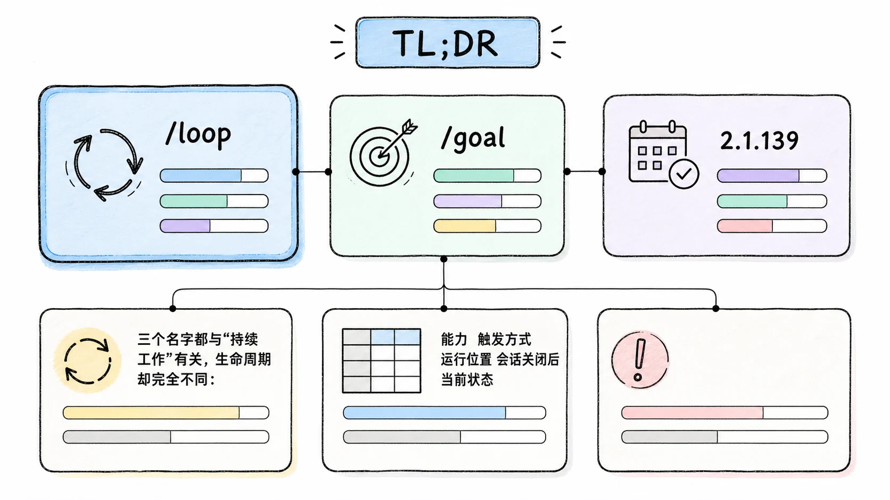
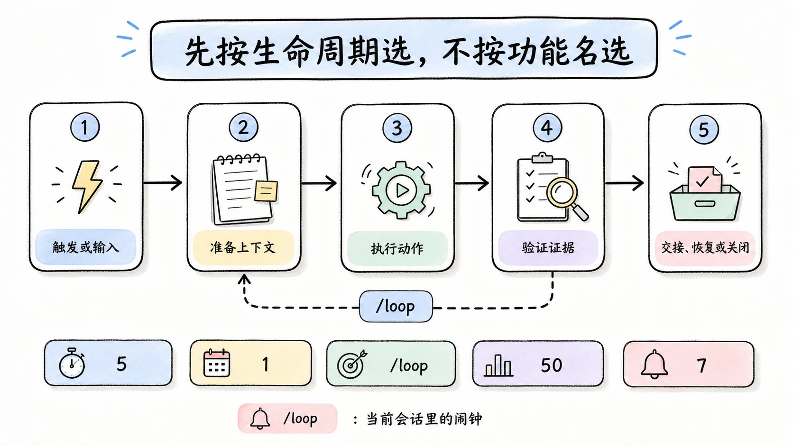
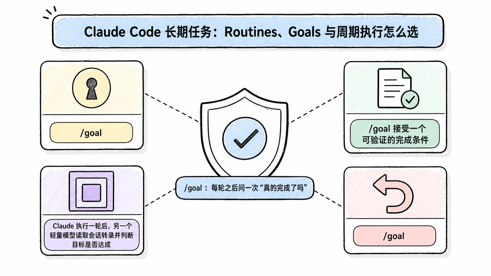
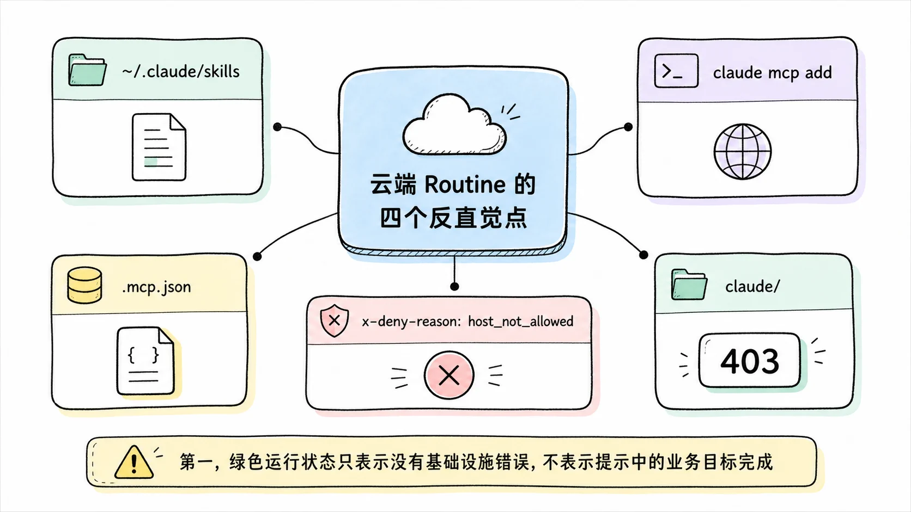
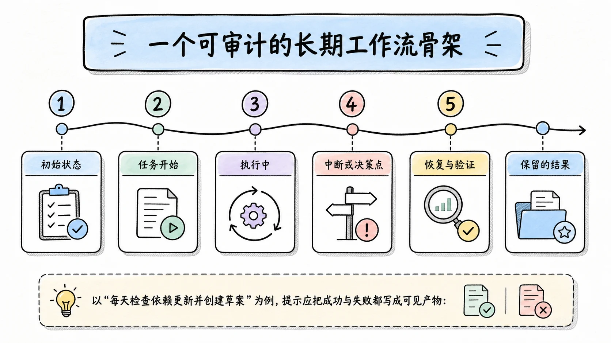
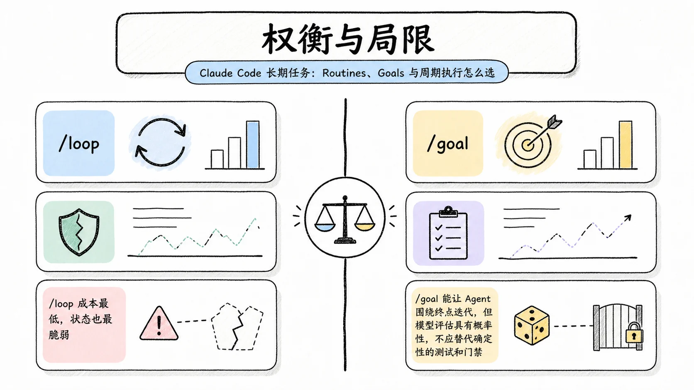

# Claude Code 长期任务：Routines、Goals 与周期执行怎么选

> 资料基线：2026-07-22。Routines 是 Research Preview；`/goal` 已进入 Claude Code，但完成判定仍由模型执行；`/loop` 是会话内周期任务。本文没有创建真实云端 Routine，也没有消耗 API 调用验证 `/goal`，命令语义来自官方文档与 changelog。

## TL;DR

三个名字都与“持续工作”有关，生命周期却完全不同：

<!-- wos:illustration claude-code-engineering/41-routines-goals-long-running/01-infographic-concept-map.webp -->

<!-- /wos:illustration -->

| 能力 | 触发方式 | 运行位置 | 会话关闭后 | 当前状态 |
| --- | --- | --- | --- | --- |
| `/loop` | 固定间隔 | 本地当前会话 | 停止 | 会话内置能力 |
| `/goal` | 每轮后检查完成条件 | 本地当前会话 | 可随会话恢复，基线会重置 | 自 2.1.139 提供 |
| Routines | 时间、API、GitHub 事件 | Anthropic 托管云端 | 继续运行 | Research Preview |

周期检查用 `/loop`，明确终点但步骤未知的任务用 `/goal`，需要合盖运行、外部触发或账号内集中管理时才考虑 Routines。任何一项都不自动等于可靠工作流系统。

Routines 当前面向启用了 Claude Code Web 的 Pro、Max、Team 和 Enterprise 套餐。Team 与 Enterprise Owner 可以在组织设置中整体关闭它。Routine 归创建者的个人 claude.ai 账号所有，不与团队成员共享，并占用该账号的每日运行额度。

## 读者定位

本文面向能独立运行 Claude Code、理解 CI 和任务调度，但尚未厘清“定时”“达成目标”“长期托管”差异的中级开发者。

## 先按生命周期选，不按功能名选

### `/loop`：当前会话里的闹钟

<!-- wos:illustration claude-code-engineering/41-routines-goals-long-running/02-flowchart-operating-flow.webp -->

<!-- /wos:illustration -->

`/loop` 把提示按间隔重新投入当前会话，适合等待部署、轮询 PR 或定时查看日志：

```text
/loop 5m check whether the deployment finished; report only state changes
```

它要求会话一直开着，只在会话空闲时触发，不会为错过的时间补跑。官方文档给出的边界包括：最短间隔 1 分钟、最多 50 个任务、重复任务最长保留 7 天。恢复会话时，尚未过期的任务可以恢复。

这里的“周期”不是 cron 服务承诺。机器休眠、进程退出、会话忙碌都会改变实际执行时刻。

### `/goal`：每轮之后问一次“真的完成了吗”

`/goal` 接受一个可验证的完成条件。Claude 执行一轮后，另一个轻量模型读取会话转录并判断目标是否达成；答案为否时，主会话继续下一轮。

<!-- wos:illustration claude-code-engineering/41-routines-goals-long-running/03-infographic-verification-guardrails.webp -->

<!-- /wos:illustration -->

```sh
claude -p "/goal 修复当前失败测试。完成条件：相关测试和项目 lint 都通过，转录中包含命令与退出结果；不要改动无关文件。"
```

默认文本输出会等到目标结束才返回，长任务可能看起来没有响应。官方建议用流式 JSON 观察进度：

```sh
claude -p "/goal 将类型检查修复到通过，并保留验证输出" \
  --output-format stream-json \
  --verbose
```

评估器有个明确限制：它不调用工具，也不读取文件，只看转录。若测试结果没有出现在转录里，评估器看不到；若“完成条件”只写成“把代码做好”，它也只能做主观判断。把目标写成四部分更可靠：可观察结果、验证命令、允许变更范围、无法继续时的停止条件。

`/goal` 不提升权限。无人值守执行仍需要独立设计权限模式、工具白名单和预算边界。恢复含活动目标的会话时，目标可恢复，但耗时、轮次和 token 的基线会重新计算。

### Routines：每次从云端新环境开始

Routine 保存提示、一个或多个仓库及连接器，由 Anthropic 托管环境按计划、API 请求或 GitHub 事件启动。电脑可以关闭。它适合为团队产出代码巡检、定时报告和事件驱动的仓库任务，但配置与额度仍属于创建者账号。

管理入口是 [claude.ai/code/routines](https://claude.ai/code/routines)，Claude Code Web 中也可使用：

```text
/schedule
```

官方文档说明，计划触发的最小间隔是 1 小时，实际启动可能错开几分钟。GitHub 每个事件都会创建独立新会话，不复用上一次事件的上下文。超出预览期事件上限的触发可能被丢弃。

## 云端 Routine 的四个反直觉点

第一，绿色运行状态只表示没有基础设施错误，不表示提示中的业务目标完成。要检查转录、产物和仓库状态。

<!-- wos:illustration claude-code-engineering/41-routines-goals-long-running/04-framework-system-framework.webp -->

<!-- /wos:illustration -->

第二，每次运行会重新克隆仓库的默认分支。本地未提交文件、当前工作树和个人 `~/.claude/skills` 不会跟过去。云端可用的是账号启用的能力、仓库提交的配置，以及 Routine 明确连接的资源。

第三，本地通过 `claude mcp add` 注册的服务器不会自动出现在 Routine。云端需要 claude.ai 连接器，或仓库中提交的 `.mcp.json`。

第四，默认云环境使用 Trusted network。未在允许范围内的主机可能返回带 `x-deny-reason: host_not_allowed` 的 403。依赖安装和内部 API 访问应先做网络清单，而不是运行后再猜。

还有一个权限边界不能藏在脚注里：Routine 是自主云端会话，运行时没有权限模式选择器，也不会弹出批准请求。它通过创建者连接的 GitHub 与其他连接器行动，外部系统中的提交、PR 或消息会体现该账号身份。每个仓库默认只能推送 `claude/` 前缀分支；放开 unrestricted branch pushes 会扩大影响范围。

## 一个可审计的长期工作流骨架

以“每天检查依赖更新并创建草案”为例，提示应把成功与失败都写成可见产物：

<!-- wos:illustration claude-code-engineering/41-routines-goals-long-running/05-timeline-lifecycle-timeline.webp -->

<!-- /wos:illustration -->

```text
检查仓库直接依赖是否存在兼容更新。

完成条件：
1. 只修改依赖清单和锁文件。
2. 执行项目测试与 lint，并在摘要中记录命令结果。
3. 全部通过时创建 claude/ 前缀分支和草案 PR。
4. 任何验证失败时不创建 PR，输出失败命令、首个错误和已改文件。
5. 没有更新时明确返回 no-change。
```

这种写法只能让云端转录留下可审计证据，不能保证结果。若业务要求“每次触发必须有且仅有一次结果”，还要在外部保存触发 ID、运行 ID、最终状态，并对丢失和重复触发做补偿。

## 权衡与局限

`/loop` 成本最低，状态也最脆弱。`/goal` 能让 Agent 围绕终点迭代，但模型评估具有概率性，不应替代确定性的测试和门禁。Routines 解除了本地会话依赖，却引入全新克隆、网络限制、云端凭据、事件上限和预览期变更。

<!-- wos:illustration claude-code-engineering/41-routines-goals-long-running/06-comparison-boundary-comparison.webp -->

<!-- /wos:illustration -->

一个实用判断是：先问任务由什么唤醒，再问状态放在哪里，最后问谁判定完成。时间唤醒不等于完成判定，云端运行也不等于可靠交付。

## 官方延伸阅读

- [Routines 官方文档](https://code.claude.com/docs/en/routines)
- [Goals 官方文档](https://code.claude.com/docs/en/goal)
- [Scheduled tasks 与 `/loop`](https://code.claude.com/docs/en/scheduled-tasks)
- [长运行 Agent 参考实现](https://github.com/anthropics/cwc-long-running-agents)
- [Claude Code changelog](https://github.com/anthropics/claude-code/blob/main/CHANGELOG.md)
