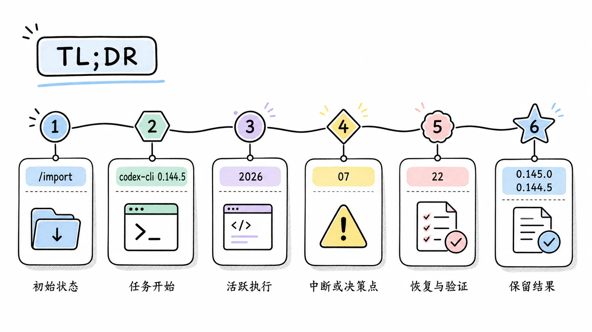
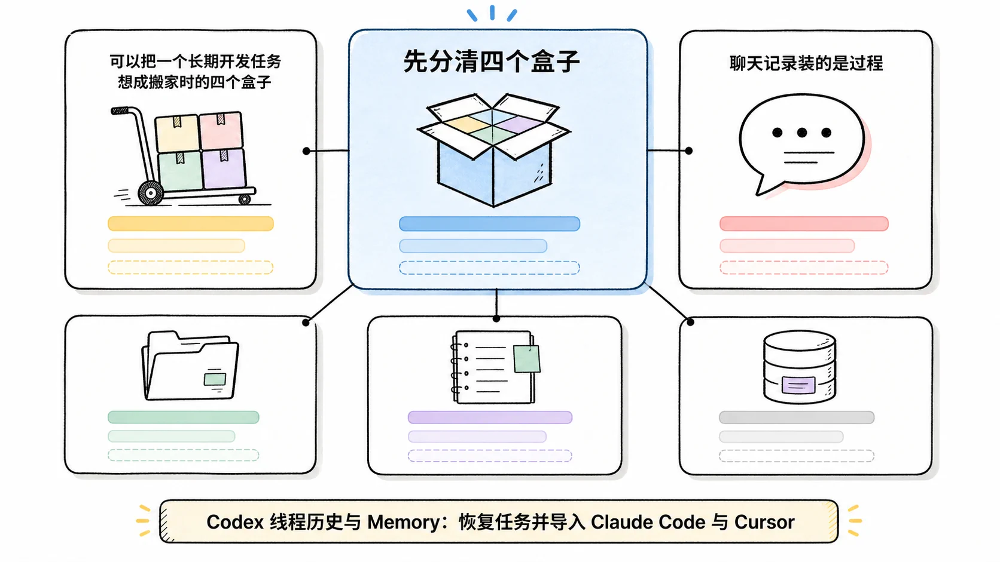
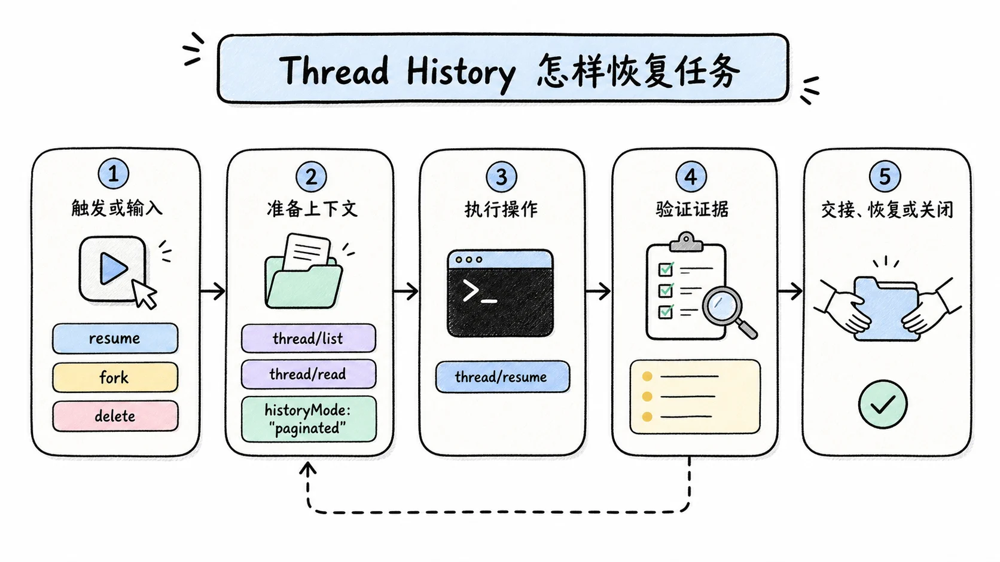
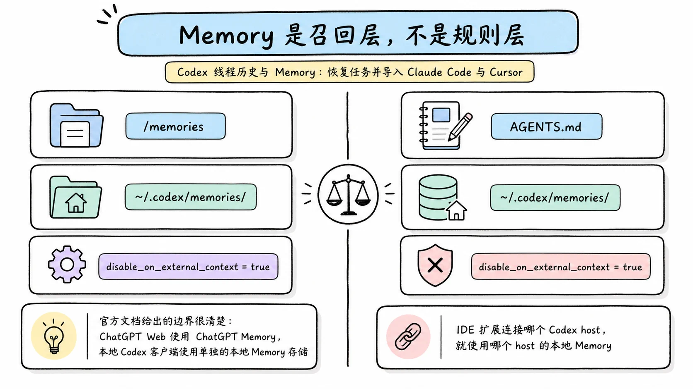
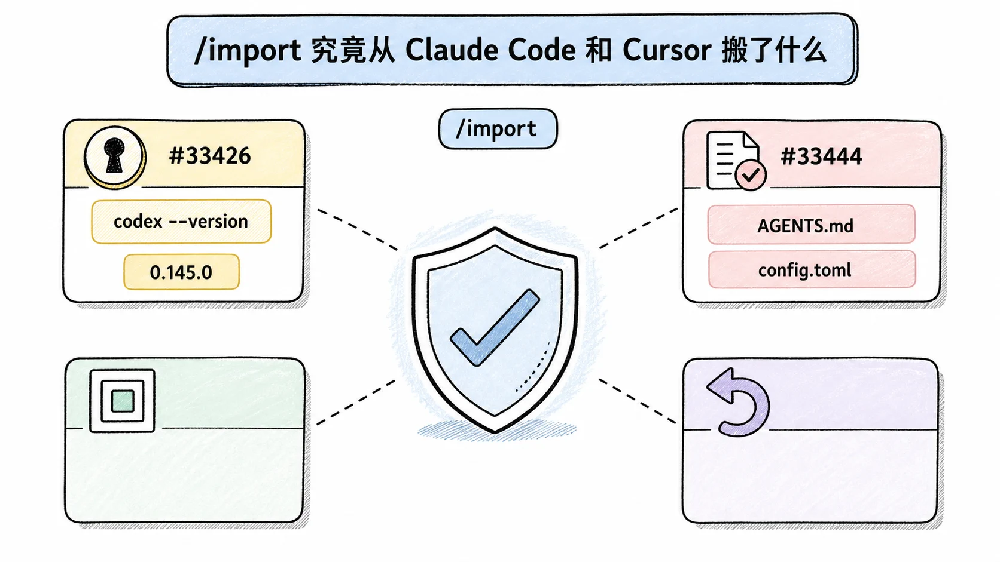
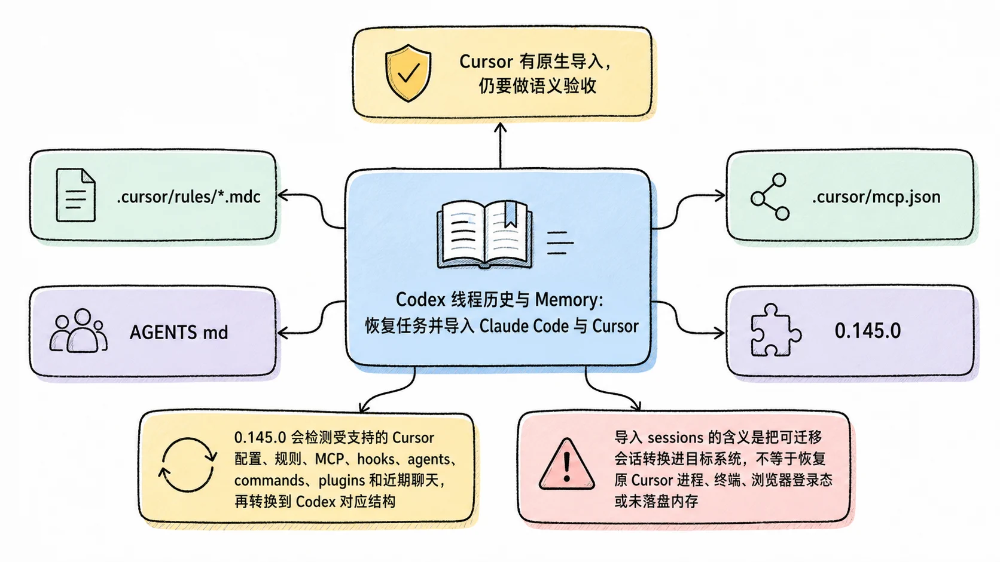

# Codex 线程历史与 Memory：恢复任务并导入 Claude Code 与 Cursor

## TL;DR

Codex 的 Thread History、持久名称、Memory 和导入功能解决的是四类问题。线程历史保存可恢复的工作记录，名称帮助人找到线程，Memory 从旧工作中提炼可复用信息，Import 把受支持的外部 Agent 设置和近期会话带进 Codex。它们互相配合，却不能互相替代。

<!-- wos:illustration codex-engineering/39-thread-history-memory-import/01-timeline-lifecycle-timeline.webp -->

<!-- /wos:illustration -->

截至 2026-07-22，Codex 0.145.0 已把 `/import` 扩展到 Cursor 和 Claude Code，可迁移 settings、MCP servers、plugins、sessions、commands 与项目级 memories。App Server 的分页线程历史仍是实验性接口。本机安装的 `codex-cli 0.144.5` 早于这次发布，不能用它缺少 Cursor 导入来否定 0.145.0 的行为。

## 读者定位

本文面向已经使用 Codex CLI、IDE 或桌面应用处理多天任务的中级开发者。你需要知道 Git 工作区、`AGENTS.md` 和 `config.toml` 的用途。文中讲清状态边界与迁移方法，不把实验接口包装成稳定功能。

资料基线：2026-07-22。恢复命令在 `codex-cli 0.144.5` 上核对；最新导入范围以 2026-07-21 发布的 0.145.0 官方 release 及对应官方 PR 为准。本文没有在本机旧版上复现 Cursor 导入，也没有对所有界面流程做端到端复现。

## 先分清四个盒子

可以把一个长期开发任务想成搬家时的四个盒子。

<!-- wos:illustration codex-engineering/39-thread-history-memory-import/02-infographic-concept-map.webp -->

<!-- /wos:illustration -->

聊天记录装的是过程。你问过什么，Codex 做过什么，工具返回了什么，都属于线程历史。

盒子标签是线程名称。标签方便搜索和恢复，但它不是数据库主键。App Server 文档明确说明，线程名称不要求唯一；按名称查找时，Codex 选最近更新的同名线程。

随身卡片是 Memory。它不会复制完整聊天，而是在符合条件的旧会话空闲后提炼偏好、技术栈、仓库惯例和反复出现的工作方式。

导入清单负责把 Cursor 或 Claude Code 的设置与近期工作映射到 Codex。它不会删除原工具的数据，也不保证两套产品的运行语义完全一致。

混淆这四层会产生很具体的错误。把 Memory 当完整历史，会找不到某条命令输出。把线程恢复当环境恢复，会忽略分支、依赖和凭据已经变化。把导入当格式无损转换，会误以为所有 hook、MCP 授权和会话都能原样运行。

## Thread History 怎样恢复任务

稳定的用户入口是恢复、分叉、归档和取消归档。下面这些命令来自本机 CLI 帮助，可以直接验证：

<!-- wos:illustration codex-engineering/39-thread-history-memory-import/03-flowchart-operating-flow.webp -->

<!-- /wos:illustration -->

```bash
codex resume --all
codex resume --last
codex fork --last
codex archive <SESSION_ID_OR_NAME>
codex unarchive <SESSION_ID_OR_NAME>
```

`resume` 在原线程继续追加工作。`fork` 复制已有历史并创建新线程，适合保留原决策同时探索另一条实现路径。归档只是把线程移出默认列表；`delete` 是永久删除，不能拿它当清理界面的快捷方式。

App Server 提供更细的能力。`thread/list` 可按创建时间、更新时间、最近交互时间、工作目录和搜索词分页；`thread/read` 能只读元数据；`thread/resume` 恢复后继续追加 turn。实验性的 `historyMode: "paginated"`、`thread/turns/list` 和 `thread/items/list` 把大线程拆成可分页的持久投影，客户端不必每次重建整段历史。

这套机制缓解了长线程加载成本，却没有消除上下文上限。公开 issue `#24230` 报告过长线程远程压缩触发 `context_length_exceeded`，导致恢复困难。那是特定版本的用户报告，不代表所有安装都会复现；它说明了一个可靠性边界：磁盘里有历史，不等于模型能在一次请求里重新读完全部历史。

恢复后先做状态核验，比直接说「继续」更稳：

```bash
git status --short
git branch --show-current
git rev-parse HEAD
```

再核对未完成目标、最后一次已观察到的命令结果、待确认问题和当前验证命令。线程提供线索，工作区才是当前事实。

## 持久名称为什么不能承担身份语义

App Server 的 `thread/name/set` 可以给已加载线程或磁盘中的 rollout 设置用户可见名称。名称会持久化，也能被 CLI 的 `resume`、`archive`、`delete` 等入口使用。

名称不唯一，所以团队不要把 `release-fix` 当不可变 ID。更合适的命名带仓库、目标和日期，例如 `payments-retry-audit-20260722`。真正需要自动化定位时记录线程 UUID；名称只服务人类导航。

公开 issue `#17354` 曾报告桌面应用看不到最近历史，但对应 JSONL 仍在 `~/.codex/sessions/`。这类报告提醒我们，列表渲染、线程索引和底层 rollout 是不同层。不要看到侧栏缺项就立刻复制、改写或删除 `~/.codex`。先升级客户端、用 `codex resume --all` 检查，再备份状态目录并按官方排障路径处理。

## Memory 是召回层，不是规则层

官方文档给出的边界很清楚：ChatGPT Web 使用 ChatGPT Memory，本地 Codex 客户端使用单独的本地 Memory 存储。IDE 扩展连接哪个 Codex host，就使用哪个 host 的本地 Memory。

<!-- wos:illustration codex-engineering/39-thread-history-memory-import/04-comparison-boundary-comparison.webp -->

<!-- /wos:illustration -->

在支持的版本中，可用 `/memories` 控制当前会话能否读取已有 Memory，以及它是否能成为未来 Memory 的输入。Memory 文件默认位于 `~/.codex/memories/`。后台生成会跳过仍活跃或太短的会话，临近用量上限时也可能暂不运行，所以关闭聊天后看不到立刻更新是正常机制，不是必然故障。

一个可审查的实验配置如下：

```toml
[features]
memories = true

[memories]
generate_memories = true
use_memories = true
disable_on_external_context = true
```

`disable_on_external_context = true` 会把使用过 MCP、Web Search 或 Tool Search 等外部上下文的聊天排除在 Memory 生成输入之外。它降低把外部或敏感上下文固化进本地 Memory 的概率，代价是可提炼会话变少。

必须始终生效的构建命令、安全边界和提交规范应写进仓库的 `AGENTS.md` 或版本化文档。Memory 可能延迟、被关闭、被重置，也可能不适用于另一台 host。把强制规则只放 Memory，相当于把构建门禁写在一张可能没带上的便签里。

## `/import` 究竟从 Claude Code 和 Cursor 搬了什么

Codex 0.145.0 的官方 release 明确写入两种来源：Cursor 和 Claude Code。`/import` 可迁移 settings、MCP servers、plugins、sessions、commands 与项目级 memories。Cursor 支持 PR `#33426` 给出的实现范围更细，包括 sandbox permissions、project instructions、hooks、agents 和 recent chat sessions；同时检测到两种来源时，流程会先要求选择来源。

<!-- wos:illustration codex-engineering/39-thread-history-memory-import/05-infographic-verification-guardrails.webp -->

<!-- /wos:illustration -->

在 0.145.0 或更新版本中，进入交互式 Codex 后启动导入：

```text
/import
```

本机 0.144.5 不能用来验证这条新增路径。若 `/import` 没显示 Cursor，先运行 `codex --version` 核对版本，再升级客户端；不要据此把 Cursor 判定为不受支持。

导入不会修改或删除原 Claude 设置。它也不会替你完成外部授权。导入结束后仍需检查需要重新认证的 plugin 或 connection，并逐项核对权限。

项目级 Memory 的迁移有独立边界。官方 PR `#33444` 描述的是发现项目 Memory Markdown、保留项目作用域、复制所选项目并触发后续 consolidation。Memory 功能本身仍需按所在版本的成熟度和工作区策略判断，不能因为 `/import` 成功就假设新会话必然召回了全部旧知识。

一套风险较低的迁移顺序是：

1. 在 Git 仓库中提交或备份现有指令文件，记录 Cursor 或 Claude Code 的配置来源。
2. 先导入项目、指令和少量近期聊天，不要一次启用所有外部工具。
3. 打开生成的 `AGENTS.md`、`config.toml` 和 agent 文件，检查路径、命令、环境变量名与权限。
4. 重新授权 MCP 与 plugin，拒绝把密钥直接写进仓库文件。
5. 在只读或 workspace-write 沙箱中运行一个小任务，确认指令加载和工具边界。

这里不能承诺语义无损。Claude Code 与 Cursor 的 hook 生命周期、权限模型、规则匹配和代理配置都与 Codex 不完全相同。导入完成只是转换结束，验证通过才算迁移完成。

## Cursor 有原生导入，仍要做语义验收

0.145.0 会检测受支持的 Cursor 配置、规则、MCP、hooks、agents、commands、plugins 和近期聊天，再转换到 Codex 对应结构。导入 sessions 的含义是把可迁移会话转换进目标系统，不等于恢复原 Cursor 进程、终端、浏览器登录态或未落盘内存。

<!-- wos:illustration codex-engineering/39-thread-history-memory-import/06-framework-system-framework.webp -->

<!-- /wos:illustration -->

迁移后逐项核对三类语义差异：

- Cursor 的 `.cursor/rules/*.mdc` 具有 glob、自动附加和 Agent Requested 等规则语义。检查转换后的 `AGENTS.md` 或 Skill 是否仍在正确路径和任务上生效。
- `.cursor/mcp.json` 里的 server 配置迁移后仍可能需要 OAuth、环境变量和本机可执行文件。不要把导入成功当成 MCP 握手成功。
- 近期聊天能提供过程材料，但分支、HEAD、未提交文件和外部账号状态必须在 Codex 中重新核验。

旧版 Codex 或迁移失败时，Cursor 官方的 Markdown 导出仍可作为降级路径。把导出文件作为参考资料，并附上目标、已完成工作、当前分支、未解决问题和最后验证结果。这个降级方案只迁移可读材料，不具备原生 session 转换的状态结构。

导入前后都不要机械复制包含 token 的 JSON。凭据是否进入系统钥匙串、环境变量或本地文件，取决于目标配置与 MCP 认证方式，需要单独审查。

## 权衡与局限

Thread History 提高连续性，也会积累体积、旧假设和敏感工具输出。分页历史改善客户端加载，不保证模型能重新吸收全部上下文。

Memory 减少重复说明，却带来延迟与来源追踪问题。团队规范仍需版本控制。使用外部上下文的仓库可以开启排除开关，但要接受召回覆盖下降。

官方 Import 节省配置转换时间，覆盖范围受客户端版本、来源数据和授权状态限制。Cursor 与 Claude Code 在 0.145.0 都有正式入口；0.144.5 等旧版缺少新增适配器。原生迁移也不包含外部运行环境快照，完成后仍要检查项目规则、工具权限和仓库状态。

任务恢复的最低验收标准要求聊天能打开，也要求仓库路径、分支、HEAD、未提交改动、权限、依赖和验证命令全部重新核对。完成这些检查后，历史才从档案变回可继续工作的上下文。

## 延伸阅读

- [OpenAI Codex 0.145.0 release](https://github.com/openai/codex/releases/tag/rust-v0.145.0)
- [OpenAI：Import from another agent](https://learn.chatgpt.com/docs/import)
- [OpenAI：Memories](https://learn.chatgpt.com/docs/customization/memories)
- [OpenAI Codex PR #33426：Cursor setup import](https://github.com/openai/codex/pull/33426)
- [OpenAI Codex App Server 协议](https://github.com/openai/codex/blob/main/codex-rs/app-server/README.md)
