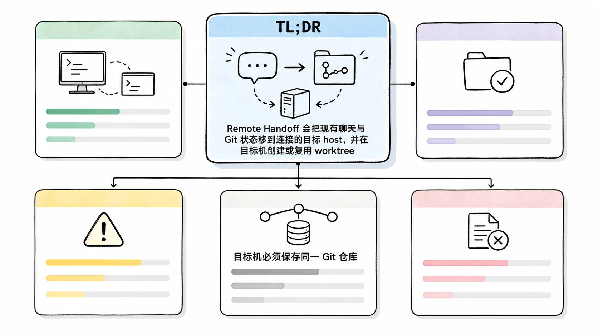
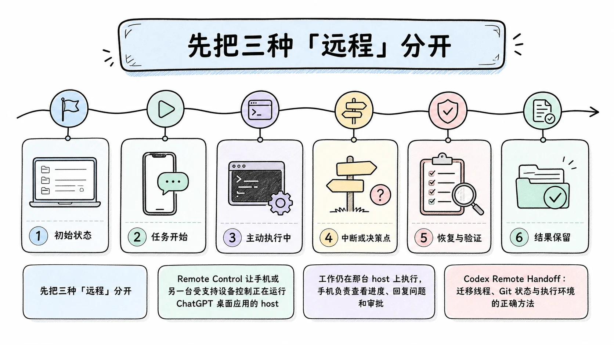
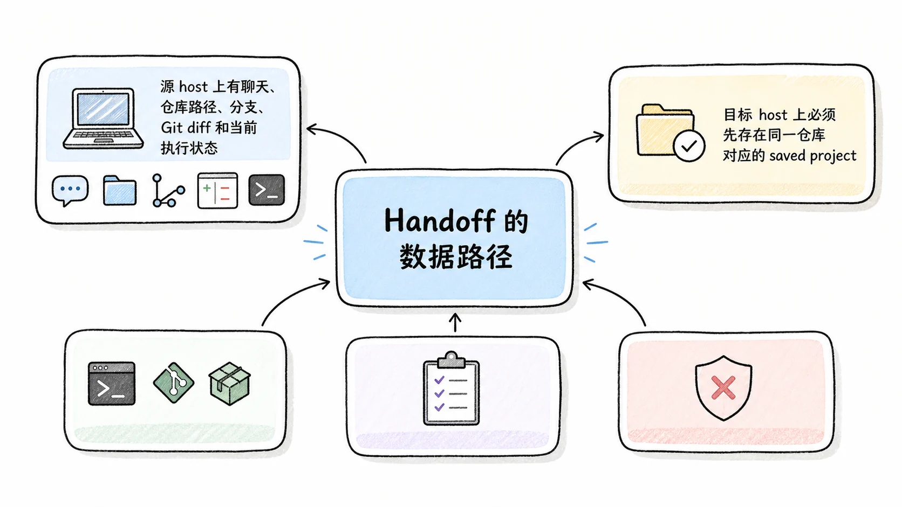
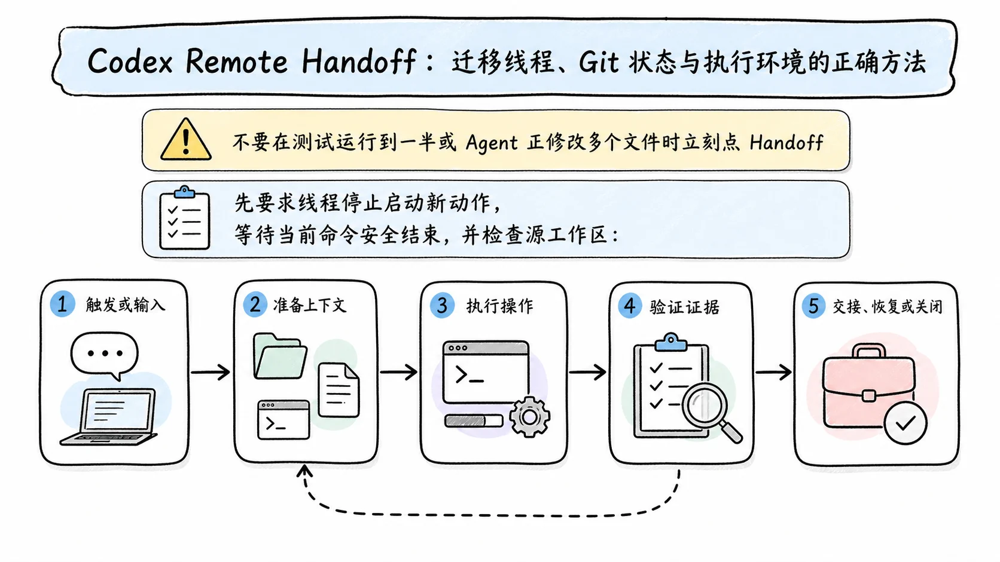
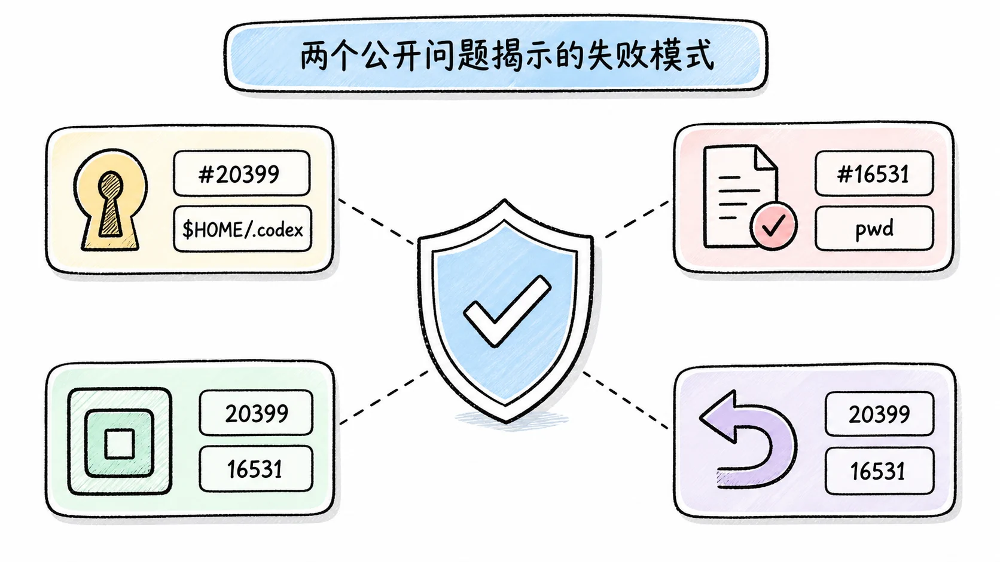
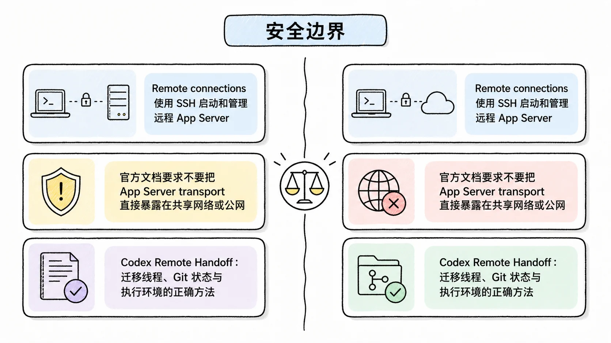

# Codex Remote Handoff：迁移线程、Git 状态与执行环境的正确方法

## TL;DR

Remote Handoff 会把现有聊天与 Git 状态移到连接的目标 host，并在目标机创建或复用 worktree。目标机必须保存同一 Git 仓库；若项目是仓库子目录，两端还要保存同一子目录。

<!-- wos:illustration codex-engineering/43-remote-handoff/01-infographic-concept-map.webp -->

<!-- /wos:illustration -->

Handoff 不会把目标机变成源机器的镜像。依赖、凭据、环境变量、后台进程、浏览器登录和系统权限仍属于目标 host。官方当前不支持把聊天 handoff 到 Codex cloud，正在运行的响应会先被中断再迁移。

## 读者定位

本文面向在笔记本、桌面工作站、SSH 开发机和移动端之间切换 Codex 任务的中级开发者。你需要会使用 Git、SSH 和 worktree，并能判断哪些运行状态必须重新验证。

资料基线：2026-07-22。Remote Control 已于 2026-06-25 达到 GA；本地与远程 host 之间的 thread handoff 在 2026-06-18 的桌面应用更新中发布。机制来自 OpenAI 官方 Remote connections 文档，问题边界来自官方仓库公开 issue。本文没有在两台真实 host 之间执行交接。

## 先把三种「远程」分开

Remote Control 让手机或另一台受支持设备控制正在运行 ChatGPT 桌面应用的 host。工作仍在那台 host 上执行，手机负责查看进度、回复问题和审批。

<!-- wos:illustration codex-engineering/43-remote-handoff/02-timeline-lifecycle-timeline.webp -->

<!-- /wos:illustration -->

SSH project 让桌面应用通过 SSH 启动远程 Codex App Server，直接使用远程机器的文件、依赖、权限和计算资源。

Handoff 则改变一个聊天的运行位置。它迁移聊天和 Git 状态，将线程从本机交给已连接的 remote host，或从远程带回本机。

这三者组合起来很方便，也容易误解。手机打开远程任务不等于迁移任务。桌面连接 SSH 项目不等于复制本地工作树。只有执行 Handoff 后，那个聊天的 host 才改变。

## Handoff 的数据路径

源 host 上有聊天、仓库路径、分支、Git diff 和当前执行状态。目标 host 上必须先存在同一仓库对应的 saved project。Codex 只显示匹配项目的目标位置。

<!-- wos:illustration codex-engineering/43-remote-handoff/03-framework-system-framework.webp -->

<!-- /wos:illustration -->

用户确认目标 host 和 branch 后，Codex 在目标机创建或复用 worktree，传输聊天与 Git 状态，再把聊天切换到目标 host。若线程正在回答，Handoff 会中断当前响应后再迁移。目标机随后用自己的登录 shell、Codex 安装、凭据、plugin、Browser、Computer Use 和本地工具继续工作。

这里的「Git 状态」不能外推成任意外部状态。未提交文件与分支可进入交接流程，正在运行的数据库、Docker volume、下载到仓库外的文件、浏览器 cookie 和系统钥匙串不会因为聊天迁移自动一致。

## 目标 host 的准备

先在本机 SSH 配置中使用具体 alias。官方文档说明，Codex 会读取 `~/.ssh/config` 中的具体 host，并忽略只有通配符的条目。

```sshconfig
Host devbox
  HostName devbox.example.com
  User you
  IdentityFile ~/.ssh/id_ed25519
```

确认普通 SSH 可用，再检查远程登录 shell 能找到 Codex：

```bash
ssh devbox
command -v codex
codex --version
```

然后在 ChatGPT 桌面应用的 Settings > Connections 中添加或启用该 SSH host，并选择远程项目目录。若本地项目保存的是仓库下的 `services/api`，远程也要保存对应子目录，不能一端选仓库根，另一端选子目录。

目标 host 还需要当前任务所需依赖、工具链和认证。Remote 文档明确说明，远程访问使用连接 host 自己的 projects、chats、files、credentials、permissions、plugins、Computer Use、browser setup 和 local tools。缺失的 `gh` 登录、私有 registry 凭据或数据库连接不会随 Handoff 自动补齐。

## 交接前冻结一个可验证状态

不要在测试运行到一半或 Agent 正修改多个文件时立刻点 Handoff。先要求线程停止启动新动作，等待当前命令安全结束，并检查源工作区：

<!-- wos:illustration codex-engineering/43-remote-handoff/04-flowchart-operating-flow.webp -->

<!-- /wos:illustration -->

```bash
git status --short
git branch --show-current
git rev-parse HEAD
git diff --check
```

记录上次已完成的测试命令和退出状态。对未提交改动列出预期文件；对 untracked 文件确认它们属于任务，而不是本机生成的密钥、缓存或大文件。

在聊天 footer 选择当前运行位置，再选目标 host。检查目标与 branch 后执行 Hand off。也可以让另一个聊天代为交接一个有名称的聊天，但发出请求的聊天不能交接自己。

官方文档当前明确排除 Codex cloud 环境作为 Handoff 目标。需要 cloud 任务时，应创建独立 cloud task，并用 commit、patch、issue 或明确 handoff note 传递状态，不能假设原线程会原样进入 cloud。

## 到达目标机后的恢复协议

目标线程打开后先不要继续修改。重新核对工作目录、worktree、分支和 diff：

```bash
pwd
git rev-parse --show-toplevel
git branch --show-current
git rev-parse HEAD
git status --short
git diff --check
```

再检查工具链与依赖版本。项目如果依赖 Node、Python、Java 或容器，运行仓库指定的版本命令和最小 smoke test。源机测试通过不代表目标机同样通过，平台、环境变量和缓存都可能不同。

恢复说明最好回答四件事：目标是什么，源机已经完成什么，目标机必须重验什么，哪个动作需要人工批准。把「上次测试通过」改成带命令和 commit 的证据，例如「在源机 commit `abc1234` 上执行 `./scripts/check.sh all`，退出码为 0；目标机尚未复跑」。

若 Handoff 中断了正在运行的响应，把那次 turn 视为未完成。不要根据半段消息继续实施，先让 Codex 总结已持久化的动作，再读 Git 状态和终端结果。

## 两个公开问题揭示的失败模式

公开 issue `#20399` 报告过多个 SSH host 共享同一网络 HOME 时，项目与线程 host 状态混在一起。报告指出，默认 `$HOME/.codex` 中的 history、session index、SQLite 状态和 archived sessions 被多台机器共同读取，桌面侧可能把项目归到一台 host，却从另一台 host 恢复线程。

<!-- wos:illustration codex-engineering/43-remote-handoff/05-infographic-verification-guardrails.webp -->

<!-- /wos:illustration -->

这是特定共享 HOME 环境的报告，不代表普通 SSH 主机都会遇到。集群、研究机构或 NFS home 场景应为每台 host 使用独立 `CODEX_HOME`，并在连接前核对：

```bash
printf '%s\n' "${CODEX_HOME:-$HOME/.codex}"
hostname
```

公开 issue `#16531` 描述了另一个错位：Agent 自己创建 worktree 后，实际工作目录与桌面线程绑定的 workspace 或 branch 没同步。它提醒开发者，聊天里说「已经切到新 worktree」不够。UI 显示位置、`pwd`、Git 顶层目录和 branch 必须一致。

这些 issue 是用户报告，不是官方稳定性承诺。它们很适合作为验收用例，因为两者都指向同一类风险：线程标识正确，执行 host 或工作树仍可能错误。

## 安全边界

Remote connections 使用 SSH 启动和管理远程 App Server。官方文档要求不要把 App Server transport 直接暴露在共享网络或公网。跨网络访问应使用 VPN 或 mesh network，再通过 SSH 连接。

<!-- wos:illustration codex-engineering/43-remote-handoff/06-comparison-boundary-comparison.webp -->

<!-- /wos:illustration -->

移动 Remote 依赖同一 ChatGPT 账号与 workspace，并使用一对一 QR 配对。宿主机必须开机、联网并运行桌面应用。登出 ChatGPT 会关闭 Remote Control，但不会自动删除已有设备配对；重新登录后要显式开启。

Handoff 迁移后，审批和权限以目标 host 为准。源机允许的应用、浏览器登录和凭据不应被当成目标机已授权。涉及生产、付款、账号管理或密钥时，在目标机重新确认权限。

## 权衡与局限

Handoff 保留聊天连续性和 Git 工作成果，省去手工复制长摘要。代价是目标 host 必须预先保存匹配项目，还要承担 worktree、工具链和凭据校验。

交接活跃线程会中断当前响应。等待一个可安全结束的检查点通常更省时间。跨平台交接还可能暴露大小写、行尾、文件权限和原生依赖差异。

Remote Control 适合离开工位后审批和观察，不能替代稳定宿主机。SSH project 适合把计算放在远程环境，不能假设本地 plugin 与远程一致。Handoff 适合在已准备好的同仓库 host 间继续工作，不适合把不受版本控制的整套开发环境当作可迁移快照。

一次可靠交接的完成标志很朴素：目标 host、仓库根、worktree、branch、HEAD 和 diff 全部对得上，关键验证已在目标机重跑，未迁移的外部状态被明确列出。线程能继续聊天只是开始。

## 延伸阅读

- [OpenAI：Remote connections 与 Handoff](https://learn.chatgpt.com/docs/remote-connections)
- [OpenAI Codex Changelog](https://learn.chatgpt.com/docs/changelog)
- [OpenAI Codex App Server 协议](https://github.com/openai/codex/blob/main/codex-rs/app-server/README.md)
- [OpenAI Codex issue #20399：共享 HOME 的 host 状态错位](https://github.com/openai/codex/issues/20399)
- [OpenAI Codex issue #16531：worktree 与线程 UI 状态不同步](https://github.com/openai/codex/issues/16531)
