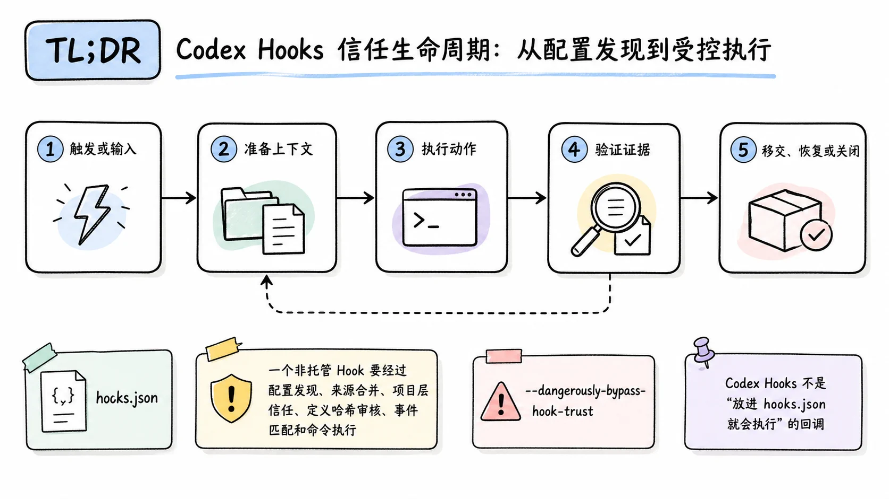
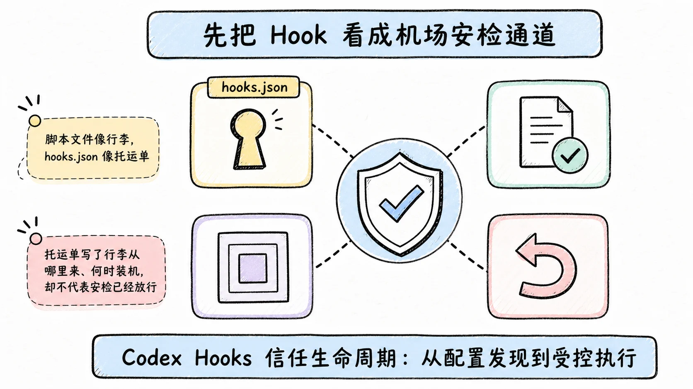
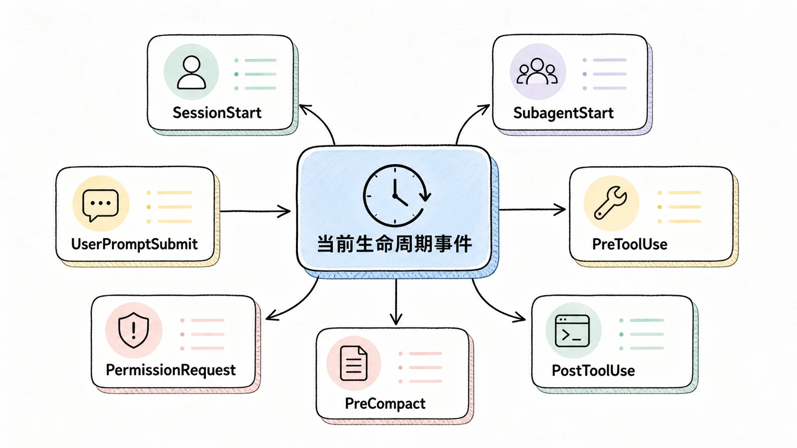
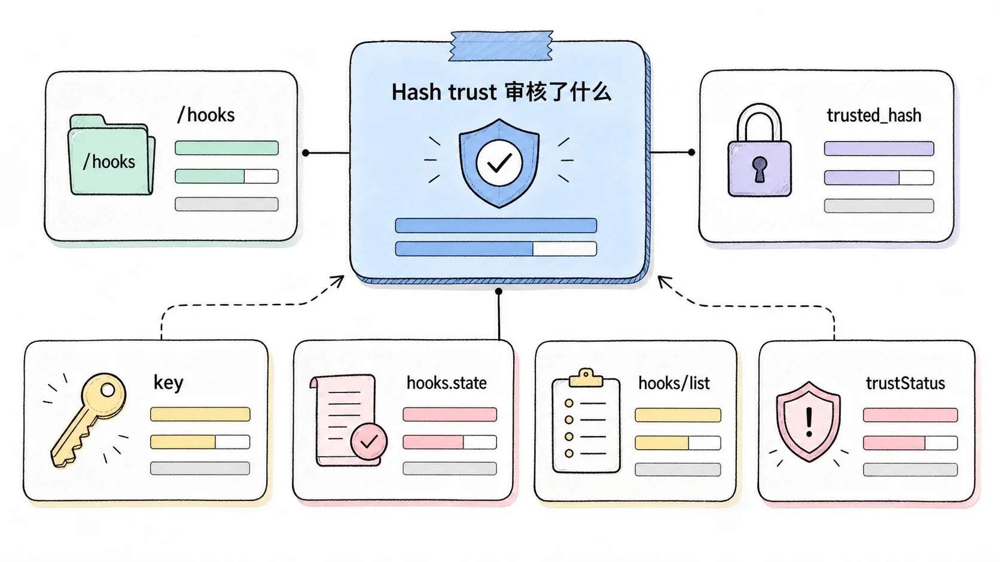
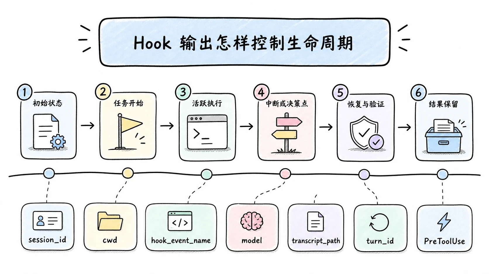
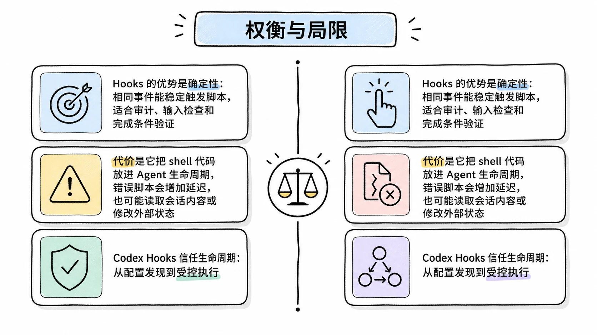

# Codex Hooks 信任生命周期：从配置发现到受控执行

## TL;DR

Codex Hooks 不是“放进 `hooks.json` 就会执行”的回调。一个非托管 Hook 要经过配置发现、来源合并、项目层信任、定义哈希审核、事件匹配和命令执行；定义发生变化后，原有信任失效，Codex 会跳过它，直到用户重新审核。

<!-- wos:illustration codex-engineering/44-hooks-trust-lifecycle/01-flowchart-operating-flow.webp -->

<!-- /wos:illustration -->

团队应把 Hooks 当作可执行供应链管理。项目 Hook 用于版本化约束，管理员 Hook 用于强制策略，`--dangerously-bypass-hook-trust` 只适合已经在 Codex 外部完成来源审核的一次性运行。

## 读者定位与资料边界

本文面向会配置 Codex CLI、能阅读 JSON 和 TOML 的中级开发者，采用深度解析视角。重点是当前事件、信任状态与生命周期控制。

资料基线：2026-07-22。本机命令核对使用 `codex-cli 0.144.5`，npm registry 当日返回 `@openai/codex 0.145.0`。机制来自 OpenAI Hooks 文档、App Server 协议、官方仓库配置说明和公开 issue。本文没有在你的机器上启用任何 Hook，也没有用生产命令验证阻断效果。

## 先把 Hook 看成机场安检通道

脚本文件像行李，`hooks.json` 像托运单。托运单写了行李从哪里来、何时装机，却不代表安检已经放行。Codex 会给当前 Hook 定义计算哈希，用户审核的是这份具体定义。命令、路径、matcher 或位置变化后，哈希或 Hook key 可能变化，系统要求重新审核。

<!-- wos:illustration codex-engineering/44-hooks-trust-lifecycle/02-infographic-verification-guardrails.webp -->

<!-- /wos:illustration -->

一次 Hook 运行经过以下路径：

```text
配置层发现
    |
合并 hooks.json、内联 TOML、Plugin Hooks
    |
项目配置层是否受信任
    |
非托管 Hook 的 currentHash 是否已审核
    |
事件和 matcher 是否命中
    |
并发启动匹配命令
    |
解析退出码、stdout 和 JSON 输出
    |
继续、修改工具输入、阻断、补充上下文或请求继续一轮
```

这个顺序解释了常见误判：配置能被列出，不等于它可运行；信任状态正常，不等于事件发现和 matcher 一定正确。

## 当前生命周期事件

官方文档当前列出 10 个事件：

<!-- wos:illustration codex-engineering/44-hooks-trust-lifecycle/03-framework-system-framework.webp -->

<!-- /wos:illustration -->

| 作用域 | 事件 | 常见用途 |
|---|---|---|
| 线程或子代理启动 | `SessionStart`、`SubagentStart` | 注入仓库上下文，给子代理补充检查规则 |
| 单个 turn | `UserPromptSubmit`、`PreToolUse`、`PermissionRequest`、`PostToolUse` | 检查输入、拦截或改写工具参数、审核权限请求、验证工具结果 |
| 压缩 | `PreCompact`、`PostCompact` | 记录压缩前状态，补回压缩后仍需保留的上下文 |
| 停止 | `SubagentStop`、`Stop` | 验证完成条件，要求代理继续处理未完成项 |

`PreToolUse` 和 `PostToolUse` 覆盖 shell、`exec_command`、`apply_patch`、MCP 工具和多数本地函数工具。托管的 `WebSearch` 等工具不走这条本地 Hook 路径。官方明确提醒，专用工具路径也可能绕开默认 Hook 路径，因此 Tool Hook 是实用护栏，不是完整的强制执行边界。

多个来源中的匹配 Hook 会全部运行。同一事件命中的多个命令 Hook 会并发启动，一个 `PreToolUse` Hook 无法阻止另一个已经匹配并启动的 Hook。依赖严格先后顺序时，应把检查合并到一个脚本，或让前一个步骤写入明确状态并由后续流程读取，不能把数组顺序当事务顺序。

## `hooks.json` 与内联配置

Codex 会在活动配置层旁寻找 `hooks.json`，也会读取 `config.toml` 中的内联 `[hooks]`。最常用的位置是：

```text
~/.codex/hooks.json
~/.codex/config.toml
<repo>/.codex/hooks.json
<repo>/.codex/config.toml
```

同一层同时存在两种表示时，Codex 会合并并发出启动警告。一个配置层选一种形式，审核和排障会容易很多。

下面的项目配置观察 shell 命令，并在 turn 停止时运行完成条件检查：

```json
{
  "description": "Repository lifecycle checks",
  "hooks": {
    "PreToolUse": [
      {
        "matcher": "^Bash$",
        "hooks": [
          {
            "type": "command",
            "command": "/usr/bin/python3 .codex/hooks/check_command.py",
            "timeout": 15,
            "statusMessage": "Checking command policy"
          }
        ]
      }
    ],
    "Stop": [
      {
        "hooks": [
          {
            "type": "command",
            "command": "/usr/bin/python3 .codex/hooks/check_completion.py",
            "timeout": 30
          }
        ]
      }
    ]
  }
}
```

先做 JSON 语法检查，再让 Codex 发现它：

```bash
jq empty .codex/hooks.json
codex
```

进入 CLI 后执行 `/hooks`，核对来源、matcher、命令、启用状态和信任状态。项目本地 Hook 只有在项目 `.codex/` 配置层受信任时才加载；未信任项目仍可加载用户和系统层 Hook。

相同逻辑可以写成内联 TOML：

```toml
[[hooks.PreToolUse]]
matcher = "^Bash$"

[[hooks.PreToolUse.hooks]]
type = "command"
command = "/usr/bin/python3 .codex/hooks/check_command.py"
timeout = 15
statusMessage = "Checking command policy"
```

Hooks 默认启用。关闭时使用当前规范键：

```toml
[features]
hooks = false
```

`codex_hooks` 仍是兼容别名，但已弃用，新配置不要继续复制它。

## Hash trust 审核了什么

非托管命令 Hook 第一次出现时是未信任状态。Codex 根据当前定义计算 `currentHash`，通过 `/hooks` 审核后，把对应 `trusted_hash` 记录到用户控制的 `hooks.state`。后续加载会比较当前哈希与已信任哈希：

<!-- wos:illustration codex-engineering/44-hooks-trust-lifecycle/04-infographic-concept-map.webp -->

<!-- /wos:illustration -->

- 两者相同，Hook 可以运行。
- 没有已信任哈希，状态是首次出现，Hook 被跳过。
- 定义改变，状态变为已变化，Hook 被跳过并要求复审。
- 用户显式禁用，即使哈希受信任也不运行。

App Server 的 `hooks/list` 还会返回 `key`、`currentHash`、`trustStatus`、`sourcePath` 和 `isManaged`。当前 Hook key 带事件、组和处理器的尾部位置选择器，因此在列表中移动 Hook 也可能影响状态。公开 issue `#21615` 记录了本地包装器缺少稳定、受支持的程序化信任申请接口。不要复制私有哈希算法后直接改 `hooks.state`，它会把内部实现细节变成安装器依赖。

一次性自动化可以显式绕过持久信任：

```bash
codex --dangerously-bypass-hook-trust
```

这个参数让本次调用运行已启用 Hook，并显示警告。它不替你审计脚本，也不会把信任保存给后续会话。

## Hook 输出怎样控制生命周期

每个命令 Hook 从标准输入接收一个 JSON 对象，常见字段包括 `session_id`、`cwd`、`hook_event_name`、`model` 和可能存在的 `transcript_path`。Turn 级事件还会提供 `turn_id`。

<!-- wos:illustration codex-engineering/44-hooks-trust-lifecycle/05-timeline-lifecycle-timeline.webp -->

<!-- /wos:illustration -->

`transcript_path` 方便诊断，但官方不把 transcript 格式承诺为稳定接口。需要长期集成时，优先使用 Hook 事件字段或 App Server schema，不要把 JSONL 内部结构写死在策略脚本里。

普通生命周期 Hook 可以在标准输出返回：

```json
{
  "continue": true,
  "stopReason": "",
  "systemMessage": "Policy check passed",
  "suppressOutput": false
}
```

不同事件支持的字段并不完全相同。`PreToolUse` 和 `PermissionRequest` 不支持通用的 `continue`、`stopReason` 与 `suppressOutput`；它们有自己的决策输出。给这两个事件返回不支持字段时，Codex 会把 Hook 标为失败并继续工具调用，这个失败方向很容易被误解为“默认拒绝”。`PostToolUse` 支持 `continue: false` 和 `stopReason`。`Stop` 可以给代理一个继续工作的理由。

模型可见的单条 Hook 输出大约限制为 2,500 tokens。超出部分会写到临时文件，模型只收到头尾预览和文件路径。不要把密钥放进 Hook 输出，因为大输出可能落盘。

## Managed Hooks 把策略所有权移给管理员

管理员可以在 `requirements.toml` 内联声明 Hook，并通过设备管理系统投放脚本：

```toml
allow_managed_hooks_only = true

[features]
hooks = true

[hooks]
managed_dir = "/enterprise/hooks"
windows_managed_dir = 'C:\enterprise\hooks'

[[hooks.PreToolUse]]
matcher = "^Bash$"

[[hooks.PreToolUse.hooks]]
type = "command"
command = "python3 /enterprise/hooks/pre_tool_use_policy.py"
command_windows = 'py -3 C:\enterprise\hooks\pre_tool_use_policy.py'
timeout = 30
```

`allow_managed_hooks_only = true` 只在 `requirements.toml` 生效。它会忽略用户、项目、会话和 Plugin 来源的 Hook，同时保留托管配置层。托管 Hook 由策略信任，用户不能在 Hook 浏览器中关闭。

Codex 不负责把 `/enterprise/hooks` 中的脚本分发到设备。管理员要单独处理安装、更新、文件权限和回滚。策略文件与脚本版本脱节时，配置有效也可能执行失败。

## 权衡与局限

Hooks 的优势是确定性：相同事件能稳定触发脚本，适合审计、输入检查和完成条件验证。代价是它把 shell 代码放进 Agent 生命周期，错误脚本会增加延迟，也可能读取会话内容或修改外部状态。

<!-- wos:illustration codex-engineering/44-hooks-trust-lifecycle/06-comparison-boundary-comparison.webp -->

<!-- /wos:illustration -->

Hash trust 能拦住未经复审的定义变化，却不能证明受信任脚本永远安全。脚本本身若加载未固定依赖、读取可变远端内容或调用另一个可执行文件，顶层命令哈希不等于整条供应链不可变。

项目 Hook 便于团队共享，但每位开发者仍要审核非托管定义。Managed Hooks 消除了个人审核，却把责任集中到管理员发布链。高风险组织应同时限制脚本目录写权限、依赖来源和网络出口，并保留 Hook 运行日志。

## 延伸阅读

- [OpenAI：Hooks](https://learn.chatgpt.com/docs/hooks)
- [OpenAI：Managed configuration](https://learn.chatgpt.com/docs/enterprise/managed-configuration)
- [OpenAI Codex App Server：Hooks API](https://github.com/openai/codex/blob/main/codex-rs/app-server/README.md)
- [OpenAI Codex 配置说明](https://github.com/openai/codex/blob/main/docs/config.md)
- [OpenAI Codex issue #21615：程序化 Hook 信任申请缺口](https://github.com/openai/codex/issues/21615)
