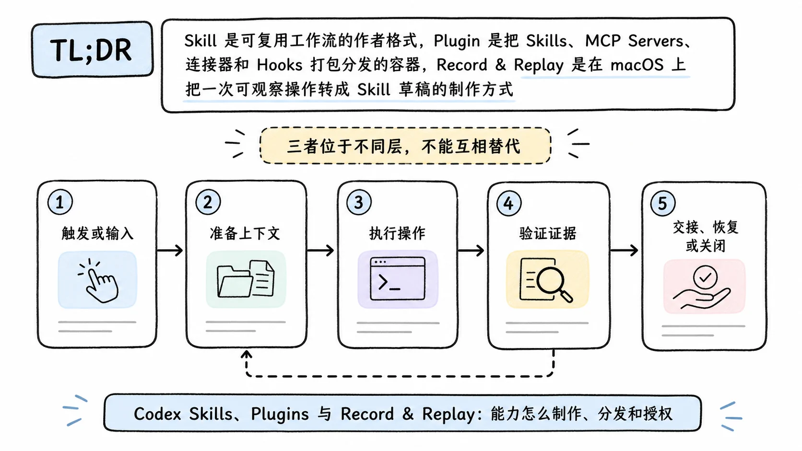
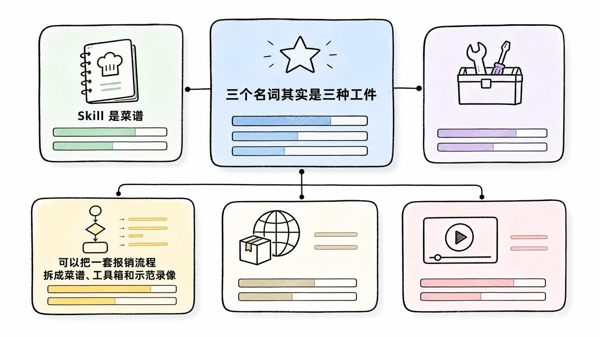
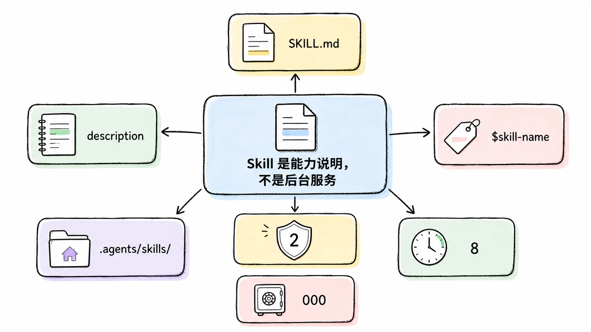
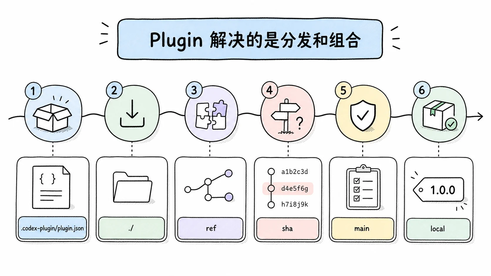
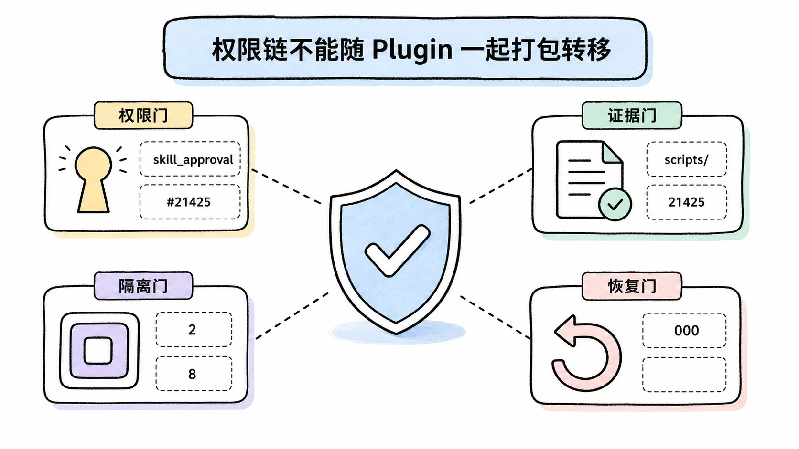
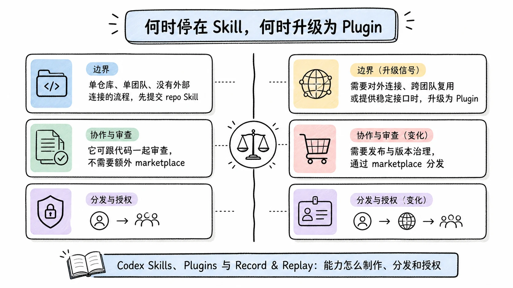

# Codex Skills、Plugins 与 Record & Replay：能力怎么制作、分发和授权

## TL;DR

Skill 是可复用工作流的作者格式，Plugin 是把 Skills、MCP Servers、连接器和 Hooks 打包分发的容器，Record & Replay 是在 macOS 上把一次可观察操作转成 Skill 草稿的制作方式。三者位于不同层，不能互相替代。

<!-- wos:illustration codex-engineering/45-skills-plugins-record-replay/01-flowchart-operating-flow.webp -->

<!-- /wos:illustration -->

最稳的路径是先把流程写成最小 Skill，验证触发条件和结果，再用 Plugin 分发。录制产生的 Skill 仍需人工清理可变输入、隐含偏好和敏感信息；安装 Plugin 也不会自动授予其中 Hook、MCP 或连接器的运行权限。

## 读者定位与证据边界

本文面向已经会使用 Codex CLI 或 ChatGPT 桌面应用，希望把个人流程交给团队复用的中级开发者，采用架构设计视角。

资料基线：2026-07-22。内容来自 OpenAI Build skills、Build plugins、Record & Replay、企业 Skill 和 Plugin 控制文档，以及 `openai/codex` 公开 issue。Record & Replay 的界面流程没有在本文环境中实录，地域和平台限制按官方文档陈述。

## 三个名词其实是三种工件

可以把一套报销流程拆成菜谱、工具箱和示范录像。

<!-- wos:illustration codex-engineering/45-skills-plugins-record-replay/02-infographic-concept-map.webp -->

<!-- /wos:illustration -->

Skill 是菜谱。它写明何时使用、需要哪些输入、按什么步骤执行、怎样判断完成。Skill 可以带脚本、参考资料和模板。

Plugin 是工具箱。它有清单、版本和安装入口，可以装一个或多个 Skill，也可以带 MCP Server、连接器映射、Hooks 与展示素材。

Record & Replay 是示范录像经过整理后生成菜谱。Codex 观察一次操作，停止录制后分析步骤并起草 Skill。回放时运行的是 Skill 和当前可用工具，不是逐像素重播旧鼠标轨迹。

```text
手写流程 ───────────────┐
                        v
                  Skill 目录
                        |
现场演示 -> Record & Replay
                        |
                 验证触发与结果
                        |
                        v
                 Plugin 分发包
             /          |          \
         Skills      MCP/Apps      Hooks
```

这张图里，录制和打包都没有改变运行时安全边界。工具是否能访问文件、网络和外部系统，仍由当前客户端、沙箱、审批和外部身份决定。

## Skill 是能力说明，不是后台服务

一个 Skill 至少是带 `SKILL.md` 的目录：

<!-- wos:illustration codex-engineering/45-skills-plugins-record-replay/03-framework-system-framework.webp -->

<!-- /wos:illustration -->

```text
release-check/
├── SKILL.md
├── scripts/
│   └── collect.sh
├── references/
│   └── checklist.md
└── assets/
    └── report-template.md
```

最小 `SKILL.md` 如下：

```markdown
---
name: release-check
description: Check a release candidate before tagging. Use for release readiness, changelog, build, test, and artifact checks. Do not use for deployment.
---

Read references/checklist.md.
Collect repository state with scripts/collect.sh.
Report failed checks with the exact command and output boundary.
Do not create a tag or deploy.
```

Codex 采用渐进披露。会话开始时只把 Skill 的名称、描述和路径放进上下文，决定使用后才完整读取 `SKILL.md`。初始 Skill 列表最多占模型上下文的 2%，上下文大小未知时上限是 8,000 个字符。Skill 太多时，Codex 先缩短描述，仍放不下就可能省略一部分并发出警告。

这个机制让 `description` 兼任路由索引。描述若只写“帮助发布”，隐式触发会很不稳定。应把适用任务、关键触发词和排除范围放在开头。显式调用可在 CLI 或 IDE 中通过 `$skill-name` 完成，隐式调用则取决于任务与描述的匹配。

仓库 Skill 可以放在从当前目录到仓库根目录路径上的 `.agents/skills/`。用户、管理员和系统也有各自来源。同名 Skill 不会合并，选择器可能同时显示多个同名项，因此团队应避免靠同名覆盖表达优先级。

## Plugin 解决的是分发和组合

一个 Plugin 的必需入口是 `.codex-plugin/plugin.json`。其他能力位于 Plugin 根目录：

<!-- wos:illustration codex-engineering/45-skills-plugins-record-replay/04-timeline-lifecycle-timeline.webp -->

<!-- /wos:illustration -->

```text
release-toolkit/
├── .codex-plugin/
│   └── plugin.json
├── skills/
│   └── release-check/
│       └── SKILL.md
├── hooks/
│   └── hooks.json
├── .mcp.json
├── .app.json
└── assets/
```

最小清单只分发一个 Skill：

```json
{
  "name": "release-toolkit",
  "version": "1.0.0",
  "description": "Release readiness workflows",
  "skills": "./skills/"
}
```

加入其他组件时，路径必须以 `./` 开头、相对 Plugin 根目录解析，并留在根目录内：

```json
{
  "name": "release-toolkit",
  "version": "1.1.0",
  "description": "Release readiness workflows and repository checks",
  "skills": "./skills/",
  "mcpServers": "./.mcp.json",
  "apps": "./.app.json",
  "hooks": "./hooks/hooks.json"
}
```

Plugin 可以通过 repo 或个人 marketplace 分发。CLI 提供来源管理命令：

```bash
codex plugin marketplace add owner/repo --ref main
codex plugin marketplace list
codex plugin marketplace upgrade marketplace-name
codex plugin marketplace remove marketplace-name
```

Git 来源支持 `ref` 或 `sha` 选择器。团队分发应固定提交 SHA 或受控发布标签，避免 marketplace 每次刷新都把未审核的 `main` 直接带入开发机。npm 来源不会运行生命周期脚本，但包内容仍需审计。

桌面应用把已安装 Plugin 缓存到：

```text
~/.codex/plugins/cache/<marketplace>/<plugin>/<version>/
```

本地 Plugin 的版本目录是 `local`，应用从缓存副本加载，不从 marketplace 指向的源目录直接运行。修改源目录后看不到变化时，先检查缓存和刷新流程，不要把旧副本误判为 Skill 自动发现失败。

## Record & Replay 生成的是草稿

截至资料基线，Record & Replay 仅在 macOS 可用，首批可用地区不包括欧洲经济区、英国和瑞士，并要求 Computer Use 可用且已启用。管理员在 `requirements.toml` 中把 `[features].computer_use` 设为 `false` 时，录制入口也会消失。

录制流程是：用户说明目标和可变输入，批准录制权限，完成一次短而完整的操作，主动停止录制。Codex 随后检查捕获到的工作流，起草包含输入、步骤和验收方式的 Skill。

回放时，用户在新任务中提供本次变化的值，例如日期、上传文件或 issue 内容。Codex读取生成的 Skill，再调用当前环境中的 Computer Use、浏览器或已安装 Plugin。窗口布局、网页字段或权限状态变化后，回放可能需要调整；它不是确定性的 GUI 宏。

录制前要清掉真实密钥、会话 token、客户数据和个人消息。官方建议使用真实形态的输入，但明确要求避免秘密与敏感数据。录制期间 Codex 会观察完成任务所需的操作和窗口内容，直到用户停止。

停止后至少检查四类内容：

1. 哪些值每次都会变化，是否已经变成明确输入。
2. 命名习惯、默认字段和分支条件是否写进 Skill。
3. 验收步骤能否判断结果，而不是只判断按钮被点击。
4. 录制中无关的清理操作是否被误收进流程。

## 权限链不能随 Plugin 一起打包转移

Plugin 安装只说明这个包在当前表面可用，不代表包内能力全部获准。

<!-- wos:illustration codex-engineering/45-skills-plugins-record-replay/05-infographic-verification-guardrails.webp -->

<!-- /wos:illustration -->

安装或启用 Plugin 不会自动信任其中的 Hook。Plugin Hook 是非托管 Hook，当前定义必须经过用户审核；管理员若需要强制 Hook，应使用托管配置。

Plugin 中的 MCP Server 有独立的启用、工具 allowlist 和审批模式。连接器还要经过工作区可用性、连接器权限、外部服务授权和当前运行时权限。外部账号能读什么，最终由该账号在源系统里的权限决定。

Skill 自带脚本也不是纯文本。脚本执行仍受沙箱和审批控制，细粒度审批策略中还有单独的 `skill_approval` 类别。审阅 Skill 时不能只看正文，要连同 `scripts/`、依赖下载、环境变量读取和输出位置一起检查。

官方公开 issue `#21425` 报告过启用多个 Plugin 后，Skill 元数据挤占固定初始预算的问题。它与官方 2% 或 8,000 字符预算机制一致，但该 issue 是用户报告，本文没有复现。实务上应减少重叠 Skill，压缩描述，并确认启动警告中有没有 Skill 被省略。

## 何时停在 Skill，何时升级为 Plugin

单仓库、单团队、没有外部连接的流程，先提交 repo Skill。它可跟代码一起审查，不需要额外 marketplace。

<!-- wos:illustration codex-engineering/45-skills-plugins-record-replay/06-comparison-boundary-comparison.webp -->

<!-- /wos:illustration -->

需要跨仓库安装、组合多个 Skill、附带 MCP 或连接器、维护版本和展示信息时，再做 Plugin。Plugin 增加了发布、缓存、权限和升级管理，只有分发收益超过这些维护成本时才划算。

一次操作很难用文字描述，但操作者能稳定完成时，可以用 Record & Replay 起草。流程本身还在频繁变化，或演示必须经过敏感页面时，直接手写 Skill 更容易控制信息边界。

## 权衡与局限

Skill 的自然语言步骤容易随工具界面和项目结构漂移。脚本能提高确定性，也扩大供应链与执行风险。两者需要版本控制和周期性回放检查。

Plugin 提供统一分发，却没有统一授权。包越丰富，管理员需要维护的控制面越多。把连接器、MCP、Hook 和 Skill 一次性塞进包，会让使用者很难判断安装后究竟增加了什么能力。

Record & Replay 降低了起草成本，不会自动找出所有隐藏规则。示范中没有出现的异常分支、权限失败和回滚路径，生成的 Skill 未必知道。发布前仍要用无敏感数据的小任务验证，并明确哪些界面和结果没有复现。

## 延伸阅读

- [OpenAI：Build skills](https://learn.chatgpt.com/docs/build-skills)
- [OpenAI：Build plugins](https://learn.chatgpt.com/docs/build-plugins)
- [OpenAI：Record & Replay](https://learn.chatgpt.com/docs/extend/record-and-replay)
- [OpenAI：Skill controls](https://learn.chatgpt.com/docs/enterprise/skills)
- [OpenAI：Plugin controls](https://learn.chatgpt.com/docs/enterprise/apps-and-connectors)
