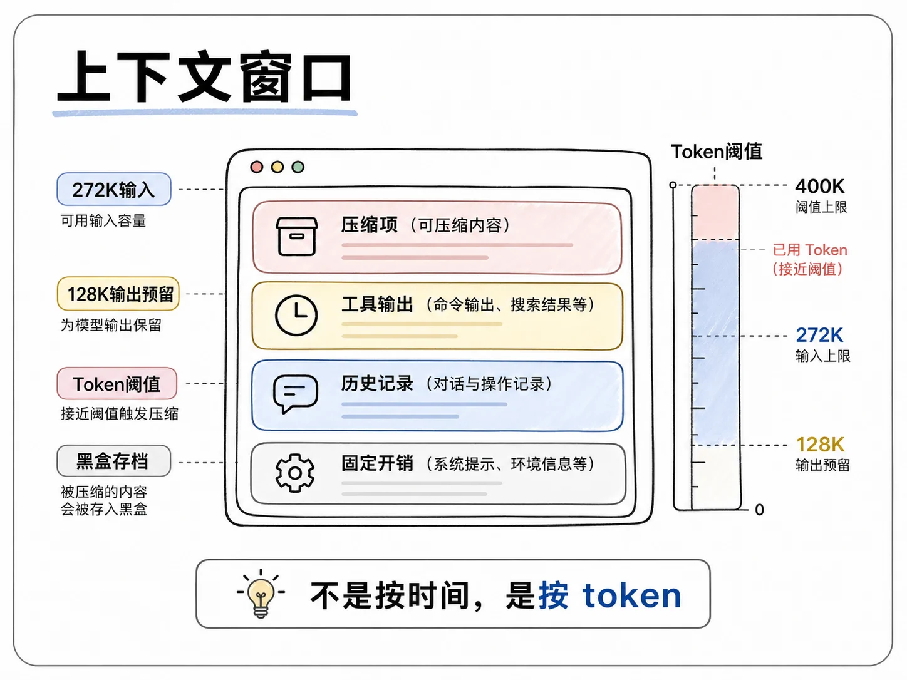
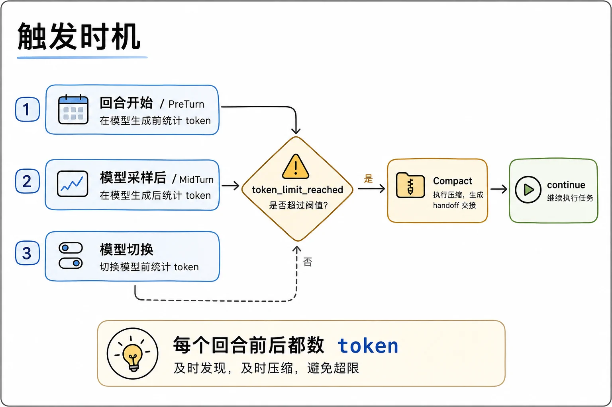
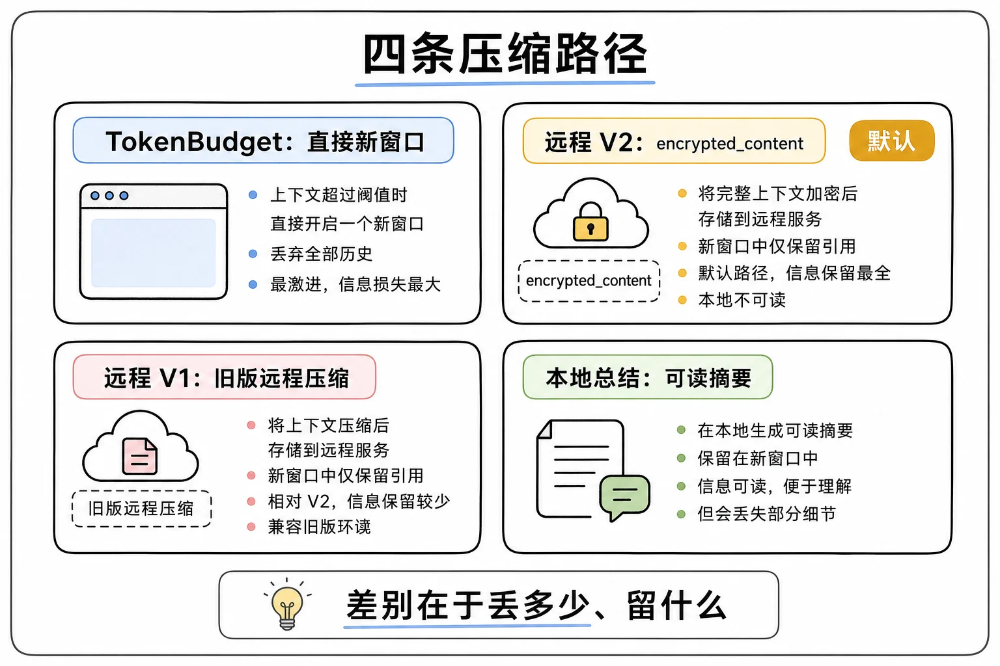
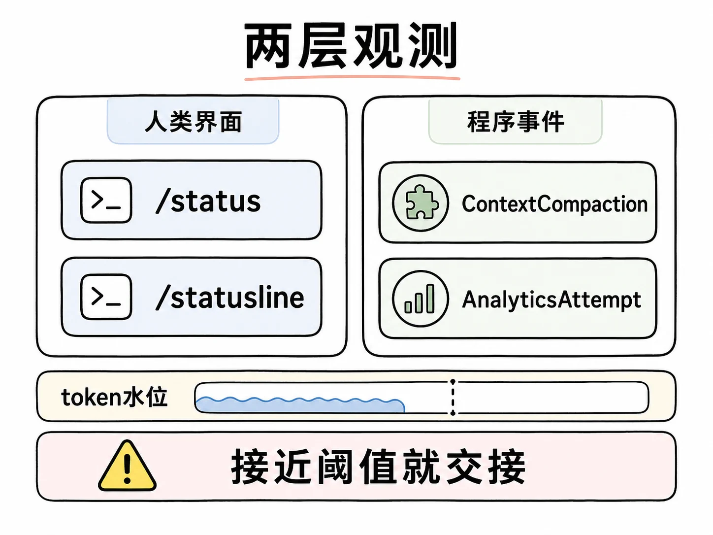
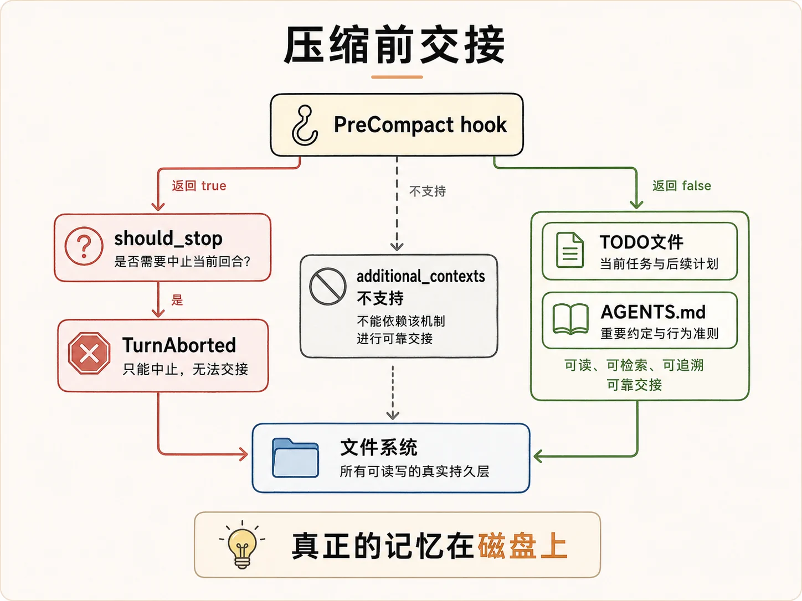
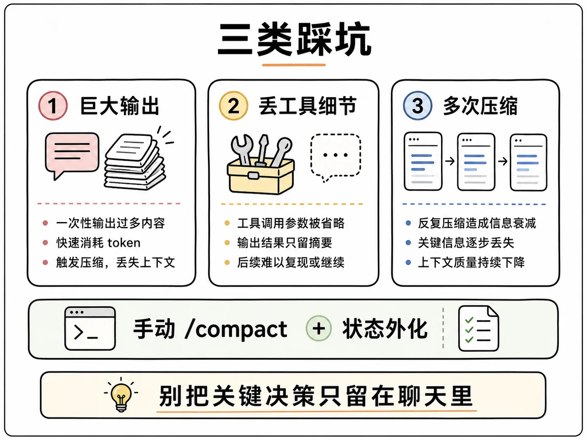

# Codex 上下文压缩：什么时候压、怎么压、怎么在压缩前交接

<!-- codex:cover ../../../assets/ai-coding-engineering-illustrations/codex-engineering/50-codex-context-compaction/00-cover-context-compaction.webp -->

<!-- /codex:cover -->

## TL;DR

Codex 的上下文窗口有硬上限，压缩按 token 用量触发，不是按时间。压缩有四条代码路径，走 OpenAI 官方 API 的 Codex 模型默认走服务端 `/responses/compact`，返回一个客户端不解密的黑盒存档。运行时靠每个回合前后数 token 判断该不该压。外部用 `/status`、`/statusline` 或 SDK 的 ContextCompaction 事件观测。想在压缩前交接任务，最稳的办法不是拦截压缩，是把状态写进文件。

<!-- wos:illustration codex-engineering/50-codex-context-compaction/01-framework-context-window.webp -->

<!-- /wos:illustration -->

## 读者定位

本文面向用 Codex 跑长任务、撞过上下文撞墙或压缩后模型失忆的中级开发者。你需要大致了解 token、上下文窗口和 AGENTS.md，不需要读过 Rust 源码。

资料基线：2026-07-29。机制来自 `openai/codex` 仓库 main 分支的 Rust 源码（`compact.rs`、`compact_remote_v2.rs`、`compact_token_budget.rs`、`session/context_window.rs`、`session/turn.rs`、`hook_runtime.rs`），问题边界来自公开 issue `#7808` 和 OpenAI 社区报告。本文通过阅读源码和社区资料得出结论，没有在真实环境里逐条复现四条压缩路径。

## 为什么这值得单独讲

用 Codex 跑长任务的人大多撞过同一堵墙：做着做着 TUI 弹出一行红字「Codex ran out of room in the model's context window」，会话直接死掉，连补救的机会都没有（GitHub issue `#7808`）。更多人遇到的是另一种死法：自动压缩触发后，模型突然失忆，前面定好的方案、改到一半的文件全忘了，开始重复劳动。

这两件事是同一个根因的两面：上下文窗口有限，而压缩有损。官方在源码里直接写了一句警告，长对话和多次压缩会让模型准确度下降。所以理解压缩机制的价值不在「知道它存在」，而在知道什么时候它会踩你，以及怎么把踩你的概率压到最低。

网上对 Codex 压缩有两种互相矛盾的说法：一种说压缩用可见的提示词在客户端做，一种说压缩调服务端接口、返回加密 blob 不可读。读完源码会发现，两种都对，因为 Codex 的压缩不是一个机制，是四条代码路径。这是大部分二手资料没讲清的地方。

## 上下文窗口长什么样

先把基础讲清楚，后面所有机制都建立在这上面。

Codex 没有真正的记忆。每生成一步，它都要把之前发生的所有事重新发给模型一遍。这个包叫上下文窗口，有硬上限。以当前 GPT-5.6 系列为例，`models.json` 里 `context_window = 272000`，再叠加服务端为输出预留的约 128000 token，整体封顶在 400000 左右。能真正拿来装输入的，扣掉系统提示、工具定义、AGENTS.md 这些固定开销后，大概二十六七万 token。

每多走一步，窗口就胀一点：读过的文件、跑过的命令输出、模型的推理过程，全往里塞。胀到阈值，压缩就来了。

## Codex 怎么知道该压缩了

这是第一个被多数博客讲模糊的问题。答案是按 token 用量判断，每个回合前后各检查一次，没有任何计时器。

<!-- wos:illustration codex-engineering/50-codex-context-compaction/02-flowchart-trigger-timing.webp -->

<!-- /wos:illustration -->

源码里核心是一个布尔值 `token_limit_reached`，在 `session/context_window.rs` 里算出来。它为真，只要满足下面任一条件：

1. 已用的作用域 token 超过缓冲后的阈值：`auto_compact_scope_tokens >= buffered_auto_compact_limit`
2. 撞到模型硬上限：`active_context_tokens >= full_context_window_limit`

其中 `buffered_auto_compact_limit = auto_compact_scope_limit + fallback_buffer_tokens`，而 `auto_compact_scope_limit` 就是你能在 `config.toml` 里配的 `model_auto_compact_token_limit`，按模型给默认值。

检查发生在两个时机，都在 `session/turn.rs`：

- 回合开始前，`run_pre_sampling_compact` 先数一遍 token，超了就以 `ContextLimit` 原因、`PreTurn` 阶段触发压缩。
- 回合进行中，每完成一次模型采样再数一遍。如果 `should_roll_over = needs_follow_up && (新窗口请求 || token_limit_reached)` 为真，就以 `MidTurn` 阶段触发压缩，压缩完 `continue` 继续循环，不退出。

还有第三处：切换到上下文窗口更小的模型时（`maybe_run_previous_model_inline_compact`），会检查旧模型用量是否已超新模型阈值，超了就先压一道再切。

这里有个容易踩的细节。`AutoCompactTokenLimitScope` 有两档：`Total` 把整个窗口的 token 都算进阈值；`BodyAfterPrefix` 只算「上次压缩留下的摘要之后」新增的 token。后者是为了防一种自激 bug：刚压完，摘要本身就占一大块 token，要是按 `Total` 算，可能立刻又触发压缩，陷入死循环。`BodyAfterPrefix` 把基线重置到压缩后的状态，给后续对话留出干净预算。

## 压缩的四条路径

这是整篇最关键、也最容易被讲错的地方。Codex 的压缩不是一个机制，是四条代码路径，由 `run_auto_compact` 按 feature flag 优先级分发：

<!-- wos:illustration codex-engineering/50-codex-context-compaction/03-comparison-four-paths.webp -->

<!-- /wos:illustration -->

| 优先级 | 路径 | 文件 | 做了什么 |
|--------|------|------|----------|
| 1 | TokenBudget 重置 | `compact_token_budget.rs` | 不总结，直接 `start_new_context_window()`，只带 WorldState |
| 2 | 远程压缩 V2 | `compact_remote_v2.rs` | 调服务端 `/responses/compact`，拿回黑盒存档 |
| 3 | 远程压缩 V1 | `compact_remote.rs` | 同上的旧版本 |
| 4 | 本地总结 | `compact.rs` | 客户端拼提示词，模型生成文字摘要 |

走 OpenAI 官方 API 的 Codex 模型，默认命中第 2 条。下面分别说。

**本地总结（兜底路径）。** `compact.rs` 的逻辑是：把一段固定的总结提示词追加到当前历史末尾，整段发给模型，模型回一段摘要；然后用摘要拼出新历史，前面加上 `SUMMARY_PREFIX`（告诉新模型「这是另一个模型留下的思考过程摘要，别重复劳动」），再加上最近若干条用户消息。最近消息有预算上限，常量 `COMPACT_USER_MESSAGE_MAX_TOKENS = 20000`，超出就倒序截断。这段提示词在源码里明文可见：`You are performing a CONTEXT CHECKPOINT COMPACTION. Create a handoff summary for another LLM that will resume the task.`

**远程压缩 V2（默认路径）。** `compact_remote_v2.rs` 调用 `/responses/compact` 端点。服务端返回一个 `ResponseItem::Compaction { encrypted_content }`，客户端原样存下来、从不解密，下次请求再原样发回去。新历史由两部分拼成：按 64000 token 预算（`RETAINED_MESSAGE_TOKEN_BUDGET`）倒序保留的 user/developer/system 消息，加上那个加密的 Compaction 项。

这就是网上「加密 blob」说法的真相。那个 `encrypted_content` 不是加密给你看的，是 OpenAI 把「怎么压缩」的算法锁在自己服务器上。客户端像寄存行李：拿到一张存根，下次凭存根取回完整记忆，但存根上的字你看不懂。远程 V1 是同一思路的旧实现，保留的消息范围和计费细节略有不同。

**TokenBudget 重置（最激进路径）。** `compact_token_budget.rs` 的注释说得很直白：跳过模型和服务端总结，直接装一个全新的上下文窗口。它完全不生成摘要，只调 `sess.start_new_context_window()`，把一个 `WorldState`（文件系统状态、环境信息等）带进新窗口。源码特意说明，它仍然被建模成「压缩」，所以 PreCompact hook 和 ContextCompaction 事件能观察到和别的路径一样的生命周期。远程压缩的重试上限 `MAX_REMOTE_COMPACTION_V2_STREAM_RETRIES = 2`，请求超时是普通回合的 4 倍（`COMPACT_REQUEST_TIMEOUT_IDLE_MULTIPLIER = 4`），因为压缩调用比普通回合慢得多。

四条路径的本质差别，是「丢多少、留什么」。从本地总结（丢最多、留可读摘要）到远程黑盒（中等）再到直接重置（最彻底，只信文件系统）。

## 外部怎么知道压缩发生了

两层观测。

<!-- wos:illustration codex-engineering/50-codex-context-compaction/04-infographic-observability.webp -->

<!-- /wos:illustration -->

人用 TUI 时，`/status` 显示当前 token 用量，`/statusline` 在底部放一个实时计数器，能直观看到窗口还剩多少。这是被动观测，你得自己看。

程序接 SDK 或 app-server 时，走事件流。压缩会发出 `TurnItem::ContextCompaction` 生命周期事件，以及 `CompactionAnalyticsAttempt` 分析事件，后者记录压缩前后的 token 数、耗时、采用的策略（`strategy = Memento`）、实现方式（`implementation = Responses`）、成功还是失败。这意味着你可以在外层包一个监控，统计每次压缩丢了多少 token、多久压一次，用来判断某个任务是不是压得太频繁。

要主动在压缩前预警，没有专门的事件，只能靠轮询 token 用量。接近阈值时由外层程序决定是手动 `/compact`、是交接，还是结束会话。

## 能不能在压缩前交接任务

这是很多人最关心的问题。分三层回答。

<!-- wos:illustration codex-engineering/50-codex-context-compaction/05-flowchart-handoff-boundary.webp -->

<!-- /wos:illustration -->

**第一层：能不能拦住压缩？能，但代价是回合中止。** `hook_runtime.rs` 里，压缩前会跑 `run_pre_compact_hooks`，构造一个 `PreCompactRequest`（带 session ID、turn ID、触发标签 `manual` 或 `auto`）。任一 PreCompact hook 返回 `should_stop = true`，函数就返回 `Stopped`，调用方拿到后抛 `CodexErr::TurnAborted`。压缩是被拦下了，但当前回合也停了，你拿到的是一个中止的会话，不是一份优雅的交接。

**第二层：能不能用 hook 塞一份交接摘要进去？不能。** 这是关键限制。SessionStart 和 UserPromptSubmit 这类 hook 可以返回 `additional_contexts`，会被当成 developer message 注入。但 PreCompact 的返回结构只看 `should_stop` 和 `hook_events`，不支持注入额外上下文。所以「拦下来顺便交接」这条路在 hook 层走不通。

**第三层：那真正的交接机制是什么？是文件系统。** 回到 TokenBudget 重置这条路径，最激进的压缩直接清空窗口、只带 WorldState。WorldState 就是文件系统状态、AGENTS.md 这些持久信息。这等于在说：Codex 跨压缩的真正记忆，从来不是上下文窗口里的对话，而是磁盘上的文件。把进度写进代码注释、写进 AGENTS.md、写进一个 TODO 文件，比任何 hook 拦截都可靠，因为它在最坏情况下（窗口彻底重置）也活得下来。

围绕这个核心，有几条实操做法：

- **在逻辑断点手动 `/compact`，别等自动触发。** 自动压缩发生在 token 最紧张、对话最混乱的时刻，压出来的摘要质量最差。完成一个子任务、改完一个文件后主动压一次，上下文最干净。社区里 strategic-compact 的做法就是这个思路：在完成一个任务或一轮文件编辑后主动压，而不是等到 95% 上下文时被动触发。
- **调高 `model_auto_compact_token_limit` 延后触发。** 它可配，调到接近模型硬上限能给长任务争取更多空间，代价是更接近撞墙风险。
- **用 `BodyAfterPrefix` scope 避免自激。** 压缩后不立刻二次触发。
- **把关键决策写进 AGENTS.md 或 TODO 文件。** 这是唯一在任何压缩路径下都有效的「交接」。压缩前不必做任何事，因为状态本来就在文件里。

## 真实踩坑

社区和 issue 里反复出现的几个问题，源码层面都能解释。

<!-- wos:illustration codex-engineering/50-codex-context-compaction/06-infographic-pitfalls-guardrails.webp -->

<!-- /wos:illustration -->

**自动压缩有时不触发，直接撞墙 fatal。** OpenAI 社区有帖子报「Codex Still Runs Out of Context Window」，说即使设了较大上下文也很快耗尽。原因是 `token_limit_reached` 的判断依赖每次采样后重新计算 token 用量，如果某一步的工具输出异常巨大（比如一次读了超大文件），可能一步就从安全区跳过阈值直接撞硬上限，压缩来不及插进 MidTurn 检查。

**压缩后模型失忆、重复劳动。** 远程 V2 只保留 user/developer/system 消息，丢掉 assistant 回复和工具调用细节。如果关键决策只存在于被丢掉的 assistant 消息里，压缩后就找不回来。这就是为什么把决策写进用户消息或文件很重要。

**多次压缩累积降智。** 官方警告明写在源码里。每次压缩都有损，连压几次后模型对早期上下文的理解会层层衰减。

## 权衡与局限

理解了机制，几个权衡就清楚了。

压缩本身是必要的。没有它，长任务根本跑不完。问题从来不是「要不要压缩」，而是「压在什么时候、由谁压」。

远程黑盒压缩省了客户端算力、质量通常比本地总结好（服务端有专门优化），代价是你无法审查压缩过程、无法干预它保留了什么。本地总结可读可控，但质量取决于模型当时的发挥，且占一次完整的模型调用。

把阈值调高能延后压缩，但越延后，撞硬上限 fatal 的风险越大。手动 `/compact` 质量最好，但需要人盯着节奏。文件系统交接最稳，但要求你有意识地把状态外化，这本身是纪律。

## 延伸阅读

- [openai/codex 源码：compact.rs](https://github.com/openai/codex/blob/main/codex-rs/core/src/compact.rs)（本地总结式压缩）
- [openai/codex 源码：compact_remote_v2.rs](https://github.com/openai/codex/blob/main/codex-rs/core/src/compact_remote_v2.rs)（远程 `/responses/compact` 压缩）
- [openai/codex 源码：compact_token_budget.rs](https://github.com/openai/codex/blob/main/codex-rs/core/src/compact_token_budget.rs)（TokenBudget 重置压缩）
- [Compaction | OpenAI API Docs](https://developers.openai.com/api/docs/guides/compaction)（服务端压缩官方说明）
- [Context Compaction in Codex, Claude Code and OpenCode](https://justin3go.com/en/posts/2026/04/09-context-compaction-in-codex-claude-code-and-opencode)（源码级横向对比）
- [GitHub issue #7808：撞墙 fatal 的原始报告](https://github.com/openai/codex/issues/7808)
- [Codex 工程化实战系列：Thread History、Memory 与迁移导入](./39-thread-history-memory-import.md)
- [Codex 工程化实战系列：Remote Handoff](./43-remote-handoff.md)
