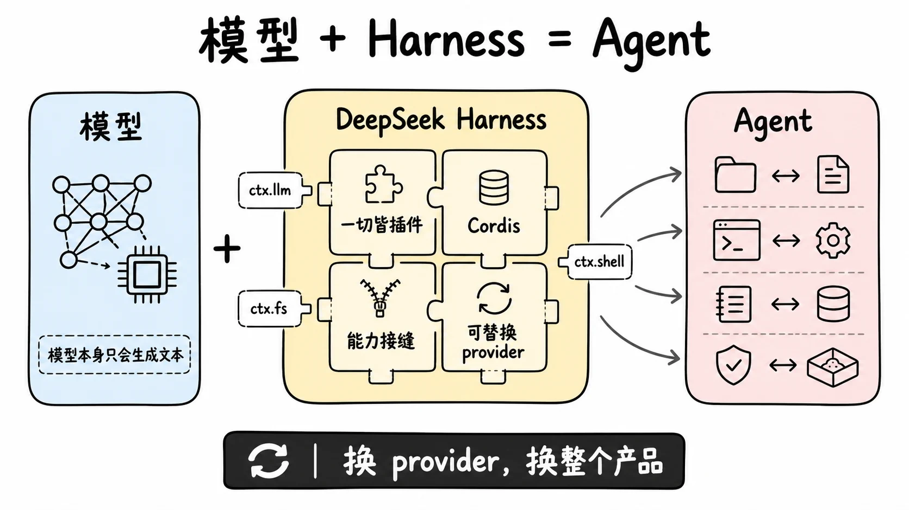
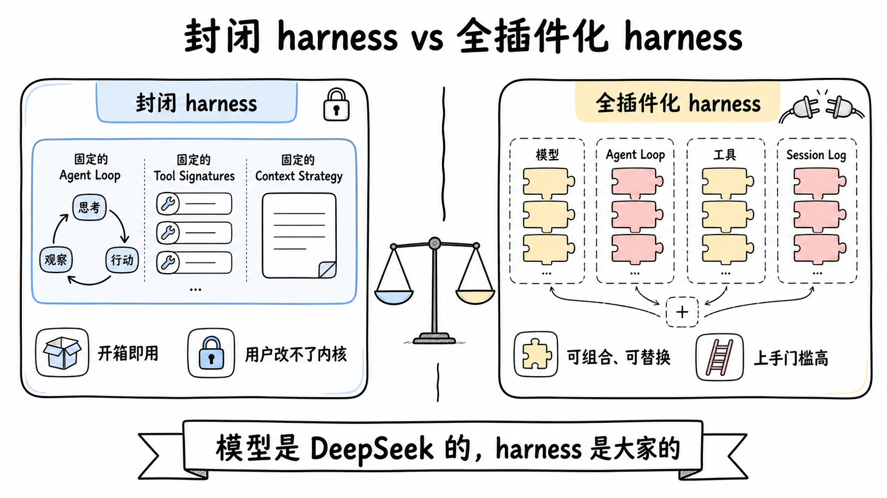
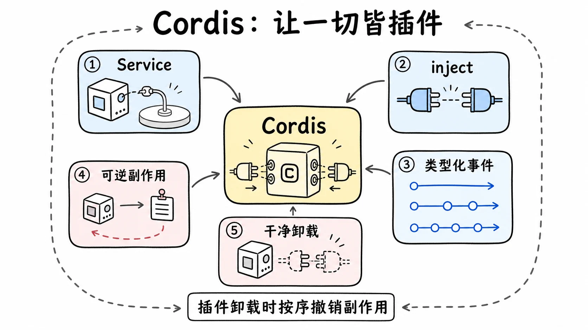
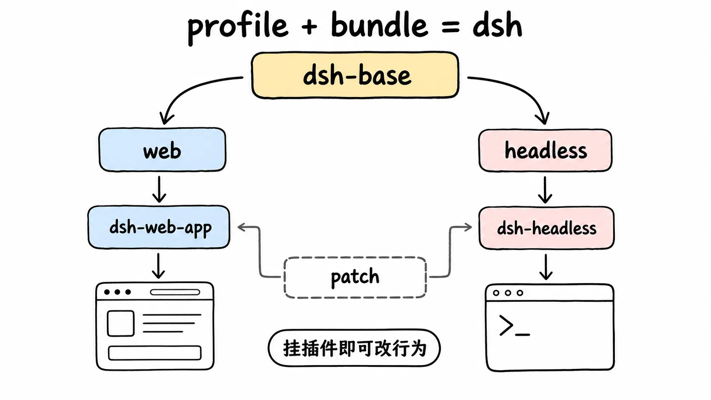
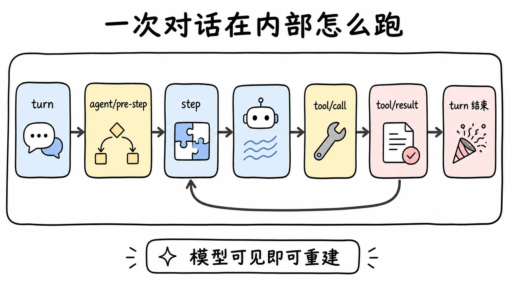
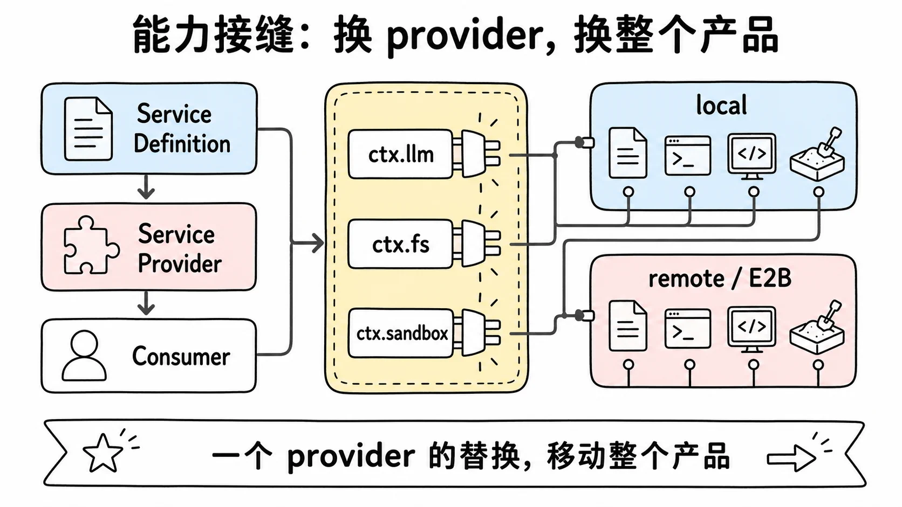

# 模型 + Harness = Agent：DeepSeek Harness 是什么

> DeepSeek Harness（`dsh`）不是又一个 AI 编程客户端，而是一个把"模型之外的一切"都做成可替换插件的开源 agent harness。
> 这一篇不讲 harness 学科通论（那在 [harness-engineering 系列](../harness-engineering/01-what-is-harness-engineering.md)），只回答：`dsh` 这个具体项目是什么、它为什么长这样



## 先把坐标定准

`dsh` 是 [DeepSeek AI](https://deepseek.com) 开源的 agent harness，MIT 许可，命令行入口 `dsh`，npm 包 `@deepseek-ai/dsh`。官方将它标记为 _developer preview_，README 顶部明确提示会有破坏兼容性的改动（THERE WILL BE COMPATIBILITY-BREAKING CHANGES）。

它官方的自我描述只有一句：

> An open-source agent harness developed by DeepSeek AI. It uses an architecture where **everything is a plugin**, and is powered by [Cordis](https://github.com/cordiverse/cordis).

社区和媒体普遍把它解读为对标 Claude Code、Cursor、Manus 这一层的产品。这个解读有道理，但不精确——`dsh` 的形态和这三者并不完全同类（后面会讲）。更准确的说法是：**它是 DeepSeek 把"模型 + Harness = Agent"这个公式里，"Harness"那一半开源出来。**

## Model + Harness = Agent，再一次

如果你还没建立这个心智模型，先去读本仓库的 [harness-engineering/01](../harness-engineering/01-what-is-harness-engineering.md)，那里把它讲透了。这里只复述结论：

> 裸的 LLM 只会做一件事——给它文本，它续写文本。让它能读文件、跑代码、记住前几步、判断"做完没有"的，全是 harness 加的。模型是 CPU，harness 是操作系统。买再好的 CPU，装个烂系统也跑不动。

最有力的证据来自 SWE-agent 的 ACI 论文：[同一个模型，换一套 harness 接口设计，SWE-bench 分数天差地别](https://arxiv.org/abs/2405.15793)；mini-swe-agent 用约 100 行 Python 就逼近几万行系统的表现。这不是模型更聪明，是 harness 设计得更干净。

这个公式对 DeepSeek 尤其成立。DeepSeek 有自己的强模型（DeepSeek-V3、R1 推理系列），但模型本身不会自动变成一个能进仓库干活的 agent。要让自家模型在 coding agent 场景里有原生载体——就像 Anthropic 之于 Claude Code、OpenAI 之于 Codex——DeepSeek 需要补上 harness 这一环。`dsh` 就是这一环。

那么问题来了：既然 Claude Code、Cursor、Codex 已经把 coding agent 做得很成熟，DeepSeek 为什么还要再造一个，而且要开源？

## 为什么是开源，为什么是"全插件化"

这两个问题其实是一个问题。答案藏在 `dsh` 最显眼的设计决策里：**一切皆插件（everything is a plugin）**。

先看它"不锁"什么。`dsh` 的模型适配是一个叫 `ctx.llm` 的接缝（seam），官方实现了三个 provider：`llm-deepseek`（DeepSeek 自家模型）、`llm-pi-ai`（另一个提供商）、`llm-replay`（测试用回放）。但因为是接缝，你可以挂任何 OpenAI 兼容的模型适配器上去。换句话说，**`dsh` 不强制你用 DeepSeek 模型**。

这和 Claude Code 形成鲜明对比。Claude Code 的 agent loop、工具签名、context 压缩策略是 Anthropic 写死的 [inner harness](../harness-engineering/01-what-is-harness-engineering.md)——你只能用 Claude 模型，只能等厂商更新。`dsh` 反过来：连 agent loop 本身、工具注册表、会话日志都是一个可替换插件，挂载一个插件就扩展能力，卸载时所有注册按序撤销。

这里的取舍是：

- **封闭 harness**（Claude Code、Cursor）追求开箱即用、体验一致，代价是用户改不了内核，只能在外层（CLAUDE.md、skills、hooks）做 outer harness。
- **全插件化 harness**（`dsh`）追求可组合、可替换、可二次开发，代价是上手门槛高、复杂度暴露给用户。

DeepSeek 选后者，是一个生态判断：**与其做一个锁死自家模型的封闭产品，不如做一个谁都能往里塞 provider 的开放 harness，让生态替它补全能力。** 这也是为什么 `dsh` 的 README 第一句强调的不是"DeepSeek 模型的客户端"，而是"open-source agent harness"。模型是 DeepSeek 的，harness 是大家的。



这套"一切皆插件"能成立，靠的是一个底层框架——Cordis。

## Cordis：让"一切皆插件"不只是口号

大多数"插件化"项目，最后都退化成"有一个核心，加一些插件"。`dsh` 没有"那个核心"。它的架构文档原话是：

> There is no privileged core to patch: you extend dsh by mounting a plugin beside the others.

能做到这一点，是因为底层 Cordis 提供了一套别的插件框架没有的东西。Cordis 来自 [Koishi](https://koishi.chat) 生态（一个同样是"全插件化"的聊天机器人框架），它的设计思想写在一篇论文里——[《A Programming Paradigm for Spatiotemporal Composability》](https://github.com/cordiverse/paper)（一种面向时空可组合性的编程范式）。

"时空可组合性"听起来很玄，落到工程上就一句话：**插件之间的组合不应该依赖于加载顺序，也不应该在卸载时留下垃圾。** Cordis 用五件事实现它（这里只点名，03 篇展开）：

1. 插件是一个实现 `Service` 的对象，把自己的能力注册到共享 context 上（如 `ctx.tools`、`ctx.llm`）。
2. 插件用 `inject` 声明依赖，Cordis 等依赖就位才激活——加载顺序由需求决定，不用手写 boot 序列。
3. 插件之间用**类型化事件**通信，有 `emit`/`waterfall`/`parallel`/`serial` 四种派发模式。
4. **注册是可逆副作用**：注册一个工具、一段 prompt、一个监听器，都是 `ctx.effect()` 或 `ctx.on()` 产生的副作用，插件卸载时按序撤销。
5. 因为第 4 点，"换掉某个子系统"不是改源码，而是卸载旧插件、挂载新插件，运行时上下文干净。

第 4 条是灵魂。它解释了为什么 `dsh` 敢说"换一个 provider 等于换了整个产品"——因为 provider 是一个可干净撤销的注册，不是焊死在代码里的 import。Cordis 的细节（特别是 waterfall 这种"around 中间件"语义）是理解整个项目的钥匙，我们用 03 一篇专门讲它。这里你只需要记住：**Cordis 让"一切皆插件"从口号变成了一个有运行时保证的工程事实。**



## 一个跑起来的 dsh 长什么样

光讲理念容易悬空，给个具体的形状。`dsh` 启动时，会从一个叫 **profile** 的命名组合里，按顺序叠若干层 **bundle**，拼出一棵插件树。两个模板：

- `web` profile：起一个 Web UI（默认 `http://127.0.0.1:3080`），带浏览器界面。
- `headless` profile：一次性 runner，不开 server，接一个任务跑完输出。

第一层永远是一个叫 `dsh-base` 的 bundle，它装的是所有 profile 都要的东西：模型适配器、工具注册表、会话持久化、沙箱和审批策略、settings、credentials、telemetry。往上叠 `dsh-web-app` 就有了浏览器应用，叠 `dsh-headless` 就有了无界面的 runner。

关键是：**这些层之间是用 patch 叠加的，每一层都能改写或替换下面那层注册的任何一行配置。** 想看你的机器实际启动了什么，跑一句 `dsh --profile web --dump-config`，它打印出来的每一行配置，都能被你自己的 patch 替换掉。这就是"没有特权核心"的实际含义——你不用 fork 源码，挂一个插件就能改行为。这部分在 03（概念）和 06（源码导读）篇展开。



## 一次对话在内部怎么跑

这是整个系列要拆的"心脏"，这里先给个最小版本，让你有个预期。

`dsh` 里有两个时间单位：

- **step**：一次模型请求，加上模型在这一步里调用的工具。
- **turn**：零个或多个 step 组成的一轮对话。它在你提交第一条输入时打开，在"什么都不欠"时关闭。

一个 turn 的骨架是这样的（11 是事件系统专篇，这里只看流程）：

```
turn 开始
  取出待处理的输入
  → agent/pre-step（一道 waterfall 关卡，决定模型这一步看到什么）
  step 开始
  组装系统提示 + 工具 schema
  → 请求模型 → 流式返回
  → 模型如果调了工具：tool/call → 工具执行管线 → tool/result
  step 结束
  如果工具结果还需要模型再想一步 → 取下一条输入 → 下一个 step
turn 结束
```



注意几个反常识的点（后面专篇讲）：

- **"模型可见即可重建"是硬规矩**。任何到达模型请求的东西，都必须能从会话日志重建出来，运行时还有断言盯着。这就是为什么你想给模型塞一段新上下文，不能随便塞——得先产生一个新的 session event，再从日志投影出来。
- **没有面向模型的"compact"工具**。上下文太长时，压缩不是模型自己决定的，而是由 `agent/pre-step` 探到的压力和 `agent/request-error` 报的溢出触发的——一个被动的事件驱动机制，而不是模型主动调用。
- **工具调用要走七层关卡**。从 `tools/pre-execute`（钩子/权限/沙箱）到单调守卫、审批、执行、`tools/post-execute`、normalize、`finalizeContent`，最后才产出一条 `tool/result`。策略和机制在这里被刻意分离。

这些设计每个都值得单开一篇，也是 `dsh` 区别于"写死的 agent"的具体证据。

## 能力接缝：换一个 provider，换整个产品

如果说 Cordis 是"一切皆插件"的机制，那么**能力接缝（capability seam）**就是这套机制最重要的应用。这是整个系列最值钱的一个概念（12 篇专讲）。

一个接缝有三个角色：

- **Service Definition**：声明一个能力接口（如"文件系统读写"）。
- **Service Provider**：实现这个接口（如 `fs-local` 本地实现、`fs-sandbox` 沙箱实现、`fs-e2b` 远程实现）。
- **Consumer**：使用这个能力，通常是模型面向的工具。

`dsh` 有几十个这样的接缝：`ctx.llm`（模型）、`ctx.fs`（文件系统）、`ctx.shell`（命令执行）、`ctx.subprocess`（子进程）、`ctx.sandbox`（沙箱）、`ctx.web`（联网）、`ctx.lsp`（语言服务器）、`ctx.subagents`（子 agent）……

接缝的威力在于：**文件系统和子进程共享同一个"执行世界"**。当你把 `ctx.fs` 和 `ctx.subprocess` 都指向一个远程 E2B 沙箱，那么 Bash、PTY、LSP 全都跟着搬过去了，不需要为远程执行单独写一套 provider 分支。一个 provider 的替换，移动了整个产品。

这就是 `dsh` 设计哲学的内核：**不写死任何一个能力，而是为每个能力设计一个可替换的接缝。** 代价是抽象层多、调试链长（48 篇会讲这个代价）；回报是从"一个产品"变成"一族可组合的产品"。



## 仓库地图：42 篇要拆的东西

`dsh` 仓库是一个 pnpm monorepo，`packages/` 下有 50 多个子包。给张极简地图，好让你知道 42 篇在拆什么：

| 层 | 代表包 | 干什么 |
|---|---|---|
| 核心 spine | `session` / `system-prompt` / `tools` / `agent` / `agent-loop` / `scope` | 会话日志、提示组装、工具注册表、agent 接口与驱动 |
| 模型 | `llm` / `llm-deepseek` / `llm-pi-ai` | stream 契约与各 provider 适配 |
| 执行 | `fs` / `shell` / `subprocess` / `terminal` / `lsp` / `code-runtime` | 文件、命令、终端、语言服务器、代码执行 |
| 安全 | `sandbox` / `approval` / `permission-presets` | 沙箱、审批、权限预设 |
| 上下文 | `compaction` / `token-meter` / `spill` / `session-query` | 压缩、计量、溢出、跨会话检索 |
| 协作 | `subagent` / `jobs` / `workflow` / `goal` / `plan-mode` | 子 agent、后台任务、工作流、目标与计划 |
| 接入 | `web` / `skill` / `mcp` / `acp` | 联网、技能、MCP、ACP 协议 |
| 组合 | `boot` / `bundle` / `preset` | 启动装配、bundle 分发、预设 |

每个有独立设计的子系统，本系列都对应一篇（概念）或两篇（概念 + 源码导读）。这不是凑数——`dsh` 的价值恰恰在于这些子系统各自的设计，而不在于"它是一个 agent"这个事实。

## 这套系列怎么读

| 你是 | 建议路径 |
|---|---|
| 想搞懂架构的工程师 | 主干 9 篇：01-03、07、09、11、12、13、48（见 README 阅读路径） |
| 想二次开发 / 写插件 | 主干 + 源码导读（06、09、14、16）+ 18（写适配器） |
| 想上生产 | 主干 + 19（安全）、35-36（配置与可观测）、42（容错） |
| 只想横向对比选型 | 01 + 12（接缝）+ 48（横评与哲学） |

一个提醒：**03（Cordis）是硬门槛。** 跳过它们直接读后面的源码导读，大概率会卡在"为什么注册一个函数就能扩展能力，卸载还能自动撤销"上。Cordis 是这套架构的地基，先把它过掉。

## 延伸阅读

- [DeepSeek Harness 官方仓库](https://github.com/deepseek-ai/deepseek-harness)
- [官方架构文档](https://github.com/deepseek-ai/deepseek-harness/blob/master/docs/architecture.md)
- [Cordis 框架](https://github.com/cordiverse/cordis) / [时空可组合性论文](https://github.com/cordiverse/paper)
- [Harness Engineering 是什么](../harness-engineering/01-what-is-harness-engineering.md) —— `Agent = Model + Harness` 的学科通论，本文前置
- [SWE-agent: Agent-Computer Interfaces](https://arxiv.org/abs/2405.15793) —— "换 harness 接口，分数天差地别"的实证

下一篇：[从 0 跑起来：first run 全流程](./02-first-run-web-ui.md)
