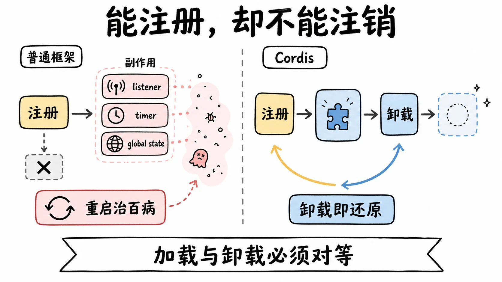
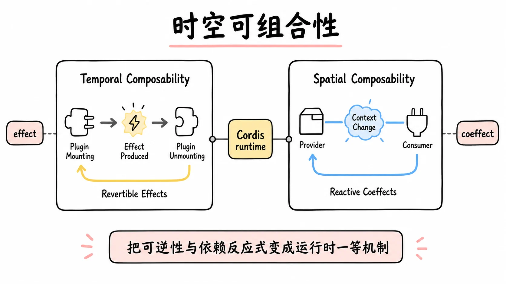
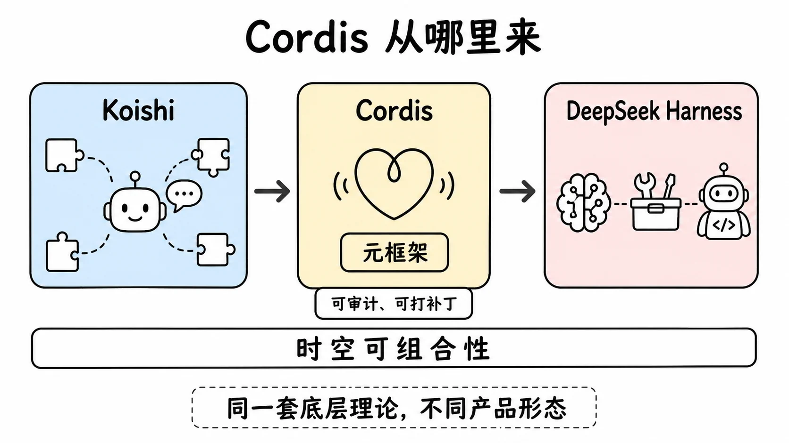
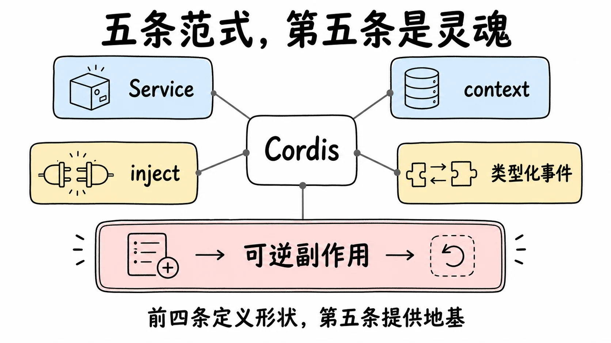
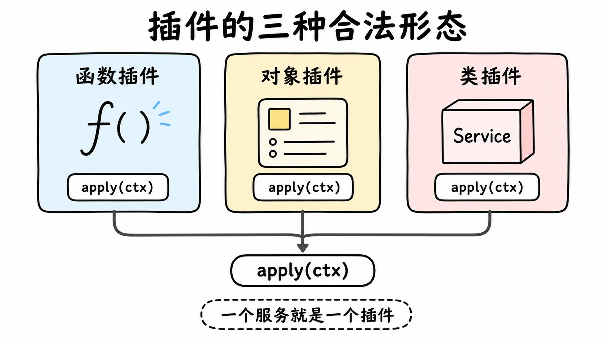
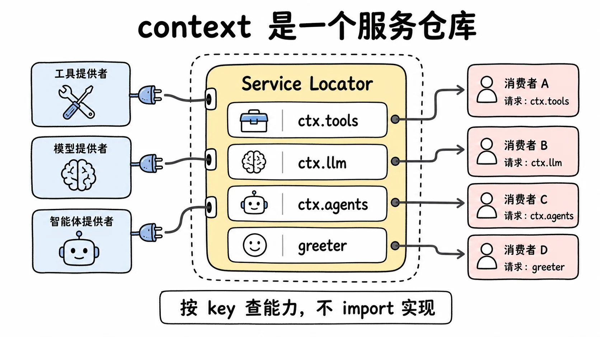
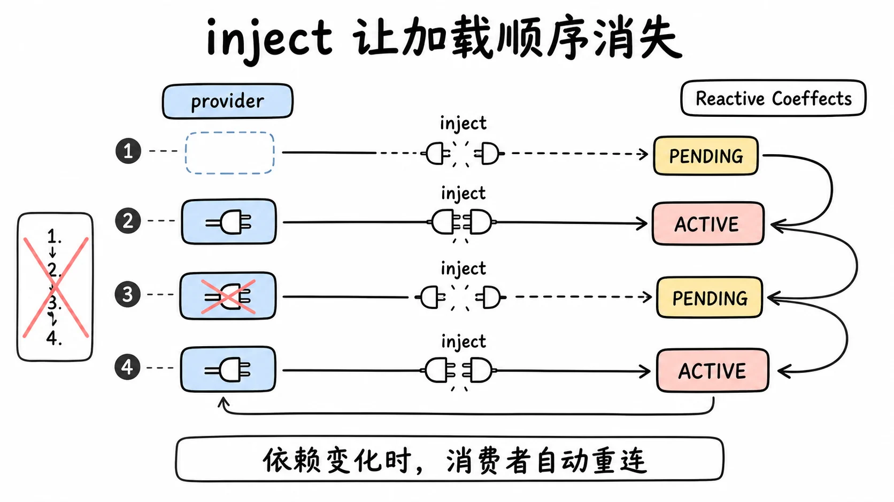
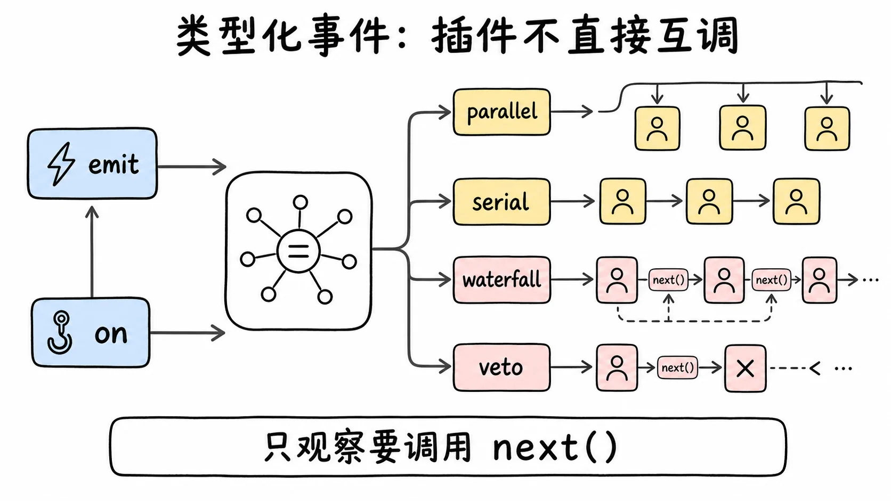
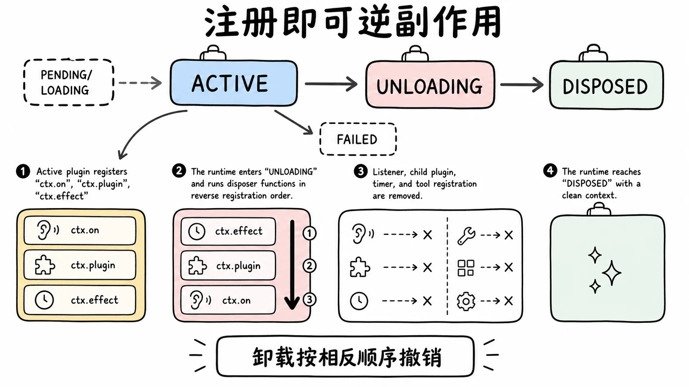
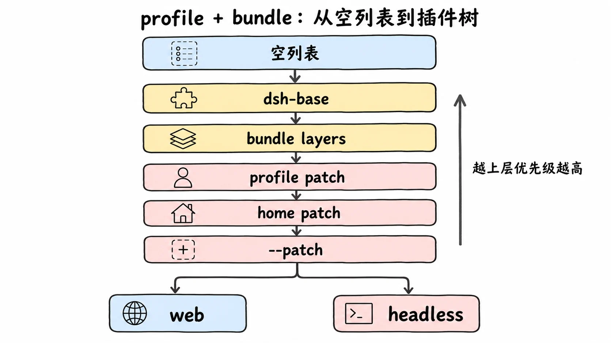

# 从一篇论文到一棵插件树：Cordis 怎么撑起 DeepSeek Harness 的"一切皆插件"

> DeepSeek Harness 那句"一切皆插件、卸载即还原"，不是产品文案，而是一个叫 Cordis 的框架用可逆副作用机制保证出来的工程事实。
> 这一篇把三件事讲成一条线：Cordis 要解决的"老问题"是什么，论文的两条主张怎么落地成五条工程范式，一个跑起来的 dsh 又怎么靠 profile 和 bundle 的叠层规则，从一张空列表拼成一棵插件树。这里讲机制本身，不逐行走启动源码。

## 一个老问题：能注册，却不能注销

写过后端的人都干过一件事：往框架里注册一个东西。往 Express 注册一个中间件、往 Koa 注册一个中间件、往 Webpack 注册一个 loader、往 Vue 注册一个全局组件。注册很容易，一行代码。

然后问题来了：你想把它取消掉，怎么做？

大多数框架不告诉你。你可以 `app.use(middleware)`，但没有一个对称的 `app.unuse(middleware)`。Koa 不告诉你怎么取消一个中间件，Vue 不告诉你怎么卸载一个全局组件。这不是疏忽，是设计：这些框架假设注册是一次性的、在启动时完成的，运行时不需要撤销。

Koishi（一个全插件化的跨平台聊天机器人框架）的作者 Shigma 把这件事叫作现代软件的一次退步。他在框架设计文档里写得很直白：低层语言里，一个资源被分配出来，往往伴随一个显式的回收方式（文件描述符要 close，内存要 free）；而到了高层框架，资源被抽象掉了，回收方式也被抽象掉了。一个插件起了一个监听端口、改了全局状态、注册了若干回调，这些副作用散落在各处，框架不替你记，也不替你还。

代价是具体的：想换掉某个子系统？重启整个应用。想热更新一个插件？做不到。插件装多了卸不掉，内存和状态像滚雪球。开发者只能"重启治百病"。

多数后端服务能忍这个缺陷，因为插件装好就不动了。agent harness 恰好忍不了，因为它和普通后端服务最大的不同在于：它会自己改自己。模型在运行时决定装一个 skill、挂一个 MCP server、起一个子 agent、换一个执行环境。这不是部署时由人配好的静态插件集，而是运行时动态演化、随时可能增删的插件集。

这种场景对插件系统提出了最严苛的要求，拆开看是三条：动态增删是常态，不是边缘情况，普通框架"装一次用到底"的假设在这里彻底破产；替换要原子，把执行环境从本地切到远程沙箱，要保证换的过程中没有半成品状态；卸载要干净，一个临时挂上的能力用完要能彻底撤掉，不能污染后续的会话。

这三条，恰好是"时间可组合性"承诺的东西，下一节就讲。一个做不到可逆副作用的框架塞给 agent 用，要么禁止 agent 动态改自己（阉割能力），要么在一次次增删后状态越来越脏（埋雷）。

Cordis 就是为解决这个问题生的。它的目标用一句话讲：让"加载一个插件"和"卸载一个插件"成为对等的、可逆的操作。不只是能装，还要能干净地拆。



## 理论：两个编译期概念，搬进运行时

Cordis 的设计思想写在一篇论文里，标题是《A Programming Paradigm for Spatiotemporal Composability》（一种面向时空可组合性的编程范式），托管在 [cordiverse/paper](https://github.com/cordiverse/paper) 仓库。论文开头点出了一个矛盾：现代软件越来越依赖动态组合（论文原话用到了 "self-evolving agent harnesses" 这个词），但这件事的形式化基础一直没建立起来。换句话说，大家都在写插件框架，却没有一套像样的理论说清"什么样的插件框架是对的"。

论文的核心主张，是把程序语言理论里两个成熟概念从编译期搬到运行期：

- **effect（副作用）**：一段计算对环境做了什么。比如改了状态、做了 IO、注册了回调。effect 系统负责追踪一个函数可能产生哪些副作用。
- **coeffect（协副作用）**：一段计算需要环境提供什么。比如要读某个上下文变量、依赖某个服务就位。coeffect 系统负责追踪一个函数需要哪些先决条件。

传统的插件框架只处理了一半：它们让你注册副作用（effect），但副作用没有"逆"，卸载就漏；它们让你声明依赖（coeffect），但往往是静态的、一次性的，运行时一变就乱。

论文的提案是把这两个维度都变成运行时的一等机制，并给它起两个名字：

> **Temporal Composability（时间可组合性）**：the ability to completely revert a component's side effects upon removal.（移除一个组件时，能完全撤销它的副作用。）
>
> **Spatial Composability（空间可组合性）**：the ability to declare and reactively manage inter-component dependencies.（声明组件间依赖，并对依赖变化做出反应。）

用大白话翻译这两个词，"时间"和"空间"对应的是两个工程直觉。时间维度关心生命周期：一个组件装上去做了很多事，拆下来时这些事能不能逐件还回去。像 git 的 revert，像撕一张不留胶的贴纸，而不是拆一面承重墙。空间维度关心依赖接线：一堆组件怎么找到彼此、怎么按需连上，而且不依赖加载顺序。像拼图，先放哪块后放哪块都能拼上，因为每块都声明了自己要卡在哪。

论文还给了两条机制定义：

> **Revertible Effects（可逆副作用）**：every context transformation carries an inverse that the runtime tracks.（每一次对上下文的改动，都自带一个被运行时追踪的逆操作。）
>
> **Reactive Coeffects（反应式协副作用）**：each change of the context notifies a component against its coeffect specification.（上下文一变，就按组件声明的需求通知它。）

这两条就是 Cordis 全部的理论内核，后面所有的 API、所有的"魔法"，都是在落地这两句话。

时间维度的数学直觉来自群。群的定义里有一条，每个元素都要有一个逆元，元素和它的逆元组合起来等于单位元。把这个直觉搬到插件系统：你做了一个操作，就要能做一个等价的反向操作，两个操作叠起来等于"什么都没发生"。

这就引出一个很硬的保证，Koishi 文档叫它路径无关：不管你以什么顺序加载和卸载插件，最终系统的行为只取决于"当前还启用着哪些插件"，和操作的历史路径无关。它意味着：热更新不是黑魔法，只是"卸载旧版 + 加载新版"；换掉一个子系统不是改源码，只是"卸载旧的 provider + 挂载新的 provider"；测试一个插件不需要重启进程，装上跑、拆掉就行。DeepSeek Harness 敢把"换一个 provider 等于换了整个产品"写进架构文档，底气就在这里。

把两个维度合起来，Cordis 想兑现的承诺是：你可以把任意一堆插件以任意顺序装上去、拆下来、换掉，系统永远只反映"当前装着什么"，不残留、不混乱、不需要重启。这就是"时空可组合性"的工程含义。



## Cordis 的来历：从 Koishi 里抽出来的元框架

理论有了，实现从哪来？答案是 Koishi。

Koishi（[koishi.chat](https://koishi.chat)）是 Shigma 主导的全插件化聊天机器人框架，插件生态上千。前面讲的那些设计，最早都是在 Koishi 里打磨成型的，在几千个真实插件的负载下跑了多年。

Cordis 是把 Koishi 插件系统里那套和聊天机器人无关的、纯框架层的东西抽出来，独立成一个项目。它的官方定位写得很清楚：A Meta-Framework of Spatiotemporal Composability，"元框架"。元框架的意思是"造框架的框架"：Koishi 是用 Cordis 造出来的机器人框架，DeepSeek Harness 是用 Cordis 造出来的 agent harness。底层同一套时空可组合性理论，上层是完全不同的两个产品形态。

名字也值得说一句。Cordis 是拉丁语的"心"。一个叫"心"的框架，做的是给整个产品当承重的心肌：所有插件挂在它上面跳动，它保证每一次收缩（加载）都有一次舒张（卸载）。

Cordis 的代码托管在 [cordiverse](https://github.com/cordiverse/cordis) 组织下。官方仓库将 API 标注为尚未稳定，配套论文标注为 "coming soon"。这是个还在快速演化的基础设施，用它要接受这条前提。

DeepSeek Harness 对 Cordis 的态度也很说明问题：它没有把 Cordis 当成一个 npm 依赖，而是把 Cordis 及其基础库（cosmokit、schemastery）整套源码内嵌进自己的 monorepo。它的 vendor 文档原话是：内嵌是为了"让 harness 完全拥有自己的框架层（可审计、可打补丁、固定版本）"。内嵌进来的包全部改名为 `@deepseek-ai` 作用域（`cordis` 变成 `@deepseek-ai/cordis`，版本钉在 4.0.0-rc.7）。

这意味着两件事。第一，DeepSeek 把 Cordis 当地基，不希望它被上游一个 breaking change 推翻，所以钉死版本、自己审、自己补。第二，他们真的在往 Cordis 里打补丁。vendor 文档记录了十几处本地修改，其中一处是在 `cordis/src/fiber.ts`（fiber 是 Cordis 管理插件生命周期的核心数据结构，范式五会展开）里补上三个重入销毁的缺口。换句话说，DeepSeek 在用 agent 这个最严苛的场景，反过来帮 Cordis 把可逆性的边界条件磨硬。

这是一个良性循环：Cordis 给了 DeepSeek Harness "一切皆插件"的工程保证，DeepSeek Harness 用 agent 的极端场景反过来给 Cordis 提真实的 bug 和硬化补丁。



## 工程：五条范式，第五条是灵魂

理论怎么变成 API？先给一个 Koishi 文档里的比喻热身：context 是"副作用的插座"。一个插件想干任何有副作用的事，都不能直接去碰全局，而是去 `ctx` 上"插电"：注册监听器用 `ctx.on(event, listener)`，注册工具用 `ctx.tools.register(...)`，起定时器用 `ctx.effect()` 包一层。插座记下每一根插上去的线，拔插件的时候逐根拔掉。这个比喻贯穿下面五条。

论文的两个抽象维度（effect / coeffect）落到 DeepSeek Harness 的文档里，被归纳成五条设计范式：

1. 插件是实现 `Service` 的对象。
2. context 是一个服务仓库。
3. 用 `inject` 声明依赖。
4. 用类型化事件通信。
5. 注册是可逆副作用。

先给出五条和论文两轴的对应关系，后面逐条拆：

| 范式 | 对应论文维度 | 一句话 |
|---|---|---|
| 插件是实现了 Service 的对象 | 时间 | 一个插件就是一段可挂载、可卸载的生命周期 |
| context 是服务仓库（`ctx.tools`、`ctx.llm`） | 空间 | 能力按 key 注册和查找，不 import 具体实现 |
| 用 `inject` 声明依赖 | 空间（coeffect） | 依赖决定激活，不由人排启动顺序 |
| 类型化事件，多种派发模式 | 空间 | 插件间用事件通信，不直接互相调用 |
| 注册是可逆副作用（`ctx.effect`/`ctx.on`） | 时间（effect） | 每个注册自带逆操作，卸载按序撤销 |

前四条单独拎出来，业界都不陌生：插件对象、服务定位器、依赖声明、事件总线，在各种框架里反复出现过。Cordis 不是靠这四条创新的，它是靠第五条把它们拧成一股绳。理解这一点很重要：前四条是"形状"，第五条是"地基"。没有第五条，前四条只是又一套 DI 容器；有了第五条，前四条每一条都获得了运行时可撤销、可热替换的能力。下面逐条拆，最后回到第五条讲它凭什么是灵魂。



### 范式一：插件是实现了 Service 的对象

Cordis 的插件有三种合法形态，从最轻到最重，`Service` 和 `Context` 都从 `@deepseek-ai/cordis` 导入：

- **形态一，函数插件，最常见**。导出一个 `apply(ctx: Context)` 函数，函数体里在 `ctx` 上注册你想贡献的一切。
- **形态二，对象插件，带一个 apply 方法**。导出一个对象，比如 `objectPlugin`：它有 `name: 'object-plugin'` 和一个 `apply(ctx: Context)` 方法，apply 做的事和形态一相同。
- **形态三，类插件，继承 `Service`，要暴露能力给别人用时用它**。导出一个继承 `Service` 的类，比如 `MyService`：构造函数拿到 `ctx`，调用 `super(ctx, 'myService')` 完成注册。



三种形态背后是同一个机制：Cordis 加载一个插件时，给它一个 `ctx`（context），插件在 `apply(ctx)` 里声明自己贡献什么。函数形态够用时就用函数，只有当你需要把一个能力作为服务暴露给别的插件时，才升级到 `Service` 子类形态。

和 VSCode 插件对比一下。VSCode 的扩展也是"入口函数 + context"模型：`activate(context: ExtensionContext)`，插件在 activate 里注册命令、视图、监听器，形态上很像。差异在两点：一是 VSCode 扩展的绝大多数贡献是写在 `package.json` 的 `contributes` 字段里、静态声明的，不是在 activate 里程序化注册的；二是 VSCode 没有把这三种形态统一成一个"Service 实现"的概念，扩展和服务是两套东西。Cordis 把"插件"和"服务"统一了：一个服务就是一个插件，一个插件可以是一个服务。

### 范式二：context 是一个服务仓库

插件怎么找到彼此提供的能力？靠 context。

一个服务在被创建时，用一个稳定的 key 把自己注册到 context 上。DeepSeek Harness 里，`ctx.tools`（工具注册表）、`ctx.llm`（模型适配）、`ctx.agents`（agent 注册表）都是这么注册上去的。消费者按 key 取用，不 import 具体实现。以一个打招呼服务为例。运行时这一半：`GreeterService` 继承 `Service`，构造函数拿到 `ctx` 后调 `super(ctx, 'greeter')`，第二个参数 `'greeter'` 就是注册进 context 的 key，能力放在类的方法上，比如 `greet(who: string)` 返回 `Hello, ${who}!`。类型这一半：用 `declare module '@deepseek-ai/cordis'` 声明合并，给 `interface Context` 加一个 `greeter: GreeterService` 字段。

`super(ctx, 'greeter')` 这一行做了两件事：运行时把实例挂到 context 上（之后任何插件都能 `ctx.greeter` 访问），类型层面靠上面那段 `declare module` 让 `ctx.greeter` 在编译期就能过类型检查。这段声明合并不产生代码，删掉它服务照样能在运行时工作，只是消费者失去类型提示。

这一条的本质是服务定位器模式：能力按名字注册，按名字查找，而不是按具体实现 import。好处是配置层可以决定挂哪个 provider，消费者代码一行都不用改。DeepSeek Harness 能让"换一个模型 provider 不用改业务代码"，根就在这里。



服务名是一个扁平的全局命名空间。官方占用了 `tools`、`llm`、`agents`、`fs`、`shell` 这些短名字，自己写的服务得加前缀避免撞名，这也是为什么 Cordis 文档建议第三方插件的服务名带命名空间。

### 范式三：用 inject 声明依赖，让加载顺序消失

传统框架的另一个痼疾是启动顺序。A 插件要用数据库，B 插件提供数据库，那 B 必须先于 A 加载。系统一大，启动顺序就变成一份脆弱的清单：谁先谁后、谁等谁、循环依赖怎么办。改一个插件可能要重排整条启动链。

Cordis 的做法是：别写顺序，写需求。一个需要 `greeter` 服务的消费者插件，导出三个东西：`name = 'consumer'` 是插件名，`inject = ['greeter']` 声明依赖，`apply(ctx)` 是入口。apply 里可以直接写 `ctx.greeter.greet('world')`，因为能进到 apply，就保证 `ctx.greeter` 已经就位。

`inject` 字段声明这个插件需要哪些服务。Cordis 的承诺是：这些服务没全部就位之前，插件一直停在 PENDING 状态，apply 不会执行。一旦 `greeter` 上线，Cordis 才激活消费者。

这条带来的直接后果是：`cordis.yml` 里插件写的先后顺序不影响结果。官方教程里专门演示了这一点：把 provider 和 consumer 两行对调，输出完全一样；把 provider 那行整个删掉，consumer 不会崩溃，只会一直 PENDING，默默不输出（也不占着 Node 事件循环，进程会干净退出）。

到这里，传统 DI 容器（Spring、NestJS、.NET 的 DI）也做得到：声明依赖、容器按拓扑序解析、构造时注入。Cordis 多出来的、也是它真正领先的地方，是依赖在加载之后还在被追踪。教程原话：如果一个被依赖的服务在运行时消失了（provider 被卸载或热替换），所有 inject 它的插件会被连带卸载，等这个服务以新实现回来时再重新加载。

这就是论文里 Reactive Coeffects 的工程含义：依赖不是启动时匹配一次就完事，而是运行时持续维护。传统 DI 是一张静态依赖图，启动时解析一次；Cordis 是一张会随 provider 增删而实时重连的动态图。所以 DeepSeek Harness 能做到"换掉 shell provider，所有注入 shell 的插件自动对着新实现重启"，也能做到改完模型 key 立即生效、不用重启：换 provider 是一次 context 变化，反应式机制把新 provider 接到了所有消费者上。这套动态性传统 DI 给不了。



可选依赖用 `ctx.get('greeter')` 在用的时候探一下，返回 undefined 就是没有，插件照常跑。

### 范式四：类型化事件，插件不直接互调

服务适合"直接调一个能力"（`ctx.tools.register(...)`）。但有些交互是单向广播或需要被多个插件拦截，这时候用事件。

事件也走声明合并，和服务是孪生机制。给 `declare module '@deepseek-ai/cordis'` 里的 `interface Events` 加一条 `'stats/report'(name: string, count: number): void`，一个事件就声明完了。广播用 `ctx.emit('stats/report', name, count)`，监听用 `ctx.on('stats/report', (name, count) => ...)`，回调拿到 `name` 和 `count` 两个参数，比如打印一行 `[stats] ${name} -> ${count}`。

`interface Events` 的合并声明了事件名和监听器签名，于是 `ctx.emit` 和 `ctx.on` 都是类型安全的。事件名用 `namespace/action` 的写法（如 `agent/request`、`tools/pre-execute`），在扁平的事件命名空间里保持可读。

事件不止 `emit` 一种派发方式。Cordis 提供了好几种派发模式，按"监听器能不能返回值、能不能并发、能不能短路彼此"来区分。其中最关键的是 waterfall（瀑布流），它是 around 中间件语义：每个监听器收到参数和一个 `next()` 延续函数，可以改写 `next()` 的返回值，也可以不调 `next()` 直接返回，把整条链短路掉（Cordis 把这叫 veto，否决）。各模式的短路与并发语义是一整套单独的手艺，这里只展开 waterfall。

DeepSeek Harness 把"可以被多个协作插件拦截或作答"的决策都用 waterfall：`agent/request` 让插件能改写发给模型的请求，`approval/request` 让一个策略插件能代替用户作答。waterfall 的纪律是铁的：只观察或注解的监听器必须调 `next()`，不调就是故意短路。一个忘了写 `next()` 的日志监听器，会静默吞掉所有人的默认行为。



顺带一个关键点：`ctx.on()` 注册的监听器，本身就是一个可逆副作用。插件卸载时，它注册的所有监听器自动移除，你永远不用手写 `removeListener`。这就接到了第五条。

### 范式五：注册即可逆副作用

Cordis 里，凡是"注册一个东西"的操作，都被当成副作用（effect）对待。副作用的意思是：它不是一次性写入，而是带逆操作的一次挂载，插件卸载时按序撤销。三种注册方式都是 effect：

- `ctx.on(event, listener)` 注册监听器，卸载时移除。
- `ctx.plugin(child)` 挂载子插件，父插件卸载时连带卸载子插件。
- 各个 harness 注册表（如 `ctx.tools.register(...)`）注册工具，卸载时自动注销。

对于 Cordis 没有内置管理的资源（定时器、网络连接、文件监听），用 `ctx.effect()` 显式包一层，返回一个清理函数。传给 `ctx.effect` 的回调在挂载时执行：比如 `const timer = setInterval(() => console.log('tick'), 200)`，起一个每 200 毫秒打一行 `tick` 的心跳。回调 return 的那个函数就是逆操作，卸载时执行：里面 `clearInterval(timer)`，再打一行 `heartbeat cleaned up`。你永远不用自己调用这个清理函数，Cordis 替你管。

当一个插件被卸载，Cordis 把它 context 上挂着的所有清理函数按注册的相反顺序逐个执行。监听器被移除，工具被注销，定时器被清掉，端口被关闭。整个过程像卷帘门往上收，最后那个 context 干干净净，和插件从未加载过一样。

每个加载的插件实例都有一个叫 fiber 的运行时句柄，它在一条状态机里走：

```text
PENDING → LOADING → ACTIVE → UNLOADING → DISPOSED
                 ↘ FAILED
```

- PENDING：声明了但需要的 service 还没就位（见范式三）。
- LOADING / ACTIVE：apply 正在跑 / 已完成。
- FAILED：apply 或配置校验抛了异常。
- UNLOADING / DISPOSED：清理函数正在跑 / 已全部拆完。

`ctx.plugin(...)` 返回的就是一个 fiber。调 `fiber.dispose()`，它会等这个插件的所有清理（包括异步清理）跑完才 resolve，而且会递归卸载它挂载的所有子插件。教程演示了完整一圈：起一个 200 毫秒的心跳定时器，700 毫秒后 dispose 子插件，输出里能清楚看到"tick、tick、tick、heartbeat cleaned up、disposed"的顺序，清理函数确实在卸载时被调用了。

这里有个容易踩的细节：清理函数按注册的相反顺序执行，但多个异步清理函数是并发执行的。如果某些清理步骤必须串行，就把它们塞进同一个清理函数里 await。这个顺序规则是"路径无关"那条强性质的实现基础。



### 为什么灵魂是第五条

现在可以回答标题的问题了。把五条放一起看，前四条单独都可被设计出来：服务定位器（范式二）DI 容器早就有了；依赖声明（范式三）Spring 的 `@Autowired` 也是依赖声明；事件总线（范式四）Node 的 EventEmitter、Vue 的事件系统都是；插件对象（范式一）几乎每个框架都有。

但前面那个老问题还在：这些框架注册了，却不能干净注销。Koa 不告诉你怎么取消中间件，Vue 不告诉你怎么卸载全局组件，DI 容器里 bean 解析完就是静态的，热替换不了。

第五条把这个窟窿补上了。因为注册是带逆操作的 effect，所以：

- 范式三的"依赖运行时追踪"才安全。provider 没了，依赖它的插件连带卸载，它注册的所有东西按序撤销，不会留下指向已失效服务的引用。
- 范式四的监听器才不会泄漏。`ctx.on` 是 effect，插件没了监听器自动没。
- 整个"换 provider 等于换产品"的承诺才成立。换 provider 就是卸载旧 effect、挂载新 effect，运行时上下文干净。

换句话说，前四条定义了"插件之间怎么组合"，第五条保证了"这个组合在运行时可以被增、删、换而永不脏"。没有第五条，Cordis 就是又一套带类型事件的 DI 容器；有了第五条，它才兑现了论文里"路径无关"的承诺。这就是为什么第五条是灵魂。

对比 VSCode 插件，这一点也最清楚。VSCode 其实有 dispose 概念，`context.subscriptions.push(disposable)` 是它的清理机制，单个扩展内部能做到资源回收。但 VSCode 扩展不能像 Cordis 那样在运行时被干净地卸载再热加载，换一个扩展通常要重载整个窗口；而且 VSCode 的多数贡献是静态写在 package.json 里的，不是程序化注册的可逆 effect。Cordis 把可逆性做到了每一行注册、且支持运行时热替换这一层，这是它的独门功夫。

## 拼装：profile 与 bundle，从空列表到产品

理论讲完了，回到一个具体问题。DeepSeek Harness 的架构文档有一句反复出现的话：There is no privileged core to patch，没有可以被改的特权核心。你扩展它，不是去改一个内核，而是在别的插件旁边挂一个插件。

这句话立刻引出一个工程问题：如果连模型适配器、工具注册表、会话日志、agent 驱动器本身都是可替换插件，那"一个跑起来的 dsh"到底是怎么从一堆插件变成一个能用的产品的？谁决定挂哪些插件、以什么顺序挂、谁覆盖谁？

答案是一套叫 profile（配置方案）和 bundle（束）的组合机制。它们做的事，用一句话讲：在启动时，往一张空的插件条目列表上，按固定顺序叠若干层 patch，最终拼出一棵插件树。下面拆开讲。

### 两个词：profile 和 bundle

先定义清楚这两个词，它们经常被混着说。

profile（配置方案）是一个命名组合，存在 Harness home 目录下。Harness home 的解析顺序是 `$DSH_HOME` 环境变量，没有就退到 `~/.dsh`。每个 profile 是 `$DSH_HOME/profiles/<名字>` 下的一个目录，里面有三样东西：

- 一个 `package.json`，声明这个 profile 用到的"树外插件"依赖，以及一个 profile 清单字段 `dsh.profile`，里面有一份有序的 bundles 列表。
- 用户自己的一份 `cordis.patch.yml`，这是用户自己的 patch 层。
- 那些树外插件的 `node_modules`。

bundle（束）是 Cordis 配置行和它们挂载的代码的分发格式。一个 bundle 是一个 npm 包，它的 `package.json` 里声明 `"dsh": { "bundle": { "patch": "./cordis.patch.yml" } }`，指向自己那份 patch 文件。bundle 的本质就是"一组插件条目 + 它们的默认配置"，被打包成一层可叠加的 patch。

两者的关系：profile 列出要叠哪些 bundle，bundle 提供每一层的实际内容。你可以把 profile 想成"菜谱"，bundle 想成"预制菜"，菜谱决定拿哪几盒预制菜、按什么顺序下锅。

DeepSeek Harness 自带两个 profile 模板：`web` 和 `headless`。它们在第一次使用时自动初始化。别的名字不会自动建，要用得走 `dsh plugin` 路径手动 `initProfile` 创建。

### 唯一规则：往空列表上叠层

这是整篇最关键的一段。一个 profile 启动时，组合过程做的是同一件事：

1. 拿一张空的插件条目列表。
2. 按 profile 的 `dsh.profile.bundles` 列表顺序，依次把每个 bundle 的 patch 叠上去。
3. 叠完 bundle，叠 profile 自己的 `cordis.patch.yml`。
4. 再叠 home 级的 `cordis.patch.yml`（在 `$DSH_HOME` 根下）。
5. 最后叠任何通过 `--patch` 命令行参数指定的 overlay。

这个顺序很关键：bundle 在下，用户层在上，命令行 overlay 最上。越上面的层优先级越高，能改写下面任何一层注册的内容。



patch 怎么改写？只有两种动作，且规则很硬：

- 按 id 改写：一个 patch 用 `id` 指向某个已有条目，替换它整段 `config`。注意是整段替换，不是深合并。你要保留某个字段，就得在自己的 patch 里把它原样重述一遍。这点在多个 README 的"已知限制"里都被点名强调：没有深合并层。
- 插入新条目：用 `insert` 加一行全新的插件条目。

另外有一种叫 `!!js` 的表达式，能在挂载时按环境动态算值。最典型的用法是给一行的 `disabled` 字段写一个表达式，让它按平台或条件决定要不要挂载。`disabled` 是唯一一个被这样插值的元数据字段。

这套 patch 的应用，用的是 vendored include 插件自带的 `applyEntryPatches` 算法。这是个刻意的设计选择：组合、flag 推导、配置 dump 用的都是同一个算法，所以"打印出来的配置"和"实际挂载的配置"不会漂移。

### 第一层永远是 dsh-base，之上决定形态

不管哪个 profile，bundles 列表的第一层都是一个叫 `dsh-base` 的 bundle。它是所有 profile 共享的地基，往空列表上插入的那批条目，装的是一个 agent harness 必须有的全部基础设施：

- 模型适配器（DeepSeek 自家、还有 Codex 和 Claude Code 的 provider，后两者默认休眠，由 Agent Preset 决定是否启用）
- 默认模型选择（`agent-default-model`）
- 工具注册表
- 持久化（会话存储）
- 沙箱与审批策略
- settings、credentials
- 遥测
- host 级的 subagent provider

`dsh-base` 自己没有运行时 API，它纯粹是一份 patch，通过 manifest 的 `dsh.bundle.patch` 字段被解析。它里面还有一个真实例子，说明 `!!js` 和 patch 怎么落地：同一份 patch 文件按平台决定挂哪一套 shell。在 Windows 上，`bash-sandbox` 和 `tool-bash` 这两行带 `disabled: !!js process.platform === 'win32'`（Windows 没有 bash runner，禁用）；它们的孪生行 `pwsh-sandbox` 和 `tool-pwsh` 反过来，只在 win32 上挂载。一份 patch，每台机器恰好挂一套 shell 栈。POSIX 机器看到的是 pwsh 行被禁用，Windows 机器看到的是 bash 行被禁用。

在 `dsh-base` 之上叠什么 bundle，决定了产品的形态。两个内置模板就是两种叠法。

`web` profile 叠的是 `dsh-web-app`，它骑在 `dsh-base` 之上，加出浏览器界面这一层。它做的事包括：设置编程人格、插入 Web host 相关的行（webserver、API gateway、workspace、projection cache、storage）、插入浏览器插件清单、装上常驻的客户端插件热重载链，以及挂一个叫 `web-runtime` 的粘合插件。这个 profile 还拥有自己的命令行处理：一个 `web-startup` provider 解析 `--host`、`--port`、可重复的 `--trusted-host` 和 `--help`。它会在发布服务之前就拒绝 `--host 0.0.0.0`，因为 CLI 目前还不支持监听所有网卡。启动后会打印一行本地地址，默认是 `http://127.0.0.1:3080`。

`headless` profile 叠的是 `dsh-headless`，它同样直接骑在 `dsh-base` 上，但走的是完全不同的形态：一次性 runner。它设置人格和工具模式、禁用 HMR、挂上 Code Mode 的执行 worker，然后挂一个 `headless-runner` 插件，配置里带一个 `task`（任务文本）。它不挂任何 Host、HTTP server、Web runtime 或浏览器插件，进程不开监听端口。

headless runner 干的事很直接：等 Loader 稳定后，读默认模型，通过 `ctx.agents` 创建一个全新的持久化 Agent，把任务当作一条普通用户消息提交，然后等它跑完（quiescence）。跑完后把最后一段非空的助手文本写到 stdout，通过 launcher 提供的 `ctx.appExit` 钩子请求退出：最后一个 `turn/end` 正常完成就返回 0，否则返回 1。任务文本本身就是命令行的位置参数：`dsh --profile headless "你的任务"`。

两个模板是兄弟关系，共享同一个 `dsh-base` 地基，区别只在上面那层 surface bundle。`web-app` 不挂 `headless`，`headless` 不挂 `web-app`。

### 一个 patch 长什么样

把上面的规则凑成一个具体的形状。一个 patch 文件（不管是 bundle 的 `cordis.patch.yml` 还是用户自己的）是一个顶层的 YAML 数组，数组里每一项是一个 patch 操作，三种操作各举一例：

- **按 id 改写**：一项写 `id: some-existing-row`，下面跟一段 `config`。`config` 里要重述你想保留的所有字段，再加你要改的字段，比如 `someField: newValue`。这是整段 `config` 替换，不深合并。
- **插入全新的行**：一项只写 `insert`，值是新条目的数组。每个新条目带 `name: './my-plugin.ts'`（模块说明符，相对路径或 npm 包名）和自己的 `config`，比如 `greet: hello`。
- **用 `!!js` 按环境动态决定是否挂载**：一项写 `id: platform-specific-row`，`config` 里写 `disabled: !!js process.platform === 'win32'`。`disabled` 是唯一被这样插值的元数据字段。

三个要点再强调一次：第一，`id` 改写是整段 `config` 替换，不是合并，要保留的字段必须重写。第二，`insert` 加新行，新行也能被后续 patch 按 id 改写或禁用。第三，`!!js` 表达式在挂载时按上下文算值，`disabled` 是它最常见、也是唯一被插值的元数据字段。

一个边界情况：如果一个 patch 的 `id` 指向的条目在已组合的树里根本不存在，它不会让启动失败，只会打一条 stderr 警告。反过来，一个空文件或只有注释的文件会抛错（因为它解析成"什么都没有"，而不是"一个空列表"）；要禁用某个 patch 层，写 `[]`。

### 验证：--dump-config，看你机器实际启动了什么

讲了这么多规则，怎么验证？跑一句 `dsh --profile web --dump-config`。

它做的事叫 `renderConfigDump`：用 include 插件自己的解析器和 patch 算法，离线把基础配置和各层 overlay 组合出来，再渲染成 YAML（`!!js` 表达式原样保留）。因为用的是和真正 `boot()` 挂载时同一个 `applyEntryPatches` 算法，打印出来的就是实际会挂载的那棵树，不会漂移。

输出有个贴心的小设计：凡是用同一个源文件、同一组 patch 层叠出来的一段连续条目，前面会带一条 `# ==` 注释，标明源文件和涉及的层。整个输出是一份可加载的合法 YAML 文档。

它打印出来的每一行，都能被你自己的某个 patch 替换掉。这就是"没有特权核心"的实操含义：你不用 fork 源码、不用改 `dsh-base`，在 profile 或 home 的 `cordis.patch.yml` 里写一行 patch，或者挂一个自己的插件，就能改任何一行的行为。

### 改动入口与热重载

作为一个想二次开发的用户，你有好几条改的入口，按优先级从低到高：

- bundle 层：`dsh-base`、`dsh-web-app`、`dsh-headless` 这些官方 bundle 提供的默认配置，你最底层。
- profile 的 `cordis.patch.yml`：你在某个 profile 目录下自己写的 patch，叠在所有 bundle 之上。
- home 级的 `cordis.patch.yml`：在 `$DSH_HOME` 根下写的 patch，叠在 profile patch 之上，优先级比 profile patch 更高。
- `--patch` overlay：命令行临时指定的 patch，最上层，临时覆盖一切。

这些 patch 层在运行时还活着：boot 会通过一个 HMR watcher 盯着用户 patch 文件，你改了 patch 文件，它会事务化地重新组合整条 patch 列表。如果某次重组合失败（读、解析或 Loader 候选挂了），它会保留上一次能跑的树继续运行，并通过 `hmr/config-update-failed` 事件广播失败，不会让正在用的进程崩掉。

除了 patch，还有一层环境变量。Harness home 和当前调用目录下都可以有 `.env` 文件，调用目录的 `.env` 优先于 home 的，两者都低于继承来的环境变量。凭证单独存在 `.credentials.yaml` 里，和 `.env` 分开，避免凭证混在普通环境配置里。

### 这套组合为什么成立

回头看，profile 和 bundle 这套机制能成立，靠的还是 Cordis 那套可逆副作用。这里有两层联系。

第一，组合本身用的就是 Cordis 的 patch 算法。bundle 不是"配置文件加代码"那么简单，它的每一行都是会被 Loader 当成插件挂载、且注册成可逆 effect 的条目。所以"换掉某层"在运行时是真的卸载一批 effect、挂载一批新 effect，而不是重启进程读新配置。这也是为什么前面那些 HMR、热重载能工作。

第二，正因为每一行都是可逆注册，"patch 改写下面那层"才不是危险操作。你用 patch 禁用一个行、替换一个 provider 的 config，对应的就是卸载旧 effect、挂载新 effect，Cordis 保证这个过程干净。没有可逆副作用撑着，往一棵活着的插件树上随便换层，状态会越改越脏。

所以 profile 和 bundle 不只是"配置管理"，它们是"如何用 Cordis 的可逆组合能力，把一个产品从空列表拼出来、并允许任何一层被替换"的那套规则。理解了这套规则，你才理解 DeepSeek Harness 为什么敢说"任何一行配置都能被你自己的 patch 替换"，也理解了 `dsh --profile web --dump-config` 打印的那棵树，为什么每一行都真的可改。

## 代价：这套优雅不便宜

讲完了好处，必须讲清楚代价，否则就是软文。

第一个代价是抽象层多、调试链长。一个工具调用从模型发出，要穿过事件、守卫、接缝、provider 若干层才落地，每一层都是"可替换"的代价。出问题时，你要沿着这条链一层层找，而不是像看一个普通函数调用栈那样直接。DeepSeek Harness 自己的文档也承认，这套架构的代价之一就是抽象层多、调试复杂。

第二个代价是可逆性是强约束，写插件的心智负担重。每个有副作用的注册都要配一个清理函数，漏了就破坏路径无关性。Cordis 文档反复强调"每个注册都该有一个 disposer"。用内置 API（`ctx.on`、注册表 register）时 Cordis 替你配好了；用了 `ctx.effect` 就得自己返回清理函数，没有就等于声明"这个副作用卸载时不用清理"，得心里有数。这对插件作者是有纪律要求的，不是写个 `app.use` 就完事。

第三个代价是并发与重入的边界条件极多。waterfall 监听器忘了调 `next()` 不是无害 bug，会静默吞掉下游所有人的默认行为；异步清理函数并发执行、顺序不保证，需要严格顺序的清理要在单个清理函数里串行 await。更深的是重入问题：插件正在卸载的过程中，又有新的注册进来怎么办？同步 setup 失败怎么回滚？异步清理还没完成时再调一次卸载怎么保证幂等？这些都是论文理论不会展开、但生产里真实存在的难题。DeepSeek 自己在 vendored 的 `cordis/src/fiber.ts` 里打的那个补丁（关闭三个重入销毁缺口，fiber 处于 UNLOADING 时拒绝新的 effect 创建）就是在补这类边界。Cordis 在 rc 阶段，这类硬化还在进行，自己造轮子容易踩坑。

第四个代价是理论新、生态小。"时空可组合性"是个新鲜范式，能熟练用 Cordis 写插件的人不多，社区文档和踩坑经验远不如 React、Spring 这类主流框架厚。对一个想二次开发的团队，学习成本是真实存在的。

权衡的结论是：如果你做的是一个静态的、装好就不动的服务，Cordis 是杀鸡用牛刀，它的可逆性红利你吃不到，复杂度成本你全得付。但如果你做的是 agent harness 这种天生要动态演化、随时增删能力的系统，可逆性就不是奢侈品，而是地基。DeepSeek 选 Cordis，赌的就是 agent 这个场景值得为可逆性付这个代价。

## 结论

把这一篇压成几句。

Cordis 是一个把"副作用可逆"和"依赖反应式"做成运行时一等机制的元框架，理论出自《时空可组合性》论文，脱胎于 Koishi 的插件系统，由 Shigma 主导。论文的时间可组合性承诺插件能被干净拆除，空间可组合性承诺插件能自由拼接且不依赖加载顺序。落到 API 是五条范式，前四条定义组合的形状，第五条"注册即可逆副作用"给这套形状加上运行时可增删可热替换的地基，所以它是灵魂。

一个跑起来的 DeepSeek Harness，就是这套理论拼出来的产品：一棵插件树，由 profile 里有序的 bundle 列表、profile 自己的 patch、home 级 patch、命令行 overlay，依次往一张空列表上叠加而成。第一层永远是 `dsh-base`，之上叠 `dsh-web-app` 得到浏览器形态，叠 `dsh-headless` 得到一次性 runner 形态。patch 按 id 整段改写或插入新行，每一层都能改写下面那层注册的任何一行。

理解了这条机制线，你才看得懂 DeepSeek Harness 为什么敢把"一切皆插件""卸载即还原""换 provider 换整个产品""模型可见即可重建"这些话当工程事实，而不是营销话术。想亲眼验证，跑一句 `dsh --profile web --dump-config`：那棵树里的每一行，都能被你自己的 patch 替换。


## 延伸阅读

- [Cordis 官方仓库（cordiverse/cordis）](https://github.com/cordiverse/cordis)：官方定位 A Meta-Framework of Spatiotemporal Composability
- [《A Programming Paradigm for Spatiotemporal Composability》论文](https://github.com/cordiverse/paper)：本文的理论来源
- [Koishi 可逆插件系统设计](https://koishi.chat/zh-CN/cookbook/design/disposable.html)：副作用插座与逆函数直觉的起源
- [DeepSeek Harness 架构文档](https://github.com/deepseek-ai/deepseek-harness/blob/master/docs/architecture.md)：Cordis 与 Profiles and bundles 的官方定义
- [DeepSeek Harness Cordis Primer](https://github.com/deepseek-ai/deepseek-harness/blob/master/docs/cordis-primer.md)：五条范式的官方归纳与 waterfall 语义
- [Cordis 教程第 1 至 4 章](https://github.com/deepseek-ai/deepseek-harness/blob/master/docs/cordis-tutorial/01-first-plugin.md)：三种插件形态、生命周期与 effect、服务与 inject、事件与派发模式
- [dsh-base bundle README](https://github.com/deepseek-ai/deepseek-harness/blob/master/packages/bundle/base/README.md)：第一层地基的内容与平台门控
- [dsh-web-app bundle README](https://github.com/deepseek-ai/deepseek-harness/blob/master/packages/bundle/web-app/README.md)：浏览器形态那一层
- [dsh-headless bundle README](https://github.com/deepseek-ai/deepseek-harness/blob/master/packages/bundle/headless/README.md)：一次性 runner 那一层
- [dsh-app-boot README](https://github.com/deepseek-ai/deepseek-harness/blob/master/packages/boot/app-boot/README.md)：profile 解析、patch 叠加、`--dump-config` 的实现入口
- [vendor/README.md](https://github.com/deepseek-ai/deepseek-harness/blob/master/vendor/README.md)：Cordis 如何被内嵌、改名、打补丁

上一篇：[从 0 跑起来：first run 全流程](./02-first-run-web-ui.md)
下一篇：[dsh 启动链源码导读：从 npx 命令到挂载完毕的插件树](./06-boot-chain-source-walkthrough.md)
