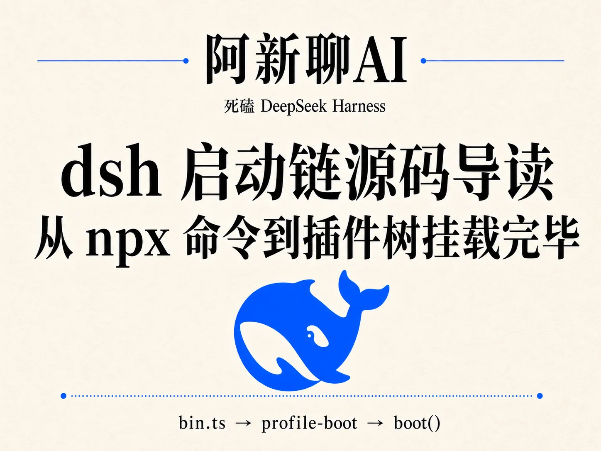
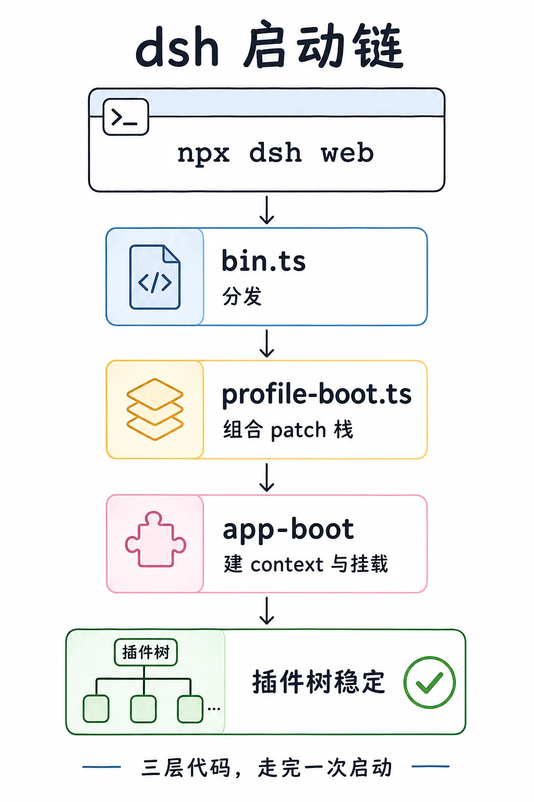
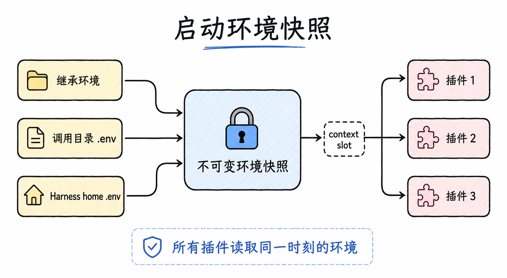
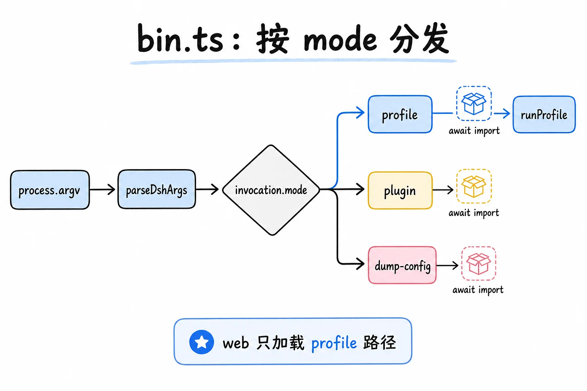
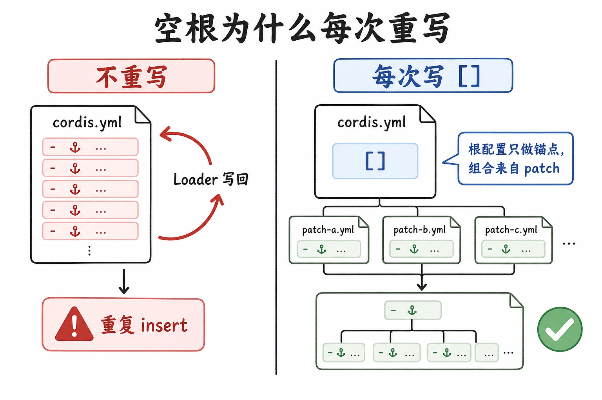
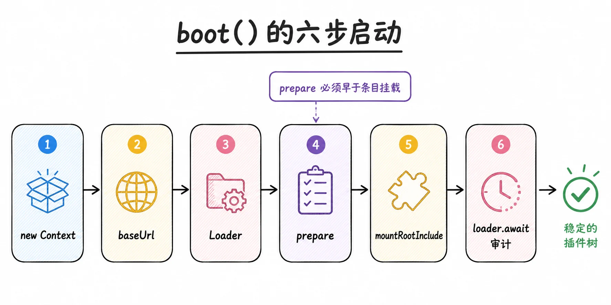
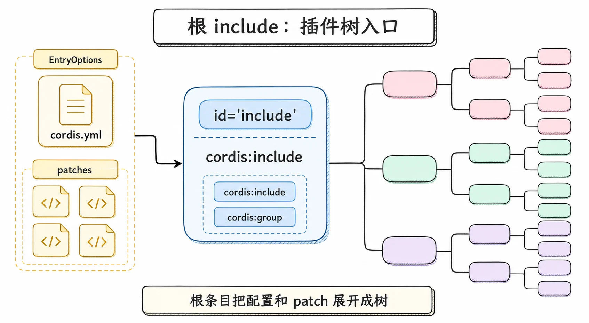
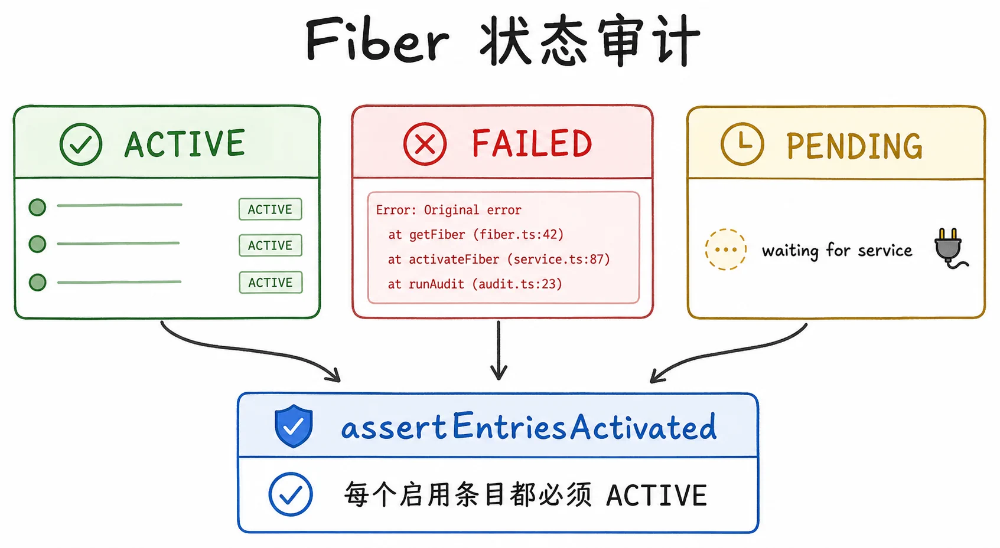
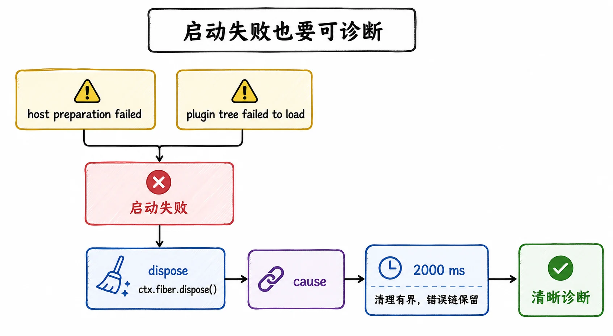
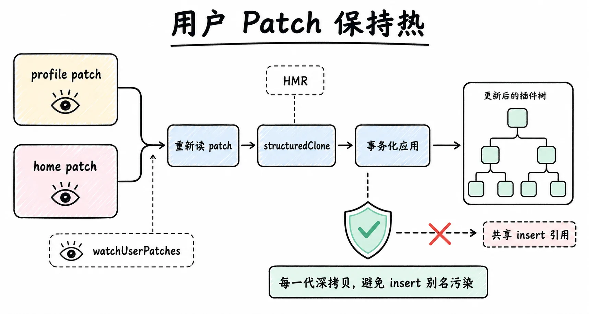

# dsh 启动链源码导读：从 npx 命令到挂载完毕的插件树



> `dsh web` 这条命令，从一个 Node bin 走到一棵挂载完毕的插件树，中间只有三层代码，一层负责分发，一层负责把 profile 拼成 patch 栈，一层负责建 context、挂 include、等树稳定。
> 这一篇是源码导读，沿着 `npx dsh web` 的真实调用链往下读，定位到具体文件和函数。组合的规则（profile、bundle、patch 层顺序）是上一篇讲过的，这里只看这些规则在代码里是怎么被执行的。

## 这一篇读什么

跟着一条命令走。你在终端敲下 `npx @deepseek-ai/dsh web`，到屏幕上出现 `dsh web:` 那行本地地址为止，中间发生的事可以压成三层：

1. **`apps/cli/src/bin.ts`**：进程入口，一个分发器。解析命令行，按 mode 把工作交给不同的模块。
2. **`apps/cli/src/profile-boot.ts`**：把一个 profile 名字解析成一条有序的 patch 栈。
3. **`packages/boot/app-boot/src/index.ts`**：建 root context，挂载 Loader 和 include，等插件树稳定，审计每一个条目。

这三层是 `deepseek-ai/deepseek-harness` 仓库里真实存在的文件，下面按执行顺序展开每一层的关键函数和控制流。读完后你应当能拿着一份 checkout，从 `bin.ts` 一路追到插件树挂载完成。



## 第一站：bin.ts，一个分发器

`bin.ts` 是 `dsh` 命令的入口，顶部带 `#!/usr/bin/env node`。它干的第一件事是加载分层环境、解析参数：从 `@deepseek-ai/dsh-app-boot` 导入 `loadLayeredEnv`，从 `./args.ts` 导入 `parseDshArgs`，然后用 `parseDshArgs(process.argv.slice(2), readVersion())` 得到一个 `invocation` 对象。

`loadLayeredEnv('dsh')` 在这一步拍下本次运行的"环境快照"，把继承来的环境、调用目录的 `.env`、Harness home 的 `.env` 按优先级冻结成一份不可变快照。这份快照稍后会通过一个 context slot 提供给整棵树，保证所有插件读到的是同一份启动时刻的环境。



`parseDshArgs` 返回一个 `invocation` 对象，它的 `mode` 字段决定走哪条路。分发是对 `invocation.mode` 的一个 switch，三个 case 各自动态导入自己的模块：

- `case 'profile'`：`await import('./profile-boot.ts')` 取出 `runProfile`，传四个字段调用它，`environment` 是 `loadLayeredEnv('dsh')`，`profile` 是 `invocation.profile`，`patchFiles` 是 `invocation.patches`，`args` 是 `invocation.args`。
- `case 'plugin'`：`await import('./plugin.ts')` 取出 `runPlugin`，跑 `runPlugin(invocation.profile, invocation.args)`，返回值交给 `process.exit`。
- `case 'dump-config'`：`await import('./dump-config.ts')` 取出 `runDumpConfig`，调 `runDumpConfig(invocation.profile, invocation.defaultOnly, invocation.patches)`。
- `default` 分支先写 `invocation satisfies never`，再 `throw new Error`，消息是 `dsh: unhandled invocation mode` 拼 `JSON.stringify(invocation.mode)`。

`dsh web` 命中 `case 'profile'`，`invocation.profile` 的值是 `"web"`。注意这里用的是 `await import(...)` 动态导入，三种模式互不拖累彼此的依赖：跑 `web` 不会把 `plugin` 管理子命令的代码也加载进来。`--help`、`--version` 和解析错误在 `parseDshArgs` 阶段就打印并退出了，所以能走到 switch 的都是合法模式。`invocation satisfies never` 是 TypeScript 的穷尽性检查，保证将来加新 mode 时编译器会逼你在这里补一个分支。



到这一步，控制权交给 `runProfile`。

## 第二站：profile-boot.ts，把 profile 组合成 patch 栈

`runProfile` 的第一步是 `composeProfile`，它把一个 profile 名字变成一条完整的 patch 栈。先看它怎么准备 profile。`prepareProfile(name: string, userLayer = true)` 返回一个 `Profile`，按顺序做三件事：先调 `healProfilesModuleFallback(INSTALL_ANCHOR)`，再调 `loadProfile(NAME, name, INSTALL_ANCHOR, undefined, { userLayer })` 得到 `profile`，最后 `writeFileSync(join(profile.dir, PROFILE_ROOT_FILENAME), PROFILE_ROOT_CONFIG)` 往 profile 目录写根配置文件。`PROFILE_ROOT_CONFIG` 是模块级常量，注释写明它是 "The empty root entry list every profile tree patches over"（每个 profile 树在其上打 patch 的空根条目列表），内容就是 `[]` 加一个换行。

这里有个反直觉的细节：**每次启动都把 profile 目录下的 `cordis.yml` 重写成 `[]`（空列表）。** 为什么？因为整个组合都是 patch 层叠上去的，根配置就该是空的。vendored Loader 有个"写回"行为：一个插件自我销毁时会把当前树持久化回这个文件，如果不清空，下次启动就会把上次组合出来的行又当成根配置，每个 bundle 的 insert 就被重复一遍。所以根配置每次启动重写为 `[]`，树完全由 patch 层组合。这个文件存在于磁盘上，只是因为 Loader 需要一个真实的 include 根来锚定 `baseUrl`。



`healProfilesModuleFallback` 维护 profile 目录下的 `node_modules` 符号链接，让树外插件的名字能通过 Node 的普通父级查找解析。

接下来是组装 patch 栈。`composeProfile` 读三层 patch，加上 overlay，四路来源分别是：`prepareProfile(name)` 得到 `profile`；`loadOptionalPatches(NAME, homePatchPath()) ?? []` 读 home 级 patch，文件不存在就取空数组，记成 `homePatches`；`patchFiles.flatMap(file => loadOverlayPatches(NAME, resolve(file)))` 把每个 `--patch` 传入的文件 resolve 成绝对路径再加载，得到 `overlays`；`profile.layers.flatMap(layer => layer.patches)` 汇总所有 bundle 层的 patch，记成 `bundlePatches`。随后调 `composeEntries([bundlePatches, profile.patches, homePatches, overlays])`，遍历它产出的每个 `row`，凡是 `row.id` 是字符串的，塞进 `new Map<string, EntryOptions>()` 建的 `rows` 索引。

`composeEntries` 是关键：它把这四层数组展平成一条 patch 列表，用 include 插件自己的 `applyEntryPatches` 算法往空列表上叠，得到最终的条目集合。顺序正是上一篇讲的：bundle 层在下，profile 自己的 patch，home 级 patch，overlay 最上。`rows` 是一张 id 到条目的索引，后面要做两件依赖这个索引的事。


第一件：如果树里有 `agent-presets` 这行，往它的 config 里注入官方自带的 preset root（指向 `apps/cli/config/agent-presets/`）。

第二件：遥测开关。有个叫 `resolveTelemetryPatch` 的函数，签名是 `(disabledEnv: string | undefined, hasRow: boolean)`，返回 `PatchOptions | undefined`。逻辑两条：`(disabledEnv ?? '') === ''`，或者 `hasRow` 为 false，就返回 `undefined`；否则返回 `{ id: TELEMETRY_ROW_ID, disabled: true }`。

读它的注释能学到一条产品判断：**任何非空值（包括 `'0'` 和 `'false'`）都禁用遥测。** 理由是一个隐私开关宁可错关（off-by-mistake），也不要错开（on-by-mistake）。如果组合里根本没有遥测行，这个开关平凡满足，不产生 patch，所以自定义 profile 不挂遥测也能跑。

把四层 patch 拼起来的辅助函数 `allPatches` 就一个 return，但顺序是整条链的骨架：它接收一个 `ComposedProfile`，返回 `PatchOptions[]`，展开顺序是 `composed.bundlePatches`、`composed.profile.patches`、`composed.homePatches`、`composed.overlays`。

回到 `runProfile`。组装完 patch 栈，它先装好进程级的失败和关停设施：`createProcessShutdown`（SIGTERM 退出码 0，SIGINT 退出码 130）、`installFailLoud`。然后调真正挂载树的 `boot`。

## 第三站：boot()，挂载树并等它稳定

`boot` 在 `packages/boot/app-boot/src/index.ts`，是整个启动链最核心的函数。签名是 `boot(binName: string, absoluteConfigPath: string, patches?: PatchOptions[], prepare?: (ctx: Context) => Promise<void> | void, bareModuleBaseUrl?: string)`，返回 `Promise<Context>`。函数体是一个大 try/catch：try 段从建 context 一路走到审计；catch 段先 `await ctx.fiber.dispose()` 销毁那个还没建完的部分 context，再抛一个新 `Error`，消息按 `${binName}: ${stage}: ${detail}` 的格式拼接，`{ cause }` 挂住原始异常。try 段逐项读：

1. `new Context()`：建一个全新的 root context。这是整棵插件树的根。
2. `stage = 'host preparation failed'`：一个失败标签。`boot` 把失败分成两个阶段，`prepare` 跑在配置树任何条目挂载之前，它的失败叫"宿主准备失败"；prepare 跑完后标签改赋成 `'plugin tree failed to load'`，之后的失败叫"插件树加载失败"。这个标签后面会用来给错误信息定性。
3. `ctx.baseUrl = pathToFileURL(dirname(absoluteConfigPath)).href + '/'`：把根配置所在目录设为 baseUrl，相对插件名从这里解析。
4. `ctx.provide('dshHomePath', dshHomePath)`：把 Harness home 的路径解析器作为 context 上的一个值提供出去。这样配置里的 `!!js` 表达式就能引用 `ctx.dshHomePath` 来定位 home 下的资源。
5. `await ctx.plugin(Loader)`：挂载 Loader 服务。Loader 是负责读配置、解析条目、按依赖激活插件的引擎。
6. `await prepare?.(ctx)`：跑宿主准备钩子。注意它的时机：**在任何配置条目挂载之前。** 对 `dsh` 来说，这个钩子（在 `runProfile` 里传入）做两件事：提供启动环境快照、提供命令行参数和退出钩子（`provideCmdline`）。把它们在条目挂载前就位，是为了让任何插件解析启动相关的值时，读到的都是同一份不可变快照。
7. `mountRootInclude(ctx, absoluteConfigPath, patches, bareModuleBaseUrl)`：挂载根 include，这是真正把配置树加载进来的地方。
8. `await ctx.get('loader')?.await()`：等 Loader 树稳定。可选链 `?.` 不是装饰：一个一次性 surface 可能在树还在加载时就请求退出，把整棵树连同 Loader 服务一起 dispose 掉，这时 `ctx.get('loader')` 会是 undefined，直接返回即可（注释里反复强调"这是 app 按要求退出，不是启动失败"）。
9. `assertEntriesActivated(ctx, binName)`：审计整棵树，每个启用的条目必须 ACTIVE。



`mountRootInclude` 值得单独看一眼。它把 `cordis:include` 和 `cordis:group` 注册成 Loader 的内建插件，然后构造一个 `EntryOptions` 类型的根条目：`id` 固定为 `'include'`，`name` 是 `'cordis:include'`，`config` 传 `includeConfig`（内容是配置文件 URL 的 `path` 和一个 patch 数组），最后 `await ctx.loader.create(rootInclude)` 挂载它，返回值记为 `includeId`。

这个 id 固定为 `'include'` 的根条目，就是整棵树的入口。`cordis:include` 读根配置（那个 `[]`），把所有 patch 层应用上去，得到最终的条目列表，然后 Loader 把每个条目当插件挂载。`cordis:group` 一起注册，是因为一个组合要用 group 行给一个 provider 和它的消费者划同一个 `isolate` 领域，而住在 workspace 外的 agent preset 没法按名字解析到 group 包，必须作为内建提供。



挂载过程是并发的，不是顺序的：Loader 同时激活所有能激活的条目，靠每个条目的 `inject` 声明等待依赖就位（上一篇讲过的 fiber PENDING 状态）。所以"加载顺序"在代码里根本不存在，顺序完全由依赖关系决定。

这个根 include 条目会被记在一个 WeakMap 里（`bootstrapIncludes`），供后面用户 patch 的热重载使用。

## 第四站：assertEntriesActivated，审计整棵树

`boot` 最后一步是审计。`assertEntriesActivated` 遍历每个条目，看它的 fiber 状态：

- **ACTIVE**：正常，跳过。
- **FAILED**：`await fiber.await()` 把插件原始的抛出错误（带原始栈）捞回来，记进失败列表。这一步很关键：它保留了插件自己抛错的真实栈，而不是只剩 Loader 的包装链。
- **PENDING**：这个条目还在等服务就位。它列出还没解析到的服务名，写成 "pending (waiting for service: xxx)"。
- 其他状态：直接报 fiber 状态码。



只要有任何一个启用的条目不是 ACTIVE，就抛一个错误，把所有失败原因拼在一起。这个错误被 `boot` 的 catch 捕获，连同 stage 标签一起重新抛出。所以你启动失败时看到的诊断，比如 "plugin tree failed to load: xxx: pending (waiting for service: tools)"，就是从这里来的。`assertEntriesLoaded` 是它的前置检查，连 fiber 都没有的条目（模块解析失败）直接按名字报出来。

## 失败路径：fail-loud 与部分上下文销毁

启动失败的处理有几处值得记住的设计。

`installFailLoud` 在 boot 之前就装好，把"插件初始化的延迟未处理 rejection"变成一行带标签的 stderr 输出加 `exit(1)`。它有个 `release` 钩子，给"持有终端的 surface"一个把终端状态还给用户的机会（清掉 raw mode、括号粘贴、键盘协议），这个钩子被一个 2000 毫秒的超时（`FAIL_LOUD_RELEASE_TIMEOUT_MS`）兜底：一个卡死的清理函数只能推迟致命退出，绝不能取消它。

`boot` 自己的 catch 里，会先 `await ctx.fiber.dispose()` 把那个还没建完的部分 context 销毁掉，再抛错。为什么要销毁部分 context？因为一个 surface 可能在挂载到一半时就拿到了终端，如果直接退出不拆树，会把终端状态留在脏的状态里。销毁部分 context 会触发那个 surface 自己的关闭逻辑。`boot` 还会把错误链一路钻到最深的 `cause`，把原始激活错误的栈附在后面，这样诊断里既有包装链，也有真实的失败位置。



## 启动后：让用户 patch 层保持热

`boot` 返回后，`runProfile` 还要做一件事：让用户的 patch 层在运行时保持热。它连着调两次 `watchUserPatches(ctx, ...)`，两次都传 `binName: NAME` 和同一个 `compose: composeLive` 闭包，`filename` 一次是 `composed.profile.patchPath`，一次是 `homePatchPath()`。

它给 profile 的 `cordis.patch.yml` 和 home 级的 `cordis.patch.yml` 各装一个 HMR watcher。你改这两个文件之一，会事务化地重新组合整条 patch 列表，重新应用。`composeLive` 是重新组合的闭包：一个无参函数，返回 `structuredClone` 包住的四段数组，`composed.bundlePatches` 打头，然后是现场重读的 `loadOptionalPatches(NAME, composed.profile.patchPath) ?? []` 和 `loadOptionalPatches(NAME, homePatchPath()) ?? []`，最后是 `composed.overlays`，整体类型是 `PatchOptions[]`。

这里有两个非显然的细节，都藏在 `structuredClone` 里。第一，**每一代重新组合都深拷贝整条 patch 列表。** 为什么？因为 include 把 `insert` 行按引用推进挂载的树，后面的 id 改写会原地修改这些对象。如果跨代复用同一份解析过的 patch 对象，一次用户覆盖就会被烤进 bundle 的内存 insert 行里，之后移除覆盖也回不到 bundle 默认值。第二，**每次都重新读两个用户文件**，而不是用 watcher 传进来的那一份，这样两个 watcher 不会把对方的旧拷贝缝进去。



如果组合里压根没有 HMR 服务（web bundle 默认禁用了模块级 HMR），`runProfile` 会自己挂一个只看配置、不带模块根的 HMR 实例（必要时先挂 timer 服务），保证 `cordis.patch.yml` 的编辑在任何长寿命 surface 上都保持热。这是一条文档承诺，静默跳过就算违约。

## 把链路串起来

一条 `dsh web` 走过的函数链，压成一张图：

```text
bin.ts: parseDshArgs → switch 'profile'
  └─ profile-boot.ts: runProfile
       ├─ composeProfile
       │    ├─ prepareProfile: healModules → loadProfile → 写空根 cordis.yml
       │    ├─ loadOptionalPatches (home) / loadOverlayPatches (--patch)
       │    ├─ composeEntries: applyEntryPatches 往 [] 上叠四层
       │    └─ 注入 agent-presets root + 遥测开关
       ├─ createProcessShutdown / installFailLoud
       └─ app-boot boot():
            ├─ new Context() + baseUrl + provide dshHomePath
            ├─ ctx.plugin(Loader)
            ├─ prepare(ctx): 提供环境快照 + cmdline（在任何条目挂载前）
            ├─ mountRootInclude: 注册 cordis:include/group 内建，挂 id='include' 根条目
            ├─ loader.await(): 等 fiber 树稳定（并发激活，inject 决定顺序）
            └─ assertEntriesActivated: 逐条目查 fiber 状态，非 ACTIVE 即抛
       └─ (启动后) watchUserPatches ×2: 用户 patch 层热重载
```

整条链没有一个地方手写"先加载谁、后加载谁"。顺序来自两个地方：patch 层的数组顺序（`allPatches`），和每个插件条目的 `inject` 声明（Loader 据此并发激活）。前者是组合的规则，后者是依赖的规则，两者之外没有第三种顺序来源。

## 源码里几个值得记住的设计决策

读完链路，有几处决策值得单独记住，因为它们解释了为什么这套启动链这么写：

**动态导入按 mode 分流。** 三种 mode 各自 `await import` 自己的模块，跑 `web` 不会拖进 `plugin` 子命令的代码。这让 `dsh` 的启动路径保持轻。

**空根每次重写。** 根配置永远是 `[]`，每次启动重写，防止 Loader 写回把组合行烤进根文件。组合完全由 patch 层决定。

**深拷贝防止 insert 别名。** 每一代 patch 组合都 `structuredClone`，因为 include 把 insert 行按引用推进树，跨代共享对象会让用户覆盖污染 bundle 默认值。这是个非常容易踩的坑，源码注释花了大段解释。

**宿主准备在条目挂载前。** `prepare` 钩子在 `mountRootInclude` 之前跑，保证命令行参数和环境快照在任何插件看见它们之前就位。

**遥测宁错关不错开。** 任何非空值都禁用，隐私开关偏向 off-by-mistake。

**失败分两个 stage。** 宿主准备失败和插件树加载失败用不同标签，诊断能区分是配置问题还是插件问题。

**fail-loud 有界释放。** 终端清理钩子被 2000 毫秒超时兜底，卡死的清理只能推迟不能取消致命退出。

## 结论

`dsh web` 的启动链是三层：`bin.ts` 分发，`profile-boot.ts` 把 profile 组合成一条 bundle 在下、overlay 在上的 patch 栈，`app-boot` 的 `boot` 建根 context、挂 Loader 和 include、等 fiber 树并发稳定、审计每个条目。整条链没有手写的加载顺序，顺序只来自 patch 数组顺序和插件的 `inject` 声明。启动后两个用户 patch 文件保持热重载，靠每代深拷贝避免 insert 别名污染。失败路径用 stage 标签和有界 release 钩子兜住，保证诊断清晰、终端状态不脏。这套链路把上一篇讲的组合规则，落成了可读、可审计的真实代码。

## 延伸阅读

- [dsh CLI 入口（apps/cli/src/bin.ts）](https://github.com/deepseek-ai/deepseek-harness/blob/master/apps/cli/src/bin.ts)：命令分发器
- [profile 启动（apps/cli/src/profile-boot.ts）](https://github.com/deepseek-ai/deepseek-harness/blob/master/apps/cli/src/profile-boot.ts)：patch 栈组装与热重载
- [app-boot 共享启动胶水（packages/boot/app-boot/src/index.ts）](https://github.com/deepseek-ai/deepseek-harness/blob/master/packages/boot/app-boot/src/index.ts)：boot、mountRootInclude、assertEntriesActivated
- [app-boot README](https://github.com/deepseek-ai/deepseek-harness/blob/master/packages/boot/app-boot/README.md)：每个导出函数的职责清单
- [Cordis Loader 与 Include 插件（vendor/loader、vendor/include）](https://github.com/deepseek-ai/deepseek-harness/blob/master/vendor/README.md)：内建插件与 patch 算法来源
- [架构文档：Profiles and bundles](https://github.com/deepseek-ai/deepseek-harness/blob/master/docs/architecture.md)：组合规则的总述

上一篇：[从一篇论文到一棵插件树：Cordis 怎么撑起 DeepSeek Harness 的"一切皆插件"](./03-cordis-and-plugin-composition.md)
下一篇：[Turn 与 Step：dsh 的 agent-loop 怎么流转一次对话](./07-turn-and-step-agent-loop.md)
