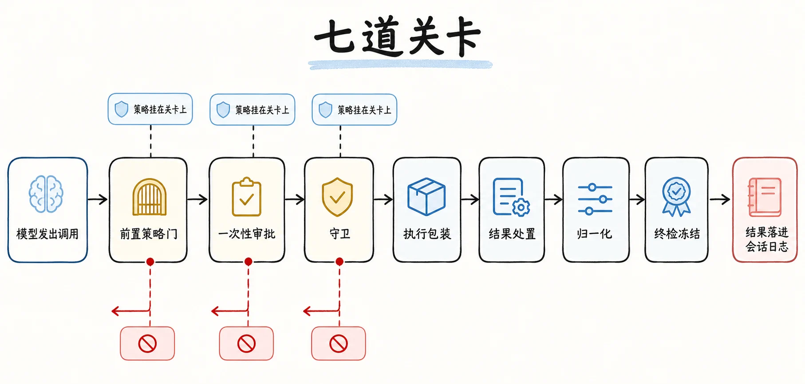
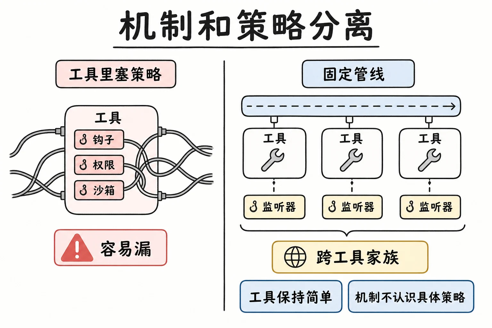
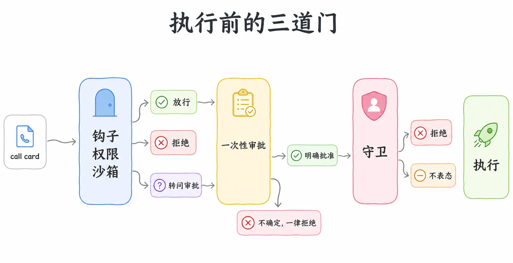
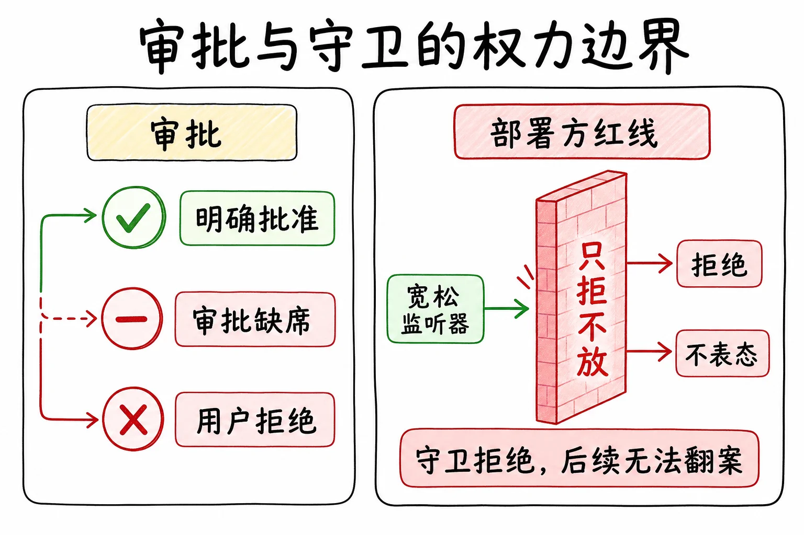
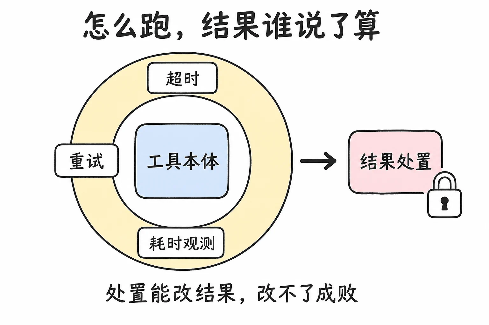
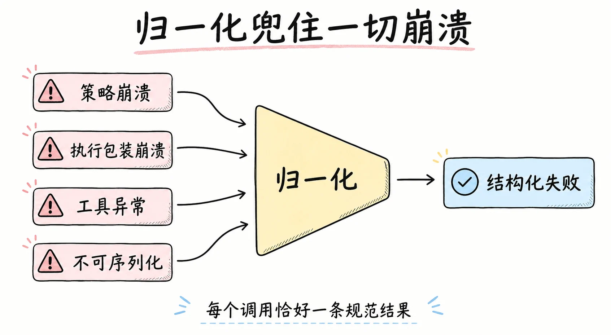
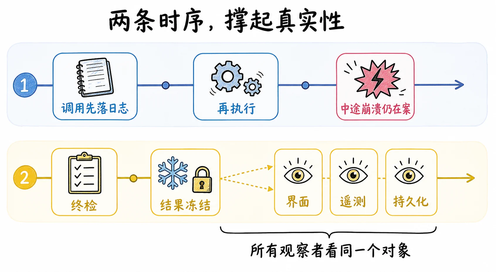
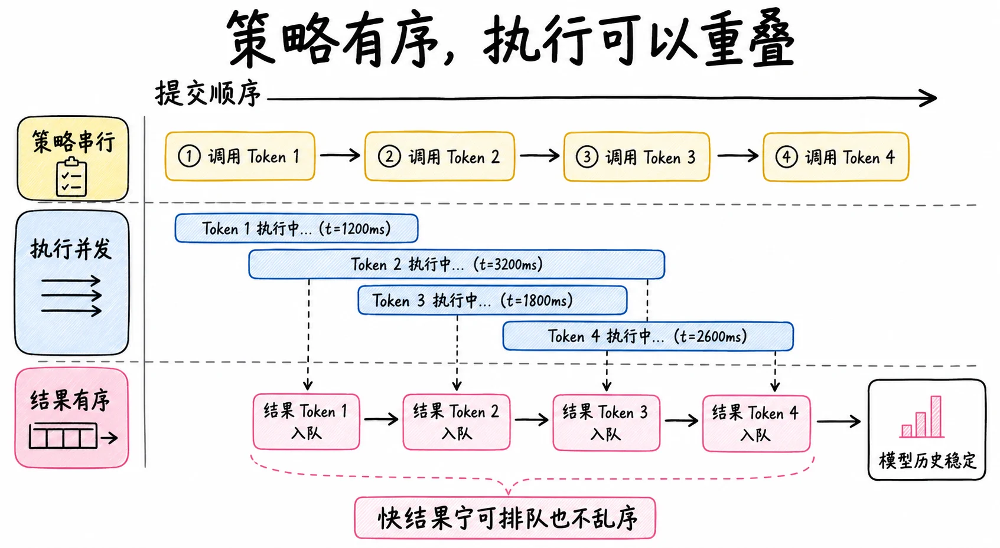
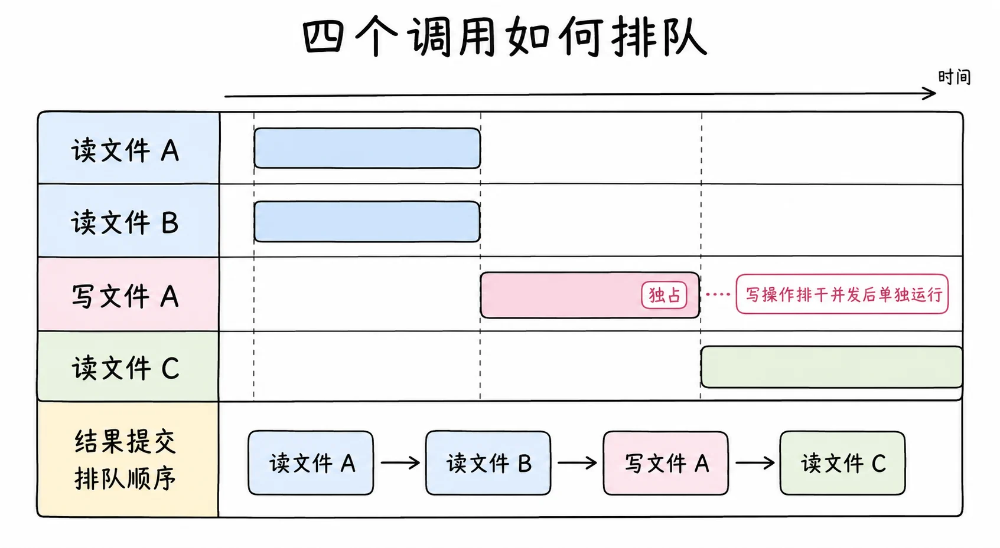
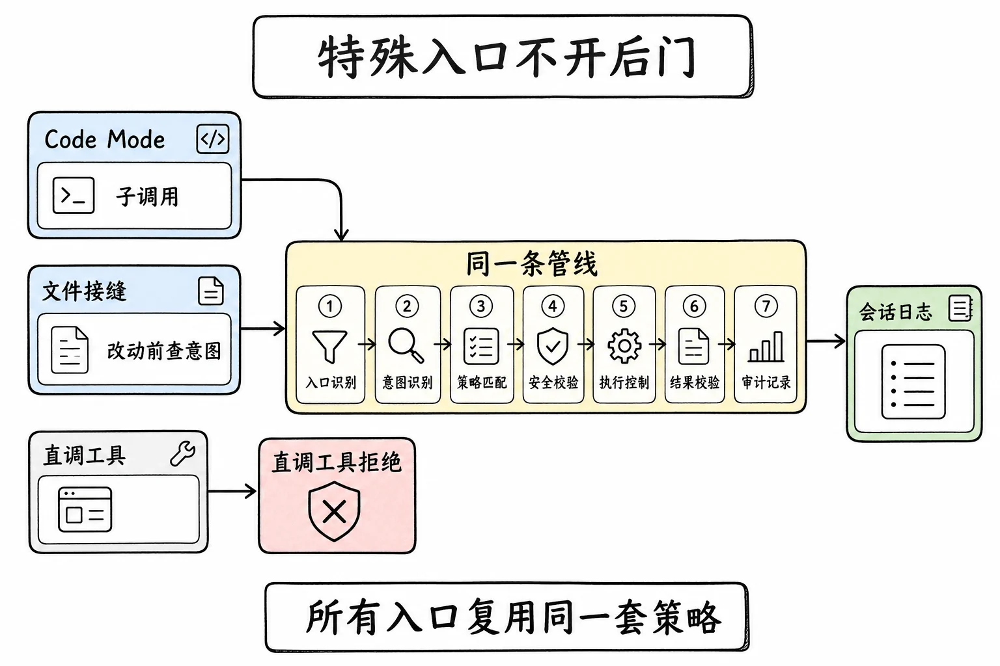

# 工具执行管线与守卫：dsh 从 tool_call 到结果的七道关卡

> dsh 不把工具调用当函数直接调。从模型发出一个调用，到结果落进会话日志，中间要走一条分层管线：钩子、权限、沙箱在第一道表态，审批和守卫各自把关，执行被超时重试包着，结果要过处置和归一化才能定型。策略挂在关卡上，机制不认识任何具体策略。
> 这一篇沿着一次调用走完全程：每道关卡管什么、权力边界在哪、为什么这些边界让顺序和真实性不用靠自觉、多个调用并发时哪些必须有序。



## 策略不能长在工具里

多数 agent 的工具调用接近一次函数调用：模型说要调，harness 找到函数，跑，把结果塞回去。单机单人没问题，但 agent 的工具调用天生要挂一堆策略：钩子要观察、权限要裁决、沙箱要围栏、审批要问人、结果可能要脱敏或截断。这些策略如果散在各处，一部分写在工具里、一部分写在调用点、一部分写在循环里，每个新工具都要重新过一遍所有策略，漏一处就是安全洞。

dsh 把所有策略从工具和循环里拿出来，做成一条固定管线。每道关卡只管一个关注点，策略以监听器的形式挂在关卡上。这就是**机制和策略分离**：关卡的结构和顺序是机制，钩子、权限、沙箱、审批是策略；机制不认识任何具体策略，策略之间也不知道彼此存在。官方的说法是，这让钩子能跨越工具家族，而不把工具耦合到一个策略服务上。



一次调用的完整旅程长这样，数出来七道关卡：

```text
模型发出调用
  → 先记日志，再进管线
  → 一 前置策略门：钩子、权限、沙箱表态，放行、拒绝或转问审批
  → 二 一次性审批：只有用户明确批准才放行，其余全是拒绝
  → 三 守卫：部署方的红线，只能拒绝或不表态
  → 四 执行包装：超时、重试、耗时观测，包在执行外面
  → 五 结果处置：接受、替换、拦截、附上下文，改不了成败
  → 六 归一化：任何一层崩了，都收敛成一条规范的失败结果
  → 七 终检与冻结：结果定型，所有观察者看同一个对象
  → 结果落进会话日志
```

## 执行前的三道门：该不该发生



第一道是前置策略门，钩子、权限、沙箱都挂在这里。监听器有三种表态：放行、拒绝、转问审批。比如权限策略看到一条要删目录的命令，可以直接拒绝，也可以转问审批。刻意没有第四种表态：改参数。参数在这一道之前就已经记进日志、展示给用户了，允许这里改写，日志里的参数、用户看到的参数、实际执行的参数就成了三份不同的东西。想规范入参的策略只能拒绝并让模型重试，不能默默修正。

第二道是审批。被转到这里的调用，只有一种结局放行：用户明确给出的一次性批准，同一个决策不重复问。其余全是拒绝：审批服务没挂载，拒绝；请求路由不到人，拒绝；用户拒绝，拒绝；通道不可用，拒绝。任何不确定都是拒绝，"没人管"不能被解释成默许，这是 agent 安全的底线。顺序也是定死的：审批在守卫之前出结果，先有明确批准，红线再表态。

第三道是守卫。有一类策略是部署方的红线，比如"绝不允许动这个目录"，它们注册成守卫。守卫的语义是单向的：要么拒绝，要么不表态，没有"放行"这个动作。这堵死了一类 bug：某个宽松的插件挂个监听器把所有调用都放行，想绕过安全策略。守卫没有放行可给，宽松监听器最多管到自己那一段，红线该拒的还是拒。顺序因此无法翻案：守卫一旦拒绝，任何注册顺序、任何后来的监听器都翻不回来。



## 执行与处置：怎么跑，结果谁说了算



过了三道门才真正执行，而执行本身也包着一层：超时、重试、耗时观测挂在执行外面。它们是"执行"这个动作的包装，不是"要不要执行"的决策，所以不放前面。包在最里面干活的才是工具本体。文件读写这类敏感操作在这里过文件接缝自己的门：改动前查意图，编辑前核对已观察到的版本。通用管线保持通用，文件这个特殊关注点在自己的接缝里做深。

工具跑完，结果进第五道：结果处置。策略在这里有四种动作：接受、替换、拦截、附上下文。一个结果太大，溢出策略可以把它替换成一个定位符加检索提示；结果里有敏感内容，可以在这里拦截或改写。但权力有边界：改不了成败。处置能改"结果长什么样"，改不了"这次调用成没成"。失败的结果可以附上纠正性反馈帮模型自纠；被守卫拒绝的调用也走这一道，观察者看得到拒绝，翻不了案。附上的上下文也不立刻塞进当前请求，而是排队等这批结果落完日志，作为下一条输入带给模型。

第六道是归一化，管线的兜底。前面任何一层崩了，策略崩了、执行包装崩了、工具本身崩了，异常都不会逃出管线，统一收敛成一条带失败原因的结果。工具返回不合规的东西，比如一个不可序列化的值，也一样变成结构化的失败。取消还分两种记法，执行前取消和执行后取消，让重试和回放能区分"工具的错"和"环境的错"。所以管线的输出是一个强承诺：每个调用恰好对应一条规范的结果，不管中间出了什么。



## 两个时序撑起真实性

第一个时序：调用在执行之前就落日志。模型发出的调用先记下来，再进第一道门。这样即使执行中途崩溃，调用本身已在案，重放时不会凭空缺一段。

第二个时序：结果一次性冻结。第七道终检过后，结果冻结成权威版本，之后界面、遥测、持久化看到的都是同一个对象，不存在"每个观察者拿到一份略微不同的结果"。落进会话日志的是渲染后的内容和元数据，执行过程的机器可读中间值刻意不进日志，日志里只放模型和用户要看的东西。

还有一条配套契约：工具必须声明自己的输出结构，声明缺失连注册都过不了。这是"工具永远返回规范 JSON"的入口，也是归一化能把一切异常收敛成结构化结果的前提。



## 并发：策略有序，执行重叠



一个步骤里模型常常一次发起多个调用。dsh 让它们并发跑，但不把整条管线并发跑。拆法是分段：三道门按提交顺序跑，决定每个调用能不能进执行；执行段并发跑，互不等待；结果按提交顺序提交给模型。一句话：**策略必须有序，执行可以重叠**。理由很实际：策略监听器可能维护对顺序敏感的状态，比如"连续三次危险操作就熔断"，决策并发跑会把这类策略算错。

哪些调用能并发，由工具自己声明，且默认不能。只有工具明确声明某类调用可重叠，同类调用才并发；声明缺失、分类器出错，一律单独跑。读文件、网络搜索、委派子 agent 声明了可重叠，写文件、跑命令默认独占。保守方向是刻意的：当安全性依赖比较两个调用时，比如"写不同文件才安全"，宁可放弃并发。

举个具体例子。模型一次发起四个调用：读文件 A、读文件 B、写文件 A、读文件 C。前两个读并发跑；写 A 是独占调用，等两个读都完成、排干在跑的调用后自己单独跑；读 C 再等写 A 完成后跑。最终四个结果按提交顺序落日志，哪个先完成都一样。



代价是明确的：提交顺序优先于完成顺序，先跑完的结果要压在慢的前序调用后面等着提交。换来的是重放顺序和模型历史稳定：不管哪个调用先完成，模型看到的结果顺序都和它发起调用的顺序一致。

## 特殊入口不开后门

文件改动的门前面讲过，这里补另一类：让模型写代码来编排工具调用，官方叫 Code Mode。部署可以把"模型一个个调工具"换成"模型写一段程序，程序里调工具"，多次往返折成一次执行。这天然有个后门风险：程序里的子调用会不会绕过策略？不会。子调用走同一条管线，复用同一套并发分类，享受同样的三道门和处置。

三个配套设计把口子封死。子调用的拒绝是绑定的，被拒就是被拒，不会被后续层推翻。子调用的附加上下文刻意省略，保证调用和结果紧邻，不被别的信息打断。那个程序执行入口本身是保留的，删不掉也限制不了，因为任何 agent 都可能切到这种模式。至于模型在程序外面直调工具，会在进任何策略之前就被否掉，理由是守卫不该看到、更不该批准一个只可能失败的调用；拒绝消息会指路"从程序内部调"，没有这句指路，模型看到干巴巴的未知工具报错，会以为部署坏了。



## 权衡

读完自然的问题：这么多层，不是徒增延迟和复杂度吗？

收益是纵深防御。每道关卡只管一个关注点、互不知晓，一个策略出 bug 不会击穿其他层：宽松的钩子把第一道门全放行，守卫该拒的还拒；审批服务没接上，缺席即拒保底。加一种策略就是挂一个监听器，不改工具、不改其他策略。

代价也具体。一次调用要穿七道关卡，延迟和调试链都变长，出问题时要沿管线定位是哪一层拦的。每个"不能"都在收窄插件能做的事：不能改参数，入参规范只能靠拒绝加重试；守卫不能放行，"确认安全后放行"的逻辑只能写在审批里；结果不能翻案，失败重试要靠模型发起下一次调用。换来的是顺序和真实性不靠自觉：参数永远三处一致，拒绝永远翻不了案，落日志的永远是规范结果。

如果 agent 只在受信环境里跑、策略单一，这条管线是过度设计。如果要在多种权限策略、多种执行环境、要审计要安全的场景里跑，分层管线是把每个安全关注点钉死在自己那层、不赌任何一个策略不出 bug 的手段。

## 结论

dsh 把工具调用做成一条七道关卡的管线：前置策略门只能表态不能改参数，审批缺席即拒，守卫只拒不放、顺序无法翻案，执行被超时重试包着，结果处置改不了成败，归一化兜住一切崩溃，终检后结果冻结。策略挂在关卡上，机制不认识任何策略，所以一个策略出 bug 不会击穿其他层。真实性由两个时序撑住：调用先落日志再执行，结果冻结后所有观察者看同一个对象。并发时段分明，策略有序、执行重叠，快结果宁可排队也不乱序。Code Mode 和文件改动这些特殊入口都走同一条管线或自己的接缝，不开后门。代价是七层的延迟和调试链，换来纵深防御和"顺序、真实性不靠自觉"。

## 延伸阅读

- [工具执行管线图（docs/tool-execution-pipeline.md）](https://github.com/deepseek-ai/deepseek-harness/blob/master/docs/tool-execution-pipeline.md)：管线流程图的权威来源
- [tools 子系统文档（docs/subsystems/tools.md）](https://github.com/deepseek-ai/deepseek-harness/blob/master/docs/subsystems/tools.md)：工具注册表、事件与 API 契约
- [approval 子系统文档](https://github.com/deepseek-ai/deepseek-harness/blob/master/docs/subsystems/approval.md)：fail closed 的审批接缝
- [sandbox 子系统文档](https://github.com/deepseek-ai/deepseek-harness/blob/master/docs/subsystems/sandbox.md)：进程围栏
- [架构文档：Turn flow 工具部分](https://github.com/deepseek-ai/deepseek-harness/blob/master/docs/architecture.md)：管线在 turn 流程里的位置
- [Cordis Primer：Waterfall 语义](https://github.com/deepseek-ai/deepseek-harness/blob/master/docs/cordis-primer.md)：三道拦截 waterfall 的 next() 纪律

上一篇：[能力接缝：dsh 换一个 provider 等于换整个产品](./12-capability-seams-swap-provider-swap-product.md)
下一篇：[系统提示组装与动态 Cordis：dsh 让 agent 改自己的插件树](./15-system-prompt-assembly-and-dynamic-cordis.md)
