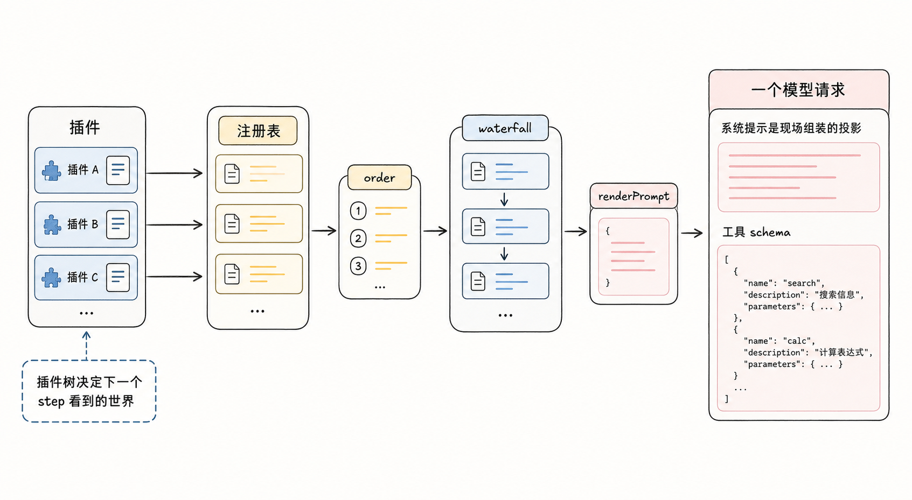
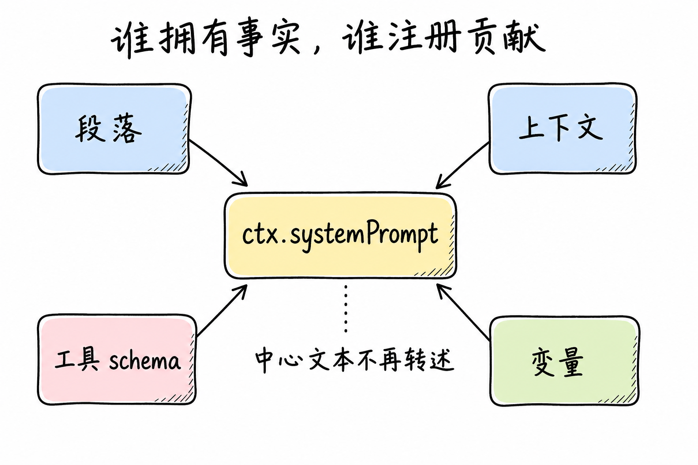
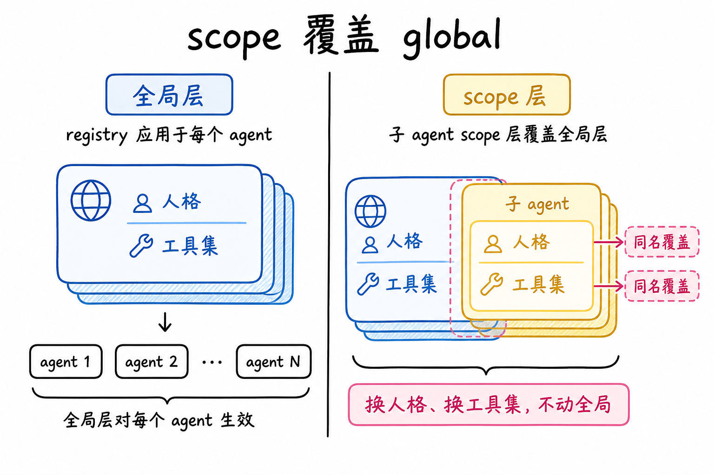
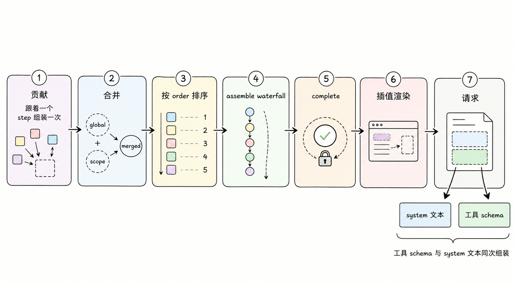
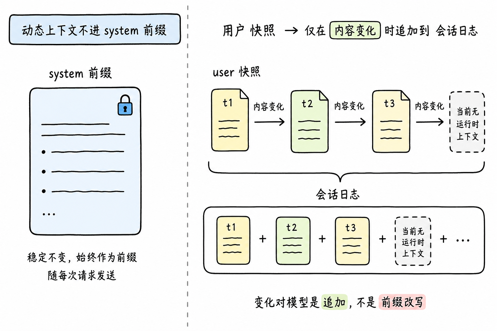
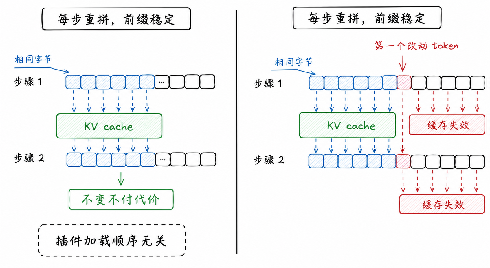
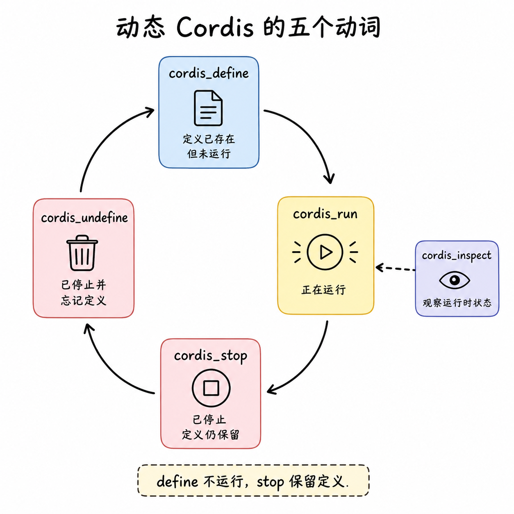
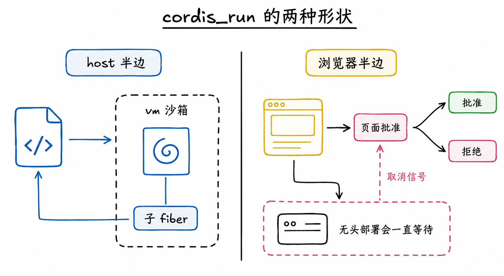
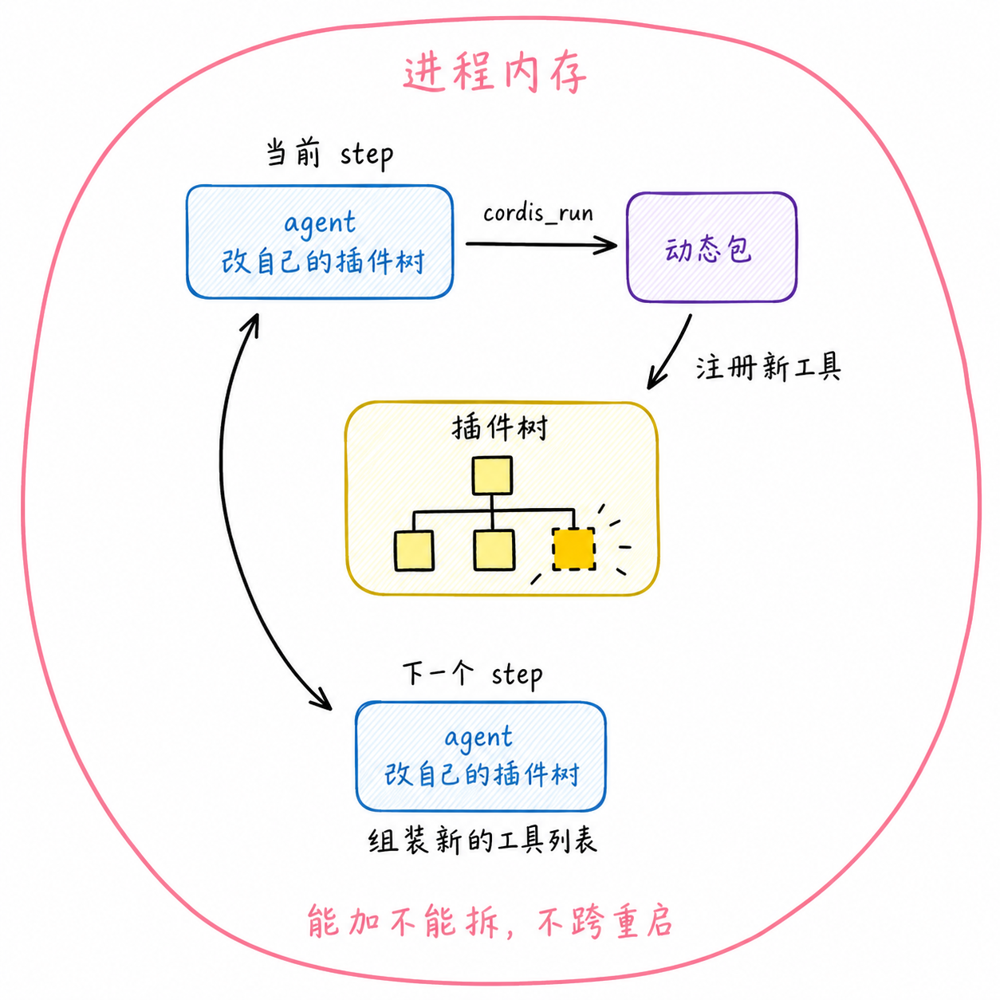
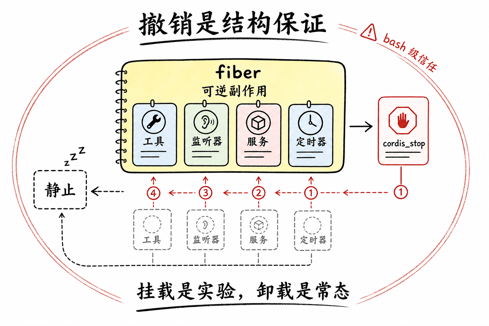

# 系统提示组装与动态 Cordis：dsh 让 agent 改自己的插件树

> dsh 的系统提示不是一份写死的文本，而是每个 step 现场组装的投影：插件往 ctx.systemPrompt 注册表贡献段落、动态上下文、工具 schema 和变量，按约定的 order 排序，过一道协作 waterfall，再插值渲染。工具列表和提示文本出自同一次组装，所以改插件树就是改模型下一个 step 看到的世界。
> 动态 Cordis 把这条管线对 agent 自己敞开：模型用五个 cordis_* 工具往活运行时挂载自己写的包，注册新工具、新提示、新监听器；这些注册全是可逆副作用，停掉就按序撤销。这套能力的信任等级等同 bash。



## 提示是投影，不是文件

多数 agent 框架的系统提示是一份手写长文本，改提示等于改文件、重启会话。开源 harness dsh 没法这么做：bash 工具要交代自己的用法，Code Mode 要注入一份生成的 SDK 文档，部署方要写人格，会话还有随时间变化的动态上下文。这些内容的所有者分布在几十个包里，让任何一份中心文本去转述它们，工具改了说明、中心文本不会跟着改，漂移只是时间问题。

dsh 的做法是把提示变成注册表服务 ctx.systemPrompt 的投影，配一条所有权规则：**谁拥有一个事实，谁注册承载这个事实的贡献。**贡献有四种：段落是系统提示里的一段文本；上下文是动态模型上下文；工具是 schema 提供者；变量给段落文本里的占位符供值。



段落和上下文带 order 数字，order 是约定出来的档位，不是注册顺序：-100 是 harness 身份，0 是部署人格，100 到 199 是工具引导。告诉模型 dsh 源码检出在哪的段落 order 是 -99，紧跟身份之后、人格之前；Code Mode 部署里"只有 run_code 可以直接调"的规则 order 是 99，在人格之后、工具引导之前。顺序固定，插件先加载还是后加载不影响提示长什么样。

注册还分两层：全局层对所有 agent 生效，单个 agent 的 scope 层可以按同名覆盖全局。给某个子 agent 换人格、换工具集，不动全局，在它那层盖掉。



## 跟着一个 step 组装一次

agent 循环在每个 step 发起模型请求前，对着当前 scope 做一次组装：

```text
注册表里的贡献（段落 / 上下文 / 工具 / 变量）
  → 全局层与 scope 层合并，同名时 scoped 覆盖全局
  → 段落按 order 升序排定
  → system-prompt/assemble waterfall：监听器协作改写，链尾返回值权威
  → 若有 complete 段，恢复成唯一提示段
  → renderPrompt 插值 {{变量}}、剔除空段、拼成 system 文本
请求 = system 文本 + 本次组装的工具 schema + 会话日志投影出的 messages
```



waterfall 是一条协作改写链：监听器逐个拿到可变的组装结果，改完交给下一个，链尾的值生效。要统一过滤或统一改写的部署在这里动手。唯一的例外是 complete 段：一个声明 complete: true 的段在 waterfall 之后被恢复成全部提示，监听器加不进也换不掉；多于一个有效 complete 段，组装直接失败。想完全接管提示的部署有这个口子，同时工具、上下文、变量仍被正常解析。

上下文贡献的去向和另外三种不同。它不进 system 前缀，而是渲染成一条 user 角色的快照落进会话日志，并且只在内容变化（或压缩把上一条挤掉）时才落新的一条，清空时落一条明确的"当前无运行时上下文"。这个设计把会变的事实从 system 前缀挪进了消息历史：变化对模型是追加，不是前缀改写。



工具 schema 是组装的一部分，这解释了一个日常现象：注册一个工具，它的 schema 自动出现在模型的工具列表里。工具运行时把自己注册成了系统提示的一个工具 schema 提供者，注册工具和注册提示段走同一条管线。"模型被告知能做什么"被当成一件事处理，尽管传输时 schema 是请求里一个独立字段。

每个 step 的请求头（模型配置、system 文本、工具集）会与上一条比对，不同就往会话日志落一条 change 事件。dsh 有条硬不变量：凡是模型看到的，都必须能从会话日志重建。提示每个 step 重拼，不变量靠这条日志事件维持。

## 每步重拼，前缀稳定



每步重组装听上去费钱，设计的目标是不变不付代价：只要 system 文本、工具 schema、更早的历史字节不变，请求前缀就能被 provider 的 KV cache 复用；任何一处变了，复用从第一个改动的 token 起失效。

这条性质反过来约束组装的每个环节。order 档位让段落顺序与插件加载顺序脱钩；工具列表默认按名字典序排，也可以配置显式顺序，配了不存在的工具名，第一个 turn 组装时就失败；SDK 文档段从当前可见工具确定性生成，工具集不变则文本字节相同；引用启动时才确定的事实（比如本地 Web 界面的地址）的段落，文本在整个进程生命周期内不变。反过来，任何改变组装结果的操作，注册新工具、换 scope 限制、挂一个带提示贡献的动态包，都可能让缓存从头失效。组装每次都跑，但跑出同样的结果时，请求前缀一个字节都不动。

## 动态 Cordis：agent 改正在跑自己的那棵树

到这里，组装管线描述的是一个静态部署。dsh 有个扩展包把这条管线对模型自己敞开：五个面向模型的工具，作用在当前进程的活运行时上。这套工具的存在理由写得很直白：harness 里的一切都是插件，但跑在里面的 agent 看不见也摸不到这个插件运行时；让它能检查、能扩展自己，值得单独做一套工具。工具集本身注入一个运行器服务，挂了工具没挂运行器的组合，这些工具永不激活。

五个动词两两配对，加一个只读报告。cordis_inspect 给当前进程的报告：服务、活着的插件、已注册工具、本会话的动态包、每个服务的可调方法和事件签名。cordis_define 记录一个包定义（名字、用途、host 半边代码和可选的浏览器半边），两边都做语法检查，什么都不跑；用户在会话里看到一张带启动控件的卡片，定义拿到一个 dyn- 开头的 id。cordis_run 跑起来。cordis_stop 停到静止，定义保留。cordis_undefine 先停再忘，卡片留在会话里作为卸载记录。



run 有两种形状，差别在包由谁执行。只有 host 半边的包是本进程自己的事：代码进 vm 沙箱求值，产出的插件挂成一个子 fiber（一次插件装载的生命周期单位，下一节展开），调用返回。带浏览器半边的包必须由一个网页来执行：run 变成一次可应答的往返，发出请求后挂起，由人在某个打开的页面上允许或拒绝；没有定时器，发起这一轮的取消信号是唯一另一个出口，无头部署里这样的 run 会一直挂到本轮取消。



跑起来的包能做什么？它拿到的不是完整的框架上下文，而是一个白名单门面：可以注册工具、监听器、服务，读一个服务必须先声明依赖，框架内部的装载与卸载机构全部不可见。它能加，不能拆：已装载的插件、已写的配置动不了。注册的工具 schema 在注册时就过边界校验，畸形 schema 带着教学性的错误当场被拒，而不是等下一个 step 组装时爆掉。

自指就发生在这里：跑起来的包注册的新工具，下一个 step 的组装立刻看得见，模型自己的工具列表变了，改的对象正是正在跑它自己的那棵插件树。边界也明确：动态包只活在进程内存里，跨 turn 保持活跃，可能影响同进程的其他会话，但不创建文件、不改配置、不活过重启，也没有自动转正的通道；要保留一个实验，得走常规开发流程实现正式插件。行为动词都校验会话所有权，别的会话定义的包读作不存在。



## 撤销是结构保证

让 agent 往活运行时里挂代码，最怕的不是挂不上，是撤不掉。dsh 敢做，因为撤销不靠各个功能自觉写清理代码，而是 Cordis 的结构性质：注册是可逆副作用。fiber 是一次装载的生命周期账本，装载期间注册的监听器、服务、工具、定时器都记在它名下，卸载时按序冲销。

动态包正是挂在 fiber 下跑的，所以 cordis_stop 做的事就是等待这个 fiber 卸载到静止：它注册的一切按序撤销，活运行时回到原状。工具集卸载、进程重启走同一条卸载路径。多个动态包之间还能用服务语义组合：A 提供一个服务，B 声明依赖，A 在则 B 激活，A 停则 B 回到待定、注册随之撤销，A 再跑 B 重新激活。挂载是实验，卸载是常态，这套语义让试错不用付出越试越脏的代价。



## 权衡

收益是具体的。提示成为投影后，几十个包各自维护自己拥有的说明，中心文本消失，转述漂移随之消失；组装是确定性的，前缀不变就不付缓存钱；动态 Cordis 把扩展 harness 从改代码加重启变成会话内一次工具调用，试错成本从分钟级降到一步。

代价也具体。沙箱是给诚实代码做隔离的，不是安全边界：全局被隔离、Node 内建被重定向到 Cordis 服务，但 host 侧的 helper 留着逃逸路径，挂载的包能调到的服务带着宿主的全部权限。官方的定位是把这套工具当 bash 权限对待，默认不装。模型写的代码跑在自己这一轮的工具调用里，await 一个只有本轮结束后才会解决的东西会死锁；它注册的 waterfall 监听器若不调 next()，会短路 agent 自己的工具分发；vm 的 5000ms 求值上限只管同步部分，异步体不受限；带浏览器半边的包在无页面的部署里永远等不到批准。设计上还拒绝过另一条路：一组结构化的注册工具，注册工具、注册监听器、注册服务各一个。拒绝的理由是同样的 schema 校验一个没少、API 面随能力种类无界增长、跨包组合表达不了；一个"挂载一个真插件"的原语一次性覆盖所有能力，模型挂的东西和 inspect 报告的东西是同一个东西。

如果部署不接受 bash 级信任，这套工具集不该出现；如果提示完全静态、单 agent、无插件，注册表组装是多余的一层。在插件多、部署形态多、且愿意给 agent 开发者级权限的场景里，两件事合起来才完整：组装让 agent 看到什么变成可组合的投影，动态 Cordis 让谁来改投影这个问题的答案里多了 agent 自己。

## 结论

dsh 的系统提示是注册表的投影：四种贡献按约定 order 排序，过 system-prompt/assemble waterfall，complete 段可整体接管，动态上下文落成 user 快照且只在变化时追加，工具 schema 与提示文本同一次组装。每步重拼的代价被确定性挡住，前缀不变一个字节不动，变了从第一个 token 起失效，变化本身作为请求头事件落日志。动态 Cordis 在这条管线上开了自指的口：五个动词，define 只记录，run 分两种形状，浏览器半边要人批准；跑起来的包能注册工具、提示、监听器，只能加不能拆，下一个 step 立刻生效。撤销是结构保证，注册皆可逆副作用，stop 即按序冲销到静止。信任姿态等同 bash：沙箱隔离不设防，装它就是把 shell 交给模型。

## 延伸阅读

- [系统提示组装子系统文档](https://github.com/deepseek-ai/deepseek-harness/blob/master/docs/subsystems/system-prompt.md)：贡献类型与组装契约的权威来源
- [system-prompt 包 README](https://github.com/deepseek-ai/deepseek-harness/blob/master/packages/core/system-prompt/README.md)：注册、排序、作用域与渲染行为
- [tool-cordis README](https://github.com/deepseek-ai/deepseek-harness/blob/master/packages/extensions/tool-cordis/README.md)：五个 cordis_* 工具与动态包生命周期
- [cordis-host-runner README](https://github.com/deepseek-ai/deepseek-harness/blob/master/packages/extensions/cordis-host-runner/README.md)：vm 沙箱、fiber 生命周期与 run 往返
- [Cordis Primer](https://github.com/deepseek-ai/deepseek-harness/blob/master/docs/cordis-primer.md)：可逆副作用与 waterfall 语义
- [自指 Cordis 工具集设计 Agent Note](https://github.com/deepseek-ai/deepseek-harness/blob/master/.agents/notes/implemented/feature/2026-07-08-self-referential-cordis-toolset.md)：设计决策与被拒绝的替代方案

上一篇：[工具执行管线与守卫：dsh 从 tool_call 到结果的七道关卡](./13-tool-execution-pipeline-and-guards.md)
下一篇：[dsh 的 LLM 适配器与 stream 契约：把 provider 差异关在适配器一层](./16-llm-adapter-stream-contract-source-walkthrough.md)
