# dsh 的 LLM 适配器与 stream 契约：把 provider 差异关在适配器一层

> dsh 调模型只有一条路：把请求交给 `ctx.llm`，拿回一个 `StreamChunk` 流。适配器向 harness 承诺这条流的语法和终态语义，provider 之间的全部差异（请求格式、SSE 解析、错误长相、token 记账口径）都死在适配器内部，agent loop 从不认识任何具体 provider。
> 这一篇跟着一次流式响应走完全程：请求怎么路由、差异在哪被吸收、流回来的 chunk 承诺了什么、中途出错或被取消时契约怎么兜底。

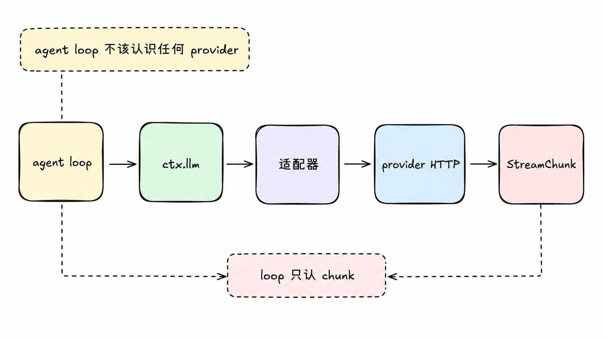

## agent loop 不该认识任何 provider

多数 agent 框架接模型的方式是每个 provider 写一个 client，各自解析各自的响应。后果很具体：换一个 provider，错误处理、token 计费、工具调用解析、流式拼接全要重写一遍，agent loop 里散落着对 provider 名字的字符串判断。dsh 支持任意 OpenAI 兼容端点，如果 loop 认识 provider，每接一个新端点都要回头改 loop。

dsh 的做法是在 `packages/llm` 里定义一套 provider 中立的词汇：消息怎么表示（`Message` 和内容块）、一次请求长什么样（`GenerateOptions`）、流回来的原始协议是什么（`StreamChunk`）、失败长什么样（`LlmFailure`）。所有适配器吐同一种 chunk，loop 只认 chunk。目前挂在这个接缝上的有 direct-fetch 的 `llm-deepseek`、基于第三方库的 `llm-pi-ai`、测试替身 `llm-replay`。

一次流式响应的完整旅程长这样：

```text
loop 组装请求
  → provider 字符串在注册表里选中适配器，model 只是建议
  → llm/stream waterfall：洋葱皮拦截，语法校验和测试替身挂在这层
  → 适配器：序列化请求、解析 SSE、归一错误、看门狗计时
  → provider HTTP
  → chunk 流回程：增量实时先行，收尾三件套殿后
  → 双轨消费：原始 chunk 落会话日志，assembler 同时拼装
  → assistant 消息定型；失败收敛成统一 code 交给策略层
```

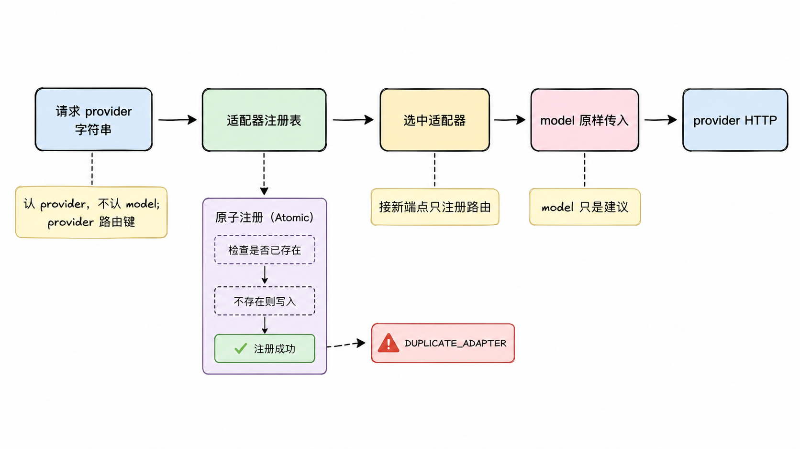

## 认 provider，不认 model

请求里的 provider 字符串是路由键，在适配器注册表里选中一个适配器实例；model 原样传给它。模型目录是建议性的，没列在目录里的 model id 一样可能被接受，适配器才是权威。这个选择把两件事解耦了：接一个新端点是注册一条 provider 路由，模型增删改不动注册表。

注册本身有原子性保证。重复注册同一条路由抛 `DUPLICATE_ADAPTER`，要么整组注册成功要么一个都不动；注册句柄上的 `replace()` 在一个同步段里换掉整组路由，任何请求都观察不到中间的空窗。

## 中途拦截：llm/stream waterfall

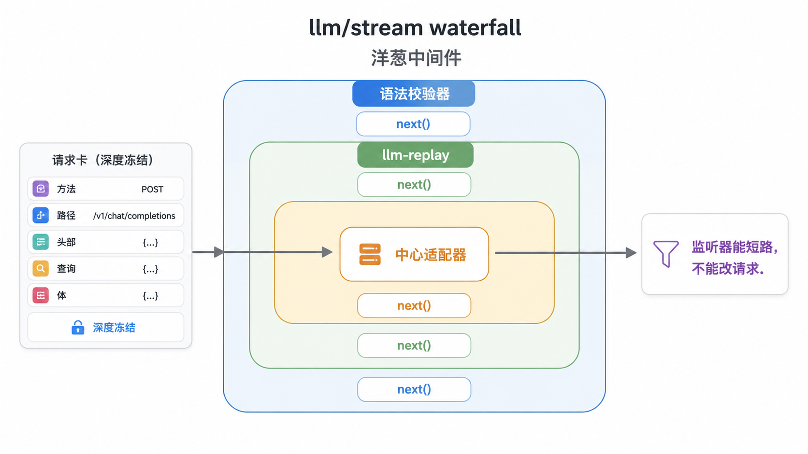

到达适配器之前，请求先穿过 `llm/stream` waterfall。这是标准的洋葱皮中间件：每层监听器拿到请求和一个通往下层的 `next()`，可以放行，也可以自己 yield chunk 短路整次调用。适配器的解析发生在洋葱最里层，所以监听器在适配器被选中之前就有机会接管。dsh-llm 自己的运行期语法校验器就挂在这层的最前面，`llm-replay` 在测试里也用 catch-all 模式挂在这层替代真实 provider。

loop 构建的请求在这条路上是深度冻结的，改动会抛错，还带着一个进程局部的 loop 标记。原因是可重建性：请求内容是会话日志的纯函数，监听器只能读不能改。手搓的一次性调用不带这个标记，但消息同样遵守不可变契约。

## 差异死在适配器内部

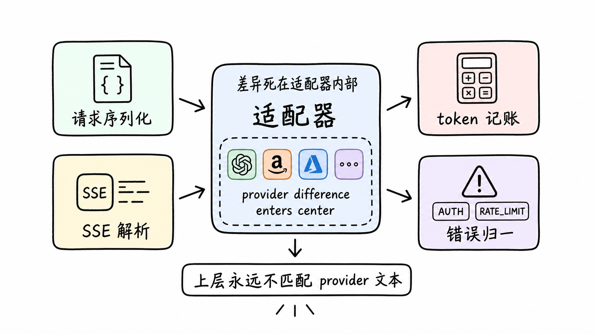

direct-fetch 的 DeepSeek 适配器和库支撑的 pi-ai 适配器内部结构完全不同，对外吐的却是同一种 chunk。以 direct-fetch 实现为例，provider 差异被吸收在四类事上。

请求序列化：provider 中立的请求变成 OpenAI 兼容端点的 HTTP 请求体，系统提示、工具 schema、采样参数各就各位。

流式翻译：SSE 载荷里的增量翻成 block-start 和 delta chunk。usage 在 wire 上有两种到达形态，附着在收尾 chunk 上，或者作为尾部 usage-only chunk 单独到，适配器两种都收，取最新的一份。

记账口径：DeepSeek 的 `prompt_tokens` 把缓存命中折进一个总数，适配器把缓存命中扣出来，让 token 计数的三个输入字段互不重叠，计费输入等于三者之和。口径统一后，上层看到的价格计算不再依赖自己知道这个 provider 的记账习惯。

错误长相：401 和 403 归 AUTH，429 归 RATE_LIMIT 并顺带解析 retry-after，400 里细节表明超上下文的归 `CONTEXT_WINDOW_EXCEEDED`，5xx 归 SERVER，DNS、TLS、拒连这类传输失败（fetch 只给一句 TypeError: fetch failed）包装成 TRANSPORT。消费者按 code 路由，永远不做 provider 文本匹配。

适配器还背三条统一义务。一是 provider 卡住自己兜底：每次流读取挂一个空闲看门狗，默认五分钟，只在迭代器挂起时计时，慢而持续产出的流不触发，超时归 TIMEOUT，调用方更早的 abort 归 ABORTED，整个请求共用一个取消信号。二是每个请求带产品 User-Agent，版本取自包清单，部署可以换成自己的身份但去不掉归因。三是一次适配器调用就是一次 provider 尝试：适配器必须关掉底层库自带的重试（pi-ai 把库的 maxRetries 设为 0），恢复是 agent 层的事。

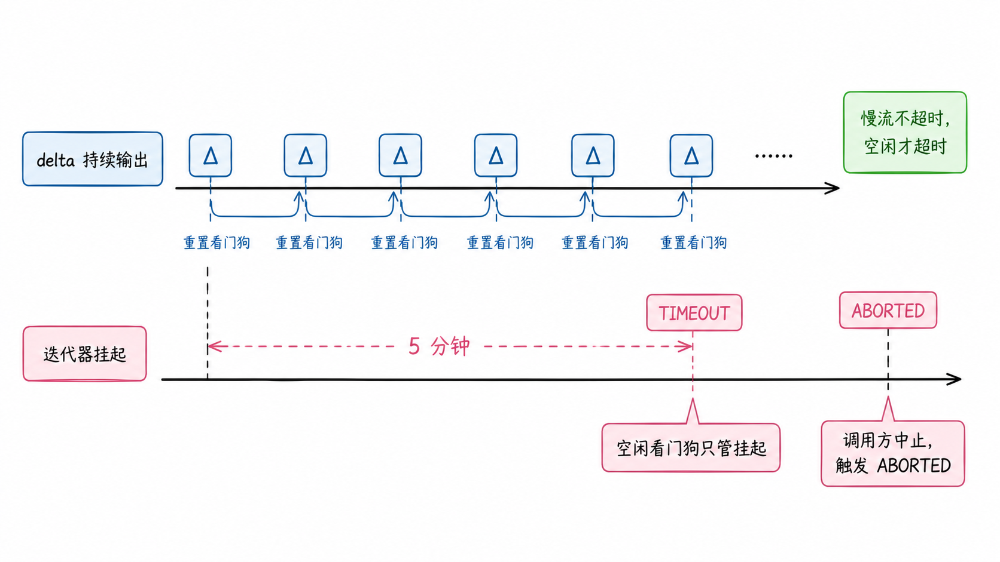

## 回程：一条封闭的流式协议

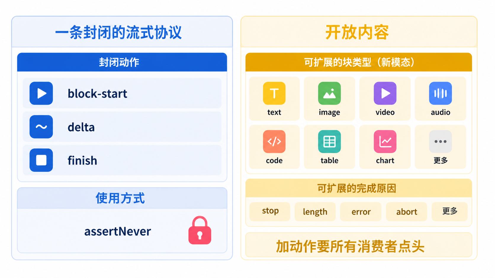

`StreamChunk` 有七个变体，但把它理解成两层更准确。动作词汇是封闭的：宣告块开始、三种增量、宣告块结束、记账、终态，七种动作不多不少，每个对 type 的 switch 结尾是 `assertNever`，新增一种动作会让所有消费者编译失败。内容词汇是开放的：块类型和 finish 原因是 merge-extensible 的映射，插件可以加宽，新块类型从 `block-start` 携带的类型字段里通过。这个区分是协议的关键：加一种新模态不需要动流式协议本身，加一种新流式动作则要所有消费者一起点头。

适配器对流的具体承诺有几条。交织的增量用 index 关联，多个工具调用的参数并行流式时靠下标区分，不搞嵌套流。`block-end` 携带拼好的完整块，消费者不需要自己把 delta 折回去。工具调用的参数全程是原始 JSON 字符串，因为对象没法增量拼接而字符串可以。usage 在 finish 之前，finish 之后什么都不许有；direct-fetch 适配器把 block-end、usage、finish 全部缓冲到 SSE 的 [DONE] 哨兵才按序发出，增量实时流、收尾一次性到位，用实现结构机械保证了这条顺序。

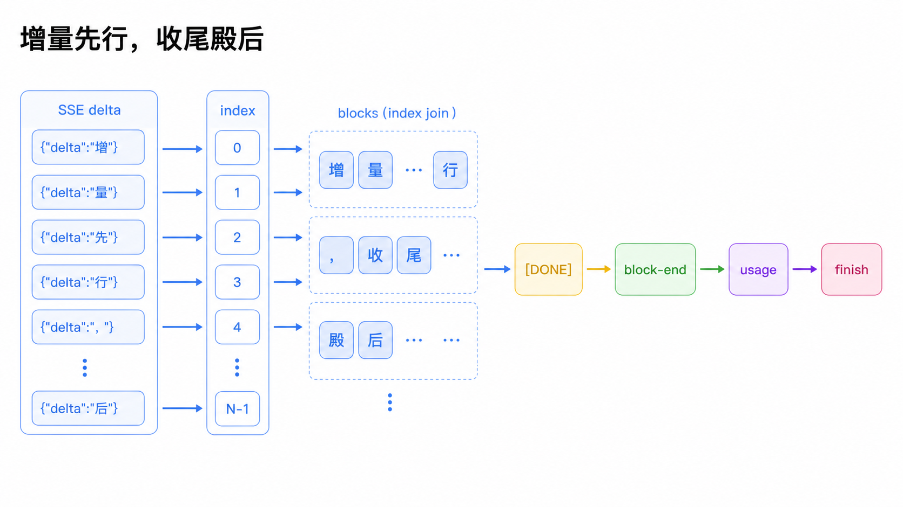

契约的兑现分三层。编译期：封闭联合加 `assertNever`，加变体就编译失败。运行期：dsh-llm 的语法校验器包住每条流，finish 之后再吐 chunk、usage 出现两次、增量落在没有打开的块上、正常结束时还有块没关，都会 fail loud，这个校验由可配置的 invariants 服务启用。消费端防御：`BlockAssembler` 对迟到的增量和重复的 block-end 直接忽略，行为异常的适配器既撑不爆内存，也污染不了一个已经完成的块。合起来：适配器写错，要么编译期炸，要么开发期断言炸，线上消费端还守得住。

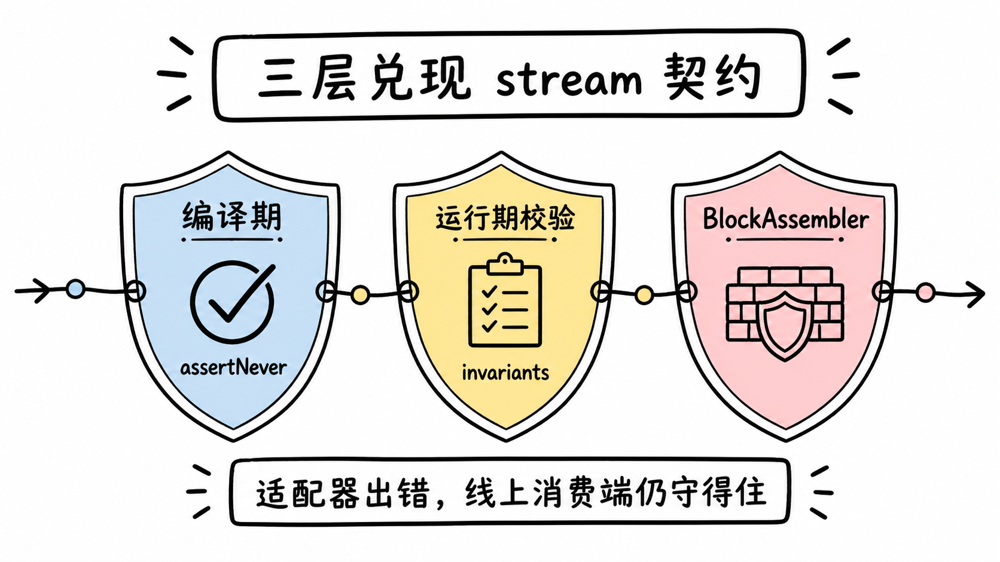

## 消费：双轨记账，一份拼装实现

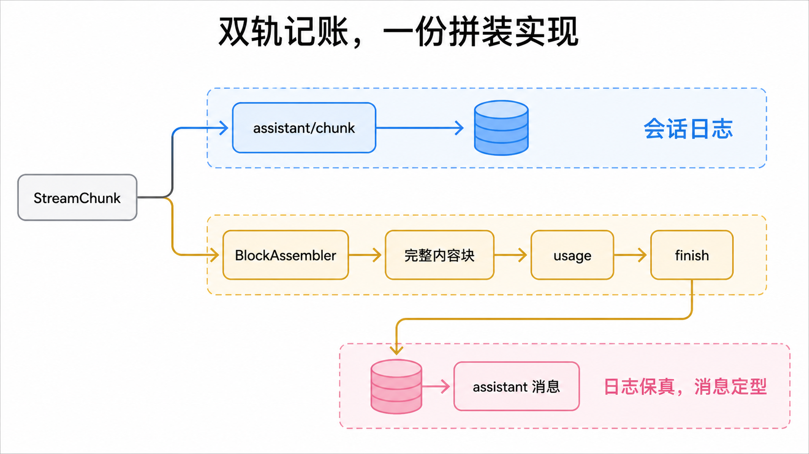

agent loop 对每条 chunk 同时做两件事：原样记进会话日志（`assistant/chunk` 事件），喂给一个 `BlockAssembler`。流结束后从 assembler 读出完整内容块、usage 和 finish，拼成 assistant 消息。两轨缺一不可：日志要保真，日后才能确定性重放；拼装要正确，消息才能定型。拼装算法全局只有这一份实现，任何需要把流折回消息的消费者都用它，不各自重写。

中途取消时，assembler 的 `interruptedBlocks()` 给出能安全定稿的前缀：有实际内容的文本和推理块，带着中断标记存进日志；工具调用一律省掉，因为截断的调用不该被执行，保留它就得伪造一个结果。max-tokens 截断走同一个逻辑：拼装时丢掉所有工具调用，因为半截参数同样不安全。这个保留或丢弃的决定还同步剪掉重放元数据里对应位置的条目，保证存储的元数据永远描述存储的内容。

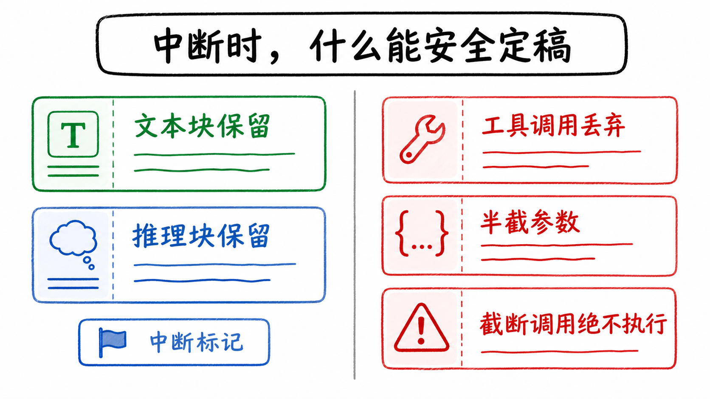

## 失败：两条出口，一种形状

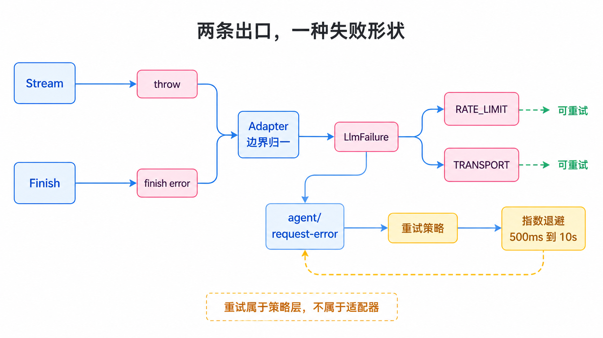

适配器失败有两条合法出口：从 `stream()` 里 throw（传输和协议错误），或者用带 error 或 aborted 的 finish 结束流（provider 在带内报错，适配器吐到一半没法抛）。runtime 在适配器边界把 throw 归一成终态 finish chunk，调用方已取消的记 aborted，其余记 error，消费者看到的是同一形状的 `LlmFailure`：人可读的 message、稳定的 code、可选的 HTTP 状态和诊断 requestId。归一只发生在适配器边界之内，中间件和消费者自己的失败仍然向上抛，不会被吞成流内的 finish。

两个容易误读的点。`providerRetryAfterMs` 只是 provider 请求等多久，不是要不要重试的决定。第三方 SDK 自带的错误 code 不进 dsh 的分类，归一器只认 harness 自己的 code，外来的记 UNKNOWN，防止别人的字符串污染路由表。

重试既不在适配器也不在 waterfall。终态 error 到达 agent loop 后走 `agent/request-error` 事件，恢复策略作为监听器决定怎么办，默认最多 5 次、可重试的 code 一张表（`EMPTY_RESPONSE`、RATE_LIMIT、SERVER、TIMEOUT、TRANSPORT），指数退避从 500ms 起封顶 10 秒。空响应被映射成 `EMPTY_RESPONSE` 而不是静默成功，正是为了进这张表：模型偶尔返回一个没有任何内容块的完成，这是可重试的故障，不是成功。没有恢复时，结构化失败成为这个 turn 的错误，本次尝试不提交任何 assistant 消息或工具副作用。

## 重放：chunk 流是可持久化的单位

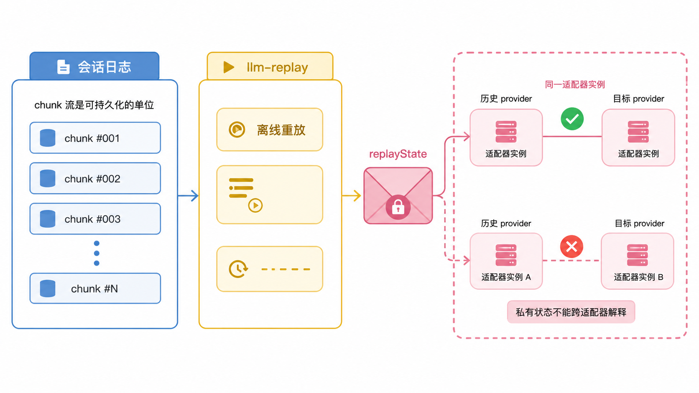

每条 chunk 原样落日志，直接后果是：重放不需要 provider。测试替身 `llm-replay` 从录制好的会话日志里重建 chunk 流，按 turn 和 step 分组还原每一次调用，整套 agent 测试离线确定性跑完，不需要 API key。它能做到这一点，靠的正是"流协议是中立的、日志是保真的"这两条前面的设计。

另一个 replay 是消息级的 `replayState`。成功的 finish 可以携带一个两半的信封：response 级的适配器私有元数据，加可选的逐块条目。harness 两半都不读，只共享一个词汇：拼装丢弃一个块，就同步丢弃同位置的条目。谁能拿到这段状态也有严格限制：只有历史 provider 和目标 provider 当前注册在同一个适配器实例上才传递，否则 runtime 把它剥掉，适配器只收到中立内容加 provider 和 model 字段。适配器用不了收到的状态时，那条消息降级为中立转换并附诊断，请求不失败。规则这么严的理由：私有状态跨适配器传递，等于让一个不理解它的适配器去解释别人的内部状态。

## 权衡

封闭协议的扩展成本是真实的。加一种流式动作，所有消费者编译失败；一个 provider 专属、别家用不上的流式事件进不了协议。dsh 的态度写在文档里：新模态只有适配器、UI、压缩、持久化重放路径都支持了，才进内容词汇表。

写适配器有门槛。契约有九条 MUST，加上 replayState 所有权和错误归一的 code 体系，官方专门有一篇 cookbook 带着写一个，这件事本身说明门槛不低。调试链也长：一个请求穿过 waterfall、适配器、provider HTTP 好几层，出问题时要对着 chunk 日志定位是适配器翻译错了还是 provider 返回得怪。

两个更隐蔽的洞。看门狗只在挂起时计时，意味着每四分五十九秒吐一个字的病态流永远不超时，五分钟约束的是空闲间隔不是总时长。usage 的缓存扣除靠适配器做对，口径算错不会被运行期抓到，只会体现在账单里。

回报对等：接新模型不碰 agent loop，错误处理统一到一张 code 表，记账口径一致，测试完全离线确定性重放。对一个要支撑任意 OpenAI 兼容端点的 harness，这个取舍是划算的。

## 结论

`ctx.llm` 把调模型压成一个注册表加一条封闭流协议。路由认 provider 不认 model，接新端点只是注册一条路由。provider 差异死在适配器内部：请求怎么序列化、SSE 怎么解析、错误归一成什么 code、缓存怎么扣账，都是适配器的私事；对外的承诺只有一条流的语法和终态，增量先行、收尾殿后、失败有两条出口一种形状。契约靠三层兑现：编译期的封闭联合、可启用的运行期语法校验、消费端的防御性拼装。重试归策略层，重放归会话日志，适配器只是一次 provider 尝试。代价是扩展贵、门槛高、调试链长，换来的是 agent loop 永远不用认识任何一个 provider。

## 延伸阅读

- [LLM Streaming 子系统文档](https://github.com/deepseek-ai/deepseek-harness/blob/master/docs/subsystems/llm-streaming.md)：契约原文与全部类型定义
- [Capability Seams](https://github.com/deepseek-ai/deepseek-harness/blob/master/docs/capability-seams.md)：ctx.llm 接缝在全景里的位置
- [Adding an LLM Adapter cookbook](https://github.com/deepseek-ai/deepseek-harness/blob/master/docs/cookbook/adding-an-llm-adapter.md)：官方的适配器编写教程
- [packages/llm README](https://github.com/deepseek-ai/deepseek-harness/blob/master/packages/llm/README.md)：子包职责概览
- [llm-replay README](https://github.com/deepseek-ai/deepseek-harness/blob/master/packages/test-support/llm-replay/README.md)：录制回放测试替身的机制细节

上一篇：[系统提示组装与动态 Cordis：dsh 让 agent 改自己的插件树](./15-system-prompt-assembly-and-dynamic-cordis.md)
下一篇：[dsh 的多模态附件：模型看到的图是派生出来的](./17-multimodal-attachments.md)
