# dsh 的多模态附件：模型看到的图是派生出来的

> dsh 不把图片字节写进会话日志，日志里流通的是内容寻址的不可变引用；引用背后的持久字节也不是用户上传的原图，而是一份剥离了元数据、统一成 8-bit sRGB、长边不超过 2048px 的规范化图。发送时每条模型路由再从这份规范图确定性派生出各自的请求版本，像素预算、编码格式、投递方式全由路由决定。
> 这一篇沿着一幅图从用户手里走到模型眼里：准入和规范化各做什么，模态声明怎么当门卫，DeepSeek 的 Files API 如何让历史里的图不用每轮重传，请求装不下时最老的图怎么换成文字。

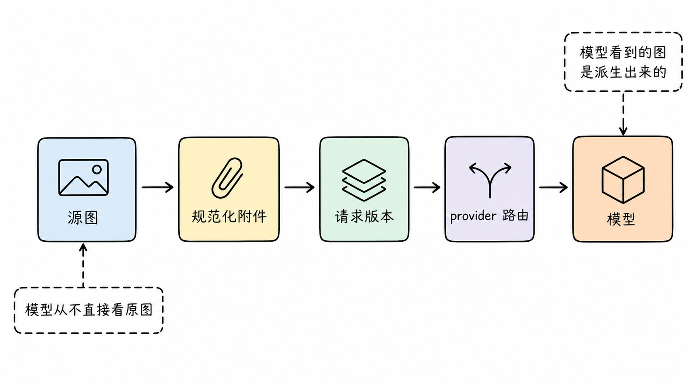

## 一张图进会话，就不是一轮的事了

多数 agent 的图片处理停在"把图塞进下一个请求"。一次性对话这样够用，dsh 的会话是持久日志，要支撑 fork、resume、换 provider、重放。一张图一旦被接受，就作为历史的一部分跟随这个会话之后的每一次模型请求。这个事实决定了 attachment 子系统的整个形状。

dsh 的底线从第一版起没变过：会话日志里流通的是引用，字节待在存储里。图片是二进制大对象，base64 编码后体积还要涨约三分之一，直接写进日志，日志立刻变成 MB 级的文本二进制混合体；浏览器 object URL 和宿主机临时路径活不过进程重启；不同 provider 要的图片表示不同，把任何一种写进日志，日志就和那个 provider 焊死了。所以生产者把字节交给 `ctx.attachments` 这个接缝，服务完成校验、确认字节耐久落盘之后，才发布一个内容寻址的不可变引用，会话事件和模型可见的 ImageBlock 里装的都是这个引用加元数据。

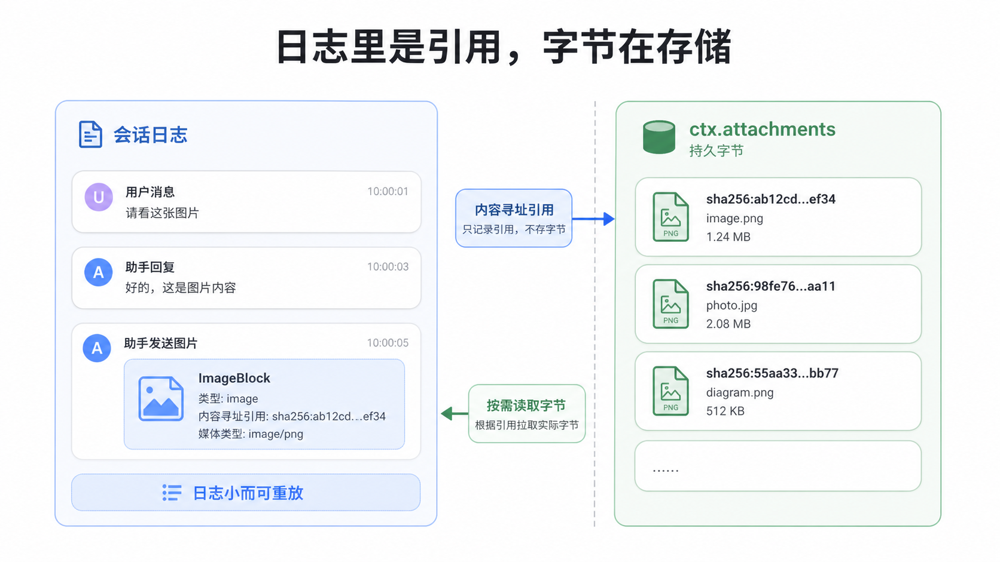

但只有这条底线还不够。2026 年 8 月合入的统一图片管线改造（仓库决策文档 `unified-image-request-pipeline`）把它往前推了一步：持久化的字节本身也是一份翻译产物，发送时还要再翻译一次。要看懂这一步，得先看一份字节为什么不够。

## 一份字节为什么不够

让同一份图片字节既当存档又当请求负载，等于让一份字节和一份光栅同时背四种职责：存储要耐久，最好小而干净；内联 base64 要考虑请求体积膨胀；DeepSeek 的 Files API 有自己的单图和总量配额；每条模型路由有自己的像素与编码上限。四个约束各不相同，满足得了这个就满足不了那个。

改造前的三类真实故障都记在决策文档里。干净的 16-bit PNG 能通过准入进入历史，之后才被 DeepSeek 拒绝，因为 provider 只吃 8-bit sRGB。重复 base64 让长会话的每个请求都背着全部图片字节持续增长。最麻烦的是第三类：provider 拒绝了历史里的某张图之后，同一份字节还会进入之后的每一次请求，会话被一张图卡死。

解法是把"存什么"和"发什么"拆成两个显式版本。附件后端持有一份 provider 无关的持久规范化附件；每条支持图片的模型路由持有一个确定性请求策略，请求版本从规范附件派生并缓存。会话历史里只有规范附件的引用，内联字节和提供方文件 ID 都是瞬时的请求投影，不落日志。

于是同一张图在 dsh 里最多以三种形态存在：用户提交的源图、落盘的规范化附件、按路由派生的请求版本。模型看到的从来不是用户的原图，而是第三次翻译的结果。

## 第一道门：准入与规范化

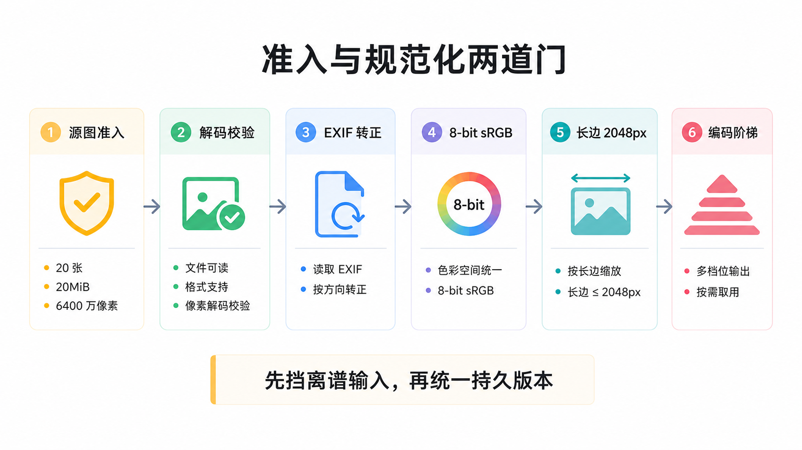

图片进会话有几条路：浏览器或 API 客户端随消息上传的 base64、模型调用的 `read_image` 工具、MCP 服务器返回的带图结果、声明接受图片的斜杠命令，外加 ACP 桥接（连接初始化时没宣告图片能力，图片提示直接被拒）。所有路全部汇进 `ctx.attachments` 同一道准入，同一套校验、同一套限额、同一个存储。

准入的第一层看源图本身。每条消息最多 20 张，批量总字节 200MiB；单张源图 20MiB、6400 万像素、单边 8192px 以内，声明的媒体类型必须和解码结果一致，改扩展名混不过去。对比更早版本"单图 3.5MB、单边 2000px"的门槛，各项放宽了好几倍。放宽的底气来自第二层：反正有规范化兜底，门口只负责挡住离谱的输入，不必替模型路由提前做尺寸裁决。

第二层是规范化。每张图被完整解码，应用 EXIF 方向（手机竖拍的照片转正），剥掉全部元数据和色彩配置文件，转成 8-bit sRGB 或 sRGBA，保持宽高比把长边压到 2048px。编码按图的性质选格式：采样判定为低色数图形就先试 PNG（无透明通道才用调色板），带透明的依次试质量 85、80、75 的 WebP，不透明的依次试这三档质量的 JPEG，第一个不超过 4MiB 的结果胜出；全部超限就再缩小尺寸重试。低色数判定用最近邻采样加颜色量化，而不是像素平均，避免把高频照片误判成色块图。干净的、单帧的、已经是 8-bit sRGB 且尺寸字节达标的 PNG、JPEG、WebP 按字节原样直通，保留内容寻址去重；GIF、动图、带元数据的、16-bit 的、色彩空间不兼容的都会触发转换，动图被压成单帧。

规范化之后才落盘。本地实现对字节算 sha256，对象存进 `attachments/v1/objects` 下的分桶目录，引用就是摘要。发布顺序是定死的：写临时文件、强制 fsync、硬链接到目标路径、目录条目落定，全部完成才对外发布引用。同一张图存两次不占双份空间，这也是 `read_image` 被标记为并发安全的原因。批量准入有原子性保证：先把这条消息里的每张图都规范化验证完，才开始提交任何一张，某张被拒不会留下半截对象。先持久化、后追加会话事件，这个顺序由接缝的调用方契约强制，日志因此永远自洽。

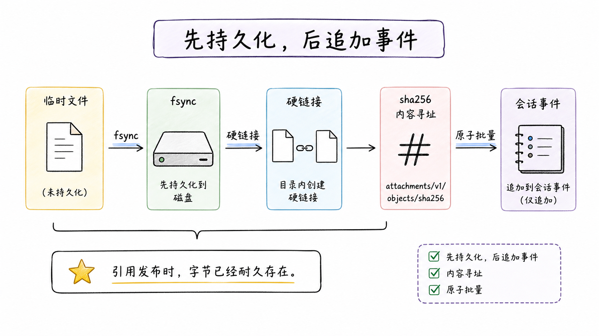

引用里记录够用的元数据：媒体类型、精确字节数、规范化后的宽高、剥掉路径信息的显示名。如果规范化缩小了图，还会记录 EXIF 转正后的原始尺寸 `originalDimensions`，这个字段后面 `read_image` 要用。引用对消费者是不透明的，不许从它反推出文件系统路径。

## 模型自己拿图：read_image

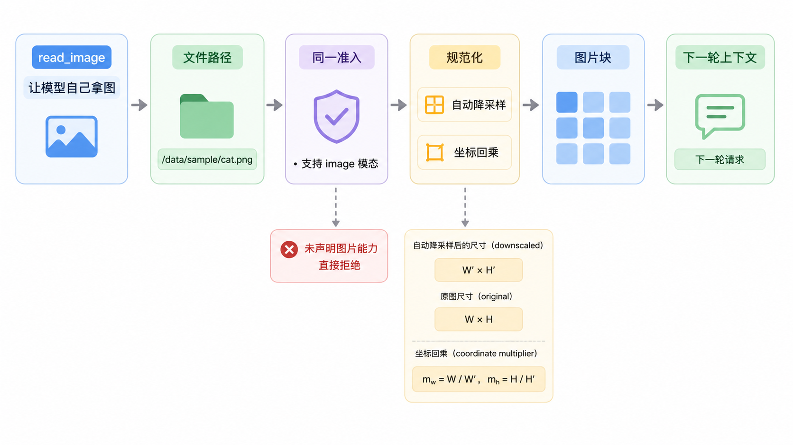

模型不能凭空看图，但可以自己读。`read_image` 接受一个文件路径，把 PNG、JPEG、WebP、GIF 文件走一遍和用户上传完全相同的准入与规范化生命周期，返回文本信封加图片块，图从下一轮请求起进入模型上下文。没有挂载 attachment 存储的部署，这个工具根本不会注册。

工具侧的门比上传侧严。上传预检在模型能力未知（`inputModalities` 未声明）时放行，把最终裁决留给适配器；`read_image` 相反，路由解析不到、或者没有显式声明 image 模态，直接拒绝，错误信息让用户换一个支持图片的模型。理由和 MCP 侧一致：工具结果会进持久历史，在不确定的路由上产图等于给会话埋雷。

超大图的处理拆成了两种情况。在准入上限之内（单边 8192px、6400 万像素、20MiB）的图会被自动降采样到规范化尺寸，不再报错；但缩放对模型是有信息损失的，模型在图上定位特征后，坐标要对回原文件时比例就错了。所以凡是规范化缩小过的图，`read_image` 的文本信封会明确报告 `downscaled from <宽>x<高> px; multiply coordinates by <倍数>` 这样的内容，把原图尺寸和坐标回乘比例一起给模型。超出准入上限的仍然返回可恢复的工具错误，建议缩小后重读，这类图绝不能进持久历史。

## 模态门控：声明，不是试错

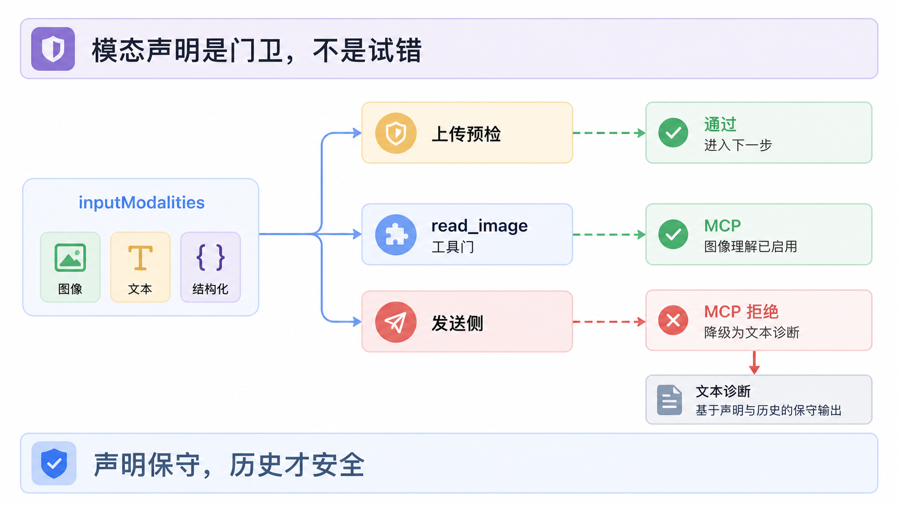

图存好了，模型也得声明自己吃图。能不能看图在 dsh 里是模型元数据 `inputModalities`，不是运行期试出来的。截至 2026-08 的默认目录里，唯一声明图片输入的模型是 deepseek-official 路由的 `deepseek-v4-flash-vision-exp`；手填的模型默认按纯文本处理，因为没有任何协议能问一个端点"你支持图片吗"，宁可保守。

这个声明被三道门消费。上传预检：提交带图消息时模型已声明不吃图，请求被拒，一张字节都不落盘；能力未知时放行，适配器兜底。工具门：`read_image` 和 MCP 图片准入都要求路由显式声明 image 模态，未声明即拒。MCP 侧还有一个刻意的差别：用户上传被拒是硬拒绝，MCP 工具结果里任何一张图被拒，整个结果的图降级成文字诊断，说明媒体类型和被拒原因，原始数据保留给程序调用方，工具调用本身仍然成功，因为一个结果里通常还有文字部分，没必要整单作废。第三道门在发送侧，行为在这次管线改造里变过，值得单独说。

旧行为是切换守卫：会话历史里已经有图，用户想把模型切到纯文本模型，切换被拒绝。新行为不再拒绝。llm seam 在派发请求前检查目标模型，声明了纯文本而历史里有图，就把图投影成一段确定性占位文本再发送，内容是"因模型只接受文本省略了图片，附件 sha256 前八位"。会话照常可用，历史一个字不改，随时可以切回视觉模型让图重新出现。决策文档给出的理由：持久历史可能比最初读它的模型活得更久，拒绝切换等于让一张图锁死整个会话的模型选择权。

声明保守会把图挡在门外，声明过头更糟，这条没变。模型声明了图片能力而端点实际不支持，provider 会拒绝请求；图在持久日志里，每轮请求都带着它，同一个请求会一直失败，直到撤掉声明并开新会话。官方排错文档保留了这一条。改造后错误信息至少不再是干巴巴一句 provider 报错：适配器会把附件 ID 或显示名、图片在历史里的位置、媒体类型、位深、尺寸连同 provider 原文一起写进主错误，多图无法定位对象时列出全部候选。

## 发送：按路由派生，按提供方投递

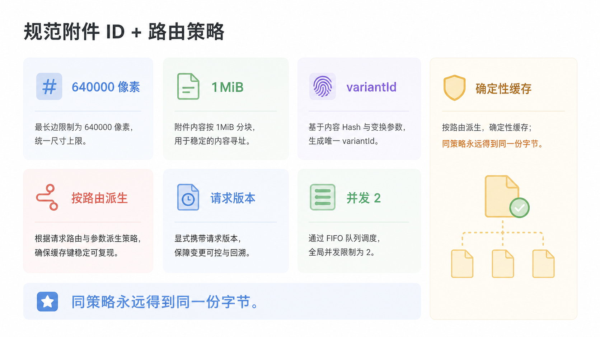

到组装请求这一步，适配器把引用交给 `AttachmentStore.readImageRequest`，附上这条路由的预算。DeepSeek 视觉路由的默认预算是总像素 640,000、单张编码 1MiB，低细节档 512×512。派生先等比缩放，公式是 `min(1, sqrt(预算像素 / 现有像素))`，只缩不放：一张 2048×1024 的规范化附件在这个预算下投影成 1130×565。然后走和规范化同款的编码阶梯，质量档只有 85 和 80 两级。如果不需要缩放且字节在预算内，直接复用规范化字节。

派生的确定性是这套设计的支点。派生输入的完整描述，包括规范附件 ID、变换策略版本、像素和字节预算、固定编码参数，被哈希成 `variantId`，请求版本缓存在 `attachments/v1/request-images` 下面。同一张图、同一条路由、同一个策略，永远得到字节相同的请求版本；缓存命中只探测文件头核对格式、位深、色彩空间、尺寸和字节上限，不再完整解码。并发的相同派生共享一次计算，单个调用方取消不影响其他等待方。全部变换经过一个 FIFO 限流器，默认同时跑两个，配置项 `imageCompressionConcurrency` 可调到 1 至 8，调低省内存，调高低延迟。普通 agent 轮次、压缩摘要流、直接 `ctx.llm.stream` 调用全部走同一个派生入口，没有旁路。

每张图进入请求时，前面都附一行稳定句柄：`Image sha256:…; request image 1130x565px.`。模型引用图里的坐标时，这行文本就是它面前这份光栅的坐标系说明。

投递方式按适配器分。pi-ai 路由把请求版本编码成 base64 内联，计量按 base64 膨胀后的长度算，请求上限默认 20MiB，像素预算和单张字节可以按 provider 配置。DeepSeek 官方适配器优先走 Files API：请求版本以 `user_data` 用途上传，聊天请求里只放 `file_id`，历史里的图不用每轮重传整份字节。

Files 上传有完整的生命周期管理。上传 ID 按端点、API key 派生的作用域加 `variantId` 建索引，索引文件权限 0600，不存 API key 本身。默认请求 7 天有效期，剩余不足一小时时直接重新上传，不去远端查询。配额报错时列出最旧的 `dsh-` 前缀自有文件，分页取完后删除再重试一次。聊天报文件 ID 失效时，provider 点名了哪些 ID 就只失效哪些，重新上传后重发一次；第二次还失败就返回错误，绝不发起第三次。Files 解析有独立的 60 秒超时，和流式空闲超时解耦，Files 卡住不至于拖死整个流。

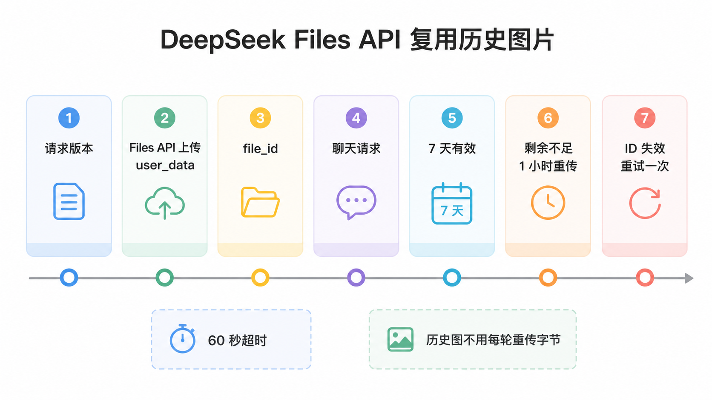

Files 解析失败时走有界内联回退：同一批请求版本字节改用 base64 发送，上限 20MiB，字节移除步长 10MiB。回退复用已经派生的字节，不重新压缩。于是 DeepSeek 的图片投递形成两级预算：正常路径按原始字节计量，上限 128MiB、600 张；回退路径按 base64 膨胀后计量，上限 20MiB。

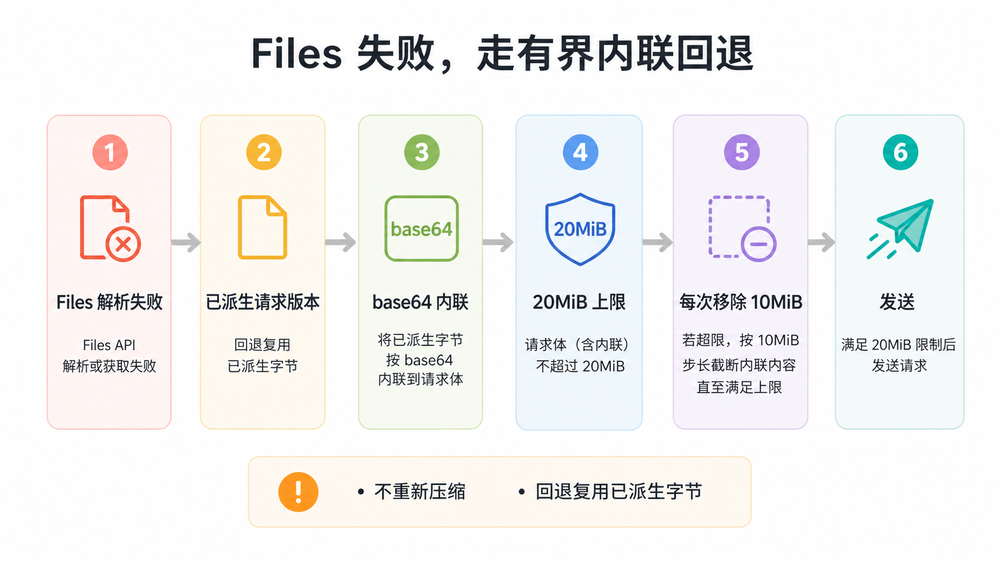

## 装不下：确定性降级

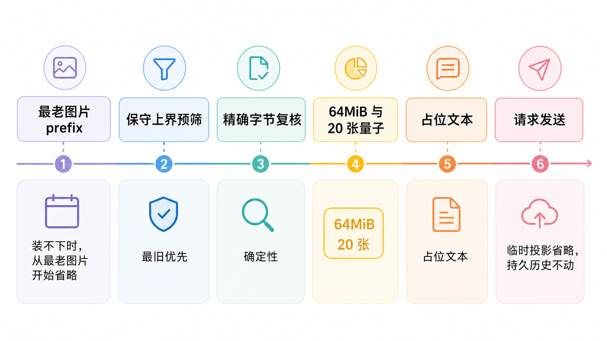

历史越长图越多，总有请求装不下的时候。dsh 的降级是确定性的从旧到新投影，分两遍。第一遍在读附件之前，用保守上界（每张图取附件字节数和请求版本字节上限的较小值）算出要移除的最旧前缀，这一遍连被移除的图都不读，已省略的图片对象缺失或损坏也不会阻塞请求。第二遍用派生后的精确字节数复核，但不会把已省略的图加回来。

移除量按量子步长取整，这是给 provider 的提示词缓存留的余地。DeepSeek 默认字节量子 64MiB、张数量子 20：129 张 1MiB 的图会一次移除最老的 65 张，保留 64MiB；历史再涨 64MiB 以内，移除前缀不变，同一个会话的请求投影就不会每加一张图就改写一次，provider 侧的缓存前缀得以保住。被移除的图替换成占位文本，把省略的原因、顺序和找回的办法都告诉模型：因为请求限额被省略，旧的先省略，有路径就重新读文件，没路径就请用户再贴。替换只发生在本次请求的临时副本上，持久历史不动，下一轮换了路由或限额变了，历史里的图一张不少。

两级限额各管一段：消息级限额在准入，挡坏图进历史；请求级限额在组装，保请求发得出去。前者一旦放行就赖在历史里不走，后者每轮都可以重算。

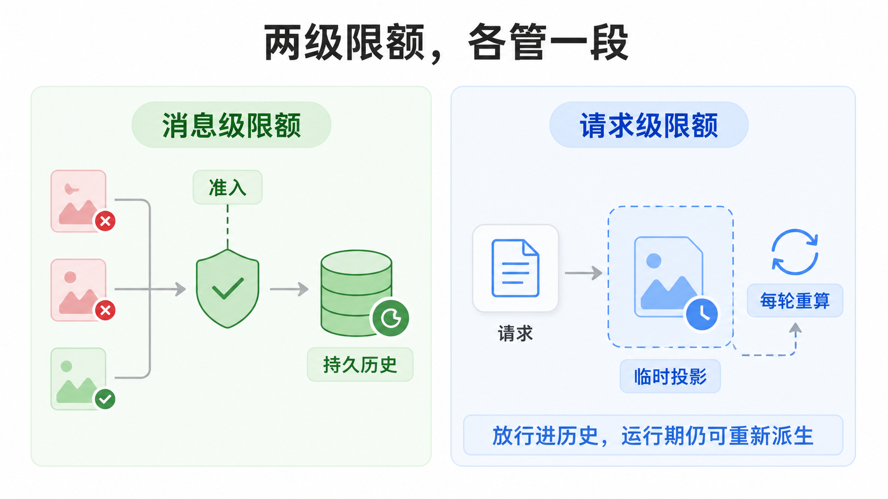

## 权衡

图片在这套设计里最多存三份派生：规范化附件、请求版本缓存、远端 Files 对象。加上存储只增不减的既有决定（fork 和 resume 出来的会话共享对象，引用感知的垃圾回收推迟给更高层），磁盘占用随使用单调增长，部署方需要自己的清理策略。换来的是确定性：同一策略下永远同一份字节，缓存和上传索引可以跨轮次、跨会话复用。

规范化和请求变换默认并发 2，批处理延迟比串行低，峰值内存比串行高，内存紧张的部署可以调到 1。动图被压成单帧，动画信息在规范化阶段就丢了，对截图场景无感，对确实需要动画的场景是硬损失。读路径上每张在场的图都要被完整哈希一遍，成本线性于字节数，换来的是篡改和损坏在读时就能发现，而不是变成模型眼里的乱码。

最尖锐的遗留问题在持久对象损坏。今天的语义是明确失败：对象缺失或摘要不符，之后每一次模型请求都失败，会话没有出口。把不可读的历史附件隔离进专门事件、让会话继续可用的设计还停在提案阶段（2026-08-20 的 read quarantine 决策文档，状态 proposed）。统一管线决策文档对此没有回避，明确列为后续跟踪项。

还有一个约束值得说破：会话里进了图，等于接受它的模型选择被模态声明约束。声明过头的模型会卡死会话，这是"图跟随每一轮请求"这个决定的另一面，排错手册至今的修法仍是撤声明、开新会话。

## 结论

dsh 让 agent 看图的方式，是把图片当成会话的持久资产，再把这个资产的表示拆成两层：日志里是内容寻址的规范附件引用，字节是剥离元数据、统一色彩空间、限额内的规范化图；发送时按路由确定性派生请求版本，DeepSeek 用 Files API 复用上传，其他路由内联 base64，装不下就从最老的图开始换成占位文本，历史不动。所有判断前移到进历史之前：完整解码校验、部署限额、原子批量提交、模态声明门控；所有运行期问题用运行期手段解决：派生、缓存、回退、降级。日志因此可以很小，却能驱动一个看图 agent：图不在日志里，日志里只有一把随时能取回图、并且能按任何路由重新翻译图的钥匙。

## 延伸阅读

- [Durable Image Attachments 官方文档](https://github.com/deepseek-ai/deepseek-harness/blob/master/docs/subsystems/attachment.md)：接缝定义、规范化附件与请求版本的类型契约、先持久化后事件规则
- [Provider 配置指南](https://github.com/deepseek-ai/deepseek-harness/blob/master/docs/user/guide/providers.md)：模态声明的配置方法与图片排错两条
- [Capability Seams](https://github.com/deepseek-ai/deepseek-harness/blob/master/docs/capability-seams.md)：ctx.attachments 接缝在三角色表中的定位
- [Tool Catalog](https://github.com/deepseek-ai/deepseek-harness/blob/master/docs/tool-catalog.md)：read_image 的注册条件与执行门控

上一篇：[dsh 的 LLM 适配器与 stream 契约：把 provider 差异关在适配器一层](./16-llm-adapter-stream-contract-source-walkthrough.md)
下一篇：[沙箱、审批与权限：dsh 怎么安全地放 agent 上机](./19-sandbox-approval-permission.md)
