# dsh 的沙箱、审批与权限：怎么让 agent 安全操作真实机器

> dsh 把"让 agent 安全操作真实机器"拆成三个各自独立、各自 fail-closed 的子系统：沙箱管文件效果的边界，审批管单次动作的放行，预设把前两个打包成用户能选的名字。三者没有谁能替代谁，也没有谁在拿不准时偷偷放行。两条最值得记住的纪律：沙箱的强制力是一个被报告的事实（full 或 partial），不是一句承诺，拿到 partial 的消费者必须拒绝或明示；一次审批只放行被问的那一个动作，审批系统本身坏了，默认结果是拒绝。
> 被拒绝不是终点。沙箱拒绝会在输出里留下带模式名的标记和一条同轮次升级提示，模型可以带着理由对同一个动作重试一次更宽的模式，审批通过后更宽的策略只印在那一次调用上，不延续。这条链路的每一环都落在会话日志里，重放可以完整重建。

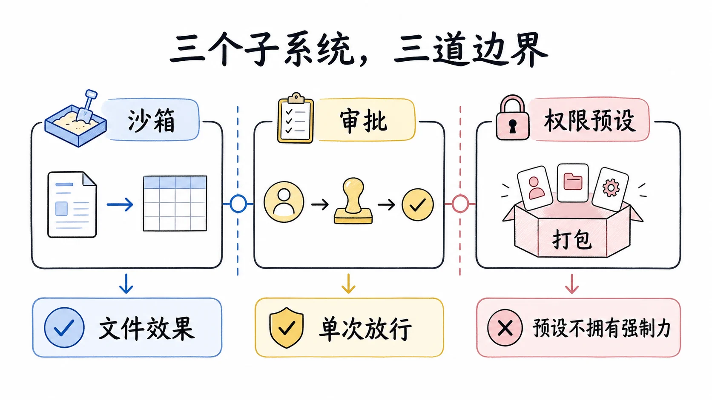

## 三个问题，不是一个问题

"别让 agent 干坏事"粗看是一个问题，细想是三个。

它能碰哪些文件？一条 `rm -rf` 该不该被拦，取决于它写的东西在不在允许范围内，不取决于你当时在不在电脑前。这是效果的边界，答案应该在你离开工位时依然成立。

这一个具体动作，现在能不能放行？哪怕动作在允许范围内，你也可能想在它执行前看一眼、点个头。这是单次决策，问的是此刻的许可，不是永久的许可。

上面两个的组合叫什么名字？用户不想每次分别调两个开关，想选一个"只读模式"或"全权模式"。这是给人用的便捷层。

很多系统把三者揉成一个"权限"概念，结果是逻辑纠缠：调了沙箱模式以为也改了审批，审批拒绝了以为沙箱也收紧了，出问题时说不清是哪个环节放的行。dsh 把它们拆成三个子系统，各有自己的接缝、自己的事件、自己的 fail-closed 语义，再用一个很薄的预设层把前两个打包。拆分的验收标准很朴素：换掉其中任何一个，另外两个的行为不变。

三个子系统共享一条实现纪律：开关即事件。沙箱模式的一次切换，就是会话日志里的一条 `sandbox/mode` 事件，没有事件之外的旁路状态；审批策略同理，是 `approval/policy` 事件。有效值永远是"日志里最后一条这类事件，落空则回退部署默认"。这条纪律的回报是重启免疫和会话隔离：两个并发会话各切各的模式，互不污染，因为各自的有效值来自各自的日志；进程重启后重放日志，开关状态原样回来，不需要一个外部配置存储来记住上次切到哪了。

## 沙箱：文件效果的围栏

沙箱接缝回答"能碰哪些文件"。它由两个服务组成：`ctx.sandboxPolicy` 负责解析这次调用该用什么策略，`ctx.sandbox` 负责把要跑的命令包进围栏。

### 三种模式，只管文件

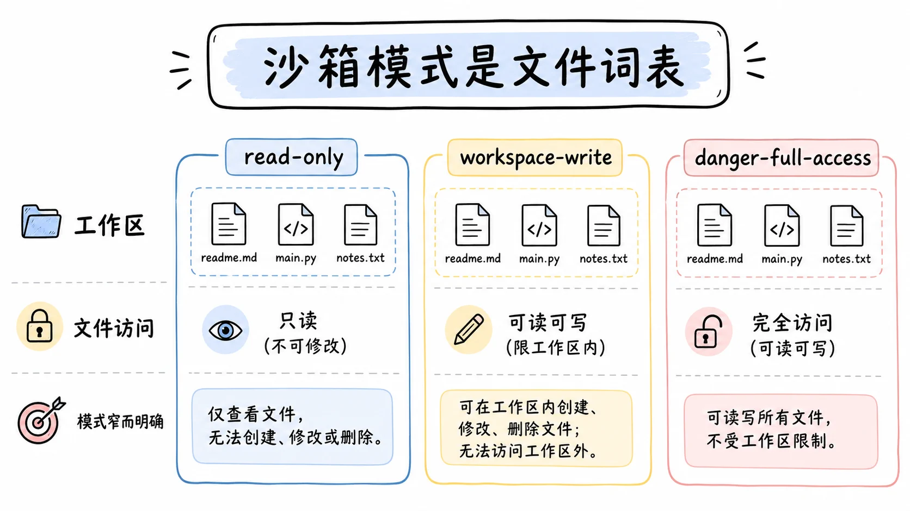

模式只有三个值：`read-only`、`workspace-write`、`danger-full-access`。词表管的东西刻意收窄：只管文件系统效果，网络和进程可见性都在词表之外。一条 `curl` 把数据外发，或者 `ps` 看到别的进程，沙箱不管。收窄不是偷懒，是为了让"沙箱能不能挡住"这个问题有确定答案。一个什么都想管的围栏，结局是什么都管不全，使用者反而无法推理它的边界。

`read-only` 要求后端拒绝写。POSIX 后端会额外开 shell 需要的 `/dev/null` 接收端，不然 shell 语法里的重导向会让命令在"只读"模式下莫名其妙地死掉。`workspace-write` 允许写工作区根目录下面，加后端承诺的临时区。`danger-full-access` 绕过围栏。这里有个容易理解错的地方：它不是一个"被围栏放行一切"的模式，而是压根不进围栏。一个 `danger-full-access` 的消费者直接 spawn 它原来的 argv，根本不调 `ctx.sandbox`。所以只有前两个模式会送到 provider，围栏的实现只为"确实要围"的场景负责。

这条边界不只罩住 shell。2026 年 7 月中的跨工具族改造之后，文件系统工具（`read`、`write`、`edit`）通过进程内的 `dsh-fs-sandbox` 提供方执行同一套模式词汇：bash 类命令靠 OS runner 围栏，fs 工具靠进程内路径围栏，两者都以同一个 `ctx.sandboxPolicy` 解析出的模式为键。于是在 `read-only` 会话里，模型绕开 bash 直接调 `write` 工具同样会被拒。web 和 todo 工具仍在进程内且不受约束，理由是 web 的唯一效果是网络，不在文件效果词表内。截至 2026-08 的组合里，受约束的执行器有两个消费家族：`dsh-bash-sandbox` 与 `dsh-pwsh-sandbox`，后者是 2026 年 8 月初 PowerShell 工具链进入沙箱阵容的结果。

### 强制力是被报告的事实

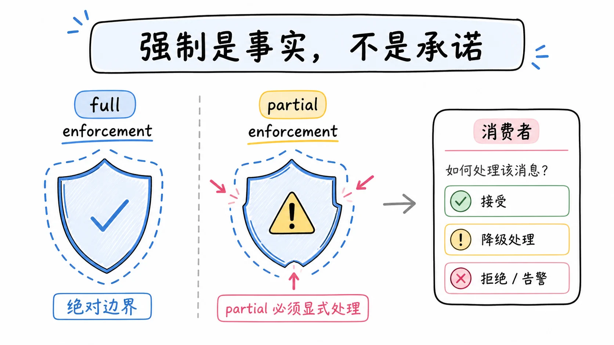

整个沙箱设计最反常识的一点在这。强制力 `SandboxEnforcement` 只有两个值：full 和 partial。full 表示后端能管住这个模式承诺的全部文件效果；partial 表示当前后端或老内核只能管住一部分。

partial 不是理论上的客气话，三个主流平台各有具体出处。Linux 上首选 runner 是 bwrap，但它恰恰在沙箱最重要的主机上经常不可用（精简容器、禁用了非特权 userns、LSM 拒绝 mount），所以链上备选是 Landlock，而老内核的 Landlock ABI 管不全所有操作（ABI v3 之前不管控路径 truncate），此时如实报告 partial 而不是拒绝主机，这是让备选在旧内核上仍可用的有意权衡。macOS 的 Seatbelt 依赖的 `sandbox-exec` 处在被 Apple 废弃但仍随系统发布的悬置状态。Windows 在 2026 年 8 月初之前干脆是保留的空链，失败关闭；8 月 8 日合入的 ACL 受限令牌档填充了它，但 Everyone 组与 NTFS 硬链接两个边界缺口让它结构上只能是 partial。三个平台，没有一个对所有场景给出无条件的 full。

为什么不把这些缺口藏起来，报个笼统的"已沙箱"？因为沙箱的强制力不是承诺，是事实。一个消费者需要绝对边界，比如它要跑一段可能删东西的代码，拿到 partial 却假装是 full，就是埋一颗"以为挡住了其实没挡住"的雷。把事实报出来，判断权交给消费者：绝对边界的场景拒绝执行，能容忍的场景明示给用户。代价是消费者多写一段分支，回报是没有人误信一道有缺口的墙。

### 策略按调用解析，不写死在 provider 上

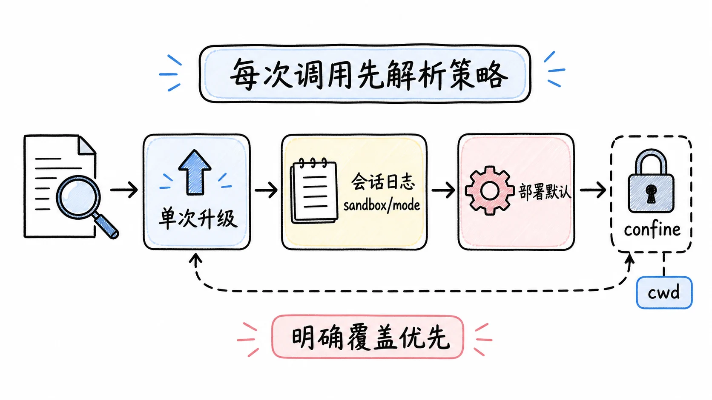

完整的执行策略是 `SandboxExecutionPolicy`，三个字段：mode、workspaceRoot、sessionId。每次调用，`ctx.sandboxPolicy.resolve()` 都重新解析一次，优先级是三层：显式批准的升级模式覆盖最高（升级重试时传入），其次是会话日志里最后一条 `sandbox/mode` 事件，最后落回部署默认值。

为什么要按调用携带，而不是存成 provider 的状态？因为并发的存在。同一瞬间，bash 可能跑在 `read-only` 下，而一个被围栏的子 agent 需要它的状态目录可写。如果策略是 provider 的可变状态，这两个消费者就得排队改同一个状态，或者互相覆盖。按调用携带，provider 每次拿到一个完全指定的策略，自己永远不改内部状态，并发自然成立。一个被批准的"提权重试"也因此没有副作用：它是一次带更宽策略的新调用，不是对 provider 状态的一次修改。

另外两个字段各有用途。workspaceRoot 优先取调用会话的不可变 cwd，部署配置是无人会话的兜底；规范化顺序是先用文件系统语义解析、再做词法归一，所以 cwd 里带 `symlink/..` 的路径会落到真实的运行目录，而不是被字符串拼接骗过。sessionId 用来给后端挂每会话的状态，Windows ACL 档是典型：每个活跃的会话加工作区对分配一个随机私有临时目录和从该路径派生的域分离 SID，工作区级别的常设授权单独保持；会话结束，随它去的临时目录一起失效，常设授权不受影响。

### confine：要么围栏，要么不跑

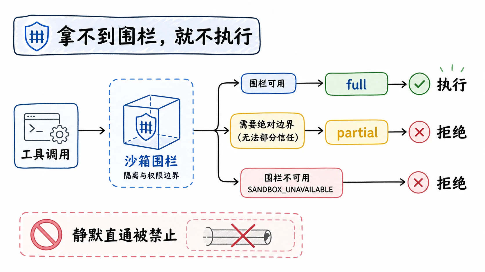

`ctx.sandbox.confine(argv, policy)` 返回替换用的 argv（围栏 runner 加配置，再加调用方原始的 argv），或者抛 `SandboxUnavailableError`，错误码 `SANDBOX_UNAVAILABLE`。契约里写死了一条不变量：对一个要求围栏的策略，静默的未围栏直通永远不合法。拿不到围栏就不跑，没有第三种结局。

有一个容易传错的参数形态：argv 是调用方要 spawn 的确切参数数组（程序加参数），不是一段 shell 文本。一个 shell 形态的消费者要传的是 `['bash', '-c', command]`。围栏包的是实际要执行的那个进程树，如果传了一段 shell 字符串进去，围栏包住的是把这串文本当参数的 bash，而不是文本展开后的命令，防护就错位了。

### stderr 里的两种方言

被围栏的命令跑完，stderr 上会出现两种性质完全不同的文本，区分它们是排查沙箱问题的关键。

第一种是拒绝方言。命令想写的东西在围栏之外，被挡住了，这是沙箱在正常工作。每个后端的方言不同：bwrap 的只读 bind 下报 EROFS 文本，Landlock 下报 EACCES，Seatbelt 下报 EPERM。围栏结果带着当前后端的这些签名，消费者匹配它们就知道"这是策略拒绝"。匹配必须只用当前后端的签名，不能取所有后端的并集，因为并集会声称识别一种这个后端根本不会产生的拒绝，分类永远虚高。

第二种是故障方言。沙箱 runner 自己拒绝启动或半路失败了，命令根本没跑。这要用另一套规则识别：先看退出码门（规则可以限定哪些非零退出码允许参与匹配），再剔除信息性行（整行精确匹配的无害输出），最后在剩余行里做大小写不敏感的致命子串匹配。Landlock 的规则是个具体例子：退出码必须是 125，加一行 `landlock-run:` 前缀的致命诊断；但精确匹配的部分强制执行通知只是信息行，即使子进程自己以 1、2 或 125 退出也不能当故障证据。退出码本身永远不能证明 runner 失败，必须落到 stderr 的一行证据上；分类过程也从不改写 stderr，命中的行原样保留做错误详情。

两种方言的区分为什么重要？把拒绝当故障，沙箱正确挡下的危险操作会被报成基础设施坏了；把故障当拒绝，沙箱真坏了却被当成命令被拦，无人修。消费者先查故障规则，再查拒绝签名，最后才把输出当成普通任务结果。

要诚实地说这条机制的边界：判定靠的是进程内的退出码加 stderr 文本，这不是密码学意义上的归因。一个被围栏的子进程可以故意模仿一行 runner 的致命文本，让故障归因指错对象。设计上接受了这一点，因为它骗到的是诊断信息，不是围栏本身的强制力，沙箱没有被绕过。

### 三个后端的形状

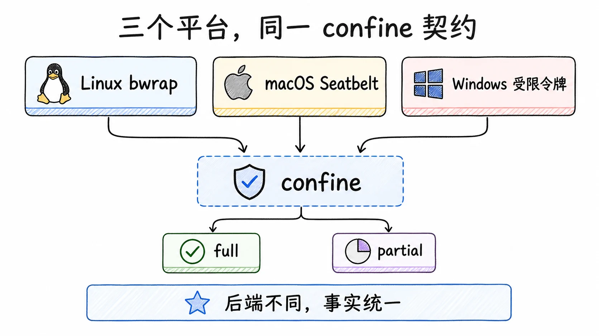

Linux 链是 bwrap 探测在前、Landlock 在后。探测是功能性的：构建并强制一个真实 profile 而不是查 `--version`，所以"装了但被内核禁用"的 bwrap 会诚实探测失败，选择落到随包交付的 Landlock launcher。这个 launcher 是约 300 行的 C11 程序，直接使用 Landlock UAPI，除静态链接的 musl 外零依赖，源码在仓库 `native/landlock-run` 下与消费方同仓构建发布。它在限制前设置 `no_new_privs`，规则集跨 `execve` 继承；`--probe` 在一个短命子进程里强制最大规则集，只有内核确实强制时才以 0 退出。bwrap 后端从 2026 年 8 月起还会取消共享 PID 命名空间并挂载匹配的 procfs，因为宿主 `/proc/<pid>` 的魔法链接能绕过文件约束；Landlock 与 Seatbelt 则保持进程可见性不变。

Windows 档的机制值得单独说，因为它展示了一条完全不同的路线。身份路线（新建账户或 AppContainer）靠"谁在跑子进程"限权，那个身份从零条 ACE 开始，要碰的每条路径都得事后补授权，等于全盘改造宿主 DACL。dsh 选择令牌派生路线：把调用者令牌复制为受限令牌（`CreateRestrictedToken` 加 `WRITE_RESTRICTED` 加 `DISABLE_MAX_PRIVILEGE` 加 `LUA_TOKEN` 标志），Windows 于是对写访问做两次检查，一次按正常 SID，一次按 restricting SIDs，两次都放行才授予写。读只凭正常检查即可通过，所以这套档不需要任何读授权，也不需要新账户。工作区 SID 由规范工作区路径做 sha256 后确定性派生成 `S-1-4-x-y` 形态；临时能力 SID 从每个会话的随机私有临时目录派生，TMP/TEMP 指向该目录，令牌默认 DACL 列入该 SID，fork 出的兄弟会话因此写不了彼此的临时目录树。拒绝 AppContainer 与 mxc 的两条理由都记录在决策文档里：mxc 的 OS 版本下限太高（BaseContainer 档要 25H2），AppContainer 则要求为每个可读路径补授，而 harness 的读模型是任意路径读。

## 审批：一次动作的门

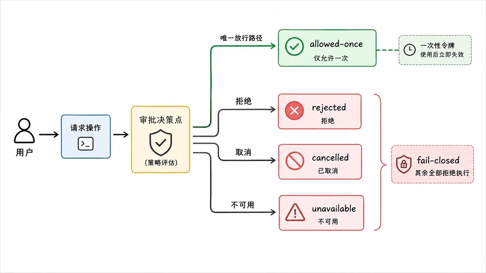

审批接缝回答"这一个具体动作，现在能不能放行"。它由 `packages/interaction/user-approval` 提供，服务是 `ctx.approval`。

### 闭合的结果

`ApprovalOutcome` 是闭合的，四个值：`allowed-once`、`rejected`、`cancelled`、`unavailable`。唯一的放行是 `allowed-once`，而且只对被问到的这一个动作有效。剩下三个值在调用方那里都落到拒绝执行。

`unavailable` 是 fail-closed 的灵魂。一个没被组合的 answerer、一个不归属这个 agent 的 answerer、一个抛了异常的 answerer、一个返回了词表外乱值的 answerer，统统归一成 `unavailable`，而不是打开闸门。翻译过来：审批系统坏了、缺了、行为怪了，默认答案都是拒绝。

放行为什么不延续？`allowed-once` 之后 agent 下次做类似的事还得再问。这故意拒绝了"批准一次，这类以后都自动放行"的便利，因为那会悄悄扩大攻击面：第一次批准时你看到的是那条具体命令，之后自动放行的每一次，你都不知道里面跑的是什么。单次性的代价是多几次点击，换来的是每次放行都有一个人看过。决策文档里明说：持久授权需要先回答"作用域到底是什么"（确切调用、路径、命令前缀、会话还是时间窗口），这个问题没回答之前，`allow_always` 选项不公布。

### ask 与 never

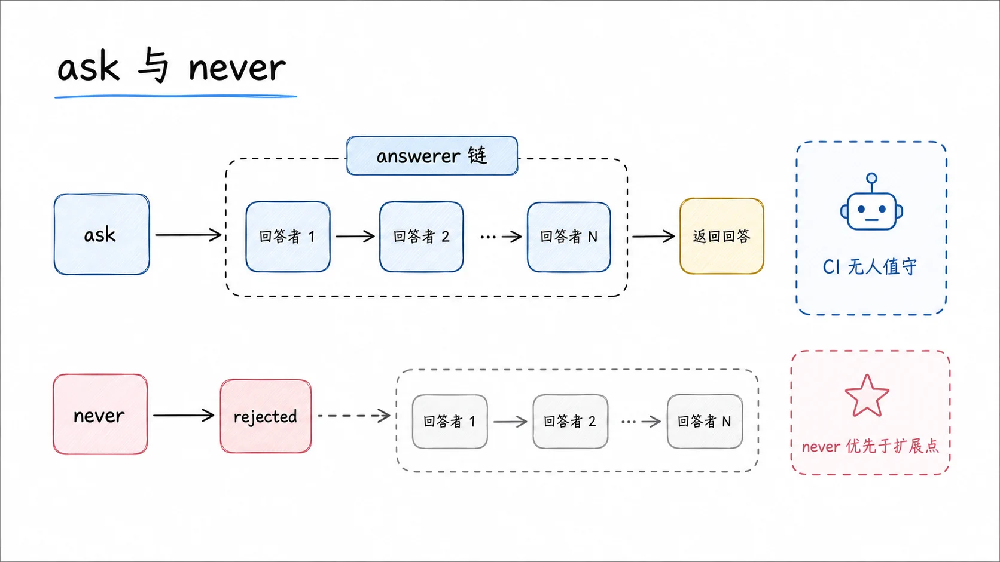

`ApprovalPolicy` 只有两个值，决定在交互式回答者出场之前发生什么。

`ask` 是默认，把问题委托给组合起来的 answerer 链。一个 answerer 要么返回一个结果（认领这次决策），要么把问题交给下一个；第一个返回的结果占据唯一的决策槽。链上一个 answerer 都没组合时，落空到 fail-closed 的 `unavailable`。链的形状支持真实的产品需求：UI 通道挂一个人来答，自动化桥挂一个一次性机器决策，一个 `prepend` 的 answerer 可以对某些危险模式自动拒绝。

`never` 是严格的无人值守姿态（CI、定时任务）：每次询问确定性地返回 `rejected`，一个 answerer 都不会被派发。关键是它在服务内部、链分发之前强制。哪怕事后有人 `prepend` 注册了一个想放行的 answerer，也绕不过 `never`。安全策略的优先级高于扩展点，这不是一句口号，是一条执行顺序。

### 审计对与 turn 边界

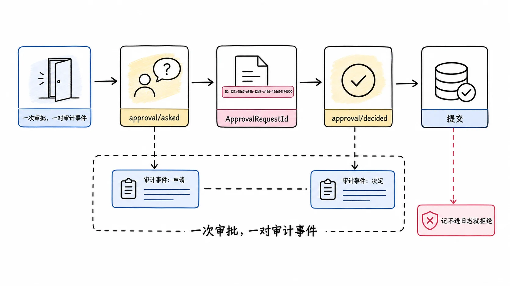

`ctx.approval.request(req)` 要求请求的会话正处在一个打开的 turn 之内，空闲的询问在追加任何东西之前就直接拒绝。为什么卡这么死？因为一次审批必须留下两条审计事件：先 `approval/asked`，拿到结果后 `approval/decided`，两条事件靠一个本次询问新铸的 `ApprovalRequestId` 配对，这个品牌类型也让审批 id 没法和工具调用 id 或会话 id 互换。turn 的提交边界必须能把这对事件完整包住。如果任何一个事件的落盘在提交点之前失败，请求照样拒绝，因为返回一个没记进日志的决策，就破坏了审计对。事件已提交之后，观察者的失败由会话层兜住，不会反过来撤销已经成立的决策。

请求本身有个刻意的省略：不带工具参数，只带 `callId`。提示挂在已经流式呈现过的 tool call 上，避免渲染出第二份可能漂移的参数副本。用户批准时看到的参数和实际执行的参数是同一份渲染，这一点在安全交互里比省一段代码重要。

审计事件是纯日志，不进模型 transcript。模型看到的，是调用方派生的工具结果加当前的运行时上下文快照。给人看的审计和给模型看的上下文是两个受众，分开记。审批策略的变化也一样：变了就在保留的历史后追加一份新的完整快照，历史只增不改，压缩与回放都保留最新一份即可。

## 升级：被拒绝之后怎么走

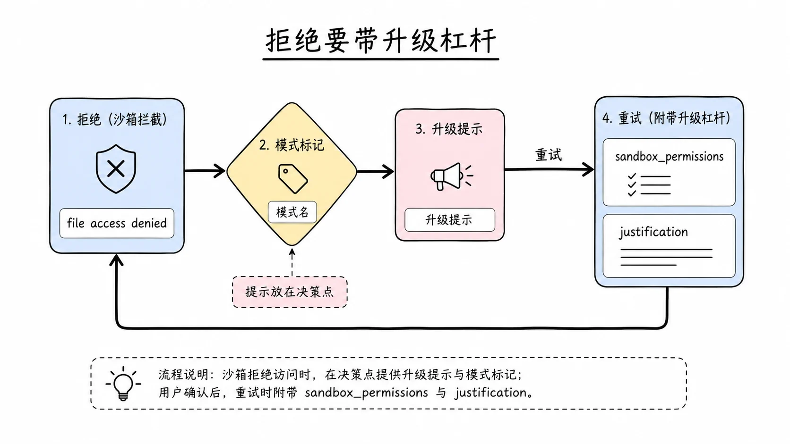

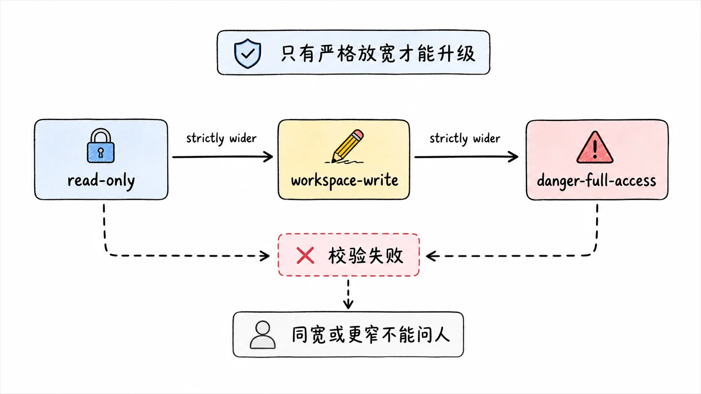

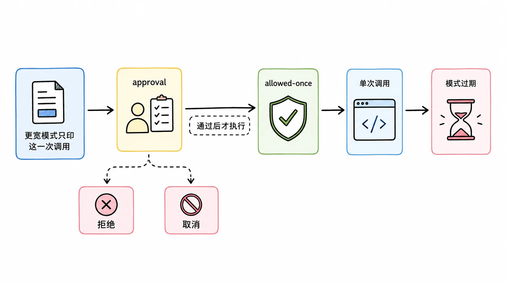

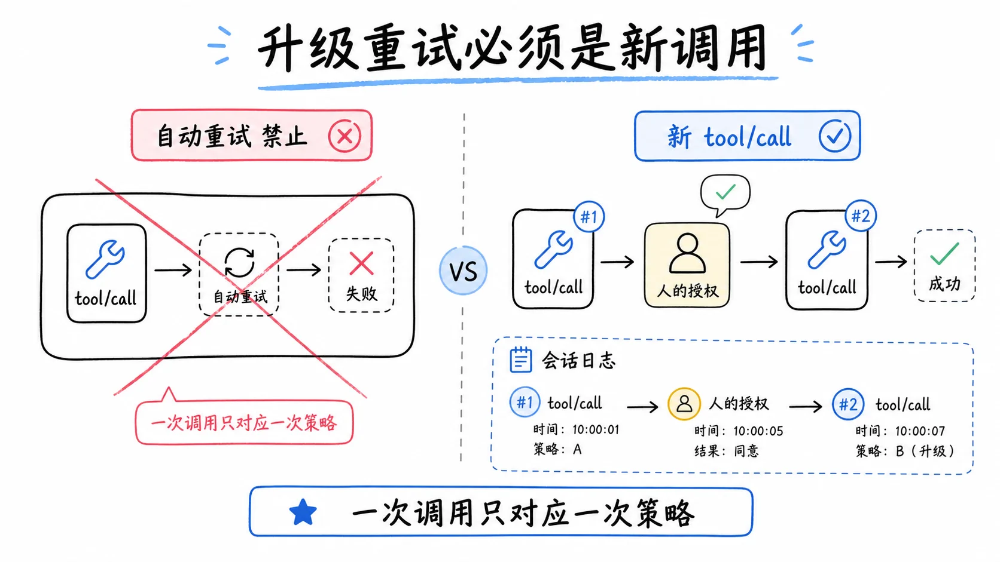

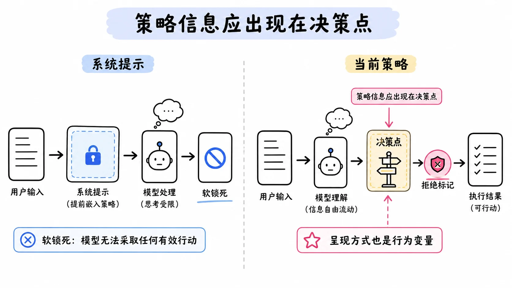

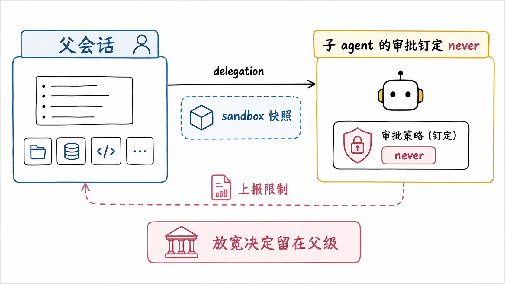

fail-closed 描述的是静止状态，真实使用里更常见的是动态过程：agent 在 `workspace-write` 下跑得好好的，突然有一条命令确实需要写工作区外面。直接切会话模式太粗，切完还得切回来；什么都不做让命令一直报错，任务就卡死。dsh 的答案是升级链路，而且这套链路在 2026 年 7 月之后是 bash 和 fs 两个工具家族共享的：词汇、严格放宽表、参数配对校验、拒绝标记、升级提示、审批顺序，全部收在 `dsh-sandbox` 的 escalation 模块里，一个家让两家的审批顺序和错误文本不会漂移。

第一步，拒绝要有信息量。沙箱拒绝动作时，在输出里留下带模式名的标记 `[sandbox: file access denied under <mode> mode]`，组合公布了升级字段时还会追加同轮次的升级提示，直接告诉模型"对这个确切动作重试一次，带上 `sandbox_permissions`（够用的最窄更宽模式）和一句 `justification`，审批提示会问用户"。提示放在决策点上，被认可的重试不依赖模型回忆工具描述。

第二步，模型可以选择重试。严格放宽是一张执行期检查的表，不是 schema 约束：`read-only` 可以升级到 `workspace-write` 或 `danger-full-access`，`workspace-write` 只能升级到 `danger-full-access`。请求一个同宽或更窄的模式，会以"not strictly wider than this call's current mode"的明确文本失败，而且不提示任何人。schema 的枚举倒是全量公布两个目标模式，因为 schema 是注册表全局的而有效模式是按会话的：只公布比默认宽的档位，会把一个被切窄的会话困死在没有杠杆的约束里。两个字段必须配对出现，一句理由驱不动一个空请求，一个没有理由的请求也过不了校验。

第三步，审批先于执行。这次重试走正常的 `ctx.approval.request`，审计理由里带目标模式和模型的原话理由。`allowed-once` 通过后，更宽的模式只印这一次调用；拒绝、取消、不可用、审批服务缺失、没有 agent 可路由，各有一句不同的错误文本，全部 fail-closed，什么都还没跑。工具描述里把边界教得很硬：审批提示被禁用的会话里，拒绝就是终局，不要再设 `sandbox_permissions`；被拒绝的升级对那条命令是终局，但不妨碍之后尝试或升级别的命令；不许投机性升级，请求必须踩在真实拒绝上。

这个流程里有四个"故意不做"，都能看出日志和人这两个边界的分量。

不在同一次工具调用里自动重试。如果一次 `tool/call` 背后藏着两次不同策略的执行，会话日志里就只能看到一次调用，重放时无法重建哪次用了什么策略。所以重试是一次新的、被完整记录的调用。

不做命令串的硬匹配去自动关联"这条拒绝和这次重试是同一个动作"。命令文本的同一性太脆：引号风格、工作目录、管道写法，任何一处变化都会让字符串比对失败。真正的边界是人：提示里同时呈现命令和理由，人看过了，就是授权依据。

不在执行器内部请求批准。执行器服务定义里没有可路由的 agent，也没有可挂提示的 callId，硬加会让传输边界了解会话和 UI。工具层持有两者，也拥有面向模型的词汇。

不把升级字段公布给非沙箱组合。在无约束执行器下它们是死杠杆，公布一个 harness 兑现不了的选项只会制造注定失败的授权。能力门控在注册时读一次执行器的 `sandboxMode` 能力事实。

升级链路还有一个上游设计变更值得讲。早期版本把当前沙箱模式写进系统提示，结果观察到一种"软锁死"：模型读了提示里的模式描述，倾向于不去尝试可能被拒的工作，一次手工测试的十二轮里有五轮零工具调用，agent 在空转。修法分两步：先把模式叙述从系统提示里拿掉，让拒绝标记在决策点现场携带模式信息；后来的当前策略决策又把完整的策略上下文做成每步组装的目标消息，由归属方派生、原子排队，模型在每个决策点看到的都是当前真实策略，而不是一段会过时的提示词。这个案例值得每个做 agent 产品的人记住：安全提示的呈现方式本身就是行为变量，写多了反而废掉 agent 的行动力。

子 agent 的审批策略在 2026 年 8 月中被钉死。委派发生时，子 agent 对父会话的显式沙箱覆盖仍然做一次快照，作为一条带来源标记的事件种在子会话日志前缀之后，委派不可能回落到比父会话更宽的默认值。但审批一半变了：只要审批能力已组合，子 agent 的审批策略一律钉定为 `never`，不再读父级自己的策略，事件来源标为 delegation。理由是一次真实的产品观察：交互式父级下面，后台子 agent 的升级请求会变成一个任何界面都不展示的挂起问题，被权限拦住的子 agent 和正常干活的子 agent 在目录树里无法区分。与其造一整套受阻状态投影和父级通知，不如让子 agent 的全部权限故事就是它的沙箱范围：需要更宽访问的任务，以上报限制收尾，放宽的决定留给父级一侧。子 agent 的运行时上下文里会明确声明这一点，它被告知，而不是被困住。

## 权限预设：不带强制力的打包

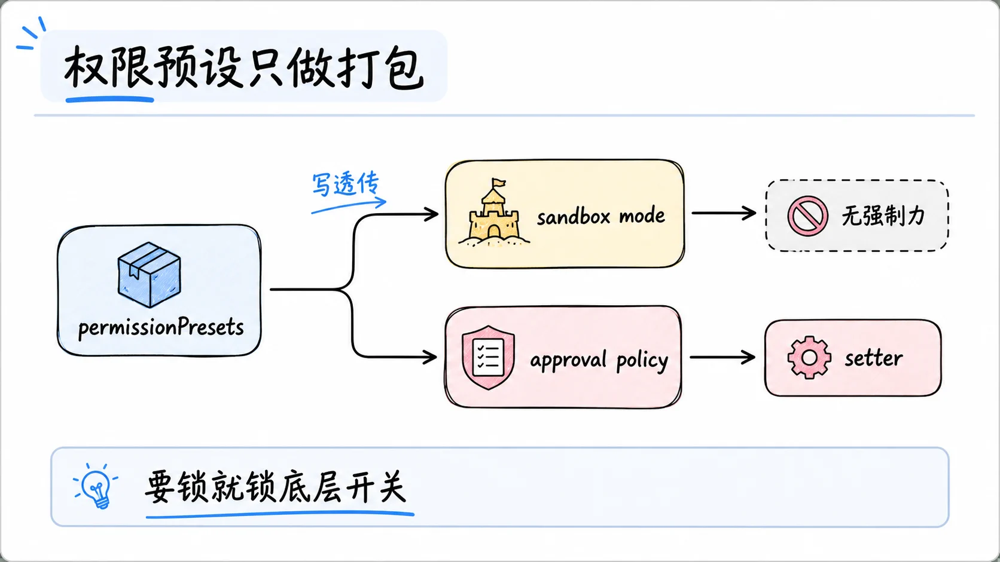

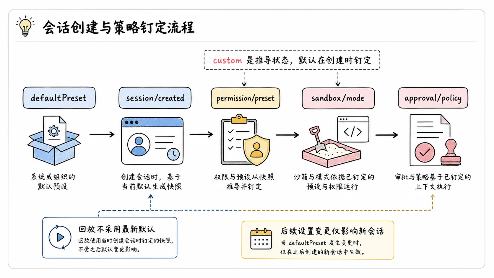

预设层是最薄的一层。`ctx.permissionPresets` 把沙箱模式和审批策略这两个独立开关，打包成客户端能作为一个选择器展示的命名预设。

理解它的关键一句话：预设不拥有任何强制力。它是一个可选能力，不在 agent-loop 主干上。执行、提示叙述、回放，读的都是底层两个开关的折叠值；预设切换只是记录意图，再写穿到每个开关自己的 setter。预设层坏了或根本没装，底层开关照常工作。想靠"锁住预设选择器"来保证安全是锁错了地方，要锁就锁底层两个开关。它在插件加载时校验组合完整性：配置表里有一项敢叫 `custom`，直接抛错，这个名字被保留了；在一个不施加约束的执行器（没有 `sandboxMode` 能力事实）之上组合同样抛错，因为预设捆绑了一个沙箱模式。

默认表里只有两个预设：`workspace-write`（沙箱 `workspace-write` 加审批 `ask`）和 `danger-full-access`（沙箱 `danger-full-access` 加审批 `never`）。两个预设的语义取向相反，一个谨慎一个放权，选择器上的每次切换因此都是有意义的表态。

`custom` 是个特殊值，它是算出来的，不是表里的一项。当前有效值从两个开关的折叠值推导：优先匹配仍然吻合的已记录选择，其次按声明顺序匹配表里的第一项，都不中就返回 `custom`。用户手动调了某个底层开关，组合脱离任何命名预设，UI 显示 `custom` 而不是假装还在某个预设里。`custom` 永远不能是切换目标，也不出现在事件载荷里。

切换的落点也讲顺序。`set()` 解析预设名（未知名字抛错），追加一条纯日志的 `permission/preset` 事件，然后只有当某个开关的有效值真的变了，才通过它自己的 setter 写穿。选择事件在同一 turn 里先于开关事件；重复选择当前生效的预设，什么都不追加。为什么意图要单独留痕？因为纯日志的选择事件和有模型可见后果的开关事件是两类东西，它让 `current()` 在两个预设共享同一个组合时仍知道用户选的是哪个；而空转的开关事件只会污染日志。

新会话的默认值有一套独立的钉定机制（2026 年 7 月底合入）。预设服务拥有一个 Settings namespace，里面只有一个 `defaultPreset` 字段，schema 的枚举从 preset 表动态派生。服务在 `session/created` 时读当前值，给真正的新会话落下三个显式事件：`permission/preset`、`sandbox/mode`、`approval/policy`，把创建时选中的权限固定死。之后用户再改 Settings 默认值，只影响之后的会话；带 seed 的恢复会话保留自己的有效值，只补缺失的事实，绝不偷偷采用最新的用户默认。之所以不做"实时应用于每个会话"，是因为那会让执行策略在持久日志之外变化，回放无法重建先前工具调用用的是什么权限。

进入最危险预设的 GUI 路径还有一道确认。2026 年 7 月底起，每个权限选择器把 `danger-full-access` 关进一个共享的页面内风险确认对话框：启用按钮在用户勾选明确的确认复选框前保持禁用，预设以产品标签 Full access 展示，所有取消路径都不提交任何东西。对话框被刻意做成页面内的 Modal 而不是独立窗口，因为第二个窗口可能落在另一块显示器上，让决策脱离它守护的页面状态。这是纯客户端的把关，后端权限语义不变。

## 从头走一遍

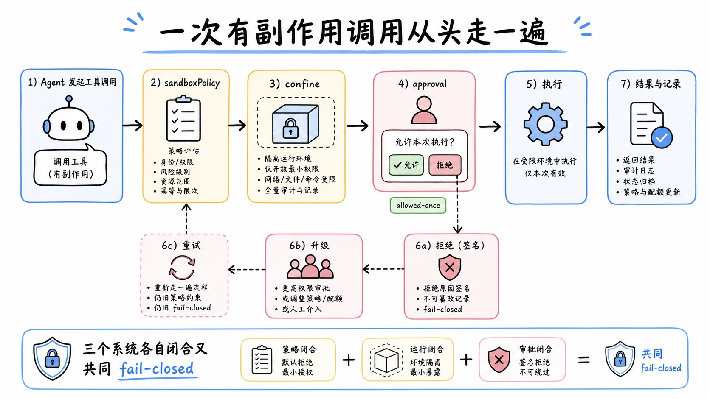

把一次有副作用的工具调用从头串起来，看三个子系统各在哪一步出场。

agent 决定跑一条 bash 命令。工具层先请 `ctx.sandboxPolicy` 解析这次调用的策略：有显式批准的升级覆盖就用它，否则取会话日志里最后的 `sandbox/mode`，再落回部署默认；工作区根从会话的不可变 cwd 派生。

模式不是 `danger-full-access`，工具层调 `ctx.sandbox.confine`，拿围栏 argv 和强制力事实。拿到 partial 而这个场景要求绝对边界，拒绝执行；拿不到围栏（`SANDBOX_UNAVAILABLE`），拒绝执行；都过了，才有接下来的事。

审批出场。`ctx.approval.request` 带着挂在流式 tool call 上的 `callId` 和理由，策略是 `never` 直接落 `rejected`；是 `ask` 则走 answerer 链，等待期间被取消就落 `cancelled`。只有 `allowed-once` 让流程继续，审计对已落进这个 turn 的日志。

命令在围栏 argv 下执行。结束后 stderr 先过 runner 故障规则：沙箱 runner 自己没跑起来，按基础设施故障报。再过拒绝签名：策略拒绝了写，把带模式名的标记和升级提示给模型，模型可以发起带理由的升级重试，那是一次新的完整调用。两者都不是，输出才作为普通任务结果回给模型。

预设层在整条链上没有出场。它只在用户切换预设的瞬间，把意图翻译成两个开关各自的 setter 调用，然后退场。

## 权衡

沙箱只管文件。网络外发、进程可见性（bwrap 除外）、系统调用的其他副作用，都不在词表内。要管这些得靠别的机制，比如把 bash 和 fs 一起换进容器或远程执行器，那是环境一致的能力组替换，不是给 `ctx.sandbox` 加一个后端。范围收窄换来的是可推理性："沙箱能不能挡住"有确定答案，这个答案的代价就是问题问得窄。

partial 强制是常态而非异常。三大平台各有各的缺口，消费者必须处理"拿到 partial 怎么办"的分支。设计者选了暴露而不是隐瞒，使用者就得接住这份诚实。Windows 档的具体清单在包 README 里：Everyone 授予写的外部对象会通过两次检查，工作区内被授权的硬链接让外部别名同样获授，FAT 类无 ACL 目标仍可写，CIM 不可用，`whoami` 在受限令牌下失败，read-only 的 pwsh 落 ConstrainedLanguage。如果场景需要绝对边界，消费强制力事实的代码就是安全边界的一部分，绕过它的任何"应该没事"都是自欺。

审批的单次性在自动化场景是摩擦。无人值守的部署用 `never` 全拒，交互场景每次都要人点头。折中方案是挂机器 answerer 做模式化的自动决策，但那等于把人的判断换成规则，规则的漏洞就是新的攻击面。子 agent 钉定 `never` 之后，这个摩擦被制度化了：需要提权的任务必须回到父级一侧重新委派，多跳的成本换掉了一整套受阻状态可视化机制。

故障归因是进程内的文本匹配，可被伪装。诊断层面的假归因被接受了，但如果运维流程会根据"沙箱故障"自动做重大动作（自动重试、自动切后端），要意识到这条文本通道不是强认证的。Windows 档的常设工作区 ACE 用急切全树传播，大型工作区首次要花数十秒；异常关闭后遗留的随机临时目录要等系统卫生机制回收。

模式切换是会话级的。并发的两个会话各切各的互不影响，这是隔离；但同一个部署下不同会话可能跑在不同模式下，观察全局状态时别假设一致。GUI 的 Full access 确认挡住了误点，挡不住刻意：机器名在 wire 上不变，后端语义不变，这层诚实把责任留在了该在的地方。

## 结论

三个子系统，三个各自闭合的问题。沙箱管文件效果，模式词表窄而明确，bash 与 fs 两个家族共享同一套围栏词汇，Linux 双 runner、macOS Seatbelt、Windows 受限令牌各自报告 full 或 partial 的事实，静默直通被明文禁止。审批管单次放行，结果闭合到只有 `allowed-once` 一种放行，`unavailable` 兜住一切异常，审计对被 turn 边界包住，子 agent 钉定 `never` 不再产生无人可答的挂起问题。预设只做打包，不拥有强制，`custom` 是推导出来的诚实状态，新会话的默认在创建瞬间被三个事件钉死。

把它们串起来的升级链路是这套设计最有产品味的地方：拒绝带模式信息和同轮次提示，重试带理由且严格一次，宽模式只印单次调用，四个"故意不做"全部在保护日志的可重建性和人的授权地位。曾经写进系统提示的模式叙述造成五分之四的空转，这个教训反过来塑造了现在的形态：策略信息在决策点现场出现，升级杠杆只在能兑现的组合里公布。

换一个沙箱后端，审批逻辑一行不改；换一个 answerer，沙箱后端一行不改；预设层可以整个不装。每个子系统独立推理、独立测试、独立替换，而 fail-closed 和"强制是事实不是承诺"两条纪律保证无论怎么换，安全底线不会被一个 bug 或一个 partial 悄悄击穿。

## 延伸阅读

- [Process Sandbox 官方文档](https://github.com/deepseek-ai/deepseek-harness/blob/master/docs/subsystems/sandbox.md)：模式词表、强制力事实、confine 契约、双方言分类
- [User Approval 官方文档](https://github.com/deepseek-ai/deepseek-harness/blob/master/docs/subsystems/approval.md)：闭合结果、ask/never、审计对与决策槽
- [Permission Presets 官方文档](https://github.com/deepseek-ai/deepseek-harness/blob/master/docs/subsystems/permission-presets.md)：预设打包、custom 派生、写穿 setter
- [Sandbox 切换设计笔记](https://github.com/deepseek-ai/deepseek-harness/blob/master/.agents/notes/implemented/feature/2026-07-06-sandbox.zh.md)：升级链路、软锁死案例、替代方案清单
- [Windows ACL 受限令牌决策](https://github.com/deepseek-ai/deepseek-harness/blob/master/.agents/notes/implemented/feature/2026-08-08-windows-acl-restricted-token-sandbox.zh.md)：令牌派生路线、Everyone 与硬链接缺口
- [子 agent 审批钉定 never 决策](https://github.com/deepseek-ai/deepseek-harness/blob/master/.agents/notes/implemented/feature/2026-08-10-subagent-approval-pinned-never.zh.md)：不可见受阻状态问题与钉定取舍

上一篇：[dsh 的多模态附件：模型看到的图是派生出来的](./17-multimodal-attachments.md)
下一篇：[dsh 的 Filesystem 接缝：读写编辑与观察策略](./20-filesystem-seam.md)
