# dsh 的 LSP 接缝：让 agent 真正"懂"代码

> dsh 把 LSP 做成一个只暴露四个归一化操作、且没有任何协议逃生舱的能力接缝：模型永远只问"跳定义、查引用、跳实现、hover"这四件事，原始 JSON-RPC、文档同步、进程控制全部藏在 provider 后面，换语言服务器不影响模型怎么问。这是个很硬的取舍：宁可让 agent 只能做这四件事，也不让它直接对着协议乱发，换来的是模型工具签名的跨 provider 稳定，和"模型能调用的每一样东西都被人审过"的底气。
> 两条最值得记住的机制：按扩展名选 provider、与注册顺序无关，注册是原子的，一个冲突全部不发布；查询走"瞬态打开文档"而不是长期持有，一个实例上的查询串行执行，杀进程的爆炸半径被限制在一次查询内，而不同工作区各有一个实例，彼此并行。

## grep 的天花板

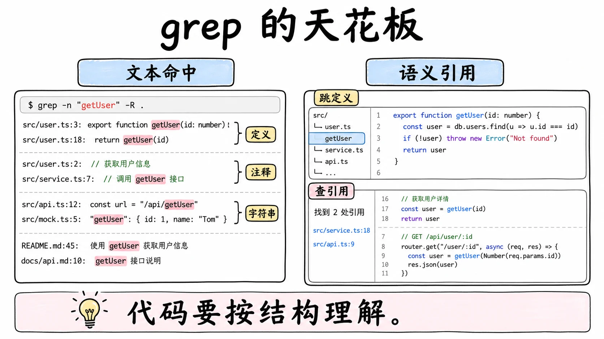

agent 想理解代码，最朴素的办法是文本搜索。但文本搜索不知道 `foo` 在第 30 行是个变量定义、在第 200 行是一次调用、在第 50 行只是注释里被提到。三者混在一起返回，agent 就得自己猜哪个是真正的引用。

猜错的代价在真实任务里很高。查一个函数被谁调用，文本搜索把同名变量、注释、字符串里的出现全算进去，agent 基于一份虚高的清单去改代码，改完才发现引用数对不上。想找接口的实现，文本搜索根本不知道"实现"这个概念，它只认识字符串。反过来，跳定义、查引用、悬停看类型，这些是语言服务器几十年积累下来的语义导航，把代码当结构而不是当文本。

语言服务器协议（LSP）就是这些能力的标准化出口。问题是，它是一个庞大、面向编辑器的协议。拆开看能看到三台机器。

第一台是生命周期。客户端起服务器进程，先发初始化请求带上一份自己的能力声明，服务器回一份自己的能力清单，初始化完成通知之后才允许发普通请求，关闭前要走退出流程。第二台是文档同步。服务器没读过磁盘上的文件，它的语义模型建立在客户端通知给它的文本上：打开时发一份全量内容，之后每次编辑发增量变更，关闭时通知一声。服务器的"当前文件内容"，是客户端一口一口喂出来的镜像。第三台是能力协商。几十个方法里，服务器支持哪些、用什么参数形态，都在握手时那张能力清单里写着，客户端要按清单分支。

让 agent 直接对着原始 LSP JSON-RPC 发请求，等于把这三台机器搬进 agent loop：每换一个语言服务器，模型得重新学一套能力差异；文档同步和进程管理泄漏进工具签名；模型的可见行为从此取决于加载了哪个服务器。这三台机器对编辑器是必需品，对"问四个问题"的消费者是纯负担。

dsh 的解法是做一个极薄的归一化接缝。只暴露四个操作，把三台机器全部藏进一个通用 provider，并且故意不留任何逃生舱。

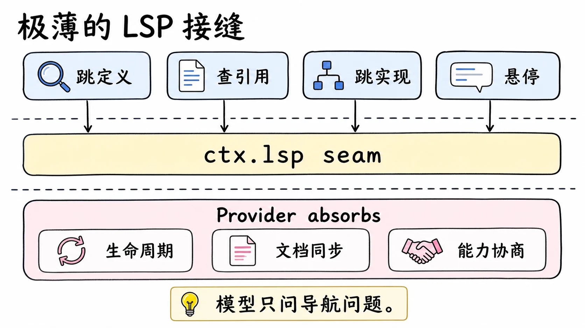

## 四个操作，封闭联合

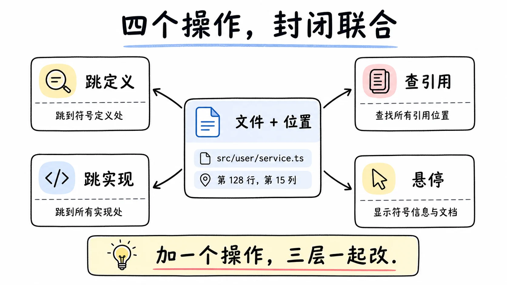

接缝暴露的语义查询精确地只有四个：跳定义、查引用、跳实现、悬停。这是个封闭联合，加一个操作不是改一处，而是在接缝、所有 provider、模型工具三处同时改，编译器强制改全。

为什么是这四个？因为它们共享同一个请求形状：一个文件加一个位置。四个操作回答的都是"关于这个位置上的符号"的问题，schema 天然统一。反过来，符号搜索要的是查询串不是位置，调用层级要的是方向和项引用，硬塞进同一个统一类型只会拧巴。设计笔记说得很直白：这些能力需要不同的 schema，先不做。

还有一条数量上的克制。业界有的 agent 工具暴露九个 LSP 操作，dsh 只取四个。多出来的五个里，有用的部分等真正需要时再设计 schema，而不是先占坑。一次性照抄九个操作的问题在于把投机的接口面冻结成承诺：每个操作都是模型要理解的词表、每个 provider 都要实现的翻译、每次变更都要评估的兼容负担。四个够用就四个。

用一次真实的追因任务对比一下四个操作够不够。agent 接到"这个接口的实现在哪"的问题：先 hover 拿到类型信息确认这是个接口，再一次跳实现直接落到实现类，两步收工。文本搜索版本是另一番景象：搜接口名得到十几个文件的命中，逐个开窗阅读判断哪个像实现，中间还会被注释和字符串里的同名命中带偏。查引用同理：查引用给的是"谁在调用"的精确清单，文本搜索给的是"谁长得像"的猜测集。导航四操作覆盖的是 agent 高频问题里语义密度最高的那四个，砍掉的是低频和不同构的部分。

工具侧的定位也写得很清楚。`lsp` 工具是单一工具加一个 operation 枚举，系统提示里给它的定位语是：普通导航用 search 和 read，文本匹配有歧义、或改动前需要精确的定义、实现、引用时才用 lsp。LSP 在这套工具阵容里是精度辅助，不是日常入口，这个定位本身就是对上下文成本的节制。

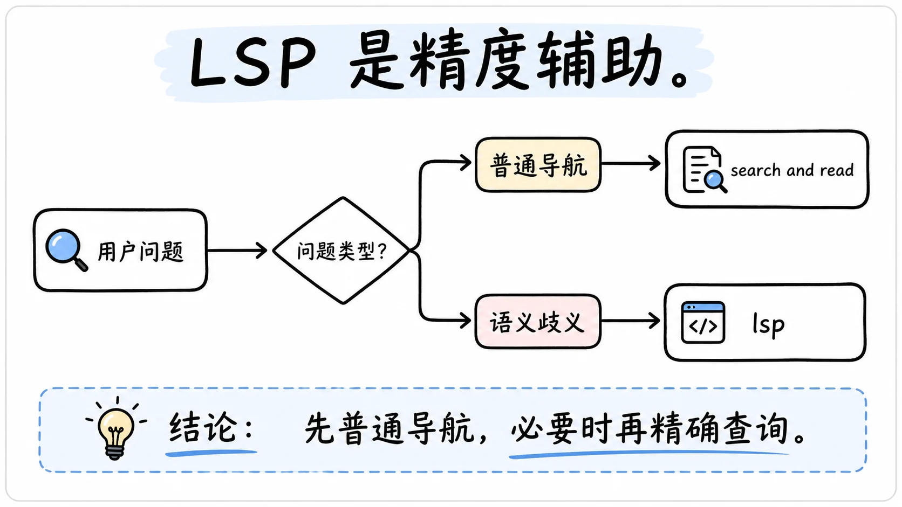

同样要看它故意不包括什么。重命名、代码动作、格式化、诊断，这些 LSP 也有的能力都不在。它们不只是"不同 schema"，还是变更操作，涉及另一整套审批和权限问题，归另一条设计线管，不混进导航接缝。

## 无逃生舱

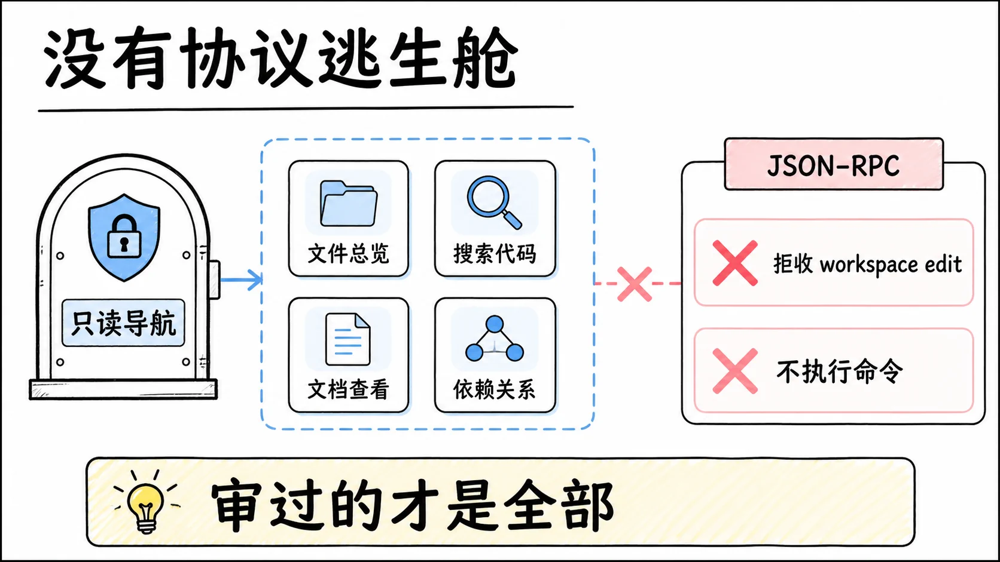

这是整个 LSP 接缝最强势的一条设计决策，值得把它的两层意思拆开看。

第一层是字面的：接缝不暴露任何协议类型、不暴露进程或文档控制、不给任何通用 JSON-RPC 逃生舱。你没法通过这个接缝给底层语言服务器发一个任意请求，文档同步、能力协商、进程启停，全在 provider 内部，调用方看不见也碰不到。

第二层是安全性的。一个通用的方法透传看起来"更灵活"，实际后果是协议载荷直接漏给模型，未经审查的变更和命令执行有了入口。设计里的这个客户端明确拒收工作区编辑申请，从不执行命令、从不改文件。四个导航操作全是只读查询，模型能调用的每一样东西都在封闭词表里被人审过。留一个逃生舱，审过的东西就不再是全部。

为什么这么硬？因为只要留一个口，就会有插件走捷径直接发原始协议请求，模型的工具签名开始泄漏协议细节，跨 provider 的稳定就被破坏了。关死逃生舱，强迫所有导航走四个归一化操作，模型怎么问就只取决于这四个操作，不取决于底下是 tsserver 还是 gopls 还是 rust-analyzer。

代价是明确的：接缝之外的能力，这个接缝帮不了你。要查符号、查调用链，用文本搜索兜底或等接缝扩展；要重构，走代码运行时或文件编辑那条线。用有限的能力换干净的抽象，这是个主动选择，不是没做完。

## 注册与选择：按扩展名，与顺序无关

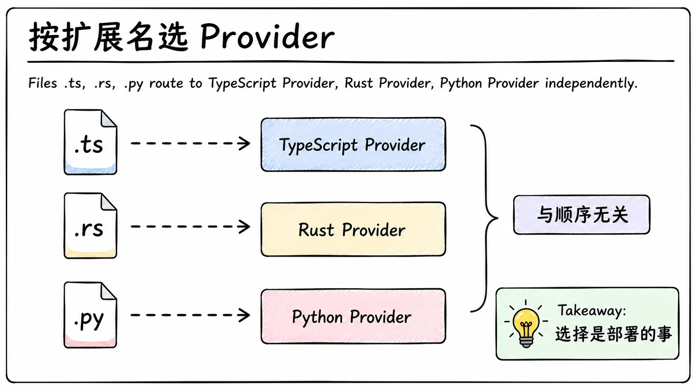

provider 的注册形状设计得很紧。一个 provider 拥有一个稳定的 branded id 和一张排他的扩展名映射：小写、带前导点的扩展名，映射到语言 id。注册是原子的：id 和每个扩展名一起预留，任何一处无效或冲突，整个注册什么都不发布，抛带稳定码的错误；返回的销毁器释放全部预留，随调用方的插件纤维一起销毁。

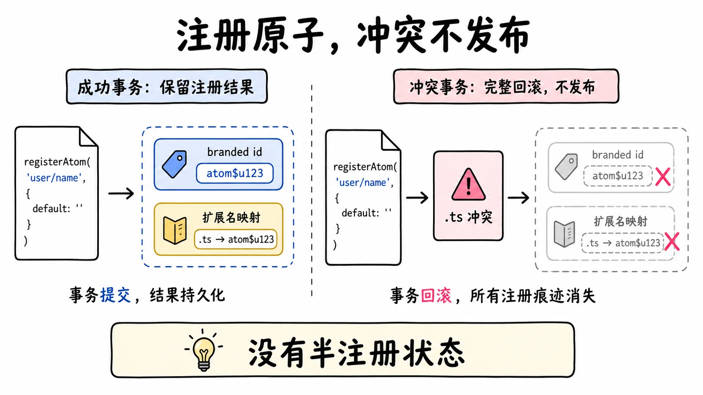

选择是按查询、按扩展名、与顺序无关的。来一个查询，取文件路径的最终扩展名，找到拥有它的 provider，转发；没匹配就抛 `LSP_UNAVAILABLE`。多个 provider 共存各管各的扩展名，互不干扰。

为什么把顺序抠得这么死？因为注册顺序取决于插件加载和热重载的时序，而时序不是产品语义。如果选择规则是"先注册的赢"，同一份部署在冷启动和热重载之后可能选中不同的 provider，行为就不稳定了。被否决的替代方案还有路由表、glob 匹配、语言 id 选择器、让模型在输入里选 provider。最后这条被否得最干脆：provider 的选择是部署的事，不是模型的输入。

排他所有权是个明确的 MVP 限制：两个 provider 不能同时认领 `.ts`。设计里预期的放宽方向是在注册之上加一个部署配置的选择器，依然不是模型输入。

销毁路径同样干净：注册返回的销毁器释放全部预留，随调用方的插件纤维一起销毁。热重载一个语言服务器插件，它的扩展名立刻回到可认领状态，新插件顶上，选中它的查询从此走新 provider，没被引用的旧进程在销毁时终止。注册和注销都是原子发布，不存在"id 预留了但扩展名还没占上"的中间窗口。

多语言仓库在这个模型下不需要任何特殊机制。TypeScript 文件的路由和 Rust 文件的路由互不相干，各自按扩展名命中各自的 provider，各自的查询在自己的实例上串行。一次任务里混合跳转 `.ts` 和 `.rs`，接缝层只是连续转发了两次，没有任何跨语言状态。

部署语言服务器也是显式的。stdio provider 的配置是一张 servers 表，每个条目写明可执行文件、扩展名映射、参数（不经 shell 直传 argv）、环境、初始化选项，以及一组边界：单帧消息上限默认 16MiB，诊断保留的 stderr 尾巴默认 1MiB，愿意打开的源文件上限默认 4MiB，优雅关停预算 5 秒，取消和 SIGTERM 到 SIGKILL 的宽限 2 秒。服务器对 `workspace/configuration` 请求的应答是一个静态配置值，不跑逐项回调。加载时先把每个条目的可执行文件在擦洗过的 PATH 上解析出来，任何一个条目有问题，整张表一个 provider 都不发布；没有服务器预设、没有 PATH 自动发现，因为发现能找到二进制，推断不出该给它什么参数，猜错了就是一个行为怪异的服务器。进程也不是加载即起：每个进程在第一条匹配查询到来时才懒启动。

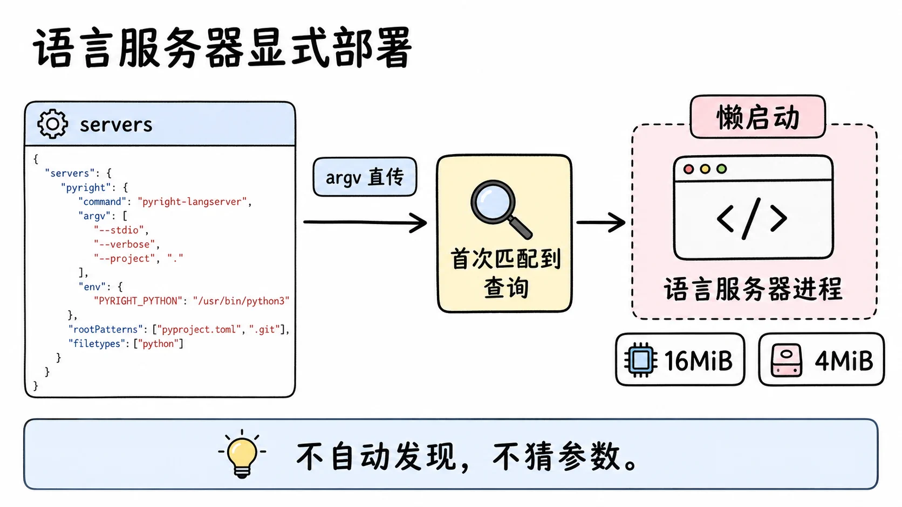

## provider 拿到的是加过工的请求

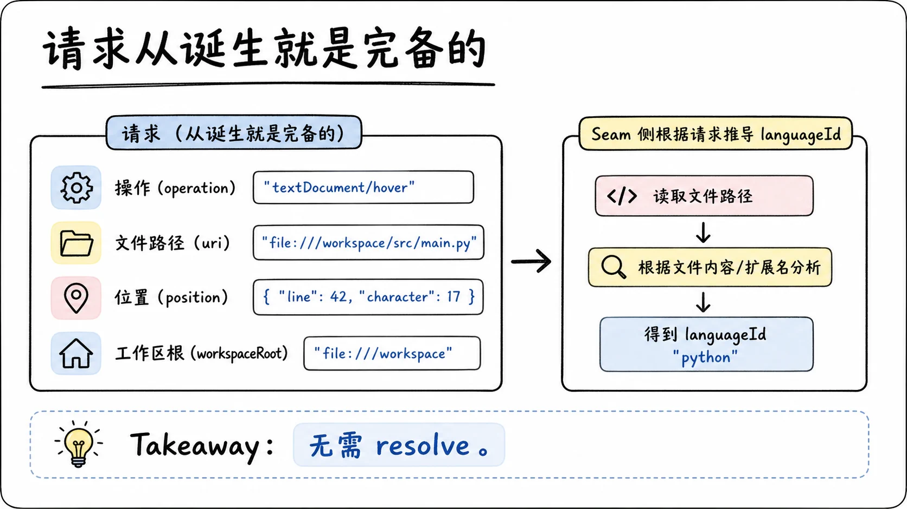

调用方给的请求，四个字段全必填：操作、文件路径、位置、工作区根。没有 resolve 这一步。

为什么不需要？因为没有任何字段要实现层补默认值。消费者自己拥有超时和结果上限，超时通过一个普通的取消信号传进来，provider 收到就停自己的活。对比那些有 resolve 步骤的接缝：它们的存在理由是请求里有可选字段需要按配置补齐；这里的请求从诞生就是完备的，补齐步骤就没有存在的理由。设计笔记还否决了把取消信号包进上下文对象的做法：一个裸信号就够，对称的包装只会增加一个词表。

provider 实际拿到的是加了一个字段的请求：语言 id。它不在调用方的请求里，因为它来自 provider 注册时的扩展名映射，由接缝在转发时派生加上。这个字段的唯一用途是同步瞬态文档，让语言服务器知道这是个什么语言的文件；它不参与 provider 选择，选择是按扩展名做的。

一个体贴的细节：查引用的结果总是包含声明本身。这件事由 provider 内部强制，调用方拿不到也不需要一个"是否包含声明"的开关。少一个开关就少一类困惑："我查了引用，定义到底在不在里面"这个问题不需要被问出来。工具描述和系统提示里都把这条约定写给模型，因为它是模型解释引用清单时最需要知道的一条。

## 坐标：零基 UTF-16 与规范工作区 URI

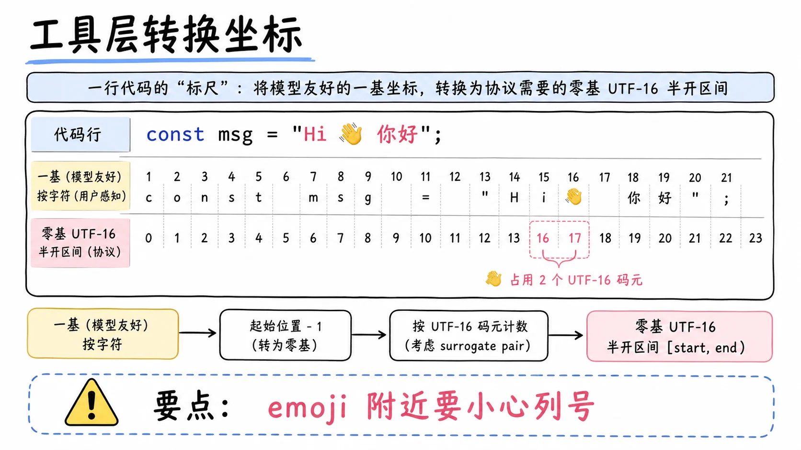

坐标系统有两个细节，一个是协议的，一个是命名空间的。

位置是零基的行加零基的 UTF-16 码元列，区间是半开的。这是 LSP 线上协议的标准坐标，接缝原样采用，客户端在握手时声明这个编码，协商不中按协议错误处理，服务器返回别的编码值不被接受。模型面向的工具维护一套一基的光标约定，人和模型都用一基数行，转换在工具层做，不污染接缝。

这个选择有一个被设计文档承认的坑：UTF-16 列号对协议是精确的，但让模型在非基本平面字符（emoji、部分 CJK 扩展字）附近数字符是痛苦的。一行的前半是普通字符、后半是表情符号时，模型数出来的列很可能和协议对不上。工具层的一基转换解决不了码元和字符的换算差异，这是个已知的、接受的不完美。

第二个细节是结果里带的规范工作区 URI。导航返回的位置里，uri 是服务器原样给的；结果另外附带 provider 规范化的工作区 `file:` URI。调用方要把位置 URI 相对化时，必须用这个坐标，而不是拿宿主平台的路径规则去解析可能带符号链接的请求根。原因和执行世界有关：执行平台可能和调用方平台不同，fs 和 shell 可能指向远程沙箱，用 provider 给的规范 URI 才不会在跨平台时把路径算错。它还让工具层能把结果分成"工作区内相对路径"和"工作区外绝对路径"两类，渲染时前者给短路径方便模型引用，后者保留完整 URI 提醒它已经出了仓库边界，下一步动作（比如读那个文件）要意识到这一点。

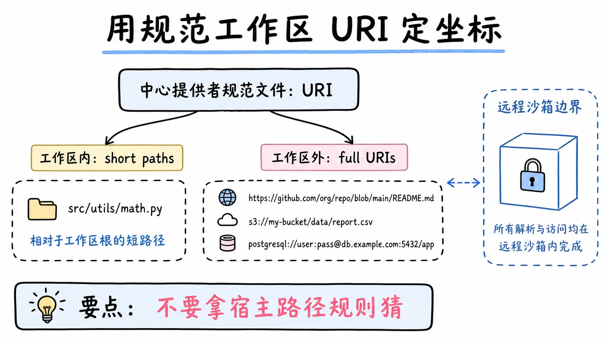

## 一个查询的一生

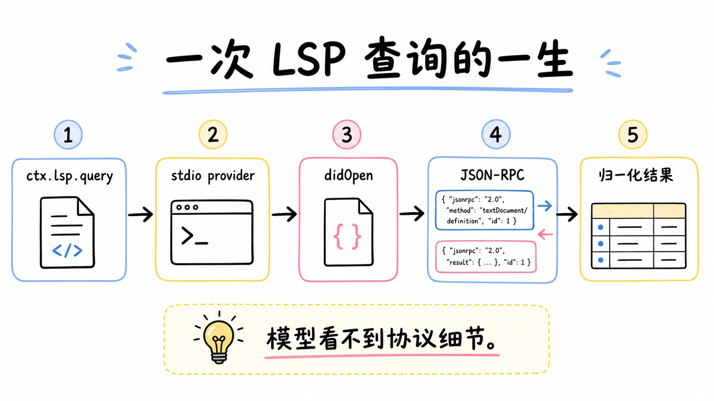

把一条查询从头走到尾，看各层怎么分工。

模型发出工具调用：跳定义，某个 `.ts` 文件，一基坐标。工具层把坐标转成零基 UTF-16，构出全必填的请求，交给 `ctx.lsp.query`。

接缝按扩展名选中 stdio provider，派生语言 id，转发。provider 先通过文件系统接缝把工作区根解析成规范身份：这一步验证它确实是个目录，拿到进程路径和 file URI。同一个 provider 内部维护着按规范工作区 keyed 的实例池，这个工作区的第一条查询懒启动一个服务器进程，之后的查询复用；两个不同的工作区各有一个进程，互不排队。服务器进程通过 subprocess 接缝 spawn，argv 直传不经 shell，环境先擦洗再合并，stderr 留一条有界尾巴做诊断。握手时声明位置编码，拿回能力清单，provider 按清单检查这次的操作服务器确实支持，连瞬态打开所需的文档同步能力也在检查之列：服务器的同步配置不允许 didOpen/didClose，直接报"不支持该操作"，不用等到半路才发现。

然后是瞬态文档同步：provider 通过文件系统接缝把查询的源文件按当前内容完整读出来（超过 4MiB 的文件在读这一步就被有界拒绝），以一次打开通知给服务器，让服务器在内存里有一份当前文本。查询翻译成协议请求发过去，响应回来先过形状校验，再翻译回归一化结果：跳定义归一成位置列表加规范工作区 URI，悬停归一成拼接的内容字符串或 null。文档关闭通知在请求结算后发出，这次查询在服务器里留下的痕迹就此清掉。

结果回到工具层，坐标转回一基，位置渲染成最多 100 条（可配置的上限），超出部分折叠成一条省略计数，整个结果再受一个 16000 字符的渲染上限约束，超限追加截断标记。一次调用的超时预算默认 60 秒，覆盖排队、打开、查询、关闭的整个生命周期。整个过程中模型没见到一个协议名词；换一个 provider（比如换成远程语言服务），这条链路的模型侧一个字不变。

失败也在这条链路里有确定的位置。取消信号从消费者一路传到 provider，provider 停掉自己的活，工具层把这次调用结算成被取消的结果；服务器返回的 JSON 形状不对，provider 拦下，归一成畸形响应码，不往上游放坏数据；服务器进程本身死了，实例池同步地跳过死实例，下一次查询走新建路径，模型侧看到的可能只是一次稍慢的查询。每一类失败都有自己的名字和自己的层，没有一类需要模型去读堆栈。

瞬态打开值得多说一句，因为它否决的是一整台状态机。另一条路是长期持有打开的文档：服务器内存里一直有这份文件，变更时发增量变更通知。代价是要拥有文档版本号、所有变更路径上的传播（fs 工具改的、shell 命令改的、外部编辑器改的）、逐出策略、陈旧状态规则，一套编辑器级别的复杂度，而且任何一个漏洞都让服务器基于旧文本回答语义问题，错得悄无声息。瞬态打开把这份复杂度还给了事实源：每次查询前从磁盘同步一次当前内容，查完即弃。磁盘上是新内容，服务器看到的就是新内容，没有第二条会漏的传播路径。

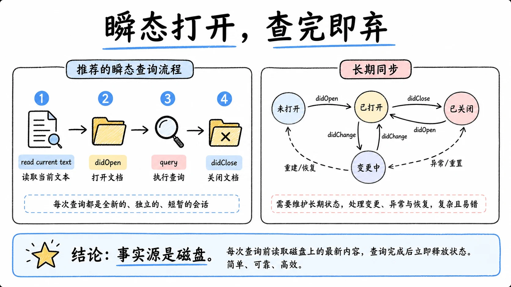

代价是重复解析和随之而来的延迟，换来的是 provider 不持有任何跨查询的文档状态。被同一份设计否决的还有一条近路：不做文档同步直接查。有的服务器关着文件也能答，但支持参差，而且可能用服务器自己缓存的旧状态回答，正确性没有保证。要查就得先同步，这条没有折扣。

查询在单个实例上是串行的。这不是偷懒：语言服务器是共享进程，一次终止会连带杀掉当时在飞的所有查询，串行化把爆炸半径限制在一次查询内。超时和取消只影响排队中的自己，不会误伤别人的工作。并发需求由多实例解决：不同工作区各有进程，同一工作区内一次一条，这是"一个进程同时伺候一个主人"的纪律。

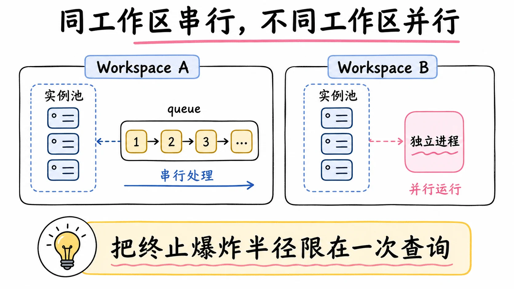

还有一个被否决的方案把边界划得更清楚：让 provider 自己注册模型工具。这条路的问题在于，加载了哪些语言服务器，模型的工具 schema 和提示词就被谁控制，部署里的一个配置项变成了模型行为的一个变量。工具归工具层拥有，provider 只在接缝后面提供导航能力，加载顺序影响不了模型看到的世界。

## 结果与错误：封闭词表的两端

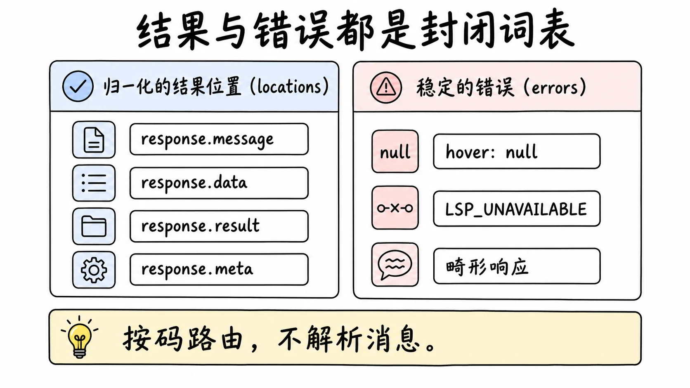

结果也是个封闭的判别联合。导航操作归一成位置分支，悬停归一成悬停分支，消费者在类型标记上穷举分支，加一个新分支会编译失败直到处理。悬停在该位置没有内容时返回 null，不是空字符串，也不是错误：null 表达的是"这里没有可悬停的东西"，是一次正常的空结果。空字符串和 null 的区别在消费端是实打实的分支依据，前者像"有内容但内容为空"，后者明确说"这里没有东西"，模型拿到 null 就知道该换个位置再试，而不是盯着一个空串怀疑渲染出了问题。

失败用稳定的错误码携带，六个：无效 provider、冲突、不可用、已销毁、不支持的操作、畸形响应。调用方按码路由，不解析消息文本。畸形单独成码这件事值得停一下：语言服务器返回的 JSON 不符合预期形状，报的是这个专用码而不是一个笼统的解析错误。语言服务器是外部进程，行为异常是常态而不是意外，把"服务器说了鬼话"归一成一个明确的码，调用方才能据此决定重试还是放弃，坏数据不会流进消费者。

## 没有承诺的事

这个接缝有意不做一些承诺，用之前要心里有数。

没有完整性承诺。LSP 没有通用的"索引完成"信号，服务器可能还在建索引，查询返回空列表或部分结果都是正常的。把空结果当成"没有引用"来推理，会在大仓库上出错；正确姿势是把空结果当成"暂时没查到"，需要确证时换个方式再验证。

举个会踩坑的场景：agent 刚起一个新会话就查一个函数的引用，服务器索引建到一半，返回了三条，实际有三十条。agent 据此判断"这个函数没怎么被用，可以安全改名"，改名之后测试大面积红。防御方式不在接缝里，在使用姿势里：冷启动后的第一轮查询结果降级为线索，不做证据；关键决策前用文本搜索交叉验证一次，语义查询和文本查询对不上号时相信"还没建完索引"这个解释。

不支持同步方式不兼容的服务器。有的服务器关文件也能查，但瞬态打开的同步它不认，那它就不被支持，哪怕它的协议实现在别的方面没毛病。支持面由同步策略定义，不由协议覆盖面定义。

外部位置可以做结果，不能做来源。跳定义跳出了工作区，那个位置会正常返回；但下一次查询不能拿工作区外的路径当输入。这是一条单向门：看得到外面，从外面发起查询不行。

语言服务器本身是被信任的，它跑在它的执行世界里，能读那个世界的其他路径。这不是这个接缝给的保证，是部署给的；接缝管的是模型问什么，不是服务器读什么。

## 权衡与局限

四个操作是最大的局限。符号搜索、调用层级、诊断、重命名，这个接缝都做不了。需要这些，要么等接缝按新 schema 扩展，要么用别的工具兜底。这个有限性换来的东西前面都说了：跨 provider 稳定的模型契约、被审过的封闭调用面。

无逃生舱锁死了高级用法。精通 LSP 的用户没法通过这个接缝发任意请求，所有能力都被四个操作框死在 provider 愿意翻译的范围内。灵活度和稳定，这里选了稳定，而且没有留后门。

坐标转换的负担在工具层。零基 UTF-16 和一基的转换、非基本平面字符附近的列换算、结果渲染，都在模型面向的工具里。工具层出一个转换 bug，agent 看到的坐标就整体错位。这是把协议细节和模型友好表示分离的代价，错位时先查转换层。

瞬态打开重复解析，串行执行增加延迟，语言服务器进程在销毁前一直占内存。这三条是同一组取舍的三个面：不持有跨查询状态，就把状态成本转成了每次查询的解析成本和排队成本。实例池按工作区分隔缓和了一部分：多仓库任务里每个工作区有自己的进程，排队只发生在单工作区内部。对导航这种低频操作，这笔账是划算的；想把它当高频查询引擎用，先重新算账。4MiB 的单文件上限对生成物和巨型数据文件也是硬门槛，这类文件本来就超出了语义导航的合理范围。

排他扩展名所有权在单仓库多服务器的场景会顶头。`.ts` 归了一个 provider，另一个想同时认领 `.tsx` 没问题，但两个都想认领 `.ts` 就有一个加载不上。设计里预期的解法是部署配置的选择器，在它落地之前，同扩展名的多服务器共存只能靠改映射绕。

## 结论

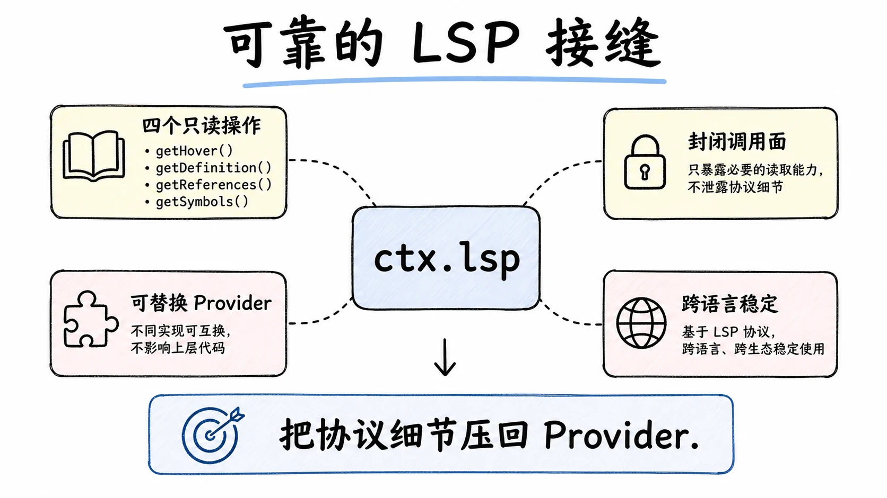

`ctx.lsp` 是一个极薄、极克制的接缝：四个共享同一 schema 的只读导航操作，封闭的操作联合和结果联合，按扩展名选 provider 且与顺序无关，注册原子、冲突不发布，没有任何协议逃生舱。全部协议复杂度（握手、能力协商、文档同步、JSON-RPC、进程生命周期）集中在一个通用 stdio provider 内部，它按规范工作区池化实例、懒启动进程、按能力清单核对支持面，模型和接缝只看四个操作。

这个接缝示范了一个通用模式：在最容易泄漏协议细节的地方，用封闭词表把细节压回 provider 一侧。模型得到一份不随底层服务器变化的问法，安全侧得到一份审得过来的调用面，代价是能力清单短。评估要不要照抄这个设计时，先问自己的场景能不能接受这份短：能接受，它就是模板；不能接受，先想清楚多出来的每个操作由谁审、跨 provider 怎么稳定，再动手。

## 延伸阅读

- [LSP 导航官方文档](https://github.com/deepseek-ai/deepseek-harness/blob/master/docs/subsystems/lsp.md)：四个操作与封闭联合的完整定义
- [LSP capability seam 设计笔记](https://github.com/deepseek-ai/deepseek-harness/blob/master/.agents/notes/implemented/architecture/2026-07-15-lsp-capability-seam.zh.md)：被否决的替代方案与全部坑位清单
- [Capability Seams](https://github.com/deepseek-ai/deepseek-harness/blob/master/docs/capability-seams.md)：`ctx.lsp` 行，三角色模式
- [Subprocess](https://github.com/deepseek-ai/deepseek-harness/blob/master/docs/subsystems/subprocess.md)：语言服务器进程的原始管道来源
- [Language Server Protocol 规范](https://microsoft.github.io/language-server-protocol/specifications/lsp/3.17/specification/)：坐标编码与文档同步的协议出处

上一篇：[dsh 命令执行三层：Subprocess / Shell / Terminal](./21-shell-subprocess-terminal.md)
下一篇：[dsh 的 Code Runtime 与 Code Mode：让模型写代码并执行](./23-code-runtime-and-code-mode.md)
