# dsh 的 Code Runtime 与 Code Mode：让模型写代码并执行

> dsh 把"模型写一段程序并执行"拆成两层：底层 `ctx.codeRuntime` 是执行接缝，跑一段带宿主绑定的程序，报告它打印和返回了什么；上层 Code Mode 把 agent 的工具变成程序里的 `tools` 对象，让模型用循环和条件批量调工具。两条纪律贯穿始终：程序失败是结果里的一个字段，不是异常；执行隔离是一个诊断标签，不是安全承诺。程序里发起的每个工具子调用照样走完整的策略管线，审批和沙箱一道不少。
> 截至 2026-08，这套机制又长出了三块新骨头：语言分发让 SDK 和传输描述跟着运行时的语言走（TypeScript 已发布，Python 的渲染器和线协议已就位）；子调用并行复用原生并发约定，独立读取在 `Promise.all` 下真实重叠；子调用的持久化日志副本纳入 spill 机制，大文件的读取不再把会话日志撑爆。

## 为什么 agent 要写代码并执行

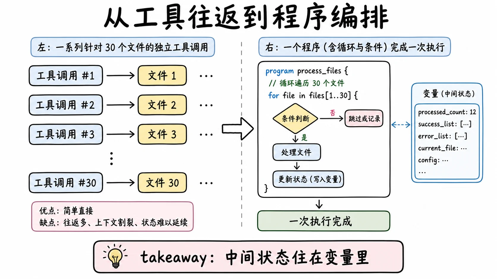

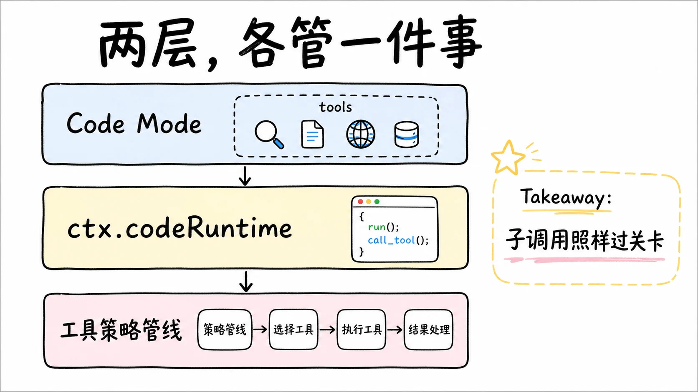

agent 调工具，默认是一次调一个：读个文件、跑条命令、改段代码。每一步都要模型想一下、发一个 tool call、等结果回来、再想下一步。对"把这个函数的用法总结一下"这类任务，这个节奏没问题。但对"把 30 个文件里的日期格式统一改掉"就不一样了：模型要在上下文里维护一份进度表，改完第 17 个文件时它得还记得第 3 个文件的教训，任何一步的往返都可能让中间状态溜走。每一步都有代价，不只是时间，还有模型注意力的消耗。

更自然的做法是让模型写一段程序，把"找文件、读内容、改格式、写回去、收集失败清单"这套编排逻辑放进代码里，用循环和条件表达，一次执行完。这就是 code execution 的价值：把"很多次工具调用加人肉编排"压成"一次程序执行"，中间状态住在变量里，不住在模型的记忆里。

但这里藏着一个决定整个设计的工程问题：程序里调工具，要不要和正常工具调用一样过策略关卡？

两种极端答案都有问题。不过关卡，程序就成了后门：模型在对话里发一个写文件调用会被审批拦下，但把同样的写操作藏进一段循环里就能溜过去，之前建立的所有安全边界形同虚设。全按可疑处理，Code Mode 的灵活性又没了意义。dsh 的答案分两层落地：底层 `ctx.codeRuntime` 只管执行程序加绑定，根本不知道工具是什么；上层 Code Mode 把工具作为绑定暴露给程序，并让每个子调用走和顶层调用一模一样的管线。分层让"执行一段程序"这个能力可以被别的消费者复用，也让"工具子调用过关卡"这条规矩有明确的归属。

## 底层接缝只做一件事

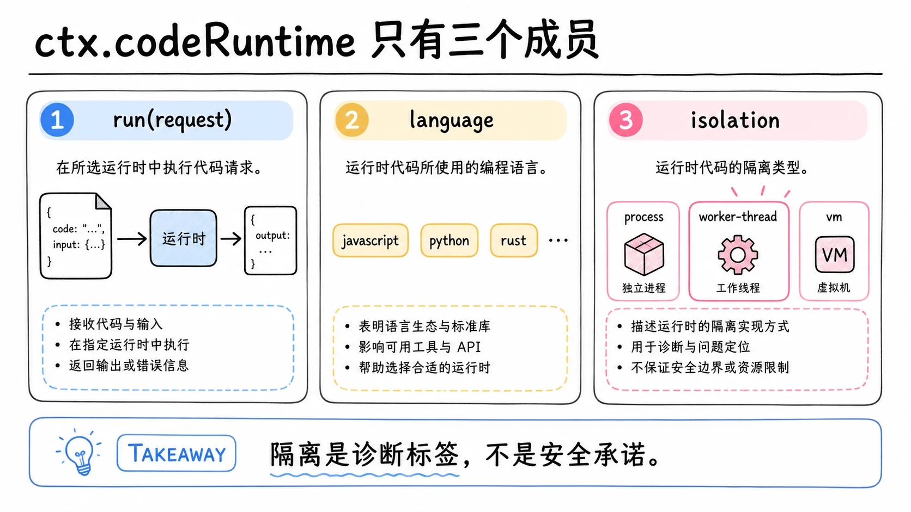

`ctx.codeRuntime` 定义在 `packages/code-runtime/code-runtime`，是一个可选能力，不在 agent-loop 主干里。没有它，agent 照常工作；装配了它，消费者才谈得上跑代码。这个定位和沙箱、审批一样：能力以接缝形式存在，谁需要谁来消费。

它对外只有三个成员。`run(request)` 执行一次程序；`language` 和 `isolation` 是两个只读描述符。`language` 说程序必须用什么语言写，已知值是 `'typescript'` 和 `'python'`，截至 2026-08 只有 TypeScript 有已发布后端，Python 那一半的位置摆得很实：工具层的 Python SDK 渲染器已经交付，专门的 `code-runtime-python` 包拥有宿主和 CPython 子进程之间 fd-3 线协议的编解码与敌意帧校验，后端本体另算一笔账。一个生成语言专属界面的消费者会按 `language` 分支，遇到展示不了的值就大声失败，而不是猜。

`isolation` 是整个接缝里最容易误解的一条。它取 `'worker-thread'`、`'process'`、`'container'` 三个值，说的是程序跑在什么底质上。它不是安全评级。看到 `worker-thread` 就认为"隔离了、伤不到主机"，是把诊断标签当成了安全承诺。真正的边界由沙箱和审批管，这一点后面单独展开。

### 请求带一切，结果报告一切

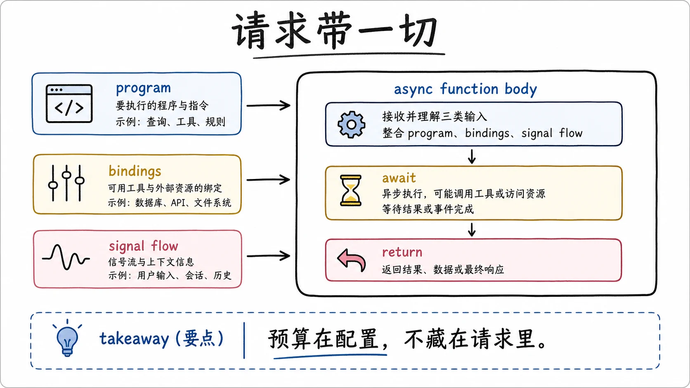

一次运行从 `run()` 收到的请求说起。`program` 是程序源码，它会被当作一个 async 函数的函数体执行，所以顶层 `await` 和 `return` 都可用，`return` 的完成值就是结果的 `value`。`bindings` 是宿主提供的函数列表，每个命名空间在程序里变成一个全局对象。`signal` 可选，触发时运行时硬停程序，哪怕它正卡在循环中途。

值得停下来看的是请求里没有什么：没有超时参数，没有输出上限，没有任何调参旋钮。预算和上限是实现的已校验配置，不是藏在 `run()` 内部等着填坑的默认值。这是刻意的"包边界处显式优于隐式"：调用方看到的请求就是运行时作用的全部，不需要读实现源码才能知道有哪些隐藏行为在影响这次运行。

中止的语义有一处容易被想当然。signal 触发后，运行时停止向程序提供服务，正在飞行中的绑定调用归调用方自己结算，运行时只负责不再问。换句话说，硬停的是"程序这个执行体"，已经在路上的一次工具调用是否等到结果、怎么处理，是消费者的决定。这个划分让运行时保持薄，也让取消语义不产生隐式的等待行为。

### 错误是字段，不是异常

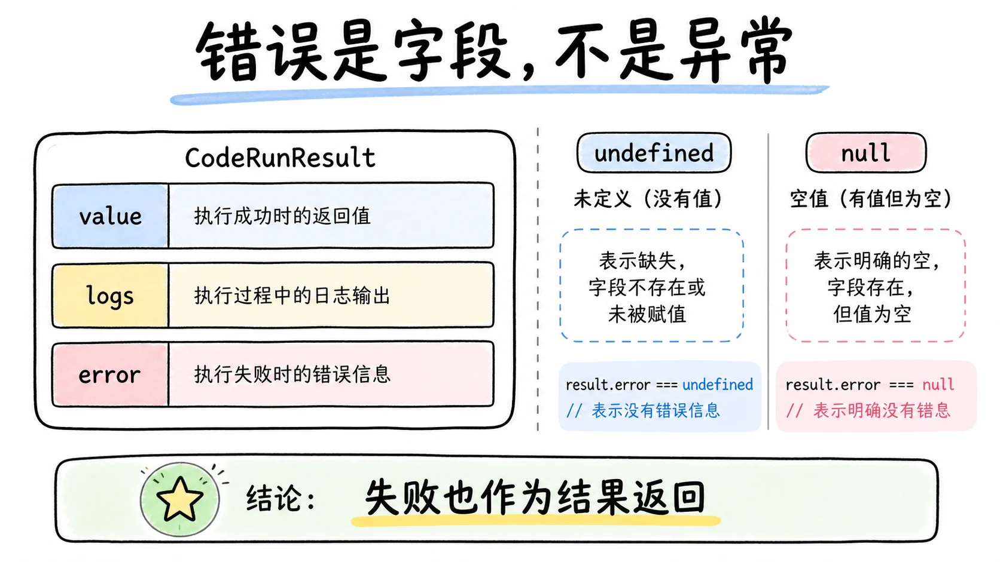

结果是这一层最重要的契约。`CodeRunResult` 把成功和失败都放在同一个结构里：`value` 是完成值，只有程序跑完且完成值跨过了无损 JSON 边界才存在；`logs` 是程序打印的文本，按顺序；`error` 是失败详情，失败时才有。一个失败的程序是一次正常返回的结果，不是 `run()` 的 rejection。`run()` 只在调用方误用契约时才拒绝，比如传了重复的绑定命名空间。

这个选择和 shell 执行器的 resolve-on-failure 契约一脉相承：模型写的程序崩了，是这次执行的"结果"，和程序算出一个数字没有本质区别，都应该以数据形式回来，让调用方决定下一步。如果失败走异常路径，消费者就得同时防备两条通道，每处调用都要问一句"这个错误是程序错了还是系统错了"。

完成值还有一个不起眼但精确的区分：`undefined` 是缺席，`null` 是显式的完成值。程序什么都不返回，结果里就没有 `value` 字段；程序明确 `return null`，`value` 就是 `null`。两个语义不同的东西没有被压成同一个。

`value` 的边界是一条硬线。完成值必须是无损 JSON：`null`、布尔、数字、字符串、它们的数组和对象。无效或超限的完成值会让整个运行失败，错误种类是 `invalid-output`，而不是把值渲染成字符串糊弄过去。宁可失败，也不静默降级，因为一个被偷偷字符串化的对象在程序消费端会变成解析难题，而且没人知道原始值长什么样。

## 三条预算加一条内存线，各管一件事

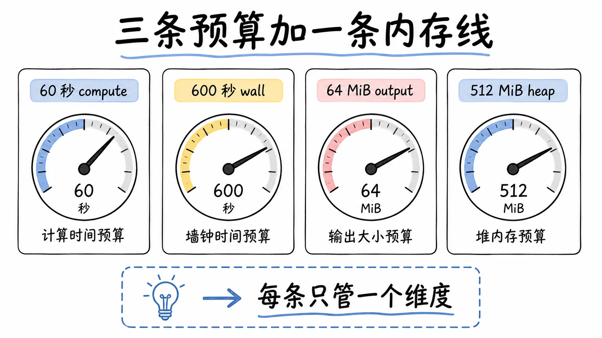

运行时的资源纪律用三条预算表达，每条管一个维度，互不代偿。worker-thread 实现的默认值：忙时预算 60 秒，墙钟预算 600 秒，输出上限 64MiB，另有一条给 worker 的老生代堆内存资源线，默认 512MiB。

`computeMs` 管忙时。实现用 `eventLoopUtilization()` 轮询测量程序实际消耗的 CPU 时间，一个大量等待 IO 的程序不会烧掉这条预算。因为它对比的是测量值而不是设一个定时器，所以不需要上限校验。

`maxWallMs` 管墙钟，从运行开始到结束的总时长，不管程序在忙还是在等。这条预算落地时经过 `setTimeout`，而 Node 的定时器延迟超过 2 的 31 次方减 1 毫秒会被钳制成 1 毫秒立即触发。也就是说，一个配得极大的 `maxWallMs` 反而会让预算瞬间到期。处理办法是在配置加载时就做范围检查，把这条坑挡在运行之前，而不是等它在生产里变成"为什么我的程序一启动就超时"。

`maxOutputBytes` 管输出体量，默认 67108864 字节，也就是 64 MiB。它只约束序列化后的外层三样：日志数组、完成值、失败诊断。固定信封语法和展示用的空白不计入。绑定调用的中间值不受字节上限约束，上限统一由外层结果把守。超限是一次明确的 `output-limit` 失败，不是截断。这和文件读取上限、shell 输出收集的纪律一致：宁可明确失败或明确记下"丢了"，也不静默替换，因为被截断的输出喂给模型，模型并不知道少了一截。

预算到期不是异常，中止不是超时，底质死亡两者都不是。这句话是失败分类的总纲，下一节展开。

## 绑定：宿主函数变成程序全局

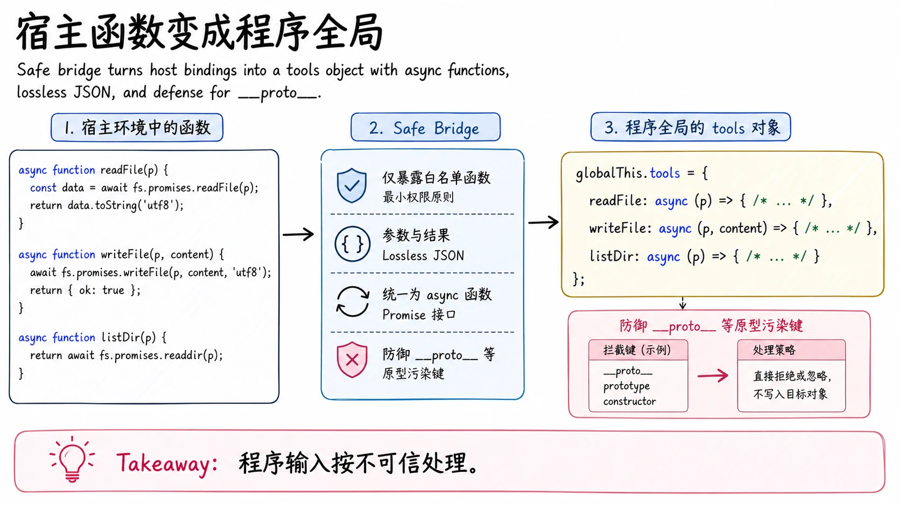

绑定是宿主和程序之间的桥。每个命名空间在程序里变成一个全局对象，对象里是一组 async 函数；Code Mode 的消费者传的就是一个叫 `tools` 的命名空间，于是程序里能写 `await tools.read({...})`。函数的参数和返回值必须是无损 JSON，可能经过结构化克隆跨越序列化边界，过不了的值会被拒绝并给出描述性错误，而不是让运行坏在半路。

这一层最有意思的态度是：把程序当成不可信的输入来源。程序是模型写的，模型可能写出（或被恶意提示诱导写出）试图污染原型链的代码，所以运行时从命名到构造全程设防。

函数名是任意字符串，但像 `__proto__` 或 `constructor` 这种名字必须被当成普通自有属性。实现上，命名空间对象用 null 原型构造，绑定名通过属性定义挂上去，永远不会触发原型碰撞。程序里 `tools['__proto__']` 拿到的是宿主放的函数，不是 `Object.prototype`。

命名空间的全局名要匹配语言可移植子集：字母或下划线开头，后续是字母数字下划线，且不属于任何语言的保留字。一份命名空间列表因此对每个后端都成立，不管 `language` 是 TypeScript 还是未来的 Python。一个 JS 专属拼法比如 `$tools` 被故意拒绝，因为换到 Python 后端它就不是合法标识符了。另有一份保留全局表（比如 `console`，运行时要自己占用）挡住后端自用的名字。

程序可见的错误类走同一条思路。命名空间可以声明一个错误类的名字和成员属性名，运行时在程序里注入真实的构造器，被拒的绑定调用会变成这个类的实例。Code Mode 声明的是 `ToolCallError`，带一个 `toolName` 成员，于是程序能写 `catch (e) { if (e instanceof ToolCallError) ... }` 并知道是哪个工具拒了它。运行时全程不知道任何消费者的存在，它只是按描述注入一个类；这个类用模块内捕获的原始构造器构建，属性用 null 原型描述符定义，模型代码改不动它的内部。

## 失败分类：六种正交结果

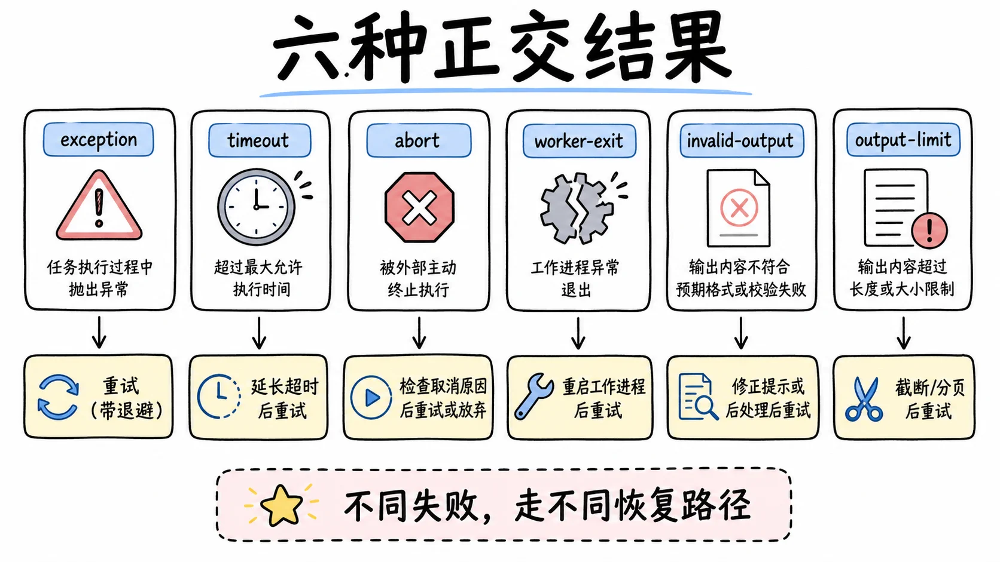

`CodeRunFailure` 的 kind 是六种正交、独立报告的结果。正交的意思是各管各的事实，不嵌套：预算到期不是异常，中止不是超时，底质死亡两者都不是。来源是 defensive patterns 里的一条原则：一个结果可以同时是几件事，进程可能超时了但 exit 0，因为它捕获了信号；把每个独立事实摆在自己的字段上，调用方才不会把一次被截断的运行误读成成功。

| kind | 什么情况 | 调用方该做什么 |
|---|---|---|
| `exception` | 程序抛了，或解析、类型转换失败 | 把 message 喂回模型让它改代码 |
| `timeout` | 预算到期，message 说明是哪条预算 | 调预算或优化程序 |
| `abort` | 调用方的 signal 触发 | 响应取消，不需要模型修正 |
| `worker-exit` | 执行底质没结算就死了，比如 OOM | 查资源或换底质 |
| `invalid-output` | 完成值不是无损 JSON | 让模型改返回值 |
| `output-limit` | 外层输出超过字节上限 | 控制程序输出 |

右列是这张表存在的理由：六种失败对应六种不同的后续动作，其中一半和模型写的代码无关。混在一起报的话，"模型写错了""跑太久了""底质崩了"就没法分别处理，自动化恢复只能瞎猜。`message` 是人可读字符串，适合直接喂回模型做自我修正，这也是它被设计成信息性字段而不是结构化数据的原因。

## Code Mode：把工具交到程序手里

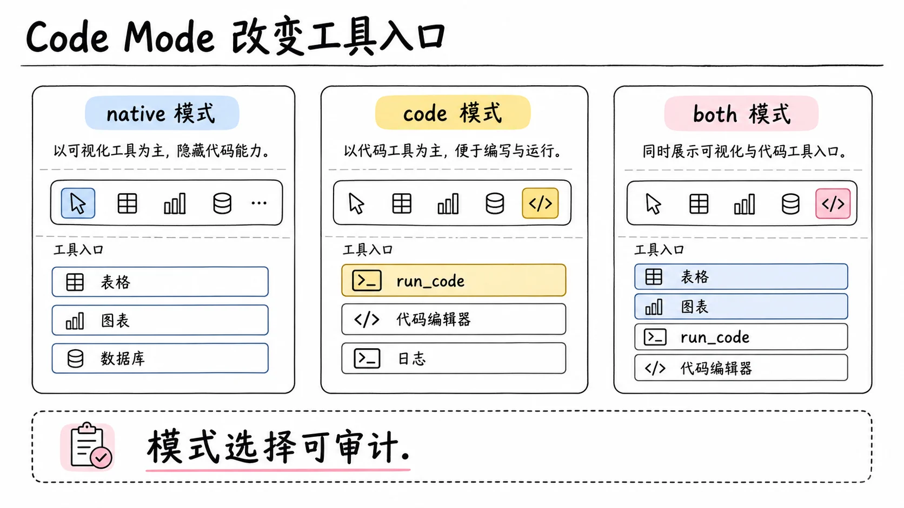

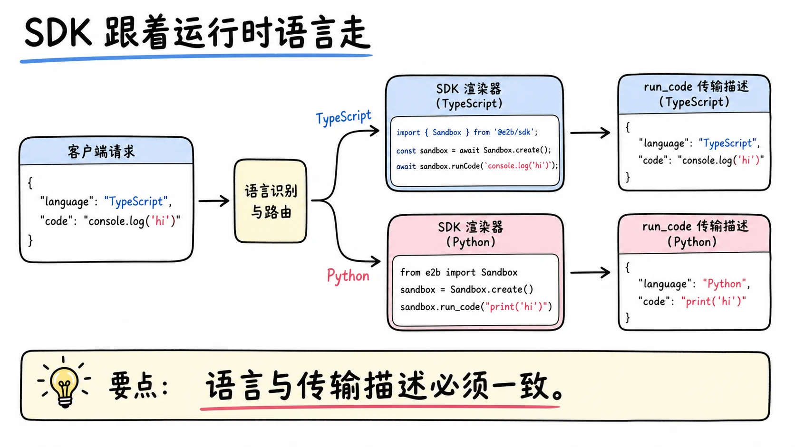

理解了底层，Code Mode 就好讲了：它是 `ctx.codeRuntime` 的一个消费者，把工具注册表里的工具包装成 `tools` 绑定命名空间，让模型写的程序能够调用。

启用靠一个三态开关：`mode` 取 `'native'`（默认）、`'code'` 或 `'both'`，从 `cordis.yml` 里配。它决定模型在 wire 上看到的工具列表：native 模式只给原生工具 schema，code 模式只给一个保留传输 `run_code`，both 两者都给。`run_code` 有两个必填参数，程序文本和一句描述，它是一个正常的工具定义、正常走派发，但被刻意放在可过滤的能力层之外，保证任何可见性配置都裁不掉这个入口。最终装配进请求头的工具列表会落进会话日志，所以一次运行用了什么模式是可审计的。

有个配置交互值得一提：如果某处配置声明了原生工具的能力排序，而模式是 `'code'`，装配会直接失败，因为 wire 上已经没有原生工具可排。让错误配置大声爆出来，好过静默跑在一个没人理解的组合上。

程序里怎么知道有哪些工具可调、参数长什么样？Code Mode 生成一个 SDK 段落放进系统提示，这一步在 2026 年 7 月底变成了按语言分发的查表：一张表把语言映射到 SDK 渲染器（TypeScript 渲染类型接口，Python 渲染 TypedDict），另一张表把语言映射到 `run_code` 的描述文本，保证一种语言的 SDK 段和它的传输 schema 永远一致，模型不会在 Python 运行时下看到 TypeScript 指令。两张表都用 `Object.hasOwn` 读取，连 `toString` 这种语言值也不会把继承成员解析成渲染器。新增一门后端语言是三处并列编辑加一个渲染器，不动 agent loop，不动注册表结构。

TypeScript 形态下，每个可见工具的参数 schema 被翻译成 TypeScript 类型，描述进 JSDoc，不支持的结构降级为 `unknown`。工具在程序里以带引号的对象键暴露，`tools["my-tool"]` 直接可用。引号键这个决定背后有一段权衡：另一种做法是给不合法标识符的工具名起净化别名，但别名映射引入了自己的碰撞和心智负担，引号键把这个问题整个消灭了。Python 形态下是同构的翻译：TypedDict 按字典序装配，描述成为方法的 docstring 且必须是方法体第一条语句，嵌套超过上限的 list 链降级为 Any，因为 CPython 的 tokenizer 拒绝一行里超过 200 个未闭合括号，这块文本必须保持可解析。两种渲染器都是确定性的：工具按字典序、工具集不变时文本逐字节相同，前缀缓存吃得稳定。SDK 段是惰性装配的。它的成本也要诚实计算：`both` 模式下原生 schema 和 SDK 类型描述同时在请求里，提示变长是真实的，靠前缀稳定加 provider 缓存摊薄，没人承诺它无条件省钱。

## 子调用走完整管线

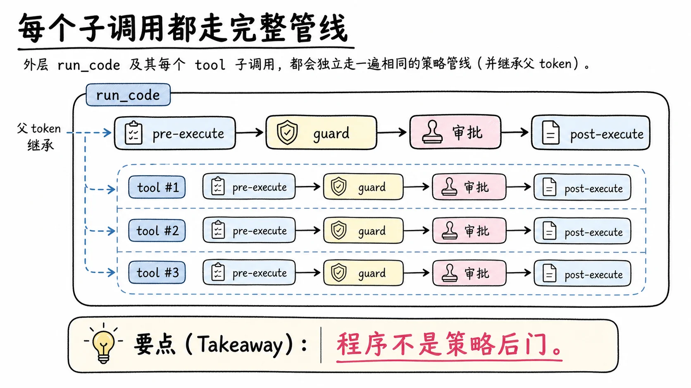

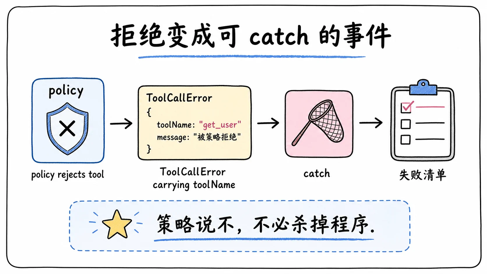

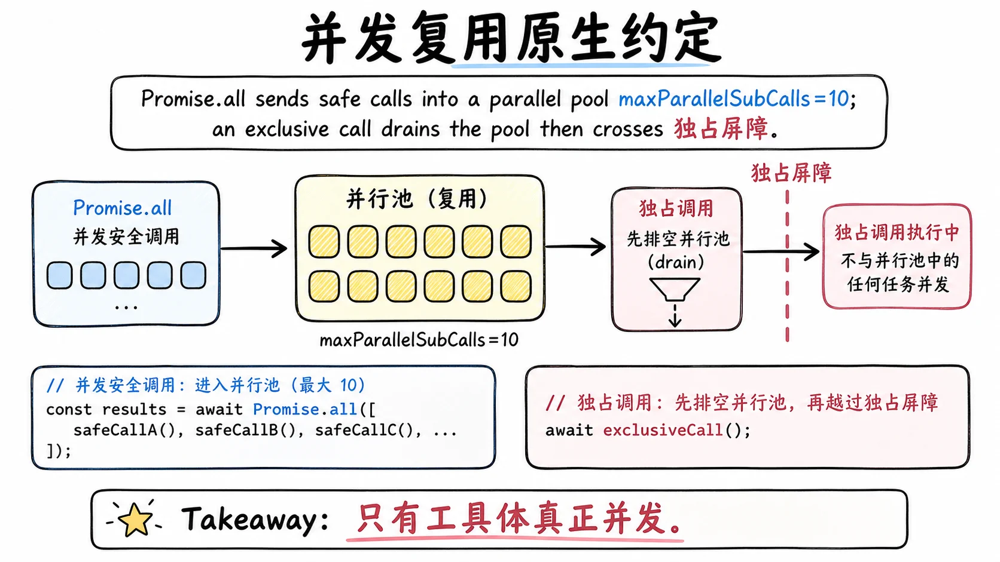

Code Mode 的核心规矩前面说过：程序里的每个工具子调用，走和顶层调用一样的管线。展开讲有四条。

第一条，跑代码这件事本身就是一次工具调用。`run_code` 作为传输进管线，过 pre-execute、守卫、审批、post-execute 全套关卡。一个权限插件在 pre-execute 里能看到完整程序文本，可以基于内容做决策，和它审查一条 bash 命令的地位完全一样。

第二条，程序里发起的每个子调用各自过一遍同样的管线，同时携带父调用的 token，记下一对 `tool/code-dispatch-start` 和 `tool/code-dispatch` 事件。start 事件在调度器真正启动调用那一刻才追加，不是提交时，于是因运行结算而被放弃的排队调用不留任何日志；每个已启动的调用恰好结算一次，中止也作为错误结果走流水线结算。审计因此能串起"这次子调用属于哪次代码执行"，会话日志里的派发树是完整的，UI 里每个子调用行有自己的运行指示。

第三条，一个子调用被策略拒绝，不让整个程序崩。拒绝以绑定拒绝的形式回到程序里，变成 `ToolCallError` 的实例，程序可以 catch 它、跳过这项工作、把失败记进自己的清单。这是把"策略说不"翻译成程序语言的方式：不是杀掉程序，而是让拒绝成为程序可见、可处理的一个普通事件。

第四条，子调用省略额外的上下文注入机制，保持调用和结果的邻接，让结果干净地回到程序里，不被顺带注入的上下文打断。工具自己想往上下文里塞东西也不行：子调用路径上的延迟上下文会被挂起，等外层 `run_code` 结算后才按顺序追加到结果之后，而外层 post-execute 的一次拦截块会把这些工具侧的延迟条目整个丢弃。控制权始终在外层这次调用的手里。

子调用的并发复用原生约定，这一点值得把细节说清。派发队列严格按提交顺序启动调用；每个调用在启动那一刻按工具自己声明的并发安全性分类（和 agent loop 调度器用的是同一个分类函数，声明缺失按不安全处理，fail-closed）。连续的并行类调用可以重叠，上限默认 10 个（`maxParallelSubCalls`，配 1 就回到串行，这个默认值和 loop 调度器自身一致）；遇到独占类调用，先排干池子让它独跑，屏障一直保持到它自己的提交（含 post-execute）完成，和原生独占分组一致。有序的策略阶段（start 事件、pre-execute、结算提交）由单通道驱动器独占执行，只有工具体阶段真正并发，时序和原生 loop 对齐。运行结算时会中止仍在跑的分发，丢弃已排队未启动的（绑定调用被拒绝，不产生事件），排干到完全停稳后外层结果才结束这轮。程序里 `Promise.all` 三个独立读取，拿到的延迟和原生路径一个水平；SDK 提示词也如实告诉模型：相互独立的安全调用可以重叠，相互依赖的工作用 `await` 顺序衔接。这条提示词在并行机制落地时从旧的"按顺序执行"改了过来，模型看到的就是真实契约。

## 子调用的日志副本也要过 spill

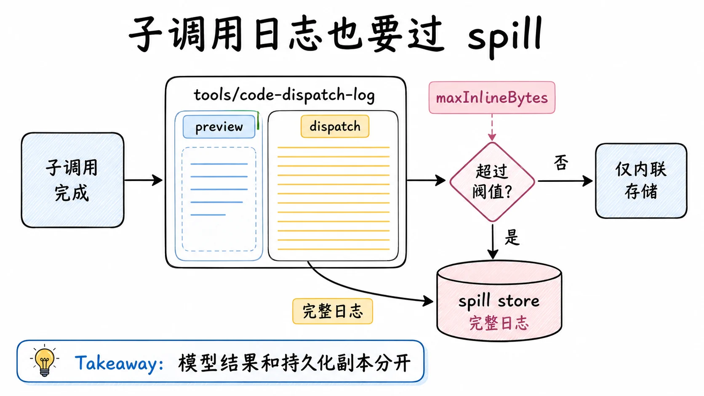

2026 年 7 月底补上的一块值得单独讲。子调用的派发事件最初连完整内容进日志，没有任何上限：一个读大文件的程序，会把完整渲染文本写进会话日志，每个受影响的轮次让 JSONL 增长数 MB。原生工具结果在记录前本来就有内联上限，两类结果受到不同处理，而批量数据工作恰恰最容易产生巨大结果。

修法不是在桥接层加一个粗暴的截断，而是在注册表上增设 `tools/code-dispatch-log` waterfall，spill 策略插件作为第一个监听器挂上去：复用面向模型结果同款的 `maxInlineBytes` 上限、预览加定位符、超限不变式和尽力回退，spill 产物以 `dispatch` 为标签记在子调用 id 名下，UI 和回放走与原生结果相同的路径读全文。监听器只能替换持久化副本，模型看不到这份副本，程序拿到的是结构化值。有一处有意的差别：面向模型的结果监听器会跳过 `read` 工具以防"读、溢出、再读"的循环，派发日志监听器不跳，因为日志副本不进模型上下文，循环不会发生，而 `read` 恰恰最容易产生巨大的日志条目。待处理的日志任务超过并行上限时，提交循环会等待，慢速 spill 后端因此能限制后续子调用的启动，而不是无限堆积待写的 IO。

## TypeScript 怎么跑起来

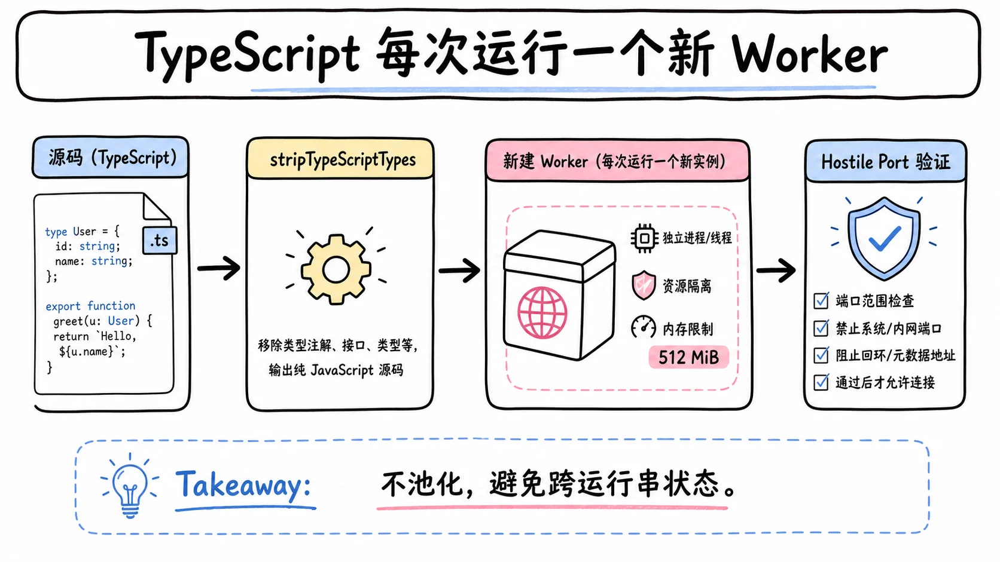

已发布的后端是 worker-thread provider，它处理 TypeScript 的方式值得一看，因为每个选择都对应一类故障的预防。

类型剥离在宿主侧完成，用 Node 的 `stripTypeScriptTypes`，位置保持，所以运行报错的行号对得上模型写的源码，这对模型自我修正很重要。只剥不改，于是 `enum`、namespace 这类运行时才能落地的语法在剥离阶段就被拒，程序还没跑到 worker 就以 `exception` 失败，省了一次完整的进程创建。

每个运行起一个全新的 Worker，环境变量全空，资源限额来自配置（包括那条 512MiB 的老生代堆线），没有池化，没有跨运行状态。一次一新的代价是每次运行都要付 worker 的启动成本，换来的是运行之间绝对不串状态，这是比复用性能更硬的要求。输出捕获走一个 console 垫片，程序打印的东西按顺序进 `logs`，通道和方法的元数据不进接缝，因为消费者只渲染文本。

宿主和 worker 之间的端口协议假设对端是敌意的。worker 发来的每条绑定调用消息（带 id、命名空间、函数名、参数）都经过宿主验证，未知名字、重复 id、结算之后到达的消息一律拒绝或忽略。这和绑定名的敌意输入处理是同一姿态的两端：程序侧防原型攻击，传输侧防伪造消息。Python 那条路上的 fd-3 线协议也是同一姿态，`code-runtime-python` 包导出的帧校验器就是给未来的宿主侧消费方共享的。

处置语义也讲清楚了：插件卸载时终止在飞的 worker 并等待它们退出后才算完成。发个终止信号就返回，会留下孤儿进程，这是 defensive patterns 里点名的错误模式。

## 被拒掉的方案

设计笔记里记录了几个被明确否掉的替代方案，它们比最终方案更能说明设计的边界。

`node:vm` 被拒，两个理由：它不是隔离，原型链可以逃逸；它不能打断热循环，一个 `while (true)` 就能把整个进程挂死。worker 线程两个问题都解决，terminate 是真的能停。

常驻 REPL 内核被拒，理由回到 harness 的第一原则：跨调用保持的状态对会话日志不可见，会破坏"模型可见即可重建"。每次运行一个全新 worker，牺牲了会话内复用，保住了可重建性。

对工具结果做省略或摘要被拒，因为它只治上下文膨胀这一个症状，模型还是要一次一往返地调工具，循环、条件、汇合这些编排能力一个都没有。

始终独占（不提供模式开关）被拒，因为它给"bash、读文件、改代码"这类单调用工作流平添了税。模式开关让 Code Mode 是一个可选的姿态而不是强制的路线。

在提交时而非启动时发 start 事件被拒，因为那会把排了队却从未运行的调用显示成运行中，还得引入第三种"已放弃"终态才能让日志自洽。不加限制的并行也被拒，写操作会产生竞态：安全性声明归工具所有，不归调用方。

## 安全边界到底在哪

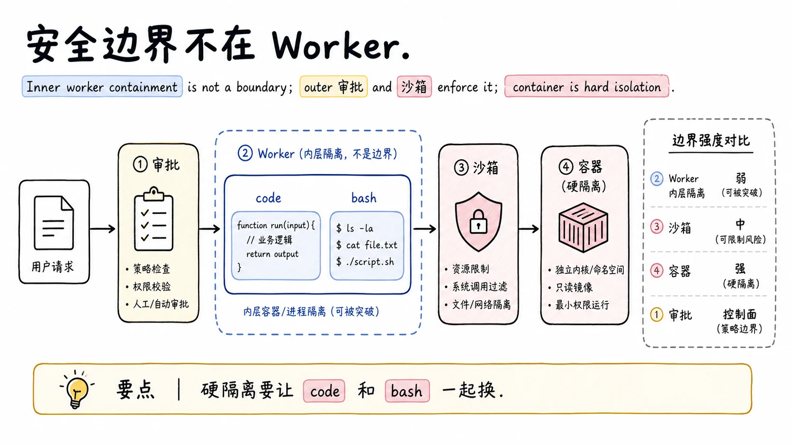

最后回到 `isolation` 那个悬着的问题。

这个后端的信任姿态被明确表述为与 bash 等价。理由是直接的：`dsh-bash-local` 本来就在跑模型写的 shell，那里的环境权限比 worker 里只多不少。在这个前提下给 Code Mode 加"不安全确认"弹窗没有意义，它没有引入超出 bash 的新权限面。

worker 是遏制手段，不是安全边界。模型代码在 worker 里能接触 Node API；worker 被终止时，它在运行期间启动的操作系统子进程不会被一并停掉，`terminate()` 管的是线程，不是进程树。真正的强制力在两处：工具子调用过管线时，审批和沙箱照常拦截；策略关卡和 bash 用的是同一个 pre-execute，权限插件的审查范围天然覆盖程序文本。要做硬性的多租户隔离，答案是容器后端，而且 code 和 bash 要一起换，只给一边上容器是漏的。

把这个立场和接缝设计放在一起看就完整了：`isolation` 描述符标注底质是为了让诊断和选型有据可查，比如确认生产部署是否真的用了容器后端；它从不动承诺安全，安全承诺住在沙箱和审批那两个专门子系统里，各归各的账。

## 权衡与局限

策略不漏的代价是每个子调用都过完整关卡。批量调 50 次工具，就是 50 次守卫、审批、事件记录的完整流程。这是刻意的选择，但意味着 Code Mode 的吞吐上限受管线开销约束，不适合拿它当高性能 RPC 通道用。

完成值必须是无损 JSON。返回一个函数、循环引用的对象、类实例，都会以 `invalid-output` 失败。程序要交回复杂结构，得自己先序列化成纯数据。这换来了结果能安全跨越任何执行边界，但把序列化的责任放到了模型写的代码里。

输出超限是硬失败。一个打印上百万行的程序不会带着截断的日志回来，而是整个运行 `output-limit` 失败。写程序时控制输出体量是模型自己的责任，SDK 契约里也这么陈述。

只有 TypeScript 有已发布后端。`'python'` 是词表里的已知值，SDK 渲染器、传输描述、线协议包都已就位，但想跑 Python 程序得等后端本体落地或自己实现接缝。`both` 模式的提示成本是双份的，前缀缓存能摊薄不能消除。

大 JSON 有实际内存边界。无损值没有字节级的事前上限，结构化克隆的成本和内存是真实的物理约束，一个巨大的合法值也可能把运行压垮，512MiB 的堆线就是那条物理边界。

并行承诺受工具声明约束。模型在程序里看到的并行上限是"工具声称并发安全"撑起来的，工具声明保守时，程序的并行收益就打折。这是把安全性放在吞吐前面的又一个实例。

## 结论

`ctx.codeRuntime` 是执行模型所写程序的底层接缝，它把三件事做到了位：错误作为结果字段报告，六种失败正交分类，预算和上限是显式配置而非隐藏默认。绑定机制把程序当不可信输入对待，从命名空间构造到端口协议全程设防。Code Mode 在它之上把工具交给程序，关键规矩是每个子调用走完整管线、拒绝变成程序可 catch 的 `ToolCallError`、审计靠父 token 串起派发树；并行复用原生并发约定，日志副本过 spill，语言分发让 SDK 跟着运行时走。被拒掉的方案划出了设计的边界：不用 `node:vm` 因为它既不隔离也打不断热循环，不做常驻 REPL 因为它破坏可重建性。安全上，worker 是遏制不是边界，真正的强制力在审批和沙箱，`isolation` 只是告诉你程序跑在什么底质上，方便你诊断和选型。

## 延伸阅读

- [Code Runtime 官方文档](https://github.com/deepseek-ai/deepseek-harness/blob/master/docs/subsystems/code-runtime.md)：运行请求、绑定、失败分类的完整定义
- [Tool Execution Pipeline](https://github.com/deepseek-ai/deepseek-harness/blob/master/docs/tool-execution-pipeline.md)：`run_code` 传输与子调用如何过管线
- [Code Mode foundation 笔记](https://github.com/deepseek-ai/deepseek-harness/blob/master/.agents/notes/implemented/feature/2026-06-15-code-mode.zh.md)：worker-thread provider、并发规则与被拒方案
- [实时并行分发笔记](https://github.com/deepseek-ai/deepseek-harness/blob/master/.agents/notes/implemented/feature/2026-07-26-code-mode-live-parallel-dispatch.zh.md)：start/settle 事件对与调度约定
- [typed-return contract 笔记](https://github.com/deepseek-ai/deepseek-harness/blob/master/.agents/notes/implemented/feature/2026-07-20-code-mode-typed-tool-returns.zh.md)：类型化返回、`ToolCallError`、输出上限

上一篇：[dsh 的 LSP 接缝：让 agent 真正"懂"代码](./22-lsp-code-navigation.md)
下一篇：[dsh 的 Jobs 与 Workflow：后台任务和编排脚本](./24-jobs-and-workflow-ralph.md)
