# dsh 的上下文预算：Compaction 压缩与 Spill 溢出

> dsh 管上下文体积靠两个互补机制：压缩（compaction）治"很多中等内容撑爆上下文"，溢出（spill）治"单个超大内容塞不进去"。压缩没有面向模型的 compact 工具，由 harness 被动驱动，先确定性修剪后总结，总结调用逐字回放对话前缀以复用 KV 缓存；spill 把超大工具结果整个搬到上下文外，给模型一个不透明定位符加检索提示。测量归单例 `ctx.tokenMeter`，它把请求压力和表面定价统一成一个可重放的快照。三个机制合起来兑现一个立场：不指望模型自己管理上下文，用工程机制保证上下文不会失控。

## 反常识：没有 compact 工具

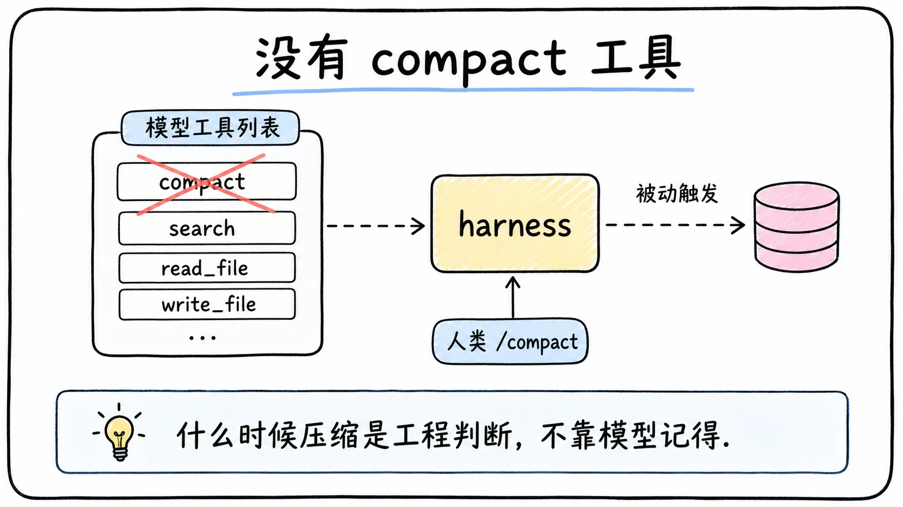

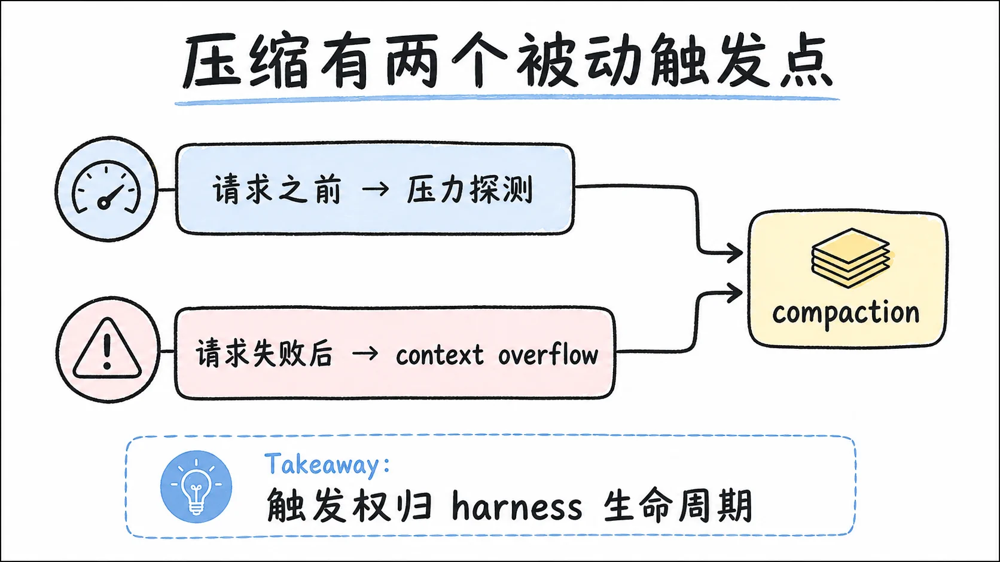

第一次想"上下文太长怎么办"，本能方案是给模型一个 `compact` 工具，让它觉得历史太长时自己调用。直觉上很自然：模型最懂哪些内容重要，让它自己压缩最合理。

dsh 不这么干。压缩不是模型面向的工具，模型在工具列表里找不到"压缩历史"这个选项。压缩完全由 harness 驱动，触发点是两个被动的、生命周期归属 harness 的机制：压力触发在每个模型请求之前、请求派生之前探测上下文压力，压力够格就考虑压缩，所以压缩发生在模型看到请求之前；溢出触发在一次失败请求之后收到 provider 报的上下文超限（归一成专用 code），这时尝试压缩救场。

为什么不让模型自己压缩？"什么时候该压缩"是个工程判断，不是内容判断。模型自己调压缩工具，可能忘了调、可能调早了白烧一次昂贵的总结调用、可能调晚了已经溢出报错。触发权放在压力探测和溢出检测上，压缩的时机就是确定性的，不取决于模型记不记得。

有个容易混的细节：存在一个面向人类的 `/compact` 命令（独立的 `command-compact` 包），让人可以手动触发压缩。但那是人发的命令，参数都不带，是直接的人类控制。模型这一侧，压缩永远被动。

## 先修剪，后总结

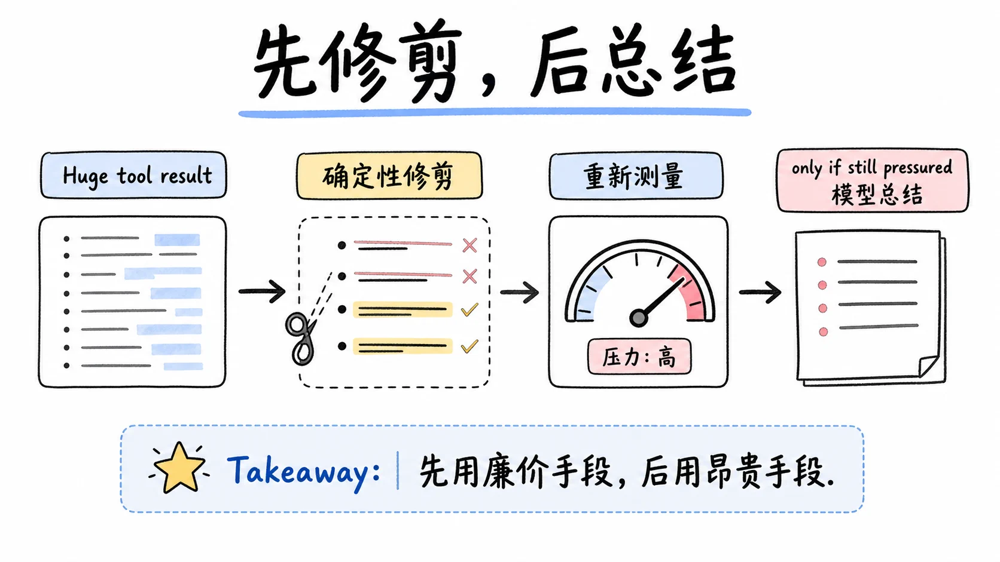

压缩流程里最实用的一条：压力够格时，后端不是直接跑总结，而是先调可选的工具结果修剪器修剪当前的超大工具结果，再重新测量。出货组合里这个修剪器是一个独立插件，挂在对话压缩器之前，注释写得很清楚：在更大范围的压缩器跑起来之前，先把超大的工具结果收进配置的预算内，保住模型可见的结果。

为什么先修剪？对话变长最常见的原因不是"话太多了"，而是"某个工具结果太大了"。一次 `cat` 大文件的输出、一个抓回来的长 HTML、一堆 grep 匹配，单个结果可能就占几万 token。修剪它们是确定性的、廉价的：保留头尾砍中间，语义上无损锚点。跑一次模型总结则又贵又可能丢关键细节。修剪完重新测量，压力降下来了，表面直接推进，总结根本不用上。只有修剪不够，才轮到总结这个重后手。先廉价确定性手段、后昂贵模型手段，这个分层是整个 harness 反复出现的审美。

## 工具结果修剪器

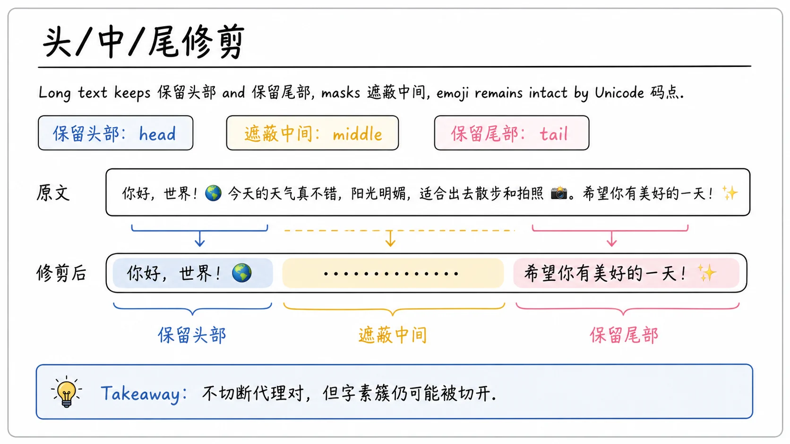

修剪服务是确定性的头/中/尾修剪，作用于当前的模型可见表面。对外三个动词：测，按 Unicode 码点给文本内容计大小，非文本块算零；剪，把超预算文本的中间替换掉，保留富块的顺序，预算内返回原样；落，对表面快照里每个超预算的工具结果做替换。

落日志的替换有几条讲究。每个替换保留完整的事件数据、只改内容字段，并引用被遮蔽的节点，让回放能恢复替换前的输入；每次替换前面紧跟一条影子定价事件，通过注入的 token meter 给被遮蔽节点定价，这样纯消费者不用自己维护每节点状态就能把账减对。会话拒绝某个替换时抛错，但之前已提交的替换保持持久。

按 Unicode 码点而不是 UTF-16 码元切，这条值得记。JavaScript 字符串是 UTF-16，一个 emoji 可能占两个码元，按码元切可能把一个 emoji 切成两半变成乱码，按码点切保证保留边界不切断代理对。文档同时也诚实地说了边界：字素簇仍可能被切开。修剪不能制造新的损坏，能做到的范围内做到最细。

## 测量：`ctx.tokenMeter`

测量的 owner 是单例 `ctx.tokenMeter`，它是重放 owner：从会话的持久日志尾部重放出当前的请求压力和表面快照。每次测量返回一个脱离的、深度不可变的快照，内容是消费到的日志长度、定价锚点、相对锚点的有符号重定价、请求加响应压力、表面 token 总数，和按位置从头到尾排列的表面节点。每次调用克隆这些位置节点，测量是 O(表面) 的，快照不随底层重放 fold 前进而增长。多个消费者各拿一份，互不干扰。

锚点有两种。usage 锚点表示最近一次成功的 provider 调用有相同的规范请求信封、且总数不低于那次调用的完整启发式锚点，可以复用 provider 报的真实 usage；estimated 锚点表示没有可复用的保守锚点，用固定启发式给完整信封和表面定价。有符号的差值保留相对锚点的增长和收缩，后续一次成功的请求会替换掉更早的锚点。为什么讲究这个？provider 的真实 usage 最准，但只在请求信封没变时能复用，系统提示或工具 schema 一变就得退回启发式。能复用就复用真实、不能就保守估计，在准和稳之间取平衡，而启发式偏保守的方向也是选过的：宁可高估压力早压缩，不低估压力导致溢出。

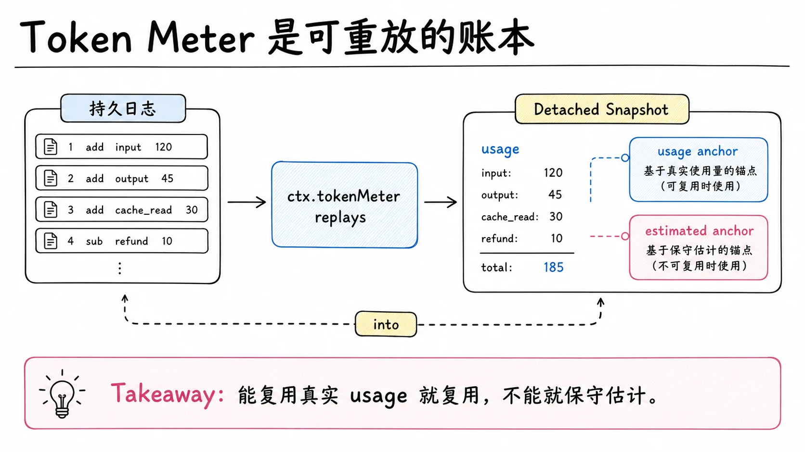

## 阈值与保留尾巴：数字和政策

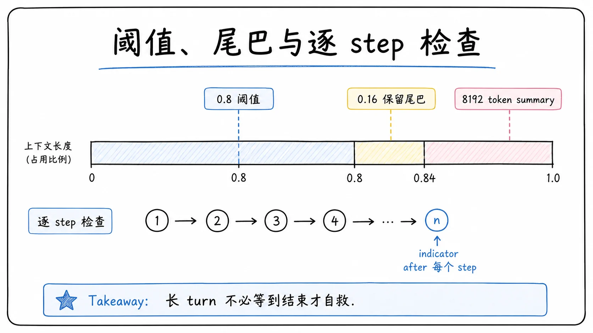

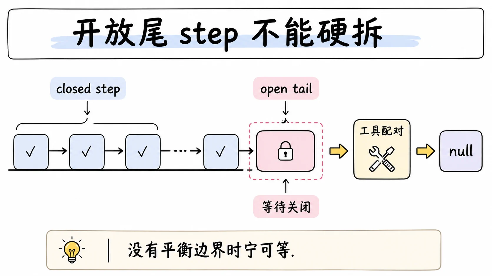

压缩后端持有默认策略，几个数字值得知道：压力阈值是上下文窗口的 0.8，保留尾巴的比例是 0.16，总结调用的输出上限 8192 token，压缩重试和溢出重试各一次，自动压缩默认开。每 provider 的策略可以部分覆盖顶层默认，保留量也可以用绝对 token 数替代比例，前提是保留必须低于阈值。

检查的频率有一个承重设计：保留检查在每个成功的 step 之后做，不是等 turn 结束。这条对失控长 turn 是救命的：一个 turn 里跑了几十个工具调用的循环，如果压缩只发生在 turn 边界，这个 turn 自己就能把上下文撑爆，而且模型正在干活没有边界可等。逐 step 检查让压缩在 turn 中间就能落地，工具配对平衡是唯一的结构性守卫。

反过来也有一个诚实的拒绝：一个不可拆的开放尾 step 会让压缩返回 null 不做事，等这个 step 关了再试。硬拆一个没完成的 step 没有平衡边界可用，宁可等。

溢出恢复有自己的特殊路径：它绕过阈值和保留尾巴策略，做一次最大化的平衡头部缩减，留下最新的不可分单元。都溢出了，再按常规比例砍已经来不及，这一刀要砍到能过。

阈值之外还有一个主动动词：turn 之间跑的显式压缩，用于在压力还低于阈值时提前收拾有用的历史。它的节奏有讲究：空闲任务的启动是同步的，先占上位置再做异步的总结工作；排队的后续提示要等可选的持久化检查点和这次空闲任务结算之后才开始，不会和压缩抢道。没有有用区间时一个字都不写，返回 null。

## 压缩怎么做：锁、总结、替换

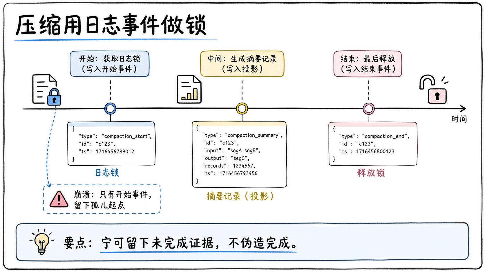

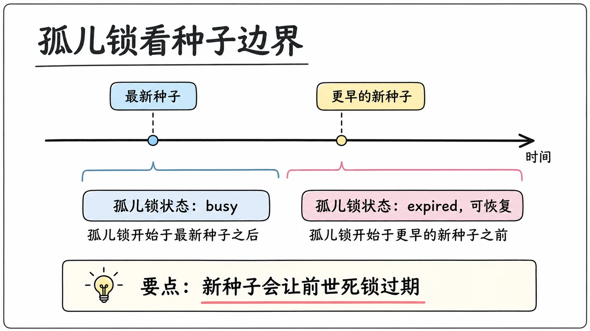

压缩用一对事件把整个操作括起来。三个压缩事件全是纯日志，不进模型表面：start 记录锁的获取，turn 数字标识打开的自动 turn，null 标识独立的手动尝试；summary 记录安全的总结投影、被遮蔽的表面边界对和 seq、估算 token 数、总结调用的信封；end 释放锁。

顺序是关键：start 先追加，然后总结生成、summary 记录、替换消息落地，最后 end。最后释放锁，把"操作中途崩溃"变成一个可检测的孤儿锁，而不是一个虚假声称压缩完成的 end。宁可留一个明显的"没完成"，不留一个骗人的"完成了"。这对括号还是唯一的锁，进程内没有第二个 mutex 复制它，并发压缩靠日志上的这条纪律挡住。

孤儿锁的判定有两条，配合得很干净。一个没有配对 end 的 start 出现在最新的会话种子边界之后，它是活的锁，所有入口报 busy；出现在更新的种子边界之前，新的种子证明它过期，恢复、fork、接管都不会被一个前世留下的死锁楔住。

还有一条容易被忽略的语义：标记是时间点，不是独占容器。一次独立的手动压缩的 start 和 end 之间，可以出现别的空闲注入；手动路径重验的是自己选定的位置区间，不是这段时间里的一切，注入进来的上下文能活下来。

总结怎么进入模型表面？表面事件类型刻意不被扩展，只有产生消息的事件能到模型，编译器和会话的追加边界会拒绝在压缩事件上挂表面操作。总结骑在一条单独的 user 角色消息上，带一个替换操作，指明被替换的表面区间。设计笔记给这个复用写的理由很直白：这不是权宜，是诚实，总结本来就是 user 角色的上下文。派生消息时产出"总结作为 user 消息加保留下来的条目"，模型看到的结构自洽。替换消息还带一个必需的事务身份：压缩检查点来源，由接口导出的构造器生成、谓词识别，客户端和 wire 消费者从一条不依赖 Cordis 的子路径导入它。消费者因此能在不认识任何具体后端包的情况下，认出并关联一个持久的检查点。

## 总结调用本身：一次真正的缓存复用工程

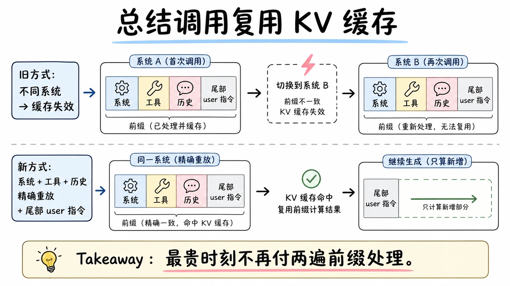

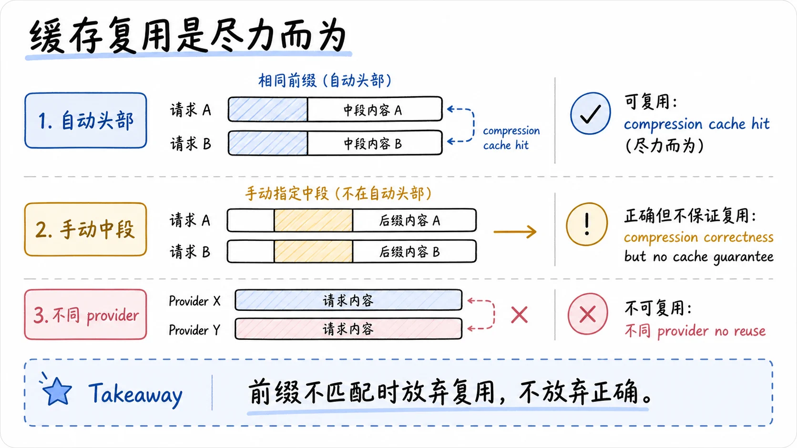

总结是一次真实的模型调用，走上下文的 LLM 服务。2026 年 7 月下旬的一次修复把它从"缓存灾难"改成了"缓存复用"，值得完整讲，因为它是这类辅助调用的模板。

问题形态：自动压缩恰好在对话中途触发，刚好在循环用最后一个已路由请求（system 加 tools 加派生历史）预热了 provider 的 KV 缓存之后。默认摘要器却发一个独立的辅助请求：专门的摘要器 system 提示词，后接拍平成单个字符串的较早历史。provider 按请求开头的 token 序列做缓存，第一个 token 不同（一个不同的 system），整段已缓存前缀作废。于是每次压缩都为整段历史付两次完整的提示词处理成本，而且恰好发生在对话最大、缓存最值钱的时刻。

修法把摘要指令从请求的前端挪到末尾。总结器的输入不再是渲染后的字符串，而是一份带结构的前缀：持久的 system 和 tools，加上被遮蔽区域经会话的派生函数映射出的消息，后者与折叠进已路由请求的内容字节级一致。辅助调用逐字复现最后一个已路由请求的前缀，在末尾追加一条 user 角色的压缩指令。有一个反直觉的细节：tools 随请求一起带上，哪怕摘要器从不调用任何工具，因为丢弃它们会缩短 token 序列，破坏与已缓存请求的对齐。指令本身开头是"你现在充当压缩引擎"，浓缩上方的对话，并新增两条规则：不要提及摘要请求，只输出检查点文本不调用任何工具。

缓存复用是尽力而为，正确性有保证。自动压缩总是锚定在表面头部，被遮蔽区域就是已路由请求的头部，回放前缀与之完全匹配，这是保证命中的情形。手动的中段压缩仍然回放真实前缀保持正确，但放弃复用，因为它的被遮蔽区域不是请求头部；配置了不同的总结 provider 或模型也放弃复用，那是部署方明确的权衡。指令挪到尾部还带来一个合法性收益：被遮蔽区域总是结束在工具配对平衡的边界上，其后追加一条 user 消息对各家适配器都是合法排序。

调用身份另有一条独立设计。生成选项带一个 provider 中立的用途判别式，标记这是一次压缩调用；DeepSeek 适配器会把它翻成 wire 上一个专门的头。被否掉的替代：一个 compact 布尔或无类型的元数据图。布尔会让辅助调用种类互相排斥（加第二种就得改成位标志），元数据图丢掉编译期检查，typed 判别式加新种类不碰旧的。

## 区域与工具配对

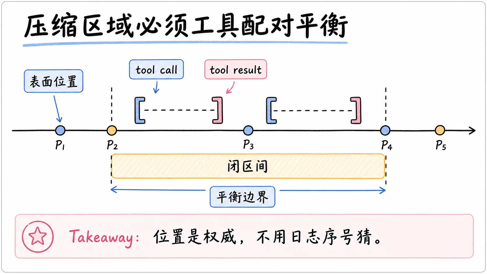

强制压缩一个区间时，start 和 end 按表面位置命名一个闭区间，不是按日志序号：之前的替换能让可见序号非单调。一个真实的后果是，被遮蔽区间的边界序号可以 start 大于 end，因为一次前置替换把一个高序号的总结节点落在了较旧的位置上。位置是权威，序号集合按表面顺序展开才是权威清单。

两个边界必须平衡：assistant 的工具调用和它们的结果不能被切开。边界检查的函数同时验证表面成员资格，拒绝缺失序号和孤儿结果。如果压缩区间把调用和结果分家，模型会看到一个没有结果的调用或一个没有调用的结果，请求直接不合法。但区域保留的是配对，不是整个 turn：一个超大 turn 里早期已关闭的 step 可以被单独压缩，不用把整个 turn 包进去。

## 失败恢复：以表面推进为判据

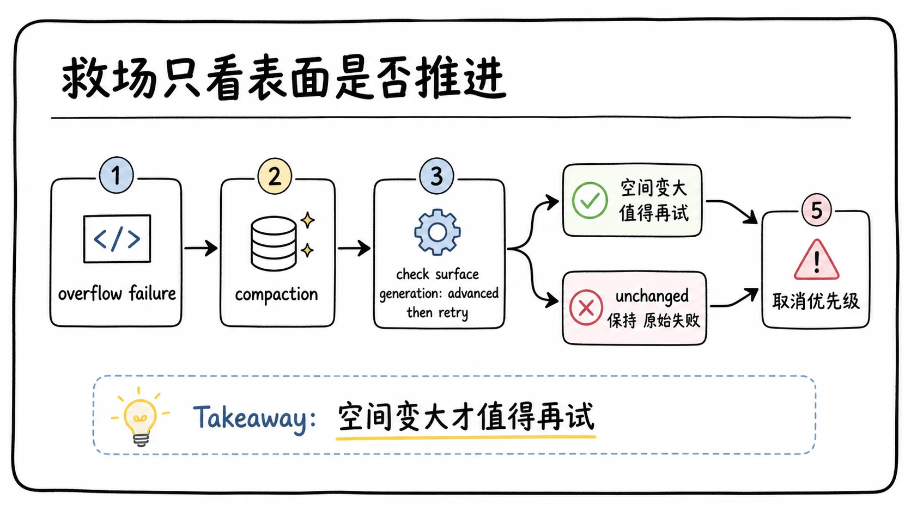

溢出触发的压缩在失败的 step 关闭之后跑，返回重试动作的条件是表面替换的生成推进了。这个判据很务实：总结工作在修剪之后又抛了、内部怎么折腾都不看，只要模型下次请求能看到的空间确实变大了，就值得重试。它把"压缩成功"的判据从"总结顺利生成"放宽到"表面有效推进"。反过来，生成没推进就保留原始的 provider 失败，不假装救回来了。取消永远优先。

手动压缩的失败有一套预期错误码：busy、cancelled、changed、summary、commit、persistence。changed 和 summary 不改对话表面，但失败的尝试照样关闭并持久化；commit 可能跟在部分变更之后；persistence 表示内存里的括号关了但刷盘失败。失败的尝试在日志里保持可见，不静默消失。

## 压缩救不了的场景：单个超大内容

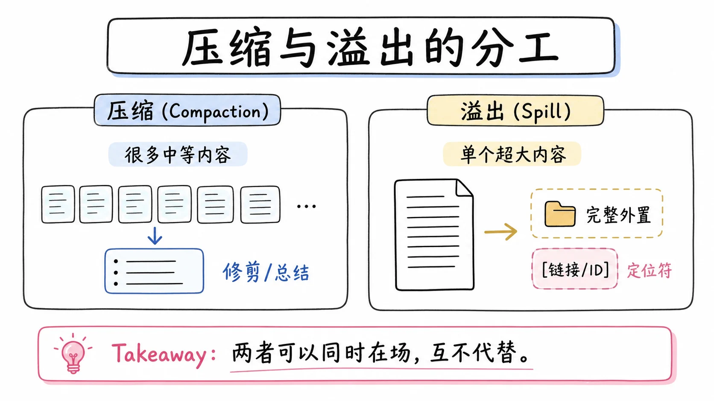

压缩的边界在这里。单个超大的保留单元，没法靠表面压缩修复：修剪会把它砍残，总结会把它糊成一团丢失细节，但它本身是有用的完整数据，一份 API 文档、几万行日志、大量 grep 匹配。这种内容需要一个不同的处理：整个搬到上下文之外存起来，给模型一把钥匙，要哪段自己去取。这就是溢出干的事。

这个能力的诞生背景是一次不一致的消除：bash 执行器早就把溢出输出写进私有临时文件了，但纯文本的工具结果除非工具自己封顶，否则全部内联。同样大小的内容，出身不同待遇不同。溢出能力把这个决定统一成一条策略。

## 接缝：`ctx.spillStore`

溢出的接缝极简，一个方法：把内容原样持久化，返回一个不透明定位符、后端给的检索提示、精确字节数。请求里除内容外还有：保存时的存储命名空间（会话 id）、记录产生它的工具和调用的来源、调用方建议的名字。名字只是提示，后端把它净化成单个安全的路径段，绝不是路径。真正的存储失败时拒绝，怎么降级由调用方决定。

接缝只管存。不管保留策略、不做工具结果替换、不提供检索 API，三件事分别归保留库、策略消费者、模型手里的读取工具。"接缝只做一件事"的克制，和文件接缝的 provider 只管原子读写是同一脉。

定位符是 branded 的不透明句柄。本地后端把它渲染成文件系统路径，远程或数据库后端可以渲染成 URI、key 或命令令牌。消费者必须当它不透明，用检索提示渲染，不假设 read 永远是对的取法。这条很重要：本地后端的提示说"用 read 或 grep 取这个路径"，远程后端可能说"用某个接口查这个 key"。硬假设定位符总能 read，换个后端就坏。

来源字段记录工具名、调用 id 和一个短标签，但明确不作为访问控制，纯粹描述性，用于起可读文件名和检查。访问控制靠 owner 命名空间和后端的私有存储。这和 jobs 的"靠 owner 授权不靠 id 保密"是同一种思路：安全边界建立在归属上，不建立在描述性元数据上。

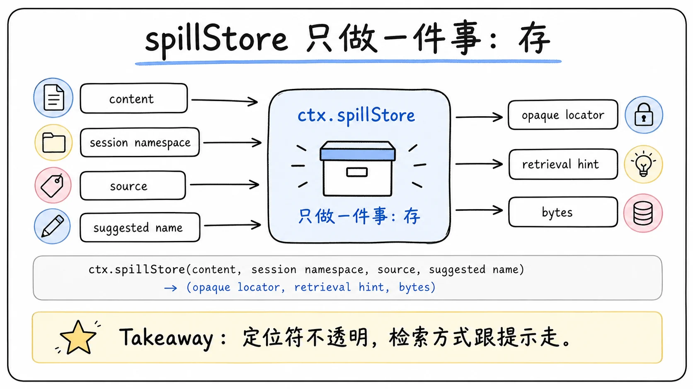

## 本地后端：session 级私有文件

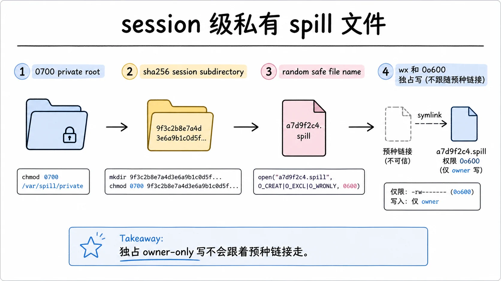

本地 provider 把溢出内容写进宿主文件系统的私有 session 级文件。布局是私有根目录（0700 权限）、会话子目录（会话 id 的 sha256，把不同会话的溢出隔开）、文件名（随机前缀加净化来的安全名）。

写法上有一个值得抄的安全细节：独占的 owner-only 写。创建标志带独占语义（`open(path, 'wx', 0o600)`）、权限只有 owner 可读写，这意味着攻击者预先种在目标位置一个符号链接没法重定向写入，独占语义会直接失败而不是顺着链接写过去。把"模型生成的大文本写磁盘"这个天生有风险的操作收得很紧。

## 策略消费者：结果进上下文前的最后一道

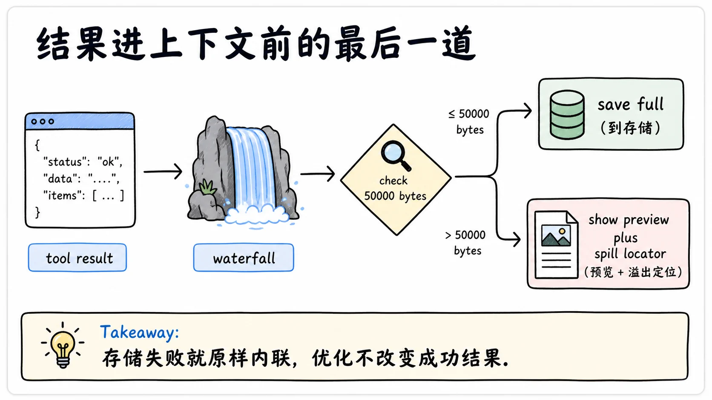

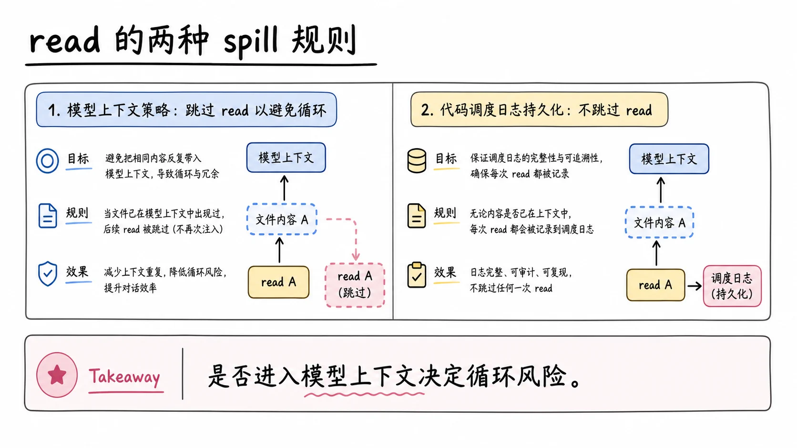

光有存储不够，谁决定"这个结果太大该溢出"？策略消费者挂在工具执行后、结果规范化前的 waterfall 上，这是唯一的窗口：执行前拦截不知道结果多大，结果事件之后再拦已经进上下文了。

策略逻辑：一个全纯文本的最终结果超过配置的字节数（出货组合配 50000 字节），就保存全文，用保留库的头/尾预览加溢出引用替换内联结果。模型拿到的不是几万行文本，是开头加结尾加"完整内容在这个定位符，按提示取"。两层上限的分工要摆正：provider 侧的资源和工具侧的展示上限管的是网络、内存、解码和渲染（比如抓取后端的默认响应上限是 5MiB 字节、正文上限 100,000 字符），策略侧的内联上限管的是模型面向的上下文。provider 已经截断过的结果，溢出文件存的是工具返回的完整格式化结果，不是原始网页，策略不越权补救上游。

两个边界行为定义了这套策略的脾气。配置省略时插件什么都不注册，真无操作；保存失败、没有会话归属、没有后端时，记日志并原样返回内联结果，一次成功的工具调用绝不因为溢出失败变成错误结果。溢出是优化，不是必需，存不下就退回内联。

还有一个防循环的小决定：策略刻意跳过 read 工具。不跳的话，read 读一个大文件触发溢出，模型照提示再 read 溢出文件，又触发溢出，循环就闭上了。2026 年 7 月底这条逻辑又扩展到 Code Mode 的子调用日志：`tool/code-dispatch` 事件的持久化副本同样过 spill 策略，以 `dispatch` 为标签记在子调用 id 名下，读大文件的程序不再把会话日志每个轮次撑大数 MB；这一侧不跳 read，因为日志副本不进模型上下文，循环闭不上，而 read 恰恰最容易产生巨大的日志条目。

## Fork 继承与清理的归属

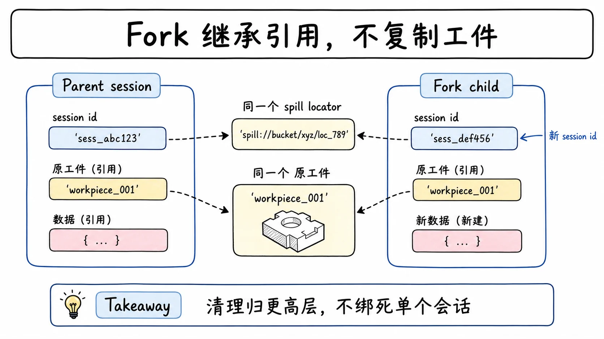

被 fork 的会话从种子日志里继承已有的溢出定位符，工件不复制、不重新归属；fork 之后新产生的溢出用子会话的 id。定位符是日志里的引用，fork 把日志带过去，定位符就跟着过去，实际工件还在原地，谁引用谁取。保留期清理可能让旧定位符过期，但接缝不定义按会话的清理策略，清理归更高层。为了 fork 和恢复的正确性宁可累积，也不把删除绑死在单个会话的生死上。

## 被拒掉的方案

两侧的设计笔记都记了被否的路线。压缩侧五条：把完整算法做成具体接口方法，会把契约重新耦合到一种保留策略上；在请求观察或循环回调上触发压缩，那是临时的请求视图，还把通用生命周期耦合到策略；compact 布尔和无类型元数据图，前面说过；单独的压缩错误事件，和带错误的 end 冗余；教核心的 turn 修复认识压缩事件，通用的种子边界已经能区分前世历史。缓存修复时又否了两条：保留摘要器 system 提示词但复用其余部分（system 槽位正是 provider 最先缓存的区域，换了就全作废）、只发被遮蔽区域不带头部（序列在第一个 token 就分叉，缓存不更好还丢了框架）。

溢出侧同样有清单：每工具自选的保留声明被否，要的是默认行为不是一个开关矩阵；宽泛的"工具结果"平台包被否，接缝太宽；用文件服务或 write 工具写溢出文件被否，溢出文件是运行时工件，不是模型作者的编辑，混进对话历史就污染了工作区语义；不封顶的抓取指望溢出策略兜底被否，策略保不住上游资源；把保留库并进溢出也被否，预览和存储是两份责任。

## 压缩与溢出的分工

| | 压缩 | 溢出 |
|---|---|---|
| 解决什么 | 很多中等内容撑爆上下文 | 单个超大内容塞不进去 |
| 怎么减负 | 修剪（确定性）或总结（模型调用） | 整个搬到上下文外，给定位符 |
| 信息损失 | 修剪砍中间，总结丢细节 | 不损失，完整存着，按需取 |
| 触发 | 逐 step 压力探测、溢出检测 | 结果超过内联上限 |
| 成本 | 修剪廉价，总结贵 | 一次磁盘写，廉价 |

一个对话里两者可以同时在场：压缩把一堆中等内容压成摘要，溢出把一个超大结果搬走，各管各的场景，互不干扰。

## 权衡与局限

压缩侧的代价来自"触发权不在模型手里"。压力探测和溢出检测都没触发时（阈值配得不合理），模型就算感到历史很长也无力压缩，这要求阈值策略调得对；回报是时机确定、行为可预测。修剪是确定性的但会丢中间内容，模型表面看不到被砍的部分，只适合"头尾够了"的大输出场景。总结是模型调用，耗 token 也丢信息，只在修剪不够时用。有三类压力压缩明确管不了：只有信封超压（表面不大的请求头膨胀）、超大的不可分非工具节点（比如用户贴的一大段文本）、修剪后剩余部分仍超大的工具单元。这三类边界在引擎动词上也有呼应：自动压缩找不到安全区间就返回 null 不硬来，把"无解"如实报出来而不是制造一个坏解。

溢出侧的代价是模型得多跑腿：内容搬出上下文后要用里面的数据得发工具调用去取，比内联多一次往返，但对超大内容别无选择。接缝只收 UTF-8 文本，二进制大对象走 attachment。本地后端靠文件权限保护，不加密，多用户机器上 root 还是能读，敏感内容要意识到这个边界。保留策略不在接缝里，长期运行的部署会累积溢出文件，需要更高层的清理。策略是尽力而为的，磁盘紧张时溢出可能突然不生效，上下文又变大，运维上要给溢出存储留够空间。还有一条前瞻的坑：本地路径的可用性依赖文件系统策略不把读取限制在工作区内，未来如果上工作区约束策略，要么显式放行本地溢出路径，要么换非文件后端。

## 结论

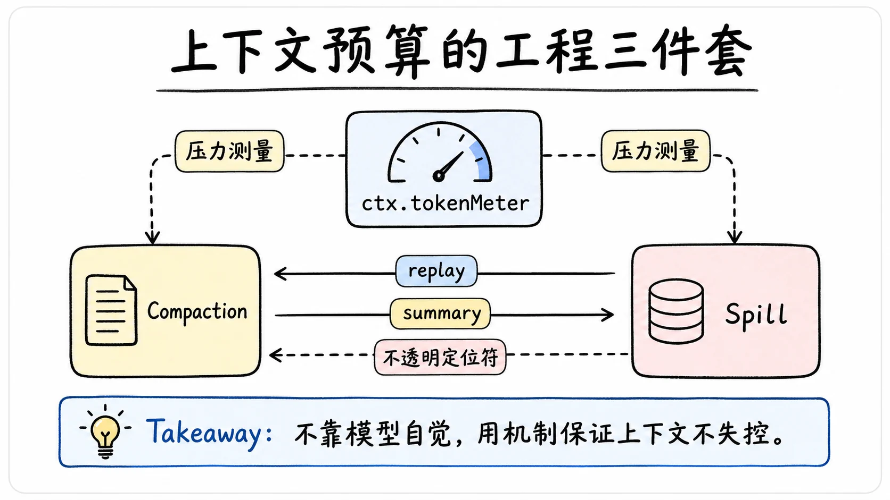

压缩治"多而中等"，溢出治"单而超大"，测量给两者提供同一份可信的账。压缩侧的关键决定：没有模型工具，触发在 harness 的生命周期上；逐 step 检查让失控长 turn 有救；先修剪后总结；锁最后释放让崩溃可检测；总结骑 user 消息进表面，因为总结本来就是 user 角色的上下文；总结调用逐字回放已路由请求的前缀、指令作为尾部 user 消息，让最贵的时刻不再付两遍缓存钱。溢出侧的关键决定：单方法接缝只管存；定位符不透明、检索方式跟提示走；策略挂在结果进上下文前的唯一窗口上，失败退回内联，绝不把成功调用变成错误。整套机制没有一处指望模型自觉，这是它们能被信赖的原因。

## 延伸阅读

- [Compaction 官方文档](https://github.com/deepseek-ai/deepseek-harness/blob/master/docs/subsystems/compaction.md)：压缩事件、引擎动词、修剪器契约
- [Spill Storage 官方文档](https://github.com/deepseek-ai/deepseek-harness/blob/master/docs/subsystems/spill.md)：溢出接缝、本地后端、策略消费者
- [Token Meter 官方文档](https://github.com/deepseek-ai/deepseek-harness/blob/master/docs/subsystems/token-meter.md)：测量快照与锚点规则
- [摘要调用复用 KV 缓存决策](https://github.com/deepseek-ai/deepseek-harness/blob/master/.agents/notes/implemented/bug-fix/2026-07-21-compaction-summary-prefix-cache-reuse.zh.md)：前缀回放、尾部指令、尽力复用的边界
- [Tool output spill files 笔记](https://github.com/deepseek-ai/deepseek-harness/blob/master/.agents/notes/implemented/architecture/2026-07-08-tool-output-spill-files.md)：溢出设计理由、数字与被拒方案
- [Code dispatch 日志 spill 决策](https://github.com/deepseek-ai/deepseek-harness/blob/master/.agents/notes/implemented/feature/2026-07-26-code-dispatch-log-spill.zh.md)：子调用日志副本的溢出化

上一篇：[dsh 的 Web 搜索抓取与 Skills 技能系统](./25-web-search-fetch-and-skills.md)
下一篇：[dsh 的跨会话记忆：session-query / projection / reference](./28-cross-session-memory-query-projection-reference.md)
