# dsh 的跨会话记忆：session-query / projection / reference

> dsh 让 agent 记住别的会话，靠三个方向不同的机制：`ctx.sessionQuery` 管跨会话检索，全文搜索加血缘追踪；`ctx.sessionProjections` 管派生状态，框架把日志 fold 成当前值实时推给客户端；`ctx.sessionReferenceResolver` 管快照注入，把另一个会话的内容带进当前消息。三者共享同一个根基：live-preferred 逻辑语料库，活的会话优先于持久化的，谁都不过量加载日志。每个机制各有一条不能破的纪律：query 永远是数据不是可执行语法，fold 必须纯且同步，注入的快照永远标记为不受信。

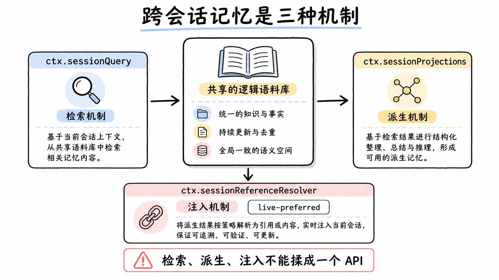

## 为什么记忆是三个机制，不是一个

一个只记得住当前上下文的 agent 是残废的。用户换个窗口回来问"上次那个问题怎么解决的"，agent 得能找到上次的会话；客户端界面要实时显示每个会话的 todo、目标、权限状态，这些值是从会话日志里算出来的；用户在对话里 @ 了另一个会话，得把那个会话的结论搬进当前这条消息。这三件事都是"跨会话记忆"，但形状完全不同。

第一件是检索：跨一堆会话搜文本、看血缘，要的是全文索引、排序和分页。第二件是派生状态：从一条日志折叠出"现在的值"，要的是增量 fold 和一致性，还要实时推给客户端。第三件是快照注入：把另一个会话的当前表面塞进当前消息，要的是预算受控的上下文搬运。把三件事揉进一个 API，接口会被三种互相冲突的需求撕扯：检索要游标和排序参数，派生状态要订阅和快照，注入要预算和脱敏。dsh 的答案是拆成三个接缝：`ctx.sessionQuery`、`ctx.sessionProjections`、`ctx.sessionReferenceResolver`，各自有自己的服务类型、自己的错误码、自己的纪律。

拆分不等于各行其是。三个机制读的是同一份东西：live-preferred 逻辑语料库。

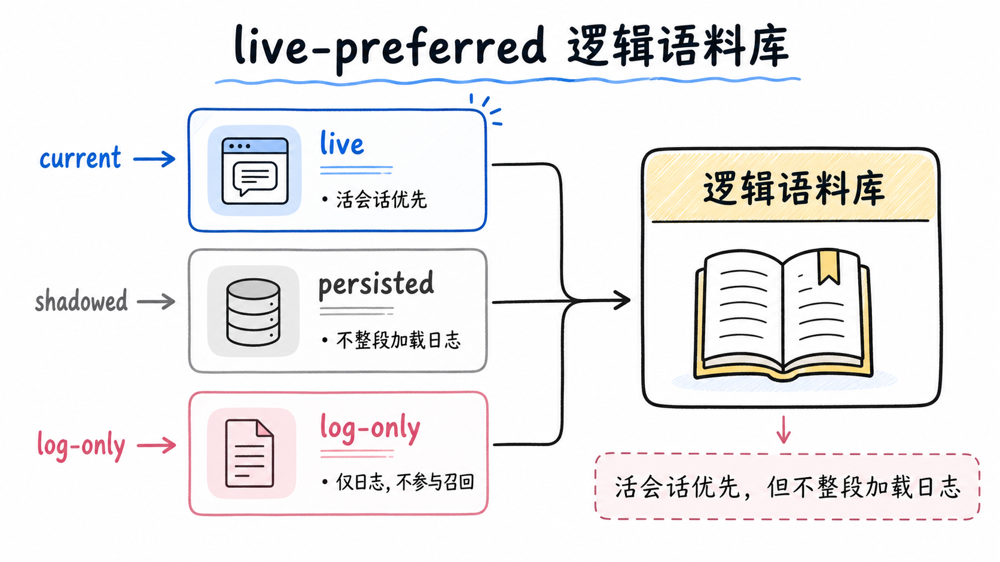

## 共同地基：live-preferred 逻辑语料库

每个会话在 dsh 里有一个逻辑记录。这个记录的头部从 live-preferred 语料库里选：如果这个会话 id 当前活着（在 `ctx.sessions` 里），用活的头；不活，用持久化后端的头。读取时两边都算，但任何一次操作都不会把整个日志搬进内存。

跨语料库 list 返回的 `SessionRecord` 把三样信息分开报告：`header` 是选出来的克隆头部；`live` 说这个 id 当前是否活着；`persisted` 说当前持久化后端是否物化了这个 id。`live` 和 `persisted` 独立报告，因为四种组合都真实存在：活着且已持久化（正常 checkpoint 过的活跃会话）、活着但未持久化（刚创建还没落盘）、不活但已持久化（关掉的会话）、不活且未持久化（不存在）。消费者拿到这三个字段，自己判断"这个记录现在到底在哪儿可用"。

事件层面也有一个统一的可见性分类 `SessionEventSurface`：`current` 是当前模型上下文，`shadowed` 是被替换掉的上下文，`log-only` 是只存在于原始日志里的事件。分类用的是和模型历史派生相同的 `foldSurface()` 转移。这条设计把"这个事件现在对模型可见吗"从一个需要追代码才能回答的问题，变成了记录上的一个属性。检索命中一条 `shadowed` 的事件时，调用方立刻知道它已经被压缩替换过，要去追替换链才能看到它现在的形态。

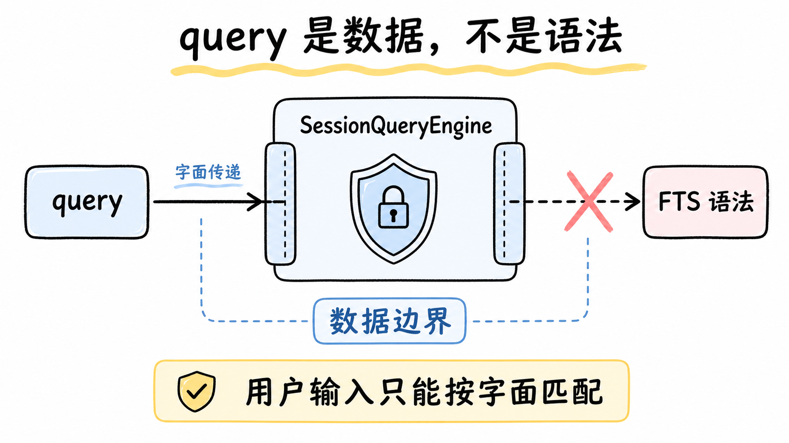

## 检索：query 是数据，不是语法

`ctx.sessionQuery` 的服务类型是 `SessionQueryEngine`。动手之前先看它最重要的安全纪律：全文查询的 query 参数被当作数据解释，绝不是可执行的 FTS 语法。搜索框里输入的内容，无论是用户敲的还是模型生成的，都只会做全文匹配，不会被当成 SQL 或 FTS5 表达式去解析执行。

这条纪律为什么值得放在最前面？因为检索入口是模型能直接够到的。一个 agent 在循环里决定"搜一下上次的会话"，它构造的 query 字符串进入了检索管线。如果这个字符串会被当成查询语法解释，模型就获得了在持久化数据库上执行任意 FTS 表达式的能力，注入面直接打开。query 是数据这条规矩，把检索入口从"执行边界"降级成了"数据边界"。

两个搜索范围分工明确。`searchSessions(request)` 跨会话搜索，结果按会话分组，每个会话由它最强匹配的事件代表（`bestMatch`），相关性强的会话排前面。`searchEvents(request)` 在单个会话内搜索。这里有个容易被忽略的细节：会话内搜索的一页即使没有命中，也必须暴露它观察过的目标头部。调用方能区分"这个会话我看了，没有匹配"和"这个会话我没看到"，这两种信息价值完全不同，前者是结论，后者是空白。

分页靠不透明游标。请求把游标绑死在归一化后的 query、元数据过滤和 limit 上：换任何一个，游标就失效，返回 `STALE_CURSOR` 而不是静默给出错位的结果。游标是品牌化的不透明类型，最后一页不带游标。确定性顺序也有约定：会话列表 newest-first，事件过滤按 seq 升序。翻页翻到的东西不会因为重排而抖动。

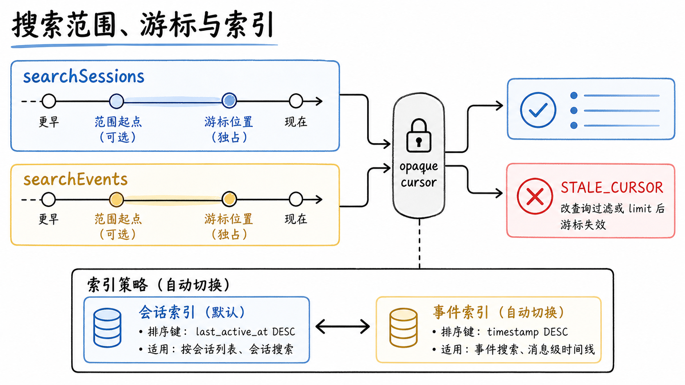

## 过滤与"什么算可搜内容"

过滤词汇是 provider 无关的。会话过滤和事件过滤的数组之间是 AND，一个子句内的 values 是 OR，范围是闭区间。会话能按 id、cwd、创建时间、父会话、可用性过滤；事件能按 seq、时间、类型、surface、文本过滤。

事件过滤里有个特殊的 `text` 子句：字面的、Unicode 大小写不敏感、空白灵活的正则扫描。注意它扫的是提取出来的语义文本，独立于全文 provider。也就是说，即使部署把全文索引换掉了，这个精确文本过滤照常工作，因为它根本不走索引，走的是扫描。

什么内容贡献语义文本？消息、推理、工具调用和结果、被拦的 prompt、todo、失败与状态细节。结构事件和流块不贡献。这个界定决定了索引里装的是什么：有语义价值的内容进索引，结构噪声不进。一个 `turn/end` 事件对全文搜索没有意义，一条工具调用的参数摘要有。

分工的另一半在 provider 上。接缝定义包拥有精确读、来源优先级、血缘追踪、语义提取和 provider 无关的过滤；具体的全文索引生命周期（建索引、reconcile、排序、游标生成、查询执行）归 provider，当前实现是 `session-query-sqlite` 的 SQLite FTS。换全文后端，精确读、过滤、血缘纹丝不动，要重做的只有索引那一块。批量读取还有一条隔离纪律：跨会话的批量操作里，单个会话的操作性失败被隔离在单个结果里，取消则拒绝整个操作；结果保持首次出现的输入顺序。

这个全文索引在出货组合里是关着的。SQLite provider 的 `openAt` 配置有三个值：`startup`（插件默认，启动即建索引）、`first-search`（第一次搜索才建）、`never`（永不建，全文调用一律失败）。出货的 base 层配的是内存库加 `openAt: never`：宿主功能里真正消费检索的 `/resume` 走的是精确读和血缘，不需要全文；想要会话内容搜索的部署在自己的 patch 层改成 `first-search` 或 `startup`，通常配一个持久的数据库路径。被关着的时候全文调用返回 `SESSION_QUERY_SEARCH_DISABLED`，这是一个明确的运维开关，不是静默降级。

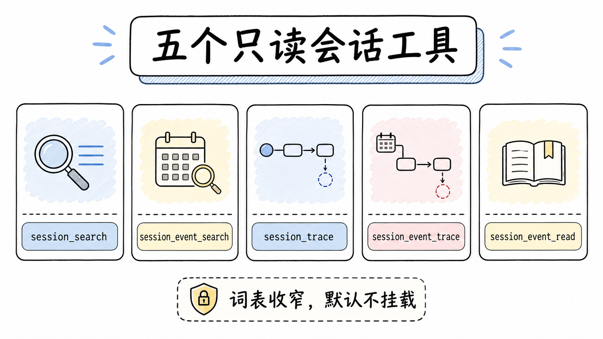

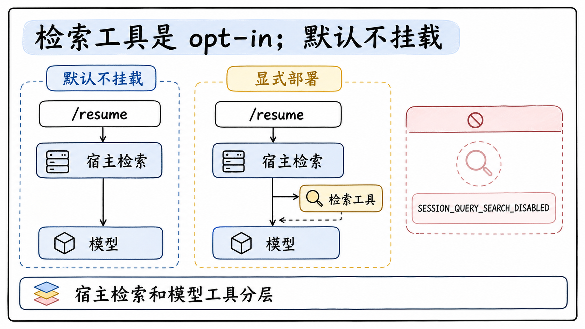

## 模型面向的工具：五个，且不随出货挂载

服务本身不是模型能直接调的。2026 年 7 月下旬交付的 `dsh-tool-session-query` 是面向模型的消费方，注册五个职责单一的只读工具：`session_search` 跨会话聚合全文匹配、`session_event_search` 在单个会话内搜（默认调用者自己的会话）、`session_trace` 返回完整授权祖先链和递归后代树、`session_event_trace` 返回一个事件的位置替换与引用关系、`session_event_read` 以未删节的 JSON 原样返回目标事件。

模型侧的词表刻意收窄了。provider 请求里那些程序化的东西没有暴露：不稳定的分页游标没有，受信任的语料范围没有，存储形态的时间值没有。结果不走游标，大小问题交给通用的 post-execute spill 策略，过大的追踪文本变成有界预览加定位符，消费方自己不实现第二套截断。还有一条精妙的自反排除：搜索工具搜的是既往工作，不包括正在执行的这次搜索。跨会话搜索排除调用者自己的会话；会话内搜索把请求的序号范围和当前 `step/start` 之前的最后一个事件取交集，于是当前的 assistant 消息、正在执行的工具调用、刚刚建进索引的查询参数本身都不会命中。没有这条，模型搜"foo"会先命中自己正在搜"foo"这件事。

执行分类也有交代：搜索调用是独占的，不和兄弟工具重叠执行；精确的追踪和读取可以并行调度。工作区授权用的是严格的 cwd 字符串相等，不解析符号链接等价，选的是保守边界。

这个消费方的交付姿态是明确的 opt-in。2026 年 8 月初的一次回调把它从共享 base 层的默认行里拿掉了：交付的 TUI、Web、无头界面都不挂载它，交付的 agent preset 也不含，五个 schema 和配套提示词段不进默认请求，模型没有要求过的"既往工作搜索工作流"教学不进提示词。挂载参考是 ACP 示例的一份组合文件，自定义部署照着挂，连超时和 spill 策略一起。这个决定被否掉的替代方案也记录在案：把 SQLite provider 一并移除（会破坏 `/resume` 和 Web 内容搜索框这两个宿主功能）、保留行但在每个 overlay 禁用（一行就能重新启用，违背 opt-in 立场）、只在 TUI 挂载（重新引入清单分裂）。

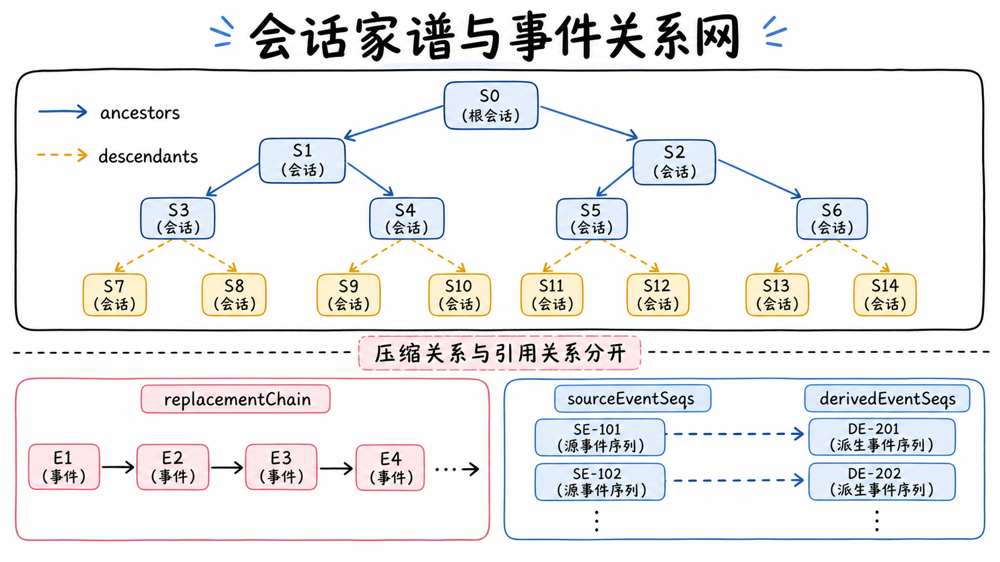

## 血缘：会话的家谱与事件的替换链

会话有家谱。`traceSession` 返回一个会话的已知祖先（从近到远）和后代森林（以直接子会话为根递归展开）。完整性判别让"已知根"和"缺父"互斥：要么 `complete: true` 且给出根，要么 `complete: false` 且给出第一个解析不出来的父 id，两者不会同时出现。祖先链上出现环会直接抛错。这个判别之所以重要，是因为 fork 会话是 dsh 的日常操作，家谱不完整是常态而非异常，消费者需要一个明确的方式知道"这棵树从哪儿开始断的"。

事件也有关系网，`traceEvent` 追踪单个事件的四类链接。`replacedBy` 是直接替换者；`replacementChain` 沿着即时替换者一路追到最终的位置替换；`replacedEventSeqs` 是目标被替换时一并移除的节点集合；`sourceEventSeqs` 和 `derivedEventSeqs` 分别是被目标引用为源的更早事件、和把目标引用为源的更晚事件。

前三个链接对付的是压缩：一次压缩会把一串旧事件折叠成一条新事件，`replacementChain` 给出从旧到新的路径，`replacedEventSeqs` 给出这次折叠删掉了谁。后两个对付的是快照注入：一个会话引用另一个会话时，源关系被记进事件。两类关系分开追踪，"内容被压缩顶掉了"和"内容是从别处引用来的"就不会搅在一起。

还有一条体贴的细节：读事件窗口返回的是 `SessionHeader`，不带可用性标志。一个已知活着的目标读事件，不需要关心持久化健康度。

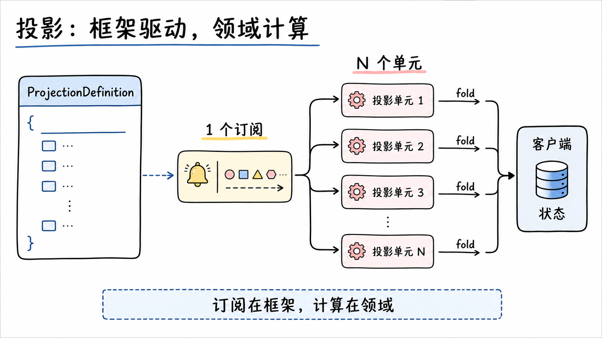

## 派生状态：框架驱动，领域计算

客户端要的不是一个事件流，是值。界面上 todo 列表现在长什么样、当前目标是什么、权限处于哪个档位，这些值是从会话日志折叠出来的。朴素的实现方式是每个领域自己订阅事件流、自己 fold、自己维护状态。dsh 的投影设计提案记录了这个朴素方式在真实代码里的下场：三个功能各自发明了一套同样的机器，客户端的 `Session` 类吸收了每个领域的私有字段和事件 switch，同一段 fold 逻辑写了两遍还各自演化；todo 的业务折叠寄居在传输载体里，plan 加了七个私有字段和三层栅栏，goal 维护着一个合并式重取循环。

投影注册表换了一个切分：框架拥有驱动（订阅、水位、缓存、检查点），领域只拥有计算。注册表持有唯一的 `session/event` 订阅，把每个已提交的事件 fold 过每个注册的单元；领域不持有任何订阅，客户端从不 fold 领域事件，只接收算好的值。

这个切分的价值可以量化到订阅数上：N 个领域从 N 份订阅、N 次折叠，变成 1 份订阅、1 次折叠过 N 个单元。所有领域看到同一条事件流、同一次折叠，"两个领域对同一事件流算出不一致的状态"这类 bug 从结构上被删除了。

单元的生命周期也有讲究。单元惰性构建：一个晚注册的单元、或一个老会话，在第一次被碰到（事件或读取）时才用 `init` 在内存日志上折叠出来。注册是一个副作用，disposer 挂在调用它的 fiber 上：领域卸载时，它拥有的 key 和缓存的单元从后续的驱动与快照里消失，客户端看到的是能力缺席。重复的 key 抛错，不给"两个单元抢一个 key"留余地。多个注册者共享同一个 key 时共享一个单元并计数，同一个工具包挂载 N 次就是 N 个注册，key 活到最后一方卸载。

还有一层身份声明值得说清楚：投影是可选能力接缝，不在 agent-loop 主干里。领域通过注入 `sessionProjections` 注册，一个没装配注册表的 headless 组合完全不受影响。

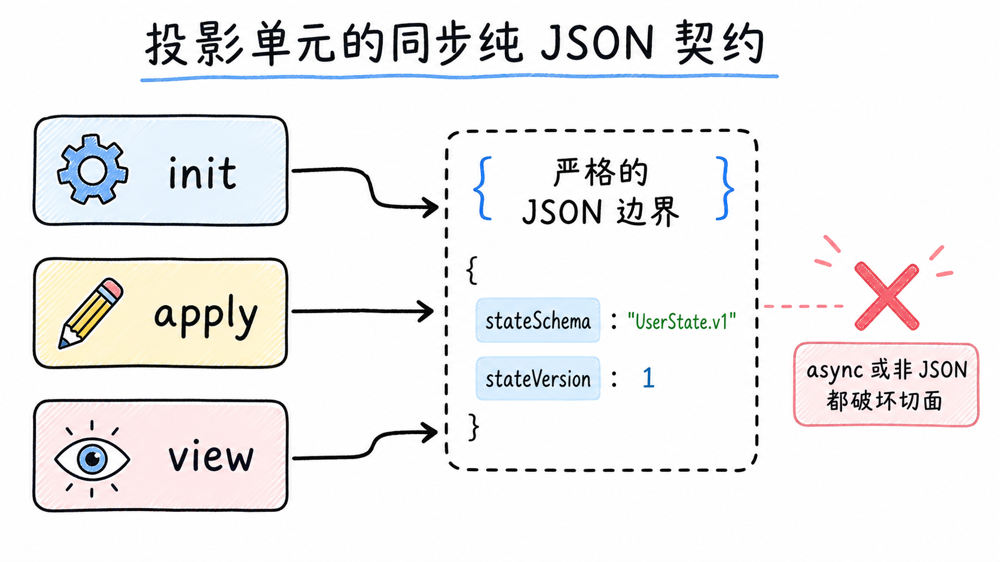

## 单元契约与两条硬规矩

一个领域贡献一个 `ProjectionDefinition`。计算侧是三个函数：`init()` 给空日志一个初始状态；`apply(state, event)` 是纯转移，前状态加一个事件得到下一状态；`view(state)` 把状态变成 wire 载荷。声明侧是四样：`key` 标识这个单元在状态表里拥有的槽位；`stateSchema` 校验从持久化缓存读回的状态（缓存里的行在喂给 fold 之前先过这道闸）；`viewSchema` 校验 `view` 的输出；`stateVersion` 是缓存失效版本，非负整数。`wire` 块是可选的：省略它就是一个 host 内部使用的单元，不对客户端可见。渲染被明确排除在这层之外，属于 slot 系统的事。

两条硬规矩撑住整个契约。

第一条：所有函数必须同步。一个写成 async 的单元会撕裂 carrier 的一致性切面（下一节展开）。落地的表现是，一个不小心写成 async 的 `view` 返回 Promise，会被 `viewSchema` 校验当场拒绝。

第二条：状态必须是纯 JSON。这是持久化缓存的前提，也是 `checkpoint` 能做整体 structured clone 的前提。状态里藏一个类实例、一个打开的句柄，缓存这条路就断了。

比函数契约更深的一层是事件形状的规矩：一个带状态的日志事件携带变更后的完整状态，绝不是裸 delta。这条规矩的收益比"转移平凡地廉价"更实质。整值事件天然免疫乱序：每个值自带 seq，消费者比较 seq 就知道谁新谁旧，晚到的旧值覆盖不了新值。整值事件还自愈：错过一次更新没关系，下一个整值到达时自动纠正。设计提案里有一个被这条规矩直接删除的东西：invalidate/refetch 单元模式。那个模式存在的唯一理由就是伺候 delta 事件，goal 功能曾经为此维护过一个 refetch 循环、一套合并逻辑、一道防旧读的栅栏，换成整值事件之后三样全部消失。

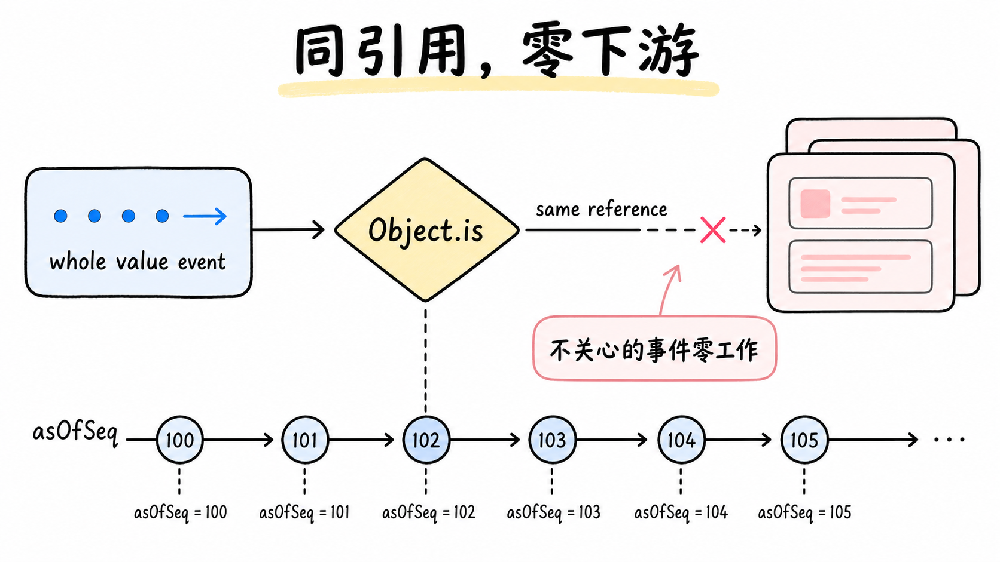

## 同引用零下游，与一致性切面

`apply` 有个看起来古怪的硬规矩：单元对一个不感兴趣的事件，必须返回同一个状态引用。注册表用 `Object.is` 判断引用是否变了，未变的引用产生零下游工作：不触发变更通知，不做 schema 校验，不进变更 feed。

这是性能上的关键闸门。一个活跃会话每秒可能提交很多事件，但一个 todo 投影单元只关心其中一小类。对不关心的事件返回同一引用，注册表就能精确知道"这个单元没变"，变更 feed 对每个引用真正变了的、客户端可见的单元，每个已提交事件触发一次。"哪个投影变了"这件事被通知得不多不少。

一致性切面靠同步保证。`snapshot(session)` 完全同步，一个 carrier 在和它的页切片同一个 tick 里读它，所以 `asOfSeq`（所有值共同反映到的最后事件 seq，空日志为 -1，与会话订阅时的 lastSeq 对齐）在一次读里覆盖所有值。这个性质的解释力在于：客户端拿到的不是一个"大致同一时刻"的松散集合，是一个带统一水位的切面。设计提案里记录了为什么拒绝事件广播集合：异步的 listener 给不出这个单一同步切面。

读取词汇还有个 `stateOf(session, key)`：只读一个 key 的活状态，不算其他单元的 view，省掉无谓的计算。借用者不许改返回的引用。

检查点有一条容易踩的边界：`checkpoint(session)` 返回的每个 `val` 是脱离的 structured clone，绝不是活单元的引用。水印缓存是注册表唯一权威的可变状态，调用方如果通过检查点行改了它，后续所有快照和帧都会被污染。这条规矩把"检查点行只是快照"定死。

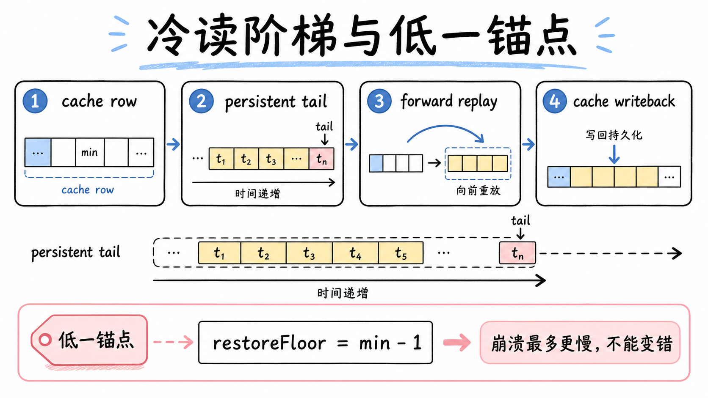

## 冷读阶梯与低一锚点

会话冷启动（比如 resume 一个持久化会话）时怎么恢复投影状态？全量重放整个日志太慢，`ctx.sessionProjectionCache` 给了一个四级的冷读阶梯，从最快到最慢：

1. 缓存行，零 IO：直接从持久化的 `(sessionId, key, ver, seq, val)` 行 view 出来。值是 stale 的（上次检查点的），但永远不错，也绝不来自无关日志（调用方的 header 是身份见证）。
2. 持久化尾部：从注册表的 restore floor 开始读一段事件尾部。
3. 注册表 restore：用缓存行做种子状态，尾部事件 forward replay，fold 出当前值。
4. 持久化回写：把刷新的检查点行写回，下次冷读起点更近。

这个阶梯里最精巧的是 `restoreFloor` 的低一锚点。它返回的 seq 比最低可用水位低一。"可用"的定义是行的 `ver` 匹配当前单元的 `stateVersion`；一行缺失或版本不匹配，会把地板拉到 0，走全量重放。

为什么偏偏低一？考虑一个真实的故障场景：进程在写检查点之后崩溃，崩溃修复把日志截断了，截到的位置比某个缓存行的水位还低。这时缓存行声称"我反映到 seq 500"，但日志只到 480。如果尾部读取从一个不小于水位的位置开始，读到空，restore 会把 stale 行当成当前值吐出去，一个"反映着不存在的事件"的状态就上线了。低一锚点堵死了这条路：尾部从 499 开始读，存储的日志能延伸到多远，这次读取直接证明。日志真被截到 480，这个尾部读出来是空的，结尾低于所有水位，restore 拒绝服务并触发从 seq 0 的全量重读。慢，但不错。

restore 内部对行的可用性判定有三条：`ver` 匹配 `stateVersion`；`seq >= baseSeq - 1`；`seq <= endSeq`。一个不可用的行被丢弃后从 `init` 重放，而重放只在完整日志上才健全，所以丢弃行且 `baseSeq > 0` 时直接抛错，调用方从 seq 0 重读。空尾部时结果的 `asOfSeq` 是 `baseSeq - 1`，这个 -1 和锚点、和空日志的 -1 是同一套水位语义。

`stateVersion` 是这套缓存的失效开关：序列化的状态字段或 fold 语义变了就 bump，旧版本单元持久化的行被丢弃，而不是被向前 apply 成垃圾。检查点时机有两个强制点：`turn/end` 和会话销毁，后者正是活转冷的时刻。两次之间靠节流的 write-behind 按计数和间隔触发。持久化全是 fail-soft：失败记个警告，缓存下次写或冷读时自愈。`write(session)` 在边界上给注册表切面做快照然后整条替换记录，它本身不是 fail-soft，fail-soft 由调用它的路径负责包住。设计对崩溃代价的总结很干脆：两次写之间崩掉，代价是一段更长的尾部重放，永远不会是一个错值。

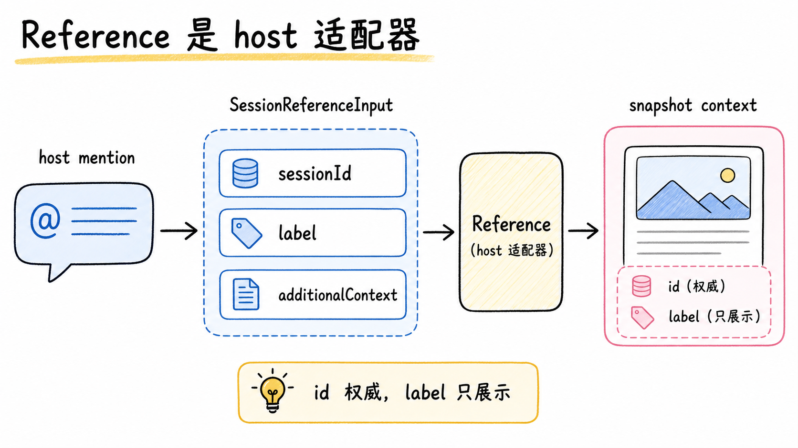

## 快照注入：host 适配器，不是 UI 语法

`ctx.sessionReferenceResolver` 回答"把另一个会话的内容带进当前消息"。它的第一设计决定是身份的归属：host 适配器使用这些类型，而不是把 UI 里的 mention 语法塞进 agent 核心。契约定义规范 URI 和不受信的模型 prompt；host 把错误映射进自己的错误信封，不去检查 prompt 的字节。浏览器场景下，`remoteExportCandidates` 给每个候选挂上规范的 mention：一条 `@[label](dsh-session:…)` 形式的引用，序列化进 prompt 草稿。

`SessionReferenceInput` 只有两个字段：`sessionId` 是权威的不透明身份，`label` 是可选的展示元数据，跟着进快照。id 说了算，label 只管好看。每个 host 的 mention 方言（@ 符号、补全交互、高亮样式）都留在 host 那一层，核心只认结构化的输入。

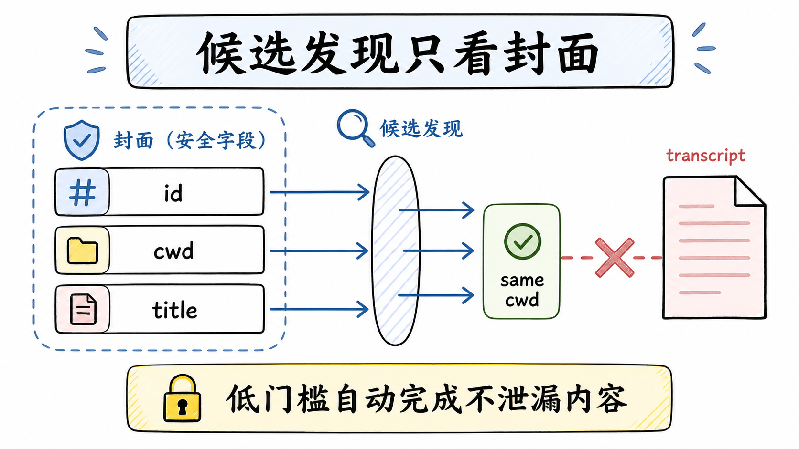

## 候选发现不搜转录

`listCandidates` 列出可引用的会话，规则很收敛：排除 self，用当前工作目录的亲和性排序，过滤只搜会话 id、cwd 和标题的子串（大小写不敏感），可选的结果上限来自配置的 candidateLimit，标签用最新标题、没有标题就用会话 id，支持取消以便 host 拆除自动补全。

最值得强调的还是那条否定性的规矩：候选发现绝不搜转录文本。列候选是个低门槛动作，用户在输入框里敲了两个字符就触发；如果这一步去搜每个会话的内容，别的会话的片段会以排名和标签的形式漏出来。把发现限制在 id、路径、标题这三个"封面字段"上，是个隐私和性能的双重边界：封面可以给人看，内容不行。

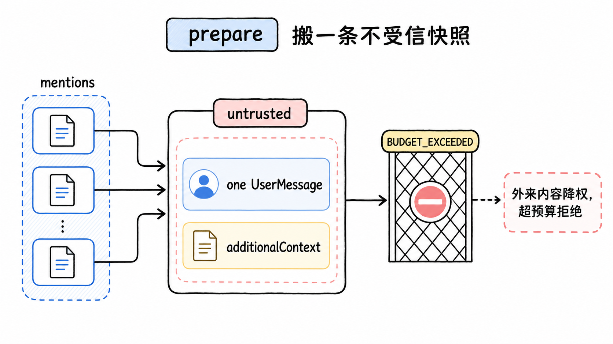

## prepare：一次定向搬运

用户选中候选、发出消息后，`prepare` 登场。它对每一条被接受的直接消息调用一次；引用指向 agent 自己的会话会被拒绝。它把所有引用一次性快照，返回两样东西：`content` 是去掉 host mention token 后的可读消息；`additionalContext` 是至多一条聚合的快照，类型是 `UserMessage`，没有引用时缺省。注意"至多一条"：不管一条消息引用了几个会话，聚合成一个上下文块注入，不会每个引用一块碎片。

错误码把失败原因切开：配置错、引用非法、自引用、太多、读失败、预算超限、取消，各有各的 code。`BUDGET_EXCEEDED` 是注入的护栏：引用的会话快照不能无限大，超预算就拒。用户想带一个巨大会话的全部历史进来，会被挡下，得分次引用或先压缩。

把快照装进 `UserMessage` 类型的 `additionalContext`，而不是合并进用户自己的内容，是个安全姿态。来自别的会话的内容，是在另一个上下文里生成的，不应该和当前会话里用户亲手敲的指令享受同等的信任。这和 web 抓取把非 2xx 当结果不当错误、code runtime 把程序输出当敌意输入，是同一族设计：外来内容降权处理。

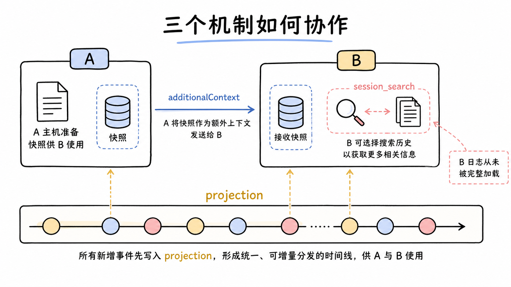

## 三个机制怎么协作

| 机制 | 方向 | 手段 | 典型触发 |
|---|---|---|---|
| `sessionQuery` | 被动检索 | 全文索引、过滤、血缘、游标分页 | 模型或 host 主动发起搜索 |
| `sessionProjections` | 主动推送 | 单订阅 fold、同引用门、冷读阶梯 | 任何已提交事件 |
| `sessionReferenceResolver` | 定向注入 | 预算受控的不受信快照聚合 | 用户 mention 另一个会话 |

串一个完整场景。用户在会话 A 里说"参考会话 B 的结论"。host 的输入框触发 `listCandidates`，按 cwd 亲和性把 B 排上来，用户敲的过滤词只搜 B 的标题和路径，碰不到任何会话的正文。用户选中 B、发出消息，`prepare` 把 B 的当前表面快照成一条不受信的 `additionalContext`，附在去掉 mention token 的可读消息后面。A 的 agent loop 处理这条消息时，快照和系统提示、工具 schema 一起组装进请求。如果 agent 看完快照还想深挖，而部署挂载了会话查询工具，它用 `session_search` 跨会话搜索，query 作为数据进入全文匹配，命中按最强事件分组，自己的会话不在结果里。整个过程中 B 的日志没有被完整加载过一次，客户端上 B 相关的投影值也始终是从 B 自己的日志 fold 出来的。

## 权衡与局限

每个机制都把一类成本压给了使用方。

query 的全文索引依赖 provider。SQLite FTS 是当前实现，索引的建、维护、reconcile 都在后端手里，换全文后端这部分要重做；精确读、过滤、血缘是 provider 无关的，不受影响。出货组合里索引默认关着，要开是部署的一个显式决定；开了之后索引本身的维护成本（磁盘、 reconcile 时间）才开始计价。模型面向的工具是 opt-in，不开就没有，这意味着默认部署里的 agent 没有任何既往工作检索能力，设计上把这一步留给了部署方的显式选择。

projection 要求领域函数纯且同步。不能在 fold 里做异步 IO，需要异步的派生状态得另想出路（比如把异步部分挪到事件产生的上游）。这是用表达力换一致性切面和可持久化。缓存的代价也有：第一次冷读一个很长的会话，可能要 forward replay 一大段尾部；`stateVersion` 一 bump，缓存全失效，这个成本重新付一遍。作为交换，任何一次读到的值都带着统一水位，任何一次崩溃的代价都只是更长的重放。

reference 有预算上限。引用一个超大会话可能被 `BUDGET_EXCEEDED` 拒掉，用户想带大量历史进来得分次或先压缩。这个护栏保护的是当前上下文不被撑爆，代价是大搬运不友好。

三者共同的地基也有共同的软肋：live-preferred 意味着活会话优先，一个还在跑的会话的状态可能比它持久化的版本新，多数情况下这是对的（读到的更新），但活会话尚未持久化的那部分，进程崩了就没了。消费者拿到 `live: true, persisted: false` 的记录时，应该意识到这份新鲜是有条件的。

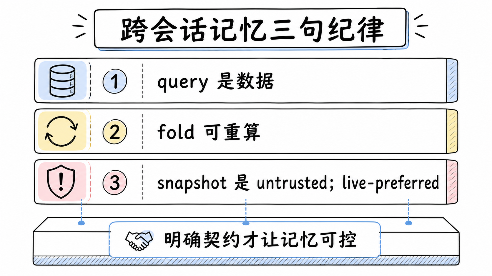

## 结论

跨会话记忆这个容易做重的话题，在 dsh 里被拆成了三件方向不同的工具。检索是拉的：query 作为数据进入 provider 无关的过滤和血缘，搜索分页有游标纪律，模型侧的五个只读工具收窄了词表、排除了自反命中、且不随出货挂载。派生状态是推的：框架一次订阅、领域只出纯函数，整值事件带来乱序免疫和自愈，同引用门让不相关的单元零成本，冷读阶梯加低一锚点让冷启动最多变慢、不会变错。注入是搬的：候选只搜封面字段，快照聚合成一条不受信的 `UserMessage`，预算超限就拒。

贯穿三者的纪律可以各记一句：搜索词永远不当代码执行，fold 的输出永远可从日志重算，外来的内容永远降权。这三句各自防住一类事故：注入、状态污染、信任扩散。

## 延伸阅读

- [Session Query 官方文档](https://github.com/deepseek-ai/deepseek-harness/blob/master/docs/subsystems/session-query.md)：检索、过滤、血缘的接缝定义
- [Session Projections 官方文档](https://github.com/deepseek-ai/deepseek-harness/blob/master/docs/subsystems/session-projection.md)：派生状态 fold 与冷读缓存
- [Session References 官方文档](https://github.com/deepseek-ai/deepseek-harness/blob/master/docs/subsystems/session-reference.md)：跨会话快照注入
- [面向模型的会话查询工具决策](https://github.com/deepseek-ai/deepseek-harness/blob/master/.agents/notes/implemented/feature/2026-07-24-model-facing-session-query-tools.zh.md)：五个工具的词表收窄与自反排除
- [会话搜索不随出货挂载决策](https://github.com/deepseek-ai/deepseek-harness/blob/master/.agents/notes/implemented/feature/2026-08-02-session-search-not-shipped-default.zh.md)：opt-in 立场与索引默认关闭
- [Session projection 设计提案](https://github.com/deepseek-ai/deepseek-harness/blob/master/.agents/notes/proposed/architecture/2026-07-27-session-projection-and-command-log.zh.md)：投影切分的原始论证（状态 proposed，命令日志部分未随投影一起实现）

上一篇：[dsh 的上下文预算：Compaction 压缩与 Spill 溢出](./26-context-budget-compaction-and-spill.md)
下一篇：[dsh 的 Plan Mode 与 Goal：一段软引导与一个事件溯源的生命周期](./29-plan-mode-and-goal.md)
