# dsh 的 Plan Mode 与 Goal：一段软引导与一个事件溯源的生命周期

> dsh 把"管理目标和计划"拆成两个重量不同的机制。`ctx.planMode` 是软引导：激活时往每个模型请求塞一段部署拥有的提示，模型可以不听，它没有也不想要强制力。`ctx.goals` 是持久的事件溯源目标生命周期：阶段、修订号、轮次预算，全部从会话日志 fold 出来，跨重启恢复。围绕后者还有三件配套：给人用的 `/goal` 命令、给模型用的三个 goal 工具、把活跃目标接进 agent loop 的续跑驱动器。这篇的主线是两次拆分：先分清"引导模型"和"追踪目标"，再分清"目标怎么了"和"现在能不能续跑"。
> 路线：plan mode 的软从哪来、状态怎么落日志、退出怎么受审；goal 的领域服务怎么防并发防崩溃、命令和工具各自有什么权限边界、驱动器怎么在竞争里调度一个自动轮次；最后并排比较两个机制的重量。

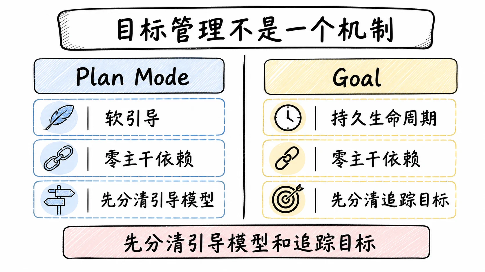

## 为什么目标管理不是一个机制

让 agent 管理目标，最朴素的设想是给它一个"当前目标"字段。但"管目标"至少藏着两个层次不同的需求。

第一个是引导模型先规划再动手：改代码之前先产出一份计划给人审。这是一种协作姿态，模型可以不听，但它被引导着先想后做。第二个是追踪一个长期目标的进展：目标是什么、到哪一步了（活跃、暂停、卡住、完成）、跑了几轮、还能跑几轮。这是持久状态，要跨重启恢复，要防并发改坏，还要决定"没人看的时候要不要自己跑"。

把这两个揉成一个"目标系统"会两头不讨好。引导需要的是轻：一段提示、一个退出工具，装了就用，不装拉倒。追踪需要的是重：生命周期、修订号、预算、续跑授权，一样都不能少。dsh 拆成 `packages/plan` 和 `packages/goal` 两个可选包，agent loop 对两者零依赖。

两者还有一个共同的边界声明：都和硬性强制分开。plan mode 明确自称软引导，沙箱和审批各自独立强制，不读也不写 plan 状态。goal 的强制同样分两层，持久阶段回答"目标怎么了"，进程内 activation 单独回答"续跑消费者能不能再开一轮"。

## Plan Mode：一段提示的重量

`ctx.planMode` 的服务类型是 `PlanModeController`，截至 2026-08 的版本号是 0.1.1-rc.2。它贡献四样东西：`plan:policy` 提示段、`exit_plan_mode` 工具、`/plan` 命令、`plan` 会话投影。四样加起来，就是 plan mode 的全部。

提示段只在激活时渲染，order 50，内容是部署配置的原文。配置校验严格到苛刻：`section` 缺失、空白、非字符串，或出现任何未知键，都在插件加载时抛错，而不是被忽略（`packages/plan/plan-mode/src/index.ts` 的 `resolveConfig`）。一个拼错键名的部署在启动那一刻就被拦下，不会带着一段不知道从哪来的提示跑半个月。

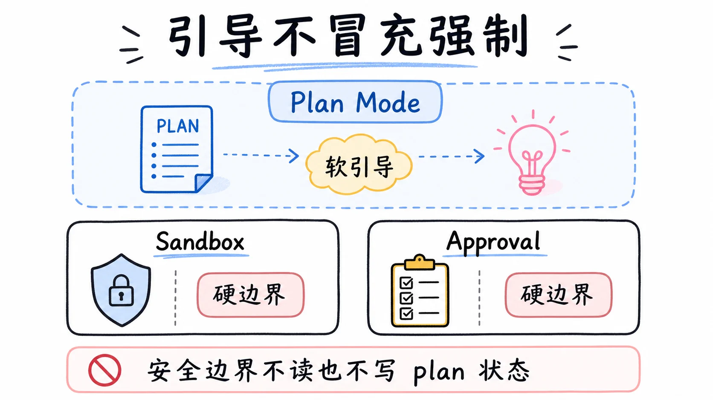

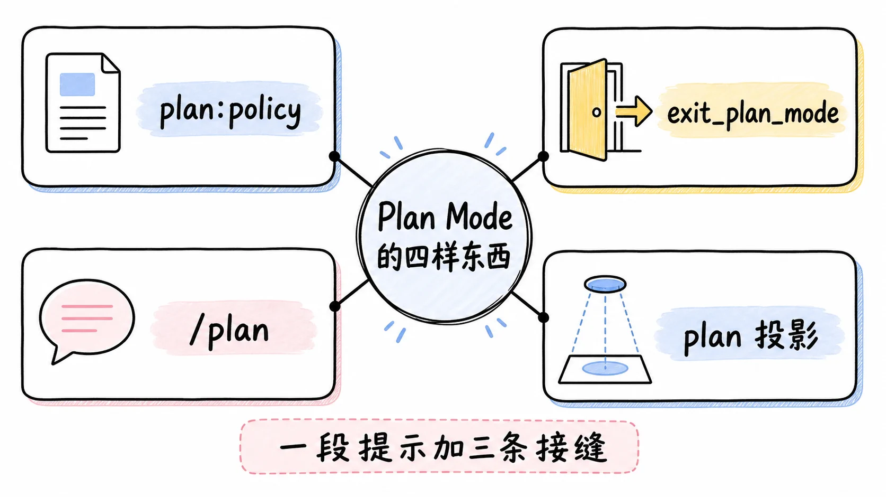

### 引导不冒充强制

官方子系统文档开篇把定性钉死：plan mode 是软性指引。plan mode 激活，不等于"agent 不能改文件"。沙箱允不允许写、审批要不要问，和 plan mode 无关，部署分别配置它们。

为什么不干脆让 plan mode 顺手把沙箱也收紧了？设计笔记（2026-07-22 的 plan-specific collaboration state）记录了被拒绝的方案和理由：一个 mode 拥有的沙箱上限，会让用户显式选择的沙箱模式"看起来成功了，实际上什么都没做"。用户明明选了 `workspace-write`，因为 plan mode 激活被悄悄压成只读，界面还告诉他设置成功，这种静默降级比没有还糟。另一个被拒绝的思路是维护一份"计划模式下可变的工具清单"，理由更根本：可变性是每个工具自己的属性（包括未来的和 MCP 来的工具），不是每个 plan 部署都要维护的一份名单。名单一漏，新工具天然钻空子。

所以 plan mode 的安全观很诚实：它是引导，不是安全边界。模型在 plan mode 里坚持动手改文件，拦得住它的是沙箱和审批。引导没被遵守，那是引导的成本；用错了工具去强制才是事故。

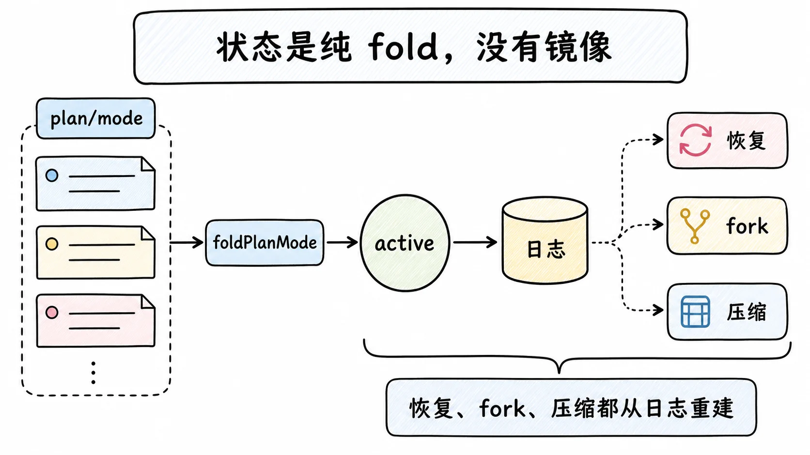

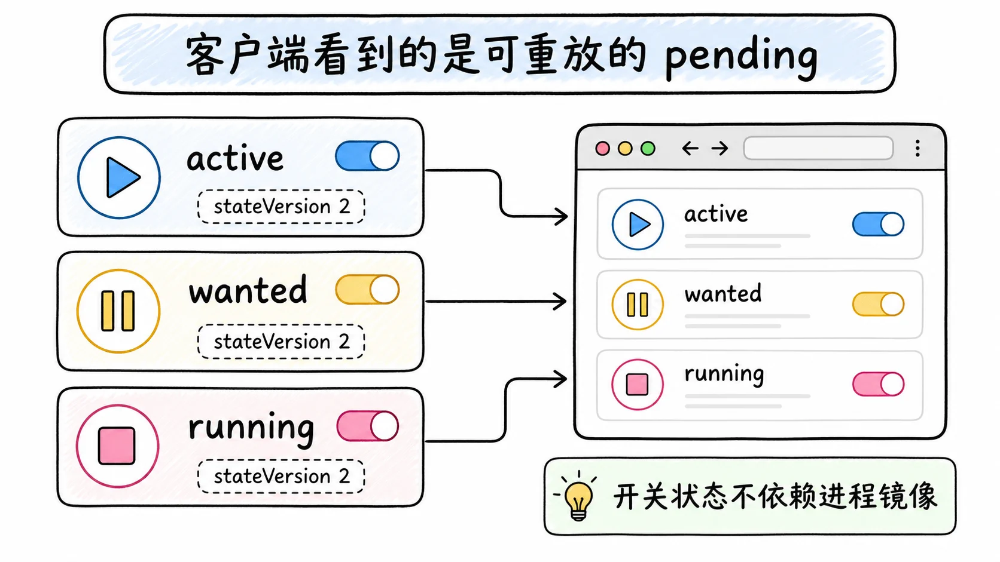

### 状态是纯 fold，没有镜像

`plan/mode` 事件载荷就一个布尔值 `{ active }`，纯日志、整值替换、永不进模型 transcript。生效状态永远是会话日志的一个纯 fold：`foldPlanMode(events)` 返回前缀里最后一条记录的值，没有就返回 `false`。没有 live mirror，没有旁路状态。

这个选择的收益在恢复路径上兑现：resume、fork、compaction 都直接恢复 plan 状态，因为状态本来就是从日志算的。消费方各自取用：客户端通过 `session/event` 观察已提交的翻转来渲染开关，提示组装在读到的状态激活时渲染 policy 段，`exit_plan_mode` 用它判断调用是否合法。被拒绝的替代方案是让某个展示传输层拥有 plan 状态，那样浏览器刷新一次状态就没了，fork 出来的会话还继承不继承、怎么继承，全是新问题。

2026 年 8 月的一次修复（提交 `51fa8da8a3`，"accept image-only plan requests"）还顺带把投影层加固了一轮。`plan` 投影单元现在的状态是三元的：`active` 记录已提交的模式，`wanted` 记录最近一次成功选择的目标值，`running` 记录一条还没等到配对结算的命令执行。`command/run` 记录用户敲下的 `/plan` 选择，`command/done` 只保留成功的选择，`plan/mode` 提交后清掉待生效值。于是"pending"对客户端成了纯重放量：host 重启、其他标签页、冷读，全部从日志恢复同一个 `{ active, pending }` 视图，`stateVersion` 升到 2。请求组装路径上的进程内 pendingIntents 仍然存在，但客户端看到的开关状态不再依赖它。

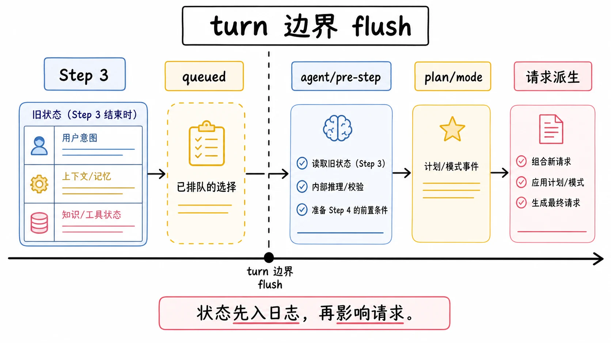

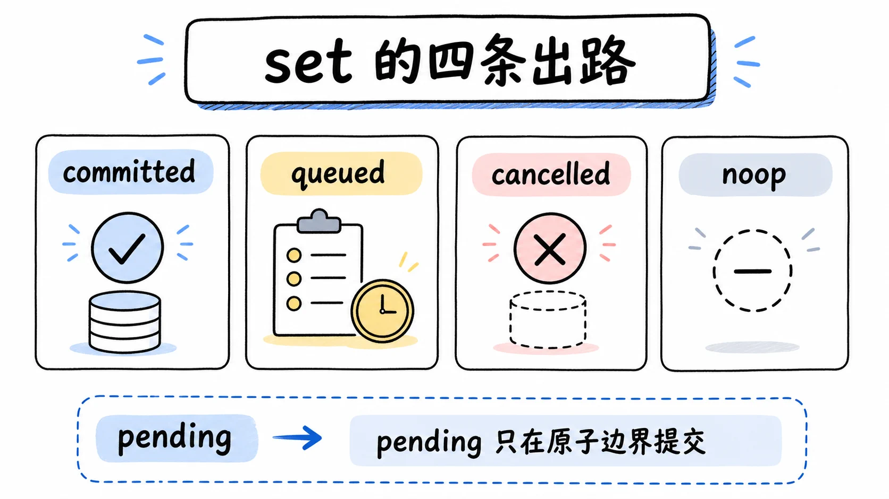

### turn 边界 flush：pending 的四条出路

plan mode 最精巧的部分是选择的落盘时机。因为每个会话事件都被 turn 包住，一个用户选择会保持 pending，直到下一个被接受的 in-turn pre-step 在请求派生之前追加它。一个选择永远不强制 continuation：turn 最后一个被接受的 pre-step 之后做的选择，会在更晚的某个 turn 里追加。

为什么这么讲究？plan 状态影响每个请求的提示段。反过来设想：请求派生到一半改状态，这个请求的提示段用了新状态，而它的请求头还描述着旧状态，日志里就出现一条"一半旧一半新"的撕裂记录。把追加点固定在"下一个被接受的 in-turn pre-step、请求派生之前"，撕裂在结构上就不可能出现。

`set(agent, active)` 的四种返回值对应四种时机。`committed`：turn 之间调用，立即追加，因为下一个 prompt 之前不会有 in-turn pre-step 跑。`queued`：turn 开着，选择 pending，等下一个被接受的 in-turn pre-step。`cancelled`：一个相反的 pending 选择被清掉了，已记录的状态本来就和目标一致。`noop`：已经在这个状态，或已经 pending 在这个状态，无事可做。`get(agent)` 返回 `{ active, pending? }`：已记录的、用于组装当前 step 的状态，加上等着被追加的已选状态。

运行期的唯一追加点是一个前置注册的 `agent/pre-step` 监听器。它观察每个被提议的请求 step（包括 turn 1 step 1 和请求恢复重试），先调下游监听器，只在它们接受 step 之后才追加。prompt 录入发生在 turn 之前，没法追加 `plan/mode`，所以 prompt 时做的选择由那个 turn 的第一个被接受的 in-turn pre-step 追加。追加失败不能阻塞 turn：选择保持 pending，等下一个边界（源码注释明确写了"policy cannot block the step"）。有一个容易误判的点：turn 结束后的检查点期间，会话状态还是 `running`，判断"turn 是否开着"靠的是 open-turn fold（日志里有 `turn/start` 没配对的 `turn/end`），不是状态字段的表面值。

把一次 queued 的落盘按时间排开看。假设 turn 开着，第 3 步在跑，用户在界面上点了开关：`set` 返回 `queued`，选择进入 pending。第 3 步的请求早已派发，带着旧状态走了，不受影响。模型回话，提议第 4 步。前置的 pre-step 监听器看到这个提议，先把下游监听器问一遍，全部接受之后，追加 `plan/mode` 事件，然后第 4 步的请求派生读到新状态，请求头也描述新状态。日志里这两条记录的先后顺序，就是原子性的证明材料：任何人重放这段日志，都看到状态变更先于它影响的请求。反过来，下游要是拒绝了第 4 步，或者追加本身失败，选择就继续 pending，turn 照常走完，没有任何半个状态留在账上。

一个已追加的用户选择还会记一条插件来源的 `user/message` 通知，但只在上次记录的请求头描述的是另一个状态时才记（`planModeAtLastHeader` 做这个判断，第一条请求头之前的日志不通知）。模型被通知的时机精确到"上下文真的变了"，绝不重复唠叨。

代价也有，README 直接承认：turn 最后一个被接受的 pre-step 之后做的选择是进程本地的，进程在下一个被接受的 in-turn pre-step 之前退出，选择就丢了，UI 得重新应用它。这是 turn 边界 flush 的对价：选择不是立即落盘，要等一个能保证原子性的时机。

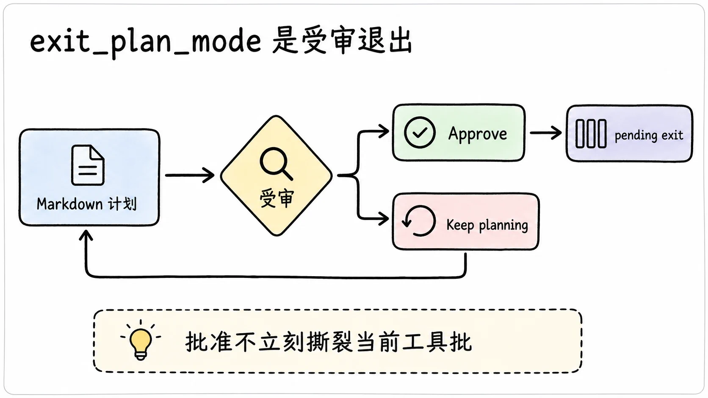

### exit_plan_mode：一次受审的退出

`exit_plan_mode` 工具在 plan mode 不激活时也保持注册。进出 plan mode 只改提示段，永不改请求的工具目录。这条规矩的收益是稳定性：模型学会的工具集合不随模式切换抖动，工具 schema 的缓存也不因模式切换失效。在 plan mode 外执行它，调用失败。

在 plan mode 里调用它，要求一份以 `#` 标题开头的完整 markdown 计划（正则是 `/^#\s+\S/`，任何一级标题都行），通过 user-questions 接缝呈现给人审。审查问题带 `plan-review` 呈现意图，`Approve` 是批准标签、`Keep planning` 是继续标签，有能力的 UI 会把计划渲染成一次决策而不是通用问题，但工具读到的回答两种情况下完全相同。批准的返回是 `{ approved: true }`，同时记一个静默（不叙述）的 pending 退出，在下一个被接受的 in-turn pre-step 追加。于是 plan 引导在 assistant 当前工具批的剩余部分仍然激活，退出这件事由工具结果自己向模型报告。"继续规划"是一次失败的调用，带着用户的反馈回来，模型修改后重新呈现。

审查路径上有三个边界情况，源码都给了明确答案。用户直接关掉审查请求转而发言（`ASK_CANCELLED`）：这不是失败审查，模型收到的错误信息是"用户解散了审查要说别的话，留在 plan mode，停在这里等那条消息"，因为通用通道的取消消息会点名 `ask_user_question`，而这个模型从没调过它。插件在审查期间被重载：调用失败，错误信息让模型重新呈交计划，因为 pre-step 监听器没了，批准的选择永远不会被追加。任何不构成"恰好一次干净批准"的审查回答（选了继续、带自定义文本、多选）：都维持规划状态并返回纠正性反馈，没有模糊地带。审查通道整个缺失时同样失败，fail-closed，手工逃生通道是 `/plan off`。还有一条 2026-07 加的边界：由另一个 agent 所有的存活子级无法打开这个审查，调用会失败并提示子级在最终结果里包含未解决的决策；仅有持久化 fork 谱系并不阻止恢复为运行时根的会话打开审查。

为什么审查不走现成的审批接缝？设计笔记给的理由有两层。其一，计划审查不是权限决策：审批接缝回答"这个动作能不能放行"，计划审查回答"这份方案好不好"，两者的语义、粒度、消费方都不同。其二，退出必须是一次被日志记录的工具调用，作为结构化的状态转换。审批的事件和工具调用的事件是两套账，混用会让重放时无法重建"模型请求退出、人批准退出"这条链。

### 计划本身存哪儿

被拒绝的方案有两个，都值得看一眼。把计划放进模型上下文的 surface（比如作为一条 assistant 消息持久化）会花双份模型上下文：压缩一次，surface 翻转一次，同一份计划占两处。把计划写成文件（比如固定目录下一个 plan 文档）会造出第二个持久之家：会话日志说状态是 A，文件说状态是 B，哪个是真的？计划作为 `exit_plan_mode` 的工具调用参数留在日志里，一处持久，一处派生，这个问题就不存在。

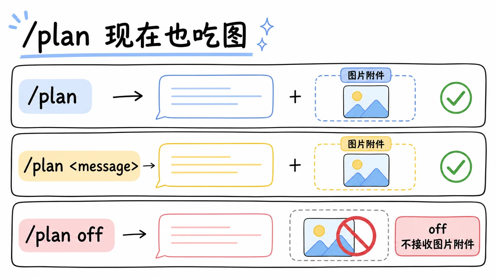

### /plan 命令：现在也吃图

`/plan` 命令在 `ctx.commands` 组合进来时注册。裸 `/plan` 选 plan mode。`/plan <message>` 选 plan mode，然后用 `agent.steer()` 把文本提交为下一步的普通已记录用户消息，让它在 plan 引导下进入对话。`/plan off` 选不激活，同时取消一个还没追加、还没对请求可见的 pending 进入，这是前述 fail-closed 逃生通道的入口。

2026 年 8 月中旬起，这个命令声明了 `input.images`：composer 的图片附件随被 steer 的消息一起提交，排在文本块之前。三条规则：`/plan <message>` 带图，图和文本一起进消息；裸 `/plan` 只带图，会 steer 一条只含图片的用户消息（这就是那个 "accept image-only plan requests" 修复的字面含义，之前图必须搭一段文本才能进 plan mode）；`/plan off` 带图，在任何模式变更前直接报错 "Image attachments cannot accompany /plan off"，composer 保留图片。图片走的也是普通附件管线的引用语义，日志里流通的是引用不是字节。

### 为什么没有统一的模式注册表

看到 plan mode、沙箱、审批三个"模式"，很自然想抽一个统一的 mode 注册表，让它们共享基类、共享预设、共享配置。设计笔记明确拒绝了这个抽象，理由有两条。

第一条是没有第二个生产消费者。抽象的成本要在真实的第二个用例出现时才看得清，为一个消费者预付抽象，抽出来的接口只会精确拟合这一个用例。笔记的原话精神是：未来的协作状态可以从两个具体案例里长出正确的共享接缝，凭空设计长不出来。

第二条是三个轴根本没有共同的所有权结构。plan mode 的提示段归部署，沙箱模式归执行世界，审批策略归交互层，它们的生命周期、配置入口、消费方各不相同。硬捏一个共享基类或注册表，等于强迫三个独立演化的子系统共用一件尺码不对的衣服。宁可三个机制各自直白，也不要一个谁都要迁就的抽象。

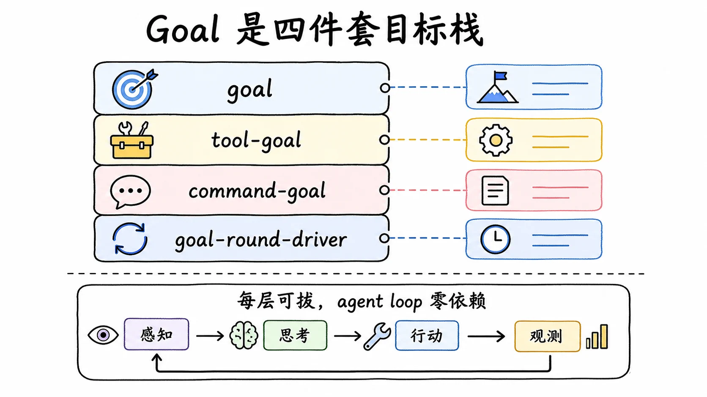

## Goal：一个四件套的目标栈

`ctx.goals` 的服务类型是 `GoalService`，解决"追踪一个长期目标的持久进展"。这件事的难点不在记录一个目标字符串，在它周围的三个现实：进程会崩，目标不能跟着消失；多个写手会并发出手，改坏要能被拦住；续跑要有闸门，重启之后不能自己狂跑。

围绕这个领域，`packages/goal` 下现在有四个包。`goal` 是领域服务本体：事件、fold、CAS 修订号。`tool-goal` 贡献模型用的三个工具。`command-goal` 贡献人用的 `/goal` 命令。`goal-round-driver` 把活跃目标接进 agent loop，决定下一个自动轮次什么时候开始。四件套各自可拔，`agent-spine-demo` 组合里 goals 整个对象省略或设 false 就整栈不挂载；TUI 应用默认全挂；ACP 自动化应用挂领域加模型工具但有意省掉命令服务。

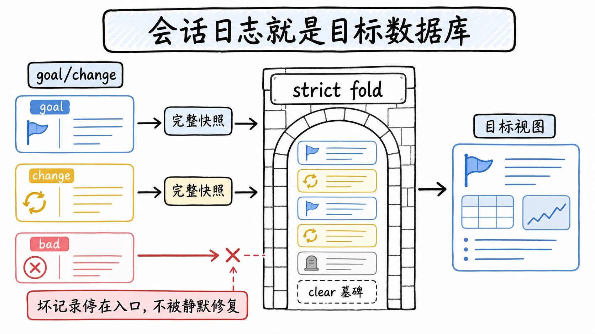

### 会话日志就是目标数据库

每个 goal 变更都是一个持久的 `goal/change` 会话事件，载荷要么是完整的变更后快照，要么是一个 clear 墓碑。快照变体带版本号（当前是 1）、操作名、完整的 `GoalSnapshot`，加上 `roundsStarted`、`createdAt`、`updatedAt`。墓碑变体记录被清除的引用和清除时间。

设计笔记（2026-07-19 的 persisted same-session goal domain）对存储选择的表述很干脆：会话日志是唯一的持久真相源，持久化和 fork 不需要另一个数据库或头字段就继承了 goal 记录。被拒绝的方案是第二个存储，理由是它引入原子性和谱系问题：goal 变更和会话事件分属两个存储，一个事务写一半崩溃，两边就对不上了。事件载荷用完整快照而非 delta，也是刻意的：完整快照让检视、严格重放和 last-wins 投影都变简单，和投影层的整值事件规矩同源。

严格 fold 只从这些事件派生生命周期状态，inbox 的变更不影响 goal 状态。重放是严格的：拒绝形状错误的事件、非正轮次、轮次间隙、stale revision、停了的阶段、cap 溢出、非法生命周期转换、每目标时间戳非单调。一条损坏的记录让重放失败而不是被忽略或修复，增量重放的游标停在第一个损坏事件的位置，故障被一致地报告。挂钟时间倒退时，变更时间戳会被限制在不早于上一次目标更新的值，系统时钟抖一下不至于弄脏账本。

拿一个具体场景掂量这条纪律的分量。假设有人用外部脚本手改日志，把某条 `goal/change` 的 revision 从 7 改成 9。重放走到前一条 revision 6、这一条 9 的位置，发现跳号，停下来，报告位置。操作者看到的是一条明确的故障地址，不是一个被"修复"过的目标状态。如果重放选择宽容（跳过坏的、继续 fold），用户会拿到一个看似正常实则来源不明的 goal，往下每一步都建立在被污染的状态上。严格拒绝把污染挡在了入口，代价是坏日志必须人工处理，这个交换在目标这种要跨天跨重启的状态上是划算的。

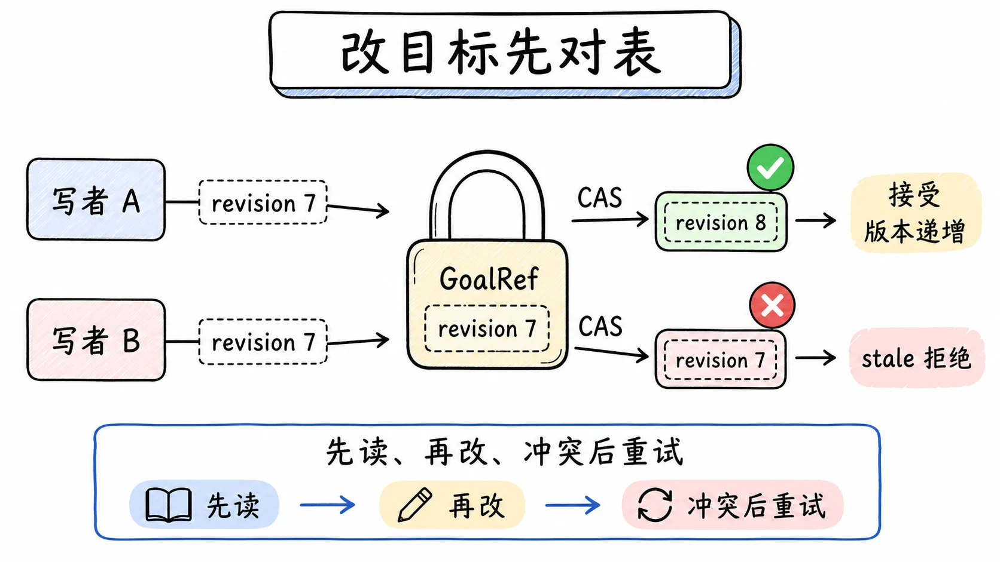

### 修订号：改目标先对表

`GoalId` 是 branded id，`GoalRef` 是 id 加一个正数 revision。调用方通过 `GoalRef` 修改一个确切的修订，每个被接受的持久变更让 revision 加一。这是比较并交换（compare-and-set）语义：你要改目标，得带上你以为是当前的 revision；别人的修改先落地了，你的 revision 就 stale 了，被拒。

防的不只是并发。设计笔记说这套校验加新鲜 id 和转换检查，能在早期拒绝被篡改的、写了一半的、生产者不一致的 goal 记录。一个被外部工具改坏的日志，重放时会停在第一个不一致的事件上，而不是把坏数据继续往前传播。调用方的代价是要处理拒绝：stale 了就重新读、重新改。

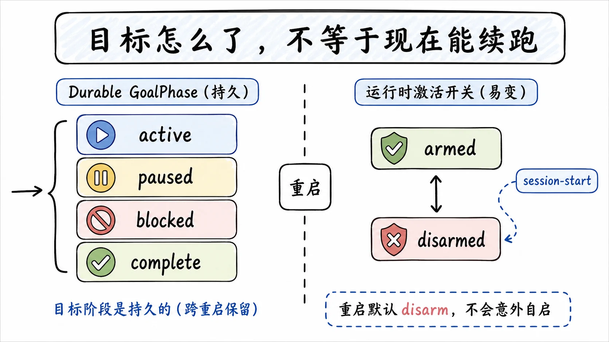

### 两个问题，两层答案

goal 设计最重要的切分：持久阶段回答"目标怎么了"，进程内 activation 单独回答"续跑消费者能不能再开一轮"。

持久阶段 `GoalPhase` 有四个值：`active`、`paused`、`blocked`、`complete`。`blocked` 是唯一一个"因为一个问题停了"的持久状态，它的 reason 带一个稳定的小写 kebab-case code（给路由用）和一个非空的自由文本说明（给人也给模型看）。策略层可以把限流、配额、token 上限、执行错误、请求人工输入全都映射成 blocked 状态，不扩增生命周期状态：README 明确列举 `usage-limited`、`turn-error`、`max-tokens`、`round-limit` 这些 code 都落在这一个 phase 上。

activation 是进程内的，永不持久化。`disarm` 移除进程内的续跑授权，不改持久目标阶段或 revision，不写事件，不发通知。新缓存与每次 `agent/session-start` 边触发时都会停用续行，即使回放找到了 active 的目标。`GoalView` 里的 `activation` 字段和 `roundsStarted`、`createdAt` 这些从日志派生的值并列，但性质不同：派生值跨重启一致，activation 不跨。

为什么分两层？合并的世界里"目标 active"就等于"可以续跑"。进程崩了重启，重放日志发现目标 active，续跑消费者自动开一轮，agent 在没人看的时候自己跑起来了。设计笔记的原话是，用户打开一个会话时工作静默开始是令人惊讶的。分层之后，重启的默认姿态是 disarm：日志仍然权威，目标状态原样恢复，但没有任何工作自启。想续跑，人来 resume，字面命令 `/goal resume` 或自然语言让模型调工具都行。

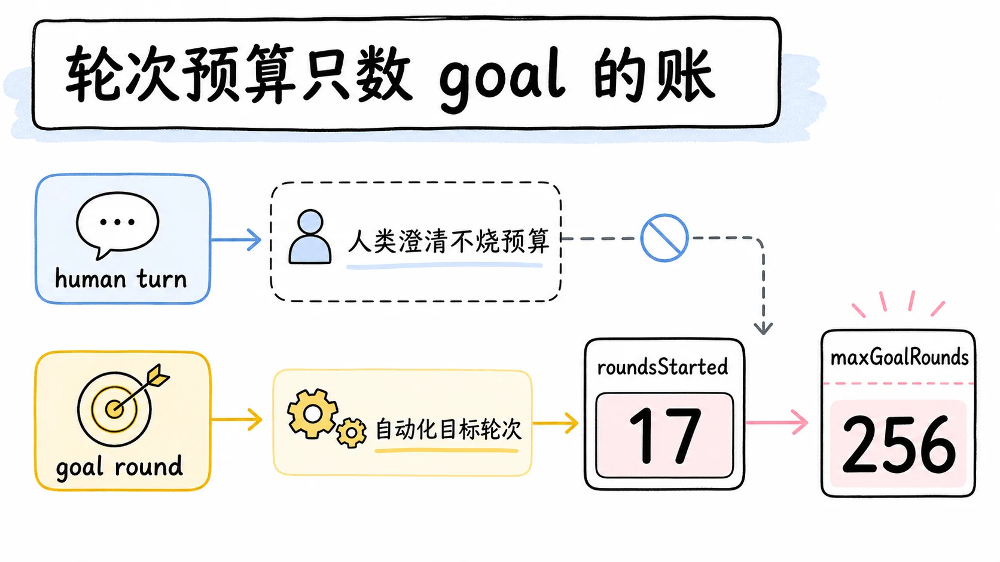

### 轮次预算：只数 goal 的账

一个会话里可以混着人的澄清提问、随手检查、和 goal 无关的杂活。轮次预算只算 goal 的账：续跑消费者给每个被接纳的 goal 轮次归属一个正的、连续的轮次号和当前修订号，只有这些来源为 goal 的 `user/message` 事件推进 `roundsStarted`。人的唠叨不烧预算，agent 的续跑才烧。

区分两类 turn 最直观的办法是问"这条消息是谁因为什么发的"。用户中途问一句"刚才那步为什么失败"，这是人的澄清，是个被接受的 user-message turn，但没有被 goal 归属，`roundsStarted` 不动。goal 驱动器判断还有活没干完，自动开下一轮续跑，这才是被归属的轮次，计数加一。一轮的代价（模型调用、工具执行、token 花销）全部记在 goal 头上，预算烧没烧、烧在哪儿，日志里逐条可查。

轮数不能超过 `maxGoalRounds`，部署配置项 `defaultMaxGoalRounds` 默认 256（`packages/goal/goal/src/index.ts` 的 schema 里 `z.number().default(256)`），必须是正的安全整数。调用方在 create 时省略 cap，由服务配置内部解析默认值；请求级的取值可以覆盖它。超出预算就 block：驱动器发现 `roundsStarted` 已等于上限时，记录 code 为 `round-limit` 的 blocked。README 同时把话说满：这个预算只数轮次，不计量 token、货币、挂钟时间或提供方配额，那些需要独立策略。

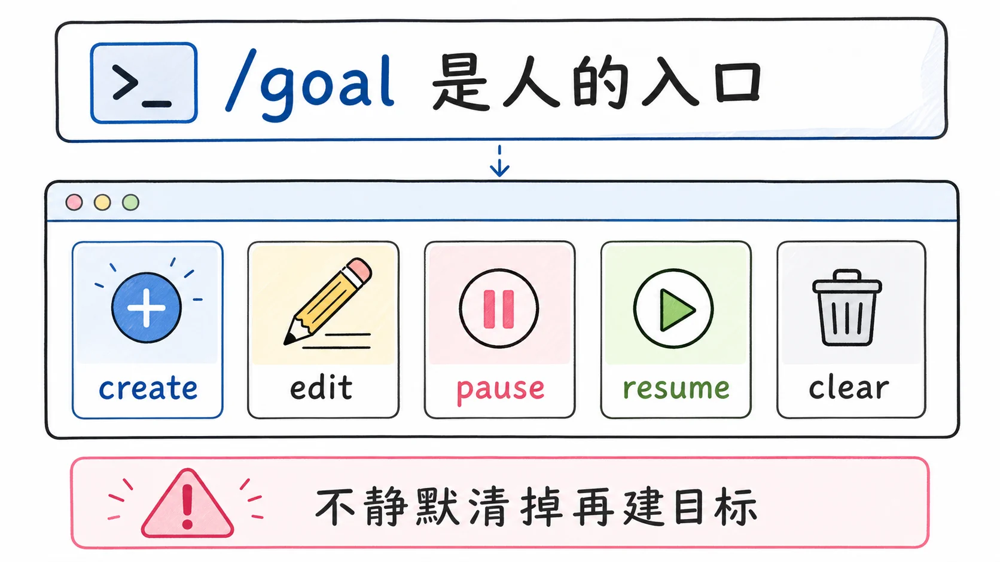

### /goal 命令：人的入口

`command-goal` 包注册一个全局 `goal` 命令定义，组合中的每个命令适配器都会发现它。语法参考的是 OpenAI Codex 公共仓库一个固定提交里的 TUI 分发实现（笔记里钉死了 commit 链接），但事件溯源、轮次计数和恢复后激活规则都是本仓库自己的。

`/goal` 裸敲报告目标描述、面向人的持久阶段、`roundsStarted/maxGoalRounds`、进程内 armed 或 disarmed 激活态、当前状态下有意义的命令。读状态不添加任何会话事件。`/goal <objective>` 创建活跃且已激活的目标；未完成的目标在场时直接失败，提示用行内编辑或明确清除，因为通用命令服务有意不提供模态确认，静默"清掉再建"等于凭空制造破坏性同意。`/goal edit <objective>` 编辑当前未完成目标；目标已完成则创建新目标（领域不允许复活已完成状态）。`/goal pause`、`/goal resume`、`/goal clear` 走相应的 CAS 领域动词。控制词在去除两端空白后按 ASCII 大小写不敏感匹配，只有占据完整后缀时才算控制：`/goal pause after verification` 是一句目标描述，不是被部分解析的暂停命令。

输出有两个刻意的省略。状态里不显示 branded id 和修订号，它们是模型和插件的协调细节，不是人类控制项。命令也不接受逐条命令的轮次上限：默认值归部署配置，得到直接人类指示后，已授权的模型工具可以编辑上限。成功的变更追加领域自有的 `goal/change` 事件，不把模型上下文加入队列，也不引入第二份审计记录；预期的 `GoalError` 被净化成稳定的 `CommandResult.error`，比较并交换的内部细节不向人类界面泄露。

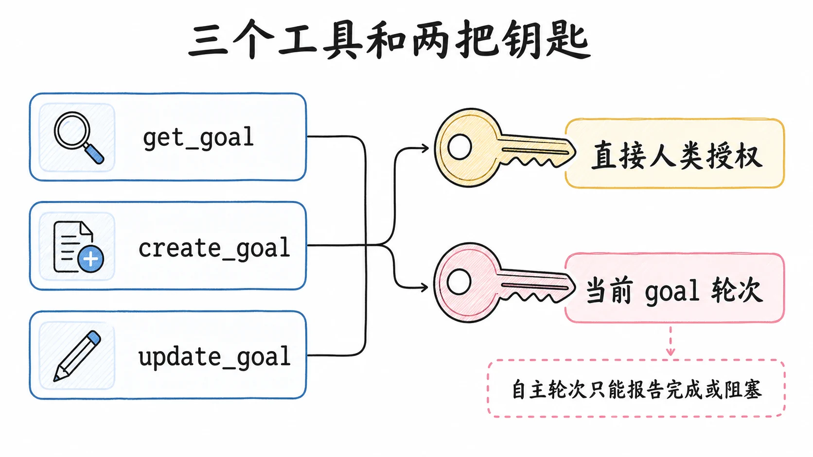

### 模型工具：三个工具和两把钥匙

`tool-goal` 包在领域之上贡献三个独占工具和一个提示策略段：`get_goal`、`create_goal`、`update_goal`。读取加创建加更新的紧凑形态同样参考 Codex 的工具表面。`get_goal()` 返回当前目标或 null，非空结果带 CAS 用的 id 和修订号、目标描述、阶段、已用和最大轮数、阻塞原因、激活态观察。`update_goal(goal_id, revision, action, ...)` 支持 `edit`、`pause`、`resume`、`complete`、`blocked` 五个动作；替换字段只对 `edit` 有效；非空的 `blocked_reason` 只在 `blocked` 时必填，持久化时用稳定 code `model-reported`。

这套工具的核心不是 schema，是权限。每次调用都要求存在 `exec.agent`，且它必须是 agent 注册表中完全相同的运行中对象、当前继承的驱动发起者、处于开放轮次内。这些检查在执行时做，提示词注入或手写工具参数都绕不过。变更类动作（创建、编辑、暂停、恢复）还额外要求一把钥匙：运行时根 agent 的当前轮次已经接纳一条人类直接发送的消息或 steering 事件。用户来源是宿主证明的：每个 `followup()` 或 `steer()` 输入都必须显式提供来源字段，宿主把直接人类内容标为 `{ kind: 'user' }`，非人类生产者注明自己。运行时只证明"这个轮次里有真人发过话"，人类措辞在语义上够不够格授权创建目标，这个解释留给模型。根所有权来自实时 agent 图而非持久 fork 谱系：恢复后的 fork 会话可以接受新的人类授权，实时子级（subagent）仍然是 subagent，动不了这些状态。

第二把钥匙更窄：完成和阻塞。它们接受直接人类权限，也接受"准确的当前 goal 轮次"，即存在一条来源为 goal 的 `user/message`，其目标 id、修订号和轮次号都与折叠后的当前目标相等。这把钥匙只授予两种终止报告权限：自主轮次可以报告完成或持续阻塞，不能编辑、暂停、恢复或替换人类的目标。继续执行权限比重新定义目标的权限窄，这是刻意的。

阻塞还有一个机械阈值：`blockedAfterConsecutiveRounds` 是校验过的正安全整数配置，默认 3（`packages/goal/tool-goal/src/index.ts` 里 `z.number().step(1).min(1).default(3)`）。自主轮次调 `blocked` 时，插件要求至少已经接纳该数量的轮次并提供非空说明，配置值也写进模型指导。运行时判断不了这些轮次遇到的是不是语义上同一个障碍，语义等价性仍由模型判断，计数只是下限。

自主轮次成功报告完成或阻塞后，工具结果会附带一段收尾指令（`wrapup.ts` 里的 `<goal_complete>` 或 `<goal_blocked>` 信封），要求模型向用户写收尾消息：说明结果、总结做了什么怎么验证的、指向具体产物，并声明这次运行不再调用工具。2026-08-02 的一次修复把原先"结果处直接终结轮次"的做法换成了这条路径，模型仍然经由常规的无工具调用停止路径结束轮次。直接人类发起的变更不收到指令，并发的人类 steering 仍可参与普通的停止检查。

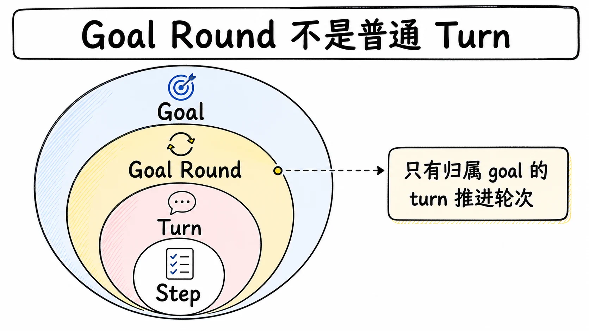

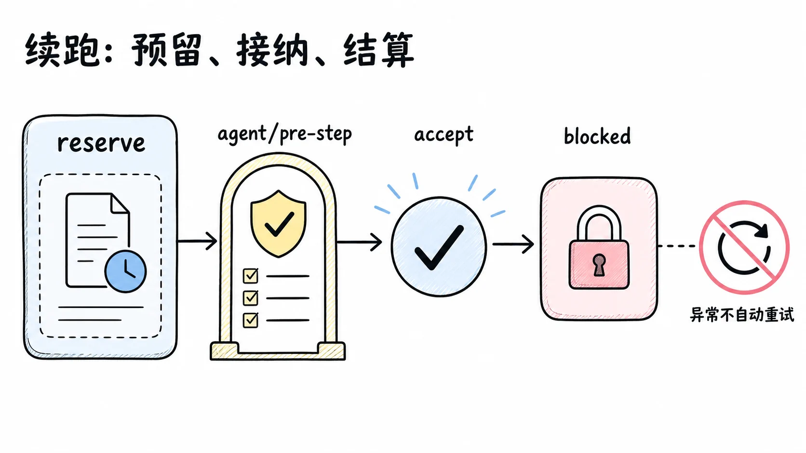

### 续跑驱动器：预留、接纳、结算

`goal-round-driver` 是栈里最后一层，回答"下一个自动轮次什么时候开始"。层次关系是四层的：Goal → Goal Round → Turn → Step。Goal Round 是外层续跑策略的一次迭代，它会成为一个归属于目标的会话轮次，轮次里可以包含任意数量的普通模型或工具步骤。同会话中的人类轮次不是 Goal Round，也绝不增加 `roundsStarted`。

这个插件没有配置项。`maxGoalRounds` 由 goal 领域解析并持久化，阻塞阈值由 tool-goal 解析并写进提示词，驱动器若重复声明这些可调值，一个策略就有了多个所有者。

调度走预留加接纳两步。agent 空闲、没有竞争中的排队工作、当前目标是 active 加 armed 三个条件同时满足时，驱动器先把待处理的 goal 变更持久化到检查点，等待完成后重新校验全部条件。`roundsStarted` 已等于上限就记 `round-limit` 的 blocked；否则先预留精确身份 `{ goalId, revision, round: roundsStarted + 1 }` 和完整渲染的提示词，再以 goal 来源调用 `Agent.followup()`。提示词是一个 `<goal_round>` 信封，目标描述用 JSON 引号编码，多行或类似标签的文本在熟悉框架里仍是无歧义的数据值，信封里还带 `Round: N/M` 的进度行。

`agent/pre-step` 瀑布是准入栅栏。轮次号为正的 goal 来源只有在完全匹配驱动器待处理的身份和内容、实时目标仍是相同 id 加修订号、激活态仍 armed、该轮次仍是下一个编号时才放行。插件在委托下游监听器前查一次，下游返回后再查一次，第二次防止异步监听器编辑或暂停目标后旧提示词仍然进门。只有最终产生的 `user/message` 才算进入的 Goal Round，才推进目标折叠。陈旧预留会关闭一个零步骤轮次并标记为陈旧，不计入轮数；下游策略拒绝且不是因为陈旧状态，目标进入 blocked，不自动重试绕过策略。

一个轮次关闭后，驱动器按结果分类结算：持久化的 `completed` 在目标仍 active/armed 且未到上限时继续；取消或 `aborted` 暂停并解除激活；code 为 `RATE_LIMIT` 或 `QUOTA` 的错误以 `usage-limited` 阻塞；其他错误以 `turn-error` 阻塞；`max-tokens` 以 `max-tokens` 阻塞；持久化检查点失败解除激活但不动持久阶段；`disposed` 或 `interrupted` 解除激活；插件新增的未知结果阻塞并等待检查。没有一种异常结果会请求自动重试，保守的失败映射可能要求在暂时性错误后手动继续，但绝不会隐藏自动重试。目标在轮次内被变更时修订号前进，旧修订的结算不覆盖新变更：驱动器丢弃旧尝试的结果、读取新投影，只在新修订仍 active 加 armed 时继续。

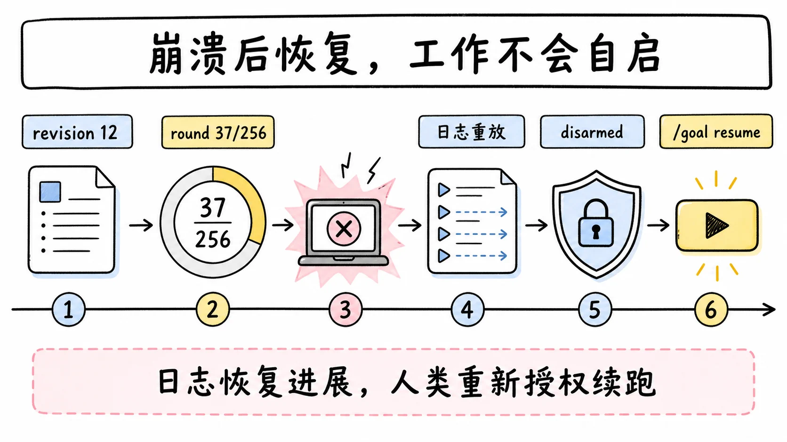

### 一次崩溃恢复，从头到尾

把整个栈放进一次真实的崩溃里走一遍。某个 goal 处于 active，revision 12，`roundsStarted` 37，`maxGoalRounds` 256，驱动器 armed，第 38 轮刚提议。进程崩了。

重启之后的第一件事是 session-start 边触发：activation 停用。然后日志重放，`goal/change` 序列逐条 fold：create（revision 1）、几次 edit 和 pause/resume（revision 一路涨到 12）、37 条被归属的 goal 来源 `user/message`。fold 的输出是 active、revision 12、`roundsStarted` 37。所有跨重启该活下来的东西都活下来了，因为它们本来就从日志来。唯一没活下来的是 activation：它从不持久化，此刻是 disarmed 的。

用户打开会话看到的是：目标还在，进展还在，agent 安静。驱动器看着 disarmed 的 activation，不会自己开第 38 轮。用户要么敲 `/goal resume`，要么用任何语言说一句"继续"，模型读到停用的目标，调 `update_goal` 的 resume 动作，新的激活边被记录，预算还剩 219 轮，续跑开跑。整个恢复过程没有一个数字需要"同步"回来，也没有一行代码需要在重启时猜测"上次跑到哪了"；哪些值来自日志、哪些来自进程，边界从头到尾清楚。

## 并排看，再串一遍

| | Plan Mode | Goal |
|---|---|---|
| 重量 | 轻，一段提示加一个工具 | 重，四件套完整生命周期 |
| 强制 | 软引导，无强制 | 持久阶段加进程内 activation 两层 |
| 状态来源 | `plan/mode` 事件纯 fold | `goal/change` 事件严格 fold |
| 防并发 | 无（布尔状态） | compare-and-set revision |
| 轮次预算 | 无 | `maxGoalRounds` 默认 256，阈值默认 3 轮 |
| 人的入口 | `/plan [off|message]`，可带图 | `/goal [objective|edit|pause|resume|clear]` |
| 模型的入口 | `exit_plan_mode`，受审退出 | `get_goal` / `create_goal` / `update_goal`，带权限 |
| 与硬强制关系 | 明确分开 | activation 与持久阶段分开 |

一个真实场景把两者串起来。用户要做一个跨好几天的重构，先敲 `/plan`，plan mode 激活，每个请求都带着部署那段"先出计划"的引导。agent 产出一份 markdown 计划，调 `exit_plan_mode`，人审通过，pending 退出在下一个 turn 边界追加，plan 引导退场。整个过程里两个机制互不知晓：plan mode 不关心有没有 goal，goal 也不读 plan 状态，把它们串成一条工作流的是用户和部署，框架只保证各自那一段不出错。随后用户创建一个 goal，给了 40 轮的预算。agent 开始干活，每个被归属的续跑 turn 推进 `roundsStarted`，中途连续三轮撞上依赖版本冲突，达到阈值，模型调 `update_goal` 报 blocked，收尾指令让模型写一段"卡在哪、要什么"的收尾消息。用户解决冲突后 resume，goal 重新 arm。第二天进程重启，用户打开会话：goal 状态原样（从日志 fold 出来），activation 是 disarm 的，agent 安静地等着。用户 resume，工作继续，预算还剩多少，日志里数得清清楚楚。

## 权衡

plan mode 的软是刻意的，代价也摆在明面上。它没有强制力，模型不听引导时能兜底的是沙箱和审批，把 plan mode 当安全边界是用错了东西。pending 选择的落盘要等 turn 边界的合适时机，进程在下一个被接受的 in-turn pre-step 之前退出，选择就丢了，UI 必须重新应用。交互通道缺失或插件重载时 `exit_plan_mode` fail-closed，用户得记得 `/plan off` 这条手工通道。专用审查渲染器只有 Web UI 有，其他交互方走通用选项流程。这些限制 README 里写得明明白白，不是踩坑之后才发现的暗礁。

goal 栈的重同样有成本。每次修改都要带 revision，stale 被拒后调用方得处理读改重试。长目标的事件持续累积，fold 成本随日志增长，靠持久化投影缓解冷读。它还有几条明示的边界：一个会话同时只有一个当前目标，系统有意不支持并行目标；信任边界在进程，能直接访问 `Session` 的插件可以追加伪造的 `goal/change`，严格重放能检测不一致但不修复，这是完整性检测不是插件隔离；没有独立评估器，记录完成或阻塞的调用方拥有最终决定权。驱动器的保守结算意味着一次限流或网络错误就会把目标打成 blocked，等人来 resume，换来的是绝不隐藏的自动重试。

两个包都不在 agent-loop 主干里。最小化的 headless 部署可以整栈不装，loop 照常跑，单次调用的结束语义保持物理轮次。这是"一切皆插件"在目标管理上的落点：连"agent 该有什么目标、目标怎么续跑"本身都是一个可插拔的问题。

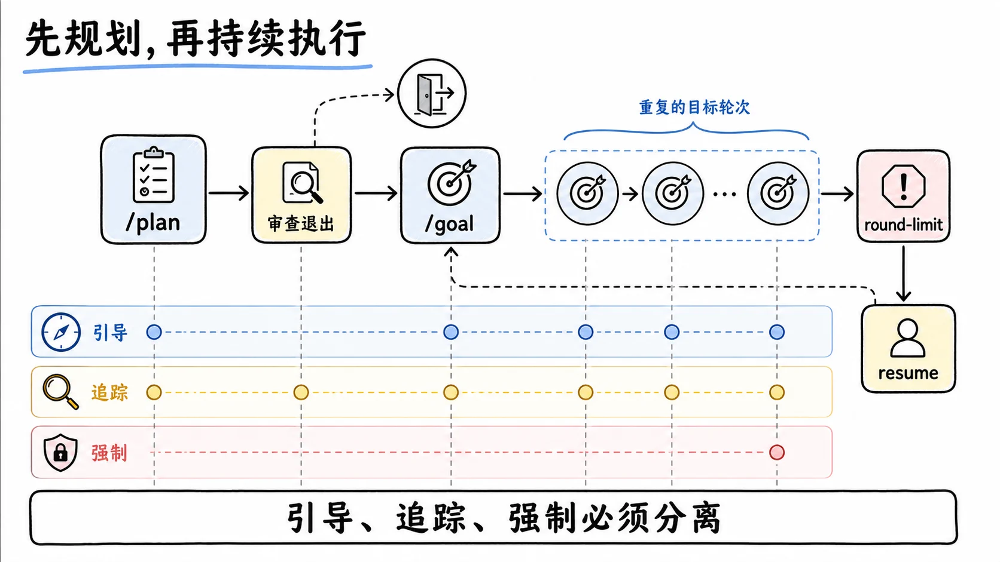

## 结论

`ctx.planMode` 是软引导：激活时每个请求多一段部署拥有的提示，状态是 `plan/mode` 事件的纯 fold，选择在 turn 边界追加以保证请求的原子性，退出走一次被人审的日志工具调用，图也能跟着 `/plan` 进规划对话。`ctx.goal` 是持久的事件溯源生命周期：revision 防并发、四阶段记状态、两层授权管续跑、轮次预算只数 goal 的账，全部从 `goal/change` 事件 fold，日志之外没有第二个真相源；命令、模型工具、驱动器三件配套各自持有明确的权限边界，人用自然语言或字面命令授权，自主轮次只有终止报告权。

贯穿两者的纪律有两条。状态从日志派生，所以恢复和 fork 不需要额外协议；引导、追踪、强制三者分离，所以软的不会被误当成硬的，硬的也不会被软的架空。用户选的沙箱模式永远生效，agent 的目标状态永远可重建，进程重启后永远没有意外自启的工作。

## 延伸阅读

- [Plan Mode 子系统文档](https://github.com/deepseek-ai/deepseek-harness/blob/master/docs/subsystems/plan.md)：软引导定性、turn 边界 flush、投影单元行为
- [Same-session goals 子系统文档](https://github.com/deepseek-ai/deepseek-harness/blob/master/docs/subsystems/goal.md)：goal 类型目录与服务契约
- [Plan-specific collaboration state 决策笔记](https://github.com/deepseek-ai/deepseek-harness/blob/master/.agents/notes/implemented/simplification/2026-07-22-plan-specific-collaboration-state.md)：plan mode 设计理由与被拒绝方案
- [Persisted same-session goal domain 决策笔记](https://github.com/deepseek-ai/deepseek-harness/blob/master/.agents/notes/implemented/feature/2026-07-19-persisted-same-session-goal-domain.md)：goal 持久化与激活分层决策
- [Same-session goal round driver 决策笔记](https://github.com/deepseek-ai/deepseek-harness/blob/master/.agents/notes/implemented/feature/2026-07-19-same-session-goal-round-driver.md)：预留、接纳栅栏与结算表

上一篇：[dsh 的跨会话记忆：session-query / projection / reference](./28-cross-session-memory-query-projection-reference.md)
下一篇：[dsh 的子 Agent 与多智能体：怎么调度另一个 agent](./30-subagents-multi-agent.md)
