# dsh 的子 Agent 与多智能体：怎么调度另一个 agent

> `ctx.subagents` 是一个命名 provider 注册表，六种后端共存，把委派分成两类：一次式是一个可丢弃的 run，拿一个结果就 dispose；可继续是一个持久子会话，带进程内 Activation，能多轮 FIFO 对话、能冷恢复、能上报给父。2026 年 8 月的三次改造把这一半继续往前推：可继续委派默认后台返回子 id、同一步骤里的兄弟委派并行重叠、子 agent 在委派那一刻快照父的沙箱覆盖并把审批钉死为 never。再往上一层，实验性的 Agent Teams 给"同级互相说话"补上持久 mailbox 和共享任务板。这篇沿"委派"这一条线从一次式走到团队协作，截至 2026-08 的代码状态。
> 路线：接缝为什么多 provider 共存；一次式与可继续各自的契约；并行、后台优先、策略继承三个新默认；产品级 provider 的边界；Agent Teams 实验了什么。

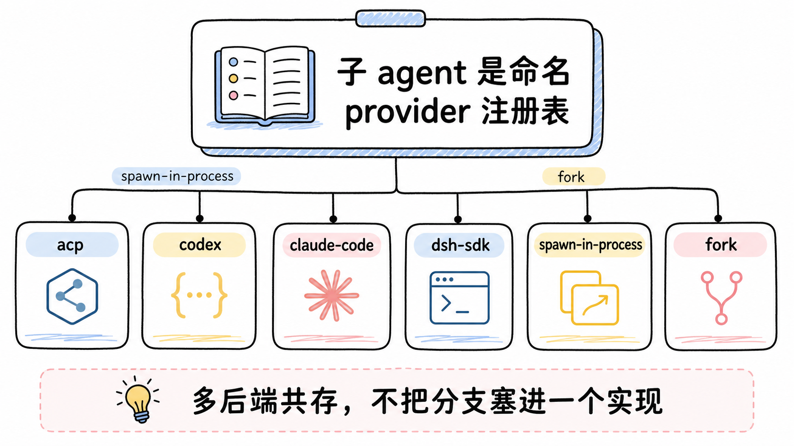

## 为什么这个接缝是多 provider 共存

bash、workflow 这些接缝，一个 context 一个实现：再注册第二个 executor 直接抛错。这对 bash 是合理的，一台机器跑命令就一种方式。子 agent 不是。同一个父会话里，可能这一刻要把一个便宜的小任务委派给同进程的子 agent，下一刻要驱动一个隔离的进程外 agent 走 ACP 协议，再一会儿要把一段活儿整个交给 Codex 或 Claude Code。这些需求的传输机制、上下文继承、生命周期全都不同，单实现接缝内部就得长满分支。

所以子 agent 接缝学的不是 bash，是 LLM 适配器注册表：多个后端按名字注册到 `ctx.subagents`，共存于一个 context。截至 2026-08 共六个 provider，对应 `packages/subagent/` 下六个包：`spawn-in-process`、`fork`、`acp`、`codex`、`claude-code`、`dsh-sdk`。选择是配置驱动的，不是模型驱动的：工具绑定到确切的 provider 名，模型只看到描述和提示框；要同时暴露多种传输，就把工具插件按不同工具名多挂几次。标准 preset 就是这么做的：`subagent` 工具行绑 `spawn` provider，`subagent_fork` 工具行绑 `fork` provider，两行都配 `backgroundMode: continuable`。

模型面向的消费者有三个：`tool-subagent` 按 provider 委派，`tool-subagent-control` 提供全局的 `send_message`、`interrupt_agent`、`list_agents`，`tool-subagent-report` 给子 agent 自己一个 `report` 回报通道。

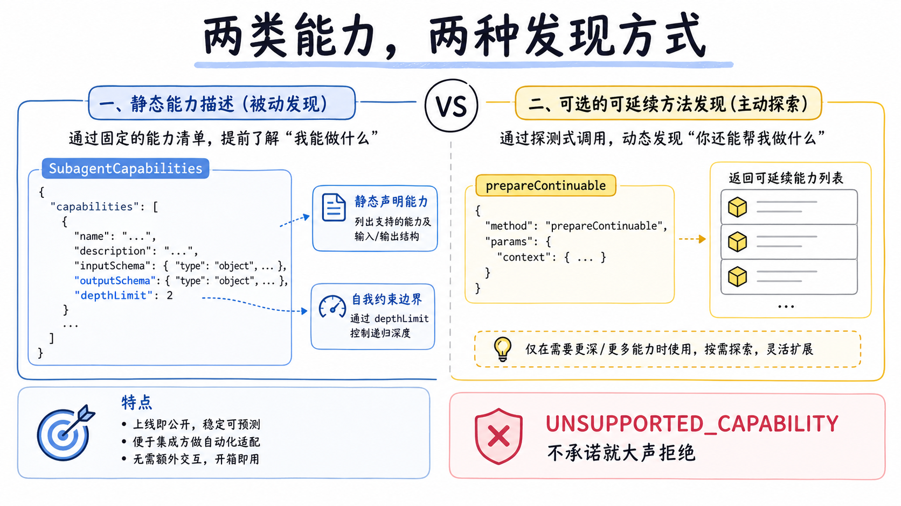

## 两类能力，两种发现方式

provider 的能力分两类，发现方式完全不同，这个差别本身就说清了两类委派的分工。

启动期能力是静态描述符 `SubagentCapabilities`，四个布尔：`outputSchema`（结构化输出）、`depthLimit`（深度上限）、`toolFilter`（工具过滤）、`persona`（人设）。服务在一次式 run 存在之前就检查它：请求需要某个能力而 provider 不支持，用 `UNSUPPORTED_CAPABILITY` 大声拒绝，绝不"接受了然后忽略"。为什么必须是启动期检查而不是运行期方法？因为调用方依赖这些语义构造请求，静默降级会让请求在没有承诺的语义下继续跑。配了结构化输出，provider 其实不支持，返回却当普通文本解析，错在下游才爆。

可继续能力的发现走另一条路：看可选方法 `prepareContinuable` 在不在。方法在，能力就在，靠 TypeScript 类型收窄。不需要单独的标志位，也就不存在标志位和实现漂移的问题。一次式子 agent 是 provider 自己组装的，能力得提前声明；可继续子 agent 是 continuation manager 组装的，provider 要表态的只剩愿不愿意参与创建。

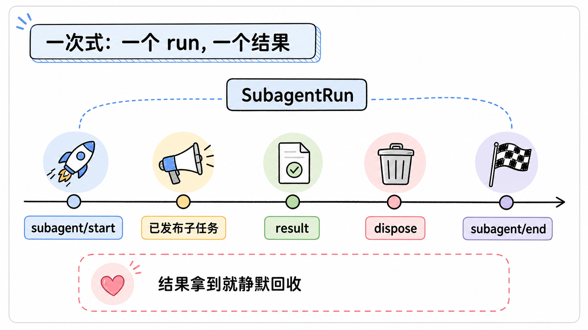

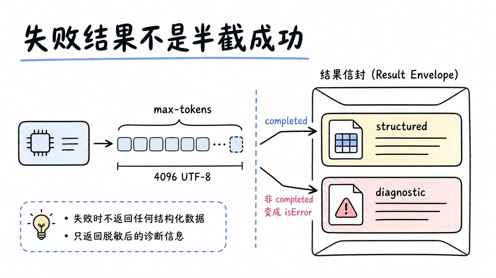

## 一次式：一个 run，一个结果

一次式委派返回 `SubagentRun` 句柄：一次性的前台委派，带一个结果，不是持久的子句柄。消费者 await `result`，然后总是 dispose 达到静默，dispose 幂等。

失败语义值得细看。子 agent 级别的失败不让 `result` reject，而是 resolve 成非 completed 的停止原因；只有无法表示的基础设施故障才 reject。`stopReason` 是可合并扩展的联合：`completed`、`aborted`、`error`、`max-tokens`、`refusal`，遇到未知的值按失败处理。非 completed 意味着 output 可能残缺，消费者把它映射成 isError 工具结果，不把半截输出当成功。`structured` 只在请求了 schema 且成功满足时才出现，请求过不保证有。

结果旁边有个 `diagnostic`，边界很讲究：provider 会剥掉工具输入、文件内容、环境变量值、凭证、协议载荷，完整值上限 4096 UTF-8 字节。诊断是给排错看的，不是第二个数据通道。

生命周期是成对的。服务铸造 `runId`，发布时发 `subagent/start`，结束时配对的 `subagent/end` 带最终输出或基础设施故障。本地 run 必须在 `start()` 兑现之前把子发布出去，`SubagentRun.id` 就是子会话 id；被拒绝的 start 清理未发布的资源、不发生命周期事件，账上永远不会出现半个发布出去的子。远程 run 返回 `localAgent: undefined`，也不进持久枚举。

把一次式放在真实的 turn 里走一遍。模型决定委派，工具层从模型输入构造请求：prompt 和 parent 是必填，parent 顺手提供了子的 cwd、lineage 和派生深度；模型还要求了结构化输出。服务先查能力表，provider 的 `outputSchema` 是 true，放行。run 启动，`subagent/start` 落账，子 agent 在自己的扁平 scope 里干活。结果回来，`stopReason` 是 `max-tokens`：output 里是截断的半份分析，`structured` 缺席。消费者把这条映射成 isError 工具结果，附上剥过敏感内容的 diagnostic，dispose run 达到静默，`subagent/end` 配对闭合。模型看到失败，决定换个更窄的 prompt 重试。整个循环里没有任何持久状态被制造出来，也就没有任何东西需要清理。

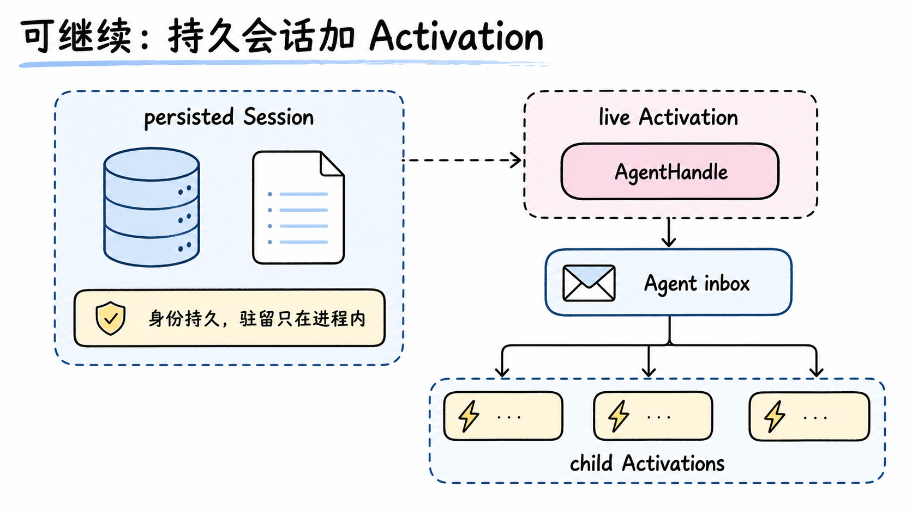

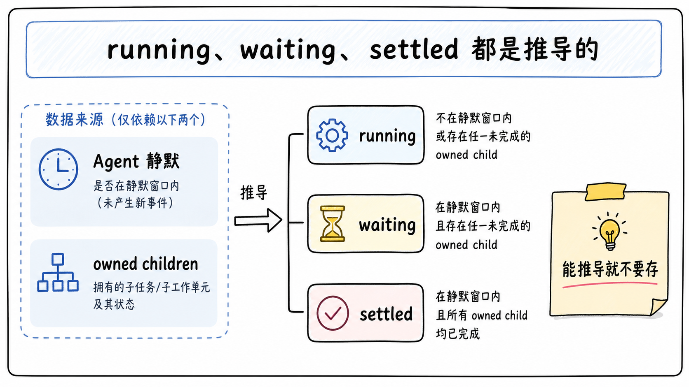

## 可继续：持久会话加 Activation

可继续子 agent 是一个持久子 Session，带至多一个进程内的 Activation，也就是重建出来的子 Agent 驻留的一个时期。结构上：

```text
persisted Session
  -> optional live Activation
       -> one retained AgentHandle
       -> Agent inbox as the only turn FIFO
       -> zero or more owned child Activations
```

Activation 明确不是请求、不是结果、不是取消、也不是 Task。它可以执行很多 FIFO turn，在它创建的后代还在跑的整个时期保持驻留。一个 Session 至多一个活 Activation，所以子会话 id 本身就能认出活子。历史会话在 Activation 销毁后不占任何运行时内存：身份在 Session 里，驻留才在 Activation 里。

三个状态不是维护出来的，是推导出来的。running 意味着 Agent 有活跃的准入、turn、或正在唤醒的 inbox 工作；waiting 意味着静默但还拥有至少一个未完成销毁的子 Activation；settled 意味着静默且所有子都销毁了，此时 manager 销毁 AgentHandle、移除 Activation。推导的原料是 Agent 静默状态加拥有的子集合，没有第二台执行状态机。这条纪律的分量在于：状态机是 bug 温床，两台状态机保持同步是 bug 灾区，能推导就不要存。

`startContinuable` 在 inbox 接受、拿到消息 id 时就 resolve，返回 `{ childId, messageId }`，不等 turn 开始、不等消息进日志。更早的任何失败触发回滚：销毁已建的句柄、移除 Activation、撤销父的归属，然后才拒绝，不留未配对的终态边。

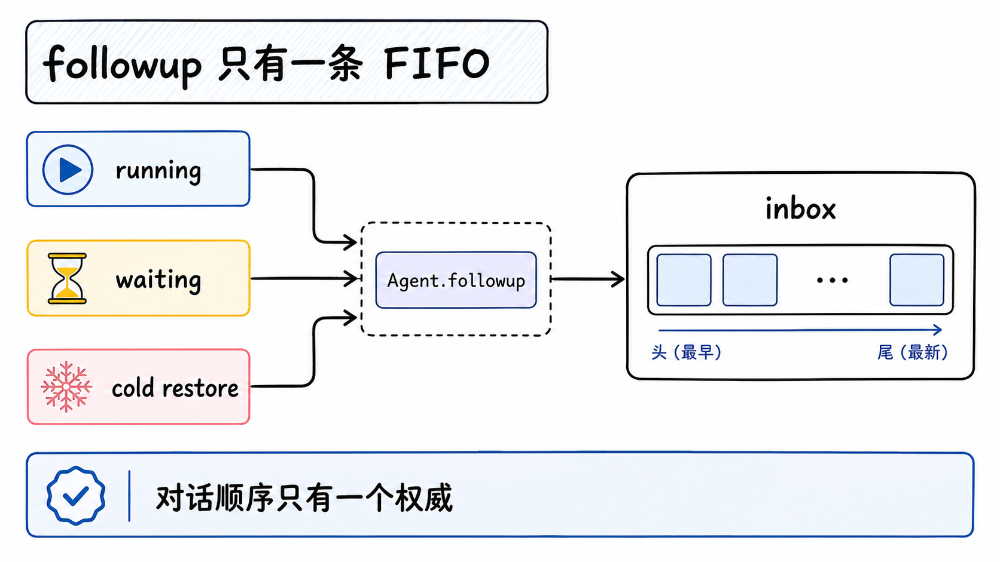

### followup：路由只看 Activation 驻留

`followup` 是唯一的续消息操作，路由只取决于 Activation 状态：running 就在同一个 Activation 入队；waiting 就唤醒同一个 Activation；没有 Activation 就冷恢复一个新 Activation。每条续消息变成一个 `Agent.followup()` FIFO turn。被接受的消息有唯一可观察顺序，一条 follow-up 没法重定向一个已经在进行的 turn。

为什么死磕"唯一队列"？设计笔记把替代方案逐个否了。每个 turn 一个 Task？用 Task 做对话投递会造出第二个队列、复制 turn 所有权。在 inbox 旁边放一个 manager FIFO？它和 Agent 已接受的消息之间的顺序是模糊的，而基于 Job 的取消没法精确移除一条排着的请求。两个 FIFO 没有唯一的排序权威，对话顺序就成了运气。一条 inbox、一个顺序，问题从根上没了。

这条性质往下还有一层红利。既然每条续消息就是一个普通的 FIFO turn，那么会话日志里子 agent 的对话记录和任何普通会话长得一模一样：user 消息、assistant 回复、工具调用，按同一次序排布。审计一个多智能体会话不需要懂任何特殊协议，读日志就行；重放它也不需要，因为 turn 的排序权威只有一个，日志里的顺序就是执行过的顺序。

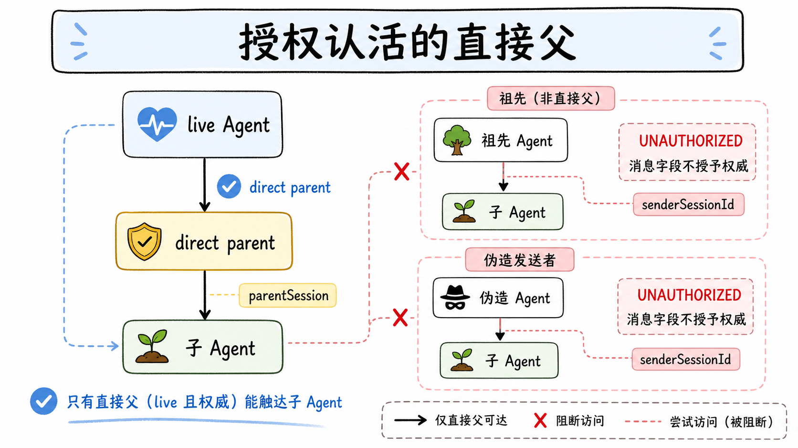

### 授权：活的直接父，不是消息字段

follow-up 的授权来自一个确切的 live Agent 工具上下文。被认证的 Agent 必须是这个持久子 agent 的直接父，记录在 `SessionHeader.parentSession`。

`MessageSource` 和 `senderSessionId` 记录谁提供了消息，但不授予任何权威。模型面向的工具用 `CoordinatorMessageSource`，kind 是 `coordinator`、form 是 `relay`，名字就在说明自己只是中继。持久谱系单独也证明不了什么：日志里记着的父，不代表现在还拥有这个子。检查发生在两个关口，最终的 no-await 准入边界，和冷恢复重建之前。祖先、host 一律拒绝，直到出现具体的消费者再说。

这条姿态在 dsh 里反复出现：jobs 靠 owner 不靠 id 保密，approval 的监听器按 agent 作用域隔离。共同点都是权威绑定在活的对象上，不绑定在可以被伪造、被复读的数据上。

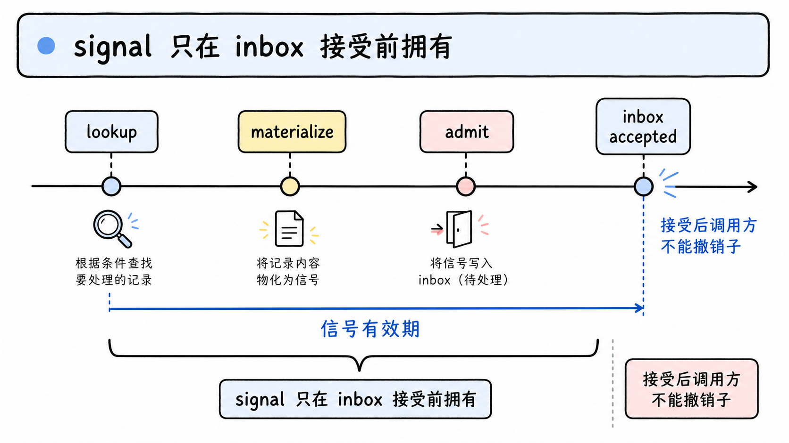

### 信号只在 inbox 接受前拥有

对 `startContinuable` 和 `followup`，调用方的 signal 只在查找、物化、准入阶段有效，到 inbox 接受为止。之后 manager 独立拥有 Activation：后来的调用方取消既不取消已接受的 turn，也不销毁子 agent。接缝不暴露任何 steering 操作。设计笔记的理由是 steering 需要当前 turn 的控制器状态和一套独立的准入策略，把每条续消息排队就完全避开了这份状态和它的准入竞态。严格的 live-only steering 留给了未来的 host UI，接缝里不做。

还有一个精致的性质：投递和最终销毁竞争时，准入截断恰好一边赢。要么 inbox 接受了这条消息，要么这条消息留给之后的冷恢复。没有中间态，没有"算发出去了又算没发出去"。

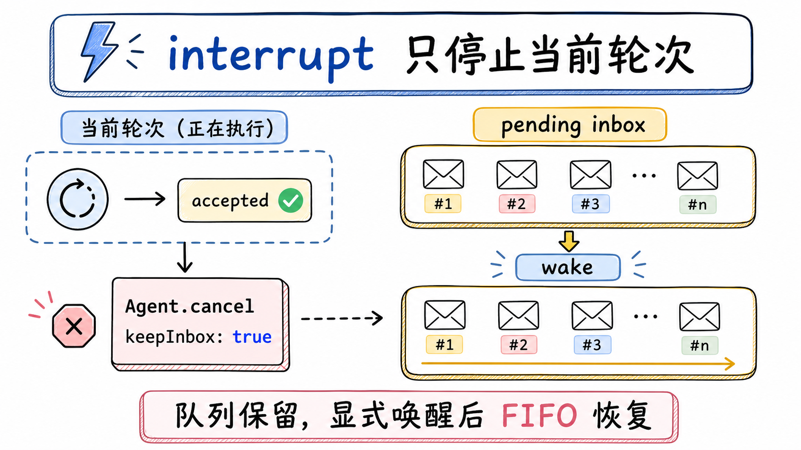

### interrupt：唯一的公共停止

`interrupt(targetSessionId, authority)` 是唯一的公共停止，2026-08-06 的决策把它定形为"只停止当前轮次"。它同步授权，对活目标发 `Agent.cancel(cause, { keepInbox: true })`，不等静默就返回：`accepted` 表示信号已发出，目标在观察到信号前可能仍显示 running，客户端得如实呈现。Activation、未认领的 pending inbox 工作、已发布的后代都不动；已被认领进被中断 turn 的工作不重新入队。被中断的 driver 空闲后，一条唤醒的 send 会按保留的 FIFO 顺序恢复停着的队列。这条"暂停到显式唤醒"是有意的人工介入窗口，不是调度器缺陷。

授权两种，刻意比投递权限宽，因为停止一个轮次是幂等的且不投递内容：`user` 是人客户端出示的持久直接父地址，不要求父 Agent 在线，这正是父离线时在线子仍能被停的原因；`ancestor` 是一个确切 live 的祖先 Agent 对象，其记录的 lineage 必须包含调用方。父地址不匹配的在线目标 `UNAUTHORIZED` 拒绝；目标不存在、已自然结算、或组合里没有 manager，是接受的 no-op，统一覆盖完成竞态和重复请求而不泄露持久目录信息。这个区分有意义：前者是安全拒绝，后者是无事可做，混在一起会把"没权限"和"没对象"搅成一笔糊涂账。Web 侧 Stop 按钮经 host RPC `subagent.interrupt` 走 `user` 授权，Send 继续入队，两个操作互相独立。

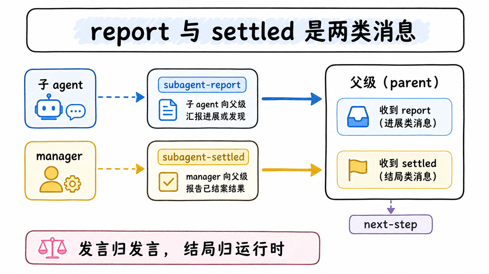

### report 与 settled：子给父的两类消息

`reportFrom` 让一个活的可继续子 agent 把选定内容发给它的持久直接父。权威凭证就是子 agent 自己这个活对象，调用方不能指定接收者：manager 从子的 `parentSession` 派生唯一接收者，要求那个父 Agent 活着，把内容框成一条 `subagent-report` user 消息，返回稳定的 `MessageId`。投递方式由部署策略 `reportDelivery` 决定，默认 `next-step`：用 `Agent.steer()`，父空闲就唤醒，父在跑就并入最近的 step 边界；`quiet` 用 `Agent.inject()`，不唤醒父。两种都不结束子的 turn。

2026-08-06 的上报义务决策给子 agent 的提示词加了两条强制指引：结束时发送一份自包含的最终报告（接收者可能没有子的上下文），发现会改变父下一步动作的信息时提前报告。这是协作的那一半。

另一半是运行时的。manager 单独记自己的账：一个驻留的 Activation 结算时，manager 在结束 Activation 的那笔 dispose 事务内部给子的持久直接父发一条通知，先是父可据以行动的一句结果说明，然后是子的最终 assistant 内容，或一句说明它没有产出内容。这条投递对所有 id 被调用方拿到过的子无条件发生，不查询子是否上报过。为什么无条件？因为被 token 上限、模型失败、取消或拆卸终止的子永远走不到"能遵守指令"的那一步，而这些恰恰是等待中的父最需要被告知的结束方式。设计笔记记录了改造前的真实症状：父忙轮询 `list_agents`、向已结算的子反复发消息、部署放弃 `subagent` 转用 `workflow`。

投递时机的两条规则都有测试钉死。发送发生在 `releaseOwnership` 之前，此刻父仍计入这个子、结构上不可能被判定为已结算；改在释放之后，会与一个在下一个 microtask 恢复的 watcher 竞争，失效表现是一条静默丢失的消息，任何地方都不报错。驻留父级通过 `admitWaking` 接收，避免压缩上下文期间的父被状态和子集合双双误判为静止。空闲父得到一个普通的后续轮次；繁忙父被 steer 到最近的 step 边界，四个子同时结算只消耗一个 step 而不是四个轮次。自身已开始拆卸的父不被唤醒，改用 inject，避免在一个即将销毁的 Agent 上发起真实模型请求。投递绝不阻塞或使拆卸失败：发送被拒记日志丢弃，因为为重试一条通知而保留子，会把它的整条祖先链永久钉在 waiting 上。

通知的结局判定本身也修过一轮 bug。`epochStopReason()` 从 epoch 自己的日志而不是活动状态推导：在第一个 step 之前被停下的轮次，其 `turn/end` 与拒绝产生的平衡空转轮次长得一模一样，早先的过滤把真实结局一起跳过了，父被告知子已完成而投递已被吞掉。现在 `foldConsumedWork()` 把轮次词汇和 inbox 的取消标记折叠成一个完整答案，已记录的失败或上限优先于取消。已记录的失败或上限优先于取消，因为停下一个已经失败的子，不会把它的失败变成一次取消。

report 和 settled 通知是两套机制而不是一套，因为发起方、时机、语义都不同。report 是子在自己 turn 里主动说话，内容、时机由子的模型输出决定；settled 是 manager 在生命周期边界代为陈述，内容是运行时事实。来源 kind 分别是 `subagent-report` 和 `subagent-settled`（form 是 `notice`），transcript 永远不会把 manager 的运行时陈述呈现成子写的话。审计归审计，发言归发言。两条消息可能重复最终内容，但作者和用途不同：一个是子的显式交接，一个是运行时的终止记录。

## 2026-08 的三个新默认

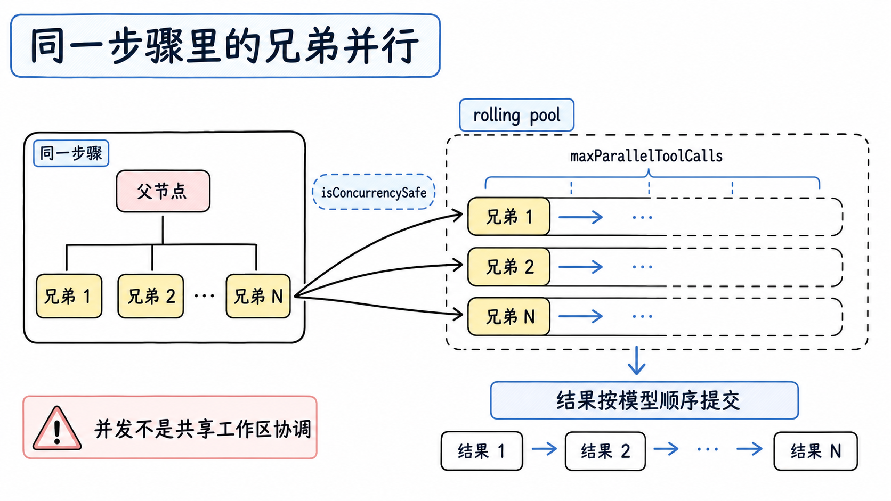

### 并行委派：同一步骤里的兄弟重叠执行

想要扇出的模型会把多个 `subagent` 调用合并进同一条 assistant 消息，这个批次本身就是并行意图。2026-08-09 之前，委派工具没有声明 `isConcurrencySafe`，按安全侧原则设计的调度器把每个前台委派都当独占屏障：GUI 里显示九张卡片，只有一个子 agent 在跑，其余八个排队。改造后的论证很直白：`run_in_background: true` 和可继续委派本来就会与其后的每个调用重叠执行（包括写入），workflow 的 worker 线程也早已通过同一个 `ctx.subagents.start()` 在共享工作区上并发跑子 agent，只有前台形态被串行化，保守立场没有保护任何东西。

现在 `dsh-tool-subagent` 为每种调用形态（前台、一次性后台、可继续）都声明 `isConcurrencySafe: () => true`，同一 assistant 步骤中的兄弟委派在循环的滚动池下重叠执行，上限是 `maxParallelToolCalls`，结果仍按模型顺序提交。结构性依据：子 agent 在自己的会话中工作，运行绝不变更父会话（启动时追加的 `sandbox/mode`、`approval/policy`、`subagent/descriptor` 只落在子自己的日志里）。同级工作区效果的协调是模型的职责，和产品对后台、可继续、工作流子 agent 的立场一致。

容量控制的边界要说清：`maxParallelToolCalls` 限制单个步骤中未结算的工具调用数量，前台子 agent 受它约束；后台和可继续调用在启动时即结算并释放池位，它们留下运行的子 agent 不受这个上限约束。LLM 提供方负责自身的配额。同类 harness 的先例一致：Claude Code 的 Task 工具无条件并发安全（上限 10），Codex 把委派做成异步 spawn/wait 信箱。

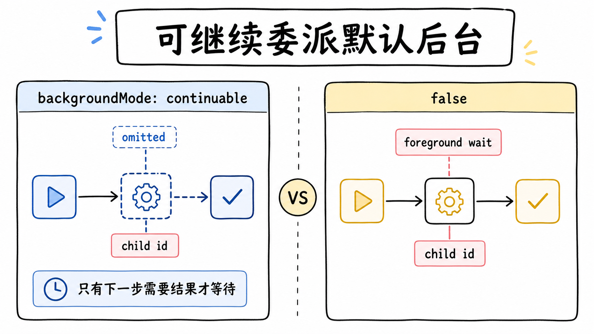

### 后台优先：可继续委派省略参数就是后台

可继续子已经有持久 id、独立轮次、后续消息、结算通知。如果省略的 `run_in_background` 视为前台，模型每次都要写出 `true` 才能得到这套生命周期，还掩盖了真正有用的调度判断：只有父的下一步动作需要子结果时，父才应等待。

2026-08-11 的决策让 `tool-subagent` 按生命周期策略解析省略值。`backgroundMode: continuable` 把省略解析为后台并立即返回持久子 id；显式传 `false` 才选择前台等待。`backgroundMode: one-shot` 保留前台默认，因为它的后台输出仍需通过 Task 收集。`enableRunInBackground: false` 仍会省略该参数、拒绝强制的 `true`。工具描述、参数说明、`tool:<toolName>` 系统提示段三处陈述同一个默认值，模型可以依赖公布的默认值，不必在每次调用里复述它。

随之而来的一次重复是接受的：遵循指令的子会用 `report` 发最终交接，manager 又无条件发结算通知，已完成的运行可能两次投递相互重叠的最终内容。压掉任何一条都会丢东西：压 report 丢子的显式交接，压结算丢"子无法配合时"的运行时保证。

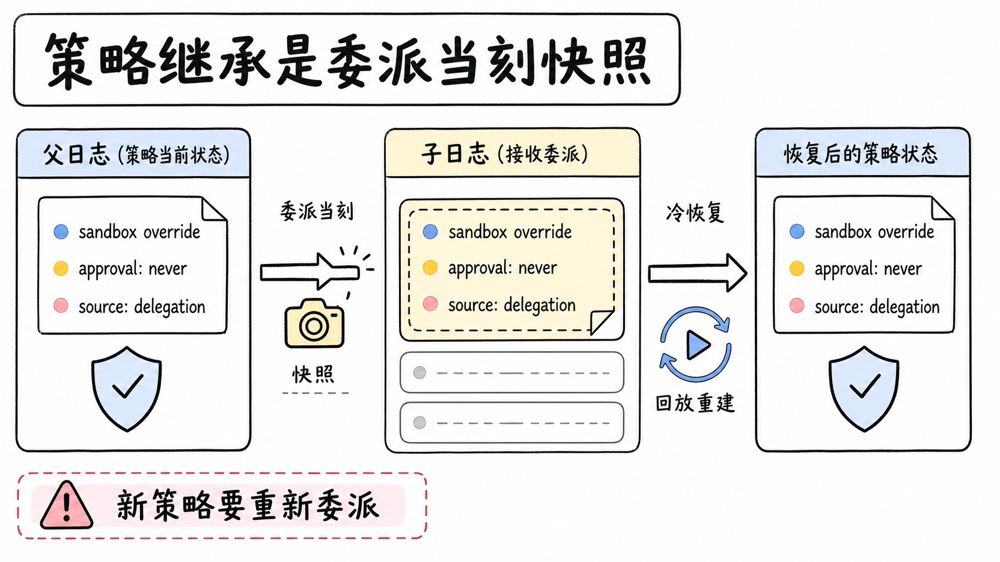

### 策略继承：委派那一刻的快照

2026-08-10 之前有个静默漏洞：一次性进程内驱动器会把父的沙箱、审批覆盖注入子，可继续路径从来没这么做。默认 preset 的委派工具都是 `backgroundMode: continuable`，于是每个后台子 agent 静默回退到部署默认值：切到 `danger-full-access` 的父产出的子卡在 `workspace-write`，每次工作区外操作都触发审批提示；父无人值守的审批立场也退回发起提示的行为。外部 issue（dsh-external/issues#334）记录了这个症状。

修复把捕获、追加这对函数挪进共享模块，两条路径都调用。`startContinuable` 在第一次 await 之前完成捕获：快照父的沙箱覆盖，把子审批策略钉定为 `'never'`（子 agent 的审批 2026-08-10 起永久钉死，理由是子没有和人交互的通道）。快照事件以 `source: 'delegation'` 追加进子自己的日志，排在任何 fork 种子之后。冷恢复不追加任何东西：持久化的子日志已经携带委派事件，回放日志本身就是状态。子 agent 的生效策略由持久化子日志拥有，不是当前 Activation，也不是发起恢复的父；父在驻留纪元之间的切换绝不会追溯性地改变一个持久化子 agent。想要新策略的父应该重新委派。进程外 provider（`acp`、`dsh-sdk`、`claude-code`、`codex`）没有 `prepareContinuable`，跨进程策略传播仍不在范围内。

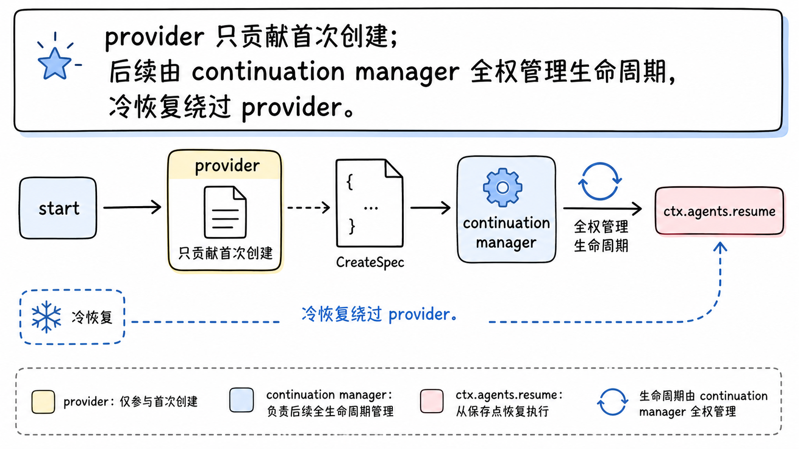

## provider 的边界：只贡献首次创建

六个 provider 最核心的差异是创建子 agent 的方式，尤其是否继承父对话。`inheritsParentContext` 描述的只是对话 seeding，fork 为 true，spawn 和 acp 为 false；它不暗示继承工具、服务或权威。

`spawn-in-process` 在同进程里起全新子 agent，每个子拿一个新的扁平 scope，不继承父的注册，深度为父深度加一。`fork` 同进程，但通过 `CreateAgentOptions.seed` 把父日志的一个平衡的已完成 turn 前缀喂给子会话：seed 从 seq 0 连续、无损 JSON、可被不变量重放接受。进行中的 turn 被排除，因为它里面的子 agent 调用还没有结果，构不成合法的重放历史。`acp` 走 ACP 协议和外部 agent 进程通信，只读 cwd，且仅当没配部署 cwd 覆盖时。`codex` 和 `claude-code` 是产品级 provider，`dsh-sdk` 走 dsh SDK。

provider 只参与首次创建：一次式的 `start`，或可继续的 `prepareContinuable`。后者返回的 `ContinuableCreateSpec` 只带 detached 的创建输入，当前就是可选的父历史 seed。文档的原话是，它是数据，不是能力：不带 Agent、不带句柄、不带投递、不带结果、不带销毁、不带 resume。可继续子 agent 的冷恢复根本不分发给 provider，manager fold 通用的 descriptor，通过 activation-owner 的 scope 调 `ctx.agents.resume()`，提交等待的 turn。

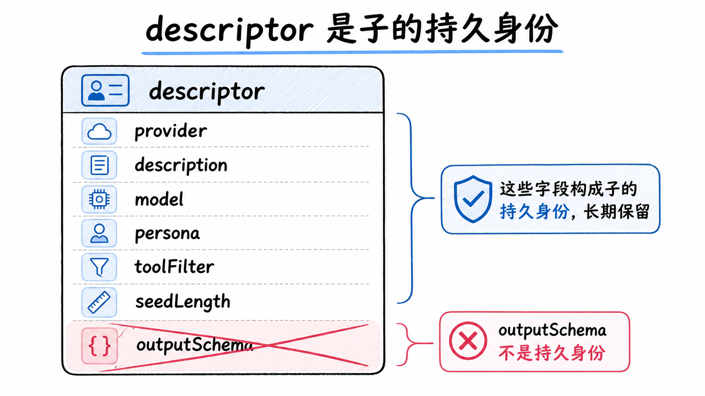

### descriptor：子的持久身份

子 agent 的持久身份是一个 mode 判别的 descriptor。两种 mode 都带 provider 名；一次式可选带 label；可继续要求一段 description，并把 provider、model、可选的 persona 和 toolFilter 快照进去。两个刻意的省略值得单独讲：不带 `subagentDepth`，因为头部的 `delegationDepth` 是单调下限，快照反而给了它降级的机会；不带 `outputSchema`，因为结构化输出是一次式 run 的请求参数，不是持久身份。

descriptor 是纯日志事件，永不进模型历史，压缩也保留它。头部还有一个 `seedLength` 字段标记 fork 谱系边界：这个子从父日志吃了多长的前缀，一查便知。

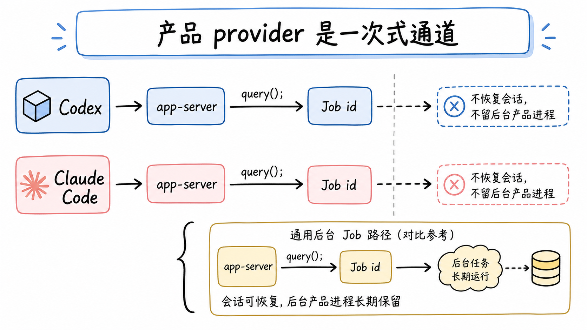

## codex 与 claude-code：产品级的两条路

这两个 provider 给真实产品开官方通道：交出去一个自包含的任务，在父的工作区里干，返回一个答案或明确的失败，不留任何被管理的产品进程在后台。Codex 用 `app-server --stdio`，Claude Code 用 Agent SDK 的 `query()`，版本钉死（写作时 Codex 0.147.0，`@anthropic-ai/claude-agent-sdk` 0.3.220）。能力边界文档写得直白：不恢复会话、不流式进度、不接受新的人工交互、不回滚工具或文件副作用、不施加墙上时钟超时。无人工值守歧义的请求、任何未知的服务器请求，直接让 run 失败，而不是挂着等一个不存在的 UI。原始 stderr 永不进诊断，只有匹配过的有界签名进。

发布形态在 2026 年 8 月经历了三次迭代，现状如下。生产 `dsh` 不安装这两个可选 provider；选择启用产品集成的 Profile 安装对应的包，并在 host plane 挂载实例。标准、code、cordis 三个 preset 里各有一行禁用的工具配置（`tool-subagent-codex`、`tool-subagent-claude-code`，均 `disabled: true`、`backgroundMode: one-shot`），用户复制 preset、删掉那行的 `disabled` 字段，工具才对组装出的 agent 公开；host 里有没有装包和工具公不公开是两件事。2026-08-18 起两个产品各可以有多个命名实例：每个宿主配置项有独立的 `providerName`，每个 preset 工具行通过 `provider` 绑定该名字并保持唯一的 `toolName`，前台或后台调度不限制实例数量。

产品委派现在也支持后台。省略 `run_in_background` 或传 `false` 在前台等待；显式传 `true` 走通用后台 Job：同步完成 Job 预检和登记后返回父拥有的 Job id，不等产品启动，之后经 `job_output`、`job_list`、`job_kill` 和完成通知收集或取消。这条路径不新增产品专属的 id、状态或取消语义，全部复用通用作业运行时。后台 Job 仅存在于当前进程且由父拥有：父销毁后 Job 清理会取消 run，产品中间活动不公开，产品对话不可恢复。产品提供方的权限失败先进入同一个共享结果结构，再由前台或后台任一路径消费（2026-08-15 的非交互权限决策、2026-08-18 的失败事实决策负责细节）。

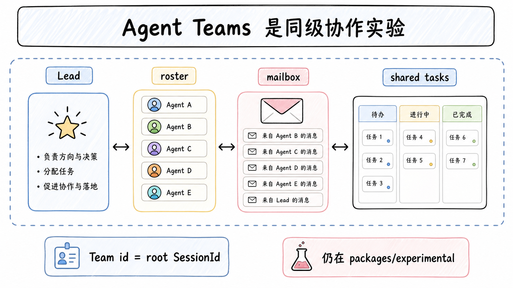

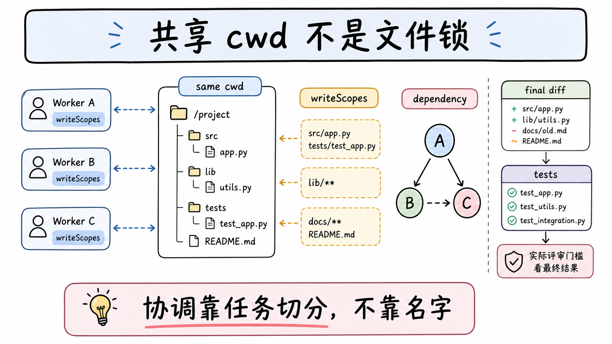

## Agent Teams：实验中的同级协作

上面的一切都是父对子的树状委派。worker 互相无法寻址、没有稳定具名 roster、没有共享任务板，是这条线的已知缺口。2026-08-05 合入、截至 2026-08 仍在 `packages/experimental/` 孵化的 Agent Teams 补这一层：每个普通运行时根 agent 都是一个隐式 Team 的 Lead，Team id 就等于根的 `SessionId`，没有 creation event。roster 是扁平的，名字不可变、小写 kebab-case；每个 teammate 都是用预留 Session id 的可继续直接子。只有 Lead 可以创建或中断 teammate。

三块持久状态全在 Lead 的会话日志里。mailbox 先存完整的排队消息（`team/message/queued`），目标把消息记进自己的 inbox 或用户消息历史后，Lead 日志才写投递回执（`team/message/delivered`），排队减已投递构成恢复邮箱；目标侧用 `TeamMessageSource` 做跨 inbox 与历史的去重键。共享任务是带 Team 内单调 id 和 revision 的完整快照，每次变更带 `expectedRevision` 做 compare-and-set，依赖指向未删除任务并维持无环图；任意成员可创建、读取、认领就绪且无主的 task，Owner 或 Lead 可编辑转换，只有 Lead 能把 task 分配给别人。`writeScopes` 是规范化的路径前缀，只产生重叠诊断，不是锁，不阻止认领也不授予写权限。

模型侧的工具集是 `spawn_teammate`、`send_message`、`team_task_create/get/list/update`、`wait_agent`、`interrupt_agent`、`list_agents`，每个都声明完整的结果 schema 并紧凑渲染 JSON。`wait_agent` 等待注册之后发生的下一条 roster、mailbox、task 或实时状态边，避免轮询；它不回放更早的边，唤醒或超时后要重新读权威状态。Team 工具保持显式启用，默认工具目录不变，因为 scoped 的 Team 控制会覆盖同名旧全局工具，主动委派也会给简单任务加延迟和 token 成本。

共享 checkout 的立场很坦率：所有 member 用相同 cwd，写入立即互相可见。文件系统 edit 工具可以拒绝已观察到的陈旧版本，但 Bash、formatter、generator 和外部 writer 会绕过这道屏障；把 teammate 名字或 task owner 当文件锁只会掩盖并发边界。策略要求成员切分任务、记录提示性 write scope、为有序工作加依赖，Lead 检查最终 diff 和跑测试。worktree 隔离不是 harness 运行时行为，部署或提示词可以安排独立 worktree，但 Team 领域不推断 branch、merge，不静默改变 cwd。

实验性状态有机械强制，不只是文档标记：dsh 的 pack 与 publish 集合排除 `packages/experimental/` 下所有 manifest，这些包 `private: true`，发布包、app、Python runtime 通过 dependencies 依赖它们会被顶层检查拒绝。要试 Team 得用显式示例或实验性组合，已发布的基础组合不暴露它。这是"先在真实仓库条件下孵化、再谈稳定义务"的路线，promotion 前要过公开约定、测试证据、具名 owner 的评审。

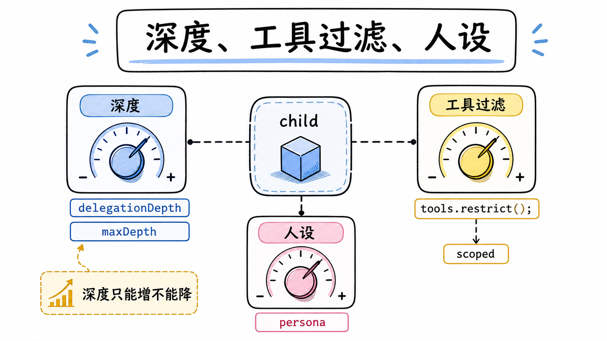

## 深度、工具过滤、人设

委派深度复用持久词汇：`SessionHeader.delegationDepth` 加可合并扩展的运行时字段 `AgentOptions.subagentDepth`，缺省表示顶层深度零，较大的存在值权威。进程内子持久化父深度加一，冷恢复不能降低它，start 拒绝落在安全整数域外或超过 `maxDepth` cap 的派生深度（产品行的 cap 是 `provider-managed`）。深度只能增不能降，防的是子 agent 把自己降回顶层绕过递归限制。in-process 后端强制深度和工具过滤；ACP 两个能力都广告为关，直接拒这类请求。

工具过滤在创建窗口里做 scoped `tools.restrict()`：被过滤的工具从子的提示里消失、也拒绝执行，一次可见性，两处同步。未知的工具名大声校验失败，不静默忽略。人设注册为 scoped 的 `deployment:persona` 段，只为这个子遮蔽部署的人设，插值用严格的 `{{…}}` 语法。子 agent 看到的世界和它的父刻意不同，这三样就是刻度的旋钮。

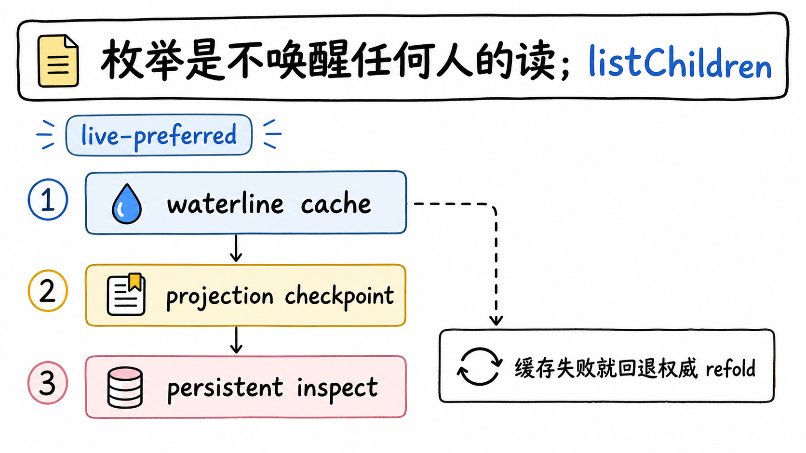

## 枚举：不唤醒任何人的读

`listChildren(parentSessionId)` 合并 live 会话存储和可选的持久化（live-preferred），候选项是持久头部带 `origin: 'subagent'` 的直接子。纯读：不加载也不 resume 任何 Agent，不用 query service。这个 origin 标记只做枚举分类和粗粒度的通用路由拒绝，不能建立有效的 descriptor。

每个子的 mode 和 label 来自注册的 `subagent` 投影单元，走三级阶梯：注册表的水位缓存（活子，零日志读）、可选的投影检查点缓存（冷子，own-suffix seq 闸门证明值晚于 fork seed）、否则一次持久化 inspect 经注册表 fold。缓存是纯加速器，缺失或失败静默退回权威的 refold。结果按 createdAt 再按 id 排序，三种条目：`child`（mode 加活动状态）、`corrupt`（已结算、无可服务身份）、`unavailable`（冷检视失败，下次列再试）。`listDescendants` 加上 `parentId` 和 `depth`，稳定前序遍历，`interrupt_agent` 的发现用的就是它。

## 崩溃恢复与销毁

崩溃之后只有落了日志的消息活下来。inbox 接受本身不提供重启保证，接受了但没进日志的消息不会被重放；一条之后被授权的 follow-up 仍然能从持久 Session 冷恢复这个子，把对话续上。孤儿 Activation 被结构性预防：父在拥有的子集合非空时不能 settle 或销毁，归属图的边把逃跑路线全堵住了。

把一次崩溃按时间排开。父 agent 起了一个可继续子，子跑完第一轮 turn，静默，进入 waiting（它自己还有个孙在跑）。此刻进程被 kill。重启后：子的 Session 还在，descriptor、对话、深度、委派时的策略快照都在日志里；Activation 没了，它本来就只在进程里。孙的 Activation 同样没了，父的 waiting 状态随之失效，因为那本来就是从活的后代集合推导出来的。用户回来对着子发一条 follow-up：没有活 Activation，路由到冷恢复，manager fold descriptor、经 activation-owner scope 调 `ctx.agents.resume()`、提交等待的 turn，一个新的 Activation 驻留开始。对话从日志停下的地方继续，策略还是委派时快照的那份，唯一真正丢掉的是崩溃前接受了但还没落日志的那条消息，而这条丢失是有界的、可重发的。

销毁走 drain。manager 卸载跑一个全 manager 的 drain，关准入、销毁每棵活森林；`drainContinuableDescendants` 限定到确切的活父；`drainContinuableChildren` 释放选定的直接子，父不对或身份过期就 `UNAUTHORIZED`。释放句柄一律子优先，并 await 每个选中的分支，个别失败不中断整体。持久 Session 活过拆除。结算 flush 会等 `ctx.sessions.flush(session)` 但忽略它的参与布尔，理由很硬：留着一个子会把它的祖先永久钉在 waiting 里。flush 被拒记日志，不让 Activation 失败。

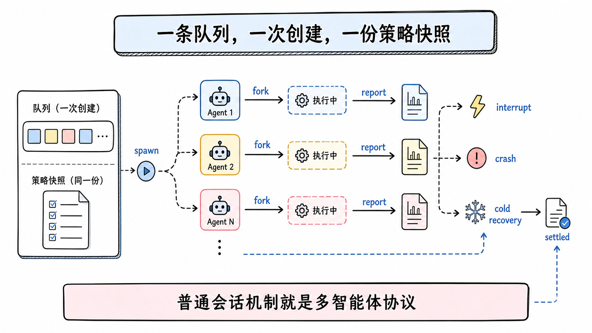

## 一个多轮协作的完整样本

把新默认放进一个真实工作流。父 agent 在重构一个模块，一条 assistant 消息里同时发起两个委派：`subagent`（spawn，可继续）做依赖分析，`subagent_fork`（fork，可继续，带父前六个 turn 的 seed）接着父的思路深挖某个设计点。两个调用并发安全，滚动池里重叠执行。省略 `run_in_background`，两行都配置了 `backgroundMode: continuable`，父立即拿到两个持久子 id，继续干自己的活。

fork 子干完，`reportFrom` 用默认的 `next-step` 把结论 steer 给父，父在最近的 step 边界收到一条 `subagent-report`。父用 `send_message` 追问一个细节，子的 Activation 在 running，followup 直接入同一个队列，第二轮 turn 开跑。中间父发现 spawn 子方向不对，调 `interrupt_agent`，授权走 `ancestor`：`Agent.cancel` 带着 `keepInbox: true` 发出去，正在跑的 turn 被打断，排队着的追问原封不动，子空闲后 FIFO 恢复。两个子先后 settle，manager 各发一条 `subagent-settled` 通知，带 epoch 的结束描述和子最后的 assistant 内容。父的 transcript 里，子自己发的 report 和 manager 代发的 settled 是两种来源，谁说的话记在谁头上。

整个过程：一条队列、一个授权对象、一次创建时的 provider 参与、一次委派时的策略快照，其余全部是标准会话机制在跑。

## 权衡

成本主要压在可继续那一半。Activation 驻留、冷恢复、归属图、子优先销毁，这套机制比一次式 run 重得多；要的只是简单委派拿结果，一次式 spawn 就够。provider 在首次创建之后被隔离在外，没法在子的后续 turn 里插手，这是生命周期集中到 manager 换来的代价。授权只认活的直接父，安全，但祖父得通过父中转（interrupt 是唯一放宽到祖先级的操作）。深度只能增不能降，防绕过，代价是一个设得太高的子没法事后收紧。

新默认各自带刺。并行委派把同级工作区效果的协调责任压给模型，并发子还会争用提供方配额，`maxParallelToolCalls` 管不到后台和可继续调用留下的运行中子 agent。后台优先让省略参数的可继续调用立即返回，父如果忘了显式传 `false`，就得靠结算通知才知道子的结果。report 加无条件结算意味着已完成的运行可能两次投递相互重叠的最终内容，token 上是净支出。策略继承钉死子审批为 never，子遇到需要人批准的操作没有升级通道，直接失败回父。

产品 provider 把工作交给不受 dsh 控制的产品，能力描述基于 dsh 侧的契约，外部实际行为以产品为准；每次委派都付一个新鲜产品进程加独立模型上下文的成本；版本钉死意味着产品或端点基线一变就要重新验证。Agent Teams 整体还是实验包：不在发布闭包里，约定还在变，Lead 日志随完整快照和 mailbox 回执增长，active roster member 可以不驻留（inactive 不是失败，wakeup 有冷恢复延迟），发往 inactive 目标的 quiet 消息可能无限等待。

回报是同一个接缝覆盖了完整的委派谱系。同进程一次式、继承父历史的 fork、跨协议的 ACP、跨产品的 codex 和 claude-code、dsh SDK，全部用同一套请求、结果、授权、枚举词汇。可继续那一半虽然重，但多轮对话、冷恢复、上报全落在标准机制上：队列就是 Agent inbox，恢复就是 `ctx.agents.resume()`，消息就是普通的 user message。设计一个和普通会话行为一致的子 agent，比设计一套特殊的多智能体协议便宜，也好懂得多。

选型上可以给几条直接的判断。并行拆解一批互相独立的小任务，spawn 一次式或省略参数的可继续委派都合算。子必须理解父已经聊过的上下文（接着父的分析继续深挖），fork 是唯一选择，代价是父历史在子的上下文里再付一遍 token。需要进程级隔离、或对面本来就是一个独立的 agent 进程，走 ACP。任务的专长恰好落在某个产品的能力圈里，用对应的产品级 provider，接受它的边界：每次一个新鲜进程、没人机交互、不能续会话。需要多个 worker 互相通信、共享一块任务板，Team 是方向，但截至 2026-08 它在实验包里，生产部署要自己权衡。判断的主轴就一条：需要的是结果、是上下文、是隔离、是产品能力，还是对等协作；五种需要分别指向不同的形态，混着需要时拆成多次委派比找一个全能后端更可靠。

## 结论

`ctx.subagents` 是多 provider 共存的命名注册表，委派分一次式和可继续两类。一次式轻：一个 run、一个结果、失败 resolve 不 reject、dispose 幂等。可继续重：持久 Session 定身份，进程内 Activation 定驻留，状态从静默和子集合推导而非存储；委派时快照父的策略、审批钉死 never，省略的后台参数立即返回子 id，兄弟委派在同一步骤里并行重叠。可继续那一半的三条硬规矩仍是全文的落点：Agent inbox 唯一队列，对话顺序有唯一权威；授权认活的直接父对象，伪造消息字段拿不到权；provider 只贡献首次创建的数据，整个生命周期归 manager，冷恢复绕过一切 provider。report 是子的显式交接，settled 是 manager 的无条件终止记录，两条通道并行。委派谱系从进程内一路铺到外部产品，Team 再往对等协作延伸一步，词汇始终是同一套。

## 延伸阅读

- [Subagent 子系统文档](https://github.com/deepseek-ai/deepseek-harness/blob/master/docs/subsystems/subagent.md)：一次式与可继续的全部契约
- [Agent Teams 子系统文档](https://github.com/deepseek-ai/deepseek-harness/blob/master/docs/subsystems/agent-team.md)：实验性 Team 领域的类型目录
- [并行 subagent 委派笔记](https://github.com/deepseek-ai/deepseek-harness/blob/master/.agents/notes/implemented/feature/2026-08-09-parallel-subagent-delegations.md)：isConcurrencySafe 声明的论证与容量边界
- [可继续委派后台优先笔记](https://github.com/deepseek-ai/deepseek-harness/blob/master/.agents/notes/implemented/feature/2026-08-11-background-first-continuable-delegation.md)：backgroundMode 的默认值解析
- [结算投递归管理器笔记](https://github.com/deepseek-ai/deepseek-harness/blob/master/.agents/notes/implemented/feature/2026-08-06-manager-owned-subagent-settlement-delivery.md)：无条件结算通知与两次真实的结局误报 bug

上一篇：[dsh 的 Plan Mode 与 Goal：一段软引导与一个事件溯源的生命周期](./29-plan-mode-and-goal.md)
下一篇：[dsh 的 web-schedule：会话内的定时、提醒与自动化](./31-web-schedule-timer-automation.md)
