# dsh 的 MCP 客户端与记忆服务器接入手册：通用协议在 harness 里的位置

> dsh 对 MCP 的做法不是内置一批服务器，而是写一个通用桥接插件 `@deepseek-ai/dsh-mcp-client`：一个插件实例接一个外部服务器，把对方的工具发现出来、注册到自己的工具注册表上，模型看到的就是原生工具，命名形状和 Claude Code、Codex 完全一致。接入一个新的 MCP 服务器只要一段配置，不用改一行 harness 代码。
> 工程上花力气的地方在可靠性：工具注册走两阶段代际切换，要么全套要么零个；崩溃重连走有预算的指数退避（2026-08 才合入，v1 明确推迟过这块），持续崩溃循环的服务器会被停下而不是无限重启；外部数据按信任边界防御性解析，stdio 子进程的环境变量先清洗再传递。这篇拆桥接本身，再用 mcp-memory 示例演示同一套机制怎么接三个第三方记忆服务器，截至 2026-08 的代码状态。

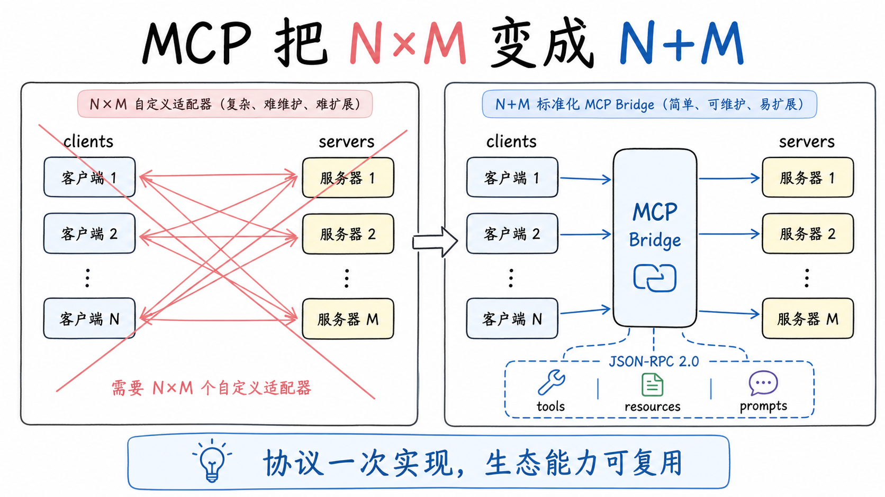

## MCP 解决了什么问题

先把背景立起来，后面的设计判断才有基准。

MCP（Model Context Protocol）是 Anthropic 在 2024 年 11 月开源的协议，目标是把"AI 应用如何连接外部数据源和工具"标准化，截至 2026-08 的权威版本是 2026-07-28 的规范。形态是 JSON-RPC 2.0 消息，两端叫客户端和服务器：客户端是 agent 这边的 harness，服务器是暴露能力的一方。连接建立时先走一次初始化握手，双方交换各自的能力声明；之后服务器暴露三类能力：tools（可调用的工具）、resources（可读取的数据）、prompts（提示模板）。工具列表不是静态的，服务器可以在运行中通知客户端"工具变了"，客户端重新拉取，翻页用游标。

这个协议的价值在算术里。没有标准化时，N 个客户端接 M 个数据源，每个客户端给每个数据源写一套适配，工作量是 N 乘以 M；有了协议，客户端写一次协议实现，服务器写一次协议实现，工作量变成 N 加 M。社区已经沿着这条路堆出了大量现成服务器：GitHub、文件系统、数据库、Slack、记忆系统。一个 harness 支持 MCP，等于拿到了这个生态的入场券，别人写的每个服务器都是你的候选能力。

dsh 支持 MCP，但支持的方式里有一个值得细看的判断：它把协议当生态接口，不当功能清单。

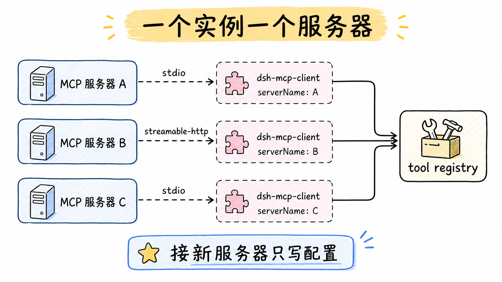

## 桥接插件：一个实例一个服务器

很多 agent 客户端的做法是内置几个常用 MCP 服务器，或者给一个配置面板让你逐个填。dsh 的做法是写一个通用的桥接插件，插件本身不实现任何具体功能，职责只有三件事：连接一个外部 MCP 服务器、发现那个服务器的工具、把工具注册到自己的工具注册表上。

一个插件实例对应一个服务器。要接三个服务器，就在配置里挂三个实例。MCP 集成本身也是一个可挂载、可卸载的插件，不是焊死在内核里的特性，这和 harness 的一贯哲学一致。

配置挂在 `cordis.yml` 里，字段分两套。公共字段里最重要的是 `serverName`：工具的命名空间，只能用字母数字下划线连字符，长度一到三十二，且必须在活着的实例间唯一，重名时后来者在加载时就失败。这个字段一旦定了就不要改，因为模型看到的工具名全部由它派生。另有两个公共开关：每次工具调用的超时 `toolCallTimeoutMs`，默认 60000 毫秒；启动失败是否算致命 `failOnStartupError`，默认不算。

传输二选一。`stdio` 走本地子进程，配 `command`、`args`、`env`、`cwd`，适合本地工具；`streamable-http` 走远程服务，配 `url` 和 `headers`，适合团队共享或托管的部署。以接 GitHub 官方服务器为例，配一个 `id` 为 `mcp-github` 的实例，`serverName` 给 `github`，传输选 stdio，命令用 `npx` 拉起官方包，token 从环境变量读进来传给子进程。整段配置十行以内，结构上和接任何别的服务器没有区别。

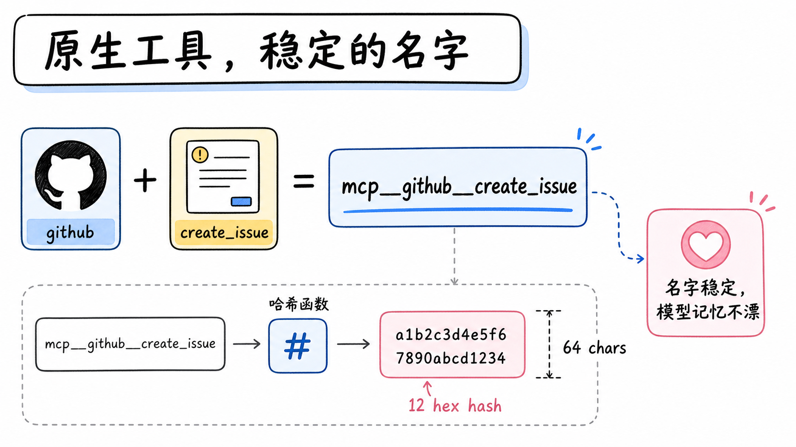

## 模型看到的东西：原生工具，稳定的名字

桥接发现服务器的工具后，给每个工具生成模型可见的公开名称，形状是 `mcp__服务器名__原始名`。github 服务器暴露一个 `create_issue`，模型看到的就是 `mcp__github__create_issue`。这个形状和 Claude Code、Codex 用的完全一样，是刻意的兼容：从那边迁移过来的用户，模型的工具名不变，行为不因为换 harness 而乱。

名字的纪律比看起来严。原始名只在线上传输时用，调工具时发给服务器的是它；公开名永远不给服务器看。公开名要符合函数名契约：最长六十四个字符，字符集限定字母数字下划线连字符。原始名里带了非法字符、或者拼接后超长时，插件在名称后面追加一个十二位的十六进制哈希，哈希由服务器名和原始名确定性算出，保证两个不同的工具永远不会因为名称归一化塌缩成同一个名字。

把这几条合起来是一个很强的性质：公开名是服务器名加原始名的确定性纯函数。连接顺序不影响它，重新同步不影响它，其他服务器在不在线不影响它，热重载之后同一个服务器名算出同一批名字。名字稳定带来两个红利：模型的记忆和你的文档不会漂；provider 侧的提示词缓存前缀也稳定，一次重连如果恢复了未变的工具列表，重新生成的定义和上一代完全相同，KV cache 前缀复用不失效，工具 schema 不因为子进程崩溃抖两个来回。

冲突的处理也分层次。两个服务器各有同名工具，靠命名空间天然共存，互不相扰；一个服务器把同一个名字列了两遍，这是它自己的错误，整份列表作为无效列表被拒绝；有别的注册抢占了这个服务器的命名空间，整个换代回滚，一个工具都不上。宁可全无，不做半套的立场在这里第一次出现，下一节是它的完整形态。

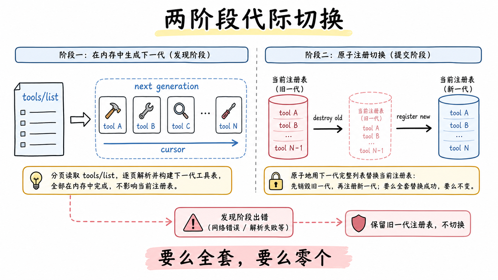

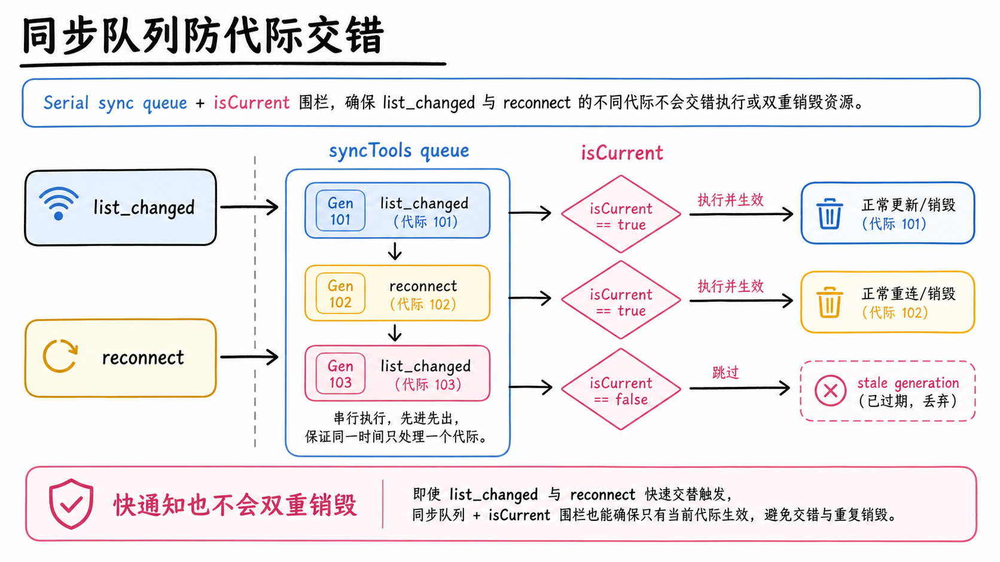

## 注册：两阶段代际切换

工具注册不是发现一个挂一个。外部进程的工具列表随时会变，协议里就有"工具列表变了"的运行时通知，如果注册过程不原子，模型可能在集合切换的瞬间看到半新半旧的状态。

dsh 的做法是两阶段换代。第一阶段只拉取：调协议的 `tools/list` 接口，用游标翻完所有页，在内存里构建下一代的完整工具定义集合，全程不碰注册表。这个阶段任何一步出错，网络断了、服务器列出重名工具，直接中止，上一代的注册原封不动，模型继续用旧集合。第二阶段才交换：先把上一代的注册全部销毁，再逐个注册新的一代；注册途中发现冲突，把这一代已注册的部分全部回滚，这个服务器的工具归零。

换代内部还有一层防交错的机制，2026-08-06 的重连改造把它做扎实了。每个监督器内部有一条队列把所有 `syncTools` 调用串行化：初始同步、`list_changed` 触发的再同步、重连后的重新发现，全部排队执行；每代有一个 `isCurrent` 栅栏，过时的代变惰性。没有这层队列，两次快速的 `list_changed` 通知会同时触发重新同步，对同一代执行两次销毁、泄漏另一代。严格启动注册由激活尝试自己显式拥有，不归首个入队者：连接建立前提前到达的 `list_changed` 走故障隔离的再同步语义，不能消费 `failOnStartupError` 这个致命开关。

结果是一个硬承诺：模型要么看到一个服务器全部工具的完整集合，要么一个都看不到，永远不出现半套。半套比零套危险得多：零套时模型知道这个服务器没接上，会换路走；半套时模型以为看到了全部，拿着缺角的工具表做计划，错得悄无声息。

启动和销毁走同一套语义。激活时会等工具发现完成、赶在组合的第一个 turn 之前把工具挂上；启动失败默认记日志、以零工具状态激活，除非配置里把启动失败设为致命。反过来看这也是个诚实的降级：服务器连不上，harness 不装死也不崩，模型知道没有这些工具，任务照常进行。

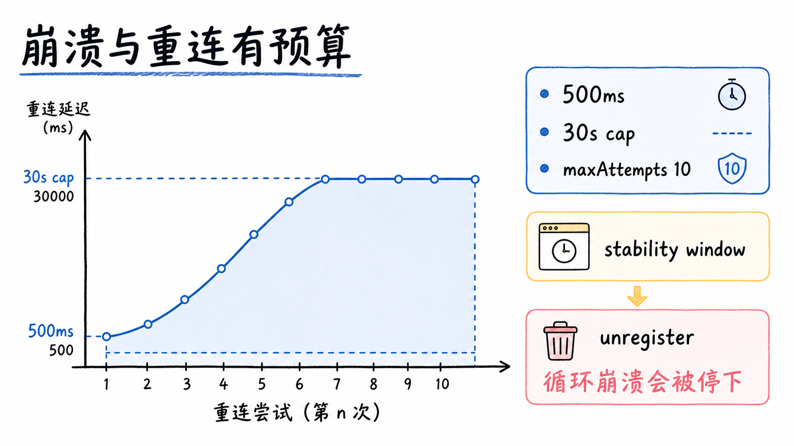

## 崩溃与重连：有预算的退避

外部服务器会崩，stdio 子进程会挂，HTTP 服务会断。这块值得整节讲，因为它在 2026 年 8 月之前是这块拼图里明确缺席的一角。

v1 的桥接只在插件加载时连接一次。stdio 服务器崩溃后，已注册的工具仍然可见，但每次调用都以 `Not connected` 失败，恢复靠人工改配置触发热重载或重启 host。2026-08-06 的决策笔记记录了升级原因：外部反馈（issue #1746）指出长时间运行的 host（ACP 自动化、Web）不能因为一个子进程死了就重启，而 stdio 传输下 harness 组合层是唯一能重新拉起子进程的一方。

现在的重连是一个逐实例的连接监督器。触发规则按传输分开：stdio 的子进程退出触发 `client.onclose` 回调，崩溃无需轮询即可感知，监督器负责把它拉起来；HTTP 传输只在主动关闭时触发 `onclose`，它内部有自己的 SSE 流恢复机制，请求失败按逐调用方式暴露，所以 HTTP 服务器实际不在监督器的重启范围内，一个不可达的 HTTP 服务器表现为每次调用失败，而不是进程层面的反复拉起。

重连的节奏是指数退避：首次尝试等 500 毫秒，每次失败翻倍，封顶 30 秒，默认配置下对一次故障大约重试 2.5 分钟后放弃。断线期间，上一次成功的工具注册保持挂载，调用会失败但不消失；重连成功后重新走发现流程，新一代工具替换旧一代，不重复也不泄漏。

预算是防崩溃循环的关键。一次故障期间共享 `maxAttempts` 次连续失败尝试的预算，默认十次，超过就放弃，注销这个服务器的全部工具，以 error 级别记日志，直到热重载或重启。预算的重置规则经过了认真的推敲：连接存活超过稳定窗口（取 `maxDelayMs`，默认 30 秒，从最长退避间隔推导而不是第五个独立调参项）就清零。决策笔记否决了"每次成功连接即重置"的方案，理由是一个连接短暂成功后立即再崩的循环服务器会在每个周期洗白预算，变成永远重启的风暴，恰恰是失败上限要防的东西。基于运行时间的重置能区分已恢复的服务器和循环崩溃的服务器，不新增配置。

代与代之间完全隔离。每次尝试构建全新的 transport 和 `Client`，因为 SDK 把一个 Protocol 绑定到一个 transport 上终身使用，复用会把通知处理器和已协商的能力状态带进新的服务器实例。失败尝试在旧 transport 报告 `onclose` 之后才进入退避，对 stdio 来说这个信号证明子进程真的退出了；若关闭信号迟迟不来，在 SDK 的有界终止窗口结束后停止重连，不允许两个服务器进程重叠运行。失败信号按代幂等：一次连接拒绝和它自己的 transport 关闭竞态时，恰好调度一次重试。重连定时器用 unref，等待中的退避不阻止进程正常退出。dispose 翻转栅栏、取消待执行的定时器、关闭当前 client，等进行中的尝试和同步队列完成后才注销工具，完全停稳而不是发个停止请求就走。

拿两类真实服务器给这个分类器过一遍。第一类，内存里有个偶发 bug 的本地服务器，平均五分钟崩一次。每次崩溃触发退避重连，半秒、一秒、两秒，通常第二三次就连上；每次连接都轻松活过三十秒，预算清零。一整天下来它崩了几十次，也恢复了几十次，用户最多在日志里看到一串 warn。第二类，启动即崩的服务器，依赖缺失，进程起来两秒就死。重连的间隔从半秒爬到三十秒，连接从没活过三十秒，预算只耗不补，第十次尝试后彻底放弃，工具注销，一条 error 日志收尾。两类服务器的处置完全不同，前者是该被容忍的正常波动，后者是需要人介入的配置错误，预算机制就是那条分界线。

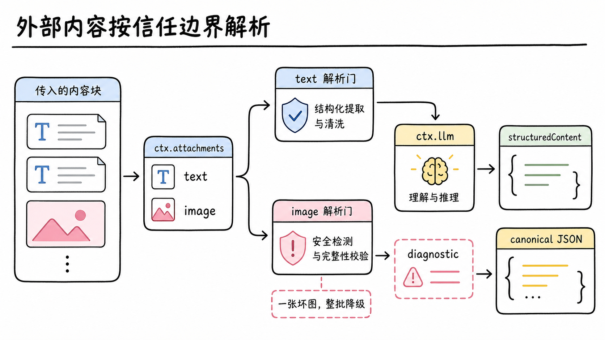

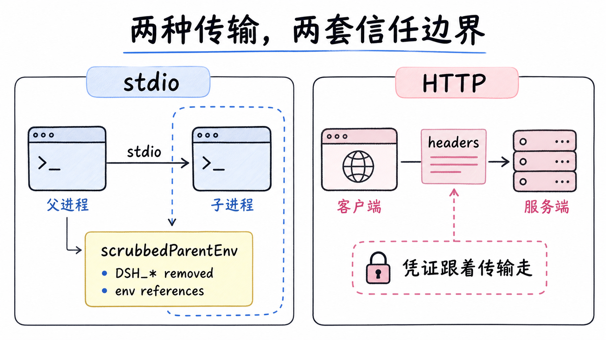

## 信任边界：防御性解析与环境清洗

MCP 服务器的返回数据来自另一个信任域，子进程也一样，桥接在解析时按防御姿态处理。协议的内容块有好几种类型，处理按类型分流。

文本类的块按原始顺序用换行拼接成一段文本进模型上下文；resource 链接保留名字和 URI 作为文本。图片是唯一可能进入原生多模态上下文的富媒体，而且门槛是双重的：附件服务已挂载（`ctx.attachments`），且当前这次调用的模型路由显式声明支持图片输入（`ctx.llm` 证明），两个条件同时成立，整批图片才先解码验证、再持久化为图片块。整批一起判定是有意的：一批图里有一张坏的，整批降级为诊断文本，不存在"好的进来了坏的不见了"的中间态。audio、内嵌 resource、不认识的块，同样变成明确的诊断文本，不悄悄消失。服务器的错误标记（`isError`）会在图片持久化之前就把调用打成失败，错误路径不产生半成品副作用。

完整的 JSON 块和结构化内容保留在执行局部的规范值里，给编程化调用方和 Code Mode 消费；服务器声明了受支持的 `outputSchema` 时还会校验 `structuredContent`。内联的 base64 二进制永远不进会话事件，provider 读到的是附件存储里验证过的字节。

另一条信任边界在环境变量。stdio 方式启动子进程时，桥接用 `scrubbedParentEnv()`（定义在 dsh-subprocess，MCP SDK 自己拥有 spawn 路径，所以这里共享的是清洗定义而不是 spawn 路径）：名字看起来像凭证的变量、所有 `DSH_*` 前缀的变量，全部移除，再把配置里 `env` 字段指定的变量加回去。这条规则防的是泄漏：agent 自己的内部凭证，比如 API key，通过环境变量流进第三方服务器进程，是典型的静默事故。配套的纪律是敏感值写进配置的 `env` 字段而不是 YAML 明文，配置只存引用。

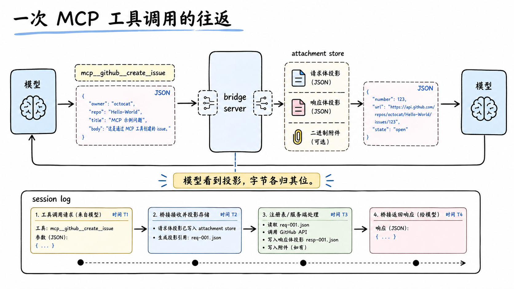

## 一次工具调用的往返

把模型发起一次 MCP 工具调用的全程串一遍，上面散落的规则会在一条链路上各就各位。

模型在某个 turn 里决定调 `mcp__github__create_issue`，参数是一份 JSON。工具注册表收到调用，按名字路由到桥接插件这个注册方。桥接把公开名换回原始名 `create_issue`，拼上参数，通过传输层发给服务器：stdio 场景是往子进程的标准输入写 JSON-RPC 请求，HTTP 场景是发一次远程调用。这次调用带六十秒的默认超时和取消信号，超时算失败。

服务器返回若干内容块。桥接按类型分流：文本块按序拼成一段；如果这批里有图片，先检查附件服务和模型路由的图片能力，双条件成立才解码、验证、持久化，任何一环不过，整批降级为诊断文本；服务器若标了错误位，调用直接打成失败，图片一张都不落盘。规范值里保留完整的 JSON 块给编程化调用方，模型上下文里放的是面向对话的投影。

最后，工具结果回到模型，整个交互作为事件写进会话日志。注意二进制的去向：它从头到尾没进过会话事件，provider 后续读到的是附件存储里验证过的字节。这条链路上每个环节都在兑现同一个原则：模型看到的是投影，规范值和字节各有各的存放处，三者之间不混流。

断线状态下的往返是另一个样子。服务器死了，注册还在，模型照样能看到工具、照样发起调用，调用在传输层失败，模型收到失败结果。这个设计的用意是让模型保有知情权：工具存在但暂时不可用，模型可以选择等一等再试，或者换路走。决策笔记专门论证过断线时立即注销工具的方案为什么被否：短暂故障会让模型可见工具列表抖动，每次崩溃触发两次 schema 前缀失效，而失败的调用已经足以标示故障，没有任何信息增益。工具只在最终失败（预算耗尽）时注销，确保永久死亡的服务器不会泄漏永久失效的工具。

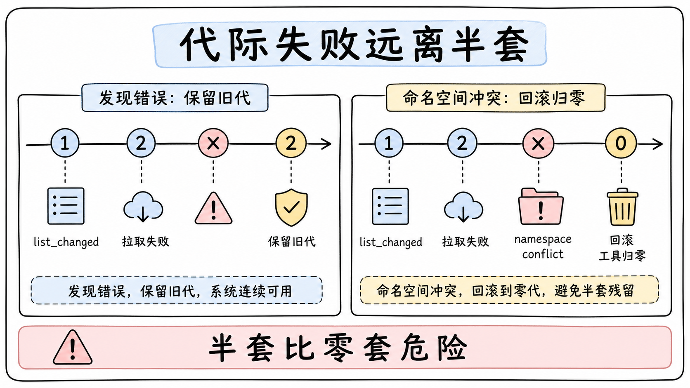

## 代际切换的两条时间线

空讲两阶段容易滑过去，放两条具体时间线。

第一条看运行中的工具列表变更。某台服务器上午十点新增了一个工具，发了列表变更通知。桥接把一次再同步排进队列：第一阶段拉取全量列表，此刻网络抖了一下，拉取失败。旧的注册原封不动，模型继续用旧集合，日志里记一次同步失败。下次重试成功，进入第二阶段：旧代销毁，新代注册，新工具出现。模型视角里，工具集合从旧版本原子地跳到新版本，任何时刻看到的都是一个完整版本。

第二条看命名空间被抢占。假设有别的插件恶意或无意地在工具注册表上注册了一个落在 `mcp__github__` 前缀里的名字。桥接换到第二阶段，注册第一个工具就撞上冲突，整个换代回滚，这个服务器的工具清零，错误日志示人。模型随即知道 github 工具没了，不会拿着半套工具表继续规划。两种失败，一种保旧，一种归零，方向都是远离半套。

顺带把启动语义放进时间线。实例激活时，桥接先等发现完成、再赶在第一个 turn 之前注册，保证模型从第一个 turn 起看到的就是完整集合。启动失败默认不致命：记日志，以零工具状态激活。想反过来，让连不上服务器直接导致插件加载失败，把启动失败开关打开就行，这条留给对完整性要求高的部署。

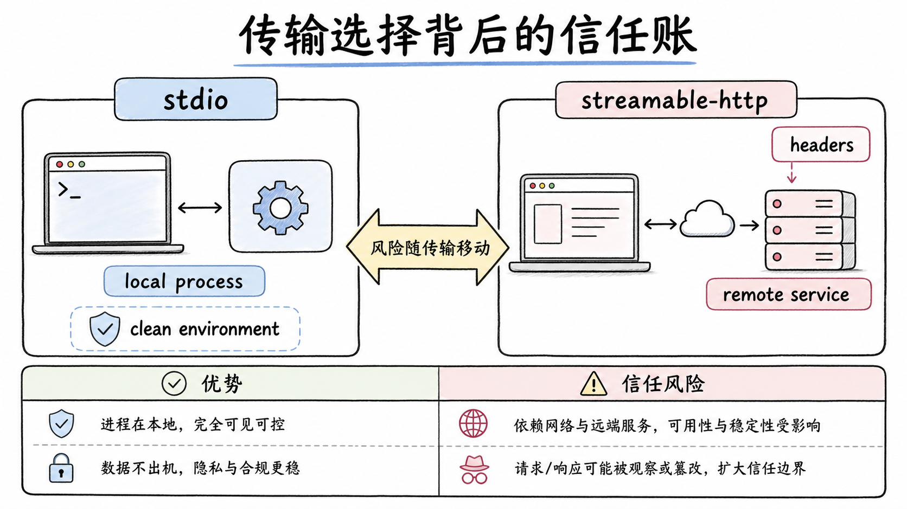

## 传输选择背后的信任账

stdio 和 HTTP 不只是两种连接方式，它们把信任边界放在了不同的位置，选传输时算的其实是一笔信任账。

stdio 把服务器当成你机器上的一个子进程。它读得到你清洗后的环境、看得到你给它的文件系统权限，好处是数据不出机器、延迟是进程间通信级别，坏处是服务器代码在本机执行，供应链的账要自己把关，所以版本要钉死、环境要清洗。HTTP 把服务器放在远端。本机不执行外部代码，但你要把认证头交给远端，数据要出网，团队共享的服务还得有人管它的存活。凭证放哪、谁能看到什么，跟着传输走。

这也解释了环境清洗为什么只针对 stdio：HTTP 场景下根本没有子进程环境这回事，要防的是请求头里的凭证范围，那是 headers 字段自己的事。两套风险两套对策，桥接没有用一个开关混着管。

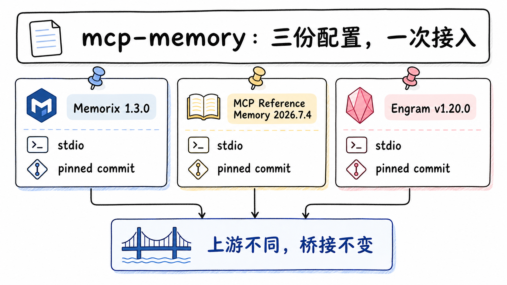

## mcp-memory：三份配置，一次接入

`examples/mcp-memory/` 不是内置功能，是三份默认关闭的参考配置，演示同一个桥接怎么接三个第三方记忆系统（2026-07-31 的第三方记忆示例决策笔记负责它的定位）。三个选择连版本带提交一起钉死，可复现性给到了提交级：

| 系统 | 钉死版本 | 传输 | 前置 |
|---|---|---|---|
| Memorix | 1.3.0（提交 500792ca） | stdio | Node 22.18 起，npm 全局装 |
| MCP Reference Memory | 2026.7.4（提交 6dd0a683） | stdio | npm 全局装 |
| Engram | v1.20.0（提交 ba9e46ce） | stdio | Go 1.25.10 起，go install 或下载二进制 |

装好服务器后，启动就是一条 patch 命令，比如 Memorix：`dsh web --patch "$PWD/examples/mcp-memory/memorix.cordis.yml"`。想让配置跨启动常驻，把文件里那条 insert 补丁合并进你的 profile 补丁文件，别整个覆盖已有配置。

配置文件本体极简：一条 insert，插件名指向桥接，`serverName` 给个唯一名字，传输选 stdio，命令和参数照服务器的启动方式填。它和接 GitHub 服务器在结构上没有任何区别，三个记忆系统的差异全在上游怎么存数据、怎么检索，dsh 这边做的永远是同一件事：拉起进程、发现工具、注册。

三个系统各自的脾气值得知道，因为它们直接影响你对"记忆"的预期。Memorix 默认本地启发式模式，不需要 LLM 也不需要嵌入，数据目录可用环境变量改。MCP Reference Memory 是本地知识图谱，实体、关系、观察三元，数据落在主目录的一个 JSONL 文件里，可以用环境变量换位置；它的检索是大小写不敏感的子串匹配，不是语义检索。Engram 默认用主目录下的独立目录，会从工作目录探测 Git 项目，把记忆挂到项目上。选哪个本质上是选哪个检索能力和数据形态，桥接这边无差别。

边界声明同样钉死：dsh 不下载服务器、不初始化数据库、不选嵌入模型、不创建云账号、不迁移厂商数据、不替你托管 HTTP 服务。它只负责连接和桥接，服务器自身的安装、认证、存储、许可是提供方和你之间的事。三份配置是互操作性示例，不构成背书。

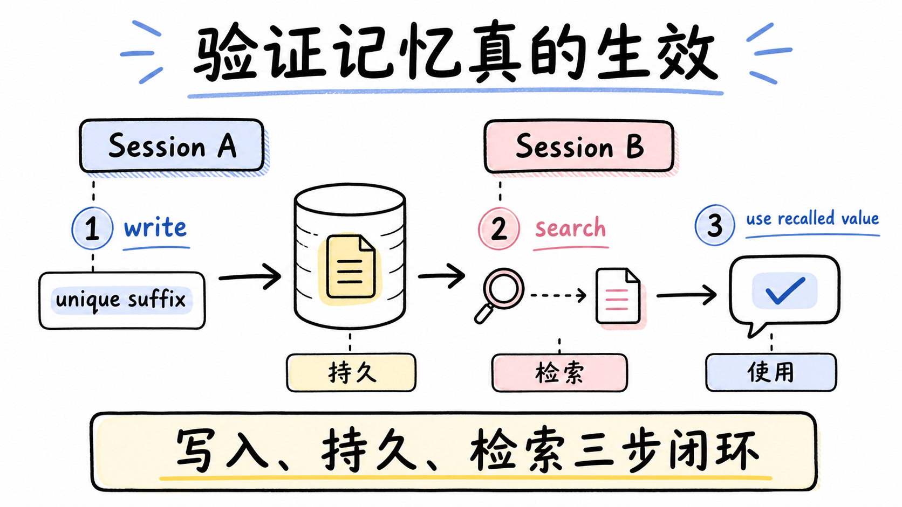

## 验证记忆真的生效

记忆系统的价值在跨会话，而 dsh 的会话相互隔离，一个会话里记的东西另一个默认看不到，记忆服务器就是会话之外的持久层。验证它通了没，用三步、一个唯一值：

第一步，在会话 A 里说"记住我的验证饮料是 lapsang 加一个唯一后缀"，确认模型调用了记忆写入工具且返回成功。第二步，同一个 host 里新建会话 B，不复制 A 的对话，问"我的验证饮料是什么，查一下记忆"，确认模型调用了搜索工具并拿到那个值。第三步，在 B 里说"用这个偏好给我推荐一杯饮料"，确认回答用到了召回的值。用唯一后缀是为了排除碰巧：通用值在训练数据里就有，唯一值只有走过"写入、持久、检索"全链路才可能出现在回答里。

两个时序细节。初始发现是异步的，发第一条验证消息前先等 `mcp__` 开头的工具出现在列表里；子进程还没完成发现就提问，模型没有工具可调，测了个寂寞。新建会话就够，不用重启 host；只有子进程崩溃且重连预算耗尽、或配置里显式关了重连时，才需要重启或热重载。另外可以放一条共享指令助推："当用户让你记住什么时，调用记忆写入工具"，把能力和使用习惯接上。

## 权衡

只桥接了 tools。协议有三类能力，resources 和 prompts 在 harness 里没有消费者，先搁置，依赖这两类的场景当前用不了。2026-07-28 版规范还定义了 Tasks、Skills over MCP、MCP Apps 这些可选扩展，桥接同样没有接，这是按需取舍不是缺陷清单：没有消费者的接口接进来只是表面积。

启动超时不在自己手里。连接和发现的超时继承 MCP SDK 的默认六十秒，一个不响应的服务器或卡住的游标链最坏能同时拖住激活和销毁一分钟，harness 还没有暴露自己的连接超时配置（工具调用超时是自己的，`toolCallTimeoutMs` 默认 60 秒可调）。

富媒体只有图片过桥。能力证明后图片能进原生上下文，audio 和内嵌 resource 留在执行局部，以诊断文本示人。对语音类服务器，当前桥接等于只传文字。

检索质量全看上游。Reference Memory 的子串匹配已经说明问题：没有嵌入、没有语义、没有冲突解决、没有遗忘策略。把"记忆不好用"归咎于桥接是找错了对象，先看选的服务器用什么检索。

示例的版本是双刃。钉到提交级的可复现性换来的代价是会过时，三个服务器都在活跃开发，隔一阵子该对一遍上游版本。示例不进默认组合，不加 patch 就完全不存在，这个干净反过来也意味着每台机器都要自己装服务器。

回报是通用性。接入一个新 MCP 服务器，写的是配置不是代码；协议标准化的红利在这里兑现，N 加 M 的工作量模型落到了一个桥接插件上。配套的可靠性工程，代际切换、有预算重连、防御性解析、环境清洗，让"接一堆不受你控制的外部进程"这件事有了工程底线。

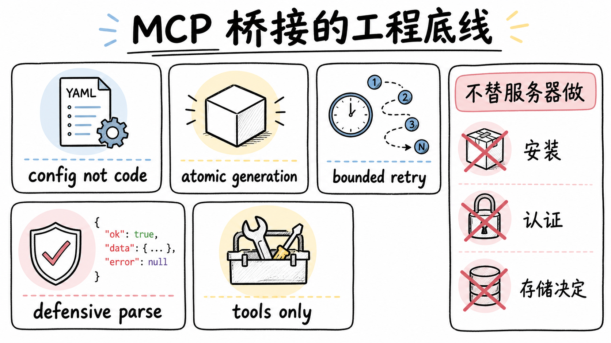

## 结论

dsh 把 MCP 当生态接口：一个通用桥接插件把任意服务器的工具变成原生工具，名字是服务器名加原始名的确定性纯函数，和 Claude Code、Codex 对齐；注册走两阶段代际切换，内部有串行队列和代际栅栏防交错，全有或全无；重连自 2026-08 起有预算，指数退避加运行时间重置，崩溃循环会被停下；解析和环境变量都按信任边界防御。接入方只写配置，dsh 不替服务器做安装、认证、存储的任何决定。mcp-memory 用三份钉到提交级的配置证明了通用性：换记忆系统换的只是上游，桥接一行不改。要评估这套设计，看它把不可靠的外部世界包进了什么形状的边界，而不是看它支持了几个服务器。

## 延伸阅读

- [MCP 官方规范（2026-07-28）](https://modelcontextprotocol.io/specification/2026-07-28)
- [dsh-mcp-client README](https://github.com/deepseek-ai/deepseek-harness/blob/master/packages/mcp/mcp-client/README.md)：桥接插件全部行为契约
- [MCP 客户端自动重连决策笔记](https://github.com/deepseek-ai/deepseek-harness/blob/master/.agents/notes/implemented/feature/2026-08-06-mcp-client-auto-reconnect.md)：监督器、预算与被否决的替代方案
- [mcp-memory 示例](https://github.com/deepseek-ai/deepseek-harness/tree/master/examples/mcp-memory)：三份参考配置与验证步骤
- [MCP 官方服务器集合（含 server-memory）](https://github.com/modelcontextprotocol/servers)

上一篇：[dsh 的 web-schedule：会话内的定时、提醒与自动化](./31-web-schedule-timer-automation.md)
下一篇：[dsh 的 ACP 协议与 acp-agent：agent 通话标准怎么落地](./33-acp-protocol-acp-agent.md)
