# dsh 的 Telemetry 可观测性：怎么接 OTel 监控

> dsh 的 telemetry 子系统有一条硬边界叫"止于 emit()"：harness 负责捕获、投影、脱敏扩展点，到把记录交给后端的那次调用为止；批处理、重试、排队、丢包策略全归上报 SDK。交付因此是尽力而为的，接收方按 `(session.id, event.seq)` 去重。
> 两条最值得记住的纪律：脱敏瀑布零内置规则，导出数据的干净程度等于部署挂载的规则，没挂规则就原样出进程；授权是正向且 fail-closed 的，三种模式里只有 FULL 允许直接 emit，未知模式在读传输配置之前就失败。2026-08 起默认值是 DISABLED，共享基础组合挂载了后端但不上报，环境变量是唯一的正门。

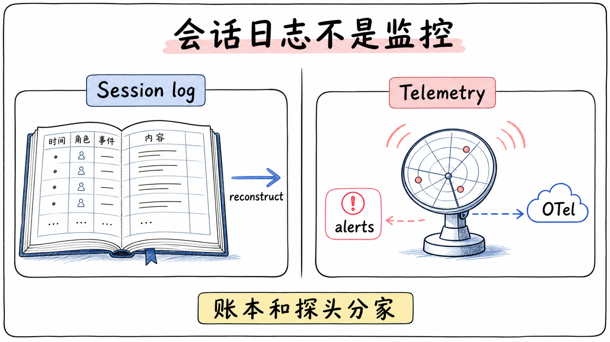

## 会话日志不是监控

agent 在跑的时候，内部发生了什么？模型请求了几次、每次多少 token、工具调了什么、命令输出了什么、哪个 step 出错了、上下文什么时候压缩了。这些信息都在会话日志里，但会话日志有自己的主人：它要从中投影出模型可见的历史、UI 渲染的对话、可 fork 可 resume 的状态。它是 agent 的账本，不是运维的探头。

可观测性要的是另一件事：把运行状态导出到外部系统，一个 OpenTelemetry collector、一个日志聚合服务、一套告警。你要知道生产环境的 agent 有没有在反复失败，token 消耗趋势怎样，哪些会话跑得最久。把账本当探头用不是不行，是把两个关注点焊死在一起。

telemetry 子系统因此存在。它不参与 agent loop，不碰任何模型请求，对模型的 KV 缓存零影响，只做一件事：把会话事件的副本交给一个上报后端。它是可选能力，不在主干上。

把使用它的人具象一点。值班工程师半夜被叫起来，一个生产 agent 卡了四十分钟没出结果。他要看的东西很朴素：这个会话的最后一个事件是什么时候到的，最后一轮 turn 是怎么结束的，有没有 agent-error 在堆，token 消耗是不是突然抬了（可能是压缩失效在空转）。这些问题没有一条需要会话日志的重建能力，全部是对事件流的过滤和聚合，正是监控后端吃了几十年的那类查询。telemetry 的存在，就是让这类问题不必等到天亮去翻进程里的日志文件。

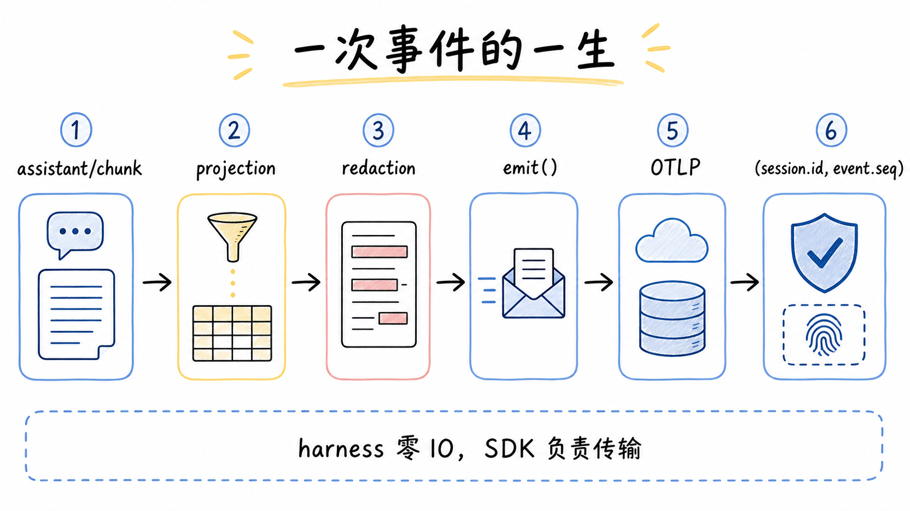

## 一次事件的一生

把一条事件从发生到落在接收方的存储里走一遍，边界在哪里换手会看得格外清楚。

模型吐出本轮第一个流式块，`session/event` 热路径上多了一条 `assistant/chunk`。协调器同步醒来：投影先看这是不是本 `(turn, step)` 的第一个 chunk，是，放行；深拷贝一份记录；调 `session-telemetry/record` 瀑布，部署挂的规则扫了一遍工具结果里的凭证形状，没命中；调用 `emit(record)`。后端把它推进 OTel 批处理器的队列，返回。协调器的工作到此结束，整个过程零 IO，agent loop 甚至感觉不到这一站。

接下来是 SDK 的地盘。批处理器攒够一批或到了调度间隔（共享基础组合配的是 10 秒一批），把记录打成 OTLP 的 log 记录：时间戳照搬，severity 按预映射写成数字，body 是完整 data，attributes 带身份三元组；一次 HTTP POST 发给 collector，失败了 SDK 按自己的重试策略再来。collector 或后端存储收到，按 `(session.id, event.seq)` 去重后落库。值班工程师的查询打到这里，看到的是一条带身份的结构化日志。

这条链路上每一站的失败都有归属：投影和脱敏的失败归 harness，被隔离被扣记录；传输的失败归 SDK，重试或丢弃按它的策略；查询侧的重复靠去重键吸收。没有一个失败需要跨站追责，这就是边界公理在单条事件上的兑现。

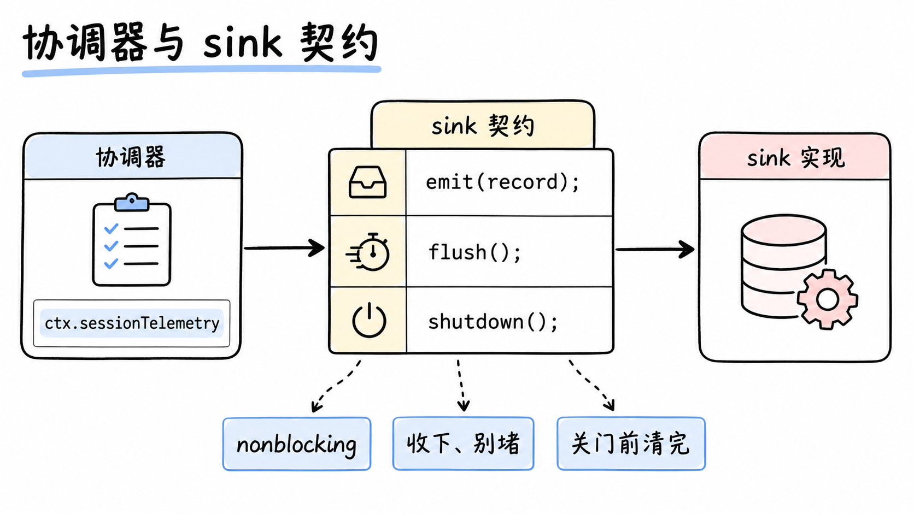

## 接缝拆分：协调器与 sink 契约

遵循能力接缝模式，telemetry 拆成两个角色。Service Definition 侧是捕获协调器（`dsh-session-telemetry`，`ctx.sessionTelemetry`），拥有捕获点、固定 chunk 投影、`session-telemetry/record` 脱敏瀑布、移交游标、最小后端契约。Service Provider 侧是部署加载的唯一入口（`dsh-session-telemetry-otel`），拥有真正的上报栈。

后端契约小到可以整段讲完，三个成员。`emit(record)` 必须非阻塞入队，因为它在 `session/event` 热路径上被同步调用，或者在显式的规范日志回放中被调用；记录的所有权在调用后归后端。`flush()` 可选，是 turn 结束后的一个火后不理提示，实现了它的后端必须把并发 flush 和最终 shutdown 的排空排好序，不许阻塞不许有意义地抛错。`shutdown()` 必须排空已入队的记录并在 SDK 停止时结算，协调器的 dispose 会等它，它拒绝了也只是记一条警告，绝不拖垮应用拆除。一个 context 只允许一个实现，重复加载直接抛。

这个契约的形状本身就是边界的形状：harness 对后端的全部要求是"收下、别堵、关门前清完"。

flush 值得多看一眼，因为它是个"接口里留了、参考实现却不用"的成员。它存在的理由是给纯自研后端一个 turn 边界的提示机会：某些后端想在用户视角的回合结束时尽快可见。它被大多数后端省略的理由更硬：flush 和 shutdown 的并发交错是出了名的静默丢失温床，OTel 后端数出三条路径之后干脆不实现，让批处理器的调度独占刷新权。一个可选成员，配上一个"建议你别实现"的参考姿态，这比砍掉成员更诚实：需求是真实存在的，只是成熟方案里没有它的位置。

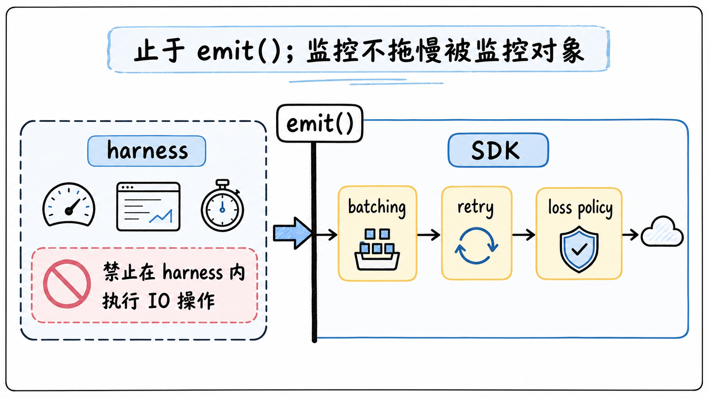

## 止于 emit()：一条边界公理

整个子系统最重要的设计原则，README 用原话钉死：

> The harness's aspect ends at `emit()`; batching, retry, queueing, and loss policy belong to the reporting SDK.

harness 的职责到调用 `emit(record)` 结束。批处理、重试、排队、丢包，全是上报 SDK 的事，SDK 的这些旋钮通过透传配置调，不由 harness 包一层。两边各自的承诺是：harness 保证捕获完整、投影正确、脱敏扩展点在场；SDK 保证可靠投递。谁也不越界。

`emit()` 抛异常会被协调器隔离并记日志，异常永远到不了 loop。这条 plus 非阻塞要求，合起来保证监控永远不会拖慢被监控的对象。一个反例值得记住：OTel 后端刻意不实现 `flush()`。早期版本把 flush 转发给 provider 的 `forceFlush()`，后来数出了三条静默丢失路径，删掉了。现在的立场是批处理器是唯一的刷新者，它自带的 `scheduledDelayMillis` 已经可调，turn 边界延迟真成为问题时也只会经由处理器自己的 forceFlush 回来，不再碰 provider 那个带超时包装的版本。

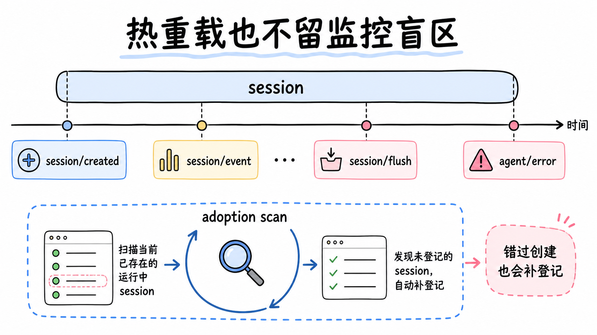

## 捕获点与热重载的收养扫描

live 模式下协调器在 `session/event` 上做捕获：投影、深拷贝、脱敏、移交，全程零 IO。围绕这个主捕获点还有一圈生命周期注册，各自管一件事。

`session/created` 负责收养：新会话出现，协调器记录它的 header。从 fork 或 resume 的构造种子永远不会被重新导出，接收方靠 `session.parent_id` 加 `session.seed_length` 自己缝合谱系。`session/flush` 把 flush 提示转发给后端，返回 void：loop 里的并行等待永远不会等 telemetry。`session/disposed` 和一个 dispose effect 收尾。`agent/error` 是唯一的 live 总线接力，进 ops 通道。最后是一轮收养扫描，遍历当前活着的会话列表，把热重载窗口里错过 `session/created` 的会话补登记。

这圈注册里最值得看的是收养扫描。没有它，热重载一次，重载窗口内创建的会话就成了监控盲区，而且没人会发现，因为一切看起来都在正常工作。盲区比错误难对付的地方在于它不报错。

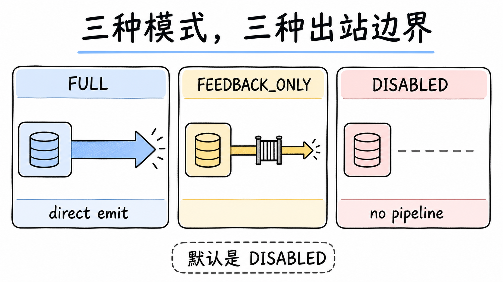

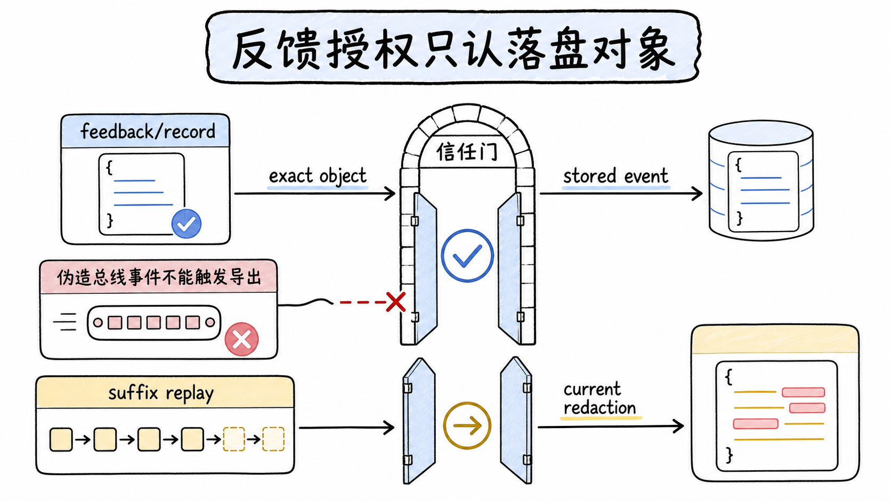

## 三种模式：授权是正向且 fail-closed

OTel 后端有三种模式，控制什么数据什么时候离开进程。

`FULL`：每个投影后的记录（包括生命周期 ops 记录）立即交给 OTel SDK，agent 一边跑事件一边流出去。只有 FULL 允许直接的 `ctx.sessionTelemetry.emit()` 调用。

`FEEDBACK_ONLY`：平时什么都不交。用户主动记录反馈（`feedback/record` 事件）时，把规范会话日志截至那条事件的后缀回放、投影、用当前挂载的规则脱敏后交给后端。授权被限定为已经存储在会话事件里的那个确切的反馈对象：监听器放行 `captureSession()` 的唯一条件，是总线事件与那个 `feedback/record` 对象身份完全相同、且该对象已存储于 `session.events[event.seq]`。独立发出的总线值被忽略，伪造一条 feedback 事件骗不动它，因为授权的凭据是落盘的对象本身，不是总线上飘过的一条消息。每个后续反馈只释放上一个边界之后累积的后缀，反馈之后的新工作继续留在本地，直到下一次反馈。

`DISABLED` 是默认值：协调器、provider、processor、exporter 一个都不构造，没有记录离开进程。此时记录反馈，事件里会写下 telemetry 已禁用、反馈留在本地。就算配置里写了 exporter 选项也不构造管线，选项被闲置而不是被悄悄利用。

授权语义是正向且 fail-closed 的：未知模式在读传输配置之前就失败；TypeScript 侧模式是枚举，裸字符串在类型层就传不进去（序列化的 Cordis 配置用的才是字符串值）。配置校验同样前置：`maxExportBatchSize` 不是正整数在插件加载时就失败，因为 SDK 自己接受这个值但会在 shutdown 时挂死，把一个远期的挂死换成加载期的失败，是这类校验的标准回报。

一份最小可用配置长这样：

```yaml
plugins:
  - id: sessionTelemetry-otel
    name: '@deepseek-ai/dsh-session-sessionTelemetry-otel'
    config:
      mode: FULL
      exporter:
        url: https://collector.example.com/v1/logs
        headers:
          authorization: 'Bearer ${process.env.OTLP_TOKEN}'
```

值得看的是那行授权头的 JS 插值：token 从环境变量取，配置文件里从头到尾没有字面密钥。这和凭证子系统的纪律同源，secret 走引用，配置只存名字。`exporter.url` 在两种上传模式下必填、必须能解析为 http(s)、没有默认值；DISABLED 下可省略且不读。

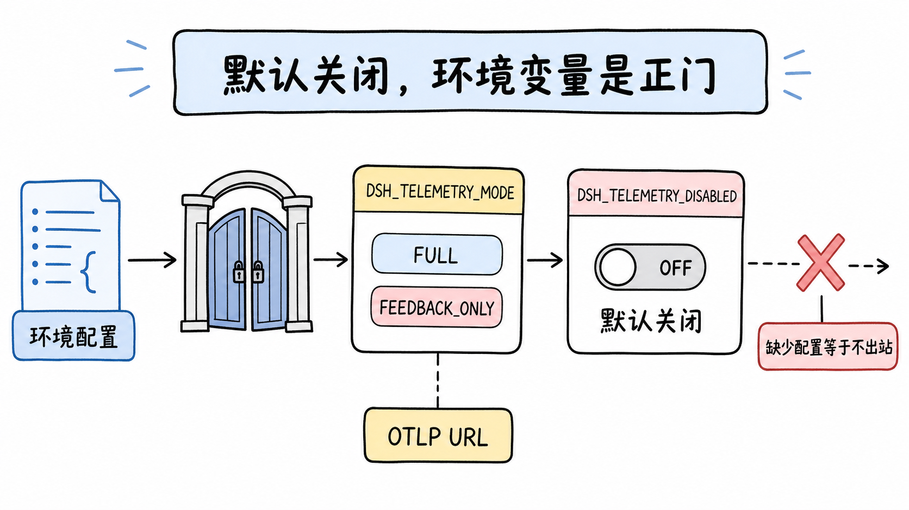

## 默认关闭与部署旋钮

这套遥测的默认姿态在 2026 年 8 月初经历了一次方向修正，值得原样记录。内测阶段，共享基础配置挂载了带内建生产 endpoint 的遥测，会话 OTel 后端在省略 mode 时可能导出完整会话内容，全新安装不需要部署方明确选择就向外上报。2026-08-10 的决策把这条改掉：未设置和空值都解析为 DISABLED，全新 profile 和项目不发出任何遥测网络请求。被否决的"默认 FEEDBACK_ONLY"和"改进披露"两条路各有出处：前者意味着部署方没显式启用也会因反馈触发上传，后者被一句话否决，披露不能让缺少配置构成发送数据的明确授权。

现在的部署口径由三个环境变量构成。`DSH_TELEMETRY_MODE` 是正门：设 `FULL` 或 `FEEDBACK_ONLY` 显式启用，不设就是 DISABLED。`DSH_TELEMETRY_OTLP_URL` 选别的 collector，缺省指向内网 collector（`https://harness-telemetry.deepseeksvc.com/v1/logs`）。任何非空的 `DSH_TELEMETRY_DISABLED` 是最高优先级的硬性退出开关，在 Loader 的 patch 层、传输校验之前生效，覆盖一切已配置模式；CI 的工作流顶层就设了它，纵深防御让测试会话留在本地。

共享基础组合包的挂载决策（2026-07-31）给了其余旋钮：批处理节奏 `scheduledDelayMillis` 10000（10 秒一批，会话运行期间流式上报而非只在退出时上报，崩溃至多丢最后一个间隔内的数据）；退出排空的上界一组四个数，单次 socket 超时加重试死线 1 秒、单批上限 2048（与队列等大，避免依次排空耗时翻倍）、处理器导出超时 1500 毫秒、dsh 自管的外层关闭死线 3000 毫秒；压缩 gzip，因为事件 body 含全文。这些数字不是拍脑袋：Linux 沙箱实测复现过 `BatchLogRecordProcessor.shutdown()` 在 `forceFlush()` 里永久等待、进不到受 exportTimeoutMillis 限制的分支，3 秒外层上限就是为这个缺口加的，配合进程级的 5 秒上限和重复信号退出通道。

顺带一段已消失的历史：曾经还有第二路出站遥测，dsh-sdk 启动器的活动上报，读同一个环境变量、在命令执行前冻结授权。2026-08-11 移除 SDK 项目工具链时，那套从未发布的开发者项目产品连同启动器遥测包一起删掉了，没有替代实现。所以截至 2026-08，出站遥测只剩会话 OTel 后端这一路，`DSH_TELEMETRY_MODE` 对它单独生效。

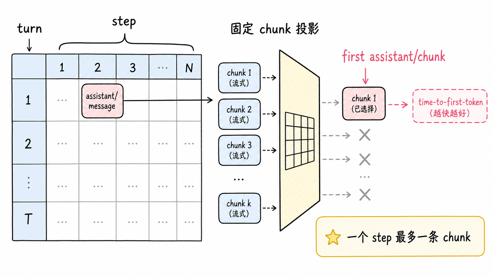

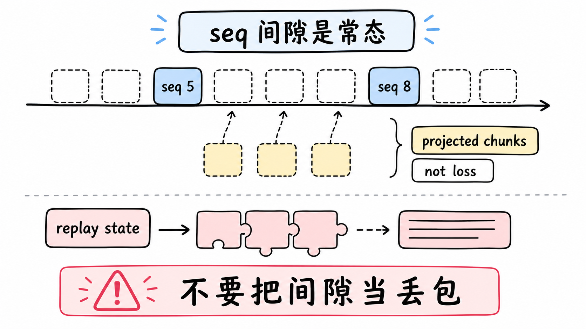

## 固定 chunk 投影与 seq 间隙

模型流式输出会产生大量 `assistant/chunk` 事件，一个 turn 可能几十上百个。全发出去，导出体积爆炸。

解法是固定 chunk 投影：每个 `(turn, step)` 只发第一个 `assistant/chunk`，其余在捕获时丢弃，被丢弃的 chunk 不推进游标。为什么留第一个？它是"流已启动"的信号。有了 `step/start` 加首个 chunk，加上 `assistant/message` 的存在和 `turn/end` 的原因，接收方能区分"请求从没开始"和"流中途断了"，time-to-first-token 也算得出来，全部 chunk 体积一个字节都不用发。其他所有事件类型，包括这个包从没听过的插件合并事件，完整通过。

直接后果要钉在墙上：线上的 seq 间隙是常态，不是丢包信号。接收方看到 seq 从 5 跳到 8，不能假设 6 和 7 丢了，它们可能只是被投影丢弃了。把间隙当丢失做告警，告警会一直响。

算一笔体积账能看出这条投影的分量。一段长回答典型地切成上百个 chunk，一个多小时的会话轻易有几十个 step；不做投影，一个会话导出几千条记录，其中绝大多数是内容增量，接收方既不渲染也不聚合它们。做了投影，chunk 类记录的数量上界就是 step 数，和回答长度彻底解耦：模型说一千字和说一万字，导出体积几乎不变。体积上界是确定的（按 turn 和 step 计），不是统计性的（按内容长度计），这让容量规划从估题变成算术题。

回放路径上的投影有个配套细节：回放时只有游标之后的事件会被重新移交，但游标之前及等于游标的事件仍然参与重建 chunk 投影状态。不重建的话，回放段里的"第一个 chunk"会判断错位，把第二个 chunk 当第一个发出去。投影是有状态的，回放必须先恢复状态再继续。

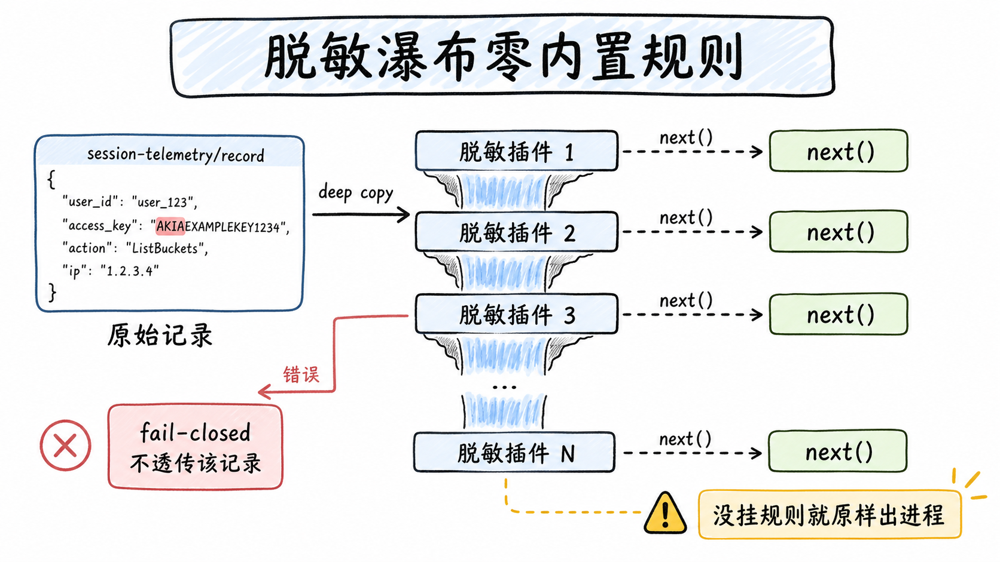

## 脱敏瀑布：零内置规则，以及它背后的历史

每条记录在投影后、移交前，穿过 `session-telemetry/record` 瀑布。这个包不内置任何脱敏规则，最内层的 `next()` 原样传回记录，没有监听器时记录按捕获原样到达后端。监听器拿到的是协调器的深拷贝，不许原地改；通过转换 `next()` 的返回值叠加效果，不带 `next()` 返回就替换下面所有层；抛异常的监听器让那一条记录被扣下（fail-closed），在协调器的隔离里消失，不影响 loop 也不影响别的记录。脱敏只作用于导出副本，规范会话日志从不被重写。

零内置规则不是没来得及写，是被明确否决的方案，否决理由有三条：每个部署的敏感信息不可预知，内置规则必然漏；内置了会制造"脱敏已开启"的假信心；误报会污染导出。接缝拥有机制，部署拥有策略。共享基础组合交付的形态也如实说了：没有挂载任何脱敏规则，显式启用的导出就是原始捕获副本，跨信任边界前必须先挂规则。

一条部署规则的典型长相：监听 `session-telemetry/record`，检查记录的类型，是工具结果就扫 body 里的输出文本，命中部署自己列的模式（比如内部 token 的前缀形状、`AKIA` 开头的形状）就把命中片段替换成占位符再返回 `next()`。规则的宽容度由部署自己定：宁可错杀（替换掉无害片段）就写宽模式，宁可放过就写窄模式，这个权衡不该由 harness 替几千个部署预答。规则写得抛异常，那一条记录整个被扣下而不是半脱敏地出门，fail-closed 在这里的方向是"少导出"而不是"多导出"。

这个立场是用一次真实的失败换来的。早期有一个实现分支，把会话事件原样导出，捕获侧的设计评审都过了，法务审查拒绝了整个方案。后来的复活版（2026-07-23 的 revival 决策）复用了那套被评审过的捕获设计，但把导出改成了现在的姿态：harness 提供能力，部署决定目的地和内容策略。同一个时期被否决的还有"接收端 collector 里洗数据"的方案，理由一句话说透：先把秘密发出去再洗，洗的是第二道手。

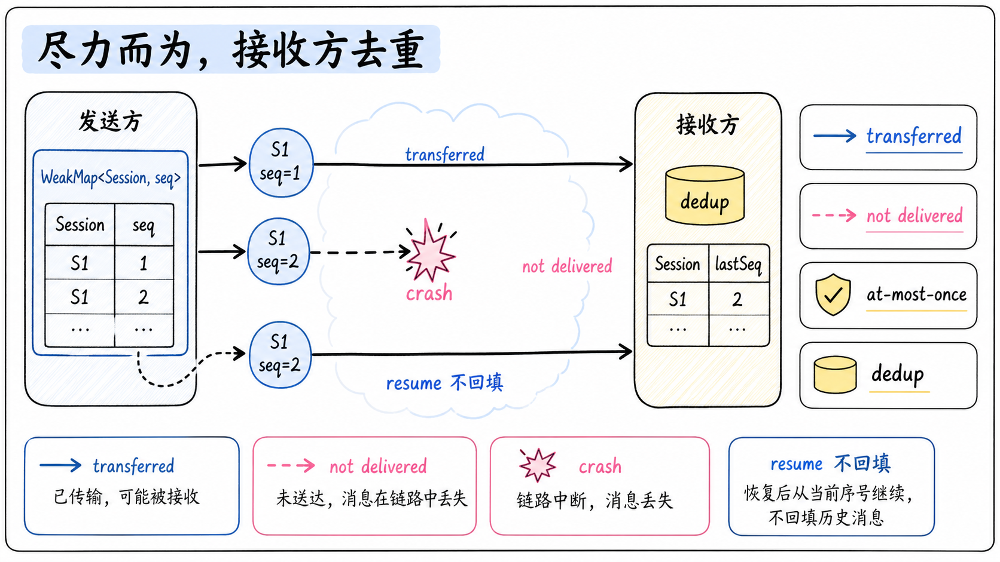

## 尽力而为与游标

交付语义是尽力而为，准确说是跨崩溃的 at-most-once。协调器维护一个模块级的 `WeakMap<Session, seq>` 游标，标记每个会话已移交的最高 seq。注意是已移交，不是已交付，`emit()` 返回只代表进了后端的队列。

这套语义的每一条边都要看清。记录可能丢：会话在 reload 窗口里被拆掉就无法重新收养，崩溃时后端队列里的东西随之丢失；一个持久 outbox（落盘 spool、按 sink 的游标、at-least-once）被刻意推迟，等有部署提出崩溃丢失的需求再作为纯增量层加回来。记录可能重复：游标丢失后的重新收养、SDK 的重试都会产生重复，所以接收方在 `(session.id, event.seq)` 上去重。resume 不回填：新进程不会补交旧进程没交付的记录，回填需求意味着 outbox，不是回放。

游标本身是对"注册是可逆副作用"原则的一个刻意窄例外：条目随会话消亡，值是单调水位，丢了从来不是错误。用 `WeakMap` 而不是一张全局表，也是为了让"随会话消亡"这句话由数据结构本身兑现：会话对象被回收，游标条目跟着消失，不存在一张越积越大的注册表要人打扫。游标缺失时降级为从 `Session.firstLiveSeq` 重新移交，这个降级是有教训的：第一版是全日志回放，后果是每次 resume 都为完整历史重新计费一次，查询侧计数翻倍，接收端没有摄入去重，账直接算错。另一个静默的体贴：resume 在本地日志里合成的崩溃修复关 turn 事件，导出时会吞掉，导出一条合成 closer 只能把一个不完整的 turn 粉饰成完整。

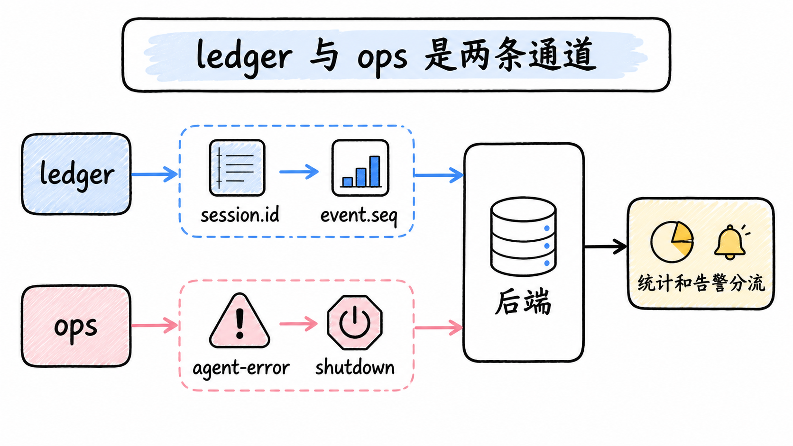

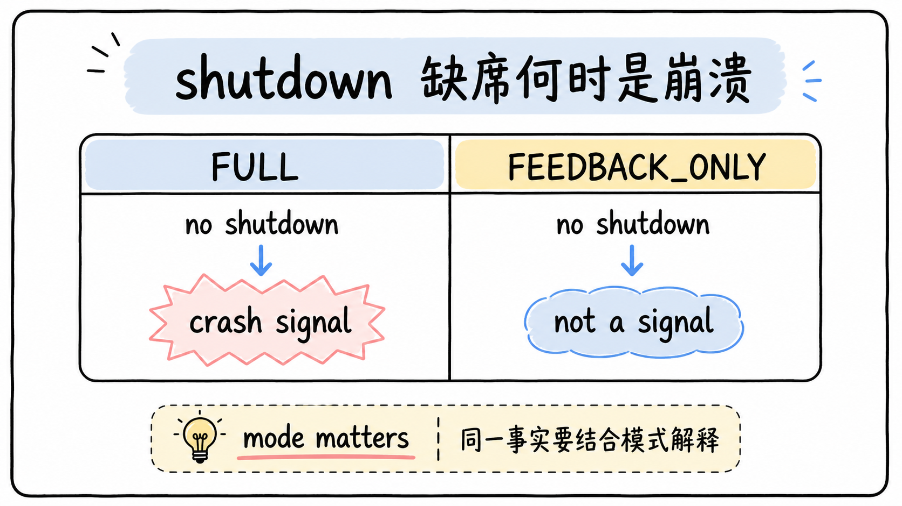

## 两个通道与崩溃检测

记录分两个通道，后端在两个独立的 instrumentation scope 下保持分开。

ledger 通道是会话日志的镜像，和 session log 事件一一对应，身份属性携带 `session.id`、`event.type`、`event.seq`（有则加 `session.cwd`、`session.parent_id`、`session.seed_length`）。这些是可以去重、可以求和的条目，body 是事件 data 的深拷贝，JSON 可序列化性由 `Session.append` 自己的验证背书，移交后永不改动。属性不重复 body 里能恢复的信息，一个身份只说一次。

ops 通道是操作信号，只有两个：`agent-error` 和 `shutdown`。它们故意省略 `event.seq` 和 `event.type`，永远不会被误认成 ledger 行；ops 记录是告警的信号不是求和的条目，容忍重复。

severity 在捕获时预映射，接收方零配置就能告警：`error` 给自身 outcome 标志出错的事件（tool-result 的 `isError`、`turn/end` 的错误原因）和 `agent-error`；其他默认 `info`；`warn` 留给瀑布策略和后端用。映射成数字是 INFO 9、WARN 13、ERROR 17，OTel 的标准刻度。

ops 通道还撑起崩溃检测。FULL 模式下，会话的记录流里没有 `shutdown` 收尾，就是崩溃信号；一条 shutdown 后面又跟着更多事件，说明那是一次 telemetry 热重载，不是崩溃。FEEDBACK_ONLY 里 shutdown 的缺席不构成崩溃信号，因为已释放的前缀通常不包含随后的 shutdown 标记，平时本来就不导出。同一个事实在不同模式下含义不同，接收方要知道自己在哪种模式下读。

两个通道在接收方的用法也天然分流。ledger 回答统计问题：按 `event.type` 过滤出 `turn/end`，把 token 用量按小时聚合，就是消耗趋势；按 `session.id` 分组数事件数，能找出跑得最久的会话。ops 回答"现在要不要叫人"：`agent-error` 的 severity 是预映射好的 error，一条告警规则挂在 ERROR 上就能用，零配置不是修辞。想用 ledger 行做告警也可以（比如错误率突增），但那是统计告警，和 ops 的信号告警是两层。

跨谱系的流还要拼一次：恢复的会话在自己 id 的流上从上一个进程停的地方继续；fork 出的会话的流从继承边界开始，前缀在父会话的流里，接收端靠 `session.parent_id` 加 `session.seed_length` 拼接。

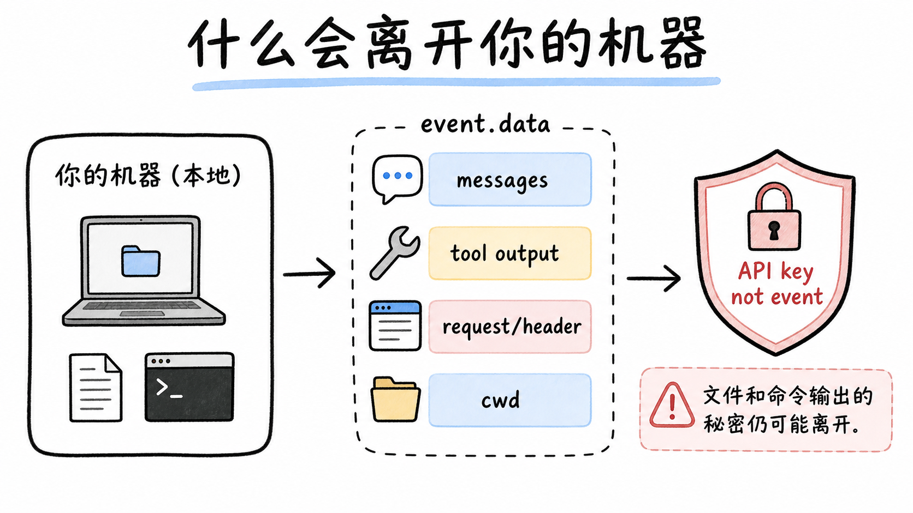

## 什么会离开你的机器

答案取决于模式。`FULL` 和 `FEEDBACK_ONLY` 下，记录携带完整的 `event.data`：用户和 assistant 的消息内容；工具参数和结果（命令输出、文件内容）；完整的系统提示和工具 schema（`request/header`）；todo 文本、压缩摘要、hook 的 stderrSummary、反馈文本；会话的 `cwd`。

API key 不在其中，而且是在结构上不在：适配器的 API key 是构造参数，不是会话事件，不存在于日志里，因而也不在 telemetry 里。凭证子系统的"每次解析、不缓存"和 telemetry 的"只导出事件"在这里咬合，秘密天生不进事件流。

但文件内容里嵌的密码、命令输出里带的 token，会在记录里，除非部署挂了脱敏规则。dsh 不替你做这个决定，这是写明在案的风险不是已解决的问题：越过信任边界的导出、又没挂规则的部署，会把凭证原样送出去。

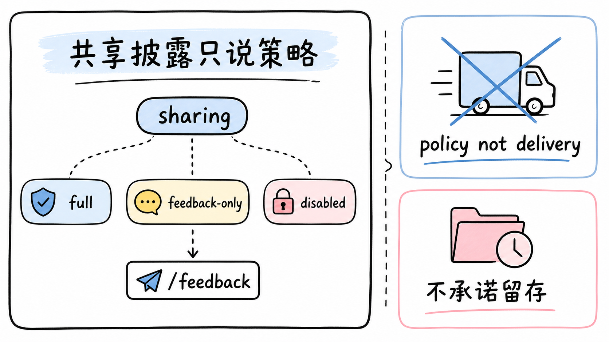

## 共享披露

mounted backend 有一个必选的 `sharing` 成员，向人类可见的确认界面（`/feedback` 命令）披露当前策略：`full` 是每个事件实时移交，`feedback-only` 是只在反馈触发时回放，`disabled` 是什么都不移交。连 DISABLED 也披露 disabled，"没配置"只在没有任何 telemetry 服务挂载时才显示。

披露声明的是策略，从不承诺交付：移交是非阻塞入队，批处理、重试、丢包归后端 SDK，也不承诺留存。这让 `/feedback` 的确认文本能诚实地说"你的会话数据将以 full 模式共享"或"不会共享任何数据"，而不是一句含糊的"可能共享"。词表归接缝所有，后端不必依赖 OTel 包就能表态。这也解释了为什么默认关闭之后基础组合仍然挂载后端配置行：禁用模式下记录反馈时要能说出"什么都不会共享"，这条披露需要挂载着的服务来背书。

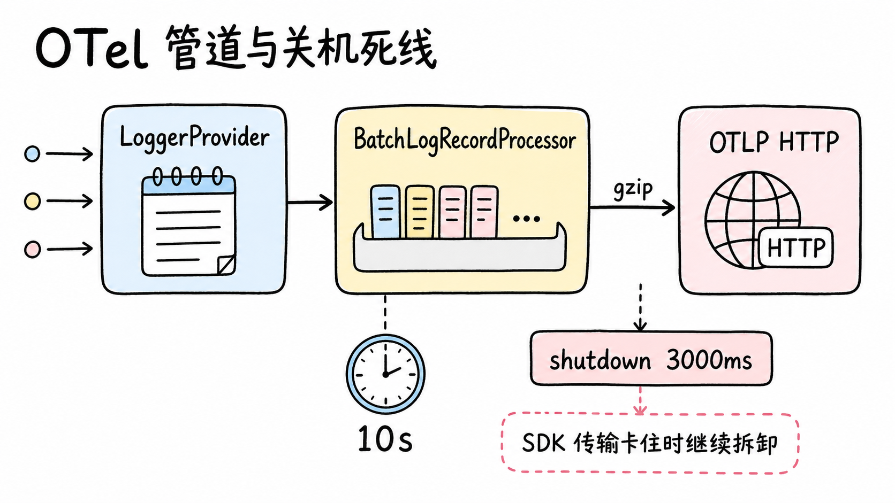

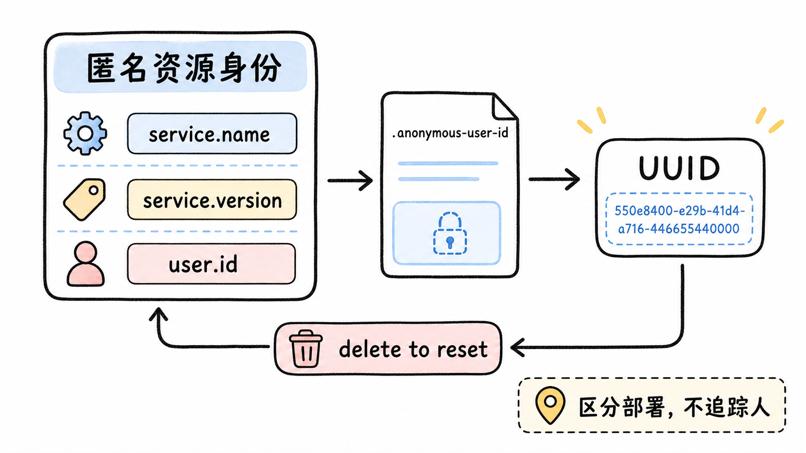

## OTel 管道的工程细节

上传模式把 OTel JS SDK 原样组合：`LoggerProvider` 到 `BatchLogRecordProcessor` 到 OTLP/HTTP log exporter，每条记录映射到一次 `logger.emit()`。ledger 记录在主 scope 下，ops 记录在 `/ops` 子 scope 下。

Resource identity 带 `service.name` 和 `service.version`，加上这个包生成的匿名 `user.id`：`$DSH_HOME/.anonymous-user-id`，首次使用时创建的随机 UUID，删文件即重置。它每个导出批次携带一次，不是每条记录都背一遍。这个 id 的取舍值得说破：完全没有用户标识，多台机器的数据没法区分来源；带上真实身份，遥测就变成了追踪。随机 UUID 是中间那格，能回答"这几千条记录大致来自几个部署实例"，回答不了"是谁"，想匿名化重开一张身份，删一个文件就行，不需要找谁申诉。

配置全部透传：`exporter` 原样交给 OTLP exporter，`processor` 原样交给批处理器，SDK 的每个字段（headers、timeoutMillis、compression、keepAlive 等）都到得了导出器。`shutdownTimeoutMillis` 是 dsh 自有的外层死线，默认 3000 毫秒。shutdown 的等待顺序：OTel 先等 `exporter.forceFlush()` 和受处理器 `exportTimeoutMillis` 限制的完成 promise；传输的 promise 要是不结算，就在 3000 毫秒处放弃等待、记日志、继续拆卸。这个死线取消不了 SDK 的传输，所以进程退出时仍 pending 的记录可能丢，这是尽力而为语义在关机时刻的具体形状。

上游 `@opentelemetry/sdk-logs` 还在实验树发布，SDK 的 API 变动会砸到 provider 这一层，但接缝契约不动。选这个组合而不是自写传输，买的是重试、批处理、协议实现这三样成熟件，付的是跟着实验树走的不稳定，账面上划算，因为不稳定被边界圈在了 provider 一层。

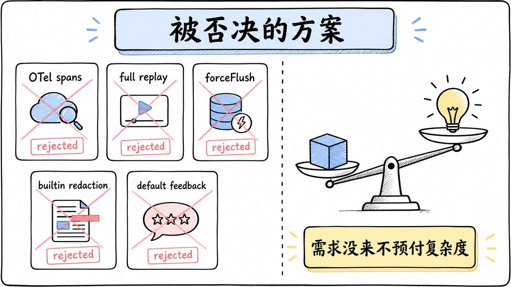

## 被否决的方案

设计笔记里躺着一排被否决的替代，每个的否决理由都值得抄走。

OTel spans（GenAI 约定）被否，因为 span 模型对可 fork、可中断的会话是有损的，一个 fork 出去的会话在 span 树里没有诚实的位置，而日志映射已经过评审。

全日志回放开局被否，理由在游标一节讲过：resume 重复计费、计数翻倍。收窄成从 `firstLiveSeq` 回放后，又补了合成 closer 吞吐的规则。

flush 转发给 provider 的 forceFlush 被删，三条静默丢失路径。批处理器是唯一的刷新者。

内置脱敏规则被否，三条理由在前文。接收端洗数据被否，先发后洗等于多过一道手。

默认 FEEDBACK_ONLY 和"默认退出加披露"被否：缺省必须让会话和反馈都留在本地。会话首次反馈后永久开放被否：后续工作会在用户没再提交反馈时被共享。反馈前保留捕获时已脱敏的副本被否：权威日志已拥有这些事件，这个方案仍要复制无上限的会话前缀。反馈回放期间临时放开公共 `emit()` 被否：标志开启期间脱敏监听器或可重入调用方可能把无关记录入队，私有后端能力让授权成为结构性保证。

还有两个小的：不做 SDK exporter 的兼容层，collector 侧的认证、TLS、限流行为跟着上游走；不做裸字符串的模式值，枚举挡住拼写错误。

## 权衡

代价三份。交付尽力而为：没有 durable outbox，崩溃丢记录，resume 不回填，需要崩溃恢复的部署要等 outbox。脱敏零内置：没挂规则时原始副本出进程，规则因部署而异，接缝不替你猜。`FEEDBACK_ONLY` 不保留 telemetry 快照：反馈触发时才用当前规则读当前日志，反馈前崩溃什么都不上传，反馈前改策略会改变那次回放导出的内容。

回报对应。捕获不拖累 loop：emit 非阻塞、异常被隔离、并行等待从不等 telemetry。上报栈完全可替换：实现三成员的 sink 就能换通道，捕获逻辑全复用。模式让"什么离开进程"成为显式选择，默认关闭让缺少配置等于明确说不，共享披露让用户的确认文本诚实。

设计笔记里还留着三个开放问题，都和推迟的决定有关。outbox 什么时候回来：要等第一个真实部署说出"崩溃丢失不可接受"，需求出现之前它是纯增量层，不会为了完整性预付。turn 边界延迟：现在的批处理器调度对大多数场景够用，真有人需要更低的导出延迟，回来的路径也是处理器的 forceFlush，不是 provider 的包装版。span 映射：被否了但门没锁死，等一个真的要按 span 查询的消费者出现再议。三个问题的共同姿态是，需求没来就不动手，动手时路径已经想清楚。

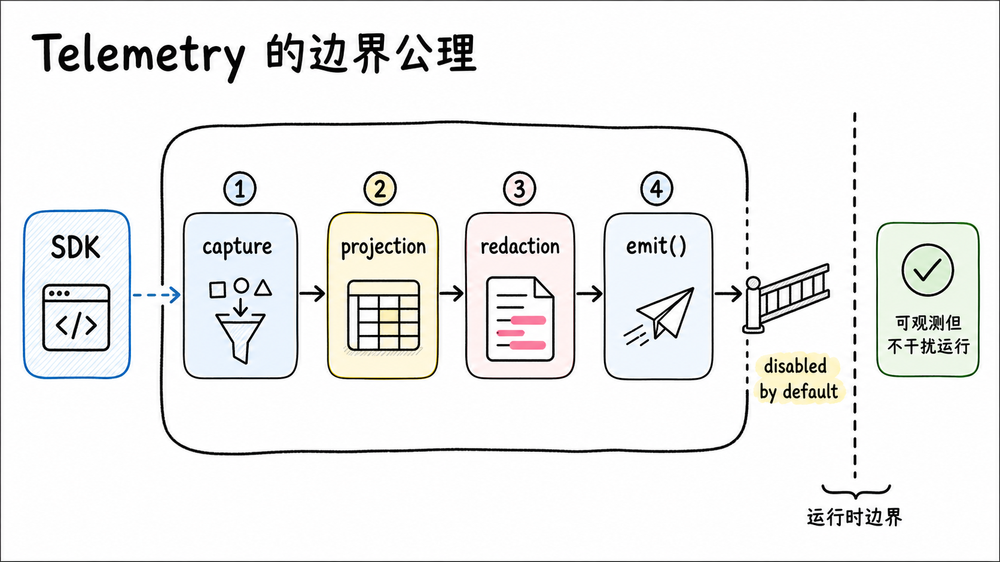

## 结论

整条设计压回一条边界：harness 负责捕获、投影、脱敏扩展点，到 `emit()` 为止；批处理、重试、丢包归上报 SDK。chunk 投影让导出体积有确定的上界，ledger 和 ops 两通道区分可求和的条目与可告警的信号，交付尽力而为、接收方按键去重、合成 closer 吞掉。零内置脱敏是立场不是缺口，模式授权正向且 fail-closed，默认关闭让全新安装零出站请求，环境变量是唯一的正门，共享披露只说策略不诺交付。换来的这条通道不拖累 loop、不预设上报栈、把共享的决定留给部署和用户，代价（丢、重、无快照）全部写在明处。

## 延伸阅读

- [Session Telemetry 子系统文档](https://github.com/deepseek-ai/deepseek-harness/blob/master/docs/subsystems/session-telemetry.md)：协调器契约与捕获语义
- [session-telemetry-otel README](https://github.com/deepseek-ai/deepseek-harness/blob/master/packages/session/session-telemetry-otel/README.md)：模式、透传配置与 OTel 映射
- [遥测默认关闭决策笔记](https://github.com/deepseek-ai/deepseek-harness/blob/master/.agents/notes/implemented/feature/2026-08-10-telemetry-default-off.md)：DSH_TELEMETRY_MODE 的授权语义
- [默认挂载决策笔记](https://github.com/deepseek-ai/deepseek-harness/blob/master/.agents/notes/implemented/feature/2026-07-31-web-telemetry-default-mount.md)：endpoint、批处理节奏与退出排空的取值理由
- [OpenTelemetry 官方文档](https://opentelemetry.io/docs/)

上一篇：[dsh 的配置、凭证与存储：有状态底座三件套](./35-settings-credentials-storage.md)
下一篇：[dsh 的配置实战：用 patch 改行为，用 preset 做分发组合](./37-config-practice-patch-and-preset.md)
