# dsh 的错误处理与容错：这个 harness 怎么不崩

> dsh 的容错不是一个抽象框架，是几层各自独立的具体机制：七条从真实发布缺陷里长出来的防御规则负责预防，结构化错误分类学让每个失败带稳定 code 可路由，`agent/request-error` waterfall 负责模型请求层面的动态恢复，包归属的不变量断言负责运行期兜底。几层共同的姿态是：不假设外部世界是好的，也不试图修复它，只为每一类已知的不可靠准备一条确定的应对。
> 这一篇拆完规则、分类学和恢复机制之后，讲两个真实的翻车故事：一个是 178 个绿灯单元测试、100% 行覆盖率的插件在生产环境前两个 RPC 全崩；另一个是一条过于宽泛的错误签名把 ripgrep 的"无匹配"退出码 1 归类成沙箱故障。两个故事从相反方向证明同一件事：错误的分类质量和错误的处理机制同样重要。

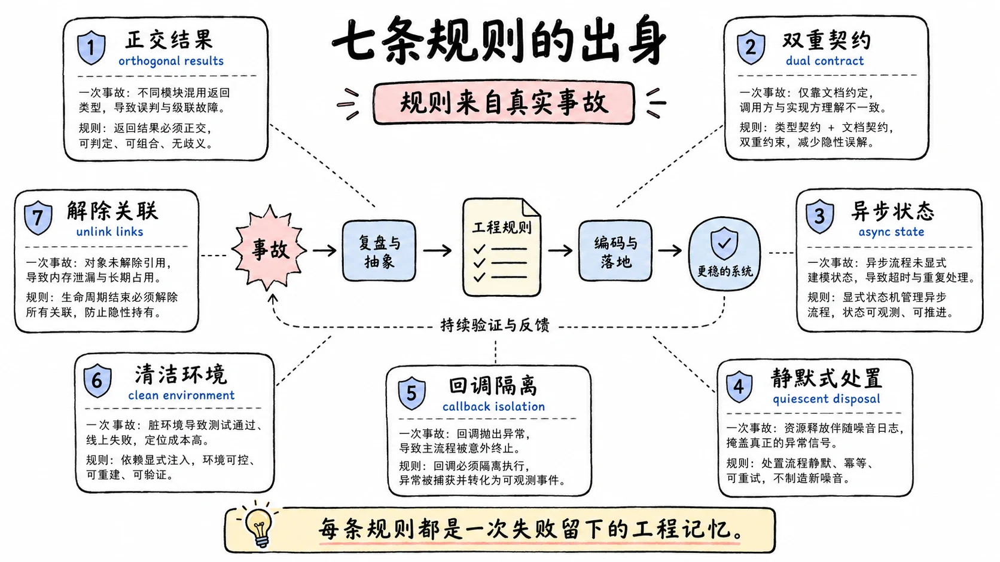

## 七条规则的出身

`docs/defensive-patterns.md` 的第一句话就把这批规则和常见"最佳实践"划清了界限。原文说，这些是硬赢来的 bug 类规则，每条对应一类确实发布过或差点发布过的缺陷，规则的表述就是防止它复发的表述。

这个定性决定了怎么读它们。最佳实践清单的典型来源是常识和审美，"看起来更干净"就能入选；这批规则的来源是事故记录，每条背后有一类真实缺陷。所以它们的措辞都很具体：不说"小心处理超时"，说"超时、信号、退出码各自占一个字段"；不说"注意清理"，说"kill 之后 await 退出，kill 之前先关注册表"。具体到能照做的程度，是因为它们本来就是从具体的坑里挖出来的。

写生命周期、并发、子进程或销毁代码之前先读一遍这批规则，是这个仓库的工作习惯。下面逐条看它们各自防的是什么，然后把它们和错误分类学、恢复机制拼成一个整体。

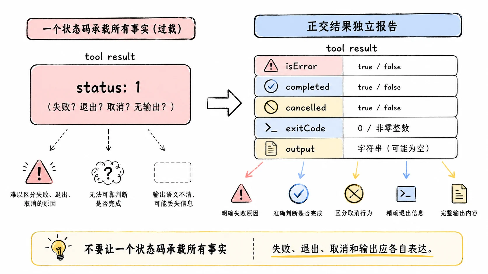

## 正交结果独立报告

第一条防的是"一个结果同时是好几件事"。

一个进程可以在超时的同时退出码是 0，因为它 trap 了信号。这不是理论构型：命令自己捕获了超时信号，做一些清理，然后体面退出，退出码报告"我很好"，超时标志报告"你杀我的时间到了"。两个报告都是真的。如果把超时标志嵌在退出码的分支里（退出码非零才算失败、再看是不是超时），调用方会读到一次被截断的运行，当成干净的成功。

规则是让每个独立事实（`timedOut`、`signal`、`exitCode`）在自己的字段上报告，不把一个标志的报告塞进另一个的分支。本质是承认结果之间可能正交：一个工具调用可以同时成功和超时，一次模型请求可以同时完成和被取消。取消和完成的竞态尤其常见：你按下取消的那一刻，响应可能已经在路上，两个标志都真。调用方看到全部独立事实，解读权归它。重试逻辑读这两个标志的方式也不一样：仅取消未必值得重试（可能是调用方主动放弃），完成叠加取消则要看内容是否完整。把取消折叠进完成分支的实现，会让这两类消费者都失去判断依据。

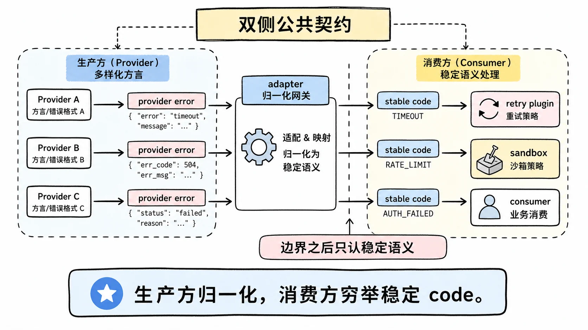

## 双侧公共契约

第二条防的是"同一个失败有好几种表达"。

适配器的流式方法可以 throw，也可以吐一个带错误载荷的终态块。两种表达在实现侧都合法，但公共运行时的消费者只通过终态块看到模型请求失败，中间件和消费者自己的缺陷保持抛出。如果两种来源的失败以两种形态穿透公共接口，消费者就得猜一个 caught 异常来自 provider、包装层、块日志还是自己的组装代码。猜错一次，重试逻辑就在错误的对象上打转。

规则是在结果穿过公共 API 之前归一化所有内部表达，把归一化后的契约声明在类型定义的地方，并且让每个来源形态都被真实的消费者练习过。测试要分别驱动 throw 和错误终态两条路，确认消费者看到的是同一种东西。

归一化的收益可以直接点名到消费者。重试插件只认失败码，不读报错原文，两种来源如果穿透成两种形态，重试就有一半概率在错误的对象上空转。压缩子系统靠一个专门的超长码知道该收窄历史，这个码如果只在其中一种表达里存在，压缩就时灵时不灵。组装器假设上游的错误已经全部被折叠进终态，一个漏网的 throw 会直接砸穿它的假设。归一化不是美学，是让下游每个消费者都能用一套穷举分支工作的前提。

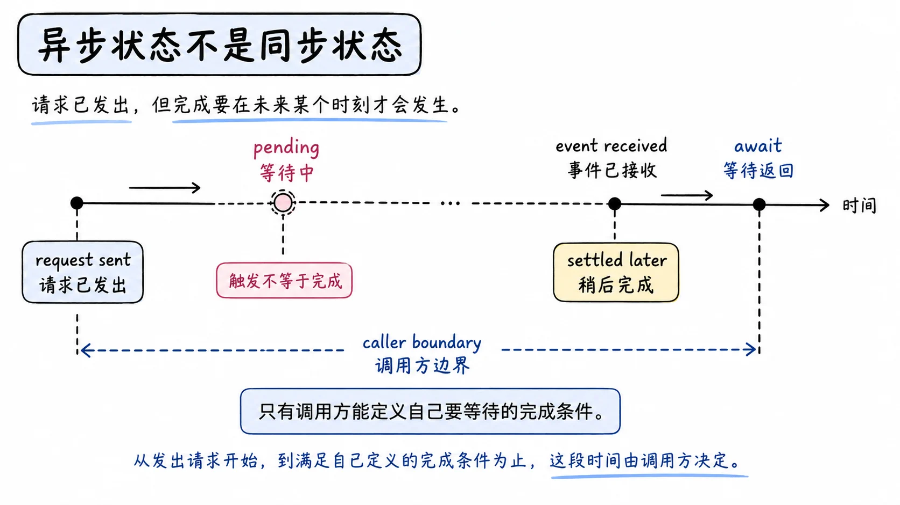

## 异步状态不是同步状态

第三条是 agent harness 里最容易踩的坑，因为它看起来像同步问题。

给 agent 发一条跟进消息，没有一个"这条消息完成了"的事件存在。后台任务的完成和 turn 边界竞争，几条排队的跟进、steering、注入的工作可能共享同一个 running 区间，而取消或销毁可以直接丢弃还没启动的项目。把 agent 状态或 `whenIdle()` 当成某一条消息的结果，等于假设了一个不存在的因果链。

规则是让真正拥有一次运行的调用方显式定义自己的区间，比如从自己消息的持久收件回执到下一个整个 agent 的空闲事件，把输出描述成区间级别的事实，不做"这条消息导致了这个结果"的归因。这条规则双向切割：等待的转移可能永远不发生，wait 就挂住了，所以"没有东西可等"的分支要显式处理。

一个已经落地的例子是 ACP 桥接的 `session/prompt` 为什么等整个 agent 空闲才返回，而不是等"那条 prompt 对应的 turn"。因为 agent 状态是异步的、共享的，"那条 prompt 的结果"这种东西在模型里不存在，协议层硬造一个出来就是在撒谎。

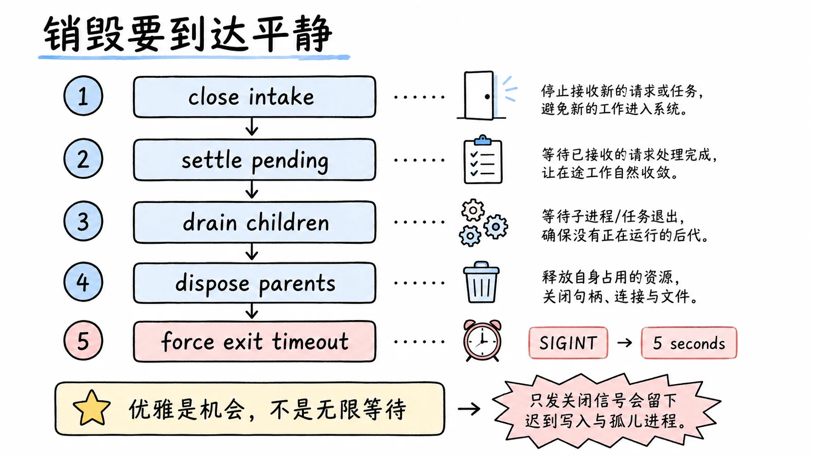

## 销毁要到达平静，不只是请求

第四条防的是销毁时的孤儿。

一个只发 kill 或 abort 信号、在活儿停下来之前就返回的拆卸，会把还在跑的子进程留在世上。正确做法有两个部分：清理本身是异步的，kill 之后 await 进程真正退出；并且在 kill 之前先关闭监听器和通知注册表，让迟到的完成回调保持沉默。顺序不能反，先杀后关的话，杀的过程里产生的完成事件还会往已经决定退场的监听器里灌。

孤儿的死法很具体：拆卸返回之后，被杀的子进程还占着端口、还往已经销毁的日志管道里写、还会触发已经不存在的回调。进程表里的残留和测试里的端口占用是最轻的后果，最重的是迟到的写入落在重启后的新状态上，把一次干净的重建弄脏。

这套纪律在几个地方有具名落点。ACP 桥接的拆卸顺序是：先关入口、结算 pending、从子到父排空可续的子 agent、最后并行销毁顶层 agent 并等全部结果。Web Server 的销毁把 `close()` 和强制关闭所有连接配对，因为 SSE 型的 handler 抓着响应不放，连接自己不会结束，不强关拆卸就挂死。CLI 进程边界也有同一条纪律的进程级版本：第一个 SIGINT 启动一次优雅的整树 dispose 并挂一个 5 秒退出兜底，dispose 结算（无论成败）都触发退出；关闭等待期间再收到信号则立即强制退出。优雅是机会，不是无限等待，这条阶梯本身来自一个卡死事故的修复。

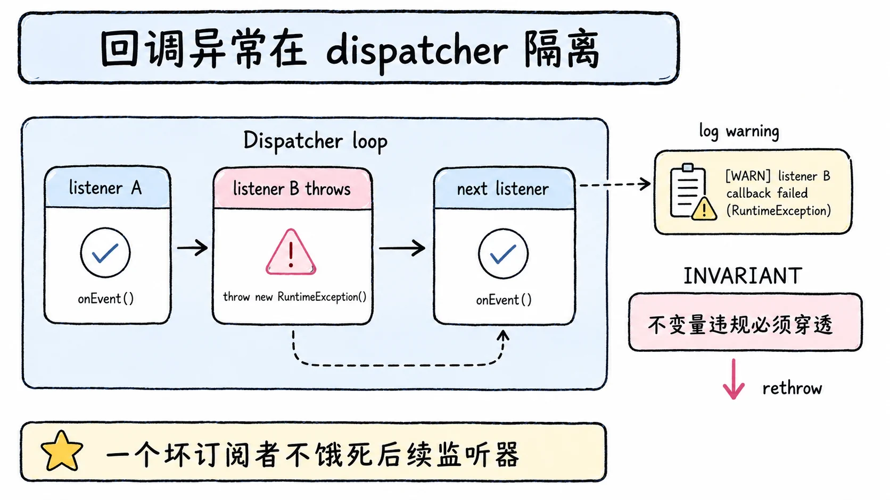

## 回调异常在 dispatcher 里隔离

第五条是事件驱动系统的核心纪律：一个抛异常的监听器，不该 reject 它恰好在里面跑的那个 promise，也不该饿死排在它后面的监听器。

规则是在分发循环外面包 try/catch 并记日志。一个坏的订阅者永远不破坏核心生命周期。这条在 dsh 的事件系统里到处都是落点：settings 更新的监听器失败被隔离记录，凭证更新同样，遥测记录的瀑布里有监听器抛异常就丢弃那一条记录（fail-closed，宁可少一条遥测不让异常扩散），ACP 的会话更新通知失败被捕获降级为警告。

有一条刻意的例外：用 INVARIANT 错误码编码的失败，在所有监听器跑完之后重新抛出。运行时不变量的违规要穿透到调用方，不能被隔离机制吃掉。这个 rethrow 只能从同步监听器到达发射器，所以不变量检查不能是 async 函数，这是一条写作插件时容易撞上的硬约束。

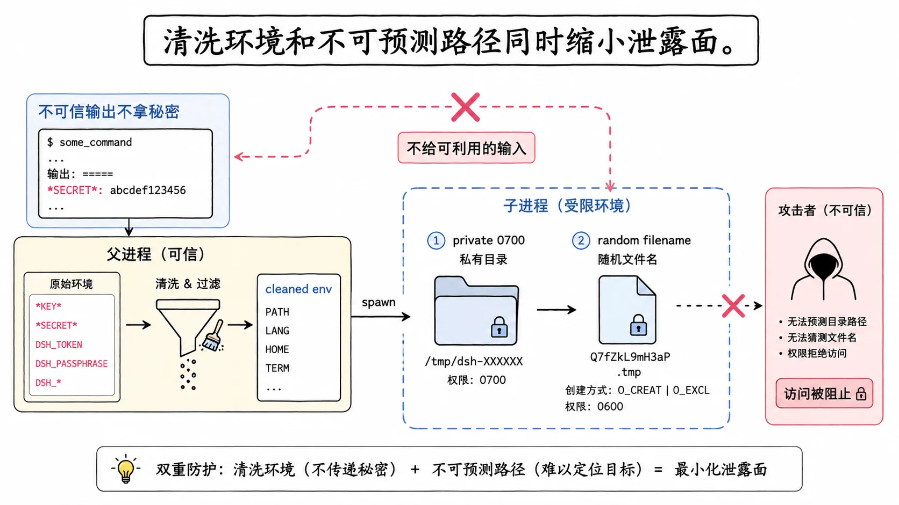

## 不给不可信输出环境变量和可预测路径

第六条是纯安全防御：不可信的东西不应该拿到它能利用的东西。

被 spawn 的命令拿到一个清洗过的环境：名字匹配密钥模式的变量（`*KEY*`、`*SECRET*`、`*TOKEN*`、`*PASSWORD*`）被摘掉，harness 的凭证不会通过子进程的环境、输出或溢出文件漏出去。MCP 桥接启动 stdio 子进程时同样清洗，还额外摘掉所有 `DSH_` 开头的变量，防止 harness 自己的内部状态变成外部 server 的输入。

临时文件和溢出文件走私有目录（0700 权限）、随机名字、独占的 owner-only 打开。可预测的、全局可读的路径是在邀请符号链接竞争和信息泄露：攻击者预判你的临时文件名，先放一个符号链接在那儿，你的写入就进了他指定的地方。

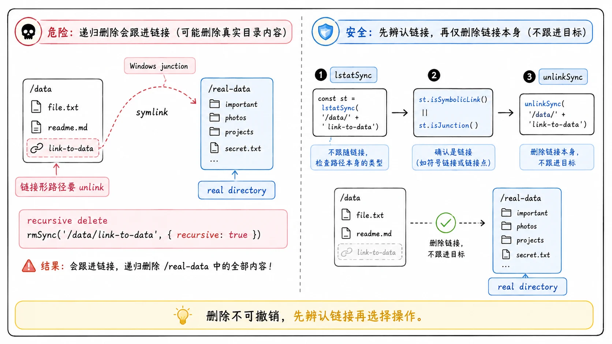

## 链接形路径要 unlink 不要递归删除

第七条防的是文件系统销毁里的真实数据丢失。

一个可能是符号链接或 Windows junction 的路径，先用 `lstatSync` 确认它是不是链接，是链接就用 `unlinkSync` 删除。unlink 只删链接本身、拒绝真实目录，所以它永远不会跟着链接走进目标。递归删除则可能穿过 junction，把目标目录里的东西一起删掉。Windows 上对 junction 直接跑 `rmSync` 会抛目录错误，这不是提示你换个姿势递归，是文件系统在告诉你停。

规则是为确认是真实目录的情况保留递归删除，可能包含链接的路径走检查加 unlink。慢一点，但删除是一次性操作，没有撤销。

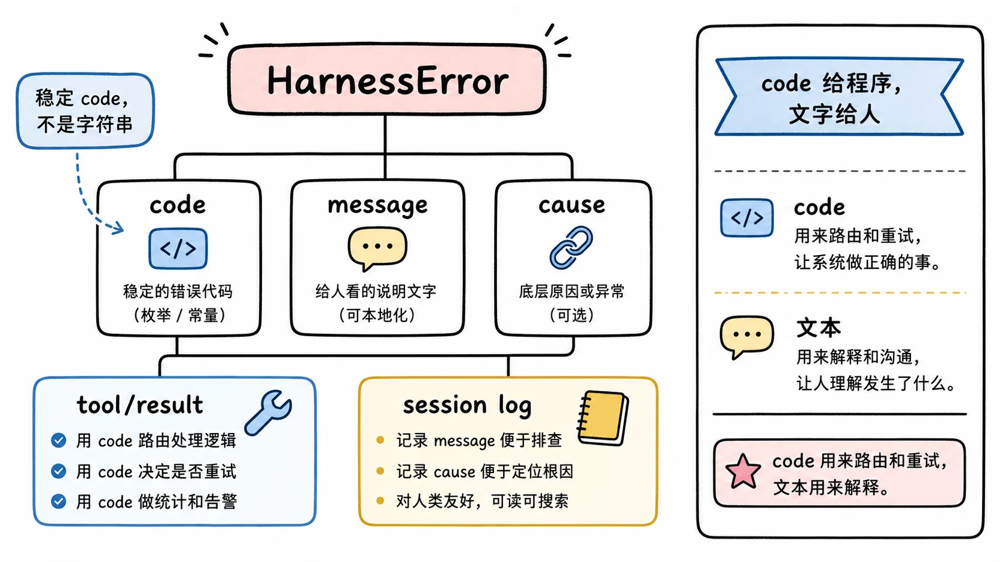

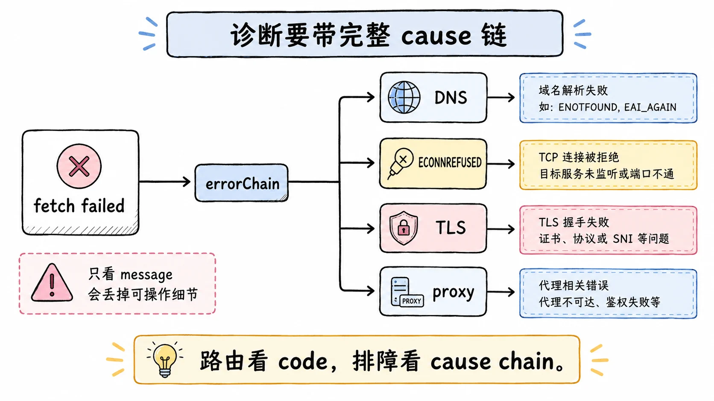

## 错误的分类学：稳定的 code 而不是字符串

七条规则管的是失败发生时的姿态，另一个更基础的问题是：失败以什么形状在系统里流动。dsh 的答案是结构化错误分类学，2026 年 6 月的一项决策把它定了型。

在那之前，故障跨越接缝时只是裸字符串。工具错误被扁平化成一个文本块，name、code、stack 全部丢失，沙箱或重试插件无法区分 ENOENT 和 EACCES；非 Error 的 throw 被 agent loop 包成 `new Error(String(x))`，所有 code 丢失。决策是在 `dsh-llm`（一个所有包都已经依赖的叶子包）里引入 `HarnessError` 基类：稳定的 `code` 与 `message` 分离，通过标准 `ErrorOptions` 链接 `cause`。工具执行的注册表在 catch 里把 `{ name, code }` 填进结果的可选 error 字段，agent loop 把它转发进 `tool/result` 会话事件，持久日志里的失败从此带结构化信息，供重试插件和回放消费。面向模型的文本块不变，模型看到的还是人话，code 服务于代码。

code 的词汇表本身也是一层设计。`dsh-llm` 为每个 provider 无关的失败类别定义规范常量：上下文超长、配额耗尽、空补全、凭证被拒，加上限流、服务端错误、超时、传输失败。适配器负责把各家的方言归一到这套码上，这是双侧契约规则在错误维度的翻版：provider 报什么原文是它的事，穿过适配器边界之后只有稳定 code。

光有结构还不够，人要看的是链。2026 年 7 月的一次修复记录了一个典型死胡同：连不上的 DeepSeek 端点只显示一条 `fetch failed`，因为 undici 把 DNS、连接被拒、TLS、代理全部包装成裸的 TypeError，可操作的细节全在 `error.cause` 上，而每个诊断边界都只渲染 `error.message`。修复是导出一个共享的 `errorChain` 渲染器，把抛出值连同完整 cause 链和 AggregateError 成员渲染出来，然后让每个诊断边界改用它：持久化的 `turn/end` 错误消息、日志警告、TUI 通知、stdio 的失败行。DeepSeek 适配器同时把响应前的传输失败包成带 TRANSPORT 码的 `LlmError`，写明配置的 baseURL、把原始拒绝值串进 cause。此后会话日志里躺着的是 `DeepSeek API request to <baseURL> failed: fetch failed: connect ECONNREFUSED`，不是一句裸的 fetch failed。路由仍然基于 code，链只用于诊断输出，两件事分开。

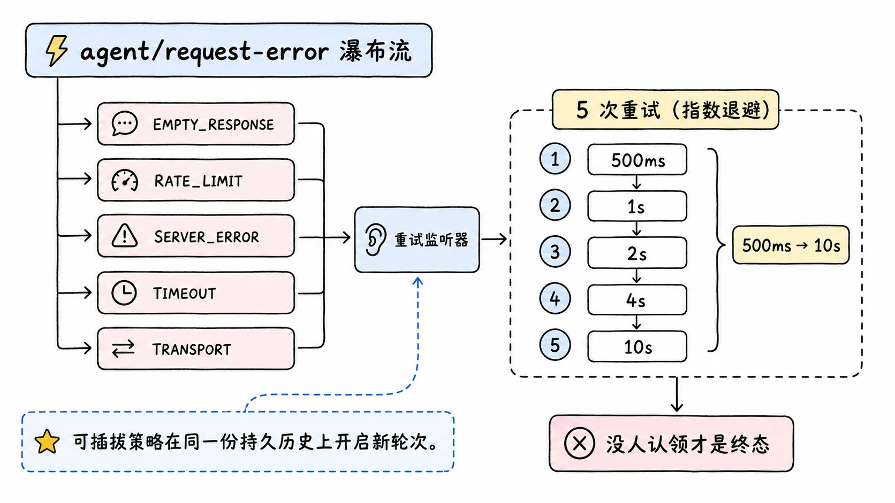

## request-error：模型请求的动态恢复

七条规则是静态预防，模型请求失败还需要一个动态恢复机制，因为模型请求的失败是常态而不是异常：网络断、超时、返回畸形。

agent loop 不在失败时直接崩，而是派发 `agent/request-error` waterfall。监听器可以返回重试指令，让 loop 在同一份持久历史上开启新的编号轮次重试；没有任何监听器认领的失败是终态。这让重试策略变成一个可插拔扩展点：默认策略由 `dsh-llm-retry` 提供，认五类失败码（空响应、限流、服务端错误、超时、传输失败），默认重试五次，指数退避从 500 毫秒到 10 秒带 10% jitter；上下文超长有专门的失败码，压缩子系统靠它知道该收窄历史了。每个 provider 适配器可以带自己的 retryPolicy，策略在路由注册时捕获。你可以挂自己的监听器实现别的策略：换 provider、告警、更凶的退避。

这里正好能看到前几层的咬合。策略只认失败码不读报错原文，所以归一化的正确性决定重试的正确性，这是双侧契约规则的价值；每次调度重试前写一条不进表层的 `llm/retry` 事件，失败与恢复都进日志，这是事件溯源账本的价值；一次适配器调用等于一次 provider 尝试，这是为了让重试边界唯一。

如果没有任何监听器返回重试，loop 抛出模型错误，turn 以错误理由结束。这个结局不是丢进黑洞：错误带着 code 和 cause 链进会话日志，遥测能按 severity 圈出它。恢复机制的天花板也在这里，它只管"这次请求还能不能再试"，不管"这个 agent 该不该继续"，后者的答案属于调用方。

有一个失败形态值得单独点名：模型什么都没生成就正常结束。这不是成功。空补全被映射成一个带专用码的可重试错误，2026 年 7 月的一条 bug-fix 决策专门把它定为可重试，理由是重复一次这样的请求是安全的。把它当成功放行的 harness 会在下游收获一堆"空消息进入历史、下一轮请求带着空洞继续跑"的漂移型故障，比一次显式的重试贵得多。

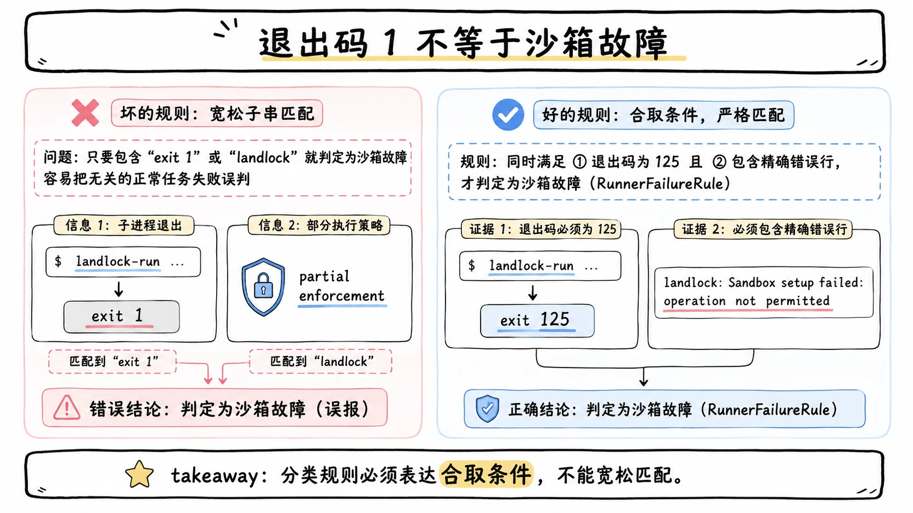

## 分类错误的代价：把退出码 1 当成沙箱故障

结构化 code 解决了"错误能不能被路由"，没解决"错误被分对了没有"。第四号 postmortem 讲的就是分类本身出错的事故，它值得完整讲，因为它和前几层机制正面相撞。

背景是 Linux 的 Landlock 沙箱。原生 launcher 有一个约定：内核只能部分强制执行时（旧 ABI），它精确打印一行 `landlock-run: partial enforcement (older Landlock ABI)`，然后继续执行子进程，这是无害的信息性行；launcher 自己失败时打印另一行 `landlock-run:` 诊断，不执行子进程，以退出码 125 退出。harness 侧把这个约定简化成一条不区分大小写的子串规则：非零退出加 stderr 里有 `landlock-run: `，判为 launcher 失败。两条截然不同的事实被一条子串焊接在了一起。

后果在两处爆发。旧 ABI 主机上，子进程的任何非零退出码都可能被错误归因为沙箱故障：`false` 的退出码 1、ripgrep 无匹配时的退出码 1、无效 pattern 的退出码 2。`glob` 和 `grep` 最容易中招，因为 ripgrep 把退出码 1 用作成功的空搜索。第二处更糟：当时由 bash 支撑的文件系统搜索会捕获执行器抛出的所有错误并替换成通用的 `SEARCH_FAILED`，连结构化的 `SandboxUnavailableError` 也被遮蔽，真沙箱故障反而丢了错误码。

注意这个事故的安全语义：约束没有被削弱，命令没有在无约束状态下运行，损害的是可用性和诊断完整性，合法的受限结果被拒绝或错误标记。但它的根因分析值得抄下来：公开的沙箱结果类型只能表达一组子字符串，表示不了"退出码 125 加一行致命诊断"这种多项证据的合取，消费方的布尔判定就把来自不同进程、互不相关的事实组合在了一起。修复跟着表示走：分类规则升级为结构化的 `RunnerFailureRule`，带可选的允许退出码、逐行致命签名、按整行精确匹配排除的信息性行；Landlock 映射为退出码 125 加一行非通知诊断；文件系统搜索改走 subprocess 接缝运行打包的 ripgrep，整个绕开沙箱化 bash；回归用例同时覆盖信息性通知、致命证据、前台与后台分类。

这个故事的通用教训与重试插件那条纪律同源：归一化错误码的价值取决于归类的正确性。签名匹配是分类里最脆的手段，子串越宽，误吞的邻居越多；退出码 1 是 ripgrep 的"成功无匹配"，也是 `false` 的失败，任何把它当单一语义消费的规则都在赌运气。

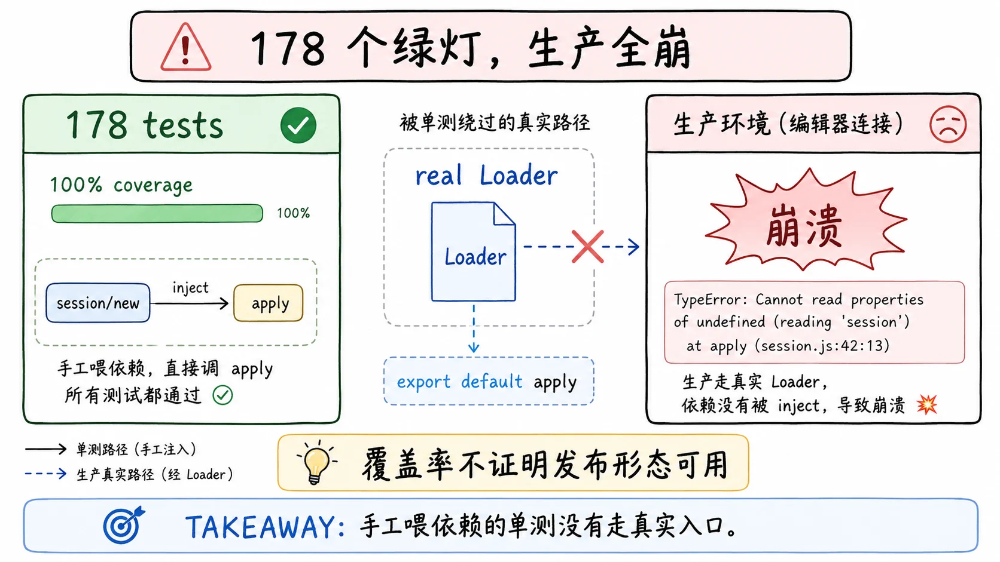

## 一个真实的翻车故事：178 个绿灯

现在把视角倒过来：防御规则防的是已知坑，未知坑怎么办。第一号 postmortem 是这个仓库的现成答案。

事故的形态很尴尬：ACP 桥接插件发布后，真实的编辑器一连上就崩，编辑器最先发的两个 RPC 都失败，一个在 `session/new` 上抛"没有注入拿不到 agents"，另一个在 `session/load` 上同样拿不到 sessionPersistence。此时这个插件的测试面板是 178 个绿灯的单元测试、100% 行覆盖率。文档的原话是：桥接在生产环境完全不可用，尽管测试全绿覆盖率全满。

排查先是追了一个看起来很优雅的理论，怀疑 Cordis 的 shadow fiber 搞鬼。给真实的 fiber 走向加了插桩之后，这个理论被证伪。信任 trace 不信任理论，是这个 postmortem 的第一课：优雅的解释是真的，但它是第二个 bug；第一个 bug 是一个一行的导出错误，几分钟就能找到，却排在几个小时的似是而非的推理后面。

第一个 bug：这个插件是命名空间插件，导出 name、inject、Config、apply，但文件末尾又多了一个 `export default apply`。Cordis Loader 解包导出时偏好 `.default`，有 default 存在时，解包结果是一个裸的 apply 函数，inject 和 name 这些兄弟导出全部被扔掉。fiber 用零注入构建，apply 的第一行就走到根上抛错。删掉那一行，第一个 RPC 修好。

第二个 bug 立刻露头：`session/load` 还是坏。AgentLoop 的静态注入刻意不含 sessionPersistence（注入它会让非持久化的演示挂死），它由一个兄弟 fiber 提供、被机会式读取。桥接调用恢复服务时，服务代理穿过一个 shadow 重绑，那个 shadow 的上下文走向只查祖先，服务住在兄弟分支上，走到根还是抛错。修复是改用拓扑无关的 `ctx.get` 查找，同时保留活跃状态检查。

最有教育意义的部分是测试为什么全绿。单元测试手工构造插件对象、手工喂 inject，只有真实的 Loader 才会走导出解包，这条路径一次都没被踩过。测试从顶层代码调用服务，恰好命中一个绕过 fiber 拓扑的旁路。唯一驱动这两个 RPC 的测试是带 key 的门控测试，CI 里被跳过，本地"通过"只是因为一份过期的构建产物满足了模块解析。文档的结论一句话说透：覆盖率证明这些行跑过，它不证明功能按发布的形态工作。

预防措施跟着根因走：一个不带 key 的 `session/new` 端到端测试，走真实 stdio、把示例当子进程、通过真实 Loader 启动，并且验证过把坏导出还原回去它就变红。子进程的环境里钉死 tsconfig 路径，让它解析源码而不是过期的构建产物。测试规则里新写一条：测真实的入口路径。每个预防措施都对准一个具体的逃逸路径，而不是笼统地"多写点测试"。

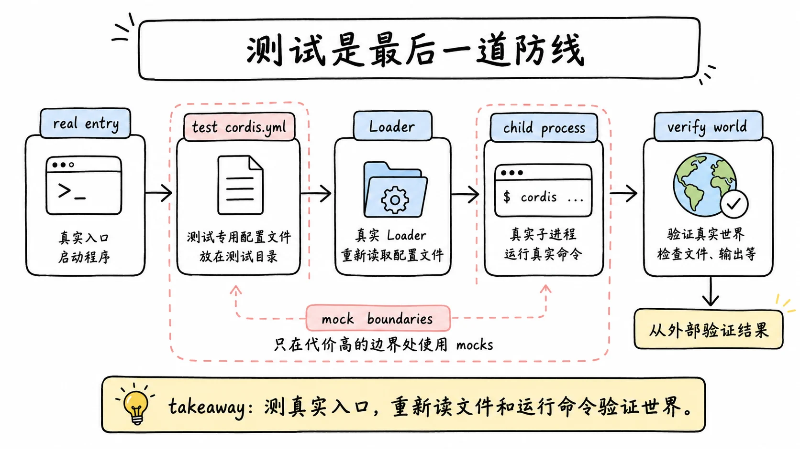

## 测试是最后一道防线

postmortem 的教训直接长成了测试规则，它们和防御模式是一体的：前者防已知的坑，后者负责让未知的坑在发布前现形。

第一条是真实组合优先。产品可见的插件要求一个非单元的真实组合测试，手工构造插件对象的套件不够格；要起一个测试专用的 cordis.yml，走 Loader 和应用进程。发布产物的 bin 要在纯 node 下跑构建后的文件测一遍，tsx 会掩盖定居竞争、模块解析、被吞的加载失败。

第二条是 key 门控的诚实定价。无 key 的测试证明的是管道，只有带 key 的运行证明 agent 对真实模型工作。真实 API 的测试应该多：写文件的提示、多轮对话、工具使用、流中取消。最高价值的是冒烟测试：启动真实示例、发一条提示、检查世界。

第三条是验证世界而不是验证输出。断言要重新跑命令、重新读文件，从外部核对；探测 agent 自己输出里的关键词，会让一个撒谎的 agent 通过。没被碰过的文件要保持字节级不变，也要断言。

第四条是 mock 的边界。只 mock 贵的或不确定的边界（模型适配器、网络、时钟），一个替身只证明桥在搬字节，不证明发布的工具按声称的行为工作。

规则里还钉着几个具体的陷阱，每个都有自己的死法。import 另一个 spec 文件会把它的 describe 重新注册一遍、真实 API 调用翻倍，共享的夹具要放在普通的 harness 文件里。测试的模块解析如果穿过包的 exports 落到过期的构建产物上，会加载模块单例的第二份副本，单例从此不单；测试解析要留在源码平面。缺失配置要断言进程以非零退出，别让它静默降级。还有一条反直觉的：一行没覆盖的代码经常是死代码的信号，正确反应是删掉它，不是补一个测试去覆盖它。

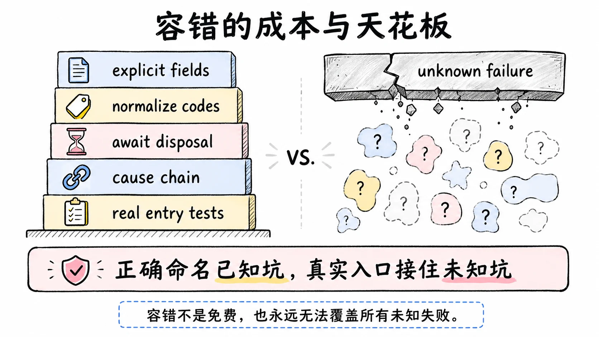

## 权衡

这套容错的成本是显式和纪律。正交结果要多个字段不是一个码，双侧契约要归一化加文档加两种来源的测试，异步状态要调用方自己定义区间，平静的销毁要 await 而不是发完信号就走，环境要清洗，路径要检查。每条规则都比它的反面多写代码、多想一步。不变量机制还有自己的税：每个包都要维护 companion 插件，哪怕答案是"没有不变量"也要写一段带解释的空安装器，靠机械命令盯着不许偷懒。

结构化 code 也有代价。每个新失败类别要先在词汇表里领一个码，适配器要写归一化逻辑，错误码的语义要文档化。字符串拼接错误永远更"快"，直到第一个消费者需要对它分支的那一刻。cause 链渲染让诊断字符串变长，日志和快照的体积都涨；官方决策明确接受了这个代价，判断是链细节比类名更有价值。

也要诚实地说边界。这套机制防的是已知的失败类和能被不变量表达的关系，防不了没人想到过的失败形态。第一号 postmortem 是证据：几层机制都好好的，一个一行的导出错误照样穿过去了，最后接住它的是"测真实入口"这条组织纪律，不是任何运行期机制。第四号 postmortem 从另一个方向补刀：机制都在，分类规则写错了，错误被安静地路由到错误的地方。容错哲学的天花板永远是写代码的人能想到的坑的清单，以及他们给每个坑起的正确名字。

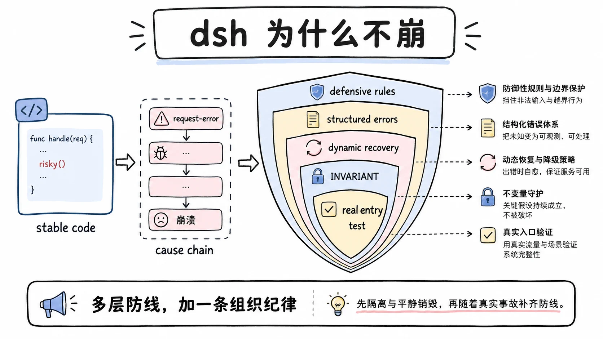

## 结论

dsh 的不崩，靠的是几层防线加一条组织纪律。七条防御规则把七类真实缺陷变成七条可照做的纪律：正交结果各自报告、公共契约双侧归一、异步状态不冒充同步结果、销毁要到达平静、回调异常在分发处隔离、不可信输出不给环境变量和可预测路径、链接形路径只 unlink。错误分类学让每个失败带稳定 code、cause 链和结构化的日志字段流动，重试和压缩这类消费者才有穷举分支可写。`agent/request-error` waterfall 给模型请求一层可插拔的动态恢复，默认认五类失败码、五次重试、指数退避。包归属的不变量断言在运行期兜底，INVARIANT 违规穿透普通隔离直达调用方。

两个 postmortem 从两个方向标出天花板：导出解包错误靠测真实入口接住，分类签名过宽靠结构化的多项证据规则接住。评估这套东西能不能搬到自己的项目，判断题只有一道：你的系统是不是也被不可信的外部世界包围。是，这套规则的每一条都能对号入座地抄；如果你的边界条件少得多，先抄隔离和销毁这两条，剩下的等第一次事故之后再补，反正这个仓库自己也是这么长出来的。

## 延伸阅读

- [Defensive Patterns 全文](https://github.com/deepseek-ai/deepseek-harness/blob/master/docs/defensive-patterns.md)：七条规则的一手表述
- [Postmortem 0001: ACP Default Export](https://github.com/deepseek-ai/deepseek-harness/blob/master/docs/postmortem/0001-acp-default-export-drops-inject.md)：178 个绿灯测试与生产全崩的完整复盘
- [Postmortem 0004: Landlock 误归类](https://github.com/deepseek-ai/deepseek-harness/blob/master/docs/postmortem/0004-landlock-partial-notice-misclassified-child-failures.md)：错误签名过宽与结构化分类规则
- [结构化错误分类体系决策](https://github.com/deepseek-ai/deepseek-harness/blob/master/.agents/notes/implemented/architecture/2026-06-11-structured-error-taxonomy.md)：HarnessError 基类与 code 词汇表的由来
- [Testing](https://github.com/deepseek-ai/deepseek-harness/blob/master/docs/testing.md)：真实入口路径、key 门控、验证世界的规则

上一篇：[dsh 的 Web 客户端：Chat Nodes 与多 agent 协议](./41-web-client-chat-nodes-multi-agent-protocol.md)
下一篇：[dsh 的测试体系与性能压测：怎么测一个 agent harness](./43-testing-how-to-test-an-agent-harness.md)
