# dsh 的测试体系与性能压测：怎么测一个 agent harness

> 测一个 agent harness 的难点不在写断言，在挡住两类假绿：一类是覆盖率造假，代码行全跑过了但产品在真实入口上是坏的；一类是自述造假，断言盯着的对象恰好是 agent 自己说的话。dsh 的答案是一套分层测试加几条纪律：五条 CI lane 各答一个问题，mock 只留在昂贵或不确定的边界，断言永远重新去读世界而不是读 agent 的自述。性能压测单拆出两条手动 lane，一条测高基数渲染，一条测十万分片的流式压力，它们拒绝时间断言的理由值得单独记一句：宿主速度不是正确性契约。
> 最好的一份教材是 postmortem 0001：178 个单测全绿、行覆盖率 100%，真实的 Zed 编辑器一连上来就崩。这个案例把"为什么每层测试都不能互相替代"讲得比任何原则陈述都清楚。

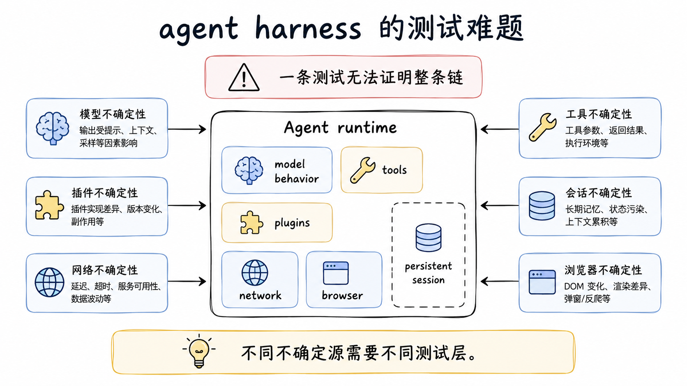

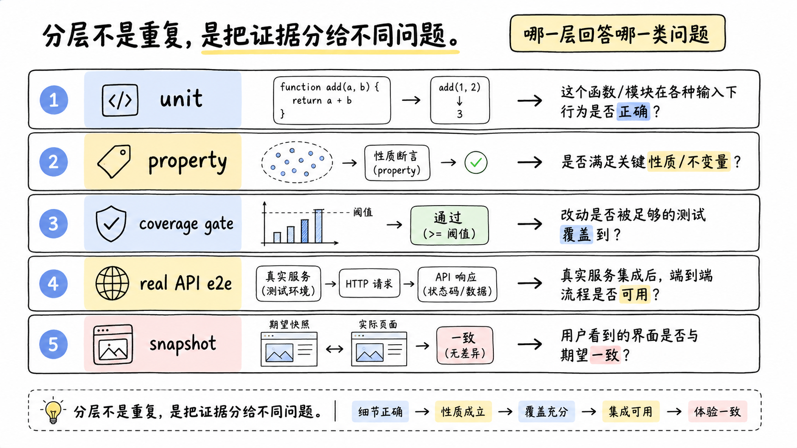

## agent harness 的测试难在哪

写过一个 agent 应用的人多半见过这种场景：单测全绿，CI 全绿，真的把编辑器连上来，第一个 RPC 就挂。这不是测试写得敷衍，是 agent harness 这个形态天然给测试挖了三个坑。

第一个坑是非确定性。同样的输入，模型这一轮和下一轮的输出不同，网络这一秒和下一秒的延迟不同。传统测试的基本假设是"给定输入断言输出"，在这里对不上号。解法不是放弃断言，而是把确定性切出来：mock 掉模型和网络这两个不确定源，让它们变成脚本化的回放，剩下的部分就恢复成了普通的确定性代码。

第二个坑是入口被绕过。harness 的产品形态是"通过 Loader 加载插件树再启动"，而测试写起来最舒服的形态是"手工 new 一个 context，把插件直接塞进去"。两种形态跑的是同一份业务代码，单测覆盖率统计不到差别，但真实用户走的是前者。一个在加载层发生的错误，手工组装的测试永远碰不到。

第三个坑是自述污染。agent 的输出是自然语言，最省事的断言是在输出里搜一个关键词，比如 agent 说了"我已写入文件"就当写入成功。问题是模型会胡说，一个作弊的或者幻觉的 agent 也能说出这句话。断言盯着的对象和被验证的事实不是同一个东西。

dsh 的测试体系就是对着这三个坑建的：五条 CI lane 各自负责一块，外加几条贯穿的纪律，再往外有两条手动的性能 lane 和一套特种装备。

## 五条 lane，各答一个问题

五条 lane 的划分标准不是测试的大小或者速度，是每条 lane 回答的问题不同。把五条 lane 的答案连起来，才凑齐"这个 harness 能发布"的完整证据。

Unit 跑 `pnpm run test`，vitest 扫包和示例的 `tests/**` 目录加仓库脚本的 spec。这一层覆盖边缘情况、错误路径、事件顺序、并发竞争。每个注册表还带一个 HMR 安全测试，销毁贡献的 fiber 再断言注册被清理，后面单拆。协议形态的包在这层还各有一个属性测试套件，用 `fast-check` 生成对抗性输入，后面也单拆。

Coverage gate 跑 `pnpm run test:coverage`，在 `packages/*/*/src` 上要求 per-file 100% 行覆盖。这个数字乍看激进，它的解释写得很清楚：一行没被覆盖，通常意味着那行是死代码，门禁在正确地标记它该删，而不是缺一个测试去补。行覆盖是必要条件但永远不充分，它证明代码行跑过，不证明功能按发布的样子工作。这两句话的差距，正是后面那个 postmortem 的主题。门禁还带现实的豁免逻辑：`packages/shell/pwsh-local/src` 的覆盖需要真实 `pwsh`，缺它的主机上执行器套件自动跳过、该文件被 `vitest.config.ts` 豁免，CI runner 带 pwsh 仍按完整标准执行。覆盖率大表跑不动时还有 `test:coverage:partitioned`，由 `scripts/run-coverage-partitions.ts` 分区执行。

Real-API e2e 跑 `pnpm run test:e2e`，带 key 打真实 provider。DeepSeek 模型之外还有 provider 特定的 smoke，凭 `EXA_API_KEY`、`PERPLEXITY_API_KEY` 这类环境变量开门。每个 suite 没有自己的 key 时自我跳过。这层存在的理由下面单拆。

Snapshot 跑 `pnpm run test:snapshot`，无 key 的期望输出覆盖外部行为。传输契约、呈现格式、组装后的后端行为，都以持久化日志的形式钉住。当模型 transcript 变了用 `test:snapshot:record` 重录，当回放输入还有效用 `test:snapshot:refresh` 刷新，每次 diff 都要人审。

Web browser snapshot 跑 `pnpm run test:web`，Chromium 把回放的浏览器输出和 `apps/web/tests/snapshots/` 里的期望比较，是 Linux PR 的必过门禁。CI 强制只读模式 `DSH_SNAPSHOT=replay`，期望输出只能在本地刷新，防止 CI 顺手把坏掉的行为录成新标准。`test:web` 先构建再跑，因为要交付插件的 CSS 产物。

lane 的家族还在长。仓库 package.json 里还有 `test:gui`（跑 `packages/client` 和 `packages/host` 的 GUI 相关套件）、`test:issue-management`（issue 管理策略的 node 直跑测试）、`test:coverage:partitioned`。五条是主干，不是全部，这是我的归纳，依据是命令目录的当前形态。

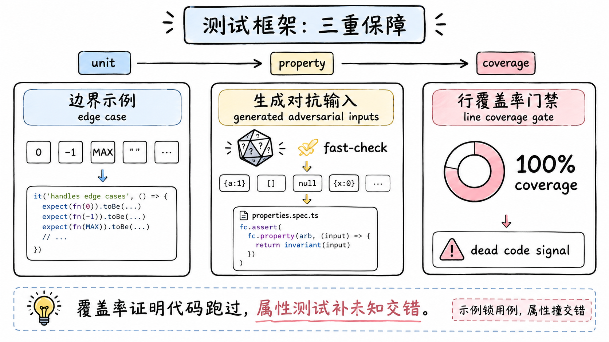

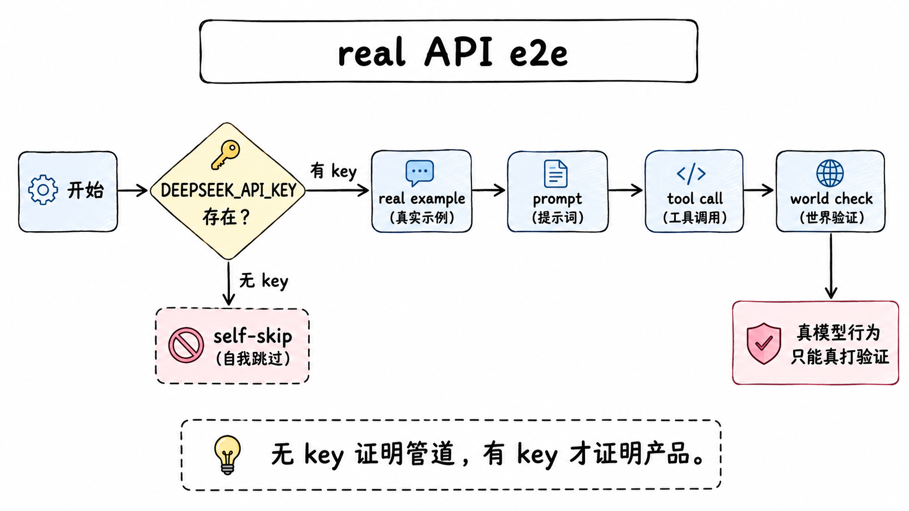

## 一个完整的反面教材：postmortem 0001

这条值得完整讲一遍，因为它同时踩中了上面三个坑里的两个，而且每一步都有测试全绿作背景。

事情的主角是 ACP 桥，一个把 dsh 接到 Zed 这类编辑器的示例包。桥合入的时候带着完整的单测覆盖、一个带 key 的真 API e2e、一个无 key 的 stdout 纯净性 e2e，全绿。然后第一个真实的 Zed 会话连上来，第一个 RPC `session/new` 直接抛错，第二个 RPC `session/load` 也抛错，同一个报错字符串：无法在没有 inject 的情况下取某个属性。结果是零个会话能创建或加载。

排查的过程本身是个教训。调查者先提出了一个优雅的理论：Cordis 的 traceable 机制在 fiber 上做了影子代理，可能是代理层吞了属性。他们在 vendored 的 reflect.ts 里给 fiber 遍历加了插桩，跑真实子进程，trace 显示抛错发生在插件加载时的根 fiber 上，根本没有影子。理论被证伪，真凶一秒钟现形：插件文件末尾多了一行 `export default apply`。

这一行为什么致命。这个插件是命名空间插件，导出 name、inject、Config、apply 一组命名导出。Cordis Loader 的 `unwrapExports` 优先取 `.default`，于是整个模块被解包成光秃秃的 apply 函数，同文件的命名导出全部被丢弃。fiber 拿着空的 inject 构建，`ctx.agents` 一访问就抛。

删掉这行，`session/load` 还在抛。第二个 bug 才是那个影子理论的真身：`AgentLoop.resume` 里用属性访问读 `this.ctx.sessionPersistence`，而 `AgentLoop` 的 static inject 刻意不含这个服务（不强制非持久化示例依赖它）。这个服务住在兄弟 fiber 里，代理的 fiber 遍历只走祖先，走到根还找不到就抛。修法是把属性访问换成 `ctx.get('sessionPersistence')`，一个不依赖拓扑位置的查找。

现在回到最刺眼的问题：178 个绿测试和 100% 行覆盖，为什么一个都没抓到。三个原因，每个都对应一条测试纪律。第一，单测的 harness 用手工的 `ctx.plugin({ name, inject, apply })` 挂载插件，inject 是手工给的，Loader 和 unwrapExports 整个被绕过，那行致命的 default 导出根本不在测试的路径上。第二，所有东西都平铺挂在一个根 context 上，属性读取走了顶层旁路，第二个 bug 的抛错路径同样不在场。第三，无 key 的 e2e 只发了 `initialize`，够不到工厂调用；带 key 的 `session/new` e2e 在 CI 上因无 key 跳过，在本地"通过"则是因为一个陈旧的构建产物 lib 目录骗过了模块解析，测试加载的根本不是当前源码。

修复清单里除了删掉那行导出、换成 `ctx.get`，还有两件防复发的：加一个无 key 的 `session/new` e2e，把示例当真实子进程通过真实 Loader 启动，并验证过把坏导出还原时它会红；在 e2e 的 spawn 里设置 `TSX_TSCONFIG_PATH`，让模块解析指向源码而不是陈旧的 lib。postmortem 里的一句话值得原样记住：覆盖率证明代码行跑过，它不证明功能按发布的形态工作。

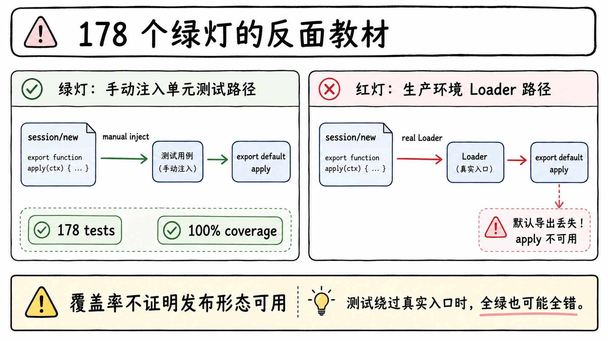

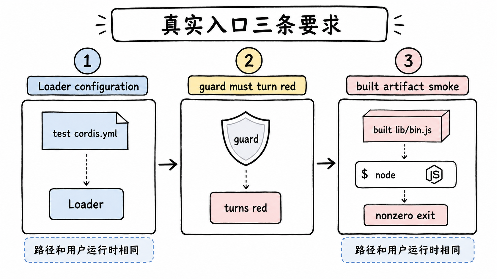

## 真实入口路径：三条具体要求

postmortem 的教训被沉淀成三条可执行的要求。

产品可见的插件需要一个非 unit 的真实组合测试。手工 `ctx.plugin(...)` 的 suite 不算数，要通过 Loader 和 app 进程启动一个 test-only 的 `cordis.yml`，只 mock 外部服务，断言模型可见的请求和日志、持久化状态或用户可见输出。判断标准就一条：这个测试走过的加载路径，和用户运行时走过的，是不是同一条。

守卫要先证明自己会红。一个 guard 只有在回归真的让它失败时才 guard。dsh 的解法是显式断言 `expect('default' in mod).toBe(false)` 加 `unwrapExports` 往返检查，然后照仪式证明它：引入回归，看它红，还原。没看过红的守卫，等于没有守卫。

测发布的产物。一个包的 bin 要在普通 node 下跑构建后的 `lib/bin.js`，因为 tsx 会掩盖一批失败：settle 竞争、模块解析、被吞掉的加载错误。built-artifact smoke（如 `packages/examples/*/tests/built-bin.e2e.ts`）必须保持绿，还要断言配置缺失时以非零码退出。postmortem 里那个陈旧 lib 骗过本地测试的事故，反过来也说明构建产物一旦参与解析就必须被显式测试拥有。

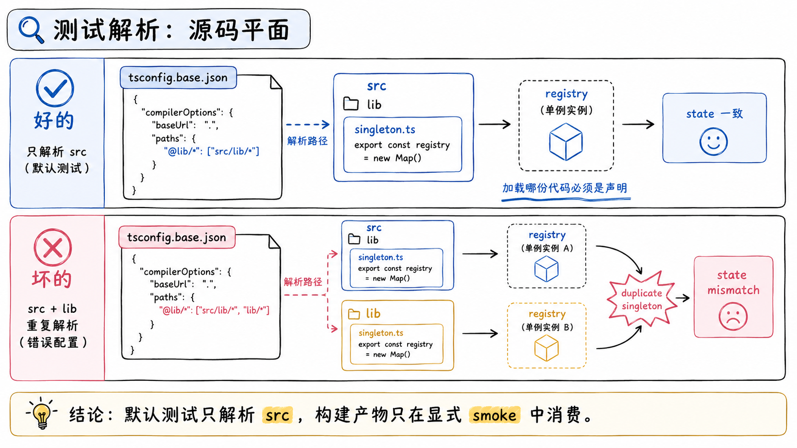

## 测试解析：源码平面

postmortem 暴露的"陈旧 lib 骗过模块解析"被一条全局规则堵住：所有 vitest config 把 vite-tsconfig-paths 指向 `tsconfig.base.json`，裸 workspace import 一律解析到 `src`，永远不经过 package exports 到构建后的 lib。两份模块 singleton 导致的状态不一致，从根上不允许发生。

构建产物只在被显式消费时参与：lib 模式的子进程和 built smoke。子进程的启动统一走共享的 dual-mode launcher，CI 和带 build 的 lane 从构建后的 lib 启动每个示例子进程，不手写 `--import tsx`。不加载 Cordis 的协议和 OS fixture 用可擦除的 `.ts` 直接以 Node 跑。只有测试主题本身就是源码路径解析时才选 `src`，并且要在测试里把这个契约写出来。

双份代码同时在场的故障形态值得说具体。测试进程里一旦同时加载了 src 的模块和 lib 的模块，两个文件各自持有自己的模块级状态，注册表、计数器、单例服务全是两份。症状是诡异的状态不一致：注册了却查不到，计数对不上，事件监听重复触发，而且每次复现的路径还不一样。把解析钉死在源码平面，等于把这一整类"测的不是你想的那份代码"从根上排除，让"加载的是哪份代码"从运气变成声明。

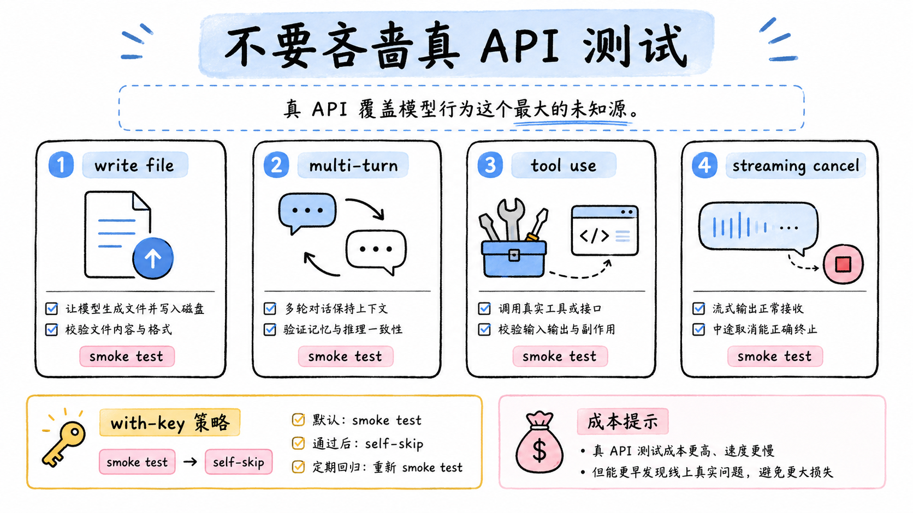

## with-key 策略：不要吝啬真 API 测试

测试政策里最反直觉的一条用粗体写：We are DeepSeek，不要吝啬真 API 测试。

逻辑链条是这样的。无 key 的测试只证明管道通，请求能组出来、流能被解析、事件能被分发。带 key 的运行才证明 agent 对真实模型工作：模型真的会按这个 schema 调工具，多轮对话真的能维持状态，流中途取消真的能干净停止。前者是 plumber 的验收，后者才是产品的验收，两者之间隔着模型行为这个最大的不确定源，而恰恰是这个源，除了真打没有任何替代品。

所以要求反过来写：覆盖写文件的 prompt、多轮对话、工具使用、流中途取消，都要有带 key 的版本。最高价值的是 smoke 测试，启动真实示例，发一个 prompt，检查世界。它们抓的就是"单测全绿但产品是坏的"，postmortem 0001 那一类。

每个 suite 没有 key 时 self-skip 是配套设计。跳过不是成本信号，是让无 key 的 CI 和无 key 的贡献者不被阻塞，同时保证有 key 的环境一跑就覆盖。每个示例自带无 key 和有 key 两套 smoke，两边互补而不冗余。真 API 测试自己的两个麻烦也要管住：一是慢和不稳，带 key 的断言偏向世界状态的强断言而不是输出文本的弱匹配，一次失败值得人看一眼而不是重试掩盖；二是费用和钥匙管理，provider 特定的 smoke 按环境变量分门别类，一个跑不起来的 suite 静默让位，不拖累整条 lane。仓库根的 `BENCHMARK.md` 目前只是一份三行的指引，指向 Python SDK 教程，叮嘱用独立 workspace 和 session id 跑基准任务：agent 层面的基准测试还没有体系化的车道，这是当前的真实状态。

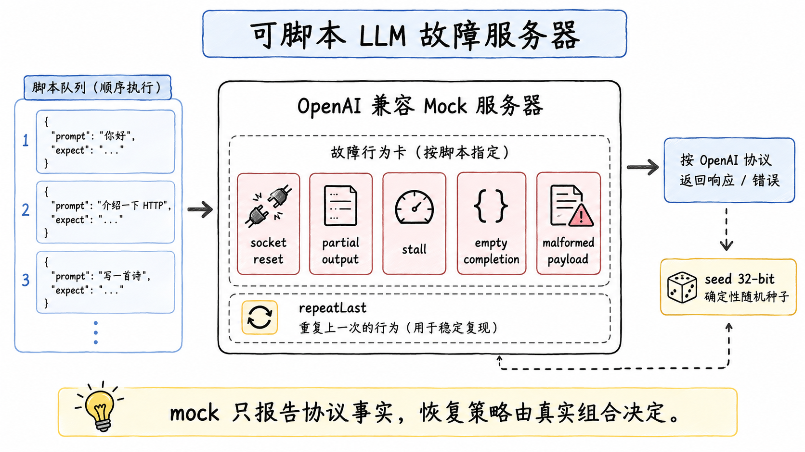

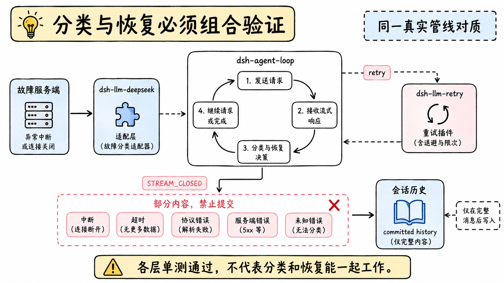

## mock 的边界与一台故障服务器

mock 原则一句话：只 mock 昂贵或不确定的边界，LLM 适配器、网络、时钟，边界下游全部用真实实现。一个手写的替身只证明桥搬运了字节，不证明发布的工具按断言工作。

但"mock 模型"这件事在这个仓库里已经长成了一台正经的设备。`packages/test-support/llm-mock-server` 是一个可脚本控制的协议层故障服务器：一个 Node HTTP 服务器，接受 OpenAI 兼容的根路径和 `/v1` chat-completions 路径，校验可选的 bearer token，捕获请求，对每个已接受的请求消耗一个显式行为。行为目录覆盖了传输与协议的完整谱系：socket 重置、发完 header 就断、输出部分内容后断开、停滞、合法但空的完成、没发 `[DONE]` 就正常 EOF、畸形 payload、典型 HTTP 故障，也有正常的那一侧：完整的文本/推理/工具调用响应、慢速流式输出、撞 token 上限的完成。脚本耗尽时明确报错，设 `repeatLast` 才重复最后一项；`random` 脚本项按权重随机，公开并记录 32 位 seed 让随机可复现。`pnpm run mock:llm` 起一个独立进程，开发者把现有应用的 base URL 和 API key 指过去，就能拿到确定性的传输故障。

这台服务器的价值在它的克制：只报告协议层事实，不判断是否可重试。真正的组合测试让请求依次穿过 `dsh-llm-deepseek`、`dsh-agent-loop`、`dsh-llm-retry` 三层，验证在默认策略下连接遭拒、硬断开、部分输出后重置、空闲超时、语义空完成都能恢复，而正常关闭但被截断的流仍归类为 `STREAM_CLOSED`、默认不重试。失败请求的部分分片不会泄漏进已提交的模型历史，也在这个组合里验。换句话说，分类和恢复这两个最容易各测各的层，被放在同一条真实管线上对质。

恢复测试之外还有属性测试补示例测试的盲区。协议形态的包（llm 的 BlockAssembler、session 的事件日志、tools 的参数 schema、agent-loop 的发送调度）各有一个 `fast-check` 驱动的 `tests/properties.spec.ts`，生成器调优成逼真但对抗性的输入，本地总耗时控制在远低于 10 秒。这套东西第一次运行就抓到一个真实 bug：同一索引处重复的 `block-end` 会改写已经完成的块。示例测试固定你想到的用例，属性测试撞你没写过的交错，两者是互补不是替代。

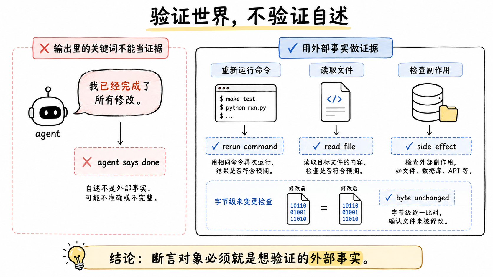

## 验证世界，不验证自述

这条纪律区分好测试和坏测试，标准只有一句话：e2e 断言应该重新跑命令或重新从外部读文件，而不是在 agent 的输出上探针。

在 agent 输出上搜关键词，会让一个作弊的 agent 通过。这不是假设，模型会幻觉、会提前宣称成功、会把失败的执行描述成完成。断言的对象必须和被验证的事实同一个东西。落到操作上是三类具体做法：断言未触及的文件字节一致，重新读那个文件和原始版本比；断言 agent 真的写了文件，检查文件存在且内容正确；断言命令真的执行了，检查命令的副作用。

配套的还有资源纪律。e2e 测试拥有自己的资源，在 `afterEach` 里 dispose，失败、重试、超时都要走到。共享 fixture 放普通的 `tests/harness.ts`，不放另一个 `*.e2e.ts`，因为 import 一个 spec 会重新注册它的 describe 块并复制真实 API 调用。

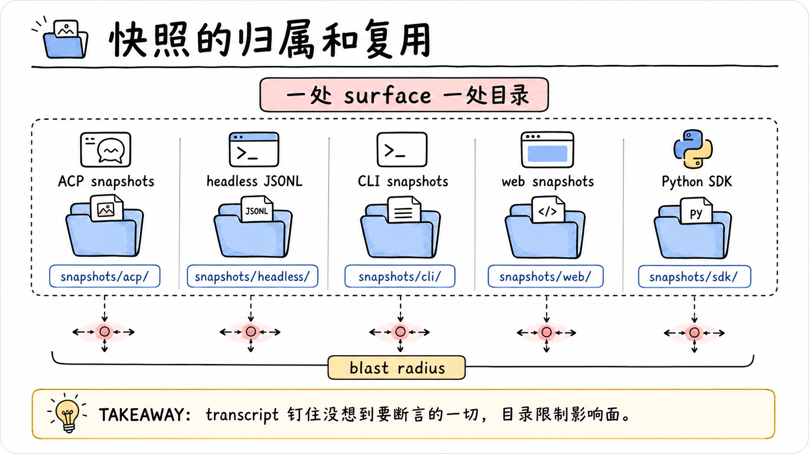

## 快照的归属和复用

每个非平凡的模型、协议或人类可见的变更，要求在同一个 PR 里通过 runnable example 的 snapshot suite 加或更新一个无 key 场景。包测试、e2e 断言、mock 组合、PR 描述，都不替代组装后的 transcript。

为什么 transcript 级的钉住不可替代。一个 e2e 断言验证的是你想到要验的东西，一个快照钉住的是你没想到要验的一切。system prompt 的组装顺序、工具 schema 的字段形态、事件流的先后、日志的持久化形状，全在 diff 里。变更把某个 prompt section 弄丢了，断言可能碰巧没盯它，快照一定会红。代价是快照的红噪音更大，所以规则同时要求每个 diff 人审、fixture 用 tokenize 和分层把爆炸半径压到最小：一个叫 `text-turn` 的 ACP 场景钉住完整的 system prompt 和工具 schema，其他 fixture 把它 tokenize 掉，一个 header 改动只影响一个 fixture。

不同 surface 的快照各有归属：ACP 场景在 `examples/<name>/tests/snapshots/`，headless 后端场景归 `examples/headless-agent` 的 canonical-event JSONL，交互终端旅程在 `apps/cli/tests/snapshots/`，浏览器渲染在 `apps/web/tests/snapshots/`。归属清晰的价值在 blast radius：一个 surface 的变更只动自己的快照目录。两个 SDK 必须同步更新，TypeScript 侧的 `examples/jsonrpc-agent/tests/snapshots/` 和 Python 侧的 `scripts/snapshots/python-sdk-single-exe/`，后者只由 python-runtime 的 CI job 跑。fixture 的保留策略也定死了：header 和 payload 保留，body 里的时间和序号信封省略，回放时合成；旧布局由 `scripts/migrate-packed-session-fixtures.ts` 迁移，不让历史 fixture 变成一次性负债。

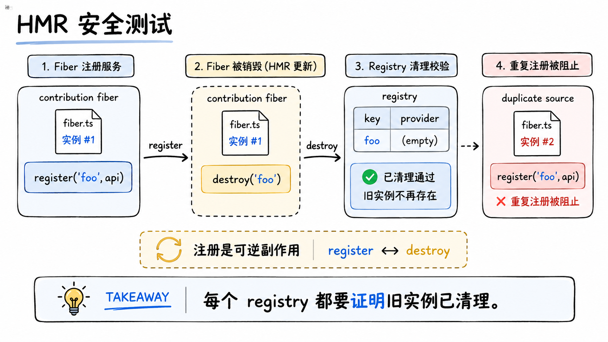

## HMR 安全测试

每个注册表带一个 HMR 安全测试，做法是销毁贡献 fiber、断言清理。这件事在 dsh 里的分量比在普通项目里重，因为全插件化是它的核心卖点：注册是可逆副作用不是口号，是每个 registry 上都跑着的运行时断言。

如果 HMR 后旧实例的注册没清理，新旧实例的注册会冲突，而冲突的表现是"同一个服务有两个来源"，这类 bug 在运行期极难定位。把清理检查放进每条 lane 都跑的 unit 层，等于把插件化的核心承诺变成了测试资产。

## 性能压测：两条不设门禁的 lane

功能测试回答行为对不对，性能测试回答扛不扛得住。两个问题的失败模式不同，所以性能压测独立成两条手动 lane，都不在 CI 门禁里，是开发者显式跑的诊断工具。

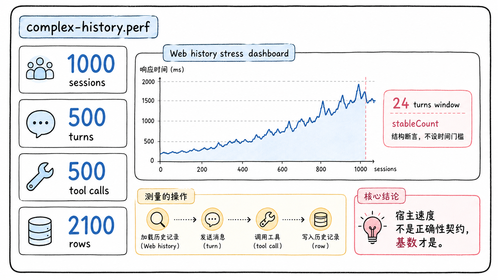

### 高基数渲染：complex-history.perf

第一条落在 `apps/web/tests/complex-history.perf.ts`，通过 `vitest.web.perf.config.ts` 运行，package.json 里对应 `test:web:perf` 和 `test:web:perf:built` 两个入口，后者自带构建步骤。

测试构造的是极端数据量，常量写在文件头：1000 个侧边栏会话，一个 500 轮的长历史会话，每 10 轮一次工具调用、每次 10 个工具共 500 次调用，轨迹面板 2100 行，默认历史窗口 24 轮，流式节奏固定 8 毫秒一个增量，另有一个 8 轮的对照会话和一个 100 轮的 soak 会话。构造方式是合成 session log：程序化生成会话事件，序列化成 JSONL，seed 到 Web scaffold，不依赖真实模型。

指标通过 Playwright 的 CDP session 采集，操作前后各采一组算 delta。时间类：挂钟、浏览器 task、JS 执行、布局、样式重算；增量类：DOM 节点、事件监听器、堆内存。采保留状态前强制 GC。测量覆盖的操作是完整的一段用户旅程：启动到就绪、侧边栏展开、内容搜索、打开长历史、冷轨迹渲染 2100 行、折叠 turn、轨迹搜索、历史分页、分页后回切的热轨迹和热对话。

整个文件最重要的设计决策写在注释里：报告测量值但不做时间断言，因为宿主速度不是正确性契约。一个 `expect(wallMs).toBeLessThan(500)` 在快机器上过、慢 runner 上挂，时间断言把机器性能混进正确性判断。dsh 的做法是结构断言只答数量对不对：侧边栏展开 1002 个条目，长历史初始 24 轮、分页到底 500 轮，冷热轨迹都是 2100 行，折叠后少于 2100。soak 场景在 500 轮历史上再发 100 轮对话，每 10 轮一个检查点，采 DOM 元素、节点、监听器、堆内存四项保留账，回答随轮数增长浏览器留下了什么；每轮还测点击到回显、到首个 chunk、chunk 到 settled 的耗时，回答长对话是否越来越慢；soak 结束后单独测第 101 轮的发送渲染。结构断言防的是基数缩水这个隐蔽的 bug 类：一个优化让渲染变快了，方式是少渲染了一些东西，可见行为没变，功能测试不抓，但用户的侧边栏少了几百个会话。配套的 `stableCount` 每 50 毫秒读一次计数，连续 4 次读到相同且满足判断的值才返回，防异步渲染的暂时性计数骗过断言。

时间数据通过 `console.info` 以 `WEB_PERF_RESULT` 前缀打成 JSON，含每窗口的平均值和 p95，人来看趋势。测试只在 replay 模式下运行，record 模式直接抛异常，因为同一个回放 override 每次产出同样的模型响应，测量才有可比性。

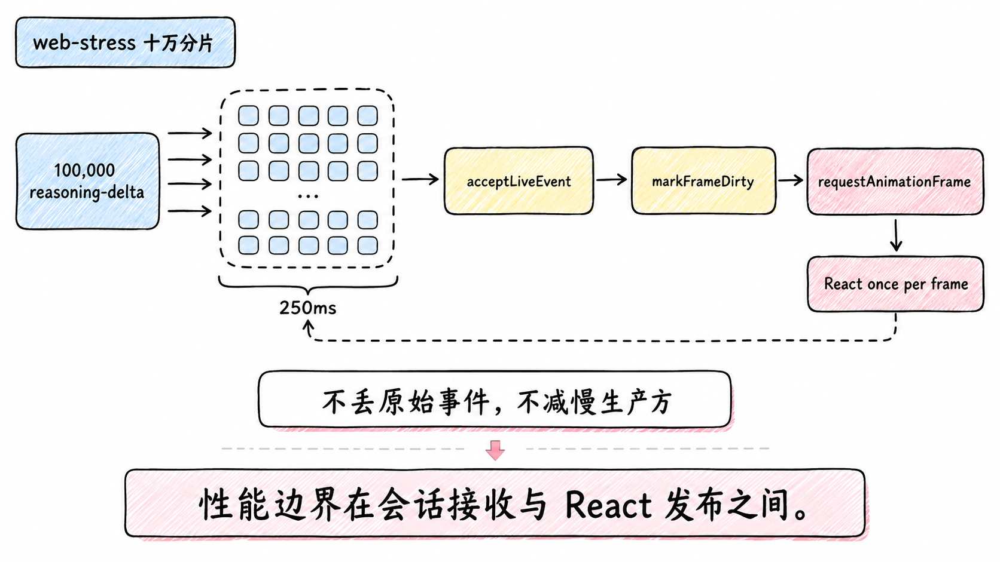

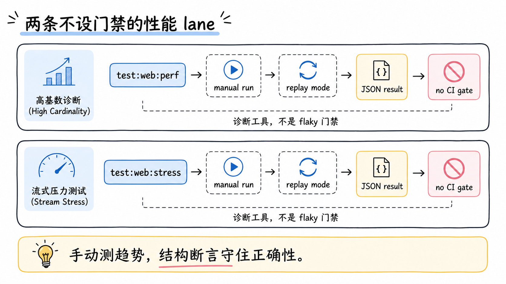

### 十万分片压力：web-stress

第二条 lane 是 `test:web:stress`，配置文件 `vitest.web-stress.config.ts`，同样无密钥、需显式启用。它验证的是 2026 年 8 月初那次流式发布机制改造：`Session.acceptLiveEvent()` 立即追加每个原始事件并同步更新会话派生状态，可见分片通过 `markFrameDirty()` 发布，第一项变化调度一次 `requestAnimationFrame`，一帧只重建一个累计快照、只通知 React 一次，结构事件（定稿、工具、错误）仍走微任务并能抢占旧的帧回调。

压力场景是确定性的 `?fixture` 会话以独立于绘制的节奏发出 100,000 个 `reasoning-delta`，结尾标记证明事件经过生产会话归并并到达实时 Think 行。50 毫秒心跳和预先调度的 DOM 事件分别测量主线程停顿与交互延迟，250 毫秒预算用于识别明显回归（这是诊断阈值，不是 CI 门禁）。`DSH_WEB_STRESS_HEADFUL=1` 让开发者在可见浏览器里用 Performance 面板分析同一场景。这条 lane 的设计理由值得整段抄下来：性能边界必须位于会话接收与 React 发布之间，不能通过减慢生产方或丢弃原始事件来掩盖问题；按动画帧控制测试生产方节奏也不行，生产方会在渲染变慢时同步减速，让页面获得真实网络流不存在的隐式背压。配套的聚焦单测守住发布次数与抢占顺序，十万分片的工作负载不进默认套件。

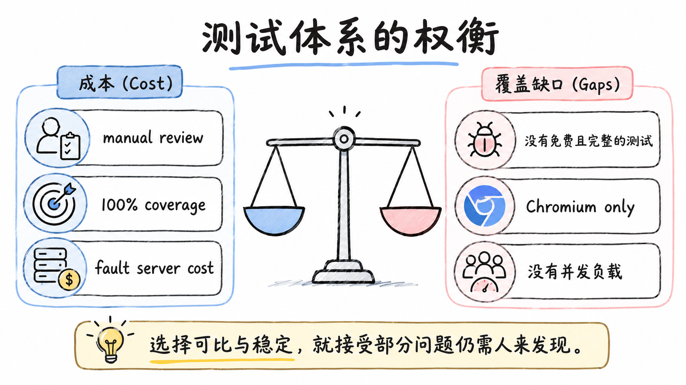

## 权衡

不做时间断言意味着性能退化不会被 CI 自动抓住，要靠人看 JSON 发现。放弃自动化性能门禁，换来的是跨机器可比和不 flaky，这笔账在团队规模小、性能问题低频时划算，规模变大后需要在两者之间找新的平衡点，比如同机基线对比。

覆盖范围偏科。两条性能 lane 都只测 Web 客户端，Node 侧的 agent loop、模型请求延迟、工具执行耗时没有等价 benchmark；只测 Chromium，Firefox 和 Safari 的性能特征不在视野内；soak 是持续使用不是并发压力，真正的多用户压测不在范围；agent 层面的基准指引只有三行 stub。

per-file 100% 覆盖率对贡献者是持续的压力，每一行新代码都要有测试触达。它的回报是把死代码问题变成门禁信号，但代价是偶尔要为防御性分支写价值密度不高的测试，以及 pwsh 这类平台依赖的豁免逻辑本身也是维护面。属性测试和故障服务器这类装备的搭建成本也不低，收益要靠"第一次运行就抓到真 bug"这类事件持续证明，装备闲置时它看起来像负担。

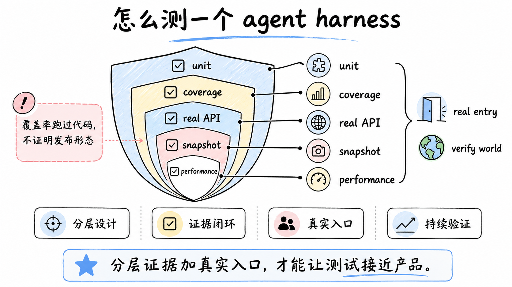

## 结论

这套体系的骨架是分层且各答一个问题：unit 管边缘情况和属性，coverage gate 管行覆盖和死代码，real-API e2e 管真模型，snapshot 管组装后的转录，web snapshot 管浏览器呈现。贯穿的纪律有四条：不吝啬真 API 测试，mock 只留在昂贵或不确定的边界（mock 本身已经长成可脚本、可复现的故障服务器），验证世界不验证自述，测真实入口路径和发布产物。postmortem 0001 是这套纪律的来源之一，178 个绿测试加 100% 覆盖挡不住一行多余的 default 导出，因为测试路径绕过了 Loader。性能压测单立两条手动 lane：高基数渲染不做时间断言因为宿主速度不是正确性契约，结构断言保住基数不缩水；十万分片压力 lane 把发布频率钉在浏览器绘制频率上。要带走的一句话：覆盖率证明代码行跑过，不证明功能按发布的形态工作。

## 延伸阅读

- [Testing Policy 全文](https://github.com/deepseek-ai/deepseek-harness/blob/master/docs/testing.md)：五层 lane、mock 边界、快照归属的一手规则
- [Postmortem 0001: ACP Default Export](https://github.com/deepseek-ai/deepseek-harness/blob/master/docs/postmortem/0001-acp-default-export-drops-inject.md)：178 个绿测试与生产全崩的复盘
- [可脚本控制的 LLM 协议层故障服务器](https://github.com/deepseek-ai/deepseek-harness/blob/master/.agents/notes/implemented/testing/2026-07-25-scriptable-llm-wire-fault-server.md)：行为目录与组合验证设计
- [推理分片逐帧发布与浏览器压力验证](https://github.com/deepseek-ai/deepseek-harness/blob/master/.agents/notes/implemented/testing/2026-08-03-opt-in-reasoning-chunk-browser-stress.md)：markFrameDirty 机制与 stress lane 的理由
- [Web Performance Test 源码](https://github.com/deepseek-ai/deepseek-harness/blob/master/apps/web/tests/complex-history.perf.ts)：高基数场景的全部常量与探针

上一篇：[dsh 的错误处理与容错：这个 harness 怎么不崩](./42-error-handling-fault-tolerance-philosophy.md)
下一篇：[dsh 的文档即代码：脚本生成图、目录与校验门禁](./45-docs-as-code-autogen-graphs-catalogs.md)
