# dsh 当基座：能力审计与三条红线

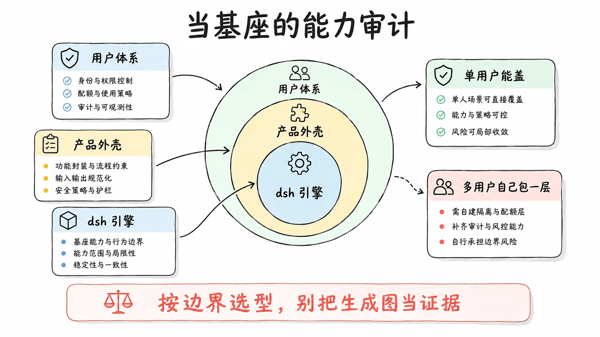

> 把 DeepSeek Harness（`dsh`）从"每天打开的 CLI"变成"自己产品底下的基座"，要回答的是另一组问题：产品怎么把它装进来（Python SDK、headless、ACP、Web 插槽、工具插件，五个进入面）；装进来之后能拼什么（自动化、状态、配置分发，三块底座）；以及哪里会翻车（三条红线：它不肯当服务器，地基每几天动一次，执行面只会一种语言）。本篇按 v0.1.3-alpha.1（2026 年 9 月 4 日）的源码和官方文档逐项判定，每项给可用、勉强、不可用三档结论。总判定：单用户桌面工具今天就能盖；多用户服务要么自己包一层，要么再等。

## "当基座"是另一件事

同一个 `dsh`，两类用户的处境完全不同。

CLI 用户打开 Web 界面或终端，和 agent 对话，让它读代码、改文件、跑命令。会话怎么持久化、界面长什么样、版本怎么升级，全是官方的事。官方为这一类用户做的所有取舍，都藏在"打开就能用"的体验后面。

基座用户反过来：`dsh` 住在你的产品里当 agent 引擎。你的代码创建会话、发任务、收结果；你的界面面向你的用户；你把一整套配置打包分发给别人。会话生命周期归你管，升级节奏也被迫归你管。官方为 CLI 用户做的那些取舍，现在全部变成你的约束。

什么时候你从第一类变成第二类？三条判定线，命中任何一条就算：你的进程在驱动会话，而不是人在输入框里打字；你要加自己的领域工具或改界面；你要把配置打包发给别人。

本文用一个贯穿案例撞每一项审计：交易工作台。行情获取、策略研究、信号输出、下单风控，这是一个会把所有支持面都撞一遍的设想。而且截至成文，公开生态里没有任何人把 coding harness 当基座做过交易产品；框架层的知名项目（TradingAgents、ai-hedge-fund）全部止步于产出信号和模拟盘。每个审计项都会问一句：交易台在这项上能不能落地。选交易台正因为它苛刻：要定时、要凭证、要风控、要界面，四类需求正好覆盖一个基座用户会踩的全部坑。

审计基于 v0.1.3-alpha.1 的源码和官方文档，判定三档：可用，官方支持且没有重大缺口；勉强，有路但有明确代价；不可用，官方明确拒绝或能力缺失。判定依据是源码和文档，不是路线图承诺。

## 三十秒：引擎住进你的进程树

先给一个不用项目名词的画面。你把一台引擎吊装进自己的厂房：引擎的点火、转速、机油归引擎厂管，但方向盘、仪表盘、车壳全归你造，交付给谁的整车也归你定义。厂房里可以同时吊多台引擎，每台有自己的机油仓，互不串味。

落到 `dsh`：引擎就是 agent 会话的驱动能力，机油仓是它自己的家目录（存配置、凭证、会话），方向盘是你代码里的 API 调用。这个画面的边界要记牢：引擎厂不管你的车壳，也不管你的车要卖给几个乘客。所有"能不能当基座"的问题，都是在问这台引擎的吊装点、油路接口和保修条款。

## 五个进入面：产品怎么把 dsh 装进来

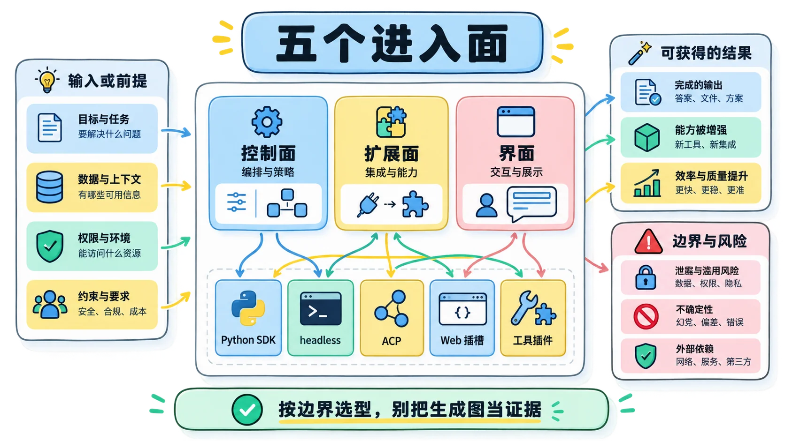

先给五个进入面一个统一的坐标，不然它们像五个互不相干的按钮。你的产品和 `dsh` 之间只存在三种关系身份：控制面（你的代码驱动它的会话）、扩展面（你给它的能力树加东西）、界面（你改变用户看到的东西）。Python SDK、headless、sdk profile、ACP 都是控制面，差别在进程边界和协议；工具插件和 MCP 是扩展面；Web 插槽是界面。五个进入面按嵌入深度排，从"整个引擎住进你的进程树"到"往它身上拧一颗螺丝"。一个真实产品通常同时占两三个身份：交易台用 SDK 做控制面、用工具插件做扩展面、用插槽卡片做界面。身份分得清，后面的判定就不会乱。

### Python SDK：整个引擎住进你的进程树

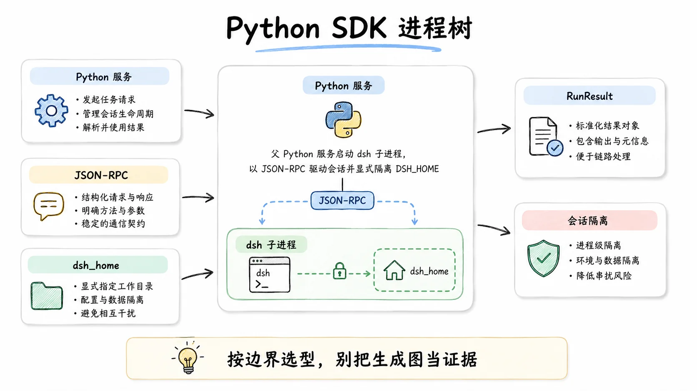

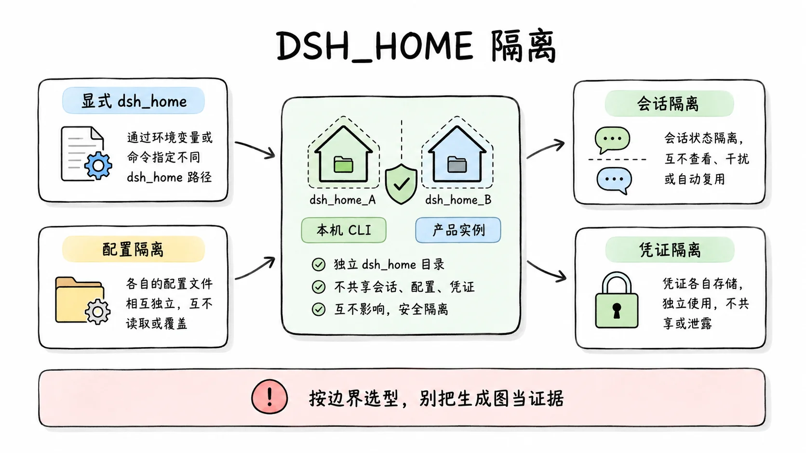

判定：可用，带两个条件。

`deepseek-harness-sdk` 发布在 PyPI 上，工作方式是起一个 `dsh` 子进程跑 sdk profile，父子进程之间用按行分隔的 JSON-RPC 通信。你的 Python 代码创建会话、发任务、按到达顺序收事件通知，子 agent 的后代事件也收得到。配套的 `runtime-bin` 包把 `dsh` 和 Node 运行时打成单个可执行文件，目标机器不用装 Node；SDK 与 runtime 精确同版本互锁，装的就是严格匹配的版本对，不存在半新半旧。

有一个设计细节值得单独说：SDK 刻意不去发现默认家目录。每次启动都必须显式传 `dsh_home`（或在子进程环境里给非空的 `DSH_HOME`），SDK 永远不会自己去找 `~/.dsh`。这不是麻烦，是隔离承诺：你的产品实例和用户自己装的 CLI 各用各的家目录，配置、凭证、会话互不污染。基座用户最怕的就是"测试时读到了我本机的配置"，这条设计把那类事故从根上堵死了。

返回值的结构也有讲究。一次 `run()` 拿回 `RunResult`：`final_response` 是这个区间里根会话最后一条已提交的助手文本；`finish_reason` 是最后一个轮次的结束类别，比如 completed、max-tokens、error；`events` 只含根会话的事件，后代会话的内容进 `notifications`，按线上顺序到达。后代输出不能顶替根响应，这条边界保证你拿到的"最终答案"永远来自你直接对话的那个 agent，子代理的中间产物只是通知。写轮询和写报表的人要靠这条边界才能睡安稳。

交易台对应：Python 服务里起 SDK，接收研究请求，驱动 agent 会话。"后端 agent 引擎"这条路成立。把这条路的具体形状走一遍，因为它的用法和直觉不一样。SDK 对象不是"一次对话"，是"一台常驻引擎"：同一个 `DeepSeekHarness` 实例可以反复跑任务，会话身份由你每次传的 session id 决定。传一个新 id，得到一段全新对话；复用旧 id，引擎接着那段持久化对话继续，会话级资源也跟着延续。所以交易台服务的正确姿势是：进程启动时起一个或几个 harness 实例放进池子，请求来了领一台、配一个新 session id、跑完归还；研究员要追问昨天的分析，就传回昨天的 id。初始化握手有独立的 30 秒默认上限（普通轮次不设限，除非你显式配），超时报错会带上所选 profile 和留存的诊断信息，不会让你对着一个哑等的进程猜原因。

两个条件都写在文档里。第一，SDK 的接口全部同步阻塞，没有异步版本，要并发就多起子进程，进程池自己管理。第二，自定义工具不能在 Python 侧注册，工具必须用 TypeScript 写成 Cordis 插件（`dsh` 的插件机制，插件向共享上下文贡献服务和工具）装进 profile。一句话：用 Python 指挥，用 TypeScript 扩展，控制面和扩展面是两种语言。持久化扩展走 `dsh plugin add file:/路径` 把本地 bundle 装进 profile；调用期的一次性改动传 patch 文件，SDK 会按顺序转发到 profile 层和 home 层之上。

平台覆盖：linux x64 与 arm64、macOS arm64 与 x64、Windows x64 都有 wheel，Windows arm64 没有。

### headless 与 sdk profile：进程外的两种姿势

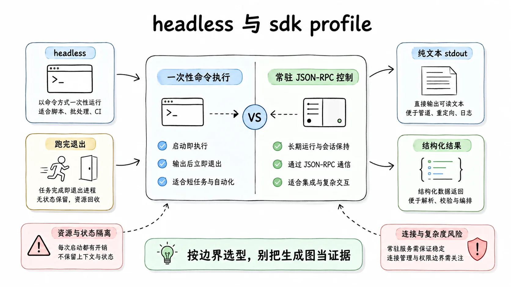

判定：可用。

`dsh --profile headless "任务"` 是一次性执行：跑完退出，stdout 打最终答案，退出码 0 或 1，不开端口，不能追问。注意输出是纯文本不是 JSON，要结构化结果就走 SDK。它适合外层 cron 和 CI 调用。交易台"每天收盘后跑一次复盘"这种动作，headless 是自然选择，定时逻辑归外层。

`dsh --profile sdk` 是编程式 JSON-RPC：先协商模型和参数，再发任务，等到空闲状态结算。任何语言只要会说 JSON-RPC 都能驱动，不绑定 Python。这个 profile 有个硬约束：你换用自定义 profile 时，组合里必须保留 SDK 的 JSON-RPC server 那一行，否则 CLI 启动或 SDK 初始化直接失败，没有"退化成裸配置"的兜底。fail fast，不悄悄降级，这是这个项目一贯的姿态。

仓库里还有个 sdk-minimal profile，定位值得基座用户知道：它不叠加在 dsh-base 上，是一个独立的显式插件树，只带持久 Bash、字符串替换编辑器、本地执行和 JSONL 会话，settings、凭证管理、遥测、Web 工具都不在树里。给嵌入产品做体积和攻击面控制时，它是官方留的窄门。

### ACP：接进编辑器，只当控制面

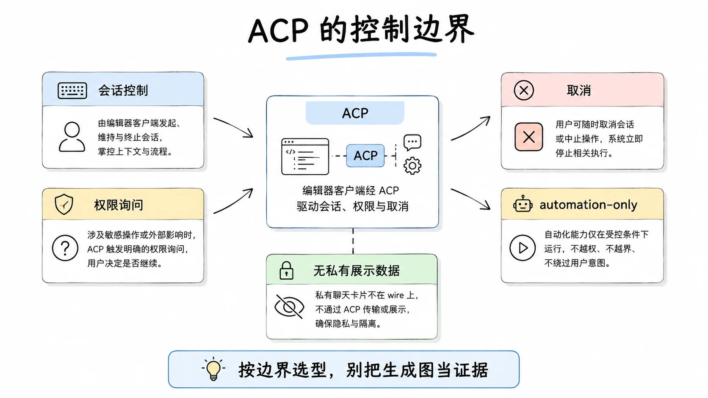

判定：可用，边界清晰。

ACP（Agent Client Protocol）是编辑器和 agent 通话的标准协议。`dsh --profile acp` 让 `dsh` 作为 server 被 Zed 这类客户端驱动：一条连接多个会话，支持列出、恢复、关闭会话，设置模型，弹权限询问，挂 MCP server。权限询问这一条值得基座用户多看一眼：ACP 客户端可以充当审批的应答方，这意味着走 ACP 的 `dsh` 实例保留了 ask 能力，agent 请求升级权限时编辑器会弹真问题给真人。协议文档同时写明它的定位是 automation-only，wire 上不暴露任何私有展示数据，聊天卡片、任务清单、计划这类界面数据拿不到。

为什么界面数据不给？因为 ACP 的使命是让任何编辑器都能驱动任何 agent，协议里只放两家必须达成共识的东西：会话控制、权限、取消。界面表达是每家客户端的私产，进了协议就变成所有客户端的枷锁。这个取舍对基座用户的含义很直接。

交易台对应：把 `dsh` 接进自己的编辑器或自研客户端当控制面，可以；想拿 ACP 当产品界面的数据源，不行。你的产品的界面必须走 Web 插槽或 SDK 这两条路。

### Web 插槽：改得了聊天，加不了页面

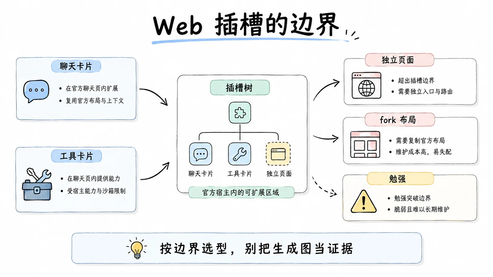

判定：勉强。

Web 界面的扩展机制是插槽（slots），一套类型化的 React 组合系统。官方界面本身就是用插槽树搭的：侧栏、会话区、详情区、覆盖层，插件往这些位置注册自己的组件。设计内的用法很清楚：会话流里的自定义卡片（行情、持仓、盈亏曲线就往这挂），自定义工具的调用卡片，输入框附近的动作按钮。

边界在插槽树的形状上：树里没有"新增一个独立页面"的位置。想要一整页的下单台，只能 fork 官方布局包，把现有插槽当替换点。fork 在 pre-1.0 下的代价，红线二里算。

会话流里的自定义卡片走的是 ConversationNode 机制：插件注册一个节点定义加一个按键渲染器，渲染器拿到的状态边界是投影裁剪过的会话视图，拿不到引擎内部对象。这个边界保证了界面插件崩了只崩一张卡片，不会拖垮会话本身，也保证了卡片代码无法绕过工具审批直接碰执行层。

交易台对应：聊天内嵌卡片是设计内用法，代价小；独立工作台布局超出扩展面。

### 工具插件与 MCP：扩展面里最硬的一块

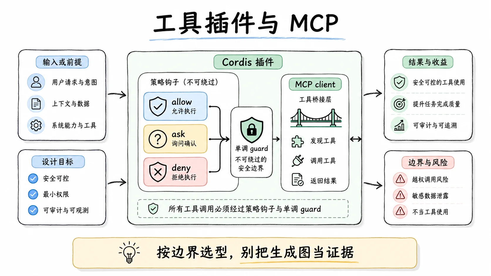

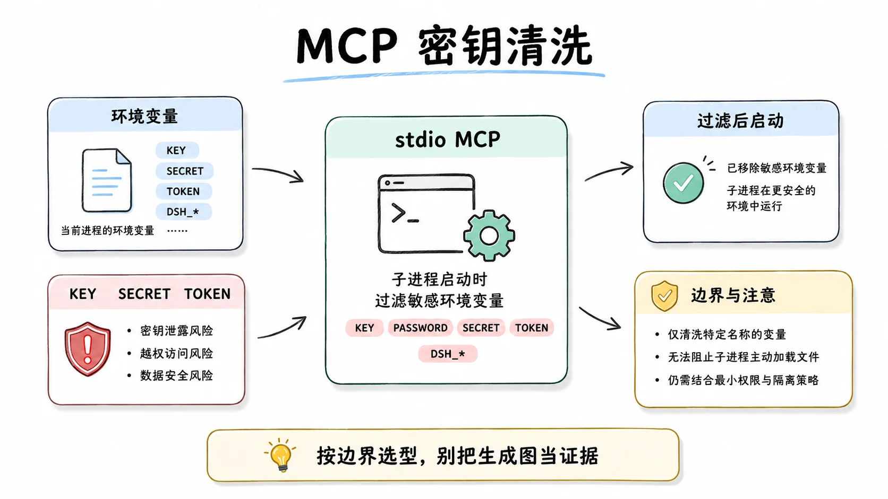

判定：可用，五个面里最硬的。

自研工具走 TypeScript Cordis 插件：注册工具，参数自动校验，输出归一化 JSON，自带界面卡片钩子。关键是执行前的策略钩子，allow、deny、ask 三种裁决。交易台的下单工具就在这里挂风控：金额超限 ask，黑名单品种 deny。旁边还有一个更硬的 guard 接口，裁决一旦 deny 就单调不可放行。这两个挂点在后面红线三的讨论里还会回来，它们是 harness 级的风控原语，不是外挂脚本。

MCP（Model Context Protocol，给 agent 接外部工具的开放协议）消费是现成的：`dsh` 是 MCP client，stdio 和 Streamable HTTP 都支持，一个 server 一行配置，工具自动以 `mcp__<server>__<工具名>` 的名字进工具表，调用 60 秒超时，断线自动重连。stdio 方式起的 MCP 子进程会做环境变量清洗，名字里带 KEY、PASSWORD、SECRET、TOKEN 的变量直接剥掉，`DSH_*` 变量也剥。这条清洗规则对交易台是实打实的安全收益：MCP server 的供应链问题不会顺走你环境里的密钥。

交易台对应：这是最顺的一块。Binance 官方的 Agent OS MCP 提供专用子账户，可下真实订单；Alpaca 官方 MCP 有 61 个端点，支持 paper key；QuantConnect 的 MCP 有 60 多个端点，回测和实盘部署都能走。行情和下单全部经 MCP 接入，一行对接代码不用写。

MCP 的边界：只桥接工具，resources 和 prompts 不桥。断了以后的行为也有明确文档：自动重连带退避，工具在断连期间保持列出但调用失败，重连预算耗尽后工具注销、重连停止，直到 reload 或重启。

## 能力底座：装进来之后能拼什么

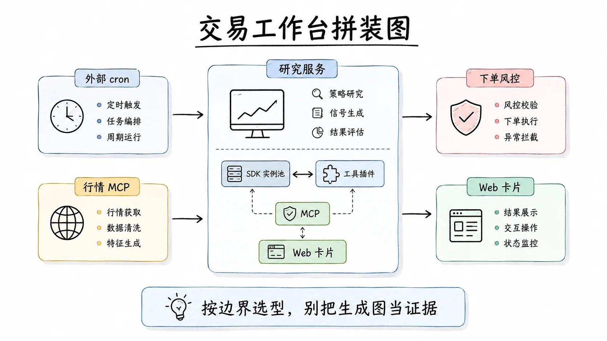

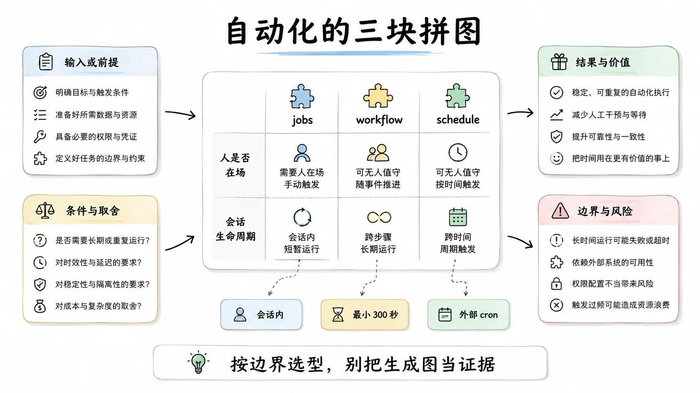

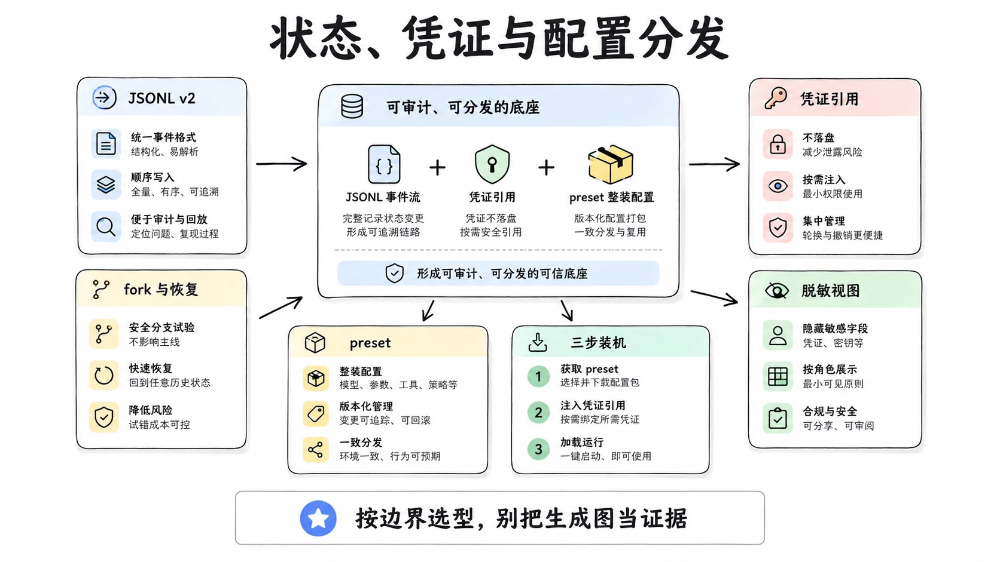

进入面解决"怎么进来"，底座解决"进来之后用什么"。先把交易台拼好后的整体形状画出来，再逐块拆：

```text
外部 cron ──> dsh --profile headless "收盘复盘"   （无人值守，跑完退出）
                        │
研究服务（你的 Python）
    ├── DeepSeekHarness 实例池 ──> dsh 子进程（sdk profile）
    │       ├── 自研 Cordis 插件：下单工具（带 allow/deny/ask 风控钩子）
    │       ├── MCP：行情 / Alpaca / QuantConnect
    │       └── 会话 JSONL（fork、恢复、全文检索）
    └── Web 界面（dsh web + 插槽卡片：行情、持仓、盈亏曲线）
```

自动化。三个部件，分界线是人是否在场。jobs 是会话内后台任务，bash 和子 agent 两种，每个发起会话默认并发 10，登记进注册表、由父会话拥有：这个"拥有"是硬语义，父销毁则后台任务随之取消，别人凭 job id 也读不走内容，权限跟着活的所有者走而不是跟着可复制的 id 走。模型用 job_output、job_list、job_kill 这组工具收集和终止它们。workflow 让模型在一次回合内写编排脚本，agent、parallel、pipeline 一类原语，带并发上限和致命错误纪律，"十个标的并行研究再汇总"这种活是它的形状；它和 jobs 的分工是编排与执行：workflow 是模型写的剧本，剧本里的每一幕落到 ctx.subagents 上跑。schedule 是会话内定时，after、at、every 三种粒度，最小间隔 300 秒，没有 cron 表达式。schedule 的文档把边界写得很诚实：delivery mode 就叫 session-local，原会话必须活着，没有外部通知通道，也没有冷会话调度器；错过的定档只补最新一次，不做逐次回放；到点的工作要等 agent 完全空闲才投递，绝不打断进行中的轮次；投递语义是 at-least-once 而非 exactly-once，崩溃窗口内可能重复收到同一条提醒；持久化栅栏失败时报 persistence_uncertain，宁可明说不确定也不猜。交易台对应："打开工作台研究一轮出信号"成立；"每天早上八点自动跑"不成立，定时要用 headless 加外部 cron 自己造。这条边界和"子代理审批钉死 never"属于同一族立场：会话不在场时它拒绝假装自己在场。

状态与分发。会话持久化是 append-only 事件流，JSONL 格式带可选压缩，当前格式版本 v2 且带旧版迁移，支持 fork 和恢复，有全文检索索引。这套地基对基座用户的价值在两处：可审计（一次信号是怎么产生的，重放日志就能还原每一步）和可分叉（同一份研究对话 fork 出三个变体，各试一种策略假设）。跨会话记忆没有内置，官方给的是三套默认关闭的第三方记忆 MCP 参考配置（Memorix 钉 1.3.0、MCP 参考实现 memory 钉 2026.7.4、Engram 钉 v1.20.0）加一份接入指南；文档写明了 `dsh` 的责任边界：解析配置、拉起子进程、发现工具，不负责下载 server、初始化数据库、选 embedding、管云账号，三套配置也明说只是互操作示例，不构成推荐。基座用户要么选一个要么自己上。凭证有专门的缝：API key 用环境变量名做引用，每次使用时解析，设置界面只见描述不见值；轮换密钥在下一次请求就生效，因为消费者每次都重新解析；写入是只写的，读取永远走脱敏视图。交易所 key 放这里，不进代码不进提示词。配置分发两条路：profile 是模板加补丁层，适合你自用；preset 是目录形式的整装配置，可以指向公司内部目录做统一来源，拿去分发"交易台全套配置"，机制是现成的。给团队发一台新机器：装 runtime wheel、指 preset 目录、发凭证引用，三步完事，不用碰 node_modules。

一句话收束：底座最硬的是挂工具、管凭证、打包配置，最弱的是无人值守。

## 红线一：它不肯当服务器

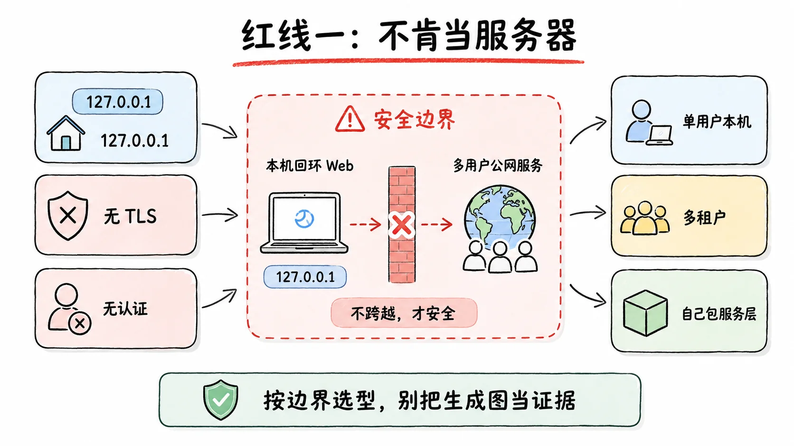

三个事实，都是官方写死的。

出厂 CLI 拒绝把 Web 服务绑到 0.0.0.0，`dsh web` 默认只听本机回环，命令行上直接传 `--host 0.0.0.0` 会被拒绝。webserver 的文档写明载体进程自身不带 TLS、认证和 Origin 策略；配置面允许改绑定，但安全责任全部归组装的人。Web 界面支持多会话、多 workspace，那是同一个用户的多会话，不是多租户；浏览器侧有每次启动轮换的令牌和签名 cookie，但那是单用户本机姿态的认证，防的是同机其他进程，不是防互联网。

一个容易看漏的旁证：这个 HTTP 载体连桌面形态都不用。文档写明 Electron 加载走的是本地文件，网络请求经 IPC 桥转发，不经过这个 server。也就是说官方自己的 GUI 分发路线里，这个 HTTP 入口都只服务于"本机浏览器"这一个场景。基座用户从这条旁证能读出官方对暴露面的克制程度：能不开的口子，连自己的桌面版都不开。

这是定位，不是缺陷。`dsh` 当前明确定位是单用户本地工具，安全公告（SAFETY.md）的原话是：实验性 developer preview，没有经过安全审计，不得按安全或生产系统对待。把"不肯当服务器"和这条公告放在一起读才完整：不是能力不够，是安全责任模型没到那个阶段，官方选择把边界画明而不是含糊。

绕法只有两条。单用户桌面工具和内网单人部署是设计内用法，直接盖。要多用户服务，就用 SDK 或 headless 在自己的服务里包一层：agent 会话当引擎，用户体系、鉴权、租户隔离全部在你那层完成。别试图把 `dsh` 的 Web 界面直接暴露给多个用户，那条路上的每一个坑官方都已经用文档标了雷。

## 红线二：地基每几天动一次

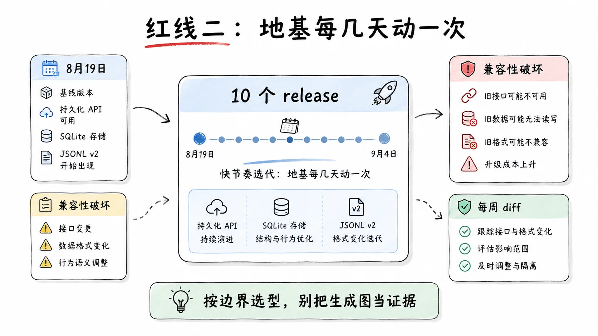

节奏先摆出来：8 月 19 日到 9 月 4 日，十个 release。README 用全大写写着 THERE WILL BE COMPATIBILITY-BREAKING CHANGES。近两周的破坏性变更实例：会话持久化 API 改成生命周期作用域的句柄模型，SQLite 会话持久化后端整个移除，会话格式升 v2。这些不是边角料，全是基座用户最依赖的地基。

升级痛还有一层机制，值得拆开看。官方全仓 252 个包锁步发版，但 npm 的 latest 标签不跟着预发布走。社区实测的漂移样例：`@deepseek-ai/dsh-agent` 的 latest 解析到 0.1.0-rc.6，实际最新发布是 0.1.1-rc 系。单独安装某个 `@deepseek-ai/dsh-*` 包会安静地装到旧版本；错配不报安装错误，以类型错误的形式延迟爆炸，而且报错分散，没有一条可搜索的错误串能定位根因。走 Python SDK 的用户天然免疫这半个坑：runtime 与 SDK 版本互锁，整体装整体换。

插件作者还有记录在案的两难（GitHub Discussion #802）：插件声明自定义事件容易，但把它持久化进会话，可能导致别的进程打不开这个会话。要么放弃领域事件，要么冒写坏会话的风险。官方 8 月底恢复了可忽略事件标记，给了一条安全写非关键事件的路；核心领域事件仍然没有官方持久化通道。

对基座用户，含义就是一句话：每次跟版都是一次源码级 diff。把一次升级日摊开看更具体。周一上游发版：你先跑一遍自己的扩展面测试（工具插件、插槽卡片、preset），绿了再看 changelog 里标破坏的三条：会话持久化句柄模型改了，你的代码如果直接碰过持久化 API 就要改；SQLite 会话后端移除，你的存储配置里如果还引用它，启动就失败；会话格式 v2，旧会话靠迁移读，你的外部分析脚本如果自己解析过 JSONL 就要重写。半天到两天不等，取决于你踩了几层。三个缓解，按性价比排。第一，走 Python SDK 这条路，升级是一个整体动作。第二，扩展面踩得越浅冲刷越小：能用 MCP 解决的不写深度界面插件，能挂插槽的不 fork 布局。社区最大的发行版 oh-my-dsh 的口号是"Overlay, not a fork"，overlay 的跟版成本远低于 fork，这是用脚投票的结果。第三，把跟版写进 CI，每周对上游 diff 一次自己的扩展面。这笔税在 pre-1.0 阶段省不掉，能选的只有交税的姿势。

## 红线三：执行面只会一种语言

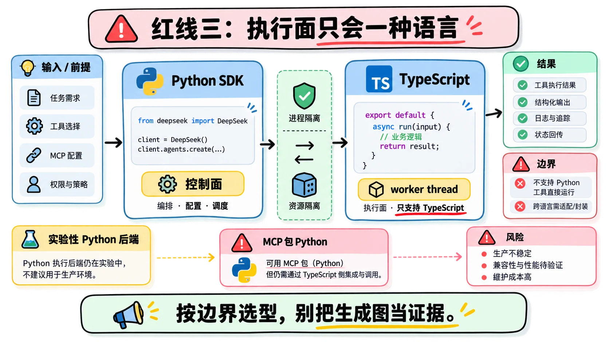

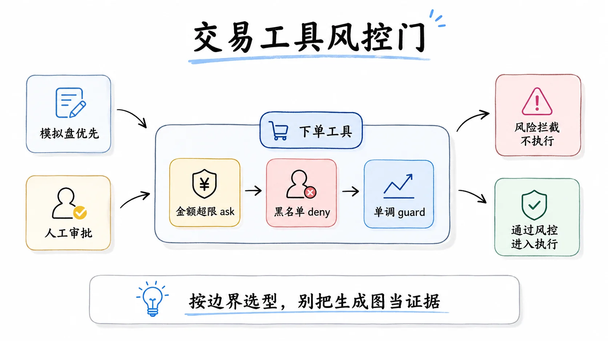

最容易混的一点：两个"Python"不是一回事。

控制面的 Python：SDK 用 Python 指挥 `dsh`。有，成熟。执行面的 Python：code-runtime 跑模型写的代码，发布的后端只有 TypeScript 一种，跑在 worker thread 里；Python 后端在仓库里实现了（experimental-code-runtime-python），但官方文档的原话是它是实验性的、私有的，没有任何出厂配置挂载它。

交易台在这里撞得最疼：量化生态，回测框架、因子库、券商和交易所接口，在 Python；模型在代码执行模式里写的策略是 TypeScript。三个绕法，各有适用面。让模型经 bash 调系统 Python，最通用，但沙箱策略要显式覆盖这条路，且每段代码进出子进程的序列化成本要自己掂。把 Python 能力包成 MCP server，回测引擎和数据源做成工具，模型调工具拿结果，工程最重但边界最清楚，回测这种重活适合这条路。或者等 Python 后端发布，仓库里它已经存在，等的是转正。

这个领域还有一条注脚：agent 碰真金白银的事故有公开复盘，自主交易 agent 单次亏损百万美元量级的案例记录在案，社区共识是先模拟盘、人工审批、规则限额。`dsh` 真正有竞争力的点恰好在这：执行前策略钩子和单调 guard 是 harness 级原语，审批门挂在引擎里，不是外挂脚本。这也是"当基座"和"用 CLI"的实质差别之一，基座用户拿到的风控挂点，和官方自己用的是同一套。外挂脚本的风控能被绕过（换个工具调用路径就绕开了），引擎里的钩子绕不过，因为每次工具执行都必须穿过它。

## 常见误解

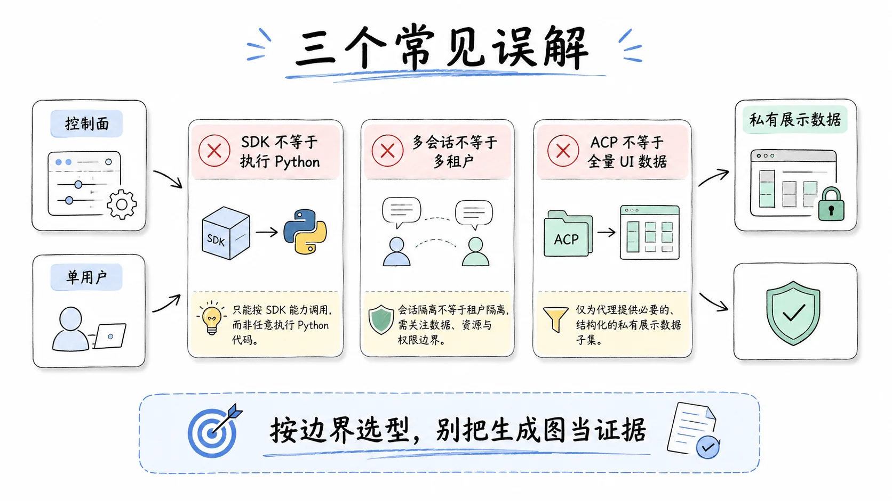

把审计中反复出现的三个混淆单独拎出来。

误解一：SDK 是 Python 的，所以模型能跑 Python。控制面和执行面是两个世界，前文红线三整节都在拆这条。SDK 的 Python 停在你的进程里，模型写的代码进 code-runtime，那里出厂只有 TypeScript。

误解二：Web 界面支持多会话，所以能多人用。多会话是同一个用户的多个工作现场，认证模型是"本机单用户"，令牌防的是同机进程，不是互联网上的另一个租户。把 3080 端口直接挂到公网，等于把一个不带锁的房间标上门牌号。

误解三：ACP 是协议，所以能拿到全部数据。协议给的是控制语义，私有的展示数据明确不在 wire 上。把 ACP 当产品界面的数据源，会在第一张聊天卡片上就卡死。

## 从审计到动工：一个两周的验证切片

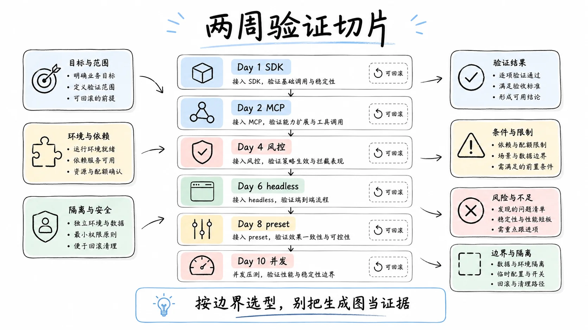

判定表说"能盖"，落到动工还差一个最小可信切片。给基座用户一条两周的验证路径，每天都是可回滚的。

第一周搭控制面和扩展面。第一天，pip 装 SDK，起一个 harness，跑通"说句话拿回应"，确认 dsh_home 隔离生效（你的实例看不到你本机 CLI 的会话）。第二三天，接一个最便宜的 MCP（比如行情只读 server），确认工具自动进表、调用超时和断连行为符合预期。第四五天，写第一个自研工具插件，故意带上风控钩子：金额超限 ask、黑名单 deny，验证 ask 在 SDK 场景下的表现（无人应答时它失败关闭，不会挂着等）。这半天会顺便教会你 approval 语义在无人值守下的真实形状。

第二周拼自动化和分发。第六七天，把同一个研究任务分别用 SDK 和 headless 跑，外部 cron 触发 headless 版，对比两条路的运维手感。第八九天，把这两周的配置收进一个 preset，从零目录启动验证"三步装机"成立。第十天，压一轮并发：同时开三个 harness 实例各跑一个会话，看资源占用和稳定性。两周结束你手里就有：一条自动化链路、一个带风控的工具、一个可分发的配置包、一份自己测出来的性能底数。判断要不要继续投入，这四样比任何评测文章都硬。

## 判定表：你的产品能不能盖

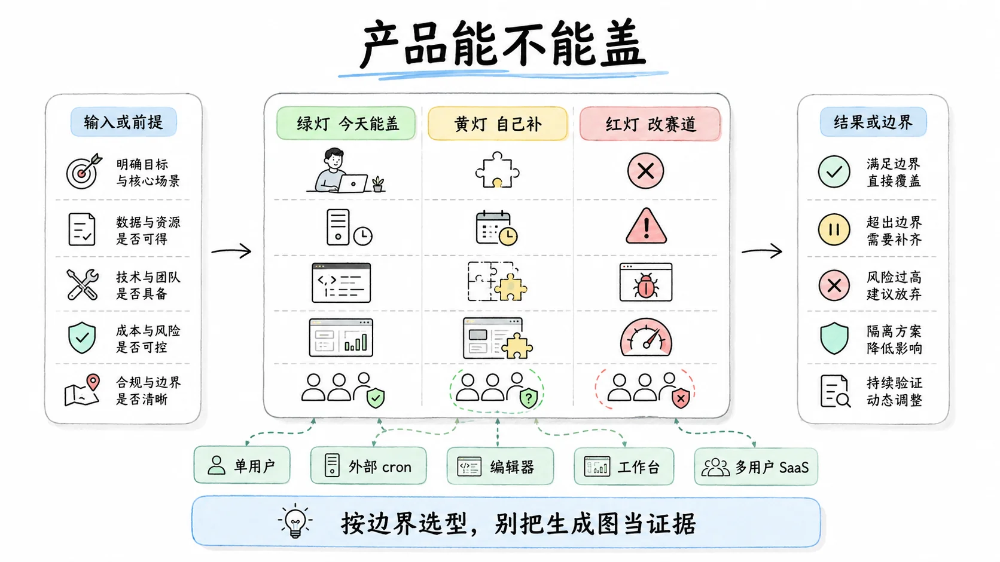

| 产品形态 | 判定 | 关键依赖 |
|---|---|---|
| 单用户桌面工具，领域助手或个人工作台 | 今天就能盖 | 工具插件、MCP、插槽卡片，preset 分发 |
| 单机自动化流水线 | 能盖，定时自造 | headless 加外部 cron，结构化输出走 SDK |
| 嵌进编辑器的控制面 | 能盖 | acp profile |
| 带界面的单用户工作台 | 勉强 | 卡片形态是设计内用法，整页布局要 fork 并付跟版税 |
| 多用户服务或 SaaS | 今天不行 | 自己包服务层，或等官方的服务化姿态 |

交易工作台对号入座：研究、信号、风控审批、凭证管理全是绿灯，工具插件、MCP、执行前钩子、凭证缝都是现成原语；整页下单台黄灯，插槽不够，fork 有税；无人值守定时黄灯，外层自造；多账户服务红灯。

拿两个反差更大的产品再验一遍这张表的用法。个人研究工作台（文献助手加本地数据整理）：用到的无非工具挂架和会话持久化，两脚都踩在设计内的浅层，绿灯，两周切片跑完就能上。团队 SaaS（十个成员各自的 agent 会话、统一计费）：第一天就撞红线一，多用户隔离没有官方姿态，你包服务层的成本会长期高于换一个天生服务化的底座，红灯不是"等等就能变绿"的意思，是"这条路要重新议价"的意思。同一张表，两种读法：绿灯读的是"今天能开工"，红灯读的是"改变赛道或改变预期"。

比表更实用的一条判断标准：数你的产品需要 `dsh` 的哪几层。只要工具挂架、审批门、凭证、会话持久化，踩得浅，今天就能盖，冲刷可控。一旦需要整页界面或多用户，你就在用它的未来下注。这个"数层"动作还有第二个用途：它决定你的升级成本。踩一层的人跟版是看 changelog，踩五层的人跟版是做代码审计。

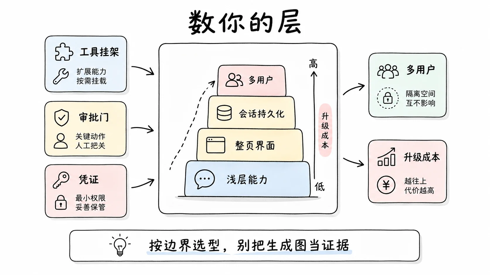

## 边界：判定会过期，性能要自测

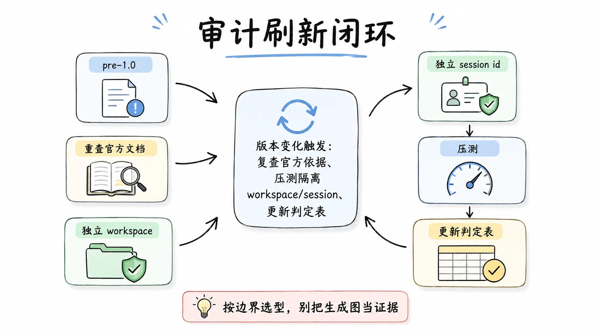

这份审计有保质期。pre-1.0 的意思是，任何一条"不可用"都可能在下个版本翻过来：服务化姿态和 Python 执行后端已经以实验形态存在于仓库里。翻新这份表的成本不高，盖产品前值得重查一遍。重查时别从结论查起，从依据查起：本文每个判定都锚在一份具体文档或一段源码上（web-server 文档的绑定语义、schedule 文档的 delivery mode、SDK README 的同步接口），把那几份文档的当前版本再读一遍，比读任何二手转述都快。

性能和成本本文没有测。同步 SDK 的吞吐上限、子进程的资源占用、多会话并发时的行为，选型前要自己压一轮。压测时有一个现成的隔离纪律可以抄：仓库自己的 benchmark 说明要求不同任务用独立 workspace 和独立 session id，这个纪律同样适用于你的压测，否则会话间的持久化状态会把结果搅浑。

安全公告的原话适合放在这里收尾：`dsh` 没有经过安全审计。资金敏感场景，审批和限额层任何时候都不能省，这一条与版本号无关。

## 延伸阅读

- [Python SDK README](https://github.com/deepseek-ai/deepseek-harness/blob/master/python/sdk/README.md)：SDK 能力面与 runtime-bin 版本互锁
- [Web server 文档](https://github.com/deepseek-ai/deepseek-harness/blob/master/docs/subsystems/web-server.md)：载体进程不带 TLS、认证、Origin 策略的原话
- [Schedule 文档](https://github.com/deepseek-ai/deepseek-harness/blob/master/docs/subsystems/schedule.md)：会话内定时的全部边界
- [MCP 记忆接入指南](https://github.com/deepseek-ai/deepseek-harness/blob/master/docs/user/guide/mcp-memory.md)：跨会话记忆的官方答案
- [SAFETY.md](https://github.com/deepseek-ai/deepseek-harness/blob/master/SAFETY.md)：experimental 定位与安全边界
- [oh-my-dsh](https://github.com/amplifthq/oh-my-dsh)："Overlay, not a fork" 的生态实践
