# dsh 子代理模型路由：授权-选择-执行三层

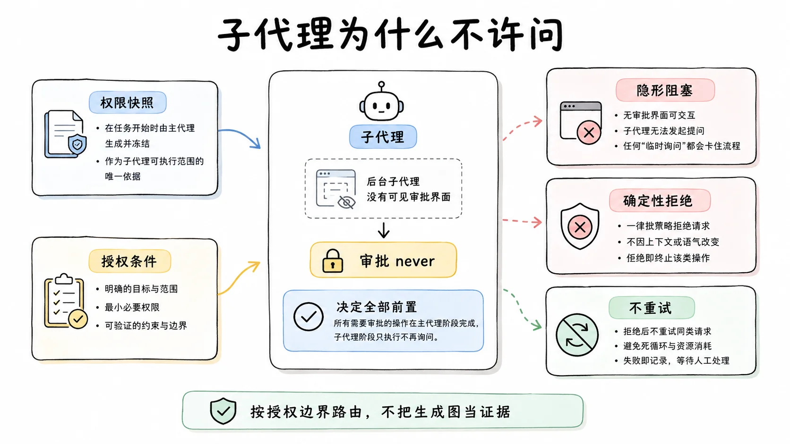

> 把任务委派给子代理时，"它用哪个模型"在 `dsh` 里不是运行时可以商量的问题。委派的子会话审批策略被钉死为 never，因为后台子代理发起询问没有任何界面能看到，问了就是隐形阻塞。于是模型路由被拆成三道事前的门：用户在 Host 设置里授权一张精确到 provider 加 model 对的白名单；会话创建时把白名单快照成持久事件，子会话继承、恢复会话用当时的记录；执行器在实际调用前独立复核，中途新装的适配器不得静默扩大这张表。本篇按 2026 年 9 月初的源码和两篇设计笔记拆这三层，外加两条显式拒绝：ACP、Claude Code、Codex 传输不支持动态选择且配了就报错，fork 委派禁用选择是因为换模型会让复制的前缀失去 KV 缓存复用资格。

## 问题：委派出去的会话，用谁的模型

从一个具体场景进。运维台的父 agent 用主力模型跑着，每天要委派一批小活：日志摘要、告警分类、周报数据整理。这些活用主力模型是浪费，直觉的解法是委派时指明"这个子任务用便宜的 flash 模型"。指明的一瞬间，一串问题跟着来：子代理默认继承父 agent 的模型吗？部署者想规定"子代理只准用 flash"，这个意图写在哪？下周模型目录里新上线一个更便宜的模型，子代理能自动用上吗？反过来，用户不想让 agent 自己挑模型烧钱，拦在哪一层？

回答之前要先看一条更硬的约束，它是整个设计的起点。

`dsh` 把委派出去的子会话审批策略固定为 never：子代理请求升级权限时，得到的是确定性的拒绝，而不是弹一个问句。这个设计源于一个真实的缺陷，2026 年 8 月 10 日的设计笔记记下了改造前的完整症状：后台子代理发起询问后，没有任何产品界面能展示它。子会话不出现在 Web 侧栏里；父 agent 的 `list_agents` 只报 running 或 idle 两种状态；目录行只显示活动不显示等待。一个被权限卡住的子代理和一个正在干活的子代理，从外面看无法区分。交互式父会话里的后台子代理一旦升级权限，那个问句就悬在没有任何人看得见的地方；headless 场景则直接按失败关闭处理。排查时唯一能找到的痕迹是子会话自己日志里的拒绝记录。

官方评估过两个修法。富修法是给阻塞状态做完整可见性：持久化的 blocked 状态投影、父通知、目录徽标、穿透子代理所有权栅栏的权限写通道，每个都要新接缝，发版前夕做不完。实际采用的修法是把问题连根拔掉：不许问。改造后，子代理的权限世界在委派那一刻就固定，沙箱范围照快照继承，审批一律 never，每个需要审批的操作确定性地被拒。子代理的提示词里也明说这件事：你的范围在启动时已固定，需要审批的操作会被自动拒绝，需要更大权限的任务以报告限制收尾，不要重试。

"不许问"加上一个事实，结论就自己浮出来了：模型选择直接影响成本和授权边界，而这条链路上不能依赖运行时的人类应答。所以凡是影响成本与边界的决策，必须全部前置，前置到用户手里、前置到会话创建时。模型路由的三层设计是这个结论的落地。

## 三十秒模型

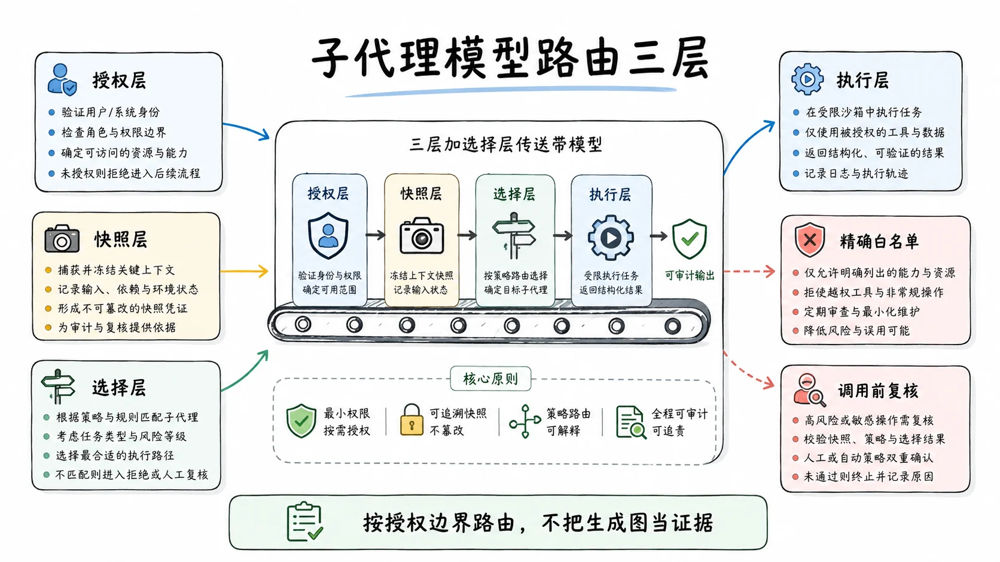

三层各管一段。

授权层：用户事先在 Host 设置里签发一张白名单，每一项是精确的 provider 加 model 对，不是前缀，不是通配符。快照层：每个新会话创建时，把这张表拍成一条持久事件存进会话日志；子会话继承这条记录，恢复旧会话时用当时记录的旧表，改设置只影响之后新建的会话。执行层：委派执行器在实际调用模型之前，自己再对照一次白名单，表上没有的路由直接拒绝。三层之间还有一段参数机制（选择层）：模型在委派参数里成对地给出 provider 和 model，按来源优先级合并后解析，它是三层之间的传送带。

一句话串起来：授权管"能选什么"，快照管"当时能选的是什么"，执行层管"现在调用的确实在表内"。三层里任何一层单独存在都不够。只有授权没有快照，恢复的会话会按新授权跑，历史不可复现。只有快照没有执行层复核，模型在自由生成的工具参数里塞一个未授权路由，校验就成了摆设。只有执行层复核而没有授权，你手里根本没有一张可以复核的表。

这个形状在安全工程里有个通用名字：分层防御。但它的动机不是防攻击者，是防三种各自无辜的失真：用户改了设置（时间维度的失真）、模型猜了路由（生成维度的失真）、热更新换了适配器（运行时维度的失真）。三层各自堵一种。

## 为什么不是"一个模型一个工具"

在拆三层之前，先处理一个更朴素的问题，因为它是设计笔记里被明确否决的第一条路。

既然要让模型给不同子任务选不同模型，最直接的实现是：给每条路由挂一个独立命名的委派工具。要用 flash 就调 `subagent_flash`，要用推理模型就调 `subagent_reasoning`，每个工具绑死一条路由，配置即所见。这条路被否决，笔记给的理由值得原文级地理解：它把一个"每次调用的调度选择"变成了"部署配置"。

两种东西的差别是维护成本的方向。调度选择留在调用参数里，模型可以根据任务自由选，部署不用动；变成部署配置后，每加一条路由要改一次配置树，模型的选项被配置冻结。更实际的账是工具目录的膨胀：工具 schema 是系统提示的一部分，每多一个委派工具，每次请求的前缀就长一截，而 provider 侧的 KV 缓存按前缀复用，定义一变，缓存全废。一个 provider 能报几百个模型，照这个路子做，前缀会被路由清单吃掉。

被否决的还有它的镜像方案：把活的模型目录渲染进委派工具的描述里，让模型每次都看得见全部选项。同样的否决理由：目录是会变的（新模型上线、旧模型下架），把它放进提示前缀，等于让一个易变的数据持续重写一个本该稳定的缓存前缀。最终采用的解法是按需发现：一个独立的 `list_subagent_models` 工具，模型想知道有哪些可选项时调它，结果只在被调用时进对话记录，委派工具自身的 schema 保持稳定。易变数据和稳定前缀，这对矛盾贯穿整个设计，后面还会反复出现。

## 授权层：一张精确到模型对的白名单

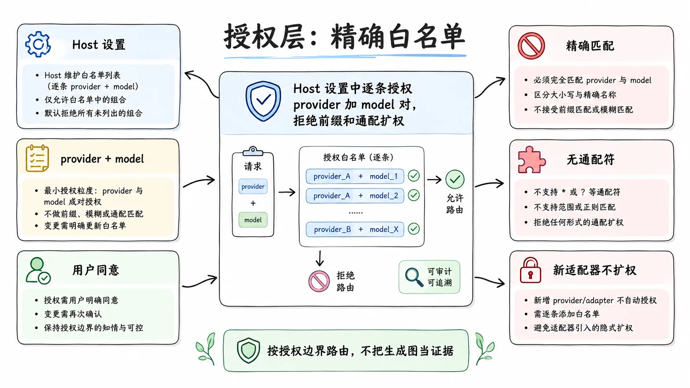

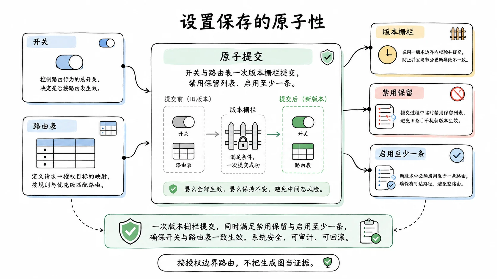

设置项叫 subagent-model-selection，Host 层拥有，内容是一个开关加一个列表，列表每一项是精确的 {provider, model}。没有前缀匹配，没有通配符。启用要求至少有一条路由；关闭时列表可以保留，留着下次再开。

精确是有意的，而且和另一条否决记录直接相关。设计笔记否决过"用非空列表推断启用"：如果列表非空就算启用，那么关闭功能就必须清空列表，用户精心挑的路由就丢了；保留列表又会让语义取决于写入历史。所以开关和列表两个字段一次原子提交，不存在"开了关没列表"或"列表还在但含义不明"的中间态。同样被否决的还有"给每条路由再配一套 effort 白名单"：用户授权的对象是模型，effort 的合法值属于具体适配器，路由授权之后，该适配器支持的所有 effort 自然可用，再配一层是重复治理。

精确匹配对抗的是静默扩权。授权的语义是"这些路由用户逐个看过并同意"。如果允许前缀匹配，任何新上线的模型都会自动落在授权范围内，用户没有看过、没有同意，但子代理可以选。新适配器不得静默扩权，这是整个设计的钉子，白名单的精确性是这颗钉子的帽。

设置界面的细节也守着同一条纪律。Plugins 设置卡片从活的适配器目录读取可选路由，让用户暂存开关和路由，一次版本栅栏的原子变更写入两个字段。一条已保存的路由如果此刻不在目录里（适配器卸载了，或目录请求失败），它显示为不可用但可移除，不阻塞别的 provider，也不清掉已存的授权；目录失败是目录的事，授权决定是用户的事，两者不互相连坐。连接断开时草稿作废，因为命名空间的版本号只在同一个 Host 进程内可比。这些边角共同勾勒出一个词的姿态：授权是用户的财产，界面对它只有保管权。

## 快照层：把一条设置变成会话事实

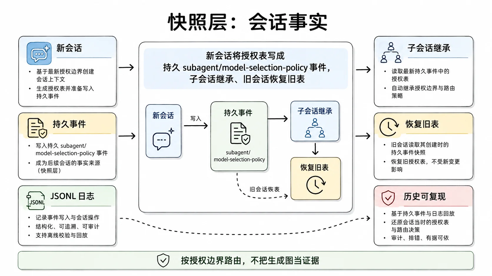

授权存在 Host 层的设置里，但真正起作用的不是它，是会话日志里的快照事件 subagent/model-selection-policy。一个新顶层会话被组装时，如果设置开着，路由表就被拍成这条持久事件，在任何模型请求发生之前落账。事件存在即代表选择启用；事件里不存全局开关，只存路由表。

这个动作把一条 Host 设置变成了会话事实，三个后果跟着来。

子会话继承活父会话的那份记录，委派链条上的每个子代理用的是同一张表。恢复旧会话时用日志里记录的表，不读当前设置。改设置只影响之后新建的顶层会话。周二创建的会话、周四扩了白名单：周二那个会话恢复过来，仍然只能用周二授权过的路由。legacy 会话（没有这条事件的旧会话）一律视为未启用，哪怕显式恢复出一个空表也一样。

为什么这么较真？两条理由，一条是纪律的延伸，一条是实际的。纪律那条：`dsh` 有一条"模型可见即可重建"的运行时不变量，会话的授权状态必须能从它自己的日志重建，而不是依赖读取当下的全局配置，快照是这条纪律在授权面上的应用。实际那条直接写在否决记录里：否决"每次发现或委派时都读当前设置"，理由是设置一改，正在跑的会话的模型可见能力和执行权威就静默变了。想象那个场景：会话跑到一半，管理员收紧了白名单，正在排队的委派突然开始报未授权，模型看到的世界和执行层的规则在同一瞬间错位。快照把这个时间窗口焊死。

这条事件是 log-only 的：只进会话日志，不进模型可见的请求内容。白名单本身不消耗父请求的 token，只有 `list_subagent_models` 被调用时的结果才进对话。

从审计者的视角再看一遍快照的价值。三个月后你要回答"这个会话里的子代理为什么用了 flash 模型、当时谁授权的"，不需要翻设置变更记录（Host 设置没有这样的历史），打开会话日志找到那条 subagent/model-selection-policy 事件，当时的授权表整整齐齐躺在里面。成本争议、合规检查、事故复盘，三类问题共用这一个答案入口。设置是会漂的，日志是钉死的，把权威放进钉死的那个里，这是整层设计的用意。

顺带一个实操校验法，确认三层真的在你的部署里生效：起一个启用了设置的会话，翻它的日志找快照事件（没有就是没启用）；让模型调一次 list_subagent_models，比对返回集和你授权表的一致性；再故意在委派参数里塞一条表外路由，看执行器拒绝时的报错指向授权而不是适配器。三步都符合预期，三层就都在岗。

## 选择层：调用参数怎么带上模型

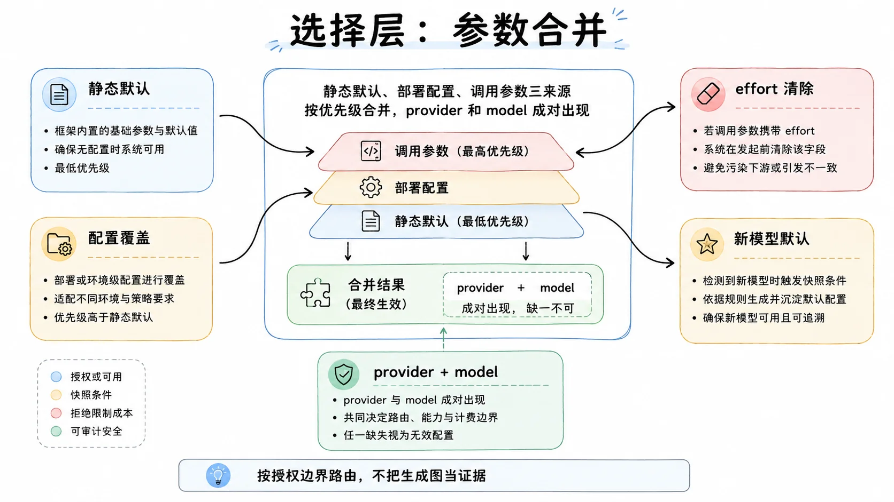

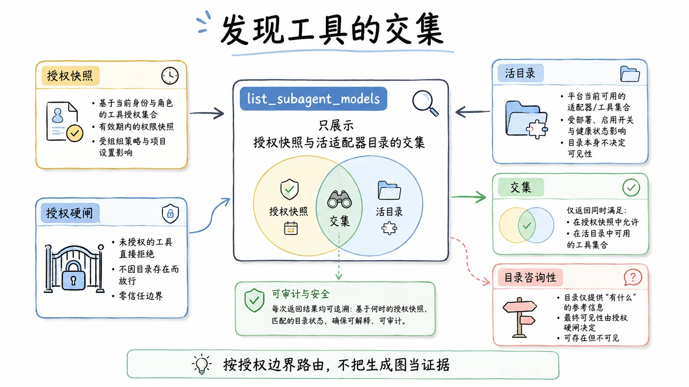

授权给了范围，选择层决定每次委派实际用哪个。委派工具的可选参数里，provider 和 model 必须成对出现，单给一个就拒绝；reasoning_effort 可以单独给，前提是有效路由可解析。

参数不是凭空解析的，它要合并三个来源。基线是 provider 自己的静态路由默认（agentRouteDefaults，如果声明了）；部署配置里的 agentOptions 覆盖基线；这一次调用的参数优先级最高。provider 没有静态默认时，回退到父 agent 最近一次已记录请求里的兼容字段，第一次请求之前则用创建选项。落成一条合并链就是：静态默认 → 配置覆盖 → 调用参数，后者盖前者。

有一个容易忽略的细节：换了路由但没带显式 effort 时，继承来的 effort 会被清掉，让新模型解析自己的默认值。这条规则有明确的动机：不同 provider 的 effort 语义并不对齐，A 家的 medium 和 B 家的 medium 不是一个东西，把 A 家的 effort 值直接喂给 B 家的模型，是错配的常见来源，清掉比继承安全。反过来，路由没变、只是省略了 effort，就从被选中的基线继承。这条边界画得很细：清的是"路由拥有的 effort"，保的是"同路由下的省略继承"。设计笔记还否决过全局 effort 枚举表，理由同源：effort 的标识符和默认值属于精确的 provider 加 model 路由，中心化的翻译或钳制都会制造新的错配。

选择层还有个配套的发现工具，前文提过的 `list_subagent_models`。无参调用列出已授权且已注册的 provider；带 provider 调用该适配器的咨询性目录（仅在授权之后）；带 provider 和 model 则先授权精确路由，再解析该模型的全部 effort 和默认值。它的可见集是活的目录与授权快照的交集：没授权的不显示，防止模型把时间花在会被拒绝的选项上。反方向有个精妙的非对称：授权了但目录没列的仍然可用。目录是咨询性的（有些 provider 接受任意精确模型 id，目录不全），授权才是硬闸。同一份设计里，收紧用交集、放行认授权，方向感非常清楚。

发现工具还有个全局唯一性的约束：同一个工具作用域里至多一个实例能启用选择，因为发现工具的名字是全局的。出厂组合把它放在主 `subagent` 实例上。

## 执行层：执行器不信任上游

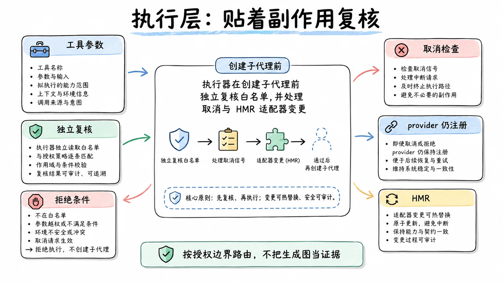

按说选择层已经校验过参数，执行层为什么还要再查一遍？三条理由，每条对应一类真实的失真。

第一条，上游是模型的自由生成。工具参数是模型写出来的，不是编译器检查过的调用。选择层校验通过之后、执行层拿到之前，参数就是一段在异步管道里流动的文本，"已校验"不是它的属性，是某个时刻的状态。设计笔记否决"只在设置界面或发现结果里过滤"时的原话：模型可以猜一条路由，也可以从早先的对话记录里保留一条。授权必须在启动子代理的执行器里执行。

第二条，异步预检之后有等待。路由解析要过 `ctx.llm.resolveCallConfig()`，一个异步查找，等它回来的时候世界可能已经变了。所以查找完成后要先查取消，再确认同一个 provider 实例仍然注册着，然后才能创建子代理或后台作业。笔记里给这个场景起了个具体的名字：防 HMR 把 A provider 的默认配置和 B provider 的进程拼在一起。热更新窗口里，适配器可能刚被换过，不复核就是拿旧地图走新路况。

第三条，显式选择和隐式路由的边界。一次不提供任何选择字段的调用，保留配置或继承的路由原样走，因为模型没有做路由决策，执行层不为它补一道闸。闸只拦"声称的选择"。

所以执行层的形状是：在调用模型解析接口之前，独立再校验一次路由白名单，表上没有的，拒绝在子代理创建之前。这是防御性设计的标准姿势，校验放在离副作用最近的位置，而不是信任上游传来的"已校验"。这一层也是"新适配器不得静默扩权"的最终落点：装了新适配器、目录里多了新模型，都不会自动进入子代理的可选集。要进，用户改授权表。

## 能力门：不支持就大声失败

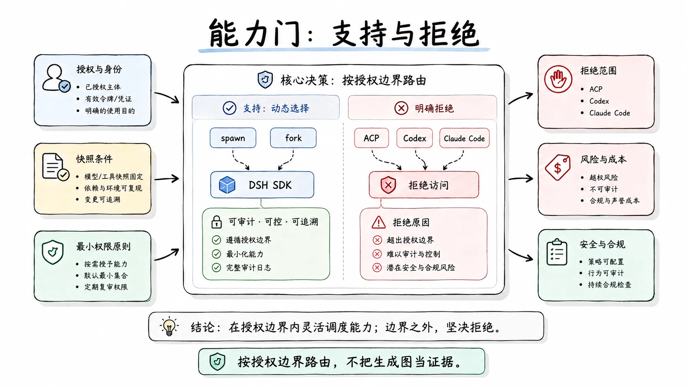

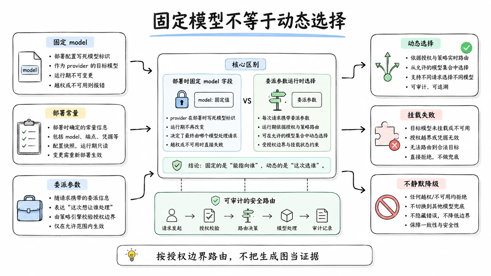

三层之外还有一道横向的门。每个子代理 provider 声明一个能力标志 agentOptions，表示自己的传输是否支持动态模型选择。六个 provider 正好对半分：进程内派生（spawn）、fork、DSH SDK 广播支持；ACP、Codex、Claude Code 广播不支持。

不支持不是静默忽略，是显式拒绝，而且拒绝得非常早：配置里给绑定了不支持 provider 的工具写了选择参数，插件挂载直接失败。设置启用的实例绑到没有能力的 provider 上，同样挂载失败。宁可挂载失败也不静默降级，这个取舍的逻辑：配了没生效是最难排查的一类问题，你看着配置以为它在起作用，实际走的全是默认路由，账单和行为的解释从此两个世界。显式报错把这类问题消灭在启动时。

这里要拆一个容易混淆的点。发版说明里出现过"给 Claude Code 和 Codex 子代理配置模型"的说法，那指的是 provider 实例上的固定 model 字段：你的 `dsh` 作为父，把任务交给对方产品时，对方会话用什么模型，这是启动参数，原样传过去，一次配死。它不是动态选择：动态选择是模型在每次委派的参数里现场挑路由，这个能力对这三个传输明确关闭。两个"配模型"是两种东西，一个是部署时的常量，一个是运行时的变量。

能力门的诚实还有一层：请求带着动态选择打到没能力的 provider 上，服务在调用 provider 之前就拒绝，绝不让请求"声称做了一个路由选择而实际没有发生"。笔记否决"让远程 provider 忽略这些字段"的理由就是这句：一个声称发生了的选择没有发生，比报错更糟。

## fork 为什么禁用选择

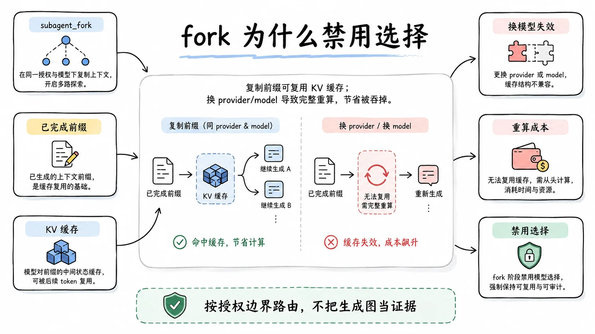

fork 委派的机制是复制父会话的一个已完成轮次前缀，开一个新代理接着这段历史跑。复制的前缀有一个经济属性：provider 侧的 KV 缓存可以复用。相同前缀的请求，provider 不必重算注意力，直接命中缓存，这是长会话能负担多轮对话的成本基础。

换 provider 或 model，这个资格立即失效。缓存按精确的模型和前缀计算，路由一变，整个复制来的前缀要在新模型下从头重算，这笔重算成本可以超过委派任务本身：你为了省钱把摘要活派给便宜模型，结果便宜模型要先全价重算父会话几十轮历史，省的钱不够付重算。

所以出厂的 subagent_fork 工具完全不读模型选择设置，哪怕底层 fork provider 的能力标志是支持的。设计笔记把这条写成了显式决策：在路由变更能保留前缀复用、或者调用方能显式地框定并接受重算成本之前，不对 fork 开放选择。重开这个口子的两个条件也写明了，要么技术上解决（换路由不丢缓存），要么界面上诚实（把重算成本摆给用户选）。一个能力被禁用的理由是一条算得过来的工程账，这比"技术上不行"更有信息量。

顺带一提，选择层对继承场景有一条配套警告：自定义的、有能力继承的实例如果启用选择，会收到明确警告，换 provider 或 model 可能让继承来的对话前缀失去 provider 侧的复用。规则和警告指向同一件事：前缀缓存是这个世界里真实的货币，任何设计都要先回答"这笔钱还省得下吗"。

## 贯穿案例：运维台的一周

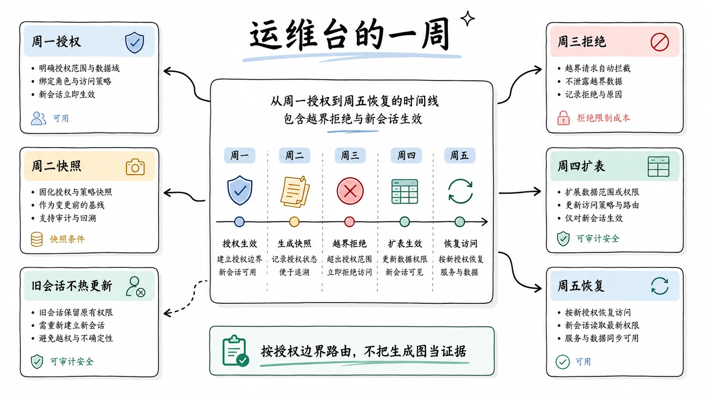

把三层和两条拒绝放进一个完整的时间线。场景：运维台父 agent 用主力模型，用户决定把日志摘要这类小活委派给 flash 模型。

周一，授权。用户在 Host 设置的 Plugins 卡片里打开开关，从适配器目录挑出 {deepseek-official, deepseek-v4-flash}，原子保存。此刻什么都没发生：设置只是一份意愿，还没有任何会话见过它。

周二，建会话。用户开了一个新的运维会话，组装时授权被拍成 subagent/model-selection-policy 事件落进日志。会话里模型问"我能给子代理选什么模型"，调 list_subagent_models，看到交集里的 flash。它委派日志摘要，参数里 provider 和 model 成对出现，执行器对照会话里的表，通过，子代理以 flash 起跑。这一单的省钱是真实的：从主力模型换成 flash，单价差乘以摘要量。

周三，模型越界。模型在参数里试了一条目录里见过但从未授权的路由（某个更大的推理模型）。选择层成对校验通过（格式没错），执行层对照白名单，拒绝，工具结果告诉它这条路不在授权内。模型退回 flash。注意这道闸拦的是显式声称的选择；如果模型什么都没填，调用按继承路由走，不会被拦也不会被换。

周四，扩表。新上线了一个更便宜的候选，用户把它加进白名单。周二那个还开着的会话不知道这件事：它的快照定格在周二，list_subagent_models 的交集不变。新授权只对周四之后新建的会话生效。用户想让旧会话用上新模型，正确动作是开新会话，而不是期望旧会话热更新。

周五，恢复。周二重启过进程，用户恢复了周二的会话。授权读的是日志里那条周二的事件，不是当前设置（当前设置比它多一条路由）。历史会话的行为保持可复现：审计者重放日志，看到的路由世界和当时一致。

同一周里的两次显式拒绝。有人给 ACP 子代理的工具行配了 model 选择参数，挂载失败，启动时报错，配置者当场知道而不是数周后对账时发现。有人想用 subagent_fork 换个便宜模型接着父会话的四十轮历史跑，发现 fork 根本不暴露选择参数，这条路的账算不过来，前缀重算会吃掉全部节省。

一周走完，三层的分工在时间轴上看得清清楚楚：授权在会话之外（周一），快照在会话创建时（周二），复核在每次调用前（周三到周五）。

## 常见误解

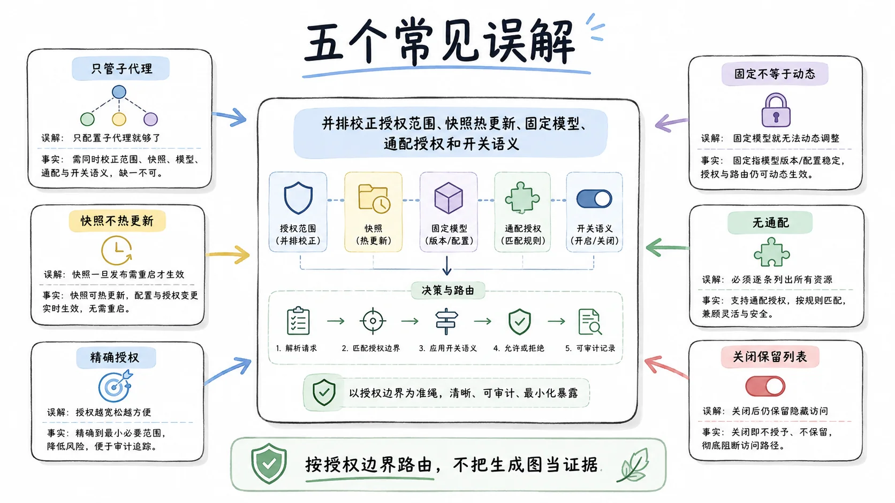

授权表管的是委派执行，不管父 agent 自己。父 agent 用什么模型由它自己的路由决定，和这张表无关；表只回答"子代理能被指到哪些模型"。把这张表当成"整个产品的模型预算"去配，会发现父会话完全不受它约束，然后误以为功能失效。

快照不会随设置热更新。快照在会话创建时定格，改设置只影响新会话，恢复旧会话永远用记录值，目的就是让历史会话可复现。运维含义要记牢：收紧授权不会立即收紧已开着的会话，要旧会话也生效，重启会话。

"给 Claude Code 子代理配了模型"不等于动态选择。那是 provider 实例上的固定字段，能力门上写明的是拒绝；动态选择指模型在委派参数里现场挑路由，对 ACP、Claude Code、Codex 三个传输明确关闭。

白名单不支持通配和前缀，原因和授权层那条钉子直接相关：任何隐式扩展授权的机制，都和"新适配器不得静默扩权"正面冲突。

关闭开关再打开，授权还在。禁用态下列表保留，重新启用后原来的路由直接生效；担心权限残留时，看清列表本身，而不是开关状态。

## 和相邻机制的分工

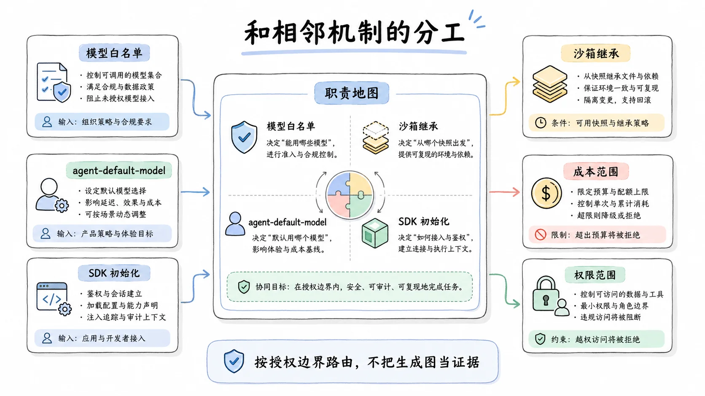

这套路由设计嵌在几条已有机制中间，边界容易混，单独对一次表。

它和沙箱继承的关系：委派那一刻，子代理快照父的沙箱覆盖（权限范围）加这张模型白名单（成本范围），两份快照同源同时，都落在子自己的日志里，冷恢复都按记录回放。一个管"能碰什么"，一个管"能烧什么"，结构上是同一个决策的两次应用。

它和 agent-default-model 的关系：后者管默认模型选择的分层（设置层覆盖），作用于顶层 agent 的出厂路由；本套机制管的是"模型在委派时偏离默认"的那一步。默认路由不经过这张表，偏离默认才经过。

它和 SDK 的关系：SDK 初始化时显式传 provider、model、可选 effort，这是部署者替根 agent 定的起点，也不在本表管辖内；表管的仍然只是委派瞬间的动态选择。出厂的 SDK profile 不启用这个 Web 侧偏好，所以 SDK 场景下会话日志里不会有这条事件，两边目前不相遇。

## 权衡与边界

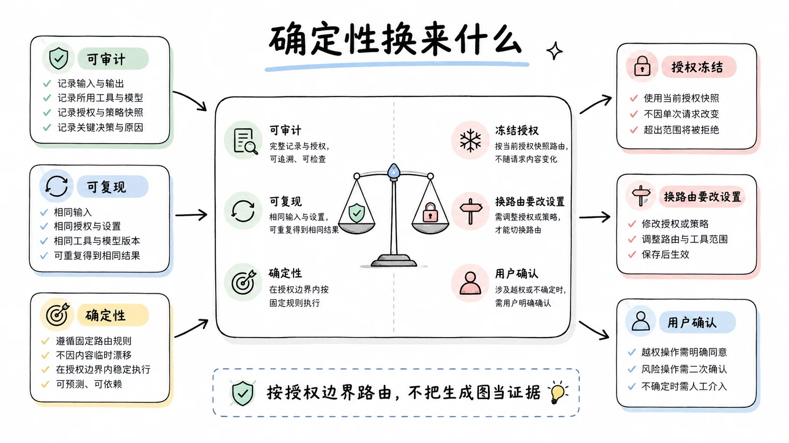

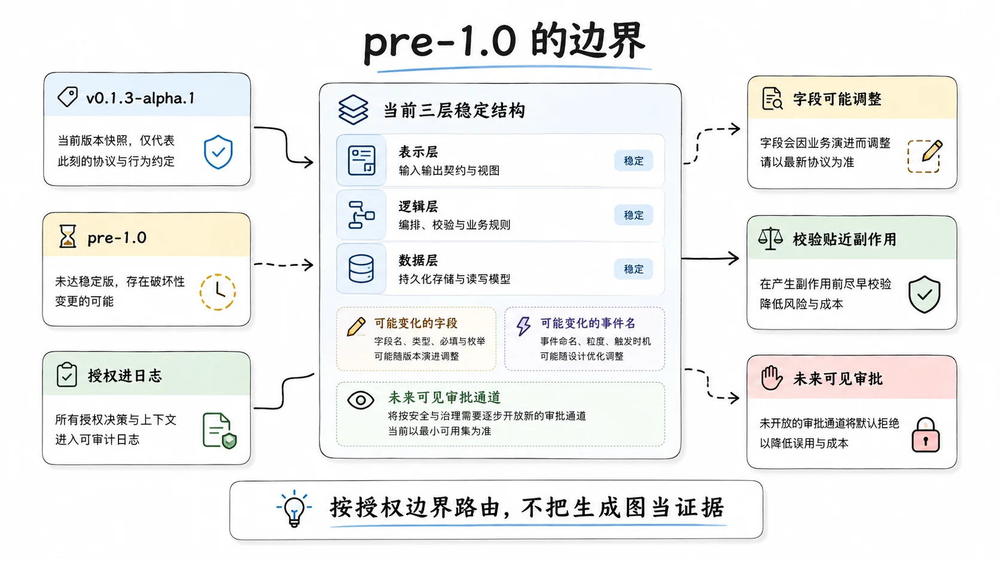

这套设计的所得是确定性和可审计：授权进入会话日志，任何一次委派用的什么模型、凭哪条授权，事后可查；恢复和继承的行为完全确定，不依赖任何当下状态。所失是灵活性：换路由要动设置，新模型要过用户之手，快照期内授权冻结。

设计笔记里被否决的方案清单，本身就是这份代价表的另一面。"部署配置静态启用"被否决，因为它要求先用配置才能用一条已注册的路由，重复了活的注册表。"白名单渲染进工具描述"被否决，前缀稳定。"只在界面过滤"被否决，模型会猜。"非空数组推断启用"被否决，语义依赖写入历史。"每次读当前设置"被否决，跑着的会话会被静默改写。每一个否决都对应一个真实的坑，三层设计是把这些坑全部绕开的唯一路径，代价就是那点灵活性。

边界落在时间上。本文依据 v0.1.3-alpha.1 前后的源码和两篇设计笔记（2026-08-18 的选择语义、2026-08-24 的授权面），pre-1.0 阶段字段名和事件名仍可能调整，三层结构本身比字段名稳定。还有一个前瞻：整套设计的前提是"子代理不许问人"，如果未来子代理获得了可见的审批通道（2026-08-10 笔记里那个被搁置的富修法），这张表的形态可能会松动，但"授权进日志、校验贴着副作用"这两条应该会留下，它们的价值不依赖这个前提。

## 延伸阅读

- [模型选择子代理路由笔记](https://github.com/deepseek-ai/deepseek-harness/blob/master/.agents/notes/implemented/feature/2026-08-18-model-selected-subagent-routes.md)：选择语义、继承与 fork 限制的原始决策
- [用户授权子代理模型路由笔记](https://github.com/deepseek-ai/deepseek-harness/blob/master/.agents/notes/implemented/feature/2026-08-24-user-authorized-subagent-model-routes.md)：授权面的设计记录
- [子代理审批钉死 never 笔记](https://github.com/deepseek-ai/deepseek-harness/blob/master/.agents/notes/implemented/feature/2026-08-10-subagent-approval-pinned-never.md)：隐形阻塞缺陷与解法
- [tool-subagent README](https://github.com/deepseek-ai/deepseek-harness/blob/master/packages/subagent/tool-subagent/README.md)：能力门与合并优先级的实现参考
