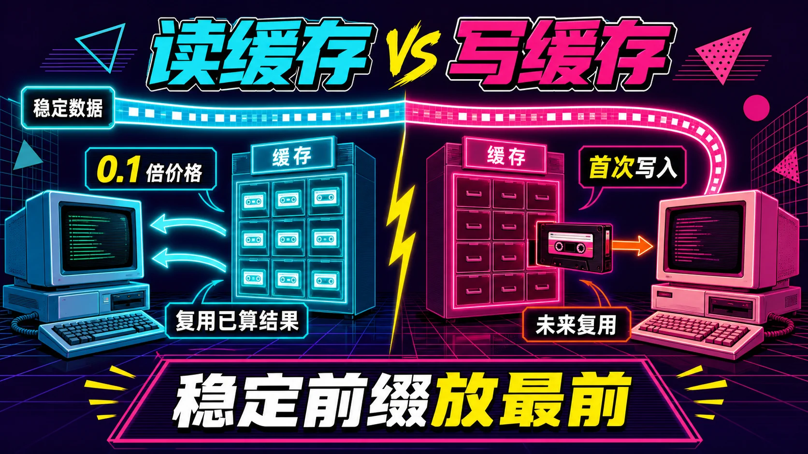
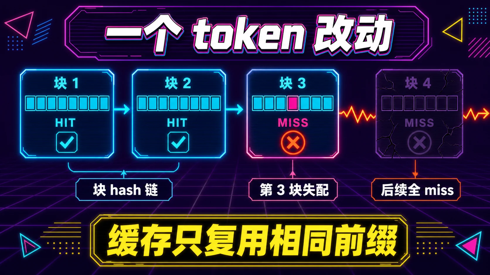
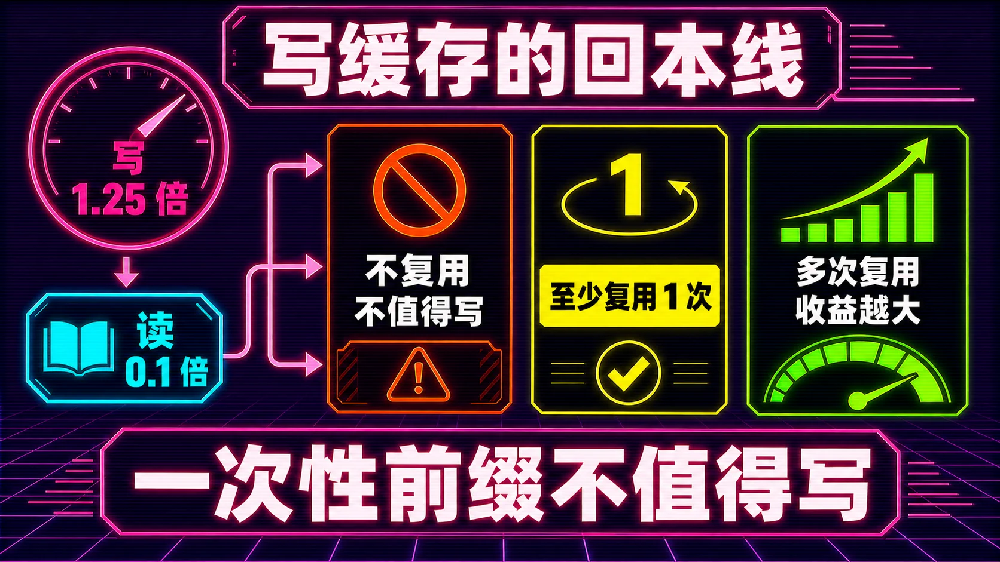
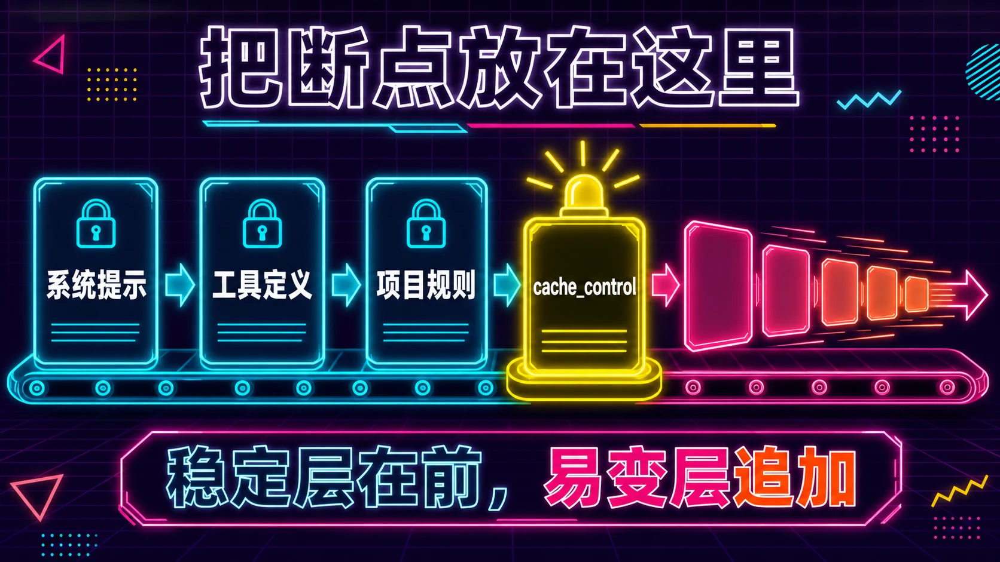
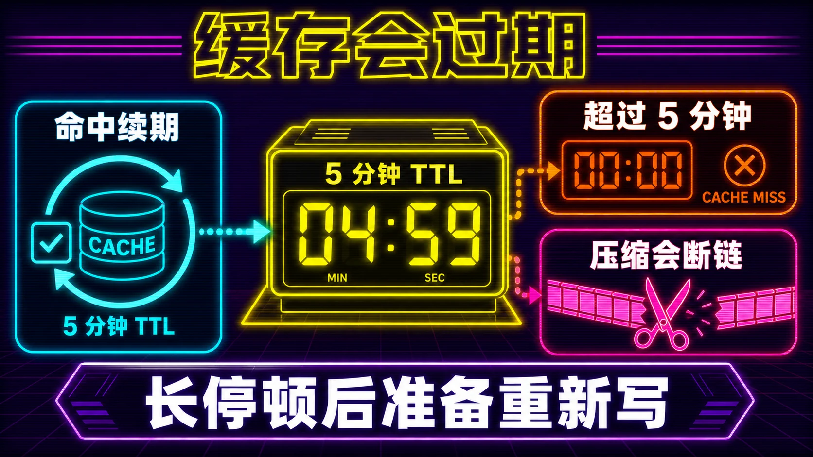

# 大模型缓存：为什么读容易命中、写容易白费，coding agent 怎么占这个便宜

> 更新日期：2026/08

**TL;DR：** LLM 的缓存只认「逐 token 完全相同的前缀」。读缓存是拿回已经算过的内容，0.1 倍价格，只要前缀不动就必然命中；写缓存是首次把一段内容算进缓存，要付 1.25 到 2 倍价格，而且是一次投机，赌未来有人带相同前缀来读。对 coding agent，规则只有一条：稳定内容放最前（系统提示、工具定义、项目规则），易变内容追加到最后（工具结果、你的问题、时间戳）。谁把会变的东西混进前缀，谁就在为整段对话重复付全价。



## 你为什么该在乎这个

假设你每天用 coding agent 写代码。每个回合，agent 要把整段对话重新发给模型：系统提示、工具定义、读过的文件、跑过的命令、之前所有对话。这段东西动辄几万到几十万 token。

缓存的作用就在这里。用对了，大头按 0.1 倍价格算；用错了，每次都是全价。

差别有多大？用 Sonnet 5 举例（2026 年 8 月的价格）：输入 $2/百万 token，缓存读 $0.20/百万，缓存写 $2.50/百万。一个 5 万 token 的稳定前缀，命中后每回合省 $0.09。一天几十个回合，一年下来是实打实的钱，更别说命中还省了首 token 延迟。

但很多人没吃满这个红利。缓存是自动的，可命中需要什么条件，多数人不清楚，也有脚手架一直在无意中破坏它。

## 一句话原理

模型处理你的提示词分两步。第一步叫预填充（prefill），把输入里每个 token 都读一遍，算出它和前面所有 token 的关系，存成一组中间数据；第二步叫解码（decode），一个 token 一个 token 地生成输出，每生成一个都要回头查一遍这组数据。

缓存的对象，就是预填充算出来的那组中间数据，行话叫 KV cache。要理解它，得先知道注意力机制在干嘛。你可以把每个 token 想成房间里的人，它手里举着两块牌子。一块是 key，写着「我是谁，我带着什么信息」；另一块是 value，是它真正想说的内容。新生成的 token 手里举着 query，写着「谁跟我相关」。它要挨个问一遍房间里的人：你的 key 跟我的 query 配不配。配上的，就把 value 拿过来加权求和。

问题在于，这个「挨个问一遍」的成本是平方级的。第 1 个 token 只需要问 1 个人，第 1000 个 token 要问前面 999 个人。如果每生成一个 token 都把前面所有人的 key、value 重新算一遍，成本高得离谱。KV cache 把这些 key、value 存下来，谁要问，直接查表，不再重算。

所以两阶段的成本结构完全不同：

- 预填充处理的是输入，可以并行。你丢进去 10 万 token，一次矩阵运算就全算完，算力密集但快。
- 解码是逐 token 的，每一步都依赖前一步，没法并行。每生成一个 token 都要把前面全部 KV cache 读一遍，这步卡在内存带宽上，不是卡在算力上。所以一段 10 万 token 的提示词，等第一个 token 出来可能只要零点几秒，但之后每蹦出一个 token 都慢得多。

缓存干的事，就是让「预填充的结果」跨请求复用。这次请求算过的一段前缀，下次发一模一样的，直接把算好的 key、value 拿出来用，跳过整段重算。

- **读缓存**：把一段历史上算过、逐 token 相同的前缀再发一次，直接复用。0.1 倍价格，几乎零计算。
- **写缓存**：第一次算一段前缀，付 1.25 到 2 倍价格把它存进缓存。当前这一次必然是 miss，因为没人算过它。

## 打个比方：复印店的文档柜

一家复印店，每次复印都要从头扫描整份文件。店主装了个文档柜省钱。

你第一次拿来一份 100 页的文件，店员扫完存进柜子，收 1.25 倍的钱（扫描加存档）。之后你再来，拿一模一样的 100 页，店员直接复印存档，收 1/10 的钱，还快得多。这就是读缓存。

柜子有三个坑：

1. 存进去的文件，如果以后没人再拿完全一样的来，那 1.25 倍的钱白花了。写是一次投机。
2. 少于 20 页的文件根本不存柜子。太短的前缀，写了也不进缓存。
3. 文件里改了一个字，整份存档作废。因为每一页的存档编号都包含了前面所有页的编号，第 3 页改一个字，第 3 页之后所有页的编号全变。

第三点最重要，也最容易被忽略。

## 为什么改一个字整条缓存作废

这是缓存的底层实现决定的。服务端把缓存切成固定大小的「块」（block），每块的身份是一个 hash，由三部分算出来：前一块的 hash、本块的所有 token、一些附加信息。像一串链条，第 N 块的身份包含第 N-1 块的身份。

所以第 3 块改一个 token，第 3 块的 hash 变了，第 4 块因为包含了第 3 块的 hash 也跟着变，一路连锁到结尾。匹配时逐块比对 hash，从第一个失配块开始全部 miss。

这解释了两个现象：

- 缓存必须是**前缀**缓存，只能从开头开始复用。中间有一段相同没用，因为中间的块 hash 链被前面不同的内容破坏了。
- 一个 token 的差异，足以让整段共享内容全部失效。哪怕你只是往系统提示里加了个时间戳。

vLLM 的实现里还藏了个细节：只有装满了的「整块」才进缓存，末尾的半块不缓存。如果你的共享前缀刚好不够一个整块，一样白搭。

### 拿具体例子走一遍

假设块大小是 4 个 token。请求 A 的前缀是「系统提示 + 项目规则」，拆开是：

```text
块1: [sys, token2, token3, token4]
块2: [rule1, rule2, rule3, rule4]
块3: [你的问题……]
```

第一块算完存进缓存，hash 记作 H1。第二块算完，它的 hash 是 H2 = f(H1, rule1, rule2, rule3, rule4)，包含了 H1。第三块是你的问题，不在共享范围内。

现在请求 B 来了，系统提示一字不差，但项目规则里你把 rule3 改成了 rule3'。匹配时逐块对：

- 块1：token 全一样，H1 命中，直接复用，零计算。
- 块2：rule3 变成了 rule3'，整块 hash 从 H2 变成 H2'，对不上缓存，miss。
- 块2 之后的所有块，因为父 hash 链在 H2 处断了，全部 miss。

请求 B 只吃到前 4 个 token 的缓存。你改的只是一个词，但这一个词在第 2 块里，后面所有内容跟着陪葬。

还有一层更隐蔽的坑：共享内容必须对齐到块边界。假设请求 A 和 B 共享了前 10 个 token，块大小 4。块1、块2 各 4 个，命中 8 个；第 10 个 token 在第 3 块里，但第 3 块只有 2 个 token 是共享的，凑不满一个整块，不缓存。所以你们明明共享了 10 个 token，实际命中的只有 8 个。这也是为什么官方建议把大段稳定内容堆在一起，别让共享前缀刚好卡在半块上。



## 读容易命中、写不容易，本质是确定性和投机性的区别

**读的命中由你控制，写的命中由未来控制。**

读是确定性的。你只要保证每次发的前缀跟缓存里那份逐 token 一致，就一定能命中。要不要命中，是你自己的自律问题。

写是投机性的。你付溢价创建一条缓存，但这条缓存会不会被未来的请求读到，取决于未来有没有人带着相同前缀来。你控制不了。

写缓存白花一般就两种。一种是前缀只出现一次：一次性的长文档、一次性的任务描述，写进缓存后没人再发相同前缀。另一种是前缀被改：前面讲过，一个 token 的差异就让整条链失效，最典型的是往系统提示里塞时间戳、当前目录、随机会话 ID，这些一变，整段历史全 miss。

另外有个硬门槛：缓存有最小长度。Anthropic 这边，Opus 5 最低 512 token，Sonnet 5 最低 1024 token，Haiku 4.5 最低 4096 token。短于门槛，缓存根本不生效，usage 里两个缓存字段都是 0。OpenAI 是 1024 token 起步，DeepSeek 也有类似的「缓存前缀单元」门槛。太短的前缀写不进缓存，也就不存在命中。

反过来，读为什么容易命中？因为读的本质是复用同一份字节。你只要把不变的东西放前面，把会变的东西放后面，命中率天然就高。这是缓存设计里唯一重要的规则。

## 写缓存到底划不划算：算一笔账

上一节说写是投机，但投机不等于一定亏。什么时候值得写，其实是一道算术题。还是用 Sonnet 5 的价格：输入 $2/百万 token，缓存写 $2.50/百万（1.25 倍），缓存读 $0.20/百万（0.1 倍）。

假设你的稳定前缀是 5 万 token。三种情况：

- 不缓存：5 万 × $2/M = $0.10，每次请求全价。
- 缓存写一次，没人读：5 万 × $2.50/M = $0.125，比不缓存还贵 25%。
- 缓存写一次，读一次：写 $0.125 + 读 $0.01 = $0.135，两次请求总共比全价（$0.20）省 $0.065。

写价 1.25 倍，比全价 1 倍还高。所以一次写如果换不来至少一次读，就是纯亏，而且比假装没缓存更亏。写要回本，得让前缀被重复使用。读的次数越多，摊得越薄，这也是为什么越长的 agent 会话单位成本越低。

把判断条件列出来，写缓存值得做，需要同时满足三条：

1. 前缀会重复出现，至少两次。多轮对话、批量处理同一批文档、同一个系统提示被反复请求，都算。一次性长文档、一次性任务，不算。
2. 前缀长度达标。Anthropic 各家模型最低 512 到 4096 token，OpenAI 1024 起步。不够长，写了也不进缓存，等于没写。
3. 前缀内容稳定。加了时间戳、随机数、每次生成的 JSON 字段顺序，都不稳定。写一次，改一次，全白搭。

三条里最容易翻车的是第三条。很多人以为系统提示是稳定的，结果脚手架里藏了个 `datetime.now()`，每次请求都变，整个缓存链天天全 miss。



## agent 的读写结构：大头是读，小头是写

把上面的机制套到 coding agent 上，会得到一个特别有利的结构。

agent 每个回合发送的完整上下文，顺序是：工具定义、系统提示、全部历史对话（包括 assistant 的 tool_use 调用块和工具返回结果）。Anthropic 官方文档直接说了：在 agent 循环里，每次工具往返都会重新发送完整对话，**前面的全部走缓存读**，只有新追加的工具结果走缓存写。

也就是说：

- 读的部分（整段历史）很大，而且随对话变长越滚越大。
- 写的部分（每回合新增的工具结果、你的新问题）很小，基本不变。

结果是读写比越来越好，单位成本越来越低。这是 agent 能吃到缓存红利的结构性原因。

### 一个修 bug 会话的完整账本

拿一个具体场景走一遍，比抽象描述直观得多。假设 agent 在修一个登录页的 bug，会话一共 5 个回合。

固定前缀：系统提示 + 工具定义 + 项目规则，共 8000 token，全程一字不改。每个回合 agent 追加的内容：你的指令、它读的文件、命令输出，加起来平均 2000 token。价格用 Sonnet 5（写 $2.50/M，读 $0.20/M，全价 $2/M）。

| 回合 | 新增 | 缓存读 | 缓存写 | 成本 |
|------|------|--------|--------|------|
| 1 | 2000 | 0 | 10000 | 10000 × $2.50/M = $0.0250 |
| 2 | 2000 | 10000 | 2000 | $0.0020 + $0.0050 = $0.0070 |
| 3 | 2000 | 12000 | 2000 | $0.0024 + $0.0050 = $0.0074 |
| 4 | 2000 | 14000 | 2000 | $0.0028 + $0.0050 = $0.0078 |
| 5 | 2000 | 16000 | 2000 | $0.0032 + $0.0050 = $0.0082 |

5 个回合累计 $0.0554。如果完全没有缓存，每回合都是全价：第 1 回合 $0.02，第 5 回合输入涨到 18000 token、$0.036，累计约 $0.14。省了一半还多。

注意第一回合最贵。它是一次大额写，后面才开始赚回来。这就是为什么「预热」很重要：如果第一回合实际是给长任务打底，这一笔写是必须的；如果是真正的一次性请求，这笔写就亏了。区分点就在这个前缀以后还出不出现。

再想象一个反面例子：同一个会话，但某个脚手架每回合往系统提示里塞一个 `datetime.now()`。前缀每回合都变，缓存链从第一块就断，全部退回全价。同样是 5 回合，成本涨到 $0.14，两倍多。你什么都没做错，就是那个时间戳在放血。

最贵的错误是往系统提示里塞会变的东西。有些 agent 或脚手架会把当前时间、cwd、git 状态、随机生成的会话 ID 动态拼进系统提示。系统提示在缓存链的最前面，它一变，后面整段历史全 miss。这个错误最常见，也最贵。

工具定义频繁变是另一个。工具定义也属于前缀，动态生成工具、每次请求都改 tool 定义的 agent 框架，一样不停破坏缓存。工具定义要稳定，改就攒批改。


## 断点：缓存从哪里开始算

前面一直说「前缀」，但服务端怎么知道哪部分是前缀、哪部分是尾巴？答案是断点。

缓存只覆盖「断点之前」的内容，断点之后的部分不缓存。断点是一个标记，你告诉服务端：从这个位置往前的所有内容，都算稳定前缀，要缓存；从这个位置往后，算可变尾巴，不缓存。

两个服务商的默认策略不一样：

- Anthropic 自动缓存会把断点放在「最后一个 cacheable 块」上，并且随对话增长自动前移。多轮对话里你基本不用管。
- OpenAI 的自动缓存默认把断点放在「最新的 user 或 tool 消息」处。这个默认值埋了个坑，踩坑案例里专门讲。

你也可以手动放断点，精确控制。Anthropic 最多 4 个断点，适合不同部分按不同频率变化的情况：工具定义几乎不变，系统提示偶尔变，对话每次变。三个断点正好对应三档。

放断点的方式是在内容块上标 `cache_control`。用 Claude 的 Python SDK 举个例子：

```python
from anthropic import Anthropic

client = Anthropic()

response = client.messages.create(
    model="claude-sonnet-5",
    max_tokens=1024,
    system=[
        {
            "type": "text",
            "text": "你是这个仓库的资深工程师，回答要直接，给结论再给代码。",
        },
        {
            "type": "text",
            "text": open("CLAUDE.md").read(),   # 项目规则，大段稳定内容
            "cache_control": {"type": "ephemeral"},  # 断点放这里
        },
    ],
    messages=[
        {"role": "user", "content": "登录页的 session 校验在哪？"},
    ],
)

print(response.usage)
# Usage(cache_creation_input_tokens=2513, cache_read_input_tokens=0,
#       input_tokens=18, output_tokens=64, ...)
```

第一次请求，CLAUDE.md 的 2513 个 token 全被写进缓存。第二次请求，只要 CLAUDE.md 没变、系统提示没变，这 2513 个 token 就变成缓存读了，只有 `input_tokens`（你的问题）按普通价格算。

有个容易忽略的点：断点标记在「最后一个不变的块」上，而不是第一个会变的块上。你需要在请求之间共享的那段稳定内容，正好截止到断点。如果断点放得太靠前，稳定内容在断点后面，缓存反而吃不到；放得太靠后，把会变的内容也圈进了写区，每次多付写价。

系统往回找缓存条目时有个回溯范围：Anthropic 最多往回找 20 个块。对话超过 20 个块还找不到上次的断点，就需要在中间补一个断点，让系统有地方积累缓存写。

工具定义也一样可以缓存。把 `cache_control` 标在 tools 数组里最后一个工具上，前面所有工具定义都被圈进缓存。代价是任何工具定义变动都会让相关缓存失效，所以动态生成工具定义的框架要小心。



## 踩坑案例：你以为命中其实没命中

先看一个隐蔽的：OpenAI 的自动缓存默认把断点放在「最新的 user 或 tool 消息」处。两个请求共享一段很长的静态前缀，但只要后面内容不同，就可能显示 `cached_tokens: 0`，共享的部分一点没吃到缓存。原因是默认断点把写缓存的位置推得太靠后，动态内容被算进写区，反复付写价。用显式断点（`prompt_cache_breakpoint`）把缓存区切在稳定内容的末尾，再配合 `prompt_cache_key` 做路由，才吃得着。GPT-5.6 之后写缓存开始收费（1.25 倍），这个坑从浪费速度变成了浪费钱。

并行请求是另一个。缓存条目要等第一个响应开始之后才可用。并发发 10 个请求，这 10 个全是 miss。先让第一个请求跑起来，后面的并行请求才吃得到缓存。

最狠的是上下文压缩。压缩用一段新生成的摘要替换整段旧对话，两步都伤。

先看数字。假设会话已经长到 8 万 token，逼近上限，触发压缩。模型生成一段 5000 token 的摘要，把 8 万 token 的对话浓缩掉。压缩后上下文变成「5000 摘要 + 新指令」。

伤在缓存，也伤在内容。缓存这边有两层。这 5000 token 摘要是一段全新字节，之前从没被算过，纯 miss，而且是一次大额写，按写价算。更麻烦的是摘要之后的后续内容，前缀全部变了，之前花 8 万 token 一点点累积起来的缓存链，从摘要这里整个断掉，全部作废。内容那边同样隐蔽：Codex 的远程压缩只保留 user/developer/system 消息，丢掉 assistant 的回复和工具调用细节。关键决策如果只存在于被丢掉的 assistant 消息里，压缩后模型直接失忆。

省的是上下文空间，赔上的是缓存连续性和对话保真度。两者一起丢。所以压缩的正确用法是救急，不是日常。日常维护上下文，用后面讲的追加加截尾和外部记忆。

## 5 分钟保鲜期：TTL 是怎么工作的

缓存条目不是永久有效的。Anthropic 默认的缓存寿命是 5 分钟，过了就清掉。但有个重要的细节：**每次命中，会免费把寿命从命中那一刻重新计时**。只要你用它的频率超过每 5 分钟一次，它就一直在。

用时间线走一遍：

| 时间 | 事件 | 缓存状态 |
|------|------|---------|
| 08:00 | 请求 1，前缀写入 | 寿命到 08:05 |
| 08:04 | 请求 2，命中，寿命刷新 | 寿命到 08:09 |
| 08:11 | 请求 3，命中，寿命刷新 | 寿命到 08:16 |
| 08:20 | 请求 4 | 08:16 已过期，全 miss，重新写 |

注意 08:11 到 08:20 之间隔了 9 分钟，超过 5 分钟，中间没有任何请求。缓存就过期了。

对 coding agent 来说，这等于一个隐形约束：**单个回合如果超过 5 分钟没发请求，缓存就凉了**。agent 里什么会让回合停顿超过 5 分钟？跑测试、等 CI、等人工审批、一次很慢的工具调用。这种长停顿之后，下一回合回到全价。

两个应对办法：

1. 换个更长的寿命。Anthropic 提供 1 小时 TTL，代价是写价翻倍到 2 倍。值不值，看你的前缀复用频率：1 小时内多次复用，2 倍写一次、0.1 倍读多次，划算；1 小时只用一两次，不划算。
2. 控制节奏。如果任务注定有长停顿，把停顿放在会话开头，让长前缀在活跃期反复命中，避开过期窗口。

还有个和 TTL 配套的机制叫预热。第一次请求是纯写，最贵。如果你知道这段前缀接下来会被大量复用，可以先发一个 `max_tokens: 0` 的请求，只把前缀算进缓存、不生成输出，等后面的真实请求直接命中。注意预热只对显式断点有效，自动缓存在预热这种占位请求上不生效。



## 用 coding agent 时怎么占这个便宜

不需要懂实现，记住几条操作就行。

1. 把项目规则文件当固定资产。CLAUDE.md、AGENTS.md 是前缀的一部分，别让 agent 每轮都改写它，也别在开头塞会变的信息。它稳定，就一直吃缓存读。
2. 任务描述放第一条 user 消息，别塞进系统提示。每回合的新任务、新问题都是追加在后面的，天然在写区。放进前缀反而破坏整条链。
3. 长停顿前想清楚。缓存默认 5 分钟有效，每次命中免费续。一个回合如果因为等 CI、等人工审批超过 5 分钟，缓存过期，下一回合全价。频繁用的长上下文值得用 1 小时 TTL（写价 2 倍，换来更长的有效窗口）。
4. 别让 agent 反复「重述整个计划」。每次让它重新输出一遍完整方案，等于在对话中间插入一大段会变的内容，后面全 miss。要做就做增量。

## 设计 agent 时怎么把命中率焊死

如果你在写 agent 框架或者搭自己的 agent，这几条是设计约束，不只是习惯。

1. 上下文分两层。稳定层（系统提示、工具 schema、项目文档、示例）固定在前；易变层（工具结果、检索到的内容、新信息）追加在后。这条已经是各家官方文档的一致建议。
2. 显式断点加预热。用 `cache_control` 把断点明确放在稳定层末尾，别靠自动。已知会被大量请求共用的前缀，先发一个 `max_tokens: 0` 的请求预热，让第一条真实请求就命中。注意预热只对显式断点有效。
3. 用 subagent 隔离噪音。主线程保持前缀稳定，把会产生大量新内容的探索性工作丢给 subagent。subagent 每次都是冷启动（纯 miss），但它把读写波动隔离在子上下文里，不让它污染主线程的缓存链。
4. 压缩能不用就不用。与其总结整个对话，不如：追加加截尾，把旧的工具输出清掉、保留对话骨架；写外部记忆，决策和状态写进文件或结构化笔记，需要时再读回，而不是塞在对话里等它腐烂；即时检索，上下文里只放路径和元数据，用工具按需加载内容。这三招都能保住缓存连续性，还顺带缓解上下文腐烂问题。
5. 监控两个数字。把 `cache_read_input_tokens` 和 `cache_creation_input_tokens` 打出来。命中率上不去，先看系统提示里有没有会变的东西；写价比太高，看断点是不是被自动推进到了动态内容后面。每次请求的 usage 里都带这三个字段，统计起来很简单：

```python
def report(usage):
    read = usage.cache_read_input_tokens
    written = usage.cache_creation_input_tokens
    plain = usage.input_tokens
    total = read + written + plain
    hit = read / total if total else 0
    print(f"总输入 {total:>7,} | 命中率 {hit:>4.0%} "
          f"| 读 {read:>7,} | 写 {written:>6,} | 裸 {plain:>6,}")
```

一个健康的 agent 会话，命中率应该随对话增长往 90% 以上爬。如果长期徘徊在 50% 以下，别先怀疑模型，先查前缀里有什么在变。

## 什么时候不值得折腾

缓存优化有边界，别过度。

- 短任务不值得。一次性的小对话，低于最小缓存长度，优化了也没用。
- 输出占大头的不值得。缓存只省预填充，不省解码。长输出任务（比如让模型写一篇长文），省的是小头。
- 前缀注定不同就别硬凑。高度个性化的请求，写缓存就是纯浪费。OpenAI 提供 `mode: "explicit"`，设了就不自动写。
- 命中率和质量冲突时，选质量。缓存友好的做法是把稳定内容堆前面，但上下文太长会「腐烂」，模型抓不住重点。前缀该精简就精简，别为了命中率塞满垃圾。


## 延伸阅读

- [Anthropic Prompt Caching 文档](https://platform.claude.com/docs/en/docs/build-with-claude/prompt-caching)：断点、TTL、预热、并发限制的官方说明
- [OpenAI Prompt Caching 文档](https://developers.openai.com/api/docs/guides/prompt-caching)：自动缓存、显式断点、prompt_cache_key
- [vLLM Automatic Prefix Caching 设计文档](https://docs.vllm.ai/en/latest/design/prefix_caching.html)：块链 hash 的底层实现
- [DeepSeek 上下文缓存文档](https://api-docs.deepseek.com/guides/kv_cache)：自动磁盘缓存与命中检测
- [Anthropic：为 AI agent 做有效上下文工程](https://www.anthropic.com/engineering/effective-context-engineering-for-ai-agents)：压缩、subagent、结构化记忆
