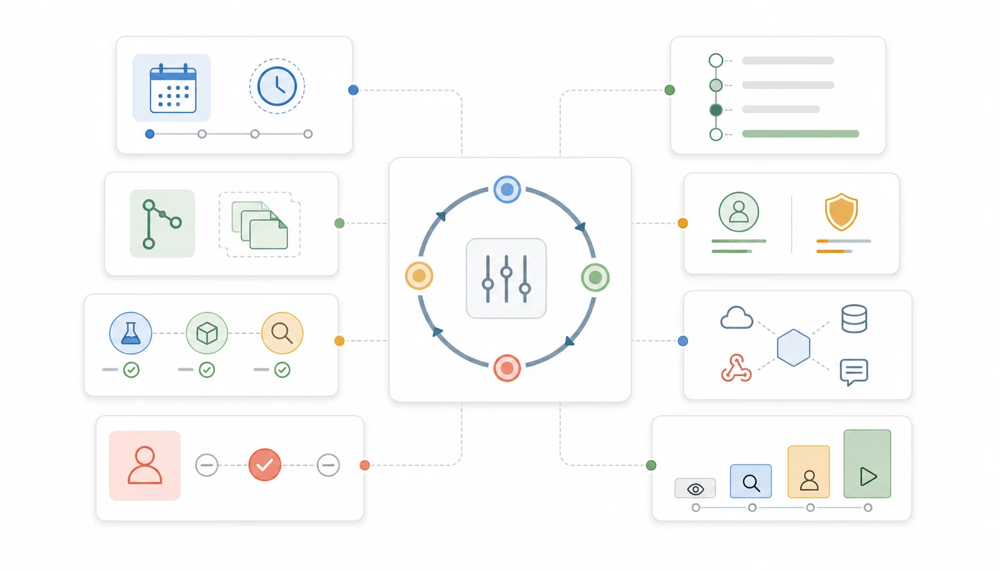
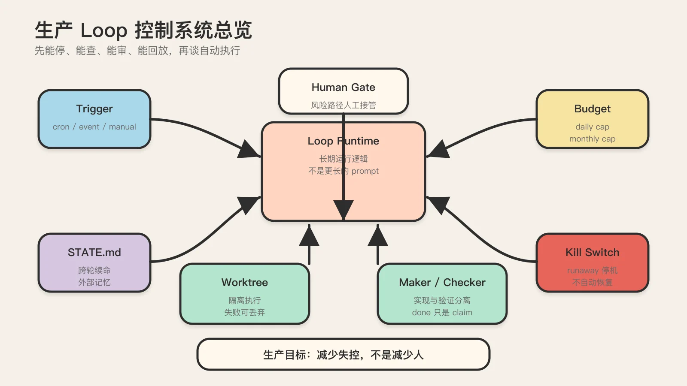
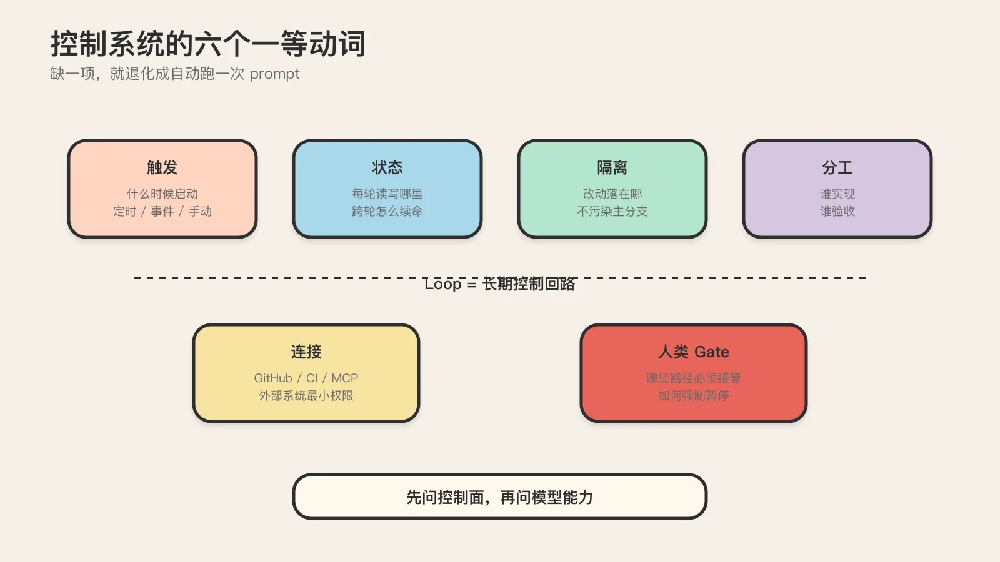
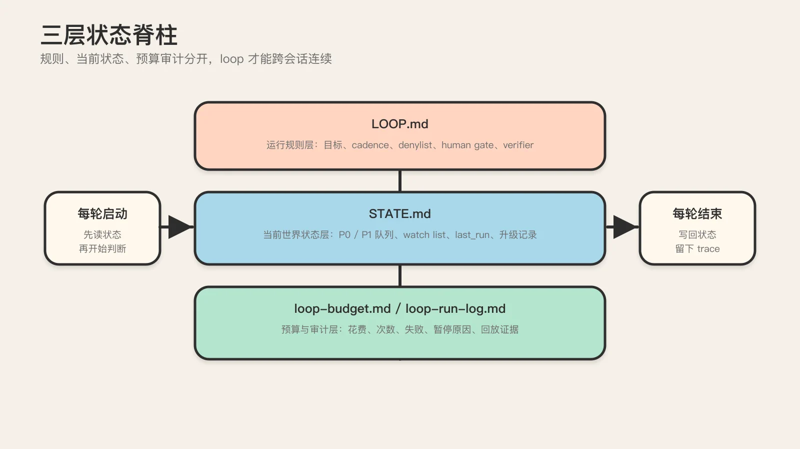
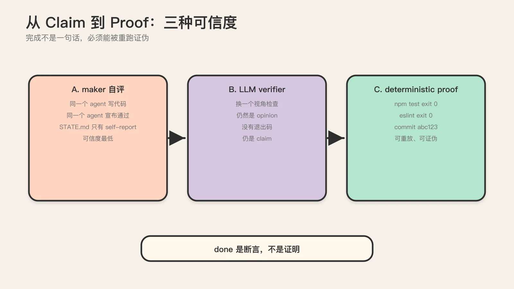
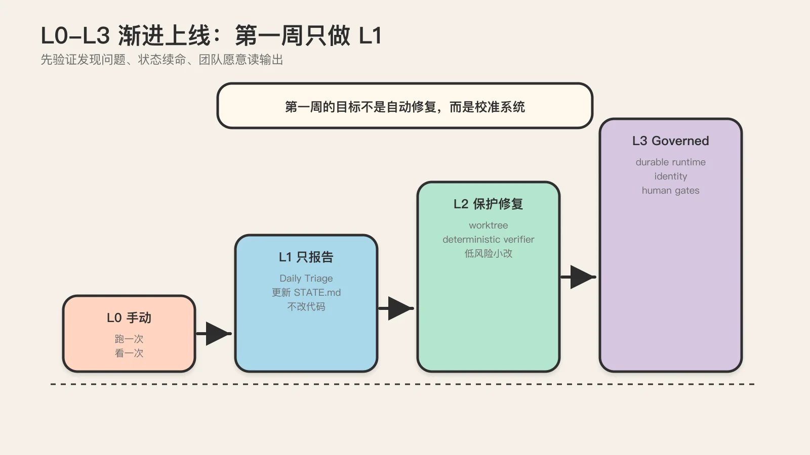
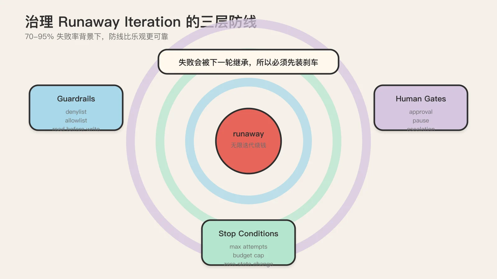
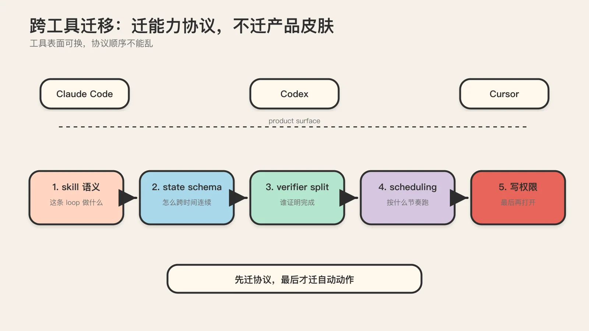
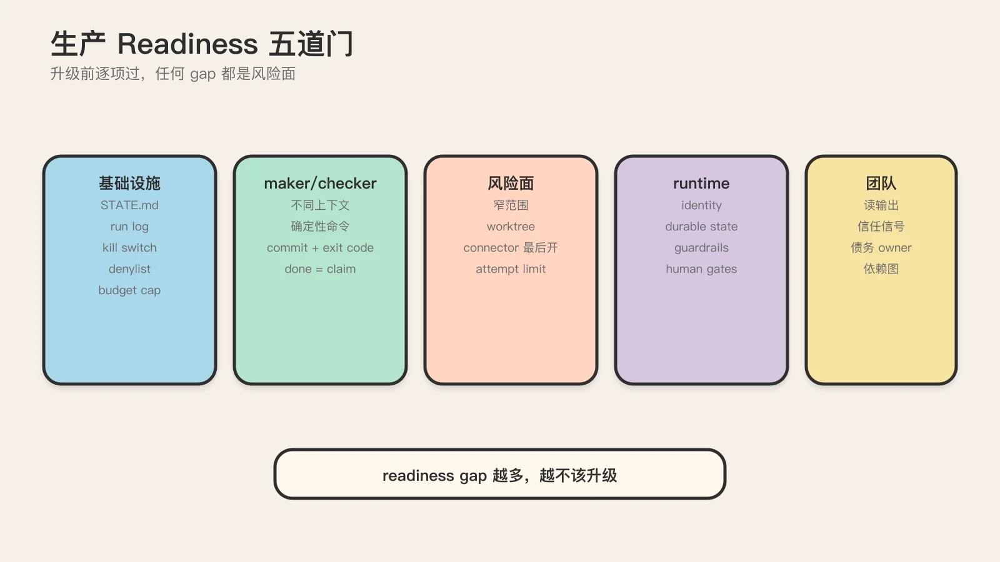

# 能停的 Loop 才敢上生产：从单次会话到可托付的代理控制系统



> 这是一篇写给「已经在用 Claude Code、Codex 或 Cursor，但想把 loop 真正跑上生产」的中高级工程师的判断框架。
> 它不复述本系列前五篇正文，而是在它们之上叠加一组 Phase 0 硬证据，给你一条从概念到能上生产的完整判断链。

## TL;DR

把分散在六篇方法论里的结论压成五条判断，按这个顺序读：

1. **loop 不是更长的 prompt，是控制系统。** 它至少要回答触发、状态、隔离、分工、连接、人类 gate 这六件事；缺一项就退化成「自动跑一次 prompt」。
2. **「完成」是断言，不是证明。** Addy Osmani 原话：写代码的 agent 在结构上就不适合评判自己的产出。即便拆了 verifier，「完成」也还只是 claim，必须用确定性校验（测试、lint、build）把它转成可证伪的 proof，理想情况 verifier 换不同模型。
3. **第一周只做 L1。** L1 只报告、不改代码。原因不是保守，而是你先要验证 loop 能稳定发现问题、状态结构能跨轮续命、团队愿意读它的输出。这三件事没跑通，L2/L3 的自动修复全是放大未知风险。
4. **loop 的成本是乘法，不是加法。** 20 步 loop 的成本远大于 20 倍单次调用，因为每步都在重发累积上下文。没有 context 隔离的多 agent 是单 agent 的 8.5 倍 token。生产 agent 失败率 70–95%，头号失控模式是 runaway iteration（无停止条件、无限迭代烧钱）。
5. **跨工具迁移，迁能力协议不迁产品皮肤。** 能力协议指 triage 规则、state schema、maker/checker 分工、节奏、风险边界这五样。只要保住它们，底层工具从 Claude Code 换到 Codex，loop 仍然是同一条 loop。

下面把每一条拆开讲，给具体数字、具体代码、具体反例。



## 一、问题起点：单次会话为什么不够用了

你已经会在 Claude Code 里一轮一轮地让 agent 干活。问题在于，单次会话有三条结构性短板，它们不是 prompt 写得不够好，而是「单次会话」这个形态本身决定的。

第一条短板是没有持续节奏。daily triage、PR babysitter、CI sweeper 这类工作天然需要反复发生，但你每次都得手动喊 agent 开工。Boris Cherny（Anthropic 的 Claude Code 负责人）在 Acquired Unplugged 舞台上直接说：「I don't prompt Claude anymore. I have loops running. They're the ones prompting Claude and figuring out what to do. My job is to write loops.」这句话不是营销，是内部实践者的工作状态证词。连最懂 Claude Code 的人都不再手动 prompt 了。

第二条短板是会话一断、历史判断就散了。你在某次会话里跟 agent 讨论清楚了「这个模块不要动」「这个测试是 flaky 的」「这个依赖降级有风险」，下次会话一开，这些判断全没了。agent 每次都像第一次来项目一样，重复发现同一个问题，重复问你已经回答过的事。这不是模型记忆力不够，是你没有把判断固化成外部状态。

第三条短板是没有可观测、可停、可审计的运行实体。当你的 agent 自动化多起来，一个盯 PR、一个盯 CI、一个盯依赖，你很快说不清每个 loop 在干什么、花了多少、谁该停、谁该放。生产事故通常不是 agent 突然变蠢，而是没人知道 loop 过去几天到底做了什么。

loop engineering 回答的正是这三条短板。它的核心不在「怎么写更好的 prompt」，而在「怎么设计一个会持续驱动 agent 干活、记录状态、控制风险的系统」。这是一个形态跃迁：你从「写 prompt 的人」变成「写 loop、由 loop 去 prompt agent 的人」。

需要警惕一个常见的起点错误：很多人第一次接触 loop，直觉是「太好了，终于能让 agent 自动把事情都做完」。这是错的。更靠谱的目标是先让系统持续看见问题、稳定记录问题、在小范围里提建议，最后才讨论自动执行。loop engineering 的第一目标不是减少人，而是减少失控。只有当系统先变得可见、可查、可停、可回放，自动化才值得继续放大。

## 二、loop 是控制系统，不是 prompt 模板

把 loop 和它容易混淆的四个邻居放在一起，边界最清楚。

### 2.1 loop vs prompt engineering

prompt engineering 关注 system prompt 怎么写、指令顺序怎么排、few-shot 示例怎么给、输出格式怎么约束。它默认还是一次会话、一次调用、一次交互的思路。loop engineering 往前走一步，开始问工程问题：这个任务多久跑一次、上一轮结果存在哪里、下一轮先读哪些状态、发现风险项时谁决定是否继续、出了错怎么暂停回放追责。

打比方：prompt engineering 像写一份「当前回合的战术指令」，loop engineering 像设计「整个赛季怎么打、战报怎么留、谁能下场、谁必须审批」。

把两者放在一张表里对照，差别更直观：

| 关注点 | prompt engineering | loop engineering |
| --- | --- | --- |
| 时间尺度 | 一次会话 | 跨天、跨周、跨会话 |
| 默认假设 | 调用完就结束 | 系统长期活着 |
| 状态来源 | 当前上下文 | STATE.md + 外部系统 |
| 失败处理 | 人立刻看到 | 必须可观测、可停、可回放 |
| 谁判断完成 | 人 | verifier 或确定性命令 |
| 成本模型 | 单次调用 | 乘法（累积上下文） |

表里每一行的右边一列，都是 loop engineering 比 prompt engineering 多出来的工程负担。这也是为什么 loop 不是「写更好的 prompt」能替代的：它处理的是完全不同时间尺度上的问题。

### 2.2 loop vs workflow

workflow 是固定流程：读输入、跑步骤 A、跑步骤 B、失败重试、成功输出。它适合输入稳定、步骤稳定、输出稳定的任务。loop 是持续运行的控制回路：它关心这件事会不会反复出现、这轮没处理完下一轮如何接着来、这个 agent 什么时候不该继续、这个系统如何长期活着。你可以把 loop 理解成一种更偏「运维态」的 workflow。

### 2.3 loop vs goal

goal 适合「做完一个明确任务」（把 failing test 修到全绿、完成一个 feature、解决一个具体 bug），这类事有明确终点，适合 run-until-done。loop 适合「长期看守一个持续问题」（每天巡检 issue/PR/CI、持续观察依赖升级、反复整理 backlog），这类事没有永久终点，只能靠节奏化运转维持秩序。

一个实用的判别法：有明确完成条件的更像 goal，本质上会不断再发生的更像 loop。两者最好的关系不是互斥而是协作：loop 负责发现和排队，goal 负责把某个具体项做完。

### 2.4 loop vs harness

harness engineering 研究的是模型外面那层工程骨架：工具调用、上下文管理、沙箱、评测、接口设计。它让 agent 能干活。loop engineering 在这个骨架之上再补一层「长期运行逻辑」：何时开始、何时继续、状态如何持久化、多个 agent 怎么分工、何时停机或交还给人。前者偏能力构建，后者偏运行设计。

读 Truefoundry 那篇企业级 runtime 时，最容易踩的坑就是把两层都叫 harness。OpenAI 的 harness engineering 讲的是 intra-agent harness（agent 内部脚手架：legibility、tools、constraints），让单个 agent 更聪明；Truefoundry 讲的是 extra-agent runtime（agent 外部运行时：identity、budgets、gates、inventory），让一群 agent 在组织里可治理。混淆两层会导致错误判断：「我们已经用了 Claude Code 的 harness，所以企业治理问题解决了」。错了，Claude Code 的 harness 是 intra-agent 的，它不回答「组织里有几个 loop、每个能碰什么、谁批的」。

### 2.5 控制系统的六个一等动词

把上面四个边界综合起来，一条真正的 loop 至少要回答这六个问题，每一个都是控制系统里的一等动词（first-class verb）：

- **触发（trigger）**：什么时候启动？定时、事件还是手动？
- **状态（state）**：每轮读什么、写回哪里？跨轮怎么续命？
- **隔离（isolation）**：自动化改动落在哪？不污染主工作区？
- **分工（division of labor）**：谁实现、谁验收、谁升级给人？
- **连接（connection）**：怎么接触 GitHub、Linear、CI 这些外部系统？
- **人类 gate（human gate）**：哪些路径必须人工接管？怎么强制？

缺其中任何一项，通常都还不叫 loop，只能算「长一点的 prompt」。



## 三、五积木 + 状态脊柱

源仓库 cobusgreyling/loop-engineering（标注「inspired by Addy Osmani」）把 loop 的构件总结成「五个 building blocks + memory」。Addy 的原定义是：「a loop is a recursive goal where you define a purpose and the AI iterates until complete」。这个提法避免你一上来就陷入某个工具的专有功能，先回到能力层。

把五个积木串起来，大概是这样一条链：

`schedule → triage → read/write state → isolated worktree → implementer → verifier → connector actions → human gate → 下一轮`

下面逐个看。

### 3.1 调度（Automations）

调度决定 loop 什么时候活过来。没有调度就没有「持续运行」，只有「我想起来时手动叫 agent 做点事」。调度层负责解决：每 5 分钟、每小时、每天还是事件触发？首次启动后要不要立刻跑？能否跨重启继续？夜间要不要降频？待办清空后是否自动停机？

一个成熟判断不是「越快越高级」，而是问：这个问题的发现延迟，值不值得我为它付出这条 loop 的 token 和噪音成本？Daily Triage 适合天级或小时级，PR Babysitter 适合 5-15 分钟，CI Sweeper 可以更密但成本也更高。调度必须和问题时效性匹配。

### 3.2 Worktree（Isolation）

如果 loop 只做报告，worktree 不是刚需；一旦 loop 开始尝试修复、改依赖、生成提交，worktree 就该成为标配。它的价值朴素但关键：每次自动尝试都有隔离空间，verifier 能在独立环境验证，失败直接丢弃不污染主分支，并行尝试时彼此不打架。

很多「自动修复很危险」的体验，本质上不是 agent 太蠢，而是执行环境没有隔离。没有隔离，自动化错误直接变成本地混乱；有隔离，自动化错误大多只是一次可丢弃的实验。

### 3.3 Skills

Loop 不是一次性会话，必须有长期稳定的任务描述和项目规则载体。一个好用的 loop skill 会明确：本轮先读哪些文件、输出写到哪里、triage 后怎样分类、哪些情况下禁止改代码、build/test/verifier 怎么执行。和普通 prompt 相比，skill 的价值在于可复用、可版本化、可被多个 loop 共用、可被不同工具迁移。

skill 应该写得**平淡、具体、可验证**，而不是「像一个资深工程师一样聪明地判断一切」。后者听起来高级，实际不可验证，也就不可信任。

### 3.4 Connectors / MCP

只会读本地仓库的 loop 很快遇到天花板。真实工程里 loop 还要接触 GitHub 的 issue/PR/Actions、Linear/Jira 的任务状态、Slack/飞书的通知出口、依赖和安全扫描结果、CI 平台和日志。这就是 connectors 或 MCP 的位置。

但这层同时是风险放大的开始。接了外部系统，loop 就可能创建或修改工单、评论 PR、开分支提 PR、触发 Actions、修改远程状态。所以这层最重要的原则不是「能接多少」，而是：最小权限、先读后写、先建议后执行。

### 3.5 Sub-agents：maker/checker 分离

这是 loop 从「自动写东西」升级到「有基本工程纪律」的关键。最常见的分工是 Implementer/Maker 负责生成改动，Verifier/Checker 负责跑测试、检查约束、决定是否通过。为什么必须拆开，下一节展开讲，这里先记住结论：实现者不能自己宣布完成，完成必须由 verifier 或人类 gate 决定。

### 3.6 状态脊柱

前面五个积木都重要，但状态层是脊柱。loop 的本质是跨时间运行，只要跨时间就一定要解决「上次发生了什么、这次从哪继续」。如果 loop 只把信息留在聊天记录里，它就不是工程系统，只是对话副产品。

为了让状态不越写越乱，建议按职责拆三层：

第一层是**运行规则层**，写在 `LOOP.md`，放 loop 目标、cadence、denylist、human gate、verifier 规则。这是「这条 loop 应该怎样运行」。

第二层是**当前世界状态层**，写在 `STATE.md`，放高优先级事项、watch list、最近动作、最后运行时间、升级记录。这是「这条 loop 当前看见了什么」。

第三层是**预算与审计层**，写在 `loop-budget.md`、`loop-run-log.md`，放 token 预算、每日上限、运行次数、失败和暂停原因。这是「这条 loop 花了什么代价、发生过什么事故」。

cobusgreyling 仓库提供的 CLI 脚手架能一键生成这套骨架：

```bash
npx @cobusgreyling/loop-init . --pattern daily-triage --tool claude-code
```

这条命令会生成 `STATE.md`（当前世界状态）、`LOOP.md`（skill/prompt 形态的运行规则）、`VISION.md`/`AGENTS.md`（常驻 spec）。到 v1.2.1 为止它覆盖 PR/CI/依赖/issue/changelog/memory/handoff/verification 这些 pattern，工具面向 Grok、Claude Code、Codex。脚手架的价值不在省事，在于它把状态脊柱强制成一等公民。你不会忘掉写 STATE.md，因为它一开始就给你生成了。

breim/loop-harness 仓库对 STATE.md 的角色有一句关键澄清：「STATE.md（比如声称测试通过）会被真实命令（npm test）核验」。这句话是理解整个 loop 可信度的钥匙：STATE.md 里写的「测试通过」只是 agent 的一个 claim，真正的证明要靠运行 `npm test` 这种确定性命令。这条线索直接通向下一节的核心论证。



## 四、maker/checker：「完成」是断言，不是证明

这是整个 loop engineering 最容易被工程化论述掩盖、但又最生死攸关的一节。先引 Addy Osmani 的原话：

> 「写代码的 agent 在结构上就不适合评判自己的产出。」
> 「The whole point of splitting the verifier sub-agent from the maker is to make the loop's 'it's done' mean something — and even then 'done' is a claim, not proof.」

把这段话拆成三层逻辑。

### 4.1 第一层：为什么 maker 不能自己验收

同一个 agent 在同一个上下文里，最容易出现的是「自我合理化」：它写了改动，于是更倾向于相信改动已经够好了。这不是模型「不诚实」，而是 LLM 的工作机制决定的。它生成下一个 token 时，会沿用刚刚生成的解释。你让一个刚写完代码的 agent 评估这段代码，它在结构上就偏向给高分。

所以 Addy 说，把 verifier 从 maker 里拆出来的全部意义，是让 loop 的「it's done」有点意义。注意「有点意义」不等于「绝对正确」，只是「不再是一面之词」。

### 4.2 第二层：即便拆了，「完成」仍然只是 claim

这是最容易被忽略的一层。很多人以为「我加了 verifier sub-agent，所以我的 loop 是可信的」。Addy 明确警告：即便拆了，「完成」也只是 claim，不是 proof。

为什么？因为 verifier 也是个 LLM，它同样可能被骗、可能 prompt 漂移、可能那天模型状态不好。一个 LLM 审查另一个 LLM 的产出，得到的是「第二个 LLM 觉得第一个 LLM 没问题」。这是一个 opinion，不是一个 fact。它比 maker 自评强（至少换了视角），但仍然不是证明。

### 4.3 第三层：把 claim 转成 proof 的唯一办法是确定性校验

要让「完成」从 claim 变成 proof，必须引入确定性校验，也就是测试、lint、build 这些跑出来要么过要么不过、没有解释空间的命令。

具体来说，verifier sub-agent 应该做的不是「读一遍代码判断好不好」，而是「跑 `npm test`、跑 `eslint`、跑 `tsc --noEmit`、跑 `docker build`，看退出码」。退出码是 0 就过，非 0 就不过。这是可证伪的：下一次任何人重跑同样的命令，得到同样的结果。LLM 的判断不可证伪，确定性命令的输出可证伪。这就是从 claim 到 proof 的跃迁。

更进一步，理想情况下 verifier 应该用不同的模型。原因还是自我合理化：如果 maker 和 verifier 是同一个模型，它们共享同样的盲点（同样的训练数据、同样的偏好和幻觉模式）。换一个模型做 verifier，至少能错开一部分盲点。这不是银弹，但它把「两个独立视角」这个属性补上了。

### 4.4 一个具体例子：STATE.md 声称「测试通过」

把这三层逻辑落成一个可对照的场景。假设你的 CI Sweeper loop 跑完一轮，在 STATE.md 里写：「修复了 #123，测试通过」。

现在你面临一个判断：这条 STATE.md 记录可信吗？

如果是「同一个 agent 改了代码、自己说测试通过、自己写进 STATE.md」，这是 maker 自评，可信度最低。它可能根本没跑测试，只是「觉得」应该会过。

如果是「maker agent 改了代码，verifier agent 读了一遍说看起来 OK，写进 STATE.md」，可信度高一点，但仍然是 claim。verifier 也可能没真跑测试，只是读代码觉得没问题。

如果是「maker 改了代码，verifier 执行了 `npm test`，退出码 0，于是 STATE.md 写『测试通过（npm test exit 0, commit abc123）』」，这才是 proof。它带了可重放的证据：任何人拿到 commit abc123，重跑 `npm test`，应该得到 exit 0。如果重跑不是 0，这条 claim 就被证伪了，loop 的可信度当场崩塌。而这恰恰是你想要的，因为崩塌发生在审计时，而不是上线后。

breim/loop-harness 的设计就是为这个场景服务的：STATE.md 的 claim 会被真实命令核验。这个「claim → 真实命令核验 → proof 或证伪」的闭环，是 loop 能不能上生产的底线。

### 4.6 把三种可信度落成可对照的 trace

把上面三种配置的 trace 摊开看，差别一目了然。假设三轮都在修同一个 CI 失败：

**配置 A（maker 自评，最不可信）**

```
[maker] 分析 CI 失败，修改了 src/auth.py 第 42 行
[maker] 判断：修复完成，测试应该通过
[STATE.md] 写入：修复 #123，测试通过
[trace 结束]
```

这条 trace 里没有 `npm test` 的退出码，没有 commit hash，没有可重放的证据。任何人审计这条记录都没法验证它是不是真的通过。它只是一句 self-report。

**配置 B（拆了 verifier 但仍是 claim）**

```
[maker] 修改 src/auth.py 第 42 行
[verifier] 读取 src/auth.py，判断改动看起来合理
[STATE.md] 写入：修复 #123，verifier 审查通过
```

verifier 「读了一遍判断」仍然是 opinion。它没有跑测试，只是读了代码觉得没问题。如果 maker 引入了一个只在并发场景下才触发的 bug，verifier 读静态代码根本看不出来。

**配置 C（确定性命令签 proof，可信）**

```
[maker] 修改 src/auth.py 第 42 行，commit abc123
[verifier] 执行：git checkout abc123 && npm install && npm test
[verifier] 退出码：0
[verifier] 执行：npx eslint src/auth.py
[verifier] 退出码：0
[STATE.md] 写入：修复 #123，npm test exit 0 @ abc123, eslint exit 0
```

配置 C 的 trace 带了两个可重放的证据：commit abc123 和退出码。任何人拿到 abc123，重跑 `npm test`，应该得到 exit 0。如果重跑不是 0，这条 claim 当场被证伪。而这正是你想要的，因为证伪发生在审计时，而不是上线后。

注意配置 C 多花了 token（跑了 install 和 test），这就是 Addy 说的「It costs real tokens and earns them selectively」。第二意见要花真钱，所以只该花在「错了代价大」的地方。修一个注释不值得跑完整 verifier 链；修一个合并进 main 的 PR 值得。这个判断必须基于「错了的代价」，不能基于「我觉得更稳」。



### 4.5 闭环 loop 自带验证 gate，开环靠人确认

最后一个区分：闭环 loop（closed loop）和开环 loop（open loop）在验证上的差别。

闭环 loop 自带验证 gate：maker 产出 → verifier 用确定性命令检查 → 不过就回到 maker 修 → 过了才往下走。这种结构里，「完成」是 verifier 用命令签过字的，自动化程度高。

开环 loop 没有 in-loop 验证：maker 产出 → 直接写进 STATE.md 或开 PR → 等人确认。这种结构里，「完成」最终由人拍板，自动化程度低，但人不在场时就完全不可信。

第一条 loop 该选哪种？答案取决于风险面，但默认推荐开环 + 人工确认，因为闭环的自动重试本身就是 runaway iteration 的温床（见第六节）。

## 五、L0-L3 渐进上线：第一周为什么只能是 L1

loop engineering 最值得直接照抄的部分是 L0-L3 上线分级。

| 级别 | 特征 | 风险 |
| --- | --- | --- |
| L0 | 只有意图、只有文档，没有真实 cadence，没有状态写回 | 几乎没有工程价值，团队常长期停在这步以为自己「有方案了」 |
| L1 | 定时跑、读写状态、只输出观察和建议、不改代码、不写远程高风险动作 | 风险非常可控，是最该认真经营的一层 |
| L2 | 开始做小范围自动动作，需要 worktree、verifier、denylist、人工 gate | 动作范围必须非常窄，否则越权 |
| L3 | 较强自动执行能力，较少人工盯盘，有完整预算、日志、暂停和升级机制 | 最不该太早追求，多数团队应把 L1 打磨扎实 |

在选第一条 loop 的 pattern 时，先按这张表筛。pattern 不是越多越好，是越匹配你的风险承受力越好：

| pattern | 适合作为第几条 | 推荐起步级别 | 关键风险 |
| --- | --- | --- | --- |
| Daily Triage | 第一条 | L1 | 几乎无，只读不改 |
| Changelog Drafter | 第一条 | L1 | 输出可审查，错了代价低 |
| Issue Triage | 第一条 | L1 | 输入结构化，边界清晰 |
| Post-Merge Cleanup | 第二条 | L1→L2 | 工作重复但涉及清理动作 |
| Dependency Sweeper | 第二条 | L2（只 patch 级、只 allowlist） | 触及 lockfile，需 worktree |
| PR Babysitter | 第三条 | L2 | 离代码改动和协作沟通近 |
| CI Sweeper | 第三条 | L2 | 高频、长日志、假阳性多，最容易烧钱 |



选 pattern 的四个判断问题：这个任务是否反复出现？它的输入是否足够结构化？出错后能否低成本回滚？能否先只报告而不自动执行？四个问题里两个答不上来，先别做 loop。

为什么 Daily Triage 几乎总是第一条 loop 的最优解？因为它同时满足四个条件：每天都会出现新 issue/PR（高频重复）、issue/PR 是结构化输入、只读不改所以出错零成本、天然可以先只报告。它的失败成本最低，最容易证明有价值，最适合训练团队如何读状态、调 cadence、写 triage skill。如果你从任何别的 pattern 起步，通常都比它更容易翻车。

### 5.1 第一周只做 L1 的真实理由

「只报告，不修复」听起来像保守主义的口号，但它背后有三个待验证的假设。在它们被验证之前，L2/L3 的自动修复都是在放大未知风险。

第一个假设：**这条 loop 真的能稳定发现值得看的问题吗？** 你可能以为 agent 每天扫一遍 issue 队列就能挑出高优先级项，但实际跑起来你会发现它要么把所有未关闭 issue 都标成高优，要么反复推荐同一个已经处理过的项。这些问题只有在真实跑几天后才会暴露，而 L1（只报告）让你能用最低成本发现它们。

第二个假设：**它的状态结构真能帮下一轮续命吗？** STATE.md 的字段、优先级分层、watch list、最后运行时间，这些不是写一次就对的。你要观察几轮之后才能发现：哦，缺一个「上次处理到哪」的字段；哦，watch list 没有时间戳，分不清哪些是陈年的。L1 让你迭代 state schema 时不污染任何东西。

第三个假设：**团队愿不愿意实际使用它写下来的结果？** 这是最容易被忽略的。loop 的产出如果没人读，它就是在烧 token 制造噪音。你需要观察几天：工程师早上来会不会真的打开 STATE.md 看一眼？如果不会，你要调整输出格式、通知方式，甚至 loop 本身的存在形态。这个调整在 L1 几乎无成本，在 L2/L3 可能已经开错了几个 PR。

这三件事没跑通，后面所有自动修复都没有意义。这就是为什么第一周的规则是「更新 STATE.md、写高优先级项和 watch list、标记待处理问题、记录 last run、不改代码、不开 PR、不自动 merge」。

### 5.2 从 L1 升到 L2 的最低门槛

如果一条 loop 要从报告型升级到辅助型，最低要求看这几项：

- 有稳定的 state schema
- verifier 已独立存在（不只是 maker 自评）
- 自动动作范围非常窄（先只做 patch 级、先只做 allowlist、先只提建议或草稿 PR）
- 有 denylist 路径（认证、权限、密钥、支付、生产基础设施直接 denylist）
- 有 attempt 限制（max retries）
- 有 run log
- 有 kill switch
- 团队已经读过这条 loop 一段时间的实际输出

只要其中两三项还没有，继续停在 L1 往往更理性。

### 5.3 L3 的真实门槛是 runtime，不是 loop 写得好不好

Truefoundry 那篇企业级 runtime 给出了 L2 和 L3 之间最锋利的操作性定义：

> 「The moment a loop must run at 3 a.m. with no terminal open, survive crashes, and wait indefinitely on a human, you've left tool territory for runtime territory.」

这句话告诉你：L2（attended，有人盯）和 L3（unattended，无人值守）的分界线，不在「loop 写得好不好」，而在「有没有一个 durable 的 runtime 持有这个 run」。跑在你笔记本上的 loop 是 L2：合盖就死、崩溃无法恢复、审批无法暂停三天。同一个 loop 搬到 governed runtime 上才是 L3：run state 由平台持有，扛得住崩溃和合盖，能等一个人类决策等三天三周三个月。

换句话说，L3 不是你把 loop 调得更准就能到的，它要求一整套 runtime 设施：durable state、独立 identity（loop 不再以作者身份运行）、预算上限、guardrails、stop conditions、human-in-the-loop gates。多数团队根本不该追求 L3，把 L1 打磨扎实、把 L2 控到足够小，已经是绝大多数真实工程场景的最优解。把 L3 当 KPI 是一种典型的目标错置。

## 六、成本与失控：loop 是乘法，不是加法

这一节全是硬数字，因为它要纠正一个广泛存在的误解：很多人按「单次调用成本 × 调用次数」估算 loop 成本，这是错的。loop 的成本是乘法关系，远大于加法。

### 6.1 为什么是乘法

每次迭代，loop 都要重发累积上下文。第一轮你发 1 万 token 的上下文，第二轮你发 1 万 + 上一轮的产出，第三轮你发 1 万 + 前两轮的产出……上下文是单调增长的。一个 20 步的 loop，最后一步发出的上下文可能是第一步的若干倍。所以 20 步 loop 的总成本 ≫ 20 × 单次调用成本。

把上下文增长画成一张表，乘法关系看得最清楚。假设每轮 maker 产出 3000 token、verifier 产出 1500 token，系统提示固定 5000 token：

| 轮次 | 累积上下文（输入） | 本轮产出 | 本轮总 token |
| --- | --- | --- | --- |
| 第 1 轮 | 5000 | 4500 | 9500 |
| 第 2 轮 | 5000 + 4500 = 9500 | 4500 | 14000 |
| 第 5 轮 | 5000 + 4×4500 = 23000 | 4500 | 27500 |
| 第 10 轮 | 5000 + 9×4500 = 45500 | 4500 | 50000 |
| 第 20 轮 | 5000 + 19×4500 = 90500 | 4500 | 95000 |

到第 20 轮，单轮输入已经是第 1 轮的 18 倍。把 20 轮加总，总 token 消耗约 105 万，而不是天真估算的 20 × 9500 = 19 万。两者差 5 倍以上。这就是「乘法不是加法」的数学含义：累积上下文让每轮输入单调增长，加总后远超线性外推。缓解手段是 context 隔离（sub-agent 各自独立上下文、verifier 不继承 maker 的历史）和上下文压缩（每轮结束后摘要而非全量保留）。

更糟的是多 agent 场景。如果没有 context 隔离，多个 sub-agent 共享或反复传递上下文，token 消耗会爆炸式增长。一份行业测算给出过具体数字：无 context 隔离时，多 agent 配置的 token 消耗是单 agent 的 8.5 倍（85 万 vs 10 万 tokens）。这不是模型变贵了，是工程没做对。

### 6.2 真实成本区间

Claude Code 这类工具的基线成本不算高：日均约 $13/人/天，90% 用户低于 $12/天。这是「人盯着的单次会话」的成本。一旦进入 agentic 重度使用，数字跳一个量级：$400–1500/月，极端情况（runaway loop 跑几天）能到 $4000+。

Truefoundry 的 Noor 故事（虽然是合成案例，但精确映射了真实失效模式）讲的就是这个：一个 staff engineer 搭了团队最好用的 triage loop，某个周末 loop 对着一个坏掉的 test 环境热情重试了两天，没人看着，账单在周一发票上才被发现。这就是 Cost 维度的典型失效：loop 与计费表之间什么都不挡。

官方的缓解手段是 Task Budgets：模型能看到自己的预算并自我节流。但这只是缓冲，不是根治。根治要靠硬上限。

### 6.3 失败率与 runaway iteration

生产 agent 的失败率在 70–95% 之间。这个数字来自 Fiddler 的 AI agent 失败率报告，听起来吓人，但它衡量的不是「单步准确率」，而是「端到端任务完成率」。一个串联 5 步、每步 95% 可靠的 loop，整体干净完成的比例是 0.95^5 ≈ 77.4%，每跑 4 次大约有 1 次失败。单步 95% 已经是当前 LLM 的现实，再往上提升极难。

头号失控模式是 runaway iteration：loop 没有停止条件，于是无限迭代烧钱。Splunk 给了一句很形象的描述：「catch the runaway loop before it reaches the bill」，要在它抵达账单之前截住它。

runaway 的典型触发路径有四条，每条配一个具体场景：

第一条，verifier 永远不通过，maker 永远在重试。如果 verifier 的通过条件写得不可达（比如「测试 100% 覆盖」），maker 就会无限改下去。这是 maker/checker 分离的副作用：你以为加了 verifier 更安全，结果它变成了 runaway 的发动机。真实场景：CI Sweeper loop 的 verifier 写成「所有 flakey test 必须被消除」，但 flakey test 本质上无法靠改代码消除（它是环境问题），maker 就会反复重构同一个测试文件，每轮 verifier 都说「还不够」，烧到预算上限才停。

第二条，输入是脏的，loop 在错误问题上反复浪费预算。flakey CI、长日志、重复 issue，输入越脏，loop 越容易在噪声里打转。真实场景：PR Babysitter 盯着一个间歇性失败的 CI job，每 5 分钟检查一次，每次都把这个 flake 当成新问题 triage 一遍，开 watch list，写 STATE.md，下一轮又重新发现。一天下来没有任何真实价值，但 token 烧了 20 万。

第三条，没有 early-exit 的「空跑」。没有待办时 loop 不停机，每轮都发一轮上下文确认「确实没事」，日积月累也是钱。真实场景：Daily Triage 在周末也按工作日 cadence 跑，每次都确认「无新 issue、无新 PR」，每轮 1 万 token，两天 8 轮就是 8 万 token 的纯空转。

第四条，重试没有上限。某个动作失败，loop 默认重试，重试次数没设上限，于是它一直试一直试直到周末结束。这就是 Noor 周末事故的机制：loop 对着坏掉的 test 环境重试两天，test 环境返回错误让 loop 以为「再试一次可能就好了」。

四条路径共同点：都是「没有 stop condition」或「stop condition 写错了」。这也是为什么 stop conditions 是三层防线里最关键的一层，它直接堵住 runaway 的四个出口。

### 6.4 治理 runaway 的三层防线

Truefoundry 给的三层防线是目前见过最系统的方案，按粒度从细到粗排：

第一层 **Guardrails**：每个 model call 和 tool call 过 pre/post-call checks（PII 检测、内容策略、自定义规则）。它是最细粒度的防线，防止单次调用出错。

第二层 **Stop conditions**：run 级别设边界。具体三个字段：

```yaml
harness:
  max_steps: 60              # 步数上限，到了强制停
  max_tokens_per_run: 1_500_000  # token 预算，烧到上限强制停
  stall_detection: true       # 连续 N 步无进展判定为 stall，强制停
```

这三个都是配置项，不是希望（not hope）。Stop conditions 不只是防失控，更是让 run 的结局可解释。Truefoundry 有一句关键辨析：「The difference between 'the loop converged' and 'the loop stopped when its budget said so' is what the trace tells you.」意思是 loop 跑完了，到底是真完成了任务还是被预算掐死了，trace 一看就知道。没有这个区分，团队会陷入「调高预算-再爆-再调高」的死循环。

第三层 **Human-in-the-loop gates**：破坏性动作（merge PR、改生产系统、删数据）前暂停，durable 持有 run state 直到有人批准。这是最粗粒度的防线，防止不可逆后果。它的关键不在于「能不能暂停」（笔记本 loop 也能暂停，只是暂停了就没了），而在于暂停后 state 是 durable 的。governed runtime 上的 loop 暂停在一个 merge_pr 的 approval 上，等三天三周三个月，人回来批准了 loop 从暂停点继续。

三层缺一不可。只有 guardrails 没有 stop conditions，agent 可能在合规范围内无限重试烧钱；只有 stop conditions 没有 gates，agent 可能在预算内完成了一个破坏性不可逆动作；只有 gates 没有前两层，人会被 approval 疲劳淹没，最后机械地点「批准」。



### 6.5 三种债：loop 越有效，欠的债越深

成本不只是 token 账单。Linas 的深读提出了一个被反复引用的反直觉命题：loop 跑得越好，长期成本越糟。这个成本不是钱，是被抽象成「三种债」的隐性代价。

**Comprehension debt（理解债）** 是最被独立来源一致确认的一种。Truefoundry 给的定义最干净：「comprehension debt grows faster as the loop improves — the gap between what exists and what you understand compounds with every unread PR.」机制是这样的：你有一套对系统的心智模型，loop 在改系统，你的心智模型却没有同步更新。每一个你只是扫一眼就 merge 的 PR，都在拉大「系统真实状态」和「你以为的系统状态」之间的 gap。这个 gap 不是线性增长，是复合增长，因为后一个 PR 假设你理解前一个 PR。理解债还有一个阴险特征：它不痛。coordination debt 表现为 loop 之间打架你能看到报错，maintenance debt 表现为东西坏了你能看到故障，理解债是静默的。系统还在跑，PR 还在 merge，直到有一天你被叫去 debug 一个谁都没见过的子系统。

**Coordination debt（协调债）** 出现在 loop 从一个变成多个时。两个 loop 都想改同一个文件，谁先谁后？一个 loop 的输出是另一个 loop 的输入，被依赖方一变，依赖方静默失效。多个 loop 同时跑，token 预算和 rate limit 被互相抢占。这种债在企业级规模尤其致命，因为每个团队都不完全理解另一个团队的 loop 在依赖什么。

**Maintenance debt（维护债）** 最朴素但最易被忽视。loop 不是写完就一劳永逸，它依赖的工具、API、prompt 模式、模型版本都在变。Claude Code 上个月还支持的命令格式下个月可能改了；某个 MCP connector 的 schema 升级了，依赖它的 loop 静默失效；模型从 Sonnet 换到 Opus 再到 Fable，原来调好的 prompt 突然行为漂移。模型升级当天，维护债立刻到期。

三种债合起来是一句话（chenguangliang.com 的英文综述表达得最干净）：「the loop changes what you do, it doesn't delete you from it.」loop 不消灭你的工作，loop 改变你的工作。你的工作从「写代码」变成「监督写代码的系统、协调多个系统、维护这些系统、持续还这三种债」。把 loop 当一劳永逸的自动化，是误解了它的本质。

### 6.6 三种债在生产里的具体长相

把抽象的债落到具体场景，能帮判断自己是否已经在欠债。

理解债的累积曲线是非线性的。一个 5 人团队用 Claude Code 做后端，配了 PR review loop 和 test generation loop。前两周，每个 PR 团队都仔细读 loop 的评论，理解它建议的改动。第三周开始，loop 的评论准确率稳定在 90% 以上，团队开始只扫一眼就 approve。第六周，一个 junior 提交的 PR 里有一段谁都没仔细看的代码进了主干，loop 也没标红，因为这段代码用了 loop 没见过的内部模式。三个月后，这段代码引发了线上故障，debug 时全队才发现没一个人完整理解那个子系统。理解债在第六周就开始复合增长，但直到第三个月才显形。

协调债的爆发点在 loop 数量从 2 涨到 4。同一个团队后来加了 tech debt sweep loop 和 dependency upgrade loop。两个 loop 都会改 package.json。一开始相安无事，直到有一天 tech debt sweep 把某个依赖降级了（它判断这个依赖有漏洞），同一天 dependency upgrade 把同一个依赖升级了（它判断这个依赖过时了）。两个 PR 都被自动 merge，main 分支的 package.json 进入不一致状态，CI 没立刻报错，但生产环境三天后出了一个诡异的兼容性问题。协调债的根因是没有任何机制管理 loop 之间的依赖。

维护债的到期日通常是模型升级当天。这个团队用 Claude Sonnet 调好了所有 loop 的 prompt。Fable 5 发布后，团队兴奋地全切过去，期望长程自主能力提升 loop 效果。结果是：一半 loop 行为漂移了，原来针对 Sonnet 调的 prompt 在 Fable 5 上解读不同。test generation loop 开始生成风格不同的测试，PR review loop 的评论语气变了，dependency upgrade loop 甚至开始拒绝它以前能处理的任务。维护债在模型升级当天就到期，团队花了一整周重新校准所有 loop。

三个案例的共同点：债务都不会在建 loop 当天显形，都在 loop 稳定运行一段时间后爆发。这是 loop engineering 和传统开发最大的不同。传统开发的成本是即时的（你写代码花的时间），loop 的成本是延迟的（你不还债，几个月后还本付息）。

### 6.7 还债机制

既然债不可避免，就得设计还债机制，而不是寄望于「我不会欠债」。

理解债的还债机制最朴素：每周强制读几个 loop 自动 merge 的 PR，不是扫一眼，是完整读。这条机制本身要写进工作流，不是想起来才做。它的本质是消耗人类注意力去对冲 loop 产出的不可见性。你没法让 loop 自己还理解债，因为理解债的根因就是「没人理解」。

协调债的还债机制是维护一个 loop 依赖图：哪些 loop 改同一个文件、哪些 loop 的输出是另一个 loop 的输入、哪些 loop 共享同一个 connector 的 rate limit。每周 review 一次这个图，发现新耦合就加显式契约。两个 loop 改 package.json，要么序列化（一个跑完另一个才跑），要么加文件锁，不能靠「运气好它们不同时跑」。

维护债的还债机制是模型/工具升级后的全 loop 回归测试。每次 Anthropic 发新模型、每次 MCP connector 升级 schema、每次 Claude Code 改命令格式，都要跑一次「所有 loop 在测试仓库上各跑一轮，看输出是否符合预期」。不符合的 loop 锁在旧版本，直到重新校准。这条机制的代价是工程时间，但远低于「全切新模型后线上挂三天」的代价。

### 6.8 无人值守放大每一个错误

回到那个 70–95% 的失败率。它最阴险的地方不是单次失败，而是无人值守场景下错误的堆叠效应。

Truefoundry 给过一段算术：一个串联 5 步、每步 95% 可靠的 loop，整体干净完成的比例大约是 0.95^5 ≈ 77.4%，每跑 4 次大约有 1 次失败。在 attended loop（有人盯）里，这个失败率可以接受，失败了人在，重启、修、继续。但在 unattended loop（无人值守）里，这个失败率是致命的，原因有二。

第一，无人值守 loop 的错误会堆进 state。明天的 run 建在今天的错误上。今天的 run 在第 4 步失败了，但 state 已经被前 3 步污染了（比如已经开了个半成品 PR、已经改了几个文件、已经发了几个通知），明天的 run 从这个污染的 state 出发，可能又往前走了一步，又污染了一点。一个无人值守 loop 跑一周，state 可能积累了一周的半成品错误，最终成为一个无法清理的烂摊子。

第二，无人值守放大每一个错误的后果。attended loop 里，第 4 步失败，人在，立刻看到，立刻止损。unattended loop 里，第 4 步失败，没人看，loop 可能继续重试（烧钱）、可能继续往下走（污染更多 state）、可能在错误基础上「完成」（产生一个看起来对实际错的输出）。失败从「一次中断」放大成「一连串连锁损失」。

这就是为什么 maker/checker 分离、stop conditions、durable state 在 unattended 场景下是承重的。Simon Willison 有个老笑话：agent 是「an LLM wrecking its environment in a loop」（一个在 loop 里破坏自己环境的 LLM）。这句话贴在 attended 场景下是幽默，贴在 unattended 场景下是工程现实。runtime 治理的全部意义，就是在单步可靠率不够的前提下（95% 已经是当前 LLM 的天花板），让整体也能安全跑。靠的不是「等模型变强」，而是三层防线 + maker/checker 两层完成的工程方案。

## 七、跨工具迁移：迁能力协议，不迁产品皮肤

loop engineering 不是某一个产品的官方教程。真正可迁移的是能力组合，不是产品名字。基于源仓库的 primitives matrix，常见 agent 环境的能力映射大致如下：

| Loop 能力 | Claude Code | Codex | Cursor |
| --- | --- | --- | --- |
| 调度/自动化 | `/loop`、scheduled tasks、GitHub Actions、cron | Automations、项目级 cadence、云端环境 | Automations、Cloud Agent、外部 cron/webhook |
| 持久项目知识 | `SKILL.md`、`CLAUDE.md` | Skills、`AGENTS.md` | `.cursor/rules/`、skills、`AGENTS.md` |
| 隔离执行 | `git worktree`、subagent worktree | 内建 worktree/线程隔离 | Git worktree、独立 Agent 任务 |
| maker/checker | task subagents、reviewer agent | subagents、自定义 agent、独立验证线程 | review mode、多 agent、Cloud Agent 二次复核 |
| 外部系统连接 | MCP、plugins | connectors、MCP、plugins | MCP、GitHub/Linear/Slack 集成 |
| 状态骨架 | `STATE.md`、项目文件、外部工单 | `STATE.md`、Markdown、Linear、连接器 | `STATE.md`、rules、memories、外部看板 |

产品名不同，但关键原语差不多都在。所以跨工具迁移时最该坚持的不是「这个工具有没有同名功能」，而是四件事：skill/指令资产是否可复用、状态文件是否跨会话稳定、maker/checker 是否能分离、调度和外部连接能否形成闭环。

三个工具各有一个最适合的落地姿势。

Claude Code 最适合把 loop 织进仓库纪律。它的优势是天然贴合项目规范：CLAUDE.md 放全局边界（测试命令、denylist、审批边界），SKILL.md 放 triage/verifier/action skill，subagents 做 maker/checker 分工，hooks 和 headless/CI 补自动化入口。一个典型落地是：先用 CLAUDE.md 定义测试命令和 denylist，再用 SKILL.md 写 loop-triage 和 loop-verifier，然后 STATE.md 记录高优先级项，先用 `/loop 1d` 或 GitHub Actions 跑 L1，稳定后再在 worktree 里引入小修复。Claude Code 适合那些已经把项目规则文档化、愿意长期维护 skill 资产的团队。

Codex 最适合把 loop 做成「自动化 + 技能 + 线程管理」的工作台。它的三层是 Automations（cadence、项目环境、触发方式）、Skills/AGENTS.md（稳定任务说明和仓库协作边界）、Subagents/worktree/connectors（执行、验证、外部连接）。落地姿势是：loop 目标写进 skill 或 AGENTS.md，用 Automation 让任务按 cadence 跑，state 文件或 Linear 记录结果，verifier agent 检查 stop condition，外部动作路径加 connector 权限控制。Codex 的优势不是「更会写 loop」，而是它已经提供了一套自然的长期任务运行面板。

Cursor 最适合把 loop 和编辑器工作流粘在一起。它不需要完全照抄 CLI agent 的落地方式：rules 管长期上下文，skills 或 agent 模板管专门任务，Automations/Cloud Agent 管调度，review 模式或第二个 agent 管 verifier，Git worktree 管隔离。Cursor 适合团队主工作台本来就在 IDE、loop 更多是「协助型」而非重度无人值守、想把 triage/review/轻量修复嵌进日常开发的场景。它更像「编辑器内 loop」，而不是「独立运维系统」。

### 7.1 三个最常见迁移坑

**坑一：复制命令，不复制结构。** 把某个工具里的 `/loop 1d` 机械换成另一个工具的 automation，却没有补 state、verifier 和 handoff 规则。这类迁移只复制了表层入口，没有复制 loop 本体。

**坑二：复制提示词，不复制状态协议。** 如果 STATE.md 的字段、优先级分层、最后运行时间、watch list 都没带过去，loop 跨工具后几乎一定失忆。

**坑三：复制「自动修复」，不复制安全护栏。** 直接抄别人的 dependency sweeper 或 PR babysitter 行为，却不抄 denylist、worktree、verifier、max attempts、kill switch。结果是最危险的部分被完整复制，最重要的保护层被漏掉。

### 7.2 推荐迁移顺序

把同一条 loop 从 A 工具迁到 B 工具，按这个顺序：

1. 先迁 skill 语义（决定这条 loop 到底在干什么）
2. 再迁 state schema（决定它怎么跨时间连续）
3. 再迁 verifier split（决定它是否还能自我约束）
4. 再迁 scheduling（决定运行节奏）
5. 最后才迁写权限动作（风险最高，应该最后开）

一句话总结：**迁移 loop 时，迁能力协议，不要迁产品皮肤。** 能力协议包括 triage 规则、state schema、maker/checker 分工、节奏、风险边界。只要这些保住，底层工具换了，loop 仍然是同一条 loop。



### 7.3 工具无关的最小模板

不管你在哪个工具里做，先把这几样准备好：一个 STATE.md、一个 triage skill、一个 verifier 说明、一个 cadence、一个 denylist、一个 kill switch。连这几样都没有，谈「迁移 loop」还太早。

### 7.4 什么时候不该硬迁

有些 loop 在原工具里能跑，不代表值得迁到另一个工具。三种情况建议保留主运行面而不是迁移：严重依赖某平台独有自动化入口（比如 Codex 的云端环境）、严重依赖某平台的权限模型或云环境、团队根本不在那个工作台里协作。这时更好的策略往往是保留主运行面，再把 STATE.md 的结果同步到其他工具。

### 7.5 一个常见的反面判断

很多团队迁移 loop 的动机是「听说 Codex 比 Claude Code 好」或「Cursor 更顺手」，于是把整个 loop 搬过去。这是用工具选型替代能力建设。loop 的成败 90% 取决于能力协议（state schema、maker/checker、risk boundary），10% 取决于工具。你从 Claude Code 迁到 Codex，如果没带上 STATE.md 的字段约定、verifier 的确定性命令、denylist，新工具里的 loop 仍然是个失忆的、自我合理化的、没有护栏的 loop，只是换了个皮肤。反过来，如果能力协议扎实，即使工具弱一点，loop 仍然能跑。这就是「迁能力协议不迁产品皮肤」的实证含义。

## 八、你的第一条 loop：最小可运行模板

理论讲够了，给一个能照抄的模板。这条 loop 是 L1 Daily Triage，第一周只报告不修复。

### 8.1 目录结构

```
.loop/
├── LOOP.md            # 运行规则层
├── STATE.md           # 当前世界状态层
├── loop-budget.md     # 预算与审计层
└── loop-run-log.md    # 运行历史
```

或者直接用脚手架生成：

```bash
npx @cobusgreyling/loop-init . --pattern daily-triage --tool claude-code
```

### 8.2 LOOP.md（运行规则）

```markdown
# Daily Triage Loop

## 目标
每天早上扫描仓库状态，挑出高优先级项，写入 STATE.md。
不修代码，不开 PR，只报告。

## cadence
每天 06:00 跑一次（cron: 0 6 * * 1-5）。

## 本轮先读
- `git log --since="1 day ago"`
- 开着的 issue 和 PR
- 最近一次 CI 结果

## 输出写到哪里
- 高优先级项 → STATE.md 的 high_priority 段
- 观察项 → STATE.md 的 watch_list 段
- 最后运行时间 → STATE.md 的 last_run 字段

## denylist（绝不自动动手）
- 认证、权限、密钥、支付、生产基础设施
- 任何写权限的 GitHub 动作（不开 PR、不评论、不 merge）

## human gate
- 任何不确定的项都标 needs_human，不自己判断
```

### 8.3 STATE.md（当前世界状态）

```markdown
# STATE — Daily Triage

last_run: 2026-06-30T06:00:00Z
last_result: ok

## high_priority
- [ ] #142 CI 在 main 上红了 3 小时（needs_human）
- [ ] #138 PR #137 的 review 卡了 2 天

## watch_list
- #131 依赖 foo 有新版本（观察中，第 2 天）
- #120 issue 标签需要清理（低优）

## needs_human
- #142（CI 红了，但日志看起来像 flakey test，不确定是不是真问题）
```

注意几个字段：`last_run` 让下一轮知道上次跑到哪；`needs_human` 把不确定项显式升级给人；watch_list 的「第 2 天」是观察计数，避免 loop 反复推荐同一个已经看过的项。

### 8.4 loop-budget.md（预算与审计）

```markdown
# Loop Budget

daily_token_cap: 200_000
monthly_token_cap: 4_000_000
kill_switch: 触发任一上限自动停，并 ping oncall

## 本月消耗
- 2026-06-30: 18_000 tokens ($0.27)
- 2026-06-29: 22_000 tokens ($0.33)
```

### 8.5 跑起来之后第一周检查清单

每周末问自己这几个问题：

- 这条 loop 这周真的发现了值得看的问题吗？还是大部分输出都被人工忽略？
- STATE.md 的字段够用吗？有没有发现缺一个「上次处理到哪」的字段？
- 团队愿不愿意实际读它的输出？工程师早上来会不会打开 STATE.md？
- 它的 cadence 对吗？每天一次够不够，还是太频繁变成噪音？
- 预算稳定吗？有没有某一天突然烧很多 token？

这五个问题里如果三个答「不」，先调 loop，别急着升级 L2。

### 8.6 进阶：L3 的 governed 长什么样

L1 的最小模板是笔记本 loop。如果你要把同一条 Daily Triage 推到 L3（无人值守），配置会膨胀成下面这种 governed YAML（参考 Truefoundry 的 Noor 重建案例）：

```yaml
agent:
  name: morning-triage-loop           # loop 的独立 identity，不再以作者身份运行
  model: claude-sonnet-4-6            # 按名字引用，密钥住在 gateway，不在配置里
  instructions: ./triage.md@v4        # 版本化的脚手架，可回滚
  skills: [ci-triage-runbook@v2]      # 从 Skills Registry 拉取，带 RBAC
  mcp_servers: [github, ci, linear]   # 通过 MCP Gateway，scoped 且可轮换
  subagents:
    - { name: fix-drafter,  mcp_servers: [github] }   # maker，能起草 PR
    - { name: fix-reviewer, mcp_servers: [] }          # checker，零工具 read-only
  harness:
    max_steps: 60
    max_tokens_per_run: 1_500_000     # 周末事故的硬上限
  approvals: { merge_pr: pause_for_human }   # 能为一个审批暂停几天
trigger: { schedule: "0 6 * * 1-5" }  # 心跳，不需要任何人的终端开着
```

逐行看，每一行都在回答一个 enterprise gap：`name` 是 loop 的 identity（不再是作者私有财产）；`model` 按名字引用意味着 no keys anywhere（凭证住在 gateway）；`instructions@v4` 是版本化脚手架（可回滚）；`skills` 带版本和 RBAC（不是随便一个文件夹）；最关键的是 `fix-reviewer` 的 `mcp_servers: []`，checker 零工具、read-only，这是 maker/checker 企业级分离的精髓。一个能编辑的 checker 只是第二个 maker，一旦被 prompt 漂移攻陷就能直接 merge PR，maker/checker 分离就名存实亡。`harness.max_tokens_per_run` 直接回应 Noor 周末事故：那个对着坏 test 环境重试两天的事故，replay 到这个配置上就是一次被截断的 run 加告警，而不是周一发票。`approvals.merge_pr` 让 loop 能等一个人类决策等几天，这是 L2 和 L3 的真正分界：durable state 让「等待」不等于「死亡」。

这份 YAML 的价值不在「多写了几行配置」，而在它把 loop 从「作者的私有财产」变成了「组织的受治理资产」。但要注意它的代价：governed runtime 是重型基础设施，单 loop、低风险、作者盯着账单时根本不需要它，装作需要是供应商表演。先确认你真的有 L3 的需求（不可逆动作、无人值守、凭证敏感、账单可能爆、多团队各自搭 loop），再投入 runtime，否则就是本末倒置。

## 八点五、三个最常见的误解

把全文反复出现的三个误解集中澄清，因为它们是阻止 loop 上生产的真正障碍。

误解一：「loop 就是定时跑的 prompt」。错。定时跑只是触发，loop 还要回答状态、隔离、分工、连接、人类 gate 五件事。只有触发的「loop」只是 cron + LLM 调用，它没有持续记忆（每轮失忆）、没有验证（maker 自评）、没有护栏（失控就烧钱）。这种东西跑起来会有「我在做 loop engineering」的错觉，但它退化成了「自动跑一次 prompt」。

误解二：「加了 verifier 就可信了」。部分错。verifier 拆出来确实比 maker 自评强，但 verifier 仍然是 LLM，它的判断是 opinion 不是 fact。要可信，verifier 必须用确定性命令（npm test、eslint、tsc）把 claim 转成 proof，带 commit hash 和退出码的可重放证据。一个只读代码判断的 verifier，和 maker 自评只有强度差异，没有质变。

误解三：「L1 太弱了，直接上 L2 才有效率」。错得最危险。L2/L3 的自动修复建立在三个未经验证的假设上（loop 能稳定发现问题、state schema 能跨轮续命、团队愿意读输出）。L1 是用最低成本验证这三个假设的阶段。跳过 L1 直接上 L2，等于在三个假设都未验证的情况下放大风险面：你不知道 loop 会不会在错误问题上反复烧钱，不知道 state 会不会失忆，不知道团队会不会忽略所有输出。结果通常是 loop 制造了一堆错误 PR，团队失去信任，然后整个 loop engineering 实践被否定。这不是 loop engineering 不行，是上线节奏错了。

## 九、生产 readiness 自检清单

把全文压成一份可以照抄的 readiness 自检。升级 loop（尤其是 L1→L2 或 L2→L3）之前，逐项过。

### 9.1 基础设施自检

- [ ] 有 STATE.md，且每轮都读、每轮都写
- [ ] 有 run log，团队能查过去几天 loop 做了什么
- [ ] 有 kill switch，且测试过真的能停
- [ ] 有 denylist，认证/权限/密钥/支付/生产基础设施在里面
- [ ] 有预算上限（daily + monthly），且超了会自动停

### 9.2 maker/checker 自检

- [ ] maker 和 verifier 是不同的 agent / 不同的上下文
- [ ] verifier 用确定性命令（npm test / eslint / tsc）而非「读一遍判断」
- [ ] STATE.md 里的「测试通过」带可重放证据（commit hash + 退出码）
- [ ] 理想情况 verifier 用不同模型
- [ ] 「完成」被当成 claim 对待，最终由人或确定性命令签 proof

### 9.3 风险面自检

- [ ] 自动动作范围非常窄（先 patch 级、先 allowlist、先草稿 PR）
- [ ] 代码改动落在 worktree，不污染主工作区
- [ ] 写权限 connector 是最后才开的，不是一开始就给
- [ ] 通知策略只在「真正需要决策、达到 max retries、命中 denylist、预算超限、验证连续失败」时触发
- [ ] 有 attempt 限制，失败不无限重试

### 9.4 runtime 自检（L3 才需要）

- [ ] loop 有独立 identity，不以作者个人身份运行
- [ ] run state 是 durable 的，扛得住崩溃和合盖
- [ ] 能为一个审批暂停三天，暂停后从断点继续
- [ ] 部署了三层防线：guardrails + stop conditions + human gates
- [ ] per-run attribution 可见，checker 和 maker 的成本分开

### 9.5 团队自检

- [ ] 团队读过这条 loop 一段时间的实际输出
- [ ] 工程师愿意实际使用它写下来的结果
- [ ] 有人负责还理解债（比如每周强制读几个 loop 自动 merge 的 PR）
- [ ] 有 loop 依赖图（多 loop 时），定期 review

任何一格答不上来，就是你的 readiness gap。gap 越多，越不该升级。



## 十、何时该停掉一条 loop

不是每条 loop 都值得长期养着。停掉并不代表失败，有时候最工程化的决定就是承认某条 loop 不值得继续。下面这些信号出现时，认真考虑停机或降级：

- **连续多次没有发现有价值事项。** loop 在空转，每轮都确认「没事」，这是成本无收益。
- **大部分输出都被人工忽略。** 团队已经不读它的 STATE.md 了，loop 在制造噪音而非价值。
- **同一问题反复出现却没有闭环。** loop 反复推荐同一个项，但没人处理，说明它没接入真实工作流。
- **verifier 频繁否决 implementer。** 说明 maker 的可靠性不够，或者任务本身超出当前模型能力。
- **成本显著高于人工处理成本。** 如果人工处理一周的开销低于 loop 一周的 token，loop 不划算。
- **团队已经不再信任它的报告。** 信任一旦失去很难恢复，不如停掉重来。

最后一条尤其重要。loop engineering 最大的风险不是「偶尔错一次」，而是把一个小错误变成系统性误差，让团队慢慢对自动化失去信任。信任流失是单向的，一旦发生很难逆转。所以当信任信号变红，宁可早停。

### 10.1 一个完整的停机案例

把停机判断落成一个具体场景。某团队跑了三个月的 PR Babysitter loop，最初效果很好：它能准确标出 review 卡住的 PR、CI 红掉的分支、待响应的评论。但从第六周开始，团队注意到几个信号同时在变红：loop 每天的报告里高优先级项从 3 个降到 0 个，连续两周；工程师开始不看它的 Slack 通知，因为「反正都是那些」；同一个 PR 反复被标「需要响应」但没人响应，因为 loop 没接入真实的 review 工作流，只是单向输出。

这时正确的决定是停机或降级，而不是「调一调 prompt 再试试」。团队最终把这条 loop 从 L2（会评论 PR）降回 L1（只更新 STATE.md），并把 cadence 从每 15 分钟降到每天两次。降级后，loop 的噪音消失，工程师重新开始读它的输出，因为它不再是一个持续的骚扰源，而是一个每天两次的简报。这个案例的关键教训：loop 的价值不是恒定的，它会随团队习惯、任务结构、输入质量变化。定期评估（比如每月一次）比「设好就不管」更工程化。

## 十一、反模式速查

把全文出现的反模式集中在这里，方便速查。

**反模式一：同一个 agent 既实现又验收。** 这是经典伪自动化。解决办法：verifier 独立、在独立 worktree 或独立线程验证、完成条件写清楚。

**反模式二：没有状态文件，loop 每次都失忆。** 没有 STATE.md、没有队列、没有上次运行记录，loop 每轮都像第一次来项目。这种 loop 看起来在持续跑，本质上只是持续遗忘。

**反模式三：一上来就做自动修复。** 跳过 L1 直接做 L2/L3，结果 triage 逻辑没稳定、状态结构没跑顺、verifier 没站住、denylist 没定义、团队没习惯读 loop 输出。这时自动修复不是提高效率，是在放大未知风险。

**反模式四：通知策略失控。** 每次运行都 ping 人，每个小问题都升级。loop 很快从「助手」变成「噪音源」。通知只在「真正需要决策、达到 max retries、命中 denylist、预算超限、验证连续失败」时触发。

**反模式五：没有 kill switch。** 任何长期运行系统都要能停。如果没有暂停标志、预算阈值、人工停机入口、明确的升级条件，loop 迟早会在你不注意的时候继续做错事。

**反模式六：STATE.md 声称「测试通过」却不跑 npm test。** 这是 maker 自评的变种。STATE.md 的 claim 必须被真实命令核验，否则就是自动盲改。

**反模式七：把「自动化」当成目标。** loop engineering 的第一目标不是减少人，而是减少失控。只有当系统先变得可见、可查、可停、可回放，自动化才值得继续放大。

## 十二、权衡与局限

诚实地总结这套框架的边界。

### 12.1 适合与不适合 loop 的任务对照

在讲抽象的局限之前，先用一张表把「该做 loop」和「不该做 loop」的任务分清楚。这是落地前最重要的判断。

| 该做 loop 的任务 | 不该做 loop 的任务 |
| --- | --- |
| Daily Triage（每天扫 issue/PR/CI） | 权限模型重构（误操作代价不可逆） |
| Changelog 草稿（汇总 commit 生成发布说明） | 核心架构迁移（高度依赖商业判断） |
| Dependency Sweeper（patch 级、allowlist） | 法务合规判断（输出无稳定评价标准） |
| Post-Merge Cleanup（清理临时分支） | 生产数据批量变更（风险面过大） |
| Issue Triage（打标签、识别重复） | 产品战略规划（频率低，人工更便宜） |

左边一列的共同点是高频重复、输入结构化、能定义安全边界、输出可审查。右边一列的共同点是高度依赖商业判断或组织权衡、输出没有稳定评价标准、风险面过大、任务本身频率不高人工处理更便宜。把一个右边类型的任务强行做成 loop，几乎一定会失败。不是 loop 设计错了，是任务本身不适合 loop 这种形态。判断的第一步永远是：这个任务在左边还是右边。


**第一，loop 不适合所有任务。** 适合 loop 的任务有四个特征：高频重复、输入相对结构化、能定义安全边界、能定义足够明确的输出。不适合的是：高度依赖商业判断或组织权衡、输出没有稳定评价标准、风险面过大任何误操作代价都很高、任务本身频率不高人工处理更便宜。权限模型重构、核心架构迁移、法务合规判断、生产数据批量变更，这些都不应该先从 loop 开始。

**第二，loop engineering 强烈依赖模型能力曲线。** 模型一变，所有基于旧模型调好的 loop 都要重测。Claude Fable 5 发布后，很多团队全切过去，结果一半 loop 行为漂移，原来针对 Sonnet 调的 prompt 在 Fable 5 上解读不同。这不是 loop 设计错了，是维护债到期。读任何 loop engineering 资料时，把模型相关章节当成「截至发布日的快照」，不是长期结论。

**第三，理解债没有银弹。** coordination debt 可以通过显式契约和依赖图管理，maintenance debt 可以通过定期回归测试和模型版本锁定缓解，但 comprehension debt 的根因是人类注意力有限而 loop 产出无限。所有「还理解债」的方案（强制读 PR、pair review、定期 codebase walkthrough）本质上都在消耗人类注意力，等于把债从系统层转嫁到人层。这是 loop engineering 长期最棘手的问题。

**第四，runtime 不能让一个设计糟糕的 loop 变好。** governed runtime 能让一个设计良好的 loop 安全跑，但不能让一个设计糟糕的 loop 变好。一个设计糟糕的 loop 搬到 governed runtime 上，只是一个「受治理的糟糕 loop」。它会按预算被截断、会留 trace、会在 gate 前暂停，但它依然是糟糕的。先设计对 loop（6 原语 + maker/checker），再考虑上 L3。

**第五，「ship while you sleep」是增长叙事，不是生产保证。** 读任何 loop engineering 资料（包括这份）时保持警觉。unattended mode 在生产环境的失败模式（loop 半夜失控烧 token、loop 互相打架搞坏 main 分支）是真实的，不能被增长叙事盖过去。

## 十三、当前判断

如果要把全文压成一句实操建议：

**先设计能停、能查、能审、能回放的 loop，再设计能自动执行的 loop。前者做不到，后者越强，风险越大。**

这条判断的依据是结构性的：

- 能停，因为 loop 是乘法成本，runaway 会爆账单。
- 能查，因为生产 agent 失败率 70–95%，没有可观测性就是盲飞。
- 能审，因为「完成」是 claim 不是 proof，只有可审计才能证伪。
- 能回放，因为状态是脊柱，回放是从 STATE.md 重建现场的唯一办法。

loop engineering 不是魔法，它是一套小型生产系统：有输入污染、有运行成本、有观测盲点、有故障模式、有停机和回滚需要。用这个心态看它，就不容易被「全自动」幻觉带偏。

把这套心态落成日常工作纪律，大致是三条。第一条，每周抽 30 分钟读 loop 这一周期产出的所有 STATE.md 和 run log，不是扫一眼，是带着「它在干什么、花多少、有没有偏离初衷」的问题读。这一条直接对冲理解债。第二条，每月做一次 loop 评估，对照第十节的停机信号，诚实判断每条 loop 还值不值得养着。不行的就停或降级，不要因为「它已经跑了三个月」就舍不得停。沉没成本不该决定运行决策。第三条，每次模型升级或工具变更后，跑一次全 loop 回归测试，行为漂移的 loop 锁旧版本直到重新校准。这一条直接对冲维护债。

这三条纪律看起来朴素，但它们是 loop engineering 能不能长期跑下去的真正分水岭。没有这些纪律的团队，loop 会在三到六个月后变成一堆没人敢动、没人记得为什么这么配的遗留系统；有这些纪律的团队，loop 才可能从「实验」演进成「基础设施」。工具和 prompt 决定 loop 能不能跑起来，纪律决定 loop 能跑多久。

最后一个容易踩的认知陷阱：把 loop engineering 当成一次性项目。它不是。你不会「装好 loop 就完事了」，就像你不会「部署好一个微服务就再也不用管它」。loop 是活的系统，它的输入（issue、PR、CI）在变，它的依赖（模型、MCP、工具命令）在变，团队对它的信任也在变。把它当成需要持续维护、定期评估、必要时停机或重构的生产系统，才是正确的预期。把它当成一劳永逸的自动化神器，是注定会失望的预期。这份框架给你的不是「照着做就能成功」的保证，而是一套让你能及早发现问题、及时止损、诚实评估的判断工具。剩下的，靠纪律。

最后一条提醒，来自 Addy Osmani，也是整个领域最该记住的一句：「the loop changes the work, it doesn't delete you from it.」同一个 loop，对用它做自己理解的工作的工程师是杠杆，对用它逃避理解的工程师是衰退的加速器。再好的 runtime，也救不了用它来逃避理解的工程师。

## 延伸阅读

- [Loop Engineering 是什么](../01-what-is-loop-engineering.md)：本系列的概念篇，loop vs prompt/workflow/goal/harness 的边界
- [五个构件与状态中枢](../02-five-primitives-and-state.md)：调度、worktree、skills、connectors、sub-agents、STATE.md 的展开
- [风险、成本与反模式](../05-risks-costs-and-anti-patterns.md)：token 成本、验证失败、状态失忆、通知噪音、越权自动化
- [cobusgreyling/loop-engineering](https://github.com/cobusgreyling/loop-engineering)：源仓库，Practical patterns, starters & CLI tools，inspired by Addy Osmani
- [Addy Osmani《Loop Engineering》](https://addyosmani.com/blog/loop-engineering/)：标杆文，五积木 + 一记忆，「done is a claim, not proof」的原话出处
- [Truefoundry《Loop Engineering at Enterprise Grade》](https://www.truefoundry.com/blog/loop-engineering-enterprise-agent-runtime)：企业级 runtime，enterprise gap 四分类 + Unattended by Design 三机制
- [Linas《Loop Engineering: Design AI Loops That Ship While You Sleep》](https://linas.substack.com/p/loop-engineering-complete-guide)：三种债（理解债/协调债/维护债）的提出者，loop 越有效欠债越深的反直觉命题
- [breim/loop-harness](https://github.com/breim/loop-harness)：「STATE.md 的 claim 会被真实命令核验」的设计澄清
- [Fiddler《AI Agent Failure Rate》](https://www.fiddler.ai/blog/ai-agent-failure-rate)：生产 agent 失败率 70–95% 的数据来源
- [leanopstech《Agentic AI Cost Runaway》](https://leanopstech.com/blog/agentic-ai-cost-runaway-token-budget-2026/)：8.5× token 开销、Task Budgets、成本区间
