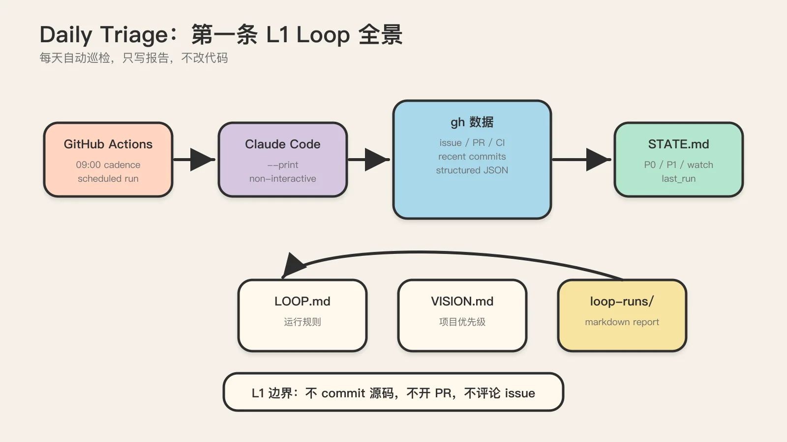
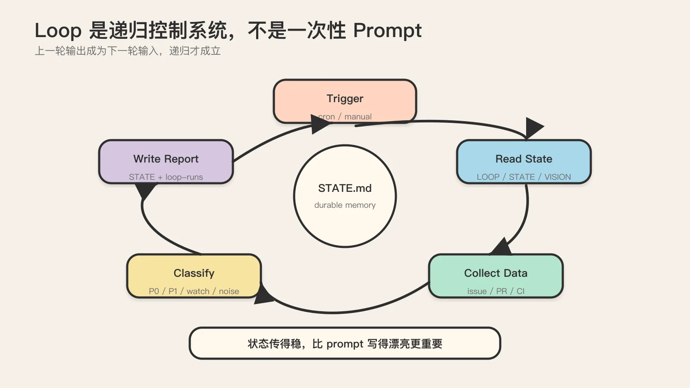
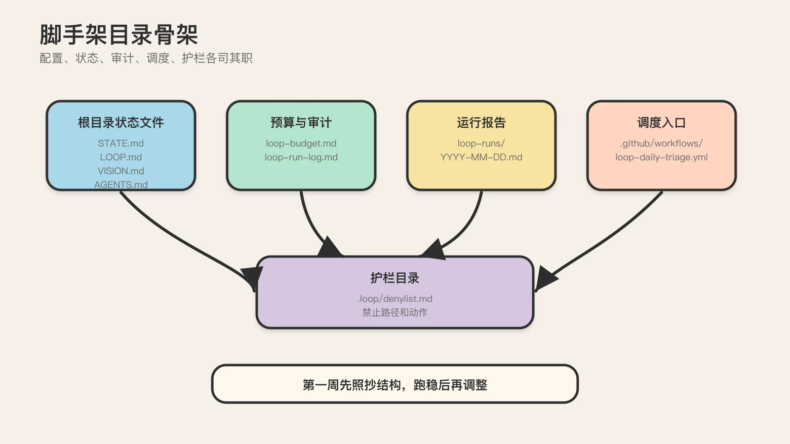
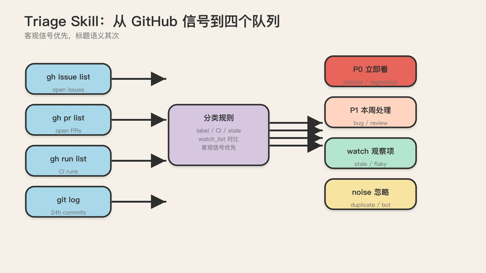
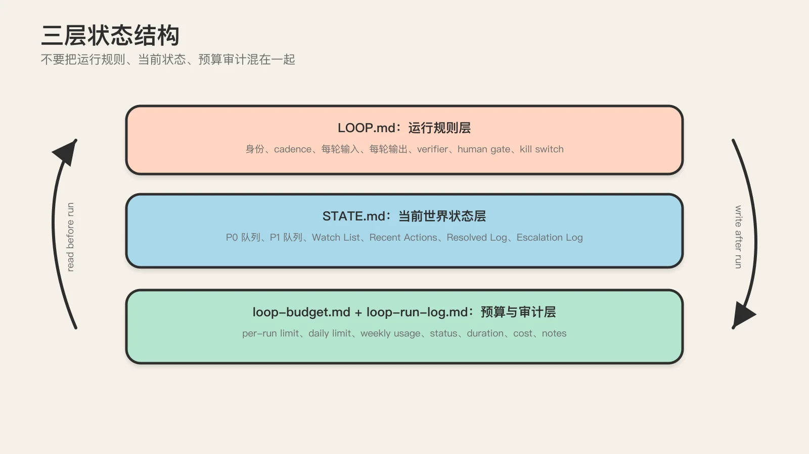
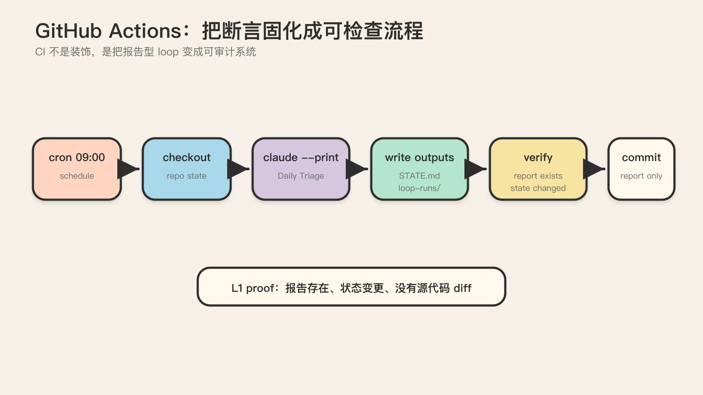
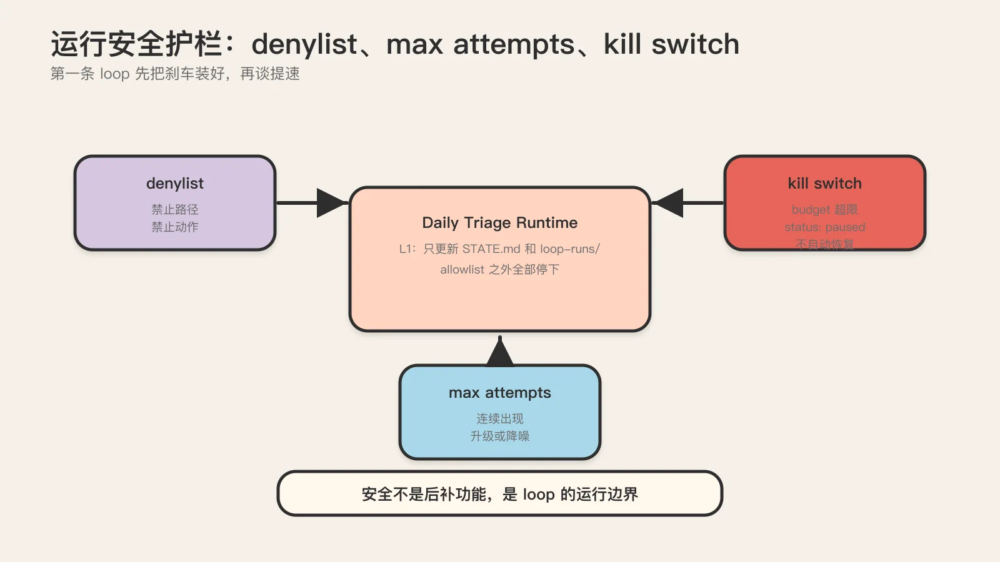
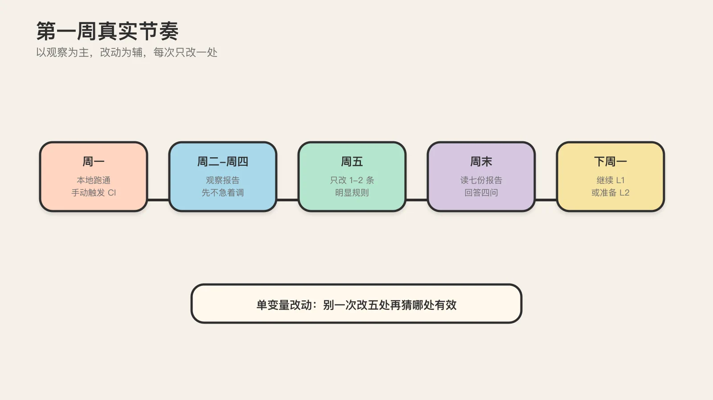
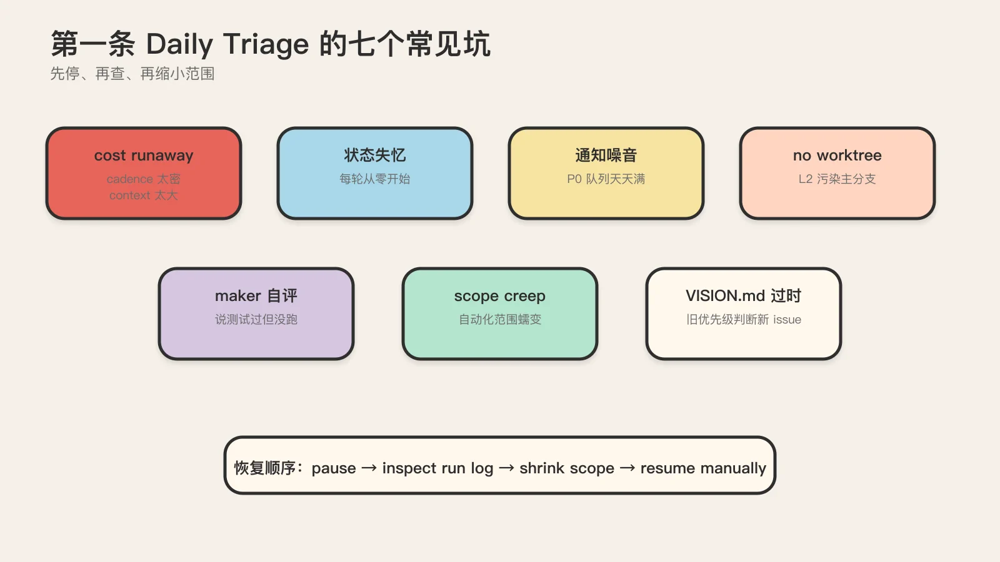

# 从零搭出你的第一条 Loop：Claude Code + Daily Triage 实战手册

> 前面几篇讲完了 loop 是什么、由哪些积木组成、为什么要从 L1 起步。这篇不再讲概念，只回答一个问题：今天打开终端，我到底怎么用 Claude Code 搭出第一条能稳定跑一周的 loop。
>
> 全文围绕 Daily Triage 这一条 loop，所有命令、文件内容、目录结构、GitHub Actions 配置都直接可用。读完照着做，你应该得到一个每天自动 triage 仓库、只写报告不改代码、可复制可审计的 L1 loop。

## 这篇教程要构建什么

一句话目标：让 Claude Code 每天定时读一遍你仓库的 issue、PR、CI 状态和最近 commit，把发现的问题分类写进 `STATE.md`，输出一份给你看的 triage 报告，全程不碰一行代码。

跑起来什么样：

- 每天早上 9 点（或你设定的 cadence），GitHub Actions 拉起一个 Claude Code 进程。
- 进程读 `LOOP.md`（这条 loop 怎么跑）、`STATE.md`（上次跑到哪了）、`VISION.md`（项目长期目标）。
- 进程调用 `gh` 拉取 issue / PR / 最近 CI 运行，和仓库里 `STATE.md` 的 watch list 比对。
- 进程把发现分成四类：`P0 立即看`、`P1 本周处理`、`watch 观察项`、`noise 噪音忽略`，分类规则写在 triage skill 里。
- 进程更新 `STATE.md`（写新发现、推进 watch list、记录 last run），把一份 markdown 报告 commit 到 `loop-runs/` 目录。
- 进程不动任何源代码，不开 PR，不评论 issue，不 merge。

这就是一条 L1 报告型 loop。它没有"自动修复"的快感，但它是少数能在生产仓库里安全跑一周的起步形态。Addy Osmani 把 loop 定义成 "a recursive goal"（递归的目标），递归的前提是上一轮的产物（状态）能被下一轮读进来。这条 loop 的核心不是 Claude Code 多聪明，而是 `STATE.md` 这个外部记忆让递归成立。

前置说明：本教程基于 [cobusgreyling/loop-engineering](https://github.com/cobusgreyling/loop-engineering)（v1.2.1，2026-06 快照）的脚手架和 [breim/loop-harness](https://github.com/breim/loop-harness) 的核验思路。命令和文件结构以这两个仓库为准，但具体内容我会逐段贴出，你不需要先去读它们。



## 为什么选 Claude Code 搭这条 loop

在动手前，值得花半页说清为什么这份教程锁定 Claude Code 一个工具，而不是 Codex、Cursor 或某个 agent framework。这不是产品偏好，是工程取舍。

Claude Code 适合做 loop 的起点，原因在它原生支持几个 loop 必需的能力。它有 `.claude/skills/` 这个目录约定，skill 文件会被自动加载，不用你在命令行拼接超长 prompt。它有 `--print` 这种非交互模式，能在 CI 里被当作命令行工具调用。它对 `gh`、`git` 这类本地命令的调用稳定，不会因为沙箱限制而读不到仓库状态。它的 sub-agent / Task 机制（虽然本教程的 L1 用不上）为后面升 L2 留了 maker/checker 分离的接口。

换到 Codex 上，同样的 loop 能搭，但 skill 的载体不一样（Codex 用 `AGENTS.md` 和 prompt 文件），命令行调用的方式也不一样。换到 Cursor 上，它更偏向 IDE 内交互，跑无人值守的定时任务不是它的主战场。cobusgreyling 的脚手架同时支持 Grok、Claude Code、Codex 三个工具，本教程选 Claude Code 是因为它的 skill 机制和命令行可调用性，让"从零到能跑"的链路最短。本地系列 [04 跨工具迁移](../04-cross-tool-mapping.md) 里有同一条 loop 在不同工具间的映射关系，如果你想换工具跑，那篇是迁移参考。

为什么选 Daily Triage 而不是 PR Babysitter 或 CI Sweeper 作为第一条 loop，本地系列 [03 模式库与上线分级](../03-patterns-and-rollout-levels.md) 已经给过判断：Daily Triage 风险最低、最容易证明有价值、最适合训练团队读状态和调 cadence。这里补一条更功利的理由。Daily Triage 的输出是一份给人看的报告，不是直接改代码。这意味着你有一整周的时间去发现 loop 判断错了、分类宽了、VISION.md 写歪了，而不会因此污染代码库。PR Babysitter 和 CI Sweeper 距离代码改动太近，第一周就用它们，你大部分精力会花在回滚 loop 的错误改动上，而不是校准 loop 本身。

还有一条容易被忽略的理由：Daily Triage 的输入非常结构化。issue、PR、CI 运行、commit，全部是 `gh` 命令能稳定拉到的 JSON。结构化输入意味着 skill 的"数据采集"段可以写死命令，agent 不会在"怎么获取数据"上发挥。这把 loop 的不确定性收敛到了"怎么分类"这一个环节上，调试起来范围小。CI Sweeper 就没这个优势。CI 日志是半结构化文本，agent 光是"从日志里提取失败原因"就会产生大量漂移。

理解了这两个取舍（工具选 Claude Code、pattern 选 Daily Triage），后面的步骤会顺很多。每个设计决定都是在兑现这两个选择带来的便利。

## loop 作为控制系统：一个要先建立的心智模型

在进入具体步骤前，有必要把"loop 是什么"这个心智模型再压一遍。本教程的本地系列 [01](../01-what-is-loop-engineering.md) 和 [02](../02-five-primitives-and-state.md) 已经从概念上讲过，这里只说对实操有影响的那一面。

把 loop 想成一个控制系统，而不是一个 prompt。prompt 是一次性的，你写一句指令，模型回一段话，结束。loop 是持续的，它有一个被调用的入口（cron 或手动），有一组每轮必读的输入文件（状态），有一组每轮必写的输出文件（更新后的状态 + 报告），有一组约束（denylist、预算、kill switch），还有一个让下一轮能继续的机制（状态被持久化到文件而不是留在聊天记录里）。

这个视角对实操的影响是：你设计 loop 时，优化的不是 prompt 写得多漂亮，而是状态在轮次之间传得有多稳。一个 skill 写得一般但状态层扎实的 loop，能跑很久；一个 skill 写得惊艳但每轮状态都丢的 loop，第三天就开始重复 triage 同一批 issue。

Addy Osmani 那篇标杆文里有个定义值得记住："a loop is a recursive goal"，loop 是一个递归的目标。递归成立的前提是上一轮的产物能作为下一轮的输入。在你后面写 STATE.md 和 skill 时，时刻问自己一个问题：下一轮的 agent 启动时，能不能从这次写下的状态接着干，而不是从零开始？这个问题的答案，决定了你的 loop 是真的 loop，还是只是被 cron 反复触发的一次性 prompt。

这个心智模型还会影响你对"失败"的判断。prompt 模式下，模型回错了就是回错了，你重发一次。loop 模式下，一次失败会被下一轮继承。如果失败让 STATE.md 写坏了，下一轮 agent 读到的就是坏状态，会基于坏状态继续错下去。所以 loop 模式下，失败处理（kill switch、状态校验、不自动恢复）比成功路径更重要。本教程后面花大量篇幅在 kill switch、denylist、状态校验上，根源就在这里：loop 的工程难度大头在失败处理，不在成功路径。

带着这个心智模型往下读，你会发现每一步的设计都在回答同一个问题：怎么让这条 loop 在你不在场的时候，安全地、可回溯地、不失控地跑下去。



## 前置条件

在跑第一条命令之前，确认这几样东西就位：

**工具**

- Claude Code 已安装并配好 API key（或 Claude 订阅）。终端跑 `claude --version` 能出版本号。
- git，且你的仓库已经 push 到 GitHub。
- GitHub CLI `gh` 已登录：`gh auth status` 返回 logged in。
- Node.js ≥ 18（脚手架用 `npx` 拉起）。

**仓库**

- 一个真实在用的仓库。别拿空仓库练手。空仓库没有 issue、没有 CI、没有 commit，loop 跑出来全是"无异常"，你没法判断它到底有没有用。
- 仓库里至少有 20 个 issue（open 或 closed 都行）或近一周有 CI 运行记录。这是 triage 的输入原料。

**权限**

- 仓库允许 GitHub Actions 写回 `STATE.md` 和 `loop-runs/`（默认 `contents: write` 即可，后面 yaml 会写）。
- 给 Actions 配一个 `ANTHROPIC_API_KEY` secret（如果走 API 计费）或用 Claude Max 的 OAuth（看你团队的计费方式）。

**钱的心理预期**

这点容易被跳过，但必须前置说清。Claude Code 基线成本大约 $13/人/天，官方披露 90% 用户每天花费低于 $12。这是人坐在终端前交互式使用的数字。loop 不是交互式，它是乘法：每一轮迭代都要重发累积上下文（loop 规则 + 上次 STATE + 本次拉到的 issue 列表 + skill），跑 20 步的 loop 远大于 20 次单调用的成本之和。社区测过，没有 context 隔离的多 agent loop 可以是单 agent 的 8.5 倍 token 开销（85 万 vs 10 万 tokens 量级）。

Daily Triage 是低频（每天一次）、单 agent、只读、报告型，属于成本最低的一类。第一周预期每天 $0.5 到 $3，一周 $5 到 $20 量级。但你要知道这条线在哪里：一旦把 cadence 从 1 天压到 1 小时，或者把范围从"读 issue"扩到"读 issue + 跑测试 + 试修复"，成本会以乘法爬升。重度 agentic 使用的真实账单是 $400 到 $1500 每月，极端情况有人数天烧到 $4000 以上。

所以这条 loop 全程带着预算层（`loop-budget.md`）和 kill switch，不是装饰，是先装好刹车再开车。

## 第一步：用脚手架生成初始结构

不要从空目录手搓。cobusgreyling 的 `loop-init` 脚手架会一次性生成一套符合方法论的文件骨架，省掉你纠结"该建几个文件、叫什么名字"。

在你的仓库根目录跑：

```bash
npx @cobusgreyling/loop-init . --pattern daily-triage --tool claude-code
```

这条命令做三件事：

- 把当前目录 `.` 识别为目标仓库。
- 按 `--pattern daily-triage` 选定 Daily Triage 模板。
- 按 `--tool claude-code` 把生成的 skill / prompt 调成 Claude Code 语法（而不是 Codex 或 Grok 的）。

跑完你会得到这样的目录结构：

```text
.
├── STATE.md                 # 当前世界状态层（每轮读写）
├── LOOP.md                  # 运行规则层（这条 loop 怎么跑）
├── VISION.md                # 项目长期目标（常驻 spec，agent 每轮读）
├── AGENTS.md                # 可选：sub-agent 分工定义
├── loop-budget.md           # 预算与审计层（token 上限、每日上限）
├── loop-run-log.md          # 运行日志（每次跑了多久、花了多少、成功/失败）
├── loop-runs/               # 每次运行产出的报告（按日期归档）
│   └── .gitkeep
├── .github/
│   └── workflows/
│       └── loop-daily-triage.yml   # GitHub Actions 调度
└── .loop/
    └── denylist.md          # 禁止触碰的路径和动作
```

脚手架生成的文件是模板，不是成品。后面几步会把 `LOOP.md`、`STATE.md`、`loop-budget.md`、skill 文件逐一改成你仓库能真正用的内容。先看一眼脚手架生成的 `LOOP.md` 长什么样，了解它的骨架：

```markdown
# LOOP — Daily Triage

> 这条 loop 的运行规则。每轮启动时 agent 必读。

## 目标
每天读一遍仓库状态，输出 triage 报告，更新 STATE.md。不改代码。

## Cadence
每天 1 次（09:00 UTC，可调）

## 输入
- STATE.md（上次状态）
- gh issue list / pr list / run list
- 最近 24h 的 commit

## 输出
- 更新后的 STATE.md
- loop-runs/YYYY-MM-DD.md 报告

## 禁止动作
- 修改任何源代码
- 创建 / 合并 PR
- 评论 issue 或 PR
- 触发部署
```

这个骨架对应了五积木里的几个关键约束：cadence（调度）、输入输出（状态读写）、禁止动作（human gate 的边界）。脚手架帮你把骨架立起来了，但里面缺少**你仓库特有的判断规则**，比如"什么样的 issue 算 P0"、"哪些路径绝对不能动"。下一步就补这些。

如果 `npx` 拉脚手架失败（网络或 registry 问题），可以手动建出上面那套目录结构，文件内容照着后面几步贴的版本填。脚手架不是必需，它只是省时间。



### 关于这套目录结构的几个设计决定

脚手架生成的目录结构不是随意拍出来的，每个文件的位置和职责都对应了 loop 作为控制系统的一个环节。理解这些决定，能让你在后续改文件时知道改哪个、不改哪个。

`STATE.md` 放在仓库根目录而不是 `.loop/` 子目录下，是有意为之。它是这条 loop 每轮读写最频繁的文件，也是团队最常打开看的文件。放在根目录，IDE 一打开就能看到，git diff 里也显眼。如果藏在子目录，团队大概率不会主动去看，loop 的输出就失去了人类读者。loop engineering 一个常见失败就是"loop 在跑，但没人看它在干嘛"，把 STATE.md 放显眼位置是对抗这个失败的一个小手段。

`LOOP.md` 和 `STATE.md` 分开，是因为它们变化的频率完全不同。`LOOP.md` 是运行规则，写好后几周不动；`STATE.md` 是当前状态，每轮都改。把它们合在一个文件里，规则会被状态更新的 diff 淹没，团队 review 时很难看出"规则改了没有"。分开后，`LOOP.md` 的任何改动都是显眼的事件，值得在 standup 上提一句；`STATE.md` 的频繁改动则是常态，不需要特别关注。这个拆分对应了控制系统里"配置"和"运行时状态"的经典分离。

`VISION.md` 单独存在，是因为它回答的问题和前两个都不同。`LOOP.md` 说"这条 loop 怎么跑"，`STATE.md` 说"现在看见了什么"，`VISION.md` 说"这个项目整体在往哪走"。最后这一份是 agent 判断 issue 重要度的依据：一个 issue 是否算 P0，不只看它自身的客观信号，还要看它和当前项目优先级的关系。把项目优先级抽出来单独维护，是因为它会随项目阶段变化（这周在发版、下周在做迁移），需要人定期更新，而不像 `LOOP.md` 那样写完就稳。很多 loop 跑歪了，根因是 `VISION.md` 还停在三个月前的优先级，agent 用过时的优先级在判断今天的 issue。

`loop-runs/` 用一个独立目录而不是把报告塞进 `STATE.md`，是为了让历史报告可检索。三周后你想回头看"那个 CI 失败是哪天第一次被标 P0 的"，需要的是按日期翻历史报告，而不是在一个越来越长的 STATE.md 里 grep。每个报告文件独立，也方便 git diff 看单轮变化。

`.loop/denylist.md` 放在 `.loop/` 子目录而不是根目录，是因为它不像 STATE.md 那样需要团队频繁看。它是写给 agent 的硬约束，人只在升级 L2 或出事故后才需要改它。藏在子目录是合理的。

这套结构不是唯一解，但它经过了 cobusgreyling 仓库的实战打磨。第一周建议原样照抄，跑稳了再根据自己仓库的习惯调整。不要在第一周就重构目录结构，那会把"搭 loop"的精力分散到"纠结文件放哪"上。

## 第二步：写一份可用的 triage skill

skill 是 loop 里最该认真写的文件。它不是 prompt 模板，是这条 loop 每轮怎么判断、怎么分类、写到哪的长期契约。本地系列 [02 五个构件](../02-five-primitives-and-state.md)里有一句关键判断：skill 要写得"平淡、具体、可验证"，而不是"像一个资深工程师一样聪明地判断一切"。这句话是反 over-engineering 的。越花哨的 skill 越容易在第三天开始乱分类。

Claude Code 的 skill 放在 `.claude/skills/` 下，每个 skill 一个目录加一个 `SKILL.md`。给 Daily Triage 建一个：

```bash
mkdir -p .claude/skills/daily-triage
```

然后写 `.claude/skills/daily-triage/SKILL.md`。下面是完整可用版本，你按自己仓库的情况改 `triage 规则`和`denylist`两段：

```markdown
---
name: daily-triage
description: 每日读取仓库 issue/PR/CI 状态，分类写入 STATE.md，输出报告。只读不写代码。
---

# Daily Triage Skill

你是一条 Daily Triage loop 的执行体。每轮启动时按下面流程跑。

## 启动检查（每轮必做，顺序固定）

1. 读 `STATE.md`，确认 `last_run` 时间。如果距上次运行不足 6 小时，直接退出并在 `loop-run-log.md` 写明"距离过短，跳过"。
2. 读 `LOOP.md`，确认 cadence 和禁止动作清单。
3. 读 `VISION.md`，了解项目当前优先级（用于判断 issue 重要度）。
4. 读 `loop-budget.md`，确认本日预算是否已耗尽。若 `today_spent_usd >= daily_limit_usd`，退出并写日志"预算耗尽，跳过"。
5. 读 `.loop/denylist.md`，把禁止路径装进本次上下文。

任一前置检查失败，不要继续后续步骤。

## 数据采集

按顺序拉取（用 gh CLI，不要用网页抓取）：

- `gh issue list --state open --limit 50 --json number,title,labels,createdAt,updatedAt`
- `gh pr list --state open --limit 30 --json number,title,author,createdAt,isDraft,mergeable`
- `gh run list --limit 20 --json status,conclusion,name,createdAt,headBranch`
- `git log --since="24 hours ago" --oneline`

把拉取结果和 `STATE.md` 里的 `watch_list` 比对：哪些是新出现的、哪些已经消失（已解决）、哪些状态变化了。

## 分类规则

把每个候选项放进下面四类之一。判断时**优先用客观信号**（CI 红、长时间无更新、label 匹配），其次才看标题语义。

### P0 — 立即看
满足任一即归此类：
- 主分支 CI 连续失败 ≥ 2 次
- 标了 `regression` 或 `blocker` 的 issue
- PR 被标记 `merge conflict` 且作者近 48h 无活动
- `STATE.md` 的 `watch_list` 里标了 `escalate_after` 且已到期的项

### P1 — 本周处理
- 标了 `bug` 且 7 天内有人活动的 issue
- open PR 中 review 评论 ≥ 3 条且未 resolved
- 近 24h 新开且带 `feature` label 的 issue

### watch — 观察项
- 超过 30 天无更新的 open issue（可能是 stale）
- CI 偶发失败（最近 20 次运行里失败 ≤ 2 次）
- 草稿 PR 长期不动

### noise — 噪音忽略
- 已标 `wontfix` 或 `duplicate`
- 自动化机器人开的 issue（dependabot、renovate 等单独走 dependency 流程）
- 测试环境的 flaky test（除非连续失败 ≥ 3 次）

## 写回 STATE.md

按 `STATE.md` 现有结构更新（不要重写整个文件，只改对应字段）：
- `last_run` 改为本次时间
- `p0_queue` / `p1_queue` / `watch_list` 按分类结果更新
- `recent_actions` 追加一行"YYYY-MM-DD HH:MM triaged N items"
- 已解决的项从对应队列移除，记入 `resolved_log`

## 输出报告

写 `loop-runs/YYYY-MM-DD.md`，内容：
- 本次发现 P0 N 项、P1 N 项、watch N 项
- 每项一行：`- [#123](issue 链接) 一句话原因`
- 顶部写本次 `tokens_used` 和 `cost_usd` 估算

## 禁止动作（任何情况下都不做）

- `git commit` / `git push` 到任何分支
- 修改 `.github/workflows/` 下任何文件
- 修改 `package.json` / `Cargo.toml` / 任何 lockfile
- 调 `gh pr merge` / `gh issue close`
- 给任何 issue 或 PR 加评论
- 触发部署或发布

如果你"觉得"需要做以上动作才能完成任务，停下来，在报告里写"建议人工：XXX"，不要自己执行。
```

这份 skill 有几个设计要点值得展开：

**启动检查顺序固定**。这不是风格偏好，是防止 agent 跳步。agent 最常见的失败模式是跳过预算检查直接开始干活，跑完才发现预算早超了。把检查写成编号列表、明确"任一失败即退出"，比写"请先检查预算"有效得多。

**分类规则用客观信号优先**。"标题看起来很严重"这种语义判断漂移很大，今天觉得严重明天觉得不严重。但"主分支 CI 连续失败 ≥ 2 次"是机器可核验的。maker/checker 分离的核心思想在这里也有体现：分类规则写得越能被外部命令核验，loop 越稳定。

**禁止动作写成显式清单**。本地系列 [02](../02-five-primitives-and-state.md) 强调"实现者不能自己宣布完成，完成必须由 verifier 或人类 gate 决定"。在 L1 阶段，最简单的 gate 就是把所有写动作都禁掉。这条 loop 的"完成"定义非常窄：报告写出来了、STATE.md 更新了，就算完成。它没有任何需要"宣布完成"的代码改动，所以也就没有 maker 自评的余地。

**结尾那句"觉得需要做就停下来写建议"**。这是给 agent 的退路。如果你只写"禁止 merge"，agent 偶尔会在上下文里推理出"但这个 PR 明显该 merge 啊"然后绕过禁令。明确告诉它"你可以建议，但不能执行"，把它的越权冲动转化成报告里的一行字。

写完 skill，确认它在 `.claude/skills/daily-triage/SKILL.md`。Claude Code 启动时会自动加载 `.claude/skills/` 下的 skill，所以你不需要在命令行显式 invoke，后面的 GitHub Actions 里会让 Claude Code 读这个 skill。

### skill 和 prompt 的本质区别，以及为什么它影响校准

很多人第一次写 skill 会写成一份长 prompt，通篇都是"请像一个资深工程师那样判断"。这种写法在第一次跑可能效果还行，但到第三天就开始漂移。原因在于 prompt 是一次性的语义指令，它的"完成标准"模糊；skill 是长期契约，它的每一条都应该指向一个可被外部观察的行为。

判断你的 skill 写得好不好，有个简单测试：把 skill 里的每一条规则拿出来，问自己"这条规则被违反时，我能不能从输出里看出来"。如果"像一个资深工程师那样判断"被违反了，你从输出里看不出来，因为没有任何客观信号对应它。但如果"主分支 CI 连续失败 ≥ 2 次即归 P0"被违反了（agent 把连续失败 1 次的也标了 P0），你能立刻从报告里对照 CI 历史看出来。能被外部观察的规则，才能被校准；不能被观察的规则，只会让 agent 越跑越飘。

这个测试直接决定了第一周复盘的方法。本地系列 [03](../03-patterns-and-rollout-levels.md) 提到第一周要验证"loop 真的稳定发现值得看的问题吗"，验证的依据就是上面这个测试。你打开一周的报告，把每个 P0 / P1 项拿去和它的客观信号对照：标了 P0 的 issue，是不是真的满足"P0 规则"里的某一条？如果 agent 把不满足的也标了 P0，说明 skill 里的规则没有被严格执行，需要改写得更死板（加更多编号、加更多"必须"）。

校准分类规则是第一周的主要工作，比调 cadence 或加自动化都重要。常见的校准方向有两个。一是规则太宽，比如"P1 是 7 天内有人活动的 issue"，在活跃仓库里这会命中几乎所有 issue，P1 队列天天爆满。解法是加约束条件（"且带 bug label"、"且 review 评论 ≥ 3 条"）。二是规则太窄，比如"P0 只算标了 blocker 的 issue"，而你的仓库从来没人标 blocker，结果 P0 永远是空的，真正的紧急问题全被漏掉。解法是补客观信号（"或主分支 CI 连续失败 ≥ 2 次"）。

第一周不要追求分类规则一次写对。不可能的。正确的节奏是：跑两三天，看输出，发现规则太宽或太窄，改 skill 里的对应那一段，commit，再跑两三天。这是个迭代过程，STATE.md 里一周的 watch list 变化就是你校准的依据。本地系列 [03](../03-patterns-and-rollout-levels.md) 说"用真实运行记录换取升级资格"，运行记录同时也是你换取"分类规则可用"的依据。

### 关于 skill 长度和复杂度的权衡

这里要主动提一个 over-engineering 的陷阱。看完上面那份 skill，有人会想"我是不是该把规则写得更细，把每种 issue 类型都覆盖"。不要。skill 不是越全越好，而是越能被 agent 稳定执行越好。

每往 skill 里加一条规则，agent 的上下文就多一段要处理，token 成本上升一点，更重要的是 agent 在多条规则之间权衡的复杂度上升。当规则超过 15 到 20 条，agent 开始出现"规则冲突"，某 issue 同时满足 P0 和 watch 两条规则，agent 自己不知道该归哪类，要么随机选、要么反复改主意烧 token。

第一版的 skill 控制在 10 条以内的核心规则就够了。本教程上面那份 skill 的四类分类（P0/P1/watch/noise），每类两到三条规则，总共十来条，是个合理的起点。跑一周发现某类问题反复出现但规则没覆盖，再补那一条。这比一开始就写三十条规则、然后发现一半没用要高效得多，后者会让你在第一周就把精力耗在维护 skill 上，而不是观察 loop 的实际效果。

这条权衡不只适用于 skill，也适用于后面所有的配置文件（denylist、kill switch 条件、VISION.md 的优先级清单）。默认从最小可用开始，用运行记录驱动扩展，是 loop engineering 一以贯之的工程纪律。



## 第三步：搭好三层状态结构

状态层是 loop 的脊柱。本地系列 [02](../02-five-primitives-and-state.md) 把状态拆成三层：运行规则层（`LOOP.md`）、当前世界状态层（`STATE.md`）、预算与审计层（`loop-budget.md` + `loop-run-log.md`）。这一步给每一层贴出完整文件内容。



### 3.1 `LOOP.md`：运行规则层

这一层回答"这条 loop 应该怎样运行"。改写脚手架生成的版本，补上你仓库的细节：

```markdown
# LOOP — Daily Triage

> 运行规则层。agent 每轮启动时第一份读的文件。

## 身份
你是一条 Daily Triage loop，运行在 <你的仓库名>。你的唯一职责是分类和报告。

## Cadence
- 频率：每天 1 次
- 触发：GitHub Actions cron，09:00 UTC（北京时间 17:00）
- 也可手动触发：workflow_dispatch

## 每轮输入（按读取顺序）
1. `LOOP.md`（本文件）
2. `STATE.md`（上次状态）
3. `VISION.md`（项目优先级）
4. `loop-budget.md`（预算余额）
5. `.loop/denylist.md`（禁止清单）
6. `.claude/skills/daily-triage/SKILL.md`（执行规则）

## 每轮输出
1. 更新 `STATE.md`（只改对应字段，不重写）
2. 新建 `loop-runs/YYYY-MM-DD.md`（当日报告）
3. 追加一行到 `loop-run-log.md`

## Verifier
本 loop 在 L1 阶段没有独立 verifier 进程。替代方案：
- 报告必须包含 `tokens_used` 和 `cost_usd` 字段，缺失则视为失败
- STATE.md 的 `last_run` 必须更新为本次时间，否则视为失败
- 失败时 kill switch 触发，下一轮不自动启动

## Human Gate
- 所有 P0 项必须人工确认后才能从 `p0_queue` 移除
- 任何"建议人工执行"的动作，agent 不得自行执行
- 周一早会过一遍上一周 `loop-runs/`，决定哪些 P1 转人工

## Kill Switch
任一条件成立，loop 自动暂停 24h：
- 单轮 cost_usd > $5
- 单日累计 cost > $10
- 连续 3 轮失败（报告缺失关键字段）
- `STATE.md` 连续 2 轮没变化（疑似空转）

暂停时在 `loop-run-log.md` 写 `PAUSED: <原因>`，并在 `STATE.md` 顶部写 `status: paused`。
```

注意 `Verifier` 这一段。L1 没有独立 verifier 进程是真的，Daily Triage 只读不写代码，没有"测试通过与否"可验证。但你不能用"没有 verifier"当借口跳过校验。这里的替代方案是把校验降级成**报告字段是否齐全 + 状态是否真的更新了**，这两项是确定性命令能查的（grep 报告里有没有 `cost_usd`、git diff 看 STATE.md 有没有动）。breim/loop-harness 的核心论点就是这个：STATE.md 里"声称测试通过"必须被真实命令（npm test）核验，否则就是 agent 自己说自己行。L1 没有测试可跑，但有"报告字段是否齐全"可跑，逻辑一样。

这里值得把"done 是断言不是证明"这条原则在 L1 的具体含义讲透，因为它会贯穿你后续所有的 loop 设计。Addy Osmani 那句话的原意是针对写代码的 agent：agent 说"我改完了、测试应该过"，这是断言，必须用真实测试转成证明。在 L1 的 Daily Triage 里，agent 不写代码，但它仍然会产出断言："我 triage 了 12 个 issue"、"我花了 $1.2"、"STATE.md 已经更新"。这些同样是断言，同样需要被转成证明。

转换的方法是把每个断言对应到一个确定性命令。agent 说"triage 了 12 个 issue"，证明是报告里是不是真的有 12 行带 issue 链接的条目，`grep -c '^\- \[#' loop-runs/YYYY-MM-DD.md` 能数出来。agent 说"花了 $1.2"，证明是 Actions 运行环境从 Anthropic API response header 里读到的 usage，这个数字不由 agent 报。agent 说"STATE.md 已更新"，证明是 `git diff --name-only` 里有没有 STATE.md。

这套"断言到证明"的映射，就是 L1 阶段的 verifier 替身。它不跑测试（没代码可测），但它跑确定性命令去核验 agent 的每一个产出声明。你在 LOOP.md 的 Verifier 段、在 GitHub Actions 的校验步骤里、在 loop-budget.md 的"两边差异 > 20% 视为异常"里，都在落实这套映射。一旦某个断言找不到对应的确定性命令去核验，那个断言就是危险的：agent 会逐渐学会在那一项上偷懒或谎报。

这条原则到了 L2 会变得更严格，因为 L2 有代码改动，"测试通过"这个断言必须由 `npm test` 的退出码证明，不能由 agent 的描述证明。但 L1 阶段就要把这套肌肉记忆建立起来：用确定性命令核验每一个断言，是 loop engineering 区别于"写个长 prompt 让 agent 跑"的核心工程动作。

### 3.2 `STATE.md`：当前世界状态层

这一层回答"这条 loop 当前看见了什么"。这是 agent 跨轮次记忆的载体，也是团队能独立审查 loop 在干嘛的窗口。初始版本：

```markdown
# STATE — Daily Triage 当前状态

> 当前世界状态层。每轮读写。团队可随时打开看 loop 在关注什么。

status: active
last_run: 2026-06-29T09:00:00Z
last_run_cost_usd: 1.20
today_spent_usd: 1.20

## P0 队列（立即看）
<!-- 每项格式：- [#issue](url) | 原因 | 发现任日期 | escalate_after -->
- （空）等待首轮运行

## P1 队列（本周处理）
<!-- 每项格式：- [#issue](url) | 原因 | 加入日期 -->
- （空）等待首轮运行

## Watch List（观察项）
<!-- 每项格式：- [#issue](url) | 为什么观察 | 加入日期 | escalate_after -->
- （空）等待首轮运行

## Recent Actions（最近 10 条，新的在上）
- 2026-06-29 09:00 初始化 STATE.md，等待首轮 triage

## Resolved Log（近 30 天已解决项）
- （空）

## Escalation Log（升级给人工的项）
- （空）

## Notes
- 本文件由 loop 自动维护，人工修改请加 `<!-- manual -->` 注释
- 字段缺失或格式错乱时，loop 应在报告里标 `STATE_CORRUPT: true`
```

这份 STATE.md 有几个字段是故意设计的：

**`status: active | paused`**。kill switch 触发后这个值变 `paused`，下一轮 agent 启动时第一眼看到它就知道别跑了。这是 kill switch 能生效的物理基础，没有这个字段，"暂停"就只是日志里一行字，agent 不会读。

**`today_spent_usd`**。预算层的实时镜像。agent 每轮跑完更新这个值，下一轮启动检查它有没有超 `daily_limit_usd`。注意这个值是 agent 自己报的，存在谎报风险，所以 `loop-budget.md` 里还要有一份由 Actions 运行环境记录的版本（见 3.3）。两份对不上就是异常。

**`escalate_after`**。watch list 里的项带这个字段，意思是"观察到这个日期还没解决就升 P0"。这是防止 watch list 无限膨胀的机制。没有 escalate_after，观察项会越堆越多，最后变成一个没人看的垃圾场。

**`<!-- manual -->` 注释约定**。团队偶尔要手动改 STATE.md（比如人工把某项从 P0 移走）。给人工修改留一个标记，loop 下一轮看到这个标记就不会覆盖那一段。这个约定不复杂，但能避免"人工改了又被 loop 改回去"的来回。

### 3.3 `loop-budget.md` + `loop-run-log.md`：预算与审计层

这一层回答"这条 loop 花了什么代价、发生过什么事故"。这是出问题后回溯的唯一依据。

`loop-budget.md`：

```markdown
# Loop Budget — Daily Triage

> 预算与审计层。token / 美元上限，每日/每周累计。

## 当前限额
daily_limit_usd: 10
weekly_limit_usd: 50
per_run_limit_usd: 5
max_consecutive_failures: 3

## 本周累计（每周一重置）
week_start: 2026-06-23
week_spent_usd: 8.40
week_runs: 7
week_failures: 0

## 限额变更记录
- 2026-06-23 初始化，daily=10, weekly=50
<!-- 新的限额变更追加在这里，不要删旧记录 -->

## 计费说明
- 数字由 GitHub Actions 运行环境从 ANTHROPIC usage header 读取后写入
- agent 自报的 today_spent_usd 仅供快速判断，以本文件为准
- 两边差异 > 20% 视为异常，触发 kill switch
```

`loop-run-log.md`：

```markdown
# Loop Run Log — Daily Triage

> 每次运行一行。失败、暂停、异常都在这里。

| 时间 | 状态 | tokens | cost_usd | 耗时s | 备注 |
| --- | --- | --- | --- | --- | --- |
| 2026-06-29T09:00:00Z | ok | 45200 | 1.20 | 38 | triaged 12 items |
<!-- 每轮追加一行。状态值：ok / failed / paused / skipped -->
```

这两个文件合起来构成审计层。`loop-budget.md` 管"还能花多少"，`loop-run-log.md` 管"过去每轮花了多少、结果如何"。本地系列 [05 风险篇](../05-risks-costs-and-anti-patterns.md)提到 runaway iteration（无停止条件的无限迭代）是生产 agent 头号失败模式，失败率 70% 到 95% 里很大一块就是它贡献的。这两个文件加 kill switch 是对抗 runaway 的物理手段。没有它们，你只能在月底账单出来才发现 loop 已经空转了三天。

**关于"两边差异 > 20% 视为异常"**。agent 自报的花费和 Actions 环境记录的花费对不上，意味着 agent 在谎报或漏报。这是 maker 自评问题在成本维度的投影：agent 说"我花了 $1.2"是断言，Actions 环境读 API response header 才是证明。Addy Osmani 那句"done is a claim, not proof"在成本上同样成立，agent 报的 done（跑完了）和 cost（花了多少）都是 claim，必须用确定性来源核验。

## 第四步：把 loop 跑起来

文件都就位后，有两种跑法。第一周建议先用手动触发，确认每轮输出正常，再开 cron。

### 4.1 本地手动跑一轮（验证用）

在仓库根目录：

```bash
claude --skill daily-triage --print "执行今日 Daily Triage，按 SKILL.md 流程跑，完成后退出。"
```

`--skill daily-triage` 让 Claude Code 加载你写的 skill。`--print` 让它跑完直接输出结果而不是进交互模式。跑完检查三件事：

- `STATE.md` 的 `last_run` 是否更新成刚才的时间。
- `loop-runs/` 下是否多了一份今天的报告，里面有没有 `cost_usd` 字段。
- `loop-run-log.md` 是否追加了一行。

三件都对，本地链路通。任一缺失，回去看 skill 里哪一步被跳过了。

### 4.2 GitHub Actions 定时跑（生产形态）

这是这条 loop 长期跑的形态。把下面这份 yaml 放进 `.github/workflows/loop-daily-triage.yml`：

```yaml
name: Loop — Daily Triage

on:
  schedule:
    # 每天 09:00 UTC（北京时间 17:00）
    - cron: "0 9 * * *"
  workflow_dispatch: {}  # 允许手动触发

permissions:
  contents: write       # 写回 STATE.md 和 loop-runs/

concurrency:
  group: loop-daily-triage
  cancel-in-progress: false   # 不允许并发跑，防止状态写冲突

jobs:
  triage:
    runs-on: ubuntu-latest
    timeout-minutes: 15        # 硬超时，防 runaway
    env:
      ANTHROPIC_API_KEY: ${{ secrets.ANTHROPIC_API_KEY }}
      GH_TOKEN: ${{ secrets.GITHUB_TOKEN }}
    steps:
      - name: Checkout
        uses: actions/checkout@v4
        with:
          fetch-depth: 0       # triage 要看 commit 历史

      - name: Setup Node
        uses: actions/setup-node@v4
        with:
          node-version: "20"

      - name: Install Claude Code
        run: npm install -g @anthropic-ai/claude-code

      - name: Read STATE status (kill switch check)
        id: state
        run: |
          if grep -q "^status: paused" STATE.md; then
            echo "skip=true" >> $GITHUB_OUTPUT
            echo "STATE.md 标记 paused，跳过本轮" >> $GITHUB_STEP_SUMMARY
          else
            echo "skip=false" >> $GITHUB_OUTPUT
          fi

      - name: Run Daily Triage
        if: steps.state.outputs.skip != 'true'
        run: |
          claude --skill daily-triage --print \
            "执行今日 Daily Triage。读 LOOP.md/STATE.md/VISION.md/loop-budget.md/.loop/denylist.md，按 SKILL.md 流程跑。完成后退出。"

      - name: Commit loop outputs
        if: steps.state.outputs.skip != 'true' && always()
        run: |
          git config user.name "loop-daily-triage-bot"
          git config user.email "bot@localhost"
          git add STATE.md loop-runs/ loop-run-log.md loop-budget.md 2>/dev/null || true
          if git diff --staged --quiet; then
            echo "无变化，可能 loop 空转，检查 watch_list 是否在膨胀" >> $GITHUB_STEP_SUMMARY
          else
            git commit -m "chore(loop): daily triage $(date -u +%Y-%m-%d)"
            git push
          fi
```

这份 yaml 有几处关键设计：

**`concurrency.cancel-in-progress: false`**。绝不让两个 triage 同时跑。两个进程同时写 `STATE.md` 会产生覆盖，watch list 丢项。这个字段是状态层完整性的防线。

**`timeout-minutes: 15`**。硬超时。就算 skill 里所有检查都失效、agent 陷入 runaway，15 分钟后 Actions 会强制杀进程。这是 kill switch 之外的最后一道闸。Fiddler 的数据里 agent 失败率 70% 到 95%，头号模式就是没有停止条件的无限迭代，硬超时是把"无限"切成"最多 15 分钟"的物理手段。

**`Read STATE status` 这一步在 agent 之前**。kill switch 的判定不交给 agent 自己读，而是用 shell grep 直接判。这是 maker/checker 思想的延伸：agent 判断"我该不该跑"有利益冲突（它天然倾向跑），用确定性命令判才可靠。

**`&& always()` 在 commit 步骤**。即使 agent 失败也要把已生成的部分报告 commit 回来，否则失败现场会丢，你没法事后看哪里崩了。

**最后那段"无变化"的提示**。loop 连续跑出空 commit 是空转的信号。这条提醒不是给 agent 看的，是给你看 Actions 运行记录时用的。

配完 yaml，先手动触发一次（Actions 页面 → Run workflow）确认能跑通，再让它按 cron 自己跑。

### 用 GitHub Actions 把"断言到证明"的映射固化下来

前面在第三步讲过，agent 的每个产出断言都要有对应的确定性命令核验。光在 skill 里写"必须包含 cost_usd 字段"不够，因为 agent 偶尔会跳过。真正可靠的做法是在 GitHub Actions 里加一层独立的校验步骤，agent 跑完后用 shell 命令复查它的产出。

下面这段 yaml 加在 "Commit loop outputs" 步骤之前，作为独立 verifier 的 L1 雏形：

```yaml
      - name: Verify loop outputs (L1 verifier)
        if: steps.state.outputs.skip != 'true' && always()
        run: |
          FAIL=0
          TODAY=$(date -u +%Y-%m-%d)
          REPORT="loop-runs/${TODAY}.md"

          # 校验 1：今天的报告文件存在
          if [ ! -f "$REPORT" ]; then
            echo "::error::报告缺失：$REPORT"
            FAIL=1
          fi

          # 校验 2：报告包含 cost_usd 和 tokens_used 字段
          if ! grep -q "cost_usd" "$REPORT" 2>/dev/null; then
            echo "::error::报告缺 cost_usd 字段（断言未转成证明）"
            FAIL=1
          fi

          # 校验 3：STATE.md 的 last_run 已更新为今天
          if ! grep -q "last_run: ${TODAY}" STATE.md; then
            echo "::error::STATE.md 的 last_run 未更新（状态失忆）"
            FAIL=1
          fi

          # 校验 4：STATE.md 状态仍是 active（不是被意外改坏）
          if ! grep -q "^status: active" STATE.md; then
            echo "::error::STATE.md status 不是 active"
            FAIL=1
          fi

          if [ $FAIL -eq 1 ]; then
            echo "verify_failed=true" >> $GITHUB_ENV
            # 不退出，让后续 commit 步骤把失败现场也存下来
          fi

      - name: Alert on verify failure
        if: env.verify_failed == 'true'
        run: |
          echo "::warning::本轮 verify 失败，连续 3 次将触发 kill switch"
          # 这里可接 Slack/飞书 webhook 通知，第一周可只看 Actions 日志
```

这四个校验对应了 agent 最常谎报或漏报的四件事：报告有没有真的生成、成本字段有没有写、状态有没有真的更新、状态有没有被写坏。每一条都是确定性命令（文件存在检查、grep、字符串匹配），没有语义判断，agent 无法通过"巧妙的描述"绕过。

注意校验失败时脚本不立即退出（不写 `set -e` 或 `exit 1`），而是让后续的 commit 步骤继续跑。这是为了把失败现场存进 git，如果一失败就中断，你事后没法看到 agent 到底产出了什么残缺的报告，调试就失去了依据。失败信息通过 GitHub Actions 的 `::error::` 注解高亮显示，在 Actions 运行记录里一眼能看到。

这层校验是 L1 阶段最接近独立 verifier 的东西。它不在 agent 进程内，agent 改不了它；它只读 agent 的产出文件，用确定性命令判。到了 L2，这层校验会扩展成跑真实的 `npm test`，但架构是一样的，用一个和 maker 隔离的进程，把 agent 的断言转成证明。第一周就把这层校验建起来，是在为 L2 的 maker/checker 分离打地基。

这套设计也回应了开头那个心智模型：loop 的工程难度大头在失败处理。成功路径（agent 正常 triage、正常写报告）几乎不用设计，agent 自己就会跑。真正需要工程化的是失败路径：报告没生成怎么办、字段缺失怎么办、状态没更新怎么办、连续失败怎么暂停。上面四个校验加 kill switch 加 GitHub Actions 的 timeout，共同构成了这条 loop 的失败处理系统，它们比 skill 里的成功路径更重要。



## 第五步：加 denylist、max attempts、kill switch

L1 loop 虽然只读不写代码，仍要把安全边界显式写出来。这一步把三个保护机制落地。

### 5.1 denylist

`.loop/denylist.md`：

```markdown
# Denylist — Daily Triage 禁止触碰清单

> agent 每轮启动时装入上下文。任何匹配下面路径或动作的意图，必须中止并在报告里记录。

## 禁止修改的路径（glob 匹配）
- `.github/workflows/**`        # 改 workflow 等于改 loop 自己，禁止
- `package.json`
- `package-lock.json`
- `**/Cargo.toml`
- `**/go.mod`
- `**/go.sum`
- `.env*`                       # 任何环境变量文件
- `infra/**`                    # 基础设施配置
- `db/migrations/**`            # 数据库迁移
- `STATE.md` 的 `<!-- manual -->` 注释段  # 人工标记的段落不覆盖

## 禁止执行的动作
- git push（任何分支）
- git merge
- gh pr merge / gh pr close / gh pr ready
- gh issue close / gh issue edit
- gh run rerun                  # 不要重跑 CI
- npm publish / cargo publish 等任何发布命令
- 调用任何外部 webhook
- 修改 GitHub 仓库设置（即便有权限）

## 灰区动作（仅建议，不执行）
发现下面情况时，在报告里写"建议人工：XXX"，不要自己做：
- 某 PR 明显可以 merge
- 某 issue 明显是 duplicate
- 某 stale issue 明显该关
- 某 CI 失败明显是 flaky
```

denylist 不是写给人看的规则文档，是写给 agent 的硬约束。写法上有两个要点：

**用 glob 路径而不是自然语言描述**。"不要动基础设施"这种描述 agent 理解起来有歧义（什么算基础设施？），`.github/workflows/**` 和 `infra/**` 没有歧义。

**灰区动作单独列**。如果只写"禁止 merge PR"，agent 偶尔会推理出"但这个明显该 merge 啊"然后越权。把"建议但不执行"显式写成一条规则，给 agent 一个合规的出口，它可以把判断写进报告，满足"我想帮忙"的倾向，又不真的越权。

### 5.2 max attempts

防止同一项被反复 triage 烧钱。在 `STATE.md` 的 watch list 里给每项隐含一个 attempt 计数（通过 `escalate_after` 实现），并在 `LOOP.md` 的 kill switch 里加一条：

```markdown
## Kill Switch（追加）
- 同一个 issue 在 watch_list 停留超过 14 天，强制升级给人（移入 Escalation Log），不再自动 triage
- 同一个 PR 连续 3 轮被标 P1 但无人工响应，移入 Escalation Log
```

这两条把"反复 triage 同一个没人在意的项"这个烧钱模式切掉。agent 不会自己判断"这项已经看了 10 次了该停"，它天然倾向继续观察。你必须用规则显式切断。

### 关于 cadence 和预算的权衡

到这里可以正面谈一个贯穿整个 loop 设计的核心权衡：cadence（调度频率）和 token / 噪音成本之间的拉锯。这个权衡在本地系列 [02](../02-five-primitives-and-state.md) 提到过，但实操层面有几个细节值得展开。

cadence 越密，发现问题越早，但成本不是线性上升，是乘法上升。原因在于每轮 loop 的上下文都有个固定底座（LOOP.md + STATE.md + VISION.md + skill + denylist），这部分无论你一天跑 1 次还是 24 次都要重发。把 cadence 从每天一次提到每小时一次，成本不是 24 倍，但因为每次还要加上当轮新拉取的 issue/PR 数据，实际涨幅比 24 倍略低但仍是数十倍量级。前面提过社区测出的 8.5 倍 token 开销差异，很大程度上就是 cadence 和范围放大叠加的结果。

那么 cadence 该怎么定？判断标准只有一个：这个问题的发现延迟，值不值得为它付出这条 loop 的成本。Daily Triage 处理的是 issue / PR 的分类，这类问题的时效性是天级。一个 issue 晚 12 小时被发现，通常不致命。所以天级 cadence 是匹配的。如果你发现自己在想"能不能改成每小时跑一次，更早发现 P0"，先问自己：上一个被标 P0 的 issue，如果晚 12 小时发现，会造成多少实际损失？如果答案是"几乎没损失"，那 cadence 就不该加密，你是在用成本买一个不存在的紧迫性。

噪音成本是另一个容易被忽略的维度。cadence 越密，报告越多，团队越容易跳过不看。每天一份报告，周一到周五五份，周末复盘时通读可行。每小时一份报告，一周 168 份，没人会看。loop 没有读者就等于没在跑，甚至比没跑更糟，因为还在烧钱。所以 cadence 的上限不只由预算决定，还由"团队能消化的报告频率"决定。Daily Triage 选天级，部分原因就是天级报告是人愿意读的最高频率。

预算限额的设定也是个权衡。本教程给的数字（per_run $5、daily $10、weekly $50）是 Daily Triage 的合理起点，但不是普适值。设定时要看两件事：第一，你的 issue / PR 规模，issue 上千的活跃仓库，每轮上下文大，per_run 限额要相应调高，否则正常 triage 会被误判成超预算；第二，你愿意为这条 loop 付多少钱，把它换算成月成本（daily × 30），和它替代的人工 triage 时间对比，如果月成本远超省下的人工，loop 不划算。

第一周跑完，loop-budget.md 里会有真实数字，那时再调限额最准。不要在第一周凭感觉调，凭感觉调出来的限额，要么太松（kill switch 永远不触发，形同虚设），要么太紧（正常 triage 动不动暂停，loop 产出不稳定）。让数据说话，这是 loop engineering 反复出现的一条纪律。

### 5.3 kill switch 汇总

把前面散落的 kill switch 条件汇总，写成一份 `LOOP.md` 里的清单（前面 3.1 已经写过，这里强调触发后的动作）：

```markdown
## Kill Switch 触发后的动作（顺序固定）
1. 在 loop-run-log.md 追加一行：`| <时间> | paused | - | - | - | <原因> |`
2. 把 STATE.md 第一行 status 改成 `paused`
3. 在 STATE.md 的 Notes 段追加：`paused_at: <时间>, reason: <原因>`
4. 退出，不执行后续 triage 步骤
5. 不自动恢复。恢复需人工把 status 改回 active 并在 loop-run-log 写明恢复原因
```

第 5 条最关键：**kill switch 不自动恢复**。如果暂停 24h 后自动恢复，那 kill switch 就只是个延时开关，真正的故障（比如 skill 写错了导致连续失败）会被无限重试。强制人工恢复，逼你出事后看一眼再决定。



## 第六步：跑一周，看 STATE.md 输出，判断是否升 L2

按上面五步配完，让 loop 跑一周。这一步讲跑完一周后看什么、怎么判断。

### 6.1 每天打开看三样东西

不需要每天盯，但周一到周五每天花两分钟扫一眼：

- `STATE.md` 的 `last_run` 是不是今天的，`status` 是不是 `active`。
- `loop-runs/` 今天那份报告里 P0 有没有项。P0 有项不一定是坏事，但你要确认它标的对不对。
- `loop-budget.md` 的 `week_spent_usd` 增速。如果周一到周三已经花掉周预算的 80%，cadence 或范围要调。

### 6.2 周末做一次周复盘

周六或周日，把 `loop-runs/` 这一周七份报告通读一遍，回答下面四个问题。这四个问题对应本地系列 [03](../03-patterns-and-rollout-levels.md) 里"第一周只做 L1"要验证的三件事加一条成本核查：

**问题一：loop 真的稳定发现值得看的问题吗？**
数一下这一周 P0 + P1 总共标了多少项，其中你看了之后觉得"确实值得看"的有多少。比例低于一半，说明分类规则有问题，skill 的 `triage 规则`段要改。常见问题：P1 标得太宽（"7 天内有人活动"在活跃仓库里几乎命中所有 issue），把它收紧成"7 天内有人活动且带 bug label"。

**问题二：状态结构真的能帮下一轮继续工作吗？**
打开任意两份连续的报告（比如周三和周四），看周四的报告有没有引用周三 watch list 里的项。如果每轮都从零开始 triage，watch list 形同虚设，说明 STATE.md 的读写逻辑没生效，agent 没有真正"读上次状态"。回去检查 skill 的"启动检查"和"写回 STATE.md"两段。

**问题三：团队愿不愿意实际使用它写下来的结果？**
这一条最残酷。如果你周日通读报告时发现"这些我其实早都知道了"或"这些我根本不关心"，那 loop 没有产生价值。原因通常是 VISION.md 写得太泛，agent 不知道你当前真正优先什么。改 VISION.md，把当前两周的具体目标写进去（比如"本周重点是发 2.0 版本，bug 优先级高于 feature"），下一周再看。

**问题四：成本在预算内吗？**
`loop-budget.md` 的 `week_spent_usd` 是否超 `weekly_limit_usd`。没超，记下日均成本作为后续调 cadence 的基准。超了，看 `loop-run-log.md` 哪几轮特别贵，通常是某轮 issue 特别多导致上下文撑大。

### 6.3 判断是否升 L2

一周跑下来，上面四个问题有三个答"是"，且周成本在预算内，可以考虑升 L2。L2 意味着 loop 开始做小范围自动动作（提草稿 PR、补 label、发评论），风险陡增。升级前的 checklist 见下一节。

如果四个问题有两个以上答"否"，不要升。继续停在 L1 改 skill、改 VISION.md、调 cadence。本地系列 [03](../03-patterns-and-rollout-levels.md) 那句"用真实运行记录换取升级资格，而不是靠自信直接开 L2"是这一步的准则。

## 从 L1 升 L2 前的 checklist

升级前逐条核对。任何一条不满足，继续停在 L1。

- [ ] STATE.md 的 schema 稳定跑了一周以上，没有字段频繁增删
- [ ] `loop-run-log.md` 连续 7 轮以上 `status: ok`，没有 paused 或 failed
- [ ] triage skill 的分类规则已经校准（问题一的"值得看"比例 ≥ 70%）
- [ ] VISION.md 写的是当前真实优先级，不是泛泛的愿景
- [ ] denylist 已经显式列出所有禁止路径和动作
- [ ] kill switch 已经实测触发过至少一次（手动制造一次超预算，看它是否真的暂停）
- [ ] max attempts 规则已经生效（watch list 里没有停留超过 14 天的项）
- [ ] worktree 机制已经准备好（L2 要开始改代码，必须有隔离环境）
- [ ] 独立 verifier 已经设计好（L2 的"完成"必须有外部命令核验，不能 agent 自评）
- [ ] 团队至少有一个人读过这一周的全部 `loop-runs/` 报告
- [ ] 周成本在预算内，且你有信心升 L2 后成本不会翻倍以上

最后两条最容易漏。第 10 条，团队没人读过 loop 的输出，意味着这条 loop 的产物没有真实用户，升 L2 只会让一个没人看的系统获得更多写权限。第 11 条，L2 引入自动动作后，每轮的上下文会变大（要带 worktree 状态、verifier 输出），成本通常翻 1.5 到 3 倍。心里没数就别升。

worktree 和独立 verifier 这两条是 L2 的硬门槛。L1 没有它们也能跑，因为不写代码。L2 一旦写代码，没有 worktree 就是直接污染主分支，没有 verifier 就是 maker 自评。这两个机制本地系列 [02](../02-five-primitives-and-state.md) 有展开，这里不重复，但升级前必须先把它们落地。

### 升级失败时的回退路径

很多人只想着怎么升 L2，没想过升上去发现不对要怎么退回来。这里明确一下回退路径，因为 L2 跑出问题的概率不低，提前知道怎么退，升级时才敢动手。

L2 引入自动动作后，如果两周内发现事故频发（草稿 PR 改错文件、自动 label 打错、自动关 issue 误关），回退的步骤是：

第一步，把 LOOP.md 的 `status` 改回 `paused`，并在 Notes 段写明"L2 回退到 L1，原因：XXX"。这一步立刻止血，下一轮 loop 不会自动跑。

第二步，把 L2 新增的自动动作从 allowlist 里移除（前面坑六讲过 allowlist 的概念）。allowlist 回到只有"更新 STATE.md 和 loop-runs/"这一项，loop 的能力被重新限制在 L1 范围。

第三步，清理 L2 留下的副作用。如果 L2 提过草稿 PR，逐个 review 后关闭或合并；如果 L2 打过错 label，批量修正；如果 L2 关过错 issue，重新打开。这一步要人来做，不要让 loop 自己清理自己的烂摊子，它清理自己产物的过程又是一次 maker 自评。

第四步，在 loop-run-log.md 追加一行回退记录，保留 L2 阶段的全部运行历史，不要删。这些历史是诊断"L2 为什么失败"的依据，删了下次升级还会踩同一个坑。

回退不丢人。本地系列 [03](../03-patterns-and-rollout-levels.md) 反复强调"用真实运行记录换取升级资格"，潜台词就是资格不够就退回来继续攒记录，而不是硬撑在 L2 直到出大事故。多数团队的真实路径不是 L1 → L2 → L3 一路升上去，而是 L1 → L2 → 退回 L1 → 再升 L2 → 稳住 → 谨慎试 L3。把回退当成正常操作，升级决策才会理性。

### 第一周的真实节奏建议

讲完所有步骤和坑，给一个第一周每天该做什么的具体节奏，照着走能少走弯路。

周一：跑通本地手动那一轮（4.1 节），确认 skill 和 STATE.md 链路通。不要急着上 cron。本地跑通后，把 GitHub Actions yaml 配好，手动触发一次确认 CI 环境也能跑通。

周二到周四：让 cron 自己跑，你每天花两分钟扫一眼当天的报告和 STATE.md，但不急着改。这三天的主要目的是收集原始数据，看 agent 在你仓库上的真实表现，哪些规则太宽、哪些太窄、VISION.md 够不够准。这三天忍住不调 skill，因为单日数据不够，改了可能改错方向。

周五：第一次小调。基于周二到周四的数据，改 skill 里最明显的一两条规则（比如 P1 太宽就加约束），commit，让它周末两天跑改后的版本。不要一次改很多，否则下周一复盘时分不清是哪条改动起的作用。

周六或周日：通读这一周七份报告，做 6.2 节的四问复盘。这一步是第一周最重要的事，比前面任何配置都重要。四问的答案决定了第二周的方向。

下周一：根据复盘结果，决定第二周是继续校准 skill（多数情况），还是开始准备升 L2（少数情况，第一周就满足升级条件的很少）。

这个节奏的核心原则是：第一周以观察为主，改动为辅，且每次只改一处。一次性改多处是 loop 校准最常见的错误，改了五处，下周一发现效果变了，但你不知道是哪一处起的作用、哪一处反而帮倒忙。单变量改动是工程调试的基本纪律，在 loop 校准上同样适用。

很多人第一周会犯一个相反的错误：周一配好就不管了，周末才看，发现一周的报告全是噪音，于是判定"loop 没用"，废弃。这通常不是 loop 没用，是第一周没有花那几分钟去校准。loop 是个需要持续调教的系统，第一周的态度决定它能不能活到第二周。



## 常见报错与坑

这一节把第一周最常踩的坑列出来，每条给现象、原因、解法。

### 坑一：cost runaway，一周烧掉月预算

**现象**。周三早上收到 Anthropic 账单预警，week_spent_usd 已经到 $40（周预算 $50）。

**原因**。最常见的是 cadence 被改密了（有人把每天一次改成每小时一次"试试看"），或者某轮 issue 特别多导致上下文撑到 20 万 token。也可能是 skill 里某段规则让 agent 反复读 VISION.md + STATE.md + 全部 issue 列表好几遍。

**解法**。先看 `loop-run-log.md` 哪几轮 cost 异常高。如果是 cadence 问题，改回每天一次。如果是单轮上下文过大，在 skill 的"数据采集"段加 `--limit` 收紧（比如 issue 从 50 改成 30）。然后在 `loop-budget.md` 把 `per_run_limit_usd` 从 $5 调到 $2.5，让 kill switch 更早触发。社区数据里 agentic 重度使用 $400 到 $1500 每月的账单，多数就是这么一点一点加上去的，每次都觉得"再加一点点没事"。

### 坑二：状态失忆，每轮从零开始

**现象**。打开连续两天的报告，发现周四完全不提周三 watch list 里的项，好像周三是空白。

**原因**。skill 的"启动检查"第一步就是读 STATE.md，但 agent 有时会跳过这一步直接进数据采集。更隐蔽的原因是 STATE.md 格式错乱（某轮写回时把字段顺序搞乱了），下一轮 agent 读不出 watch_list。

**解法**。先 `git diff` 看出问题的那轮 STATE.md 改了什么。如果是格式错乱，在 skill 里加一条"写回前先校验 STATE.md 仍是合法 markdown，字段齐全"。如果是 agent 跳步，把"启动检查"写成更死板的编号清单，并在 GitHub Actions 里加一步校验：报告里必须引用至少一个上轮 watch_list 的 issue 号，否则标 failed。

### 坑三：通知噪音，P0 队列天天满

**现象**。每天报告里 P0 都有 5 到 10 项，你两天就不看了，因为"反正天天都满"。

**原因**。P0 的分类规则太宽。比如"主分支 CI 连续失败 ≥ 2 次"在 CI 不稳的仓库里天天命中，把 flaky test 误判成 P0。

**解法**。收紧 P0 规则。CI 失败要区分"主分支连续失败"和"某条 PR 的 CI 失败"，后者不该进 P0。同时引入"噪音抑制"：同一个 P0 项连续 3 轮出现且无人工响应，自动降级到 Escalation Log（它已经不是"立即看"能解决的了）。这条规则和前面 max attempts 是一套逻辑，防止 loop 把同一个信号反复放大。

### 坑四：worktree 没隔离，L2 直接污染主分支

**现象**。升 L2 后第一条自动修复的草稿 PR，diff 里混进了对 `package.json` 的改动，而那本来是 loop 不该碰的。

**原因**。L2 升级时没把 worktree 落地，agent 在主工作区直接跑，改完 commit 回主分支。denylist 写了禁止改 package.json，但 agent 在主工作区跑时，denylist 只是个软约束，agent"觉得需要"就会绕过。

**解法**。L2 必须在独立 worktree 里跑。GitHub Actions 里把 checkout 改成 `actions/checkout@v4` 后再 `git worktree add` 一个临时分支，agent 在 worktree 里改，改完的 diff 由独立 verifier 审过再决定是否提 PR。worktree 的价值在本地系列 [02](../02-five-primitives-and-state.md) 里说得很直接："没有隔离，自动化错误会直接变成本地混乱；有隔离，自动化错误大多只是一次可丢弃的实验。"

### 坑五：maker 自评，agent 说测试通过但没跑

**现象**。L2 阶段，agent 提的草稿 PR 描述里写"测试已通过"，但 CI 一跑就红。

**原因**。这就是 maker/checker 没分离的经典表现。agent 自己改完代码、自己"判断"测试应该过，就写了"测试通过"。它没有真的跑 `npm test`，或者跑了但把失败合理化掉（"这个失败和我的改动无关"）。

**解法**。独立 verifier 必须是和 maker 不同的进程，跑真实的 `npm test` / `cargo test` / `pytest`，把退出码作为唯一判据。verifier 不读 maker 的推理过程，只看 diff 和测试结果。breim/loop-harness 那句"STATE.md 里声称测试通过会被真实命令核验"是这条的准则，agent 的任何"通过"声明都必须被确定性命令证伪或证实。Addy Osmani 把话说得更死："写代码的 agent 在结构上就不适合评判自己的产出"，即便拆了 maker 和 checker，"done 仍然只是 claim 不是 proof"。L2 的 done 必须由 `npm test` 的退出码定义，不能由 agent 的描述定义。

### 坑六：自动化范围悄悄扩大，回滚成本失控

**现象**。loop 跑了三周一切正常，你开始觉得"既然它能 triage，能不能顺手把 duplicate issue 关了"、"能不能顺手给 PR 打 label"。每加一项，单独看都无害，六周后回过头发现这条 loop 已经会关 issue、打 label、提草稿 PR、补 changelog，某次它误关了一个不该关的 issue，你才发现回滚要翻六周的 commit。

**原因**。这是 loop engineering 最隐蔽的坑：自动化范围是会"蠕变"的。每一项新增能力都是渐进的，单独 review 时都觉得"就加一点点，没风险"，但累积起来超出了任何人能完整追踪的范围。这条坑的根源不在 agent，在人，人天然倾向"既然能做就让它做"，而 loop 没有阻止这种倾向的机制。

**解法**。把自动化范围的变更当成和代码变更同级别的改动来治理。具体做法：denylist 不只是写"禁止做什么"，还要维护一份"允许做什么"的显式清单（allowlist）。L1 阶段 allowlist 只有一项：`更新 STATE.md 和 loop-runs/`。任何超出 allowlist 的动作，无论看起来多无害，都要走一次显式的"升级流程"：改 LOOP.md、改 allowlist、在团队 review 后才生效。

自动化范围和回滚成本是反向关系：范围越小，出错的回滚成本越低（一个 git revert 搞定）；范围越大，回滚要梳理 loop 过去 N 周碰过的所有东西。Fiddler 数据里 agent 失败率 70% 到 95%，其中相当一部分事故的损失之所以惨重，就是因为自动化范围已经扩大到没人能完整回滚的程度。L1 严格守住 allowlist，是把这个风险降到最低的工程动作。本地系列 [05 风险篇](../05-risks-costs-and-anti-patterns.md) 反复强调的"自动化范围要非常窄"，落地的物理形式就是这份 allowlist。

### 坑七：VISION.md 过时，agent 用三个月前的优先级判断今天的 issue

**现象**。loop 跑得一直很稳，报告也准时，但你慢慢发现它标的 P0 全是些你早就不关心的问题，两个月前你在做的一个 feature 的边界 issue 还在被反复标 P0，而你最近两周真正关心的发版 bug 一个都没进 P0。

**原因**。VISION.md 还停在两个月前的优先级。agent 严格按照 VISION.md 判断重要度，它本身没有"项目阶段变了"的感知能力。VISION.md 不更新，agent 就用旧优先级判断新 issue，结果就是分类和你当前的真实关注点完全错位。这条坑特别隐蔽，因为 loop 不会报错，它仍然在按时跑、按时出报告、按时更新 STATE.md，所有技术指标都正常，只是产出对你完全没用。

**解法**。把 VISION.md 的更新纳入你的周节奏。每周一花五分钟，把上一周的优先级划掉，写上本周的真实优先级（"本周重点：修复 2.0 发版阻塞 bug，feature 类 issue 一律降到 watch"）。这五分钟是 loop 持续产出价值的命脉。很多团队 loop 跑着跑着就废弃了，根因不是技术问题，是 VISION.md 三个月没人改，agent 的产出和团队的现实完全脱节，最后大家都不看报告了。

判断 VISION.md 是不是该更新，有个简单信号：如果你周一早上看到上周五的 triage 报告，第一反应是"这都是些什么"，那基本就是 VISION.md 过时了。不要去调 skill、不要去调 cadence，先去改 VISION.md。本地系列 [03](../03-patterns-and-rollout-levels.md) 说"团队愿不愿意实际使用它写下的结果"是 L1 要验证的核心问题之一，VISION.md 是否新鲜是这条验证最直接的抓手。



## 关于这条 loop 不适合做什么

讲了这么多怎么搭，最后说清楚它不该用在哪。避免你跑通一条 loop 后什么任务都想塞进来。

**不适合做产品决策**。VISION.md 写的是优先级，不是产品方向。产品决策（做什么、不做什么）需要人的判断和取舍，loop 没有这个能力，硬塞只会让 STATE.md 里堆满 agent 对产品方向的"建议"，全是噪音。

**不适合做架构重写**。架构改动影响面大、需要反复权衡，loop 的单轮深度不够。这类任务偶尔可以在 L1 阶段让 loop"观察架构相关的 issue 并归类"，但不能让 loop 产出架构方案。

**不适合做权限模型变更**。任何涉及认证、授权、安全边界的改动，loop 最多只能标 P0 提醒人，不能碰代码。这是 denylist 里 `infra/**` 和 `.env*` 存在的理由。

**不适合高频运行**。Daily Triage 顾名思义是天级。把它压到小时级或分钟级，成本会失控，且 issue/PR 的真实变化频率配不上，大部分小时级运行会得到"无新发现"，纯空转。

**不适合替代团队沟通**。这条容易被忽略。有人跑通 triage loop 后，会把"P0 队列里有 5 项"直接当成 standup 的全部内容，跳过原本的团队同步。问题是 loop 标的 P0 只是基于客观信号的判断，它不知道某个"标了 blocker 的 issue"其实是大客户提的、需要立即响应，也不知道某个"CI 连续失败"其实是已知的迁移期正常现象。这两层上下文只存在于团队沟通里。loop 的输出应该是沟通的输入之一，不是沟通的替代品。一旦把它当替代品，团队会逐渐丧失对仓库真实状态的判断力，全部依赖一个基于规则的系统，而那个系统的规则永远滞后于现实。

**不适合做需要创造力的工作**。写新 feature、设计新 API、想新的测试策略，这类工作需要跨领域的联想和反复试探，不是分类和报告能覆盖的。loop 擅长的是"把已经定义清楚的事情稳定地重复做"，不是"定义一件从来没做过的事"。如果你发现自己在想"让 loop 帮我想想下个版本做什么"，那是产品经理的活，不是 triage 的活，塞进 loop 只会让 STATE.md 里堆满不着边际的"建议"。

理解这些边界，本质上是接受一个事实：loop 是一种特定形态的自动化，它对"重复、结构化、低回滚成本、可先报告"的任务有效，对其他形态的任务无效甚至有害。本地系列 [03](../03-patterns-and-rollout-levels.md) 的四问框架（任务是否反复出现、输入是否结构化、出错能否低成本回滚、能否先只报告不执行）不是门槛，是筛子，筛掉那些看起来像 loop 但其实不是的任务。Daily Triage 四问全中，所以它适合做第一条 loop；其他任务用这四问过一遍，能帮你判断哪些想法该做成 loop、哪些想法该趁早放弃。

## 一条更朴素的提醒

这篇教程给了你一套能照抄的文件和命令。但 loop engineering 真正的难度不在第一次搭起来，而在第三周、第五周你还能不能坚持每天看一眼 STATE.md、每周做一次复盘。

loop 不是装好就自己跑的系统，它是需要人持续校准的系统。skill 的分类规则会随仓库演进失效，VISION.md 的优先级会随项目阶段变化，denylist 会随代码库扩张需要补项。这些都需要人定期介入。

本地系列 [03](../03-patterns-and-rollout-levels.md) 那句"用真实运行记录换取升级资格"还有个隐含的前半句：你需要真的去读那些运行记录。loop 写得再好，没人读它的输出，它就只是一台在烧钱的机器。

第一周的真正目标是搭出一条你愿意第二周继续看的 loop，而不是一条结构上完美的 loop。如果第二周你开始跳过看报告，问题通常不在 loop，在它的输出对你没用。这时该做的是回去改 VISION.md 和分类规则，而不是去调 cadence 或加自动化。把报告改到你愿意看，比把它跑得更快重要。这条朴素的原则，比本教程里所有命令和配置都更值得记住。

## 延伸阅读

- [五个构件与状态中枢](../02-five-primitives-and-state.md)：本教程反复引用的状态三层、skill 写法、worktree、maker/checker 都在这篇展开
- [模式库与上线分级](../03-patterns-and-rollout-levels.md)：L1/L2/L3 分级、第一周只做 L1 的理由、pattern 选择四问
- [风险、成本与反模式](../05-risks-costs-and-anti-patterns.md)：cost runaway、状态失忆、runaway iteration 的更完整反模式清单
- [cobusgreyling/loop-engineering](https://github.com/cobusgreyling/loop-engineering)：本教程所用脚手架 `npx @cobusgreyling/loop-init` 的源仓库，覆盖 PR/CI/依赖/issue/changelog/memory/handoff/verification 全套 pattern
- [breim/loop-harness](https://github.com/breim/loop-harness)："STATE.md 的声称会被真实命令核验"这一核验思路的来源
- [Loop Engineering — Addy Osmani](https://addyosmani.com/blog/loop-engineering/)："a loop is a recursive goal" 与五积木定义的上游标杆文，本教程的 maker/checker、done-is-claim 判断均源于此
