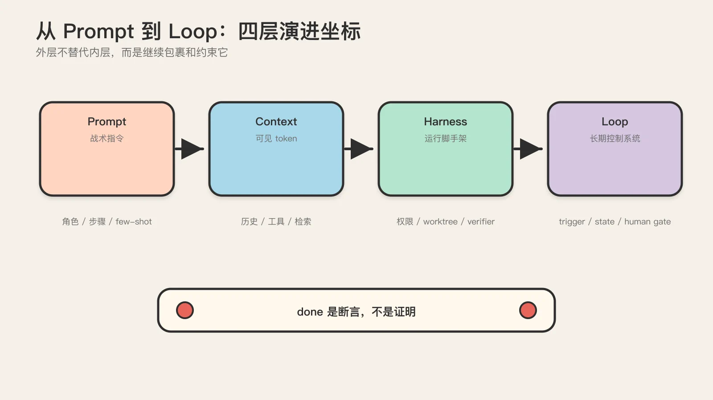
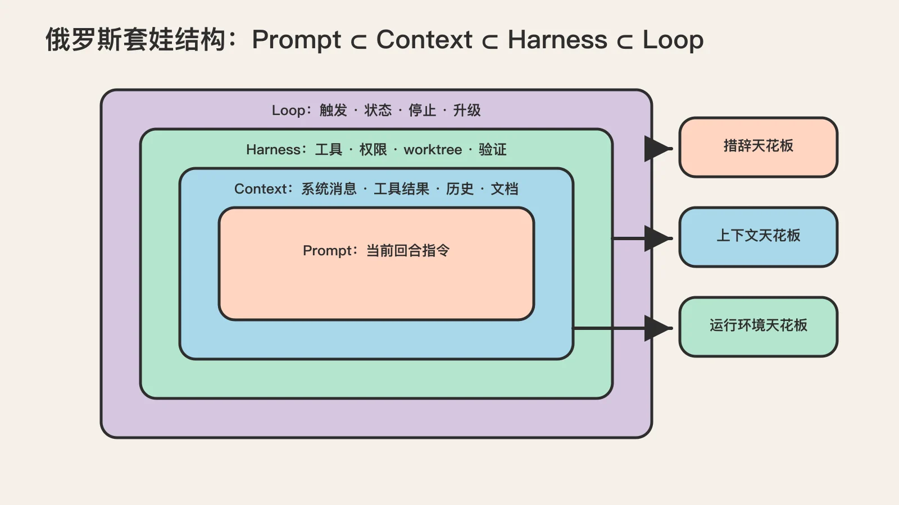
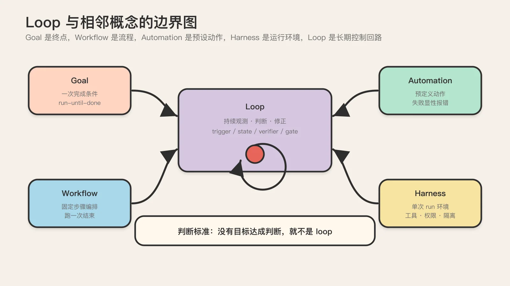
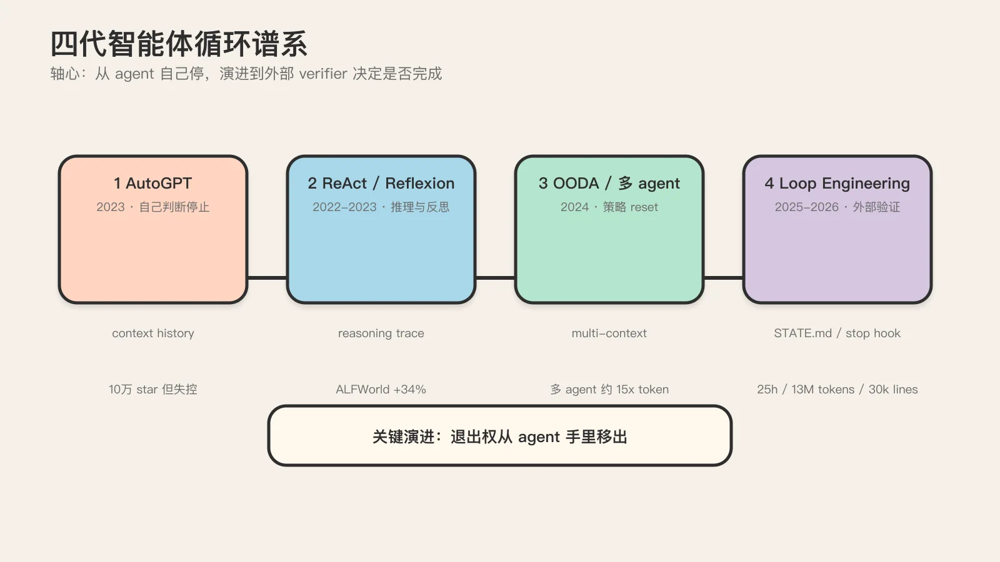
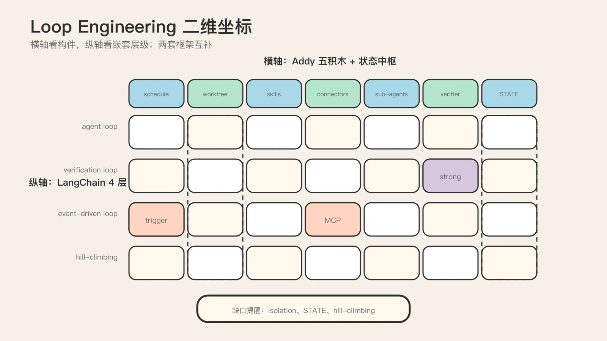
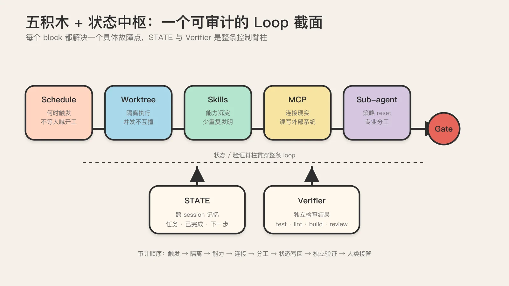
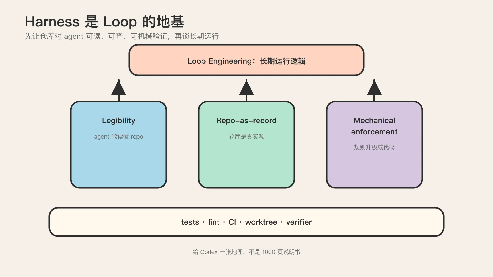
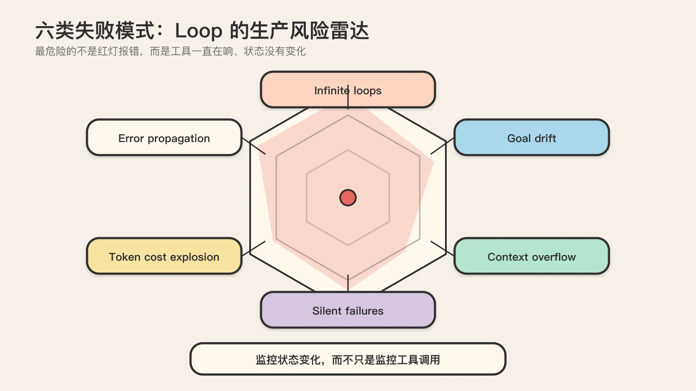
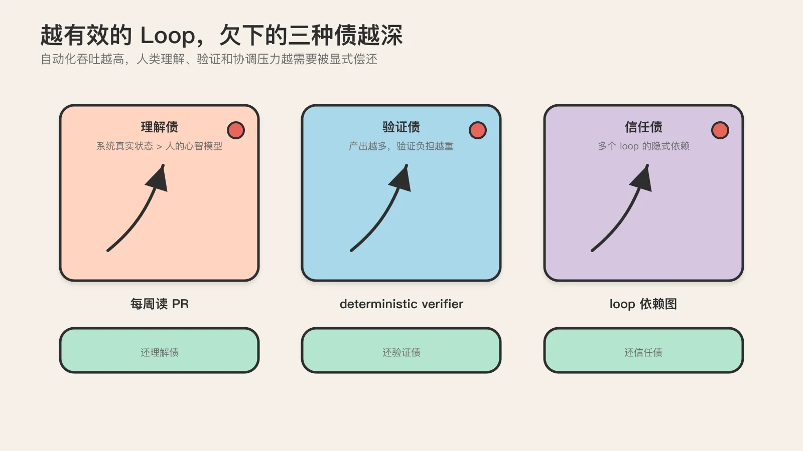
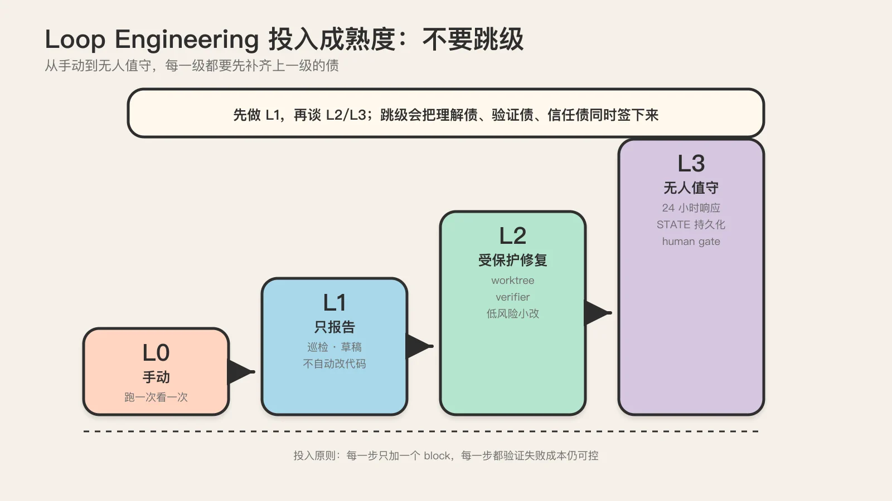

# 从 Prompt 到 Loop：AI 编程 Agent 四代循环的演进全景

> 这是一张给技术 Leader 和资深工程师的认知地图，不是又一篇操作手册。读完你应该能回答三个问题：loop engineering 在 AI 编程演进里占什么坐标；它和 prompt、context、harness、goal、workflow 这些相邻概念到底是什么边界关系；以及一个冷静的判断，你的团队现在该不该投入，投入多少。

## TL;DR：先给一张可以背下来的坐标

把这篇长文压成五句话，后面 15000 字都是在展开它们：

1. Loop engineering 的字面定义只有一句：loop 是一个递归目标。你给出目的，AI 在验证、外部状态、子 agent 和人工接管规则的约束下持续迭代，直到完成、暂停或升级给人。这句话来自 Addy Osmani，他把它说得更狠："a loop is a recursive goal where you define a purpose and the AI iterates until complete"。

2. 它不是凭空冒出来的新词。它是开发者注意力从"模型内部"向外迁移的最新一站，迁移链是 **prompt → context → harness → loop**。每一层向外包裹前一层而不取代它，loop 是这条链上目前最外、也最新的一环。

3. 它不是 prompt、context、harness、goal、workflow 的上位词。它在前几层之上多加一层"长期运行逻辑"，并不替代它们。把 loop 当成万能伞，是当下最常见的概念误读，也是团队对齐失败的头号原因。

4. 智能体循环本身有四代谱系：**ReAct → Plan-and-Execute / Reflexion → OODA 与多 agent → Loop Engineering**。每一代都在解决上一代的死穴，又引入新的死穴。理解谱系，才能判断你现在的 loop 在哪一代、卡在哪一步。

5. 一个反直觉但必须记住的判断：越有效的 loop，欠下的"三债"（上下文债、验证债、信任债）越深。Loop 的可靠性本身是债得以累积的前提。如果以为 loop 是免费午餐，会在第三个月被债务反噬。

这五句话是地图的骨架。下面逐层展开，先从最基础的"loop 和 prompt 的本质差别"开始。



## 一句话定义 + 与 prompt 的本质差别

源仓库 [cobusgreyling/loop-engineering](https://github.com/cobusgreyling/loop-engineering) 给 loop 的定义直白到几乎粗暴：**loop 是一个递归目标**。三个关键词拆开看：

- 递归：多轮循环，一次调用不算。
- 目标：围绕一个持续目标推进，随便聊天不算。
- 外部约束：被状态、验证、人类 gate 和系统边界控制，模型想干嘛就干嘛不算。

Addy Osmani 在那篇被反复引用的标杆文里给了一个更完整的版本：a loop is a recursive goal where you define a purpose and the AI iterates until complete。注意 "iterates until complete"，它预设了一个 "complete" 的存在，而且这个 complete 不是 agent 自己说了算。

这个定义里藏着一个最容易被忽视、但恰恰是 loop engineering 灵魂的判别原则，需要单独拎出来：

### "done 是断言，不是证明"（done is a claim, not proof）

这是 Addy 原话："even then 'done' is a claim, not proof"。意思是：当一个 agent 说"我做完了"，它做出的只是一个**断言**，不是一个**证明**。写代码的 agent 在结构上不适合评判自己的产出，因为它的训练目标是"产出看起来合理的代码"，不是"判断这段代码是否真的达成目标"。这两个目标在优化方向上是错位的。

这条原则的推论直接决定了 loop 的设计：循环的退出条件不能由执行 agent 自己决定，必须由外部的、独立的 verifier 决定。让 agent 自己判断"做完了吗"是反 pattern，从 AutoGPT 到现在的所有失败案例都在反复验证这一点。后面讲到四代谱系时你会看到，每一代的演进本质都是在强化这条原则：从 AutoGPT 的"agent 自己停"到 Ralph Loop 的"stop hook 拦截"再到 `/goal` 的"独立 evaluator"，整条演进线的轴心就是把退出决策权从 agent 手里夺走。

### prompt engineering 关注什么，loop engineering 关注什么

Prompt engineering 的关注点全部默认"一次会话、一次调用、一次交互"：

- system prompt 怎么写
- 指令顺序怎么排
- few-shot 示例怎么给
- 输出格式怎么约束

这些当然重要，但它们是"当前回合的战术指令"。Loop engineering 往前走了一步，开始问更工程的问题：

- 这个任务应该多久跑一次
- 上一轮结果存在哪里
- 下一轮开始时先读哪些状态
- 发现风险项时谁来决定是否继续
- 出了错怎么暂停、回放、追责

用一句话区分两者：prompt engineering 像写一份"当前回合的战术指令"，loop engineering 像设计"整个赛季怎么打、战报怎么留、谁能下场、谁必须审批"。前者是单回合优化，后者是系统运行设计。

这个差别不是修辞。它决定了你团队里该把工程精力投在哪里。如果你的 agent 是人手动触发、跑一次、看一次结果，你的杠杆在 prompt；如果你的 agent 要持续运行、跨 session 续跑、并发触发，你的杠杆在 loop。多数团队卡在前者，却误以为自己需要后者。这是后面"现在该投入多少"那节要正面回答的问题。

## 演进坐标：prompt → context → harness → loop

理解 loop engineering 的坐标，最省力的方式是把它放进一条更长的迁移链：过去四年，开发者的注意力焦点一直在从"模型内部"向外迁移到"围绕模型的环境"。Loop engineering 是这条链上目前最外、也最新的一环。

### 俄罗斯套娃结构

这条迁移链的结构是俄罗斯套娃，不是替换链。每一层向外包裹前一层，而不是否定它：

```
prompt ⊂ context ⊂ harness ⊂ loop
最内层                   最外层
```

- 最内层是 prompt，你写给模型的那段文字。
- prompt 外面包着 context，即模型在推理时实际看到的一切，包括 prompt、历史对话、工具结果、检索到的文档、系统消息。
- context 外面包着 harness，即围绕 agent 的完整脚手架：工具集、权限约束、文件系统访问、worktree、sub-agent、外部状态存储、反馈回路。
- harness 外面包着 loop，即 harness 中真正产生自治性的那部分：一个会反复执行、对照真实环境信号自我纠正的迭代周期。

关键认知：**每一层都不取代前一层**。你做 loop engineering 的时候，仍然在做 harness engineering（决定 agent 用什么工具、在什么 worktree 里工作）、context engineering（决定每一步给模型看什么）、prompt engineering（决定系统消息怎么写）。套娃是从内到外逐层包裹，不是替换。很多人一听到 loop engineering 就以为 prompt engineering 过时了，那是误读：prompt 只是变成了 loop 工程里的一个子任务。

这条"nested concerns, not replacing"的认知，是判断一个人是否真懂 loop engineering 的试金石。能说出"loop 不否定 prompt"的人，已经过了第一道概念关。



### 四层演进逐层拆解：每层解决什么，留下什么

把四层展开，关键是看清每一层的**天花板**。正因为撞到天花板，注意力才会向外迁移到下一层。

| 层级 | 主导时间 | 解决的问题 | 核心动作 | 天花板（催生下一层） |
| --- | --- | --- | --- | --- |
| **Prompt engineering** | 2022–2024 | 怎么把指令写好 | 角色设定、步骤拆解、few-shot、CoT | "措辞再完美，也无法供给模型从不知道的事实"。任务一旦需要模型不知道的信息，prompt 就到头 |
| **Context engineering** | 2025 | 模型在推理时看到什么 | 在有限 context window 里挑选、组织、维护下一步最需要的 token | 假设 agent 只做一次性推理，无法覆盖持续数十步、可能运行一小时的多步过程 |
| **Harness engineering** | 2026 | agent 运行在什么环境 | 工具集、权限约束、worktree、sub-agent、反馈回路、可观测性 | 回答了"agent 需要什么环境"，但没回答"按什么周期工作、什么时候停" |
| **Loop engineering** | 2026 | 迭代周期本身 | 触发、状态读写、隔离执行、verifier、人类 gate、状态写回、升级 | （最新一层，天花板未显形，但"三债"已经在累积） |

这张表里有几个判断值得展开。

Prompt engineering 的天花板是结构性的，技巧突破不了。当任务从"让模型用已有能力生成内容"变成"让模型基于它不知道的信息做判断"，prompt engineering 就到头了。你可以把"请用中文回答"改一百遍，但要让模型回答"公司 2026 年 Q2 的内部销售数据"，无论 prompt 写得多漂亮，模型都不知道这个数据。

Context engineering 有三个明确的历史锚点，把它们记下来，能在团队讨论时显得内行：

- 2025 年 6 月 18 日，Shopify CEO Tobi Lütke 在内部备忘录里把 context engineering 定义为"为任务提供所有让模型有可能解决它所需的上下文"（providing all the context needed for the task to be plausibly solvable）。注意 plausibly solvable，不承诺结果，只承诺输入的完备性。
- Andrej Karpathy 把它描述为"填充 context window 的精细艺术与科学，目标是给下一步推理恰好提供正确的信息"。注意 just the right，不是越多越好。
- 2025 年 9 月，Anthropic 给出正式定义："在推理过程中策展并维护最优的 token 集合"（curating and maintaining the optimal set of tokens during inference）。注意两个动词：curating（策展，强调挑选）和 maintaining（维护，强调持续更新，不是一次性写入）。

Harness engineering 是 loop engineering 的地基，不是可选项。这一点 OpenAI 的《Harness Engineering》一文说得最透：harness engineering 让 agent 从"聪明"变成"可靠"。一个没有 harness 的 agent，demo 里表现惊艳，放进生产环境就崩，因为它没有可靠的工具、没有权限约束、没有错误恢复、没有反馈回路。真正决定 agent 能不能进生产的是可靠性，不是聪明度。

把四层看清楚，就能回答一个常见的团队争论："我们现在该投资 prompt、context、harness 还是 loop？"答案是按顺序补齐：如果 prompt 还在乱写，先治 prompt；如果 context 没管理（agent 经常因为看不到关键信息而跑偏），先治 context；如果 harness 没搭好（没有 worktree 隔离、没有可观测性、没有 lint 强制），先治 harness；只有前三层都站住了，谈 loop 才有意义。在沙地上盖楼，盖得越快塌得越快。

### 为什么是现在：注意力的边际收益在迁移

Tosea 给了一个判断"为什么是现在"的答案：到 2026 年中，coding agent 终于"能自治运行足够久 + 从自己错误中恢复得足够好"。瓶颈因此转移：当单次 agent run 可能持续一小时、触碰几十个文件时，最高杠杆从写更锋利的 prompt 转到设计一个让 agent 持续多产的 loop。Prompt engineering 的边际收益在递减，loop engineering 的边际收益在上升，这是注意力迁移的现实驱动力。

这个判断有个冷静的对冲必须一起说：AlphaSignal 有一篇被反复引用的文章标题就叫《Most Developers Do Not Need Agent Loops Yet》。Loop engineering 是有适用边界的，不是所有任务都值得做成 loop。一次性代码生成、简单问答、明确无歧义的任务，用 one-shot prompt 就够了，做成 loop 反而是过度工程。这个对冲后面"现在该投入多少"那节会正面展开。

## Loop 的精确定位：在 harness 之上补"长期运行逻辑"

到这里，可以给 loop engineering 一个精确的定位了。这个定位是整篇认知地图里最容易被人搞错的一块，必须讲死。

### Loop 不是上位词

当下最常见的概念误读，是把 loop 当成 prompt、context、harness、goal、workflow 的"上位词"，好像有了 loop，前面这些就被取代了。这是错的。源仓库 README 明确把它排除在上位词之外，原文的话是："不是替代 harness engineering、goal engineering 或 agent framework 的上位词"。

Loop engineering 的精确定位是：在 harness engineering 之上，再补一层"长期运行逻辑"。Harness engineering 让 agent 能干活，loop engineering 让 agent 持续、可控地干活。前者偏能力构建，后者偏运行设计。

这一层"长期运行逻辑"具体包括什么？至少五件事：

- 何时开始（触发：定时、事件、手动）
- 何时继续（状态读取：上一轮做到哪了）
- 何时停止（终止条件：verifier 通过、预算耗尽、无进展检测）
- 状态如何持久化（跨 session 续跑的载体）
- 多个 agent 怎么分工（sub-agent 编排与隔离）

注意这五件事 harness engineering 都不直接回答。Harness 回答"agent 需要什么环境"，loop 回答"在这个环境里，agent 按什么周期工作、什么时候停"。两者的边界是清晰的。

### 把定位画成一张图

用一张图把这个定位固定下来：

```
        ┌─────────────────────────────────────────┐
        │  Loop engineering（长期运行逻辑）          │
        │  触发 · 状态 · 终止 · 分工 · 升级           │
        │  ────────────────────────────────────── │
        │  Harness engineering（运行环境脚手架）      │
        │  工具 · 权限 · worktree · 反馈回路 · 可观测 │
        │  ────────────────────────────────────── │
        │  Context engineering（推理时看到的 token）  │
        │  策展 · 压缩 · 外置 · 子 agent 隔离         │
        │  ────────────────────────────────────── │
        │  Prompt engineering（写给模型的指令）       │
        │  角色 · 步骤 · few-shot · CoT              │
        └─────────────────────────────────────────┘
```

横线之上是每一层的对象，横线之下是上一层。Loop 是最外层，但它的所有动作都要穿过下面三层。这就是为什么"在沙地上盖楼"的比喻成立：loop 的每一个动作（触发、状态、终止）都依赖 harness 提供的工具、context 提供的 token、prompt 提供的指令。下面任何一层不稳，loop 都会塌。

## 与相邻概念的边界：loop vs goal / vs workflow / vs harness

概念误读的第二个重灾区，是 loop 和它的邻居混淆。这一节用对比表格把边界划死。团队对齐时，把这几张表贴在文档里，能省掉大量无效争论。

### Loop vs Goal

| 维度 | Goal | Loop |
| --- | --- | --- |
| 终点 | 有明确完成条件（run-until-done） | 本质上会不断再发生 |
| 典型任务 | 把 failing test 修到全绿；完成一个 feature | 每天巡检 issue/PR/CI；持续观察依赖升级 |
| 时间形态 | 一次性 | 节奏化运转 |
| 停止条件 | 目标达成 | 没有永久终点，靠节奏维持秩序 |

判断方法：有明确完成条件的，更像 goal；本质上会不断再发生的，更像 loop。

两者最好的关系不是互斥，而是协作：loop 负责发现和排队，goal 负责把某个具体项做完。一个 daily triage loop 持续扫描出新 issue，每发现一个就丢给一个 goal 去把它修掉。这是生产环境里最常见的 loop + goal 组合形态。

### Loop vs Workflow

| 维度 | Workflow | Loop |
| --- | --- | --- |
| 关注点 | 固定流程的编排 | 持续运行的控制回路 |
| 适合任务 | 输入稳定、步骤稳定、输出稳定 | 会反复出现、需要持续观测判断修正 |
| 时间形态 | 跑一次就结束 | 持续活着 |
| 决策 | 步骤之间是固定的转移 | 每一轮主动评估状态、决定继续/回退/换路径 |

表面上看，loop 和 workflow 都是在做流程编排，但两者关注点不同。典型 workflow 会先写清楚：读输入 → 跑步骤 A → 跑步骤 B → 失败就重试 → 成功就输出。它更适合输入稳定、步骤稳定、输出稳定的任务。

Loop 除了步骤，还关心：这件事会不会反复出现；这轮没处理完，下一轮如何接着来；这个 agent 什么时候不该继续；这个系统如何长期活着，而不是跑一次就结束。

所以你可以把 loop 理解成一种更偏"运维态"的 workflow：它执行的不是一次性的流程，而是一组持续观测、判断、修正的动作。

### Loop vs Automation

这条边界特别关键，因为很多人把"automation"和"loop"混为一谈。

| 维度 | Automation | Loop |
| --- | --- | --- |
| 内部是否有决策 | 没有，执行一系列预定义步骤 | 有，agent 每一轮主动评估目标是否达成 |
| 失败模式 | 步骤级失败，明确报错 | silent failure：工具在响、状态没变，监控一片绿色 |
| 典型例子 | CI/CD 流水线、定时备份 | Daily triage agent、PR babysitter |

判断标准很硬：如果你写的"循环"里没有判断 goal 是否达成的逻辑，那它只是 automation 换了层皮，迟早会出 silent failure。这条边界为什么关键？因为 automation 的失败是显性的（流水线红了，立刻报错），loop 的失败可以是隐性的（工具一直在调，状态一直没变，直到账单弹出来才知道出事了）。后者是 loop engineering 头号敌人，后面讲反模式会展开。

### Loop vs Harness（最容易混淆的一条）

这条边界之所以容易混，是因为"loop 依赖 harness"。但依赖不等于等同。OpenAI 的术语提醒值得团队内部分享：OpenAI 说的 harness（intra-agent，agent 内部脚手架）和 Truefoundry 说的 Agent Harness（extra-agent，agent 外部 runtime）不是同一个东西，两者都叫 harness，层次完全不同。建议团队内部用 **intra-agent harness** 和 **extra-agent runtime** 这两个词区分，避免开会吵半小时发现彼此在说不同的东西。

| 维度 | Harness | Loop |
| --- | --- | --- |
| 回答的问题 | agent 需要什么环境 | agent 按什么周期工作、什么时候停 |
| 时间维度 | 单次 run 的内部环境 | 在时间上调度多次 run |
| 类比 | 给 agent 铺的高速公路 + 护栏 | 在公路上按节奏调度车辆 |
| 缺它会怎样 | agent 能力不稳、容易翻车 | agent 跑一次就结束、不会持续、不知道何时停 |

一句话区分：harness 是"一次 run 的内部环境"，loop 是"在时间上调度多次 run"。

把这四条边界划死，团队对齐时就有了共同语言。下次有人把 loop 当成 automation，或者把 loop 当成 workflow，或者把 loop 当成 harness 的同义词，你都能用这几张表把讨论拉回正轨。



## 四代智能体循环谱系：ReAct → Plan-Execute → Reflexion → Loop Engineering

讲完概念的横向边界，下面进入纵向的演进史。这是认知地图里最硬的一块。理解谱系，才能判断你的 loop 在哪一代、卡在哪一步。

Loop engineering 不是凭空冒出来的新词。它是一条从 2022 年 10 月 ReAct 论文就开始积累的研究脉络，在 2025 到 2026 年完成的产品化形态。把它排成四代，每代都有自己的死穴，每代都在解决上一代的死穴，又引入新的死穴。

### 用一个类比先建立直觉

理解这四代，最省力的类比是封装。每一代都是对前一代的封装：在前一代外面再套一层，解决它的某个死穴，而不是把它推翻。

- ReAct 在手工 prompt 外面套了一层循环，没有取代 prompt。
- Reflexion 在 ReAct 外面又套了一层自我评估。
- Ralph Loop 把整个循环的边界条件（context overflow、premature exit）用文件系统和 stop hook 重新约束了一遍。

理解了"封装"这个动作，你就理解了 loop engineering 的全部演进逻辑：prompt 的单位，从一句话，换成了一个有 trigger、有可验证 goal、有状态脊柱的循环。

### 四代谱系总表

把四代排成一张表，每代都标清楚触发、状态、停止、验证四个维度。这四个维度是判断任何一个 loop 处在哪一代的硬坐标。

| 代际 | 代表作 | 触发 | 状态载体 | 停止条件 | 验证方式 | 量化提升 |
| --- | --- | --- | --- | --- | --- | --- |
| **第一代：AutoGPT 时代**（2023） | AutoGPT | 人给高层目标 | context window 里堆历史 | agent 自己判断（反 pattern） | 无独立 verifier | 10 万 star，但失控 |
| **第二代：ReAct/Plan-Execute/Reflexion**（2022–2023） | ReAct、Reflexion、Plan-and-Execute | 人手动触发 | reasoning trace + episodic memory | agent 判断 + 外部 rubric | Reflexion 引入 evaluator | ReAct 在 ALFWorld +34%、WebShop +10%；LLMCompiler 快 3.6 倍 |
| **第三代：OODA/Magentic-One/多 agent**（2024） | OODA、Magentic-One、多 agent | 事件/定时 | 多 agent 各自 context | 策略级 reset + 步骤级 retry | 多 agent 互评 | Anthropic 多 agent 内部评测超单 agent 90.2%，但 token 约为单 agent 的 15 倍 |
| **第四代：Loop Engineering 产品化**（2025–2026） | Ralph Loop、`/goal`、Cherny 并行流 | cron/webhook/手动 | 文件系统外置（state 从 context 剥离） | 外部 stop hook / 独立 evaluator | maker/checker 分离 + deterministic verifier | Codex `/goal` 单次 25 小时、1300 万 token、3 万行 |



读这张表有几个关键观察。

**第一**，停止条件的演进是四代的轴心。从第一代"agent 自己停"（infinite loop），到第二代"agent 判断 + 外部 rubric"（不可靠），到第三代"策略级 reset"（解决死磕），到第四代"外部 stop hook / 独立 evaluator"（结构上夺走退出权）。整条演进线都在强化"done 是断言不是证明"这条原则：把退出决策权从 agent 手里逐步夺走，交给外部 verifier。

**第二**，状态载体的演进方向是越来越薄的 context 和越来越厚的外部持久层。第一代把所有历史塞进 context window，到第四代每次重启清空 context、状态放文件系统。这是因为第三代的所有 pattern 都吃了 context overflow 的亏：context 越满，注意力越被稀释，agent 越跑越蠢。第四代的解法就是把 state 外置。

**第三**，token 成本是结构性事实，靠优化消不掉。从单 agent 约 4 倍标准 chat token，到多 agent 约 15 倍。质量提升和成本提升几乎同步，这是第三代多 agent 编排的根本张力。第四代的所有工程化努力，本质上都在回答"怎么在 15 倍 token 成本下还能让 loop 跑得起"。

### 第一代：AutoGPT 时代，证明需求但失控（2023）

第一代的代表作是 AutoGPT，2023 年 3 月 30 日发布，几周内拿到 10 万 star。它做的事情很简单：给 GPT-4 一个高层目标，让 agent 自己分解任务、上网搜索、读写文件、循环往复，直到目标达成。

AutoGPT 的历史意义不在它能不能用，而在它**证明了需求真实**。在那之前，所有人都把 LLM 当成问答机。AutoGPT 第一次把 LLM 当成"会自己干活的循环"摆到公众面前，10 万 star 说明这件事戳中了真实痛点。

但 AutoGPT 没有进入日常生产力工具，死穴有两个。

第一个死穴是 **infinite loop**。AutoGPT 的循环没有可靠的退出条件，它依赖 LLM 自己判断"我做完了吗"，而 LLM 的自我判断不可靠。一个经典故障模式：agent 卡在一个失败的工具调用上，反复重试同一个坏 endpoint，5 分钟内调了 400 次，账单飞涨，状态不动。这个故障模式至今仍是 loop engineering 的头号敌人。它的可怕之处在于：工具在响，状态没变，监控只看到流量正常，直到账单弹出来才知道出事了。

第二个死穴是 **token cost explosion**。每一轮都要把完整历史对话塞回 prompt，context window 越滚越长，单次任务很容易烧到几十美元甚至上百美元。

第一代的遗产是一个清醒的结论：自动化循环的需求是真的，但"让 agent 自己决定什么时候停"是反 pattern。这条结论直接催生了第二代。

### 第二代：ReAct、Reflexion、Plan-and-Execute，推理、反思与规划（2022–2023）

第二代由三篇论文撑起骨架。这里有一个反直觉的时间线细节：ReAct 论文是 2022 年 10 月 6 日发布的，比 AutoGPT 还早整整 5 个月。是学术界先提出了"推理加行动"的循环范式，工程界（AutoGPT）才把它包装成爆款产品。只是 AutoGPT 太耀眼，盖过了论文的声音。

**ReAct** 来自 Yao 等人 2022 年的论文，全称 Reasoning + Acting。它解决的核心问题是：纯 reasoning 容易空想，纯 acting 容易乱撞。ReAct 让模型在每一步同时产出 reasoning trace（解释为什么这么做）和 action（具体调用什么工具），再把 action 的 observation 反喂回下一步。这种"想一步、做一步、看一眼结果再想下一步"的节奏，把循环从黑盒变成了白盒。

ReAct 带来了可量化的提升：相比纯 action-only baseline，在 ALFWorld 任务上提升 34%，在 WebShop 任务上提升 10%。这两个数字不夸张，但它们是第一次用学术 benchmark 证明了"让模型显式推理"比"让模型直接行动"更好。今天你用的每一个 coding agent，在某种程度上都是一个 ReAct loop。

**Reflexion** 发表在 NeurIPS 2023，可以粗暴理解为 ReAct + self-evaluation。它在 ReAct 的 trace 基础上多加了一步：任务结束后让模型生成一段 critique（自我批评），存入 memory，下一次执行同类任务时把这段 critique 注入 prompt。Reflexion 是 loop engineering 里"学习"机制的雏形，把 agent 从"每次都从头开始"变成"会积累经验"。

**Plan-and-Execute** 解决 ReAct 的另一个死穴：串行。ReAct 是严格的一步接一步，在任务有大量独立子步骤时效率极低。Plan-and-Execute 把循环拆成三个角色：planner（一次性拆子步骤）、executor（执行）、re-planner（根据结果决定是否重新规划）。LangChain 的 LLMCompiler 是它的工业级实现，报告比串行 ReAct 快 3.6 倍。

第二代的遗产是三条可复用的 pattern：ReAct 给了"推理加行动"的基础循环，Reflexion 给了"自我评估加记忆"的反思层，Plan-and-Execute 给了"规划加并行"的执行架构。这三条 pattern 至今仍是 loop engineering 的底层积木。有一条很务实的建议作为这一代的总结：一个带 4 个工具的 ReAct agent 就能处理绝大多数真实任务，不需要一上来就上更复杂的结构。这条建议在后面"现在该投入多少"那节会反复用到。

### 第三代：OODA、Magentic-One、多 agent，决策结构化与协作工程化（2024）

第三代开始解决两个新问题：一是在单 agent 内部插入更复杂的决策结构，二是把多个 agent 组合起来协作。

**OODA Loop**（Observe-Orient-Decide-Act）和 ReAct 的根本区别是多了一个 Orient（定向）步骤。Orient 不是简单看一眼环境，而是把当前观察对照 goals、constraints、prior knowledge 进行 contextualising，把原始信号翻译成可决策的上下文。举个具体例子：agent 看到"测试失败"，ReAct 可能直接决定"改测试"或"改代码"；OODA 会先定向：这个失败是新出现的还是一直存在的？目标是把测试改绿还是修真正的 bug？Orient 这一步把"观察"和"决策"之间最容易出错的转换环节显式化了。

**Magentic-One** 提出 Inner/Outer Dual Loop 结构。outer loop 负责战略规划和 goal 监控，inner loop 负责具体执行。关键机制是：当 inner loop 卡住时，outer loop 会**重置整个策略**，而不是让 inner loop 重试当前步骤。这解决的是 ReAct 时代就存在的老问题，即 agent 死磕一个坏方法。比如调某个 API 失败三次，它会换参数再调，再失败再换参数，陷入"同一个方法的无限变体"循环。Magentic-One 的 outer loop 检测到这种 insistent failure 后，会直接换一个完全不同的策略。

**多 agent 编排**的基本结构是 supervisor 模式：一个 supervisor agent 负责拆解任务和分派，多个专业 sub-agent 各自负责一类子任务。Anthropic 在内部评测中报告，他们的多 agent 研究系统在内部 benchmark 上超过单 agent 90.2%。这个数字很猛，但同一份报告给出成本数字：单 agent 大约消耗 4 倍标准 chat token，多 agent 大约消耗 15 倍。质量提升是用接近 4 倍的额外 token 成本换来的。

15 倍这个数字背后的原因不复杂：sub-agent 之间要通信、supervisor 要整合、每个 agent 都要维护自己的 context。这些通信和整合开销是结构性的，不是优化能消除的。第三代把 token 成本推到了一个新高度，这直接为第四代埋下了伏笔。

### 第四代：Ralph Loop、`/goal`、Cherny 并行流，loop engineering 的产品化（2025–2026）

第四代是一线工程师把循环本身当成可调度的工程对象。前三代是学术界和框架团队的工作，第四代是 practitioner 时代。

**Ralph Loop** 由 Geoffrey Huntley 在 2025 年 7 月的一次 hackathon 上发布，6 个月内成为 coding agent 圈子的标准 pattern。它要解决两个第三代都没解决的老问题。

第一个是 **context overflow**。agent 跑得越久，context window 越满，到后面要么被截断要么推理质量下降。Ralph Loop 的解法很暴力但有效：让 agent 在一个无限 shell loop 里运行，每次迭代从磁盘重新读同一个 prompt 文件，agent 改完代码就退出，loop 重启时 context window 是全新的，因为这是一个全新的 session。state 不放在 context 里，放在文件系统里。文件系统是持久层，context window 是易失层，两者职责分开。

第二个是 **premature exit**。agent 经常在 goal 还没真正达成时就自己宣布完成。Ralph Loop 用 stop hook 解决：在 agent 试图退出时拦截，检查 tests green、coverage、type checks 是否真的通过，不达标就把 prompt 重新灌进去，强制再来一轮。agent 不能自己决定什么时候停，外部 verifier 才能决定。

Ralph Loop 的历史意义是它第一次把 **stop hook**（外部 verifier）和 **file-based state**（状态脊柱）这两个工程原语结合成一个可复用的循环模板。

**`/goal` 命令**是 loop engineering 从个人脚本走向主流工具的标志。Claude Code v2.1.139 和 Codex CLI v0.128.0 都内置了 `/goal`。它的关键机制是 maker/checker 分离：每一轮结束时，不是由执行 agent 自己判断"goal 是否达成"，而是由一个独立的 evaluator model 检查。只有 evaluator 通过才停。文档化的极端案例：Codex `/goal` 的一次运行 25 小时不间断、1300 万 token、3 万行代码。这个数字说明 loop engineering 已经能处理以前需要整个团队几周才能完成的工作量，前提是 token 预算撑得住。

**Boris Cherny 的并行 loop 工作流**是第四代里最激进的产品化形态。几个特征：并行多 session（5 个 Claude Code 终端 tab 同时开）、按需通知（只在某个 loop 需要人类 input 时才弹）、context 在本地和云端之间移交（通过 teleport 命令）、CLAUDE.md 作为持久指令层（每个新 session 启动时必读）。Cherny 工作流里最被低估的是 CLAUDE.md：每次 agent 犯错，把纠正写进 CLAUDE.md，未来 session 不再重犯。CLAUDE.md 成为 human-curated semantic memory，比自动生成的 critique 更可靠，因为是人决定放什么进去。

第四代内部有两个分支。Ralph Loop 是单 loop、长跑、文件系统存状态，适合深度任务（一个 bug 啃到底）。Cherny 是多 loop、并行、CLAUDE.md 存知识，适合广度任务（一个项目多条线同时推）。两者的共同点是都把 state 从 context window 剥离到外部持久层，都用外部机制（stop hook / evaluator / CLAUDE.md）而不是 agent 自我判断来决定循环边界。

### 谱系给我们的三个判断

讲完四代，提炼三个可操作的判断。

**判断一**，先确认你的 loop 在哪一代，再谈升级。多数团队的真实状态是：卡在第一代（agent 自己停，经常 infinite loop）或第二代早期（ReAct 但没接 verifier）。如果你的 loop 还在让 agent 自己决定什么时候停，你连第二代都没站稳，谈第四代的 Ralph Loop 是空中楼阁。

**判断二**，复杂度要匹配任务，过度工程化的 loop 更脆。一个带确定性验证器的单 ReAct loop，胜过一个你无法 debug 的复杂多 agent 系统。先用 ReAct 跑通，再根据实际瓶颈升级。瓶颈是 context overflow 才上 Ralph Loop，瓶颈是死磕才上内外双循环，瓶颈是独立子任务太多才上多 agent。

**判断三**，把 silent failure 当成头号工程敌人。第一代那个"5 分钟调同一坏工具 400 次"的故障，到第四代仍然是无解难题。工具在调、流量在走、监控一片绿色，但状态没变。监控不能只看流量，要看状态变化：每轮 loop 结束后检查 git diff 是否真的有变化、测试是否真的跑过。如果连续 N 轮状态零变化，强制中断循环，而不是让它继续烧 token。

## LangChain 纵向 4 层 nested loop：把"一个 loop"切成"一摞 loop"

四代谱系是按时间维度排的演进史。现在换一个维度：同一时间点上，loop 内部怎么纵向嵌套。这是 LangChain 的独特贡献，也是认知地图里最容易被忽略的一块。

### 横向原语 vs 纵向嵌套：loop engineering 的二维坐标

到此为止需要把两个框架并置，建立 loop engineering 的二维坐标系。这个坐标系是整篇认知地图的核心，团队里任何人想定位"我们的 loop 在哪里"，都要用到它。

- **横轴（Addy 五积木 + 状态中枢）**：回答"一个 loop 由什么构成"。包括 schedule（调度）、isolation（worktree 隔离）、skills（SKILL.md 能力包）、connectors（MCP 外部集成）、sub-agents（子 agent）、verifier（maker/checker）、STATE（状态脊柱）。这些是横向铺开的原语。
- **纵轴（LangChain 4 层 loop）**：回答"loop 怎么一层层叠上去"。包括 agent loop（model 调工具直到任务完成）、verification loop（grader 打分，失败重试）、event-driven loop（事件触发持续运行）、hill-climbing loop（分析 trace 改 harness 本身）。

任何一个具体的 agent 体系，都可以在这张坐标系里定位：我在横轴上覆盖了几个原语？我在纵轴上搭到了第几层？

### 五积木 + 状态中枢（横轴）

Addy Osmani 的五积木是 loop engineering 圈子被引用最多的横向原语集。它定义 a loop is a recursive goal，然后告诉你构成这个 loop 的积木有哪些：

| 原语 | 作用 | 不补会怎样 |
| --- | --- | --- |
| **Automations（schedule）** | 定时/事件/手动触发 | agent 永远等人手动喊开工 |
| **Worktrees（isolation）** | 隔离工作树 | 并发触发会在文件层打架，且极难排查 |
| **Skills** | 可复用能力包（SKILL.md） | agent 每次重新解释项目，能力不可累积 |
| **Connectors（MCP）** | 外部系统集成 | agent 接触不到现实世界，只能读 repo |
| **Sub-agents** | 子 agent 分工 | 单 agent 死磕，没有策略级 reset |
| **Verifier**（maker/checker） | 独立验证产出 | agent 自己给自己判对，"done 是断言不是证明" |
| **STATE**（状态中枢） | 跨 session 持久状态 | loop 每次重启都失忆，没有跨 run 连续性 |

注意 Verifier 和 STATE 是状态中枢里的关键。Addy 自己强调：写代码的 agent 在结构上不适合评判自己产出，所以 maker 和 checker 必须分开。STATE.md / run log / budget / LOOP.md 这种"外部记忆骨架"被明确成一等公民：没有状态文件，loop 每次重启都失忆；没有 run log，团队只会在出事后才发现 agent 过去几天都在做什么。

### 纵向 4 层 loop（纵轴）

LangChain 给 agent 的定义是整个 loop engineering 圈子被引用最多的一句：

> At its core, an agent is just a model calling tools in a loop until a task is complete.

这一句把 agent 还原成最朴素的结构：一个有状态的递归控制系统。LangChain 的贡献是在这个最朴素的 loop 外面，又套了三层。

**Loop 1：agent loop**，model in a loop 的最纯粹形态。模型调一次工具，看结果，再调一次，直到任务完成。这个齿轮单独存在就能工作，但它没有反馈，做错了不会自动纠正。

**Loop 2：verification loop**，maker/checker 的工程化。在 agent loop 外面套一层 grader：grader 按 rubric 打分，失败就把结果连同反馈送回模型。grader 有两种实现：deterministic（测试通过、JSON 格式对不对，便宜可靠）和 agentic（LLM as judge，贵但有语义判断力）。能用 deterministic 就别用 agentic。

**Loop 3：event-driven loop**，agent 从"被调用"变成"持续运行"。事件触发（cron / webhook / channel），agent 不再是人手动调用一次跑一次，而是系统里持续运行的组件。这一层把"单次任务的 ROI"变成"单位时间吞吐量的 ROI"。

**Loop 4：hill-climbing loop**，自动改进 harness 本身。这是 LangChain 独占的贡献，其他源都没有等价物。它跑一个分析 agent over 生产 trace，用发现重写 harness 配置（prompt / tool / grader）。关键区别：前 3 层是"同一个系统反复跑"，loop 4 是"外层 loop 改造内层 loop"，每一轮系统都被改写，越来越强。LangChain 给它一句话点睛：the return arrow doesn't just loop back to the top, it reaches inside and updates the agent loop directly（回返箭头不只是回到顶端，而是伸进内层直接改 agent loop 本身）。

### 横纵正交映射表

把两个框架并置，是认知地图最有用的实操产出。这张表把 LangChain 4 层逐层映射到 Addy 原语，标出覆盖强度。

| LangChain loop | 对应 Addy 原语 | 映射强度 | 说明 |
| --- | --- | --- | --- |
| Loop 1 agent loop | skills（隐含）、connectors（隐含） | 弱-中 | LangChain 只讲 model + tools，不展开文件态组织 |
| Loop 2 verification loop | verifier | 极强 | 完整覆盖，给出 deterministic / agentic / human 三类 grader |
| Loop 3 event-driven loop | schedule、connectors | 强 | 覆盖 cron / webhook / channel，但不覆盖 isolation |
| Loop 4 hill-climbing loop | （无直接对应） | 超出 | Addy 没有等价物，loop 4 是"自我改进"维度 |
| 4 层共同缺失 | isolation、STATE | 缺口 | 这是厂商视角和文件系统视角的根本分歧 |

关键观察：LangChain 的 4 层 loop 主要覆盖 schedule + connectors + verifier 三个原语，对 isolation 和 STATE 几乎不谈，对 skills 只一笔带过。而 loop 4 是 Addy 框架里完全没有的维度。两个框架不是竞争，是正交互补：Addy 给 loop 的横截面（构成），LangChain 给 loop 的纵切面（叠加和进化）。

这给实操的启示是：搭一个完整的 loop engineering 体系，你需要同时带上两个框架。用 LangChain 的 4 层决定"我搭到第几层、每层用什么 primitive"；用 Addy 的原语检查"每一层我有没有漏掉 isolation 和 STATE"。两个框架的差集（LangChain 的 loop 4、Addy 的 isolation + STATE）是各自独占区，你必须两边都抄，才不漏。



### LangChain 视角的盲区（必须知道的对冲）

任何单一视角都是局部的，LangChain 也不例外。它有三个结构性盲区，恰恰是 Addy 横向原语覆盖的地方：

**盲区一**，几乎不谈 isolation（worktree）。LangChain 全文没提 worktree。这在一个"每次 agent run 独立部署"的托管产品模型里说得通，因为产品替你隔离了。但如果你自己搭，这是致命缺口。考虑一个 event-driven loop：Slack 频道同时来了 5 个请求，5 个 agent run 同时 clone 同一个仓库、改同一个文件、推同一个分支。它们会在文件层碰撞，产生冲突的 PR、覆盖的 diff、损坏的 git 状态。自己搭的团队必须在 loop 3 之前补上 isolation。

**盲区二**，几乎不谈 STATE 文件。LangChain 全文没提 STATE.md 这种跨 session 的持久状态脊柱。trace 是数据资产，但 trace 是"事后分析"用的，它记录发生了什么，不直接驱动下一次 run 的行为。STATE 文件是"事前驱动"的：记录当前任务、已完成步骤、下一步、未解决问题，每次 agent 启动先读 STATE，结束时更新 STATE。这让 agent 能跨 session 续跑、能在崩溃后恢复。在长跑任务（跨几天、跨多次重启的迁移、重构、调研）里，没有 STATE 就等于失忆。

**盲区三**，loop 4 的自我改进可靠性未讨论。hill-climbing 听起来很美，但分析 agent 自己也会犯错，它可能从噪声 trace 里读出"假信号"，把 harness 往错误方向改。LangChain 的"多个 trace 指向同一问题才 file issue"是一个去噪设计，但不能完全消除误判。改进也可能是局部最优：比如 grader rubric 被改成"越来越严格"，短期 PR 质量上升，长期可能导致 agent 永远过不了 grader、陷入死循环。所以 loop 4 的 human review 不是 nice-to-have，是防自我改进反噬的最后一道闸。

这三个盲区提醒我们：读完任何一篇方法论文章，都要问"它的视角盲区在哪里"。LangChain 给纵向嵌套维度，Addy 给横向原语维度，OpenAI 给 harness 地基维度。完整图景是这些视角的叠加，不是任何一个的单选。

## 五积木 + 状态中枢：认知层面的脚手架

把横轴单独展开，因为它是团队选型时最直接的工具。五积木 + 状态中枢，每一个都解决一个具体问题。

### Automations（schedule）：让 agent 不再等人喊开工

Automations 解决触发问题。loop 的触发只有三种：event-based（PR 打开、文件变更、API 调用）、scheduled（cron 定时）、human-initiated（你输入 `/goal`）。所有的 loop engineering 工程化最终都在围绕这三种 trigger 做调度、隔离、防碰撞。如果你看到的"新 trigger 类型"不能归到这三类，那大概率是其中一类的变体。

不补这一块，agent 永远是人手动喊一次跑一次，你的 ROI 上限就是"单次任务的正确率 × 手动触发的频次"。

### Worktrees（isolation）：让并发不互相打架

Worktrees 解决隔离问题。前面 LangChain 盲区那节已经强调过：多个 event 同时触发同一个 agent，如果 agent 没有隔离机制，它们会在同一份工作目录里打架。而且这种 bug 极难排查，因为它只在并发时出现，单测发现不了。

Worktree 是低成本高收益的护栏。每个 agent run 在独立的工作目录里，互不干扰。这一层的成本几乎可以忽略，但收益是消除一整类并发 bug。

### Skills：让 agent 能力可累积

Skills 解决能力复用问题。SKILL.md 这种文件态的、可被 agent 检索的能力包，让 agent 的能力可组合、可复用、可演进。CLAUDE.md 作为持久指令层，每次新 session 启动时必读，是跨 session 的项目宪法。

没有 skills，agent 每次重新解释项目，能力不可累积。有了 skills，每次 agent 犯错的纠正写进 SKILL.md / CLAUDE.md，未来 session 不再重犯。这是 loop engineering 从"每次重新解释项目"变成"项目知识跨 session 累积"的关键载体。

### Connectors（MCP）：让 agent 接触现实世界

Connectors 解决外部集成问题。让 loop 能调用外部工具和数据源，比如 GitHub、Linear、Slack、数据库、API。没有 connectors，agent 只能读 repo，接触不到外部世界；有了 connectors，agent 能真正在外部系统里干活（比如人在 Slack 发一句"这个文档第 3 节链接坏了"，事件触发 agent 自己 clone 仓库、定位、修、开 PR）。

### Sub-agents：让 loop 有策略级 reset

Sub-agents 解决分工问题。一个 supervisor agent 负责拆解任务和分派，多个专业 sub-agent 各自负责一类子任务。这一层对应第三代多 agent 编排的价值，即专业分工。但也对应第三代的代价：token 成本从 4 倍跳到 15 倍。

### Verifier + STATE：状态中枢的脊柱

Verifier 和 STATE 是状态中枢的两个关键原语，单拎出来强调。

**Verifier** 是"done 是断言不是证明"的工程实现。maker 和 checker 必须分开，不能用同一个 agent 自己给自己判对。最强的是 deterministic verifier，即测试、类型检查、编译器、linter，它们返回模型无法争辩的客观 pass/fail。Tosea 给的最强 loop 配方是：凡是有 deterministic check 可用的，就把它放进 cycle；model judgment 留给真正不可机械验证的部分。一个推论：如果你发现自己在一个任务上只能用 LLM-as-judge、没有任何 deterministic check 可用，那这个任务可能不适合做成自动 loop。

**STATE** 是跨 session 连续性的载体。没有状态文件，loop 每次重启都失忆。STATE 文件记录当前任务、已完成步骤、下一步、未解决问题，每次 agent 启动先读 STATE，结束时更新 STATE。这让 agent 能跨 session 续跑、能在崩溃后恢复、能被另一个 agent 接手。

把五积木 + 状态中枢记下来，团队选型时就有了一张 checklist。任何一个 loop 方案，都可以用它来审计：trigger 接了吗？worktree 隔离了吗？skills 沉淀了吗？connectors 接了吗？sub-agents 分工了吗？verifier 分离了吗？STATE 持久化了吗？少任何一项，都很容易退化成"自动跑一次 prompt"。



## OpenAI 的 harness 地基：loop 之前先把脚手架搭对

到此为止讲的都是 loop 层。但前面反复强调"harness 是 loop 的地基"，这一节用 OpenAI 的一手战报把这条原则讲死。OpenAI 的《Harness Engineering》是目前唯一一份"正在做这件事的人，自己写的战报"，每个论断背后都有真实的代码量撑。

### 一手数字：5 个月、100 万行、0 行手写

OpenAI 的 Codex 团队用 5 个月、3 个工程师（后来扩到 7 个）、0 行手写代码，构建了一个约 100 万行代码、有真实内外部用户、能正常 ship/deploy/break/fix 的软件产品。整个过程中合并了约 1500 个 PR，平均 3.5 PRs/engineer/day，单次 Codex run 经常在单个任务上连续工作 6 小时以上（通常在工程师睡觉时）。

这篇博客真正贡献的是一个判断：当一个团队的主要工作变成设计环境、指定意图、构建让 agent 可靠工作的反馈循环时，工程纪律就从代码转移到了脚手架。OpenAI 把这套纪律命名为 harness engineering，它的三大支柱是 legibility（可读性）、repo-as-record（仓库即记录）、mechanical enforcement（机械式强制）。

### 三大支柱

**Legibility（可读性）**：定义不是"代码读起来优美"，而是"agent 能不能在运行时直接从 repo 读出它需要的全部信息"。OpenAI 的范式宣言很硬：从 agent 的视角看，任何它在运行时无法在上下文里访问到的东西，都等于不存在。活在 Google Docs、聊天记录、人脑子里的知识，对系统是不可达的。

这条原则推到极致，有一个反直觉的推论：**偏好无聊技术，必要时不惜重实现公共库。** 被描述为 "boring" 的技术对 agent 更容易建模，组合性、API 稳定性、训练集覆盖率都更好。与其拉通用的 `p-limit` 包，他们自己实现了一个 map-with-concurrency helper，因为这个自实现的版本能和 OpenTelemetry 紧密集成、做到 100% test coverage。绕开公共库的 opaque 行为，对 agent 来说有时候比自己写一遍还贵。

**Repo-as-record（仓库即记录）**：把仓库当作唯一真实源。OpenAI 对 context management 的第一句忠告是：Give Codex a map, not a 1,000-page instruction manual（给 Codex 一张地图，不是一本 1000 页的说明书）。他们列了四条反对单体手册的理由，这四条值得原样记住，因为它们是判断"这份 AGENTS.md 是不是该减肥"的硬标准：

1. Context is a scarce resource（上下文是稀缺资源）：巨大的指令文件会挤掉任务描述、代码、相关文档的空间。
2. Too much guidance becomes non-guidance（太多指导等于没有指导）：当一切都被标成"重要"时，什么都不重要。
3. It rots instantly（它立刻腐烂）：单体手册会变成陈旧规则的坟墓。
4. It's hard to verify（它难以验证）：一个大 blob 无法被机械检查。

OpenAI 的对策是把知识库分层：AGENTS.md 只保留约 100 行，作用是目录表，指向 repo 里更深处的真实源。真正的知识住在结构化的 docs/ 目录里。这实现了 progressive disclosure（渐进式披露）：agent 从一个小而稳定的入口开始，被指引接下来去哪看，而不是一上来就被淹没。

**Mechanical enforcement（机械式强制）**：让 agent 不能乱来。文档本身无法保证一个完全 agent-generated 的 codebase 保持 coherent，OpenAI 的做法是用机械式约束代替口头规范。他们采用了一个 rigid architectural model：每个 business domain 内部代码只能"向前"依赖穿过固定层数（Types → Config → Repo → Service → Runtime → UI）。其他依赖路径一律禁止，而且是 mechanically enforced。

原文有一段反直觉评价：这种架构通常是等到团队有几百人才会动手做的。有了 coding agent，它成了早期前提，正是这些约束让速度不至于伴随 decay 或 architectural drift。这个判断直接挑战了"先快速迭代、欠点债再说"的 startup 工程习惯。在 agent 时代，架构债的复利速度被 agent 放大了：agent 会复制现有 pattern，不管这个 pattern 好不好。如果不早期强制架构，几周后整个 codebase 就会被 agent 复制成自己最差的样子。

贯穿这套强制的哲学一句话概括：**When documentation falls short, we promote the rule into code**（当文档不够时，我们把规则提升成代码）。文档是软约束，会被 agent 忽略；code（linter、test、CI）是硬约束，agent 躲不过。如果一个规则反复被违反，别再写进文档了，把它写进 linter。这句话值得每个写 AGENTS.md 的人贴在屏幕上。



### 三件套：让 agent 自治维护 agent 用的知识库

三个支柱之上，OpenAI 还建了三个只在他们材料里出现的具体机制，合起来是对抗"agent 自治必然产生熵"的核心武器。

**Doc-gardening agent（文档园艺 agent）**：不靠人来维护文档，而是跑一个 recurring 的 agent 专门扫描陈旧或过时文档，开 fix-up PR。"gardening"（园艺）比"maintenance"（维护）更准确：维护暗示"坏了再修"，园艺暗示"持续修剪、除草、引导"。文档不是坏了才需要动，而是需要持续的轻度干预，否则它就会 overgrow 成无法导航的丛林。

**Golden principles（黄金原则）**：OpenAI 发现 Codex 会复制 repo 里已有的 pattern，即使这个 pattern 不均匀或次优。对策是把 golden principles 直接 encode 进 repo，这些 principles 是 opinionated、mechanical 的规则。本质是把团队品味（taste）固化成可机械执行的规则。人不用每次 review 都重复说"别手搓 helper，用 shared package"，这个品味被 encode 一次，然后由 lint rule 在每一行代码上持续强制。

**Garbage collection（垃圾回收）**：doc-gardening 是修剪文档，garbage collection 是清理代码。OpenAI 跑一组 background Codex tasks，定期扫描 deviations、更新 quality grades、开 targeted refactoring PRs。原文用垃圾回收做类比很准：技术债就像高息贷款，几乎总是用小额持续还清，比让它复利增长再痛苦地集中处理要好。

三件套合起来回答了一个关键问题：完全 agent 自治的 codebase 怎么不腐烂？答案是让另一组 agent 持续修剪。这里有一个值得停下来想的数字：OpenAI 是 7 个工程师的团队，曾经每周五花 20% 时间清理 AI slop，等于 1.4 个全职人力专门收拾 agent 拉的垃圾。这个成本对小团队已经不可接受，他们最终用 background agent 替代人工清理，不是锦上添花，是被迫的。给所有想上 agent loop 的团队一个硬指标：如果你还没有自动化的垃圾回收机制，你的 agent loop 跑两周后就会被自己产生的 slop 淹没。先建 garbage collection，再放开 agent 吞吐，顺序不能反。

### Harness 是 loop 的地基，不是可选项

OpenAI 的战报把"harness 是 loop 的地基"这条原则讲死了。它隐含一个落地顺序：先做 legibility，别先做 loop。多数团队一上来就想跑无人值守的 loop，这是错的。OpenAI 的顺序是先把 repo 变得对 agent 可读，再把口头规范升级成 mechanical enforcement，再在 harness 内部跑通 maker/checker，再加 isolation 和长 run，最后才加 schedule 和外部 loop。

这个顺序对有十年历史的人类写的 codebase 尤其残酷。让一个应用按 worktree 可启动，意味着应用的配置、依赖、数据迁移都要支持"每个分支一个独立实例"，这对很多遗留系统是伤筋动骨的改造。OpenAI 能做到是因为整个 repo 从第一天就是 agent-generated、为 legibility 设计的。这是"agent 原生"和"agent 改造"的天然鸿沟：一个有十年历史的 codebase，要补这一层可能要花半年。

把这条原则压成一句给团队的话：harness 没搭好就上 loop，等于在沙地上盖楼。Loop 的每一个动作（触发、状态、终止）都依赖 harness 提供的工具、context 提供的 token、prompt 提供的指令。下面任何一层不稳，loop 都会塌。所以投资顺序永远是自下而上：prompt → context → harness → loop，不能跳级。

## 反模式与"三债"：越有效的 loop，欠下的债越深

讲完了正向的坐标和谱系，必须讲反向的代价。这是认知地图里最容易被乐观派忽略、却最决定长期成败的一块。

生产 agent 的失败率在 70–95% 之间，头号失败模式是 **runaway iteration**，即没有停止条件的无限迭代。这个数字来自 Fiddler AI 的生产 agent 失败率报告，它把 loop engineering 从"营销叙事"拉回"工程现实"。Loop 不是免费午餐，它有自己的失败模式和隐性代价。

### 六类失败模式

Data Science Dojo 列出了六类失败模式，全部会在生产中出现：

| 失败模式 | 表现 | 为什么难抓 |
| --- | --- | --- |
| **Infinite loops**（无限循环） | agent 反复重试同一坏动作 | 没有 hard cap，会一直烧 token |
| **Goal drift**（目标漂移） | agent 跑着跑着偏离原目标 | 长程任务里悄悄发生，回不去了 |
| **Context overflow**（上下文溢出） | context 满了，注意力被稀释 | 不报错，只是判断质量悄悄下降（context rot） |
| **Silent failures**（静默失败） | 工具在调、流量在走、状态没变 | 监控一片绿色，最难抓的一类 |
| **Token cost explosion**（token 成本爆炸） | 单次任务烧到几十上百美元 | 等账单弹出来才知道 |
| **Error propagation**（错误传播） | 一个错误被后续步骤放大 | compounding errors，早期错误晚期爆发 |

其中 silent failure 最难抓。工具在调、流量在走、监控一片绿色，但状态没变。Data Science Dojo 列出了这个问题，但没有给出解法。这也正是前面强调 maker/checker 分离和 deterministic verifier 必须存在的根本理由：你不能靠 agent 自己报告状态，必须有独立的外部验证。



### 三债：loop 跑得越好，长期成本越糟

六类失败模式是技术层的反模式。更深层的是战略层的"三债"，这是 Linas 在《Loop Engineering: Design AI Loops That Ship While You Sleep》里提出的反直觉命题，被多个独立来源反复点名。这个命题需要原样记住：loop 跑得越好，长期成本越糟。这里的成本指的是随效果提升而累积的债，不是 token 账单。

这里的"债"用得非常精确。它不是比喻性的，是真的有利息、真的会复利、真的会有一天逼你还本付息。理解这一点最好的类比是信用卡：信用卡的爽，在于你今天就能拿到明天才买得起的东西；loop 的爽，在于你今天就能 ship 明天才写完的代码。两者都有一个共同的陷阱，即当下感受不到成本。信用卡的成本藏在月账单的利息里，loop 的成本藏在你对系统理解的退化里。

三种债逐个拆。



**上下文债（comprehension debt / 理解债）**，最被反复点名的一种。TrueFoundry 的定义最干净：comprehension debt grows faster as the loop improves, the gap between what exists and what you understand compounds with every unread PR（理解债随 loop 改进而加速增长：系统真实状态和你对系统的理解之间的 gap，随每一个没人读的 PR 复合增长）。

机制是这样的：你有一套对系统的心智模型，loop 在改系统，你的心智模型却没有同步更新。每一个你只是扫了一眼就 merge 的 PR，都在拉大"系统真实状态"和"你以为的系统状态"之间的 gap。这个 gap 不是线性增长，是复合增长，因为后一个 PR 假设你理解前一个 PR。

为什么 loop 让理解债比传统开发严重得多？传统开发里，你写代码，你天然理解代码，gap 永远是零。loop 开发里，loop 写代码，你只是审查者，gap 由"你没仔细读的比例"决定。loop 跑得越快、产出越多，你仔细读的占比越低，gap 涨得越快。

更阴险的是，这种债不会在 loop 第一天就显形。第一天 loop 跑通了，你仔细看了它的产出，债是零。第十天 loop 已经稳定跑了九天，你大致扫一眼就 merge，债开始累积。第一百天 loop 已经替你 ship 了 300 个 PR，你只在出问题时才看一眼。这时债已经利滚利，你对系统的实际心智模型落后于系统的真实状态好几个版本。

这就是"越有效越欠债"的机制。loop 的可靠性本身，是债得以累积的前提条件。如果 loop 不靠谱，你会盯着它，债不会涨；loop 越靠谱，你越敢撒手，债涨得越快。这是一个反直觉的反馈环：你想要的"稳定可靠"，恰恰是债务复合生长的土壤。

**验证债（verification debt）**，验证负担随 loop 产出增长而加重。loop 产出越多，需要验证的东西越多。开始时你能仔细验证每一个产出，随着产出量上升，你开始只验证"看起来有问题的"，再往后只验证"verifier 标红的"，最后连 verifier 标红的你都开始忽略（因为 false positive 太多）。这是 security scan loop 的典型失败：false positive 太多时，人会开始忽略告警，这是 attention debt（注意债）的典型形态，越可靠的系统越没人盯。

**信任债（trust debt / coordination debt）**，loop 之间互相打架的成本。当 loop 从一个变成多个，新成本就出现了。两个 loop 都想改同一个文件，谁先谁后？一个 loop 的输出是另一个 loop 的输入，被依赖方一变，依赖方静默失效。多个 loop 同时跑，token 预算和 rate limit 被互相抢占。这些都不是单 loop 能预见的问题，是 loop 之间耦合产生的。

协调债的核心机制是隐式依赖。loop A 假设 loop B 已经更新了某个 skill 文件，loop B 假设 loop A 已经把某个 STATE 字段写好。这些假设没有写进任何契约文档，一旦其中一方改了行为，另一方静默坏掉，而且坏的方式很难追溯：你会看到 loop A 产出质量下降，但根因在 loop B 的某次隐式变更。

把三种债放在一起，可以得到一个总命题：**loop 改变你的工作，不消灭你。** 你的工作从"写代码"变成"监督写代码的系统、协调多个系统、维护这些系统、以及持续还这三种债"。如果以为 loop 是一劳永逸的自动化，就是误解了 loop engineering 的本质。

### 三债的还债机制

Linas 点到了三债，但没给解法。这里补几条具体的还债机制，这些机制本身要写进工作流，不是想起来才做。

**理解债的还债机制**：每周强制读 N 个 loop 自动 merge 的 PR，N 不能为零。强制 pair review 高风险 PR。定期做 codebase walkthrough，让团队成员轮流讲一个自己不熟悉的子系统。这些机制本质上都是在消耗人类注意力，等于把债从系统层转嫁到人层。但这是唯一有效的解，因为理解债的根因是人类注意力有限而 loop 产出无限。

**验证债的还债机制**：deterministic verifier 优先，能用测试/类型检查/linter 就别用 LLM-as-judge。把 verifier 的输出分级，只让人看真正需要人判断的部分。定期 audit verifier 的 false positive 率，false positive 太高的 verifier 要重新校准，否则人会开始忽略它。

**信任债的还债机制**：维护一个 loop 依赖图，每周 review 一次。loop 之间的依赖必须显式契约化，不能靠隐式假设。多个 loop 改同一文件要有锁机制（acting_on 分支锁）。每次加一个新 loop，先问"它和现有 loop 有没有隐式依赖"。

把三债和还债机制记下来，团队的预期就对齐了：正确的工程心态是"我设计 loop 的同时，设计了一套还债机制"，而不只是把 loop 调得多准。如果只设计 loop 不设计还债机制，第三个月会被债务反噬。这是 loop engineering 和传统开发最大的不同：传统开发的成本是即时的（你写代码花的时间），loop 的成本是延迟的（你不还债，几个月后还本付息）。

## 宏观判断：loop 适合什么、不适合什么、现在该投入多少

到此为止讲完了坐标、谱系、原语、harness 地基、反模式、三债。最后落到一个技术 Leader 最关心的问题：我的团队现在该不该投入 loop engineering，投入多少。

### Loop 适合什么任务

适合 loop 的任务有四个典型特征：

- **高频重复**：每天、每小时、每次 PR、每次 CI 都可能发生。
- **输入相对结构化**：issue、PR、依赖变更、失败日志、状态文件，而不是完全开放式探索。
- **能定义安全边界**：你能写出"哪些路径绝不自动动手，哪些情况必须升级给人"。
- **能定义足够明确的输出**：更新 STATE.md、生成草稿、标记优先级、提出修复建议，而不是"帮我持续想一个更好的产品战略"。

具体的典型 loop 任务：daily triage（每天巡检 issue/PR）、PR babysitter（盯 PR 状态）、CI sweeper（清理 CI 失败）、changelog drafter（草拟变更日志）、dependency sweeper（依赖升级巡检）。这类任务天然适合 loop，因为边界清晰、失败成本可控、有 deterministic verifier 可用。

判断标准有一个硬测试：你能不能为这个任务写出一个 deterministic verifier？能，且任务多步，就值得做成 loop；不能，就别勉强。如果你发现自己在一个任务上只能用 LLM-as-judge、没有任何 deterministic check 可用，那这个任务可能不适合做成自动 loop，它更适合"agent 起草 + 人工审核"的半自动流程。

### Loop 不适合什么任务

不适合 loop 主导的任务通常有这些特征：

- 高度依赖商业判断或组织权衡
- 输出没有稳定评价标准
- 风险面过大，任何误操作代价都很高
- 任务本身频率不高，人工处理更便宜

具体例子：权限模型重构、核心架构迁移、法务合规判断、生产数据批量变更。这些都不应该先从 loop 开始。

一个常见误区也值得点出：把"自动化"当成目标。很多人第一次接触 loop，直觉是"太好了，终于能让 agent 自动把事情都做完"。这通常是错的起点。更靠谱的目标应该是：先让系统持续看见问题，再让系统稳定记录问题，再让系统在小范围里提建议，最后才讨论自动执行。换句话说，loop engineering 的第一目标是减少失控，不是减少人。只有当系统先变得可见、可查、可停、可回放，自动化才值得继续放大。

### 现在该投入多少：按成熟度分级

这是整篇认知地图落到团队决策的最后一块。共识框架是 L0-L3 四级成熟度：

| 级别 | 含义 | 典型动作 | 失败成本 |
| --- | --- | --- | --- |
| **L0** | 手动 | 人手动 prompt agent，跑一次看一次 | 几乎为零 |
| **L1** | 只报告，不改代码 | agent 持续巡检，产出报告/草稿，不动代码 | 低 |
| **L2** | verifier + worktree 保护下做低风险小修复 | 自动修复 + 独立验证 + 隔离执行 | 中 |
| **L3** | 较少人工盯盘的无人值守运行 | 24 小时自动响应，人只在判断点介入 | 高 |



多数团队失败的原因不在不会写 prompt，而是直接从"想省事"跳到"想全自动"。应该先做 L1，再谈 L2/L3。这是整个方法最务实的部分。

具体怎么从 L0 走到 L3？参考 Linas 的 14 步路线图（L0-L3 四级的细粒度展开），大致分三个 tier：

**Tier 1**，先做 4 条件测试，别为了 loop 而 loop。拿出你最近一周做的任务，挨个过四个条件：重复吗、有成功标准吗、失败成本可控吗、愿意每周维护吗。只挑四个都满足的任务进入下一步。这一步能过滤掉 80% 不该自动化的场景。Linas 自己在文章里就承认 loop 会失败、会欠债，所以第一步是冷静判断，不是无脑上 loop。

**Tier 2**，学 5 个 building blocks：automations（schedule）、worktrees（isolation）、skills（SKILL.md）、connectors（MCP）、sub-agents。学这一段的目标是知道每个 block 解决什么问题，从而在建 loop 时知道该调哪个，而不是会用所有 5 个。

**Tier 3**，渐进构建，每一步加一个 block。先建一个只有 trigger + agent 的最小 loop（L0→L1），加 worktree 隔离（L1），加 verifier（L1→L2），加 skills（L2），加 MCP（L2），加 sub-agents（L2→L3），加 STATE 持久化（L3），最后是 unattended mode（L3）。

这里有一个 Linas 没明说但 14 步隐含的智慧：不要跳级。一个连 worktree 都没搞明白的人，直接上 unattended sub-agent loop，等于把三种债同时签下来，且没有还债能力。14 步的价值在于强制你一步一步走，每一步都把上一步的债处理干净了再前进。

这个渐进路径的关键不是"最后一步多酷"，而是每一步都对应一个具体的债的引入。加 worktree 引入了维护债（worktree 要清理）；加 verifier 引入了理解债（你不再自己验证）；加 sub-agents 引入了信任债（agent 之间要协调）。每加一个 block，你就签下了一种新债。所以 14 步不是越多越好，而是越走越要小心。每一步都问自己：这个 block 引入的债，我能还吗？

### 团队对齐检查清单

把前面所有概念压成一份团队对齐检查清单。认知地图的价值不在于每个人都能背出四代谱系，而在于团队开会时有一套共同语言，能把"我们要不要上 loop""上哪一代""现在卡在哪"这类讨论快速拉回正轨。下面这组问题，建议在启动任何 loop 项目之前，团队一起过一遍。

第一组问题定位现状。你们现在的 agent 是人手动触发、跑一次、看一次结果吗？如果是，你们在 L0，别谈 L3。你们有没有 worktree 隔离？没有的话，并发触发会在文件层打架。你们有没有独立的 verifier（不是 agent 自己给自己判对）？没有的话，"done 是断言不是证明"这条原则没守住。你们有没有跨 session 的 STATE 文件？没有的话，loop 每次重启都失忆。这四个问题任何一个答"没有"，都说明 harness 地基还缺一块，先补地基再谈 loop。

第二组问题定位任务。你想自动化的这个任务，是不是高频重复？如果不是，人工处理可能更便宜。它有没有 deterministic verifier？如果没有，它可能不适合做成自动 loop，更适合"agent 起草 + 人工审核"的半自动流程。它的失败成本可控吗？如果失败会删数据库或写脏生产数据，别交给 loop。你愿意每周花时间维护这个 loop 吗？如果不愿意，loop 跑两周后就会因为模型升级或工具变更而静默失效。这四个问题任何一个答"否"，都说明这个任务不该做成 loop。

第三组问题定位债务。你打算给团队引入哪种还债机制？理解债的还债靠强制读 PR 和 codebase walkthrough；验证债的还债靠 deterministic verifier 优先和 false positive audit；信任债的还债靠 loop 依赖图和显式契约。如果团队对这三种债没有预期、也没有还债机制的设计，第三个月会被债务反噬。一个简单的判断：如果团队里没有任何人能说清"我们现在的 loop 之间有没有隐式依赖"，信任债已经在累积了。

第四组问题定位工具。你们用的工具（Claude Code、Codex、Cursor）原生支持哪些 loop 原语？哪些需要自己搭？工具的命令格式在快速演进，今天能跑的 loop 明天可能因为某个 CLI 参数变更失效，所以选型时要问"这个工具的 loop 能力是稳定的还是实验性的"。一个务实的建议：先在工具的原生能力范围内跑通最小的 report-only loop，再根据实际瓶颈决定要不要自己搭更复杂的结构。不要为了用上某个酷炫的原语而过度工程化。

这四组问题合起来，就是认知地图落到团队决策的最后一公里。把它们贴在项目文档里，每次启动新 loop 之前过一遍，能省掉大量"上得太早、上得太猛、欠债不还"的失败。

### 一个冷静的最终判断

回到开头那个问题：你的团队现在该不该投入 loop engineering，投入多少？

如果用一句话回答：先判断你在 L0-L3 的哪一级，再决定下一步。多数团队卡在 L0（手动）或 L1 早期（只报告）。如果你的 agent 还是人手动触发、跑一次、看一次结果，你只有 L0，你的 ROI 上限就是"单次任务的正确率 × 手动触发的频次"。这时候不要急着上 L3，先补 L1（让 agent 持续看见问题、稳定记录问题）。

如果再用一句话回答：先确认你的 harness 站住了没，再谈 loop。OpenAI 的战报把这个顺序讲死了：先做 legibility，把 repo 变得对 agent 可读；再做 mechanical enforcement，把口头规范升级成 lint rule；再在 harness 内部跑通 maker/checker；再加 isolation 和长 run；最后才加 schedule 和外部 loop。这个顺序不能反，反了就是在沙地上盖楼。

最后用一个反直觉的判断收尾：loop engineering 不会让你立刻变快。第一个 loop 上线，你大概率会花更多时间：调终止条件、debug context rot、修 verification 的边界情况、设计还债机制。收益是滞后才来的：当 loop 稳定后，它能在你睡觉时跑一小时触碰几十个文件，这种 leverage 是 one-shot prompt 永远给不了的。但要先熬过调试期，别在第一个 loop 还没稳定时就放弃，也别在第一个 loop 还没稳定时就大举扩张。

这是 loop engineering 的诚实画像：它不是免费午餐，不是营销概念，也不是万能伞，而是在 harness 之上补一层"长期运行逻辑"的工程方法，有自己的适用边界、失败模式和隐性代价。理解了它的坐标、谱系、原语、地基、反模式，你就能判断你的团队该在哪一步投入多少，而不是被任何一篇"ship while you sleep"的增长叙事带着跑。

## 延伸阅读

本文是一张认知地图，把 loop engineering 放进 AI 编程的演进坐标。如果想往三个方向深入，按"概念演进 / 概念辨析 / 实操落地"分组推荐：

### 概念演进与谱系

- [从 ReAct 到 Loop Engineering：四代智能体循环的完整演进谱系](../refs/07-dsd-react-to-loop.md)：本文四代谱系那一节的深度展开版，每一代都带发布日期、论文出处、量化数字。
- [Loop Engineering — Addy Osmani](https://addyosmani.com/blog/loop-engineering/)：标杆文（2026/6/7），五积木 + 一记忆，"loop 是递归目标"的定义出处。
- [The Art of Loop Engineering — LangChain](https://www.langchain.com/blog/the-art-of-loop-engineering)：本文纵向 4 层 loop 那一节的来源，"agent 本质是 model in a loop"。
- [Tosea 四层演进](../refs/08-tosea-four-layer-evolution.md)：本文 prompt→context→harness→loop 演进坐标那一节的深度展开版，含十二行伪代码骨架逐行讲解。

### 概念辨析与定位

- [Loop Engineering 是什么](../01-what-is-loop-engineering.md)：本系列的入门篇，loop vs prompt、loop vs goal、loop vs harness、loop vs workflow 的边界。
- [Loop Engineering 专题总览](../README.md)：本系列的总览，建立全景认知、主题边界和阅读路径。
- [Harness Engineering — OpenAI](https://openai.com/index/harness-engineering/)：本文 harness 地基那一节的一手来源，harness 是 loop 地基的最权威定义。
- [OpenAI《Harness Engineering》深读](../refs/11-openai-harness-engineering.md)：本文 OpenAI 战报那一节的深度展开版，含三大支柱、三件套、Ralph Wiggum Loop。

### 实操落地与风险

- [Loop Engineering 的真账单：越有效的 loop，欠下的三种债越深](../refs/06-linas-three-debts.md)：本文三债那一节的深度展开版，含 14 步路线图和 41 个 loop 目录。
- [AI Agent Failure Rate — Fiddler AI](https://www.fiddler.ai/blog/ai-agent-failure-rate)：本文 70-95% 失败率和 runaway iteration 头号模式的来源。
- [Loop Engineering: Design AI Loops That Ship While You Sleep — Linas's Newsletter](https://linas.substack.com/p/loop-engineering-complete-guide)：三债命题的原始来源。
- [cobusgreyling/loop-engineering](https://github.com/cobusgreyling/loop-engineering)：本系列所基于的源仓库，"Practical patterns, starters & CLI tools for loop engineering with AI coding agents"，inspired by Addy Osmani。
